# 基于日内高频数据的短周期选股因子研究

## 高频数据因子研究系列二

## [Table_Summary] 报告摘要：

## 传统多因子选股

在国内 A 股市场，传统的多因子量化选股模型得到了广泛的应用，在实际表现中，传统的多因子模型在过去几年中也表现出较为稳定的超额收益率。但随着传统多因子模型应用越来越广泛，历史长期有效的因子逐渐失效，对新因子的挖掘提出了迫切的需求。

## 新因子挖掘

传统的因子指标挖掘主要集中于财务报表、个股中低频率的价量等相关的数据维度，而这部分数据维度的增量价值的挖掘已逐渐饱和，需从其他新的数据维度中挖掘新的因子指标，本篇报告从个股日内高频数据出发尝试挖掘出新的因子指标。

## 基于高频数据因子的策略构建

基于个股日内高频数据，构建了已实现波动（Realized Volatility）RVol，已实现偏度（Realized Skewness）RSkew、已实现峰度（RealizedKurtosis）RKurt因子指标并基于此构建回归模型，以每一期回归模型的残差标准差作为因子指标，考察因子指标在回测区间内对个股收益率的区别度。

## 策略实证结果分析

在实证区间内，本篇专题报告对因子指标的有效性在不同样本池里进行了详细测算。实证结果表明，因子指标在全市场以及中证 500 指数成分股中对个股收益率区分度明显，且分档收益单调性也明显。

因子指标在全市场范围内选股，从2007 年至今，IC 均值为-0.036，负 IC 占比为 63.5%，多头组合在回测期内表现优异，年化收益率为32.39%，信息比率为0.91，多头组合相对中证800指数年化超额收益率为 24.52%，信息比率为 1.89。

因子指标在在中证 500 指数成分股中选股，从 2007 年至今，IC 均值为-0.048，负 IC 占比为 66.2%，多头组合年化收益率为 30.32%，多头组合相对空头组合年化超额收益率为 30.73%，最大回撤为 10.14%，信息比率为 2.76。

## 核心假设风险：

本文所做的数据测算完全基于过去数据的推演，市场未来环境可能发生变化。投资者制定投资策略时，必须结合市场环境和自身投资理念。

图：因子在全市场选股表现
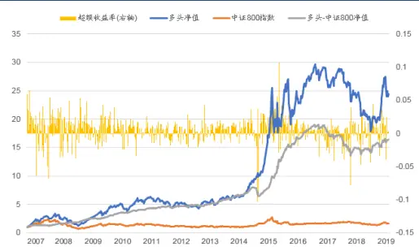
数据来源：广发证券发展研究中心

图：因子在中证 500中选股表现
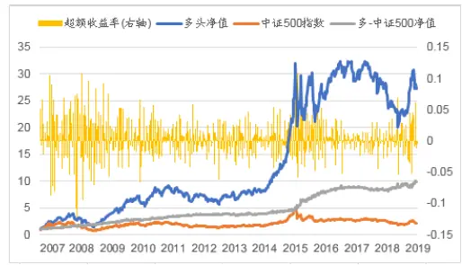
数据来源：广发证券发展研究中心

[分析师：Table_Author]陈原文

同SAC 执证号：S0260517080003

0755-82797057

chenyuanwen@gf.com.cn

分析师： 罗军

SAC 执证号：S0260511010004

020-66335128

luojun@gf.com.cn

分析师： 安宁宁

SAC 执证号：S0260512020003

SFC CE No. BNW179

0755-23948352

anningning@gf.com.cn

请注意，陈原文,罗军并非香港证券及期货事务监察委员会的注册持牌人，不可在香港从事受监管活动。

## [Table_ 相关研究：DocRe

A 股负 ALPHA 因子策略:—2019-08-12—转融通选股系列之一

大类资产配置中的均值回复2019-08-05
应用:量化资产配置研究之十
五

## 一、 引言

传统的多因子选股策略在国内市场上广泛应用，在过去几年中传统的多因子选股策略在实际运作中取得了较为稳定的超额收益率。在国内市场中，传统的多因子选股框架中，从2007年开始，较为有效的因子主要是反转类以及小市值类的因子。在传统的多因子研究框架中，对因子的挖掘主要集中于上市公司财务报表、分析师预期相关数据以及相对频率较低的价量数据（如开盘价、收盘价、成交额等日频、周频相关的数据维度），调仓的频率也往往集中于月度频率等相对低频的调仓频率。

图 1：广发金融工程多因子选股框架一览
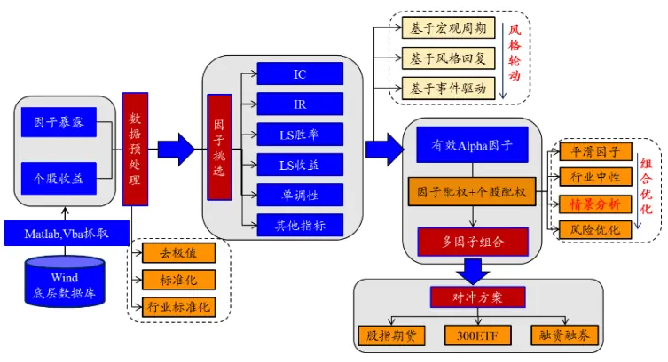
数据来源：广发证券发展研究中心

图 2：广发金融工程多因子选股平台一览
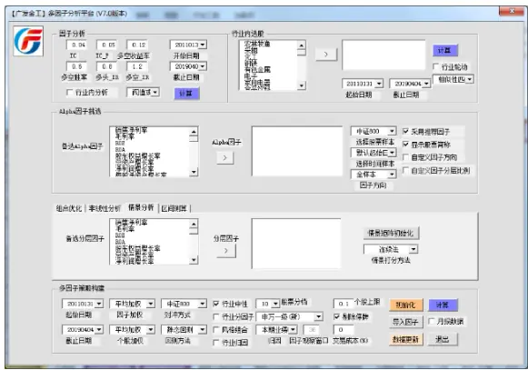
数据来源：广发证券发展研究中心

图 3：广发金融工程多因子选股平台框架一览
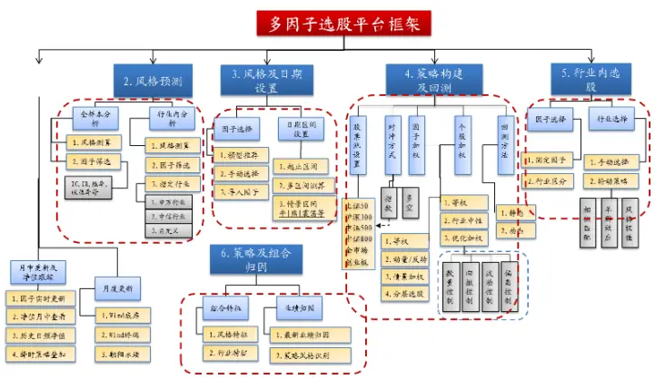
数据来源：广发证券发展研究中心

随着国内市场中对传统多因子选股的应用越来越广泛，以往有效的因子逐渐失效，而且对中低频率价量相关的数据以及财务报表等数据的因子挖掘已经逐渐饱和，已有的数据维度上增量价值信息有限，很难再在当前维度的数据中挖掘出持续有效的新维度的因子，对新的因子的挖掘提出了迫切的需求。同时，在国内市场中，由于小市值效应的长期较为显著的影响，传统的多因子选股策略往往受其影响，如在2017年，市场的风格较以往几年发生了急剧的变化，风格上主要集中于价值蓝筹类个股，传统的反转类、市值类等因子指标失效，市场上的传统多因子选股策略产品经历了较大的回撤。

图 4：全市场三个月股价反转因子历史多空收益率表现一览
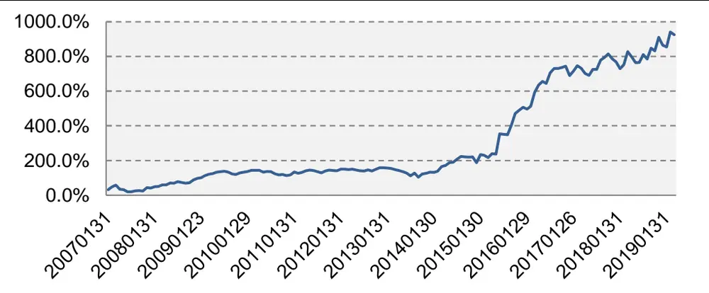
数据来源：广发证券发展研究中心

图 5：全市场三个月股价反转因子IC表现一览
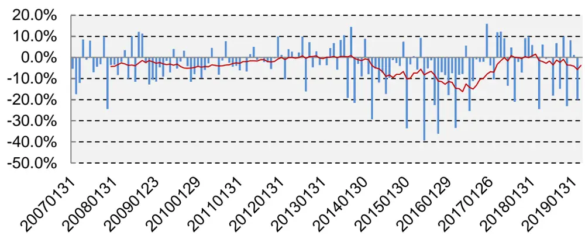
数据来源：广发证券发展研究中心

图 6：全市场流通市值因子历史多空收益率表现一览
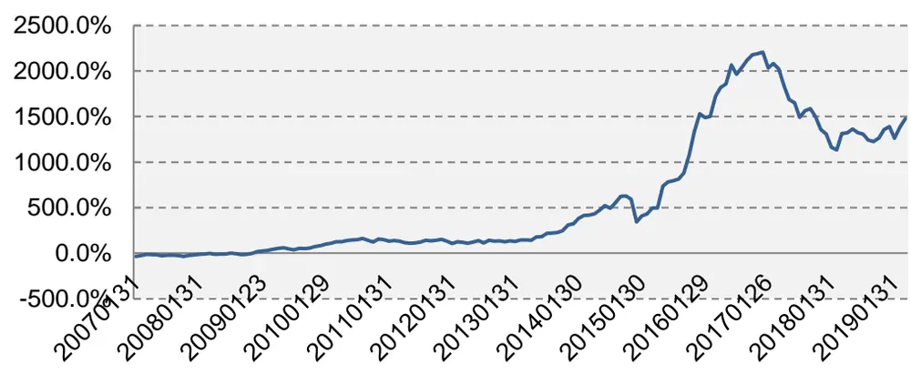
数据来源：广发证券发展研究中心

图 7：全市场流通市值因子IC表现一览
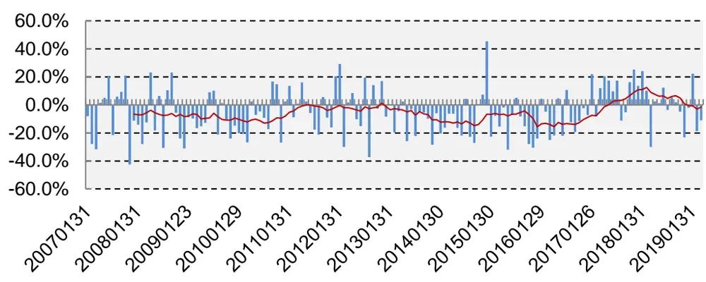
数据来源：广发证券发展研究中心

传统的多因子选股框架在因子指标维度上需要进一步丰富和扩展，挖掘出新的有效的因子指标，从当前可切入的数据维度上看，新的因子指标的挖掘主要集中在两大方向，一块为对另类数据的因子指标挖掘，如对股吧、社交媒体、搜索引擎、新闻等另类数据的挖掘，关于另类数据在市场的应用，可以参考广发证券金融工程相关的系列研究成果；第二块为对高频价量相关的数据的因子指标挖掘，如对个股日内盘口数据、日内分钟、秒钟等级别的价量数据的因子挖掘。本篇专题报告将从第二个方向的角度出发，利用个股日内高频的相关数据进行因子指标的挖掘研究。本篇专题报告是关于高频数据因子研究的第二篇，第一篇请见《基于日内高频数据的短周期选股因子研究-高频数据因子研究系列一》

表 1：广发金融工程大数据研究报告一览

| 基于网络新闻热度的择时策略一互联网大数据挖掘系列之一 公告披露背后隐藏的投资机会一互联网大数据挖掘系列之二 倾听股吧之声，洞察大盘趋势一互联网大数据挖掘系列之三 那些年一起追过的财经小编选股策略一互联网财经频道文本挖掘策略 基于互联网挖掘的热点选股策略一互联网大数据挖掘系列之五 基于大数据挖掘的关联个股投资机会一互联网大数据挖掘系列之六 |
| --- |

数据来源：广发证券发展研究中心

## 二、 因子构建

在个股高频数据中，主要包括开盘价、收盘价、最高价、最低价、成交量、成交额等指标以及分笔的盘口相关的数据。本篇专题报告主要是对个股的分钟级别的成交相关的数据进行因子挖掘，希望能从中挖掘出有效的因子指标。

具体因子指标构建如下：

- 对于每个个股在交易日t，首先计算个股在特定分钟频率下第i个的收益率$r_{t,i},~r_{t,i}=p_{t,i}-p_{t,i-1}$ ，其中 $p_{t,i}$ 表示在交易日t，个股在第i个特定分钟频率下的对数价格， $p_{t,i-1}$ 表示在交易日t，个股在第i−1个特定分钟频率下的对数价格。

对于每个个股，根据 ${\boldsymbol{r}}_{t,i}$ 分别计算个股在交易日t下的已实现方差（Realized Variance） $RDVar_{t}$ 、已实现波动率（Realized Volatility）$RDVol_{t}$ 、已实现偏度（Realized Skewness）RDSkew ，已实现峰度（Realized kurtosis）RDKurtt。其中：

$$
RDVar_{t}=\sum_{i=1}^{N}r_{t,\mathrm{i}}^{2}
$$

$$
RDVol_{t}=(RDVar_{t})^{1/2}
$$

$$
RDSkew_{t}=\frac{\sqrt{N}\sum_{I=1}^{N}r_{t.\mathrm{i}}^{3}}{RDVar_{t}^{3/2}}
$$

$$
RDKurt_{t}=\frac{N\sum_{i=1}^{N}r_{t,i}^{4}}{RDVar_{t}^{2}}
$$

N表示个股在交易日t中特定频率的分钟级别数据个数，如在5分钟级别下，交易日t下共有的数据个数N为 $48(60^{\star}4/5{=}48)$ ），在1分钟级别下，交易日t下共有的数据个数N为 $240(60^{\star}4/1{=}240)$

- 对于每个个股，在交易日t计算以上三个变量的每日变化量 $\Delta Vol_{t}$ $\varDelta Skew_{t}\cdot\varDelta Kurt_{t}$ ，其中：

$$
\Delta Vol_{t}=\ RDVol_{t}\ -\ RDVol_{t-1}
$$

$$
\varDelta Skew_{t}=\ RDSkew_{t}\ -RDSkew_{t-1}
$$

$$
\Delta Kurt_{t}=\ RDKurt_{t}\ -\ RDKurt_{t-1}
$$

- 将以上计算所得数据，代入以下回归模型：

$$
\begin{array}{r}{r_{i,t}=\alpha^{i}+\beta_{MKT}^{i}r_{m,t}+\beta_{\Delta voL}^{i}\Delta Vol_{t}+\beta_{\Delta SKEW}^{i}\Delta Skew_{t}+\beta_{\Delta KURT}^{i}\Delta Kurt_{t}+\varepsilon_{i,t}}\end{array}
$$

以个股过去一段时间的时间序列做回归后，取所得残差标准差，以其作为个股的指标，分析此指标对个股收益率区分度的有效性。

## 三、 实证分析

## 数据说明

- 样本区间：2007年1月1日至2019年6月18日（以下如无特别说明，2019年至今指的是2019年1月1日至2019年6月18日）

- 样本范围：全市场个股、中证500历史成分股

- 数据频率：个股每个交易日1分钟频率的收盘价、成交量、成交额等数据

## 策略构建

- 实证区间：2007年1月1日至2019年6月18日

- 选股范围：全市场、中证500历史成分股，剔除上市不满一年的股票，剔除ST股票、*ST股票，剔除交易日停牌的股票

- 分档方式：根据当期个股计算的因子值：回归模型中残差的标准差，从小到大分为5档

- 调仓周期：周频换仓，Q1档为因子值最小的，Q5档为因子值最大的。

- 参数说明：N=240，当样本为全市场个股时，市场收益率 $\cdot r_{m,t}$ 为上证综指涨跌幅数据，同理，当样本为中证500历史成分股时，市场收益率 ${\cdot}r_{m,t}$ 为中证500股指涨跌幅数据。

## 实证分析—全市场、中证 500 因子选股分档表现

以下分别统计全市场个股，以及中证500指数历史成分股计算得到的回归模型的残差标准差，在回测期内的分档表现结果。

在选股分档时，对于全市场个股和中证500历史成分股，都做了剔除因子极端值等常见的处理方式。

图8：残差标准差对全市场选股分档表现
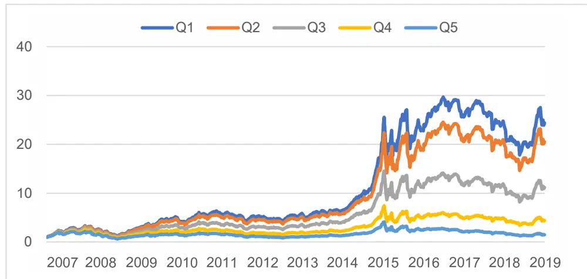
数据来源：广发证券发展研究中心

从图8结果中可以看出，在周频调仓频率的结果下，残差标准差作为因子指标，在全市场中的分档明显，对个股收益率区分度较强，分档收益在单调性结果上显著。

其次观察残差标准差作为因子指标，在中证500指数成分股中的分档表现。

图9：中证500指数成分股中因子指标选股分档表现
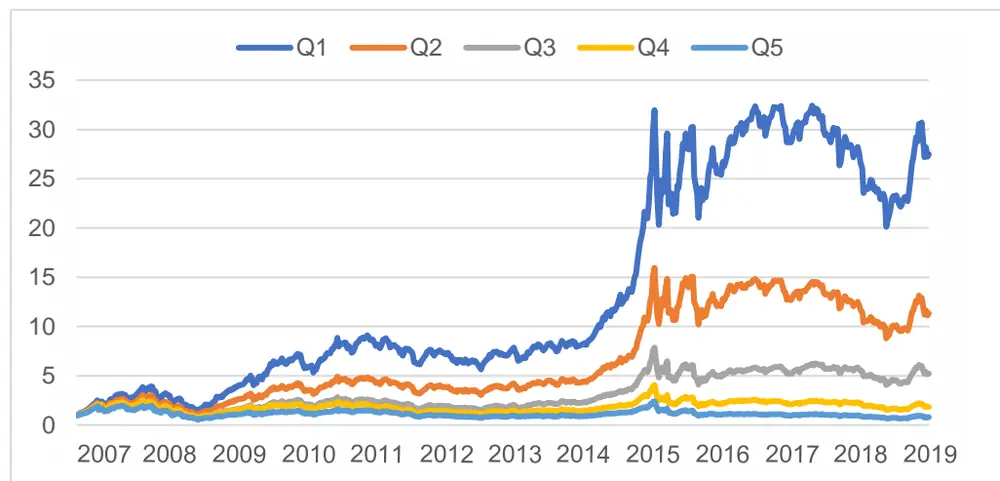
数据来源：广发证券发展研究中心

从图9结果中可以看出，在周频调仓的结果下，因子指标在中证500成分股中的分档收益表现明显，对个股收益率区分度明显，分档收益在单调性结果上显著。

从上图8及图9中因子指标在全市场及中证500指数成分股中的回测表现中可以看出，因子指标在全市场及中证500样本池中对个股的收益率区分度，分档收益率单调性显著，以下详细测算因子指标在全市场及中证500成分股中的表现。

## 实证分析—全市场选股

表 2：全市场选股-IC表现

| 范围 | IC 均值 | IC 标准差 | IC最小值 | IC最大值 | 负IC占比 |
| --- | --- | --- | --- | --- | --- |
| 全市场 | -0.036 | 0.130 | -0.410 | 0.351 | 63.5% |

数据来源：天软，Wind，广发证券发展研究中心

图10：全市场选股IC值走势一览
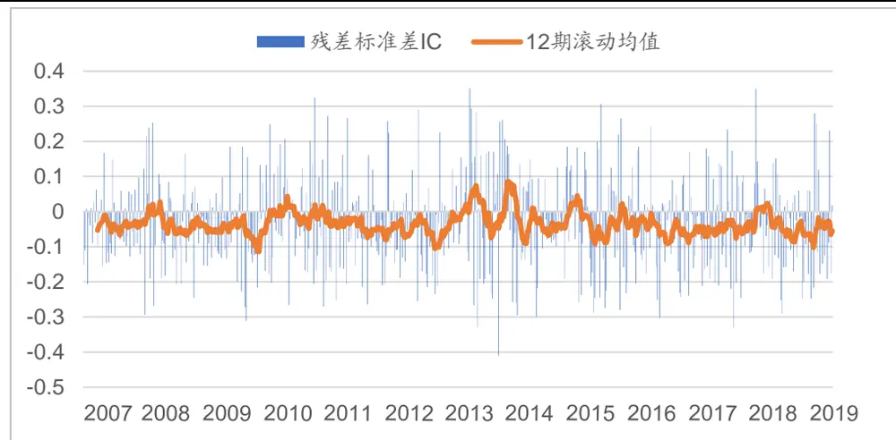
数据来源：广发证券发展研究中心

表 3：全市场选股-IC分年度表现一览

| 分年度统计 | IC 均值 | IC 标准差 | IC最小值 | IC最大值 | 负IC占比 |
| --- | --- | --- | --- | --- | --- |
| 2007 | -0.043 | 0.082 | -0.207 | 0.168 | 69.57% |
| 2008 | -0.031 | 0.123 | -0.293 | 0.253 | 61.22% |
| 2009 | -0.053 | 0.108 | -0.311 | 0.186 | 71.43% |
| 2010 | -0.005 | 0.131 | -0.267 | 0.326 | 54.17% |
| 2011 | -0.049 | 0.123 | -0.27 | 0.273 | 67.35% |
| 2012 | -0.050 | 0.123 | -0.255 | 0.29 | 77.08% |
| 2013 | 0.002 | 0.168 | -0.41 | 0.351 | 52.08% |
| 2014 | -0.032 | 0.124 | -0.299 | 0.206 | 61.22% |
| 2015 | -0.026 | 0.16 | -0.288 | 0.308 | 53.06% |
| 2016 | -0.050 | 0.118 | -0.302 | 0.242 | 63.27% |
| 2017 | -0.046 | 0.133 | -0.331 | 0.234 | 67.35% |
| 2018 | -0.042 | 0.121 | -0.29 | 0.35 | 63.27% |
| 2019至今 | -0.039 | 0.157 | -0.248 | 0.279 | 68.42% |

数据来源：天软，Wind，广发证券发展研究中心

从表2、表3以及图10的结果可以看出，因子指标从2007年开始至今IC均值为-0.036，标准差为0.130，在周频调仓的情况下，负IC占比为63.5%。在滚动12期IC的均值也基本上处以零以下的位置，分年度统计中，每一年度的IC均值均为负，且在分年度统计中可以看出，每一年负IC占比都在50%以上， 2013年负IC占比较低，为52.08%。

表 4：全市场选股-分年度换手率统计

| 分年度统计 | 均值 | 最大值 | 最小值 | 标准差 | 累计值 |
| --- | --- | --- | --- | --- | --- |
| 2007 | 81.51% | 91.80% | 71.86% | 3.30% | 3668.00% |
| 2008 | 81.72% | 94.58% | 68.63% | 4.80% | 4004.00% |
| 2009 | 80.28% | 87.12% | 68.42% | 3.50% | 3934.00% |
| 2010 | 79.15% | 85.49% | 69.67% | 3.50% | 3799.00% |
| 2011 | 79.09% | 84.62% | 68.03% | 3.90% | 3875.00% |
| 2012 | 78.62% | 85.34% | 69.35% | 3.40% | 3774.00% |
| 2013 | 79.89% | 85.71% | 72.84% | 2.80% | 3835.00% |
| 2014 | 81.52% | 87.92% | 69.02% | 3.10% | 3995.00% |
| 2015 | 84.63% | 99.38% | 74.80% | 4.70% | 4147.00% |
| 2016 | 81.85% | 91.87% | 69.84% | 4.20% | 4011.00% |
| 2017 | 80.91% | 87.75% | 72.69% | 3.30% | 3883.00% |
| 2018 | 81.56% | 87.38% | 76.92% | 2.30% | 3992.00% |
| 2019至今 | 80.97% | 85.19% | 72.56% | 2.50% | 1539.00% |
| All | 80.89% | 99.38% | 68.03% | 3.90% | 48455.00% |

数据来源：天软，Wind，广发证券发展研究中心
注：表中累计值指的是区间内组合每期换手率累计值

图11：全市场选股多-空策略净值走势表现一览
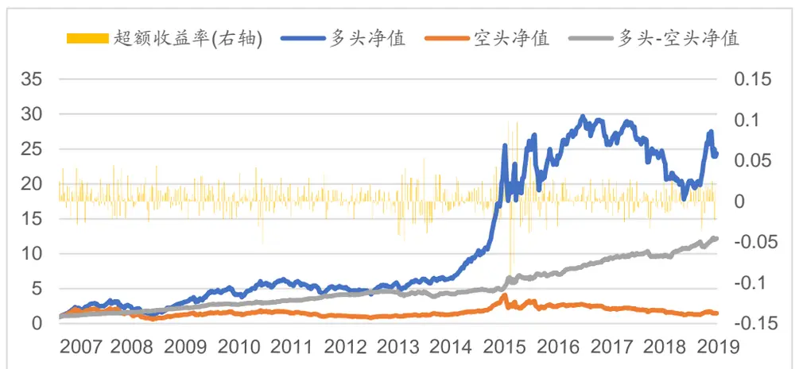
数据来源：广发证券发展研究中心

表 5：全市场多-空分年度表现一览

| 多头 |  |  |  |  |  |  | 多空 |  |  |  |
| --- | --- | --- | --- | --- | --- | --- | --- | --- | --- | --- |
| 年度 | 累计收益率 | 最大回 撤 | 年化收益 率 | 年化波动率 | 信息比 | 累计收益率 | 最大回撤 | 年化收益率 | 年化波动率 | 信息比 |
| 2007 | 219.77% | 18.28% | 236.35% | 37.55% | 6.294 | 46.47% | 2.82% | 48.92% | 10.03% | 4.876 |
| 2008 | -49.91% | 63.45% | -49.20% | 52.23% | -0.942 | 29.58% | 3.75% | 28.90% | 11.57% | 2.497 |
| 2009 | 155.13% | 19.08% | 150.30% | 35.46% | 4.239 | 38.40% | 2.54% | 37.49% | 8.41% | 4.457 |
| 2010 | 17.01% | 26.88% | 17.01% | 29.00% | 0.586 | 8.51% | 7.19% | 8.51% | 11.82% | 0.72 |
| 2011 | -20.75% | 31.52% | -20.37% | 23.10% | -0.882 | 26.01% | 2.50% | 25.41% | 7.72% | 3.292 |
| 2012 | 13.58% | 21.60% | 13.58% | 21.46% | 0.633 | 14.69% | 3.30% | 14.69% | 7.49% | 1.961 |
| 2013 | 20.66% | 17.37% | 20.66% | 20.64% | 1.001 | -6.05% | 14.70% | -6.05% | 15.22% | -0.397 |
| 2014 | 79.02% | 6.39% | 76.90% | 19.08% | 4.03 | 19.95% | 7.12% | 19.50% | 10.36% | 1.882 |
| 2015 | 124.95% | 31.14% | 121.26% | 51.79% | 2.341 | 40.90% | 11.74% | 39.92% | 26.05% | 1.532 |
| 2016 | 30.52% | 29.45% | 29.82% | 22.78% | 1.309 | 18.73% | 5.79% | 18.32% | 9.51% | 1.926 |
| 2017 | -2.33% | 12.22% | -2.33% | 15.05% | -0.158 | 14.42% | 2.60% | 14.42% | 9.18% | 1.571 |
| 2018 | -26.25% | 33.12% | -25.79% | 23.26% | -1.109 | 13.41% | 8.08% | 13.12% | 8.89% | 1.476 |
| 2019 | 20.58% | 13.07% | 60.43% | 27.44% | 2.203 | 8.03% | 6.75% | 21.54% | 12.04% | 1.789 |
| 至今 整体 | 2370.18% | 64.98% | 29.25% | 32.39% | 0.903 | 1088.48% | 17.54% | 21.90% | 12.49% | 1.754 |

数据来源：天软，Wind，广发证券发展研究中心

从图11、表5的结果中可以看出，多头组合策略整体的年化收益率29.25%，多头组合相对空头组合在回测中取得了年化21.90%的收益率，信息比率为1.754，策略的最大回撤17.54%。

图12：全市场选股多-中证800策略净值走势表现一览
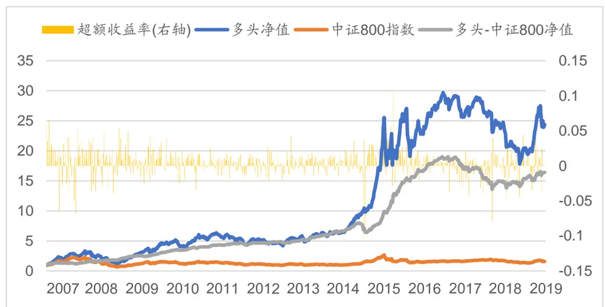
数据来源：广发证券发展研究中心

表 6：全市场多-中证800分年度表现一览

| 多头 |  |  |  |  |  |  | 多-中证800表现 |  |  |  |
| --- | --- | --- | --- | --- | --- | --- | --- | --- | --- | --- |
| 年度 | 累计收益率 | 最大回 撤 | 年化收益 率 | 年化波动率 | 信息比 | 累计收益率 | 最大回撤 | 年化收益率 | 年化波动率 | 信息比 |
| 2007 | 219.77% | 18.28% | 236.35% | 37.55% | 6.294 | 33.79% | 15.25% | 35.49% | 19.23% | 1.846 |
| 2008 | -49.91% | 63.45% | -49.20% | 52.23% | -0.942 | 49.69% | 6.26% | 48.46% | 14.79% | 3.277 |
| 2009 | 155.13% | 19.08% | 150.30% | 35.46% | 4.239 | 39.45% | 5.64% | 38.50% | 11.07% | 3.478 |
| 2010 | 17.01% | 26.88% | 17.01% | 29.00% | 0.586 | 24.37% | 4.77% | 24.37% | 8.92% | 2.731 |
| 2011 | -20.75% | 31.52% | -20.37% | 23.10% | -0.882 | 8.90% | 6.70% | 8.71% | 6.93% | 1.258 |
| 2012 | 13.58% | 21.60% | 13.58% | 21.46% | 0.633 | 6.57% | 4.90% | 6.57% | 7.54% | 0.872 |
| 2013 | 20.66% | 17.37% | 20.66% | 20.64% | 1.001 | 26.03% | 2.67% | 26.03% | 7.36% | 3.536 |
| 2014 | 79.02% | 6.39% | 76.90% | 19.08% | 4.03 | 8.69% | 19.80% | 8.50% | 16.34% | 0.52 |
| 2015 | 124.95% | 31.14% | 121.26% | 51.79% | 2.341 | 132.61% | 2.87% | 128.64% | 17.03% | 7.552 |
| 2016 | 30.52% | 29.45% | 29.82% | 22.78% | 1.309 | 25.78% | 2.16% | 25.20% | 6.62% | 3.806 |
| 2017 | -2.33% | 12.22% | -2.33% | 15.05% | -0.158 | -17.13% | 20.45% | -17.13% | 10.63% | -1.611 |
| 2018 | -26.25% | 33.12% | -25.79% | 23.26% | -1.109 | 4.77% | 9.58% | 4.67% | 14.43% | 0.323 |
| 2019 至今 | 20.58% | 13.07% | 60.43% | 27.44% | 2.203 | 3.23% | 5.26% | 8.37% | 12.86% | 0.651 |
| 整体 | 2370.18% | 64.98% | 29.25% | 32.39% | 0.903 | 1450.03% | 28.55% | 24.52% | 13.01% | 1.885 |

数据来源：天软，Wind，广发证券发展研究中心

实证分析—中证 500 选股
表 7：中证500指数内选股-IC表现

| 范围 | IC 均值 | IC 标准差 | IC 最小值 | IC最大值 | 负IC占比 |
| --- | --- | --- | --- | --- | --- |
| 全市场 | -0.048 | 0.125 | -0.413 | 0.297 | 66.2% |

数据来源：天软，Wind，广发证券发展研究中心

图13：中证500样本池IC值走势一览
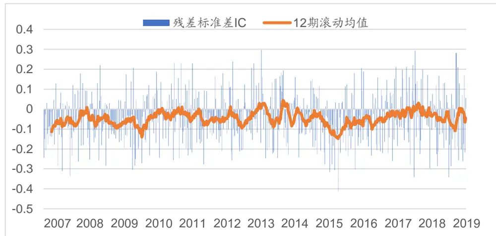
数据来源：广发证券发展研究中心

表 8：中证500选股-IC分年度表现一览

| 分年度统计 | IC 均值 | IC 标准差 | IC最小值 | IC 最大值 | 负IC占比 |
| --- | --- | --- | --- | --- | --- |
| 2007 | -0.076 | 0.107 | -0.335 | 0.129 | 71.74% |
| 2008 | -0.044 | 0.117 | -0.283 | 0.222 | 61.22% |
| 2009 | -0.077 | 0.108 | -0.304 | 0.207 | 79.59% |
| 2010 | -0.023 | 0.111 | -0.255 | 0.231 | 62.50% |
| 2011 | -0.047 | 0.118 | -0.278 | 0.232 | 67.35% |
| 2012 | -0.048 | 0.118 | -0.258 | 0.239 | 68.75% |
| 2013 | -0.024 | 0.133 | -0.248 | 0.297 | 62.50% |
| 2014 | -0.031 | 0.11 | -0.243 | 0.195 | 65.31% |
| 2015 | -0.093 | 0.121 | -0.413 | 0.124 | 75.51% |
| 2016 | -0.057 | 0.119 | -0.303 | 0.205 | 71.43% |
| 2017 | -0.010 | 0.144 | -0.341 | 0.292 | 53.06% |
| 2018 | -0.049 | 0.131 | -0.342 | 0.198 | 59.18% |
| 2019 至今 | -0.027 | 0.176 | -0.261 | 0.282 | 57.89% |

数据来源：天软，Wind，广发证券发展研究中心

从表7、表8以及图13的结果可以看出，残差标准差作为因子指标，在中证500指数成分股中选股，从2007年开始至今IC均值为-0.048，标准差为0.125，在周频调仓的情况下，负IC占比为66.2%。在滚动12期IC的均值也基本上处以零以下的位置，分年度统计中，大部分年度IC均值均为负，且在分年度统计中可以看出，大部分年度负IC占比基本上在60%以上。

图14：中证500指数成分股因子选股多-空策略净值走势表现
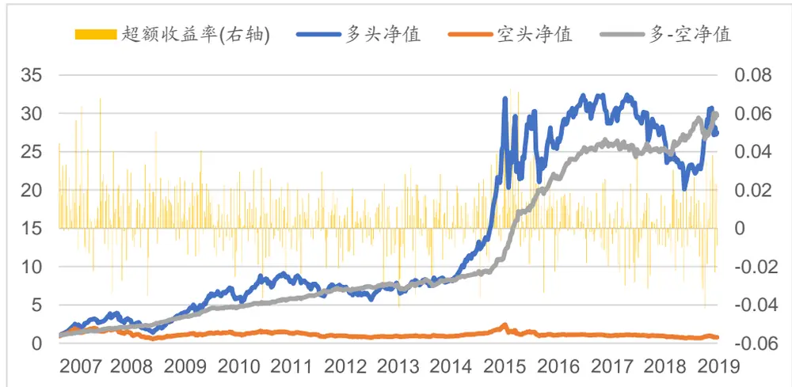
数据来源：广发证券发展研究中心

表 9：中证500数成分股因子选股多-空策略分年度表现

| 年度 | 累计收益率 | 最大回撤 | 年化波动率 | 年化收益率 | 信息比 |
| --- | --- | --- | --- | --- | --- |
| 2007 | 83.91% | 2.64% | 13.47% | 88.84% | 6.596 |
| 2008 | 43.09% | 4.99% | 11.75% | 42.05% | 3.579 |
| 2009 | 61.43% | 2.34% | 8.45% | 59.86% | 7.085 |
| 2010 | 14.26% | 3.82% | 9.99% | 14.26% | 1.427 |
| 2011 | 27.11% | 2.39% | 7.99% | 26.49% | 3.315 |
| 2012 | 6.04% | 4.71% | 7.24% | 6.04% | 0.834 |
| 2013 | 9.57% | 10.14% | 11.26% | 9.57% | 0.85 |
| 2014 | 14.31% | 6.43% | 9.17% | 14.00% | 1.526 |
| 2015 | 104.44% | 2.65% | 15.23% | 101.48% | 6.664 |
| 2016 | 30.26% | 3.36% | 8.31% | 29.56% | 3.556 |
| 2017 | -2.75% | 8.60% | 9.95% | -2.75% | -0.276 |
| 2018 | 15.35% | 5.59% | 9.61% | 15.01% | 1.562 |
| 2019 至今 | 2.61% | 9.44% | 15.72% | 6.74% | 0.429 |
| 整体 | 2749.14% | 10.14% | 11.15% | 30.73% | 2.756 |

数据来源：天软，Wind，广发证券发展研究中心

从图14以及表9的结果中可以看出，多空策略整体的年化收益率为30.73%，信息比率为2.756。分年度看，多空策略在历史上大部分年度都取得了正的收益率。

图15：中证500指数成分股因子选股多-中证500策略净值走势表现一览
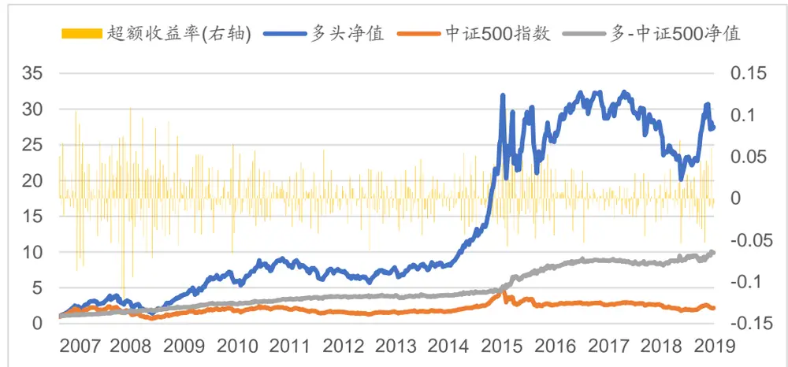
数据来源：广发证券发展研究中心

在中证500选股回测中，多头组合相对中证500指数整体的年化超额收益率为19.65%，信息比率为0.959，换手率均值在50%左右，策略最大回撤为策略的16.39%。

表 10：中证500选股多头-500策略分年度表现一览

| 多头表现 |  |  |  |  |  |  | 多-中证500 表现 |  |  |  |
| --- | --- | --- | --- | --- | --- | --- | --- | --- | --- | --- |
| 年度 | 累计收益 率 | 最大回撤 | 年化收益 率 | 年化波动 率 | 信息比 | 累计收益 率 | 最大回撤 | 年化收益 率 | 年化波动 率 | 信息比 |
| 2007 | 264.47% | 19.18% | 285.56% | 38.57% | 7.403 | 36.15% | 10.15% | 37.99% | 27.26% | 1.394 |
| 2008 | -46.58% | 64.58% | -45.89% | 55.91% | -0.821 | 29.54% | 16.39% | 28.86% | 36.10% | 0.8 |
| 2009 | 186.07% | 19.84% | 180.00% | 37.69% | 4.776 | 34.61% | 6.16% | 33.79% | 21.63% | 1.562 |
| 2010 | 18.46% | 26.48% | 18.46% | 31.11% | 0.593 | 13.16% | 6.92% | 13.16% | 18.41% | 0.715 |
| 2011 | -20.85% | 31.85% | -20.48% | 24.81% | -0.825 | 11.43% | 4.71% | 11.18% | 13.41% | 0.834 |
| 2012 | 8.15% | 26.02% | 8.15% | 22.36% | 0.364 | 7.61% | 6.22% | 7.61% | 13.72% | 0.555 |
| 2013 | 14.79% | 17.51% | 14.79% | 21.03% | 0.703 | 3.05% | 9.90% | 3.05% | 15.18% | 0.201 |
| 2014 | 73.40% | 7.24% | 71.46% | 20.26% | 3.528 | 16.20% | 4.83% | 15.84% | 14.26% | 1.111 |
| 2015 | 96.17% | 36.50% | 93.49% | 56.33% | 1.66 | 61.62% | 7.48% | 60.04% | 26.72% | 2.247 |
| 2016 | 28.91% | 30.50% | 28.24% | 23.67% | 1.193 | 17.79% | 6.43% | 17.40% | 17.89% | 0.972 |
| 2017 | 0.52% | 11.45% | 0.52% | 15.19% | 0.034 | -4.36% | 8.09% | -4.36% | 7.74% | -0.563 |
| 2018 | -25.93% | 33.31% | -25.47% | 24.16% | -1.054 | 9.83% | 7.57% | 9.62% | 14.40% | 0.668 |
| 2019 | 19.93% | 11.52% | 58.27% | 25.01% | 2.33 | 3.84% | 8.34% | 10.00% | 21.67% | 0.461 |
| 至今 整体 | 2640.48% | 64.58% | 30.32% | 34.21% | 0.886 | 841.95% | 16.39% | 19.65% | 20.49% | 0.959 |

数据来源：天软，Wind，广发证券发展研究中心

表 11：中证500成分股选股分年度换手率统计一览

| 分年度统计 | 均值 | 最小值 | 最大值 | 标准差 | 累计值 |
| --- | --- | --- | --- | --- | --- |
| 2007 | 56.98% | 4.30% | 73.00% | 94.70% | 3946.10% |
| 2008 | 56.44% | 3.90% | 75.30% | 91.70% | 4074.70% |
| 2009 | 54.80% | 3.70% | 73.70% | 92.80% | 4106.10% |
| 2010 | 53.81% | 3.80% | 71.60% | 89.50% | 3911.60% |
| 2011 | 50.98% | 4.60% | 73.30% | 92.90% | 4032.00% |
| 2012 | 48.54% | 4.10% | 69.70% | 91.90% | 3950.30% |
| 2013 | 48.60% | 4.00% | 68.90% | 87.00% | 3749.10% |
| 2014 | 49.01% | 5.20% | 64.50% | 91.80% | 3930.80% |
| 2015 | 59.05% | 3.90% | 77.10% | 93.10% | 4115.70% |
| 2016 | 50.09% | 4.50% | 68.10% | 89.00% | 3986.40% |
| 2017 | 46.09% | 5.50% | 67.60% | 93.30% | 3878.40% |
| 2018 | 46.70% | 5.40% | 67.60% | 92.00% | 3810.50% |
| 2019至今 | 49.22% | 6.10% | 73.10% | 89.70% | 873.70% |
| 整体 | 51.65% | 4.80% | 64.50% | 94.70% | 48365.30% |

数据来源：天软，Wind，广发证券发展研究中心
注：表中累计值指的是区间内组合每期换手率累计值

## 四、 总结

传统的多因子选股策略在国内市场上广泛应用，但最近几年随着市场风格的变换，历史上长期有效的因子逐渐失效，在传统数据维度中对因子的挖掘已逐渐饱和，因此对新因子的挖掘提出了迫切的需求。本篇专题报告从个股日内高频的数据出发，尝试从个股高频数据中挖掘新的因子指标，得到结论：

1. 在全市场以及中证500成分股中，详细测算了回归模型的残差标准差作为因子指标的选股效果，实证结果表明，指标在周频换仓的情况下对个股收益率区分度较高，且分档收益单调性明显；

2. 因子指标在全市场中选股，从2007年至今，IC均值为-0.036，负IC占比为63.5%，多头组合在回测期内年化收益率为32.39%，信息比率为0.91；多头组合相对中证800指数年化超额收益率为24.52%，信息比率为1.89；

3. 因子指标在中证500成分股中选股，从2007年至今，IC均值为-0.048，负IC占比为66.2%，多头组合年化收益率为30.32%，多头组合相对空头组合年化超额收益率为30.73%，信息比率为2.76。

## 五、 风险提示

本报告旨在对所研究问题的主要关注点进行分析，因此对市场及相关交易做了一些合理假设，但这样可能会导致基于模型所得出的结论并不能完全准确地刻画现实环境，在此可能会与未来真实的情况出现偏差。本报告内容并不是适合所有的投资者，客户在制定投资策略时，必须结合自身的环境和投资理念。

## 广发金融工程研究小组

罗军 ：首席分析师，华南理工大学硕士，从业 14年，2010年进入广发证券发展研究中心。

安 宁 宁 ：联席首席分析师，暨南大学硕士，从业 12年，2011年进入广发证券发展研究中心。

史 庆 盛 ：资深分析师，华南理工大学硕士，从业 8年，2011年进入广发证券发展研究中心。

马 普 凡 ：资深分析师，英国拉夫堡大学硕士，从业 9年，2014年进入广发证券发展研究中心。

张 超 ： 资深分析师，中山大学硕士，从业 7 年，2012 年进入广发证券发展研究中心。

文 巧 钧 ：资深分析师，浙江大学博士，从业 4年，2015年进入广发证券发展研究中心。

陈 原 文 ：资深分析师，中山大学硕士，从业 4年，2015年进入广发证券发展研究中心。

樊 瑞 铎 ：资深分析师，南开大学硕士，从业 4年，2015年进入广发证券发展研究中心。

李豪 ：资深分析师，上海交通大学硕士，从业 3年，2016年进入广发证券发展研究中心。

郭 圳 滨 ：研究助理，中山大学硕士， 2018年进入广发证券发展研究中心。

童 炯 潇 ：研究助理，香港大学硕士， 2018年进入广发证券发展研究中心。

## [Table_IndustryInvestDescription] 广发证券—行业投资评级说明

买入： 预期未来12个月内，股价表现强于大盘10%以上。

持有： 预期未来 12 个月内，股价相对大盘的变动幅度介于-10%～+10%。

卖出： 预期未来12个月内，股价表现弱于大盘10%以上。

## [Table_CompanyInvestDescription] 广发证券—公司投资评级说明

买入： 预期未来12个月内，股价表现强于大盘15%以上。

增持： 预期未来12个月内，股价表现强于大盘5%-15%。

持有： 预期未来 12 个月内，股价相对大盘的变动幅度介于-5%～+5%。

卖出： 预期未来12个月内，股价表现弱于大盘5%以上。

## [Table_Address] 联系我们

| 地址 | 广州市 | 深圳市 深圳市福田区益田路 | 北京市 | 上海市 | 香港 |
| --- | --- | --- | --- | --- | --- |
|  | 广州市天河区马场路 26号广发证券大厦 |  | 北京市西城区月坛北 | 上海市浦东新区世纪 | 香港中环干诺道中 |
|  | 35楼 | 6001号太平金融大 厦31层 | 街2号月坛大厦18 层 | 大道8号国金中心一 | 111 号永安中心 14楼 |
|  |  | 518026 | 100045 | 期16楼 | 1401-1410 室 |
|  | 510627 |  |  | 200120 |  |
|  | gfyf@gf.com.cn |  |  |  |  |

## [法律主体 Table_LegalDisclaimer 声明]

本报告由广发证券股份有限公司或其关联机构制作，广发证券股份有限公司及其关联机构以下统称为“广发证券”。本报告的分销依据不同国家、地区的法律、法规和监管要求由广发证券于该国家或地区的具有相关合法合规经营资质的子公司/经营机构完成。

广发证券股份有限公司具备中国证监会批复的证券投资咨询业务资格，接受中国证监会监管，负责本报告于中国（港澳台地区除外）的分销。

广发证券（香港）经纪有限公司具备香港证监会批复的就证券提供意见（4 号牌照）的牌照，接受香港证监会监管，负责本报告于中国香港地区的分销。

本报告署名研究人员所持中国证券业协会注册分析师资质信息和香港证监会批复的牌照信息已于署名研究人员姓名处披露。

## [Table_I 重要mportant 声明N

广发证券股份有限公司及其关联机构可能与本报告中提及的公司寻求或正在建立业务关系，因此，投资者应当考虑广发证券股份有限公司及其关联机构因可能存在的潜在利益冲突而对本报告的独立性产生影响。投资者不应仅依据本报告内容作出任何投资决策。

本报告署名研究人员、联系人（以下均简称“研究人员”）针对本报告中相关公司或证券的研究分析内容，在此声明：（1）本报告的全部分析结论、研究观点均精确反映研究人员于本报告发出当日的关于相关公司或证券的所有个人观点，并不代表广发证券的立场；（2）研究人员的部分或全部的报酬无论在过去、现在还是将来均不会与本报告所述特定分析结论、研究观点具有直接或间接的联系。

研究人员制作本报告的报酬标准依据研究质量、客户评价、工作量等多种因素确定，其影响因素亦包括广发证券的整体经营收入，该等经营收入部分来源于广发证券的投资银行类业务。

本报告仅面向经广发证券授权使用的客户特定合作机构发送，不对外公开发布，只有接收人才可以使用，且对于接收人而言具有保密义务。广发证券并不因相关人员通过其他途径收到或阅读本报告而视其为广发证券的客户。在特定国家或地区传播或者发布本报告可能违反当地法律，广发证券并未采取任何行动以允许于该等国家或地区传播或者分销本报告。

本报告所提及证券可能不被允许在某些国家或地区内出售。请注意，投资涉及风险，证券价格可能会波动，因此投资回报可能会有所变化，过去的业绩并不保证未来的表现。本报告的内容、观点或建议并未考虑任何个别客户的具体投资目标、财务状况和特殊需求，不应被视为对特定客户关于特定证券或金融工具的投资建议。本报告发送给某客户是基于该客户被认为有能力独立评估投资风险、独立行使投资决策并独立承担相应风险。

本报告所载资料的来源及观点的出处皆被广发证券认为可靠，但广发证券不对其准确性、完整性做出任何保证。报告内容仅供参考，报告中的信息或所表达观点不构成所涉证券买卖的出价或询价。广发证券不对因使用本报告的内容而引致的损失承担任何责任，除非法律法规有明确规定。客户不应以本报告取代其独立判断或仅根据本报告做出决策，如有需要，应先咨询专业意见。

广发证券可发出其它与本报告所载信息不一致及有不同结论的报告。本报告反映研究人员的不同观点、见解及分析方法，并不代表广发证券的立场。广发证券的销售人员、交易员或其他专业人士可能以书面或口头形式，向其客户或自营交易部门提供与本报告观点相反的市场评论或交易策略，广发证券的自营交易部门亦可能会有与本报告观点不一致，甚至相反的投资策略。报告所载资料、意见及推测仅反映研究人员于发出本报告当日的判断，可随时更改且无需另行通告。广发证券或其证券研究报告业务的相关董事、高级职员、分析师和员工可能拥有本报告所提及证券的权益。在阅读本报告时，收件人应了解相关的权益披露（若有）。

本研究报告可能包括和/或描述/呈列期货合约价格的事实历史信息（“信息”）。请注意此信息仅供用作组成我们的研究方法/分析中的部分论点/依据/证据，以支持我们对所述相关行业/公司的观点的结论。在任何情况下，它并不（明示或暗示）与香港证监会第5类受规管活动（就期货合约提供意见）有关联或构成此活动。

## [Table_Interest 权益披露Disclosur

(1)广发证券（香港）跟本研究报告所述公司在过去12 个月内并没有任何投资银行业务的关系。

## [Table_Copyright]版权声明

未经广发证券事先书面许可，任何机构或个人不得以任何形式翻版、复制、刊登、转载和引用，否则由此造成的一切不良后果及法律责任由私自翻版、复制、刊登、转载和引用者承担。