# [Table_Title] 基于个股羊群效应的选股因子研究

## 高频数据因子研究系列三

## 报告摘要：

传统多因子选股。在国内 A 股市场，传统的多因子量化选股模型得到了广泛的应用，在实际表现中，传统的多因子模型在过去几年中也表现出较为稳定的超额收益率。但随着传统多因子模型应用越来越广泛，历史长期有效的因子逐渐失效，对新因子的挖掘提出了迫切的需求。

新因子挖掘。传统的因子指标挖掘主要集中于财务报表、个股中低频率的价量等相关的数据维度，而这部分数据维度的增量价值的挖掘已逐渐饱和，需从其他新的数据维度中挖掘新的因子指标，本篇报告从个股日内高频数据出发尝试挖掘出新的因子指标。

基于个股高频数据的因子构建。本篇专题结合个股在微观市场结构中的特征，采用LSV 模型刻画个股的羊群效应程度，其中利用个股日内高频交易明细区分主动买卖单，从而能够计算出特定股票买卖双方的相对强弱。

策略实证结果分析。在实证区间内，本篇专题报告对因子指标的有效性在不同股票样本池里进行了较为详细测算。实证结果表明，因子指标在全市场、中证 800 指数成分股、中证500 指数对个股收益率区分度较为明显，且分档收益单调性也较为明显。

在周频调仓下，因子指标在全市场范围内选股，从 2007 年至今IC 均值为 0.047， 正IC 占比为 69.90%。全市场多头组合在回测期内表现优异，对冲中证 500指数之后年化收益率为 24.61%，年化波动率为 9.30%，信息比率为 2.59。

利用LSV模型计算得到的因子经过去极值、中性化和标准化处理之后，策略结果得到改善。在周频调仓下，全市场多头组合对冲中证 500 指数之后的年化收益率为 24.98%，年化波动率为8.62%，信息比率为2.84。在沪深300 指数成分股内选股表现改善也较为明显。

核心假设风险。本文所做的数据测算完全基于过去数据的推演，市场未来环境可能发 生变化。投资者制定投资策略时，必须结合市场环境和自身投资理念。

图：因子在全市场选股表现
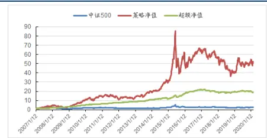
数据来源：Wind, 广发证券发展研究中心

图：因子在中证 500中选股表现
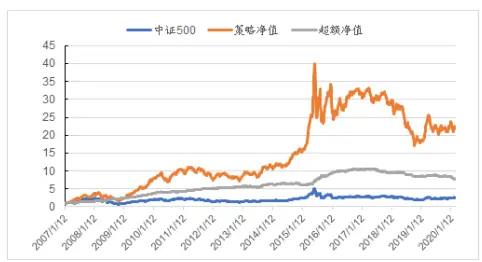
数据来源：Wind, 广发证券发展研究中心

[分析师：Table_Author]陈原文

同SAC 执证号：S0260517080003

公0755-82797057

chenyuanwen@gf.com.cn分析师： 罗军

同SAC 执证号：S0260511010004

020-66335128

luojun@gf.com.cn

分析师： 安宁宁

SAC 执证号：S0260512020003

SFC CE No. BNW179

0755-23948352

anningning@gf.com.cn

请注意，陈原文,罗军并非香港证券及期货事务监察委员会的注册持牌人，不可在香港从事受监管活动。

## [Table_ 相关研究：DocRe

基于日内高频数据的短周期2019-08-15选股因子研究-高频数据因子

研究系列二

基于日内高频数据的短周期2019-05-06选股因子研究-高频数据因子

研究系列一

## 一、引言

## （一）传统多因子研究

传统的多因子选股策略在国内市场上广泛应用，在过去几年中传统的多因子选股策略在实际运作中取得了较为稳定的超额收益率。在国内市场中，传统的多因子选股框架中，从2007年至今较为有效的因子主要是反转类以及市值类的因子。在传统的多因子研究框架中，对因子的挖掘主要集中于上市公司财务报表、分析师预期相关数据以及相对频率较低的价量数据（如开盘价、收盘价、成交额等日频、周频相关的数据维度），调仓的频率也往往集中于月度频率等相对低频的调仓频率。

图 1：广发金融工程多因子选股框架一览
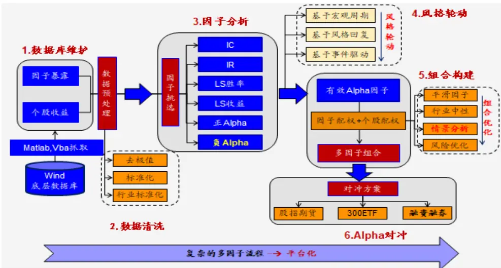
数据来源：广发证券发展研究中心

图 2：广发金融工程多因子选股平台一览
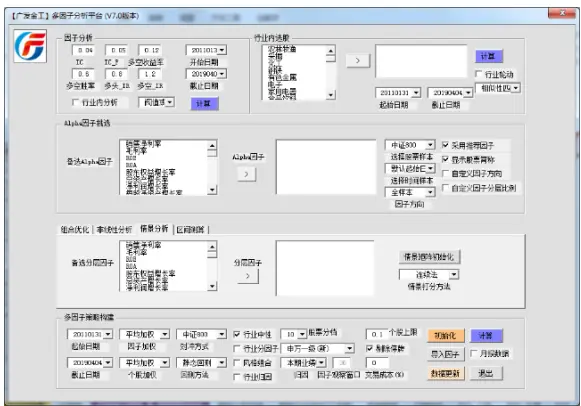
数据来源：广发证券发展研究中心

图 3：广发金融工程多因子选股平台框架一览
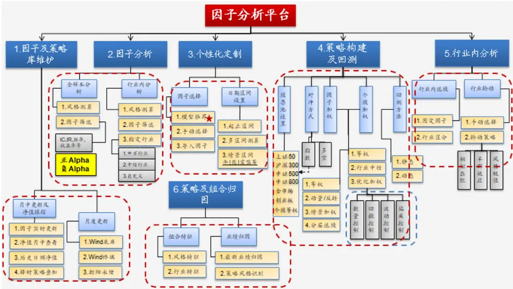
数据来源：广发证券发展研究中心

随着国内市场中对传统多因子选股的应用越来越广泛，以往有效的因子逐渐失效，而且对中低频率价量相关的数据以及财务报表等数据的因子挖掘已经逐渐饱和，已有的数据维度上增量价值信息有限，很难再在当前维度的数据中挖掘出持续有效的新维度的因子，对新的因子的挖掘提出了迫切的需求。同时，在国内市场中，由于小市值效应的长期较为显著的影响，传统的多因子选股策略往往受其影响，如在2017年，市场的风格较以往几年发生了急剧的变化，风格上主要集中于价值蓝筹类个股，传统的反转类、市值类等因子指标失效，市场上的传统多因子选股策略产品经历了较大的回撤。

图 4：全市场三个月股价反转因子历史多空收益率表现一览
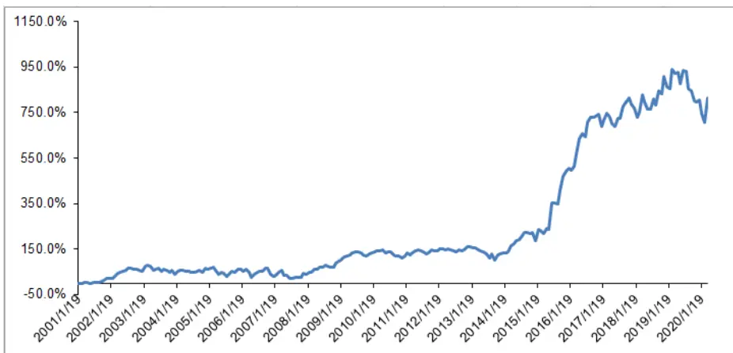
数据来源：广发证券发展研究中心

图 5：全市场三个月股价反转因子IC表现一览
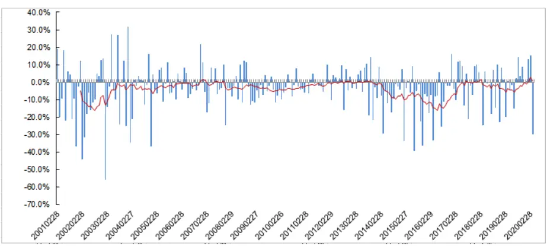
数据来源：广发证券发展研究中心

图 6：全市场流通市值因子历史多空收益率表现一览
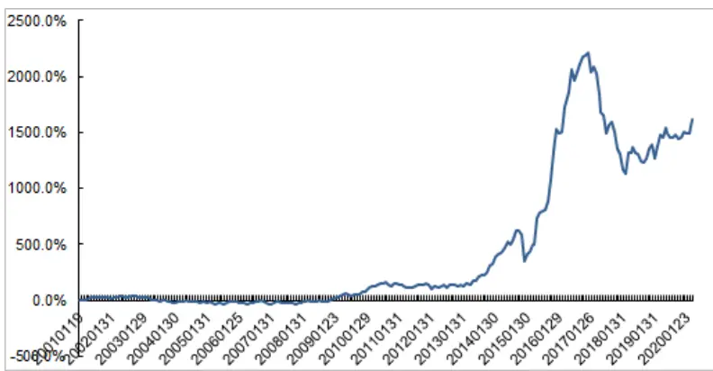
数据来源：广发证券发展研究中心

图 7：全市场流通市值因子IC表现一览
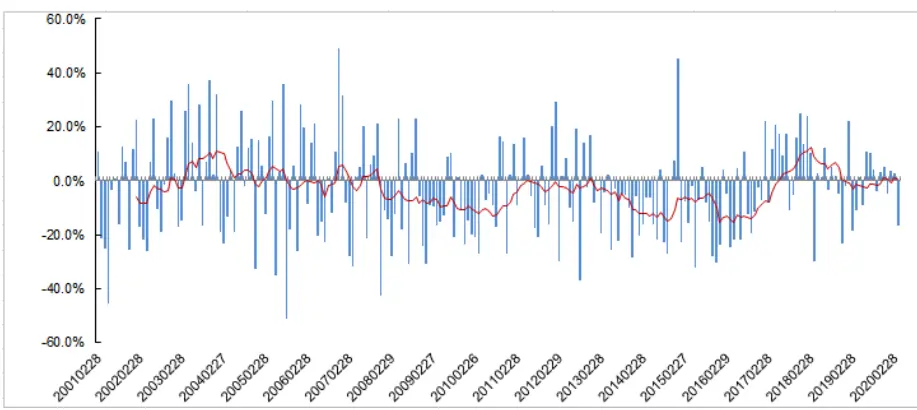
数据来源：广发证券发展研究中心

传统的多因子选股框架在因子指标维度上需要进一步丰富和扩展，挖掘出新的有效的因子指标，从当前可切入的数据维度上看，新的因子指标的挖掘主要集中在两大方向，一块为对另类数据的因子指标挖掘，如对股吧、社交媒体、搜索引擎、新闻等另类数据的挖掘，关于另类数据在市场的应用，可以参考广发证券金融工程相关的系列研究成果；第二块为对高频价量相关的数据的因子指标挖掘，如对个股日内盘口数据、日内分钟、秒钟等级别的价量数据的因子挖掘。本篇专题报告将从第二个方向的角度出发，利用个股日内高频的相关数据进行因子指标的挖掘研究。本篇专题报告是关于高频数据因子研究的第三篇，之前两篇请见《基于日内高频数据的短周期选股因子研究-高频数据因子研究系列一》、《基于日内高频数据的短周期选股因子研究-高频数据因子研究系列二》

表 1：广发金融工程大数据研究报告一览

| 基于网络新闻热度的择时策略一互联网大数据挖掘系列之一 公告披露背后隐藏的投资机会一互联网大数据挖掘系列之二 倾听股吧之声，洞察大盘趋势—互联网大数据挖掘系列之三 那些年一起追过的财经小编选股策略一互联网财经频道文本挖掘策略 基于互联网挖掘的热点选股策略一互联网大数据挖掘系列之五 基于大数据挖掘的关联个股投资机会一互联网大数据挖掘系列之六 基于大数据挖掘的SmartBeta策略一互联网大数据挖掘系列之七 |
| --- |

数据来源：广发证券发展研究中心

## （二）羊群效应

无论是国外还是国内，投资者的投资行为一直是学术界及实业界热门研究的领域之一。而投资者的羊群行为，在行为金融学领域，一直是其中研究的一个热点。羊群行为通常被定义为投资者对他人行为的模仿。Devenow and Welch (1996)提出造成这一现象的原因有三点。第一个原因来源于报酬的外部性，指一个行为带来的回报随着实施这一行为的人数增加而增加。例如，投资者倾向于同时交易，这样能为他们带来更好的流动性。第二个原因来自于声誉问题和与委托代理理论。当一个基金经理人的业绩是相对于一个基准来评估时，例如，通过使用其他经理人的平均业绩或市场/行业指数的业绩评价该经理人的绩效，那么该经理人更加倾向于模仿这个基准的做法。虽然这样做会使得经理人丧失比平均水平表现的更好的潜力，但却能够防止由于相对表现较差而带来的损失。第三个原因是信息的外部性，指投资者通过观察其他投资人的行为来获取信息。这种外部性可能非常强，以至于投资者甚至会忽略自己的信息而依赖这种噪音信息。

对于羊群行为的的研究一直是行为金融界的热点，Lakonishok、Shleifer和Vishny（1992）提供了一种测量投资者群体间相关联交易行为的模型。这个模型（LSV模型）的基本思想是量化投资者对特定资产的买卖压力。就整个市场而言，买单和卖单是保持平衡的。然而，对于一个特定的投资者群体以及一个特定的资产，可能有一个超额的买单或卖单，这也就是羊群行为。

羊群行为的存在对市场有效假说提出了挑战，市场有效假说认为所有投资者都是理性的，并且有着相同的信息集，因此可以形成一致的股价预期，市场上的股票价格能够真实的反映股票的内在价值。但是羊群行为的投资不一定是理性的。投资者不是通过对于公司的理性分析，而是通过观察和跟踪其他投资者的行为来进行投资，即不是所有的市场参与者都完全知情，因此羊群行为可能会使得股票价格偏离其基本面，从而影响股票的实际价值。

Tan, Chiang, Mason (2008)等人的研究表明羊群行为会增加市场波动性和套利机会。羊群行为可能还会影响股票的价格变动过程，根据Grinblatt(1995)和Wermers(1999)等人的研究结果，羊群行为有利于信息的快速传递，从而使得股价能够随着信息快速变化，有助于价格发现过程。通常认为，短期羊群效应会伴随着价格的反转，即当出现买入（卖出）羊群行为时，未来股价可能会下跌（上涨）。同时，买入（卖出）效应越强烈，未来价格下跌（上涨）的幅度越大，即未来价格变动和羊群行为的剧烈程度相关。国内学者朱菲菲、李惠璇（2019）等人将“交易单规模”引入LSV模型中，实证分析了国内股票市场买入和卖出羊群行为发生的频率及相关的特征行为。本专题报告基于个股在日内交易明细数据构建基于羊群效应下的因子并研究该因子在不同市场板块上的有效性及策略表现结果。

## 二、因子构建

根据Lakonishok和Christoffersen等人的研究，羊群行为度量为

$$
H(i,T)=\left|\frac{B(i,T)}{B(i,T)+S(i,T)}-P_{T}\right|-\left.AF(t,T)\right.
$$

其中B(i,T)代表在特定时间时间段（小时，天，周）内对于某只股票的买方驱动单的数量，S(i,T)代表特定时间段卖方驱动单的数量。 $P_{T}$ 为在该特定时间段内，所有股票的买单占其交易单比例的在横截面上平均值，即绝对值中的项代表了特定股票买单比例的相对水平。其中AF(i,T)是调整项，其表达式为

$$
AF(i,T)=\sum_{k=0}^{N_{i,T}}{\binom{N_{i,T}}{k}}p_{T}^{k}(1-p_{T})^{N_{i,T}-}\left|{\frac{k}{N_{i,T}}}-~p_{T}\right|
$$

它假设投资者独立交易的情况下，个股买单比例相对平均水平的期望值。在该假设下，买方驱动单服从二项分布，B(i,T) ${\sim}\mathsf{B}(N_{i,T},T)$ ,其中 $N_{i,T}=S(i,T)+B(i,T)$ 根据个股买单比例的相对平均水平的值为正或者负，将羊群行为划分成买入羊群行为HB(i,T)和卖出羊群行为HS(i,T),其表达式如下所示

$$
HB(i,T)=-H(i,T)if{\frac{B(i,T)}{B(i,T)+S(i,T)}}>P_{T}
$$

$$
HS(i,T)=H(i,T)if\frac{B(i,T)}{B(i,T)+S(i,T)}<P_{T}
$$

为了计算在特定时间内的买单量和卖单量，本文使用天软数据库的划分标准。其高频数据库提供的是每5秒合成的交易数据（上海交易所）和每3秒合成的交易数据（深圳交易所）。本篇专题报告通过如下算法识别个股每笔买卖方向，具体如下：（1）、如果当前时刻股票成交价大于之前一笔（5s或3s前）的买一价，则被定义为买方驱动单；

（2）、如果当前时刻股票成交价小于之前一笔的卖一价则被定义为卖方驱动单；

（3）、如果当前时刻股票成交价等于之前一笔的成交价，则被分为第三类驱动单。当统计在一段时间内的买方和卖方驱动单时，买方B(i,T)=买方驱动单+第三类驱动单/2，卖方S(i,T)=卖方驱动单+第三类驱动单/2。

## 三、实证分析

## （一）数据说明

- 样本区间：2007年1月1日至今

- 样本范围：全市场、中证800指数成分股、中证500指数成分股及沪深300指数成分股

- 数据频率：个股每个交易日买卖单数量以及行情数据

## （二）策略构建

- 实证区间：2007年1月1日至今

- 选股范围：全市场，剔除上市不满一年的股票，剔除ST股票，剔除交易日停牌和当日涨跌停的股票

- 分档方式：根据当期个股计算的HB(i,T)和HS(i,T)作为因子值，从小到大分成10档

- 调仓周期：周频换仓，Q1档为因子值最大的，Q10档为因子值最小的。

- 股票权重：在非行业中性的情况下，策略中股票的权重按照等权处理

## （三）实证分析—全市场选股

表 2: 全市场选股IC-表现

| 范围 | IC 均值 | IC 标准差 | IC 最大值 | IC 最小值 | 正IC占比 |
| --- | --- | --- | --- | --- | --- |
| 全市场 | 0.047 | 0.095 | 0.335 | -0.361 | 69.90% |

数据来源：Wind、天软、广发证券发展研究中心

图 8: 全市场选股IC值走势一览
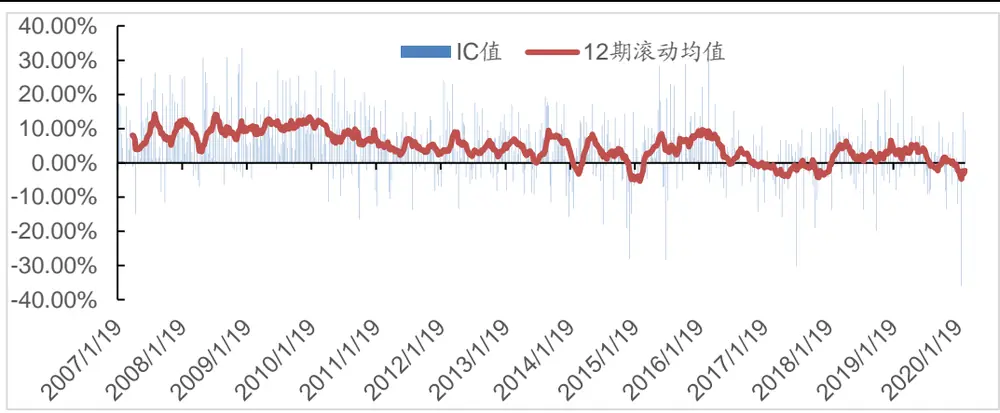
数据来源：Wind、天软、广发证券发展研究中心

表 3：全市场选股-IC分年度表现一览

| 分年度统计 | IC 均值 | IC 标准差 IC最大值 | IC最小值 | 正IC占比 |
| --- | --- | --- | --- | --- |
| 2007 | 0.086 | 0.092 0.265 | -0.15 | 87.76% |
| 2008 | 0.092 | 0.108 0.335 | -0.069 | 78.85% |
| 2009 | 0.11 | 0.077 0.273 | -0.047 | 94.12% |
| 2010 | 0.08 | 0.097 0.271 | -0.165 | 82.35% |
| 2011 | 0.042 | 0.075 0.183 | -0.136 | 72.55% |
| 2012 | 0.046 | 0.084 0.24 | -0.135 | 66.00% |
| 2013 | 0.051 | 0.084 0.193 | -0.114 | 72.55% |
| 2014 | 0.008 | 0.096 0.171 | -0.281 | 62.26% |
| 2015 | 0.054 | 0.101 0.288 | -0.285 | 73.08% |
| 2016 | 0.026 | 0.079 0.304 | -0.142 | 62.00% |
| 2017 | -0.019 | 0.077 0.107 | -0.302 | 41.18% |
| 2018 | 0.028 | 0.085 0.212 | -0.199 | 62.75% |
| 2019 | 0.016 | 0.075 0.284 | -0.136 | 56.86% |
| 2020 至今 | -0.038 0.155 | 0.148 | -0.361 | 50.00% |

数据来源：Wind、天软、广发证券发展研究中心

从表2、表3以及图8的结果可以看出，因子指标从2007年开始至今因子的IC均值为0.047，标准差为0.095，在周频调仓的情况下，正IC占比为69.90%。滚动12期IC的均值也基本上处以零以上的位置，分年度统计中，多数年份的IC均值为正，且多数年份正IC占比在60%以上， 2009年正IC占比较高，为94.12% 。

表 4：全市场选股-分年度换手率统计

| 分年度统计 | 均值(%) | 最大值(%) 最小值(%) | 标准差(%) | 累计(%) |
| --- | --- | --- | --- | --- |
| 2007 | 80.06 | 92.59 61.95 | 13.65 | 3922.79 |
| 2008 | 81.07 | 91.45 68.10 | 5.84 | 4215.89 |
| 2009 | 86.55 | 93.48 73.88 | 4.03 | 4413.92 |
| 2010 | 84.68 | 92.70 77.21 | 4.34 | 4318.58 |
| 2011 | 81.34 | 87.50 71.25 | 3.69 | 4148.57 |
| 2012 | 82.88 | 89.90 74.61 | 3.62 | 4144.19 |
| 2013 | 84.11 | 91.63 73.13 | 4.40 | 4289.86 |
| 2014 | 83.38 | 94.52 71.56 | 4.22 | 4419.27 |
| 2015 | 82.02 | 98.99 69.05 | 5.79 | 4265.04 |
| 2016 | 83.55 | 89.58 76.76 | 2.94 | 4177.74 |
| 2017 | 81.61 | 90.27 72.47 | 3.76 | 4161.91 |
| 2018 | 80.24 | 90.42 71.14 | 4.37 | 4092.21 |
| 2019 | 81.04 | 93.24 70.29 | 4.55 | 4132.88 |
| 2020 至今 All | 81.86 82.50 | 88.95 75.36 98.99 61.95 | 4.72 5.84 | 654.89 55357.75 |

数据来源：Wind、天软、广发证券发展研究中心

图 9：全市场分组回测结果
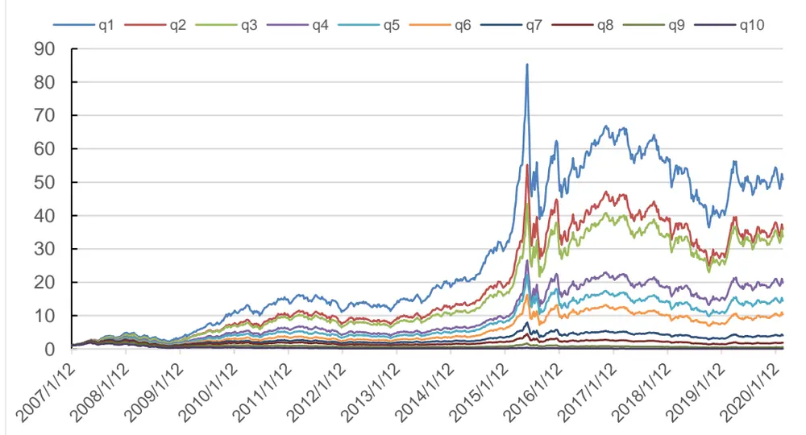
数据来源：Wind、天软、广发证券发展研究中心

全市场所有股票在横截面上根据因子值分成10组，分别构建投资组合，股票权重按照等权重分配，从图9结果可以看出，策略分档收益在回测期内单调性明显，即因子值对个股收益率区分度明显。

图 10：全市场选股-对冲中证500指数策略净值走势表现一览
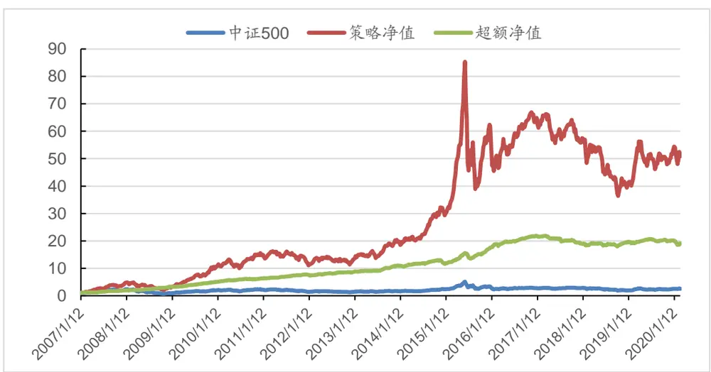
数据来源：Wind、天软、广发证券发展研究中心

表 5：全市场多头-对冲分年度表现一览

| 多头 |  |  |  |  |  |  | 多头对冲中证500指数 |  |  |  |
| --- | --- | --- | --- | --- | --- | --- | --- | --- | --- | --- |
| 年度 | 年化收益 (%) | 累计收益 (%) | 年化 波动率(%) | 最大回撤 (%) | 信息比率 | 年化收益 (%) | 累计收益 (%) | 年化 波动率(%) | 最大回撤 (%) | 信息比率 |
| 2007 | 360.06 | 346.23 | 36.05 | 15.28 | 9.79 | 100.97 | 98.19 | 18.26 | 3.23 | 5.42 |
| 2008 | -32.13 | 198.22 | 51.23 | 56.01 | -0.61 | 62.66 | 228.70 | 8.62 | 2.26 | 7.12 |
| 2009 | 250.01 | 970.26 | 31.85 | 9.09 | 7.69 | 52.85 | 406.71 | 6.06 | 2.22 | 8.54 |
| 2010 | 36.63 | 1371.40 | 26.94 | 24.14 | 1.33 | 24.12 | 531.66 | 7.19 | 3.48 | 3.29 |
| 2011 | -18.89 | 1088.40 | 23.37 | 27.04 | -0.79 | 21.10 | 667.85 | 4.77 | 1.83 | 4.33 |
| 2012 | 11.01 | 1219.19 | 23.79 | 20.07 | 0.45 | 12.84 | 766.45 | 6.84 | 4.43 | 1.84 |
| 2013 | 48.34 | 1872.33 | 19.45 | 15.92 | 2.44 | 26.60 | 1002.10 | 6.71 | 2.10 | 3.88 |
| 2014 | 45.39 | 2832.63 | 19.00 | 8.99 | 2.34 | 5.41 | 1065.46 | 7.75 | 10.72 | 0.68 |
| 2015 | 104.45 | 6069.75 | 52.74 | 54.43 | 1.94 | 48.25 | 1655.18 | 11.90 | 13.24 | 3.97 |
| 2016 | 3.02 | 6256.21 | 28.62 | 14.33 | 0.10 | 24.51 | 2085.44 | 6.52 | 3.72 | 3.68 |
| 2017 | -11.80 | 5491.99 | 16.17 | 16.04 | -0.71 | -12.87 | 1798.94 | 6.67 | 13.29 | -1.89 |
| 2018 | -29.06 | 3839.73 | 27.08 | 36.73 | -1.05 | 1.82 | 1834.23 | 7.60 | 6.32 | 0.23 |
| 2019 | 30.52 | 5069.52 | 21.97 | 18.01 | 1.36 | 4.30 | 1919.12 | 5.91 | 4.12 | 0.71 |
| 2020 至今 | -9.41 | 4988.44 | 31.01 | 11.86 | -0.30 | -27.94 | 1815.99 | 17.79 | 8.35 | -1.54 |
| ALL | 34.02 | 4988.44 | 31.85 | 57.37 | 1.05 | 24.61 | 1815.99 | 9.30 | 17.47 | 2.59 |

数据来源：Wind、天软、广发证券发展研究中心

从表5的结果中可以看出，多头组合策略整体的年化收益率34.02%，多头组合相对中证500指数在回测中取得了年化24.61%的收益率，信息比率为2.59，策略的最大回撤为17.47%。

## （四）实证分析—中证 800 内选股

表 6：中证800内选股IC-表现

| 范围 | IC 均值 | IC 标准差 | IC最大值 | IC 最小值 | 正IC占比 |
| --- | --- | --- | --- | --- | --- |
| 中证800 | 0.043 | 0.115 | 0.376 | -0.392 | 64.68% |

数据来源：Wind、天软、广发证券发展研究中心

图 11：中证800内选股IC值走势一览
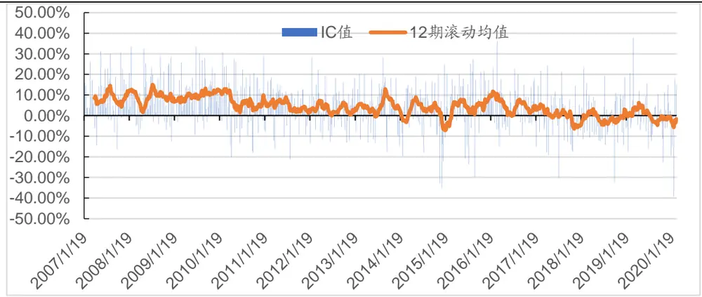
数据来源：Wind、天软、广发证券发展研究中心

表 7：中证800内选股-IC分年度表现一览

| 分年度统计 | IC 均值 IC 标准差 | IC最大值 | IC最小值 | 正IC占比 |
| --- | --- | --- | --- | --- |
| 2007 | 0.087 | 0.107 0.311 | -0.165 | 81.63% |
| 2008 | 0.087 | 0.115 0.335 | -0.125 | 75.00% |
| 2009 | 0.101 | 0.097 0.335 | -0.093 | 84.31% |
| 2010 | 0.063 0.126 | 0.306 | -0.201 | 68.63% |
| 2011 | 0.045 0.097 | 0.288 | -0.212 | 66.67% |
| 2012 | 0.035 0.098 | 0.285 | -0.134 | 62.00% |
| 2013 | 0.048 0.103 | 0.282 | -0.178 | 68.63% |
| 2014 | 0.009 0.123 | 0.200 | -0.352 | 58.49% |
| 2015 | 0.059 0.125 | 0.273 | -0.297 | 71.15% |
| 2016 | 0.046 0.100 | 0.362 | -0.149 | 60.00% |
| 2017 | -0.004 0.113 | 0.244 | -0.301 | 49.02% |
| 2018 | -0.010 0.101 | 0.235 | -0.323 | 47.06% |
| 2019 | 0.006 0.103 | 0.376 | -0.227 | 50.98% |
| 2020 至今 | -0.048 0.190 | 0.180 | -0.392 | 50.00% |

数据来源：Wind、天软、广发证券发展研究中心

从表6、表7以及图11的结果可以看出，因子指标从2007年至今的IC均值为0.043，标准差为0.115，在周频调仓的情况下，正IC占比为64.68%。滚动12期IC的均值也基本上处以零以上的位置，分年度统计中，多数年份的IC均值为正，且多数年份正IC占比在60%以上， 2009年正IC占比较高，为84.31%

表 8：中证800内选股-分年度换手率统计

| 分年度统计 | 均值(%) | 最大值(%) 最小值(%) | 标准差(%) | 累计(%) |
| --- | --- | --- | --- | --- |
| 2007 | 77.67 | 94.37 64.38 | 17.84 | 3806.06 |
| 2008 | 81.42 | 93.15 70.67 | 5.90 | 4234.01 |
| 2009 | 85.17 | 96.00 74.67 | 4.95 | 4343.65 |
| 2010 | 82.99 | 96.10 72.37 | 6.17 | 4232.63 |
| 2011 | 82.04 | 92.11 67.11 | 5.04 | 4183.89 |
| 2012 | 82.44 | 96.00 69.74 | 5.17 | 4121.86 |
| 2013 | 82.55 | 93.51 63.64 | 6.29 | 4209.80 |
| 2014 | 81.04 | 92.00 58.67 | 6.16 | 4295.18 |
| 2015 | 78.70 | 95.52 51.47 | 7.25 | 4092.30 |
| 2016 | 81.31 | 90.54 68.49 | 5.16 | 4065.48 |
| 2017 | 80.26 | 92.00 71.05 | 5.06 | 4093.19 |
| 2018 | 79.25 | 90.54 65.33 | 6.18 | 4041.87 |
| 2019 | 79.37 | 91.25 65.00 | 6.33 | 4047.82 |
| 2020 至今 | 80.16 | 92.50 68.75 | 8.85 | 641.25 |
| All | 81.09 | 96.10 51.47 | 7.63 | 54409.00 |

数据来源：Wind、天软、广发证券发展研究中心

图 12：中证800内分组回测结果
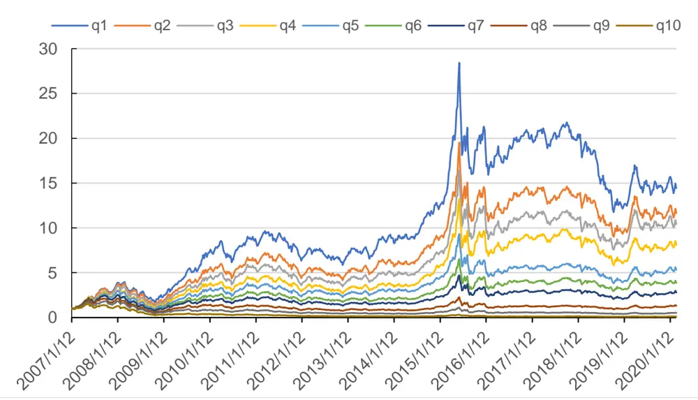
数据来源：Wnd、天软、广发证券发展研究中心

图 13：中证800内选股-对冲中证800指数策略净值走势表现一览
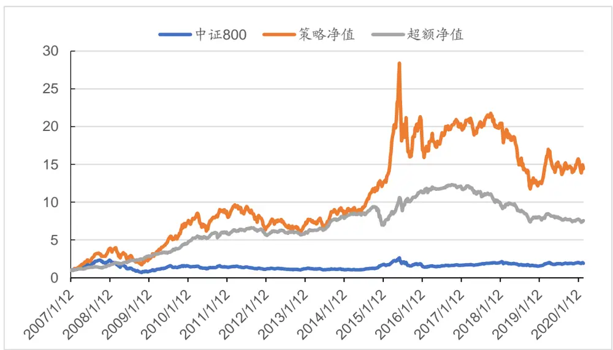
数据来源：Wind、天软、广发证券发展研究中心

表 9：中证800多头-对冲分年度表现一览

| 多头 |  |  |  |  |  | 多头对冲中证800指数 |  |  |  |  | 信息比率 |
| --- | --- | --- | --- | --- | --- | --- | --- | --- | --- | --- | --- |
| 年度 | 年化收益 | 累计收益 | 年化 | 最大回撤 | 信息比率 | 年化收益 | 累计收益 | 年化 | 最大回撤 |  |  |
| 2007 | (%) 264.03 | (%) 254.74 | 波动率(%) 31.74 | (%) 13.68 | 8.15 | (%) 62.28 | (%) 60.71 | 波动率(%) 17.79 | (%) 11.47 | 3.43 |  |
|  |  | 123.43 | 51.84 | 56.58 | -0.68 | 72.02 | 182.53 | 17.41 | 8.48 | 4.05 |  |
| 2008 2009 | -35.89 | 624.36 | 31.04 | 8.40 | 6.84 | 56.86 | 347.19 | 12.73 | 3.98 | 4.38 |  |
| 2010 | 216.81 |  | 26.14 | 27.91 | 0.66 | 31.73 |  | 16.45 | 11.58 |  |  |
| 2011 | 17.63 | 754.81 571.33 | 23.02 | 30.39 | -0.90 | 0.01 | 492.32 |  |  | 1.89 |  |
| 2012 | -21.09 |  |  |  | 0.06 |  | 492.36 | 10.92 | 10.70 | 0.00 |  |
| 2013 | 1.25 | 579.74 788.11 | 21.89 19.52 | 24.43 16.90 | 1.50 | -1.71 37.56 | 482.25 | 10.29 | 9.69 | -0.16 |  |
| 2014 | 29.97 33.75 | 1108.78 | 16.99 | 5.80 | 1.95 | -12.56 | 706.07 | 10.30 | 4.04 | 3.57 |  |
| 2015 |  | 1990.20 |  |  |  |  | 599.16 | 16.18 | 25.68 | -0.76 |  |
| 2016 | 69.31 | 1896.88 | 42.19 | 43.73 14.92 | 1.61 -0.19 | 61.02 | 1047.44 | 18.65 | 16.40 | 3.21 |  |
|  | -4.46 | 1879.17 | 22.61 |  | -0.07 | 5.53 | 1110.92 | 8.12 | 4.52 | 0.67 |  |
| 2017 | -0.87 -37.99 | 1115.57 | 12.60 | 10.51 42.57 | -1.46 | -17.05 | 900.76 | 10.01 | 17.72 | -1.67 |  |
| 2018 |  | 1406.23 | 25.41 |  |  | -20.29 | 694.05 | 12.80 | 26.14 | -1.55 |  |
| 2019 2020 至今 | 23.39 -23.11 | 1344.22 | 20.68 | 19.63 | 1.11 -0.80 | -3.08 | 669.12 | 9.73 | 12.68 | -0.31 |  |
| ALL | 22.01 | 1344.22 | 28.35 29.14 | 11.83 58.67 | 0.74 | -10.04 16.27 | 656.20 656.20 | 12.81 14.03 | 5.67 40.56 | -0.77 1.14 |  |

数据来源：Wind、天软、广发证券发展研究中心

从图12的结果可以看出，在中证800股票池中，因子收益随着因子值的下降单调递减。从表9的结果中可以看出，多头组合策略整体的年化收益率22.01%，多头组合相对中证800指数在回测中取得了年化16.27%的收益率，信息比率为1.14，策略的最大回撤40.56%。

## （五）实证分析—中证 500 内选股

表 10：中证500内选股IC-表现

| 范围 | IC 均值 | IC 标准差 | IC最大值 | IC 最小值 | 正IC占比 |
| --- | --- | --- | --- | --- | --- |
| 中证500 | 0.052 | 0.116 | 0.439 | -0.412 | 67.96% |

数据来源：Wind、天软、广发证券发展研究中心

图 14：中证500内选股IC值走势一览
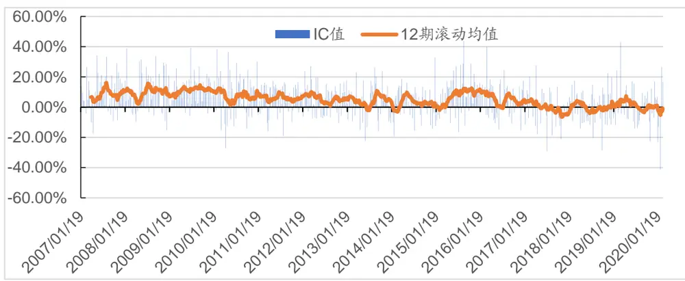
数据来源：Wind、天软，广发证券发展研究中心

表 11：中证500内选股-IC分年度表现一览

| 分年度统计 | IC 均值 | IC标准差 IC最大值 | IC最小值 | 正IC占比 |
| --- | --- | --- | --- | --- |
| 2007 | 0.084 | 0.114 0.343 | -0.173 | 81.63% |
| 2008 | 0.094 | 0.127 0.389 | -0.152 | 73.08% |
| 2009 | 0.115 | 0.088 0.391 | -0.056 | 92.16% |
| 2010 | 0.072 | 0.137 0.382 | -0.272 | 68.63% |
| 2011 | 0.061 | 0.099 0.300 | -0.191 | 72.55% |
| 2012 | 0.057 | 0.093 0.271 | -0.103 | 70.00% |
| 2013 | 0.042 | 0.106 0.266 | -0.224 | 76.47% |
| 2014 | 0.023 | 0.090 0.188 | -0.193 | 62.26% |
| 2015 | 0.084 | 0.127 0.439 | -0.165 | 76.92% |
| 2016 | 0.047 | 0.109 0.401 | -0.153 | 62.00% |
| 2017 | -0.008 | 0.105 0.278 | -0.292 | 47.06% |
| 2018 | 0.001 | 0.102 0.226 | -0.286 | 54.90% |
| 2019 | 0.015 | 0.112 0.431 | -0.225 | 49.02% |
| 2020 至今 | -0.034 | 0.220 0.266 | -0.412 | 50.00% |

数据来源：Wind、天软、广发证券发展研究中心

从表10、表11以及图14的结果可以看出，因子指标从2007年至今的IC均值为0.052，高于在全市场和中证800内选股的结果。标准差为0.095，在周频调仓的情况下，正IC占比为67.96%。滚动12期IC的均值在近些年位于0轴附近波动。分年度统计中，多数年份的IC均值为正，且多数年份正IC占比在60%以上， 2009年正IC占比较高，为92.16% 。

表 12：中证500内选股-分年度换手率统计

| 分年度统计 | 均值(%) 最大值(%) | 最小值(%) | 标准差(%) | 累计值(%) |
| --- | --- | --- | --- | --- |
| 2007 | 77.49 93.48 | 67.39 | 18.12 | 3797.02 |
| 2008 | 83.02 93.48 | 69.57 | 5.73 | 4316.97 |
| 2009 | 87.13 97.92 | 76.60 | 5.77 | 4443.85 |
| 2010 | 84.91 100.00 | 68.75 | 6.98 | 4330.46 |
| 2011 | 82.89 93.75 | 68.09 | 5.37 | 4227.50 |
| 2012 | 83.69 93.62 | 67.35 | 4.87 | 4184.27 |
| 2013 | 82.99 97.92 | 68.75 | 6.92 | 4232.64 |
| 2014 | 81.61 93.48 | 63.04 | 6.34 | 4325.26 |
| 2015 | 82.67 97.56 | 68.89 | 7.63 | 4298.87 |
| 2016 | 82.31 93.62 | 66.67 | 6.13 | 4115.69 |
| 2017 | 80.80 93.62 | 66.67 | 6.29 | 4120.73 |
| 2018 | 80.86 92.00 | 65.96 | 5.94 | 4124.05 |
| 2019 | 80.81 98.00 | 64.00 | 7.19 | 4121.10 |
| 2020 至今 All | 83.00 94.00 82.42 100.00 | 68.00 63.04 | 9.50 8.07 | 664.00 55302.41 |

数据来源：Wind、天软、广发证券发展研究中心

图 15：中证500内分组回测结果
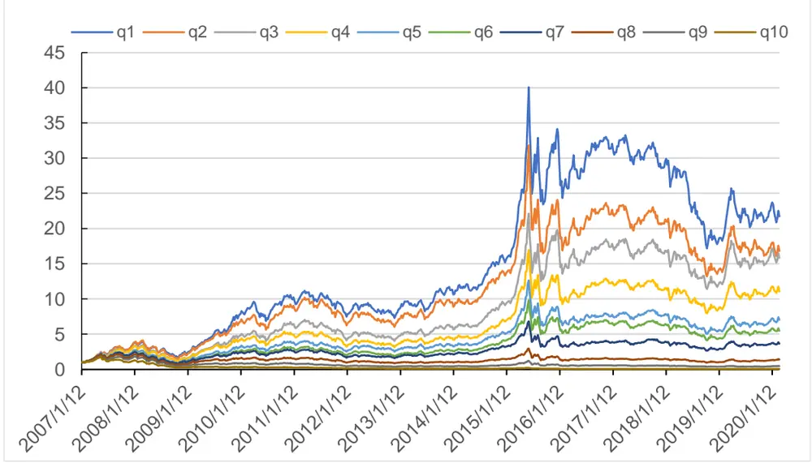
数据来源：Wind、天软、广发证券发展研究中心

图 16：中证500内选股-对冲中证500指数策略净值走势表现一览
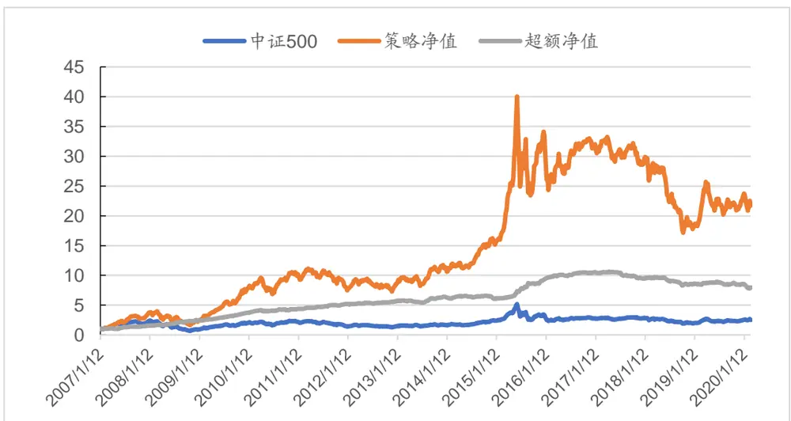
数据来源：Wind、天软、广发证券发展研究中心

表 13：中证500内多头-对冲分年度表现一览

| 多头 |  |  |  |  |  |  | 多头对冲中证500指数 |  |  |  | 信息比率 |
| --- | --- | --- | --- | --- | --- | --- | --- | --- | --- | --- | --- |
| 年度 | 年化收益 (%) | 累计收益 (%) | 年化 波动率(%) | 最大回撤 (%) | 信息比率 | 年化收益 (%) | 累计收益 (%) | 年化 波动率(%) | 最大回撤 (%) |  |  |
| 2007 | 259.49 | 250.4 | 33.12 | 15.41 | 7.68 | 55.59 | 54.22 | 15.16 | 8.02 | 3.59 |  |
| 2008 | -35.76 | 121.15 | 53.19 | 57.71 | -0.66 | 55.76 | 144.52 | 8.98 | 3.06 | 6.08 |  |
| 2009 | 242.65 | 676.66 | 33.4 | 8.98 | 7.12 | 50.28 | 270.46 | 6.01 | 1.50 | 8.19 |  |
| 2010 | 27.50 | 895.05 | 28.14 | 28.6 | 0.96 | 15.95 | 330.81 | 9.90 | 4.90 | 1.58 |  |
| 2011 | -19.46 | 697.97 | 23.31 | 28.52 | -0.82 | 20.22 | 419.82 | 5.26 | 1.54 | 3.76 |  |
| 2012 | 6.60 | 750.65 | 23.11 | 22.75 | 0.28 | 8.30 | 462.95 | 5.26 | 3.26 | 1.54 |  |
| 2013 | 32.40 | 1032.59 | 19.98 | 16.35 | 1.59 | 13.01 | 537.73 | 7.56 | 6.63 | 1.69 |  |
| 2014 | 31.75 | 1417.02 | 17.17 | 6.56 | 1.81 | -4.76 | 505.61 | 6.37 | 8.17 | -0.73 |  |
| 2015 | 114.04 | 3247.37 | 48.62 | 41.51 | 2.30 | 51.36 | 831.98 | 11.69 | 2.65 | 4.31 |  |
| 2016 | -6.23 | 3038.83 | 26.78 | 16.52 | -0.23 | 12.87 | 951.90 | 5.01 | 2.08 | 2.52 |  |
| 2017 | -8.35 | 2771.75 | 13.83 | 14.1 | -0.59 | -9.75 | 847.40 | 6.04 | 11.24 | -1.58 |  |
| 2018 | -37.48 | 1678.74 | 26.95 | 42.65 | -1.36 | -10.15 | 749.40 | 7.04 | 14.26 | -1.41 |  |
| 2019 | 26.27 | 2156.6 | 22.35 | 21.55 | 1.15 | 0.97 | 757.83 | 6.06 | 6.12 | 0.16 |  |
| 2020 至今 | -20.87 | 2073.63 | 29 | 12.04 | -0.71 | -37.28 | 696.13 | 16.11 | 9.02 | -2.27 |  |
| ALL | 25.79 | 2073.63 | 31.18 | 57.17 | 0.81 | 16.72 | 696.13 | 8.75 | 26.90 | 1.87 |  |

数据来源：Wind、天软、广发证券发展研究中心

从图15的结果可以看出，在中证500股票池中，因子收益随着因子值的下降单调递减。从表13的结果中可以看出，多头组合策略整体的年化收益率25.79%，多头组合相对中证500指数在回测中取得了年化16.72%的收益率，信息比率为1.87，策略的最大回撤26.90%。整体上看，在中证500内的选股结果比中证800内略微提升。

## （六）实证分析—沪深 300 选股

表 14: 沪深300内选股IC-表现

| 范围 | IC 均值 | IC 标准差 | IC 最大值 | IC 最小值 | 正IC占比 |
| --- | --- | --- | --- | --- | --- |
| 沪深300 | 0.028 | 0.134 | 0.374 | -0.472 | 57.82% |

数据来源：Wind、天软、广发证券发展研究中心

图 17：沪深300内选股IC值走势一览
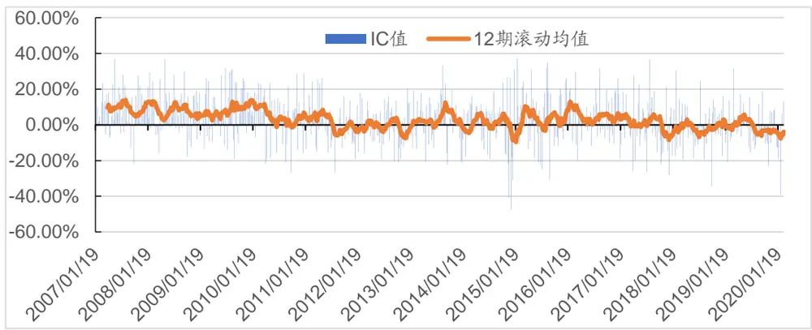
数据来源：Wind、天软、广发证券发展研究中心

表 15：沪深300内选股-IC分年度表现一览

| 分年度统计 | IC 均值 | IC 标准差 IC 最大值 | IC最小值 | 负IC 占比 |
| --- | --- | --- | --- | --- |
| 2007 | 0.09 | 0.11 0.37 | -0.22 | 83.67% |
| 2008 | 0.08 | 0.12 0.37 | -0.18 | 65.38% |
| 2009 | 0.09 | 0.14 0.32 | -0.19 | 70.59% |
| 2010 | 0.04 | 0.13 0.29 | -0.27 | 72.55% |
| 2011 | 0.01 0.12 | 0.29 | -0.27 | 49.02% |
| 2012 | -0.01 0.11 | 0.20 | -0.21 | 46.00% |
| 2013 | 0.03 0.12 | 0.33 | -0.22 | 60.78% |
| 2014 | -0.01 0.16 | 0.27 | -0.47 | 58.49% |
| 2015 | 0.05 0.16 | 0.37 | -0.31 | 57.69% |
| 2016 | 0.05 0.12 | 0.32 | -0.20 | 60.00% |
| 2017 | -0.01 0.14 | 0.37 | -0.28 | 47.06% |
| 2018 | -0.02 0.12 | 0.30 | -0.34 | 43.14% |
| 2019 | -0.01 0.11 | 0.31 | -0.23 | 41.18% |
| 2020 至今 | -0.08 0.16 | 0.13 | -0.39 | 37.50% |

数据来源：Wind、天软、广发证券发展研究中心

从表14、表15以及图17的结果可以看出，因子指标从2007至今的IC均值为0.028，标准差为0.134，在周频调仓的情况下，正IC占比为57.82%。滚动12期IC的均值大部分时间都在零轴附近波动。分年度统计中，半数以上的年份IC值为正。半数左右年份的正IC占比在50%以上， 2007年正IC占最高，为83.67% 。

表 16：沪深300内选股-分年度换手率统计

| 分年度统计 | 均值(%) 最大值(%) | 最小值(%) | 标准差(%) | 累计值(%) |
| --- | --- | --- | --- | --- |
| 2007 | 78.78 96.15 | 62.96 | 14.69 | 3860.24 |
| 2008 | 78.31 92.86 | 55.56 | 9.33 | 4072.30 |
| 2009 | 81.20 92.86 | 67.86 | 7.19 | 4141.08 |
| 2010 | 78.40 96.55 | 58.62 | 9.08 | 3998.52 |
| 2011 | 79.78 93.10 | 55.17 | 8.18 | 4068.72 |
| 2012 | 80.06 96.55 | 62.07 | 8.24 | 4002.82 |
| 2013 | 81.32 100.00 | 58.62 | 8.64 | 4147.42 |
| 2014 | 80.99 100.00 | 60.71 | 9.14 | 4292.38 |
| 2015 | 73.38 93.10 | 51.72 | 11.58 | 3815.78 |
| 2016 | 80.05 96.55 | 58.62 | 8.08 | 4002.34 |
| 2017 | 78.93 96.55 | 65.52 | 8.10 | 4025.25 |
| 2018 | 76.78 89.66 | 58.62 | 7.67 | 3915.64 |
| 2019 | 76.34 90.00 | 53.33 | 8.60 | 3893.33 |
| 2020 至今 All | 77.08 90.00 78.77 100.00 | 60.00 51.72 | 11.19 9.48 | 616.67 52852.49 |

数据来源：Wind、天软、广发证券发展研究中心

图 18：沪深300内分组回测结果
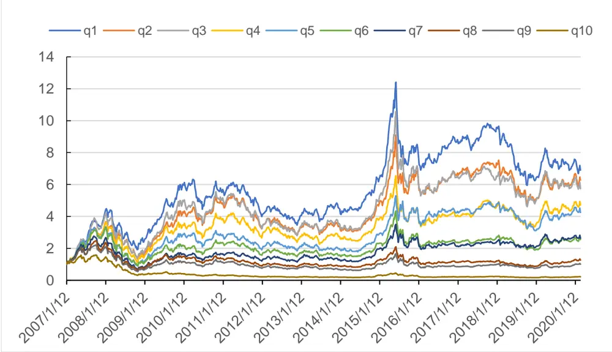
数据来源：Wind、天软、广发证券发展研究中心

图 19：沪深300内选股-对冲沪深300指数策略净值走势表现一览
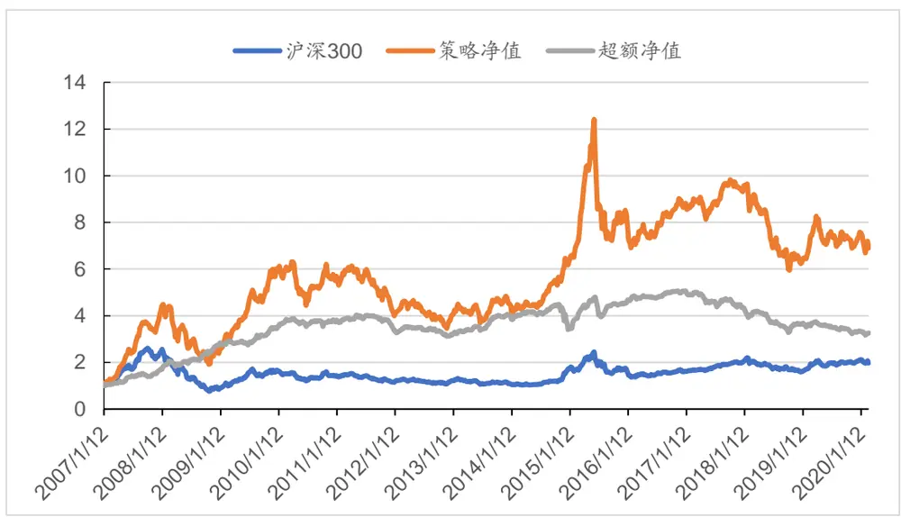
数据来源：Wind、天软、广发证券发展研究中心

表 17：沪深300内多头-对冲分年度表现一览

| 多头 |  |  |  |  |  | 多头对冲沪深 300 指数 |  |  |  |  |
| --- | --- | --- | --- | --- | --- | --- | --- | --- | --- | --- |
| 年度 | 年化收益 (%) | 累计收益 (%) | 年化 波动率(%) | 最大回撤 (%) | 信息比率 | 年化收益 (%) | 累计收益 (%) | 年化 波动率(%% | 最大回撤 (%) | 信息比率 |
| 2007 | 316.85 | 305.12 | 31.86 | 12.35 | 9.74 | 68.53 | 66.78 | 18.04 | 9.12 | 3.72 |
| 2008 | -39.97 | 138.27 | 48.89 | 57.39 | -0.80 | 62.75 | 176.78 | 18.04 | 10.92 | 3.41 |
| 2009 | 148.43 | 502.82 | 26.72 | 10.16 | 5.44 | 24.42 | 245.89 | 12.39 | 6.19 | 1.93 |
| 2010 | -8.56 | 450.25 | 24.83 | 29.63 | -0.34 | 7.72 | 273.13 | 11.34 | 9.06 | 0.67 |
| 2011 | -24.14 | 315.10 | 21.12 | 32.40 | -1.12 | -7.08 | 246.20 | 9.54 | 14.10 | -0.73 |
| 2012 | -3.91 | 298.86 | 20.26 | 26.00 | -0.19 | -7.64 | 219.73 | 8.71 | 11.88 | -0.86 |
| 2013 | 12.91 | 351.47 | 19.48 | 17.93 | 0.65 | 24.69 | 300.44 | 9.55 | 5.04 | 2.53 |
| 2014 | 34.28 | 517.05 | 18.18 | 7.44 | 1.85 | -14.30 | 240.01 | 18.67 | 24.18 | -0.75 |
| 2015 | 33.45 | 733.02 | 35.52 | 41.85 | 0.92 | 32.36 | 355.09 | 15.86 | 17.87 | 2.00 |
| 2016 | 4.08 | 767.03 | 17.45 | 11.85 | 0.23 | 11.33 | 406.66 | 6.05 | 3.07 | 1.84 |
| 2017 | 7.19 | 830.64 | 11.19 | 10.43 | 0.63 | -14.17 | 333.53 | 9.73 | 14.41 | -1.43 |
| 2018 | -32.52 | 523.06 | 23.65 | 38.40 | -1.35 | -15.85 | 263.55 | 12.51 | 24.31 | -1.24 |
| 2019 | 18.03 | 637.83 | 18.39 | 16.65 | 0.96 | -7.97 | 234.03 | 8.52 | 13.62 | -0.92 |
| 2020 至今 | -33.87 | 590.59 | 27.55 | 11.80 | -1.20 | -14.78 | 225.59 | 11.97 | 5.19 | -1.21 |
| ALL | 15.49 | 590.59 | 26.87 | 52.09 | 0.56 | 9.19 | 225.59 | 13.16 | 37.43 | 0.68 |

数据来源：Wind、天软、广发证券发展研究中心

从图18中的结果可以看出，在沪深300股票池中，将股票按照因子值分成10组分别构建投资组合，各组收益没有较为明显的区分，部分组合存在收益大致相近的情况，说明在该股票池中，因子区分度不高。从表17的结果中可以看出，多头组合策略整体的年化收益率15.49%，多头组合相对沪深300指数的年化收益率为9.19%，信息比率为0.68，策略的最大回撤37.43%。

## 四、因子进一步处理和分析

## （一）因子处理

## 去极值

采用MAD法对异常的数据进行剔除。MAD法是针对均值标准差方法的改进，样本均值用样本中位数代替，样本标准差用样本MAD（Median Absolute Deviation）代替。

$$
\begin{array}{c}{{md=median\{x_{i},i=1,2,3\ldots,n\}}}\\{{}}\\{{MAD=median(|x_{i}-md|),i=1,2,3,\ldots,n}}\\{{}}\\{{MAD_{\epsilon}=1.483\times MAD}}\end{array}
$$

采用与3σ法等价的方法，将数据中偏离中位数超过3倍 ${\cdot}MAD_{\epsilon}$ 的值，替换为对应的值，这样去除了极值的同时也将极值的股票之间保序。

## 中性化

将原始因子值和股票的市值以及行业进行回归，取残差项作为新因子

$$
H(i,T)=\beta_{0}+\beta_{1}size(i,T)+\beta_{2}industry(i,T)+\varepsilon(i,T)
$$

其中市值自变量使用对数市值，行业自变量为0或者1的哑变量标准化

使用因子的Z-Score值作为新的因子值

$$
H_{new}(i,T)=\frac{H(i,T)-mean(H(i,T))}{std(H(i,T))}
$$

将原始因子值经过上述处理之后的结果如下所示。

表 18：处理后因子选股IC-表现

| 范围 | IC 均值 | IC 标准差 | IC最大值 | IC 最小值 | 正IC占比 |
| --- | --- | --- | --- | --- | --- |
| 全市场 | 0.051 | 0.075 | 0.329 | -0.232 | 73.77% |
| 中证800 | 0.046 | 0.090 | 0.370 | -0.267 | 69.15% |
| 中证500 | 0.055 | 0.100 | 0.403 | -0.259 | 71.54% |
| 沪深300 | 0.031 | 0.106 | 0.379 | -0.270 | 60.21% |

数据来源：Wind、天软、广发证券发展研究中心

从表18结果可以看出，经过处理后因子的IC均值比原始因子的IC均值高，且正IC值占比较高。

表 19：各板块对冲策略结果表现一览

| 原始因子-对冲 |  |  |  |  |  | 处理后因子-对冲 |  |  |  |  |
| --- | --- | --- | --- | --- | --- | --- | --- | --- | --- | --- |
| 板块 | 年化收益 (%) | 累计收益 (%) | 年化 波动率(%) | 最大回撤 (%) | 信息比率 | 年化收益 (%) | 累计收益 | 年化 | 最大回撤 | 信息比率 |
| 全市场 | 24.61 | 1815.99 | 9.3 | 17.47 | 2.59 | 24.98 | (%) 1893.38 | 波动率(%) 8.62 | (%) 16.28 | 2.84 |
| 中证800 | 16.27 | 656.2 | 14.03 | 40.56 | 1.14 | 18.84 | 913.63 | 12.72 | 34.83 | 1.45 |
| 中证500 | 16.72 | 696.13 | 8.75 | 26.9 | 1.87 | 19.13 | 948.16 | 7.99 | 23.78 | 2.35 |
| 沪深 300 | 9.19 | 225.59 | 13.16 | 37.43 | 0.68 | 14.08 | 485.99 | 11.07 | 31.45 | 1.25 |

数据来源：Wind、天软、广发证券发展研究中心

根据表19可以看出，与IC的结果类似，处理后的因子在不同板块上的收益率相较于未经过处理的因子有较为明显的提高，策略的波动率和最大回撤都有所下降。其中在沪深300板块收益提升的较为明显，年化收益率提升了约5%。

## （二）处理后因子分板块表现

## 处理后因子—全市场选股

表 20: 处理后因子—全市场选股IC-表现

| 范围 | IC 均值 | IC 标准差 | IC 最大值 | IC 最小值 | 正IC占比 |
| --- | --- | --- | --- | --- | --- |
| 全市场 | 0.051 | 0.075 | 0.329 | -0.232 | 73.77% |

数据来源：Wind、天软、广发证券发展研究中心

图 20：处理后因子-全市场内选股IC值走势一览
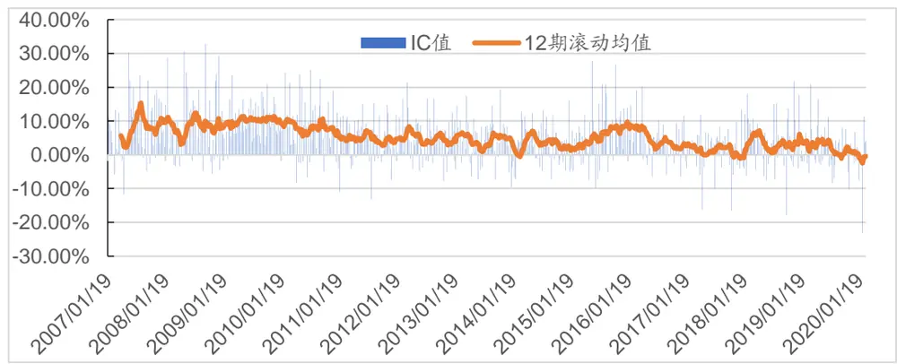
数据来源：Wind、天软、广发证券发展研究中心

表 21：处理后因子-全市场选股-IC分年度表现一览

| 分年度统计 | IC 均值 | IC 标准差 IC最大值 | IC最小值 | 正IC占比 |
| --- | --- | --- | --- | --- |
| 2007 | 0.080 | 0.086 0.302 | -0.117 | 83.67% |
| 2008 | 0.084 | 0.100 0.329 | -0.057 | 76.92% |
| 2009 | 0.101 | 0.052 0.236 | -0.013 | 96.08% |
| 2010 | 0.077 | 0.082 0.251 | -0.085 | 78.43% |
| 2011 | 0.046 | 0.065 0.153 | -0.132 | 74.51% |
| 2012 | 0.048 | 0.063 0.214 | -0.078 | 76.00% |
| 2013 | 0.045 | 0.063 0.195 | -0.074 | 76.47% |
| 2014 | 0.030 | 0.055 0.131 | -0.098 | 69.81% |
| 2015 | 0.059 | 0.084 0.279 | -0.099 | 73.08% |
| 2016 | 0.043 | 0.056 0.202 | -0.066 | 80.00% |
| 2017 | 0.010 | 0.057 0.117 | -0.166 | 58.82% |
| 2018 | 0.036 | 0.075 0.218 | -0.178 | 60.78% |
| 2019 | 0.019 | 0.062 0.210 | -0.102 | 56.86% |
| 2020 至今 | -0.011 | 0.104 0.114 | -0.232 | 62.50% |

数据来源：Wind、天软、广发证券发展研究中心

表 22：处理后因子-全市场选股-分年度换手率统计

| 分年度统计 | 均值(%) 最大值(%) | 最小值(%) | 标准差(%) | 累计(%) |
| --- | --- | --- | --- | --- |
| 2007 | 80.89 | 91.26 69.03 | 13.46 | 3963.55 |
| 2008 | 80.82 | 92.31 69.23 | 5.68 | 4202.75 |
| 2009 | 86.21 | 94.89 75.94 | 3.92 | 4396.89 |
| 2010 | 84.72 | 92.14 78.06 | 3.16 | 4320.92 |
| 2011 | 82.74 | 88.82 75.63 | 3.31 | 4219.98 |
| 2012 | 83.11 | 89.23 76.19 | 2.86 | 4155.44 |
| 2013 | 83.96 | 90.45 72.25 | 3.61 | 4281.96 |
| 2014 | 83.78 93.61 | 76.15 | 3.61 | 4440.57 |
| 2015 | 82.55 93.75 | 71.43 | 4.98 | 4292.53 |
| 2016 | 84.02 | 91.67 77.12 | 3.12 | 4201.20 |
| 2017 | 81.57 89.49 | 73.17 | 3.57 | 4160.19 |
| 2018 | 80.10 89.22 | 71.80 | 4.02 | 4084.97 |
| 2019 | 80.55 | 92.35 72.43 | 4.33 | 4108.23 |
| 2020 至今 All | 82.44 82.70 | 87.50 77.68 94.89 69.03 | 2.94 5.48 | 659.52 55488.72 |

数据来源：Wind、天软、广发证券发展研究中心

图 21：处理后因子-全市场选股-对冲中证500指数策略净值走势表现一览
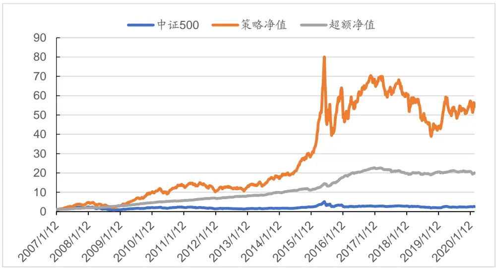
数据来源：Wind、天软、广发证券发展研究中心

表 23：处理后因子-全市场多头-对冲分年度表现一览

| 年度 | 多头 |  |  |  |  | 多头对冲中证500指数 |  |  |  |  |
| --- | --- | --- | --- | --- | --- | --- | --- | --- | --- | --- |
|  | 年化 收益(%) | 累计 收益(%) | 年化 波动率(%) | 最大回撤 (%) | 信息比率 | 年化 收益 | 累计 收益(%) | 年化 波动率(%) | 最大回撤 (%) | 信息比率 |
| 2007 | 350.67 | 337.30 | 34.20 | 14.06 | 10.05 | (%) 95.38 | 92.78 | 18.60 | 2.04 | 5.02 |
| 2008 | -35.93 | 175.23 | 50.40 | 57.70 | -0.70 | 53.20 | 200.43 | 8.38 | 1.99 | 6.22 |
| 2009 | 243.92 | 870.25 | 31.31 | 6.69 | 7.63 | 49.92 | 354.05 | 5.63 | 1.94 | 8.69 |
| 2010 | 35.91 | 1226.80 | 26.40 | 24.21 | 1.33 | 23.38 | 462.55 | 6.18 | 2.32 | 3.71 |
| 2011 | -18.01 | 983.53 | 22.90 | 27.49 | -0.77 | 22.28 | 590.68 | 4.48 | 1.49 | 4.87 |
| 2012 | 12.88 | 1123.04 | 23.30 | 18.84 | 0.54 | 14.71 | 692.31 | 5.34 | 3.27 | 2.70 |
| 2013 | 45.25 | 1689.79 | 18.86 | 15.11 | 2.35 | 23.91 | 885.93 | 5.48 | 1.72 | 4.28 |
| 2014 | 52.66 | 2702.52 | 18.36 | 6.82 | 2.81 | 10.71 | 998.24 | 6.23 | 7.49 | 1.69 |
| 2015 | 117.58 | 6190.40 | 51.35 | 50.83 | 2.24 | 56.60 | 1651.03 | 10.55 | 9.37 | 5.26 |
| 2016 | 6.19 | 6580.00 | 28.82 | 14.66 | 0.21 | 28.50 | 2150.00 | 5.34 | 2.14 | 5.23 |
| 2017 | -11.08 | 5825.91 | 16.03 | 15.57 | -0.68 | -12.16 | 1871.38 | 6.29 | 12.67 | -1.89 |
| 2018 | -28.94 | 4082.38 | 26.89 | 36.48 | -1.05 | 1.99 | 1911.46 | 6.83 | 6.08 | 0.29 |
| 2019 | 28.60 | 5305.83 | 21.67 | 18.79 | 1.29 | 2.73 | 1967.51 | 5.35 | 3.54 | 0.50 |
| 2020 至今 | -0.47 | 5301.71 | 31.29 | 10.54 | -0.01 | -20.40 | 1893.38 | 14.74 | 7.01 | -1.36 |
| ALL | 34.62 | 5301.71 | 31.23 | 51.40 | 1.09 | 24.98 | 1893.38 | 8.62 | 16.28 | 2.84 |

数据来源：Wind、天软、广发证券发展研究中心

## 处理后因子——中证800内选股

表 24：处理后因子-中证800内选股IC-表现

| 范围 | IC 均值 | IC 标准差 | IC 最大值 | IC 最小值 | 正IC占比 |
| --- | --- | --- | --- | --- | --- |
| 中证800 | 0.046 | 0.090 | 0.370 | -0.267 | 69.15% |

数据来源：wind、天软，广发证券发展研究中心

图 22：处理后因子-中证800内选股-IC值走势一览
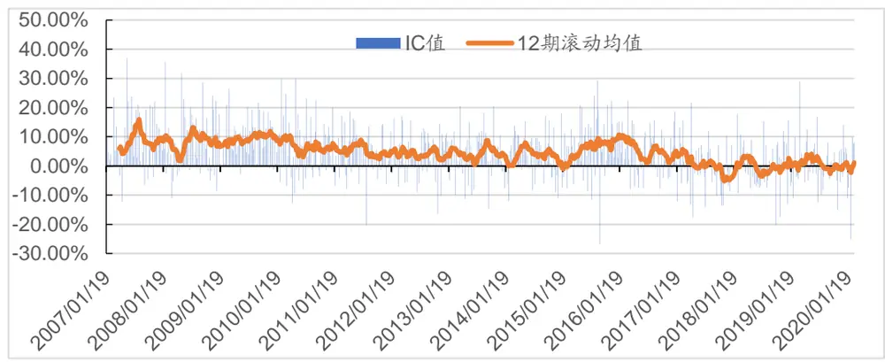
数据来源：Wind、天软、广发证券发展研究中心

表 25：处理后因子-中证800内选股-IC分年度表现一览

| 分年度统计 | IC 均值 | IC 标准差 | IC 最大值 IC最小值 | 正IC占比 |
| --- | --- | --- | --- | --- |
| 2007 | 0.083 | 0.097 0.370 | -0.121 | 81.63% |
| 2008 | 0.080 | 0.102 0.357 | -0.111 | 75.00% |
| 2009 | 0.095 | 0.069 0.264 | -0.029 | 94.12% |
| 2010 | 0.065 | 0.099 0.299 | -0.127 | 70.59% |
| 2011 | 0.049 | 0.079 0.202 | -0.203 | 74.51% |
| 2012 | 0.042 | 0.075 0.170 | -0.165 | 74.00% |
| 2013 | 0.043 | 0.077 0.206 | -0.147 | 78.43% |
| 2014 | 0.031 | 0.071 0.171 | -0.120 | 66.04% |
| 2015 | 0.069 | 0.103 0.292 | -0.267 | 76.92% |
| 2016 | 0.047 | 0.075 0.224 | -0.080 | 70.00% |
| 2017 | -0.004 | 0.085 0.218 | -0.177 | 47.06% |
| 2018 | 0.001 | 0.077 0.178 | -0.205 | 47.06% |
| 2019 | 0.008 | 0.080 0.290 | -0.151 | 45.10% |
| 2020 至今 | -0.010 | 0.124 0.098 | -0.251 | 62.50% |

数据来源：Wind、天软、广发证券发展研究中心

表 26：处理后因子-中证800内选股-分年度换手率统计

| 分年度统计 | 均值(%) | 最大值(%) 最小值(%) | 标准差(%) | 累计(%) |
| --- | --- | --- | --- | --- |
| 2007 | 78.00 | 90.14 68.49 | 17.64 | 3821.85 |
| 2008 | 81.10 | 94.52 65.28 | 6.71 | 4217.00 |
| 2009 | 84.66 | 92.11 74.67 | 4.54 | 4317.56 |
| 2010 | 83.77 | 93.51 72.00 | 4.72 | 4272.21 |
| 2011 | 82.24 | 94.81 68.92 | 5.70 | 4194.19 |
| 2012 | 83.41 | 93.33 72.37 | 4.43 | 4170.64 |
| 2013 | 83.10 | 94.81 69.01 | 6.12 | 4238.25 |
| 2014 | 81.94 | 90.67 66.22 | 5.43 | 4342.69 |
| 2015 | 80.13 | 95.31 64.71 | 6.45 | 4166.60 |
| 2016 | 82.77 | 93.24 72.60 | 4.93 | 4138.57 |
| 2017 | 80.86 | 92.00 68.42 | 5.16 | 4123.63 |
| 2018 | 79.95 | 89.33 65.33 | 5.73 | 4077.61 |
| 2019 | 78.80 | 90.00 66.25 | 5.99 | 4018.72 |
| 2020 至今 | 83.59 | 90.00 75.00 | 5.69 | 668.75 |
| ALL | 81.62 | 95.31 64.71 | 7.34 | 54768.26 |

数据来源：Wind、天软、广发证券发展研究中心

图 23：处理后因子-中证800内选股-对冲中证800指数策略净值走势
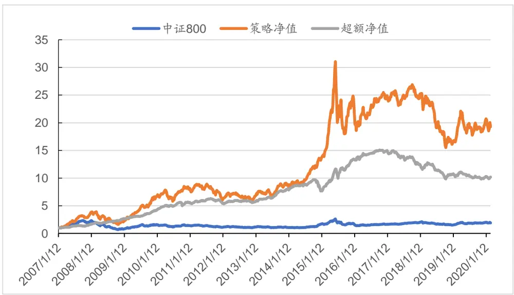
数据来源：Wind、天软、广发证券发展研究中心

表 27：处理后因子-中证800多头-对冲分年度表现一览

| 多头 |  |  |  |  |  | 多头对冲中证800指数 |  |  |  | 信息比率 |
| --- | --- | --- | --- | --- | --- | --- | --- | --- | --- | --- |
| 年度 | 年化收益 (%) | 累计收益 (%) | 年化 波动率(%) | 最大回撤 (%) | 信息比率 | 年化收益 (%) | 累计收益 (%) | 年化 波动率(%) | 最大回撤 (%) |  |
| 2007 | 262.72 | 253.49 | 30.19 | 12.01 | 8.53 | 61.51 | 59.97 | 15.37 | 8.99 | 3.92 |
| 2008 | -40.06 | 107.58 | 50.97 | 58.46 | -0.77 | 60.52 | 161.69 | 16.15 | 8.71 | 3.67 |
| 2009 | 214.09 | 567.07 | 31.02 | 8.64 | 6.76 | 55.76 | 311.23 | 11.16 | 2.64 | 4.90 |
| 2010 | 18.68 | 694.40 | 25.50 | 25.99 | 0.72 | 32.96 | 449.91 | 15.13 | 11.08 | 2.13 |
| 2011 | -19.89 | 533.59 | 22.30 | 28.69 | -0.87 | 1.48 | 458.21 | 9.71 | 11.00 | 0.15 |
| 2012 | 5.30 | 567.16 | 21.74 | 21.78 | 0.24 | 2.28 | 470.94 | 9.44 | 7.21 | 0.24 |
| 2013 | 31.26 | 780.49 | 19.05 | 16.56 | 1.61 | 38.93 | 698.46 | 9.28 | 3.66 | 4.11 |
| 2014 | 46.16 | 1216.56 | 16.77 | 5.97 | 2.70 | -4.17 | 663.20 | 14.71 | 21.03 | -0.28 |
| 2015 | 79.75 | 2322.69 | 42.26 | 42.02 | 1.85 | 71.63 | 1238.46 | 16.62 | 14.36 | 4.22 |
| 2016 | 0.35 | 2331.19 | 23.05 | 14.46 | 0.01 | 11.01 | 1385.83 | 7.43 | 3.53 | 1.45 |
| 2017 | 0.08 | 2333.22 | 12.30 | 10.35 | 0.01 | -16.24 | 1140.11 | 9.55 | 16.91 | -1.67 |
| 2018 | -33.57 | 1503.15 | 24.85 | 38.63 | -1.32 | -14.70 | 954.44 | 12.00 | 22.92 | -1.20 |
| 2019 | 21.49 | 1855.20 | 20.56 | 19.70 | 1.02 | -4.53 | 905.74 | 8.87 | 11.55 | -0.50 |
| 2020 至今 | -10.53 | 1820.69 | 29.09 | 10.58 | -0.35 | 5.00 | 913.63 | 10.92 | 4.36 | 0.45 |
| ALL | 24.63 | 1820.69 | 28.75 | 49.99 | 0.84 | 18.84 | 913.63 | 12.72 | 34.83 | 1.45 |

数据来源：Wind、天软、广发证券发展研究中心

处理后因子—中证500内选股

表 28：处理后因子-中证500内选股IC-表现

| 范围 | IC 均值 | IC 标准差 | IC最大值 | IC最小值 | 正IC占比 |
| --- | --- | --- | --- | --- | --- |
| 中证 500 | 0.055 | 0.100 | 0.403 | -0.259 | 71.54% |

数据来源：Wind、天软、广发证券发展研究中心

图 24：处理后因子-中证500内选股IC值走势一览
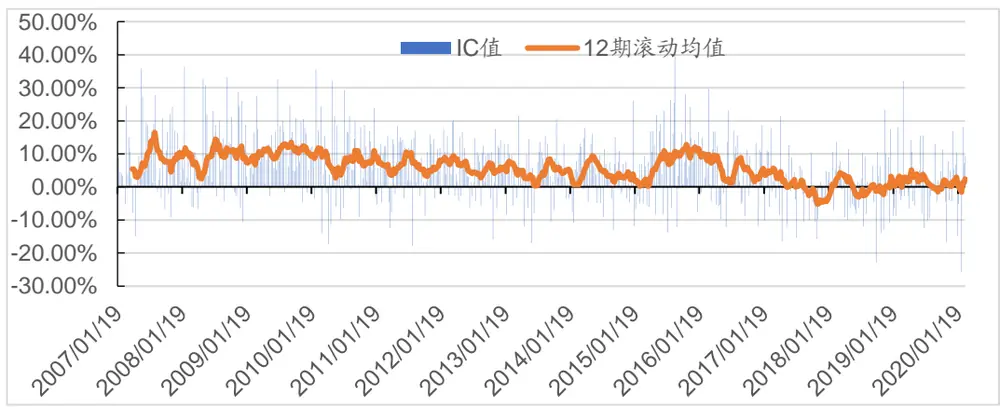
数据来源：Wind、天软、广发证券发展研究中心

表 29：处理后因子-中证500内选股-IC分年度表现一览

| 分年度统计 | IC 均值 | IC 标准差 | IC最大值 IC最小值 | 正IC占比 |
| --- | --- | --- | --- | --- |
| 2007 | 0.081 | 0.108 0.359 | -0.149 | 81.63% |
| 2008 | 0.091 | 0.117 0.366 | -0.106 | 75.00% |
| 2009 | 0.108 | 0.080 0.326 | -0.047 | 90.20% |
| 2010 | 0.079 | 0.116 0.357 | -0.174 | 78.43% |
| 2011 | 0.063 | 0.090 0.240 | -0.180 | 74.51% |
| 2012 | 0.060 | 0.080 0.201 | -0.158 | 76.00% |
| 2013 | 0.044 | 0.080 0.217 | -0.170 | 78.43% |
| 2014 | 0.038 | 0.070 0.178 | -0.131 | 69.81% |
| 2015 | 0.082 | 0.117 0.403 | -0.138 | 76.92% |
| 2016 | 0.050 | 0.094 0.298 | -0.121 | 70.00% |
| 2017 | -0.001 | 0.085 0.213 | -0.164 | 47.06% |
| 2018 | 0.005 | 0.084 0.235 | -0.229 | 60.78% |
| 2019 | 0.017 | 0.092 0.321 | -0.167 | 52.94% |
| 2020 至今 | 0.007 | 0.148 0.181 | -0.259 | 62.50% |

数据来源：Wind、天软、广发证券发展研究中心

表 30：处理后因子-中证500内选股-分年度换手率统计

| 分年度统计 | 均值(%) | 最大值(%) 最小值(%) | 标准差(%) | 累计(%) |
| --- | --- | --- | --- | --- |
| 2007 | 78.08 | 95.74 63.83 | 18.06 | 3825.84 |
| 2008 | 82.97 | 93.48 69.57 | 6.37 | 4314.60 |
| 2009 | 87.35 | 97.87 74.47 | 5.15 | 4454.72 |
| 2010 | 86.39 | 95.92 72.34 | 5.91 | 4405.89 |
| 2011 | 82.97 | 93.75 63.83 | 6.38 | 4231.58 |
| 2012 | 84.22 | 95.56 71.43 | 5.26 | 4211.16 |
| 2013 | 83.57 | 97.92 66.67 | 6.20 | 4262.32 |
| 2014 | 82.10 | 91.49 67.39 | 5.51 | 4351.04 |
| 2015 | 82.67 | 97.37 62.79 | 7.79 | 4298.95 |
| 2016 | 83.48 | 93.62 69.57 | 5.76 | 4174.08 |
| 2017 | 81.20 | 93.48 70.21 | 5.80 | 4140.97 |
| 2018 | 81.07 | 93.48 68.09 | 6.11 | 4134.58 |
| 2019 | 80.56 | 92.00 62.00 | 7.25 | 4108.57 |
| 2020 至今 ALL | 83.50 82.84 | 90.00 78.00 97.92 62.00 | 4.11 7.94 | 668.00 55582.31 |

数据来源：Wind、天软、广发证券发展研究中心

图 25：处理后因子-中证500内选股-对冲中证500指数策略净值走势
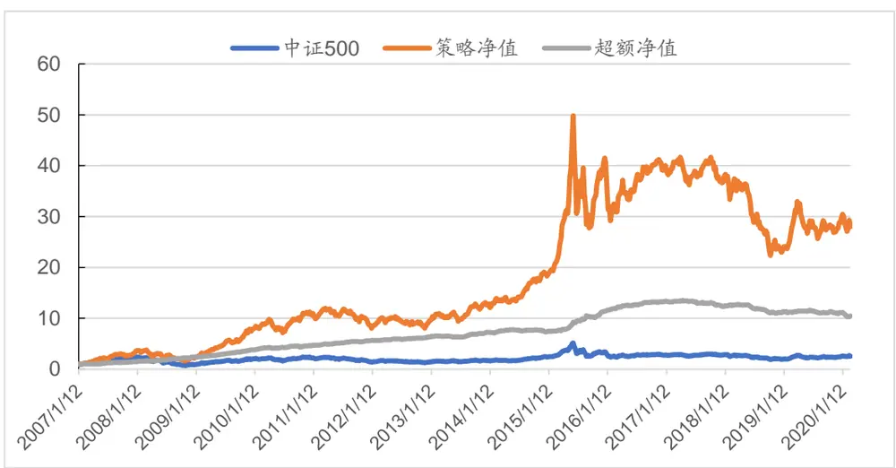
数据来源：Wind、天软、广发证券发展研究中心

表 31：处理后因子-中证500内多头-对冲分年度表现一览

| 多头 |  |  |  |  |  | 多头对冲指数 |  |  |  |  | 信息比率 |
| --- | --- | --- | --- | --- | --- | --- | --- | --- | --- | --- | --- |
| 年度 | 年化收益 (%) | 累计收益 (%) | 年化 波动率(%) | 最大回撤 (%) | 信息比率 | 年化收益 (%) | 累计收益 (%) | 年化 波动率(%) | 最大回撤 (%) |  |  |
| 2007 | 245.52 | 237.06 | 33.02 | 14.09 | 7.28 | 49.72 | 48.52 | 13.83 | 5.34 | 3.52 |  |
| 2008 | -35.08 | 115.08 | 53.41 | 57.85 | -0.64 | 57.93 | 138.88 | 9.04 | 3.24 | 6.28 |  |
| 2009 | 260.06 | 694.52 | 33.69 | 9.48 | 7.56 | 58.19 | 281.36 | 5.96 | 0.96 | 9.57 |  |
| 2010 | 33.02 | 962.96 | 28.35 | 26.97 | 1.14 | 21.14 | 363.75 | 9.10 | 4.79 | 2.28 |  |
| 2011 | -18.71 | 760.47 | 23.65 | 28.33 | -0.78 | 21.45 | 465.42 | 4.72 | 1.63 | 4.45 |  |
| 2012 | 10.12 | 847.55 | 23.62 | 22.16 | 0.42 | 12.06 | 533.62 | 4.27 | 2.21 | 2.77 |  |
| 2013 | 34.57 | 1182.76 | 19.53 | 16.01 | 1.73 | 14.88 | 629.93 | 6.13 | 4.10 | 2.38 |  |
| 2014 | 39.63 | 1727.30 | 16.80 | 7.07 | 2.31 | 0.96 | 637.35 | 5.59 | 5.93 | 0.17 |  |
| 2015 | 115.80 | 3966.45 | 49.33 | 44.31 | 2.30 | 53.31 | 1049.89 | 11.06 | 3.74 | 4.72 |  |
| 2016 | -3.55 | 3822.13 | 27.79 | 16.94 | -0.13 | 16.46 | 1239.15 | 4.34 | 0.95 | 3.71 |  |
| 2017 | -5.93 | 3584.86 | 13.94 | 13.02 | -0.42 | -7.31 | 1139.40 | 5.12 | 8.92 | -1.40 |  |
| 2018 | -37.13 | 2195.29 | 26.73 | 41.60 | -1.36 | -9.65 | 1017.53 | 5.69 | 13.91 | -1.66 |  |
| 2019 | 25.03 | 2782.72 | 22.39 | 22.16 | 1.10 | 0.02 | 1017.78 | 5.47 | 6.04 | 0.00 |  |
| 2020 至今 | -16.12 | 2702.79 | 29.54 | 10.98 | -0.53 | -33.10 | 948.16 | 12.54 | 7.75 | -2.59 |  |
| ALL | 28.19 | 2702.79 | 31.38 | 55.10 | 0.88 | 19.13 | 948.16 | 7.99 | 23.78 | 2.35 |  |

数据来源：Wind、天软、广发证券发展研究中心

## 处理后因子—沪深300选股

表 32: 处理后因子-沪深300内选股IC-表现

| 范围 | IC 均值 | IC 标准差 | IC最大值 | IC 最小值 | 正IC占比 |
| --- | --- | --- | --- | --- | --- |
| 沪深 300 | 0.031 | 0.106 | 0.379 | -0.270 | 60.21% |

数据来源：Wind、天软、广发证券发展研究中心

图 26：处理后因子-沪深300内选股IC值走势一览
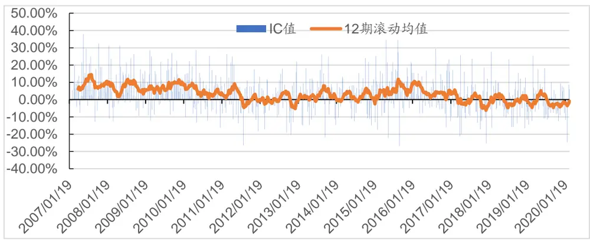
数据来源：Wind、天软、广发证券发展研究中心

表 33：处理后因子-沪深300内选股-IC分年度表现一览

| 分年度统计 | IC 均值 | IC 标准差 | IC 最大值 IC最小值 | 负IC占比 |
| --- | --- | --- | --- | --- |
| 2007 | 0.085 | 0.104 0.379 | -0.128 | 81.63% |
| 2008 | 0.069 | 0.105 0.313 | -0.134 | 75.00% |
| 2009 | 0.077 | 0.098 | 0.286 -0.122 | 78.43% |
| 2010 | 0.042 | 0.101 | 0.287 -0.162 | 64.71% |
| 2011 | 0.016 | 0.106 | 0.264 -0.264 | 54.90% |
| 2012 | 0.003 | 0.090 | 0.179 -0.202 | 52.00% |
| 2013 | 0.028 | 0.099 | 0.261 -0.219 | 64.71% |
| 2014 | 0.014 | 0.088 | 0.242 -0.149 | 56.60% |
| 2015 | 0.059 | 0.129 | 0.345 -0.270 | 67.31% |
| 2016 | 0.048 | 0.095 | 0.294 -0.163 | 62.00% |
| 2017 | -0.013 | 0.110 | 0.257 -0.253 | 43.14% |
| 2018 | 0.000 | 0.095 | 0.278 -0.165 | 43.14% |
| 2019 | -0.010 | 0.088 | 0.254 -0.143 | 43.14% |
| 2020 至今 | -0.037 | 0.112 | 0.087 -0.246 | 37.50% |

数据来源：Wind、天软、广发证券发展研究中心

表 34：处理后因子-沪深300内选股-分年度换手率统计

| 分年度统计 | 均值(%) | 最大值(%) 最小值(%) | 标准差(%) | 累计(%) |
| --- | --- | --- | --- | --- |
| 2007 | 78.70 | 96.00 66.67 | 14.11 | 3856.39 |
| 2008 | 78.38 | 96.43 51.85 | 9.26 | 4075.61 |
| 2009 | 80.91 | 96.43 60.71 | 6.92 | 4126.50 |
| 2010 | 78.67 | 93.10 58.62 | 8.62 | 4012.32 |
| 2011 | 79.11 | 96.55 58.62 | 8.74 | 4034.45 |
| 2012 | 82.12 | 100.00 64.29 | 7.23 | 4106.10 |
| 2013 | 82.31 | 100.00 62.07 | 9.14 | 4197.78 |
| 2014 | 80.48 | 96.55 53.33 | 9.61 | 4265.70 |
| 2015 | 76.80 | 93.10 53.57 | 9.28 | 3993.76 |
| 2016 | 81.86 | 96.43 67.86 | 6.84 | 4092.98 |
| 2017 | 80.24 | 96.43 62.07 | 7.89 | 4092.00 |
| 2018 | 77.98 | 96.55 62.07 | 8.29 | 3977.13 |
| 2019 | 76.01 | 90.00 60.00 | 7.66 | 3876.67 |
| 2020 至今 | 77.08 | 86.67 56.67 | 11.19 | 616.67 |
| ALL | 79.47 | 100.00 51.85 | 9.06 | 53324.05 |

数据来源：Wind、天软、广发证券发展研究中心

图 27：处理后因子-沪深300内选股-对冲沪深300指数策略净值走势
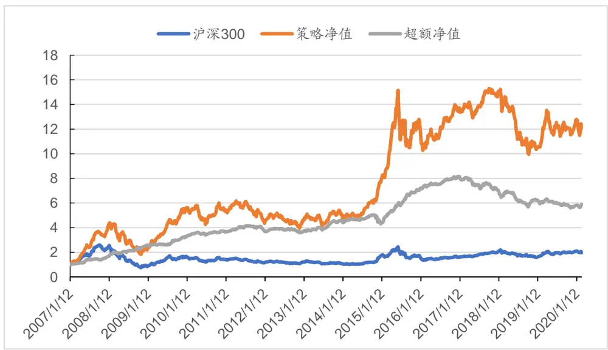
数据来源：Wind、天软、广发证券发展研究中心

表 35：处理后因子-沪深300内多头-对冲分年度表现一览

| 多头 |  |  |  |  | 多头对冲指数 |  |  |  |  | 信息比率 |
| --- | --- | --- | --- | --- | --- | --- | --- | --- | --- | --- |
| 年度 | 年化收益 | 累计收益 | 年化 波动率(%) | 最大回撤 | 信息比率 | 年化收益 | 累计收益 | 年化 | 最大回撤 |  |
| 2007 | (%) 310.55 | (%) 299.11 | 32.82 | (%) 11.72 | 9.27 | (%) 66.78 | (%) 65.09 | 波动率(%) 16.79 | (%) 6.94 | 3.90 |
| 2008 | -44.21 | 117.52 | 47.46 | 58.06 | -0.91 | 51.14 | 153.67 | 15.53 | 7.12 | 3.23 |
| 2009 | 151.70 | 457.69 | 26.67 | 7.62 | 5.57 | 26.28 | 221.83 | 10.92 | 3.57 | 2.36 |
| 2010 | -4.93 | 429.64 | 24.32 | 26.51 | -0.20 | 12.18 | 261.85 | 8.07 | 6.33 | 1.48 |
| 2011 | -14.90 | 349.26 | 20.46 | 26.86 | -0.71 | 4.13 | 277.08 | 8.55 | 8.95 | 0.47 |
| 2012 | 1.41 | 355.57 | 20.33 | 23.72 | 0.07 | -2.45 | 267.85 | 7.83 | 8.68 | -0.31 |
| 2013 | 11.56 | 409.33 | 19.71 | 19.08 | 0.57 | 23.27 | 355.37 | 9.36 | 5.43 | 2.44 |
| 2014 | 46.57 | 663.87 | 17.72 | 7.01 | 2.57 | -5.58 | 328.49 | 13.13 | 14.64 | -0.42 |
| 2015 | 60.46 | 1149.12 | 37.35 | 30.72 | 1.59 | 61.26 | 604.34 | 10.77 | 4.02 | 5.57 |
| 2016 | 7.31 | 1240.41 | 18.47 | 12.00 | 0.39 | 15.03 | 710.17 | 5.53 | 2.07 | 2.66 |
| 2017 | 8.34 | 1354.49 | 10.41 | 9.03 | 0.78 | -13.25 | 600.80 | 8.90 | 13.64 |  |
| 2018 | -28.71 | 929.86 | 22.40 | 34.70 | -1.26 | -11.21 | 520.76 | 10.72 | 19.11 | -1.46 |
| 2019 | 18.72 | 1126.90 | 18.46 | 15.57 | 0.99 | -7.34 | 474.30 | 7.62 | 11.61 | -1.03 |
| 2020 至今 | -11.88 | 1102.32 | 27.33 | 10.12 | -0.43 | 13.43 | 485.99 | 10.97 | 3.28 | -0.94 |
| ALL | 20.36 | 1102.32 | 26.81 | 34.87 | 0.74 | 14.08 | 485.99 | 11.07 | 31.45 | 1.20 1.25 |

数据来源：Wind、天软、广发证券发展研究中心

## 行业中性

为了控制行业风险，在构建多头对冲策略时，可以根据对冲指数的行业权重为策略选出的股票配权，利用上述方式重新构建股票组合后得到的结果如下。

表 36：处理后因子选股且行业中性-换手率统计

| 分板块统计 | 均值(%) | 最大值(%) | 最小值(%) | 标准差(%) | 累计(%) |
| --- | --- | --- | --- | --- | --- |
| 全市场 | 82.82 | 93.96 | 66.50 | 6.36 | 55575.38 |
| 中证 800 | 79.51 | 96.56 | 54.91 | 9.07 | 53354.11 |
| 中证 500 | 81.26 | 96.58 | 61.33 | 7.50 | 54522.15 |
| 沪深300 | 76.59 | 97.54 | 51.00 | 10.48 | 51393.75 |

数据来源：Wind、天软、广发证券发展研究中心

从表35中可以看出，行业中性处理后策略整体换手率有所降低。

表 37：行业中性后各板块对冲策略结果表现一览

| 处理后因子-对冲 |  |  |  |  |  | 处理后因子-行业中性-对冲 |  |  |  |  |
| --- | --- | --- | --- | --- | --- | --- | --- | --- | --- | --- |
| 板块 | 年化 收益(%) | 累计收益 | 年化 波动率(%) | 最大回撤 | 信息比率 | 年化收益 | 累计收益 | 年化 | 最大回撤 | 信息比率 |
| 全市场 | 24.98 | (%) 1893.38 | 8.62 | (%) 16.28 | 2.84 | (%) 25.29 | (%) 1960.07 | 波动率(%) 7.30 | (%) 15.50 | 3.39 |
| 中证 800 | 18.84 | 913.63 | 12.72 | 34.83 | 1.45 | 14.34 | 503.99 | 8.35 | 27.62 | 1.68 |
| 中证500 | 19.13 | 948.16 | 7.99 | 23.78 | 2.35 | 20.03 | 1058.73 | 6.95 | 15.82 | 2.82 |
| 沪深 300 | 14.08 | 485.99 | 11.07 | 31.45 | 1.25 | 9.69 | 245.80 | 7.55 | 25.12 | 1.26 |

数据来源：wind、天软、广发证券发展研究中心
识别风险，发现价值

从表37中可以看出，在全市场和中证500中，对处理后的因子选股做行业中性不会明显的影响其收益率，并且能够降低波动率和最大回撤，降低策略风险，从而提高策略的信息比率。

## （三）行业中性后分板块表现

## 行业中性—全市场选股

表 38：行业中性-全市场选股-分年度换手率统计

| 分年度统计 | 均值(%) | 最大值(%) 最小值(%) | 标准差(%) | 累计(%) |
| --- | --- | --- | --- | --- |
| 2007 | 79.81 | 90.74 | 74.19 17.74 | 3910.66 |
| 2008 | 80.90 | 92.19 66.83 | 5.92 | 4206.84 |
| 2009 | 86.53 | 93.73 | 76.90 3.66 | 4412.98 |
| 2010 | 85.59 | 93.11 | 79.26 3.15 | 4365.34 |
| 2011 | 83.22 | 90.07 75.18 | 3.26 | 4244.15 |
| 2012 | 83.20 | 89.83 75.95 | 3.35 | 4159.90 |
| 2013 | 83.93 | 90.08 73.76 | 3.65 | 4280.34 |
| 2014 | 83.47 | 93.57 73.17 | 4.02 | 4423.85 |
| 2015 | 82.92 | 93.96 66.50 | 5.04 | 4311.64 |
| 2016 | 84.00 | 91.47 77.91 | 3.29 | 4200.20 |
| 2017 | 81.38 | 90.71 73.86 | 3.61 | 4150.37 |
| 2018 | 80.76 | 87.69 73.43 | 3.76 | 4118.79 |
| 2019 | 81.00 | 92.07 | 73.59 4.12 | 4130.99 |
| 2020 至今 ALL | 82.42 82.82 | 87.30 93.96 | 78.71 3.00 66.50 6.36 | 659.34 55575.38 |

数据来源：Wind、天软、广发证券发展研究中心

图 28：行业中性-全市场选股-对冲中证500指数策略净值走势
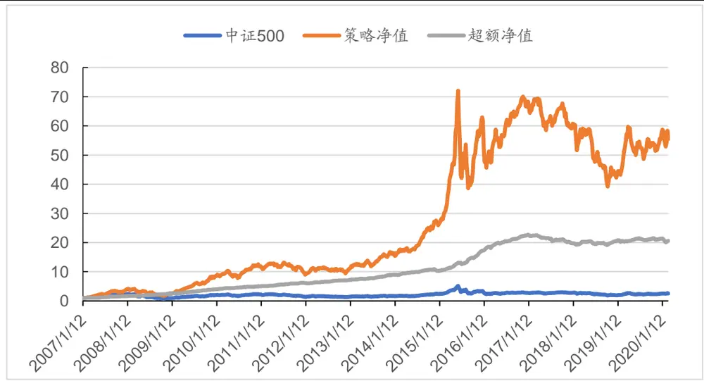
数据来源：Wind、天软、广发证券发展研究中心
识别风险，发现价值

表 39：行业中性-全市场多头-对冲分年度表现一览

| 多头 |  |  |  |  |  |  | 多头对冲指数 |  |  |  |
| --- | --- | --- | --- | --- | --- | --- | --- | --- | --- | --- |
| 年度 | 年化收益 (%) | 累计收益 (%) | 年化 波动率(%) | 最大回撤 (%) | 信息比率 | 年化收益 (%) | 累计收益 (%) | 年化 波动率(%) | 最大回撤 (%) | 信息比率 |
| 2007 | 290.36 | 279.87 | 32.80 | 14.09 | 8.67 | 69.52 | 67.74 | 12.81 | 2.20 | 5.32 |
| 2008 | -36.67 | 136.21 | 50.57 | 59.02 | -0.71 | 51.44 | 158.27 | 8.75 | 2.55 | 5.76 |
| 2009 | 250.44 | 748.80 | 31.71 | 6.55 | 7.74 | 53.03 | 298.61 | 5.13 | 1.08 | 10.14 |
| 2010 | 37.90 | 1078.02 | 27.27 | 24.67 | 1.36 | 25.54 | 402.71 | 5.48 | 2.13 | 4.57 |
| 2011 | -18.06 | 861.41 | 22.83 | 26.99 | -0.78 | 22.21 | 516.81 | 4.12 | 1.07 | 5.29 |
| 2012 | 14.00 | 996.00 | 23.27 | 18.47 | 0.59 | 15.89 | 614.80 | 4.67 | 2.38 | 3.33 |
| 2013 | 46.79 | 1521.23 | 18.97 | 14.51 | 2.42 | 25.27 | 799.46 | 5.16 | 1.97 | 4.79 |
| 2014 | 55.58 | 2490.12 | 18.34 | 6.11 | 2.97 | 12.87 | 922.63 | 5.77 | 6.41 | 2.19 |
| 2015 | 131.14 | 6090.98 | 50.43 | 46.45 | 2.55 | 65.83 | 1630.47 | 8.58 | 4.08 | 7.51 |
| 2016 | 8.07 | 6590.55 | 28.87 | 14.02 | 0.27 | 30.77 | 2162.87 | 5.44 | 2.21 | 5.54 |
| 2017 | -11.43 | 5811.43 | 15.93 | 15.65 | -0.70 | -12.49 | 1875.04 | 5.76 | 12.99 | -2.12 |
| 2018 | -27.99 | 4128.69 | 26.75 | 35.51 | -1.03 | 3.32 | 1942.00 | 6.43 | 6.38 | 0.51 |
| 2019 | 30.61 | 5452.59 | 21.76 | 18.49 | 1.38 | 4.37 | 2033.14 | 5.09 | 3.09 | 0.84 |
| 2020 至今 | -0.10 | 5451.70 | 32.42 | 9.93 | 0.00 | -19.58 | 1960.07 | 11.85 | 6.39 | -1.62 |
| ALL | 34.89 | 5451.70 | 31.06 | 46.45 | 1.10 | 25.29 | 1960.07 | 7.30 | 15.50 | 3.39 |

数据来源：Wind、天软、广发证券发展研究中心

行业中性——中证800内选股

表 40：行业中性-中证800内选股-分年度换手率统计

| 分年度统计 | 均值(%) 最大值(%) | 最小值(%) | 标准差(%) | 累计(%) |
| --- | --- | --- | --- | --- |
| 2007 | 78.47 | 90.74 65.90 | 18.18 | 3845.16 |
| 2008 | 79.19 | 92.57 60.93 | 7.16 | 4117.90 |
| 2009 | 78.83 | 95.97 65.81 | 7.73 | 4020.42 |
| 2010 | 78.88 | 93.31 59.94 | 8.72 | 4022.65 |
| 2011 | 79.64 | 96.28 57.25 | 9.25 | 4061.57 |
| 2012 | 81.99 | 96.56 69.52 | 6.60 | 4099.71 |
| 2013 | 81.48 | 95.73 62.29 | 8.54 | 4155.31 |
| 2014 | 80.24 | 93.74 60.10 | 8.65 | 4252.96 |
| 2015 | 77.61 | 92.98 59.25 | 8.21 | 4035.93 |
| 2016 | 80.42 | 91.52 62.03 | 6.97 | 4021.11 |
| 2017 | 79.55 | 92.68 62.98 | 7.52 | 4057.23 |
| 2018 | 79.37 | 90.97 63.09 | 6.61 | 4048.11 |
| 2019 | 77.65 | 90.55 54.91 | 8.31 | 3960.37 |
| 2020 至今 ALL | 81.96 79.51 | 88.85 64.95 96.56 54.91 | 8.52 9.07 | 655.66 53354.11 |

数据来源：Wind、天软、广发证券发展研究中心
识别风险，发现价值

图 29：行业中性-中证800内选股-对冲中证800指数策略净值走势
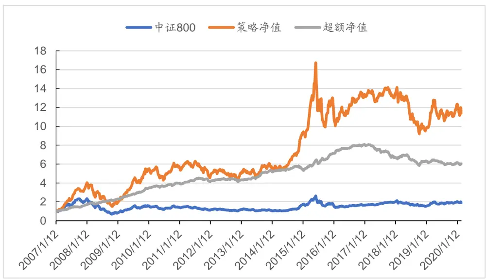
数据来源：Wind、天软、广发证券发展研究中心

表 41：行业中性-中证800多头-对冲分年度表现一览

| 多头 |  |  |  |  | 多头对冲指数 |  |  |  |  | 信息比率 |
| --- | --- | --- | --- | --- | --- | --- | --- | --- | --- | --- |
| 年度 | 年化收益 (%) | 累计收益 (%) | 年化 波动率(%) | 最大回撤 (%) | 信息比率 | 年化收益 (%) | 累计收益 (%) | 年化 波动率(%) | 最大回撤 (%) |  |
| 2007 | 279.40 | 269.41 | 29.61 | 9.73 | 9.24 | 69.41 | 67.63 | 12.49 | 5.60 | 5.44 |
| 2008 | -50.08 | 79.37 | 49.12 | 62.47 | -1.00 | 34.12 | 127.49 | 10.27 | 7.42 | 3.26 |
| 2009 | 198.15 | 446.60 | 31.12 | 12.22 | 6.24 | 48.24 | 239.90 | 7.66 | 1.46 | 6.17 |
| 2010 | 3.39 | 465.49 | 23.05 | 25.10 | 0.14 | 16.25 | 296.32 | 7.24 | 4.42 | 2.20 |
| 2011 | -16.65 | 369.63 | 20.46 | 25.46 | -0.80 | 5.37 | 318.03 | 7.07 | 7.53 | 0.74 |
| 2012 | 5.94 | 397.51 | 22.01 | 22.16 | 0.26 | 3.09 | 330.95 | 7.98 | 7.89 | 0.38 |
| 2013 | 15.71 | 477.37 | 19.13 | 15.61 | 0.80 | 22.78 | 431.27 | 6.54 | 2.57 | 3.41 |
| 2014 | 55.49 | 821.86 | 16.92 | 6.92 | 3.21 | 2.93 | 447.81 | 6.76 | 5.80 | 0.43 |
| 2015 | 36.48 | 1173.95 | 36.84 | 40.70 | 0.97 | 28.61 | 611.69 | 8.72 | 6.62 | 3.22 |
| 2016 | 2.67 | 1207.97 | 20.60 | 12.79 | 0.13 | 13.12 | 705.10 | 4.69 | 1.70 | 2.74 |
| 2017 | -0.09 | 1206.79 | 10.05 | 8.94 | -0.01 | -16.42 | 570.50 | 7.03 | 17.44 | -2.29 |
| 2018 | -26.86 | 849.85 | 22.85 | 34.86 | -1.15 | -6.31 | 527.39 | 8.96 | 16.23 | -0.69 |
| 2019 | 23.38 | 1076.87 | 18.69 | 17.38 | 1.23 | -3.18 | 507.06 | 5.77 | 8.24 | -0.54 |
| 2020 至今 | -17.49 | 1041.21 | 28.39 | 9.80 | -0.60 | -3.12 | 503.99 | 8.66 | 3.55 | -0.35 |
| ALL | 19.89 | 1041.21 | 27.21 | 45.06 | 0.72 | 14.34 | 503.99 | 8.35 | 27.62 | 1.68 |

数据来源：Wind、天软、广发证券发展研究中心

## 行业中性—中证500内选股

表 42：行业中性-中证500内选股-分年度换手率统计

| 分年度统计 | 均值(%) | 最大值(%) 最小值(%) | 标准差(%) | 累计(%) |
| --- | --- | --- | --- | --- |
| 2007 | 77.96 | 92.68 65.37 | 17.96 | 3819.82 |
| 2008 | 81.89 | 94.42 66.77 | 5.51 | 4258.51 |
| 2009 | 86.00 | 94.72 74.40 | 5.11 | 4385.95 |
| 2010 | 84.17 | 94.74 71.84 | 5.54 | 4292.70 |
| 2011 | 81.64 | 90.27 66.91 | 5.05 | 4163.57 |
| 2012 | 82.31 | 93.57 70.03 | 4.83 | 4115.54 |
| 2013 | 82.51 | 92.54 69.18 | 5.24 | 4208.07 |
| 2014 | 79.87 | 92.96 61.33 | 6.09 | 4232.91 |
| 2015 | 81.77 | 96.58 68.40 | 6.70 | 4252.18 |
| 2016 | 79.98 | 91.86 70.41 | 5.06 | 3999.14 |
| 2017 | 79.11 | 88.62 64.53 | 5.17 | 4034.37 |
| 2018 | 79.82 | 90.18 62.12 | 6.37 | 4070.62 |
| 2019 | 78.79 | 92.26 64.40 | 6.03 | 4018.50 |
| 2020 至今 ALL | 83.78 81.26 | 89.95 78.22 96.58 61.33 | 4.71 7.50 | 670.27 54522.15 |

数据来源：Wind、天软、广发证券发展研究中心

图 30：行业中性-中证500内选股-对冲中证500指数策略净值走势
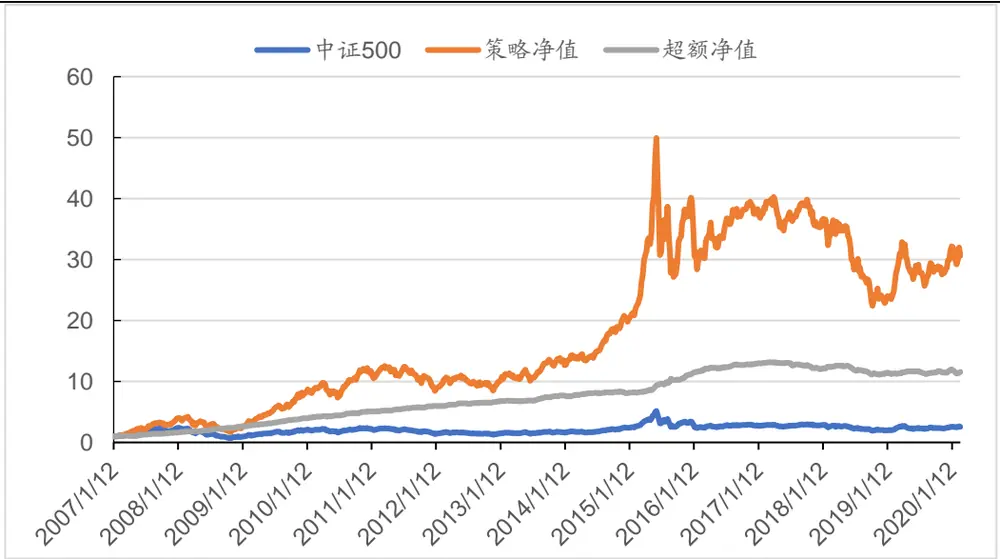
数据来源：Wind、天软、广发证券发展研究中心

表 43：行业中性-中证500内多头-对冲分年度表现一览

| 多头 |  |  |  |  |  | 多头对冲指数 |  |  |  |  | 信息比率 |
| --- | --- | --- | --- | --- | --- | --- | --- | --- | --- | --- | --- |
| 年度 | 年化收益 (%) | 累计收益 (%) | 年化 波动率(%) | 最大回撤 (%) | 信息比率 | 年化收益 (%) | 累计收益 (%) | 年化 波动率(%) | 最大回撤 (%) |  |  |
| 2007 | 273.64 | 263.92 | 33.65 | 13.66 | 7.97 | 62.60 | 61.03 | 13.06 | 2.86 | 4.70 |  |
| 2008 | -35.25 | 131.58 | 53.98 | 59.20 | -0.64 | 57.79 | 158.76 | 7.63 | 1.01 | 7.42 |  |
| 2009 | 244.63 | 718.09 | 34.01 | 6.76 | 7.05 | 51.52 | 295.35 | 5.15 | 0.50 | 9.79 |  |
| 2010 | 39.24 | 1046.65 | 28.23 | 25.09 | 1.36 | 27.02 | 404.58 | 6.64 | 1.97 | 3.99 |  |
| 2011 | -20.92 | 802.47 | 23.60 | 27.98 | -0.87 | 18.17 | 498.23 | 4.64 | 1.57 | 3.84 |  |
| 2012 | 10.06 | 893.25 | 23.45 | 22.68 | 0.42 | 11.97 | 569.85 | 3.94 | 1.78 | 2.98 |  |
| 2013 | 34.54 | 1244.24 | 19.61 | 15.12 | 1.73 | 14.96 | 672.25 | 4.58 | 1.99 | 3.20 |  |
| 2014 | 43.98 | 1878.20 | 16.88 | 4.87 | 2.55 | 4.21 | 706.78 | 4.26 | 3.18 | 0.97 |  |
| 2015 | 94.20 | 3845.12 | 49.13 | 45.69 | 1.88 | 38.13 | 1028.86 | 8.56 | 2.35 | 4.37 |  |
| 2016 | -4.98 | 3648.85 | 27.44 | 17.22 | -0.18 | 14.62 | 1193.92 | 4.50 | 1.36 | 3.18 |  |
| 2017 | -5.57 | 3436.12 | 14.18 | 13.65 | -0.38 | -6.88 | 1103.20 | 4.36 | 8.67 | -1.54 |  |
| 2018 | -34.78 | 2186.75 | 26.48 | 38.94 | -1.29 | -6.36 | 1025.23 | 5.54 | 12.10 | -1.13 |  |
| 2019 | 30.24 | 2894.12 | 22.26 | 21.75 | 1.33 | 4.19 | 1073.35 | 5.18 | 4.41 | 0.79 |  |
| 2020 至今 | 15.06 | 2962.10 | 31.61 | 9.21 | 0.47 | -7.54 | 1058.73 | 11.90 | 5.65 | -0.62 |  |
| ALL | 29.04 | 2962.10 | 31.46 | 55.19 | 0.90 | 20.03 | 1058.73 | 6.95 | 15.82 | 2.82 |  |

数据来源：Wind、天软、广发证券发展研究中心

行业中性—沪深300选股

表 44：行业中性-沪深300内选股-分年度换手率统计

| 分年度统计 | 均值(%) | 最大值(%) | 最小值(%) | 标准差(%) | 累计(%) |
| --- | --- | --- | --- | --- | --- |
| 2007 | 77.49 | 94.20 | 55.82 | 15.37 | 3797.12 |
| 2008 | 75.51 | 93.74 | 52.71 | 9.16 | 3926.30 |
| 2009 | 74.66 | 95.07 | 53.68 | 11.07 | 3807.76 |
| 2010 | 75.36 | 95.48 | 51.73 | 12.84 | 3843.43 |
| 2011 | 76.53 | 97.54 | 59.18 | 9.40 | 3902.89 |
| 2012 | 79.64 | 94.04 | 64.68 | 7.63 | 3982.15 |
| 2013 | 78.04 | 95.35 | 51.60 | 11.10 | 3980.09 |
| 2014 | 77.53 | 96.25 | 55.01 | 11.05 | 4108.99 |
| 2015 | 75.07 | 91.98 | 51.19 | 10.81 | 3903.72 |
| 2016 | 78.11 | 90.80 | 53.21 | 8.79 | 3905.55 |
| 2017 | 77.05 | 95.19 | 51.00 | 9.62 | 3929.67 |
| 2018 | 75.11 | 89.31 | 56.83 | 8.30 | 3830.64 |
| 2019 | 75.27 | 89.05 | 51.48 | 8.38 | 3839.00 |
| 2020 至今 ALL | 79.56 76.59 | 89.63 97.54 | 53.32 51.00 | 12.05 10.48 | 636.44 51393.75 |

数据来源：Wind、天软、广发证券发展研究中心
识别风险，发现价值

图 31：行业中性-沪深300内选股-对冲沪深300指数策略净值走势
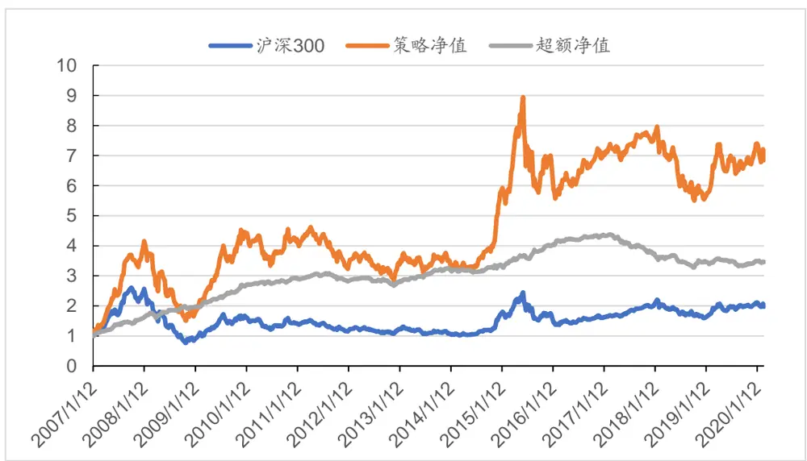
数据来源：Wind、天软、广发证券发展研究中心

表 45：行业中性-沪深300内多头-对冲分年度表现一览

| 多头 |  |  |  |  |  | 多头对冲指数 |  |  |  |  | 信息比率 |
| --- | --- | --- | --- | --- | --- | --- | --- | --- | --- | --- | --- |
| 年度 | 年化收益 (%) | 累计收益 (%) | 年化 波动率(%) | 最大回撤 (%) | 信息比率 | 年化收益 (%) | 累计收益 (%) | 年化 波动率(%) | 最大回撤 (%) |  |  |
| 2007 | 291.74 | 281.19 | 32.19 | 11.09 | 8.88 | 59.65 | 58.16 | 12.46 | 4.50 | 4.69 |  |
| 2008 | -55.28 | 65.08 | 47.93 | 63.71 | -1.13 | 22.75 | 95.73 | 10.61 | 9.18 | 2.10 |  |
| 2009 | 164.91 | 345.92 | 29.70 | 13.79 | 5.44 | 34.50 | 164.82 | 7.89 | 2.05 | 4.28 |  |
| 2010 | -6.93 | 314.42 | 22.99 | 24.52 | -0.30 | 9.64 | 190.89 | 5.73 | 2.68 | 1.65 |  |
| 2011 | -20.47 | 228.07 | 18.38 | 28.98 | -1.09 | -2.86 | 182.42 | 5.58 | 8.56 | -0.50 |  |
| 2012 | 2.88 | 237.53 | 20.42 | 24.19 | 0.14 | -0.92 | 179.82 | 6.64 | 9.12 | -0.14 |  |
| 2013 | 4.36 | 252.53 | 19.41 | 17.22 | 0.22 | 15.60 | 224.40 | 5.25 | 1.85 | 2.91 |  |
| 2014 | 59.15 | 476.94 | 20.08 | 8.78 | 2.89 | 3.72 | 237.22 | 6.65 | 4.15 | 0.55 |  |
| 2015 | 17.99 | 585.26 | 35.02 | 35.54 | 0.50 | 17.97 | 300.44 | 7.07 | 3.41 | 2.49 |  |
| 2016 | 1.27 | 593.96 | 18.19 | 11.38 | 0.07 | 8.58 | 334.81 | 4.21 | 1.56 | 2.00 |  |
| 2017 | 7.90 | 649.94 | 8.54 | 7.25 | 0.91 | -13.57 | 274.73 | 5.97 | 14.68 | -2.23 |  |
| 2018 | -25.67 | 454.12 | 21.29 | 30.98 | -1.18 | -7.42 | 246.38 | 7.64 | 12.38 | -0.95 |  |
| 2019 | 28.79 | 617.27 | 17.00 | 13.35 | 1.66 | 0.45 | 247.97 | 5.14 | 7.05 |  |  |
| 2020 至今 | -25.21 | 584.70 | 24.76 | 8.45 | -1.00 | -3.83 | 245.80 | 5.47 | 1.91 | 0.09 |  |
| ALL | 15.41 | 584.70 | 26.59 | 38.52 | 0.57 | 9.69 | 245.80 | 7.55 | 25.12 | -0.69 1.26 |  |

数据来源：Wind、天软、广发证券发展研究中心

## 五、总结

传统的多因子选股策略在国内市场上广泛应用，但最近几年随着市场风格的变换，历史上长期有效的因子逐渐失效，在传统数据维度中对因子的挖掘已逐渐饱和，因此对新因子的挖掘提出了迫切的需求。本篇专题报告从个股日内高频的数据出发，尝试从个股高频数据中挖掘新的因子指标，得到结论：

1. 结合个股微观市场结构，利用个股日内交易明细，结合LSV模型，构建个股短期内的羊群效应指标，并基于构造的指标在全市场、中证800、中证500及沪深300板块内进行了详细地测算。实证结果表明，因子指标在全市场、中证 800指数成分股、中证500 指数对个股收益率区分度较为明显，且分档收益单调性也较为明显；

2. 未经处理过的因子指标在全市场中选股，从2007年至今，IC均值为0.047，正IC占比为69.90%，多头组合在回测期内年化收益率为34.02%，信息比率为1.05；多头组合相对中证500指数年化超额收益率为24.61%，信息比率为2.59；

3. 经过处理后的因子指标全市场中选股，从2007年至今，IC均值为0.051，正IC占比为73.77%，多头组合在回测期内年化收益率为34.62%，信息比率为1.09；多头组合相对中证500指数年化超额收益率为24.98%，信息比率为2.84。

## 六、风险提示

本报告旨在对所研究问题的主要关注点进行分析，因此对市场及相关交易做了一些合理假设，但这样可能会导致基于模型所得出的结论并不能完全准确地刻画现实环境，在此可能会与未来真实的情况出现偏差。本报告内容并不是适合所有的投资者，客户在制定投资策略时，必须结合自身的环境和投资理念。

[Table_ResearchTeam] 广发金融工程研究小组

| 罗 |  | 军：首席分析师，华南理工大学硕士，从业14年，2010年进入广发证券发展研究中心，带领团队获得2019年“第十七届新 |
| --- | --- | --- |
|  |  | 安宁宁：联席首席分析师，暨南大学硕士，从业12年，2011年进入广发证券发展研究中心，2019年“第十七届新财富最佳分析 |
|  |  | 史庆盛：资深分析师，华南理工大学硕士，从业8年，2011年进入广发证券发展研究中心，2019年“第十七届新财富最佳分析师” |
| 张 |  | 超：资深分析师，中山大学硕士，从业7年，2012年进入广发证券发展研究中心，2019年“第十七届新财富最佳分析师”第 二名成员。 |
| 文巧钧：资深分析师，浙江大学博士，从业4年，2015年进入广发证券发展研究中心，2019年“第十七届新财富最佳分析师”第 | 二名成员。 |  |
|  |  | 二名成员。 |
|  |  | 二名成员。 |
|  |  | 第二名成员。 |
|  |  | 郭圳滨：研究助理，中山大学硕士，2018年进入广发证券发展研究中心。 |

## [Table_IndustryInvestDescription] 广发证券—行业投资评级说明

买入： 预期未来12个月内，股价表现强于大盘10%以上。

持有： 预期未来12个月内，股价相对大盘的变动幅度介于-10%～+10%。

卖出： 预期未来12个月内，股价表现弱于大盘10%以上。

## [Table_CompanyInvestDescription] 广发证券—公司投资评级说明

买入： 预期未来12个月内，股价表现强于大盘15%以上。

增持： 预期未来 12 个月内，股价表现强于大盘 5%-15%。

持有： 预期未来12个月内，股价相对大盘的变动幅度介于-5%～+5%。

卖出： 预期未来12个月内，股价表现弱于大盘5%以上。

[Table_Address] 联系我们

| 地址 | 广州市 | 深圳市 | 北京市 | 上海市 | 香港 |
| --- | --- | --- | --- | --- | --- |
|  | 广州市天河区马场路 | 深圳市福田区益田路 | 北京市西城区月坛北 | 上海市浦东新区世纪 | 香港中环干诺道中 |
|  | 26号广发证券大厦35 | 6001号太平金融大厦 | 街2号月坛大厦18层 | 大道8号国金中心一 | 111 号永安中心 14 楼 |
| 邮政编码 | 楼 | 31层 |  | 期16楼 | 1401-1410室 |
| 客服邮箱 | 510627 gfzqyf@gf.com.cn | 518026 | 100045 | 200120 |  |

## [Table_LegalD 法律主体isclaimer 声明]

本报告由广发证券股份有限公司或其关联机构制作，广发证券股份有限公司及其关联机构以下统称为“广发证券”。本报告的分销依据不同国家、地区的法律、法规和监管要求由广发证券于该国家或地区的具有相关合法合规经营资质的子公司/经营机构完成。

广发证券股份有限公司具备中国证监会批复的证券投资咨询业务资格，接受中国证监会监管，负责本报告于中国（港澳台地区除外）的分销。

“慧博资讯”专业的投资研究大数据分享平台

广发证券（香港）经纪有限公司具备香港证监会批复的就证券提供意见（4 号牌照）的牌照，接受香港证监会监管，负责本报告于中国香港地区的分销。

本报告署名研究人员所持中国证券业协会注册分析师资质信息和香港证监会批复的牌照信息已于署名研究人员姓名处披露。

## [Table_I 重要mportant 声明N

广发证券股份有限公司及其关联机构可能与本报告中提及的公司寻求或正在建立业务关系，因此，投资者应当考虑广发证券股份有限公司及其关联机构因可能存在的潜在利益冲突而对本报告的独立性产生影响。投资者不应仅依据本报告内容作出任何投资决策。

本报告署名研究人员、联系人（以下均简称“研究人员”）针对本报告中相关公司或证券的研究分析内容，在此声明：（1）本报告的全部分析结论、研究观点均精确反映研究人员于本报告发出当日的关于相关公司或证券的所有个人观点，并不代表广发证券的立场；（2）研究人员的部分或全部的报酬无论在过去、现在还是将来均不会与本报告所述特定分析结论、研究观点具有直接或间接的联系。

研究人员制作本报告的报酬标准依据研究质量、客户评价、工作量等多种因素确定，其影响因素亦包括广发证券的整体经营收入，该等经营收入部分来源于广发证券的投资银行类业务。

本报告仅面向经广发证券授权使用的客户/特定合作机构发送，不对外公开发布，只有接收人才可以使用，且对于接收人而言具有保密义务。广发证券并不因相关人员通过其他途径收到或阅读本报告而视其为广发证券的客户。在特定国家或地区传播或者发布本报告可能违反当地法律，广发证券并未采取任何行动以允许于该等国家或地区传播或者分销本报告。

本报告所提及证券可能不被允许在某些国家或地区内出售。请注意，投资涉及风险，证券价格可能会波动，因此投资回报可能会有所变化，过去的业绩并不保证未来的表现。本报告的内容、观点或建议并未考虑任何个别客户的具体投资目标、财务状况和特殊需求，不应被视为对特定客户关于特定证券或金融工具的投资建议。本报告发送给某客户是基于该客户被认为有能力独立评估投资风险、独立行使投资决策并独立承担相应风险。

本报告所载资料的来源及观点的出处皆被广发证券认为可靠，但广发证券不对其准确性、完整性做出任何保证。报告内容仅供参考，报告中的信息或所表达观点不构成所涉证券买卖的出价或询价。广发证券不对因使用本报告的内容而引致的损失承担任何责任，除非法律法规有明确规定。客户不应以本报告取代其独立判断或仅根据本报告做出决策，如有需要，应先咨询专业意见。

广发证券可发出其它与本报告所载信息不一致及有不同结论的报告。本报告反映研究人员的不同观点、见解及分析方法，并不代表广发证券的立场。广发证券的销售人员、交易员或其他专业人士可能以书面或口头形式，向其客户或自营交易部门提供与本报告观点相反的市场评论或交易策略，广发证券的自营交易部门亦可能会有与本报告观点不一致，甚至相反的投资策略。报告所载资料、意见及推测仅反映研究人员于发出本报告当日的判断，可随时更改且无需另行通告。广发证券或其证券研究报告业务的相关董事、高级职员、分析师和员工可能拥有本报告所提及证券的权益。在阅读本报告时，收件人应了解相关的权益披露（若有）。

本研究报告可能包括和或描述呈列期货合约价格的事实历史信息（“信息”）。请注意此信息仅供用作组成我们的研究方法分析中的部分论点依据/证据，以支持我们对所述相关行业/公司的观点的结论。在任何情况下，它并不（明示或暗示）与香港证监会第5类受规管活动（就期货合约提供意见）有关联或构成此活动。

## [Table_Interest 权益披露Disclosur

(1)广发证券（香港）跟本研究报告所述公司在过去12 个月内并没有任何投资银行业务的关系。

## [Table_Copyright] 版权声明

未经广发证券事先书面许可，任何机构或个人不得以任何形式翻版、复制、刊登、转载和引用，否则由此造成的一切不良后果及法律责任由私自翻版、复制、刊登、转载和引用者承担。