# [Table_Title] 信息不对称理论下的因子研究[Table_Title]

## 高频数据因子研究系列六

## 报告摘要：

因子开发迭代更新越来越重要。近几年来，随着传统多因子模型在市场的应用逐渐广泛，因子的波动特征逐渐加大，因子拥挤等原因造成了因子的收益逐渐下降。为了能够寻找更好的Alpha 收益，在多因子模型框架中，因子作为底层基础，因子的开发、迭代、更新就显得越来越重要。低频相关的数据的因子开发目前边际上的贡献已越来越小，高频数据在用于量化投资中存在一定优势。本篇专题探讨日内高频数据在因子选股中的引用。

信息不对称理论。在个股的交易中，基于市场的非充分有效特征，存在拥有信息优势的交易者，在市场的微观结构中可能更加如此。微观结构理论将市场参与者划分为拥有信息优势的交易者与没有信息优势的交易者两类，认为信息对资产的定价具有较大影响。基于信息不对称理论下的市场微观结构构建 VWPIN 因子，研究该因子在选股中的应用。

VWPIN 因子实证分析。因子分档实证分析结果表明，在周度调仓频率下，在回测期内VWPIN 因子在全市场、中证1000、中证 800、中证 500 以及创业板范围内因子分档单调性显著。从整体角度看，全市场范围内VWPIN因子选股效果较好，中性化因子IC 均值为 0.06，正IC 占比 76.59%，多头相对中证 800 年化收益率为 19.07%，年化波动率 16.15%，最大回撤 33.71%，信息比率为 1.18；中证 500 指数内，VWPIN 因子 IC 均值为 0.04，正 IC 占比为 66.12%，多空对冲策略年化收益率为 17.61%，年化波动率为 9.99%，信息比为 1.76，最大回撤为 18.60%。与 BARRA 因子之间的相关性较低，能够将其作为新的高频技术性因子加入多因子模型中。

风险提示。策略模型并非百分百有效，市场结构及交易行为的改变以及类似交易参与者的增多有可能使得策略失效。

图：VWPIN因子全市场表现
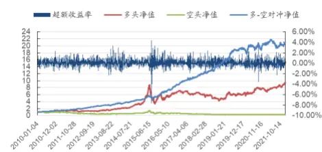
数据来源：Wind, 广发证券发展研究中心

[分析师：Table_Author]陈原文

同SAC 执证号：S0260517080003

0755-82797057

chenyuanwen@gf.com.cn

分析师： 罗军

同SAC 执证号：S0260511010004

020-66335128

luojun@gf.com.cn

分析师： 安宁宁

SAC 执证号：S0260512020003

SFC CE No. BNW179

0755-23948352

anningning@gf.com.cn

请注意，陈原文,罗军并非香港证券及期货事务监察委员会的注册持牌人，不可在香港从事受监管活动。

## [Table_ 相关研究：DocRe

行业聚类方法探讨:——重构 2021-11-17行业轮动框架之十

海量技术指标掘金 Alpha因2021-07-30
子:多因子 Alpha系列报告之
（四十二）

## 一、高频因子思考

## （一）从低频信息到高频信息

近年来，A股市场机构化趋势明显，量化私募机构的管理规模也迅速扩大，产生了一批管理规模超过百亿的量化私募机构。与此同时，传统的风格因子波动增大，从市场获取超额收益的难度在增加。

因子拥挤是因子收益下降的原因之一。因子代表着市场某方面的非有效性、或者是一段时期内的定价失效。当某类因子收益高的时候，会吸引更多的资金进入，从而出现因子拥挤，降低因子的预期收益。一旦新的因子被公开，套利资金的介入会使得错误定价收窄，因子收益也会跟着下降。因此，在多因子选股模型中，因子的开发和更新迭代变得越来越重要。

以传统日频价量和更低频财务数据为基础的因子开发是一种研究途径。由于基础因子广为人知，在此基础上进行因子挖掘的收益提升空间相对有限。而且日频数据由于本身的数据量和信息量有限，过度挖掘会增大过拟合的风险。

以高频价量数据为基础的因子开发在当下具有更大的收益提升空间。与低频因子相比，高频数据在用于量化投资中存在一定优势。

首先，高频价量数据的体量明显大于低频数据。以分钟行情为例，用压缩效果较好的mat格式存储2020年全市场股票的分钟行情数据（包括分钟频的开高低收价格数据、买卖盘挂单数据等），约为12GB。如果是快照行情（目前上交所和深交所都是3秒一笔）或者level 2行情，数据量要大很多。因此，高频数据因子挖掘对信息处理能力和处理效率的要求较高。而且，日内数据，尤其是level 2数据，一般要额外付费，甚至需要自行下载存储实时行情，在此基础上构建的因子拥挤度较低。

其次，高频价量数据一般是多维的时间序列数据，数据中噪声比例较高，而且与ROE、PE这类低频指标本身就具有选股能力不同的是，原始的高频行情数据一般不能直接用作选股因子，而要通过信号变换、时间序列分析、机器学习等方法从高频数据中构建特征，才能作为选股因子。此类因子与低频信号的相关性较低，而且由于因子开发流程相对复杂，不同投资者构建的因子更具有多样性。

此外，高频数据开发的因子一般调仓周期较短，意味着在检验因子有效性的时候，同一段测试期具有更多的独立样本。例如，在一年的测试期内，只有12个独立的样本段用于检验月频调仓的因子，与之相比，有约50个独立的时段用于检验周频调仓因子，有超过240个独立的时段用于检验日频调仓的因子。独立样本的增多有助于检验高频因子的有效性。

高频数据挖掘因子的难点在于数据维度大、噪声高。凭借专业投资者的经验或者是参阅已发表的文献，可以从高频数据中提炼出一部分有选股能力的特征。此外，机器学习方法擅长从数据中寻找规律和特征，是高频数据因子挖掘的有力工具。本篇专题报告通过学术上关于高频相关的研究结果借鉴，从高频价量数据中提炼选股因子。

表 1：广发金工高频数据因子挖掘系列报告一览

| 高频价量数据的因子化方法-多因子Alpha系列报告之（四十一） |
| --- |
| 深度学习框架下高频数据因子挖掘-深度学习研究报告之七 |
| 基于个股羊群效应的选股因子研究-高频数据因子研究系列三 |
| 基于日内高频数据的短周期选股因子研究-高频数据因子研究系列二 |
| 基于日内高频数据的短周期选股因子研究-高频数据因子研究系列一 |

数据来源：Wind，广发证券发展研究中心

## 二、研究进展

传统的有效市场假说认为，在完全有效的金融市场上，价格能够充分反映资产的所有公开信息以及私有信息。然而，现实世界中由于存在交易摩擦、投资者非理性行为、信息非完全公开等现象，拥有更多私人信息的市场参与者相对于信息匮乏的市场参与者而言，往往处于市场的有利地位。市场微观结构理论将市场参与者划分为拥有私人信息的交易者与没有私人信息的交易者两类，认为信息对资产价格的确定具有重大影响。在市场存在信息不对称时，具有私人信息的交易者会利用信息优势进行交易从而做出对自己有利的投资决策。同时，这种行为对于信息落后的交易者而言是一种投资风险，在市场交易的过程中使其处于劣势地位，从而蒙受损失。因此，如何衡量信息不对称的程度，进而规避由此带来的投资风险成为理论研究者以及业界关注的热点。

根据学术研究成果，信息不对称的度量主要经历了两个阶段：间接度量阶段与直接度量阶段。在早期研究阶段，买卖价差、换手率、股票价格方差等指标被用于信息不对称的替代变量进行研究，虽然这些变量和信息不对称都存在着因果关系，能够在一定程度上反映股票交易中蕴含的信息不对称水平，但是间接指标刻画知情交易导致的投资风险的准确性仍有进步的空间。

1996年，Easley等人发表论文《Liquidity, Information, and Infrequently TradedStocks》，基于交易委托单数据构建混合泊松分布模型，利用极大似然估计方法计算出信息优势交易者占总交易的比例，即信息优势的交易概率(Probability ofinformation-based trade, 简称为PIN)，使得对于信息不对称的度量进入直接度量阶段。在近二十多年，国内外学者纷纷对PIN模型进行深入探讨。

理论研究方面，学者利用参数与非参数的估计模型，对原始PIN模型进行改进，提出了对此度量更多深入的探讨。例如，Easley等人在《Flow Toxicity and Liquidityin a High-frequency World》(2012)论文中，规避了PIN模型极大似然估计方法计算复杂、数值优化过程耗时长等缺陷，利用非参数估计方法，基于同等交易量时间区间内的买卖订单交易量不平衡性能够测度信息优势交易概率的思路，在严格的数学推导过程中构建交易量实时更新的信息优势交易概率(Volume Synchronized PIN，简称为VPIN)模型。为应对VPIN模型在实证研究中曾出现度量失效的现象，李平等人于2020年发表论文《知情交易概率于风险定价——基于不同PIN测度方法的比较研究》，继承VPIN模型蕴含的买卖订单交易量不平衡程度能够反映信息优势交易信息的逻辑，将订单数量不平衡性同时纳入模型中，提出基于物理时间和交易量加权

识别风险，发现价值

的信息优势交易概率 (volume-weighted probability of informed trading，简称为VWPIN)模型。实证分析方面，利用国内外多个股票市场数据，分析了其在股票资产定价、风险管理等多个领域的应用。

## （一）PIN 模型

Easley等人在其发表论文《Price, trade size, and information in securitiesmarkets》(Journal of Financal Economics, 1987)中，基于计量经济学分析和经济理论，提出了用于分析市场资产价格发现过程的序贯交易模型(Sequential trademodel)。而经典的信息优势交易概率(Probability of information-based trade, 简称为PIN)模型正是在序贯交易模型的基础上，通过构建服从混合泊松分布的买卖订单流，并用极大似然估计方法对其求解得到的。详细建模步骤如下：

## 1. 模型假设

市场参与者类划分为信息优势交易者、非信息优势交易者、提供流动性的做市商；

样本时间段T平均分成I个交易区间，投资者在任意交易区间连续进行交易，并且交易价格由做市商决定；

不同交易区间的信息相互独立；

信息事件发生相关的概率假设如下：信息事件发生的概率为α，信息事件发生为坏消息的概率为δ；

投资者基于自己拥有的信息决定投资策略，信息优势交易者由于拥有更多的信息在投资过程中处于优势地位。因此，假设非信息优势交易者的委托单到达率为ε，信息优势交易者的委托单到达率为μ。

## 2. 构建买卖订单流二叉树

当信息事件不发生时，没有信息优势交易者参与交易，因此交易双方的委托单到达率均为ε。当信息事件发生时，有以下两种情况。当利好消息发生，非信息优势交易者可能将事先得知该消息并买入股票，非信息优势交易者可能买入股票也可能卖出股票，此时买方与卖方委托单到达率分别为ε+μ、ε。同理，当利空消息发生，信息优势交易者将事先得知该消息并卖出股票，非信息优势交易者可能买入或卖出股票，此时买方与卖方委托单到达率分别为ε、ε+μ。具体买卖订单流二叉树如下图所示：

图 1：买卖订单流二叉树
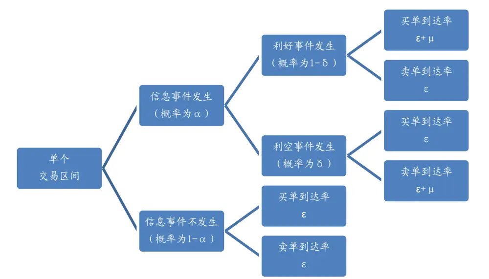
数据来源：Wind，广发证券发展研究中心

## 3. 基于贝叶斯法则的PIN模型数学推导

由于在交易过程中，假设做市商已知买卖订单流每种情况的发生概率，但是具体何种事件发生未知，做市商采用贝叶斯法则对信息是否发生的认知进行更新。同时做出如下假定：

做市商在“没有消息”、“坏消息”、“好消息”情况下的先验概率分别为： $\mathrm{P}(\mathrm{t})=$ $\left(\mathbb{P}_{n(t)},P_{b(t)},P_{g(t)}\right),\quad 且\quad t=0时,\quad\mathbb{P}(0)=\left(1-\alpha,\alpha\delta,\alpha(1-\delta)\right)$ ；

资产价格在“没有消息”、“坏消息”、“好消息”情况下分别为： $\mathrm{V}_{\mathrm{i}}^{*}、\underline{V_{i}}、\overline{V_{i}},$ ，且满足$\underline{{V_{i}}}<\mathrm{V_{i}^{*}}<\overline{{V_{i}}};$

根据不同信息事件的发生概率，可以得到t时刻的期望价格：

$$
\mathrm{E}(\mathrm{V}_{\mathrm{i}}|\mathrm{t})=\mathrm{P}_{\mathrm{n}}(t)V_{t}^{*}+P_{b}(t)\underline{V_{t}}+P_{-}g(t)\overline{V_{t}}.
$$

根据贝叶斯法则，在t时刻，卖单到来时的信息事件后验概率如下：

当信息事件不发生时：

$$
\mathbb{P}_{\mathrm{n}}(t|S_{t})=\frac{P_{n}(t)\epsilon}{\epsilon+P_{b}(t)\mu}
$$

当信息事件发生且为利好消息时：

$$
\mathrm{P}_{\mathrm{g}}(t|S_{t})=\frac{P_{g}(t)\epsilon}{\epsilon+P_{b}(t)\mu}
$$

当信息事件发生且为利空消息时：

$$
P_{\mathrm{b}}(t|S_{t})=\frac{P_{b}(t)(\epsilon+\mu)}{\epsilon+P_{b}(t)\mu}
$$

因此，做市商给出的买入报价为：

$$
\mathbf{b}(\mathbf{t})=\mathrm{E}[V_{\mathrm{i}}|\mathbf{t}]-\frac{\mu P_{\mathrm{b}}(t)}{\epsilon+\mu P_{\mathrm{b}}(t)}\left(\mathrm{E}[V_{\mathrm{i}}|t]-\underline{V_{\mathrm{i}}}\right)
$$

同理，可以推导出做市商给出的卖出报价为：

$$
\alpha(t)=\mathrm{E}[V_i|t]-\frac{\mu\mathrm{P}_g(t)}{\epsilon+\mu\mathrm{P}_g(t)}\left(\overline{V_i}-\mathrm{E}[V_i|t]\right)
$$

基于买入报价与卖出报价，可以得出不同市场情况下的买卖价差公式。一般情况下，市场中同时存在信息优势交易者与非信息优势交易者，这些交易者分别根据自身掌握的信息情况做出交易决策，此时的买卖价差公式如下。其中，第一项表示当利好消息出现时，信息优势交易概率与信息优势交易者买入交易预期损失的乘积，第二项表示当利空消息出现时，信息优势交易概率与信息优势交易者卖出交易预期损失的乘积。那么，总的PIN即为上述两种情况下概率之和。通过上述公式，可以推导出PIN模型公式。

$$
\begin{aligned}\sum(t)=\alpha(t)-b(t)=\frac{\mu\mathrm{P}_{\mathrm{g}}(t)}{\epsilon+\mu\mathrm{P}_{\mathrm{g}}(t)}\left(\overline{V}_{i}-E[V_{i}|t]\right)+\frac{\mu\mathrm{P}_{\mathrm{b}}(t)}{\epsilon+\mu\mathrm{P}_{\mathrm{b}}(t)}\left(E[V_{i}|t]-\underline{V}_{i}\right)\\\mathrm{PI}(t)=\frac{\mu\left(1-\mathrm{P}_{\mathrm{n}}(t)\right)}{\mu\left(1-\mathrm{P}_{\mathrm{n}}(t)\right)+2\epsilon}\end{aligned}
$$

根据上述给出的关于P(0)的先验概率假设，可以求得第一个交易时段的PIN模型：

$$
\mathrm{PIN}=\frac{\mu(1-P_{\mathrm{n}}(0))}{\mu(1-P_{\mathrm{n}}(0))+2\epsilon}=\frac{\alpha\mu}{\alpha\mu+2\epsilon}
$$

## 4. 极大似然估计法进行混合泊松分布参数估计

为获取股票的PIN模型估计值，Easley在《Liquidity, Information, andInfrequently Traded Stocks》(1996)论文中做出如下假定：买卖委托单服从泊松分布，每个交易时段内的交易行为相互独立。在上述分析基础上，可以得到关于买单B和卖单S的似然函数，如下所示：

当信息事件不发生时：

$$
\mathbf{e}^{-\epsilon T}\frac{(\epsilon T)^{B}}{B!}e^{-\epsilon T}\frac{(\epsilon T)^{S}}{S!}
$$

当信息事件发生且为利好消息时：

$$
e^{-(\mu+\epsilon)T}\frac{\left((\varepsilon+\mu)T\right)^{B}}{B!}e^{-\epsilon T}\frac{(\epsilon T)^{S}}{S!}
$$

当信息事件发生且为利空消息时：

$$
e^{-\epsilon T}\frac{(\varepsilon T)^{B}}{B!}e^{-(\epsilon+\mu)T}\frac{((\epsilon+\mu)T)^{S}}{S!}
$$

基于第（1）步关于信息事件发生概率的假设，可以得到以下混合泊松似然函数：

$$
\begin{aligned}\mathrm{L}<(\mathrm{B},S)|\boldsymbol{\theta}>=&(1-\alpha)*\mathbf{e}^{-\epsilon T}\frac{(\epsilon T)^B}{B!}e^{-\epsilon T}\frac{(\epsilon T)^S}{S!}+\alpha\delta\\&*e^{-\epsilon T}\frac{(\varepsilon T)^B}{B!}e^{-(\epsilon+\mu)T}\frac{\left((\epsilon+\mu)T\right)^S}{S!}+\alpha(1-\delta)\\&*e^{-(\mu+\epsilon)T}\frac{\left((\varepsilon+\mu)T\right)^B}{B!}e^{-\epsilon T}\frac{(\epsilon T)^S}{S!}\end{aligned}
$$

基于第（1）对样本区间T的I个交易区间的假设，结合交易方向的数据M =$(\mathrm{B_{i}},\mathrm{S_{i}})_{i=1}^{I}$ ，可以获得下述似然函数，并通过极大似然估计最终获得PIN模型的相关参数α、δ、ε以及μ。

$$
\mathrm{L}(\mathsf{M}|\boldsymbol{\theta})=\prod_{i=1}^{I}L(B_{i},S_{i}|\boldsymbol{\theta}),
$$

PIN模型的产生，从理论与实践两方面使得直接测度信息不对称风险成为可以实现的内容。但是，该模型仍然存在缺陷。首先，PIN模型所需的数据时间跨度长，易导致数据蕴含的非公开信息被稀释或丢失；其次，PIN因子实际包含了非公开信息与市场非流动性信息，而后者在此为冗余信息；最后，部分股票由于数据量过于庞大，用极大似然估计法计算PIN参数过程中，存在数值溢出问题。因此，Easley等学者在《Flow Toxicity and Liquidity in a High-frequency World》(2012)一文中，根据买卖双方交易量的不平衡性提出了改进的知情交易概率模型，即交易量实时更新的知情交易概率(VPIN)模型。

## （二）交易量实时更新的知情交易概率(VPIN)模型

交易量实时更新的Volume Synchronized PIN模型，简称为VPIN模型，是一种非参数估计模型。与PIN模型相比，它不需要进行复杂的极大似然估计获得知情交易概率的隐含参数，而是通过计算等交易量区间的交易量不平衡性来获得信息优势交易概率的测度。该模型的内在逻辑是：在高频交易的现实世界中，当信息连续地到达市场，投资者也会连续的对信息进行分析并做出交易决策。由于投资交易并不服从均匀分布，而是具有一定的不规则性， 那么同一信息引起的交易行为将以不同速度到达市场。基于上述思路，通过度量单位时间内的交易量的不平衡性所构建的PIN模型则与现实情况存在偏差，因此VPIN模型对此进行优化。该模型以相同的交易量划分交易区间，认为只有当交易量达到设定的阈值时，信息才完全融入了市场中。具体的VPIN模型构建步骤如下：

## 1. 划分等交易量的交易区间

将按时间排列的交易数据分成等交易量的交易篮子，每个交易篮子所包含的交易量定为V，如果上一笔交易装满了一个篮子且还有剩余，那么余下的部分将会被分配给下一个篮子，令 $\boldsymbol{\cdot}\boldsymbol{\tau}=1,2\ldots\boldsymbol{\mathsf{n}}$ 为所有等交易量的交易篮子。

## 2. 基于正态分布假设对交易方向进行判断

为刻画交易量的不平衡性，需要先将交易方向进行划分，得到卖方交易量VS与买方交易量 $\mathrm{V^{B}}$ 。假设 $\mathbf{\tau}=1,2\ldots\mathbf{n},$ 为交易篮子的下标，那么单个交易篮子的总交易量为 $\begin{array}{r}{\mathbb{V}_{\tau}=V_{\tau}^{B}+V_{\tau}^{S}.}\end{array}$ 。根据Easley等人在《Flow toxicity and volatility in a high frequency world》(2011)论文中给出的BVC算法，可以得到如下交易量计算公式：

$$
\mathrm{V}_{\tau}^{B}=\sum_{i=t(\tau-1)+1}^{t(\tau)}V_{i}*Z\left(\frac{P_{i}-P_{i-1}}{\sigma_{\nabla P}}\right)
$$

$$
\mathrm{V}_{\tau}^{S}=\sum_{i=t(\tau-1)+1}^{t(\tau)}V_{i}\left[1-Z\left(\frac{P_{i}-P_{i-1}}{\sigma_{\nabla P}}\right)\right]=V_{\tau}-V_{\tau}^{B}
$$

其中，t(τ)为第τ个交易篮子(第τ个等交易量区间)，Z表示正态分布下的累计密度函数。如果等交易量区间内价格没有发生变化，则认为该交易时段内的买方交易量与卖方交易量相同。如果等交易量区间内价格上升，则买方交易量的比重将会提升。

## 3. VPIN公式推导

在PIN模型的建模过程中，已经知道了信息事件发生的概率情况，并且假定买单与卖单均服从泊松分布，参数分别为ε+μ、ε。据此可以得到交易量的不平衡度量，即买卖委托单数量差额的绝对值的期望，以及总交易量的度量，具体公式如下：

$$
\mathrm{E}[\left|V_{\tau}^{\mathrm{S}}-V_{\tau}^{\mathrm{B}}\right|]=\frac{1}{n}\sum_{\tau=1}^{n}\left|V_{\tau}^{\mathrm{S}}-V_{\tau}^{\mathrm{B}}\right|=\alpha\mu
$$

$$
\mathrm{E}[\mathrm{V}_{\tau}^{S}+\mathrm{V}_{\tau}^{B}]=\frac{1}{n}\sum_{\tau=1}^{n}(V_{\tau}^{S}+V_{\tau}^{B})=V=\alpha\mu+2\epsilon
$$

因此，交易量实时更新的知情交易概率(VPIN)计算公式为：

$$
\mathrm{VPIN}=\frac{\alpha\mu}{\alpha\mu+2\epsilon}=\frac{\alpha\mu}{V}\approx\frac{\sum_{\tau=1}^{n}\left|V_{\tau}^{S}-V_{\tau}^{B}\right|}{nV}
$$

不论是计算复杂程度还是构建思路，VPIN模型相较于PIN模型而言，都更加贴合实际情况的需要，但是VPIN模型仍然具有改进的空间。一方面，VPIN模型没有考虑到知情交易者为隐藏其意图而拆小单进行交易的情况，其计算公式只反映了交易量的不平衡性，未能反映订单数量的不平衡性；另一方面，该模型需要提前利用长期历史数据确定交易篮子的总交易量V，只能对历史数据进行回测，不适用于对证券市场的信息不对称风险实时监测。针对上述两个问题，李平等人于2020年在论文《知情交易概率于风险定价——基于不同PIN测度方法的比较研究》中，考虑了VWPIN模型。

## （三）交易量加权的知情交易概率(VWPIN)模型

基于物理时间和交易量加权的volume-weighted probability of informed trading模型，简称VWPIN模型，继承了VPIN模型的基本思路，认为不同的交易量反映的信息量也不同，同时基于信息优势交易可能存在大单交易，或为隐藏其交易意图而拆小单进行交易的实际情况，将订单数量的不平衡性加入模型的考虑范围。具体而言，VWPIN模型计算了固定时间范围内，交易量加权的订单数量不平衡程度。具体计算步骤如下：

$$
\mathrm{VWPIN}=\sum_{i=1}^{n}w_{i}Pin_{i}=\sum_{i=1}^{n}w_{i}\frac{|S_{i}-B_{i}|}{S_{i}+B_{i}}
$$

$$
\mathbf{w}_{i}=\frac{TradVol_{i}}{\sum_{i=1}^{n}TradVol_{i}}
$$

其中，n为固定时间范围内划分的交易区间个数， $\mathrm{Pin_{i}}$ 第i个区间的知情交易概率，$\mathsf{S}_{\mathrm{i}}$ 为第i个交易区间的卖单数量， $\mathrm{B_{i}}$ 为第i个交易区间的买单数量， $w_{\mathrm{i}}$ 为第i个交易区间的交易量加权系数， $\mathrm{TradVol_{i}}$ 为第i个交易区间的交易量。

相比之前的知情交易概率模型，VWPIN模型具有计算简便、综合考虑订单数量和交易量、不受估计区间限制等优点，能够适应不同股票市场，作为信息不对称程度更为准确的直接度量。

因此，本篇专题报告将基于信息不对称理论，探讨基于此理论构造的VWPIN的因子在A股的有效性。

## 三、VWPIN因子构造

## （一）VWPIN 因子构造

根据信息不对称理论及VWPIN模型的定义，本篇专题报告构建VWPIN因子，用来衡量市场中个股反映信息不对称程度的知情交易概率。

## （二）VWPIN 因子计算步骤

VWPIN模型的计算是利用个股的区间交易量、区间主买(卖)成交笔数来实现的，其中买卖交易方向依据Lee-Ready算法事先进行判断。具体计算如下：首先，在第t天第i个交易区间，利用个股的主买(卖)成交笔数计算交易数量的不平衡性，以刻画知情交易概率；其次，根据第t天全天总体交易量与第i个交易区间的交易量数据，计算个股区间交易量占比，以反映这一区间知情交易概率涵盖信息量的重要程度；再次，将前两步获得的第i个交易时段的交易量占比权重与交易概率相乘；最后，将个股在第t天所有交易区间的加权概率求和，得到VWPIN因子。为得到VWPIN平滑因子，还需要在VWPIN因子基础上，对个股在周/月内的VWPIN因子数据求均值，如果在频率内存在无数据的情况，对这些交易日进行剔除，再计算个股的VWPIN平滑因子，VWPIN因子计算步骤流程如下图所示：

图 2：VWPIN因子计算步骤流程图
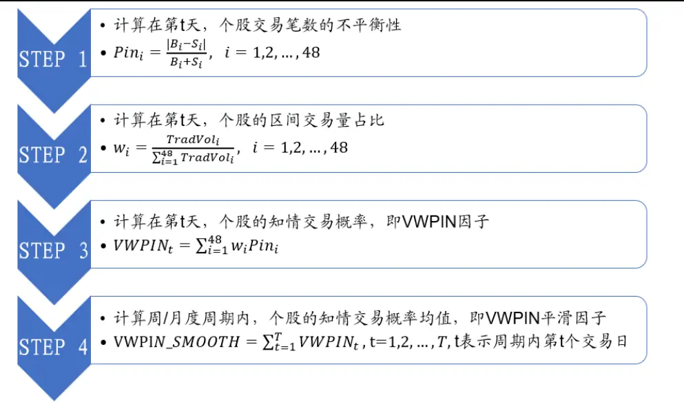
数据来源：Wind，广发证券发展研究中心

## （三）VWPIN 因子计算举例

假设当前交易日为t，每5分钟作为一个交易区间，则交易区间为i = 1,2…48，那么VWPIN因子计算举例如下图所示。特此说明，基于下图构建的VWPIN因子仅为原始因子值。在后文实证分析、相关性分析以及敏感性分析中，所用的因子值均为在原始因子值的基础上，经过了MAD法去极值、Z-Score标准化以及行业市值中性化处理后的VWPIN因子和VWPIN平滑因子。

图 3：VWPIN因子计算示例图

| 交易 区间 | 区间主买成 交笔数 | 区间主卖成 交笔数 | 区间 知情交易概率 | 区间 交易量 |  | 区间 交易量权重 | 区间加权 知情交易概率 |
| --- | --- | --- | --- | --- | --- | --- | --- |
| 1 | $B_{1}$ | $S_{1}$ | $Pin_{1}=\frac{\|B_{1}-S_{1}\|}{B_{1}+S_{1}}$ | TradVol1 |  | $w_{1}=\frac{TradVol_{1}}{\sum TradVol_{i}}$ | $w_{1}Pin_{1}$ |
| 2 | $B_{2}$ | $S_{2}$ | $Pin_{2}=\frac{\|B_{2}-S_{2}\|}{B_{2}+S_{2}}$ |  | $TradVol_{2}$ | $w_{2}=\frac{TradVol_{2}}{\sum TradVol_{i}}$ | $w_{2}Pin_{2}$ |
| 47 | $B_{47}$ | $S_{47}$ | $Pin_{47}=\frac{\|B_{47}-S_{47}\|}{B_{47}+S_{47}}$ | $TradVol_{47}$ |  | $w_{47}=\frac{TradVol_{47}}{\sum TradVol_{i}}$ | $w_{47}Pin_{47}$ |
| 48 | $B_{48}$ | $S_{48}$ | $Pin_{48}=\frac{\|B_{48}-S_{48}\|}{B_{48}+S_{48}}$ | TradVol₄8 |  | $w_{48}=\frac{TradVol_{48}}{\sum TradVol_{i}}$ | $w_{48}Pin_{48}$ $\sum_{\mathrm{i}=1}^{48}w_{i}Pin_{i}$ |

数据来源：Wind，广发证券发展研究中心

## 四、基于 VWPIN因子的选股策略构建

## （一）VWPIN 因子与中证全指走势分析

通过绘制VWPIN因子与中证全指价格在过去十余年期间的走势图，可以发现VWPIN符合信息不对称理论及其内在的知情交易概率含义。当VWPIN因子下降，中证全指价格处于上升阶段；当VWPIN因子上升，中证全指价格处于下降阶段。这背后的逻辑是，当VWPIN因子上升，说明知情交易概率增加，市场中信息不对称风险增大，市场整体价格表现一般。

图 4：VWPIN因子与中证全指价格走势图
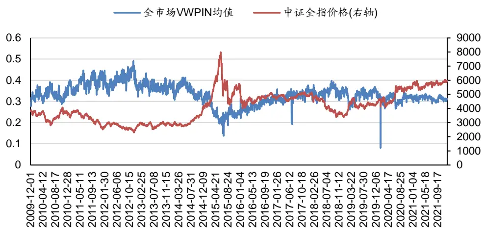
数据来源：Wind，广发证券发展研究中心

## （二）VWPIN 因子与个股价格走势分析举例

为研究VWPIN因子在选股领域中的作用，本报告以某个股为例，对比了2021年期间，VWPIN因子与某个股价格走势之间的关系。如下图所示，VWPIN因子与股价历次股票价格的大幅波动相关，但具体表现却与前述关于市场走势关系相反，当VWPIN因子上升，股票价格走强；当VWPIN因子下降，股票价格走势回落。这一表现与之前的结论并不冲突，可能与国内市场的投资者结构相关。

图 5：VWPIN因子与某个股价格走势图
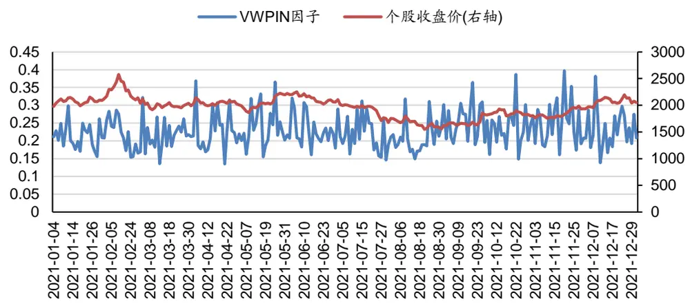
数据来源：Wind，广发证券发展研究中心

## （三）VWPIN 因子策略构建框架

据此，本篇专题报告构建如下交易策略：根据个股的信息优势交易概率度量，在调仓日买进VWPIN最大的组合，同时卖出VWPIN最小的组合。

图 6：VWPIN因子策略构建框架图
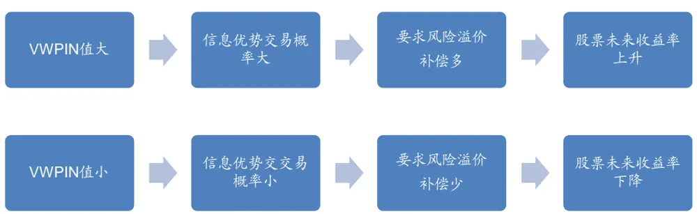
数据来源：Wind，广发证券发展研究中心

## 五、实证分析

## （一）数据说明

选股范围：全市场、中证500、中证800、创业板指、沪深300

股票预处理：剔除非上市、摘牌、ST/ST*、涨跌停板、上市未满1年股票

因子预处理：MAD去极值、Z-Score标准化、行业市值中性化

回测区间： 2010.01.01 – 2021.12.31

分档方式：根据当期股票的因子值，从小到大分为十档/五档

调仓周期：每个月/每周最后一个交易日以收盘价调仓

交易费用：千分之三（卖出时收取）

## （二）因子分档表现

## 1. 因子分档表现-VWPIN因子

图 7：全市场 VWPIN因子五档-月度调仓
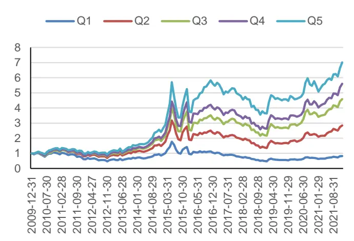
数据来源：Wind，广发证券发展研究中心

图 8：全市场 VWPIN因子五档-周度调仓
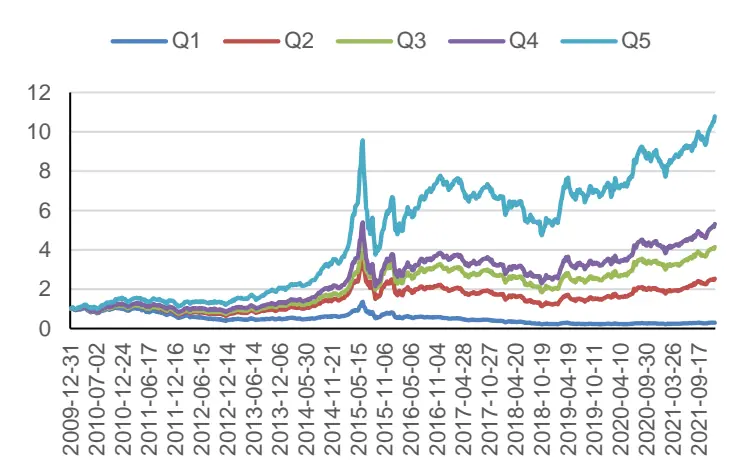
数据来源：Wind，广发证券发展研究中心

图 9：全市场 VWPIN因子十档-月度调仓
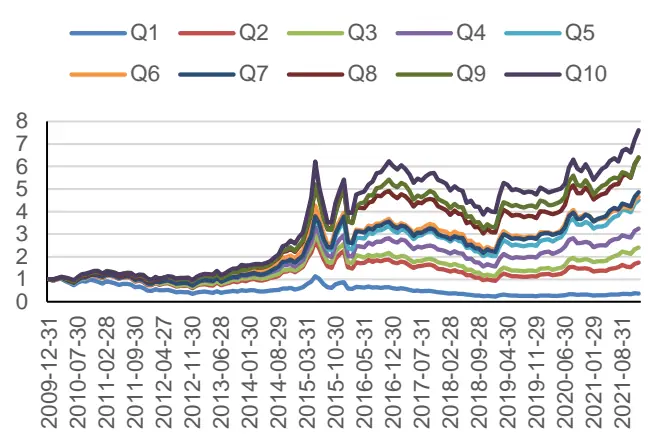
数据来源：Wind，广发证券发展研究中心

图 10：全市场 VWPIN因子十档-周度调仓
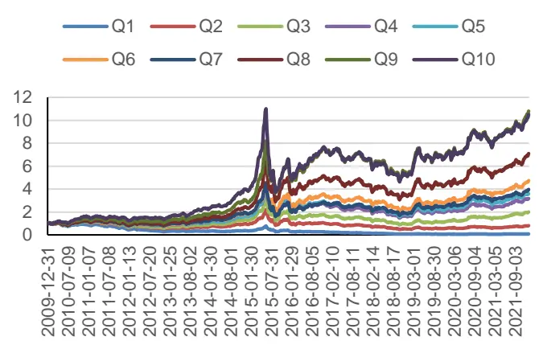
数据来源：Wind，广发证券发展研究中心

图 11：中证1000指数内VWPIN因子五档-月度调仓
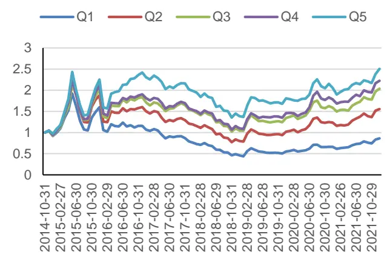
数据来源：Wind，广发证券发展研究中心

图 12：中证1000指数内VWPIN因子五档-周度调仓
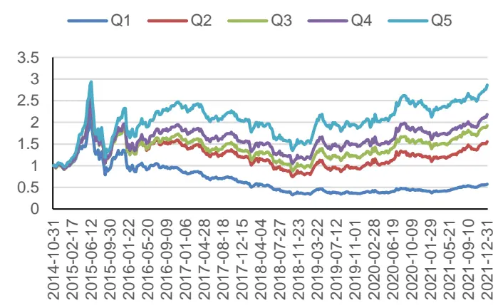
数据来源：Wind，广发证券发展研究中心

图 13：中证1000指数内VWPIN因子十档-月度调仓
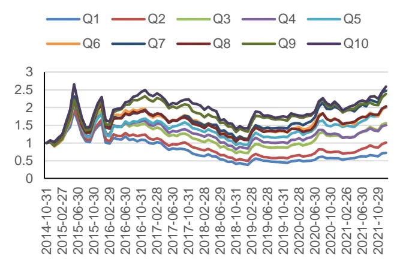
数据来源：Wind，广发证券发展研究中心

图 14：中证1000指数内VWPIN因子十档-周度调仓
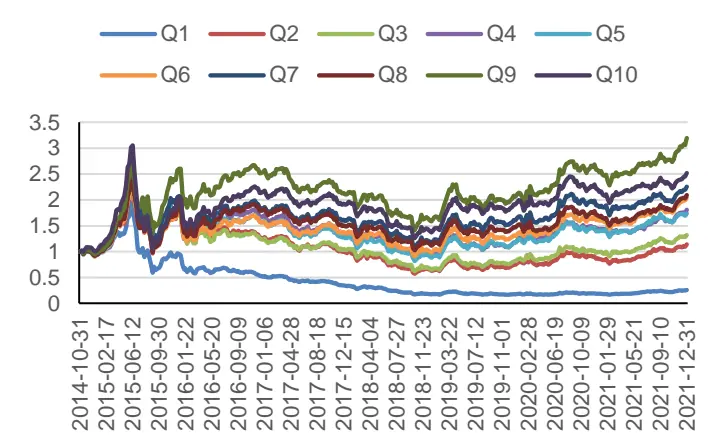
数据来源：Wind，广发证券发展研究中心

图 15：中证800指数内VWPIN因子五档-月度调仓
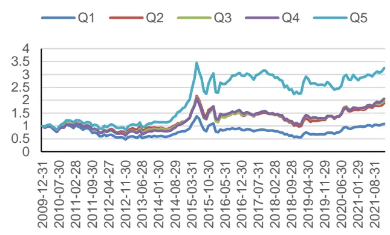
数据来源：Wind，广发证券发展研究中心

图 16：中证800指数内VWPIN因子五档-周度调仓
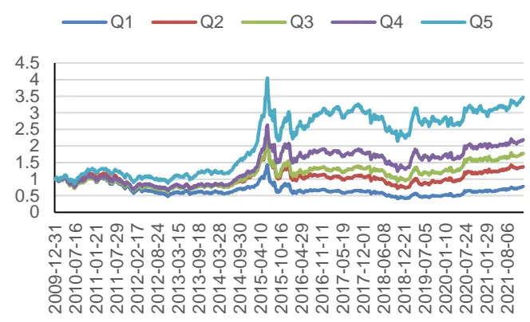
数据来源：Wind，广发证券发展研究中心

图 17：中证500指数内VWPIN因子五档-月度调仓
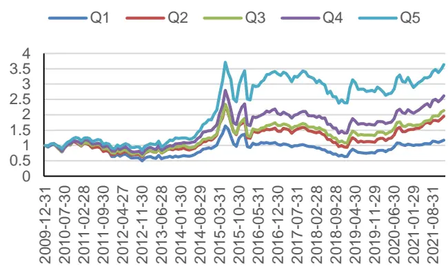
数据来源：Wind，广发证券发展研究中心

图 18：中证500指数内VWPIN因子五档-周度调仓
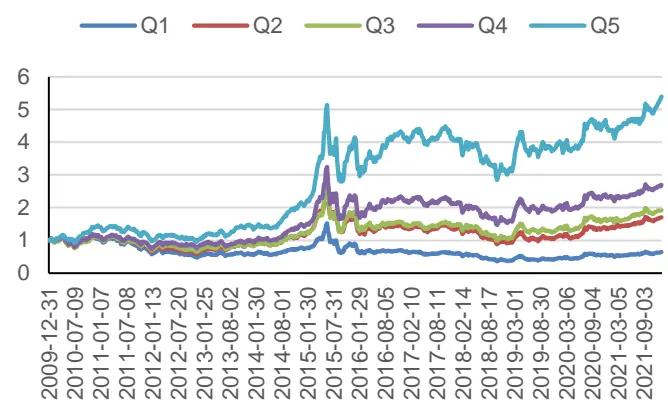
数据来源：Wind，广发证券发展研究中心

图 19：沪深300指数内VWPIN因子五档-月度调仓
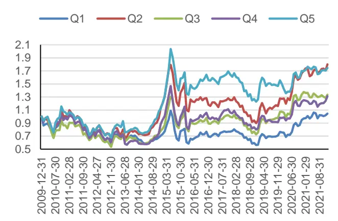
数据来源：Wind，广发证券发展研究中心

图 20：沪深300指数内VWPIN因子五档-周度调仓
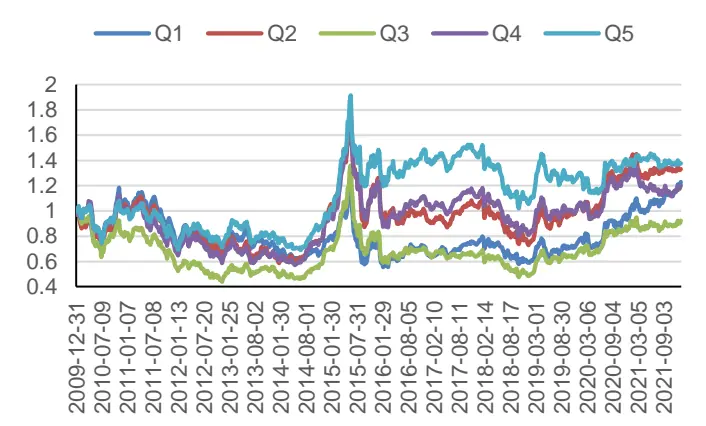
数据来源：Wind，广发证券发展研究中心

图 21：创业板指数内VWPIN因子五档-月度调仓
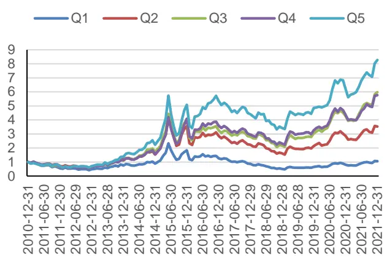
数据来源：Wind，广发证券发展研究中心

图 22：创业板指数内VWPIN因子五档-周度调仓
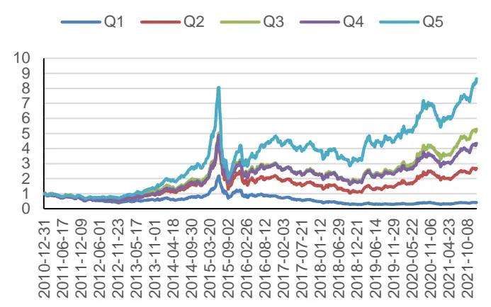
数据来源：Wind，广发证券发展研究中心

图 23：创业板指数内VWPIN因子十档-月度调仓
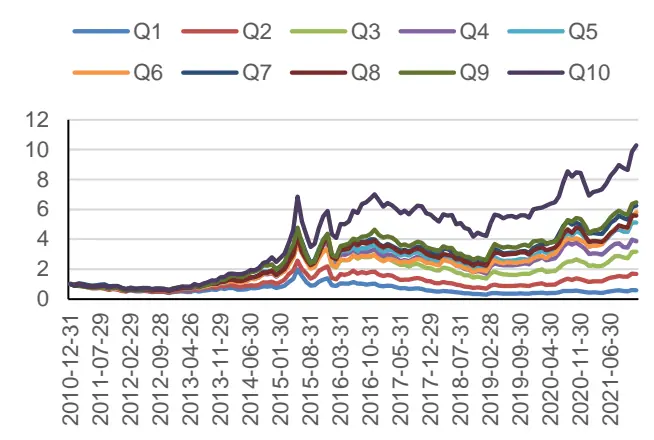
数据来源：Wind，广发证券发展研究中心

图 24：创业板指数内VWPIN因子十档-周度调仓
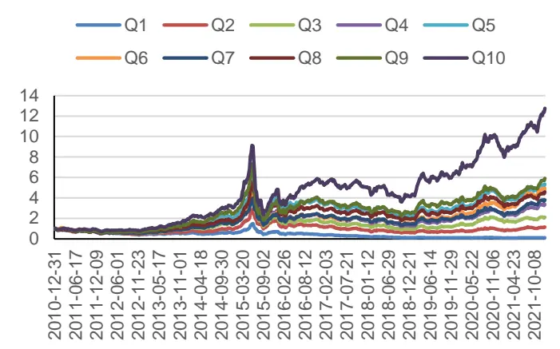
数据来源：Wind，广发证券发展研究中心

在月度调仓、周度调仓的历史回测下，VWPIN因子在沪深300分档效果不明显，区分度一般，在其他版块中5档分档下，整体因子单调性显著。

## 2. 因子分档表现-VWPIN平滑因子

具体的计算方式以周频交易为例，对个股在周一至周五的VWPIN因子进行等权求和，取得当周周五的VWPIN平滑因子。同理，可以取得月频交易的VWPIN平滑因子。

图 25：全市场 VWPIN平滑因子五档-月度调仓
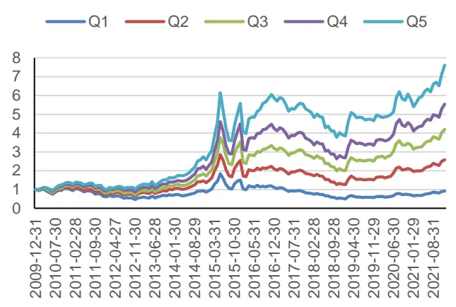
数据来源：Wind，广发证券发展研究中心

图 26：全市场 VWPIN平滑因子五档-周度调仓
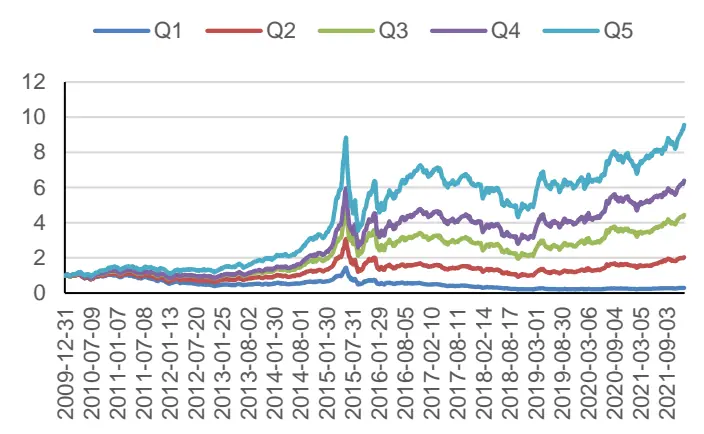
数据来源：Wind，广发证券发展研究中心

图 27：全市场 VWPIN平滑因子十档-月度调仓
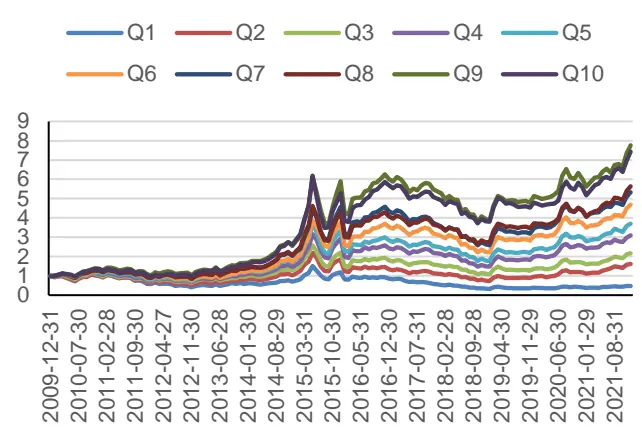
数据来源：Wind，广发证券发展研究中心

图 28：全市场 VWPIN平滑因子十档-周度调仓
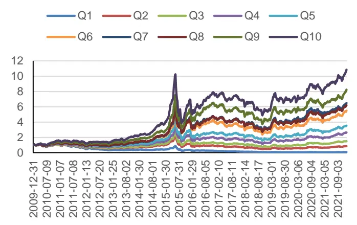
数据来源：Wind，广发证券发展研究中心

图 29：中证1000 VWPIN平滑因子五档-月度调仓
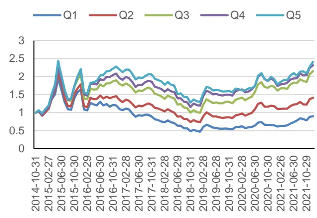
数据来源：Wind，广发证券发展研究中心

图 30：中证1000 VWPIN平滑因子五档-周度调仓
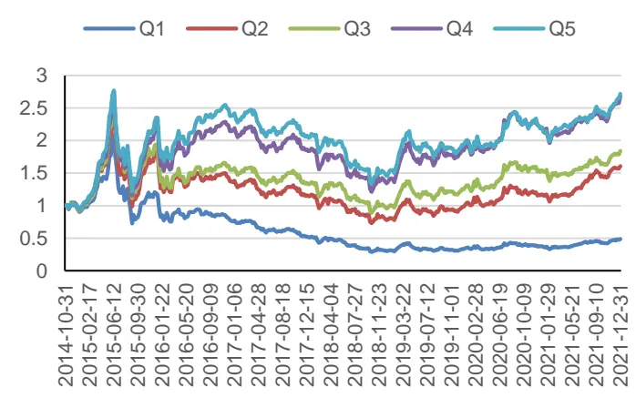
数据来源：Wind，广发证券发展研究中心

图 31：中证1000 VWPIN平滑因子十档-月度调仓
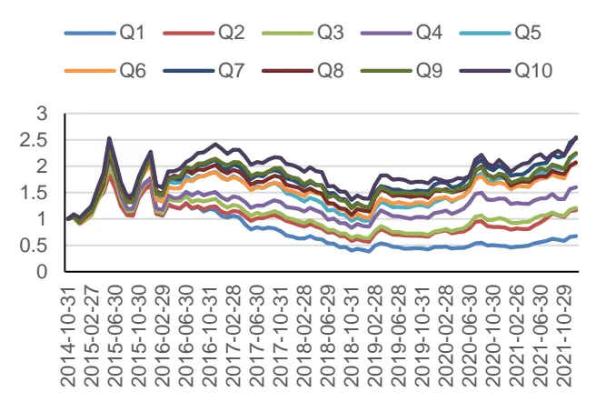
数据来源：Wind，广发证券发展研究中心

图 32：中证1000 VWPIN平滑因子十档-周度调仓
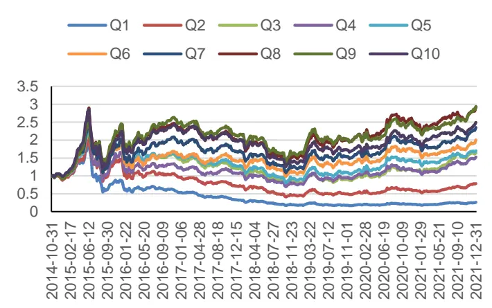
数据来源：Wind，广发证券发展研究中心

图 33：中证800 VWPIN平滑因子五档-月度调仓
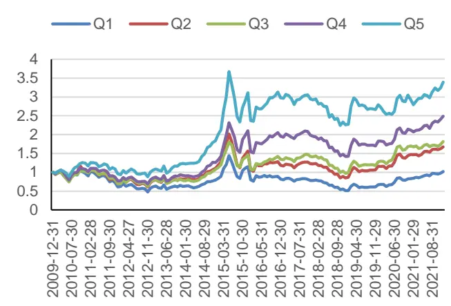
数据来源：Wind，广发证券发展研究中心

图 34：中证800 VWPIN平滑因子五档-周度调仓
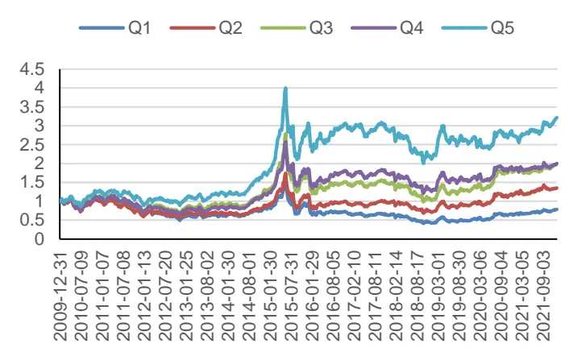
数据来源：Wind，广发证券发展研究中心

图 35：中证500 VWPIN平滑因子五档-月度调仓
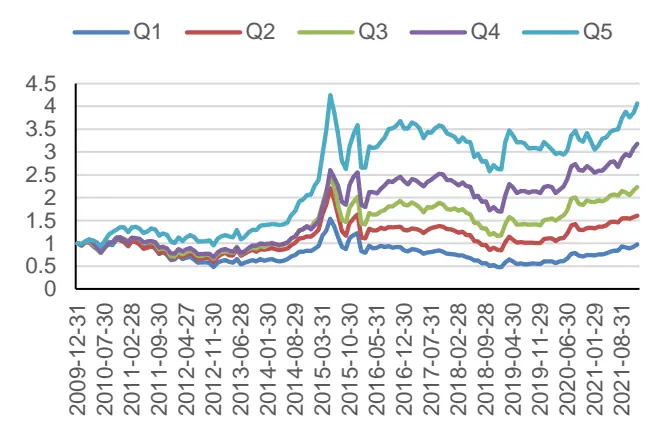
数据来源：Wind，广发证券发展研究中心

图 36：中证500 VWPIN平滑因子五档-周度调仓
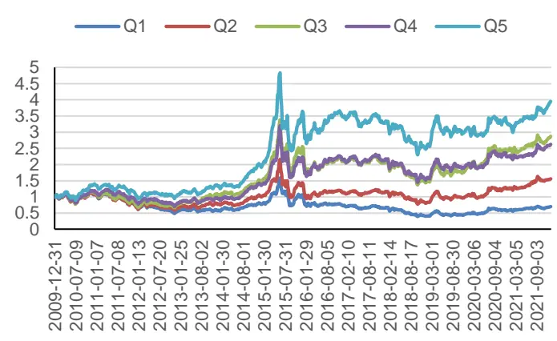
数据来源：Wind，广发证券发展研究中心

图 37：沪深300 VWPIN平滑因子五档-月度调仓
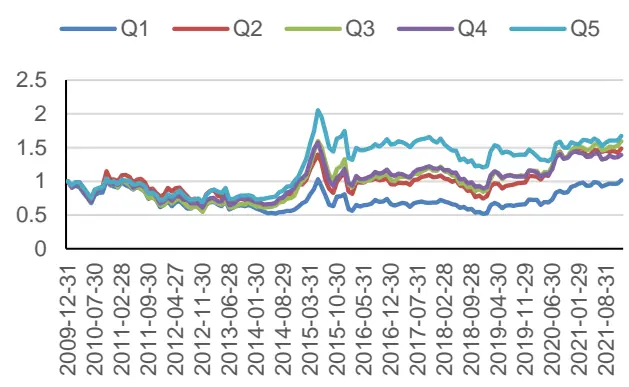
数据来源：Wind，广发证券发展研究中心

图 38：沪深300 VWPIN平滑因子五档-周度调仓
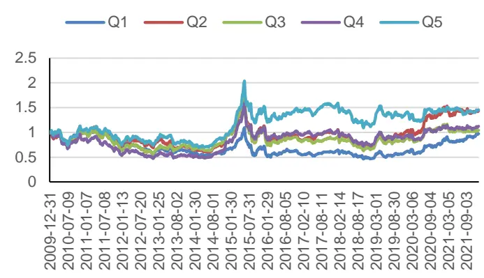
数据来源：Wind，广发证券发展研究中心

图 39：创业板 VWPIN平滑因子五档-月度调仓
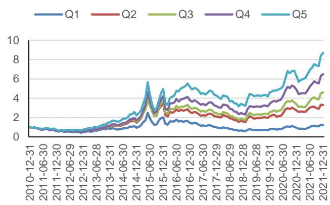
数据来源：Wind，广发证券发展研究中心

图 40：创业板 VWPIN平滑因子五档-周度调仓
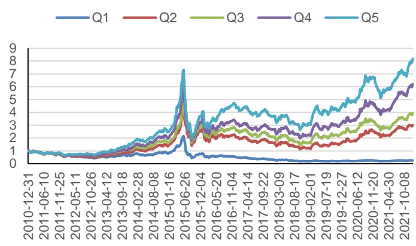
数据来源：Wind，广发证券发展研究中心

图 41：创业板 VWPIN平滑因子十档-月度调仓
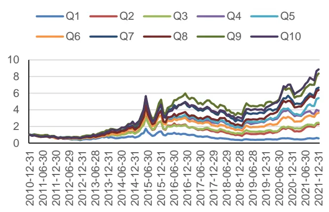
数据来源：Wind，广发证券发展研究中心

图 42：创业板 VWPIN平滑因子十档-周度调仓
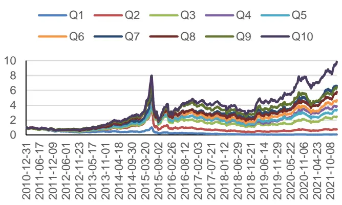
数据来源：Wind，广发证券发展研究中心

在月度调仓、周度调仓的历史回测下，VWPIN平滑因子在全市场、创业板范围内分档效果及净值表现均显著优于VWPIN因子。

以下实证结果全部基于五档周度调仓、VWPIN因子与VWPIN平滑因子在不同板块上测算。

## （三）VWPIN 因子实证结果

## 1. 全市场选股

表 2：全市场选股-整体与分年度 IC表现

| 范围 | IC 均值 | IC 标准差 | IC最大值 | IC最小值 | ICT统计量 | IC 累计值 | 正IC占比 |
| --- | --- | --- | --- | --- | --- | --- | --- |
| 2010 | 0.072 | 0.076 | 0.204 | -0.106 | 6.769 | 3.695 | 82.35% |
| 2011 | 0.07 | 0.099 | 0.248 | -0.121 | 5.032 | 3.557 | 76.47% |
| 2012 | 0.075 | 0.105 | 0.264 | -0.197 | 5.037 | 3.729 | 80.00% |
| 2013 | 0.065 | 0.099 | 0.312 | -0.146 | 4.723 | 3.33 | 68.63% |
| 2014 | 0.057 | 0.096 | 0.323 | -0.222 | 4.314 | 3.013 | 79.25% |
| 2015 | 0.056 | 0.106 | 0.243 | -0.31 | 3.79 | 2.897 | 78.85% |
| 2016 | 0.1 | 0.096 | 0.248 | -0.175 | 7.409 | 5.025 | 86.00% |
| 2017 | 0.053 | 0.072 | 0.194 | -0.179 | 5.262 | 2.687 | 86.27% |
| 2018 | 0.065 | 0.102 | 0.264 | -0.213 | 4.556 | 3.32 | 70.59% |
| 2019 | 0.062 | 0.073 | 0.182 | -0.127 | 6.071 | 3.182 | 80.39% |
| 2020 | 0.042 | 0.112 | 0.264 | -0.219 | 2.694 | 2.176 | 61.54% |
| 2021 | 0.041 | 0.068 | 0.153 | -0.112 | 4.323 | 2.108 | 69.23% |
| ALL | 0.063 | 0.094 | 0.323 | -0.31 | 16.692 | 38.719 | 76.59% |

数据来源：Wind，广发证券发展研究中心

图 43：全市场 VWPIN因子IC值及IC累计值
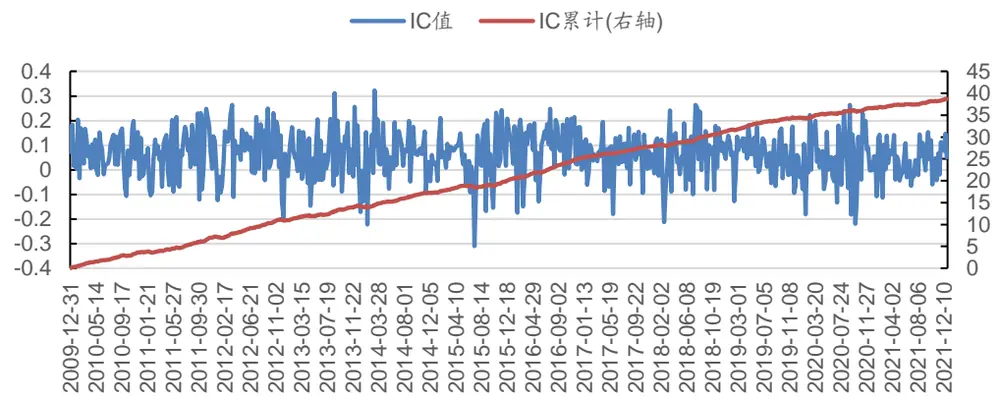
数据来源：Wind，广发证券发展研究中心

图 44：全市场选股-多-空策略净值走势-周度调仓
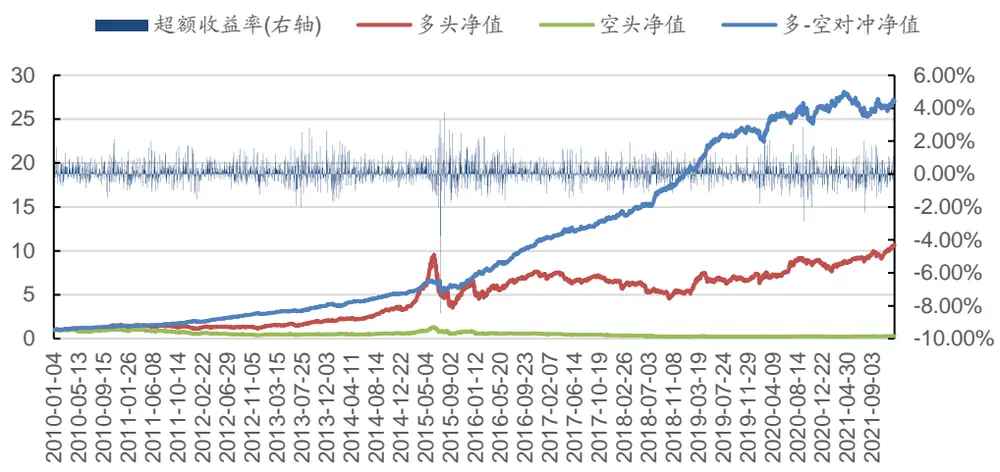
数据来源：Wind，广发证券发展研究中心

表 3：全市场选股-多-空对冲分年度策略表现-周度调仓

|  | 累计 | 年化 | 年化 | 信息 | 最大 |
| --- | --- | --- | --- | --- | --- |
| 年份 | 收益率 | 收益率 | 波动率 | 比率 | 回撤 |
| 2010 | 50.15% | 51.35% | 8.32% | 6.175 | 3.24% |
| 2011 | 35.88% | 36.70% | 8.46% | 4.338 | 3.17% |
| 2012 | 42.02% | 44.02% | 7.50% | 5.868 | 3.71% |
| 2013 | 37.41% | 38.26% | 10.29% | 3.72 | 2.52% |
| 2014 | 30.08% | 29.44% | 8.67% | 3.396 | 3.81% |
| 2015 | 46.67% | 46.67% | 16.97% | 2.75 | 12.70% |
| 2016 | 62.86% | 66.06% | 9.49% | 6.961 | 3.06% |
| 2017 | 21.67% | 22.14% | 6.38% | 3.471 | 2.39% |
| 2018 | 34.30% | 35.08% | 8.37% | 4.19 | 3.19% |
| 2019 | 28.44% | 29.08% | 6.70% | 4.34 | 2.34% |
| 2020 | 9.93% | 9.93% | 11.99% | 0.828 | 5.99% |
| 2021 | 3.48% | 3.48% | 7.99% | 0.435 | 10.11% |
| ALL | 2853.38% | 33.14% | 9.75% | 3.399 | 12.70% |

数据来源：Wind，广发证券发展研究中心

图 45：全市场选股-多-中证800策略净值走势-周度调仓
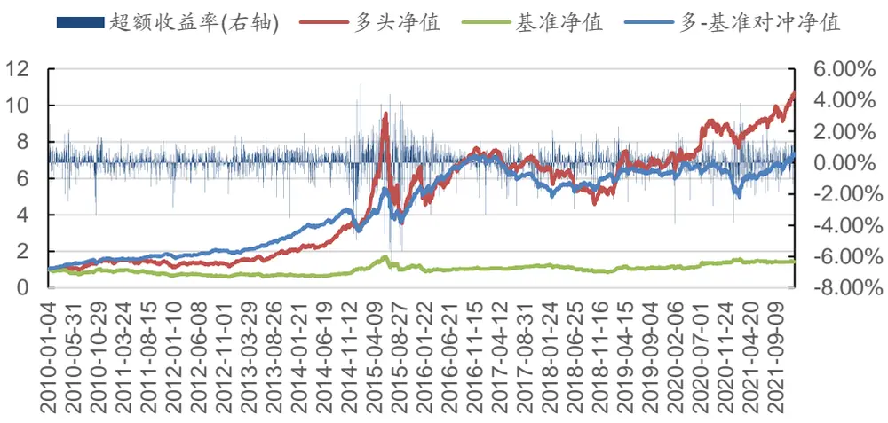
数据来源：Wind，广发证券发展研究中心

表 4：全市场选股-多-中证 800指数对冲分年度策略表现-周度调仓

| 多头 | 累计 | 年化 |  | 年化 | 信息 | 最大 |
| --- | --- | --- | --- | --- | --- | --- |
|  | 累计收益率 | 收益率 | 收益率 | 波动率 | 比率 | 回撤 |
| 2010 | 49.61% | 60.59% | 62.09% | 17.01% | 3.65 | 11.19% |
| 2011 | -19.96% | 10.47% | 10.69% | 8.78% | 1.22 | 4.58% |
| 2012 | 13.78% | 9.28% | 9.67% | 11.20% | 0.86 | 7.29% |
| 2013 | 51.78% | 55.78% | 57.14% | 11.41% | 5.01 | 3.91% |
| 2014 | 59.14% | 7.27% | 7.13% | 17.25% | 0.41 | 25.18% |
| 2015 | 101.51% | 80.33% | 80.33% | 32.70% | 2.46 | 33.71% |
| 2016 | 11.19% | 30.10% | 31.48% | 13.64% | 2.31 | 6.65% |
| 2017 | -10.57% | -22.36% | -22.74% | 11.24% | -2.02 | 22.77% |
| 2018 | -20.58% | 9.10% | 9.29% | 13.92% | 0.67 | 8.79% |
| 2019 | 36.89% | 4.39% | 4.48% | 10.13% | 0.44 | 6.73% |
| 2020 | 19.16% | -6.01% | -6.01% | 11.36% | -0.53 | 14.15% |
| 2021 | 26.34% | 24.79% | 24.79% | 17.43% | 1.42 | 8.91% |
| ALL | 979.29% | 688.27% | 19.07% | 16.15% | 1.18 | 33.71% |

数据来源：Wind，广发证券发展研究中心

表 5：全市场选股-分年度换手率

| 统计区间 | 均值 | 最大值 | 最小值 | 标准差 | 累计值 |
| --- | --- | --- | --- | --- | --- |
| 2010 | 57.23% | 65.32% | 46.51% | 0.04 | 2861.71% |
| 2011 | 55.71% | 62.36% | 48.10% | 0.03 | 2840.96% |
| 2012 | 55.71% | 60.56% | 50.69% | 0.03 | 2785.73% |
| 2013 | 55.59% | 62.20% | 48.34% | 0.03 | 2835.24% |
| 2014 | 56.86% | 66.16% | 48.90% | 0.04 | 3013.78% |
| 2015 | 61.44% | 100.00% | 46.25% | 0.11 | 3195.04% |
| 2016 | 57.16% | 66.78% | 47.12% | 0.05 | 2858.16% |
| 2017 | 59.88% | 78.13% | 51.43% | 0.04 | 3053.72% |
| 2018 | 54.75% | 62.29% | 48.24% | 0.03 | 2792.39% |
| 2019 | 54.57% | 63.05% | 47.32% | 0.04 | 2782.90% |
| 2020 | 49.98% | 57.54% | 41.46% | 0.04 | 2598.80% |
| 2021 | 49.94% | 55.09% | 43.42% | 0.03 | 2596.84% |
| ALL | 55.73% | 100.00% | 41.46% | 0.06 | 34215.26% |

数据来源：Wind，广发证券发展研究中心

在全市场选股中，VWPIN因子表现出较好的选股区分度，因子IC均值为0.063，正IC占比76.59%。在多头对冲中证800指数的回测中，策略整体的年化收益率为19.07%，信息比率为1.181。在2010、2013、2015年市场趋势较大时表现相对较好，除2017和2020年外，其余年份均可取得超额收益。策略的最大回撤发生在2015年，为33.71%，整体换手率保持在55.73%左右。

## 2. 中证1000选股

表 6：中证 1000选股-整体与分年度 IC表现

| 范围 | IC 均值 | IC 标准差 | IC最大值 | IC最小值 | ICT统计量 | IC累计值 | 正IC占比 |
| --- | --- | --- | --- | --- | --- | --- | --- |
| 2014 | 0.046 | 0.085 | 0.16 | -0.116 | 1.634 | 0.415 | 66.67% |
| 2015 | 0.056 | 0.099 | 0.268 | -0.212 | 4.069 | 2.868 | 68.63% |
| 2016 | 0.101 | 0.095 | 0.275 | -0.183 | 7.478 | 5.043 | 88.00% |
| 2017 | 0.051 | 0.085 | 0.19 | -0.207 | 4.242 | 2.578 | 74.51% |
| 2018 | 0.058 | 0.101 | 0.265 | -0.208 | 4.098 | 2.946 | 68.63% |
| 2019 | 0.058 | 0.08 | 0.234 | -0.133 | 5.2 | 2.959 | 78.43% |
| 2020 | 0.028 | 0.11 | 0.228 | -0.213 | 1.863 | 1.479 | 61.54% |
| 2021 | 0.021 | 0.062 | 0.201 | -0.106 | 2.469 | 1.103 | 61.54% |
| ALL | 0.053 | 0.093 | 0.275 | -0.213 | 10.839 | 19.39 | 71.39% |

数据来源：Wind，广发证券发展研究中心

图 46：中证1000 VWPIN因子IC值及IC累计值
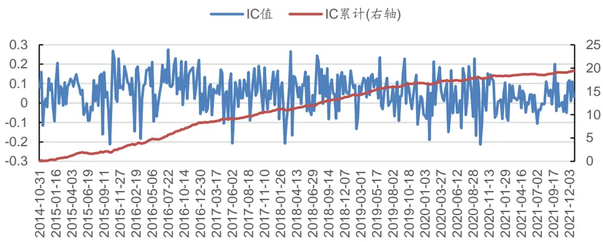
数据来源：Wind，广发证券发展研究中心

图 47：中证1000选股-多-空策略净值走势-周度调仓
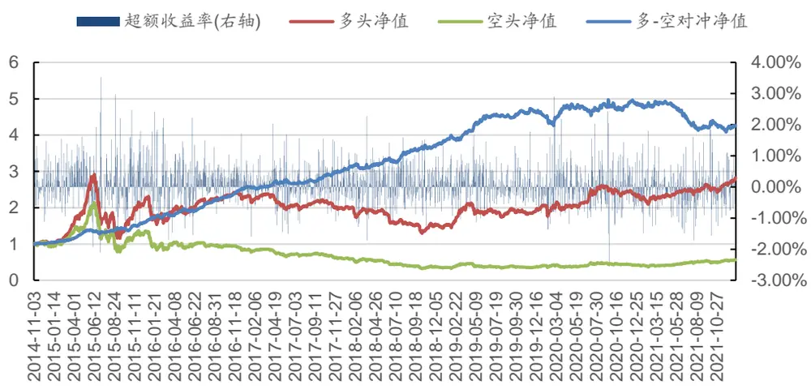
数据来源：Wind，广发证券发展研究中心

表 7：中证 1000选股-多-空对冲分年度策略表现-周度调仓

|  | 累计 | 年化 | 年化 | 信息 | 最大 |
| --- | --- | --- | --- | --- | --- |
| 年份 | 收益率 | 收益率 | 波动率 | 比率 | 回撤 |
| 2014 | 5.25% | 34.42% | 8.87% | 3.88 | 2.08% |
| 2015 | 61.90% | 61.90% | 14.25% | 4.34 | 6.14% |
| 2016 | 55.66% | 58.44% | 9.00% | 6.49 | 3.33% |
| 2017 | 19.38% | 19.79% | 7.42% | 2.67 | 3.31% |
| 2018 | 23.68% | 24.20% | 9.07% | 2.67 | 3.88% |
| 2019 | 21.60% | 22.07% | 7.10% | 3.11 | 2.73% |
| 2020 | 5.13% | 5.13% | 11.13% | 0.46 | 6.31% |
| 2021 | -12.54% | -12.54% | 8.28% | -1.52 | 16.94% |
| ALL | 337.87% | 23.20% | 10.04% | 2.31 | 17.63% |

数据来源：Wind，广发证券发展研究中心

图 48：中证1000选股-多-中证1000策略净值走势-周度调仓
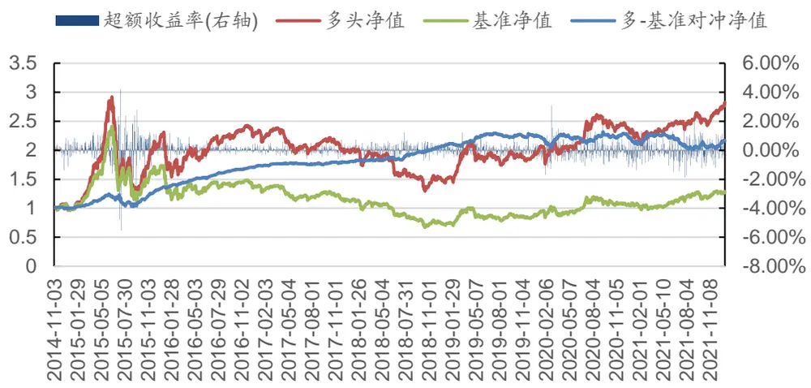
数据来源：Wind，广发证券发展研究中心

表 8：中证 1000选股-多-中证 1000指数对冲分年度策略表现-周度调仓

| 多头 | 累计 | 年化 | 年化 | 信息 |  | 最大 |
| --- | --- | --- | --- | --- | --- | --- |
|  | 累计收益率 | 收益率 | 收益率 | 波动率 | 比率 | 回撤 |
| 2014 | -2.44% | 0.46% | 2.71% | 5.35% | 0.51 | 2.24% |
| 2015 | 138.30% | 37.85% | 37.85% | 17.83% | 2.12 | 16.81% |
| 2016 | 1.26% | 26.90% | 28.11% | 3.70% | 7.59 | 0.37% |
| 2017 | -13.78% | 4.26% | 4.34% | 2.89% | 1.50 | 1.55% |
| 2018 | -26.82% | 15.60% | 15.93% | 5.58% | 2.85 | 2.40% |
| 2019 | 34.90% | 8.27% | 8.44% | 4.90% | 1.72 | 2.82% |
| 2020 | 18.31% | -2.06% | -2.06% | 9.47% | -0.22 | 7.25% |
| 2021 | 20.60% | -0.63% | -0.63% | 8.74% | -0.07 | 11.25% |
| ALL | 185.95% | 123.17% | 12.01% | 9.02% | 1.33 | 16.81% |

数据来源：Wind，广发证券发展研究中心

表 9：中证 1000选股-分年度换手率

| 统计区间 | 均值 | 最大值 | 最小值 | 标准差 | 累计值 |
| --- | --- | --- | --- | --- | --- |
| 2014 | 58.45% | 62.10% | 52.89% | 0.03 | 467.64% |
| 2015 | 60.57% | 96.88% | 47.54% | 0.09 | 3149.83% |
| 2016 | 55.99% | 65.87% | 45.00% | 0.05 | 2799.64% |
| 2017 | 59.83% | 73.23% | 50.00% | 0.05 | 3051.26% |
| 2018 | 55.10% | 71.81% | 47.37% | 0.04 | 2810.22% |
| 2019 | 53.28% | 62.89% | 43.65% | 0.05 | 2717.30% |
| 2020 | 49.86% | 59.90% | 39.59% | 0.05 | 2592.90% |
| 2021 | 52.54% | 61.03% | 44.56% | 0.04 | 2732.17% |
| ALL | 55.37% | 96.88% | 39.59% | 0.07 | 20320.96% |

数据来源：Wind，广发证券发展研究中心

在中证1000选股中，VWPIN因子表现出比较显著的选股区分度，因子IC均值为0.053，正IC占比71.39%。在多头对冲中证1000指数的回测中，策略整体的年化收益率为12.01%，信息比率为1.332。在2015-2016年策略表现相对较好，除2020年外，其余年份均能取得超额收益。策略的最大回撤发生在2015年，为16.81%，整体换手率保持在55.37%左右。

## 3. 中证800选股

表 10：中证 800选股-整体与分年度 IC表现

| 范围 | IC 均值 | IC 标准差 | IC最大值 | IC最小值 | IC T统计量 | IC 累计值 | 正IC占比 |
| --- | --- | --- | --- | --- | --- | --- | --- |
| 2010 | 0.044 | 0.089 | 0.266 | -0.118 | 3.579 | 2.264 | 64.71% |
| 2011 | 0.047 | 0.094 | 0.215 | -0.141 | 3.552 | 2.39 | 72.55% |
| 2012 | 0.031 | 0.103 | 0.259 | -0.217 | 2.155 | 1.572 | 66.00% |
| 2013 | 0.034 | 0.105 | 0.295 | -0.271 | 2.328 | 1.75 | 62.75% |
| 2014 | 0.035 | 0.088 | 0.239 | -0.147 | 2.911 | 1.869 | 64.15% |
| 2015 | 0.066 | 0.101 | 0.257 | -0.168 | 4.708 | 3.412 | 75.00% |
| 2016 | 0.056 | 0.107 | 0.285 | -0.221 | 3.707 | 2.81 | 78.00% |
| 2017 | 0.02 | 0.072 | 0.141 | -0.173 | 2.005 | 1.035 | 62.75% |
| 2018 | 0.026 | 0.094 | 0.217 | -0.235 | 2.002 | 1.343 | 58.82% |
| 2019 | 0.014 | 0.072 | 0.13 | -0.17 | 1.362 | 0.704 | 60.78% |
| 2020 | 0.006 | 0.095 | 0.211 | -0.227 | 0.428 | 0.292 | 50.00% |
| 2021 | 0.017 | 0.08 | 0.216 | -0.187 | 1.517 | 0.871 | 63.46% |
| ALL | 0.033 | 0.093 | 0.295 | -0.271 | 8.8 | 20.31 | 64.88% |

数据来源：Wind，广发证券发展研究中心

图 49：中证800 VWPIN因子IC值及IC累计值
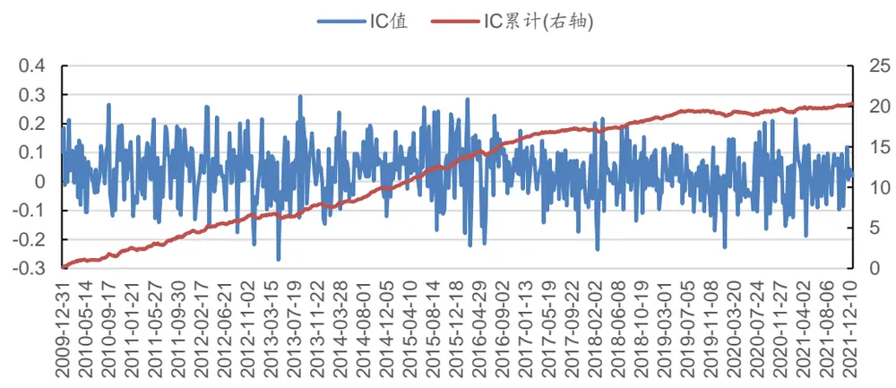
数据来源：Wind，广发证券发展研究中心

图 50：中证800选股-多-空策略净值走势-周度调仓
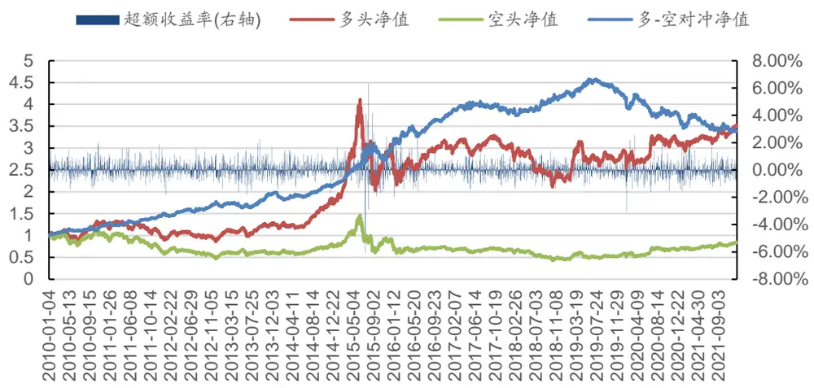
数据来源：Wind，广发证券发展研究中心

表 11：中证 800选股-多-空对冲分年度策略表现-周度调仓

|  | 累计 | 年化 | 年化 | 信息 | 最大 |
| --- | --- | --- | --- | --- | --- |
| 年份 | 收益率 | 收益率 | 波动率 | 比率 | 回撤 |
| 2010 | 25.75% | 26.32% | 10.02% | 2.63 | 6.25% |
| 2011 | 19.92% | 20.35% | 7.87% | 2.59 | 4.39% |
| 2012 | 12.57% | 13.11% | 7.74% | 1.70 | 4.75% |
| 2013 | 18.00% | 18.38% | 10.83% | 1.70 | 6.97% |
| 2014 | 10.15% | 9.95% | 8.06% | 1.24 | 6.02% |
| 2015 | 47.01% | 47.01% | 14.89% | 3.16 | 12.86% |
| 2016 | 26.98% | 28.20% | 10.45% | 2.70 | 6.02% |
| 2017 | 1.91% | 1.94% | 6.41% | 0.30 | 3.44% |
| 2018 | 8.85% | 9.03% | 8.27% | 1.09 | 3.75% |
| 2019 | 1.46% | 1.49% | 6.57% | 0.23 | 7.30% |
| 2020 | -12.97% | -12.97% | 10.23% | -1.27 | 13.07% |
| 2021 | -7.65% | -7.65% | 8.65% | -0.88 | 9.84% |
| ALL | 272.59% | 11.76% | 9.56% | 1.23 | 25.72% |

数据来源：Wind，广发证券发展研究中心

图 51：中证800选股-多-中证800策略净值走势-周度调仓
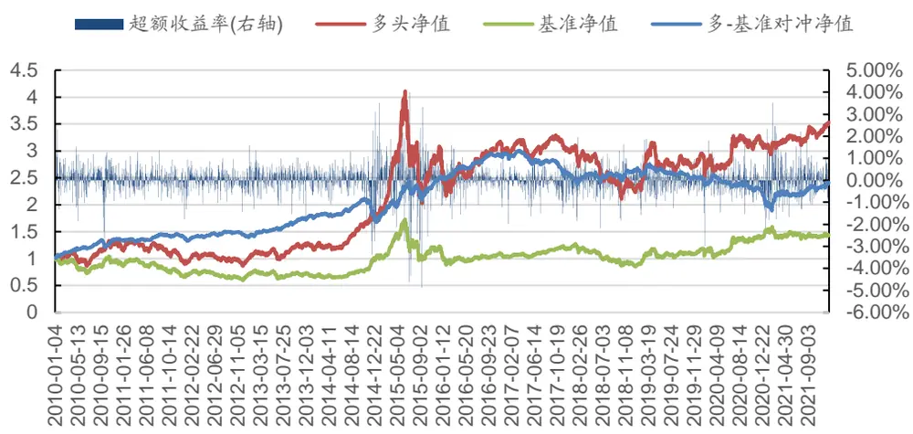
数据来源：Wind，广发证券发展研究中心

表 12：中证 800选股-多-中证 800指数对冲分年度策略表现-周度调仓

| 多头 |  | 累计 | 年化 | 年化 | 信息 | 最大 |
| --- | --- | --- | --- | --- | --- | --- |
|  | 累计收益率 | 收益率 | 收益率 | 波动率 | 比率 | 回撤 |
| 2010 | 26.78% | 36.39% | 37.22% | 13.73% | 2.71 | 9.64% |
| 2011 | -25.05% | 3.38% | 3.45% | 6.12% | 0.56 | 3.07% |
| 2012 | 4.66% | 0.49% | 0.51% | 7.44% | 0.07 | 5.61% |
| 2013 | 24.19% | 27.55% | 28.17% | 7.99% | 3.53 | 2.66% |
| 2014 | 39.95% | -5.31% | -5.22% | 12.67% | -0.41 | 19.35% |
| 2015 | 71.45% | 50.65% | 50.65% | 17.26% | 2.94 | 11.81% |
| 2016 | 0.63% | 16.65% | 17.37% | 6.46% | 2.69 | 1.97% |
| 2017 | -0.08% | -13.28% | -13.53% | 7.81% | -1.73 | 15.27% |
| 2018 | -25.06% | 2.95% | 3.01% | 10.02% | 0.30 | 6.36% |
| 2019 | 25.84% | -4.11% | -4.19% | 7.69% | -0.55 | 9.39% |
| 2020 | 8.17% | -14.62% | -14.62% | 8.70% | -1.68 | 16.37% |
| 2021 | 14.29% | 13.27% | 13.27% | 13.21% | 1.00 | 7.63% |
| ALL | 247.39% | 148.95% | 8.02% | 10.69% | 0.75 | 36.39% |

数据来源：Wind，广发证券发展研究中心

表 13：中证 800选股-分年度换手率

| 统计区间 | 均值 | 最大值 | 最小值 | 标准差 | 累计值 |
| --- | --- | --- | --- | --- | --- |
| 2010 | 55.41% | 68.97% | 42.11% | 0.06 | 2770.45% |
| 2011 | 55.20% | 75.00% | 41.67% | 0.06 | 2815.38% |
| 2012 | 56.29% | 68.85% | 47.69% | 0.05 | 2814.42% |
| 2013 | 55.48% | 70.15% | 44.78% | 0.06 | 2829.43% |
| 2014 | 58.79% | 71.64% | 49.25% | 0.05 | 3115.99% |
| 2015 | 61.03% | 96.67% | 46.15% | 0.11 | 3173.43% |
| 2016 | 57.77% | 68.12% | 48.53% | 0.05 | 2888.70% |
| 2017 | 60.23% | 80.82% | 48.67% | 0.06 | 3071.64% |
| 2018 | 54.88% | 63.70% | 46.31% | 0.04 | 2799.06% |
| 2019 | 54.23% | 66.88% | 41.14% | 0.06 | 2765.85% |
| 2020 | 48.46% | 58.33% | 35.71% | 0.05 | 2520.12% |
| 2021 | 49.01% | 64.15% | 40.51% | 0.05 | 2548.27% |
| ALL | 55.56% | 96.67% | 35.71% | 0.07 | 34112.73% |

数据来源：Wind，广发证券发展研究中心

在中证800选股中，VWPIN因子仅在五档测试中表现出相对较好的选股区分度，因子IC均值为0.033，正IC占比64.88%。在多头对冲中证800指数的回测中，策略整体的年化收益率为8.02%，信息比率为0.75。在2010、2013、2015年策略表现相对较好，除2014、2017、2019-2020年外，其余年份均能取得超额收益。整体换手率保持在55.56%左右。

## 4. 中证500选股

表 14：中证 500 选股-整体与分年度 IC 表现

| 范围 | IC 均值 | IC 标准差 | IC最大值 | IC最小值 | IC T统计量 | IC 累计值 | 正IC占比 |
| --- | --- | --- | --- | --- | --- | --- | --- |
| 2010 | 0.052 | 0.1 | 0.308 | -0.179 | 3.668 | 2.632 | 62.75% |
| 2011 | 0.055 | 0.104 | 0.281 | -0.152 | 3.758 | 2.78 | 68.63% |
| 2012 | 0.042 | 0.109 | 0.27 | -0.195 | 2.721 | 2.099 | 66.00% |
| 2013 | 0.038 | 0.104 | 0.24 | -0.206 | 2.612 | 1.931 | 66.67% |
| 2014 | 0.039 | 0.099 | 0.261 | -0.15 | 2.852 | 2.049 | 64.15% |
| 2015 | 0.069 | 0.1 | 0.302 | -0.142 | 4.938 | 3.526 | 72.55% |
| 2016 | 0.063 | 0.107 | 0.259 | -0.209 | 4.174 | 3.147 | 76.00% |
| 2017 | 0.03 | 0.085 | 0.181 | -0.189 | 2.512 | 1.531 | 64.71% |
| 2018 | 0.041 | 0.093 | 0.265 | -0.239 | 3.173 | 2.112 | 70.59% |
| 2019 | 0.035 | 0.082 | 0.2 | -0.165 | 3.033 | 1.78 | 64.71% |
| 2020 | 0.013 | 0.096 | 0.215 | -0.225 | 0.973 | 0.674 | 55.77% |
| 2021 | 0.024 | 0.07 | 0.204 | -0.126 | 2.497 | 1.26 | 61.54% |
| ALL | 0.042 | 0.097 | 0.308 | -0.239 | 10.659 | 25.521 | 66.12% |

数据来源：Wind，广发证券发展研究中心

图 52：中证500 VWPIN因子IC值及IC累计值
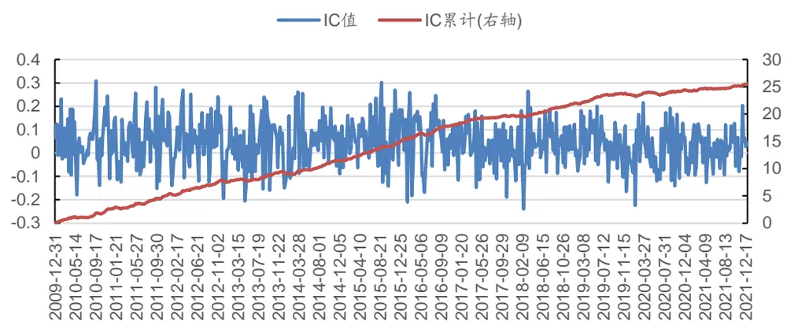
数据来源：Wind，广发证券发展研究中心

图 53：中证500选股-多-空策略净值走势-周度调仓
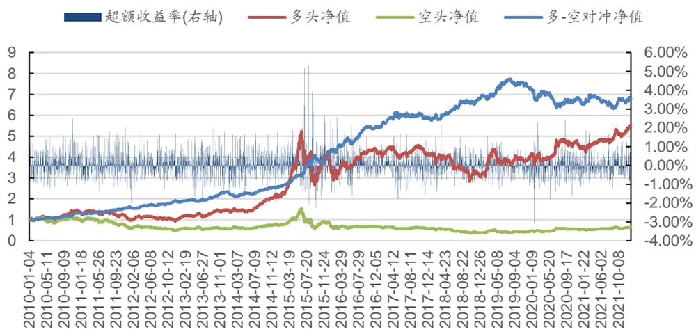
数据来源：Wind，广发证券发展研究中心

表 15：中证 500选股-多-空对冲分年度策略表现-周度调仓

|  | 累计 | 年化 | 年化 | 信息 | 最大 |
| --- | --- | --- | --- | --- | --- |
| 年份 | 收益率 | 收益率 | 波动率 | 比率 | 回撤 |
| 2010 | 33.73% | 34.49% | 11.07% | 3.12 | 5.04% |
| 2011 | 22.65% | 23.14% | 8.50% | 2.72 | 4.34% |
| 2012 | 14.26% | 14.87% | 8.43% | 1.76 | 4.98% |
| 2013 | 25.21% | 25.77% | 10.41% | 2.48 | 5.52% |
| 2014 | 11.14% | 10.92% | 9.63% | 1.13 | 8.12% |
| 2015 | 58.30% | 58.30% | 14.82% | 3.93 | 7.96% |
| 2016 | 31.53% | 32.98% | 10.31% | 3.20 | 4.29% |
| 2017 | 7.88% | 8.04% | 7.87% | 1.02 | 3.70% |
| 2018 | 16.05% | 16.39% | 8.15% | 2.01 | 3.96% |
| 2019 | 7.13% | 7.28% | 8.14% | 0.89 | 5.90% |
| 2020 | -9.57% | -9.57% | 10.88% | -0.88 | 12.56% |
| 2021 | 3.42% | 3.42% | 7.97% | 0.43 | 8.94% |
| ALL | 581.12% | 17.61% | 9.99% | 1.76 | 18.60% |

数据来源：Wind，广发证券发展研究中心

图 54：中证500选股-多-中证500策略净值走势-周度调仓
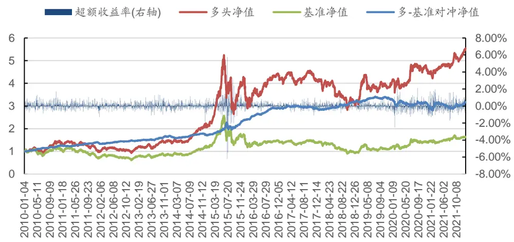
数据来源：Wind，广发证券发展研究中心

表 16：中证 500选股-多-中证 500指数对冲分年度策略表现-周度调仓

| 多头 | 累计 | 年化 | 年化 | 信息 |  | 最大 |
| --- | --- | --- | --- | --- | --- | --- |
|  | 累计收益率 | 收益率 | 收益率 | 波动率 | 比率 | 回撤 |
| 2010 | 39.86% | 26.39% | 26.97% | 6.45% | 4.18 | 2.44% |
| 2011 | -25.97% | 11.09% | 11.32% | 4.28% | 2.64 | 2.93% |
| 2012 | 3.70% | 4.16% | 4.33% | 5.20% | 0.83 | 4.28% |
| 2013 | 34.25% | 15.08% | 15.40% | 6.19% | 2.49 | 1.57% |
| 2014 | 42.56% | 2.69% | 2.64% | 5.92% | 0.45 | 5.05% |
| 2015 | 98.77% | 36.76% | 36.76% | 15.82% | 2.32 | 11.43% |
| 2016 | 0.59% | 22.23% | 23.22% | 4.83% | 4.81 | 0.99% |
| 2017 | -1.73% | -1.64% | -1.68% | 3.89% | -0.43 | 4.83% |
| 2018 | -25.50% | 11.32% | 11.56% | 4.71% | 2.45 | 1.16% |
| 2019 | 30.29% | 4.65% | 4.75% | 4.79% | 0.99 | 3.06% |
| 2020 | 11.05% | -9.02% | -9.02% | 8.99% | -1.00 | 8.88% |
| 2021 | 23.77% | 6.21% | 6.21% | 9.79% | 0.63 | 8.27% |
| ALL | 438.71% | 219.88% | 10.33% | 7.60% | 1.36 | 16.83% |

数据来源：Wind，广发证券发展研究中心

表 17：中证 500选股-分年度换手率

| 统计区间 | 均值 | 最大值 | 最小值 | 标准差 | 累计值 |
| --- | --- | --- | --- | --- | --- |
| 2010 | 54.61% | 66.67% | 41.46% | 0.06 | 2730.71% |
| 2011 | 55.25% | 78.05% | 39.53% | 0.07 | 2817.61% |
| 2012 | 55.09% | 64.44% | 42.22% | 0.05 | 2754.65% |
| 2013 | 56.44% | 70.21% | 38.30% | 0.07 | 2878.52% |
| 2014 | 59.40% | 73.91% | 48.94% | 0.06 | 3148.34% |
| 2015 | 59.23% | 94.12% | 40.91% | 0.10 | 3079.90% |
| 2016 | 58.80% | 73.47% | 40.00% | 0.07 | 2939.91% |
| 2017 | 61.68% | 79.35% | 46.32% | 0.07 | 3145.44% |
| 2018 | 56.76% | 66.67% | 48.42% | 0.04 | 2894.78% |
| 2019 | 55.75% | 67.01% | 44.44% | 0.06 | 2843.29% |
| 2020 | 52.06% | 60.82% | 39.39% | 0.05 | 2707.06% |
| 2021 | 50.58% | 63.64% | 39.39% | 0.06 | 2630.07% |
| ALL | 56.30% | 94.12% | 38.30% | 0.07 | 34570.28% |

数据来源：Wind，广发证券发展研究中心

在中证500选股中，VWPIN因子表现出显著的选股区分度，因子IC均值为0.042，正IC占比66.12%。在多头对冲中证500指数的回测中，策略整体的年化收益率为10.33%，信息比率为1.359。在2010、2015、2016年策略表现相对较好，除2017、2020年外，其余年份均能取得超额收益。整体换手率保持在56.30%左右。

## 5. 创业板选股

表 18：创业板选股-整体与分年度 IC表现

| 范围 | IC 均值 | IC 标准差 | IC 最大值 | IC最小值 | ICT统计量 | IC 累计值 | 正IC占比 |
| --- | --- | --- | --- | --- | --- | --- | --- |
| 2011 | 0.043 | 0.159 | 0.425 | -0.338 | 1.914 | 2.178 | 60.78% |
| 2012 | 0.059 | 0.133 | 0.377 | -0.27 | 3.15 | 2.969 | 72.00% |
| 2013 | 0.062 | 0.111 | 0.396 | -0.229 | 4.016 | 3.18 | 76.47% |
| 2014 | 0.045 | 0.099 | 0.296 | -0.182 | 3.292 | 2.372 | 64.15% |
| 2015 | 0.028 | 0.118 | 0.299 | -0.302 | 1.684 | 1.419 | 60.78% |
| 2016 | 0.099 | 0.107 | 0.26 | -0.258 | 6.553 | 4.975 | 86.00% |
| 2017 | 0.06 | 0.1 | 0.254 | -0.184 | 4.317 | 3.084 | 74.51% |
| 2018 | 0.065 | 0.12 | 0.334 | -0.181 | 3.853 | 3.308 | 72.55% |
| 2019 | 0.059 | 0.084 | 0.177 | -0.142 | 4.998 | 3.002 | 74.51% |
| 2020 | 0.04 | 0.115 | 0.293 | -0.256 | 2.531 | 2.091 | 67.31% |
| 2021 | 0.047 | 0.073 | 0.198 | -0.128 | 4.606 | 2.438 | 73.08% |
| ALL | 0.055 | 0.113 | 0.425 | -0.338 | 11.531 | 31.016 | 71.05% |

数据来源：Wind，广发证券发展研究中心

图 55：创业板 VWPIN因子IC值及IC累计值
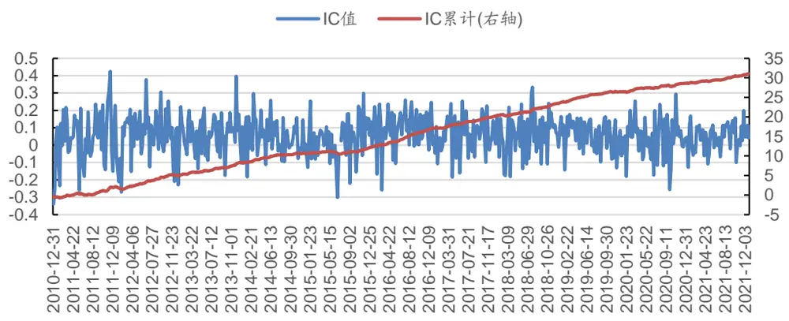
数据来源：Wind，广发证券发展研究中心

图 56：创业板选股-多-空策略净值走势-周度调仓
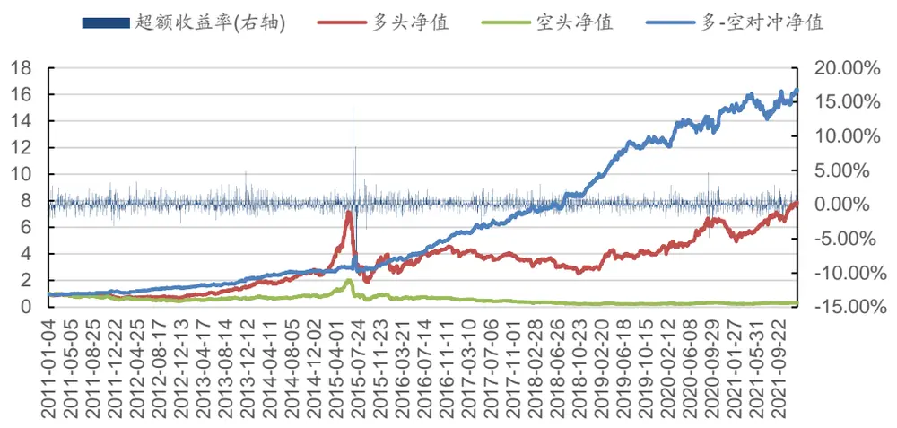
数据来源：Wind，广发证券发展研究中心

表 19：创业板选股-多-空对冲分年度策略表现-周度调仓

|  | 累计 | 年化 | 年化 | 信息 | 最大 |
| --- | --- | --- | --- | --- | --- |
| 年份 | 收益率 | 收益率 | 波动率 | 比率 | 回撤 |
| 2011 | 28.91% | 29.56% | 14.04% | 2.11 | 7.33% |
| 2012 | 31.37% | 32.81% | 12.04% | 2.72 | 10.83% |
| 2013 | 44.65% | 45.70% | 11.66% | 3.92 | 2.42% |
| 2014 | 34.16% | 33.42% | 10.26% | 3.26 | 2.70% |
| 2015 | -4.99% | -4.99% | 24.27% | -0.21 | 29.05% |
| 2016 | 70.78% | 74.47% | 11.44% | 6.51 | 4.44% |
| 2017 | 30.34% | 31.02% | 9.65% | 3.22 | 3.50% |
| 2018 | 35.55% | 36.36% | 12.20% | 2.98 | 5.10% |
| 2019 | 34.57% | 35.35% | 8.26% | 4.28 | 2.93% |
| 2020 | 16.46% | 16.46% | 14.12% | 1.17 | 7.28% |
| 2021 | 9.85% | 9.85% | 10.80% | 0.91 | 9.68% |
| ALL | 1521.98% | 29.29% | 13.30% | 2.20 | 29.05% |

数据来源：Wind，广发证券发展研究中心

图 57：创业板选股-多-创业板指策略净值走势-周度调仓
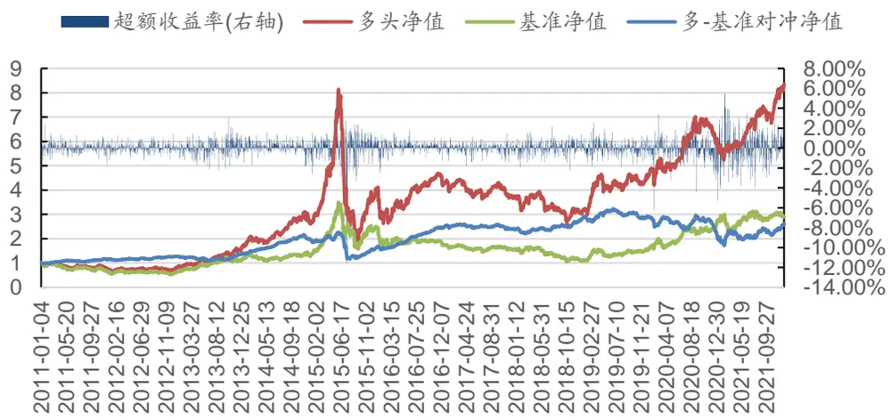
数据来源：Wind，广发证券发展研究中心

表 20：创业板选股-多-创业板指数对冲分年度策略表现-周度调仓

| 多头 |  | 累计 | 年化 | 年化 | 信息 | 最大 |
| --- | --- | --- | --- | --- | --- | --- |
|  | 累计收益率 | 收益率 | 收益率 | 波动率 | 比率 | 回撤 |
| 2011 | -25.50% | 15.36% | 15.68% | 7.84% | 2.00 | 6.48% |
| 2012 | 6.93% | 9.82% | 10.23% | 6.78% | 1.51 | 3.52% |
| 2013 | 104.03% | 11.46% | 11.69% | 12.88% | 0.91 | 12.49% |
| 2014 | 64.97% | 40.82% | 39.91% | 11.40% | 3.50 | 8.35% |
| 2015 | 55.66% | -13.11% | -13.11% | 42.26% | -0.31 | 47.21% |
| 2016 | 7.71% | 50.87% | 53.38% | 11.17% | 4.78 | 6.19% |
| 2017 | -14.71% | -4.25% | -4.34% | 8.21% | -0.53 | 7.38% |
| 2018 | -17.56% | 14.69% | 14.99% | 11.39% | 1.32 | 8.03% |
| 2019 | 50.79% | 6.67% | 6.80% | 11.66% | 0.58 | 11.08% |
| 2020 | 30.82% | -23.00% | -23.00% | 19.51% | -1.18 | 23.06% |
| 2021 | 38.59% | 16.17% | 16.17% | 30.08% | 0.54 | 15.23% |
| ALL | 764.19% | 173.10% | 9.71% | 19.00% | 0.51 | 47.21% |

数据来源：Wind，广发证券发展研究中心

表 21：创业板选股-分年度换手率

| 统计区间 | 均值 | 最大值 | 最小值 | 标准差 | 累计值 |
| --- | --- | --- | --- | --- | --- |
| 2011 | 60.63% | 90.00% | 35.29% | 0.12 | 3031.57% |
| 2012 | 53.34% | 64.15% | 37.84% | 0.06 | 2666.89% |
| 2013 | 54.23% | 67.24% | 40.32% | 0.06 | 2765.95% |
| 2014 | 55.93% | 68.85% | 46.77% | 0.05 | 2964.36% |
| 2015 | 60.77% | 100.00% | 43.33% | 0.13 | 3160.00% |
| 2016 | 58.54% | 68.60% | 47.37% | 0.05 | 2927.14% |
| 2017 | 58.30% | 68.89% | 47.78% | 0.05 | 2973.51% |
| 2018 | 55.35% | 64.81% | 46.56% | 0.04 | 2822.94% |
| 2019 | 56.57% | 66.67% | 46.53% | 0.05 | 2885.25% |
| 2020 | 56.20% | 68.87% | 48.03% | 0.05 | 2922.52% |
| 2021 | 55.13% | 64.10% | 46.50% | 0.04 | 2866.55% |
| ALL | 56.81% | 100.00% | 35.29% | 0.07 | 31986.68% |

数据来源：Wind，广发证券发展研究中心

在创业板选股中，VWPIN因子的选股区分度最为明显，因子IC均值为0.055，正IC占比71.05%。在多头对冲创业板指数的回测中，策略整体的年化收益率为9.71%，信息比率为0.511。在2014、2016年策略表现相对较好，除2015、2017、2020年外，其余年份均能取得超额收益。整体换手率保持在56.81%左右。

## （四）VWPIN 平滑因子实证结果

## 1. 全市场选股

表 22：全市场选股-整体与分年度 IC表现

| 范围 | IC 均值 | IC 标准差 | IC最大值 | IC最小值 | IC T统计量 | IC累计值 | 正IC占比 |
| --- | --- | --- | --- | --- | --- | --- | --- |
| 2010 | 0.072 | 0.086 | 0.22 | -0.106 | 5.975 | 3.652 | 78.43% |
| 2011 | 0.072 | 0.113 | 0.267 | -0.175 | 4.577 | 3.69 | 76.47% |
| 2012 | 0.072 | 0.12 | 0.318 | -0.229 | 4.225 | 3.594 | 76.00% |
| 2013 | 0.063 | 0.123 | 0.344 | -0.164 | 3.668 | 3.21 | 58.82% |
| 2014 | 0.057 | 0.113 | 0.337 | -0.258 | 3.676 | 3.019 | 75.47% |
| 2015 | 0.065 | 0.11 | 0.302 | -0.205 | 4.27 | 3.377 | 76.92% |
| 2016 | 0.1 | 0.113 | 0.285 | -0.237 | 6.258 | 4.983 | 80.00% |
| 2017 | 0.057 | 0.087 | 0.215 | -0.183 | 4.666 | 2.905 | 76.47% |
| 2018 | 0.062 | 0.129 | 0.326 | -0.234 | 3.424 | 3.143 | 70.59% |
| 2019 | 0.061 | 0.091 | 0.228 | -0.201 | 4.831 | 3.133 | 76.47% |
| 2020 | 0.042 | 0.13 | 0.308 | -0.245 | 2.355 | 2.205 | 61.54% |
| 2021 | 0.045 | 0.08 | 0.174 | -0.141 | 4.114 | 2.361 | 69.23% |
| ALL | 0.064 | 0.109 | 0.344 | -0.258 | 14.54 | 39.272 | 73.01% |

数据来源：Wind，广发证券发展研究中心

图 58：全市场 VWPIN平滑因子IC值及IC累计值
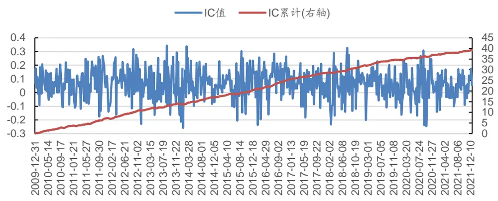
数据来源：Wind，广发证券发展研究中心

图 59：全市场选股-多-空策略净值走势-周度调仓
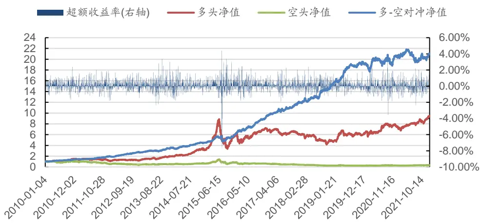
数据来源：Wind，广发证券发展研究中心

表 23：全市场选股-多-空对冲分年度策略表现-周度调仓

|  | 累计 | 年化 | 年化 | 信息 | 最大 |
| --- | --- | --- | --- | --- | --- |
| 年份 | 收益率 | 收益率 | 波动率 | 比率 | 回撤 |
| 2010 | 46.11% | 47.20% | 9.40% | 5.02 | 3.52% |
| 2011 | 37.00% | 37.85% | 9.75% | 3.88 | 3.23% |
| 2012 | 38.45% | 40.27% | 8.59% | 4.69 | 4.98% |
| 2013 | 29.84% | 30.50% | 12.29% | 2.48 | 3.70% |
| 2014 | 26.19% | 25.63% | 10.27% | 2.50 | 5.08% |
| 2015 | 64.99% | 64.99% | 14.93% | 4.35 | 5.13% |
| 2016 | 53.51% | 56.17% | 10.54% | 5.33 | 3.64% |
| 2017 | 23.97% | 24.49% | 7.33% | 3.34 | 2.93% |
| 2018 | 28.47% | 29.10% | 10.78% | 2.70 | 5.00% |
| 2019 | 24.38% | 24.92% | 7.93% | 3.14 | 3.46% |
| 2020 | 6.64% | 6.64% | 12.85% | 0.52 | 6.79% |
| 2021 | 2.94% | 2.94% | 9.06% | 0.33 | 11.05% |
| ALL | 2401.00% | 31.28% | 10.60% | 2.95 | 11.05% |

数据来源：Wind，广发证券发展研究中心

图 60：全市场选股-多-中证800策略净值走势-周度调仓
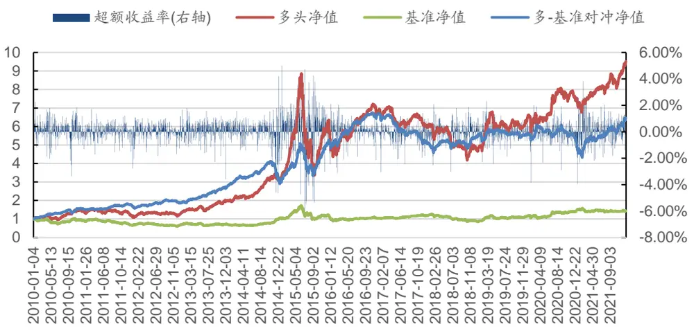
数据来源：Wind，广发证券发展研究中心

表 24：全市场选股-多-中证 800指数对冲分年度策略表现-周度调仓

| 年份 | 多头 累计 收益率 | 累计 收益率 | 累计 收益率 (扣费) | 年化 收益率 | 年化 收益率 (扣费) | 年化 波动率 | 年化 波动率 (扣费) | 信息 比率 | 信息 比率(扣 | 最大 回撤 | 最大 回撤(扣 |
| --- | --- | --- | --- | --- | --- | --- | --- | --- | --- | --- | --- |
| 2010 | 45.82% | 56.52% | 47.50% | 57.90% | 48.63% | 16.97% | 16.99% | 3.41 | 费) 2.86 | 11.39% | 费) 11.87% |
| 2011 | -19.71% | 10.67% | 4.43% | 10.89% | 4.52% | 8.74% | 8.73% | 1.25 | 0.52 | 4.81% | 5.35% |
| 2012 | 13.59% | 8.94% | 2.78% | 9.31% | 2.89% | 11.55% | 11.56% | 0.81 | 0.25 | 7.54% | 8.92% |
| 2013 | 49.16% | 52.86% | 44.08% | 54.14% | 45.12% | 11.11% | 11.10% | 4.87 | 4.06 | 3.66% | 3.88% |
| 2014 | 57.38% | 6.00% | -0.65% | 5.88% | -0.63% | 17.10% | 17.14% | 0.34 | -0.04 | 25.86% | 26.68% |
| 2015 | 102.45% | 80.06% | 67.57% | 80.06% | 67.57% | 31.28% | 31.43% | 2.56 | 2.15 | 32.72% | 34.26% |
| 2016 | 9.25% | 27.68% | 20.26% | 28.93% | 21.15% | 13.16% | 13.17% | 2.20 | 1.61 | 6.89% | 7.10% |
| 2017 | -11.87% | -23.50% | -28.43% | -23.90% | -28.90% | 10.84% | 10.84% | -2.21 | -2.67 | 23.71% | 28.44% |
| 2018 | -22.13% | 6.79% | 0.89% | 6.93% | 0.91% | 13.82% | 13.82% | 0.50 | 0.07 | 8.44% | 10.32% |
| 2019 | 34.66% | 2.64% | -3.14% | 2.69% | -3.20% | 9.62% | 9.62% | 0.28 | -0.33 | 7.49% | 9.91% |
| 2020 | 17.82% | -7.12% | -11.78% | -7.12% | -11.78% | 11.41% | 11.38% | -0.62 | -1.04 | 14.56% | 17.91% |
| 2021 | 27.16% | 25.55% | 19.42% | 25.55% | 19.42% | 17.79% | 17.79% | 1.44 | 1.09 | 9.08% | 9.50% |
| ALL | 855.90% | 587.35% | 236.55% | 17.70% | 10.81% | 15.85% | 15.87% | 1.12 | 0.68 | 35.17% | 49.33% |

数据来源：Wind，广发证券发展研究中心

表 25：全市场选股-分年度换手率

| 统计区间 | 均值 | 最大值 | 最小值 | 标准差 | 累计值 |
| --- | --- | --- | --- | --- | --- |
| 2010 | 39.84% | 49.18% | 32.00% | 0.04 | 1992.18% |
| 2011 | 37.99% | 43.35% | 30.82% | 0.03 | 1937.67% |
| 2012 | 38.85% | 45.37% | 34.50% | 0.03 | 1942.41% |
| 2013 | 38.96% | 48.91% | 33.21% | 0.04 | 1987.12% |
| 2014 | 40.68% | 49.24% | 30.29% | 0.04 | 2156.16% |
| 2015 | 46.15% | 100.00% | 31.42% | 0.16 | 2399.99% |
| 2016 | 40.04% | 48.00% | 34.53% | 0.04 | 2001.87% |
| 2017 | 43.25% | 65.01% | 35.63% | 0.06 | 2205.89% |
| 2018 | 37.19% | 42.35% | 31.67% | 0.03 | 1896.82% |
| 2019 | 37.84% | 45.87% | 30.06% | 0.04 | 1929.94% |
| 2020 | 32.97% | 41.48% | 25.15% | 0.03 | 1714.34% |
| 2021 | 32.20% | 45.63% | 26.05% | 0.04 | 1674.44% |
| ALL | 38.83% | 100.00% | 25.15% | 0.07 | 23838.83% |

数据来源：Wind，广发证券发展研究中心

在全市场选股中，VWPIN平滑因子表现出显著的选股区分度，因子IC均值为0.064，正IC占比73.01%。在多头对冲中证800指数的回测中，策略整体的年化收益率为17.70%，信息比率为1.117，扣费后整体的年化收益率为10.81%，信息比率为0.681。在2013、2015年市场趋势较大时表现更好，除2017和2020年外，其余年份均可取得超额收益。整体换手率保持在38.83%左右。

## 2. 中证1000选股

表 26：中证 1000 选股-整体与分年度 IC 表现

| 范围 | IC 均值 | IC 标准差 | IC最大值 | IC最小值 | ICT统计量 | IC累计值 | 正IC占比 |
| --- | --- | --- | --- | --- | --- | --- | --- |
| 2014 | 0.047 | 0.085 | 0.157 | -0.099 | 1.662 | 0.425 | 77.78% |
| 2015 | 0.066 | 0.107 | 0.334 | -0.188 | 4.419 | 3.381 | 74.51% |
| 2016 | 0.098 | 0.115 | 0.303 | -0.237 | 6.022 | 4.879 | 84.00% |
| 2017 | 0.061 | 0.101 | 0.27 | -0.198 | 4.316 | 3.126 | 76.47% |
| 2018 | 0.051 | 0.128 | 0.289 | -0.245 | 2.837 | 2.589 | 68.63% |
| 2019 | 0.061 | 0.1 | 0.295 | -0.207 | 4.342 | 3.093 | 78.43% |
| 2020 | 0.028 | 0.128 | 0.275 | -0.229 | 1.552 | 1.432 | 50.00% |
| 2021 | 0.029 | 0.074 | 0.234 | -0.128 | 2.811 | 1.503 | 67.31% |
| ALL | 0.056 | 0.11 | 0.334 | -0.245 | 9.73 | 20.428 | 71.39% |

数据来源：Wind，广发证券发展研究中心

图 61：中证1000 VWPIN平滑因子IC值及IC累计值
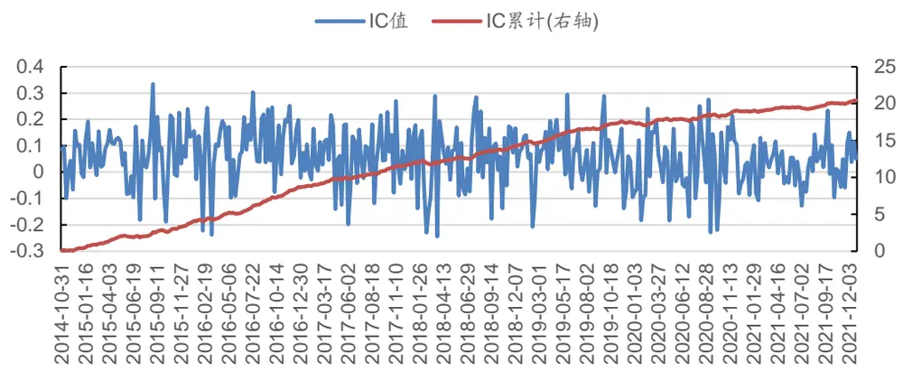
数据来源：Wind，广发证券发展研究中心

图 62：中证1000选股-多-空策略净值走势-周度调仓
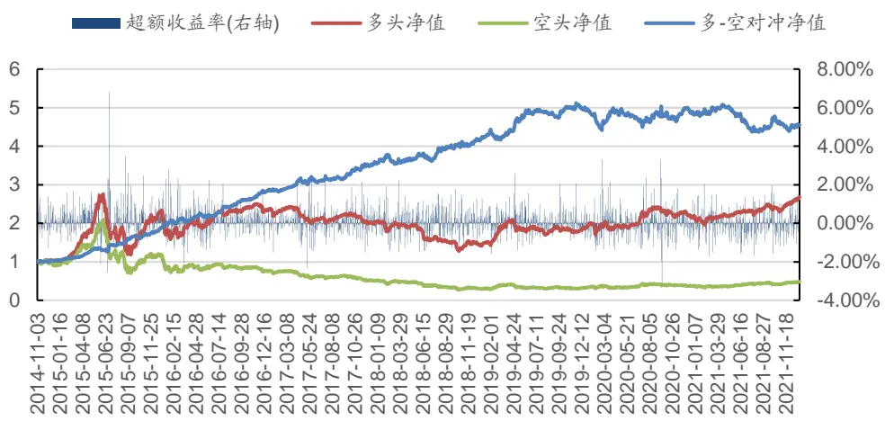
数据来源：Wind，广发证券发展研究中心

表 27：中证 1000选股-多-空对冲分年度策略表现-周度调仓

|  | 累计 | 年化 | 年化 | 信息 | 最大 |
| --- | --- | --- | --- | --- | --- |
| 年份 | 收益率 | 收益率 | 波动率 | 比率 | 回撤 |
| 2014 | 4.87% | 31.63% | 8.91% | 3.55 | 1.55% |
| 2015 | 80.43% | 80.43% | 15.31% | 5.26 | 4.79% |
| 2016 | 51.97% | 54.53% | 10.42% | 5.23 | 3.90% |
| 2017 | 25.79% | 26.36% | 8.14% | 3.24 | 3.05% |
| 2018 | 17.37% | 17.73% | 10.73% | 1.65 | 6.23% |
| 2019 | 17.55% | 17.92% | 9.43% | 1.90 | 5.00% |
| 2020 | -1.88% | -1.88% | 12.34% | -0.15 | 9.29% |
| 2021 | -6.13% | -6.13% | 9.35% | -0.66 | 14.11% |
| ALL | 359.60% | 24.05% | 11.31% | 2.13 | 14.23% |

数据来源：Wind，广发证券发展研究中心

图 63：中证1000选股-多-中证1000策略净值走势-周度调仓
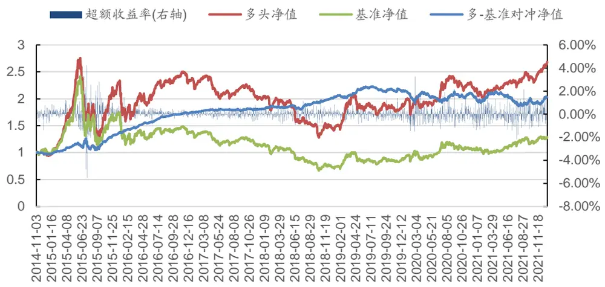
数据来源：Wind，广发证券发展研究中心

表 28：中证 1000选股-多-中证 1000指数对冲分年度策略表现-周度调仓

| 多头 |  | 累计 | 年化 | 年化 | 信息 | 最大 |
| --- | --- | --- | --- | --- | --- | --- |
|  | 累计收益率 | 收益率 | 收益率 | 波动率 | 比率 | 回撤 |
| 2014 | -5.15% | -2.27% | -12.44% | 4.86% | -2.56 | 3.01% |
| 2015 | 147.66% | 40.12% | 40.12% | 19.85% | 2.02 | 17.09% |
| 2016 | 1.82% | 27.33% | 28.57% | 3.82% | 7.49 | 0.91% |
| 2017 | -14.31% | 3.53% | 3.60% | 2.65% | 1.36 | 1.08% |
| 2018 | -29.10% | 11.89% | 12.14% | 5.94% | 2.04 | 3.70% |
| 2019 | 33.00% | 6.61% | 6.75% | 5.50% | 1.23 | 4.10% |
| 2020 | 13.84% | -5.84% | -5.84% | 9.91% | -0.59 | 9.22% |
| 2021 | 23.54% | 1.66% | 1.66% | 9.63% | 0.17 | 12.32% |
| ALL | 171.80% | 106.14% | 10.76% | 9.86% | 1.09 | 17.09% |

数据来源：Wind，广发证券发展研究中心

表 29：中证 1000选股-分年度换手率

| 统计区间 | 均值 | 最大值 | 最小值 | 标准差 | 累计值 |
| --- | --- | --- | --- | --- | --- |
| 2014 | 44.93% | 49.17% | 41.13% | 0.03 | 359.40% |
| 2015 | 46.37% | 95.00% | 34.86% | 0.12 | 2411.47% |
| 2016 | 39.28% | 49.61% | 31.58% | 0.04 | 1963.79% |
| 2017 | 43.21% | 60.63% | 33.70% | 0.06 | 2203.78% |
| 2018 | 37.91% | 45.76% | 31.25% | 0.04 | 1933.52% |
| 2019 | 36.60% | 47.47% | 27.41% | 0.05 | 1866.47% |
| 2020 | 33.59% | 43.23% | 23.35% | 0.04 | 1746.93% |
| 2021 | 35.88% | 44.10% | 25.91% | 0.04 | 1865.63% |
| ALL | 39.10% | 95.00% | 23.35% | 0.07 | 14351.01% |

数据来源：Wind，广发证券发展研究中心

在中证1000选股中，VWPIN平滑因子表现出比较显著的选股区分度，因子IC均值为0.056，正IC占比73.39%。在多头对冲中证1000指数的回测中，策略整体的年化收益率为10.76%，信息比率为1.091。除2014、2020年外，其余年份均能取得超额收益。整体换手率保持在39.10%左右。

## 3. 中证800选股

表 30：中证 800选股-整体与分年度 IC表现

| 范围 | IC 均值 | IC 标准差 | IC最大值 | IC 最小值 | IC T统计量 | IC 累计值 | 正IC占比 |
| --- | --- | --- | --- | --- | --- | --- | --- |
| 2010 | 0.044 | 0.096 | 0.272 | -0.118 | 3.232 | 2.227 | 62.75% |
| 2011 | 0.051 | 0.11 | 0.238 | -0.199 | 3.313 | 2.613 | 66.67% |
| 2012 | 0.03 | 0.119 | 0.265 | -0.249 | 1.756 | 1.475 | 66.00% |
| 2013 | 0.032 | 0.112 | 0.287 | -0.201 | 2.037 | 1.629 | 56.86% |
| 2014 | 0.031 | 0.101 | 0.248 | -0.168 | 2.221 | 1.637 | 62.26% |
| 2015 | 0.064 | 0.12 | 0.314 | -0.211 | 3.816 | 3.304 | 76.92% |
| 2016 | 0.065 | 0.124 | 0.307 | -0.267 | 3.691 | 3.23 | 76.00% |
| 2017 | 0.02 | 0.083 | 0.166 | -0.188 | 1.76 | 1.039 | 64.71% |
| 2018 | 0.027 | 0.123 | 0.279 | -0.232 | 1.574 | 1.382 | 62.75% |
| 2019 | 0.009 | 0.084 | 0.152 | -0.171 | 0.784 | 0.47 | 50.98% |
| 2020 | -0.003 | 0.111 | 0.247 | -0.213 | -0.177 | -0.141 | 42.31% |
| 2021 | 0.023 | 0.097 | 0.261 | -0.179 | 1.683 | 1.182 | 61.54% |
| ALL | 0.033 | 0.108 | 0.314 | -0.267 | 7.463 | 20.047 | 62.44% |

数据来源：Wind，广发证券发展研究中心

图 64：中证800 VWPIN平滑因子IC值及IC累计值
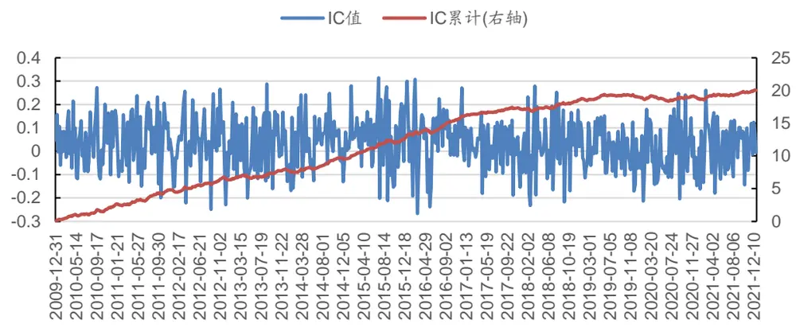
数据来源：Wind，广发证券发展研究中心

图 65：中证800选股-多-空策略净值走势-周度调仓
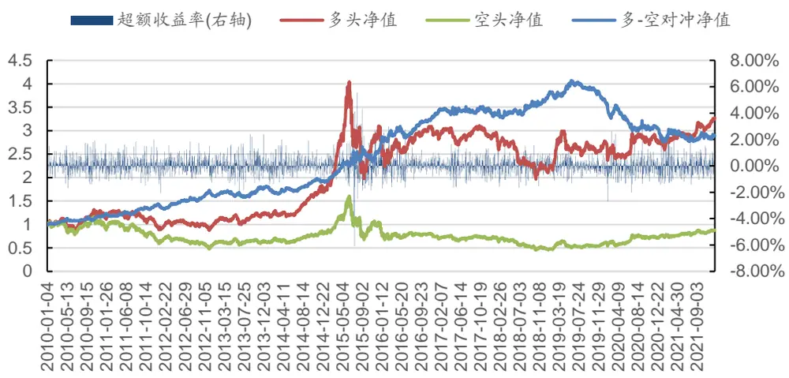
数据来源：Wind，广发证券发展研究中心

表 31：中证 800选股-多-空对冲分年度策略表现-周度调仓

|  | 累计 | 年化 | 年化 | 信息 | 最大 |
| --- | --- | --- | --- | --- | --- |
| 年份 | 收益率 | 收益率 | 波动率 | 比率 | 回撤 |
| 2010 | 18.66% | 19.06% | 10.35% | 1.84 | 6.24% |
| 2011 | 21.26% | 21.71% | 9.20% | 2.36 | 3.49% |
| 2012 | 13.76% | 14.35% | 9.16% | 1.57 | 5.46% |
| 2013 | 11.87% | 12.12% | 11.00% | 1.10 | 7.82% |
| 2014 | 7.26% | 7.12% | 9.38% | 0.76 | 7.34% |
| 2015 | 48.61% | 48.61% | 16.41% | 2.96 | 11.86% |
| 2016 | 29.01% | 30.34% | 10.99% | 2.76 | 6.93% |
| 2017 | 1.04% | 1.06% | 7.13% | 0.15 | 3.83% |
| 2018 | 9.99% | 10.19% | 9.88% | 1.03 | 4.40% |
| 2019 | 0.04% | 0.04% | 7.74% | 0.01 | 9.34% |
| 2020 | -19.45% | -19.45% | 10.16% | -1.91 | 19.16% |
| 2021 | -2.33% | -2.33% | 10.49% | -0.22 | 8.25% |
| ALL | 229.33% | 10.60% | 10.52% | 1.01 | 31.96% |

数据来源：Wind，广发证券发展研究中心

图 66：中证800选股-多-中证800策略净值走势-周度调仓
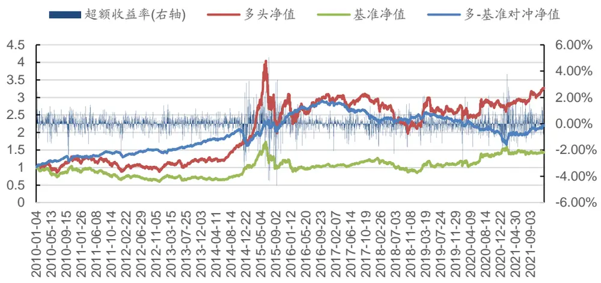
数据来源：Wind，广发证券发展研究中心

表 32：中证 800选股-多-中证 800指数对冲分年度策略表现-周度调仓

| 多头 | 累计 | 年化 | 年化 | 信息 | 最大 |
| --- | --- | --- | --- | --- | --- |
| 累计收益率 | 收益率 | 收益率 | 波动率 | 比率 | 回撤 |
| 2010 | 23.59% 32.87% | 33.62% | 13.68% | 2.46 | 10.29% |
| 2011 | -23.37% 5.49% | 5.61% | 6.99% | 0.80 | 3.61% |
| 2012 6.63% | 2.25% | 2.34% | 8.39% | 0.28 | 5.49% |
| 2013 20.13% | 23.30% | 23.81% | 8.11% | 2.94 | 3.28% |
| 2014 39.31% | -5.97% | -5.86% | 13.08% | -0.45 | 20.78% |
| 2015 78.01% | 56.23% | 56.23% | 16.99% | 3.31 | 11.99% |
| 2016 -2.87% | 12.41% | 12.94% | 6.71% | 1.93 | 3.26% |
| 2017 -2.49% | -15.37% | -15.65% | 8.15% | -1.92 | 16.04% |
| 2018 -25.86% | 1.74% | 1.78% | 10.24% | 0.17 | 6.71% |
| 2019 25.67% | -4.28% | -4.36% | 7.77% | -0.56 | 9.80% |
| 2020 2.44% | -19.12% | -19.12% | 8.63% | -2.21 | 19.44% |
| 2021 18.24% | 16.93% | 16.93% | 15.04% | 1.13 | 8.33% |
| ALL 221.56% | 127.49% | 7.20% | 11.07% | 0.65 | 42.42% |

数据来源：Wind，广发证券发展研究中心

表 33：中证 800选股-分年度换手率

| 统计区间 | 均值 | 最大值 | 最小值 | 标准差 | 累计值 |
| --- | --- | --- | --- | --- | --- |
| 2010 | 37.39% | 47.37% | 30.51% | 0.05 | 1869.44% |
| 2011 | 38.24% | 52.63% | 25.81% | 0.06 | 1950.21% |
| 2012 | 40.99% | 52.46% | 32.26% | 0.05 | 2049.55% |
| 2013 | 38.75% | 45.59% | 30.77% | 0.04 | 1976.00% |
| 2014 | 39.82% | 54.41% | 26.87% | 0.06 | 2110.64% |
| 2015 | 45.60% | 97.87% | 30.43% | 0.15 | 2371.21% |
| 2016 | 40.33% | 50.00% | 29.41% | 0.05 | 2016.60% |
| 2017 | 43.39% | 78.08% | 29.80% | 0.09 | 2212.67% |
| 2018 | 35.90% | 44.52% | 28.19% | 0.04 | 1830.67% |
| 2019 | 36.13% | 47.13% | 24.53% | 0.05 | 1842.77% |
| 2020 | 30.36% | 40.00% | 20.89% | 0.04 | 1578.60% |
| 2021 | 30.59% | 47.13% | 23.42% | 0.05 | 1590.83% |
| ALL | 38.11% | 97.87% | 20.89% | 0.08 | 23399.18% |

数据来源：Wind，广发证券发展研究中心

在中证800选股中，VWPIN平滑因子仅在五档测试中表现出比较明显的选股区分度，因子IC均值为0.033，正IC占比62.44%。在多头对冲中证800指数的回测中，策略整体的年化收益率为7.20%，信息比率为0.65。在2010、2013、2015年策略表现相对较好，除2014、2017、2019-2020年外，其余年份均能取得超额收益。整体换手率保持在38.11%左右。

## 4. 中证500选股

表 34：中证 500选股-整体与分年度 IC表现

| 范围 | IC 均值 | IC 标准差 | IC最大值 | IC最小值 | IC T统计量 | IC 累计值 | 正IC占比 |
| --- | --- | --- | --- | --- | --- | --- | --- |
| 2010 | 0.051 | 0.107 | 0.285 | -0.185 | 3.414 | 2.607 | 72.55% |
| 2011 | 0.056 | 0.125 | 0.317 | -0.208 | 3.199 | 2.847 | 66.67% |
| 2012 | 0.04 | 0.124 | 0.295 | -0.194 | 2.259 | 1.984 | 68.00% |
| 2013 | 0.034 | 0.117 | 0.261 | -0.223 | 2.092 | 1.742 | 56.86% |
| 2014 | 0.034 | 0.113 | 0.292 | -0.19 | 2.175 | 1.79 | 58.49% |
| 2015 | 0.06 | 0.134 | 0.42 | -0.242 | 3.209 | 3.068 | 64.71% |
| 2016 | 0.067 | 0.122 | 0.301 | -0.25 | 3.846 | 3.328 | 76.00% |
| 2017 | 0.03 | 0.09 | 0.215 | -0.2 | 2.422 | 1.549 | 72.55% |
| 2018 | 0.042 | 0.122 | 0.328 | -0.245 | 2.456 | 2.135 | 62.75% |
| 2019 | 0.03 | 0.096 | 0.247 | -0.162 | 2.276 | 1.555 | 54.90% |
| 2020 | 0.006 | 0.11 | 0.238 | -0.21 | 0.397 | 0.315 | 53.85% |
| 2021 | 0.028 | 0.083 | 0.208 | -0.116 | 2.459 | 1.467 | 59.62% |
| ALL | 0.04 | 0.113 | 0.42 | -0.25 | 8.725 | 24.386 | 63.84% |

数据来源：Wind，广发证券发展研究中心

图 67：中证500 VWPIN平滑因子IC值及IC累计值
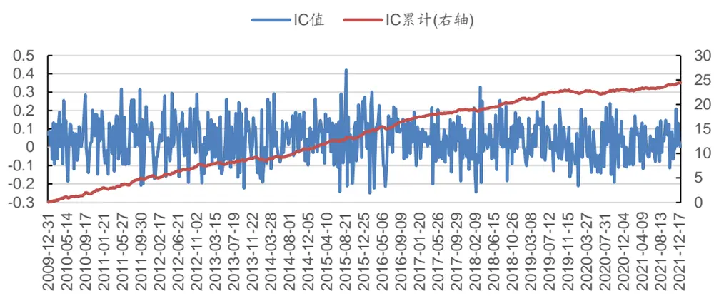
数据来源：Wind，广发证券发展研究中心

图 68：中证500选股-多-空策略净值走势-周度调仓
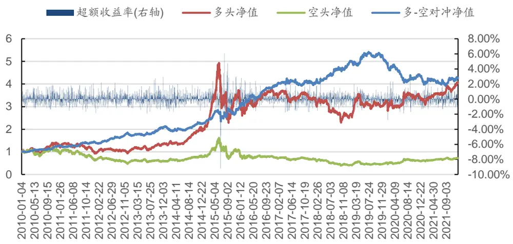
数据来源：Wind，广发证券发展研究中心

表 35：中证 500选股-多-空对冲分年度策略表现-周度调仓

|  | 累计 | 年化 | 年化 | 信息 | 最大 |
| --- | --- | --- | --- | --- | --- |
| 年份 | 收益率 | 收益率 | 波动率 | 比率 | 回撤 |
| 2010 | 25.76% | 26.33% | 10.96% | 2.40 | 3.84% |
| 2011 | 16.15% | 16.49% | 10.80% | 1.53 | 5.43% |
| 2012 | 20.91% | 21.84% | 9.52% | 2.29 | 4.99% |
| 2013 | 21.07% | 21.52% | 10.95% | 1.97 | 4.33% |
| 2014 | 6.93% | 6.80% | 10.80% | 0.63 | 9.24% |
| 2015 | 33.19% | 33.19% | 20.00% | 1.66 | 11.54% |
| 2016 | 33.42% | 34.97% | 10.63% | 3.29 | 4.75% |
| 2017 | 3.87% | 3.95% | 7.97% | 0.50 | 5.77% |
| 2018 | 20.32% | 20.76% | 10.34% | 2.01 | 4.07% |
| 2019 | 3.88% | 3.96% | 8.92% | 0.44 | 6.18% |
| 2020 | -15.76% | -15.76% | 10.08% | -1.56 | 19.02% |
| 2021 | 0.36% | 0.36% | 9.36% | 0.04 | 7.35% |
| ALL | 345.96% | 13.47% | 11.31% | 1.19 | 27.28% |

数据来源：Wind，广发证券发展研究中心

图 69：中证500选股-多-中证500策略净值走势-周度调仓
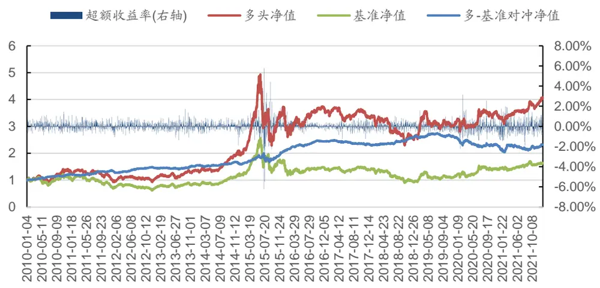
数据来源：Wind，广发证券发展研究中心

表 36：中证 500选股-多-中证 500指数对冲分年度策略表现-周度调仓

| 多头 | 累计 | 年化 |  | 年化 | 信息 | 最大 |
| --- | --- | --- | --- | --- | --- | --- |
|  | 累计收益率 | 收益率 | 收益率 | 波动率 | 比率 | 回撤 |
| 2010 | 35.49% | 22.44% | 22.93% | 5.85% | 3.92 | 2.44% |
| 2011 2012 | -26.35% | 10.30% | 10.51% | 5.56% | 1.89 | 3.76% |
| 2013 | 7.44% 25.29% | 7.90% 7.29% | 8.22% 7.44% | 5.64% | 1.46 1.15 | 4.30% 3.38% |
| 2014 | 42.17% | 2.23% | 2.19% | 6.49% | 0.34 |  |
| 2015 | 86.86% | 29.47% | 29.47% | 6.51% 15.71% | 1.88 | 5.00% 14.23% |
| 2016 | -2.90% | 17.79% | 18.57% |  | 4.14 |  |
| 2017 | -5.64% | -5.51% | -5.61% | 4.49% 4.23% | -1.33 | 1.78% 6.44% |
| 2018 | -24.47% | 12.53% | 12.79% | 5.58% | 2.29 | 1.31% |
| 2019 | 24.88% | 0.22% | 0.23% | 4.88% | 0.05 | 5.46% |
| 2020 | 5.30% | -13.69% | -13.69% | 8.47% | -1.62 | 13.34% |
| 2021 | 21.69% | 4.24% | 4.24% | 11.19% | 0.38 | 8.16% |
| ALL | 295.20% | 133.68% | 7.44% | 7.84% | 0.95 | 25.09% |

数据来源：Wind，广发证券发展研究中心

表 37：中证 500选股-分年度换手率

| 统计区间 | 均值 | 最大值 | 最小值 | 标准差 | 累计值 |
| --- | --- | --- | --- | --- | --- |
| 2010 | 37.81% | 52.50% | 28.21% | 0.06 | 1890.49% |
| 2011 | 38.63% | 62.22% | 25.58% | 0.07 | 1970.35% |
| 2012 | 38.91% | 53.49% | 28.89% | 0.06 | 1945.57% |
| 2013 | 38.39% | 52.17% | 23.40% | 0.06 | 1958.05% |
| 2014 | 40.71% | 52.17% | 23.91% | 0.06 | 2157.65% |
| 2015 | 43.97% | 96.15% | 24.44% | 0.12 | 2286.23% |
| 2016 | 42.24% | 57.14% | 26.09% | 0.07 | 2111.80% |
| 2017 | 44.92% | 73.91% | 30.53% | 0.09 | 2291.03% |
| 2018 | 38.42% | 57.78% | 28.42% | 0.05 | 1959.20% |
| 2019 | 38.75% | 52.04% | 27.55% | 0.06 | 1976.48% |
| 2020 | 34.20% | 46.39% | 22.22% | 0.05 | 1778.47% |
| 2021 | 33.05% | 49.48% | 23.47% | 0.06 | 1718.76% |
| ALL | 39.16% | 96.15% | 22.22% | 0.08 | 24044.08% |

数据来源：Wind，广发证券发展研究中心

在中证500选股中，VWPIN平滑因子表现出较为明显的选股区分度，因子IC均值为0.04，正IC占比63.84%。在多头对冲中证500指数的回测中，策略整体的年化收益率为7.44%，信息比率为0.948。在2010、2015、2016年策略表现相对更好，除2017、2020年外，其余年份均能取得超额收益。整体换手率保持在39.16%左右。

## 5. 创业板选股

表 38：创业板选股-整体与分年度 IC表现

| 范围 | IC 均值 | IC 标准差 | IC 最大值 | IC最小值 | ICT统计量 | IC 累计值 | 正IC占比 |
| --- | --- | --- | --- | --- | --- | --- | --- |
| 2011 | 0.046 | 0.188 | 0.368 | -0.389 | 1.742 | 2.339 | 64.71% |
| 2012 | 0.064 | 0.154 | 0.371 | -0.296 | 2.944 | 3.205 | 74.00% |
| 2013 | 0.068 | 0.141 | 0.471 | -0.259 | 3.469 | 3.483 | 72.55% |
| 2014 | 0.051 | 0.105 | 0.276 | -0.218 | 3.521 | 2.693 | 67.92% |
| 2015 | 0.031 | 0.139 | 0.406 | -0.355 | 1.569 | 1.561 | 56.86% |
| 2016 | 0.098 | 0.128 | 0.295 | -0.326 | 5.435 | 4.922 | 82.00% |
| 2017 | 0.06 | 0.122 | 0.324 | -0.198 | 3.534 | 3.073 | 76.47% |
| 2018 | 0.067 | 0.145 | 0.382 | -0.272 | 3.3 | 3.411 | 66.67% |
| 2019 | 0.066 | 0.097 | 0.199 | -0.203 | 4.894 | 3.38 | 72.55% |
| 2020 | 0.045 | 0.125 | 0.331 | -0.304 | 2.613 | 2.359 | 65.38% |
| 2021 | 0.051 | 0.087 | 0.249 | -0.148 | 4.266 | 2.671 | 73.08% |
| ALL | 0.059 | 0.132 | 0.471 | -0.389 | 10.53 | 33.097 | 70.16% |

数据来源：Wind，广发证券发展研究中心

图 70：创业板 VWPIN平滑因子IC值及IC累计值
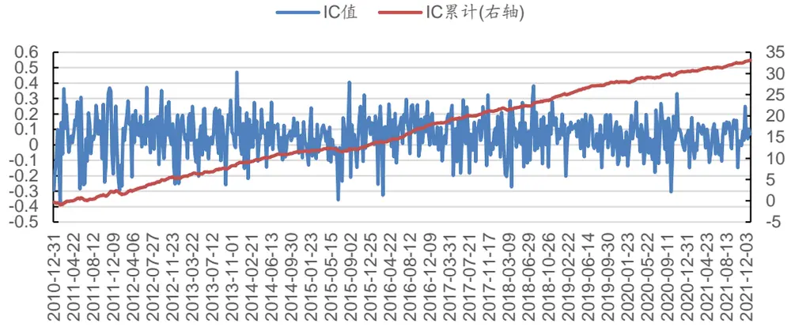
数据来源：Wind，广发证券发展研究中心

图 71：创业板选股-多-空策略净值走势-周度调仓
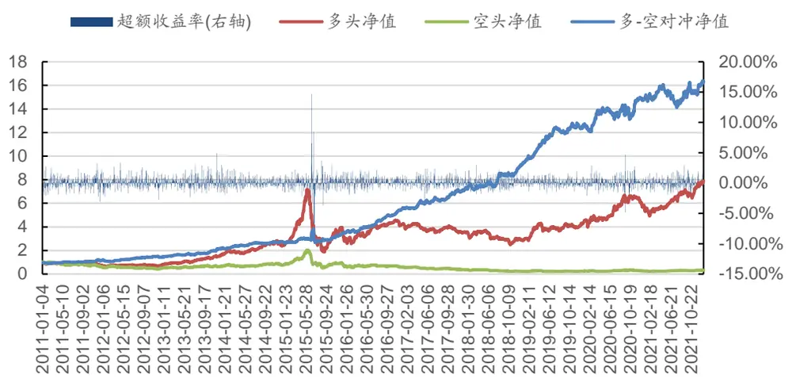
数据来源：Wind，广发证券发展研究中心

表 39：创业板选股-多-空对冲分年度策略表现-周度调仓

| 年份 | 累计 收益率 | 累计 收益率 (扣费) | 年化 收益率 | 年化 收益率 (扣费) | 年化 波动率 | 年化 波动率 (扣费) | 信息 比率 | 信息 比率(扣 费) | 最大 回撤 | 最大 回撤(扣 费) |
| --- | --- | --- | --- | --- | --- | --- | --- | --- | --- | --- |
| 2011 | 20.18% | 5.75% | 20.61% | 5.86% | 15.37% | 15.34% | 1.34 | 0.38 | 7.14% | 8.80% |
| 2012 | 24.80% | 12.02% | 25.91% | 12.53% | 12.56% | 12.55% | 2.06 | 1.00 | 10.57% | 11.67% |
| 2013 | 43.38% | 26.63% | 44.40% | 27.22% | 15.97% | 15.97% | 2.78 | 1.70 | 3.83% | 5.73% |
| 2014 | 26.66% | 10.94% | 26.09% | 10.72% | 10.89% | 10.86% | 2.40 | 0.99 | 3.39% | 5.56% |
| 2015 | 44.89% | 23.37% | 44.89% | 23.37% | 26.35% | 26.19% | 1.70 | 0.89 | 7.46% | 9.07% |
| 2016 | 65.38% | 46.21% | 68.74% | 48.45% | 12.11% | 12.08% | 5.68 | 4.01 | 5.05% | 5.28% |
| 2017 | 27.54% | 12.78% | 28.15% | 13.04% | 10.90% | 10.92% | 2.58 | 1.19 | 4.16% | 5.07% |
| 2018 | 32.07% | 17.09% | 32.79% | 17.45% | 13.59% | 13.59% | 2.41 | 1.28 | 6.23% | 7.68% |
| 2019 | 33.97% | 17.52% | 34.74% | 17.89% | 9.32% | 9.26% | 3.73 | 1.93 | 3.84% | 5.71% |
| 2020 | 19.10% | 4.28% | 19.10% | 4.28% | 13.96% | 13.94% | 1.37 | 0.31 | 7.32% | 10.84% |
| 2021 | 10.73% | -2.12% | 10.73% | -2.12% | 12.82% | 12.83% | 0.84 | -0.17 | 12.55% | 14.91% |
| ALL | 1842.36% | 375.46% | 31.46% | 15.46% | 14.62% | 14.57% | 2.15 | 1.06 | 12.55% | 14.91% |

数据来源：Wind，广发证券发展研究中心

图 72：创业板选股-多-创业板指策略净值走势-周度调仓
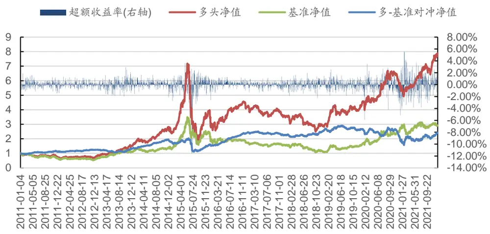
数据来源：Wind，广发证券发展研究中心

表 40：创业板选股-多-创业板指数对冲分年度策略表现-周度调仓

| 多头 | 累计 | 年化 | 年化 | 信息 | 最大 |
| --- | --- | --- | --- | --- | --- |
| 累计收益率 | 收益率 | 收益率 | 波动率 | 比率 | 回撤 |
| 2011 | -27.36% 12.35% | 12.60% | 8.79% | 1.43 | 5.76% |
| 2012 | 8.23% 11.23% | 11.70% | 5.89% | 1.99 | 2.87% |
| 2013 104.18% | 11.01% | 11.24% | 13.13% | 0.86 | 13.97% |
| 2014 53.09% | 30.45% | 29.79% | 11.28% | 2.64 | 8.53% |
| 2015 65.06% | -9.59% | -9.59% | 38.37% | -0.25 | 43.73% |
| 2016 8.55% | 51.65% | 54.20% | 9.95% | 5.45 | 4.12% |
| 2017 -16.60% | -6.51% | -6.63% | 8.33% | -0.80 | 10.03% |
| 2018 -19.28% | 11.85% | 12.09% | 11.70% | 1.03 | 7.38% |
| 2019 50.56% | 6.36% | 6.49% | 11.70% | 0.56 | 10.54% |
| 2020 34.10% | -21.21% | -21.21% | 20.42% | -1.04 | 22.66% |
| 2021 36.43% | 14.27% | 14.27% | 30.60% | 0.47 | 17.39% |
| ALL 716.58% | 148.45% | 8.75% | 18.36% | 0.48 | 45.76% |

数据来源：Wind，广发证券发展研究中心

表 41：创业板选股-分年度换手率

| 统计区间 | 均值 | 最大值 | 最小值 | 标准差 | 累计值 |
| --- | --- | --- | --- | --- | --- |
| 2011 | 41.12% | 90.00% | 21.43% | 0.13 | 2056.05% |
| 2012 | 38.27% | 49.06% | 20.00% | 0.06 | 1913.72% |
| 2013 | 38.66% | 55.17% | 25.42% | 0.07 | 1971.58% |
| 2014 | 39.13% | 50.85% | 27.42% | 0.06 | 2073.96% |
| 2015 | 47.04% | 100.00% | 30.36% | 0.17 | 2445.95% |
| 2016 | 40.94% | 48.84% | 30.77% | 0.05 | 2046.90% |
| 2017 | 41.91% | 58.89% | 31.63% | 0.06 | 2137.65% |
| 2018 | 37.64% | 47.27% | 28.81% | 0.05 | 1919.47% |
| 2019 | 39.84% | 50.35% | 30.56% | 0.04 | 2031.65% |
| 2020 | 39.83% | 56.29% | 32.26% | 0.05 | 2071.15% |
| 2021 | 37.85% | 50.00% | 30.57% | 0.04 | 1968.19% |
| ALL | 40.21% | 100.00% | 20.00% | 0.08 | 22636.27% |

数据来源：Wind，广发证券发展研究中心

在创业板选股中，VWPIN平滑因子的选股区分度明显，因子IC均值为0.059，正IC占比70.16%。在多头对冲创业板指数的回测中，策略整体的年化收益率为8.75%，信息比率为0.477。除2015、2017、2020年外，其余年份均能取得超额收益。

综合两个因子的实证分析结果，在因子层面，VWPIN平滑因子在整体上表现优于VWPIN因子。由于VWPIN平滑因子考虑了调仓时间内所有交易日的VWPIN值，能够反映更丰富的信息，因此该因子在因子分档测试、IC值表现方面都具有更好的表现。VWPIN平滑因子的信息比率更显著，同时由于具有低换手率的特征，因此后者的扣费后年化收益率具有较好的表现。板块层面来看，VWPIN因子在平滑前后在全市场、创业板、中证1000板块的选股效果更好。

## 六、VWPIN因子与 BARRA因子相关性分析

CNE6版本的BARRA因子模型将股票因子划分为市场、价值、成长、盈利、波动等大类因子。传统BARRA因子已经在市场中得到验证，能够较有效地刻画股票特征。本节将对VWPIN因子、VWPIN_SMOOTH因子与BARRA因子进行相关性分析。

## （一）BARRA 因子说明

在CNE6版本的BARRA因子模型中，共详细阐述了数大类因子，本报告仅在各大类因子中选取其中一个因子进行相关性说明。首先，对因子类型及计算公式进行如下说明：

表 42：BARRA 因子说明

| 因子类型 | 因子名称 | 因子计算公式/说明 |
| --- | --- | --- |
| Beta | HBETA | 对个股在过去252个交易日的日频收益率序列与同期市场指数收益率序列进行回归， 得到市场指数的回归系数β即为HBETA因子 |
| book_to_price | BTOP | $r_{t}^{i}-r_{t}^{f}=\alpha+\beta r_{t}^{m}+e_{t}$ 最新报告期的股东权益与当前流通市值的比值 |
| earnings_quality | ATURNOVER | 最新财报的营业收入与当期平均资产总值的比值 |
| earnings_variability | VSAL | 过去五期财报营业收入的标准差/过去五期财报营业收入的的均值 |
| earnings_yield | CETOP | 个股历史12个月滚动的经营现金流净额与当前流通市值的比值 |
| growth | EGRO | 用个股过去五年的每股盈利对时间做回归，得到的斜率再除以五年每股盈利的平均值 |
| investment_quality | AGRO | 用过去五年的总资产对时间做回归，得到的斜率再除以五年的平均值。数值乘-1 |
| leverage | MLEV | 长期资本与股东权益的比值，其中长期资本包括普通股市值、最新优先股市值以及付 息债券市值 |
| liquidity | STOM | 过去21个交易日的换手率之和的对数值 |
| long_term_reversal | RSTR | 计算过去504个交易日的个股超额对数收益率与过去21个交易日的超额对数收益率 的差额累计和，得到 RSTR 因子 $RSTR=\sum_{L}^{T+L}w_{t}[\ln\bigl(1+r_{t}^{i}\bigr)-\ln(1+r_{t}^{f})],$ |
| mid_capitallization | MIDCAP | 用截面上个股的对数流通市值的三次方对对数流通市值进行回归，对回归残差进行 MAD 去极值与中性化处理，获得MIDCAP因子 |
| momentum | HALPHA | 对个股在过去252个交易日的日频收益率序列与同期市场指数收益率序列进行回归， 得到截距项 α 为 HALPHA 因子 |
| profitability | ROA | $r_{t}^{i}-r_{t}^{f}=\alpha+\beta r_{t}^{m}+e_{t}$ 个股历史12个月滚动净利润与最新报告的总资产的比值 |
| residual_volatility | HSIGMA | 对个股在过去252个交易日的日频收益率序列与同期市场指数收益率序列进行回归， 得到残差的标准差即为HSIGMA 因子 |
|  |  | $\boxed{r_{t}^{i}-r_{t}^{f}=\alpha+\beta r_{t}^{m}+e_{t}}$ |
| size | LNCAP | 个股的对数流通市值 |

数据来源：Wind，广发证券发展研究中心

## （二）VWPIN 与 BARRA相关性分析

本小节将数据预处理（MAD法去极值、Z-Score标准化、行业市值中性化）后的VWPIN因子、VWPIN平滑因子与BARRA原始因子值进行Spearman秩相关性分析，相关性如下表所示。可以发现，VWPIN(VWPIN平滑)因子与BARRA因子之间的相关性较低，能够作为新的高频技术性因子加入多因子模型中。

表 43：VWPIN 因子与 BARRA 相关性表

| BARRA 因子 | VWPN 因子 VWPIN 平滑因子 |
| --- | --- |
| HBETA -0.13 | -0.16 |
| BTOP | 0.11 0.13 |
| ATURNOVER | -0.03 -0.03 |
| VSAL | -0.04 -0.04 |
| CETOP | 0.04 0.05 |
| EGRO | 0.02 0.03 |
| AGRO | 0.05 0.06 |
| MLEV | 0.07 0.08 |
| STOM | -0.38 -0.45 |
| RSTR | -0.10 -0.12 |
| HALPHA | -0.15 -0.17 |
| ROA | -0.06 -0.07 |
| HSIGMA | -0.18 -0.21 |
| MIDCAP | 0.04 0.04 |
| LNCAP | -0.02 -0.03 |

数据来源：Wind，广发证券发展研究中心

## 七、VWPIN因子敏感性分析

尽管上述分析表明，基于VWPIN因子、VWPIN平滑因子的选股策略能够在全市场、创业板选股范围内表现相对较好，但是在分年度换手率分析中，两类因子都呈现出高换手率的特征，这将使得策略对于手续费的设定较为敏感。因此，本节将重点分析VWPIN因子及VWPIN平滑因子对于手续费的敏感性。具体而言，分别测试了不同选股范围内，因子在千一、千三、千五手续费费率设置下的多头基准对冲净值走势。

## （一）敏感性分析-VWPIN 因子

图 73：全市场 VWPIN手续费敏感性测试
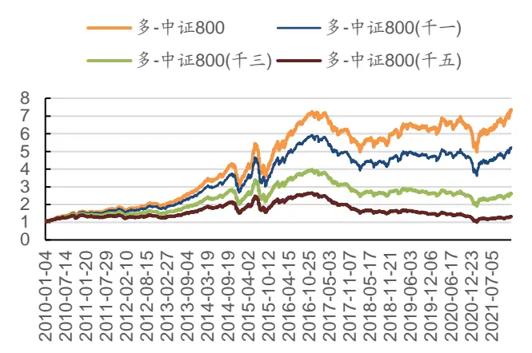
数据来源：Wind，广发证券发展研究中心

图 74：中证1000 VWPIN因子手续费敏感性测试
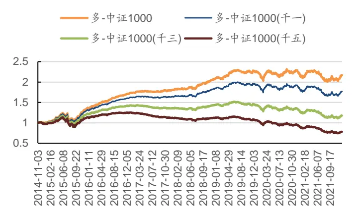
数据来源：Wind，广发证券发展研究中心

图 75：中证800 VWPIN因子手续费敏感性测试
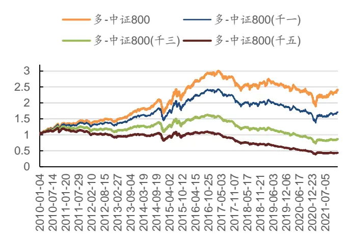
数据来源：Wind，广发证券发展研究中心

图 76：中证500 VWPIN因子手续费敏感性测试
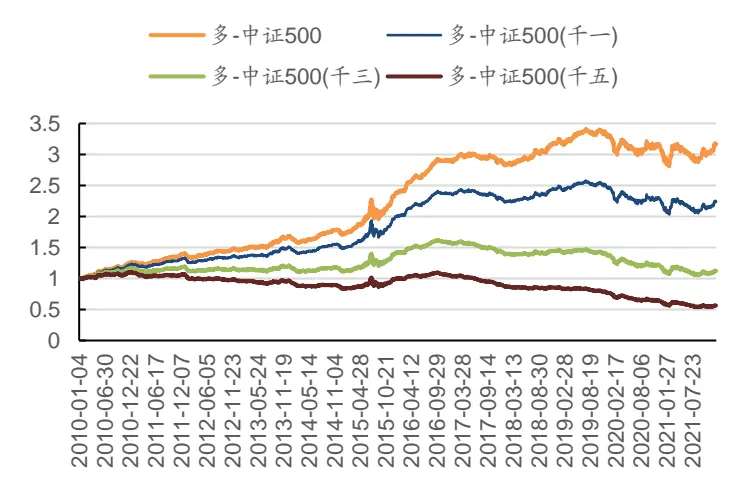
数据来源：Wind，广发证券发展研究中心

图 77：沪深300 VWPIN因子手续费敏感性测试
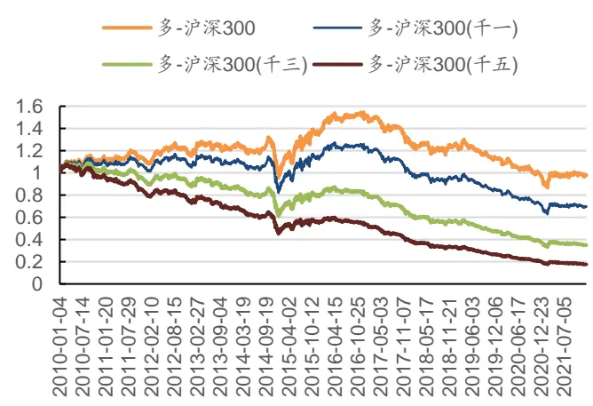
数据来源：Wind，广发证券发展研究中心

图 78：创业板 VWPIN因子手续费敏感性测试
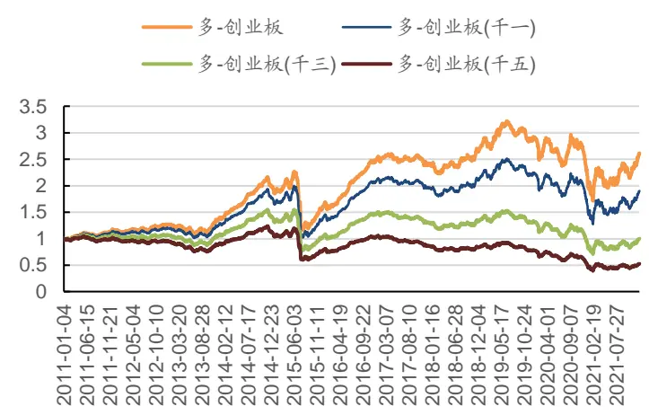
数据来源：Wind，广发证券发展研究中心

扣除千三的手续费后，全市场、中证1000以及中证500选股策略能够获得超额收益。

## （二）敏感性分析-VWPIN 平滑因子

图 79：全市场 VWPIN平滑因子手续费敏感性测试
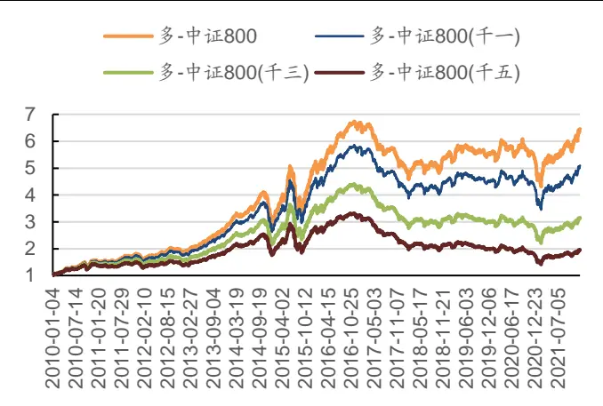
数据来源：Wind，广发证券发展研究中心

图 80：中证1000 VWPIN平滑因子手续费敏感性测试
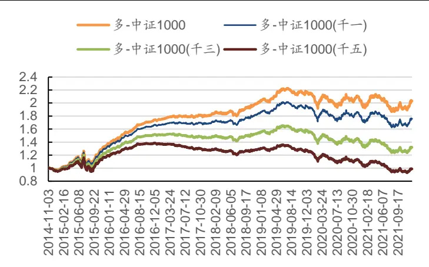
数据来源：Wind，广发证券发展研究中心

图 81：中证800 VWPIN平滑因子手续费敏感性测试
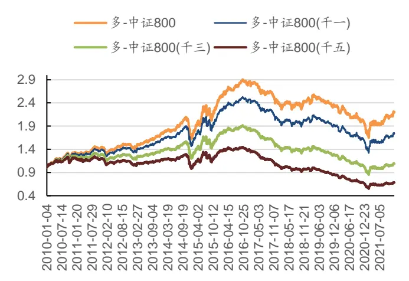
数据来源：Wind，广发证券发展研究中心

图 82：中证500 VWPIN平滑因子手续费敏感性测试
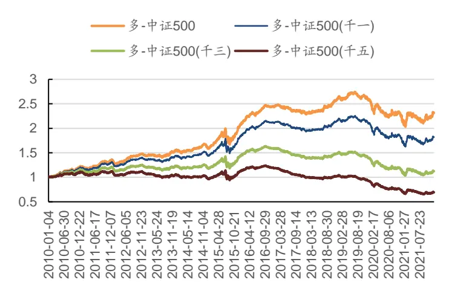
数据来源：Wind，广发证券发展研究中心

图 83：沪深300VWPIN平滑因子手续费敏感性测试
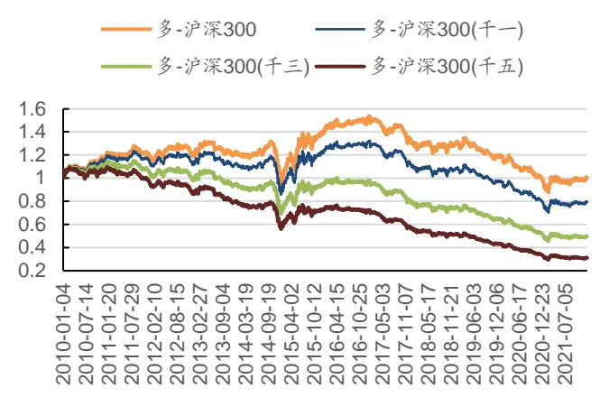
数据来源：Wind，广发证券发展研究中心

图 84：创业板 VWPIN平滑因子手续费敏感性测试
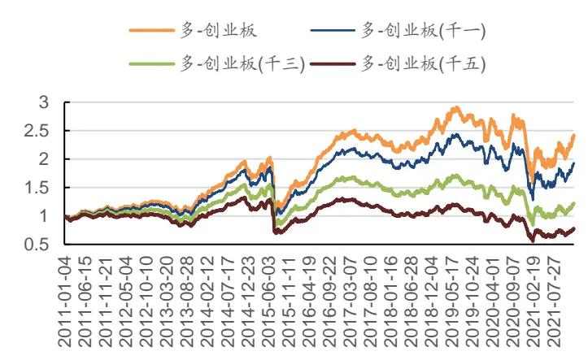
数据来源：Wind，广发证券发展研究中心

对VWPIN平滑因子策略扣除千三手续费后，除沪深300外，其余板块均能够在长期获得超额收益。与VWPIN因子相比，前者在各大板块呈现较好的业绩表现。当使用VWPIN因子、VWPIN平滑因子进行选股，应当对手续费费率予以重点关注。

## 八、总结

本篇报告从信息不对称理论的直接度量指标出发，综合考虑多个指标的理论逻辑后，构建VWPIN与VWPIN平滑因子，以期从信息不对称造成的风险溢价中获利。

从因子分档结果来看，VWPIN因子与VWPIN平滑因子在全市场、中证1000、中证800、中证500以及创业板范围内的分档效果明显。

从因子IC值统计结果来看，VWPIN因子与VWPIN平滑因子的IC均值在0.033-0.064范围内，正IC占比均保持在60%以上，近十年累计IC值均在20以上。整体来看，五档周频调仓参数下，全市场范围内VWPIN因子选股表现较好，因子IC均值为0.063，正IC占比76.59%，近十年累计IC值38.72。从多头指数对冲策略表现来看，VWPIN因子与VWPIN平滑因子的整体年化收益率在7%-20%范围内。

通过对数据预处理后的VWPIN因子与VWPIN平滑因子和BARRA因子进行相关性分析，可以发现VWPIN(VWPIN平滑)因子与BARRA因子之间的相关性较低，因此能够将其作为新的高频技术性因子加入多因子模型中。

此外，本报告还对VWPIN因子与VWPIN平滑因子对于手续费的敏感性进行测试。结果显示，VWPIN因子由于具有高换手率特征，对手续费费率设置更加敏感。

## 九、风险提示

策略模型并非百分百有效，市场结构及交易行为的改变以及类似交易参与者的增多有可能使得策略失效。

## [Table_ResearchTeam] 广发金融工程研究小组

罗军 ：首席分析师，华南理工大学硕士，从业 14年，2010年进入广发证券发展研究中心。

安 宁 宁 ：联席首席分析师，暨南大学硕士，从业 12年，2011年进入广发证券发展研究中心。

史 庆 盛 ：资深分析师，华南理工大学硕士，从业 8年，2011年进入广发证券发展研究中心。

张 超 ：资深分析师，中山大学硕士，从业 7年，2012年进入广发证券发展研究中心。

陈 原 文 ：资深分析师，中山大学硕士，从业 4年，2015年进入广发证券发展研究中心。

樊 瑞 铎 ：资深分析师，南开大学硕士，从业 4年，2015年进入广发证券发展研究中心。

李豪 ：资深分析师，上海交通大学硕士，从业 3年，2016年进入广发证券发展研究中心。

周 飞 鹏 ：高级分析师，硕士，毕业于伯明翰大学，2021年 12月加入广发证券。

季 燕 妮 ：高级研究员，厦门大学硕士，2020年进入广发证券发展研究中心。

张 钰 东 ：高级研究员，中山大学硕士，2020年进入广发证券发展研究中心。

## [Table_ 广发证券IndustryInvestDescription] —行业投资评级说明

买入： 预期未来12个月内，股价表现强于大盘10%以上。

持有： 预期未来12个月内，股价相对大盘的变动幅度介于-10%～+10%。

卖出： 预期未来12个月内，股价表现弱于大盘10%以上。

## [Table_CompanyInvestDescription] 广发证券—公司投资评级说明

买入： 预期未来 12 个月内，股价表现强于大盘 15%以上。

增持： 预期未来12个月内，股价表现强于大盘5%-15%。

持有： 预期未来12个月内，股价相对大盘的变动幅度介于-5%～+5%。

卖出： 预期未来 12 个月内，股价表现弱于大盘 5%以上。

## [Table_Address] 联系我们

| 地址 | 广州市 | 深圳市 | 北京市 | 上海市 | 香港 |
| --- | --- | --- | --- | --- | --- |
|  | 广州市天河区马场路 | 深圳市福田区益田路 | 北京市西城区月坛北 | 上海市浦东新区南泉 | 香港德辅道中189号 |
|  | 26号广发证券大厦35 | 6001号太平金融大厦 | 街2号月坛大厦18层 | 北路429号泰康保险 | 李宝椿大厦29及30 |
|  | 楼 | 31层 |  | 大厦37楼 | 楼 |
|  | 510627 | 518026 |  |  |  |
| 邮政编码 客服邮箱 | gfzqyf@gf.com.cn |  | 100045 | 200120 | = |

## [Table_LegalDisclaimer] 法律主体声明

本报告由广发证券股份有限公司或其关联机构制作，广发证券股份有限公司及其关联机构以下统称为“广发证券”。本报告的分销依据不同国家、地区的法律、法规和监管要求由广发证券于该国家或地区的具有相关合法合规经营资质的子公司/经营机构完成。

广发证券股份有限公司具备中国证监会批复的证券投资咨询业务资格，接受中国证监会监管，负责本报告于中国（港澳台地区除外）的分销。广发证券（香港）经纪有限公司具备香港证监会批复的就证券提供意见（4 号牌照）的牌照，接受香港证监会监管，负责本报告于中国香港地区的分销。

本报告署名研究人员所持中国证券业协会注册分析师资质信息和香港证监会批复的牌照信息已于署名研究人员姓名处披露。

## [Table_Important重要声明

广发证券股份有限公司及其关联机构可能与本报告中提及的公司寻求或正在建立业务关系，因此，投资者应当考虑广发证券股份有限公司及其关联机构因可能存在的潜在利益冲突而对本报告的独立性产生影响。投资者不应仅依据本报告内容作出任何投资决策。投资者应自主作出投资决策并自行承担投资风险，任何形式的分享证券投资收益或者分担证券投资损失的书面或者口头承诺均为无效。

本报告署名研究人员、联系人（以下均简称“研究人员”）针对本报告中相关公司或证券的研究分析内容，在此声明：（1）本报告的全部分析结论、研究观点均精确反映研究人员于本报告发出当日的关于相关公司或证券的所有个人观点，并不代表广发证券的立场；（2）研究人员的部分或全部的报酬无论在过去、现在还是将来均不会与本报告所述特定分析结论、研究观点具有直接或间接的联系。

研究人员制作本报告的报酬标准依据研究质量、客户评价、工作量等多种因素确定，其影响因素亦包括广发证券的整体经营收入，该等经营收入部分来源于广发证券的投资银行类业务。

本报告仅面向经广发证券授权使用的客户/特定合作机构发送，不对外公开发布，只有接收人才可以使用，且对于接收人而言具有保密义务。广发证券并不因相关人员通过其他途径收到或阅读本报告而视其为广发证券的客户。在特定国家或地区传播或者发布本报告可能违反当地法律，广发证券并未采取任何行动以允许于该等国家或地区传播或者分销本报告。

本报告所提及证券可能不被允许在某些国家或地区内出售。请注意，投资涉及风险，证券价格可能会波动，因此投资回报可能会有所变化，过去的业绩并不保证未来的表现。本报告的内容、观点或建议并未考虑任何个别客户的具体投资目标、财务状况和特殊需求，不应被视为对特定客户关于特定证券或金融工具的投资建议。本报告发送给某客户是基于该客户被认为有能力独立评估投资风险、独立行使投资决策并独立承担相应风险。

本报告所载资料的来源及观点的出处皆被广发证券认为可靠，但广发证券不对其准确性、完整性做出任何保证。报告内容仅供参考，报告中的信息或所表达观点不构成所涉证券买卖的出价或询价。广发证券不对因使用本报告的内容而引致的损失承担任何责任，除非法律法规有明确规定。客户不应以本报告取代其独立判断或仅根据本报告做出决策，如有需要，应先咨询专业意见。

广发证券可发出其它与本报告所载信息不一致及有不同结论的报告。本报告反映研究人员的不同观点、见解及分析方法，并不代表广发证券的立场。广发证券的销售人员、交易员或其他专业人士可能以书面或口头形式，向其客户或自营交易部门提供与本报告观点相反的市场评论或交易策略，广发证券的自营交易部门亦可能会有与本报告观点不一致，甚至相反的投资策略。报告所载资料、意见及推测仅反映研究人员于发出本报告当日的判断，可随时更改且无需另行通告。广发证券或其证券研究报告业务的相关董事、高级职员、分析师和员工可能拥有本报告所提及证券的权益。在阅读本报告时，收件人应了解相关的权益披露（若有）。

本研究报告可能包括和/或描述/呈列期货合约价格的事实历史信息（“信息”）。请注意此信息仅供用作组成我们的研究方法/分析中的部分论点/依据/证据，以支持我们对所述相关行业/公司的观点的结论。在任何情况下，它并不（明示或暗示）与香港证监会第5类受规管活动（就期货合约提供意见）有关联或构成此活动。

## [Table_Int 权益披露 erestDisclos

(1)广发证券（香港）跟本研究报告所述公司在过去12 个月内并没有任何投资银行业务的关系。

## [Table_Copyright版权声明

未经广发证券事先书面许可，任何机构或个人不得以任何形式翻版、复制、刊登、转载和引用，否则由此造成的一切不良后果及法律责任由私自翻版、复制、刊登、转载和引用者承担。