# [Table_Title] 日内价量数据因子化研究

# 高频数据因子研究系列八

## 报告摘要：

因子开发迭代更新越来越重要。近几年来，随着传统多因子模型在市场的应用逐渐广泛，因子的波动特征逐渐加大，因子拥挤等原因造成了因子的收益逐渐下降。为了能够寻找更多的Alpha 来源，在多因子模型框架中，因子作为底层基础，开发、迭代、更新就显得越来越重要。低频相关数据的因子开发对于目前新Alpha 收益来源来说，边际贡献已越来越小，高频数据在用于量化投资中存在一定优势。本篇专题探讨日内高频数据在因子选股中的应用。

交易活动分析与信息不对称理论。市场微观结构理论认为，市场中存在具有信息优势与不具有信息优势的两类参与者，而信息优势交易者所拥有的信息对资产的定价具有显著影响。有学者从交易活动角度论证，信息优势交易者会基于增量信息进行反转交易并从中获利，而非信息优势交易者则基于短期流动性需求或非有效信息进行趋势交易蒙受损失。基于交易行为分析，本报告构建动态 DPIN 因子及其衍生因子，研究该类因子在选股中的应用。

DPIN因子实证分析。在全市场范围内，周度调仓频率下，在回测期内刻画DPIN日内交易结构特征的部分 $\cdot DPIN_{MEAN}\text{、 }DPIN_{STD}\text{、 }DPIN_{STABLE}$ 类因子分档单调性显著，同时 IC 指标、多空收益、多头相对基准策略测试表现较好。在全市场选股范围，DPIN_SMALL_PM_MEAN 因子IC 均值为 0.044，正 IC 占比 84.4%，多头相对中证 800 策略整体年化收益率为 23.4%，信息比率为 1.31；DPIN_BASE_MIDDLE_STD因子 IC 均值为0.061，正IC 占比72.4%，多头相对中证 800策略整体年化收益率为 18.8%，信息比率为 1.08；DPIN_SMALL_TOTAL_STABLE 因子 IC 均值为-0.059，负 IC 占比为 72.4%，多头相对中证800策略整体年化收益率为 19.2%，信息比率为1.09。

DPIN 因子相关性分析与敏感性测试。DPIN 类因子与部分 BARRA 因子存在一定程度相关性。相较于创业板指、沪深 300 选股范围，DPIN 类因子在中证 1000、中证 500 范围内具有较好绩效表现。该类因子在更高调仓频率下表现更好，但多头平均换手率较高。

风险提示。策略模型并非百分百有效，市场结构及交易行为的改变以及类似交易参与者的增多有可能使得策略失效。

图：DPIN_BASE_MEAN_AM 因子分 档表现

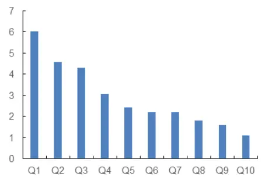
数据来源：Wind, 广发证券发展研究中心

[Table_Aut分析师：陈原文

同SAC 执证号：S0260517080003

公0755-82797057

chenyuanwen@gf.com.cn分析师： 罗军

SAC 执证号：S0260511010004

020-66335128

luojun@gf.com.cn

分析师： 安宁宁

SAC 执证号：S0260512020003

SFC CE No. BNW179

0755-23948352

anningning@gf.com.cn

请注意，陈原文,罗军并非香港证券及期货事务监察委员会的注册持牌人，不可在香港从事受监管活动。

## [Table_ 相关研究：DocRep

行业聚类方法探讨:——重构行业2021-11-17轮动框架之十

海量技术指标掘金 Alpha因子:多2021-07-30因子 Alpha系列报告之（四十二）

## 一 、高频因子思考：从低频信息到高频信息

近年来，A股市场机构化趋势明显。与此同时，传统的风格因子波动增大，从市场获取超额收益的难度在增加。

因子拥挤是因子收益下降的原因之一。因子代表着市场某方面的非有效性、或者是一段时期内的定价失效。当某类因子收益高的时候，会吸引更多的资金进入，从而出现因子拥挤，降低因子的预期收益。一旦新的因子被公开，套利资金的介入会使得错误定价收窄，因子收益也会跟着下降。因此，在多因子选股模型中，因子的开发和更新迭代变得越来越重要。

以传统日频价量和更低频财务数据为基础的因子开发是一种研究途径。由于基础因子广为人知，在此基础上进行因子挖掘的收益提升空间相对有限。而且日频数据由于本身的数据量和信息量有限，过度挖掘会增大过拟合的风险。

以高频价量数据为基础的因子开发在当下具有更大的收益提升空间。与低频因子相比，高频数据在用于量化投资中存在一定优势。

首先，高频价量数据的体量明显大于低频数据。以分钟行情为例，用压缩效果较好的mat格式存储2020年全市场股票的分钟行情数据（包括分钟频的开高低收价格数据、买卖盘挂单数据等），约为12GB。如果是快照行情（目前上交所和深交所都是3秒一笔）或者level 2行情，数据量要大很多。因此，高频数据因子挖掘对信息处理能力和处理效率的要求较高。而且，日内数据，尤其是level 2数据，一般要额外付费，甚至需要自行下载存储实时行情，在此基础上构建的因子拥挤度较低。

其次，高频价量数据一般是多维的时间序列数据，数据中噪声比例较高，而且与ROE、PE这类低频指标本身就具有选股能力不同的是，原始的高频行情数据一般不能直接用作选股因子，而要通过信号变换、时间序列分析、机器学习等方法从高频数据中构建特征，才能作为选股因子。此类因子与低频信号的相关性较低，而且由于因子开发流程相对复杂，不同投资者构建的因子更具有多样性。

此外，高频数据开发的因子一般调仓周期较短，意味着在检验因子有效性的时候，同一段测试期具有更多的独立样本。例如，在一年的测试期内，只有12个独立的样本段用于检验月频调仓的因子，与之相比，有约50个独立的时段用于检验周频调仓因子，有超过240个独立的时段用于检验日频调仓的因子。独立样本的增多有助于检验高频因子的有效性。

高频数据挖掘因子的难点在于数据维度大、噪声高。凭借专业投资者的经验或者是参阅已发表的文献，可以从高频数据中提炼出一部分有选股能力的特征。此外，机器学习方法擅长从数据中寻找规律和特征，是高频数据因子挖掘的有力工具。本篇专题报告通过学术上关于高频相关的研究结果借鉴，从高频价量数据中提炼选股因子。

表 1：广发金工高频数据因子挖掘系列报告一览

信息不对称理论下的因子研究：高频数据因子研究系列六再谈信息不对称理论下的因子研究：高频数据因子研究系列七高频价量数据的因子化方法-多因子Alpha系列报告之（四十一）深度学习框架下高频数据因子挖掘-深度学习研究报告之七基于个股羊群效应的选股因子研究-高频数据因子研究系列三基于日内高频数据的短周期选股因子研究-高频数据因子研究系列二基于日内高频数据的短周期选股因子研究-高频数据因子研究系列一数据来源：Wind，广发证券发展研究中心

## 二 、相关研究进展

传统的有效市场假说认为，在完全有效的金融市场上，价格能够充分反映资产的所有公开信息以及私有信息。然而，现实世界中由于存在交易摩擦、投资者非理性行为、信息非完全公开等现象，拥有更多私人信息的市场参与者相对于信息匮乏的市场参与者而言，往往处于市场的有利地位。市场微观结构理论将市场参与者划分为拥有信息优势交易者与非信息优势两类参与者，认为信息对资产价格的确定具有重大影响。在市场存在信息不对称时，具有私人信息的知情交易者会利用信息优势进行交易从而做出对自己有利的投资决策。同时，这种行为对于非信息优势交易者而言是一种投资风险，在市场交易的过程中使其处于劣势地位，从而蒙受损失。因此，如何衡量信息不对称的程度，进而规避由此带来的投资风险成为理论研究者以及业界关注的热点。

根据学术研究成果，信息不对称的度量主要经历了两个阶段：间接度量阶段与直接度量阶段。在早期研究阶段，买卖价差、换手率、收益率波动率等指标被用于信息不对称的替代变量进行研究，虽然这些变量和信息不对称都存在着因果关系，能够在一定程度上反映交易中蕴含的信息不对称程度，但是间接指标刻画导致的投资风险的准确性仍有进步的空间。

1996年，Easley等人发表论文《Liquidity, Information, and Infrequently TradedStocks》，基于交易委托单数据构建混合泊松分布模型，利用极大似然估计方法计算出信息优势交易占总交易的比例，即Probability of information-based trade, 简称为PIN，使得对于信息不对称的度量进入直接度量阶段。在近二十多年，国内外学者纷纷对PIN模型进行深入探讨。

理论研究方面，学者利用参数与非参数的估计模型，对原始PIN模型进行改进，提出了对该度量指标更多深入的探讨。例如，Easley等人在《Flow Toxicity andLiquidity in a High-frequency World》(2012)论文中，规避了PIN模型极大似然估计方法计算复杂、数值优化过程耗时长等缺陷，利用非参数估计方法，基于同等交易量时间区间内的买卖订单交易量不平衡性能够测度信息优势交易概率的思路，构建交易量实时更新的Volume Synchronized PIN，简称为VPIN模型。为应对VPIN模型在实证研究中曾出现度量失效的现象，李平等人于2020年发表论文《知情交易概率于风险定价——基于不同PIN测度方法的比较研究》，通过对VPIN模型进行优化，提出基于物理时间和交易量加权的volume-weighted probability of informed trading，简称为VWPIN模型。Chang等人在《A dynamic intraday measure of the probabilityof informed trading and firm-specific return variation》(2014)论文中，从日内高频交易活动角度出发，将新信息下的反转交易占比作为信息优势交易概率的直接度量，构建动态日内信息优势交易概率(Dynamic Probability of information-based trade，简称为DPIN)模型。实证分析方面，利用国内外多个股票市场数据，分析了该理论在股票资产定价、风险管理等多个领域的应用。

## （一）PIN 模型

Easley等人在其发表论文《Price, trade size, and information in securitiesmarkets》(Journal of Financal Economics, 1987)中，基于计量经济学分析和经济理论，提出了用于分析市场资产价格发现过程的序贯交易模型(Sequential trademodel)。而经典的Probability of information-based trade, 简称为PIN模型正是在序贯交易模型的基础上，通过构建服从混合泊松分布的买卖订单流，并用极大似然估计方法对其求解得到的。详细建模步骤如下：

## 1. 模型假设

市场参与者类划分为信息优势交易者、非信息优势交易者、提供流动性的做市商；

样本时间段T平均分成I个交易区间，投资者在任意交易区间连续进行交易，并且交易价格由做市商决定；

不同交易区间的信息相互独立；

信息事件发生相关的概率假设如下：信息事件发生的概率为α，信息事件发生为坏消息的概率为δ；

投资者基于自己拥有的信息决定投资策略，信息优势交易者由于拥有更多的信息在投资过程中处于优势地位。因此，假设非信息优势交易者的委托单到达率为ε，信息优势委托单到达率为μ。

## 2. 构建买卖订单流二叉树

当信息事件不发生时，非信息优势交易者参与交易，因此交易双方的委托单到达率均为ε。当信息事件发生时，有以下两种情况。当利好消息发生，信息优势交易者将事先得知该消息并买入股票，非信息优势交易者可能买入股票也可能卖出股票，此时买方与卖方委托单到达率分别为ε+μ、ε。同理，当利空消息发生，信息优势交易者将事先得知该消息并卖出股票，非信息优势交易者可能买入或卖出股票，此时买方与卖方委托单到达率分别为ε、ε+μ。具体买卖订单流二叉树如下图所示：

图 1：买卖订单流二叉树
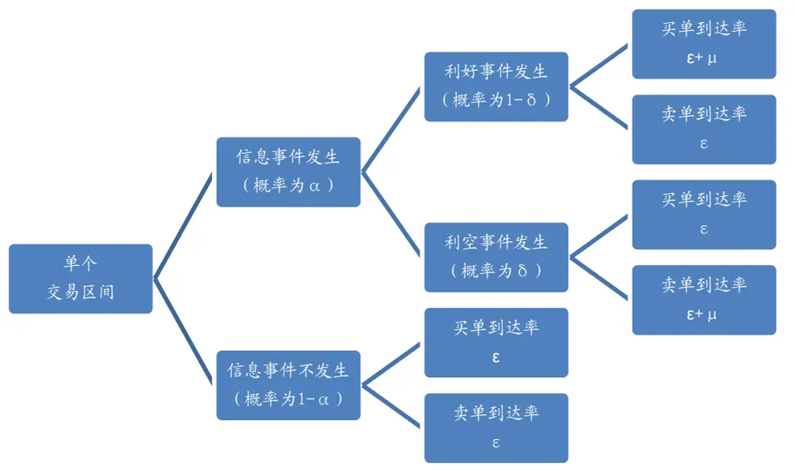
数据来源：Wind，广发证券发展研究中心

## 3. 基于贝叶斯法则的PIN模型数学推导

由于在交易过程中，假设做市商已知买卖订单流每种情况的发生概率，但是具体何种事件发生未知，做市商采用贝叶斯法则对信息是否发生的认知进行更新。同时做出如下假定：

做市商在“没有消息”、“坏消息”、“好消息”情况下的先验概率分别为： $\mathrm{P}(\mathrm{t})=$

$$
\left(\mathbf{P}_{\mathbf{n}(\mathbf{t})},\mathbf{P}_{b(t)},\mathbf{P}_{g(t)}\right),\quad 且\mathbf{t}=0时,\quad\mathbf{P}(0)=(1-\alpha,\alpha\delta,\alpha(1-\delta));
$$

资产价格在“没有消息”、“坏消息”、“好消息”情况下分别为： $\mathrm{V}_{\mathrm{i}}^{*}、\underline{{V_{i}}}、\overline{{V_{i}}},$ ，且满足

$$
\underline{{V_{i}}}<\mathrm{V_{i}^{*}}<\overline{{V_{i}}};
$$

根据不同信息事件的发生概率，可以得到t时刻的期望价格：

$$
\mathrm{E}(\mathrm{V}_{\mathrm{i}}|\mathrm{t})=\mathrm{P}_{\mathrm{n}}(t)V_{t}^{*}+P_{b}(t)\underline{V_{t}}+P_{-}g(t)\overline{V_{t}}
$$

根据贝叶斯法则，在t时刻，卖单到来时的信息事件后验概率如下：

当信息事件不发生时：

$$
\mathbb{P}_{\mathrm{n}}(t|S_{t})=\frac{P_{n}(t)\epsilon}{\epsilon+P_{b}(t)\mu}
$$

当信息事件发生且为利好消息时：

$$
\mathrm{P}_{\mathrm{g}}(t|S_{t})=\frac{P_{g}(t)\epsilon}{\epsilon+P_{b}(t)\mu}
$$

当信息事件发生且为利空消息时：

$$
P_{b}(t|S_{t})=\frac{P_{b}(t)(\epsilon+\mu)}{\epsilon+P_{b}(t)\mu}
$$

因此，做市商给出的买入报价为：

$$
\mathbf{b}(\mathbf{t})=\mathrm{E}[V_{\mathrm{i}}|\mathbf{t}]-\frac{\mu P_{\mathrm{b}}(t)}{\epsilon+\mu P_{\mathrm{b}}(t)}\left(\mathrm{E}[V_{\mathrm{i}}|t]-\underline{V_{\mathrm{i}}}\right)
$$

同理，可以推导出做市商给出的卖出报价为：

$$
\alpha(t)=\mathrm{E}[V_i|t]-\frac{\mu\mathrm{P}_g(t)}{\epsilon+\mu\mathrm{P}_g(t)}\left(\overline{V_i}-\mathrm{E}[V_i|t]\right)
$$

基于买入报价与卖出报价，可以得出不同市场情况下的买卖价差公式。一般情况下，市场中同时存在信息优势交易者与非信息优势交易者，这些交易者分别根据自身掌握的信息情况做出交易决策，此时的买卖价差公式如下。其中，第一项表示当利好消息出现时，信息优势交易概率与信息优势交易者买入交易预期损失的乘积，第二项表示当利空消息出现时，信息优势交易概率与信息优势交易者卖出交易预期损失的乘积。那么，总的信息优势交易概率(PIN)即为上述两种情况下的信息优势交易概率之和。通过上述公式，可以推导出PIN模型公式。

$$
\begin{aligned}\sum(t)=\alpha(t)-b(t)=\frac{\mu\mathrm{P}_{\mathrm{g}}(t)}{\epsilon+\mu\mathrm{P}_{\mathrm{g}}(t)}\left(\overline{V}_{i}-E[V_{i}|t]\right)+\frac{\mu\mathrm{P}_{\mathrm{b}}(t)}{\epsilon+\mu\mathrm{P}_{\mathrm{b}}(t)}\left(E[V_{i}|t]-\underline{V}_{i}\right)\\\mathrm{PIN}(t)=\frac{\mu\left(1-\mathrm{P}_{\mathrm{n}}(t)\right)}{\mu\left(1-\mathrm{P}_{\mathrm{n}}(t)\right)+2\epsilon}\end{aligned}
$$

根据上述给出的关于P(0)的先验概率假设，可以求得第一个交易时段的PIN模型：

$$
\mathrm{PIN}=\frac{\mu(1-P_{\mathrm{n}}(0))}{\mu(1-P_{\mathrm{n}}(0))+2\epsilon}=\frac{\alpha\mu}{\alpha\mu+2\epsilon}
$$

## 4. 极大似然估计法进行混合泊松分布参数估计

为获取股票的PIN模型估计值，Easley在《Liquidity, Information, andInfrequently Traded Stocks》(1996)论文中做出如下假定：买卖委托单服从泊松分布，每个交易时段内的交易行为相互独立。在上述分析基础上，可以得到关于买单B和卖单S的似然函数，如下所示：

当信息事件不发生时：

$$
\mathbf{e}^{-\epsilon T}\frac{(\epsilon T)^{B}}{B!}e^{-\epsilon T}\frac{(\epsilon T)^{S}}{S!}
$$

当信息事件发生且为利好消息时：

$$
e^{-(\mu+\epsilon)T}\frac{\left((\varepsilon+\mu)T\right)^{B}}{B!}e^{-\epsilon T}\frac{(\epsilon T)^{S}}{S!}
$$

当信息事件发生且为利空消息时：

$$
e^{-\epsilon T}\frac{(\varepsilon T)^{B}}{B!}e^{-(\epsilon+\mu)T}\frac{((\epsilon+\mu)T)^{S}}{S!}
$$

基于第（1）步关于信息事件发生概率的假设，可以得到以下混合泊松似然函数：

$$
\begin{aligned}\mathrm{L}<(\mathrm{B},S)|\boldsymbol{\theta}>=&(1-\alpha)*\mathbf{e}^{-\epsilon T}\frac{(\epsilon T)^B}{B!}e^{-\epsilon T}\frac{(\epsilon T)^S}{S!}+\alpha\delta\\&*e^{-\epsilon T}\frac{(\varepsilon T)^B}{B!}e^{-(\epsilon+\mu)T}\frac{\left((\epsilon+\mu)T\right)^S}{S!}+\alpha(1-\delta)\\&*e^{-(\mu+\epsilon)T}\frac{\left((\varepsilon+\mu)T\right)^B}{B!}e^{-\epsilon T}\frac{(\epsilon T)^S}{S!}\end{aligned}
$$

基于第（1）对样本区间T的I个交易区间的假设，结合交易方向的数据M =$(\mathrm{B_{i}},\mathrm{S_{i}})_{i=1}^{I}$ ，可以获得下述似然函数，并通过极大似然估计最终获得PIN模型的相关参数α、δ、ε以及μ。

$$
\mathrm{L}(\mathsf{M}|\boldsymbol{\theta})=\prod_{i=1}^{I}L(B_{i},S_{i}|\boldsymbol{\theta}),
$$

PIN模型的产生，从理论与实践两方面使得直接测度信息不对称风险成为可以实现的内容。但是，该模型仍然存在缺陷。首先，PIN模型所需的数据时间跨度长，易导致数据蕴含的非公开信息被稀释或丢失；其次，PIN因子实际包含了非公开信息与市场非流动性信息，而后者在此为冗余信息；最后，部分股票由于数据量过于庞大，用极大似然估计法计算PIN参数过程中，存在数值溢出问题。因此，Easley等学者在《Flow Toxicity and Liquidity in a High-frequency World》(2012)一文中，根据买卖双方交易量的不平衡性提出了改进的信息优势交易概率模型，即交易量实时更新的知情交易概率(VPIN)模型。

## （二）DPIN 模型

由于PIN模型存在改进的空间，Chang等人在其发表论文《A dynamic intradaymeasure of the probability of informed trading and firm-specific return variation》(Journal of Empirical Finance, 2014)中，扩展了Campbell等人(1993)用于分析股票市场总体交易量与股票日度收益序列相关性之间关系的交易模型，以及Avramov等人(2006)在研究得到信息后卖出交易对个股价格波动率影响时构建的自相关回归模型，同时考虑信息优势买入交易以及信息优势卖出交易，利用日内高频量价数据构建了DPIN模型。

为具体说明DPIN模型的内在逻辑，首先需要理解以下两个结论。Campbell等人(1993)认为，股票价格变动来源于两点原因，一是影响股票价值的信息，二是流动性需求或非信息优势交易。前者会融入价格，但不会带来反转交易；后者作为非理性交易，会给个股带来短期供需压力并造成价格波动，使得股票市场价格偏离合理价值，进而可能带来反转交易。该论文实证结果表明，非信息优势交易与个股收益的序列相关性呈现负相关性，而信息优势交易不存在类似关系。基于此，Avramov等人(2006)进一步研究两类卖出交易活动对收益序列相关性产生的影响。结果表明，与羊群交易相关的未预期收益序列存在显著负序列相关性，与反转交易相关的未预期收益序列不存在显著的同类关系。换言之，反转交易可作为信息优势交易的代理变量，羊群交易可作为非信息优势交易的代理变量。

基于上述实证研究结论，DPIN模型同时考虑信息优势买入与信息优势卖出交易，认为非预期收益为正(负)时，卖出(买入)交易占总交易比重为信息优势交易概率；当非预期收益为正(负)时，买入(卖出)交易占总交易比重为非信息优势交易概率。

具体的 $DPIN_{BASE}$ 模型构建步骤如下：

## 1. 计算股票i在日内区间j内的非预期收益 $\epsilon_{i,j}$

由于个股的区间收益与所属星期、日内区间、滞后区间收益以及该区间市场新信息有关，通过下述自回归方程，可获得残差 $\epsilon_{i,j}$ 作为股票i在日内区间j内的非预期收益。

$$
R_{i,j}=\gamma_{0}+\sum_{k=1}^{4}\gamma_{1i,k}D_{k}^{Day}+\sum_{k=1}^{48}\gamma_{2i,k}D_{k}^{Int}+\sum_{k=1}^{12}\gamma_{3i,k}R_{i,j-k}+\epsilon_{i,j}
$$

其中， $R_{i,j}$ 为指定交易日 $t,$ ，股票i在日内区间j的区间收益率； $D_{k}^{Day}$ 为周内效应虚拟变量，如：指定交易日为周一，则 $(D_{1}^{Day},D_{2}^{Day},D_{3}^{Day}{,}D_{4}^{Day})$ 为 $(1{,}0{,}0{,}0)$ $D_{k}^{Int}$ 为日内效应虚拟变量，日内区间j对应的变量取1，其他取0。由于利用5分钟频数据，因$此k=1,2,\ldots,48;R_{i,j-k}$ 为股票i在过去k个日内区间的滞后收益率，滞后阶数k参考Chang等人(2014)论文，设置为12。

## 2. 计算股票i在日内区间j内的知情交易概率 $DPIN_{BASE}$

当未预期收益 $.\epsilon_{i,j}$ 为正(负)，区间j内的卖出(买入)交易占比即为股票i在日内区间j内的信息优势交易概率DPIN。

$$
DPIN_{BASE}^{i,j}=\frac{NB_{i,j}}{NT_{i,j}}*(\epsilon_{i,j}<0)+\frac{NS_{i,j}}{NT_{i,j}}*(\epsilon_{i,j}>0)
$$

其中， $NB_{i,j}、NS_{i,j}、NT_{i,j}$ 分别为指定日t，股票i在日内区间j的主买成交笔数、主卖成交笔数、总成交笔数。 $\left(\epsilon_{i,j}<0\right)$ 为虚拟变量，当未预期收益 $.\epsilon_{i,j}$ 为负，取值为1，否则为0。 $(\epsilon_{i,j}>0)$ 取值同理可得。

进一步地，论文通过分析信息优势交易的行为模式，结合交易单规模来刻画信息优势交易的概率，在改进 $DPIN_{BASE}$ 因子构建步骤2的基础上，构造 $DPIN_{SIZE}$ 因子与 $DPIN_{SMALL}$ 因子。

## 3. 计算股票i在日内区间j内的知情交易概率 $DPIN_{SIZE}$

由于Easley和O‘Hara (1987) 认为，信息优势交易者更有可能进行大单交易。换言之，大单交易区间内的反转交易更有可能来自于信息优势交易者。基于此，本报告构建 $DPIN_{SIZE}$ 因子。具体而言，增加表示大订单的虚拟变量。在交易日t内，当股票i在区间j内的总交易量超过当日各个区间内总交易量的中位数，则虚拟变量赋值为1，此时未预期收益为正(负)情况下的卖(买)单反映信息优势交易概率，反之为0。公式如下：

$$
DPIN_{SIZE}^{i,j}=\left[\frac{NB_{i,j}}{NT_{i,j}}*\left(\epsilon_{i,j}<0\right)+\frac{NS_{i,j}}{NT_{i,j}}*\left(\epsilon_{i,j}>0\right)\right](LT_{i,j})
$$

其中， $NB_{i,j}$ $NS_{i,j}$ $NT_{i,j}$ 分别为指定日t，股票i在日内区间j的主买成交笔数、主卖成交笔数、总成交笔数。 $\left(\epsilon_{i,j}<0\right)$ 为虚拟变量，当未预期收益 $\epsilon_{i,j}$ 为负，取值为1，否则为0。 $(\epsilon_{i,j}>0)$ 取值同理可得。 $LT_{i,j}$ 为判断大订单的虚拟变量。

## 4. 计算股票i在日内区间j内的信息优势交易概率 $DPIN_{SMALL}$

Chang等(2014) 认为，新信息可能在任意时间到达市场，信息优势交易者会迅速、低成本地对信息作出交易决策的反应。在市场交易不活跃的日内区间，信息优势交易者为尽可能不暴露自身知情交易这一信息，更有可能选择将大订单拆分成小订单进行交易。基于此，本报告构建 $DPIN_{SMALL}$ 因子。具体而言，增加表示小订单的虚拟变量。在交易日t内，当股票i在区间j内的总交易量小于当日各个区间内总交易量的中位数，则虚拟变量赋值为1，此时未预期收益为正(负)情况下的卖(买)单反映知情交易概率，反之为0。公式如下：

$$
DPIN_{SMALL}^{i,j}=\left[\frac{NB_{i,j}}{NT_{i,j}}*\left(\epsilon_{i,j}<0\right)+\frac{NS_{i,j}}{NT_{i,j}}*\left(\epsilon_{i,j}>0\right)\right](ST_{i,j})
$$

其中， $NB_{i,j}$ $NS_{i,j}$ $NT_{i,j}$ 分别为指定日t，股票i在日内区间j的主买成交笔数、主卖成交笔数、总成交笔数。 $\left(\epsilon_{i,j}<0\right)$ 为虚拟变量，当未预期收益 $.\epsilon_{i,j}$ 为负，取值为1，否则为0。 $(\epsilon_{i,j}>0)$ 取值同理可得。 $ST_{i,j}$ 为判断小订单的虚拟变量。

相比之前的信息优势交易概率模型，DPIN模型具有计算简便、实时更新、频率选择灵活等优点，一方面能够通过自回归模型综合考虑个股收益的时变特性，同时兼顾截面交易量占比特征；另一方面能够通过计算高频因子均值、标准差等统计特征，实现股票日内交易结构特征刻画与降频因子构建。此外，该模型能够适应不同股票市场，从日内交易活动的角度出发，作为信息不对称程度的直接度量。

因此，本篇专题报告将基于信息不对称理论，探讨交易活动视角下构造的DPIN因子在A股的有效性。

## 三、DPIN 因子构造

## （一）DPIN 因子构造

至此，本报告已说明 $DPIN_{BASE}$ $DPIN_{SIZE}$ $DPIN_{SMALL}$ 三类DPIN因子的构造步骤。由于最原始的DPIN因子为5分钟高频因子，能够较为具体的刻画股票日内“U型”或“倒U型”交易结构。为充分获取DPIN因子蕴含的日内交易结构信息，本报告进一步构建两类DPIN因子。

## 1. 考虑时间特征的DPIN类因子

$DPIN_{BASE}$ 等因子均通过对所有日内5分钟频率DPIN因子值取均值获得，未能够反映交易的日内结构特征。考虑到真实市场中，存在“U型”、“倒U型”的股票日内交易结构，本研究对日内交易时间进行划分，分别利用早盘(09:30-10:00)、盘中(10:00-14:30)、尾盘(14:30-15:00)的日内DPIN因子值取均值，构建$DPIN_{BASE}^{AM}$ $DPIN_{BASE}^{MIDDLE}$ $DPIN_{BASE}^{PM}$ 等因子。

## 2. 考虑统计特征的DPIN类因子

$DPIN_{BASE}^{MEAN}$ 等因子均通过对所有日内5分钟频率DPIN因子值取均值获得，仅能够刻画个股日内DPIN因子的平均水平，本研究将对所有日内DPIN因子值计算标准差、均值标准差比值，构建DPINBASESTD 、 $DPIN_{BASE}^{STABLE}$ 等因子，以刻画个股日内信息优势交易的分散程度与稳定性。

根据DPIN模型的定义以及时间特征与统计特征的考虑，本篇专题报告构建DPIN类因子，用来衡量个股的动态日内信息优势交易概率。详细地，本报告将构建3类考虑行为特征的DPIN因子 $(DPIN_{BASE},DPIN_{SIZE},DPIN_{SMALL})$ ，并在此基础上，分别构建4类考虑时间特征的DPIN因子$(DPIN_{AM}、DPIN_{MIDDE}、DPIN_{PM}、DPIN_{TOTAL})$ 以及3类考虑统计特征的DPIN因子$(DPIN_{MEAN},DPIN_{STD},DPIN_{STABLE})$ ，共计36个DPIN类因子。

## （二）DPIN 因子计算步骤

具体的DPIN类因子计算步骤流程，如下图所示：

## 1. 考虑行为特征的DPIN类因子(DPINBASE、 $DPIN_{SIZE}$ 、DPINSMALL)

计算步骤一(求未预期收益 $|\epsilon_{i,j}^{t}\rangle$ ：以股票i在交易日t (假设为周二)的第2个交易区间(5分钟频率，即9:35-9:40)为例，将该区间作为最新数据组，滚动选取过去21个交易日的数据组，进行多元线性回归，求取该区间的股票i的未预期收益 $\mathbf{.}\epsilon_{i,2}^{t}$ 。注意，回归前已剔除停牌、涨跌停交易区间的数据组。

图 2：考虑行为特征的DPIN类因子计算步骤一

$$
\begin{aligned}&\begin{aligned}\\&\begin{cases}\\&B_{11}^{l_{1}}=\gamma_{0}+\frac{\gamma_{0}^{l}(0,1,0,0)}{\sum\limits_{i=1}^{M}\gamma_{1i}\gamma_{1i}\Delta R_{0}^{0,0}+\sum\limits_{i=1}^{M}\gamma_{2i}\gamma_{2i}\Delta R_{1}^{0,0}+\gamma_{3i}\Delta R_{2}^{0,0}+\gamma_{4i}\Delta R_{3}^{0,0}+\cdots+\gamma_{3i}\Delta R_{3}^{0,0}+\varepsilon_{12}^{l_{1}}+\varepsilon_{2}^{l_{2}}}\\&B_{12}^{l_{1}}=\gamma_{0}+\frac{\gamma_{0}^{l}(0,1,0,0)}{\sum\limits_{i=1}^{M}\gamma_{1i}\gamma_{1i}\Delta R_{0}^{0,0}+\gamma_{2i}\Delta R_{1}^{0,0}+\gamma_{3i}\Delta R_{2}^{0,0}+\gamma_{4i}\Delta R_{2}^{0,0}+\cdots+\gamma_{3i}\Delta R_{3}^{0,0}+\varepsilon_{2}^{l_{1}}+\varepsilon_{3}^{l_{2}}+\varepsilon_{4}^{l_{2}}+\varepsilon_{4}^{l_{3}}+\varepsilon_{5}^{l_{3}}+\varepsilon_{6}^{l_{4}}+\varepsilon_{7}^{l_{5}}+\varepsilon_{7}^{l_{5}}+\varepsilon_{8}^{l_{5}}+\varepsilon_{8}^{l_{6}}+\varepsilon_{9}^{l_{7}}+\varepsilon_{10}^{l_{8}}+\varepsilon_{11}^{l_{9}}+\varepsilon_{12}^{l_{8}}+\varepsilon_{13}^{l_{9}}+\varepsilon_{13}^{l_{1}}+\varepsilon_{11}^{l_{1}}+\varepsilon_{12}^{l_{1}}\\&B_{13}^{l_{1}}=\gamma_{0}+\frac{\gamma_{0}^{l}}{\sum\limits_{i=1}^{M}\gamma_{1i}\Delta R_{0}^{0,0}+\sum\limits_{i=1}^{M}\gamma_{2i}\Delta R_{1}^{0,0}+\gamma_{3i}\Delta R_{1}^{0,0}+\gamma_{4i}\Delta R_{2}^{0,0}+\gamma_{5i}\Delta R_{3}^{0,0}+\cdots+\gamma_{5i}\Delta R_{3}^{0,0}+\varepsilon_{13}^{l_{9}}+\varepsilon_{13}^{l_{1}}+\varepsilon_{12}^{l_{1}}+\varepsilon_{13}^{l_{1}}+\varepsilon_{13}^{l_{1}}+\varepsilon_{12}^{l_{1}}+\varepsilon_{13}^{l_{1}}+\varepsilon_{13}^{l_{1}}+\varepsilon_{13}^{l_{1}}+\varepsilon_{13}^{l_{1}}+\varepsilon_{13}^{l_{1}}+\varepsilon_{13}^{l_{1}}+\varepsilon_{13}^{l_{1}}+\varepsilon_{13}^{l_{1}}+\varepsilon_{13}^{l_{1}}+\varepsilon_{13}^{l_{1}}+\varepsilon_{13}^{l_{1}}+\varepsilon_{13}^{l_{1}}+\varepsilon_{13}^{l_{1}}+\varepsilon_{13}^{l_{1}}+\varepsilon_{13}^{l_{1}}+\varepsilon_{13}^{l_{1}}+\varepsilon_{13}^{l_{1}}+\varepsilon_{13}^{l_{1}}+\varepsilon_{13}^{l_{1}}+\varepsilon_{13}^{l_{1}}+\varepsilon_{13}^{l_{1}}+\varepsilon_{13}^{l_{1}}+\varepsilon_{13}^{l_{1}}+\varepsilon_{13}^{l_{1}}+\varepsilon_\end{cases}\end{aligned}\end{aligned}
$$

数据来源：Wind，广发证券发展研究中心

计算步骤二(求DPIN因子值)：本研究使用5分钟频率数据，单个交易日共划分48个区间时段。根据步骤一获取的区间未预期收益 $.\epsilon_{i,j}^{t}$ ，判断区间未预期数据正负号，当判断结果为是(否)，则 $DPIN_{BASE}$ 因子值为区间主卖(主买)成交笔数占区间总成交笔数的比重。同时，根据区间成交金额数据，计算单日区间成交金额中位数，并判断日内区间成交金额是否超过该中位数。当判断结果为是(否)，则利用区间主买/主卖成交笔数数据计算 $.DPIN_{SIZE}(DPIN_{SMALL})$ 因子值；当判断结果为否(是)，则对$DPIN_{SIZE}(DPIN_{SMALL})$ 因子值赋值为0。

图 3：考虑行为特征的DPIN类因子计算步骤二

|  | 底层数据 |  |  |  | 示性变量判断 |  | DPIN类因子计算 |  |  |  |
| --- | --- | --- | --- | --- | --- | --- | --- | --- | --- | --- |
| 交易 区间 | 区间未预 期收益 | 区间主 买成交 笔数 | 区间主卖 成交笔数 | 区间成交 金额 | 区间未预 期收益正 负号方向 | 区间成交金 额是否超过 日中位数 | DPIN_BASE |  | DPIN_SIZE | DPIN_SMALL |
| 1 | $\epsilon_{i,1}$ | $B_{1}$ | $S_{1}$ | $A\mathrm{mt}_{\mathrm{i},1}$ | 正 | 是 | $DPIN_{\mathrm{BASE}}^{i,1}=\frac{S_1}{B_1+S_1}$ |  | $DPIN_{\mathrm{SIZE}}^{i,1}=\frac{S_{1}}{B_{1}+S_{1}}$ | $DPIN_{SMALL}^{i,1}=0$ |
| 2 | $\epsilon_{i,2}$ | $B_{2}$ | S2 | $A\mathrm{mt}_{\mathrm{i},2}$ | 负 | 是 | $DPIN_{\mathrm{BASE}}^{i,2}=\frac{B_2}{B_2+S_2}$ |  | $DPIN_{\mathrm{SIZE}}^{i,2}=\frac{B_{2}}{B_{2}+S_{2}}$ | $DPIN_{SMALL}^{i,2}=0$ |
| … | … | … | … | ……… | …… | … | … |  | … | ……… |
| 47 | $\epsilon_{i,47}$ | $B_{47}$ | $S_{47}$ | $A\mathrm{mt}_{\mathrm{i},47}$ | 负 | 否 | $DPIN_{BASE}^{i,47}=\frac{B_{47}}{B_{47}+S_{47}}$ |  | $DPIN_{\mathrm{SIZE}}^{i,47}=0$ | $DPIN_{\mathrm{SMALL}}^{i,47}=\frac{B_{47}}{B_{47}+S_{47}}$ |
| 48 | $\epsilon_{i,48}$ | $B_{48}$ | $S_{48}$ | $A\mathrm{mt}_{\mathrm{i},48}$ | 正 | 是 | $DPIN_{BASE}^{i,48}=\frac{S_{48}}{B_{48}+S_{48}}$ |  | $DPIN_{SIZE}^{i,48}=\frac{S_{48}}{B_{48}+S_{48}}$ | $DPIN_{SMALL}^{i,48}=0$ |
|  | 股票i，交易日t，知情交易概率值DPIN类因子 |  |  |  |  |  | $\frac{1}{48}{\sum_{\mathrm{j=1}}^{48}DPIN_{\mathrm{BASE}}^{i,\mathrm{j}}}$ | $\frac{1}{48}\sum_{\mathrm{j=1}}^{48}DPIN_{\mathrm{SIZE}}^{i,\mathrm{j}}$ |  | $\frac{1}{48}\sum_{\mathrm{j=1}}^{48}DPIN_{\mathrm{SMALL}}^{i,\mathrm{j}}$ |

数据来源：Wind，广发证券发展研究中心

## 2. 考虑时间特征的DPIN类因子 $(DPIN_{AM}$ $DPIN_{MIDDLE}$ $DPIN_{PM}$ $\overline{{DPIN_{TOTAL}}})$

由于本研究使用5分钟频率数据，因此，单个交易日共划分48个区间时段。早盘(09:30-10:00)、盘中(10:00-14:30)、尾盘(14:30-15:00)的DPIN因子值分别利用日内区间数据点进行构建。例如，日度DPIN_BASE_ AM_MEAN因子，可通过对09:30-10:00共6个5分钟频率 $DPIN_{BASE}$ 因子值求均值获取，其余因子值计算方式同理可得。

表 2：考虑时间特征的 DPIN 类因子计算步骤

| 因子分类 | ${\cal DPIN}_{\mathrm{TOTAL}}$ | $DPIN_{AM}$ | $DPIN_{MIDDLE}$ | $DPIN_{PM}$ |
| --- | --- | --- | --- | --- |
| DPIN_BASE | $\frac{1}{48}{\sum_{\mathrm{j=1}}^{48}DPIN_{\mathrm{BASE}}^{i,\mathrm{j}}}$ | $\frac{1}{6}{\sum_{\mathrm{j}=1}^{6}DPIN_{\mathrm{BASE}}^{i,\mathrm{j}}}$ | $\frac{1}{36}{\sum_{\mathrm{j}=7}^{42}DPIN_{\mathrm{BASE}}^{i,\mathrm{j}}}$ | $\frac{1}{6}{\sum_{\mathrm{j}=43}^{48}DPIN_{\mathrm{BASE}}^{i,\mathrm{j}}}$ |
| DPIN_SIZE | $\frac{1}{48}{\sum_{\mathrm{j=1}}^{48}DPIN_{\mathrm{SIZE}}^{i,\mathrm{j}}}$ | $\frac{1}{6}{\sum_{\mathrm{j=1}}^{6}DPIN_{\mathrm{SIZE}}^{i,\mathrm{j}}}$ | $\frac{1}{36}{\sum_{\mathrm{j}=7}^{42}DPIN_{\mathrm{SIZE}}^{i,\mathrm{j}}}$ | $\frac{1}{6}{\sum_{\mathrm{j}=43}^{48}DPIN_{\mathrm{SIZE}}^{i,\mathrm{j}}}$ |
| DPIN_SMALL | $\frac{1}{48}\sum_{\mathrm{j}=1}^{48}DPIN_{\mathrm{SMALL}}^{i,\mathrm{j}},$ | $\frac{1}{6}{\sum_{\mathrm{j=1}}^{6}DPIN_{\mathrm{SMALL}}^{i,\mathrm{j}}},$ | $\frac{1}{36}\sum_{\mathrm{j}=7}^{42}DPIN_{\mathrm{SMALL}}^{i,\mathrm{j}}$ | $\frac{1}{6}{\sum_{\mathrm{j}=43}^{48}DPIN_{\mathrm{SMALL}}^{i,\mathrm{j}}}$ |

数据来源：Wind，广发证券发展研究中心

## 3. 考虑统计特征的DPIN类因子 $\left(DPIN_{MEAN}\right.$ $DPIN_{STD}$ $\overline{{DPIN}}_{STABLE})$

以DPIN_BASE_TOTAL_STD因子为例，进行计算步骤说明。对于股票i在交易日t的日度DPIN_BASE_TOTAL_STD因子值，可通过对股票i在当日所有5分钟频率的 $DPIN_{BASE}$ 因子值计算标准差获取，其余因子值计算方式同理可得。

表 3：考虑统计特征的 DPIN 类因子计算步骤

| 因子分类 | DPINMEAN | $DPIN_{STD}$ |  | $DPIN_{STABLE}$ |
| --- | --- | --- | --- | --- |
| DPIN_BASE | $\frac{1}{48}\sum_{\mathrm{j}=1}^{48}DPIN_{\mathrm{BASE}}^{i,\mathrm{j}}=\mathrm{MEAN}\left(\sum_{\mathrm{j}=1}^{48}DPIN_{\mathrm{BASE}}^{i,\mathrm{j}}\right)$ |  | $\mathrm{STD}\left(\sum_{\mathrm{j}=1}^{48}\mathrm{DPIN}_{\mathrm{BASE}}^{i,\mathrm{j}}\right)$ | $\begin{array}{r}{\mathrm{MEAN}\left(\sum_{\mathrm{j}=1}^{48}DPIN_{\mathrm{BASE}}^{i,\mathrm{j}}\right).}\end{array}$ $\mathrm{STD}(\sum_{\mathrm{j}=1}^{48}\mathrm{DPI}\mathrm{N}_{\mathrm{BASE}}^{\mathrm{i,j}})$ |
| DPIN_SIZE | $\frac{1}{48}\sum_{\mathrm{j}=1}^{48}DPIN_{\mathrm{SIZE}}^{i,\mathrm{j}}=MEAN\left(\sum_{\mathrm{j}=1}^{48}DPIN_{\mathrm{SIZE}}^{i,\mathrm{j}}\right)$ |  | $STD\left(\sum_{j=1}^{48}DPIN_{SIZE}^{i,j}\right)$ | $\begin{array}{r}{\mathrm{MEAN}\left(\sum_{\mathrm{j}=1}^{48}\mathrm{DPIN}_{\mathrm{SIZE}}^{i,\mathrm{j}}\right)}\end{array}$ $\mathrm{STD}(\sum_{\mathrm{j}=1}^{48}\mathrm{DPI}N_{\mathrm{SIZE}}^{\mathrm{i,j}})$ |
| DPIN_SMALL | $\frac{1}{48}\sum_{\mathrm{j}=1}^{48}DPIN_{SMALL}^{i,\mathrm{j}}=MEAN\left(\sum_{\mathrm{j}=1}^{48}DPIN_{SMALL}^{i,\mathrm{j}}\right)$ |  | $STD\left(\sum_{j=1}^{48}DPIN_{SMALL}^{i,j}\right)$ | $\begin{array}{r}{\mathrm{MEAN}\left(\sum_{\mathrm{j}=1}^{48}DPIN_{\mathrm{SMALL}}^{i,\mathrm{j}}\right)}\end{array}$ $\mathrm{STD}(\sum_{\mathrm{j}=1}^{48}\mathrm{DPI}\mathrm{N}_{\mathrm{SMAL}}^{\mathrm{i},\mathrm{j}})$ |

数据来源：Wind，广发证券发展研究中心

本报告在后文实证分析、相关性分析以及敏感性分析中所使用的各类DPIN因子，均为调仓频率下的平滑因子。例如，实证分析测试频率为周度换仓，那么具体测试的因子值均为单周所有交易日日度DPIN因子值的平均值，其他调仓频率下的DPIN因子取值同理。此外，所有因子值在选股应用前，均经过MAD法去极值、Z-Score标准化以及行业市值中性化处理。

## 四、基于 DPIN因子的选股策略构建

## （一）DPIN因子日内特征分析

对于5分钟频率的个股DPIN因子值，首先对全市场个股计算截面均值，其次对各年度内所有交易日的因子值计算时序均值，可获得如下 $DPIN_{BASE}、DPIN_{SIZE}$ $DPIN_{SMALL}$ 因子值的日内走势。

如下图所示， $DPIN_{BASE}$ 因子整体呈“U型”特征。 $DPIN_{SIZE}$ 因子整体呈“U型”特征，说明开盘、收盘时段大单信息优势交易概率高的研究结论； $DPIN_{SMALL}$ 因子整体呈“倒U型”特征，说明市场交易不活跃时段小单信息优势交易概率高的研究结论。

图 4：DPIN_BASE因子日内走势图
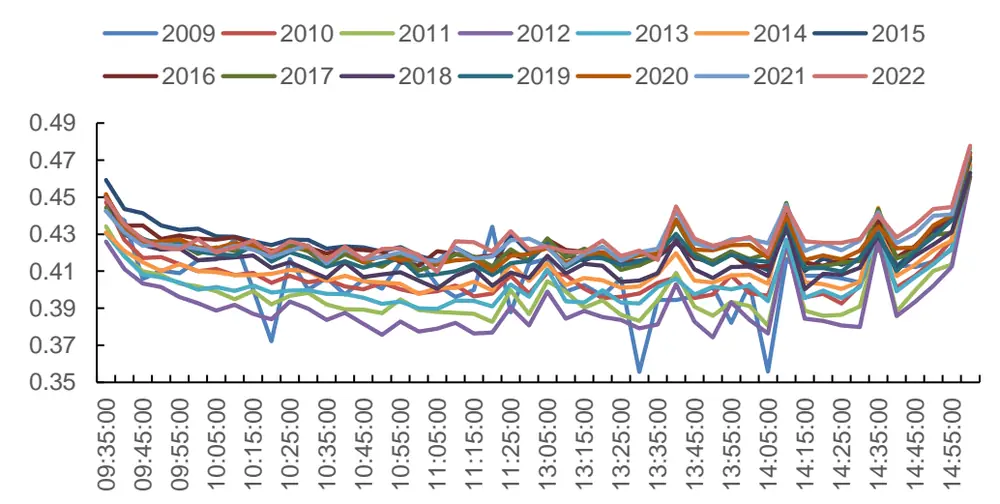
数据来源：Wind，广发证券发展研究中心

图 5：DPIN_SIZE因子日内走势图
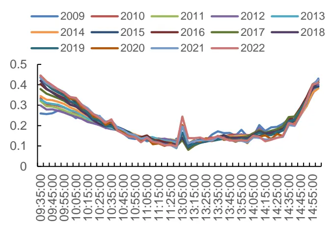
数据来源：Wind，广发证券发展研究中心

图 6：DPIN_SMALL因子日内走势图
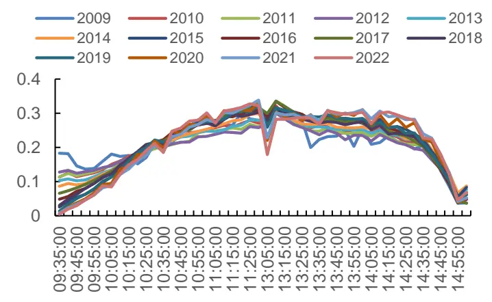
数据来源：Wind，广发证券发展研究中心

## （二）DPIN因子策略构建框架

据此，本篇专题报告将综合考虑DPIN因子值的统计特征与日内交易结构，分别对 $DPIN_{MEAN}$ $DPIN_{STD}$ $DPIN_{STABLE}$ 因子构建交易策略。

## 1. $DPIN_{MEAN}$ 类因子交易策略

本篇报告构造如下交易策略：在调仓日买进信息优势交易概率最低的股票组合，同时卖出信息优势交易概率最高的股票组合。

## 2. $DPIN_{STD}$ 类因子交易策略

个股的5分钟频率的DPIN度量反映了个股动态日内信息优势交易概率。 $DPIN_{STD}$ 类因子则反映了日内DPIN因子的分散程度。

对于 $DPIN_{STD}$ 类因子，本报告构建如下交易策略：在调仓日买进信息优势交易概率分散度最大的股票组合，同时卖出信息优势交易概率分散度最小的股票组合。

## 3. $DPIN_{STABLE}$ 类因子交易策略

$DPIN_{STABLE}$ 类因子反映了日内DPIN因子的稳定性。本报告针对 $DPIN_{STABLE}$ 类因子构建如下交易策略：在调仓日买进信息优势交易概率稳定性最低的股票组合，同时卖出信息优势交易概率稳定性最高的股票组合。

## 五、实证分析

## （一）数据说明

选股范围：全市场

股票预处理：剔除ST/ST*、涨跌停板、上市未满1年股票

因子预处理：MAD去极值、Z-Score标准化、行业市值中性化

回测区间： 2010.01.01 – 2022.03.31

分档方式：根据当期股票的因子值，从小到大分为十档

调仓周期：每周最后一个交易日以收盘价调仓

交易费用：千分之三（卖出时收取）

## （二）因子分档表现

按照统计特征分类，本小节分别对 $DPIN_{MEAN}$ $DPIN_{STD}$ $DPIN_{STABLE}$ 类因子的分档表现进行展示。

## 1. 因子分档表现 $DPIN_{MEAN^{\prime}}$ 类因子

从行为特征角度来看， $DPIN_{BASE}^{TOTAL}$ $DPIN_{SIZE}^{TOTAL}$ 因子分层效果显著， $DPIN_{SMALL}^{TOTAL}$ 因子分层效果不明显。从时间特征角度来看， $DPIN_{BASE}$ 的早盘、盘中时段均值聚合因子具有明显分层效果； $DPIN_{SIZE}、DPIN_{SMALL}$ 的盘中、尾盘时段均值聚合因子具有明显分层效果。

图 7：DPIN_BASE_MEAN_AM因子十档周度
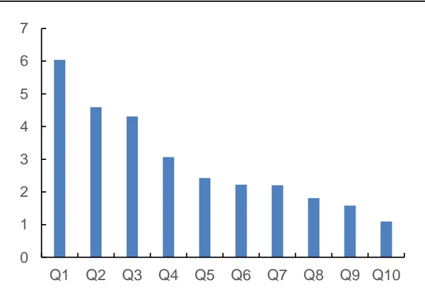
数据来源：Wind，广发证券发展研究中心

图 8：DPIN_BASE_MEAN_PM因子十档周度
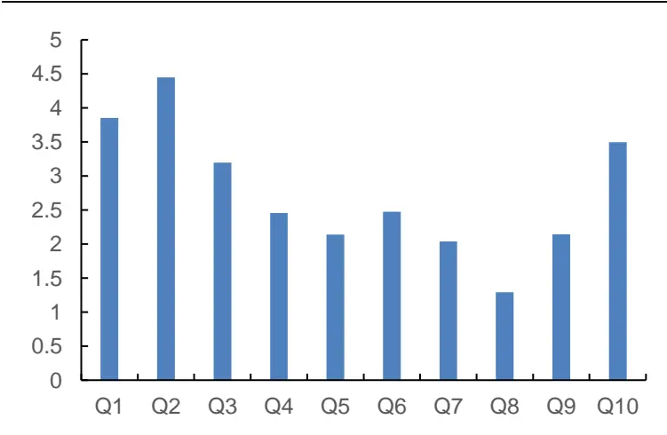
数据来源：Wind，广发证券发展研究中心

图 9：DPIN_BASE_MEAN_MIDDLE因子十档周度
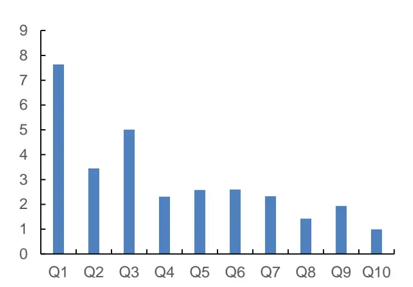
数据来源：Wind，广发证券发展研究中心

图 10：DPIN_BASE_MEAN_TOTAL因子十档周度
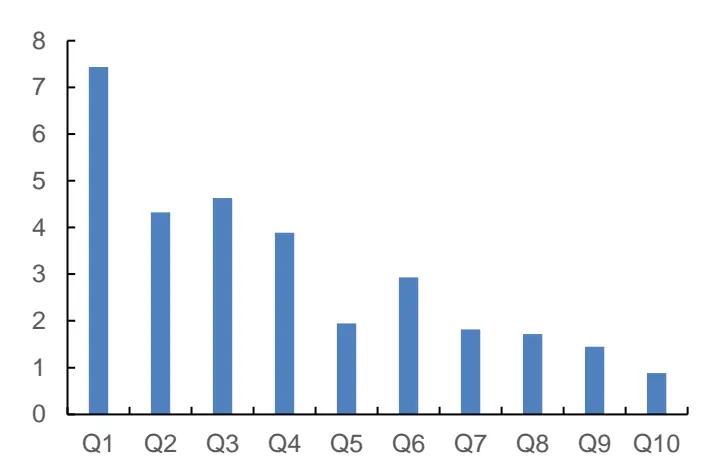
数据来源：Wind，广发证券发展研究中心

图 11：DPIN_SIZE_MEAN_AM因子十档周度
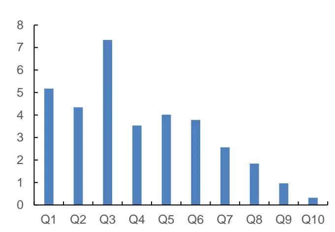
数据来源：Wind，广发证券发展研究中心

图 12：DPIN_SIZE_MEAN_PM因子十档周度
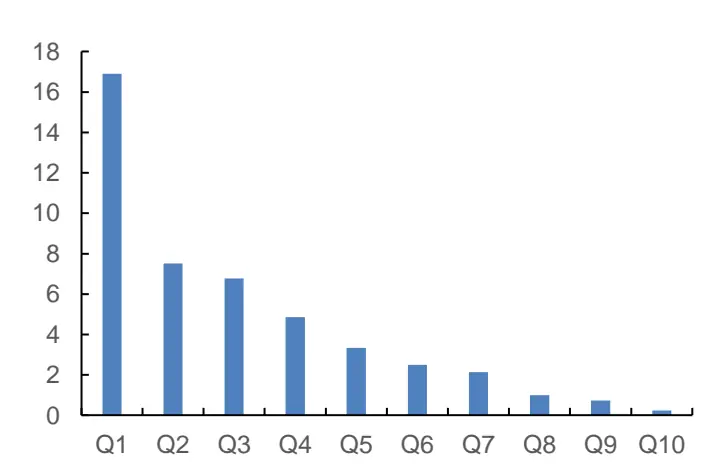
数据来源：Wind，广发证券发展研究中心

图 13：DPIN_SIZE_MEAN_MIDDLE因子十档周度
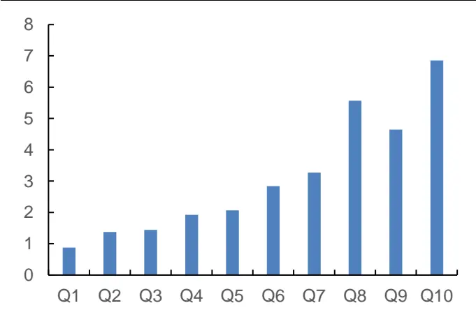
数据来源：Wind，广发证券发展研究中心

图 14：DPIN_SIZE_MEAN_TOTAL因子十档周度
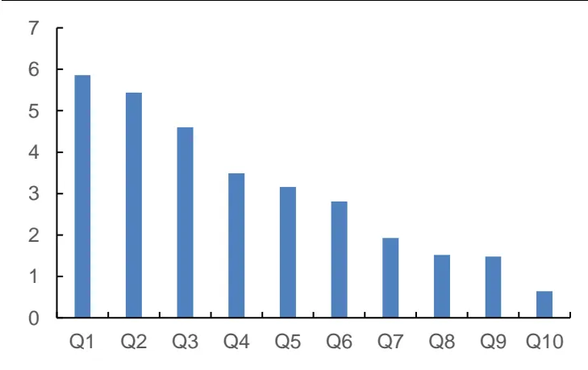
数据来源：Wind，广发证券发展研究中心

图 15：DPIN_SMALL_MEAN_AM因子十档周度
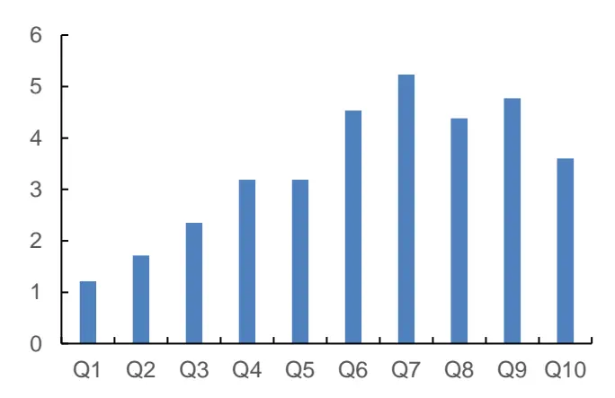
数据来源：Wind，广发证券发展研究中心

图 16：DPIN_SMALL_MEAN_PM因子十档周度
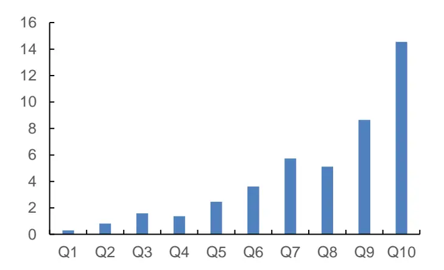
数据来源：Wind，广发证券发展研究中心

图 17：DPIN_SMALL_MEAN_MIDDLE因子十档周度
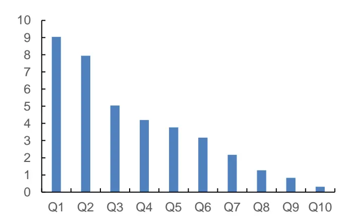
数据来源：Wind，广发证券发展研究中心

图 18：DPIN_SMALL_MEAN_TOTAL因子十档周度
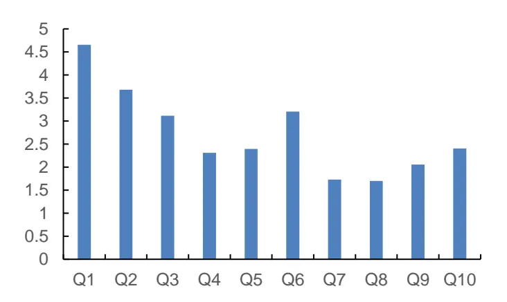
数据来源：Wind，广发证券发展研究中心

## 2. 因子分档表现-DPINSTD类因子

BASE SIZE因子均呈现显著分层效果。从时间特征角度来看， $DPIN_{BASE}$ $DPIN_{SIZE}$ $DPIN_{SMALL}$ 的分时段分散度聚合因子分层效果均显著。

图 19：DPIN_BASE_STD_AM因子十档周度
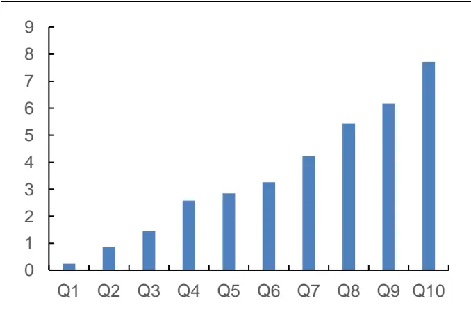
数据来源：Wind，广发证券发展研究中心

图 20：DPIN_BASE_STD_PM因子十档周度
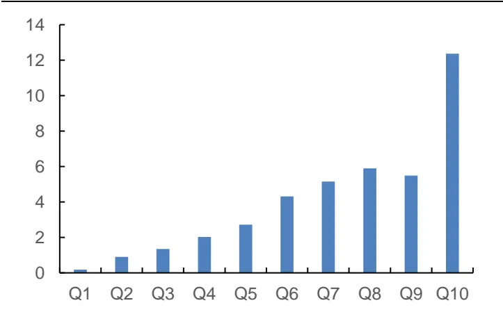
数据来源：Wind，广发证券发展研究中心

图 21：DPIN_BASE_STD_MIDDLE因子十档周度
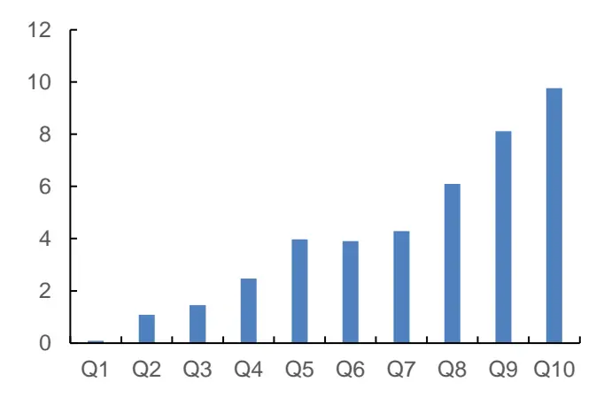
数据来源：Wind，广发证券发展研究中心

图 22：DPIN_BASE_STD_TOTAL因子十档周度
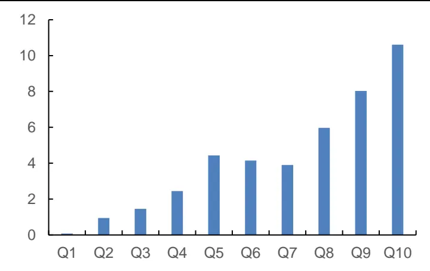
数据来源：Wind，广发证券发展研究中心

图 23：DPIN_SIZE_STD_AM因子十档周度
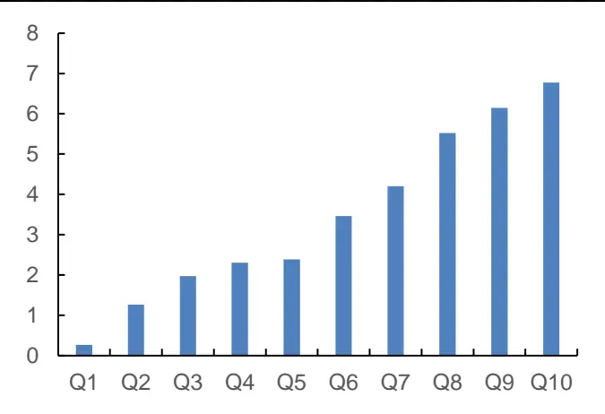
数据来源：Wind，广发证券发展研究中心

图 24：DPIN_SIZE_STD_PM因子十档周度
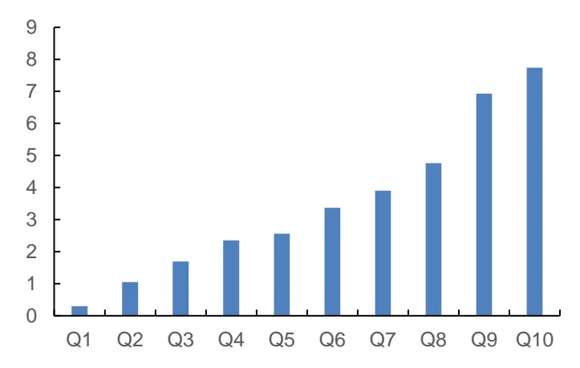
数据来源：Wind，广发证券发展研究中心

图 25：DPIN_SIZE_STD_MIDDLE因子十档周度
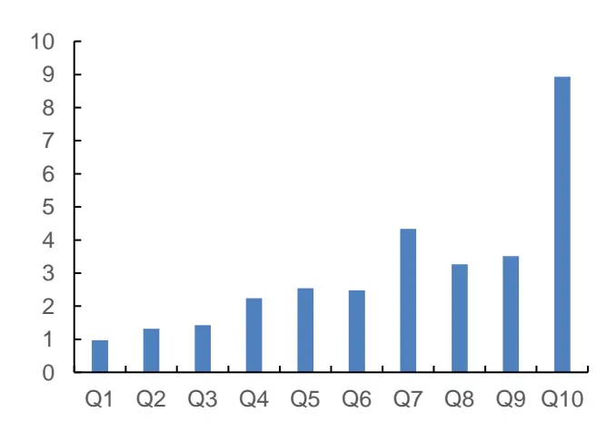
数据来源：Wind，广发证券发展研究中心

图 26：DPIN_SIZE_STD_TOTAL因子十档周度
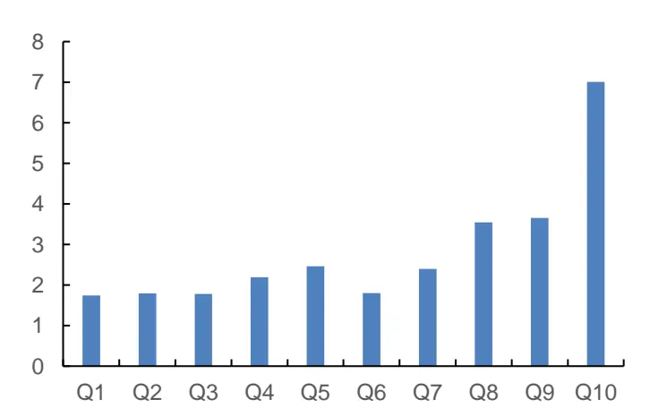
数据来源：Wind，广发证券发展研究中心

图 27：DPIN_SMALL_STD_AM因子十档周度
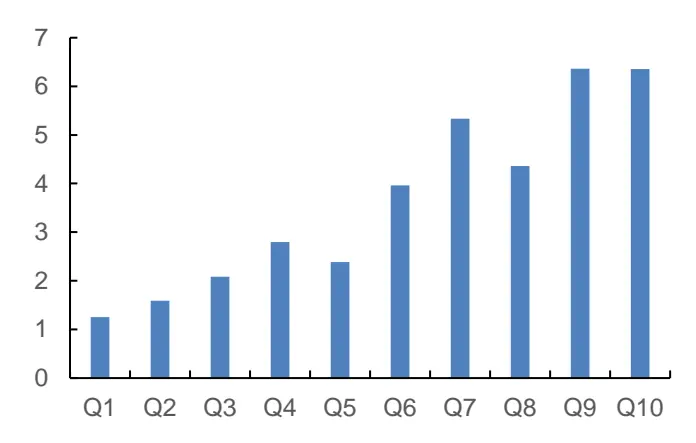
数据来源：Wind，广发证券发展研究中心

图 28：DPIN_SMALL_STD_PM因子十档周度
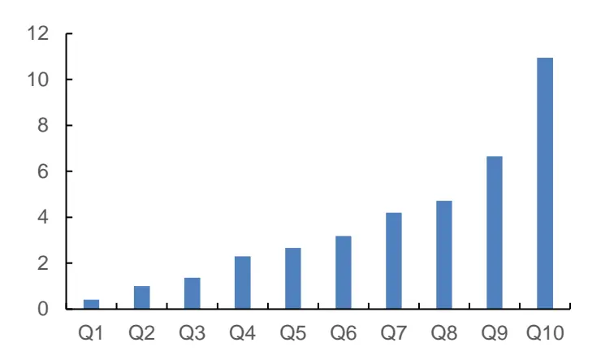
数据来源：Wind，广发证券发展研究中心

图 29：DPIN_SMALL_STD_MIDDLE因子十档周度
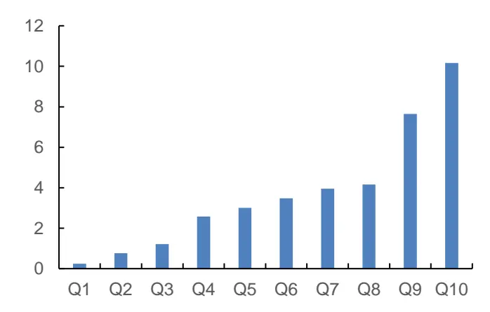
数据来源：Wind，广发证券发展研究中心

图 30：DPIN_SMALL_STD_TOTAL因子十档周度
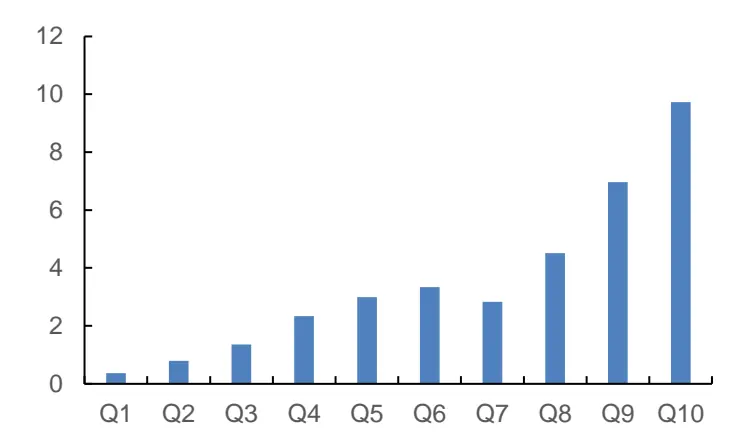
数据来源：Wind，广发证券发展研究中心

## 3. 因子分档表现-DPINSTABLE类因子

从行为特征角度来看， $DPIN_{BASE}^{TOTAL}$ $DPIN_{SIZE}^{TOTAL}$ 、DPINSMALLTOTAL因子均呈现显著分层效果。从时间特征角度来看， $DPIN_{BASE}、DPIN_{SMALL}$ 的盘中、尾盘时段均值标准差比聚合因子具有明显分层效果； $DPIN_{SIZE}$ 的尾盘时段均值标准差比聚合因子具有明显分层效果。

图 31：DPIN_BASE_STABLE_AM因子十档周度
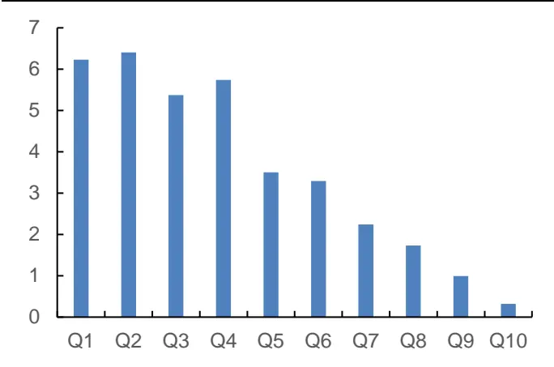
数据来源：Wind，广发证券发展研究中心

图 32：DPIN_BASE_STABLE_PM因子十档周度
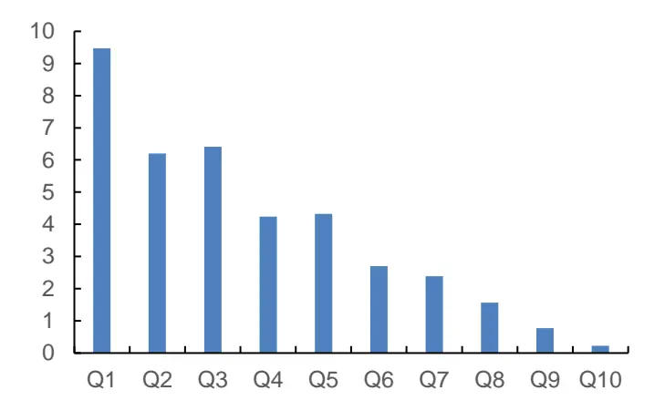
数据来源：Wind，广发证券发展研究中心

图 33：DPIN_BASE_STABLE_MIDDLE因子十档周度
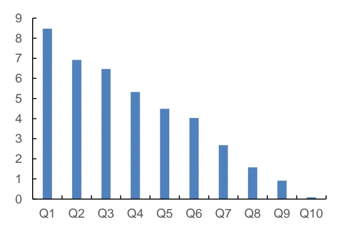
数据来源：Wind，广发证券发展研究中心

图 34：DPIN_BASE_STABLE_TOTAL因子十档周度
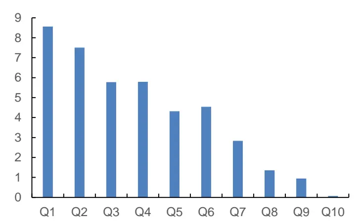
数据来源：Wind，广发证券发展研究中心

图 35：DPIN_SIZE_STABLE_AM因子十档周度
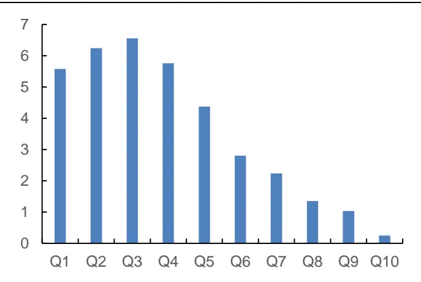
数据来源：Wind，广发证券发展研究中心

图 36：DPIN_SIZE_STABLE_PM因子十档周度
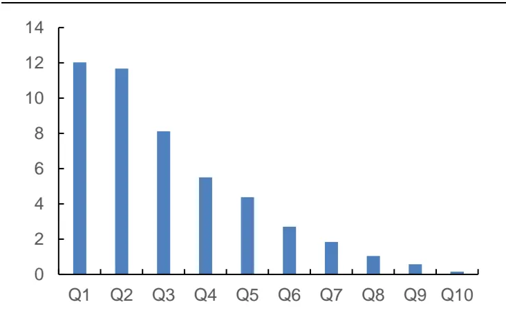
数据来源：Wind，广发证券发展研究中心

图 37：DPIN_SIZE_STABLE_MIDDLE因子十档周度
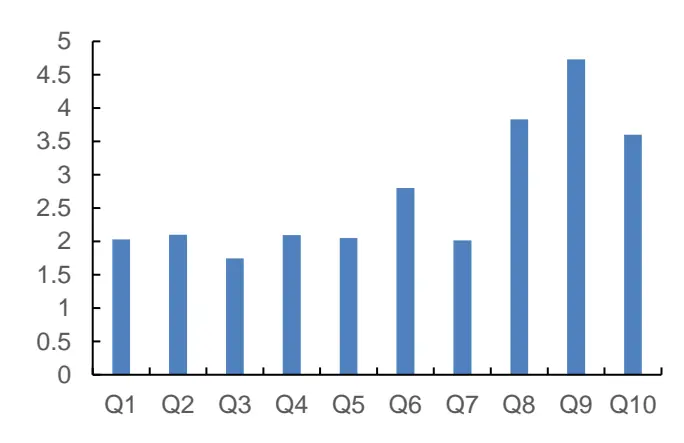
数据来源：Wind，广发证券发展研究中心

图 38：DPIN_SIZE_STABLE_TOTAL因子十档周度
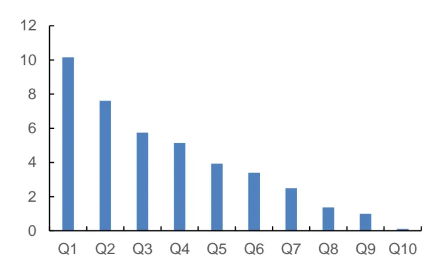
数据来源：Wind，广发证券发展研究中心

图 39：DPIN_SMALL_STABLE_AM因子十档周度
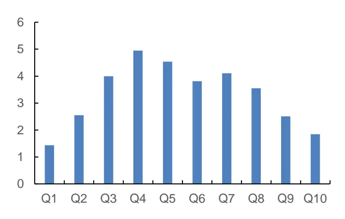
数据来源：Wind，广发证券发展研究中心

图 40：DPIN_SMALL_STABLE_PM因子十档周度
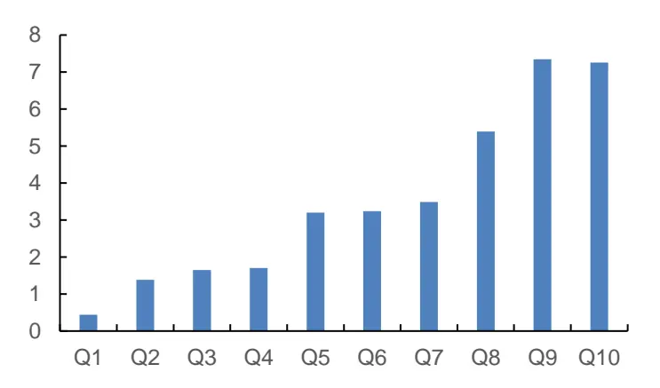
数据来源：Wind，广发证券发展研究中心

图 41：DPIN_SMALL_STABLE_MIDDLE因子十档周度
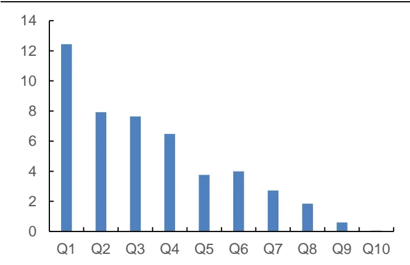
数据来源：Wind，广发证券发展研究中心

图 42：DPIN_SMALL_STABLE_TOTAL因子十档周度
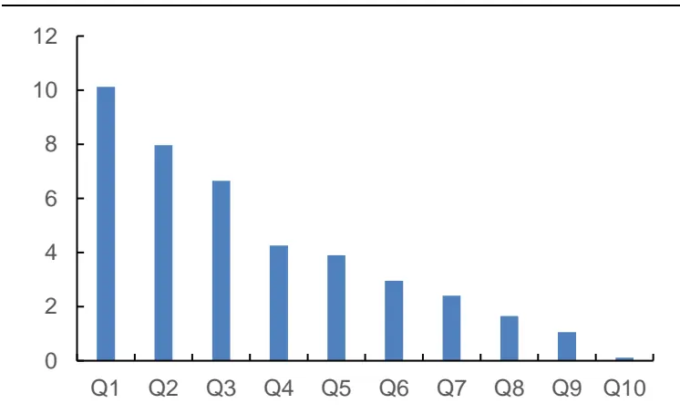
数据来源：Wind，广发证券发展研究中心

整体来看，考虑不同行为特征的DPIN因子在全市场范围内存在显著分档效果，并且按分散度、均值标准差比聚合的DPIN因子分档表现优于按均值聚合的DPIN因子。当进一步考虑时间特征，不同交易时段数据构建的DPIN因子分档效果出现分化，盘中、尾盘时段的聚合因子具有更好的分档表现。

受篇幅限制，实证结果仅对全市场范围内，十档周度换仓条件下，综合考虑行为特征、时间特征、统计特征的各类DPIN因子进行整体绩效分析，并选取三个表现相对较好的因子进行展开分析。其余参数测试结果，将在敏感性分析部分进行阐述。

## （三）DPIN因子实证结果

## 1. 实证结果 $-DPIN_{MEAN}$ 类因子

整体来看，绝大部分 $\cdot DPIN_{MEAN}$ 类因子在方向上与构建的交易策略保持一致，即因子值越小，股票未来收益表现越好。该类因子的IC表现、多空策略表现与因子分档测试结果一致，多头相对基准策略表现出现分化，各因子值的多头平均换手率在70%-85%范围内。具体来看，其中5个因子在IC分析、多空策略绩效、多头相对基准策略绩效上均有较好表现。

接下来，本小节选择DPIN_SMALL_PM_MEAN因子进行展开分析。

表 4：DPIN_MEAN 因子整体绩效表现

| 行为 特征 | 时间 特征 | IC 均值 | IC T统计量 | 正IC 占比 | 多空策略表现 |  | 多头相对基准策略 |  |  | 多头平均 换手率 |
| --- | --- | --- | --- | --- | --- | --- | --- | --- | --- | --- |
|  |  |  |  |  | 年化 信息 收益 | 最大 回撤 | 年化 收益 | 信息 | 最大 回撤 |  |
| BASE | AM | -0.024 | -11.61 | 30.0% | 14.3% | 比率 1.59 | 22.5% | 比率 14.6% 0.84 | 38.1% | 81.9% |
|  | MIDDLE | -0.023 | -10.07 | 33.0% | 16.9% | 1.96 15.4% | 16.8% | 1.05 | 39.6% | 73.7% |
|  | PM | -0.01 | -5.84 | 41.2% | 0.4% | 0.05 31.9% | 10.6% | 0.60 | 43.3% | 84.4% |
|  | TOTAL | -0.027 | -10.97 | 31.9% | 17.8% | 2.05 19.7% | 16.7% | 1.05 | 36.9% | 71.7% |
| SIZE | AM | -0.041 | -13.63 | 28.9% | 23.5% | 2.37 10.3% | 13.0% | 0.82 | 31.2% | 76.1% |
|  | MIDDLE | 0.027 | 12.85 | 70.8% | 18.1% | 2.24 23.5% | 15.8% | 0.89 | 40.6% | 78.0% |
|  | PM | -0.048 | -22.01 | 15.8% | 41.3% | 5.31 12.5% | 25.0% | 1.53 | 28.8% | 81.9% |
|  | TOTAL | -0.03 | -12.48 | 28.6% | 18.5% | 1.76 23.2% | 14.4% | 0.84 | 42.7% | 77.6% |
| SMALL | AM | 0.024 | 8.81 | 63.6% | 8.2% | 0.91 22.8% | 9.6% | 0.55 | 39.4% | 81.0% |
|  | MIDDLE | -0.043 | -15.32 | 24.6% | 30.4% | 2.79 22.1% | 18.3% | 1.04 | 36.4% | 72.1% |
|  | PM | 0.044 | 21.30 | 84.4% | 37.5% | 3.66 26.5% | 23.4% | 1.31 | 39.2% | 82.5% |
|  | TOTAL | -0.011 | -5.53 | 40.8% | 5.1% | 0.55 | 32.6% 12.3% | 0.68 | 43.1% | 74.6% |

数据来源：Wind，广发证券发展研究中心

在全市场选股中，DPIN_SMALL_PM_MEAN因子整体表现较好，2022年仍持续有效。IC值方面，因子IC均值为0.044，正IC占比84.4%。多空策略方面，策略整体年化收益率为37.5%，信息比率为3.66。多头相对中证800指数策略方面，策略整体的年化收益率为23.4%，信息比率为1.31，除2017年外，其余年份均可取得超额收益。策略的年度最大回撤发生在2015年，为39.2%，整体换手率保持在82.5%左右。对于考虑行业中性化的多头相对中证800指数策略，整体的年化收益率为19.4%，信息比率为1.65，策略的年度最大回撤发生在2015年，为18.7%，整体换手率降低至78.4%左右。

今年以来，DPIN_SMALL_PM_MEAN因子录得IC均值0.018，正IC占比66.67%，

多空对冲策略年化收益率7.3%，多头相对中证800指数策略年化收益率为22.0%，信息比率为1.80，考虑行业中性的多头相对中证800指数对冲策略年化收益率27.7%，信息比率为3.55。

图 43：DPIN_SMALL_PM_MEAN因子IC值与IC累计值走势
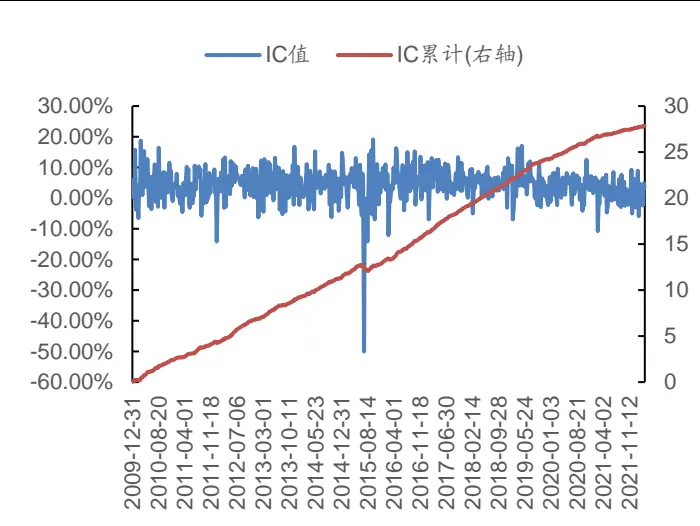
数据来源：Wind，广发证券发展研究中心

图 44：DPIN_SMALL_PM_MEAN因子多空策略净值走势
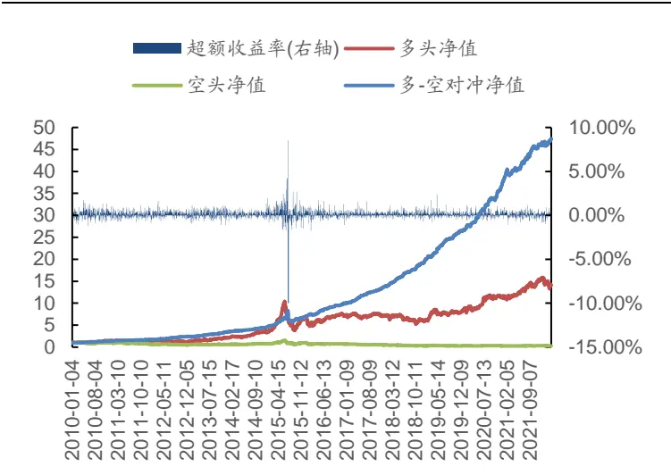
数据来源：Wind，广发证券发展研究中心

表 5：DPIN_SMALL_PM_MEAN 因子整体与分年度 IC 表现

| 范围 | IC 均值 | IC 标准差 | IC 最大值 | IC最小值 | IC T统计量 | IC累计值 | 正IC占比 |
| --- | --- | --- | --- | --- | --- | --- | --- |
| 2010 | 0.048 | 0.055 | 0.187 | -0.065 | 6.239 | 2.461 | 82.35% |
| 2011 | 0.038 | 0.043 | 0.111 | -0.057 | 6.351 | 1.945 | 80.39% |
| 2012 | 0.050 | 0.048 | 0.132 | -0.141 | 7.288 | 2.486 | 94.00% |
| 2013 | 0.045 | 0.053 | 0.168 | -0.063 | 6.096 | 2.296 | 82.35% |
| 2014 | 0.040 | 0.043 | 0.152 | -0.061 | 6.764 | 2.126 | 81.13% |
| 2015 | 0.035 | 0.098 | 0.191 | -0.500 | 2.571 | 1.825 | 75.00% |
| 2016 | 0.059 | 0.055 | 0.163 | -0.120 | 7.602 | 2.936 | 84.00% |
| 2017 | 0.060 | 0.039 | 0.133 | -0.069 | 10.762 | 3.035 | 96.08% |
| 2018 | 0.052 | 0.034 | 0.131 | -0.050 | 10.940 | 2.636 | 94.12% |
| 2019 | 0.050 | 0.047 | 0.171 | -0.070 | 7.540 | 2.536 | 84.31% |
| 2020 | 0.042 | 0.035 | 0.125 | -0.041 | 8.799 | 2.200 | 86.54% |
| 2021 | 0.022 | 0.039 | 0.093 | -0.107 | 4.145 | 1.159 | 76.92% |
| 2022 | 0.018 | 0.042 | 0.089 | -0.059 | 1.493 | 0.216 | 66.67% |
| ALL | 0.044 | 0.052 | 0.191 | -0.500 | 21.301 | 27.858 | 84.37% |

数据来源：Wind，广发证券发展研究中心

表 6：DPIN_SMALL_PM_MEAN 因子多-空对冲分年度策略表现周度调仓

|  | 累计 | 年化 | 年化 信息 | 最大 |
| --- | --- | --- | --- | --- |
| 年份 | 收益率 | 收益率 | 波动率 比率 | 回撤 |
| 2010 | 44.0% | 45.0% 9.2% | 4.89 | 4.4% |
| 2011 | 21.5% | 22.0% 5.3% | 4.14 | 1.4% |
| 2012 | 38.4% | 40.2% | 5.7% 7.05 | 1.7% |
| 2013 | 44.7% | 45.8% | 7.2% 6.39 | 1.2% |
| 2014 | 30.1% | 29.4% | 5.1% 5.82 | 1.6% |
| 2015 | 53.1% | 53.1% | 29.5% 1.80 | 26.5% |
| 2016 | 42.1% | 44.1% | 6.8% 6.53 | 2.1% |
| 2017 | 37.3% | 38.2% | 4.1% 9.40 | 1.2% |
| 2018 | 40.3% | 41.2% | 4.4% 9.36 | 0.6% |
| 2019 | 36.2% | 37.1% | 5.0% 7.44 | 1.2% |
| 2020 | 41.5% | 41.5% | 5.7% 7.29 | 1.5% |
| 2021 | 24.2% | 24.2% | 6.1% 3.97 | 3.4% |
| 2022 | 1.6% | 7.3% | 7.1% 1.03 | 2.1% |
| ALL | 4543.3% | 37.5% | 10.3% 3.66 | 26.5% |

数据来源：Wind，广发证券发展研究中心

图 45：DPIN_SMALL_PM_MEAN因子多-中证800策略净值走势
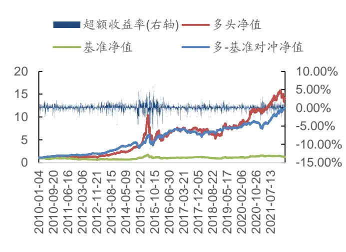
数据来源：Wind，广发证券发展研究中心

图 46：DPIN_SMALL_PM_MEAN因子多-中证800策略净值走势(行业中性)
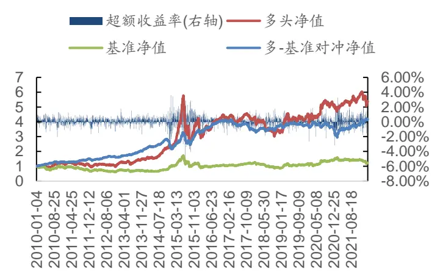
数据来源：Wind，广发证券发展研究中心

表 7：DPIN_SMALL_PM_MEAN 因子多-中证 800 对冲分年度策略表现周度调仓

| 范围 | 多头累计 收益率 | 累计 收益率 | 累计 收益率 | 年化 收益率 | 年化 收益率 | 年化 波动率 | 年化 波动率 | 信息 比率 | 信息 比率 | 最大 回撤 | 最大 回撤 |
| --- | --- | --- | --- | --- | --- | --- | --- | --- | --- | --- | --- |
| 2010 | 43.5% | 54.9% | (扣费) 36.7% | 56.3% | (扣费) 37.6% | 16.6% | (扣费) 16.6% | 3.39 | (扣费) 2.26 | 9.6% | (扣费) 10.8% |
| 2011 | -23.3% | 6.1% | -6.7% | 6.2% | -6.9% | 9.4% | 9.4% | 0.66 | -0.73 | 4.7% | 7.9% |
| 2012 | 21.5% | 17.1% | 3.2% | 17.9% | 3.4% | 11.7% | 11.7% | 1.52 | 0.29 | 6.3% | 9.4% |
| 2013 | 61.3% | 65.4% | 45.6% | 67.0% | 46.7% | 15.6% | 15.6% | 4.30 | 3.00 | 5.3% | 5.8% |
| 2014 | 56.2% | 5.4% | -7.9% | 5.3% | -7.8% | 18.7% | 18.7% | 0.28 | -0.41 | 25.2% | 27.3% |
| 2015 | 111.6% | 87.1% | 64.3% | 87.1% | 64.3% | 41.3% | 41.4% | 2.11 | 1.55 | 39.2% | 40.7% |
| 2016 | 4.6% | 22.6% | 8.4% | 23.6% | 8.8% | 16.5% | 16.5% | 1.43 | 0.53 | 9.9% | 10.4% |
| 2017 | -1.5% | -14.4% | -24.3% | -14.7% | -24.7% | 12.1% | 12.1% | -1.22 | -2.05 | 17.3% | 25.2% |
| 2018 | -17.7% | 13.6% | 0.4% | 13.9% | 0.5% | 14.3% | 14.3% | 0.97 | 0.03 | 8.9% | 10.6% |
| 2019 | 42.1% | 8.5% | -4.1% | 8.7% | -4.2% | 9.2% | 9.2% | 0.94 | -0.45 | 5.1% | 9.6% |
| 2020 | 36.9% | 8.7% | -4.4% | 8.7% | -4.4% | 8.5% | 8.5% | 1.02 | -0.52 | 7.8% | 12.4% |
| 2021 | 37.8% | 36.7% | 20.5% | 36.7% | 20.5% | 15.1% | 15.1% | 2.44 | 1.36 | 6.4% | 7.1% |
| 2022 | -10.2% | 4.7% | 1.7% | 22.0% | 7.6% | 12.3% | 12.3% | 1.80 | 0.62 | 4.5% | 5.2% |
| ALL | 1354.5% | 1161.0% | 168.8% | 23.4% | 8.6% | 17.9% | 17.9% | 1.31 | 0.48 | 39.2% | 40.9% |

数据来源：Wind，广发证券发展研究中心

表 8：DPIN_SMALL_PM_MEAN 因子多-中证 800 对冲分年度策略表现 周度调仓(行业中性)

| 范围 | 多头累计 收益率 | 累计 收益率 | 累计 收益率 (扣费) | 年化 收益率 | 年化 收益率 (扣费) | 年化 波动率 | 年化 波动率 (扣费) | 信息 比率 | 信息 比率 (扣费) | 最大 回撤 | 最大 回撤 |
| --- | --- | --- | --- | --- | --- | --- | --- | --- | --- | --- | --- |
| 2010 | 15.9% | 25.2% | 12.0% | 25.8% | 12.3% | 9.3% | 9.4% | 2.76 | 1.31 | 7.9% | (扣费) 9.3% |
| 2011 | -22.5% | 7.2% | -5.0% | 7.3% | -5.1% | 5.9% | 5.9% | 1.23 | -0.87 | 2.8% | 6.6% |
| 2012 | 18.4% | 14.0% | 1.2% | 14.6% | 1.2% | 8.2% | 8.2% | 1.78 | 0.15 | 5.7% | 9.2% |
| 2013 | 31.5% | 35.4% | 20.9% | 36.3% | 21.4% | 8.6% | 8.6% | 4.20 | 2.48 | 2.7% | 3.4% |
| 2014 | 73.4% | 18.0% | 4.0% | 17.6% | 4.0% | 12.3% | 12.3% | 1.43 | 0.32 | 15.5% | 17.2% |
| 2015 | 107.8% | 86.5% | 65.3% | 86.5% | 65.3% | 23.7% | 23.8% | 3.64 | 2.75 | 18.7% | 21.0% |
| 2016 | 1.0% | 18.0% | 5.2% | 18.8% | 5.4% | 12.2% | 12.2% | 1.54 | 0.45 | 7.0% | 7.5% |
| 2017 | 0.1% | -13.1% | -22.7% | -13.3% | -23.1% | 8.4% | 8.4% | -1.58 | -2.75 | 14.6% | 23.7% |
| 2018 | -16.8% | 14.9% | 1.7% | 15.2% | 1.8% | 12.0% | 12.0% | 1.27 | 0.15 | 5.8% | 8.6% |
| 2019 | 45.0% | 10.8% | -2.0% | 11.0% | -2.1% | 7.7% | 7.6% | 1.44 | -0.27 | 4.9% | 7.8% |
| 2020 | 35.9% | 7.9% | -5.0% | 7.9% | -5.0% | 7.6% | 7.6% | 1.05 | -0.66 | 6.5% | 10.4% |
| 2021 | 25.1% | 24.4% | 9.7% | 24.4% | 9.7% | 12.5% | 12.5% | 1.94 | 0.78 | 6.0% | 7.0% |
| 2022 | -9.3% | 5.8% | 2.8% | 27.7% | 12.5% | 7.8% | 7.8% | 3.55 | 1.61 | 2.4% | 3.1% |
| ALL | 847.1% | 744.9% | 94.3% | 19.4% | 5.7% | 11.7% | 11.7% | 1.65 | 0.48 | 19.6% | 37.9% |

数据来源：Wind，广发证券发展研究中心

表 9：DPIN_SMALL_PM_MEAN 因子分年度换手率

| 范围 | 非行业中性 |  |  |  |  | 行业中性 |  |  |  |
| --- | --- | --- | --- | --- | --- | --- | --- | --- | --- |
|  | 均值 | 最大值 | 最小值 | 标准差 | 累计值 | 均值 最大值 | 最小值 | 标准差 | 累计值 |
| 2010 | 84.0% | 93.4% | 72.6% | 0.04 | 4198.1% | 74.3% 92.1% | 56.4% | 0.09 | 3715.8% |
| 2011 | 84.0% | 92.1% | 72.2% | 0.04 | 4284.0% | 78.9% 92.9% | 60.1% | 0.08 | 4024.4% |
| 2012 | 84.3% | 93.5% | 77.6% | 0.03 | 4215.6% | 79.6% 94.5% | 64.8% | 0.08 | 3979.0% |
| 2013 | 83.7% | 92.1% | 72.1% | 0.04 | 4270.2% | 74.6% 92.2% | 63.0% | 0.08 | 3803.6% |
| 2014 | 84.5% | 90.8% | 78.0% | 0.03 | 4480.1% | 79.2% 92.3% | 67.2% | 0.08 | 4199.1% |
| 2015 | 84.1% | 100.0% | 75.8% | 0.05 | 4375.2% | 78.3% 95.8% | 54.9% | 0.09 | 4068.9% |
| 2016 | 81.9% | 87.4% | 75.0% | 0.03 | 4092.5% | 76.4% 91.6% | 57.8% | 0.09 | 3818.4% |
| 2017 | 79.4% | 90.9% | 72.7% | 0.04 | 4048.0% | 76.7% 87.2% | 59.9% | 0.07 | 3910.0% |
| 2018 | 80.8% | 87.9% | 74.4% | 0.03 | 4119.7% | 79.8% 88.9% | 65.8% | 0.05 | 4068.9% |
| 2019 | 80.7% | 92.1% | 75.8% | 0.03 | 4113.3% | 80.7% 90.6% | 72.5% | 0.04 | 4113.1% |
| 2020 | 82.2% | 88.5% | 78.0% | 0.02 | 4271.9% | 81.5% 89.2% | 72.1% | 0.04 | 4236.5% |
| 2021 | 80.9% | 88.4% | 76.0% | 0.03 | 4207.6% | 80.3% 88.4% | 74.6% | 0.03 | 4174.9% |
| 2022 | 80.9% | 83.5% | 77.1% | 0.02 | 971.1% | 81.3% 84.9% | 78.9% | 0.02 | 975.5% |
| ALL | 82.5% | 100.0% | 72.1% | 0.04 | 51647.3% | 78.4% 95.8% | 54.9% | 0.07 | 49088.1% |

数据来源：Wind，广发证券发展研究中心

## 2. 实证结果-DPIN_STD因子

整体来看，所有DPIN 类因子在方向上与构建的交易策略保持一致，即因子值越大，股票未来收益表现越好。该类因子的IC表现、多空对冲策略表现与因子分档测试结果一致，多头相对基准策略的扣费前信息比率基本在1.0以上，各因子值的多头平均换手率在40%-82%范围内。

接下来，本小节选择DPIN_BASE_MIDDLE_STD因子进行展开分析。

表 10：DPIN_STD 因子整体绩效表现

| 行为 特征 | 时间 特征 | IC 均值 | IC T统计量 | 正IC 占比 | 多空策略表现 |  |  | 多头相对基准策略 |  |  | 多头平均 |
| --- | --- | --- | --- | --- | --- | --- | --- | --- | --- | --- | --- |
|  |  |  |  |  | 年化 信息 | 最大 | 年化 | 信息 | 最大 | 换手率 |  |
|  |  |  |  |  | 收益 | 比率 | 回撤 | 收益 | 比率 | 回撤 |  |
| BASE | AM | 0.05 | 13.52 | 70.8% |  | 30.1% 2.71 | 10.8% | 16.7% | 0.97 | 41.7% | 60.6% |
|  | MIDDLE | 0.061 | 13.82 | 72.4% | 44.3% | 3.16 | 16.3% | 18.8% | 1.08 | 41.5% | 43.7% |
|  | PM | 0.055 | 15.24 | 73.1% | 38.6% | 3.37 | 8.7% | 21.4% | 1.37 | 28.8% | 64.6% |
|  | TOTAL | 0.062 | 13.94 | 72.1% | 45.1% | 3.14 | 15.8% | 19.6% | 1.13 | 40.9% | 41.1% |
| SIZE | AM | 0.048 | 15.72 | 74.8% | 28.3% | 2.92 | 7.3% | 15.6% | 1.01 | 32.4% | 76.1% |
|  | MIDDLE | 0.033 | 11.82 | 68.6% | 18.8% | 2.46 | 11.3% | 18.3% | 1.13 | 33.8% | 69.2% |
|  | PM | 0.039 | 17.76 | 76.9% | 29.5% | 3.77 | 4.9% | 17.1% | 1.09 | 32.1% | 81.3% |
|  | TOTAL | 0.027 | 9.38 | 64.6% | 10.9% | 1.40 | 14.4% | 16.0% | 0.99 | 35.5% | 66.0% |
| SMALL | AM | 0.032 | 12.42 | 70.0% | 13.2% | 1.56 | 25.1% | 15.1% | 0.95 | 33.1% | 80.8% |
|  | MIDDLE | 0.05 | 14.07 | 72.3% | 33.5% | 3.05 | 7.9% | 19.4% | 1.10 | 42.8% | 62.2% |
|  | PM | 0.038 | 19.34 | 80.5% | 30.4% | 3.70 | 20.2% | 20.5% | 1.15 | 42.4% | 85.2% |
|  | TOTAL | 0.047 | 13.52 | 71.8% | 28.8% | 2.72 | 10.6% | 18.9% | 1.07 | 41.4% | 62.4% |

数据来源：Wind，广发证券发展研究中心

在全市场选股中，DPIN_BASE_MIDDLE_STD因子整体表现较好，2022年因子有效性延续。IC值方面，因子IC均值为0.061，正IC占比72.4%。多空对冲策略方面，策略整体年化收益率为44.3%，信息比率为3.16。多头相对中证800指数策略方面，策略整体的年化收益率为18.8%，信息比率为1.08，除2017年、2020年，其余年份均可取得超额收益。策略的年度最大回撤发生在2015年，为41.5%，整体换手率保持在43.7%左右。对于考虑行业中性化的多头相对中证800指数策略，整体的年化收益率为13.4%，信息比率为1.13，策略的年度最大回撤发生在2015年，为23.7%，整体换手率降低至43.0%左右。

今年以来，DPIN_BASE_MIDDLE_STD因子录得IC均值0.056，正IC占比66.67%，多空策略年化收益率12.5%，多头相对中证800指数策略年化收益率为31.9%，信息比率为2.95，考虑行业中性的多头相对中证800指数对冲策略年化收益率26.2%，信息比率为2.70。

图 47：DPIN_BASE_MIDDLE_STD因子IC值与IC累计值走势
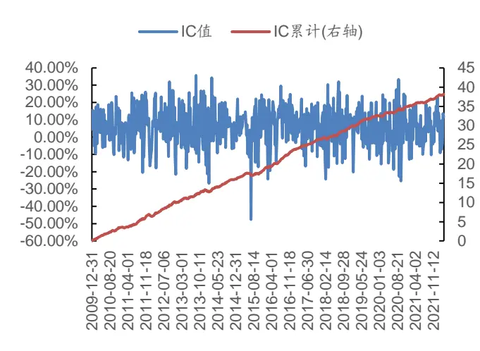
数据来源：Wind，广发证券发展研究中心

图 48：DPIN_BASE_MIDDLE_STD多空策略净值走势
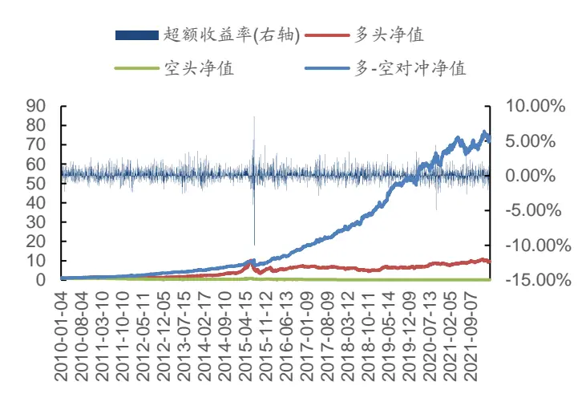
数据来源：Wind，广发证券发展研究中心

表 11：DPIN_BASE_MIDDLE_STD 因子整体与分年度 IC 表现

| 范围 | IC 均值 | IC 标准差 | IC最大值 | IC最小值 | IC T统计量 | IC 累计值 | 正IC占比 |
| --- | --- | --- | --- | --- | --- | --- | --- |
| 2010 | 0.069 | 0.086 | 0.236 | -0.102 | 5.739 | 3.516 | 80.39% |
| 2011 | 0.066 | 0.112 | 0.261 | -0.205 | 4.251 | 3.386 | 72.55% |
| 2012 | 0.063 | 0.123 | 0.32 | -0.215 | 3.617 | 3.155 | 70.00% |
| 2013 | 0.063 | 0.123 | 0.357 | -0.181 | 3.672 | 3.214 | 66.67% |
| 2014 | 0.053 | 0.109 | 0.343 | -0.267 | 3.57 | 2.827 | 75.47% |
| 2015 | 0.051 | 0.122 | 0.245 | -0.476 | 3.018 | 2.646 | 76.92% |
| 2016 | 0.097 | 0.11 | 0.295 | -0.243 | 6.273 | 4.868 | 80.00% |
| 2017 | 0.057 | 0.086 | 0.221 | -0.167 | 4.727 | 2.901 | 74.51% |
| 2018 | 0.059 | 0.131 | 0.32 | -0.242 | 3.218 | 3.011 | 66.67% |
| 2019 | 0.06 | 0.094 | 0.236 | -0.201 | 4.549 | 3.062 | 74.51% |
| 2020 | 0.045 | 0.134 | 0.333 | -0.254 | 2.445 | 2.359 | 63.46% |
| 2021 | 0.048 | 0.083 | 0.189 | -0.128 | 4.162 | 2.505 | 69.23% |
| 2022 | 0.056 | 0.1 | 0.233 | -0.09 | 1.934 | 0.67 | 66.67% |
| ALL | 0.061 | 0.11 | 0.357 | -0.476 | 13.818 | 38.12 | 72.41% |

数据来源：Wind，广发证券发展研究中心

表 12：DPIN_BASE_MIDDLE_STD 因子多-空分年度策略表现周度调仓

|  | 累计 | 年化 | 年化 | 信息 | 最大 |
| --- | --- | --- | --- | --- | --- |
| 年份 | 收益率 | 收益率 | 波动率 | 比率 | 回撤 |
| 2010 | 61.4% | 62.9% | 12.9% | 4.87 | 3.9% |
| 2011 | 51.0% | 52.2% | 13.6% | 3.84 | 4.2% |
| 2012 | 52.2% | 54.8% | 11.8% | 4.66 | 6.0% |
| 2013 | 44.1% | 45.2% | 14.2% | 3.19 | 2.9% |
| 2014 | 40.1% | 39.2% | 11.8% | 3.33 | 5.7% |
| 2015 | 53.3% | 53.3% | 22.9% | 2.33 | 16.3% |
| 2016 | 73.7% | 77.6% | 13.6% | 5.72 | 4.9% |
| 2017 | 45.3% | 46.3% | 10.6% | 4.38 | 3.0% |
| 2018 | 44.6% | 45.6% | 14.5% | 3.15 | 6.2% |
| 2019 | 39.9% | 40.8% | 11.1% | 3.69 | 5.1% |
| 2020 | 26.2% | 26.2% | 16.1% | 1.63 | 6.7% |
| 2021 | 9.8% | 9.8% | 11.5% | 0.86 | 11.4% |
| 2022 | 2.8% | 12.5% | 12.4% | 1.01 | 6.1% |
| ALL | 8241.6% | 44.3% | 14.0% | 3.16 | 16.3% |

数据来源：Wind，广发证券发展研究中心

图 49：DPIN_BASE_MIDDLE_STD因子多-中证800策略净值走势
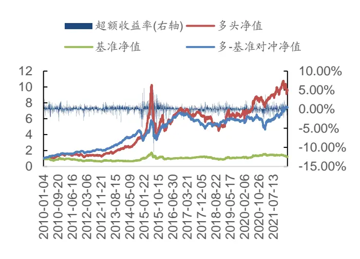
数据来源：Wind，广发证券发展研究中心

图 50：DPIN_BASE_MIDDLE_STD因子多-中证800策略净值走势(行业中性)
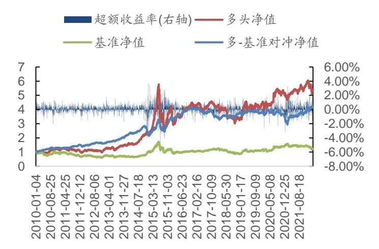
数据来源：Wind，广发证券发展研究中心

表 13：DPIN_BASE_MIDDLE_STD 因子多-中证 800 分年度策略表现周度调仓

| 范围 | 多头累计 收益率 | 累计 收益率 | 累计 收益率 (扣费) | 年化 收益率 | 年化 收益率 (扣费) | 年化 波动率 | 年化 波动率 (扣费) | 信息 比率 | 信息 比率 (扣费) | 最大 回撤 | 最大 回撤 (扣费) |
| --- | --- | --- | --- | --- | --- | --- | --- | --- | --- | --- | --- |
| 2010 | 54.2% | 64.9% | 55.1% | 66.5% | 56.4% | 17.7% | 17.7% | 3.76 | 3.18 | 11.3% | 11.8% |
| 2011 | -16.9% | 14.4% | 7.7% | 14.7% | 7.9% | 9.9% | 9.9% | 1.48 | 0.80 | 5.0% | 5.8% |
| 2012 | 12.1% | 7.3% | 0.7% | 7.6% | 0.8% | 12.9% | 12.9% | 0.59 | 0.06 | 7.7% | 8.1% |
| 2013 | 57.4% | 60.9% | 50.5% | 62.5% | 51.7% | 12.2% | 12.2% | 5.12 | 4.24 | 4.1% | 4.2% |
| 2014 | 57.1% | 5.7% | -1.7% | 5.6% | -1.7% | 17.0% | 17.0% | 0.33 | -0.10 | 24.5% | 25.4% |
| 2015 | 83.7% | 62.0% | 49.5% | 62.0% | 49.5% | 39.4% | 39.5% | 1.57 | 1.25 | 41.5% | 43.1% |
| 2016 | 9.3% | 27.7% | 18.7% | 29.0% | 19.6% | 12.8% | 12.8% | 2.26 | 1.52 | 6.4% | 6.7% |
| 2017 | -9.6% | -21.5% | -27.3% | -21.9% | -27.8% | 10.2% | 10.2% | -2.15 | -2.72 | 21.8% | 27.3% |
| 2018 | -21.3% | 7.6% | 0.7% | 7.7% | 0.7% | 13.5% | 13.5% | 0.57 | 0.05 | 8.2% | 10.0% |
| 2019 | 34.6% | 2.4% | -4.4% | 2.4% | -4.5% | 9.4% | 9.4% | 0.26 | -0.48 | 7.9% | 10.8% |
| 2020 | 21.7% | -4.2% | -9.8% | -4.2% | -9.8% | 12.2% | 12.2% | -0.34 | -0.81 | 12.6% | 16.5% |
| 2021 | 28.3% | 26.7% | 19.5% | 26.7% | 19.5% | 17.8% | 17.8% | 1.50 | 1.09 | 9.1% | 9.6% |
| 2022 | -8.6% | 6.6% | 5.3% | 31.9% | 24.9% | 10.8% | 10.8% | 2.95 | 2.31 | 2.7% | 3.0% |
| ALL | 875.8% | 696.1% | 250.9% | 18.8% | 11.0% | 17.4% | 17.4% | 1.08 | 0.63 | 41.5% | 48.2% |

数据来源：Wind，广发证券发展研究中心

表 14：DPIN_BASE_MIDDLE_STD 因子多-中证 800 分年度策略表现周度调仓(行业中性)

| 范围 | 多头累计 收益率 | 累计 收益率 | 累计 收益率 (扣费) | 年化 收益率 | 年化 收益率 (扣费) | 年化 波动率 | 年化 波动率 (扣费) | 信息 比率 | 信息 比率 (扣费) | 最大 回撤 | 最大 回撤 |
| --- | --- | --- | --- | --- | --- | --- | --- | --- | --- | --- | --- |
| 2010 | 21.3% | 30.3% | 22.4% | 31.0% | 22.9% | 10.1% | 10.1% | 3.07 | 2.26 | 7.8% | (扣费) 8.3% |
| 2011 | -17.4% | 13.7% | 7.0% | 14.0% | 7.2% | 6.2% | 6.2% | 2.26 | 1.16 | 2.3% | 3.9% |
| 2012 | 13.7% | 8.9% | 2.0% | 9.3% | 2.0% | 9.5% | 9.5% | 0.98 | 0.21 | 4.6% | 6.4% |
| 2013 | 30.6% | 34.2% | 25.9% | 35.0% | 26.4% | 7.9% | 7.9% | 4.43 | 3.34 | 2.9% | 3.1% |
| 2014 | 53.6% | 3.6% | -3.7% | 3.5% | -3.6% | 14.9% | 14.9% | 0.23 | -0.24 | 21.6% | 22.5% |
| 2015 | 85.7% | 65.4% | 53.7% | 65.4% | 53.7% | 21.8% | 21.9% | 3.00 | 2.45 | 23.7% | 25.2% |
| 2016 | 2.3% | 19.3% | 11.8% | 20.1% | 12.3% | 9.3% | 9.3% | 2.16 | 1.31 | 4.0% | 4.2% |
| 2017 | -1.7% | -14.8% | -20.9% | -15.1% | -21.3% | 8.2% | 8.3% | -1.83 | -2.58 | 15.7% | 21.3% |
| 2018 | -21.5% | 7.3% | 0.5% | 7.5% | 0.5% | 10.4% | 10.4% | 0.72 | 0.05 | 6.5% | 7.4% |
| 2019 | 33.4% | 1.5% | -5.2% | 1.5% | -5.3% | 7.4% | 7.4% | 0.20 | -0.72 | 6.0% | 9.0% |
| 2020 | 15.5% | -9.0% | -14.3% | -9.0% | -14.3% | 9.9% | 9.8% | -0.91 | -1.45 | 13.6% | 17.5% |
| 2021 | 16.6% | 15.3% | 8.6% | 15.3% | 8.6% | 15.1% | 15.1% | 1.01 | 0.57 | 9.1% | 9.6% |
| 2022 | -9.6% | 5.5% | 4.1% | 26.2% | 18.9% | 9.7% | 9.7% | 2.70 | 1.95 | 2.6% | 2.8% |
| ALL | 444.3% | 354.3% | 102.9% | 13.4% | 6.0% | 11.8% | 11.8% | 1.13 | 0.51 | 28.1% | 45.6% |

数据来源：Wind，广发证券发展研究中心

表 15：DPIN_BASE_MIDDLE_STD 因子分年度换手率

| 范围 | 非行业中性 |  |  |  |  | 行业中性 |  |  |  |
| --- | --- | --- | --- | --- | --- | --- | --- | --- | --- |
|  | 均值 | 最大值 | 最小值 | 标准差 | 累计值 | 均值 最大值 | 最小值 | 标准差 | 累计值 |
| 2010 | 41.3% | 60.9% | 26.6% | 0.07 | 2064.2% | 42.0% 65.3% | 24.0% | 0.11 | 2101.5% |
| 2011 | 39.1% | 50.6% | 29.1% | 0.05 | 1994.6% | 39.6% 59.8% | 26.3% | 0.08 | 2020.5% |
| 2012 | 42.1% | 50.0% | 33.3% | 0.04 | 2104.7% | 43.9% 66.7% | 30.1% | 0.09 | 2193.6% |
| 2013 | 44.2% | 55.0% | 33.3% | 0.04 | 2253.7% | 42.1% 61.2% | 28.9% | 0.09 | 2147.5% |
| 2014 | 45.7% | 57.4% | 34.3% | 0.05 | 2419.3% | 45.5% 61.8% | 30.2% | 0.09 | 2411.1% |
| 2015 | 51.0% | 100.0% | 35.7% | 0.14 | 2651.7% | 47.1% 79.5% | 30.6% | 0.11 | 2451.3% |
| 2016 | 48.8% | 60.7% | 39.3% | 0.06 | 2437.3% | 43.6% 61.6% | 28.0% | 0.08 | 2180.5% |
| 2017 | 49.8% | 66.9% | 38.3% | 0.06 | 2539.6% | 48.4% 69.0% | 36.8% | 0.06 | 2465.6% |
| 2018 | 43.1% | 52.5% | 37.5% | 0.03 | 2199.5% | 42.9% 51.8% | 33.4% | 0.05 | 2187.1% |
| 2019 | 44.7% | 54.8% | 36.7% | 0.05 | 2277.0% | 44.5% 57.7% | 31.1% | 0.05 | 2269.0% |
| 2020 | 39.0% | 48.1% | 30.2% | 0.04 | 2029.3% | 38.4% 48.6% | 27.7% | 0.05 | 1997.2% |
| 2021 | 37.6% | 44.7% | 31.1% | 0.04 | 1953.1% | 38.7% 48.9% | 28.6% | 0.05 | 2010.8% |
| 2022 | 34.8% | 41.1% | 29.4% | 0.04 | 418.1% | 38.7% 46.4% | 33.2% | 0.04 | 464.2% |
| ALL | 43.7% | 100.0% | 26.6% | 0.08 | 27342.1% | 43.0% 79.5% | 24.0% | 0.08 | 26899.8% |

数据来源：Wind，广发证券发展研究中心

## 3. 实证结果-DPIN_STABLE因子

整体来看，绝大部分DPIN 类因子在方向上与构建的交易策略保持一致，即因子值越小，股票未来收益表现越好。该类因子的IC表现、多空策略表现与因子分档测试结果一致，多头相对基准策略表现出现分化，各因子值的多头平均换手率在40%-90%范围内。具体来看，整体交易时段，以及部分分时段数据聚合的DPIN因子在IC分析、多空策略绩效、多头相对基准策略绩效上均有较好表现。

接下来，本小节选择DPIN_SMALL_TOTAL_STABLE因子进行展开分析。

表 16：DPIN_STABLE 因子整体绩效表现

| 行为 特征 | 时间 特征 | IC 均值 | IC T统计量 | 正IC 占比 | 多空策略 |  | 多头相对基准策略 |  |  | 多头平均 换手率 |
| --- | --- | --- | --- | --- | --- | --- | --- | --- | --- | --- |
|  |  |  |  |  | 年化 信息 | 最大 | 年化 | 信息 | 最大 |  |
| BASE | AM | -0.049 | -13.56 | 27.9% | 收益 25.0% | 比率 1.98 | 回撤 30.2% | 收益 比率 14.7% 0.89 | 回撤 42.7% | 61.6% |
|  | MIDDLE | -0.06 | -13.76 | 26.8% | 42.0% | 2.75 21.9% | 17.4% | 1.04 | 38.6% | 42.0% |
|  | PM | -0.052 | -14.82 | 26.8% | 33.1% | 2.95 | 13.0% 18.8% | 1.27 | 28.7% | 66.4% |
|  | TOTAL | -0.061 | -13.82 | 26.8% | 43.4% | 2.80 23.0% | 17.5% | 1.04 | 37.9% | 39.9% |
| SIZE | AM | -0.052 | -15.00 | 26.5% | 26.7% | 2.59 9.9% | 13.9% | 0.94 | 26.8% | 68.6% |
|  | MIDDLE | 0.001 | 0.35 | 50.4% | 5.2% | 0.55 | 17.3% 10.1% | 0.54 | 43.2% | 79.3% |
|  | PM | -0.056 | -22.75 | 16.1% | 41.3% | 3.91 | 22.9% | 21.4% 1.26 | 38.7% | 79.9% |
|  | TOTAL | -0.061 | -14.42 | 27.1% | 40.9% | 2.75 | 24.9% 19.3% | 1.11 | 39.5% | 50.4% |
| SMALL | AM | 0.002 | 1.30 | 52.6% | 1.3% | 0.17 25.1% | 4.1% | 0.26 | 48.2% | 88.9% |
|  | MIDDLE | -0.067 | -15.87 | 24.6% | 52.7% | 3.70 | 21.5% 21.3% | 1.20 | 39.8% | 47.7% |
|  | PM | 0.029 | 15.41 | 77.5% | 25.6% | 2.77 | 26.5% | 16.6% 0.95 | 39.1% | 84.6% |
|  | TOTAL | -0.059 | -13.63 | 27.6% | 41.5% | 2.82 | 23.3% | 19.2% 1.09 | 39.5% | 43.4% |

数据来源：Wind，广发证券发展研究中心

在全市场选股中，DPIN_SMALL_TOTAL_STABLE因子整体表现较好，2022年因子有效性延续。IC值方面，因子IC均值为-0.059，负IC占比72.4%。多空策略方面，策略整体年化收益率为41.5%，信息比率为2.82。多头相对中证800指数对冲策略方面，策略整体的年化收益率为19.2%，信息比率为1.09，除2017年、2020年，其余年份均可取得超额收益。策略的年度最大回撤发生在2015年，为39.5%，整体换手率保持在43.4%左右。对于考虑行业中性化的多头相对中证800指数对冲策略，整体的年化收益率为15.8%，信息比率为1.32，策略的年度最大回撤发生在2014年，为22.9%，整体换手率保持在43.4%左右。

今年以来，DPIN_SMALL_TOTAL_STABLE因子录得IC均值-0.054，负IC占比66.66%，多空策略年化收益率8.3%，多头相对中证800指数策略年化收益率为27.2%，信息比率为2.42，考虑行业中性的多头相对中证800指数策略年化收益率26.0%，信息比率为2.66。

图 51：DPIN_SMALL_TOTAL_STABLE因子IC值与IC累计值走势
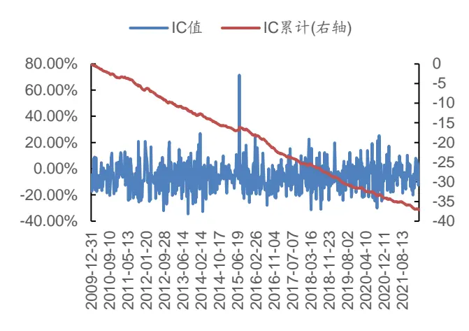
数据来源：Wind，广发证券发展研究中心

图 52：DPIN_SMALL_TOTAL_STABLE因子多空策略净值走势
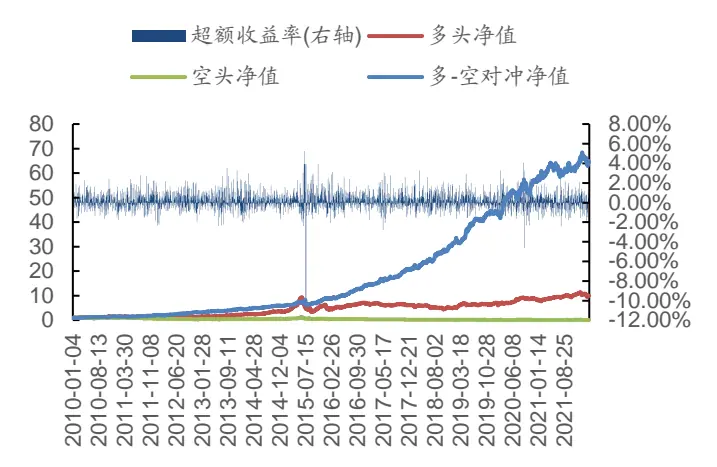
数据来源：Wind，广发证券发展研究中心

表 17：DPIN_SMALL_TOTAL_STABLE 因子整体与分年度 IC 表现

| 范围 | IC 均值 | IC 标准差 | IC最大值 | IC最小值 | IC T统计量 | IC 累计值 | 正IC占比 |
| --- | --- | --- | --- | --- | --- | --- | --- |
| 2010 | -0.069 | 0.082 | 0.12 | -0.205 | -6.009 | -3.526 | 19.61% |
| 2011 | -0.063 | 0.113 | 0.209 | -0.255 | -3.996 | -3.222 | 29.41% |
| 2012 | -0.062 | 0.125 | 0.208 | -0.32 | -3.507 | -3.089 | 30.00% |
| 2013 | -0.064 | 0.111 | 0.148 | -0.345 | -4.123 | -3.28 | 31.37% |
| 2014 | -0.05 | 0.103 | 0.269 | -0.328 | -3.547 | -2.663 | 24.53% |
| 2015 | -0.041 | 0.142 | 0.714 | -0.258 | -2.096 | -2.15 | 25.00% |
| 2016 | -0.094 | 0.104 | 0.237 | -0.28 | -6.387 | -4.689 | 18.00% |
| 2017 | -0.056 | 0.085 | 0.154 | -0.211 | -4.723 | -2.861 | 27.45% |
| 2018 | -0.059 | 0.123 | 0.225 | -0.313 | -3.455 | -3.031 | 33.33% |
| 2019 | -0.062 | 0.092 | 0.197 | -0.241 | -4.834 | -3.163 | 21.57% |
| 2020 | -0.047 | 0.129 | 0.253 | -0.301 | -2.659 | -2.465 | 38.46% |
| 2021 | -0.044 | 0.082 | 0.172 | -0.187 | -3.895 | -2.313 | 30.77% |
| 2022 | -0.054 | 0.093 | 0.081 | -0.202 | -1.995 | -0.643 | 33.33% |
| ALL | -0.059 | 0.109 | 0.714 | -0.345 | -13.63 | -37.094 | 27.59% |

数据来源：Wind，广发证券发展研究中心

表 18：DPIN_SMALL_TOTAL_STABLE 因子多-空对冲分年度策略表现周度调仓

| 年份 | 累计 收益率 | 年化 年化 收益率 | 信息 比率 | 最大 |
| --- | --- | --- | --- | --- |
| 2010 | 52.4% | 53.7% | 波动率 11.9% 4.50 | 回撤 3.6% |
| 2011 | 41.9% | 42.8% | 12.9% 3.31 | 5.7% |
| 2012 | 52.0% | 54.6% | 12.0% 4.54 | 6.4% |
| 2013 | 41.4% | 42.3% | 13.9% 3.04 | 3.4% |
| 2014 | 28.9% | 28.3% | 12.6% 2.25 | 6.6% |
| 2015 | 48.9% | 48.9% | 29.7% 1.65 | 23.3% |
| 2016 | 64.5% | 67.8% | 12.8% 5.29 | 4.6% |
| 2017 | 44.9% | 46.0% | 10.3% 4.48 | 2.9% |
| 2018 | 48.1% | 49.2% | 13.7% 3.60 | 5.0% |
| 2019 | 41.2% | 42.2% | 11.2% 3.76 | 5.0% |
| 2020 | 28.8% | 28.8% | 15.6% 1.85 | 6.8% |
| 2021 | 12.7% | 12.7% | 10.5% 1.21 | 8.4% |
| 2022 | 1.9% | 8.3% | 12.5% 0.67 | 7.0% |
| ALL | 6471.0% | 41.5% | 14.7% 2.82 | 23.3% |

数据来源：Wind，广发证券发展研究中心

图 53：DPIN_SMALL_TOTAL_STABLE因子多-中证800策略净值走势
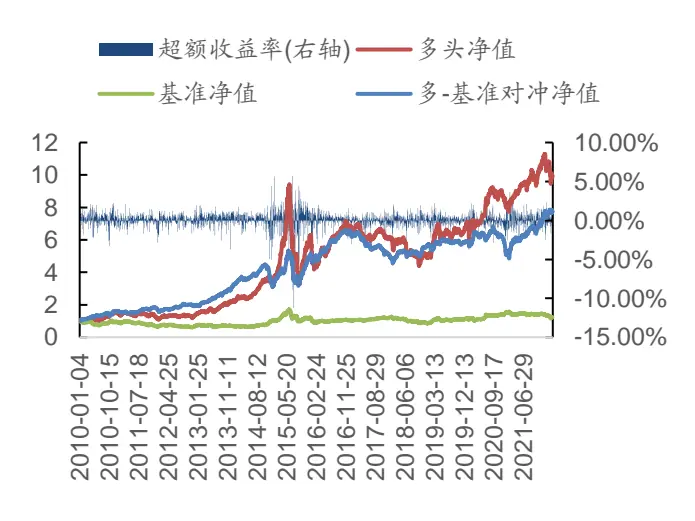
数据来源：Wind，广发证券发展研究中心

图 54：DPIN_SMALL_TOTAL_STABLE因子多-中证800策略净值走势(行业中性)
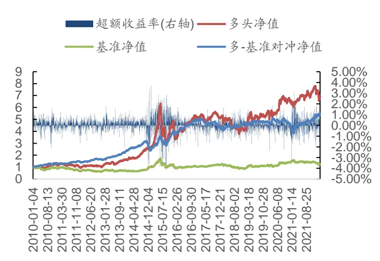
数据来源：Wind，广发证券发展研究中心

表 19：DPIN_SMALL_TOTAL_STABLE 因子多-中证 800 分年度策略表现周度调仓

| 范围 | 多头累计 收益率 | 累计 收益率 | 累计 收益率 (扣费) | 年化 收益率 | 年化 收益率 (扣费) | 年化 波动率 | 年化 波动率 (扣费) | 信息 比率 | 信息 比率 (扣费) | 最大 回撤 | 最大 回撤 |
| --- | --- | --- | --- | --- | --- | --- | --- | --- | --- | --- | --- |
| 2010 | 50.8% | 61.5% | 51.8% | 63.0% | 53.0% | 18.8% | 18.8% | 3.35 | 2.82 | 12.1% | (扣费) 12.6% |
| 2011 | -20.0% | 9.9% | 3.9% | 10.2% | 4.0% | 10.3% | 10.3% | 0.99 | 0.39 | 7.0% | 8.4% |
| 2012 | 14.5% | 9.7% | 3.5% | 10.1% | 3.7% | 13.2% | 13.2% | 0.76 | 0.28 | 7.9% | 8.1% |
| 2013 | 61.6% | 65.2% | 55.3% | 66.9% | 56.6% | 12.9% | 12.9% | 5.20 | 4.40 | 4.4% | 4.6% |
| 2014 | 52.3% | 2.4% | -4.5% | 2.4% | -4.4% | 17.9% | 17.9% | 0.13 | -0.24 | 26.5% | 27.3% |
| 2015 | 86.5% | 64.3% | 51.5% | 64.3% | 51.5% | 38.6% | 38.7% | 1.67 | 1.33 | 39.5% | 41.1% |
| 2016 | 8.9% | 27.8% | 18.2% | 29.1% | 18.9% | 14.9% | 14.9% | 1.95 | 1.27 | 7.1% | 7.4% |
| 2017 | -9.9% | -21.8% | -27.4% | -22.2% | -27.9% | 10.7% | 10.8% | -2.06 | -2.59 | 21.8% | 27.2% |
| 2018 | -19.5% | 10.1% | 3.4% | 10.3% | 3.5% | 13.8% | 13.8% | 0.75 | 0.25 | 8.5% | 9.2% |
| 2019 | 38.1% | 5.0% | -2.0% | 5.1% | -2.1% | 9.2% | 9.2% | 0.56 | -0.23 | 6.0% | 8.6% |
| 2020 | 24.5% | -2.0% | -8.2% | -2.0% | -8.2% | 12.4% | 12.3% | -0.16 | -0.66 | 13.1% | 15.5% |
| 2021 | 29.6% | 27.9% | 20.6% | 27.9% | 20.6% | 17.9% | 17.9% | 1.56 | 1.15 | 8.3% | 8.8% |
| 2022 | -9.4% | 5.7% | 4.2% | 27.2% | 19.7% | 11.2% | 11.3% | 2.42 | 1.75 | 2.7% | 3.0% |
| ALL | 912.1% | 729.7% | 267.9% | 19.2% | 11.4% | 17.6% | 17.7% | 1.09 | 0.65 | 39.5% | 44.4% |

数据来源：Wind，广发证券发展研究中心

表 20：DPIN_SMALL_TOTAL_STABLE 因子多-中证 800 分年度策略表现周度调仓(行业中性)

| 范围 | 多头累计 | 累计 | 累计 收益率 | 年化 | 年化 收益率 | 年化 | 年化 波动率 | 信息 | 信息 比率 | 最大 | 最大 回撤 |
| --- | --- | --- | --- | --- | --- | --- | --- | --- | --- | --- | --- |
|  | 收益率 | 收益率 | (扣费) | 收益率 | (扣费) | 波动率 | (扣费) | 比率 | (扣费) | 回撤 | (扣费) |
| 2010 | 23.4% | 32.4% | 24.5% | 33.2% | 25.1% | 10.8% | 10.8% | 3.08 | 2.32 | 7.9% | 8.5% |
| 2011 | -19.6% | 10.7% | 4.4% | 10.9% | 4.5% | 6.4% | 6.4% | 1.72 | 0.71 | 3.4% | 5.0% |
| 2012 | 15.7% | 11.0% | 4.4% | 11.5% | 4.6% | 9.9% | 9.9% | 1.16 | 0.46 | 5.3% | 6.9% |
| 2013 | 42.5% | 46.7% | 37.2% | 47.8% | 38.0% | 8.8% | 8.8% | 5.42 | 4.30 | 2.1% | 2.3% |
| 2014 2015 | 55.1% | 4.6% | -2.5% | 4.5% | -2.4% | 15.3% | 15.3% | 0.30 | -0.16 | 22.9% | 23.7% |
| 2016 | 92.5% | 71.3% | 59.2% | 71.3% | 59.2% | 21.8% | 21.8% | 3.28 | 2.71 | 20.1% | 21.7% |
| 2017 | 6.8% | 24.8% | 15.9% | 25.9% | 16.6% | 10.7% | 10.8% | 2.42 | 1.55 | 4.5% | 4.8% |
| 2018 | 0.6% -20.3% | -12.8% 8.8% | -19.1% 2.1% | -13.1% 9.0% | -19.4% 2.1% | 8.3% 10.2% | 8.3% | -1.57 | -2.33 | 14.6% | 19.6% |
| 2019 | 34.7% | 2.4% | -4.4% | 2.4% | -4.5% | 6.5% | 10.2% 6.5% | 0.89 | 0.21 | 5.9% | 6.5% |
| 2020 | 16.4% | -8.2% | -13.9% | -8.2% | -13.9% | 9.4% | 9.3% | 0.37 -0.88 | -0.69 | 4.9% | 6.3% |
| 2021 | 18.4% | 17.2% | 10.2% | 17.2% | 10.2% | 14.6% | 14.6% | 1.18 | -1.49 | 13.2% | 17.3% |
| 2022 | -9.6% | 5.5% | 3.8% | 26.0% | 17.7% | 9.8% | 9.8% | 2.66 | 0.70 | 7.6% | 8.1% |
|  |  |  |  |  |  |  |  |  | 1.81 | 2.6% | 2.9% |
| ALL | 601.3% | 488.7% | 160.9% | 15.8% | 8.3% | 12.0% | 12.0% | 1.32 | 0.69 | 24.7% | 41.4% |

数据来源：Wind，广发证券发展研究中心

表 21：DPIN_SMALL_TOTAL_STABLE 因子分年度换手率

| 范围 | 非行业中性 |  |  |  | 行业中性 |  |  |  |
| --- | --- | --- | --- | --- | --- | --- | --- | --- |
|  | 均值 | 最大值 最小值 | 标准差 | 累计值 | 均值 最大值 | 最小值 | 标准差 | 累计值 |
| 2010 | 41.6% | 56.9% 29.7% | 0.06 | 2077.4% | 41.3% 63.2% | 20.9% | 0.10 | 2062.7% |
| 2011 | 36.8% | 46.1% 29.8% | 0.04 | 1878.0% | 38.4% 56.1% | 25.0% | 0.08 | 1958.1% |
| 2012 | 38.5% | 47.9% 30.8% | 0.04 | 1924.5% | 41.0% 62.0% | 25.6% | 0.09 | 2051.6% |
| 2013 | 41.1% | 50.7% 28.2% | 0.04 | 2093.6% | 44.0% 60.1% | 26.5% | 0.09 | 2244.4% |
| 2014 | 43.7% | 53.4% 34.6% | 0.05 | 2317.4% | 44.2% 62.3% | 28.5% | 0.08 | 2340.4% |
| 2015 | 52.0% | 100.0% 36.9% | 0.14 | 2706.2% | 47.4% 82.4% | 32.4% | 0.10 | 2462.6% |
| 2016 | 52.6% | 64.9% 42.1% | 0.05 | 2630.4% | 49.5% 70.4% | 31.7% | 0.09 | 2474.3% |
| 2017 | 48.6% | 67.7% 38.2% | 0.06 | 2476.2% | 48.4% 74.7% | 37.6% | 0.07 | 2467.6% |
| 2018 | 41.1% | 48.9% 32.1% | 0.04 | 2095.9% | 41.9% 56.5% | 30.4% | 0.06 | 2138.1% |
| 2019 | 45.5% | 58.5% 37.4% | 0.05 | 2322.5% | 44.7% 55.7% | 34.1% | 0.06 | 2281.1% |
| 2020 | 42.1% | 53.6% 31.4% | 0.05 | 2188.2% | 40.6% 53.5% | 32.5% | 0.05 | 2112.4% |
| 2021 | 38.0% | 46.0% 30.3% | 0.03 | 1973.3% | 39.6% 51.2% | 30.9% | 0.04 | 2060.5% |
| 2022 | 39.0% | 44.5% 35.0% | 0.03 | 467.4% | 43.8% 50.9% | 39.8% | 0.04 | 525.8% |
| ALL | 43.4% | 100.0% | 28.2% 0.08 | 27150.7% | 43.4% | 82.4% 20.9% | 0.08 | 27179.3% |

数据来源：Wind，广发证券发展研究中心

综合 $\cdot DPIN_{MEAN}$ $DPIN_{STD}$ $DPIN_{STABLE}$ 三大类因子的实证分析结果，在因子层面，整体绩效表现排序为 $DPIN_{STD}>DPIN_{STABLE}>DPIN_{MEAN}$ 。由于 $:DPIN_{STD}$ $DPIN_{STABLE}$ 两类因子能够从股票日内交易结构的角度刻画信息优势交易概率，从而反映DPIN因子在分散度、稳定性方面的多维信息，因此该因子在因子分档测试、IC值表现方面都具有更好的表现。

对于DPIN类因子在不同选股范围内、不同调仓频率下是否适用，本报告将在敏感性分析部分进行详细测试。

## 六、DPIN因子与 BARRA因子相关性分析

CNE6版本的BARRA因子模型将股票因子划分为市场、价值、成长、盈利、波动等大类因子。传统BARRA因子已经在市场中得到验证，能够较有效地刻画股票特征。本节将对DPIN因子与BARRA因子进行相关性分析。

## （一）BARRA 因子说明

在CNE6版本的BARRA因子模型中，共详细阐述了数大类因子，本报告仅在各大类因子中选取其中一个因子进行相关性说明。首先，对因子类型及计算公式进行如下说明：

表 22：BARRA 因子说明

| 因子类型 | 因子名称 | 因子计算公式/说明 |
| --- | --- | --- |
| Beta | HBETA | 对个股在过去252个交易日的日频收益率序列与同期市场指数收益率序列进行回归，得到市场 指数的回归系数β即为HBETA 因子 |
|  |  | $r_{t}^{i}-r_{t}^{f}=\alpha+\beta r_{t}^{m}+e_{t}$ |
| book_to_price | BTOP | 最新报告期的股东权益与当前流通市值的比值 |
| earnings_variability | VSAL | 过去五期财报营业收入的标准差/过去五期财报营业收入的的均值 |
| earnings_yield | CETOP | 个股历史12个月滚动的经营现金流净额与当前流通市值的比值 |
| growth | EGRO | 用个股过去五年的每股盈利对时间做回归，得到的斜率再除以五年每股盈利的平均值 |
| investment_quality | AGRO | 用过去五年的总资产对时间做回归，得到的斜率再除以五年的平均值。数值乘-1 |
| liquidity | STOM | 过去21个交易日的换手率之和的对数值 |
| long_term_reversal | RSTR | 计算过去504个交易日的个股超额对数收益率与过去21个交易日的超额对数收益率的差额累 |
|  |  | 计和，得到 RSTR 因子 |
|  |  | $RSTR=\sum_{L}^{T+L}w_{t}[\ln(1+r_{t}^{i})-\ln(1+r_{t}^{f})],$ |
| mid_capitallization | MIDCAP | 用截面上个股的对数流通市值的三次方对对数流通市值进行回归，对回归残差进行MAD去极值 |
|  |  | 与中性化处理，获得MIDCAP因子 对个股在过去252个交易日的日频收益率序列与同期市场指数收益率序列进行回归，得到截距 |
| momentum | HALPHA | 项 α 为 HALPHA 因子 $r_{t}^{i}-r_{t}^{f}=\alpha+\beta r_{t}^{m}+e_{t}$ |
| profitability | ROA | 个股历史12个月滚动净利润与最新报告的总资产的比值 |
| residual_volatility | HSIGMA | 对个股在过去252个交易日的日频收益率序列与同期市场指数收益率序列进行回归，得到残差 的标准差即为 HSIGMA 因子 |
| size | LNCAP | $r_{t}^{i}-r_{t}^{f}=\alpha+\beta r_{t}^{m}+e_{t}$ |

数据来源：Wind，广发证券发展研究中心

## （二）DPIN 与 BARRA 相关性分析

本小节将数据预处理（MAD法去极值、Z-Score标准化、行业市值中性化）后的DPIN类因子与BARRA原始因子值进行Spearman秩相关性分析，相关性如下表所示。整体而言，DPIN类因子与BARRA因子存在不同程度的相关性，因此在考虑将DPIN类因子加入多因子模型前，须对DPIN类因子与现有因子进行相关性分析。

对于 $DPIN_{MEAN}$ 类因子，总体上与反映流动性水平的STOM因子具有较高的相关性，相关性绝对值在4.5%-30%之间。其中，早盘交易时段构建的DPIN因子与STOM因子相关性最高。

对于 $DPIN_{STD}$ 类因子，总体上与流动性因子STOM、动量因子HALPHA、残差波动率因子HSIGMA具有较高的负相关性。具体而言， $DPIN_{STD}$ 类因子与STOM因子相关性在-12%至-53%之间，与HALPHA因子相关性在-5%至-26%之间，与HSIGMA因子相关性在-10%至-27%之间。此外， $DPIN_{STD}$ 类因子与市场风险因子HBETA、账面市值比因子BTOP、长期趋势反转因子RSTR均存在显著的相关性。

对于 $:DPIN_{STABLE}$ 类因子，相关性程度与 $DPIN_{STD}$ 类因子保持一致，方向上与

$DPIN_{STD}$ 类因子基本相反。

表 23：DPIN_MEAN 因子与 BARRA 相关性分析(单位：%)

| 范围 | BASE |  |  |  | SIZE |  |  | SMALL |  |  |  |
| --- | --- | --- | --- | --- | --- | --- | --- | --- | --- | --- | --- |
|  | AM | MIDDLE | PM | TOTAL | AM MIDDLE | PM | TOTAL | AM MIDDLE | PM |  | TOTAL |
| HBETA | 3.4 | 1.8 | -0.9 | 2.1 | 9.8 | -3.3 0.6 | 2.4 | -8.2 | 4.3 | -1.3 | 0.6 |
| BTOP | -3.2 | 0.8 | 0.5 | 0.2 | -5.8 | -0.7 -1.1 | -4.8 | 2.8 | 2.3 | 1.8 | 4.7 |
| VSAL | 1.3 | -0.1 | 0.3 | 0.2 | 3.5 | -1.9 2.8 | 1.5 | -2.7 | 1.2 | -2.7 | -1.2 |
| CETOP | -0.9 | 2.9 | 1.7 | 2.6 | -2.0 | 2.3 -1.7 | 0.0 | 0.9 | 1.6 | 3.2 | 4.1 |
| EGRO | 0.8 | 2.1 | 1.0 | 2.2 | 2.2 | 0.8 0.3 | 1.9 | -1.8 | 1.6 | 0.4 | 1.5 |
| AGRO | -1.3 | 0.3 | 0.1 | 0.1 | 0.1 | -2.4 -0.2 | -2.1 | -1.2 | 2.6 | 0.1 | 2.1 |
| STOM | 11.9 | 9.1 | 4.8 | 11.4 | 28.9 | -9.7 11.3 | 13.0 | -21.7 | 17.2 | -8.5 | 4.6 |
| RSTR | 2.7 | -0.1 | 1.9 | 0.8 | 5.1 | 0.9 1.9 | 4.8 | -2.8 | -1.1 | -0.6 | -3.0 |
| HALPHA | 3.6 | -1.1 | 0.8 | -0.2 | 7.1 | -0.5 2.5 | 4.9 | -3.7 | -1.2 | -2.1 | -4.6 |
| ROA | -0.8 | -4.5 | -2.6 | -4.7 | -3.4 | 3.5 | -4.6 -1.2 | 3.0 | -8.3 | 2.9 | -5.9 |
| HSIGMA | 2.4 | -5.2 | -1.8 | -4.3 | 11.3 | -11.2 | 8.5 0.1 | -9.6 | 2.8 | -10.1 | -6.9 |
| MIDCAP | 0.1 | -6.1 | -2.4 | -6.0 | -1.7 | -0.2 | 0.6 -0.5 | 1.7 | -5.9 | -2.5 | -7.7 |
| LNCAP | 0.9 | 5.7 | 4.5 | 6.0 | 3.0 | -0.4 | 4.4 3.5 | -2.4 | 6.8 | -0.9 | 5.9 |

数据来源：Wind，广发证券发展研究中心

表 24：DPIN_STD 因子与 BARRA 相关性分析(单位：%)

| 范围 | BASE |  |  |  | SIZE |  |  | SMALL |  |  |  |
| --- | --- | --- | --- | --- | --- | --- | --- | --- | --- | --- | --- |
|  | AM | MIDDLE | PM | TOTAL | AM MIDDLE | PM | TOTAL |  | AM | MIDDLE | PM TOTAL |
| HBETA | -14.8 | -17.4 | -14.2 | -17.6 | -13.8 -11.2 | -7.5 | -12.7 | -8.9 | -15.2 | -3.2 | -14.9 |
| BTOP | 17.4 | 21.0 | 19.8 | 21.5 | 14.0 11.5 | 12.3 | 14.8 | 4.6 | 18.5 | 6.4 | 18.5 |
| VSAL | -7.0 | -8.4 | -7.9 | -8.7 | -5.8 -5.8 | -4.8 | -6.3 | -3.2 | -7.6 | -3.6 | -7.5 |
| CETOP | 5.6 | 6.7 | 7.2 | 7.0 | 4.9 5.5 | 5.6 | 6.2 | 1.7 | 6.8 | 4.2 | 7.0 |
| EGRO | -5.9 | -7.4 | -5.8 | -7.5 | -4.7 -3.2 | -2.9 | -4.3 | -2.3 | -6.0 | -1.1 | -5.8 |
| AGRO | 8.1 | 10.6 | 9.7 | 10.8 | 4.8 5.7 | 6.2 | 7.7 | 0.0 | 9.3 | 3.0 | 9.4 |
| STOM | -44.5 | -51.6 | -45.4 | -52.7 | -41.0 | -31.8 -25.3 | -35.3 | -24.3 | -44.5 | -13.1 | -43.0 |
| RSTR | -17.4 | -20.2 | -18.1 | -20.7 | -13.2 -10.9 | -10.6 | -13.8 | -4.2 | -17.3 | -4.6 | -17.1 |
| HALPHA | -21.7 | -25.1 | -23.3 | -25.7 | -17.3 | -15.4 -14.7 | -19.1 | -5.7 | -22.4 | -6.7 | -22.3 |
| ROA | -7.1 | -10.6 | -10.7 | -10.8 | -3.2 -7.1 | -7.8 | -10.8 | 1.5 | -10.5 | -1.5 | -11.0 |
| HSIGMA | -23.0 | -25.5 | -25.8 | -26.6 | -20.8 | -21.4 -17.7 | -23.4 | -11.0 | -24.7 | -11.9 | -24.9 |
| MIDCAP | 5.2 | 6.9 | 3.6 | 6.7 | 3.5 | 3.7 0.1 | 5.0 | 2.6 | 8.4 | -2.2 | 7.7 |
| LNCAP | -5.5 | -5.9 | -3.5 | -5.9 | -4.4 | -2.5 -0.4 | -2.3 | -2.6 | -4.6 | -0.6 | -4.2 |

数据来源：Wind，广发证券发展研究中心

表 25：DPIN_STABLE 因子与 BARRA 相关性分析(单位：%)

| 范围 | BASE |  |  | SIZE |  |  |  | SMALL |  |  |
| --- | --- | --- | --- | --- | --- | --- | --- | --- | --- | --- |
|  | AM | MIDDLE | PM | TOTAL AM | MIDDLE | PM |  | TOTAL AM | MIDDLE | PM TOTAL |
| HBETA | 14.2 | 16.8 | 12.4 | 17.1 | 14.1 9.0 | 5.2 | 15.5 | -3.2 15.8 | 1.6 | 16.8 |
| BTOP | -17.1 | -21.3 | -19.2 | -21.8 -13.4 | -15.3 | -7.8 | -20.1 | -1.2 -13.9 | -3.6 | -17.5 |
| VSAL | 6.6 | 7.8 | 7.3 | 8.2 | 5.7 4.3 | 4.8 | 8.1 | -0.6 7.5 | -0.6 | 7.7 |
| CETOP | -5.7 | -6.8 | -6.7 | -7.1 | -4.9 -3.4 | -4.3 | -6.2 | -0.6 -4.8 | 1.0 | -5.2 |
| EGRO | 5.3 | 7.4 | 5.7 | 7.5 | 4.2 4.9 | 2.0 | 6.7 | -0.2 6.3 | 2.0 | 7.5 |
| AGRO | -7.2 | -9.7 | -8.9 | -10.0 | -3.6 -10.5 | -3.9 | -10.6 | -2.0 -6.4 | -3.1 | -8.9 |
| STOM | 42.2 | 49.0 | 41.4 | 50.3 | 41.4 24.9 | 23.0 | 49.0 | -6.7 48.3 | 1.1 | 50.1 |
| RSTR | 16.6 | 19.4 | 18.0 | 20.2 | 12.3 14.6 | 7.6 | 19.8 | 0.6 14.2 | 4.0 | 17.0 |
| HALPHA | 19.7 | 22.8 | 21.4 | 23.6 | 15.4 18.3 | 9.8 | 25.1 | 0.6 17.9 | 3.8 | 21.4 |
| ROA | 5.6 | 8.4 | 9.0 | 8.7 | 0.8 14.3 | 1.4 | 10.6 | 3.6 2.7 | 6.4 | 7.3 |
| HSIGMA | 20.7 | 22.2 | 22.5 | 23.6 | 19.6 9.9 | 15.9 | 24.4 | -2.5 22.7 | -3.8 | 22.5 |
| MIDCAP | -0.2 | 0.6 | 1.4 | 0.8 | 0.1 -4.0 | 1.2 | -5.0 | -0.6 -9.7 | -2.1 | -13.3 |
| LNCAP | 2.9 | 3.0 | 3.2 | 3.1 | 1.6 2.5 | 2.0 | 6.0 | -2.3 8.3 | -0.6 | 7.5 |

数据来源：Wind，广发证券发展研究中心

## 七、DPIN因子敏感性分析

本报告的实证分析表明，部分DPIN类因子在全市场范围内具有持续的选股能力，但是该类因子在其他指数成分股范围内是否存在适用性，仍需通过数据加以验证。此外，DPIN因子作为动态日内信息优势交易概率的直接度量，其蕴含的增量信息会受到数据频率的影响，利用过短周期的数据构造DPIN因子可能存在噪声信息，而使用过长周期的数据构造DPIN因子可能造成信息稀释问题。基于上述考虑，本小节依次对DPIN因子的调仓频率、选股范围进行敏感性分析。具体而言，首先测试因子在2天、3天、周度、月度调仓频率下的测试效果，其次测试因子在中证1000、中证500、创业板、沪深300选股范围内的选股能力。

## （一）敏感性分析-调仓频率

## 1. 调仓频率敏感性分析—— $\cdot DPIN_{MEAN}$ 类因子

整体来看，当因子调仓频率越高时，IC值的T统计量越显著，多空策略收益越高，多头相对基准策略收益越高，多头平均换手率越高。

IC分析方面，对于调仓频率角度，调仓频率越高，IC均值越低，但IC值的T统计量越高。对于行为特征角度， $DPIN_{SIZE}$ 类因子IC均值最低，月度调仓下为-0.046。对于时间特征角度，早盘、尾盘交易时段数据构建的 $DPIN_{SIZE}$ 因子IC均值最低，月度调仓下分别为-0.067，-0.076。盘中交易时段数据构建的 $DPIN_{SMALL}$ 因子IC均值最低，月度调仓下为-0.067。

表 26：DPIN_MEAN 因子不同调仓周期下的 IC统计结果

| 行为 特征 | 时间 特征 | 2日调仓 |  | 3日调仓 |  | 周度调仓 |  |  | 月度调仓 |  |  |  |
| --- | --- | --- | --- | --- | --- | --- | --- | --- | --- | --- | --- | --- |
|  |  | IC IC T | 正IC | IC IC T | 正IC | IC | IC T | 正IC | IC | IC T | 正IC |  |
|  |  | 均值 | 统计 | 占比 | 均值 统计 | 占比 | 均值 | 统计 占比 | 均值 | 统计 |  | 占比 |
| BASE | AM | -0.016 | -13.2 33.5% | -0.02 | -13.7 | 31.7% | -0.024 -11.6 | 30.0% | -0.044 | -7.8 | 21.8% |  |
|  | MIDDLE | -0.018 -14.7 | 35.2% | -0.021 -12.6 | 33.5% | -0.023 | -10.1 | 33.0% | -0.035 | -5.7 | 31.3% |  |
|  | PM | -0.002 -1.6 | 48.7% | -0.004 -3.5 | 45.4% | -0.01 | -5.8 | 41.2% | -0.02 | -4.5 | 35.4% |  |
|  | TOTAL | -0.019 -14.0 | 34.9% | -0.024 -13.2 | 32.1% | -0.027 | -11.0 | 31.9% | -0.04 | -6.1 | 30.6% |  |
| SIZE | AM | -0.028 | -15.1 30.8% | -0.036 | -15.5 | 28.3% | -0.041 -13.6 | 28.9% | -0.067 | -8.2 | 24.5% |  |
|  | MIDDLE | 0.016 | 13.2 65.7% | 0.022 | 13.9 70.0% | 0.027 | 12.8 | 70.8% | 0.048 | 8.1 | 76.2% |  |
|  | PM | -0.031 | -25.2 25.1% | -0.038 | -24.0 21.3% | -0.048 | -22.0 | 15.8% | -0.076 | -12.3 | 15.0% |  |
|  | TOTAL | -0.021 | -15.4 32.8% | -0.027 | -15.0 32.4% | -0.03 | -12.5 | 28.6% | -0.046 | -7.3 | 26.5% |  |
| SMALL | AM | 0.006 | 3.8 56.1% | 0.017 | 9.2 | 61.7% | 0.024 8.8 | 63.6% | 0.061 | 8.0 | 76.9% |  |
|  | MIDDLE | -0.031 | -20.7 27.0% | -0.039 | -17.8 | 24.9% -0.043 | -15.3 | 24.6% | -0.067 | -8.5 | 22.5% |  |
|  | PM | 0.027 | 24.1 74.0% | 0.036 | 24.9 | 81.8% 0.044 | 21.3 | 84.4% | 0.073 | 13.8 | 89.8% |  |
|  | TOTAL | -0.008 | -7.3 43.1% | -0.01 | -7.0 | 40.1% | -0.011 | -5.5 40.8% | -0.019 | -3.3 | 38.1% |  |

数据来源：Wind，广发证券发展研究中心

多空策略方面，对于调仓频率角度，大部分DPIN类因子在3日调仓频率下，信息比率最高，个别DPIN类因子在低频调仓时，信息比率具有更好表现。对于行为特征角度， $DPIN_{BASE}、DPIN_{SIZE}$ 类因子信息比率相对较高，3日调仓下均为2.6。对于时间特征角度，早盘交易时段数据构建的 $DPIN_{SIZE}$ 因子信息比率最高，3日调仓下为2.7，盘中、尾盘交易时段数据构建的 $DPIN_{SMALL}$ 因子信息比率最高，3日调仓下分别为3.9，5.9。

表 27：DPIN_MEAN 因子不同调仓周期下的多空策略表现

| 行为 特征 | 时间 特征 | 2 日调仓 |  |  | 3日调仓 |  | 周度调仓 |  |  | 月度调仓 |  |  |
| --- | --- | --- | --- | --- | --- | --- | --- | --- | --- | --- | --- | --- |
|  |  | 年化 | 信息 | 最大 | 年化 信息 | 最大 | 年化 | 信息 | 最大 | 年化 信息 |  | 最大 |
|  |  | 收益 | 比率 | 回撤 | 收益 | 比率 | 回撤 | 收益 比率 | 回撒 | 收益 | 比率 | 回撤 |
| BASE | AM | 15.1% | 1.6 | 16.4% | 16.5% 2.3 | 6.4% | 14.3% | 1.6 | 22.5% | 11.5% | 1.4 | 5.8% |
|  | MIDDLE | 19.3% | 2.2 | 18.3% | 20.8% 2.6 | 20.1% | 16.9% | 2.0 | 15.4% | 12.3% | 1.4 | 16.3% |
|  | PM | 0.0% | 0.0 | 33.6% | 1.9% 0.3 | 21.8% | 0.4% | 0.0 | 31.9% | 3.9% | 0.6 | 21.2% |
|  | TOTAL | 21.4% | 2.2 | 19.6% | 21.2% 2.6 | 24.3% | 17.8% | 2.0 | 19.7% | 12.5% | 1.4 | 14.2% |
| SIZE | AM | 24.5% | 2.2 | 15.8% | 25.8% 2.7 | 7.5% | 23.5% | 2.4 | 10.3% | 15.4% | 1.3 | 11.0% |
|  | MIDDLE | 15.1% | 1.9 | 21.0% | 18.1% 2.4 | 14.5% | 18.1% | 2.2 | 23.5% | 15.8% | 2.0 | 9.1% |
|  | PM | 36.2% | 3.6 | 22.5% | 41.6% 5.2 | 6.5% | 41.3% | 5.3 | 12.5% | 33.5% | 3.7 | 5.6% |
|  | TOTAL | 21.5% | 2.1 | 16.8% | 22.3% 2.6 | 17.8% | 18.5% | 1.8 | 23.2% | 15.2% | 1.6 | 12.2% |
| SMALL | AM | -1.4% | -0.2 | 41.8% | 5.7% | 0.8 17.9% | 8.2% | 0.9 | 22.8% | 12.3% | 1.1 | 13.8% |
|  | MIDDLE | 31.5% | 2.9 | 18.3% | 35.4% | 3.9 7.4% | 30.4% | 2.8 | 22.1% | 21.4% | 1.9 | 10.7% |
|  | PM | 35.6% | 4.4 | 5.4% | 41.9% | 5.9 5.3% | 37.5% | 3.7 | 26.5% | 30.6% | 3.7 | 4.6% |
|  | TOTAL | 7.9% | 1.0 | 25.9% | 9.1% | 1.4 | 19.9% 5.1% | 0.6 | 32.6% | 5.4% | 0.6 | 24.1% |

数据来源：Wind，广发证券发展研究中心

多头相对基准策略方面，对于调仓频率角度，绝大部分DPIN类因子在2日调仓频率下，信息比率最高，仅 $DPIN_{SMALL}^{AM}$ 因子在3日调仓时，信息比率具有更好表现。对于行为特征角度， $DPIN_{BASE}$ 类因子信息比率相对较高，2日调仓下为1.3。对于时间特征角度，早盘交易时段数据构建的 $DPIN_{BASE}$ 因子信息比率最高，2日调仓下为1.4，盘中、尾盘交易时段数据构建的 $DPIN_{SMALL}$ 因子信息比率最高，2日调仓下分别为1.5，1.7。

表 28：DPIN_MEAN 因子不同调仓周期下的多头-基准策略表现

| 行为 特征 | 时间 特征 | 2 日调仓 |  |  | 3日调仓 |  | 周度调仓 |  |  | 月度调仓 |  |  |
| --- | --- | --- | --- | --- | --- | --- | --- | --- | --- | --- | --- | --- |
|  |  | 年化 | 信息 | 最大 | 年化 信息 | 最大 | 年化 | 信息 | 最大 | 年化 | 信息 | 最大 |
|  |  | 收益 | 比率 | 回撤 | 收益 | 比率 回撤 | 收益 | 比率 | 回撤 | 收益 | 比率 | 回撤 |
| BASE | AM | 22.6% | 1.4 | 35.7% | 19.5% 1.2 | 33.2% | 14.6% | 0.8 | 38.1% | 12.1% | 0.7 | 38.1% |
|  | MIDDLE | 22.4% | 1.3 | 34.8% | 19.8% 1.2 | 34.8% | 16.8% | 1.1 | 39.6% | 12.5% | 0.7 | 41.2% |
|  | PM | 14.7% | 0.9 | 38.6% | 14.6% 0.9 | 34.5% | 10.6% | 0.6 | 43.3% | 10.9% | 0.6 | 39.2% |
|  | TOTAL | 21.9% | 1.3 | 36.0% | 18.3% 1.1 | 33.8% | 16.7% | 1.0 | 36.9% | 12.0% | 0.6 | 41.2% |
| SIZE | AM | 14.4% | 0.9 | 32.2% | 14.1% 0.9 | 31.3% | 13.0% | 0.8 | 31.2% | 11.9% | 0.7 | 32.9% |
|  | MIDDLE | 19.5% | 1.2 | 28.6% | 19.3% 1.2 | 29.8% | 15.8% | 0.9 | 40.6% | 14.8% | 0.8 | 32.9% |
|  | PM | 26.1% | 1.6 | 29.0% | 26.6% 1.6 | 27.6% | 25.0% | 1.5 | 28.8% | 19.2% | 1.0 | 30.8% |
|  | TOTAL | 21.2% | 1.2 | 37.2% | 17.5% 1.1 | 35.1% | 14.4% | 0.8 | 42.7% | 11.8% | 0.7 | 41.7% |
| SMALL | AM | 11.2% | 0.7 | 40.9% | 12.1% 0.8 | 35.5% | 9.6% | 0.6 | 39.4% | 11.5% | 0.6 | 34.7% |
|  | MIDDLE | 24.3% | 1.5 | 32.4% | 24.0% 1.5 | 27.9% | 18.3% | 1.0 | 36.4% | 14.5% | 0.7 | 32.4% |
|  | PM | 29.2% | 1.7 | 28.5% | 27.5% 1.6 | 27.3% | 23.4% | 1.3 | 39.2% | 19.1% | 1.1 | 30.7% |
|  | TOTAL | 18.6% | 1.1 | 36.4% | 17.8% | 1.1 35.9% | 12.3% | 0.7 | 43.1% | 10.9% | 0.6 | 41.5% |

数据来源：Wind，广发证券发展研究中心

多头平均换手率方面，对于调仓频率角度，调仓频率越低，多头换手率水平越低。对于行为特征角度， $DPIN_{BASE}$ 类因子多头平均换手率水平最低，月度调仓下为63.2%。对于时间特征角度，早盘、尾盘交易时段构建的 $DPIN_{SIZE}$ 因子具有最低的多头平均换手率，月度调仓下分为别65.3%，74.7%；午盘交易时段构建的 $DPIN_{SMALL}$ 因子具有最低的多头平均换手率，月度调仓下为61.9%。

表 29：DPIN_MEAN 因子不同调仓周期下的多头平均换手率情况

| 行为特征 | 时间特征 | 2 日调仓 3日调仓 | 周度调仓 | 月度调仓 |
| --- | --- | --- | --- | --- |
| BASE | AM | 83.9% 83.3% | 81.9% | 77.5% |
|  | MIDDLE | 78.8% 76.6% | 73.7% | 65.1% |
|  | PM | 85.7% 85.0% | 84.4% | 80.7% |
|  | TOTAL | 77.2% 74.7% | 71.7% | 63.2% |
| SIZE | AM | 82.1% 79.5% | 76.1% | 65.3% |
|  | MIDDLE | 82.3% | 80.3% 78.0% | 68.6% |
|  | PM | 85.2% | 84.0% 81.9% | 74.7% |
|  | TOTAL | 81.2% | 79.7% 77.6% | 71.1% |
|  | AM | 87.9% 84.4% | 81.0% | 68.7% |
|  | MIDDLE | 78.1% 75.4% | 72.1% | 61.9% |
| SMALL | PM TOTAL | 86.6% 84.6% 79.4% 77.4% | 82.5% 74.6% | 75.0% 66.2% |

数据来源：Wind，广发证券发展研究中心

## 2. 调仓频率敏感性分析——DPINSTD类因子

整体来看，当因子调仓频率越高时，IC值的T统计量越显著，多空策略收益越高，多头相对基准策略收益越高，多头平均换手率越高。

IC分析方面，对于调仓频率角度，调仓频率越高，IC均值越低，但IC值的T统计量越高，绝大部分因子在2日调仓下IC值表现最显著。对于行为特征角度， $DPIN_{BASE}$ 类因子IC均值最高，月度调仓下为0.081。对于时间特征角度，早盘、尾盘交易时段数据构建的 $DPIN_{SIZE}$ 因子IC均值最高，月度调仓下分别为0.073，0.068。盘中交易时段数据构建的 $DPIN_{BASE}$ 因子IC均值最高，月度调仓下为0.081。

表 30：DPIN_STD 因子不同调仓周期下的 IC统计结果

| 行为 特征 | 时间 特征 | 2日调仓 |  |  | 3日调仓 |  |  | 周度调仓 |  |  | 月度调仓 |  |  |
| --- | --- | --- | --- | --- | --- | --- | --- | --- | --- | --- | --- | --- | --- |
|  |  | IC | IC T | 正IC | IC | IC T | 正IC | IC | IC T | 正IC | IC IC T |  | 正IC |
|  |  | 均值 |  | 统计 | 占比 | 均值 统计 | 占比 | 均值 | 统计 | 占比 | 均值 | 统计 | 占比 |
| BASE | AM | 0.04 | 18.0 | 69.9% | 0.046 | 15.6 | 71.9% | 0.05 13.5 | 70.8% | 0.074 | 8.1 |  | 73.5% |
|  | MIDDLE | 0.055 | 19.9 | 71.5% | 0.061 | 17.8 | 72.7% | 0.061 13.8 | 72.4% |  | 0.081 | 8.3 | 72.8% |
|  | PM | 0.044 | 21.5 | 72.9% | 0.052 | 19.2 | 73.1% | 0.055 15.2 | 73.1% |  | 0.081 | 9.0 | 74.8% |
|  | TOTAL | 0.057 | 20.2 | 71.7% | 0.062 | 18.0 | 72.4% | 0.062 | 13.9 | 72.1% | 0.081 | 8.4 | 73.5% |
| SIZE | AM | 0.034 | 19.8 | 71.6% | 0.042 | 18.7 | 74.4% | 0.048 15.7 | 74.8% |  | 0.073 | 8.9 | 74.2% |
|  | MIDDLE | 0.024 | 15.9 | 66.5% | 0.029 | 14.3 | 70.3% | 0.033 11.8 |  | 68.6% | 0.055 | 7.5 | 73.5% |
|  | PM | 0.03 | 23.3 | 75.0% | 0.035 | 19.8 | 76.8% | 0.039 | 17.8 | 76.9% | 0.068 | 10.4 | 82.3% |
|  | TOTAL | 0.023 | 14.2 | 65.4% | 0.025 | 12.0 | 65.9% | 0.027 9.4 | 64.6% |  | 0.043 | 6.0 | 69.4% |
| SMALL | AM | 0.013 | 8.7 | 61.0% | 0.024 | 12.5 | 66.5% | 0.032 12.4 | 70.0% |  | 0.067 | 8.4 | 75.5% |
|  | MIDDLE | 0.039 | 18.5 | 69.6% | 0.046 | 17.2 | 72.1% 0.05 | 14.1 | 72.3% |  | 0.075 | 8.6 | 72.1% |
|  | PM | 0.023 | 21.5 | 72.6% | 0.031 | 23.5 | 80.0% | 0.038 19.3 |  | 80.5% | 0.068 | 14.1 | 89.1% |
|  | TOTAL | 0.037 | 18.1 | 68.7% | 0.043 | 16.7 | 70.8% | 0.047 | 13.5 | 71.8% | 0.071 | 8.3 | 70.8% |

数据来源：Wind，广发证券发展研究中心
识别风险，发现价值

多空策略方面，对于调仓频率角度，大部分DPIN类因子调仓频率越高，信息比率越高。对于行为特征角度， $DPIN_{BASE}$ 类因子信息比率相对较高，2日调仓下为5.0。对于时间特征角度，早盘交易时段数据构建的 $DPIN_{SIZE}$ 因子信息比率最高，3日调仓下为3.3，盘中交易时段构建的 $DPIN_{BASE}$ 因子信息比率最高，2日调仓下为4.8，尾盘交易时段数据构建的 $DPIN_{SMALL}$ 因子信息比率最高，3日调仓下为5.5。

表 31：DPIN_STD 因子不同调仓周期下的多空策略表现

| 行为 特征 | 时间 特征 | 2 日调仓 |  |  | 3日调仓 |  |  | 周度调仓 |  |  | 月度调仓 |  |  |
| --- | --- | --- | --- | --- | --- | --- | --- | --- | --- | --- | --- | --- | --- |
|  |  | 年化 | 信息 | 最大 | 年化 信息 | 最大 | 年化 | 信息 | 最大 | 年化 | 信息 | 最大 |  |
|  |  | 收益 | 比率 | 回撤 | 收益 | 比率 | 回撤 | 收益 | 比率 | 回撤 | 收益 比率 |  | 回撤 |
| BASE | AM | 36.8% | 3.2 | 17.2% | 34.7% | 3.0 | 25.0% | 30.1% 2.7 | 10.8% | 18.8% | 1.5 | 9.5% |  |
|  | MIDDLE | 69.2% | 4.8 | 10.5% | 59.5% | 4.2 10.5% | 44.3% | 3.2 | 16.3% | 25.1% | 1.8 | 10.1% |  |
|  | PM | 44.2% | 3.8 | 31.2% | 46.7% 4.0 | 11.5% | 38.6% | 3.4 | 8.7% | 25.0% | 2.0 | 8.5% |  |
|  | TOTAL | 73.5% | 5.0 | 10.5% | 60.1% 4.2 | 10.1% | 45.1% | 3.1 | 15.8% | 24.5% | 1.8 | 10.1% |  |
| SIZE | AM | 33.0% | 2.7 | 7.8% | 31.4% | 3.3 7.7% | 28.3% | 2.9 | 7.3% | 18.4% | 1.6 | 12.2% |  |
|  | MIDDLE | 17.6% | 2.4 | 17.7% | 17.0% | 2.2 18.5% | 18.8% | 2.5 | 11.3% | 13.4% | 1.4 | 10.0% |  |
|  | PM | 30.8% | 3.4 | 29.4% | 33.7% | 4.2 5.6% | 29.5% | 3.8 | 4.9% | 25.1% | 2.6 | 7.2% |  |
|  | TOTAL | 13.2% | 1.8 | 16.9% | 11.3% 1.5 | 19.8% | 10.9% | 1.4 | 14.4% | 9.7% | 1.1 | 12.0% |  |
| SMALL | AM | 3.8% | 0.4 | 30.3% | 10.4% | 1.4 12.3% | 13.2% | 1.6 | 25.1% | 15.4% | 1.4 | 12.2% |  |
|  | MIDDLE | 35.6% | 3.3 | 16.6% | 34.7% | 3.4 6.8% | 33.5% | 3.1 | 7.9% | 23.1% | 1.9 | 7.7% |  |
|  | PM | 25.5% | 3.3 | 8.7% | 32.6% | 5.5 7.5% | 30.4% | 3.7 | 20.2% | 28.2% | 3.9 | 6.5% |  |
|  | TOTAL | 36.3% | 3.6 | 5.6% | 30.6% | 3.2 | 12.4% | 28.8% 2.7 | 10.6% | 21.0% | 1.9 | 8.0% |  |

数据来源：Wind，广发证券发展研究中心

多头相对基准策略方面，对于调仓频率角度，绝大部分DPIN类因子在2日调仓频率下，信息比率最高，仅 $DPIN_{SMALL}^{AM}$ 子在3日调仓时，信息比率具有更好表现。对于行为特征角度， $DPIN_{BASE}$ 类因子信息比率相对较高，2日调仓下为1.8。对于时间特征角度，早盘、盘中、尾盘交易时段数据构建的 $DPIN_{BASE}$ 因子信息比率最高，2日调仓下分别为1.4、1.7与1.5。

表 32：DPIN_STD 因子不同调仓周期下的多头-基准策略表现

| 行为 特征 | 时间 特征 | 2日调仓 |  |  | 3日调仓 |  | 周度调仓 |  |  | 月度调仓 |  |  |
| --- | --- | --- | --- | --- | --- | --- | --- | --- | --- | --- | --- | --- |
|  |  | 年化 | 信息 | 最大 年化 | 信息 | 最大 | 年化 | 信息 | 最大 | 年化 | 信息 | 最大 |
|  |  | 收益 | 比率 | 回撤 | 收益 | 比率 回撤 | 收益 | 比率 | 回撤 | 收益 | 比率 | 回撤 |
| BASE | AM | 22.2% | 1.4 | 33.1% | 20.9% 1.3 | 32.5% | 16.7% | 1.0 | 41.7% | 13.6% | 0.8 | 37.0% |
|  | MIDDLE | 27.5% | 1.7 | 30.3% | 24.3% 1.5 | 29.9% | 18.8% | 1.1 | 41.5% | 15.5% | 0.8 | 34.9% |
|  | PM | 24.3% | 1.5 | 32.7% | 23.9% 1.5 | 28.8% | 21.4% | 1.4 | 28.8% | 15.8% | 0.8 | 30.0% |
|  | TOTAL | 28.2% | 1.8 | 30.8% | 24.9% 1.6 | 29.7% | 19.6% | 1.1 | 40.9% | 15.5% | 0.8 | 33.8% |
| SIZE | AM | 19.3% | 1.2 | 30.1% | 18.2% 1.2 | 28.5% | 15.6% | 1.0 | 32.4% | 13.0% | 0.8 | 34.9% |
|  | MIDDLE | 19.9% | 1.2 | 31.0% | 18.2% 1.1 | 33.3% | 18.3% | 1.1 | 33.8% | 15.4% | 0.8 | 37.2% |
|  | PM | 21.8% | 1.4 | 30.3% | 21.2% 1.3 | 29.5% | 17.1% | 1.1 | 32.1% | 16.0% | 0.9 | 26.7% |
|  | TOTAL | 19.6% | 1.2 | 31.9% 18.2% | 1.1 | 30.7% | 16.0% | 1.0 | 35.5% | 13.3% | 0.7 | 36.4% |
| SMALL | AM | 16.9% | 1.0 | 32.5% | 17.1% 1.0 | 29.9% | 15.1% | 0.9 | 33.1% | 12.3% | 0.7 | 35.0% |
|  | MIDDLE | 26.1% | 1.6 | 32.0% | 22.6% 1.4 | 29.9% | 19.4% | 1.1 | 42.8% | 16.2% | 0.9 | 33.5% |
|  | PM | 24.1% | 1.4 | 31.7% 22.7% | 1.4 | 29.4% | 20.5% | 1.1 | 42.4% | 19.0% | 1.0 | 29.6% |
|  | TOTAL | 26.4% | 1.6 | 31.8% | 21.7% 1.3 | 30.8% | 18.9% | 1.1 | 41.4% | 16.6% | 0.9 | 33.2% |

数据来源：Wind，广发证券发展研究中心

多头平均换手率方面，对于调仓频率角度，调仓频率越低，多头换手率水平越低。对于行为特征角度， $DPIN_{BASE}$ 类因子多头平均换手率水平最低，月度调仓下为41.3%。对于时间特征角度，早盘、午盘与尾盘交易时段构建的 $DPIN_{BASE}$ 因子具有最低的多头平均换手率，月度调仓下分为别50.8%、41.9%与52.9%。

表 33：DPIN_STD 因子不同调仓周期下的多头平均换手率情况

| 行为特征 | 时间特征 2日调仓 | 3日调仓 周度调仓 | 月度调仓 |
| --- | --- | --- | --- |
| BASE | AM 68.7% | 65.0% 60.6% | 50.8% |
|  | MIDDLE 50.2% | 46.7% 43.7% | 41.9% |
|  | PM 72.9% | 69.2% 64.6% | 52.9% |
|  | TOTAL 46.7% | 43.7% 41.1% | 41.3% |
| SIZE | AM 80.9% | 78.8% 76.1% | 67.1% |
|  | MIDDLE | 75.2% 72.3% | 69.2% 60.1% |
|  | PM 84.3% | 83.1% 81.3% | 73.1% |
|  | TOTAL 72.6% | 69.4% 66.0% | 58.6% |
| SMALL | AM |  | 70.0% |
|  | MIDDLE 69.1% | 87.0% 84.0% | 80.8% 62.2% 53.5% |
|  | PM 87.0% | 66.0% 86.3% |  |
|  | TOTAL 69.6% | 85.2% 66.3% 62.4% | 79.1% 53.8% |

数据来源：Wind，广发证券发展研究中心

## 3. 调仓频率敏感性分析——DPIN 类因子

整体来看，当因子调仓频率越高时，IC值显著性水平越高，多空对冲策略收益越高，多头相对基准策略收益越高，多头平均换手率越高。

IC分析方面，对于调仓频率角度，调仓频率越高，IC均值越低，但IC值的T统计量越高，绝大部分因子在2日调仓下IC值表现最显著。对于行为特征角度， $DPIN_{SIZE}$ 类因子IC均值最低，月度调仓下为-0.078。对于时间特征角度，早盘、尾盘交易时段数据构建的 $DPIN_{SIZE}$ 因子IC均值最低，月度调仓下分别为-0.077，-0.085。盘中交易时段数据构建的 $DPIN_{SMALL}$ 因子IC均值最低，月度调仓下为-0.09。

表 34：DPIN_STABLE因子不同调仓周期下的 IC统计结果

| 行为 特征 | 时间 特征 | 2日调仓 |  | 3日调仓 |  | 周度调仓 |  |  | 月度调仓 |  |  |
| --- | --- | --- | --- | --- | --- | --- | --- | --- | --- | --- | --- |
|  |  | IC | IC T 正IC | IC | IC T 正IC | IC | IC T | 正IC | IC | IC T | 正IC |
|  |  | 均值 | 统计 | 占比 | 均值 统计 | 占比 | 均值 | 统计 | 占比 | 均值 统计 | 占比 |
| BASE | AM | -0.039 -17.8 | 28.9% | -0.045 | -15.4 29.2% | -0.049 | -13.6 | 27.9% | -0.074 | -8.2 | 25.9% |
|  | MIDDLE | -0.054 | -19.8 28.8% | -0.059 | -17.7 27.8% | -0.06 | -13.8 | 26.8% | -0.079 | -8.2 | 23.8% |
|  | PM | -0.039 -19.7 | 28.4% | -0.047 | -18.0 27.9% | -0.052 | -14.8 | 26.8% | -0.077 | -8.7 | 25.2% |
|  | TOTAL | -0.055 -19.7 | 28.7% | -0.061 | -17.7 27.4% | -0.061 | -13.8 | 26.8% | -0.081 | -8.3 | 23.8% |
| SIZE | AM | -0.038 -18.1 | 28.4% | -0.047 | -18.3 | 25.7% -0.052 | -15.0 | 26.5% | -0.077 | -8.6 | 25.2% |
|  | MIDDLE | -0.003 -1.8 | 48.3% | -0.001 | -0.5 50.9% | 0.001 | 0.3 | 50.4% | -0.001 | -0.2 | 54.4% |
|  | PM | -0.04 -28.0 | 22.6% | -0.047 | -25.0 19.4% | -0.056 | -22.7 | 16.1% | -0.085 | -12.0 | 14.3% |
|  | TOTAL | -0.055 -20.6 | 28.4% | -0.061 | -18.3 27.7% | -0.061 | -14.4 | 27.1% | -0.078 | -8.1 | 27.2% |
| SMALL | AM | -0.002 | -1.2 50.3% | 0.002 | 1.5 | 52.5% | 0.002 1.3 | 52.6% | 0.017 | 4.3 | 63.3% |
|  | MIDDLE | -0.057 -22.4 | 26.1% | -0.065 | -20.4 | 23.9% -0.067 | -15.9 | 24.6% | -0.09 | -9.3 | 22.5% |
|  | PM | 0.019 | 18.4 70.1% | 0.023 | 17.7 | 73.3% 0.029 | 15.4 | 77.5% | 0.05 | 10.2 | 79.6% |
|  | TOTAL | -0.053 | -20.3 28.0% | -0.058 | -18.0 | 27.3% | -0.059 -13.6 | 27.6% | -0.08 | -8.4 | 24.5% |

数据来源：Wind，广发证券发展研究中心

多空策略方面，对于调仓频率角度，大部分DPIN类因子调仓频率越高，信息比率越高。对于行为特征角度， $DPIN_{SMALL}$ 类因子信息比率相对较高，2日调仓下为4.6。对于时间特征角度，早盘交易时段数据构建的 $DPIN_{BASE}$ 因子信息比率最高，2日调仓下为3.0，盘中、尾盘交易时段数据构建的 $DPIN_{SMALL}$ 因子信息比率最高，3日调仓下分别为5.1、4.9。

表 35：DPIN_STABLE因子不同调仓周期下的多空策略表现

| 行为 特征 | 时间 特征 | 2日调仓 |  |  | 3日调仓 |  |  | 周度调仓 |  |  | 月度调仓 |  |  |
| --- | --- | --- | --- | --- | --- | --- | --- | --- | --- | --- | --- | --- | --- |
|  |  | 年化 | 信息 | 最大 | 年化 | 信息 | 最大 | 年化 | 信息 | 最大 | 年化 | 信息 | 最大 |
| BASE |  | 收益 | 比率 | 回撤 | 收益 | 比率 | 回撤 | 收益 | 比率 | 回撤 | 收益 | 比率 | 回撤 |
|  | AM | 34.5% | 3.0 | 13.2% | 32.9% | 2.9 | 12.2% | 25.0% | 2.0 | 30.2% | 19.5% | 1.5 | 12.0% |
|  | MIDDLE | 66.5% | 4.3 | 13.5% | 55.4% | 3.8 | 11.3% | 42.0% | 2.8 | 21.9% | 21.9% | 1.6 | 12.7% |
|  | PM | 34.8% | 3.3 | 18.5% | 40.0% | 3.7 | 9.8% | 33.1% | 3.0 | 13.0% | 21.8% | 1.8 | 9.0% |
| SIZE | TOTAL | 69.0% | 4.4 | 13.2% | 59.6% | 4.0 | 11.3% | 43.4% | 2.8 | 23.0% | 22.5% | 1.6 | 12.5% |
|  | AM | 30.5% | 2.5 | 15.9% | 31.3% | 2.9 | 14.2% | 26.7% | 2.6 | 9.9% | 18.3% | 1.4 | 15.5% |
|  | MIDDLE | -3.6% | -0.3 | 49.4% | -5.3% | -0.6 | 57.9% | 5.2% | 0.5 | 17.3% | -6.6% | -0.7 | 62.4% |
|  | PM | 45.6% | 4.4 | 19.3% | 49.3% | 5.9 | 7.5% | 41.3% | 3.9 | 22.9% | 32.6% | 3.3 | 5.7% |
| SMALL | TOTAL | 63.4% | 4.5 | 17.9% | 57.5% | 4.2 | 11.3% | 40.9% | 2.8 | 24.9% | 22.4% | 1.7 | 10.9% |
|  | AM | 0.9% | 0.1 | 24.9% | 0.2% | 0.0 | 19.9% | 1.3% | 0.2 | 25.1% | 3.3% | 0.5 | 14.1% |
|  | MIDDLE | 77.7% | 5.1 | 15.4% | 70.1% | 5.1 | 9.8% | 52.7% | 3.7 | 21.5% | 29.7% | 2.2 | 10.9% |
|  | PM | 30.0% | 4.3 | 7.1% | 32.3% | 4.9 | 4.1% | 25.6% | 2.8 | 26.5% | 23.9% | 3.0 | 5.0% |
|  | TOTAL | 64.4% | 4.6 | 19.0% | 58.2% | 4.3 | 9.8% | 41.5% | 2.8 | 23.3% | 23.8% | 1.8 | 10.6% |

数据来源：Wind，广发证券发展研究中心

多头相对基准策略方面，对于调仓频率角度，绝大部分DPIN类因子在2日调仓频率下，信息比率最高。对于行为特征角度， $DPIN_{SIZE}$ 类因子信息比率相对较高，2日调仓下为1.7。对于时间特征角度，早盘交易时段数据构建的 $DPIN_{BASE}$ 因子信息比率最高，2日调仓下为1.3，盘中交易时段构建的 $DPIN_{SMALL}$ 因子信息比率最高，2日调仓下为1.9，尾盘交易时段数据构建的 $DPIN_{SIZE}$ 因子信息比率最高，2日调仓下为1.8。

表 36：DPIN_STABLE因子不同调仓周期下的多头-基准对冲策略表现

| 行为 特征 | 时间 特征 | 2日调仓 |  | 3日调仓 |  | 周度调仓 |  |  | 月度调仓 |  |  |
| --- | --- | --- | --- | --- | --- | --- | --- | --- | --- | --- | --- |
|  |  | 年化 | 信息 最大 | 年化 | 信息 | 最大 | 年化 信息 | 最大 | 年化 | 信息 | 最大 |
|  |  | 收益 | 比率 | 回撤 | 收益 比率 | 回撤 | 收益 | 比率 回撤 | 收益 | 比率 | 回撤 |
| BASE | AM | 19.7% | 1.3 | 29.4% | 19.2% 1.3 | 28.0% | 14.7% 0.9 | 42.7% | 12.9% | 0.8 | 33.7% |
|  | MIDDLE | 25.7% | 1.6 28.6% | 20.9% | 1.4 | 28.9% | 17.4% | 1.0 38.6% | 13.1% | 0.7 | 35.4% |
|  | PM | 18.6% | 1.2 35.5% | 21.0% | 1.4 | 26.4% | 18.8% 1.3 | 28.7% | 13.6% | 0.8 | 32.2% |
|  | TOTAL | 25.6% | 1.6 28.7% | 21.7% | 1.4 | 28.2% | 17.5% 1.0 | 37.9% | 12.8% | 0.7 | 35.8% |
| SIZE | AM | 15.0% | 1.0 | 28.2% | 14.9% 1.0 | 27.4% | 13.9% 0.9 | 26.8% | 11.8% | 0.7 | 29.5% |
|  | MIDDLE | 7.8% | 0.5 | 46.9% 7.4% | 0.5 | 45.8% | 10.1% | 0.5 43.2% | 5.6% | 0.3 | 50.6% |
|  | PM | 28.3% | 1.8 28.8% | 26.7% | 1.7 | 26.3% | 21.4% 1.3 | 38.7% | 17.7% | 1.0 | 27.3% |
|  | TOTAL | 26.6% | 1.7 30.2% | 23.8% | 1.5 | 30.4% | 19.3% | 1.1 39.5% | 14.3% | 0.8 | 37.9% |
| SMALL | AM | 10.1% | 0.6 | 43.6% | 7.5% 0.5 | 37.4% | 4.1% | 0.3 48.2% | 4.9% | 0.3 | 36.2% |
|  | MIDDLE | 31.0% | 1.9 27.7% | 28.1% | 1.7 | 29.0% | 21.3% | 1.2 39.8% | 16.5% | 0.8 | 31.6% |
|  | PM | 21.8% | 1.3 28.6% | 20.3% | 1.2 | 26.6% | 16.6% | 0.9 39.1% | 16.1% | 0.9 | 32.1% |
|  | TOTAL | 27.6% | 1.7 | 30.5% | 27.3% 1.7 | 29.8% | 19.2% | 1.1 39.5% | 15.5% | 0.8 | 35.3% |

数据来源：Wind，广发证券发展研究中心

多头平均换手率方面，对于调仓频率角度，调仓频率越低，多头换手率水平越低。对于行为特征角度， $DPIN_{BASE}$ 类因子多头平均换手率水平最低，月度调仓下为40.8%。对于时间特征角度，早盘、午盘与尾盘交易时段构建的 $DPIN_{BASE}$ 因子具有最低的多头平均换手率，月度调仓下分为别52.7%、41.4%与55.7%。

表 37：DPIN_STABLE因子不同调仓周期下的多头平均换手率情况

| 行为 特征 | 时间 特征 | 2日调仓 | 3日调仓 周度调仓 | 月度调仓 |
| --- | --- | --- | --- | --- |
| BASE | AM | 68.7% 65.6% | 61.6% | 52.7% |
|  | MIDDLE | 48.3% 45.0% | 42.0% | 41.4% |
|  | PM | 73.3% 70.2% | 66.4% | 55.7% |
|  | TOTAL | 45.1% 42.3% | 39.9% | 40.8% |
| SIZE | AM | 76.3% | 72.6% 68.6% | 58.6% |
|  | MIDDLE | 80.2% | 77.5% 79.3% | 61.8% |
|  | PM | 84.1% | 82.4% 79.9% | 70.2% |
|  | TOTAL | 57.2% 53.6% | 50.4% | 46.5% |
| SMALL | AM | 91.3% | 89.8% 88.9% | 85.6% |
|  | MIDDLE | 56.3% | 51.7% 47.7% | 43.3% |
|  | PM | 87.5% 86.3% | 84.6% | 77.5% |
|  | TOTAL | 50.6% 46.7% | 43.4% | 41.9% |

数据来源：Wind，广发证券发展研究中心

综上，绝大部分DPIN类因子在更高的调仓频率下具有更好的多空策略、多头-基准策略业绩表现。但是，更高的调仓频率具有更高的多头平均换手率，在考虑手续费费率的情况下，会对策略净值产生较大影响。因此，当使用DPIN类因子进行选股时，应在调仓频率与多头换手率之间进行权衡。

## （二）敏感性分析-选股范围

## 1. 选股范围敏感性分析—— $\cdot DPIN_{MEAN}$ 类因子

对具体DPIN因子在不同选股范围内的绩效表现进行横向比较， $DPIN_{MEAN}$ 类因子在中证1000选股范围内具有更好的表现。

IC分析方面，对于选股范围角度，创业板、中证1000范围内选股的IC均值相对较好，T统计量相对显著。对于行为特征角度， $DPIN_{SIZE}$ 类因子在中证1000、中证500、创业板范围内选股效果最好。对于时间特征角度，早盘交易时段数据构建的$DPIN_{SIZE}$ 因子在不同选股范围内IC均值表现最好。盘中、尾盘交易时段数据构建的$DPIN_{SMALL}$ 因子在不同选股范围内IC均值表现最好。

表 38：DPIN_MEAN 因子不同选股范围下的 IC统计结果

| 行为 特征 | 时间 特征 | 中证1000 |  |  | 中证500 |  |  | 创业板 |  |  | 沪深300 |  |  |
| --- | --- | --- | --- | --- | --- | --- | --- | --- | --- | --- | --- | --- | --- |
|  |  | IC | IC T 正IC |  | IC | IC T 正IC |  | IC | IC T | 正IC | IC IC T |  | 正IC |
|  |  |  | 均值 | 统计 占比 | 均值 | 统计 | 占比 | 均值 | 统计 | 占比 | 均值 | 统计 | 占比 |
| BASE | AM | -0.02 | -7.0 | 34.8% | -0.019 | -7.2 | 40.7% | -0.025 -7.5 | 35.5% | -0.005 | -1.5 |  | 49.3% |
|  | MIDDLE | -0.012 | -4.0 | 39.6% | -0.011 | -4.1 | 45.5% | -0.021 | -5.7 38.8% |  | 0.007 | 2.0 | 52.6% |
|  | PM | -0.001 | -0.3 | 50.9% | -0.003 | -1.2 | 46.3% | -0.009 | -3.2 45.9% |  | 0.005 | 1.4 | 54.7% |
|  | TOTAL | -0.014 | -4.3 | 40.4% | -0.015 | -5.0 | 43.1% | -0.025 | -6.5 36.4% | 0.007 |  | 2.1 | 54.7% |
| SIZE | AM | -0.035 | -9.0 | 32.5% | -0.03 | -8.8 | 35.8% | -0.037 | -9.2 33.6% | -0.019 | -5.0 |  | 42.1% |
|  | MIDDLE | 0.029 | 10.0 | 68.9% | 0.026 | 8.6 | 62.3% | 0.025 | 8.1 | 64.9% | 0.03 | 7.7 | 61.9% |
|  | PM | -0.041 | -13.0 | 23.2% | -0.038 | -12.3 | 30.2% | -0.045 | -14.8 | 22.6% | -0.026 | -7.5 | 39.2% |
|  | TOTAL | -0.019 | -5.7 | 37.5% | -0.019 | -6.4 | 40.7% | -0.027 | -7.9 34.3% |  | 0.002 | 0.4 | 50.4% |
| SMALL | AM | 0.02 | 6.1 | 62.3% | 0.021 | 6.5 | 58.3% | 0.02 | 5.6 60.2% | 0.012 |  | 3.0 | 54.4% |
|  | MIDDLE | -0.035 | -10.6 | 26.9% | -0.033 | -10.4 | 34.5% | -0.041 | -10.2 | 32.2% | -0.021 | -5.7 | 38.9% |
|  | PM | 0.044 | 15.1 | 80.0% | 0.038 | 13.0 | 69.3% | 0.042 | 14.6 | 77.0% | 0.03 | 8.6 | 63.5% |
|  | TOTAL | -0.002 | -0.8 | 50.7% | -0.005 | -1.9 | 48.4% | -0.012 | -3.5 | 42.8% | 0.007 | 2.0 | 55.7% |

数据来源：Wind，广发证券发展研究中心

多空策略方面，对于调仓范围角度，大部分DPIN类因子在中证1000范围内选股效果最好。对于行为特征角度， $DPIN_{SIZE}$ 类因子在不同选股范围内信息比率相对较高。对于时间特征角度，早盘、午盘交易时段数据构建的 $DPIN_{SIZE}$ 因子在不同选股范围内信息比率最高，尾盘交易时段数据构建的 $DPIN_{SMALL}$ 因子在不同选股范围内信息比率最高。

表 39：DPIN_MEAN 因子不同选股范围下的多空策略表现

| 行为 特征 | 时间 特征 | 中证1000 |  |  | 中证500 |  | 创业板 |  |  | 沪深300 |  |  |
| --- | --- | --- | --- | --- | --- | --- | --- | --- | --- | --- | --- | --- |
|  |  | 年化 | 信息 | 最大 | 年化 信息 | 最大 | 年化 | 信息 | 最大 | 年化 信息 |  | 最大 |
|  |  | 收益 | 比率 | 回撒 | 收益 | 比率 | 回撤 收益 | 比率 | 回撤 | 收益 | 比率 | 回撒 |
| BASE | AM | 12.2% | 1.3 | 10.2% | 13.0% 1.2 | 14.9% | 11.5% | 0.7 | 46.4% | 3.9% | 0.3 | 33.0% |
|  | MIDDLE | 6.8% | 0.5 | 31.7% | 8.5% 0.8 | 21.7% | 9.3% | 0.6 | 49.6% | 5.0% | 0.3 | 25.5% |
|  | PM | -3.2% | -0.4 | 36.8% | -2.2% -0.2 | 37.1% | -6.3% | -0.4 | 61.6% | 6.6% | 0.5 | 22.3% |
|  | TOTAL | 6.2% | 0.6 | 37.6% | 7.2% 0.6 | 18.8% | 12.7% | 0.7 | 44.7% | -0.2% | 0.0 | 52.7% |
| SIZE | AM | 20.5% | 1.8 | 15.2% | 15.0% 1.0 | 27.3% | 20.9% | 1.4 | 30.5% | 7.4% | 0.5 | 23.8% |
|  | MIDDLE | 23.8% | 2.8 | 13.4% | 15.9% 1.5 | 17.0% | 20.8% | 1.8 | 25.5% | 23.2% | 1.5 | 19.5% |
|  | PM | 38.4% | 4.1 | 10.1% | 29.3% 2.5 | 19.7% | 34.8% | 2.5 | 31.4% | 25.4% | 1.6 | 22.9% |
|  | TOTAL | 10.4% | 0.8 | 26.4% | 10.7% 0.9 | 25.1% | 13.1% | 0.8 | 42.6% | -0.1% | 0.0 | 47.2% |
| SMALL | AM | 7.0% | 0.8 | 16.2% | 8.4% | 0.7 18.6% | 6.9% | 0.5 | 25.6% | 6.4% | 0.4 | 25.2% |
|  | MIDDLE | 29.0% | 1.9 | 13.1% | 17.9% | 1.3 31.4% | 25.4% | 1.5 | 42.8% | 10.7% | 0.7 | 38.4% |
|  | PM | 37.9% | 4.3 | 4.7% | 27.7% 2.4 | 20.2% | 39.3% | 3.0 | 21.5% | 25.7% | 1.6 | 16.6% |
|  | TOTAL | -1.6% | -0.2 | 36.0% | 1.4% | 0.1 30.7% | 0.4% | 0.0 | 57.5% | 9.4% | 0.6 | 21.3% |

数据来源：Wind，广发证券发展研究中心

多头相对基准策略方面，对于调仓范围角度，大部分DPIN类因子在中证1000、中证500范围内选股效果最好。对于行为特征角度， $DPIN_{SIZE}$ 类因子在不同选股范围内信息比率相对较高。对于时间特征角度，早盘交易时段数据构建的 $DPIN_{BASE}$ 因子在中证1000范围内选股的信息比率最高，午盘交易时段数据构建的 $DPIN_{SIZE}$ 因子在不同选股范围内信息比率最高，尾盘交易时段数据构建的 $DPIN_{SIZE}$ 因子在中证1000、中证500、沪深300范围内信息比率最高。

表 40：DPIN_MEAN 因子不同选股范围下的多头-基准对冲策略表现

| 行为 特征 | 时间 特征 | 中证1000 |  |  | 中证500 |  |  | 创业板 |  |  | 沪深300 |  |  |
| --- | --- | --- | --- | --- | --- | --- | --- | --- | --- | --- | --- | --- | --- |
|  |  | 年化 信息 |  |  | 年化 信息 |  |  | 年化 信息 |  |  | 年化 信息 |  |  |
|  |  | 收益 | 比率 | 最大 回撤 | 收益 | 比率 | 最大 回撤 | 收益 比率 |  | 最大 回撤 | 收益 | 比率 | 最大 回撤 |
| BASE | AM | 10.0% | 1.0 | 18.9% | 6.3% | 0.8 | 18.7% | 7.8% | 0.4 | 49.8% | 1.0% | 0.1 | 34.8% |
|  | MIDDLE | 6.4% | 0.6 | 21.4% | 5.6% | 0.7 | 18.6% | 6.0% | 0.3 | 45.6% | 0.6% | 0.1 | 26.5% |
|  | PM | 3.9% | 0.4 | 23.4% | 0.6% | 0.1 | 22.7% | 0.6% | 0.0 | 50.5% | 2.0% | 0.2 | 29.7% |
|  | TOTAL | 7.5% | 0.7 | 23.0% | 5.8% | 0.7 | 24.7% | 7.8% | 0.4 | 47.3% | -1.8% | -0.2 | 50.0% |
| SIZE | AM | 6.4% | 0.6 | 19.1% | 7.1% | 0.8 | 18.8% | 8.5% | 0.5 | 39.9% | 2.5% | 0.2 | 33.2% |
|  | MIDDLE | 15.3% | 1.6 | 24.3% | 11.5% | 1.4 | 17.3% | 10.5% | 0.6 | 45.8% | 10.5% | 0.9 | 21.3% |
|  | PM | 18.8% | 1.8 | 23.2% | 14.1% | 1.6 | 17.4% | 16.4% | 0.9 | 37.3% | 12.9% | 1.1 | 18.4% |
|  | TOTAL | 7.6% | 0.8 | 17.2% | 7.2% | 0.8 | 19.4% | 6.3% | 0.3 | 42.7% | 0.4% | 0.0 | 43.4% |
| SMALL | AM | 6.5% | 0.5 | 21.1% | 5.9% | 0.7 | 15.7% | 6.4% | 0.4 | 42.3% | -0.5% | 0.0 | 31.1% |
|  | MIDDLE | 12.6% | 1.0 | 19.3% | 9.5% | 1.2 | 15.2% | 8.3% | 0.4 | 45.9% | 4.6% | 0.4 | 21.1% |
|  | PM | 18.4% | 1.7 | 22.7% | 13.5% | 1.6 | 21.7% | 20.1% | 1.1 | 35.5% | 10.2% | 0.9 | 17.1% |
|  | TOTAL | 3.6% | 0.4 | 24.2% | 2.6% | 0.3 | 30.8% | 3.6% | 0.2 | 52.7% | 1.4% | 0.1 | 44.4% |

数据来源：Wind，广发证券发展研究中心

多头平均换手率方面，对于选股范围角度，绝大部分因子在创业板范围内选股的多头平均换手率最低，在沪深300范围内选股的多头平均换手率最高。对于行为特征角度， $DPIN_{BASE}$ 类因子多头平均换手率水平最低，创业板范围内选股为71.8%。对于时间特征角度，早盘交易时段构建的 $DPIN_{SIZE}$ 因子在不同选股范围内具有最低的多头平均换手率，午盘交易时段构建的 $DPIN_{BASE}$ 因子在不同选股范围内具有最低的多头平均换手率，尾盘交易时段构建的 $DPIN_{SIZE}$ $DPIN_{SMALL}$ 因子的多头平均换手率相对较低。

表 41：DPIN_MEAN 因子不同选股范围下的多头换手率情况

| 行为 特征 | 时间 特征 | 中证1000 中证 500 | 创业板 | 沪深 300 |
| --- | --- | --- | --- | --- |
| BASE | AM | 82.3% 83.9% | 81.4% | 83.6% |
|  | MIDDLE | 75.2% 76.9% | 74.3% | 77.6% |
|  | PM | 84.9% 85.4% | 84.7% | 86.4% |
|  | TOTAL | 72.8% 74.3% | 71.8% | 76.6% |
| SIZE | AM | 75.8% 75.8% | 75.4% | 77.8% |
|  | MIDDLE | 77.9% 78.1% | 78.4% | 78.3% |
|  | PM | 81.2% 82.4% | 82.6% | 81.2% |
|  | TOTAL | 76.1% 77.7% | 77.1% | 79.4% |
| SMALL | AM | 80.7% 80.3% | 81.0% | 81.5% |
|  | MIDDLE | 77.8% | 77.6% 72.2% | 79.6% |
|  | PM | 81.1% 82.4% | 83.1% | 80.7% |
|  | TOTAL | 79.7% 79.9% | 74.7% | 78.6% |

数据来源：Wind，广发证券发展研究中心

## 2. 选股范围敏感性分析—— $\cdot DPIN_{STD}$ 类因子

对具体DPIN因子在不同选股范围内的绩效表现进行横向比较， $DPIN_{STD}$ 类因子在中证1000选股范围内具有更好的表现。

IC分析方面，对于选股范围角度，创业板、中证1000范围内选股的IC均值相对较好，T统计量相对显著。对于行为特征角度， $DPIN_{BASE}$ 类因子在中证1000、中证500范围内选股效果最好。对于时间特征角度，早盘交易时段数据构建的 $DPIN_{SIZE}$ 因子在中证1000、中证500与创业板指范围内选股的IC均值表现最好，盘中、尾盘交易时段数据构建的 $DPIN_{BASE}$ 因子在中证1000、中证500与创业板指范围内选股的IC均值表现最好。

表 42：DPIN_STD 因子不同选股范围下的 IC统计结果

| 行为 特征 | 时间 特征 | 中证1000 |  |  | 中证500 |  |  | 创业板 |  |  | 沪深 300 |  |  |
| --- | --- | --- | --- | --- | --- | --- | --- | --- | --- | --- | --- | --- | --- |
|  |  | IC | IC T | 正IC | IC | IC T 正IC | IC | IC T | 正IC | IC | IC T | 正IC |  |
|  |  |  | 均值 | 统计 | 占比 均值 | 统计 | 占比 | 均值 | 统计 | 占比 | 均值 | 统计 | 占比 |
| BASE | AM | 0.045 | 9.8 | 71.2% | 0.032 8.3 | 62.6% | 0.047 | 10.0 | 69.7% | 0.014 | 3.2 | 57.3% |  |
|  | MIDDLE | 0.054 | 9.8 | 70.7% | 0.041 9.2 | 64.1% | 0.057 | 10.1 | 70.3% | 0.013 | 2.6 | 55.5% |  |
|  | PM | 0.049 | 10.5 | 70.7% | 0.038 9.7 | 66.1% | 0.055 | 11.5 | 70.4% | 0.01 | 2.4 | 53.6% |  |
|  | TOTAL | 0.056 | 9.9 | 71.0% | 0.043 9.3 | 64.7% | 0.058 | 10.2 | 69.9% | 0.013 | 2.6 | 55.3% |  |
| SIZE | AM | 0.045 | 11.2 | 74.9% | 0.03 8.7 | 63.7% | 0.043 | 10.4 | 69.9% | 0.012 | 3.0 | 55.2% |  |
|  | MIDDLE | 0.03 | 9.1 | 65.7% | 0.023 7.2 | 62.3% | 0.031 | 8.1 | 66.8% | 0.016 | 4.6 | 57.3% |  |
|  | PM | 0.037 | 12.5 | 75.2% | 0.028 9.2 | 65.7% | 0.032 | 9.6 | 68.9% | 0.012 | 3.3 | 56.0% |  |
|  | TOTAL | 0.026 | 7.6 | 65.7% | 0.016 4.8 | 57.5% | 0.026 | 6.9 | 64.9% | 0.007 | 2.1 | 53.4% |  |
| SMALL | AM | 0.024 | 7.5 | 65.7% | 0.025 7.9 | 61.3% | 0.025 | 7.0 | 63.0% | 0.008 | 2.1 | 53.4% |  |
|  | MIDDLE | 0.044 | 9.8 | 69.9% | 0.032 8.5 | 62.9% | 0.047 | 10.4 | 69.6% | 0.015 | 3.4 | 56.1% |  |
|  | PM | 0.035 | 13.6 | 77.3% | 0.033 11.8 | 70.0% | 0.033 | 11.7 | 73.4% | 0.022 | 6.4 | 60.8% |  |
|  | TOTAL | 0.039 | 9.1 | 68.6% | 0.029 | 7.9 63.6% | 0.045 | 10.2 | 68.2% | 0.014 | 3.2 | 56.0% |  |

数据来源：Wind，广发证券发展研究中心

多空策略方面，对于调仓范围角度，大部分DPIN类因子在中证1000范围内选股效果最好。对于行为特征角度， $DPIN_{BASE}$ 类因子在中证1000、中证500范围内选股的信息比率相对较高。对于时间特征角度，早盘交易时段数据构建的 $DPIN_{SIZE}$ 因子在中证1000、中证500与沪深300范围内选股的信息比率最高，午盘交易时段数据构建的 $DPIN_{BASE}$ 因子在不同选股范围内的信息比率最高，尾盘交易时段数据构建的$DPIN_{SMALL}$ 因子在不同选股范围内信息比率最高。

表 43：DPIN_STD 因子不同选股范围下的多空策略表现

| 行为 特征 | 时间 特征 | 中证1000 |  |  | 中证500 |  |  | 创业板 |  |  | 沪深300 |  |  |
| --- | --- | --- | --- | --- | --- | --- | --- | --- | --- | --- | --- | --- | --- |
|  |  | 年化 | 信息 | 最大 | 年化 | 信息 最大 | 年化 | 信息 | 最大 | 年化 | 信息 |  | 最大 |
|  |  | 收益 | 比率 | 回撤 |  | 收益 比率 | 回撤 | 收益 | 比率 | 回撤 | 收益 | 比率 | 回撤 |
| BASE | AM | 22.9% | 1.9 | 13.2% | 14.0% | 1.1 | 16.1% | 26.4% | 1.3 50.4% |  | 1.8% | 0.1 | 52.4% |
|  | MIDDLE | 34.4% | 2.2 | 19.2% | 20.2% | 1.3 | 30.2% | 41.9% | 2.3 | 29.1% | 1.6% | 0.1 | 63.9% |
|  | PM | 29.4% | 2.4 | 13.3% | 20.5% | 1.5 | 19.4% | 37.1% | 2.1 | 27.6% | 6.0% | 0.3 | 29.8% |
|  | TOTAL | 36.5% | 2.5 | 17.6% | 23.3% | 1.6 | 22.4% | 40.6% | 1.9 | 48.5% | 3.1% | 0.2 | 58.5% |
| SIZE | AM | 24.8% | 2.0 | 14.6% | 9.7% | 0.7 | 30.3% | 21.6% | 1.4 | 32.9% | 9.4% | 0.6 | 33.8% |
|  | MIDDLE | 15.7% | 1.9 | 10.1% | 8.9% | 0.8 | 23.1% | 17.8% | 1.3 | 34.8% | 7.1% | 0.5 | 39.6% |
|  | PM | 32.5% | 3.2 | 5.5% | 16.7% | 1.4 | 23.3% | 26.9% | 2.0 | 19.4% | 4.1% | 0.3 | 30.5% |
|  | TOTAL | 6.1% | 0.7 | 21.9% | 7.0% | 0.6 | 18.6% | 12.1% | 0.7 | 52.1% | -1.0% | -0.1 | 43.9% |
| SMALL | AM | 9.5% | 1.0 | 12.9% | 13.1% | 1.0 | 27.7% | 8.1% | 0.6 | 26.1% | -1.8% | -0.1 | 36.0% |
|  | MIDDLE | 28.6% | 2.6 | 7.8% | 15.6% | 1.3 | 22.0% | 33.4% | 2.3 | 19.6% | 5.1% | 0.3 | 52.6% |
|  | PM | 32.9% | 3.8 | 5.2% | 24.0% | 2.4 | 9.5% | 28.7% | 2.4 | 14.5% | 15.4% | 1.1 | 21.9% |
|  | TOTAL | 19.8% | 2.0 | 8.2% | 11.4% | 0.9 | 25.8% | 30.9% | 2.3 | 15.6% | 10.5% | 0.6 | 44.4% |

数据来源：Wind，广发证券发展研究中心

多头相对基准策略方面，对于调仓范围角度，大部分DPIN类因子在中证1000范围内选股效果最好。对于行为特征角度， $DPIN_{SMALL}$ 类因子在中证1000、创业板指范围内选股的信息比率相对较高。对于时间特征角度，早盘交易时段数据构建的$DPIN_{BASE}$ 因子在中证1000与沪深300范围内选股的信息比率最高，午盘交易时段数据构建的 $DPIN_{SIZE}$ 因子在中证1000范围内选股的信息比率最高，尾盘交易时段数据构建的 $DPIN_{SMALL}$ 因子在中证1000、创业板指范围内选股的信息比率最高。

表 44：DPIN_STD 因子不同选股范围下的多头-基准策略表现

| 行为 特征 | 时间 特征 | 中证1000 |  | 中证500 |  |  | 创业板 |  |  | 沪深300 |  |  |
| --- | --- | --- | --- | --- | --- | --- | --- | --- | --- | --- | --- | --- |
|  |  | 年化 | 信息 | 最大 | 年化 信息 | 最大 | 年化 | 信息 | 最大 | 年化 | 信息 | 最大 |
| BASE | AM | 收益 | 比率 | 回撤 | 收益 比率 | 回撤 | 收益 | 比率 | 回撤 | 收益 | 比率 | 回撤 |
|  |  | 9.5% | 0.9 | 17.6% | 7.7% 0.9 | 25.3% | 7.9% | 0.4 | 52.3% | 4.2% | 0.3 | 44.8% |
|  | MIDDLE PM | 13.6% | 1.1 | 19.8% | 9.9% 1.0 | 30.7% | 9.1% | 0.5 | 50.5% | 0.9% | 0.1 | 48.0% |
|  | TOTAL | 12.3% 14.0% | 1.1 1.1 | 22.0% 19.4% | 12.6% 1.4 11.4% 1.2 | 24.3% 28.0% | 12.4% | 0.7 0.5 | 42.7% | 4.8% | 0.4 | 33.1% |
| SIZE | AM | 9.5% | 0.9 |  | 5.4% 0.7 | 20.4% | 9.8% 6.4% | 0.4 | 50.5% | 4.2% | 0.3 | 45.7% |
|  | MIDDLE | 12.2% |  | 16.3% 19.8% | 7.5% 0.8 | 16.2% | 10.2% | 0.5 | 40.6% | 0.4% | 0.0 | 40.6% |
|  | PM | 15.4% | 1.3 |  |  | 18.7% | 10.5% | 0.6 | 53.5% | 0.7% | 0.1 | 41.0% |
|  | TOTAL | 8.7% | 1.6 | 16.4% 21.4% | 7.1% 6.2% | 0.9 0.7 20.6% |  | 0.6 | 38.4% | 1.1% | 0.1 | 34.0% |
| SMALL | AM |  | 0.9 |  | 9.5% | 12.8% | 12.2% 7.1% | 0.4 | 50.9% | -3.3% | -0.3 | 50.2% |
|  |  | 10.6% | 0.9 | 14.7% |  | 1.1 0.9 |  | 0.6 | 42.3% | 1.5% | 0.1 | 35.4% |
|  | MIDDLE | 13.9% | 1.3 | 19.4% | 8.7% 11.2% | 24.3% 1.4 17.8% | 12.3% 13.9% | 0.7 | 47.7% 40.1% | 2.2% | 0.2 | 37.8% |
|  | PM | 16.2% | 1.7 | 18.2% | 7.7% | 0.8 |  |  |  | 4.0% | 0.3 | 25.3% |
|  | TOTAL | 10.8% | 1.1 | 21.7% |  | 22.8% | 13.8% | 0.7 | 45.4% | 3.0% | 0.2 | 43.3% |

数据来源：Wind，广发证券发展研究中心

多头平均换手率方面，对于选股范围角度，绝大部分因子在中证1000范围内选股的多头平均换手率最低，在沪深300范围内选股的多头平均换手率最高。对于行为特征角度， $DPIN_{BASE}$ 类因子多头平均换手率水平最低，沪深300范围内选股为41.9%。对于时间特征角度，早盘、午盘、尾盘交易时段构建的 $DPIN_{BASE}$ 因子的多头平均换手率相对较低，在沪深300范围内分别为61.4%、44.7%与66.7%。

表 45：DPIN_STD 因子不同选股范围下的多头换手率情况

| 行为 特征 | 时间 特征 | 中证1000 中证 500 | 创业板 | 沪深 300 |
| --- | --- | --- | --- | --- |
| BASE | AM | 62.5% 61.4% | 62.7% | 61.4% |
|  | MIDDLE | 45.3% 46.0% | 45.4% | 44.7% |
|  | PM | 65.7% 66.4% | 65.4% | 66.7% |
|  | TOTAL | 43.0% 43.4% | 42.7% | 41.9% |
| SIZE | AM | 73.9% 76.2% | 75.9% | 75.8% |
|  | MIDDLE | 71.1% 70.9% | 70.5% | 72.9% |
|  | PM | 81.4% 82.0% | 82.5% | 83.7% |
|  | TOTAL | 68.1% 68.1% | 68.2% | 69.6% |
| SMALL | AM | 82.1% 80.8% | 80.9% | 82.3% |
|  | MIDDLE | 61.6% | 63.3% | 63.0% |
|  | PM | 63.0% 85.1% 85.6% | 85.7% | 85.6% |
|  | TOTAL | 62.9% 63.2% | 63.9% | 63.2% |

数据来源：Wind，广发证券发展研究中心

## 3. 选股范围敏感性分析—— $\cdot DPIN_{STABLE}$ 类因子

对具体DPIN因子在不同选股范围内的绩效表现进行横向比较， $DPIN_{STABLE}$ 类因子在中证1000选股范围内具有更好的表现。

IC分析方面，对于选股范围角度，绝大部分因子在创业板指范围内选股的IC均值相对较好，T统计量相对显著。对于行为特征角度， $DPIN_{BASE}$ 类因子在中证1000、中证500、创业板指范围内选股效果最好。对于时间特征角度，早盘交易时段数据构建的 $DPIN_{SIZE}$ 因子在不同选股范围内的IC均值表现最好，盘中交易时段数据构建的$DPIN_{SMALL}$ 因子在不同选股范围内的IC均值表现最好，尾盘交易时段数据构建的$DPIN_{SIZE}$ 因子在中证1000、中证500范围内选股的IC均值表现最好。

表 46：DPIN_STABLE因子不同选股范围下的 IC统计结果

| 行为 特征 | 时间 特征 | 中证1000 |  |  | 中证500 |  |  | 创业板 |  | 沪深300 |  |  |
| --- | --- | --- | --- | --- | --- | --- | --- | --- | --- | --- | --- | --- |
|  |  | IC | IC T | 正IC | IC IC T | 正IC | IC | IC T | 正IC | IC IC T |  | 正IC |
|  |  | 均值 |  | 统计 | 占比 | 均值 统计 | 占比 | 均值 | 统计 占比 | 均值 | 统计 | 占比 |
| BASE | AM | -0.043 | -9.7 | 29.3% | -0.034 | -9.0 36.3% | -0.045 | -9.7 | 31.0% | -0.015 | -3.6 | 44.5% |
|  | MIDDLE | -0.053 | -9.6 | 27.2% | -0.041 | -9.3 | 36.7% -0.056 | -9.8 | 29.6% | -0.01 | -2.2 | 45.6% |
|  | PM | -0.045 | -10.3 | 29.0% | -0.035 | -9.3 | 34.7% -0.05 | -10.9 | 30.1% | -0.007 | -1.6 | 47.9% |
|  | TOTAL | -0.054 | -9.7 | 27.4% | -0.043 | -9.4 | 35.3% -0.057 | -10.1 | 29.7% | -0.011 | -2.4 | 44.5% |
| SIZE | AM | -0.046 | -10.5 | 26.7% | -0.037 | -9.8 32.6% | -0.046 | -10.2 | 31.8% | -0.018 | -4.5 | 42.4% |
|  | MIDDLE | 0.009 | 2.5 | 54.6% | 0.013 | 3.9 | 57.7% 0.001 | 0.4 | 50.3% | 0.027 | 6.7 | 60.8% |
|  | PM | -0.047 | -13.9 | 20.6% | -0.041 | -12.8 | 28.8% -0.048 | -14.1 | 24.0% | -0.023 | -6.3 | 42.4% |
|  | TOTAL | -0.052 | -9.3 | 30.6% | -0.04 | -9.1 | 35.6% -0.057 | -10.5 | 29.9% | -0.01 | -2.2 | 44.0% |
| SMALL | AM | 0.005 | 2.0 | 53.3% |  | - 1 | 0.002 | 0.8 | 52.9% | 0.009 | 2.6 | 55.8% |
|  | MIDDLE | -0.061 | -11.7 | 27.4% | -0.05 | -11.5 | 32.6% -0.062 | -11.5 | 29.4% | -0.028 | -6.6 | 39.7% |
|  | PM | 0.034 | 12.6 | 75.7% | 0.025 | 8.9 | 63.7% 0.031 | 11.2 | 69.6% | 0.023 | 6.8 | 62.5% |
|  | TOTAL | -0.052 | -9.9 | 28.0% | -0.04 | -9.2 | 36.1% | -0.056 -10.1 | 32.2% | -0.012 | -2.5 | 46.7% |

数据来源：Wind，广发证券发展研究中心

多空策略方面，对于调仓范围角度，全部DPIN类因子在中证1000范围内选股效果最好。对于行为特征角度， $DPIN_{SMALL}$ 类因子在中证1000、中证500范围内选股的信息比率相对较高。对于时间特征角度，早盘交易时段数据构建的 $DPIN_{SIZE}$ 因子在中证1000与创业板范围内选股的信息比率最高，午盘交易时段数据构建的$DPIN_{SMALL}$ 因子在中证1000、中证500与创业板的信息比率最高，尾盘交易时段数据构建的 $DPIN_{SIZE}$ 因子在中证1000与中证500范围内选股的信息比率最高。

表 47：DPIN_STABLE因子不同选股范围下的多空策略表现

| 行为 特征 | 时间 特征 | 中证1000 |  |  | 中证 500 |  | 创业板 |  |  | 沪深300 |  |  |
| --- | --- | --- | --- | --- | --- | --- | --- | --- | --- | --- | --- | --- |
|  |  | 年化 | 信息 | 最大 年化 | 信息 | 最大 | 年化 | 信息 | 最大 | 年化 | 信息 | 最大 |
|  |  | 收益 | 比率 | 回撤 | 收益 比率 | 回撤 | 收益 | 比率 | 回撤 | 收益 | 比率 | 回撤 |
| BASE | AM | 19.9% | 1.7 | 23.0% | 13.6% 1.0 | 21.6% | 24.8% | 1.4 | 46.4% | 4.3% | 0.3 | 42.9% |
|  | MIDDLE | 32.0% | 2.3 | 18.3% | 21.5% 1.4 | 36.7% | 33.7% | 1.6 | 54.6% | -5.2% | -0.3 | 68.5% |
|  | PM | 20.2% | 1.8 | 22.3% | 18.1% 1.3 | 22.9% | 31.4% | 1.7 | 42.7% | -0.3% | 0.0 | 38.1% |
|  | TOTAL | 33.7% | 2.4 | 17.5% | 20.8% 1.3 | 32.1% | 38.7% | 1.8 | 52.6% | 1.1% | 0.1 | 61.5% |
| SIZE | AM | 24.5% | 1.9 | 17.8% | 10.9% 0.8 | 36.7% | 23.3% | 1.4 | 37.2% | 9.2% | 0.5 | 45.0% |
|  | MIDDLE | 19.3% | 1.6 | 10.8% | 11.3% 1.0 | 19.8% | 4.8% | 0.4 | 35.1% | 23.0% | 1.5 | 27.4% |
|  | PM | 40.1% | 3.9 | 8.7% | 27.7% 2.1 | 34.1% | 38.5% | 2.5 | 21.2% | 11.2% | 0.7 | 25.0% |
|  | TOTAL | 29.2% | 1.9 | 21.6% | 17.7% 1.2 | 26.0% | 37.2% | 1.8 | 53.9% | -1.6% | -0.1 | 64.0% |
| SMALL | AM | 5.4% | 0.6 | 20.9% | - |  | 1.0% | 0.1 | 33.0% | 12.5% | 0.8 | 30.6% |
|  | MIDDLE | 49.9% | 3.5 | 12.1% | 28.1% 1.8 | 17.1% | 45.0% | 2.2 | 43.5% | 20.3% | 1.2 | 29.1% |
|  | PM | 30.1% | 3.5 | 7.5% | 19.5% 1.7 | 15.5% | 30.6% | 2.6 | 18.3% | 17.9% | 1.1 | 23.6% |
|  | TOTAL | 40.4% | 2.6 | 14.7% | 20.6% 1.4 | 19.0% | 36.6% | 1.8 | 50.1% | -0.9% | 0.0 | 56.0% |

数据来源：Wind，广发证券发展研究中心
识别风险，发现价值

多头相对基准策略方面，对于调仓范围角度， $DPIN_{BASE}$ 类因子在中证500范围内选股效果最好， $DPIN_{SIZE}$ 与 $DPIN_{SMALL}$ 类因子在中证1000范围内选股效果最好。对于行为特征角度， $DPIN_{SMALL}$ 类因子在中证1000、中证500范围内选股的信息比率相对较高。对于时间特征角度，早盘交易时段数据构建的 $DPIN_{SIZE}$ 因子在中证1000、创业板与沪深300范围内选股的信息比率最高，午盘交易时段数据构建的 $DPIN_{SIZE}$ 因子在中证1000范围内选股的信息比率最高，尾盘交易时段数据构建的 $DPIN_{SIZE}$ 因子在中证1000、中证500与创业板指范围内选股的信息比率最高。

表 48：DPIN_STABLE因子不同选股范围下的多头-基准对冲策略表现

| 行为 特征 | 时间 特征 | 中证1000 |  |  | 中证500 |  |  | 创业板 |  |  | 沪深 300 |  |  |
| --- | --- | --- | --- | --- | --- | --- | --- | --- | --- | --- | --- | --- | --- |
|  |  | 年化 | 信息 | 最大 | 年化 | 信息 | 最大 | 年化 信息 | 最大 |  | 年化 信息 |  | 最大 |
|  |  | 收益 | 比率 |  | 回撤 | 收益 比率 | 回撤 | 收益 | 比率 | 回撤 | 收益 | 比率 | 回撤 |
| BASE | AM | 8.1% | 0.9 | 22.6% | 9.9% | 1.2 | 16.7% | 9.2% | 0.5 | 47.7% | 1.5% | 0.1 | 41.3% |
|  | MIDDLE | 12.1% | 1.0 | 19.7% | 10.7% | 1.2 | 22.2% | 5.8% | 0.3 | 55.7% | 2.3% | 0.2 | 42.1% |
|  | PM | 7.3% | 0.8 | 25.3% | 10.6% | 1.2 | 18.1% | 11.0% | 0.6 | 44.0% | 1.1% | 0.1 | 36.7% |
|  | TOTAL | 11.4% | 1.0 | 19.4% | 10.4% | 1.1 | 22.9% | 7.7% | 0.4 | 52.1% | 3.4% | 0.3 | 39.9% |
| SIZE | AM | 10.0% | 0.9 | 17.0% | 6.8% | 0.9 | 17.6% | 8.5% | 0.5 | 36.3% | 2.2% | 0.2 | 39.0% |
|  | MIDDLE | 16.8% | 1.4 | 22.6% | 9.0% | 1.1 | 15.2% | 4.4% | 0.2 | 44.0% | 14.4% | 1.1 | 23.7% |
|  | PM | 17.5% | 1.9 | 21.1% | 12.5% | 1.5 | 18.9% | 16.2% | 0.9 | 36.1% | 5.2% | 0.5 | 21.5% |
|  | TOTAL | 14.3% | 1.2 | 17.9% | 10.4% | 1.1 | 31.4% | 12.1% | 0.6 | 48.3% | 3.8% | 0.3 | 45.5% |
| SMALL | AM | 5.5% | 0.6 | 19.7% | - | - |  | 2.6% | 0.2 | 51.8% | -0.6% | -0.1 | 38.8% |
|  | MIDDLE | 13.9% | 1.2 | 17.9% | 11.3% | 1.2 | 13.2% | 11.4% | 0.6 | 46.4% | 5.4% | 0.4 | 25.7% |
|  | PM | 17.0% | 1.7 | 21.2% | 9.5% | 1.2 | 21.6% | 12.0% | 0.7 | 44.3% | 11.5% | 0.9 | 18.7% |
|  | TOTAL | 13.9% | 1.1 | 18.5% | 10.8% | 1.1 | 23.3% | 10.0% | 0.5 | 45.6% | -0.4% | 0.0 | 48.5% |

数据来源：Wind，广发证券发展研究中心

多头平均换手率方面，对于选股范围角度，绝大部分因子在创业板范围内选股的多头平均换手率最低。对于行为特征角度， $DPIN_{BASE}$ 类因子多头平均换手率水平最低，创业板范围内选股为41.37%。对于时间特征角度，早盘、午盘、尾盘交易时段构建的 $DPIN_{BASE}$ 因子的多头平均换手率相对较低，在创业板指范围内分别为65.6%、45.4%与70.7%。

表 49：DPIN_STABLE因子不同选股范围下的多头换手率情况

| 行为 特征 | 时间 特征 | 中证1000 中证 500 | 创业板 | 沪深 300 |
| --- | --- | --- | --- | --- |
| BASE | AM | 64.6% 63.8% | 63.2% | 65.6% |
|  | MIDDLE | 44.7% 45.4% | 43.6% | 45.4% |
|  | PM | 68.0% 69.0% | 67.2% | 70.7% |
|  | TOTAL | 42.3% 42.9% | 41.4% | 42.5% |
| SIZE | AM | 68.2% 68.8% | 68.6% | 71.2% |
|  | MIDDLE | 77.7% 78.6% | 80.8% | 76.7% |
|  | PM | 79.7% 81.2% | 81.4% | 82.5% |
|  | TOTAL | 48.0% 48.9% | 52.1% | 45.6% |
| SMALL | AM | 89.5% | 89.3% | 88.4% |
|  | MIDDLE | 53.6% | 55.8% 49.2% | 62.3% |
|  | PM | 84.1% 84.9% | 84.9% | 83.8% |
|  | TOTAL | 48.1% 49.8% | 45.1% | 51.7% |

数据来源：Wind，广发证券发展研究中心

综上，从业绩表现来看，DPIN类因子在中证1000、中证500选股范围内具有相对更好的多空策略、多头-基准策略业绩表现。从多头换手率来看，不同选股范围内的因子多头换手率差异不大，差值基本在0%-10%。整体、盘中时段的DPIN类因子具有更低的多头换手率，而早盘、午后开盘、尾盘时段的DPIN类因子多头换手率相对较高。

## 八、总结

本篇报告从信息不对称理论的直接度量指标出发，综合考虑多个指标的理论逻辑后，通过分析不同类型投资者的交易行为，构建不同维度的DPIN因子，分别用来衡量个股动态日内知情交易概率的平均水平、分散度以及稳定性，以期从信息优势交易背后所蕴含的增量信息中获利。

对于 $DPIN_{MEAN}$ 类因子而言，在全市场选股中，DPIN_SMALL_PM_MEAN因子整体表现相对较好。IC值方面，因子IC均值为0.044，正IC占比84.4%。多空策略方面，策略整体年化收益率为37.5%，信息比率为3.66。多头相对中证800指数策略方面，策略整体的年化收益率为23.4%，信息比率为1.31。对于考虑行业中性化的多头相对中证800指数策略，整体的年化收益率为19.4%，信息比率为1.65。

对于 $\cdot DPIN_{STD}$ 类因子而言，在全市场选股中，DPIN_BASE_MIDDLE_STD因子整体表现相对较好。IC值方面，因子IC均值为0.061，正IC占比72.4%。多空策略方面，策略整体年化收益率为44.3%，信息比率为3.16。多头相对中证800指数策略方面，策略整体的年化收益率为18.8%，信息比率为1.08。对于考虑行业中性化的多头相对中证800指数策略，整体的年化收益率为13.4%，信息比率为1.13。

对于 $:DPIN_{STABLE}$ 类因子而言，在全市场选股中DPIN_SMALL_TOTAL_STABLE因子整体表现相对较好。IC值方面，因子IC均值为-0.059，负IC占比72.4%。多空策略方面，策略整体年化收益率为41.5%，信息比率为2.82。多头相对中证800指数策略方面，策略整体的年化收益率为19.2%，信息比率为1.09。对于考虑行业中性化的多头相对中证800指数策略，整体的年化收益率为15.8%，信息比率为1.32。

通过对数据预处理后的DPIN因子和BARRA因子进行相关性分析，可以发现DPIN类因子与部分BARRA因子存在一定程度相关性，例如考虑行为特征的3类DPIN因子均表现出与流动性因子STOM存在一定程度的相关性。因此在考虑将DPIN类因子加入多因子模型前，须对DPIN类因子与现有因子进行相关性分析。

此外，本报告还通过敏感性测试，研究了DPIN因子在不同选股范围的适用性以及对于不同调仓周期的敏感性。结果显示，DPIN因子在中证1000、中证500选股范围具有更好表现；在2天、3天的调仓频率下具有更高的IC显著性水平，多空策略收益、多头相对基准收益和更高的多头平均换手率。因此，当应用DPIN因子进行选股，需要在收益与换手率之间权衡，以规避高换手率带来的高手续费成本问题。

## 九、风险提示

策略模型并非百分百有效，市场结构及交易行为的改变以及类似交易参与者的增多有可能使得策略失效。

## [Table_ResearchTeam] 广发金融工程研究小组

罗军 ：首席分析师，华南理工大学硕士，从业 16年，2010年进入广发证券发展研究中心。

安 宁 宁 ：联席首席分析师，暨南大学硕士，从业 14年，2011年进入广发证券发展研究中心。

史 庆 盛 ：资深分析师，华南理工大学硕士，2011年进入广发证券发展研究中心。

张 超 ： 资深分析师，中山大学硕士，2012 年进入广发证券发展研究中心。

陈 原 文 ：资深分析师，中山大学硕士，2015年进入广发证券发展研究中心。

樊 瑞 铎 ：资深分析师，南开大学硕士，2015年进入广发证券发展研究中心。

李 豪 ：资深分析师，上海交通大学硕士，2016年进入广发证券发展研究中心。

周 飞 鹏 ：资深分析师，伯明翰大学硕士，2021年加入广发证券发展研究中心。

季 燕 妮 ：高级研究员，厦门大学硕士，2020年进入广发证券发展研究中心。

张 钰 东 ：高级研究员，中山大学硕士，2020年进入广发证券发展研究中心。

## [Table_IndustryInvestDescription] 广发证券—行业投资评级说明

买入： 预期未来12个月内，股价表现强于大盘10%以上。内

持有： 预期未来12个月内，股价相对大盘的变动幅度介于-10%～+10%。对

卖出： 预期未来12个月内，股价表现弱于大盘10%以上。

## [Table_CompanyInvestDescription] 广发证券—公司投资评级说明

买入： 预期未来 12 个月内，股价表现强于大盘 15%以上。

增持： 预期未来12个月内，股价表现强于大盘5%-15%。

持有： 预期未来12个月内，股价相对大盘的变动幅度介于-5%～+5%。

卖出： 预期未来12个月内，股价表现弱于大盘5%以上。

## [Table_Address] 联系我们

| 地址 | 广州市 | 深圳市 | 北京市 | 上海市 | 香港 |
| --- | --- | --- | --- | --- | --- |
|  | 广州市天河区马场路 | 深圳市福田区益田路 | 北京市西城区月坛北 | 上海市浦东新区南泉 | 香港德辅道中189号 |
|  | 26号广发证券大厦35 | 6001号太平金融大厦 | 街2号月坛大厦18层 | 北路429号泰康保险 | 李宝椿大厦29及30 |
|  | 楼 | 31层 |  | 大厦37楼 | 楼 |
|  | 510627 | 518026 |  |  |  |
| 邮政编码 客服邮箱 | gfzqyf@gf.com.cn |  | 100045 | 200120 | = |

## [Table_LegalDisclaimer] 法律主体声明

本报告由广发证券股份有限公司或其关联机构制作，广发证券股份有限公司及其关联机构以下统称为“广发证券”。本报告的分销依据不同国家、依据不地区的法律、法规和监管要求由广发证券于该国家或地区的具有相关合法合规经营资质的子公司/经营机构完成。资

广发证券股份有限公司具备中国证监会批复的证券投资咨询业务资格，接受中国证监会监管，负责本报告于中国（港澳台地区除外）的分销。投广发证券（香港）经纪有限公司具备香港证监会批复的就证券提供意见（4 号牌照）的牌照，接受香港证监会监管，负责本报告于中国香港地区的分销。

本报告署名研究人员所持中国证券业协会注册分析师资质信息和香港证监会批复的牌照信息已于署名研究人员姓名处披露。

## [Table_Important重要声明

广发证券股份有限公司及其关联机构可能与本报告中提及的公司寻求或正在建立业务关系，因此，投资者应当考虑广发证券股份有限公司及其系 因此 者应当考虑关联机构因可能存在的潜在利益冲突而对本报告的独立性产生影响。投资者不应仅依据本报告内容作出任何投资决策。投资者应自主作出投资存 潜 利益冲突而 独 性产生影响 仅 容决策并自行承担投资风险，任何形式的分享证券投资收益或者分担证券投资损失的书面或者口头承诺均为无效。

本报告署名研究人员、联系人（以下均简称“研究人员”）针对本报告中相关公司或证券的研究分析内容，在此声明：（1）本报告的全部分析结论、研究观点均精确反映研究人员于本报告发出当日的关于相关公司或证券的所有个人观点，并不代表广发证券的立场；（2）研究人员的部分或全部的报酬无论在过去、现在还是将来均不会与本报告所述特定分析结论、研究观点具有直接或间接的联系。

研究人员制作本报告的报酬标准依据研究质量、客户评价、工作量等多种因素确定，其影响因素亦包括广发证券的整体经营收入，该等经营收入部分来源于广发证券的投资银行类业务。

本报告仅面向经广发证券授权使用的客户/特定合作机构发送，不对外公开发布，只有接收人才可以使用，且对于接收人而言具有保密义务。广发证券并不因相关人员通过其他途径收到或阅读本报告而视其为广发证券的客户。在特定国家或地区传播或者发布本报告可能违反当地法律，广发证券并未采取任何行动以允许于该等国家或地区传播或者分销本报告。

本报告所提及证券可能不被允许在某些国家或地区内出售。请注意，投资涉及风险，证券价格可能会波动，因此投资回报可能会有所变化，过去的业绩并不保证未来的表现。本报告的内容、观点或建议并未考虑任何个别客户的具体投资目标、财务状况和特殊需求，不应被视为对特定客户关于特定证券或金融工具的投资建议。本报告发送给某客户是基于该客户被认为有能力独立评估投资风险、独立行使投资决策并独立承担相应风险。

本报告所载资料的来源及观点的出处皆被广发证券认为可靠，但广发证券不对其准确性、完整性做出任何保证。报告内容仅供参考，报告中的信息或所表达观点不构成所涉证券买卖的出价或询价。广发证券不对因使用本报告的内容而引致的损失承担任何责任，除非法律法规有明确规定。客户不应以本报告取代其独立判断或仅根据本报告做出决策，如有需要，应先咨询专业意见。

广发证券可发出其它与本报告所载信息不一致及有不同结论的报告。本报告反映研究人员的不同观点、见解及分析方法，并不代表广发证券的立场。广发证券的销售人员、交易员或其他专业人士可能以书面或口头形式，向其客户或自营交易部门提供与本报告观点相反的市场评论或交易策略，广发证券的自营交易部门亦可能会有与本报告观点不一致，甚至相反的投资策略。报告所载资料、意见及推测仅反映研究人员于发出本报告当日的判断，可随时更改且无需另行通告。广发证券或其证券研究报告业务的相关董事、高级职员、分析师和员工可能拥有本报告所提及证券的权益。在阅读本报告时，收件人应了解相关的权益披露（若有）。

本研究报告可能包括和/或描述/呈列期货合约价格的事实历史信息（“信息”）。请注意此信息仅供用作组成我们的研究方法/分析中的部分论点/依据/证据，以支持我们对所述相关行业/公司的观点的结论。在任何情况下，它并不（明示或暗示）与香港证监会第5类受规管活动（就期货合约提供意见）有关联或构成此活动。

## [Table_InterestDisclos权益披露

(1)广发证券（香港）跟本研究报告所述公司在过去12 个月内并没有任何投资银行业务的关系。

## [Table_Copyright版权声明

未经广发证券事先书面许可，任何机构或个人不得以任何形式翻版、复制、刊登、转载和引用，否则由此造成的一切不良后果及法律责任由私自翻版、复制、刊登、转载和引用者承担。