# [Table_Title] 基于股价跳跃模型的因子研究

## 高频数据因子研究系列九

## 报告摘要：

背景介绍：从描述股票价格变化的跳跃-扩散模型出发，学术界已从理论上证明已实现波动率可以较好地估计股价波动。但实证研究表明，已实现波动率对于资产收益率的预测能力有限，而从已实现波动率中分离出的跳跃波动分量或蕴含更多 Alpha 信息。

研究内容：本篇报告从股价的跳跃—扩散模型相关研究出发，基于学界对跳跃波动因子的分解构建思路，在 A 股上综合构建了从方向和大小上拆分的 13种跳跃波动类型因子及其对应归一化因子，并在日度指标基础上分别构建了周度和月度因子。本报告从 IC和多空表现两个方面对这些因子进行了实证测试，最终筛选出 4 个绩优因子进行重点展示，并分析其 IC衰减、风格相关性、行业暴露分布等特征，最后本报告对绩优因子的参数敏感性和衍生构造表现进行了进一步探析。

因子表现：4 类绩优因子的 IC 及多空表现都较为稳定且在 2022 年保持了多空稳健增长。全历史（2010 年以来）来看，4 类因子中表现最好的 SRJV_week 因子行业市值中性后、全市场十分组选股的 IC均值为-8.76%，年化 ICIR 为-8.91，扣费后（双边千三）多空年化为 45.97%，多空夏普为 4.40，多空最大回撤为 9.58%，该因子与主要风格因子相关性较低。另外三个绩优因子中SRLJV_week因子的风格相关性较低，而 RJVP_week 因子和 RLJVP_week 因子与残差波动率因子、BP、流动性因子相关性相对较高。行业暴露方面，这 4 类因子的行业偏离均不明显。

敏感性和衍生改造因子表现：由于短周期的数据构造因子可能存在过多噪声，而使用过长周期的数据构造因子则可能造成信息稀释问题，绩优因子在构建时选用不同日内区间频率会导致表现有所差异，5分钟频率下因子表现较好而 1 分钟数据频率下有所降低；对于 RLJVP、SRLJV_week 因子构建时涉及的阈值参数我们也进行了敏感性测试，结果显示随着阈值参数中常数项偏离经验值而升高，因子表现有所下降。另外，对这 4 类因子进行的 5 种衍生构造尝试对业绩提升效果不明显。

风险提示：1. 本报告中所述因子测试结果是用量化方法通过历史数据统计、建模和测算完成，所得出的结论与规律在政策、市场环境发生变化时可能存在失效的风险；2. 具体看历史业绩中四类绩优因子的多空净值在 2020、2021年较往年波动有所放大而 2022以来回归正常，投资过程中应关注市场环境变化导致因子波动放大的风险。

图：SRJV_week 因子多空净值
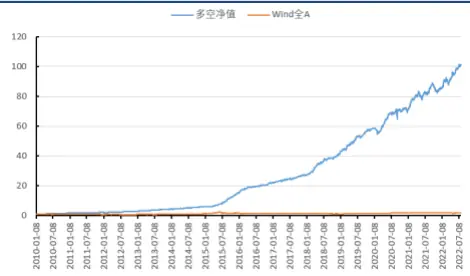
数据来源：天软科技, Wind, 广发证券发展研究中心

表：绩优因子多空表现

| 因子名 | 多空年化 | 多空夏普 |
| --- | --- | --- |
| SRJV_week | 45.97% | 4.40 |
| RJVP_week | 43.85% | 3.45 |
| RLJVP_week | 42.16% | 4.13 |
| SRLJV_week | 37.19% | 4.05 |

数据来源：天软科技, Wind, 广发证券发展研究中心

[分析师：Table_Author]周飞鹏

同SAC 执证号：S0260521120003

021-38003649

zhoufeipeng@gf.com.cn

分析师： 罗军

SAC 执证号：S0260511010004

020-66335128

luojun@gf.com.cn

分析师： 安宁宁

SAC 执证号：S0260512020003

SFC CE No. BNW179

0755-23948352

anningning@gf.com.cn

请注意，周飞鹏,罗军并非香港证券及期货事务监察委员会的注册持牌人，不可在香港从事受监管活动。

## [Table_ 相关研究：DocRe

金融工程:——风险溢价视角 2022-06-14下的股债“固收+”策略

日内价量数据因子化研究:高 2022-06-06频数据因子研究系列八

中国经济综合领先指数:方法 2022-06-01与实践

## 一、背景介绍

波动率研究在资产定价及风险管理中具有重要作用，而如何更准确地估计波动率以及如何从中提取出Alpha信息一直是学界的热门话题。早在上世纪80年代，Merton（1980）在 $\langle\langle\mathsf{O}\mathsf{n}$ Estimating the Expected Return on the Market: An ExploratoryInvestigation》中就提出高频股价收益率可以用于准确地估计波动率。然而这一推论是建立在资产价格的连续扩散模型之上的，这一假设在实证研究中往往不能得到满足。虽然近年来利用高频股价数据开展的研究越来越多，但是直接利用高频数据进行波动率建模仍然十分困难。学术界利用高频数据估计波动率的一个重要研究成果是Andersen等（2001）在《The Distribution of Realized Exchange Rate Volatility》中提出的已实现波动率，这一简单的估计方式在预测波动率方面已被反复验证要优于许多经典连续时间模型的估计结果。然而较为可惜的是，随后大量的实证研究表明已实现波动率对资产收益率的预测效果有限。

另一方面，越来越多的研究表明资产价格不能用简单的连续时间模型来刻画，而应该将资产价格中的不连续变化（即跳跃）考虑在内。随着Barndorff和Shephard（2004）在《Power and Bipower Variation with Stochastic Volatility and Jumps》中利用股价的跳跃—扩散模型从理论上证明可以将资产价格波动率中的跳跃部分分离出来，这使得研究股价波动率中的跳跃部分对资产收益率的预测成为可能。在此基础上，随后的许多学术研究尝试从不同方面对股价波动率的跳跃部分进行分解，以寻找其中更显著的资产定价信息。

我们看到目前业界在A股上利用股价跳跃模型进行因子实证的研究还较少，因此本报告试图梳理相关的学术研究成果，并构建一系列衍生日内跳跃波动因子进行A股实证研究。

## 二、研究进展

一般的，假设股票价格遵循几何布朗运动且在考虑股价变化存在跳跃的情况下，对数股票价格 ${\bf-}p_{t}$ 满足如下跳跃—扩散模型：

$$
\begin{array}{r}{p_{t}=p_{0}+\int_{0}^{t}\mu_{s}ds+\int_{0}^{t}\sigma_{s}dW_{s}+\sum_{0\leq\tau\leq t}J_{\tau},}\end{array}
$$

上式中等式右边第二至第四项分别表示股价变化中的漂移过程、扩散过程和跳跃过程， $W_{s}$ 表示标准布朗运动。Andersen等（2001）以此模型为基础推导出利用高频数据计算的已实现方差（也称作已实现波动率） $\begin{array}{r}{RV_{t}=\sum_{i=1}^{N}r_{t_{i}}^{2}}\end{array}$ （这里 $r_{t_{i}}$ 表示第t天第i个高频区间内股价的对数收益率）收敛于 $p_{t}$ 的二次变分 $\begin{array}{r}{\cdot QV_{t}=\int_{0}^{t}\sigma_{s}^{2}ds+\sum_{\tau\leq t}\Delta J_{\tau}^{2}}\end{array}$ 而之前的研究已经证明了 $QV_{t}$ 度量了股价收益率的波动率（这里 $QV_{t}$ 的表达式中，第一项 $\begin{array}{r}{IV_{t}=\int_{0}^{t}\sigma_{s}^{2}ds}\end{array}$ 表示积分波动率，刻画了股价连续分量的波动水平，而第二项$\begin{array}{r}{QJ_{t}=\sum_{\tau\leq t}\Delta J_{\tau}^{2}}\end{array}$ 则表示跳跃波动，刻画的是股价跳跃部分的波动水平）。随后的实证研究表明已实现波动率对股票收益率的预测能力有限，而其跳跃部分的波动或蕴含更高的Alpha信息，下面具体论述相关研究。

为了从实证角度分解出已实现波动率的跳跃分量，Barndorff和Shephard（2004）通过理论推导证明上述积分波动率 $IV_{t}$ 可以用多幂次变差来进行有效地估计：

$$
\begin{array}{r}{\widehat{IV}_{t}=\mu_{m}^{-2/m}\sum_{i=k}^{n}\big|r_{t_{i}}\big|^{\mathrm{m}}\big|r_{t_{i-1}}\big|^{\mathrm{m}}\dots\big|r_{t_{i-k+1}}\big|^{\mathrm{m}},}\end{array}
$$

（其中 $\mu_{m}\equiv2^{m/2}\Gamma((k+1)/2)/\Gamma(1/2)$ 2 $km=2)$ 。据此我们可以构建出已实现波动率的跳跃分量。考虑到 $QJ_{t}\geq0$ ，因此可以用已实现跳跃波动来作为QJ_t的估计量。

$$
RJV_{t}=max{\big(}RV_{t}-{\widehat{IV}}_{t},0{\big)}
$$

另外，Barndorff等（2010）在《Measuring Downside Risk-Realised Semivariance》中首次将已实现波动率分解为上行分量（即上行波动率 $\begin{array}{r}{RV_{t}^{+}=\sum_{i=1}^{N}r_{t_{i}}^{2}\pmb{I}_{\left\{r_{t_{i}}>0\right\}})}\end{array}$ 和下行分量（即下行波动率 $\begin{array}{r}{RV_{t}^{-}=\sum_{i=1}^{N}r_{t_{i}}^{2}I_{\left\{r_{t_{i}}<0\right\}})}\end{array}$ ，并且证明 $RV_{t}^{+}$ 和 $RV_{t}^{-}$ 分别依概率收敛于上行跳跃波动和下行跳跃波动加上积分波动率的一半，即： $RV_{t}^{+}\overset{p}{}\frac{1}{2}\int_{0}^{t}\sigma_{s}^{2}ds+$ $\begin{array}{r}{\sum_{\tau\leq t}\varDelta J_{\tau}^{2}I_{\{\varDelta J_{\tau}>0\}},RV_{t}^{-}\stackrel{p}{}\frac12\int_{0}^{t}\sigma_{s}^{2}ds+\sum_{\tau\leq t}\varDelta J_{\tau}^{2}I_{\{\varDelta J_{\tau}<0\}}}\end{array}$ 。他们认为上行波动率和下行波动率对于股价预测具有不同的作用，这一猜测在后来的实证研究中得到了证实。

在此基础之上，Bollerslev等（2020）在论文《Good Volatility, Bad Volatility, and theCross Section of Stock Returns》中构建了将上行波动率减去下行波动率的因子

$$
SJ_{t}=RV_{t}^{+}-RV_{t}^{-},
$$

从理论推导结果来看，这一因子反映了跳跃波动的不对称性（即正向跳跃减负向跳跃）。除此之外他们还构建了这一因子的归一化因子：

$$
\begin{array}{r}{RSJ_{t}=\frac{RV_{t}^{+}-RV_{t}^{-}}{RV_{t}},}\end{array}
$$

并且从实证角度证实这一归一化因子对收益率的预测作用更显著。

进一步地，Aït-Sahalia和Jacod（2012）在《Analyzing the spectrum of asset returns:Jump and volatility components in high frequency data》中给出了将已实现波动率的跳跃分量分解为大程跳跃波动和小程跳跃波动的方法，并且推测不同的分量对于收益率预测具有不同的作用。这一推测后来被Duong和Swanson（2015）在《Empirical evidence on the importance of aggregation, asymmetry, and jumps forvolatility prediction》中的实证结果所证实。其中他们构建的大程跳跃波动因子为：

$$
\begin{array}{r}{RLJV_{t}=min\Big(RJV_{t},\sum_{i=1}^{n}r_{i,t}^{2}I_{\{|r_{i,t|}>\gamma\}}\Big),}\end{array}
$$

小程跳跃波动因子为：

$$
RSJV_{t}=RJV_{t}-LRJV_{t}
$$

（这里γ为阈值参数）。

综合上述研究，Yu等（2020）在《New Evidence of the Marginal Predictive Contentof Small and Large Jumps in the Cross-Section》中分别从大小和方向（上行、下行）这两个维度构建跳跃波动的分量因子进行实证研究，他们发现不同因子对股价收益率预测具有不同的作用。具体的，他们构建了以下9个因子：

（1） 上行跳跃波动因子： $RJVP_{t}=max\big(RV_{t}^{+}-\widehat{IV}_{t}/2,0\big),$

（2） 下行跳跃波动因子： $RJVN_{t}=max\big(RV_{t}^{-}-\widehat{IV}_{t}/2,0\big)$

（3） 上下行跳跃波动不对称因子： $SRJV_{t}=RJVP_{t}-RJVN_{t}$

（4） 大程上行跳跃波动因子： $\begin{array}{r}{RLJVP_{t}=min\Big(RJVP_{t},\sum_{i=1}^{n}r_{i,t}^{2}I_{\left\{r_{i,t}\geq\gamma\right\}}\Big),}\end{array}$

（5） 大程下行跳跃波动因子： $\begin{array}{r}{RLJVN_{t}=min\Big(RJVN_{t},\sum_{i=1}^{n}r_{i,t}^{2}I_{\left\{r_{i,t}\leq-\gamma\right\}}\Big),}\end{array}$

（6） 大程上下行跳跃波动不对称因子： $SRLJV_{t}=RLJVP_{t}-RLJVN_{t},$

（7） 小程上行跳跃波动因子： $RSJVP_{t}=RJVP_{t}-RLJVP_{t},$

（8） 小程下行跳跃波动因子： $\begin{array}{r}{RSJVN_{t}=RJVN_{t}-RLJVN_{t},}\end{array}$

（9） 小程上下行跳跃波动不对称因子： $SRSJV_{t}=RSJVP_{t}-RSJVN_{t}.$

本报告综合Duong和Swanson（2015）、Bollerslev等（2020）、Yu等（2020）对于跳跃波动因子的构建思路，对他们所构建的跳跃波动因子及其对应的用已实现波动率进行归一化的因子构建了26种日度因子。并利用日度因子值分别构建周度和月度均值因子展开实证分析。下图展示了跳跃波动类型因子构建框架：

图 1：跳跃波动类型因子构建框架
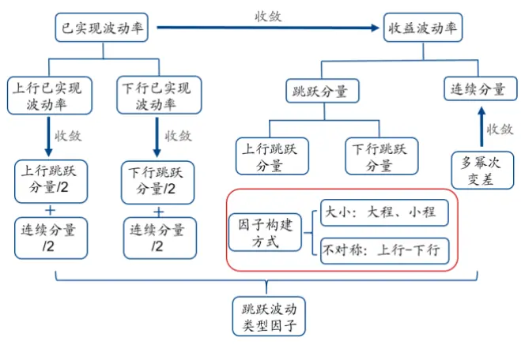
数据来源：广发证券发展研究中心

## 三、实证分析

## （一）数据说明

选股范围：全A市场

股票预处理：剔除ST/ST*、涨跌停板、上市未满60个交易日股票

因子预处理：去极值、标准化、行业市值中性化

回测区间：2010.01.01 - 2022.07.29

分档方式：根据当期股票的因子值，从小到大分为十档

调仓周期：每周/每月最后一个交易日以收盘价调仓

交易费用：双边千三

## （二）因子构建说明

本节利用5分钟数据频率构建已实现跳跃波动类型因子，选择5分钟数据频率是因为研究表明数据频率太低与太高都会导致估计不准确，因此这里选择与大部分实证研究相同的数据频率进行测试，本文第五章会展示不同数据频率构建下的因子表现。其中 $\widehat{IV}_{t}$ 我们用和Yu等（2020）中相同的三幂次变差进行计算，即 $\widehat{IV}_{t}=$ $\begin{array}{r}{\mu_{m}^{-2/m}\sum_{i=k}^{n}\left|r_{t_{i}}\right|^{\mathrm{m}}\left|r_{t_{i-1}}\right|^{\mathrm{m}}\ldots\left|r_{t_{i-k+1}}\right|^{\mathrm{m}},(k=3,m=2/3)}\end{array}$ ；另外在构建大程、小程跳跃变化因子时选用的阈值γ也与Yu等（2020）的构建方式相同 $(\gamma=\alpha N^{-0.49}\sqrt{IV_{t}}$ ，这里N等于一天中股价数据个数，α为经验参数），本报告中α选择为Yu等（2020）测试中表现较好的参数值α = 4，第五章同样将对α进行参数敏感性分析。本报告中构建的周度均值因子和月度均值因子分别是用调仓日前5个交易日和前20个交易日的日度因子通过计算均值得到，相应的调仓周期分别为一周和一个月。因子的具体描述如下：

表1：已实现跳跃波动类因子描述

| 因子名 | 因子描述 |
| --- | --- |
| RJV(RRJV，括号中代表归一化因子，下同) | 已实现跳跃波动 |
| SJ（(RSJ) | 已实现跳跃波动不对称 |
| RJVP（RRJVP) | 已实现上行跳跃波动 |
| RJVN（RRJVN) | 已实现下行跳跃波动 |
| SRJV（RSRJV) | 上下行跳跃波动不对称 |
| RLJV（RRLJV) | 已实现大程跳跃波动 |
| RSJV（RRSJV) | 已实现小程跳跃波动 |
| RLJVP(RRLJVP) | 已实现上行大程跳跃波动 |
| RLJVN（RRLJVN) | 已实现下行大程跳跃波动 |

识别风险，发现价值

| SRLJV(RSRLJV) | 上下行大程跳跃波动不对称 |
| --- | --- |
| RSJVP(RRSJVP) | 已实现上行小程跳跃波动 |
| RSJVN(RRSJVN) | 已实现下行小程跳跃波动 |
| SRSJV(RSRSJV) | 上下行小程跳跃波动不对称 |

数据来源：广发证券发展研究中心

## （三）因子分档表现

按照是否归一化及调仓频率进行分类，本小节分别展示周度未归一化因子、周度归一化因子、月度未归一化因子、月度归一化因子的分档表现。

## 1. 周度未归一化因子分档表现

对于周度未归一化因子，可以发现有6个因子的分档表现单调性较好，分别是RJV_week、RJVP_week、SRJV_week、RLJV_week、RLJVP_week、SRLJV_week。

图 2：RJV_week因子十档表现
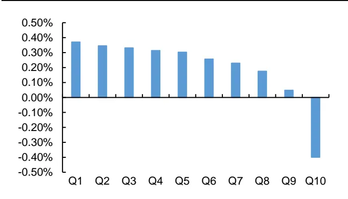
数据来源：天软科技，Wind，广发证券发展研究中心

图 3：SJ_week因子十档表现
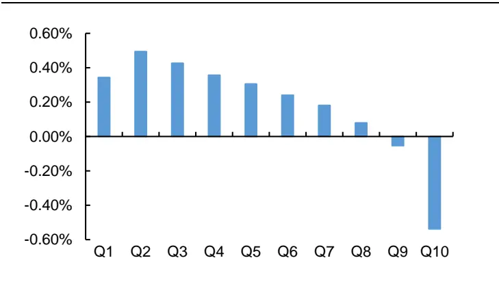
数据来源：天软科技，Wind，广发证券发展研究中心

图 4：RJVP_week因子十档表现
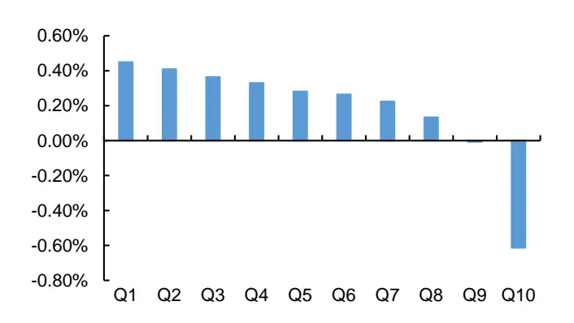
数据来源：天软科技，Wind，广发证券发展研究中心

图 5：RJVN_week因子十档表现
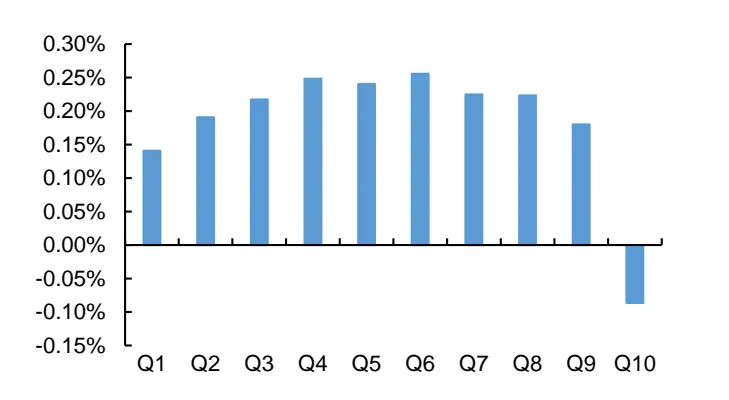
数据来源：天软科技，Wind，广发证券发展研究中心

图 6：SRJV_week因子十档表现
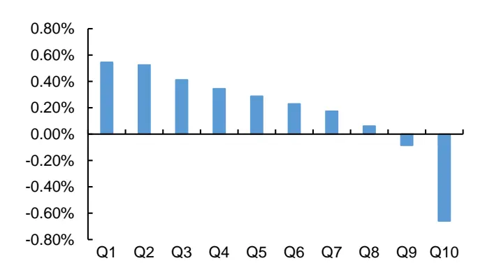
数据来源：天软科技，Wind，广发证券发展研究中心

图 7：RLJV_week因子十档表现
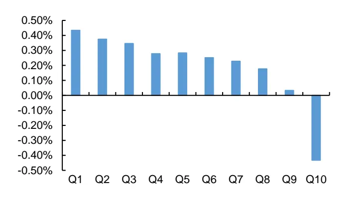
数据来源：天软科技，Wind，广发证券发展研究中心

图 8：RSJV_week因子十档表现
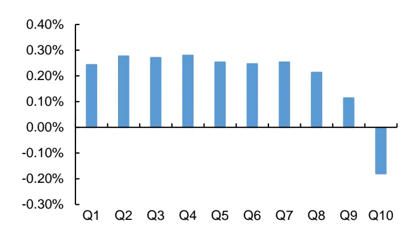
数据来源：天软科技，Wind，广发证券发展研究中心

图 9：RLJVP_week因子十档表现
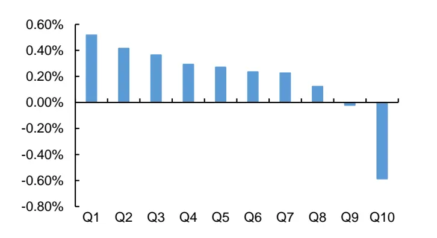
数据来源：天软科技，Wind，广发证券发展研究中心

图 10：RLJVN_week因子十档表现
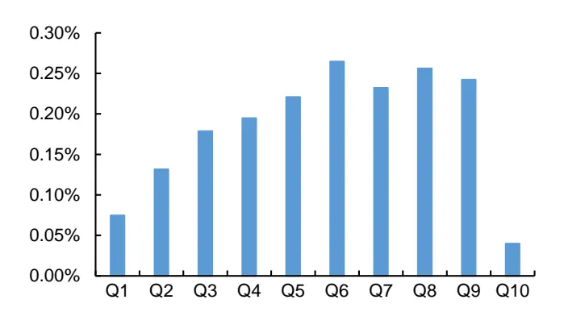
数据来源：天软科技，Wind，广发证券发展研究中心

图 11：SRLJV_week因子十档表现
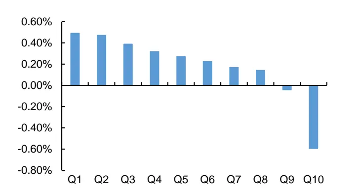
数据来源：天软科技，Wind，广发证券发展研究中心

图 12：RSJVP_week因子十档表现
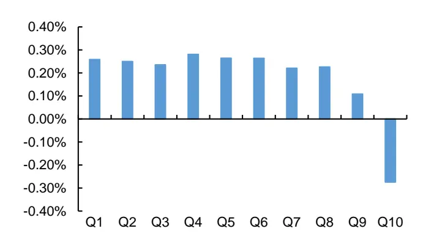
数据来源：天软科技，Wind，广发证券发展研究中心

图 13：RSJVN_week因子十档表现
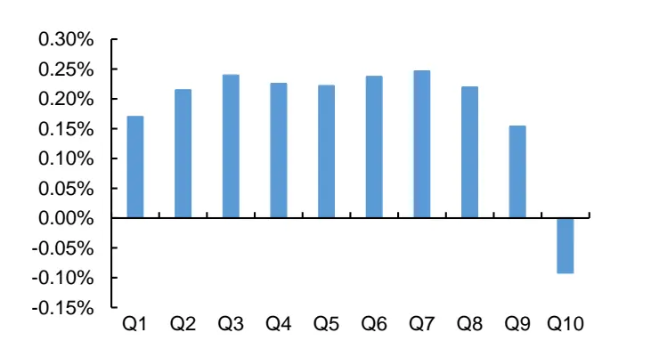
数据来源：天软科技，Wind，广发证券发展研究中心

图 14：SRSJV_week因子十档表现
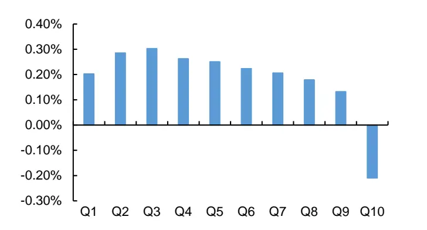
数据来源：天软科技，Wind，广发证券发展研究中心

## 2. 周度归一化因子分档表现

对于周度归一化因子，7个因子的分档表现单调性较好，分别是RRJVP_week、 RSRJV_week、RRLJV_week、RRLJVP_week、RSRLJV_week、RRJVN_week 、 RRLJVN_week，其中前5个因子对应的未归一化因子分档表现单调性也较好。

图 15：RRJV_week因子十档表现
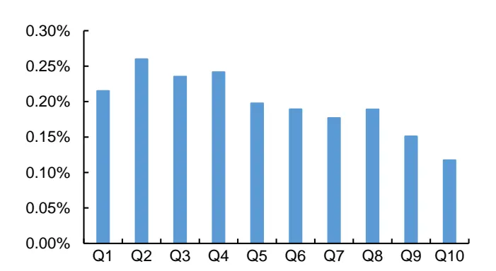
数据来源：天软科技，Wind，广发证券发展研究中心

图 16：RSJ_week因子十档表现
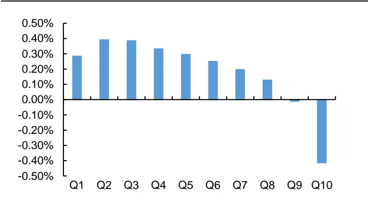
数据来源：天软科技，Wind，广发证券发展研究中心

图 17：RRJVP_week因子十档表现
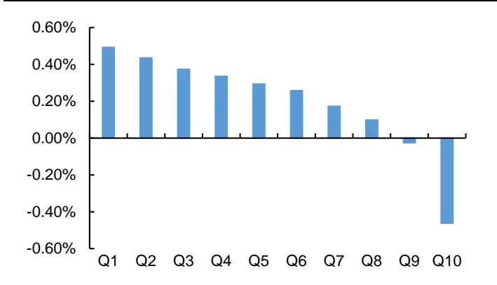
数据来源：天软科技，Wind，广发证券发展研究中心

图 18：RRJVN_week因子十档表现
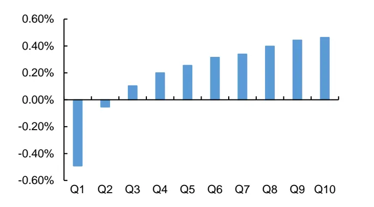
数据来源：天软科技，Wind，广发证券发展研究中心

图 19：RSRJV_week因子十档表现
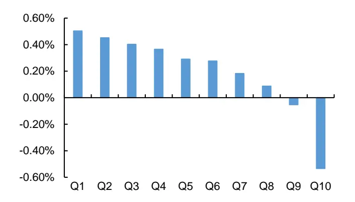
数据来源：天软科技，Wind，广发证券发展研究中心

图 20：RRLJV_week因子十档表现
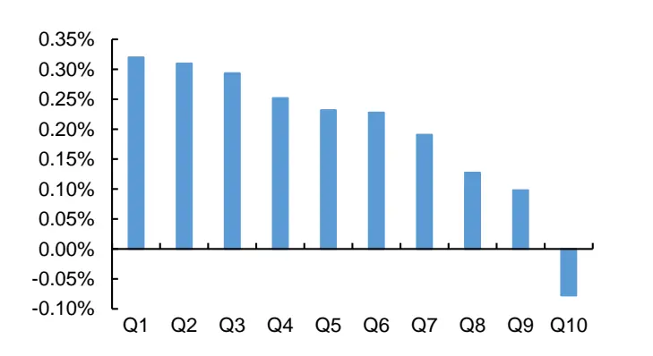
数据来源：天软科技，Wind，广发证券发展研究中心

图 21：RRSJV_week因子十档表现
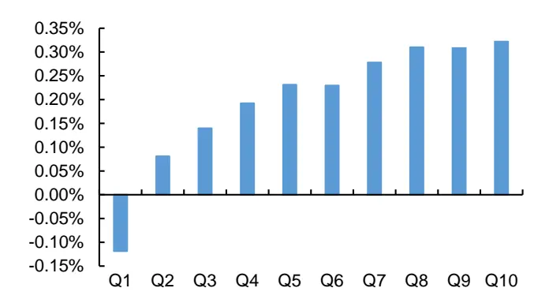
数据来源：天软科技，Wind，广发证券发展研究中心

图 22：RRLJVP_week因子十档表现
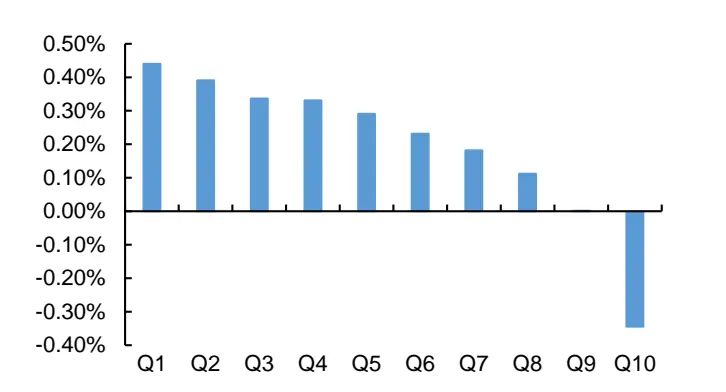
数据来源：天软科技，Wind，广发证券发展研究中心

图 23：RRLJVN_week因子十档表现
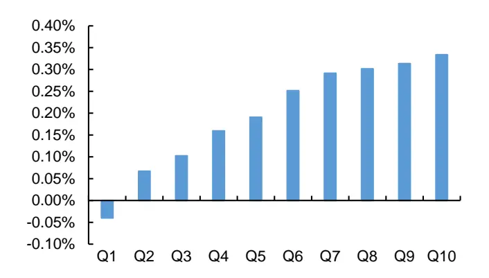
数据来源：天软科技，Wind，广发证券发展研究中心

图 24：RSRLJV_week因子十档表现
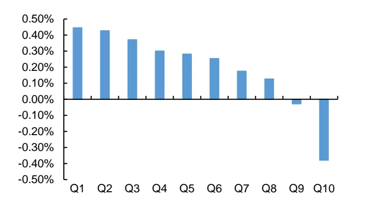
数据来源：天软科技，Wind，广发证券发展研究中心

图 25：RRSJVP_week因子十档表现
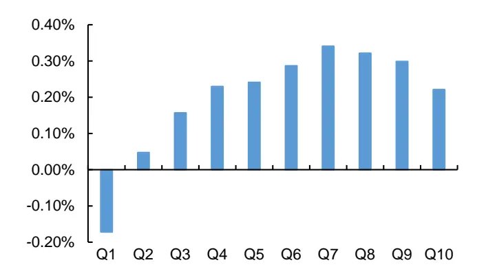
数据来源：天软科技，Wind，广发证券发展研究中心

图 26：RRSJVN_week因子十档表现
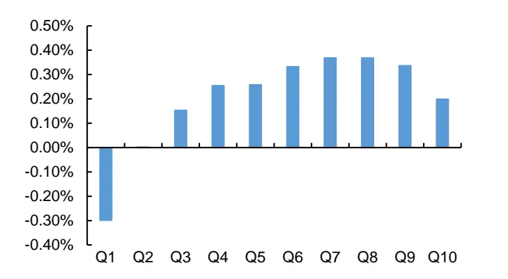
数据来源：天软科技，Wind，广发证券发展研究中心

图 27：RSRSJV_week因子十档表现
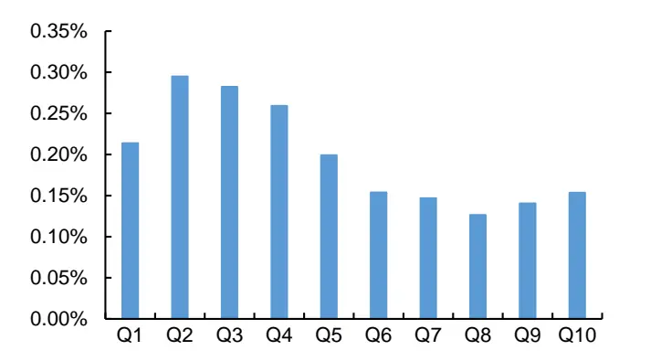
数据来源：天软科技，Wind，广发证券发展研究中心

## 3. 月度未归一化因子分档表现

月度未归一化跳跃波动因子的分档单调性普遍不明显，仅SRJV_month、SRLJV_month两因子相对较好。

图 28：RJV_month因子十档表现
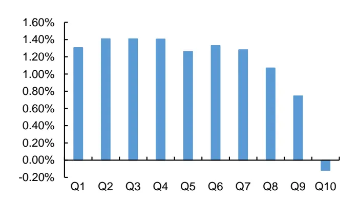
数据来源：天软科技，Wind，广发证券发展研究中心

图 29：SJ_month因子十档表现
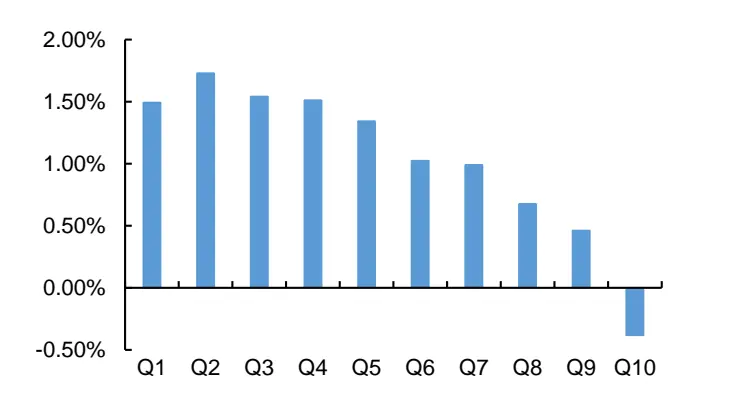
数据来源：天软科技，Wind，广发证券发展研究中心

图 30：RJVP_month因子十档表现
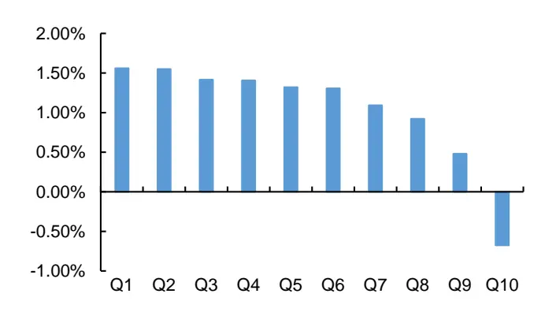
数据来源：天软科技，Wind，广发证券发展研究中心

图 31：RJVN_month因子十档表现
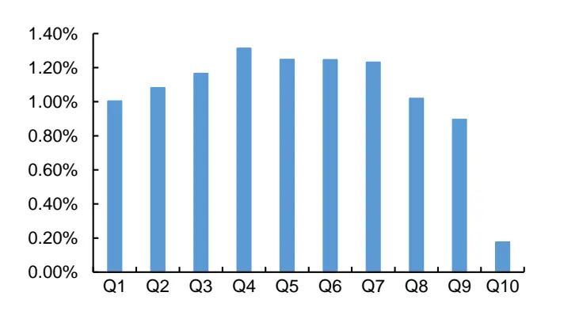
数据来源：天软科技，Wind，广发证券发展研究中心

图 32：SRJV_month因子十档表现
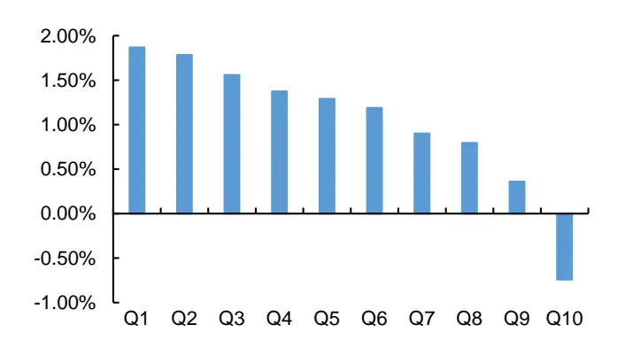
数据来源：天软科技，Wind，广发证券发展研究中心

图 33：RLJV_month因子十档表现
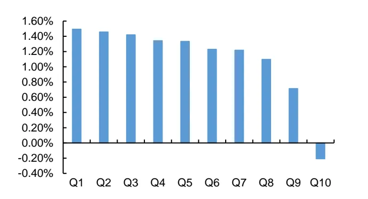
数据来源：天软科技，Wind，广发证券发展研究中心

图 34：RSJV_month因子十档表现
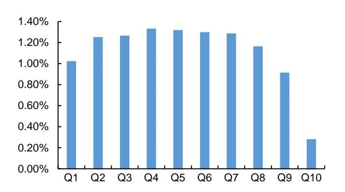
数据来源：天软科技，Wind，广发证券发展研究中心

图 35：RLJVP_month因子十档表现
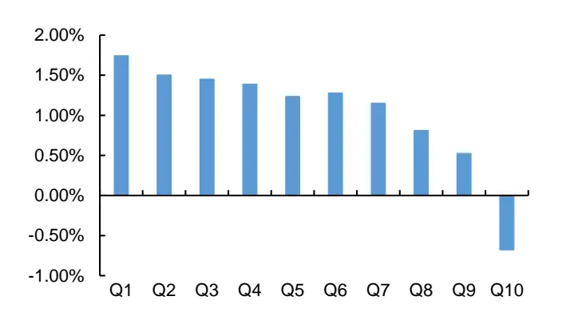
数据来源：天软科技，Wind，广发证券发展研究中心

图 36：RLJVN_month因子十档表现
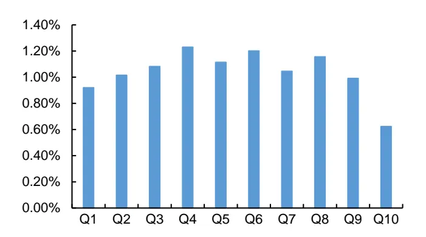
数据来源：天软科技，Wind，广发证券发展研究中心

图 37：SRLJV_month因子十档表现
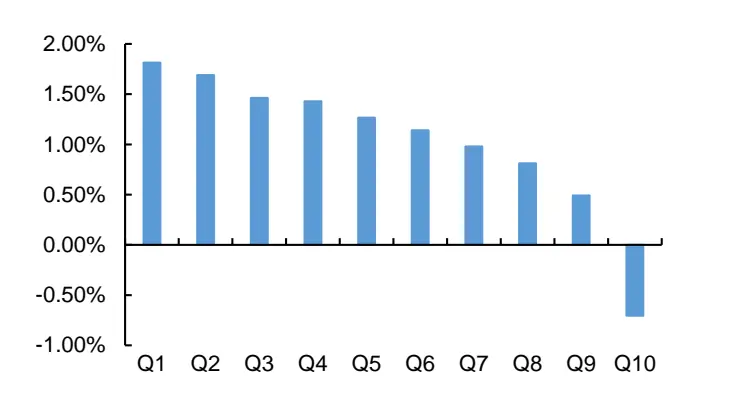
数据来源：天软科技，Wind，广发证券发展研究中心

图 38：RSJVP_month因子十档表现
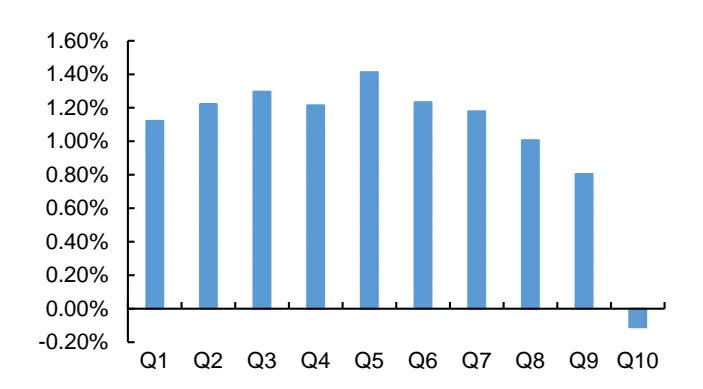
数据来源：天软科技，Wind，广发证券发展研究中心

图 39：RSJVN_month因子十档表现
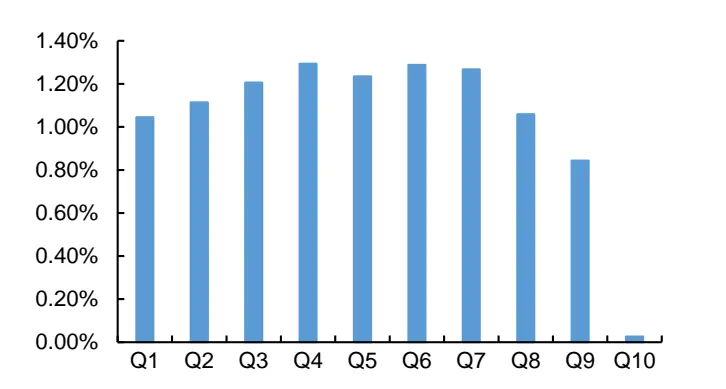
数据来源：天软科技，Wind，广发证券发展研究中心

图 40：SRSJV_month因子十档表现
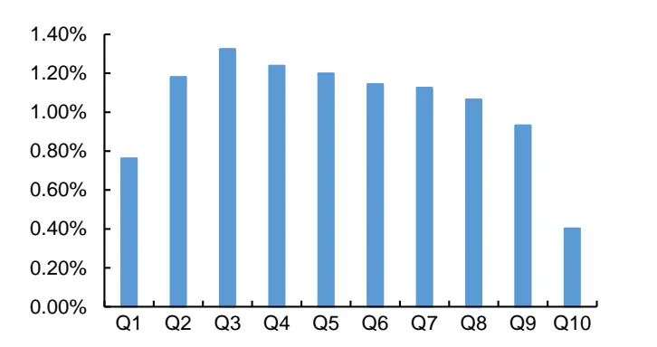
数据来源：天软科技，Wind，广发证券发展研究中心

## 4. 月度归一化因子分档表现

月度归一化因子的分档表现相比月度未归一化因子有所提升，其中RRJVP_month、RRJVN_month、RSRJV_month、RSRLJV_month因子分组单调性较好。但整体而言，月度归一化因子相比周度因子单调性仍有一定程度弱化。

图 41：RRJV_month因子十档表现
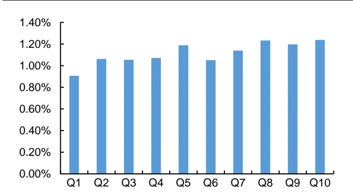
数据来源：天软科技，Wind，广发证券发展研究中心

图 42：RSJ_month因子十档表现
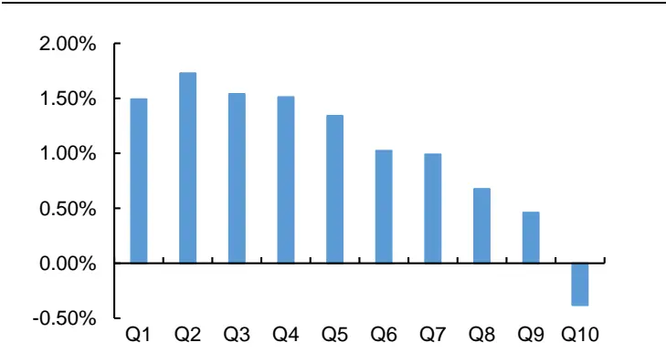
数据来源：天软科技，Wind，广发证券发展研究中心

图 43：RRJVP_month因子十档表现
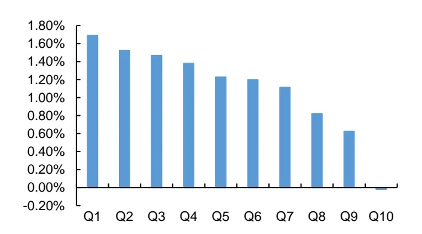
数据来源：天软科技，Wind，广发证券发展研究中心

图 44：RRJVN_month因子十档表现
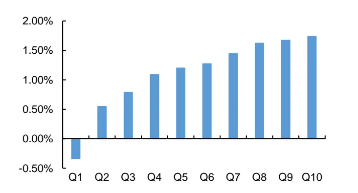
数据来源：天软科技，Wind，广发证券发展研究中心

图 45：RSRJV_month因子十档表现
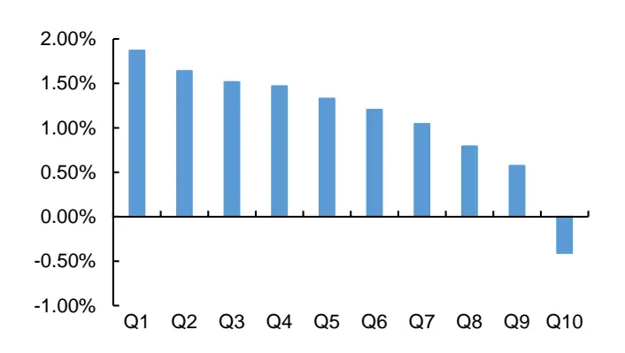
数据来源：天软科技，Wind，广发证券发展研究中心

图 46：RRLJV_month因子十档表现
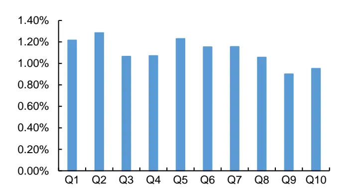
数据来源：天软科技，Wind，广发证券发展研究中心

图 47：RRSJV_month因子十档表现
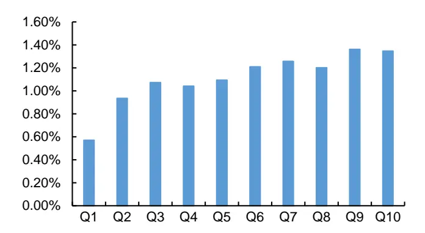
数据来源：天软科技，Wind，广发证券发展研究中心

图 48：RRLJVP_month因子十档表现
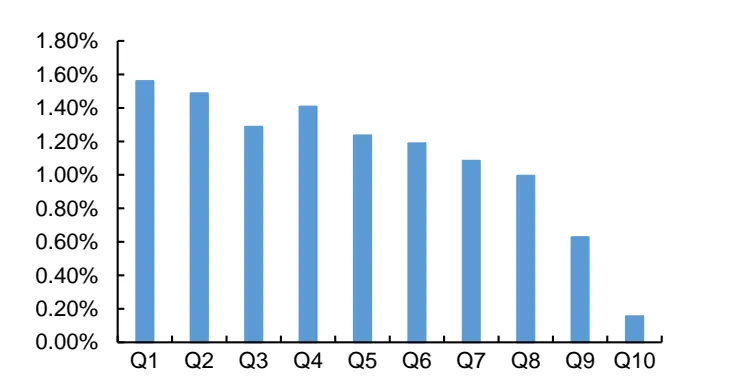
数据来源：天软科技，Wind，广发证券发展研究中心

图 49：RRLJVN_month因子十档表现
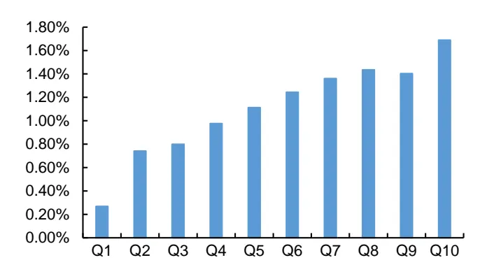
数据来源：天软科技，Wind，广发证券发展研究中心

图 50：RSRLJV_month因子十档表现
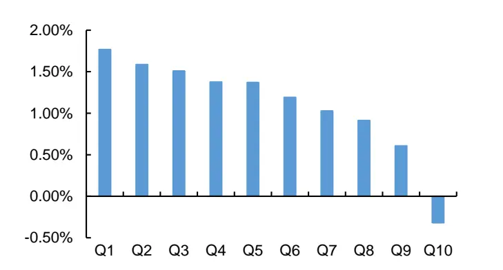
数据来源：天软科技，Wind，广发证券发展研究中心

图 51：RRSJVP_month因子十档表现
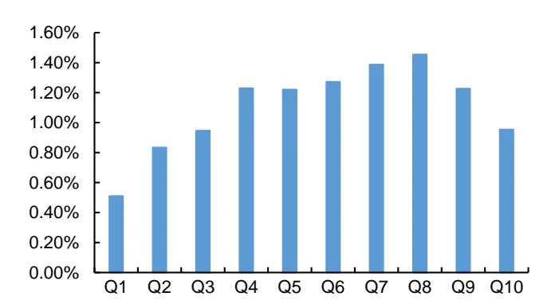
数据来源：天软科技，Wind，广发证券发展研究中心

图 52：RRSJVN_month因子十档表现
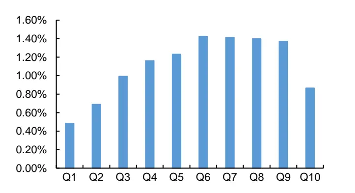
数据来源：天软科技，Wind，广发证券发展研究中心

图 53：RSRSJV_month因子十档表现
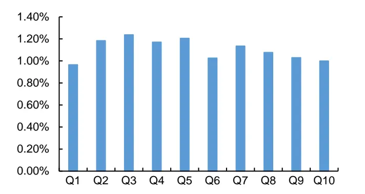
数据来源：天软科技，Wind，广发证券发展研究中心

整体来看，周度跳跃波动因子的分档表现单调性较月度因子更明显，另外归一化对因子分档表现并没有显著的提升效果。下面将详细展示上述因子的IC和多空表现。

## （四）因子绩效表现

## 1. 周度未归一化因子绩效表现

周度未归一化跳跃波动因子的因子覆盖度为86.56%，所有因子均表现出负IC的特征，其中综合表现最优的因子是SRJV_week：IC均值-8.76%、年化ICIR-8.91、周度IC胜率近90%、t值-31.33，多空年化录得45.97%、多空夏普4.4，周均双边换手为1.63。此外，还有3个因子表现亦十分优异，IC与多空业绩与SRJV_week接近，分别是RJVP_week、RLJVP_week和SRLJV_week因子，多空收益均在40%上下。后文我们将对这4个绩优因子进一步展开分析。

表 2：周度未归一化因子绩效表现

| 因子名 | 因子 覆盖度 | IC 均值 | 年化 ICIR | IC 胜率 | t值 | 多空 | 多空 夏普 | 多空 最大回撤 | 多空 Calmar | 多空双边 换手率 |  |
| --- | --- | --- | --- | --- | --- | --- | --- | --- | --- | --- | --- |
|  |  |  |  |  |  |  |  |  |  |  | 年化 |
| RJV_week | 86.56% | -7.19% | -5.61 | 79.32% | -19.73 | 25.65% | 1.90 | 16.12% | 1.59 | 1.22 |  |
| SJ_week | 86.56% | -7.24% | -6.88 | 84.45% | -24.19 | 21.24% | 1.91 | 14.63% | 1.45 | 1.68 |  |
| RJVP_week | 86.56% | -8.58% | -7.29 | 84.91% | -25.64 | 43.85% | 3.45 | 12.84% | 3.42 | 1.31 |  |
| RJVN_week | 86.56% | -3.39% | -2.63 | 66.10% | -9.24 | -5.61% | -0.41 | 65.58% | -0.09 | 1.23 |  |
| SRJV_week | 86.56% | -8.76% | -8.91 | 89.27% | -31.33 | 45.97% | 4.40 | 9.58% | 4.80 | 1.63 |  |
| RLJV_week | 86.56% | -7.10% | -7.09 | 85.07% | -24.95 | 26.47% | 2.51 | 11.88% | 2.23 | 1.44 |  |
| RSJV_week | 86.56% | -4.93% | -3.81 | 72.63% | -13.39 | 4.68% | 0.34 | 23.63% | 0.20 | 1.24 |  |
| RLJVP_week | 86.56% | -8.26% | -8.68 | 88.49% | -30.51 | 42.16% | 4.13 | 9.07% | 4.65 | 1.49 |  |
| RLJVN_week | 86.56% | -0.63% | -0.86 | 57.85% | -3.02 | -20.47% | -2.57 | 93.90% | -0.22 | 1.59 |  |
| SRLJV_week | 86.56% | -7.88% | -9.57 | 90.00% | -33.65 | 37.19% | 4.05 | 8.54% | 4.35 | 1.62 |  |
| RSJVP_week | 86.56% | -4.95% | -4.18 | 72.94% | -14.71 | 10.26% | 0.76 | 20.48% | 0.50 | 1.25 |  |
| RSJVN_week | 86.56% | -3.86% | -2.98 | 67.96% | -10.48 | -3.64% | -0.26 | 56.92% | -0.06 | 1.23 |  |
| SRSJV_week | 86.56% | -2.01% | -2.78 | 64.70% | -9.79 | -4.59% | -0.56 | 64.00% | -0.07 | 1.65 |  |

数据来源：天软科技，Wind，广发证券发展研究中心

## 2. 周度归一化因子绩效表现

相比未归一化因子，归一化后只有RRJVN_week和RRLJVN_week因子IC表现有所提升，其余因子IC均有一定程度减弱。多空表现方面，只有RRJVN_week、RRLJVN_week和RRSJVN_week因子多空收益有所提升，其余因子表现减弱；RSRJV_week因子录得IC均值-7.24%、多空年化30.40%，相对表现最优。周度未归一化因子中4个绩优因子在归一化之后多空表现仍然相对较好。

表 3：周度归一化因子绩效表现

| 因子名 | 因子 覆盖度 | IC 均值 | 年化 ICIR | IC 胜率 | t值 | 多空 年化 | 多空 夏普 | 多空 最大回撤 | 多空 Calmar | 多空双边 换手率 |
| --- | --- | --- | --- | --- | --- | --- | --- | --- | --- | --- |
| RRJV_week | 86.56% | 0.18% | 0.16 | 46.77% | 0.57 | -23.67% | -2.52 | 96.34% | -0.25 | 1.43 |
| RSJ_week | 86.56% | -5.66% | -5.11 | 77.92% | -17.96 | 8.43% | 0.76 | 20.32% | 0.41 | 1.78 |
| RRJVP_week | 86.56% | -6.00% | -5.43 | 78.23% | -19.09 | 25.08% | 2.49 | 11.62% | 2.16 | 1.72 |
| RRJVN_week | 86.56% | 7.24% | 7.26 | 85.22% | 25.52 | 26.89% | 2.74 | 9.80% | 2.74 | 1.67 |
| RSRJV_week | 86.56% | -7.24% | -7.19 | 84.45% | -25.29 | 30.40% | 3.05 | 8.98% | 3.39 | 1.75 |
| RRLJV_week | 86.56% | -2.40% | -3.18 | 69.98% | -11.18 | -5.61% | -0.73 | 51.96% | -0.11 | 1.66 |
| RRSJV_week | 86.56% | 3.20% | 5.65 | 80.56% | 19.87 | -4.11% | -0.64 | 41.95% | -0.10 | 1.71 |
| RRLJVP_week | 86.56% | -5.34% | -6.67 | 82.89% | -23.45 | 15.03% | 1.86 | 12.92% | 1.16 | 1.70 |
| RRLJVN_week | 86.56% | 3.62% | 5.36 | 78.07% | 18.86 | -6.44% | -0.87 | 57.69% | -0.11 | 1.69 |
| RSRLJV_week | 86.56% | -6.16% | -8.48 | 87.56% | -29.81 | 17.24% | 2.18 | 8.67% | 1.99 | 1.73 |
| RRSJVP_week | 86.56% | 5.24% | 4.72 | 74.03% | 16.58 | 1.53% | 0.15 | 37.38% | 0.04 | 1.29 |
| RRSJVN_week | 86.56% | 5.97% | 5.24 | 77.61% | 18.62 | 7.28% | 0.68 | 18.88% | 0.39 | 1.27 |

识别风险，发现价值

| RSRSJV_week | 86.56% | -1.22% | -1.96 | 60.81% | -6.88 | -20.88% | -3.48 | 94.28% | -0.22 | 1.66 |
| --- | --- | --- | --- | --- | --- | --- | --- | --- | --- | --- |

数据来源：天软科技，Wind，广发证券发展研究中心

## 3. 月度未归一化因子绩效表现

和周度未归一化跳跃波动因子IC表现类似，月度未归一化因子整体呈现负IC特征，月均双边换手与周平均类似，但调仓次数降低能有效降低全年换手。横向对比来看，依然是4个绩优周频因子对应的月度因子表现较好，IC均值为-9%左右，多空年化在26%-30%之间。

表 4：月度未归一化因子绩效表现

| 因子名 | 因子 覆盖度 | IC 均值 | 年化 ICIR | IC 胜率 | t值 | 多空 年化 | 多空 | 多空 最大回撤 | 多空 Calmar | 多空双边 换手率 |  |
| --- | --- | --- | --- | --- | --- | --- | --- | --- | --- | --- | --- |
|  |  |  |  |  |  |  |  |  |  |  | 夏普 |
| RJV_month | 85.96% | -7.27% | -2.61 | 80.00% | -9.22 | 15.06% | 1.25 | 17.65% | 0.85 | 1.34 |  |
| SJ_month | 85.96% | -7.96% | -4.24 | 90.00% | -14.97 | 18.88% | 2.10 | 12.29% | 1.54 | 1.72 |  |
| RJVP_month | 85.96% | -9.15% | -3.51 | 86.67% | -12.41 | 26.82% | 2.35 | 11.39% | 2.36 | 1.39 |  |
| RJVN_month | 85.96% | -5.08% | -1.79 | 70.67% | -6.32 | 7.62% | 0.58 | 20.17% | 0.38 | 1.25 |  |
| SRJV_month | 85.96% | -9.33% | -5.56 | 94.67% | -19.67 | 30.60% | 3.82 | 9.53% | 3.21 | 1.66 |  |
| RLJV_month | 85.96% | -7.32% | -3.08 | 85.33% | -10.91 | 18.11% | 1.80 | 12.84% | 1.41 | 1.45 |  |
| RSJV_month | 85.96% | -5.15% | -1.81 | 70.67% | -6.41 | 5.92% | 0.47 | 23.56% | 0.25 | 1.34 |  |
| RLJVP_month | 85.96% | -9.04% | -3.99 | 88.67% | -14.10 | 28.79% | 2.92 | 10.49% | 2.75 | 1.47 |  |
| RLJVN_month | 85.96% | -2.76% | -1.28 | 62.67% | -4.52 | -0.80% | -0.08 | 38.71% | -0.02 | 1.48 |  |
| SRLJV_month | 85.96% | -8.89% | -5.44 | 94.67% | -19.24 | 29.16% | 3.75 | 9.14% | 3.19 | 1.64 |  |
| RSJVP_month | 85.96% | -6.00% | -2.20 | 72.67% | -7.77 | 12.75% | 1.00 | 21.13% | 0.60 | 1.32 |  |
| RSJVN_month | 85.96% | -5.62% | -1.93 | 71.33% | -6.83 | 10.10% | 0.75 | 20.07% | 0.50 | 1.28 |  |
| SRSJV_month | 85.96% | -0.44% | -0.28 | 50.67% | -1.00 | -1.94% | -0.28 | 47.06% | -0.04 | 1.69 |  |

数据来源：天软科技，Wind，广发证券发展研究中心

## 4. 月度归一化因子绩效表现

月度因子归一化后，各因子中仅RSJ_month和RRJVN_month IC有所提升，其余因子IC表现均有一定程度降低。多空表现方面，RSRJV_month因子录得相对较高的年化收益为24.17%，另有三个因子多空年化超过20%，但整体看较归一化前业绩表现有所弱化。

表 5：月度归一化因子绩效表现

| 因子名 | 因子 覆盖度 | IC 均值 | 年化 ICIR | IC 胜率 | t值 | 多空 年化 | 多空 | 多空 | 多空 Calmar | 多空双边 换手率 |  |
| --- | --- | --- | --- | --- | --- | --- | --- | --- | --- | --- | --- |
|  |  |  |  |  |  |  |  |  |  |  | 夏普 |
| RRJV_month | 85.96% | 2.45% | 0.83 | 58.67% | 2.92 | 0.29% | 0.03 | 最大回撤 31.21% | 0.01 | 1.20 |  |
| RSJ_month | 85.96% | -7.97% | -4.24 | 90.00% | -14.92 | 18.88% | 2.10 | 12.29% | 1.54 | 1.72 |  |
| RRJVP_month | 85.96% | -4.79% | -1.96 | 71.33% | -6.92 | 15.60% | 1.83 | 14.85% | 1.05 | 1.64 |  |
| RRJVN_month | 85.96% | 7.82% | 3.50 | 84.67% | 12.38 | 22.63% | 2.53 | 14.87% | 1.52 | 1.53 |  |
| RSRJV_month | 85.96% | -7.43% | -4.33 | 92.00% | -15.31 | 24.17% | 3.23 | 7.28% | 3.32 | 1.72 |  |
| RRLJV_month | 85.96% | -0.07% | -0.03 | 52.00% | -0.12 | 2.92% | -0.32 | 44.33% | -0.07 | 1.51 |  |
| RRSJV_month | 85.96% | 2.29% | 1.68 | 68.67% | 5.94 | 3.36% | 0.52 | 24.28% | 0.14 | 1.64 |  |
| RRLJVP_month | 85.96% | -4.41% | -2.32 | 74.67% | -8.21 | 11.63% | 1.47 | 15.43% | 0.75 | 1.63 |  |
| RRLJVN_month | 85.96% | 5.62% | 2.77 | 78.00% | 9.80 | 13.26% | 1.57 | 19.43% | 0.68 | 1.56 |  |
| RSRLJV_month | 85.96% | -7.04% | -5.10 | 94.00% | -18.04 | 21.76% | 3.43 | 7.17% | 3.03 | 1.71 |  |
| RRSJVP_month | 85.96% | 4.81% | 1.87 | 68.67% | 6.60 | 1.70% | 0.17 | 23.81% | 0.07 | 1.31 |  |
| RRSJVN_month | 85.96% | 4.87% | 1.94 | 69.33% | 6.86 | 0.80% | 0.08 | 33.16% | 0.02 | 1.28 |  |
| RSRSJV_month | 85.96% | -0.28% | -0.21 | 46.00% | -0.76 | -6.72% | -1.31 | 59.07% | -0.11 | 1.68 |  |

数据来源：天软科技，Wind，广发证券发展研究中心

总结来看，上述52个跳跃波动类型因子在全市场中因子覆盖度均在85%以上，周度未归一化跳跃波动因子的表现最强。综合IC与多空表现，我们认为其中RJVP_week、SRJV_week、RLJVP_week和SRLJV_week这4个因子表现较优，下面我们进一步考察这4个绩优因子的特征与表现。

## 四、绩优因子表现分析

## （一）SRJV_week 因子表现分析

在全市场选股中，SRJV_week因子长期表现稳定，2022年因子有效性延续。全历史来看，因子IC均值为-8.76%，IC胜率为89.27%，年化ICIR为-8.91，t值为-31.33。多空组合业绩方面，年化收益为45.97%，夏普比率为4.40，Calmar比率为4.80，最大回撤为9.58%，周均双边换手率为1.63。回撤方面，多空组合在2020、2021年的回撤较此前年份有所提升，但2021年以来回归正常。因子的周度IC胜率近90%，时序IC累加曲线无明显波动。此外，因子IC半衰期约为1周。

图 54：SRJV_week因子IC值与IC累计值走势
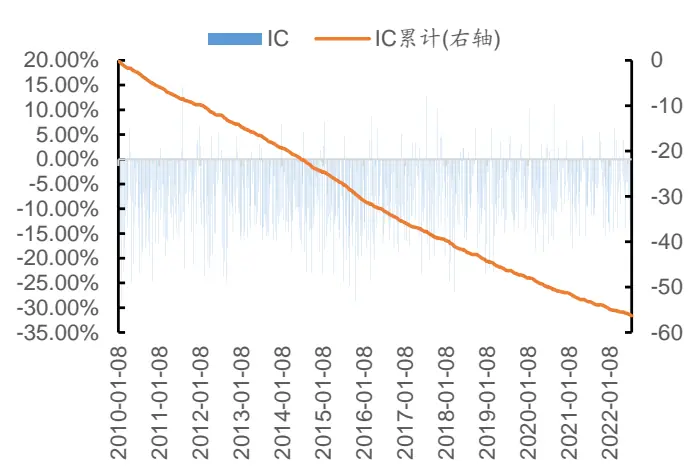
数据来源：天软科技，Wind，广发证券发展研究中心

图 55：SRJV_week因子分组净值走势
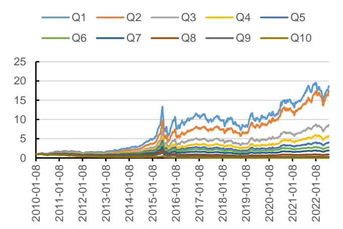
数据来源：天软科技，Wind，广发证券发展研究中心

图 56：SRJV_week因子IC衰减走势
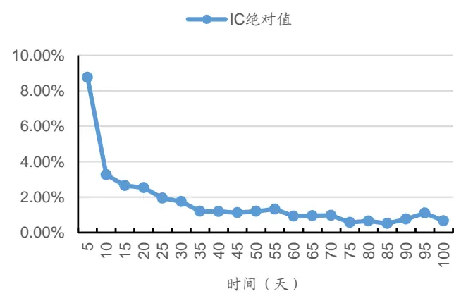
数据来源：天软科技，Wind，广发证券发展研究中心

图 57：SRJV_week因子多空净值走势
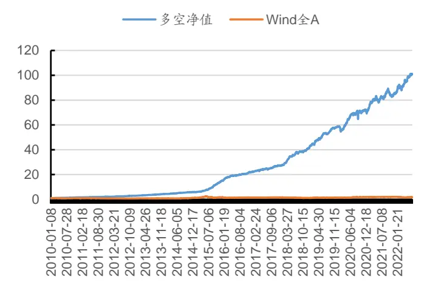
数据来源：天软科技，Wind，广发证券发展研究中心

表6：SRJV_week因子多空分年度表现

|  | 年化收益率 | 年化波动率 | 夏普比率 | 最大回撤 |
| --- | --- | --- | --- | --- |
| 2010 | 69.10% | 11.01% | 6.28 | 2.73% |
| 2011 | 27.36% | 10.02% | 2.73 | 3.83% |
| 2012 | 37.51% | 8.45% | 4.44 | 5.33% |
| 2013 | 51.17% | 9.62% | 5.32 | 3.13% |
| 2014 | 31.33% | 8.70% | 3.60 | 2.99% |
| 2015 | 159.89% | 15.80% | 10.12 | 4.72% |
| 2016 | 43.91% | 9.71% | 4.52 | 2.86% |
| 2017 | 23.06% | 9.03% | 2.55 | 4.56% |
| 2018 | 53.73% | 9.22% | 5.83 | 3.99% |
| 2019 | 41.40% | 8.19% | 5.06 | 2.64% |
| 2020 | 20.10% | 13.05% | 1.54 | 9.58% |

识别风险，发现价值

| 2021 | 20.97% | 9.95% | 2.11 | 7.64% |
| --- | --- | --- | --- | --- |
| 2022 | 35.51% | 6.90% | 5.15 | 4.99% |
| 全历史 | 45.97% | 10.45% | 4.40 | 9.58% |

数据来源：天软科技，Wind，广发证券发展研究中心

## （二）RJVP_week 因子表现分析

与SRJV_week因子类似，RJVP_week体现出稳定良好的IC及多空特征。2022年多空增长进一步提速。全历史因子IC均值为-8.58%，IC胜率为84.91%，年化ICIR为-7.29，t值为-9.24。多空组合方面，年化收益为43.85%，夏普比率为3.45，Calmar比率为3.42，最大回撤为12.84%，周均双边换手率为1.31。2020年及2021年中多空组合的回撤较此前年份有所提升，但2022年以来多空表现进一步提升，年化收益为58.27%，夏普比率为5.45，最大回撤为4.26%。此外，因子IC半衰期约1周。

图 58：RJVP_week因子IC值与IC累计值走势
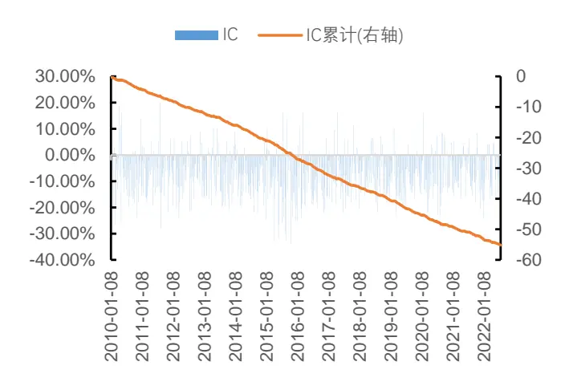
数据来源：天软科技，Wind，广发证券发展研究中心

图 59：RJVP_week因子分组净值走势
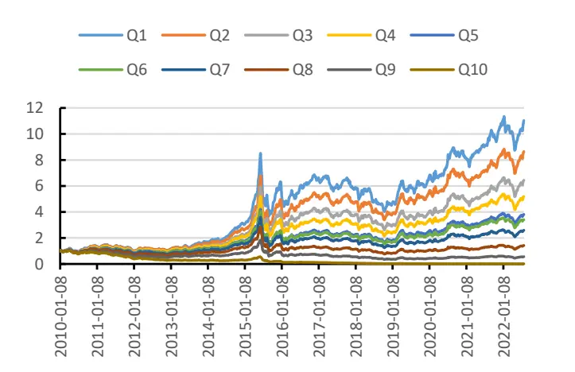
数据来源：天软科技，Wind，广发证券发展研究中心

图 60：RJVP_week因子IC衰减走势
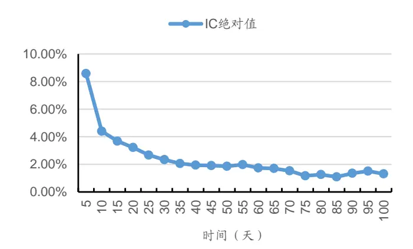
数据来源：天软科技，Wind，广发证券发展研究中心

图 61：RJVP_week因子多空净值走势
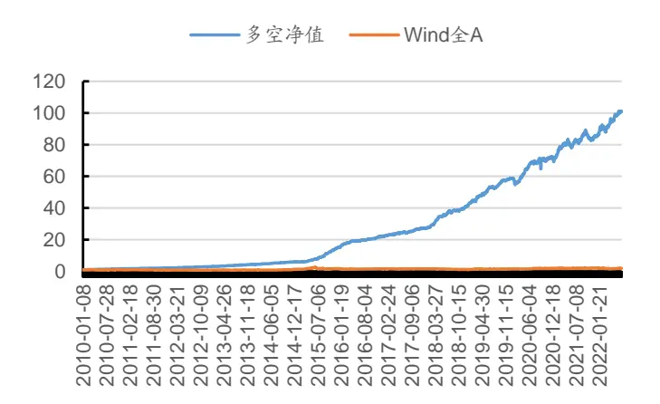
数据来源：天软科技，Wind，广发证券发展研究中心
识别风险，发现价值

表7：RJVP_week因子多空分年度表现

|  | 年化收益率 | 年化波动率 | 夏普比率 | 最大回撤 |
| --- | --- | --- | --- | --- |
| 2010 | 28.37% | 13.28% | 2.14 | 8.66% |
| 2011 | 27.24% | 10.30% | 2.64 | 4.55% |
| 2012 | 24.40% | 8.25% | 2.96 | 4.23% |
| 2013 | 37.08% | 11.27% | 3.29 | 5.47% |
| 2014 | 31.99% | 9.58% | 3.34 | 6.92% |
| 2015 | 141.24% | 22.08% | 6.40 | 4.89% |
| 2016 | 47.60% | 11.80% | 4.03 | 4.55% |
| 2017 | 28.35% | 10.66% | 2.66 | 5.84% |
| 2018 | 53.25% | 9.14% | 5.83 | 3.44% |
| 2019 | 57.84% | 9.65% | 5.99 | 6.95% |
| 2020 | 26.42% | 16.38% | 1.61 | 9.39% |
| 2021 | 27.83% | 14.38% | 1.94 | 12.83% |
| 2022 | 58.27% | 10.69% | 5.45 | 4.26% |
| 全历史 | 43.85% | 12.73% | 3.45 | 12.83% |

数据来源：天软科技，Wind，广发证券发展研究中心

## （三）RLJVP_week 因子表现分析

RLJVP_week因子IC均值为-8.26%，IC胜率为88.48%，年化ICIR为-8.68，t值为-30.51。多空组合方面，年化收益为42.16%，夏普比率为4.13，Calmar比率为4.65，最大回撤为9.07%，双边换手率为1.49。与此前年份相比，该因子在2020与2021年中的回撤有所加大，但2022年以来收益及回撤均明显改善，2022年以来年化收益为62.90%，夏普比率为6.93，最大回撤为3.43%。因子IC半衰期同样约1周。

图 62：RLJVP_week因子IC值与IC累计值走势
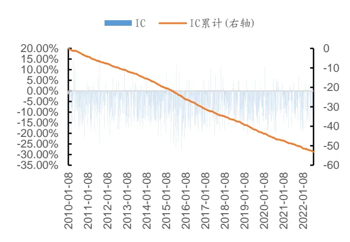
数据来源：天软科技，Wind，广发证券发展研究中心

图 63：RLJVP_week因子分组净值走势
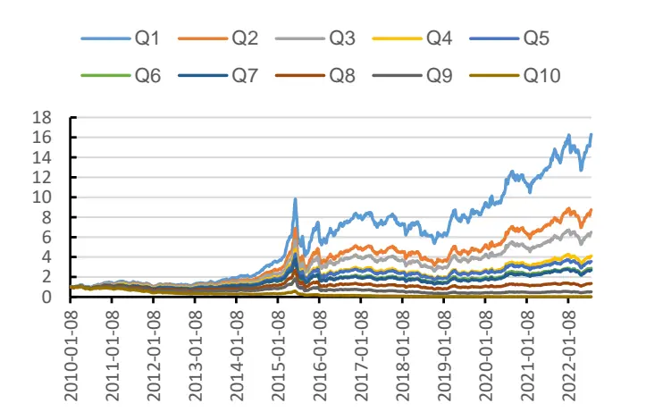
数据来源：天软科技，Wind，广发证券发展研究中心

图 64：RLJVP_week因子IC衰减走势
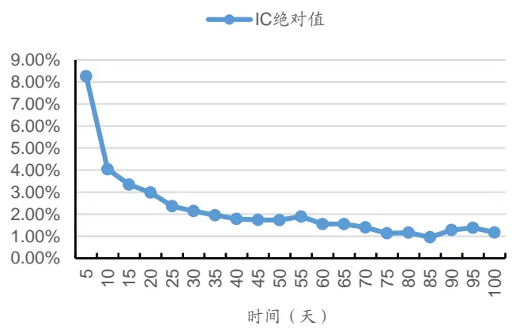
数据来源：天软科技，Wind，广发证券发展研究中心

图 65：RLJVP_week因子多空净值走势
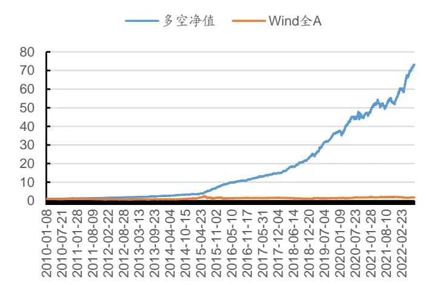
数据来源：天软科技，Wind，广发证券发展研究中心

表8：RLJVP_week因子多空分年度表现

|  | 年化收益率 | 年化波动率 | 夏普比率 | 最大回撤 |
| --- | --- | --- | --- | --- |
| 2010 | 30.63% | 10.70% | 2.83 | 6.30% |
| 2011 | 17.50% | 8.59% | 2.04 | 3.88% |
| 2012 | 30.02% | 7.11% | 4.22 | 2.89% |
| 2013 | 33.34% | 9.03% | 3.69 | 3.01% |
| 2014 | 33.22% | 7.88% | 4.21 | 2.63% |
| 2015 | 133.67% | 17.08% | 7.83 | 4.39% |
| 2016 | 40.84% | 9.11% | 4.48 | 2.74% |
| 2017 | 27.63% | 8.24% | 3.35 | 3.42% |
| 2018 | 56.09% | 7.82% | 7.17 | 2.78% |
| 2019 | 61.59% | 8.55% | 7.22 | 5.82% |
| 2020 | 22.89% | 13.41% | 1.71 | 8.60% |
| 2021 | 21.23% | 10.70% | 1.98 | 9.07% |
| 2022 | 62.90% | 9.08% | 6.93 | 3.43% |
| 全历史 | 42.16% | 10.22% | 4.13 | 9.07% |

数据来源：天软科技，Wind，广发证券发展研究中心

## （四）SRLJV_week 因子表现分析

SRLJV_week因子IC均值为-7.88%，IC胜率为90.00%，年化ICIR为-9.57，t值为-33.65。多空组合方面，年化收益为37.19%，夏普比率为4.05，Calmar比率为4.35，最大回撤为8.54%，周均双边换手率为1.62。该因子多空组合在2020-2021年间增长较缓慢，但2022年以来明显提速，2022年以来多空年化收益为46.88%，夏普比率为5.71，最大回撤为4.15%。因子半衰期同样约为1周。

图 66：SRLJV_week因子IC值与IC累计值走势
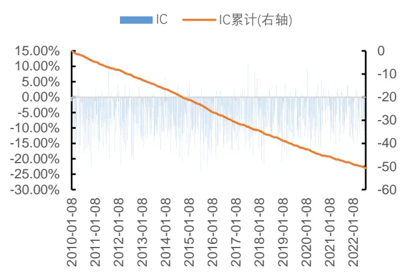
数据来源：天软科技，Wind，广发证券发展研究中心

图 67：SRLJV_week因子分组净值走势
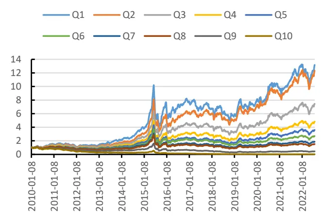
数据来源：天软科技，Wind，广发证券发展研究中心

图 68：SRLJV_week因子IC衰减走势
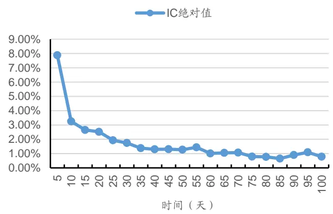
数据来源：天软科技，Wind，广发证券发展研究中心

图 69：SRLJV_week因子多空净值走势
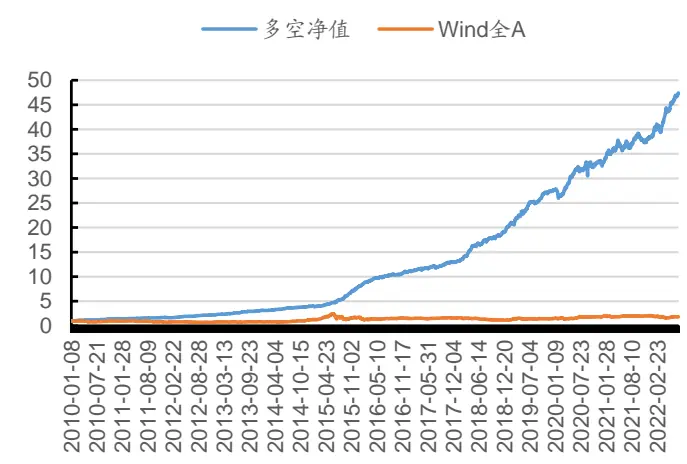
数据来源：天软科技，Wind，广发证券发展研究中心

表9：SRLJV_week因子多空分年度表现

|  | 年化收益率 | 年化波动率 | 夏普比率 | 最大回撤 |
| --- | --- | --- | --- | --- |
| 2010 | 45.88% | 9.82% | 4.67 | 2.60% |
| 2011 | 15.76% | 8.63% | 1.83 | 4.58% |
| 2012 | 33.56% | 7.61% | 4.41 | 4.88% |
| 2013 | 40.69% | 8.33% | 4.88 | 2.06% |
| 2014 | 23.61% | 7.82% | 3.02 | 2.60% |
| 2015 | 109.39% | 13.33% | 8.21 | 3.90% |
| 2016 | 34.38% | 8.46% | 4.06 | 2.29% |
| 2017 | 18.49% | 8.04% | 2.30 | 4.46% |
| 2018 | 48.32% | 8.11% | 5.96 | 2.33% |
| 2019 | 42.68% | 7.75% | 5.50 | 2.49% |
| 2020 | 18.98% | 11.59% | 1.64 | 8.54% |

识别风险，发现价值

| 2021 | 16.51% | 8.85% 1.86 | 5.66% |
| --- | --- | --- | --- |
| 2022 | 46.88% | 8.21% 5.71 | 4.15% |
| 全历史 | 37.19% | 9.18% 4.05 | 8.54% |

数据来源：天软科技，Wind，广发证券发展研究中心

## （五）绩优因子的风格相关性及行业暴露分布

本节我们将去极值、标准化后的4个绩优因子与常见风格因子进行Spearman秩相关性分析，同时我们也考察因子的行业暴露分布。

相关性分析如下表所示。SRJV_week、SRLJV_week因子的风格相关性较低，相关系数均在15%以下；而RJVP_week、RLJVP_week因子与残差波动率因子、BP、流动性因子存在一定的相关性。

此外，4个因子在各行业上的暴露均无明显偏离。

图 70：绩优因子与常见风格因子的相关性

|  | 市值 | 贝塔 | 动量 | 波动率 | 非线性市值 | BP | 流动性 | 盈利 | 成长 | 杠杆 |
| --- | --- | --- | --- | --- | --- | --- | --- | --- | --- | --- |
| SRJV_week | -0.23% | 3.36% | 1.94% | 13.54% | 1.85% | -12.37% | 11.69% | -7.37% | -1.06% | -1.68% |
| RJVP_week | -9.79% | 16.41% | 13.32% | 38.80% | -2.89% | -29.24% | 25.74% | -19.54% | -4.27% | -7.14% |
| RLJVP_week | -10.31% | 9.90% | 7.80% | 30.89% | -3.60% | -22.89% | 18.99% | -14.81% | -3.67% | -4.89% |
| SRLJV_week | -1.69% | 5.53% | 1.51% | 14.60% | 1.29% | -12.27% | 13.25% | -7.65% | -1.44% | -1.46% |

数据来源：天软科技，Wind，广发证券发展研究中心

图 71：绩优因子暴露行业偏离
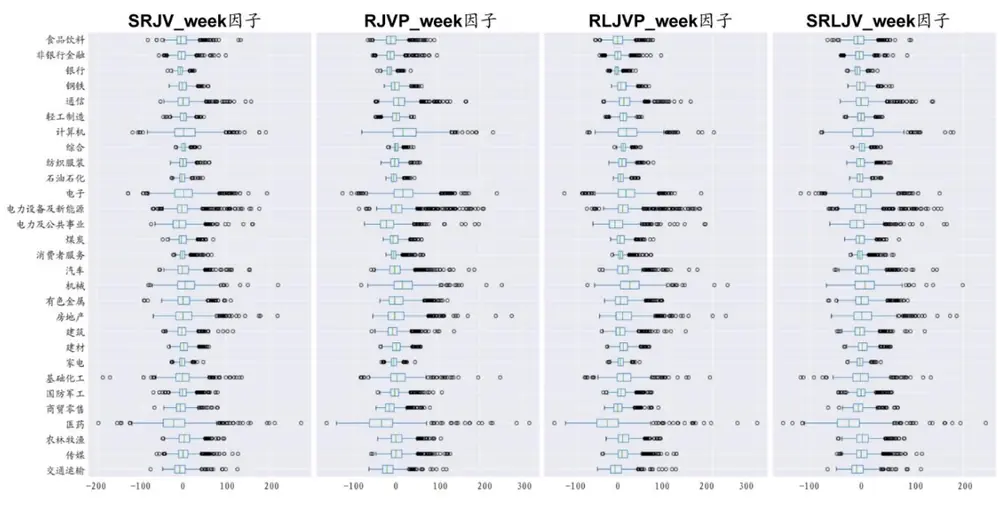
数据来源：天软科技，Wind，广发证券发展研究中心

## 五、绩优因子参数敏感性分析

跳跃波动类因子作为日内波动率跳跃分量的度量，其蕴含的信息会受到数据频率的影响，利用过短周期的数据构造因子可能存在过多噪声，而使用过长周期的数据构造因子则可能造成信息稀释问题。除此之外，在拆分大小跳跃分量时所使用的经验阈值参数α是基于美股的研究结果，这一参数在 A股的表现也需要进行测试分析。基于上述考虑，本节分别对 4个绩优因子进行数据频率分析，并对 RLJVP_week 和SRLJV_week 因子同时进行经验阈值参数α的敏感性分析。

对于 SRJV_week、RJVP_week 因子，其多空年化和多空夏普在 3 min、5 min、10min数据频率下表现接近，其中在 5min数据频率下多空年化录得最高，多空夏普在10 min数据频率下最高。1 min数据频率下因子多空表现较差。对于 RLJVP_week因子，其多空年化在 3 min 数据频率和α阈值参数为 3的情况下取最大值 43.61%。RLJVP_week因子多空夏普则在10min数据频率和α阈值参数为4的情况下取最大值 4.22。RLJVP_week 因子在 1min 数据频率下多空表现同样有一定程度降低。对于 SRLJV_week 因子，其多空年化和多空夏普在α阈值参数为 3 和数据频率大于 1min 的情况下表现更好，随着阈值增大，SRLJV_week 因子的多空表现在一定程度上有所降低。

图 72：SRJV_week因子和RJVP_week因子多空年化对数据频率敏感性
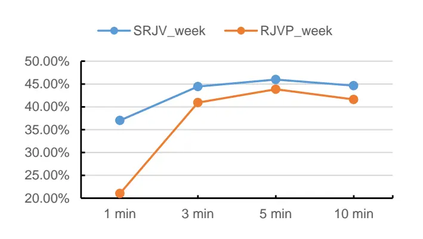
数据来源：天软科技，Wind，广发证券发展研究中心

图 73：SRJV_week因子和RJVP_week因子多空夏普对数据频率敏感性
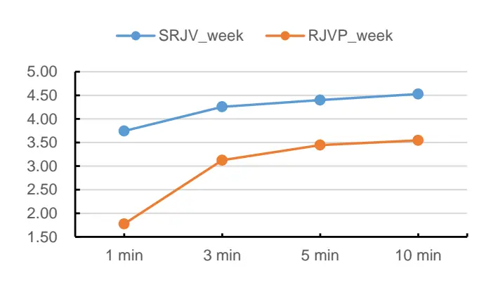
数据来源：天软科技，Wind，广发证券发展研究中心

图 74：RLJVP_week因子多空收益参数敏感性

| 多空年化(%) |  |  |  |  |  |
| --- | --- | --- | --- | --- | --- |
| 6 | 15.92 | 30.10 | 31.42 | 21.95 | -40 |
| 5 | 19.07 | 36.61 | 37.34 | 29.08 | -35 -30 |
| 图炎 4 | 18.96 | 40.05 | 42.16 | 37.99 | -25 |
| 3 | 20.24 | 41.42 | 43.61 | 40.66 | -20 |
| 1 3 5 10 数据频率(min) |  |  |  |  |  |

数据来源：天软科技，Wind，广发证券发展研究中心

图 75：RLJVP_week因子多空夏普参数敏感性

| 多空夏普 |  |  |  |  |  |
| --- | --- | --- | --- | --- | --- |
| 6 | 1.72 | 3.64 | 3.95 | 2.85 | -4.0 |
| 图 5 | 1.89 | 3.94 | 4.30 | 3.65 | -3.5 -3.0 |
| α4 | 1.76 | 3.74 | 4.13 | 4.22 | 2.5 |
| 3 | 1.77 | 3.41 | 3.72 | 3.84 10 | -2.0 |
| 1 3 5 |  |  |  |  |  |
| 数据频率(min) |  |  |  |  |  |

数据来源：天软科技，Wind，广发证券发展研究中心

图 76：SRLJV_week因子多空收益参数敏感性

| 多空年化(%) |  |  |  |  |
| --- | --- | --- | --- | --- |
| 6 | 20.11 | 24.46 | 26.36 18.52 | -40.0 -37.5 -35.0 |
| 图 5 | 25.24 | 29.80 | 30.67 | 25.20 -32.5 -30.0 |
|  | 27.26 | 36.37 | 37.19 33.38 | 27.5 |
| 3 | 32.87 | 40.91 | 40.89 39.29 | 25.0 -22.5 |
|  | 1 |  |  | -20.0 |
|  |  | 3 5 数据频率(min) | 10 |  |

数据来源：天软科技，Wind，广发证券发展研究中心

图 77：SRLJV_week因子多空夏普参数敏感性

| 多空夏普 -4.2 |  |  |  |  | -4.0 |
| --- | --- | --- | --- | --- | --- |
| 6 | 2.63 | 3.07 | 3.34 | 2.51 |  |
| 图 5 | 3.08 3.12 | 3.44 | 3.64 | 3.24 | -3.8 -3.6 -3.4 |
| α4 |  | 3.89 | 4.05 | 3.93 | -3.2 |
| 3 | 3.52 | 4.10 | 4.16 | 4.20 | 3.0 2.8 |
|  | 1 | 3 | 5 | 10 | 2.6 |
|  | 数据频率(min) |  |  |  |  |

数据来源：天软科技，Wind，广发证券发展研究中心

## 六、绩优因子的衍生构造与测算

本节我们尝试对上述绩优因子进行衍生构造并测算其因子表现。具体而言，我们对上述 4个绩优因子分别进行 5种衍生构造：（1）利用 1min早盘时间段（09：00-09：30）数据计算因子；（2）利用 1min盘中时间段（09：30-14：30）数据计算因子；（3）利用 1min 尾盘时间段（14：30-15：00）数据计算因子；（4）用 5min成交量除以当天总成交量进行收益率加权计算因子；（5）将原始用 5日日度因子等权平均值计算周度因子改成利用赫尔移动平均的方式计算，其中赫尔移动平均的窗口选为 5天。测算显示这些衍生构造方式对于因子表现提升效果不明显，尤其是利用（1）（3）两种方式计算的因子表现明显弱化。

表 10：绩优因子衍生构造业绩表现

| 因子名称 | 因子构造说明 | IC 胜率 |  |  | t值 | 多空 | 多空 夏普 | 多空 最大回撤 | 多空 Calmar | 多空 双边 |
| --- | --- | --- | --- | --- | --- | --- | --- | --- | --- | --- |
|  |  | IC 均值 | 年化 ICIR | 年化 |  |  |  |  |  |  |
| SRJV_week | 原始因子 | -8.76% | -8.91 | 89.27% | -31.33 | 45.97% | 4.40 | 9.58% | 4.80 | 换手率 1.63 |
|  | 1 min 早盘数据计算 | -2.21% | -3.31 | 69.05% | -11.64 | -12.22% | -1.45 | 81.40% | -0.15 | 1.64 |
|  | 1 min 盘中数据计算 | -6.82% | -8.02 | 86.47% | -28.21 | 26.91% | 2.97 | 9.42% | 2.86 | 1.59 |
|  | 1 min 尾盘数据计算 | -0.63% | -0.81 | 54.43% | -2.85 | -16.44% | -1.84 | 88.91% | -0.18 | 1.66 |
|  | 成交量加权收益率 | -8.76% | -8.92 | 89.27% | -31.38 | 45.70% | 4.37 | 9.58% | 4.77 | 1.63 |
|  | HMA 计算周度因子 | -5.46% | -6.06 | 81.18% | -21.30 | 18.18% | 1.93 | 15.64% | 1.16 | 1.72 |
| RJVP_week | 原始因子 | -8.58% | -7.29 | 84.91% | -25.64 | 43.85% | 3.45 | 12.84% | 3.42 | 1.31 |
|  | 1 min 早盘数据计算 | -4.67% | -4.47 | 75.12% | -15.72 | 5.18% | 0.46 | 44.97% | 0.12 | 1.33 |
|  | 1 min 盘中数据计算 | -5.09% | -4.72 | 76.83% | -16.61 | 12.20% | 1.07 | 18.10% | 0.67 | 1.12 |
|  | 1 min 尾盘数据计算 | -4.67% | -5.23 | 77.61% | -18.39 | 11.66% | 1.31 | 19.62% | 0.59 | 1.58 |
|  | 成交量加权收益率 | -7.12% | -6.61 | 81.03% | -23.26 | 27.91% | 3.29 | 12.01% | 2.32 | 1.58 |
|  | HMA 计算周度因子 | -6.66% | -6.81 | 85.23% | -23.93 | 24.77% | 2.46 | 14.85% | 1.67 | 1.67 |
| RLJVP_week | 原始因子 | -8.26% | -8.68 | 88.49% | -30.51 | 42.16% | 4.13 | 9.07% | 4.65 | 1.49 |
|  | 1 min 早盘数据计算 | -4.67% | -4.47 | 75.12% | -15.72 | 5.18% | 0.46 | 45.97% | 0.12 | 1.33 |
|  | 1 min 盘中数据计算 | -5.09% | -4.72 | 76.83% | -16.61 | 12.20% | 1.07 | 18.10% | 0.67 | 1.12 |
|  | 1 min 尾盘数据计算 | -4.67% | -5.23 | 77.61% | -18.39 | 11.66% | 1.31 | 19.62% | 0.59 | 1.58 |
|  | 成交量加权收益率 | -7.16% | -6.61 | 81.34% | -23.25 | 27.67% | 3.28 | 11.97% | 2.31 | 1.58 |
|  | HMA 计算周度因子 | -5.42% | -7.02 | 84.45% | -24.70 | 18.70% | 2.40 | 7.92% | 2.36 | 1.72 |
| SRLJV_week | 原始因子 | -7.88% | -9.57 | 90.00% | -33.65 | 37.19% | 4.05 | 8.54% | 4.35 | 1.62 |
|  | 1 min 早盘数据计算 | -2.22% | -3.31 | 69.05% | -11.64 | -12.24% | -1.45 | 81.43% | -0.15 | 1.64 |
|  | 1 min 盘中数据计算 | -6.81% | -8.00 | 86.47% | -28.13 | 16.81% | 2.96 | 9.49% | 2.82 | 1.59 |
|  | 1 min 尾盘数据计算 | -0.59% | -0.76 | 53.65% | -2.67 | -16.79% | -1.86 | 89.52% | -0.19 | 1.66 |
|  | 成交量加权收益率 | -6.71% | -6.52 | 80.72% | -22.92 | 21.04% | 2.63 | 11.72% | 1.80 | 1.64 |
|  | HMA 计算周度因子 | -5.02% | -6.92 | 84.60% | -24.33 | 14.65% | 1.82 | 13.81% | 1.06 | 1.73 |

数据来源：天软科技，Wind，广发证券发展研究中心

## 七、总结与展望

本篇报告从股价的跳跃—扩散模型相关研究出发，基于学界对跳跃波动因子的分解构建思路，梳理了跳跃波动的理论发展过程、实证测试了跳跃波动类型因子在A股市场的表现。结果表明其中4类因子IC和多空表现出色。分析发现这4类因子的业绩表现较为接近，IC和多空表现均较稳定，在2022年表现仍依然不俗。其中全历史表现最优的SRJV_week因子，IC均值为-8.76%，年化ICIR为-8.91，多空年化为45.97%，夏普比率为4.40，最大回撤为9.58%。4类因子的多空回撤在2020及2021年较往年有所加大，但2022年以来回归正常。SRJV_week、SRLJV_week因子的风格相关性样较低，而RJVP_week、RLJVP_week因子与残差波动率、BP、流动性存在一定的相关性。此外，4类因子均无明显行业偏离。由于短周期的数据构造因子可能存在过多噪声，而使用过长周期的数据构造因子则可能造成信息稀释问题，绩优因子在构建时选用不同日内区间频率会导致表现有所差异，5分钟频率下因子表现较好而1分钟数据频率下有所降低。对于RLJVP、SRLJV_week因子构建时涉及的阈值参数我们也进行了敏感性测试，结果显示随着阈值参数中常数项偏离经验值而升高，因子表现有所下降。最后，对4类因子进行的5种衍生构造尝试对业绩提升效果不明显。

通过本文的实证测试，我们看到尽管学界对日内股价跳跃波动的刻画在A股的实证资产定价中取得不俗的效果，但由于高频因子的衰减特性，使得周度调仓的效果出色而月频调仓则效果减弱，能否进一步改进得到在月度层面具有更显著预测能力的因子是可能被关注的研究目标之一。此外，报告中绩优因子在2020年以来整体延续了较好的多空增长，但波动较此前略有放大，针对这一现象的分析改进或也是进一步研究的关注点。

## 八、风险提示

1. 本报告中所述因子测试结果是用量化方法通过历史数据统计、建模和测算完成，所得出的结论与规律在政策、市场环境发生变化时可能存在失效的风险；2. 具体看历史业绩中四类绩优因子的多空净值在2020、2021年较往年波动有所放大而2022以来回归正常，投资过程中应关注市场环境变化导致因子波动放大的风险。

## [Table_ResearchTeam] 广发金融工程研究小组

罗军 ：首席分析师，华南理工大学硕士，从业16 年，2010年进入广发证券发展研究中心。

安 宁 宁 ：联席首席分析师，暨南大学硕士，从业14 年，2011年进入广发证券发展研究中心。

史 庆 盛 ：资深分析师，华南理工大学硕士，2011年进入广发证券发展研究中心。

张 超 ：资深分析师，中山大学硕士，2012 年进入广发证券发展研究中心。

陈 原 文 ：资深分析师，中山大学硕士，2015年进入广发证券发展研究中心。

樊 瑞 铎 ：资深分析师，南开大学硕士，2015年进入广发证券发展研究中心。

李豪 ：资深分析师，上海交通大学硕士，2016年进入广发证券发展研究中心。

周 飞 鹏 ：资深分析师，伯明翰大学硕士，2021年加入广发证券发展研究中心。

季 燕 妮 ：高级分析师，厦门大学硕士，2020年进入广发证券发展研究中心。

张 钰 东 ：高级分析师，中山大学硕士，2020年进入广发证券发展研究中心。

## [Table_IndustryInvestDescription] 广发证券—行业投资评级说明投资

买入： 预期未来12个月内，股价表现强于大盘10%以上。内

持有： 预期未来12个月内，股价相对大盘的变动幅度介于-10%～+10%。对

卖出： 预期未来12个月内，股价表现弱于大盘10%以上。

## [Table_CompanyInvestDescription] 广发证券—公司投资评级说明

买入： 预期未来 12 个月内，股价表现强于大盘 15%以上。

增持： 预期未来12个月内，股价表现强于大盘5%-15%。

持有： 预期未来12个月内，股价相对大盘的变动幅度介于-5%～+5%。

卖出： 预期未来12个月内，股价表现弱于大盘5%以上。

## [Table_Address] 联系我们

| 地址 | 广州市 | 深圳市 | 北京市 | 上海市 | 香港 |
| --- | --- | --- | --- | --- | --- |
|  | 广州市天河区马场路 | 深圳市福田区益田路 | 北京市西城区月坛北 | 上海市浦东新区南泉 | 香港德辅道中189号 |
|  | 26号广发证券大厦35 | 6001号太平金融大厦 | 街2号月坛大厦18层 | 北路429号泰康保险 | 李宝椿大厦 29及30 |
|  | 楼 | 31层 |  | 大厦37楼 | 楼 |
| 邮政编码 客服邮箱 | 510627 | 518026 | 100045 | 200120 |  |

## [Table_LegalD 法律主体isclaimer 声明]

本报告由广发证券股份有限公司或其关联机构制作，广发证券股份有限公司及其关联机构以下统称为“广发证券”。本报告的分销依据不同国依据不家、地区的法律、法规和监管要求由广发证券于该国家或地区的具有相关合法合规经营资质的子公司/经营机构完成。

广发证券股份有限公司具备中国证监会批复的证券投资咨询业务资格，接受中国证监会监管，负责本报告于中国（港澳台地区除外）的分销。广发证券（香港）经纪有限公司具备香港证监会批复的就证券提供意见（4 号牌照）的牌照，接受香港证监会监管，负责本报告于中国香港地区的分销。

本报告署名研究人员所持中国证券业协会注册分析师资质信息和香港证监会批复的牌照信息已于署名研究人员姓名处披露。

## [Table_I 重要mportant 声明N

广发证券股份有限公司及其关联机构可能与本报告中提及的公司寻求或正在建立业务关系，因此，投资者应当考虑广发证券股份有限公司及其系 因此 者应当考虑关联机构因可能存在的潜在利益冲突而对本报告的独立性产生影响。投资者不应仅依据本报告内容作出任何投资决策。投资者应自主作出投资存 潜 利益冲突而 独 性产生影响 仅 容决策并自行承担投资风险，任何形式的分享证券投资收益或者分担证券投资损失的书面或者口头承诺均为无效。

本报告署名研究人员、联系人（以下均简称“研究人员”）针对本报告中相关公司或证券的研究分析内容，在此声明：（ ）本报告的全部分析结论、研究观点均精确反映研究人员于本报告发出当日的关于相关公司或证券的所有个人观点，并不代表广发证券的立场；（2）研究人员的部分或全部的报酬无论在过去、现在还是将来均不会与本报告所述特定分析结论、研究观点具有直接或间接的联系。

研究人员制作本报告的报酬标准依据研究质量、客户评价、工作量等多种因素确定，其影响因素亦包括广发证券的整体经营收入，该等经营收入部分来源于广发证券的投资银行类业务。

本报告仅面向经广发证券授权使用的客户/特定合作机构发送，不对外公开发布，只有接收人才可以使用，且对于接收人而言具有保密义务。广发证券并不因相关人员通过其他途径收到或阅读本报告而视其为广发证券的客户。在特定国家或地区传播或者发布本报告可能违反当地法律，广发证券并未采取任何行动以允许于该等国家或地区传播或者分销本报告。

本报告所提及证券可能不被允许在某些国家或地区内出售。请注意，投资涉及风险，证券价格可能会波动，因此投资回报可能会有所变化，过去的业绩并不保证未来的表现。本报告的内容、观点或建议并未考虑任何个别客户的具体投资目标、财务状况和特殊需求，不应被视为对特定客户关于特定证券或金融工具的投资建议。本报告发送给某客户是基于该客户被认为有能力独立评估投资风险、独立行使投资决策并独立承担相应风险。

本报告所载资料的来源及观点的出处皆被广发证券认为可靠，但广发证券不对其准确性、完整性做出任何保证。报告内容仅供参考，报告中的信息或所表达观点不构成所涉证券买卖的出价或询价。广发证券不对因使用本报告的内容而引致的损失承担任何责任，除非法律法规有明确规定。客户不应以本报告取代其独立判断或仅根据本报告做出决策，如有需要，应先咨询专业意见。

广发证券可发出其它与本报告所载信息不一致及有不同结论的报告。本报告反映研究人员的不同观点、见解及分析方法，并不代表广发证券的立场。广发证券的销售人员、交易员或其他专业人士可能以书面或口头形式，向其客户或自营交易部门提供与本报告观点相反的市场评论或交易策略，广发证券的自营交易部门亦可能会有与本报告观点不一致，甚至相反的投资策略。报告所载资料、意见及推测仅反映研究人员于发出本报告当日的判断，可随时更改且无需另行通告。广发证券或其证券研究报告业务的相关董事、高级职员、分析师和员工可能拥有本报告所提及证券的权益。在阅读本报告时，收件人应了解相关的权益披露（若有）。

本研究报告可能包括和/或描述/呈列期货合约价格的事实历史信息（“信息”）。请注意此信息仅供用作组成我们的研究方法/分析中的部分论点依据/证据，以支持我们对所述相关行业/公司的观点的结论。在任何情况下，它并不（明示或暗示）与香港证监会第5类受规管活动（就期货合约提供意见）有关联或构成此活动。

## [Table_Interest 权益披露Disclosur

(1)广发证券（香港）跟本研究报告所述公司在过去12 个月内并没有任何投资银行业务的关系。

## [Table_Copyright] 版权声明

未经广发证券事先书面许可，任何机构或个人不得以任何形式翻版、复制、刊登、转载和引用，否则由此造成的一切不良后果及法律责任由私自翻版、复制、刊登、转载和引用者承担。