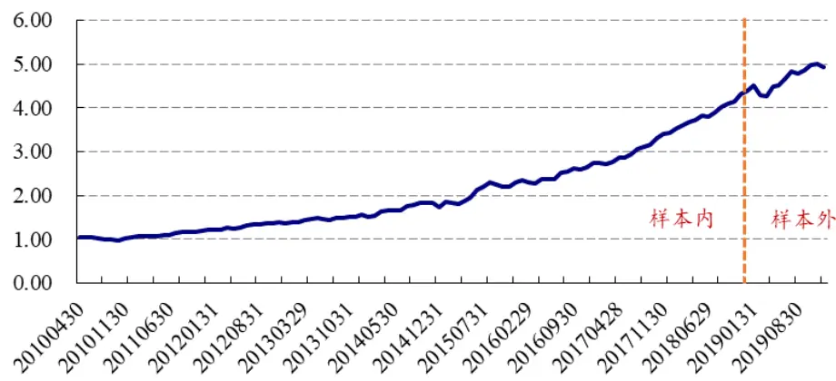
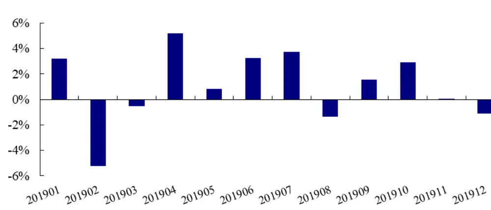
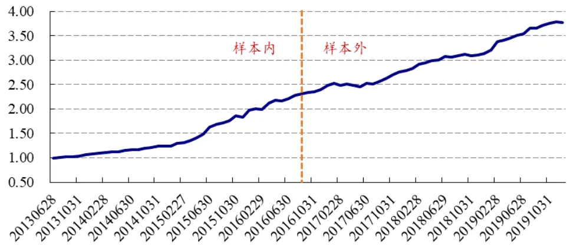
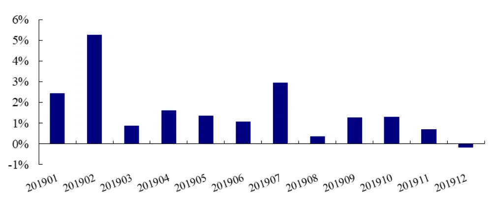
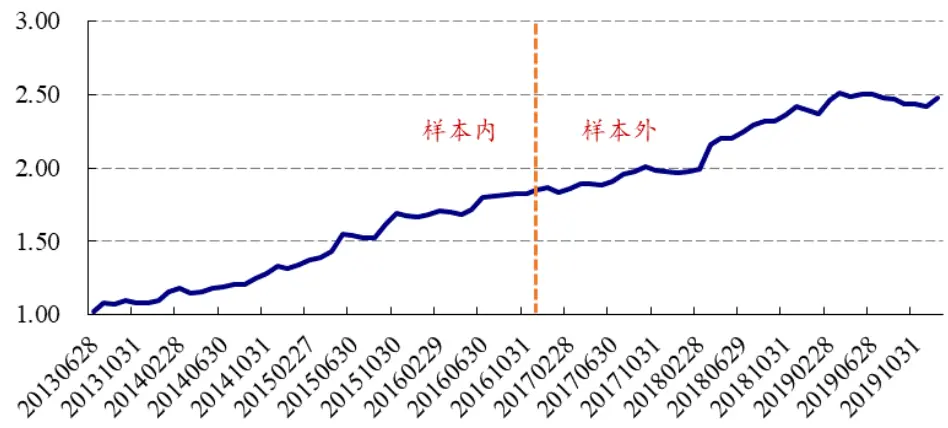
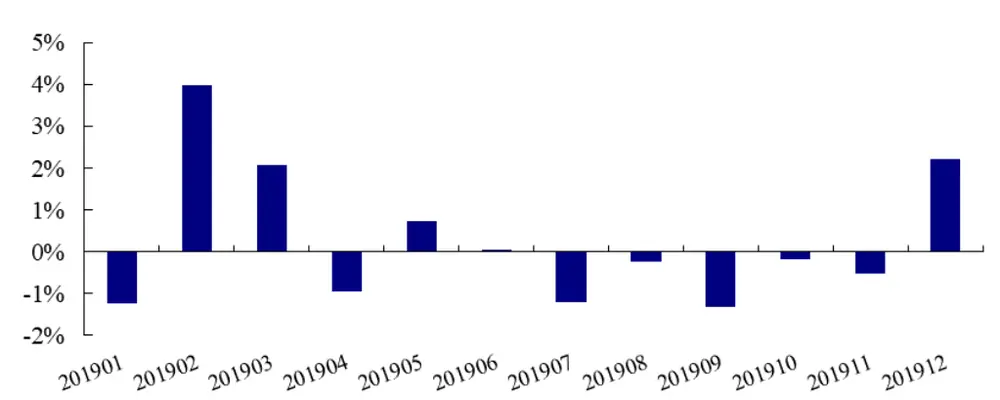
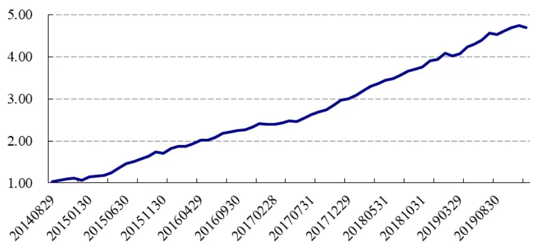
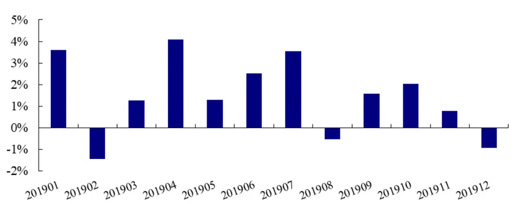
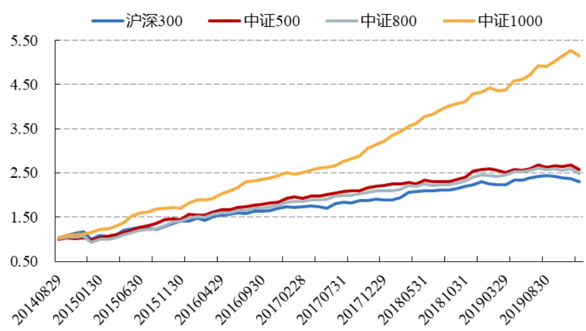

| 魏建榕（分析师） | 高鹏（联系人） | 傅开波（联系人） |
| --- | --- | --- |
| weijianrong@kysec.cn | gaopeng@kysec.cn | fukaibo@kysec.cn |
| 证书编号：S0790519120001 | 证书编号：S0790119120032 | 证书编号：S0790119120026 |

金融工程研究团队

2019 年 12 月 28 日

# 交易行为因子的 2019 年

## ——市场微观结构研究系列（2）

## ⚫ 交易行为因子

稳健的交易行为模式中，蕴藏有稳健的 alpha 源。循着这一研究理念，我们自 2016年以来，陆续提出了一系列基于交易行为的选股因子，受到量化投资同行的认可。其中：理想反转因子的交易行为逻辑是，A 股反转之力的微观来源是大单成交，通过每日平均单笔成交金额的大小，可以切割出反转属性最强的交易日；聪明钱因子的交易行为逻辑是，从分钟行情数据的价量信息中，可以识别出机构参与交易的多寡，进而构造出跟踪聪明钱的因子；APM 因子的交易行为逻辑是，在日内的不同时段，交易者的行为模式不同，反转强度也相应有所不同。以上列举的交易行为因子，都有两个共同的特点：一是，样本内表现优秀，参数优化的成分较少；二是，截至目前已有足够长的样本外观察期，样本外表现比较稳健。我们将上述因子汇总在一起，做定期的跟踪，以及时监控交易行为类因子的动态表现。

## 相关研究报告

《市场微观结构研究系列（1）-A 股反转之力的微观来源》-2019.12.23

## ⚫ 交易行为因子的绩效

在全历史区间内，理想反转因子的 IC均值为-0.058，rankIC 均值为-0.072，信息比率为 2.17。聪明钱因子的 IC 均值为-0.046，rankIC 均值为-0.075，信息比率为 3.21。APM 因子的 IC 均值为 0.039，rankIC 均值为 0.036，信息比率为 2.01。交易行为合成因子的 IC 均值为 0.088，rankIC 均值为 0.105，信息比率高达 4.11。

## ⚫ 交易行为因子的2019年

在 2019 年度，理想反转因子的累计收益为 12.7%，信息比率为 1.28，月度胜率为66.7%，2 月份出现过一次较大的回撤。聪明钱因子的累计收益为 20.7%，信息比率为 4.18，月度胜率为 91.7%，表现非常出色。APM 因子的累计收益为 3.33%，信息比率为 0.58，月度胜率为 41.7%，表现比较疲软。总体来看，交易行为合成因子在2019 年度表现依旧稳健，累计收益为 19.1%，信息比率为 3.06，月度胜率为 75%。

⚫ 风险提示：模型测试基于历史数据，市场未来可能发生变化。

## 1、 引言

稳健的交易行为模式中，蕴藏有稳健的 alpha 源。循着这一研究理念，我们自2016 年以来，陆续提出了一系列基于交易行为的选股因子，受到量化投资同行的认可。其中：理想反转因子的交易行为逻辑是，A股反转之力的微观来源是大单成交，通过每日平均单笔成交金额的大小，可以切割出反转属性最强的交易日（魏建榕、傅开波，2018-12-13）；聪明钱因子的交易行为逻辑是，从分钟行情数据的价量信息中，可以识别出机构参与交易的多寡，进而构造出跟踪聪明钱的因子（魏建榕等，2016-7-8）；APM因子的交易行为逻辑是，在日内的不同时段，交易者的行为模式不同，反转强度也相应有所不同（魏建榕等，2016-10-15）。以上列举的交易行为因子，都有两个共同的特点：一是，样本内表现优秀，参数优化的成分较少；二是，截至目前已有足够长的样本外观察期，样本外表现比较稳健。我们将上述因子汇总在一起，做定期的跟踪，以及时监控交易行为类因子的动态表现。

## 2、 交易行为因子的绩效回顾

## 2.1、 理想反转因子

图 1 展示了理想反转因子在月度调仓下的 5 分组多空对冲净值曲线。在全历史区间内，理想反转因子的 IC 均值为-0.058，rankIC 均值为-0.072，信息比率为 2.17。在2019年度，理想反转因子的累计收益为12.7%，信息比率为1.28，月度胜率为66.7%。其中，2019 年 2 月份，理想反转因子录得了较大的回撤，其发生原因以及相应的解决方案，详见我们新近发布的专题报告《A股反转之力的微观来源》（魏建榕、傅开波，2019-12-23）。

图1：理想反转因子的多空对冲净值（2010.3-2019.12，全市场）

数据来源：wind、开源证券研究所

表1：理想反转因子的多空对冲收益统计（全市场）

|  | 年化收益率 | 年化波动率 | 收益波动比 | 最大回撤 | 月度胜率 |
| --- | --- | --- | --- | --- | --- |
| 所有年份 | 17.79% | 8.22% | 2.17 | 8.63% | 73.50% |
| 2019年 | 12.70% | 9.93% | 1.28 | 5.75% | 66.67% |

数据来源：wind、开源证券研究所

图2：理想反转因子的“多-空”月度收益（2019.1-2019.12，全市场）

数据来源：wind、开源证券研究所

## 2.2、 聪明钱因子

图 3 展示了聪明钱因子在月度调仓下的 5 分组多空对冲净值曲线。在全历史区间内，聪明钱因子的 IC 均值为-0.046，rankIC 均值为-0.075，信息比率为 3.21。在2019年度，聪明钱因子的累计收益为 20.7%，信息比率为4.18，月度胜率为91.7%。统计数据显示，聪明钱因子在 2019年表现非常出色。

图3：聪明钱因子的多空对冲净值（2013.6-2019.12，全市场）

数据来源：wind、开源证券研究所

表2：聪明钱因子的多空对冲收益统计（全市场）

| 年化收益率 年化波动率 收益波动比 |  |  |  | 最大回撤 | 月度胜率 |
| --- | --- | --- | --- | --- | --- |
| 所有年份 | 22.37% | 6.98% | 3.21 | 2.63% | 83.54% |
| 2019年 | 20.69% | 4.95% | 4.18 | 0.18% | 91.67% |

数据来源：wind、开源证券研究所

图4：聪明钱因子的“多-空”月度收益（2019.1-2019.12，全市场）

数据来源：wind、开源证券研究所

## 2.3、 APM 因子

图 5展示了APM因子在月度调仓下的 5分组多空对冲净值曲线。在全历史区间内，APM 因子的 IC 均值为 0.039，rankIC 均值为 0.036，信息比率为 2.01。在 2019年度，APM 因子的累计收益为 3.33%，信息比率为 0.58，月度胜率为 41.7%。统计数据显示，APM因子在 2019年表现比较疲软。

图5：APM 因子的多空对冲净值（2013.6-2019.12，全市场）

数据来源：wind、开源证券研究所

表3：APM因子的多空对冲收益统计（全市场）

|  | 年化收益率 | 年化波动率 | 收益波动比 | 最大回撤 | 月度胜率 |
| --- | --- | --- | --- | --- | --- |
| 所有年份 | 14.75% | 7.33% | 2.01 | 3.57% | 67.09% |
| 2019年 | 3.33% | 5.77% | 0.58 | 3.57% | 41.67% |

数据来源：wind、开源证券研究所

图6：APM因子的“多-空”月度收益（2019.1-2019.12，全市场）

数据来源：wind、开源证券研究所

## 3、 交易行为因子的合成

本小节我们对上述交易行为因子进行合成，并对合成因子进行绩效分析。因子值方面，我们将上述交易行为因子在中信一级行业内进行因子去极值与因子标准化。因子权重方面，我们滚动选取过去 12 期因子的 ICIR 值作为权重，加权形成交易行为合成因子。

图 7 展示了交易行为合成因子在月度调仓下的 5 分组多空对冲净值曲线。在全历史区间内，合成因子的 IC 均值为0.088，rankIC 均值为 0.105，信息比率高达4.11。在 2019 年度，合成因子的累计收益为 19.1%，信息比率为 3.06，月度胜率为 75%。值得一提的是，合成因子在中证1000 中的表现，要显著优于在中证 800中，全历史区间内的信息比率分别为4.75和1.91（图 9）。

图7：交易行为合成因子的多空对冲净值（2014.8-2019.12，全市场）

数据来源：wind、开源证券研究所

表4：交易行为合成因子的绩效统计（全市场）

|  | 年化收益率 | 年化波动率 | 收益波动比 | 最大回撤 | 月度胜率 |
| --- | --- | --- | --- | --- | --- |
| 所有年份 | 33.03% | 8.04% | 4.11 | 4.65% | 87.69% |
| 2019年 | 19.12% | 6.25% | 3.06 | 1.44% | 75.00% |

数据来源：wind、开源证券研究所

图8：交易行为合成因子的“多-空”月度收益（2019.1-2019.12，全市场）

数据来源：wind、开源证券研究所

图9：交易行为合成因子在不同样本空间的多空对冲净值（2014.8-2019.12）

数据来源：wind、开源证券研究所

## 4、 交易行为因子的构造方法

## 4.1、 理想反转因子

理想反转因子是对传统反转因子进行W式切割得到的，具体步骤如下：

（1）对选定股票，回溯取其过去20日的数据；

（2）计算该股票每日的平均单笔成交金额（成交金额/成交笔数）；

（3）单笔成交金额高的10个交易日，涨跌幅加总，记作 M_high；

（4）单笔成交金额低的10个交易日，涨跌幅加总，记作 M_low；

（5）理想反转因子 M = M_high–M_low;

（6）对所有股票，都进行以上操作，计算各自的理想反转因子M。

## 4.2、 聪明钱因子

聪明钱因子用来衡量聪明钱参与交易的相对价位高低，具体步骤如下：

（1）对选定股票，回溯取其过去 10日的分钟行情数据；

（2）构造指标 ${\displaystyle\langle S_{\mathrm{t}}=|\mathrm{R}_{\mathrm{t}}|/\sqrt{\mathrm{V}_{\mathrm{t}}}};$ ，其中 $R_{t}$ 为第 t 分钟涨跌幅， $V_{t}$ 为第 t 分钟成交量；

（3）将分钟数据按照指标 $S_{\mathrm{t^{\prime}}}$ 从大到小进行排序，取成交量累积占比前 20%的分钟，视为聪明钱交易；

（4）计算聪明钱交易的成交量加权平均价 $\cdot\mathrm{\nabla\mathsf{WAP}_{\mathrm{smart}}}$

（5）计算所有交易的成交量加权平均价 $\mathrm{\Delta VWAP_{all}}$

（6）聪明钱因子 $\cdot{}\mathrm{Q}=\mathrm{VWAP}_{\mathrm{smart}}/\mathrm{VWAP}_{\mathrm{all}}$

## 4.3、 APM 因子

APM因子用来衡量股价行为上午与下午的差异程度，具体步骤如下：

（1）对选定股票，回溯取其过去 20 日数据，记逐日上午的股票收益率为 $r_{t}^{am}$ 指数收益率为 $R_{t}^{am}$ ；逐日下午的股票收益率为 $1r_{t}^{pm}$ ，指数收益率为 $R_{t}^{pm}$ ；

（2）将得到的40组上午与下午(r,R)的收益率数据进行回归： $r_{i}=\alpha+\beta R_{i}+\varepsilon_{i}\mathrm{~}$ 得到残差项 $\varepsilon_{i};$

（3）以上得到的 40 个残差 $\mathscr{E}_{i}$ 中，上午残差记为 $\varepsilon_{t}^{am}$ ，下午残差记为 $\varepsilon_{t}^{pm}$ ，进一步计算每日上午与下午残差的差值 $\delta_{t}=\varepsilon_{t}^{am}-\varepsilon_{t}^{pm}$

（4）构造统计量 stat 来衡量上午与下午残差的差异程度，计算公式如下 $(\mu,$ 为均值，σ为标准差）：

$$
\mathrm{stat}={\frac{\mu(\delta_{t})}{\sigma(\delta_{t})/\sqrt{N}}}
$$

（5）为了消除动量因子影响，将统计量stat对动量因子进行横截面回归： $stat_{j}=$ $bRet20_{j}+\varepsilon_{j}$ ，其中Ret20 为股票过去20日的收益率，代表动量因子；

（6）将回归得到的残差值ε作为APM因子。

## 5、 风险提示

模型测试基于历史数据，市场未来可能发生变化。

## 分析师承诺

负责准备本报告以及撰写本报告的所有研究分析师或工作人员在此保证，本研究报告中关于任何发行商或证券所发表的观点均如实反映分析人员的个人观点。负责准备本报告的分析师获取报酬的评判因素包括研究的质量和准确性、客户的反馈、竞争性因素以及开源证券股份有限公司的整体收益。所有研究分析师或工作人员保证他们报酬的任何一部分不曾与，不与，也将不会与本报告中具体的推荐意见或观点有直接或间接的联系。

## 股票投资评级说明

|  | 评级 | 说明 |
| --- | --- | --- |
| 证券评级 | 买入（Buy） | 预计相对强于市场表现20%以上； |
|  | 增持（outperform） | 预计相对强于市场表现 5%~20%； |
|  | 中性（Neutral） | 预计相对市场表现在-5%~+5%之间波动； |
|  | 减持（underperform） | 预计相对弱于市场表现5%以下。 |
| 行业评级 | 看好（overweight） | 预计行业超越整体市场表现； |
|  | 中性（Neutral） | 预计行业与整体市场表现基本持平； |
|  | 看淡（underperform） | 预计行业弱于整体市场表现。 |
| 备注：评级标准为以报告日后的6~12个月内，证券相对于市场基准指数的涨跌幅表现，其中A股基准指数为沪深300指数、港股基准指数为恒生指数、新三板基准指数为三板成指（针对协议转让标的）或三板做市指数（针对做市转让标的)、美股基准指数为标普500或纳斯达克综合指数。我们在此提醒您，不同证券研究机构采用不同的评级术语及评级标准。我们采用的是相对评级体系，表示投资的相对比重建议；投资者买入或者卖出证券的决定取决于个人的实际情况，比如当前的持仓结构以及其他需要考虑的因素。投资者应阅读整篇报告，以获取比较完整的观点与信息，不应仅仅依靠投资评级来推断结论。 |  |  |

## 分析、估值方法的局限性说明

本报告所包含的分析基于各种假设，不同假设可能导致分析结果出现重大不同。本报告采用的各种估值方法及模型均有其局限性，估值结果不保证所涉及证券能够在该价格交易。

## 法律声明

开源证券股份有限公司是经中国证监会批准设立的证券经营机构，由陕西开源证券经纪有限责任公司变更延续的专业证券公司，已具备证券投资咨询业务资格。

本报告仅供开源证券股份有限公司（以下简称“本公司”）的机构或个人客户（以下简称“客户”）使用。本公司不会因接收人收到本报告而视其为客户。本报告是发送给开源证券客户的，属于机密材料，只有开源证券客户才能参考或使用，如接收人并非开源证券客户，请及时退回并删除。

本报告是基于本公司认为可靠的已公开信息，但本公司不保证该等信息的准确性或完整性。本报告所载的资料、工具、意见及推测只提供给客户作参考之用，并非作为或被视为出售或购买证券或其他金融工具的邀请或向人做出邀请。本报告所载的资料、意见及推测仅反映本公司于发布本报告当日的判断，本报告所指的证券或投资标的的价格、价值及投资收入可能会波动。在不同时期，本公司可发出与本报告所载资料、意见及推测不一致的报告。客户应当考虑到本公司可能存在可能影响本报告客观性的利益冲突，不应视本报告为做出投资决策的唯一因素。本报告中所指的投资及服务可能不适合个别客户，不构成客户私人咨询建议。本公司未确保本报告充分考虑到个别客户特殊的投资目标、财务状况或需要。本公司建议客户应考虑本报告的任何意见或建议是否符合其特定状况，以及（若有必要）咨询独立投资顾问。在任何情况下，本报告中的信息或所表述的意见并不构成对任何人的投资建议。在任何情况下，本公司不对任何人因使用本报告中的任何内容所引致的任何损失负任何责任。若本报告的接收人非本公司的客户，应在基于本报告做出任何投资决定或就本报告要求任何解释前咨询独立投资顾问。

本报告可能附带其它网站的地址或超级链接，对于可能涉及的开源证券网站以外的地址或超级链接，开源证券不对其内容负责。本报告提供这些地址或超级链接的目的纯粹是为了客户使用方便，链接网站的内容不构成本报告的任何部分，客户需自行承担浏览这些网站的费用或风险。

开源证券在法律允许的情况下可参与、投资或持有本报告涉及的证券或进行证券交易，或向本报告涉及的公司提供或争取提供包括投资银行业务在内的服务或业务支持。开源证券可能与本报告涉及的公司之间存在业务关系，并无需事先或在获得业务关系后通知客户。

本报告的版权归本公司所有。本公司对本报告保留一切权利。除非另有书面显示，否则本报告中的所有材料的版权均属本公司。未经本公司事先书面授权，本报告的任何部分均不得以任何方式制作任何形式的拷贝、复印件或复制品，或再次分发给任何其他人，或以任何侵犯本公司版权的其他方式使用。所有本报告中使用的商标、服务标记及标记均为本公司的商标、服务标记及标记。

## 开源证券股份有限公司

地址：西安市高新区锦业路1号都市之门B座5层

邮编：710065

电话：029-88365835

传真：029-88365835