2020 年 02 月 09 日

## 聪明钱因子模型的 2.0 版本

金融工程研究团队

## ——市场微观结构研究系列（3）

魏建榕（分析师）

高鹏（联系人）

weijianrong@kysec.cn

gaopeng@kysec.cn

傅开波（联系人）

fukaibo@kysec.cn

证书编号：S0790519120001

证书编号：S0790119120032

证书编号：S0790119120026

## ⚫ 聪明钱因子：高频数据，低频因子

我们于 2016 年 7 月提出的聪明钱因子模型，在量化投资同行中获得了较高的评价。聪明钱因子模型的核心逻辑是，从分钟行情数据的价量信息中，尝试识别机构参与交易的多寡，最终构造出一个跟踪聪明钱的选股因子。聪明钱因子模型首次提出了“高频数据，低频因子”的研究模式。本篇报告的主旨是，提出关于聪明钱因子模型的重要改进。

## ⚫ 聪明度指标S是聪明钱因子模型的核心部件

聪明钱因子模型的核心问题是，如何识别聪明钱的交易。聪明钱在交易过程中往往呈现“单笔订单数量更大、订单报价更为激进”的基本特征。基于这个考虑，我们构造了用于度量交易聪明度的指标 S，用以筛选聪明钱的交易。不同的S指标的构造方式，将产生不同的聪明钱划分结果，最终影响聪明钱因子的选股效果。因此，聪明度指标S 是聪明钱因子模型的核心部件。

## 相关研究报告

《市场微观结构研究系列（1）-A 股反转之力的微观来源》-2019.12.23

《市场微观结构研究系列（2）-交易行为因子的 2019 年》-2019.12.28

## ⚫ 聪明钱因子的改进

通过对 S指标构造方式的重新考察，我们优化了原始模型对聪明钱的划分，提出了对聪明钱因子的重要改进。改进后的聪明钱因子模型，在全市场范围的五分组多空净值，信息比率达到3.7左右，选股能力明显优于原始模型。

## ⚫ 若干重要讨论

其一，聪明钱因子模型的构造过程，选取了成交量累积占比前 20%的分钟视为聪明钱交易。通过比照机构投资者交易占比的实证数据、测试不同截止值下的因子选股能力，我们验证了：选取 20%作为截止值，是具有合理支撑的。

其二，改进后的聪明钱因子模型，在不同的股票样本空间上，均具有较好的选股效果。总的来说，因子对于中小市值股票，选股能力更加稳健。

⚫ 风险提示：模型测试基于历史数据，市场未来可能发生变化。

## 1、 引言

我们于 2016年7月提出的聪明钱因子模型，在量化投资同行中获得了较高的评价。聪明钱因子模型的核心逻辑是，从分钟行情数据的价量信息中，尝试识别机构参与交易的多寡，最终构造出一个跟踪聪明钱的选股因子。聪明钱因子模型在首次发布时，受到了较多的关注，究其原因主要有两个方面：其一，模型逻辑简洁，样本内表现良好；其二，模型首次提出了“高频数据，低频因子”的研究模式，是高频因子领域的引领之作。聪明钱因子从提出迄今已有 3 年 7 个月，我们一直密切跟踪其动态表现。本篇报告的主旨是，提出关于聪明钱因子模型的重要改进。

## 2、 聪明钱因子的原始模型

聪明钱因子模型的核心问题是，如何识别聪明钱的交易。大量的实证研究表明，聪明钱在交易过程中往往呈现“单笔订单数量更大、订单报价更为激进”的基本特征。基于这个考虑，我们构造了用于度量交易聪明度的指标 S（表 1，步骤2），指标S 的数值越大，则认为该分钟的交易中有越多聪明钱参与。借助指标 S，我们通过以下方法筛选聪明钱的交易：对于特定股票、特定时段的所有分钟行情数据，将其按照指标 S 从大到小进行排序，将成交量累积占比前 20%视为聪明钱的交易（表 1，步骤 3）。

表1：聪明钱因子的计算步骤

| 步骤1 | 对选定股票，回溯取其过去10个交易日的分钟行情数据； |
| --- | --- |
| 步骤2 | 构造指标 $\mathrm{\dot{S}_{t}=\|R_{t}\|/\sqrt{V_{t}},}$ 其中 $R_{t}$ 为第t 分钟涨跌幅， $V_{t}$ 为第t分钟成交量； |
| 步骤3 | 将分钟数据按照指标 $\mathsf{S_{t1}}$ 从大到小进行排序，取成交量累积占比前20%的分钟， 视为聪明钱交易； |
| 步骤4 | 计算聪明钱交易的成交量加权平均价 $\mathrm{VWAP_{smax}};$ |
| 步骤5 | 计算所有交易的成交量加权平均价 $\mathrm{VWAP_{all};}$ |
| 步骤6 | 聪明钱因子 $\mathrm{Q}=\mathrm{VWAP}_{\text{start }}/\mathrm{VWAP}_{\text{all }}.$ a |

资料来源：开源证券研究所

为了更形象地展示这个划分过程，图 1 中我们给出了一个简单示例。图 1 的上半部分：这是一段长度为半小时的分钟行情数据，按照时间顺序排列，时间标签依次标为 1-30，蓝柱代表每分钟的成交量，红点代表每分钟的 S 指标值。图 1 的下半部分：我们按照 S 值从大到小对原始行情数据进行了重新排序，柱子仍代表每分钟的成交量，绿线代表成交量从左到右的累计占比（相对于总成交量）；以成交量累计占比 20% 作为划分的界线，将最左侧的6个分钟数据（红柱）划归为聪明钱的交易，剩余的其他分钟数据（蓝柱）则被划为普通资金的交易。

图1：聪明钱的划分过程
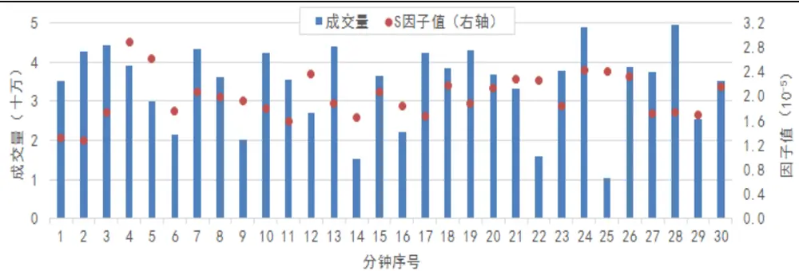

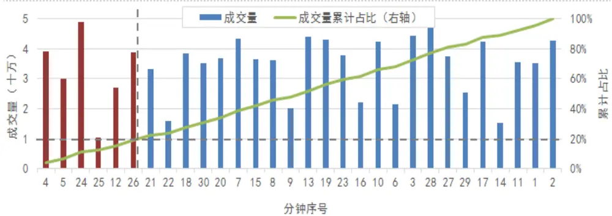
数据来源：wind、开源证券研究所

从“量-价”相空间的视角，我们可以更直观地感受S 指标在划分过程中起到的作用。在图 2 中，横坐标为分钟成交量 V，纵坐标为分钟涨跌幅的绝对值|R|，每个散点代表一个分钟交易。在最终的划分结果中，红色散点为聪明钱交易，蓝色散点为普通交易，虚线为划分两种交易的分界线。不难发现，分界线的形状直接取决于S指标的构造方式——假设成交量累积占比恰好为 20%的分钟交易的 S 指标值为S ，则分界线表达式为|R| = S √V。不同的 S指标的构造方式，将产生不同的聪明钱划分结果。

图2：从“量-价”相空间看聪明钱的划分过程
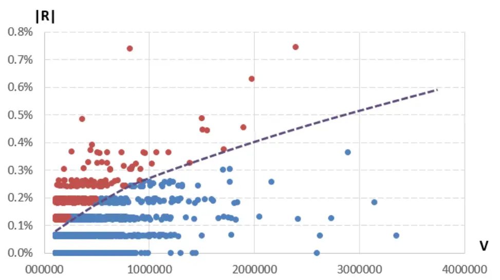
数据来源：wind、开源证券研究所

综上讨论，聪明度指标 S 是聪明钱因子模型的核心部件。数学模型不可能尽善尽美，在聪明钱的划分过程中，不可避免存在错误划分的情况：将普通交易划分为聪明钱交易，或者将聪明钱交易划分为普通交易。随着而来的问题即是，能否通过对 S 指标的改进，优化对聪明钱的划分，进而提升聪明钱因子的选股能力？这是我们在第 3节中将要重点讨论的内容。

## 3、 聪明钱因子的改进方案

聪明钱因子模型自 2016年 7 月发布以来，已进行了 3 年多的样本外跟踪。图 3给出了聪明钱因子的收益表现，在 2016年7 月-2017年初的时段表现稳健，在 2017年初之后选股能力明显减弱。在本节中，我们将重新考察聪明度 S指标的构造方式，寻找聪明钱因子的改进方案。

图3：原始聪明钱因子的样本外表现逐渐减弱（全市场，五分组，多空对冲净值）
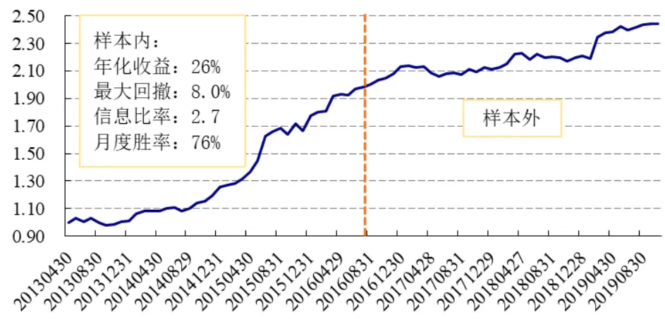
数据来源：wind、开源证券研究所

## 3.1、 对开根号的修正

在聪明钱因子的构造步骤中，S指标的计算公式为S = |R|/√V，分母为分钟成交量 V 的开根号。我们选择开根号的初衷是：（1）开根号有简单清晰的数学图像可对应；（2）大量的实证研究表明，价格变化与成交量的平方根之间存在正比关系。

为了方便讨论，我们不妨尝试一般化，将分钟成交量 V 的指数项定义为可变的参数，这样 S指标公式可以写成如下形式：

$$
\mathsf{S}=|\mathsf{R}|/(\mathsf{V}^{\wedge}\beta)
$$

其中，R 为分钟涨跌幅，V 为分钟成交量，β为分钟成交量 V 的指数项参数。不难看出，当β取值为0.5 时即为原始聪明钱因子S 指标；当β取值为0 时，S 指标可以写为 S=|R|；当β取值为-0.5 时，S 指标可以写为S = |R| ∗ √V的乘积形式。

我们选取若干不同β值分别构造 S 指标，计算对应聪明钱因子，并对因子进行绩效回测。因子历史回测的基本框架为：回测时段为2013年4月30日至 2019年 12月 31 日；样本空间为全体 A 股，剔除 ST 股和上市未满 60 日的新股；每月月初调仓，持仓一个自然月，交易费率千分之三。

从不同β值的IC 均值上看，当β为 0.7 时，因子 IC均值在 0 左右，因子几乎无效；随着β值的逐渐减小，因子IC 均值的绝对值逐渐增大，最后达到一个饱和的平台。可以看出，原始聪明钱因子（β=0.5）的选股能力，远远没有达到最优的状态。

图4：不同β值下的 IC均值与 rankIC均值
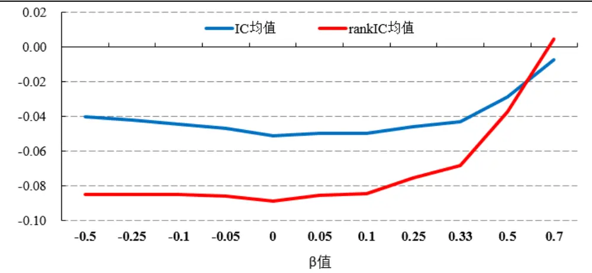
数据来源：wind、开源证券研究所

为了进一步评价因子的选股能力，我们回测了不同β值下的聪明钱因子多空对冲信息比率和多空对冲净值曲线。可以看出，当β由0.7逐渐减小时，信息比率逐渐增加，当β取值为0.1左右时信息比率最大（3.67），当β由0.1继续逐渐减小时，信息比率呈现出缓慢下降的趋势，但整体信息比率均高于 2.5。可以看出，β取值小于0.5 以下的因子选股能力要明显优于原始聪明钱因子（β=0.5），并且当β取值为 0.1左右时，因子的选股能力最强。

需要说明的是：（1）为了排除路径依赖对因子回测结果的影响，我们在月度调仓频率下，分别选取月初、月中、月内 1/4时点、月内3/4时点作为调仓时点，综合比较 4 条不同路径的回测结果后，上述结论依然稳健。（2）为了排除聪明钱因子在其他因子上的暴露对于回测结果的影响，我们将剔除了主要风格因子后的聪明钱因子进行回测，回测结论依旧稳健。

图5：不同β值下的多空对冲信息比率
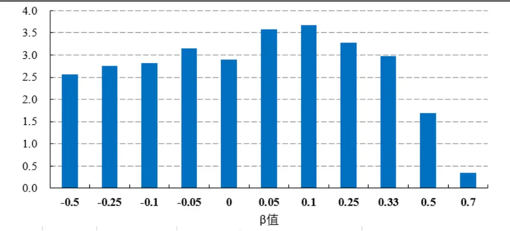
数据来源：wind、开源证券研究所

图6：不同β值下的多空对冲净值（β=0.1处达到最优）
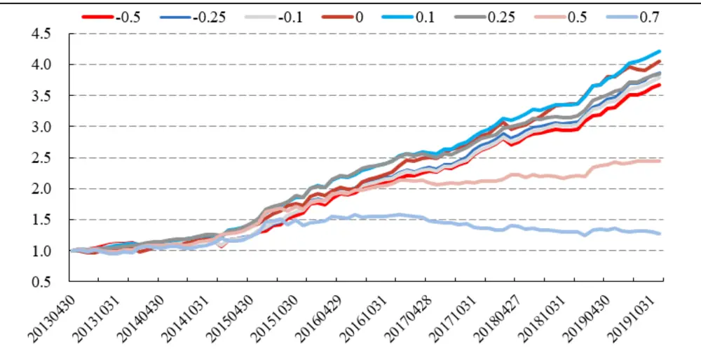
数据来源：wind、开源证券研究所

## 3.2、 S 指标的重新构造

基于不同的逻辑，S指标的构造方式也会不同。本小节我们尝试了 3种不同的S指标构造方式 ，并对因子的选股能力进行回测。表2 给出了这3 种S 指标的公式和含义。

具体来看：S1 指标单独考虑成交量因素，将分钟成交量较大的交易划分为聪明钱交易；S2 指标综合考虑分钟交易的成交量和涨跌幅绝对值排名，将排名之和靠前的交易划分为聪明钱交易；S3指标是基于原始 S指标的变形，我们尝试对分钟成交量作对数变换构造聪明钱因子。

表2：不同S指标公式及含义

| S指标 | 含义 |
| --- | --- |
| S1 = V | 分钟成交量 |
| S2 = rank(\|R\|) + rank(V) | 分钟涨跌幅绝对值分位排名与分钟成交量分位排名之和 |
| S3 = \|R\| / ln(V) | 分钟涨跌幅绝对值除以分钟成交量对数值 |

资料来源：开源证券研究所

我们分别对上述 3 个 S 指标构造的聪明钱因子的选股能力进行了回测，并与原始聪明钱因子进行了比较。3 个 S 指标构造的聪明钱因子的 IC 均值分别为-0.036、-0.043、-0.050，多空对冲信息比率分别为 2.03、2.61、3.74，整体上新因子选股能力均优于原始聪明钱因子（信息比率 1.69），对分钟成交量作对数变换构造的聪明钱因子（S3指标）选股能力最强。

图7：不同S指标下聪明钱因子多空对冲信息比率
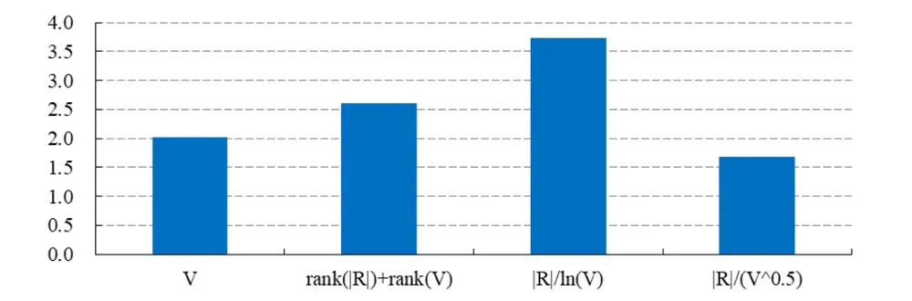
数据来源：wind、开源证券研究所

图8：不同S指标下聪明钱因子多空对冲净值
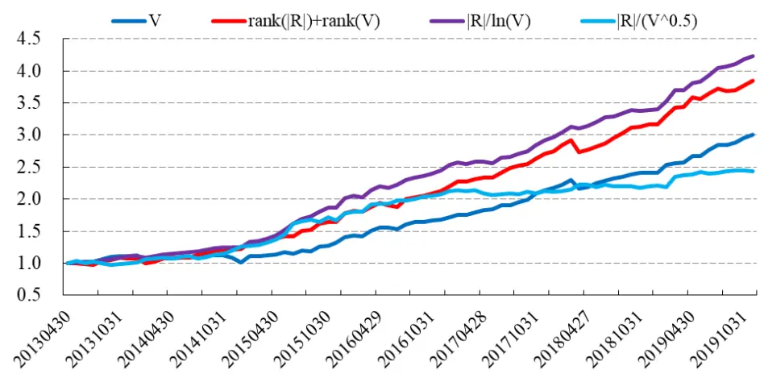
数据来源：wind、开源证券研究所

## 4、 若干重要讨论

## 4.1、 不同截止值的差异

在原始聪明钱因子的构造过程中，我们取成交量累积占比前 20%的分钟视为聪明钱交易，选取 20%作为截止值的原因是考虑到：在我国股票市场中，机构投资者交易占比较低。从不同年份的机构投资者交易占比数据可以看出，机构投资者对全市场成交量的贡献比例在10%-20%之间，年度均值在13%左右。

图9：机构投资者交易占比（历年均值约为 13%）
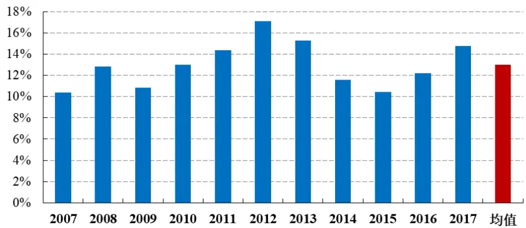
数据来源：上海证券交易所统计年鉴、开源证券研究所（数据更新至 2017 年）

我们基于β值为 0.25 的 S 指标,分别选取 10%、15%、20%、30%、40%、50%作为截止值构造聪明钱因子，并测试不同截止值下因子的选股效果。可以看出，随着截止值的提高，多空对冲信息比率取值逐渐降低，多空对冲收益曲线不断下降。当截止值取值为15%时，信息比率取得最大值（3.35），略高于原始因子 20%截止值的信息比率（3.27），整体上选股能力差异不大。聪明钱因子模型选取 20%作为截止值是具有合理支撑的。

图10：不同截止值下多空对冲信息比率（15%附近达到最优）
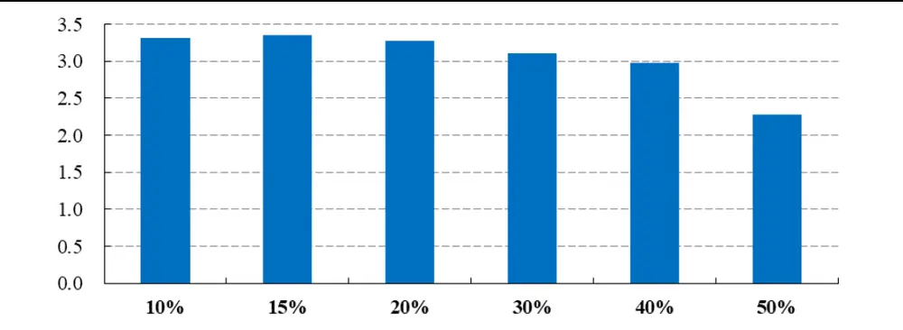
数据来源：wind、开源证券研究所

图11：不同截止值下的多空对冲净值（15%附近达到最优）
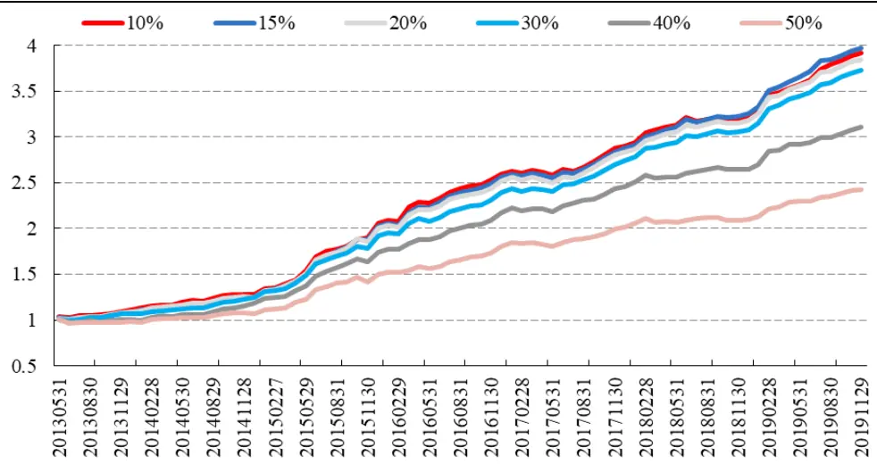
数据来源：wind、开源证券研究所

## 4.2、 不同样本池的差异

改进后的聪明钱因子在不同样本空间均具有较强的选股能力，我们选取β值为0.1（S=|R|/(V^0.1)）与对数成交量（S=|R|/ln(V)）两个 S 指标的聪明钱因子，给出了因子在不同样本空间的多空对冲净值表现。

对于β值为 0.1 下的因子：沪深 300 成分股中，因子多空对冲年化收益 14.5%，信息比率 1.65，月度胜率 74.7%；中证 500成分股中，因子多空对冲年化收益 17.2%，信息比率2.11，月度胜率74.7%；中证1000成分股中，因子多空对冲年化收益26.3%，信息比率 3.81，月度胜率82.3%。

图12：β值为 0.1下因子不同样本空间多空对冲净值（对中小股票效果更优）
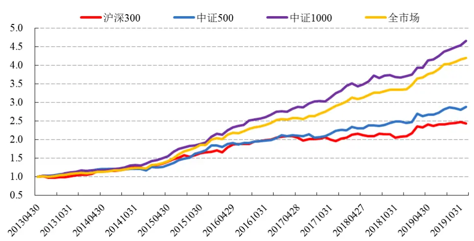
数据来源：wind、开源证券研究所

对于对数成交量下的因子：沪深300 成分股中，因子多空对冲年化收益16.1%，信息比率 1.75，月度胜率 73.4%；中证 500成分股中，因子多空对冲年化收益 18.0%，信息比率2.18，月度胜率74.7%；中证1000成分股中，因子多空对冲年化收益26.5%，信息比率 3.65，月度胜率86.1%。

图13：对数成交量下因子不同样本空间多空对冲净值（对中小股票效果更优）
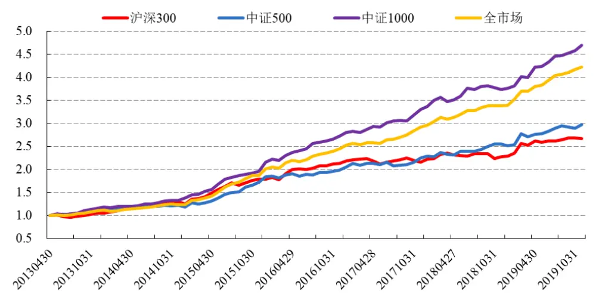
数据来源：wind、开源证券研究所

## 5、 风险提示

模型测试基于历史数据，市场未来可能发生变化。

## 特别声明

《证券期货投资者适当性管理办法》、《证券经营机构投资者适当性管理实施指引（试行）》已于2017年7月1日起正式实施。根据上述规定，开源证券评定此研报的风险等级为R2（中低风险），因此通过公共平台推送的研报其适用的投资者类别仅限定为专业投资者及风险承受能力为C2、C3、C4、C5的普通投资者。若您并非专业投资者及风险承受能力为C2、C3、C4、C5的普通投资者，请取消阅读，请勿收藏、接收或使用本研报中的任何信息。

因此受限于访问权限的设置，若给您造成不便，烦请见谅！感谢您给予的理解与配合。

## 分析师承诺

本报告所包含的分析基于各种假设，不同假设可能导致分析结果出现重大不同。本报告采用的各种估值方法及模型均有其局限性，估值结果不保证所涉及证券能够在该价格交易。

## 股票投资评级说明

|  | 评级 | 说明 |
| --- | --- | --- |
| 证券评级 | 买入（Buy） | 预计相对强于市场表现20%以上； |
|  | 增持（outperform） | 预计相对强于市场表现 5%~20%； |
|  | 中性（Neutral） | 预计相对市场表现在-5%~+5%之间波动； |
|  | 减持（underperform） | 预计相对弱于市场表现5%以下。 |
| 行业评级 | 看好（overweight） | 预计行业超越整体市场表现; |
|  | 中性（Neutral） | 预计行业与整体市场表现基本持平； |
|  | 看淡（underperform） | 预计行业弱于整体市场表现。 |
| 备注：评级标准为以报告日后的6~12个月内，证券相对于市场基准指数的涨跌幅表现，其中A股基准指数为沪深300指数、港股基准指数为恒生指数、新三板基准指数为三板成指（针对协议转让标的）或三板做市指数（针对做市转让标的)、美股基准指数为标普500或纳斯达克综合指数。我们在此提醒您，不同证券研究机构采用不同的评级术语及评级标准。我们采用的是相对评级体系，表示投资的相对比重建议；投资者买入或者卖出证券的决定取决于个人的实际情况，比如当前的持仓结构以及其他需要考虑的因素。投资者应阅读整篇报告，以获取比较完整的观点与信息，不应仅仅依靠投资评级来推断结论。 |  |  |

## 分析、估值方法的局限性说明

本报告所包含的分析基于各种假设，不同假设可能导致分析结果出现重大不同。本报告采用的各种估值方法及模型均有其局限性，估值结果不保证所涉及证券能够在该价格交易。

## 法律声明

开源证券股份有限公司是经中国证监会批准设立的证券经营机构，已具备证券投资咨询业务资格。

本报告仅供开源证券股份有限公司（以下简称“本公司”）的机构或个人客户（以下简称“客户”）使用。本公司不会因接收人收到本报告而视其为客户。本报告是发送给开源证券客户的，属于机密材料，只有开源证券客户才能参考或使用，如接收人并非开源证券客户，请及时退回并删除。

本报告是基于本公司认为可靠的已公开信息，但本公司不保证该等信息的准确性或完整性。本报告所载的资料、工具、意见及推测只提供给客户作参考之用，并非作为或被视为出售或购买证券或其他金融工具的邀请或向人做出邀请。本报告所载的资料、意见及推测仅反映本公司于发布本报告当日的判断，本报告所指的证券或投资标的的价格、价值及投资收入可能会波动。在不同时期，本公司可发出与本报告所载资料、意见及推测不一致的报告。客户应当考虑到本公司可能存在可能影响本报告客观性的利益冲突，不应视本报告为做出投资决策的唯一因素。本报告中所指的投资及服务可能不适合个别客户，不构成客户私人咨询建议。本公司未确保本报告充分考虑到个别客户特殊的投资目标、财务状况或需要。本公司建议客户应考虑本报告的任何意见或建议是否符合其特定状况，以及（若有必要）咨询独立投资顾问。在任何情况下，本报告中的信息或所表述的意见并不构成对任何人的投资建议。在任何情况下，本公司不对任何人因使用本报告中的任何内容所引致的任何损失负任何责任。若本报告的接收人非本公司的客户，应在基于本报告做出任何投资决定或就本报告要求任何解释前咨询独立投资顾问。

本报告可能附带其它网站的地址或超级链接，对于可能涉及的开源证券网站以外的地址或超级链接，开源证券不对其内容负责。本报告提供这些地址或超级链接的目的纯粹是为了客户使用方便，链接网站的内容不构成本报告的任何部分，客户需自行承担浏览这些网站的费用或风险。

开源证券在法律允许的情况下可参与、投资或持有本报告涉及的证券或进行证券交易，或向本报告涉及的公司提供或争取提供包括投资银行业务在内的服务或业务支持。开源证券可能与本报告涉及的公司之间存在业务关系，并无需事先或在获得业务关系后通知客户。

本报告的版权归本公司所有。本公司对本报告保留一切权利。除非另有书面显示，否则本报告中的所有材料的版权均属本公司。未经本公司事先书面授权，本报告的任何部分均不得以任何方式制作任何形式的拷贝、复印件或复制品，或再次分发给任何其他人，或以任何侵犯本公司版权的其他方式使用。所有本报告中使用的商标、服务标记及标记均为本公司的商标、服务标记及标记。

## 开源证券股份有限公司

地址：西安市高新区锦业路1号都市之门B座5层

邮编：710065

电话：029-88365835

传真：029-88365835