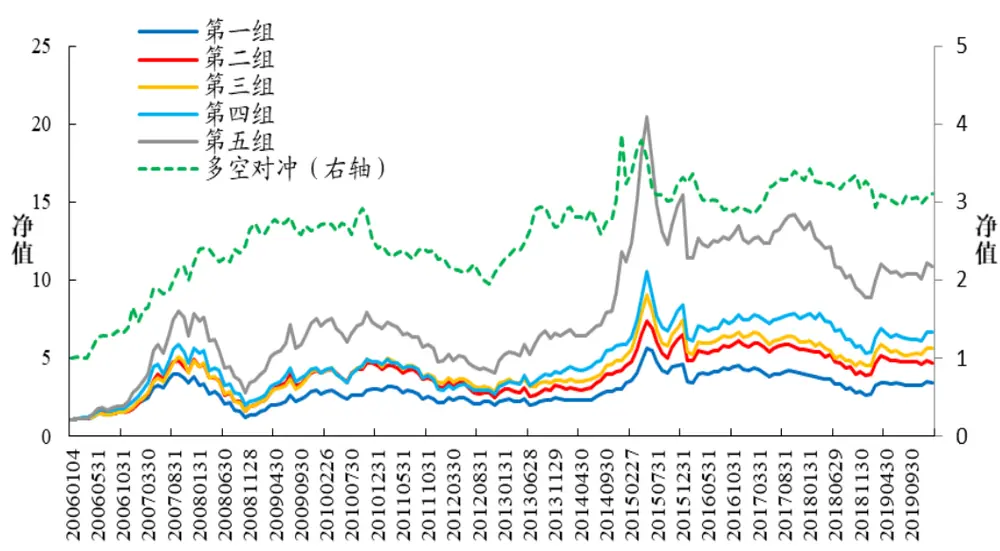
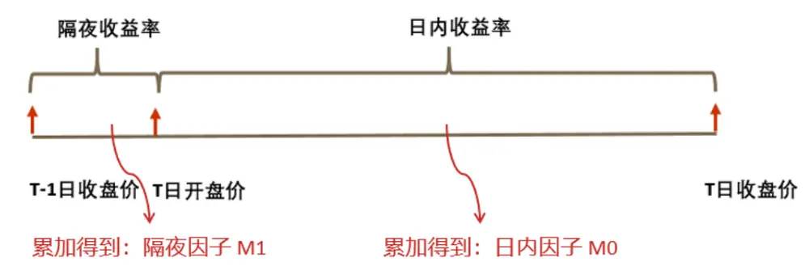
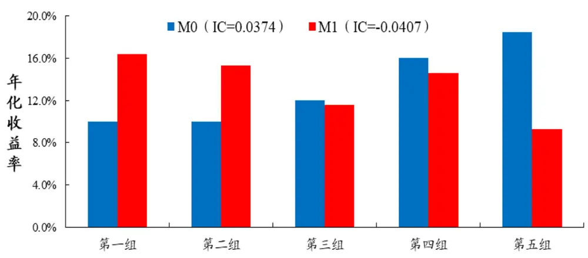
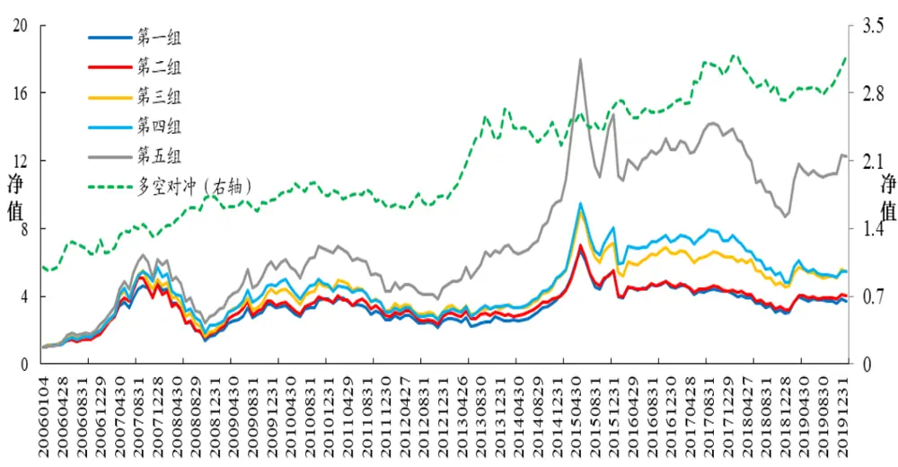
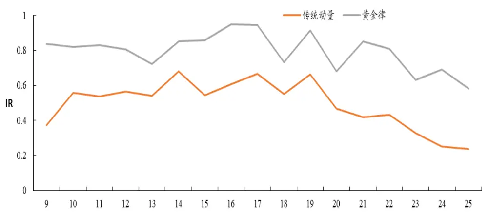
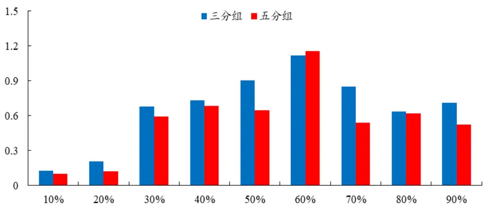
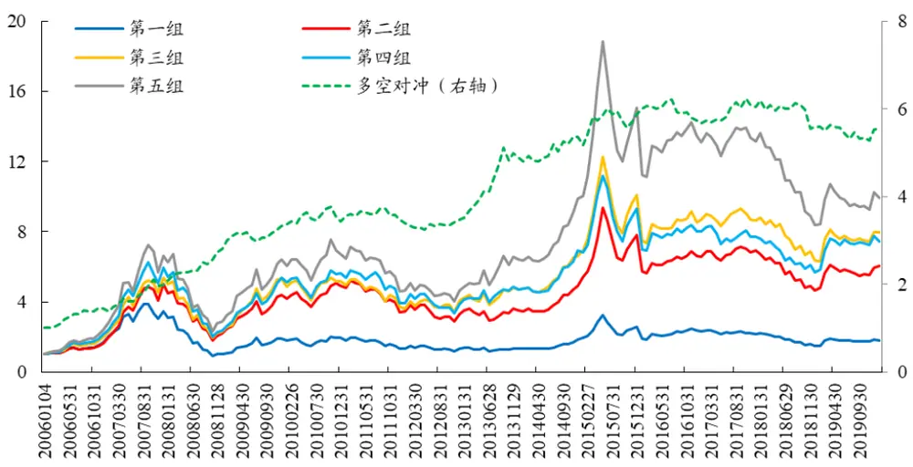
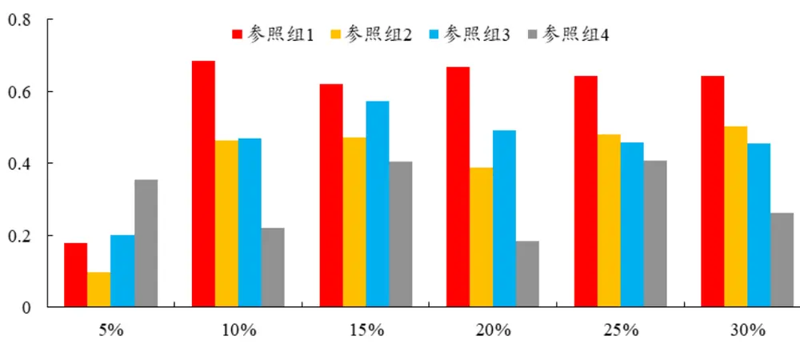

金融工程研究团队

# A股行业动量的精细结构

2020 年 03 月 02 日

# ——市场微观结构研究系列（4）

魏建榕（分析师）

weijianrong@kysec.cn

傅开波（联系人）

fukaibo@kysec.cn

证书编号：S0790519120001

证书编号：S0790119120026

## 相关研究报告

《市场微观结构研究系列（1）-A 股反转之力的微观来源》-2019.12.23

《市场微观结构研究系列（2）-交易行为因子的 2019》-2020.12.29

《市场微观结构研究系列（3）-聪明钱因子模型的 2.0 版本》-2020.2.9

## ⚫ 行业指数存在弱动量效应

在 A 股市场中，行业指数存在着弱的动量效应。所谓动量效应，是指过去表现较好的行业，在未来仍然倾向于有较好的表现。在行业轮动的建模实践中，动量效应是否仍有可用价值呢？在本篇报告里，我们将采取“纵向切割”与“横向切割”的研究手法，剖析隐藏在行业动量中的精细结构，最终构造出有效的行业轮动模型。本报告是开源证券金融工程团队“市场微观结构研究”系列的第 4 篇。

## ⚫ 行业动量的纵向切割：日内动量、隔夜反转

黄金律模型，基于对行业动量的纵向切割。我们将行业指数的每日收益率拆解为两个子部分：日内收益率（今收/今开-1）、隔夜收益率（今开/昨收-1）。在此基础之上，我们将过去 20 个交易日的日内收益率加总，得到日内因子 M0；将过去 20 个交易日的隔夜收益率加总，得到隔夜因子 M1。统计结果显示：日内因子 M0 呈现动量效应，即 M0 数值越大的组，年化收益率越高；隔夜因子 M1 呈现反转效应，即 M1 数值越大的组，年化收益率倾向于越低。我们综合利用这两个方向相反的效应，构建了关于行业轮动的“黄金律模型”，多空对冲年化收益为 8.56%，年化波动为 12.6%，信息比率为 0.68。

## ⚫ 行业动量的横向切割：龙头股动量、普通股反转

龙头股模型，基于对行业动量的横向切割。行业内成分股的股价变化中，存在“领先-滞后、互相牵引”的动力学关系。如何用量化的指标来度量成分股之间牵引力的方向和大小呢？我们首先将行业内成分股按照成交金额排序，划分为龙头股和普通股，计算出牵引力因子 G=(R_龙头-R_普通)。我们利用牵引力因子 G 的分组能力，构建了关于行业轮动的“龙头股模型”，多空对冲年化收益为 12.9%，年化波动为 11.2%，信息比率为 1.15。

## ⚫ 切割是通往精细结构之路

本报告提出的两个模型，是同一个研究框架的两个侧面，是对同一个问题的两种回答。我们面临的核心问题是：行业的动量效应这么微弱，应该怎么办呢？黄金律模型的回答是，在时间轴上进行纵向切割，拆分出两个矛盾的成分：日内动量、隔夜反转，取“日内收益-隔夜收益”作为新的代理变量。龙头股模型的回答是，在成分股中进行横向切割，拆分出两个矛盾的成分：龙头股动量、普通股反转，取“龙头股收益-普通股收益”作为新的代理变量。市场行为模式的晦暗不明，往往只是由于代理变量选得不好，“切割”是剖析精细结构、寻找更优变量的有效方法。

⚫ 风险提示：模型测试基于历史数据，市场未来可能发生变化。

## 1、引言：微弱的行业动量效应

在 A 股市场中，行业指数存在着弱的动量效应。所谓动量效应，是指过去表现较好的行业，在未来仍然倾向于有较好的表现。作为示例，让我们来做一个简单的测算。在每个自然月的月底，我们提取各个申万一级行业指数在过去 20个交易日的区间涨跌幅，简称为Ret20 因子。按照 Ret20 因子的大小，我们将 28 个申万一级行业指数进行排序，分为 5 组，第一组为前期涨幅最低的组，第五组为前期涨幅最高的组。在每个自然月的月底均重复以上操作，各组的净值曲线如图 1 所示。我们可以看到，第五组的累计收益要明显高于第一组，这是动量效应存在的证据。然而，多空对冲的净值曲线（图 1虚线）显示，因子收益的稳定度欠佳，信息比率 IR仅为0.47，反映了动量效应的微弱。更有甚者，我们可以注意到，在 2009 年-2012 年期间的多空对冲收益不断走低，这意味着，行业之间曾经持续地呈现为反转效应。

图1：申万一级行业指数存在微弱的动量效应（Ret20因子）

数据来源：wind、开源证券研究所

那么，在行业轮动的建模实践中，动量效应是否仍有可用价值呢？在本篇报告里，我们将采取“纵向切割”与“横向切割”的研究手法，剖析隐藏在行业动量中的精细结构，最终构造出有效的行业轮动模型。本报告是开源证券金融工程团队“市场微观结构研究”系列的第4 篇。

## 2、行业动量的纵向切割：日内动量、隔夜反转

我们独家提出的黄金律模型，建议对行业动量进行纵向切割。黄金律模型的核心想法是：在交易日内的不同时段，交易者成分存在系统性的差异，因而呈现不同的市场行为特征。在操作层面上，我们将行业指数的每日收益率拆解为两个子部分：日内收益率（今收/今开-1）、隔夜收益率（今开/昨收-1），如图 2 所示。在此基础之上，我们将过去 20个交易日的日内收益率加总，得到日内因子M0；将过去 20 个交易日的隔夜收益率加总，得到隔夜因子 M1。

图2：每日收益率的拆分过程（示意图）

资料来源：开源证券研究所

图3：日内因子M0的动量效应、隔夜因子 M1的反转效应

数据来源：wind、开源证券研究所

我们将日内因子 M0、隔夜因子 M1 分别用于对申万一级行业指数进行排序分组（第一组为因子值最小的组），并计算各组的年化收益率，如图 3 所示。结果显示：日内因子 M0 呈现动量效应，即 M0数值越大的组，年化收益率越高；隔夜因子M1呈现反转效应，即M1数值越大的组，年化收益率倾向于越低。我们综合利用这两个方向背离的效应，构建了关于行业轮动的“黄金律模型”，计算步骤如表1所示。

表1：黄金律模型的计算步骤

| 第一步 | 对每个行业指数，回溯取其过去20日的行情数据； |
| --- | --- |
| 第二步 | 计算每个行业指数的日内因子M0与隔夜因子M1; |
| 第三步 | 将 N 个行业指数按照 M0 值从低到高分别打 1 分至 N 分； |
| 第四步 | 将N 个行业指数按照 M1 值从高到低分别打 1分至 N 分； |
| 第五步 | 将两项打分相加，得到每个行业的总得分。 |

资料来源：开源证券研究所

黄金律模型的五分组净值曲线如图 4 所示。其中，多头组合由每月底总得分最高的 5个行业构成，年化收益为19.5%。多空对冲（图4虚线）的年化收益为8.56%，年化波动为 12.6%，信息比率为0.68。图5 的参数敏感度测试显示，在各种不同的回溯天数下，黄金律模型均优于传统动量因子，且对回溯天数的敏感度明显低于传统动量因子。

图4：黄金律模型的五分组与多空对冲净值（信息比率 IR=0.68）

数据来源：wind、开源证券研究所

图5：关于回溯天数的参数敏感度测试（黄金律模型优于传统动量因子）

数据来源：wind、开源证券研究所

## 3、行业动量的横向切割：龙头股动量、普通股反转

黄金律模型的主要优点有两个方面：其一，模型简洁，计算方便，Excel表格即可处理全部计算过程；其二，现象比较稳健，这一点从参数敏感度测试上可以体现。缺点是，它比较像是一个唯象模型——找到了一个稳定的规律，但缺乏对底层机制的把握。作为对比，本小节我们从成分股微观动力学的角度，对行业动量进行剖析。

建模的思路源自一个令人困惑的问题：在 A 股市场的月度频率上，为何个股是反转效应，而行业指数（个股的集合）却是动量效应？这个问题的困惑之处，让我们来展开讲讲。假设某个行业 S，包含有成分股 B、C、D、E、F。个股的反转效应告诉我们：如果股票 B 本月收益在全市场中偏高，那么次月它将倾向于表现得偏弱；对于股票C、D、E、F亦分别如此。当我们将行业指数S 视为B、C、D、E、F的简单加总时，我们的直觉是：如果本月B、C、D、E、F 都表现得较强，那么次月它们都将倾向于表现得较弱，也就是说，行业指数也应该如同个股一样呈现反转效应。

上述直觉与实证结果相悖，显然是错误的。错误的原因在于，将行业视为个股的“简单加总”，而忽视了行业内成分股之间的相互作用——行业内成分股的股价变化中，存在“领先-滞后、互相牵引”的动力学关系。那么，如何用量化的指标来度量成分股之间牵引力的方向和大小呢？从这个问题出发，我们构建了关于行业轮动的“龙头股模型”，计算步骤如表2所示。

表2：龙头模型的计算步骤

| 第一步 | 对“食品饮料”行业，回溯取过去20日的成分股数据； |
| --- | --- |
| 第二步 | 将成分股按近20日成交金额从大到小排序，逐一累积成交金额； |
| 第三步 | 取累计成交金额占比达到λ%，认定为龙头股，余下则为普通股； |
| 第四步 | 分别计算龙头股、普通股的近20日平均涨幅：R_龙头，R_普通； |
| 第五步 | 食品饮料行业的牵引力因子G=R_龙头-R_普通； |
| 第六步 | 重复以上操作，计算各个行业的牵引力因子。 |

资料来源：开源证券研究所

图6：不同切割参数 λ%下龙头模型的信息比率（λ=60效果最佳）

数据来源：wind、开源证券研究所

图7：龙头股模型的五分组与多空对冲净值（信息比率 IR=1.15）

数据来源：wind、开源证券研究所

图 6 给出了不同切割参数 λ%下龙头模型的信息比率，λ=60 时效果达到最佳。最佳切割参数对应的龙头股模型的五分组净值曲线，如图 7 所示。其中，多头组合由每月底 G 因子最高的 5 个行业构成，年化收益为 17.7%。多空对冲（图 7 虚线）的年化收益为 12.9%，年化波动为11.2%，信息比率为1.15。

在龙头股模型的设计中，包含了多处细节的考虑。其一，龙头股的排序依据，我们推荐采用“成交金额”，而非市值类指标，原因是：成交金额既能大致反映经营规模（基本面因素），也顾及到了交易活跃度（市场行为因素）。其二，龙头股的切割比例，建议落实在“成交金额”上，而非“个股数量”上，理由同上。其三，牵引力因子G 的构造，我们选择“R_龙头-R_普通”，而非“(R_龙头-R_普通)/成分股收益率标准差”，后者着重于检验显著性，而前者着重于考察普通股补涨或补跌空间的大小。为了印证以上讨论的正确性，我们设计了四个参照模型：

参照组 1：对“个股数量”进行切割，其它不变；

参照组 2：对“个股数量”进行切割，牵引力因子G=(R_龙头-R_普通)/成分股收益率标准差，其它不变；

参照组 3：基于“总市值”排序，对“个股数量”进行切割，其它不变；

参照组 4：基于“总市值”排序，对“个股数量”进行切割，牵引力因子 G=(R_龙头-R_普通)/成分股收益率标准差，其它不变。

从图 8 的结果可以看出，四个参照模型在最优切割参数下的信息比率，均明显低于龙头股模型（信息比率=1.15）。

图8：不同切割参数 λ%下参照模型的信息比率（均弱于龙头股模型）

数据来源：wind、开源证券研究所

## 4、结语：切割是通往精细结构之路

本报告提出的两个模型，是同一个研究框架的两个侧面，是对同一个问题的两种回答。我们面临的核心问题是：行业的动量效应这么微弱，应该怎么办呢？黄金律模型的回答是，在时间轴上进行纵向切割，拆分出两个矛盾的成分：日内动量、隔夜反转，取“日内收益-隔夜收益”作为新的代理变量。龙头股模型的回答是，在成分股中进行横向切割，拆分出两个矛盾的成分：龙头股动量、普通股反转，取“龙头股收益-普通股收益”作为新的代理变量。市场行为模式的晦暗不明，往往只是由于代理变量选得不好，“切割”是剖析精细结构、寻找更优变量的有效方法。

## 5、风险提示

模型测试基于历史数据，市场未来可能发生变化。

## 特别声明

《证券期货投资者适当性管理办法》、《证券经营机构投资者适当性管理实施指引（试行）》已于2017年7月1日起正式实施。根据上述规定，开源证券评定此研报的风险等级为R2（中低风险），因此通过公共平台推送的研报其适用的投资者类别仅限定为专业投资者及风险承受能力为C2、C3、C4、C5的普通投资者。若您并非专业投资者及风险承受能力为C2、C3、C4、C5的普通投资者，请取消阅读，请勿收藏、接收或使用本研报中的任何信息。

因此受限于访问权限的设置，若给您造成不便，烦请见谅！感谢您给予的理解与配合。

## 分析师承诺

负责准备本报告以及撰写本报告的所有研究分析师或工作人员在此保证，本研究报告中关于任何发行商或证券所发表的观点均如实反映分析人员的个人观点。负责准备本报告的分析师获取报酬的评判因素包括研究的质量和准确性、客户的反馈、竞争性因素以及开源证券股份有限公司的整体收益。所有研究分析师或工作人员保证他们报酬的任何一部分不曾与，不与，也将不会与本报告中具体的推荐意见或观点有直接或间接的联系。

## 股票投资评级说明

|  | 评级 | 说明 |
| --- | --- | --- |
| 证券评级 | 买入（Buy） | 预计相对强于市场表现20%以上； |
|  | 增持（outperform） | 预计相对强于市场表现 5%~20%; |
|  | 中性（Neutral） | 预计相对市场表现在-5%~+5%之间波动； |
|  | 减持 | 预计相对弱于市场表现5%以下。 |
| 行业评级 | 看好（overweight） | 预计行业超越整体市场表现; |
|  | 中性（Neutral） | 预计行业与整体市场表现基本持平； |
|  | 看淡 | 预计行业弱于整体市场表现。 |
| 备注：评级标准为以报告日后的6~12个月内，证券相对于市场基准指数的涨跌幅表现，其中A股基准指数为沪深300指数、港股基准指数为恒生指数、新三板基准指数为三板成指（针对协议转让标的）或三板做市指数（针对做市转让标的)、美股基准指数为标普500或纳斯达克综合指数。我们在此提醒您，不同证券研究机构采用不同的评级术语及评级标准。我们采用的是相对评级体系，表示投资的相对比重建议；投资者买入或者卖出证券的决定取决于个人的实际情况，比如当前的持仓结构以及其他需要考虑的因素。投资者应阅读整篇报告，以获取比较完整的观点与信息，不应仅仅依靠投资评级来推断结论。 |  |  |

## 分析、估值方法的局限性说明

本报告所包含的分析基于各种假设，不同假设可能导致分析结果出现重大不同。本报告采用的各种估值方法及模型均有其局限性，估值结果不保证所涉及证券能够在该价格交易。

## 法律声明

开源证券股份有限公司是经中国证监会批准设立的证券经营机构，已具备证券投资咨询业务资格。

本报告仅供开源证券股份有限公司（以下简称“本公司”）的机构或个人客户（以下简称“客户”）使用。本公司不会因接收人收到本报告而视其为客户。本报告是发送给开源证券客户的，属于机密材料，只有开源证券客户才能参考或使用，如接收人并非开源证券客户，请及时退回并删除。

本报告是基于本公司认为可靠的已公开信息，但本公司不保证该等信息的准确性或完整性。本报告所载的资料、工具、意见及推测只提供给客户作参考之用，并非作为或被视为出售或购买证券或其他金融工具的邀请或向人做出邀请。本报告所载的资料、意见及推测仅反映本公司于发布本报告当日的判断，本报告所指的证券或投资标的的价格、价值及投资收入可能会波动。在不同时期，本公司可发出与本报告所载资料、意见及推测不一致的报告。客户应当考虑到本公司可能存在可能影响本报告客观性的利益冲突，不应视本报告为做出投资决策的唯一因素。本报告中所指的投资及服务可能不适合个别客户，不构成客户私人咨询建议。本公司未确保本报告充分考虑到个别客户特殊的投资目标、财务状况或需要。本公司建议客户应考虑本报告的任何意见或建议是否符合其特定状况，以及（若有必要）咨询独立投资顾问。在任何情况下，本报告中的信息或所表述的意见并不构成对任何人的投资建议。在任何情况下，本公司不对任何人因使用本报告中的任何内容所引致的任何损失负任何责任。若本报告的接收人非本公司的客户，应在基于本报告做出任何投资决定或就本报告要求任何解释前咨询独立投资顾问。

本报告可能附带其它网站的地址或超级链接，对于可能涉及的开源证券网站以外的地址或超级链接，开源证券不对其内容负责。本报告提供这些地址或超级链接的目的纯粹是为了客户使用方便，链接网站的内容不构成本报告的任何部分，客户需自行承担浏览这些网站的费用或风险。

开源证券在法律允许的情况下可参与、投资或持有本报告涉及的证券或进行证券交易，或向本报告涉及的公司提供或争取提供包括投资银行业务在内的服务或业务支持。开源证券可能与本报告涉及的公司之间存在业务关系，并无需事先或在获得业务关系后通知客户。

本报告的版权归本公司所有。本公司对本报告保留一切权利。除非另有书面显示，否则本报告中的所有材料的版权均属本公司。未经本公司事先书面授权，本报告的任何部分均不得以任何方式制作任何形式的拷贝、复印件或复制品，或再次分发给任何其他人，或以任何侵犯本公司版权的其他方式使用。所有本报告中使用的商标、服务标记及标记均为本公司的商标、服务标记及标记。

开源证券股份有限公司

地址：西安市高新区锦业路1号都市之门B座5层

邮编：710065

电话：029-88365835

传真：029-88365835