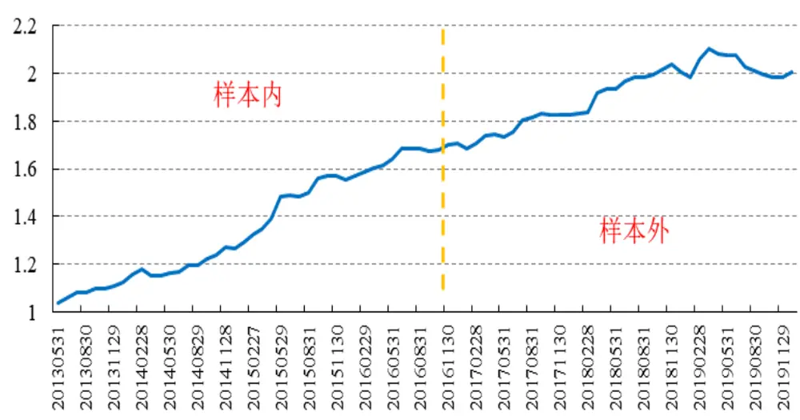
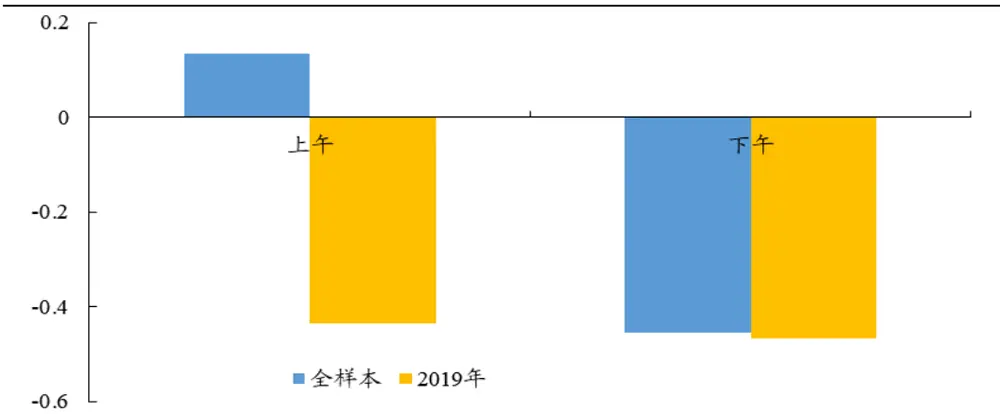
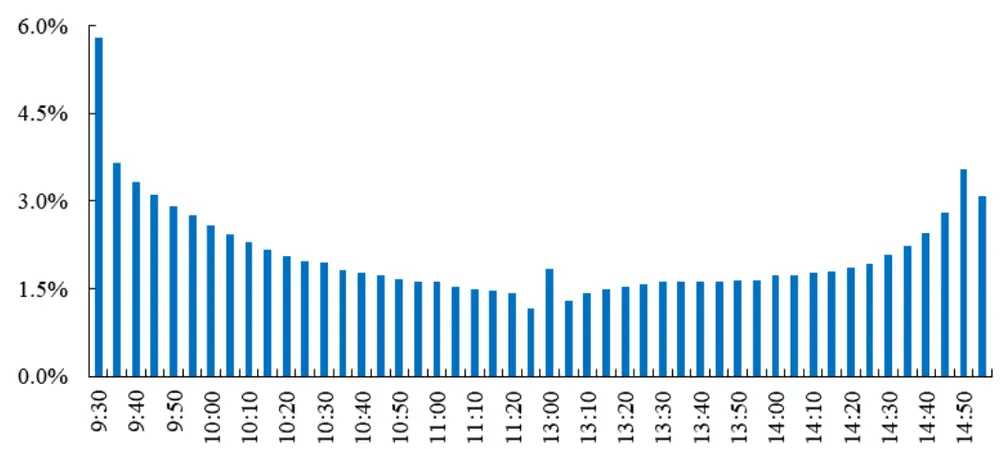
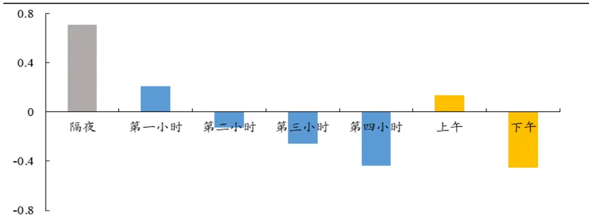
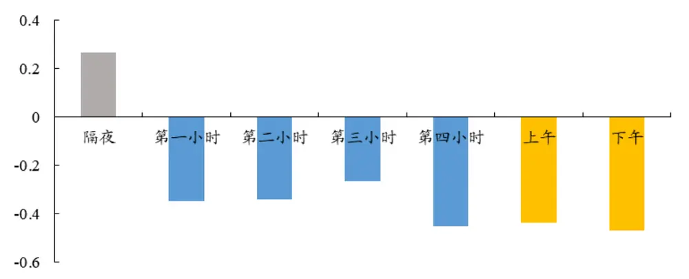
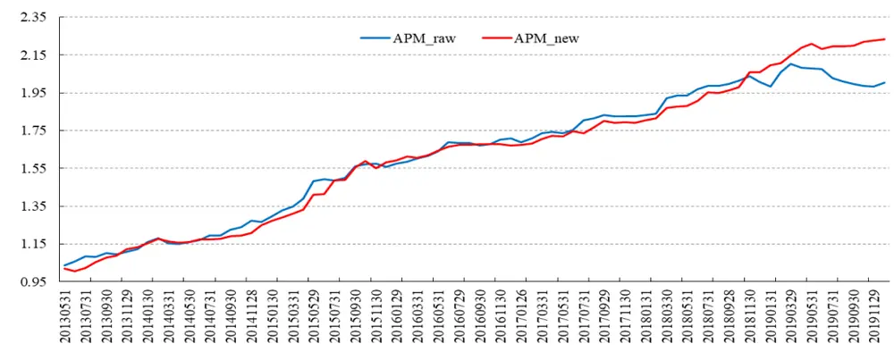
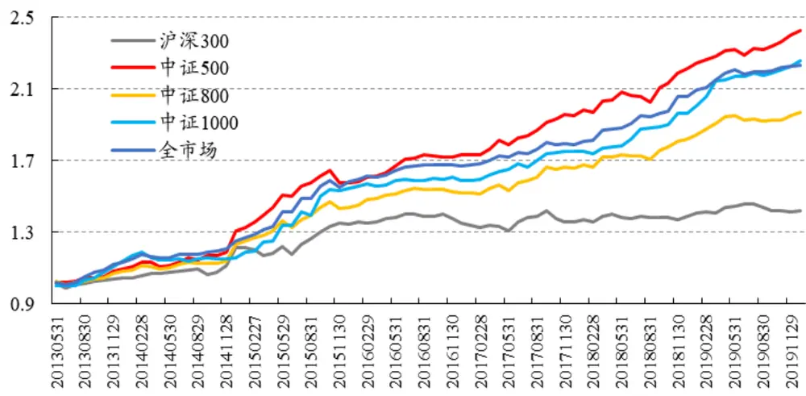
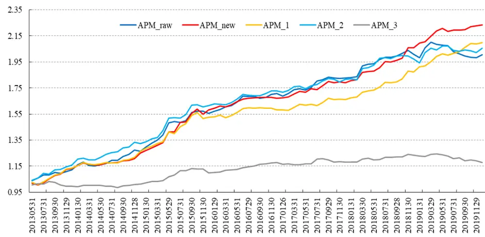
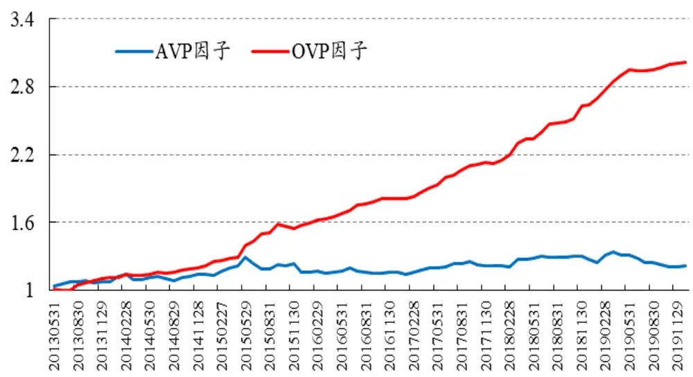

# APM因子模型的进阶版

2020年03月07日

金融工程研究团队

# ——市场微观结构研究系列（5）

魏建榕（分析师）

苏俊豪（联系人）

weijianrong@kysec.cn

sujunhao@kysec.cn

证书编号：S0790519120001

证书编号：S0790120020012

## ⚫ APM因子的构建思想在于股票价格行为存在日内模式差异

我们独家提出的APM因子模型，专注于考察上午（am）与下午（pm）的价格行为差异，并提取出有效的选股因子，在量化投资同行中获得了较好的评价。本报告的主旨是，基于APM因子模型的思想框架，对原始APM因子的改进再作深入的探讨。

## ⚫ APM因子在2019年遭遇连续回撤

APM因子在样本内（2013年5月-2016年10月）表现良好，五分组多空对冲年化收益为15.9%，期间最大回撤为2.52%，信息比率为2.84，月度胜率为78.6%，样本外（2016年11月-2019年12月）的表现略逊于样本内，多空对冲年化收益为6.41%，最大回撤为5.72%。尤其是2019年，因子出现了连续的回撤。

## 相关研究报告

《市场微观结构研究系列（1）-A股反转之力的微观来源》-2019.12.23

《市场微观结构研究系列（2）-交易行为因子的2019年》-2019.12.28

《市场微观结构研究系列（3）-聪明钱因子模型的2.0版本》-2020.02.09

《市场微观结构研究系列（4）-A股行业动量的精细结构》-2020.03.02

## ⚫ APM因子的改进：改进后的APM因子较原始APM因子表现优异

我们通过构造股票分时段收益因子，发现APM因子在2019年的回撤是因为股票在日内交易行为的差异性发生了变化。进一步分析可知，从隔夜到下午，股票分时收益对未来收益的预测性逐步由正转负，但股票上午收益对未来收益的预测性并不稳定，而隔夜收益对未来收益的正向预测性则较为稳定。基于此我们对APM因子使用的数据时段进行了调整，得到了改进APM因子。改进APM因子在2019年的表现显著优于原始APM因子。

## ⚫ 进一步的讨论

其一，我们比较了改进APM因子不同样本空间中的选股能力，发现改进APM因子在中证500成分股中的多空对冲表现优于全市场，但在沪深300成分股中选股能力一般。

其二，我们把APM因子方法论应用于不同时段的比较，构造了一系列的新因子，进一步印证了我们对原始APM因子在2019年失效原因的猜想。

其三，作为开拓式发散，对于股票分时段收益数据的使用，我们也考虑了其他方法。我们把APM因子方法论与W式切割方法的结合起来，在该方案下，使用股票隔夜收益数据与下午收益数据得到的OVP因子表现良好。

⚫ 风险提示：模型测试基于历史数据，市场未来可能发生变化。

## 1、 引言：股票价格行为存在日内模式

在A股市场中，市场微观结构领域的实证研究显示，知情交易概率（probabilityof informed trading）在日内呈现“倒J形”曲线。关于这个现象的简单理解是：由于隔夜时段的交易暂停，每个交易日开盘后，市场累积的大量私有信息，将通过交易迅速释放，因此知情交易概率在开盘后呈现快速下降的形态。换言之，知情交易者更加倾向于在每日上午进行交易，上午的价格行为蕴藏了更多可用于选股的信息量。我们独家提出的APM因子模型，专注于考察上午（am）与下午（pm）的价格行为差异，并提取出有效的选股因子，在量化投资同行中获得了较好的评价。本报告的主旨是，基于APM因子模型的思想框架，对原始APM因子的改进再作深入的探讨。本报告是开源证券金融工程团队“市场微观结构研究”系列的第5篇。

## 2、 2019年原始APM因子表现不佳

通过模型分析上午和下午行情数据所蕴含信息量的差别，是构建APM因子模型的核心思想。

原始APM因子的计算步骤：

第一步：对选定股票，回溯取其过去20日数据，记逐日上午的股票收益率为 $r_{t}^{am}$ ，指数收益率为 $R_{t}^{am}$ ；逐日下午的股票收益率为 $r_{t}^{pm}$ ，指数收益率为 $R_{t}^{pm}$ ；

第二步：将得到的40组上午与下午(r,R)的收益率数据进行回归： $r_{i}=\alpha+\beta R_{i}+$ $\varepsilon_{i}.$ ，得到残差项 $\varepsilon_{i}$

第三步：以上得到的40个残差 $\varepsilon_{i}$ 中，上午残差记为 $\varepsilon_{t}^{am}$ ，下午残差记为 $\varepsilon_{t}^{pm}$ ，进一步计算每日上午与下午残差的差值 $\delta_{t}=\varepsilon_{t}^{am}-\varepsilon_{t}^{pm}$

第四步：构造统计量stat来衡量上午与下午残差的差异程度，计算公式如下 $(\mu$ 为均值， $\sigma$ 为标准差）：

$$
stat=\frac{\mu(\delta_{t})}{\sigma(\delta_{t})/\sqrt{N}}
$$

第五步：为了消除动量因子的影响，将统计量stat对动量因子进行横截面回归：$stat_{j}=bRet20_{j}+\varepsilon_{j}$ ，其中Ret20为股票过去20日的收益率，代表动量因子；

第六步：将回归得到的残差值作为 $APM^{raw}$ 因子。

图1给出了原始APM因子在剔除市值和行业因子后的表现。可以看到，该因子在样本内（2013年5月-2016年10月）表现优异，多空对冲年化收益达到了15.90%，期间最大回撤为2.52%，信息比率为2.84，月度胜率为78.6%；样本外（2016年11月-2019年12月）的表现略逊于样本内，多空对冲年化收益为6.41%，最大回撤为5.72%。尤其是2019年，因子出现了连续的回撤。

图1：APMraw在2019年的表现并不理想（全市场，五分组，多空对冲净值，剔除市值和行业）

数据来源：wind、开源证券研究所

## 3、 2019年APM因子失效源于上午收益的性质反转

APM因子在2019年的表现并不尽如人意，我们希望从源头上去探讨个中原因。回顾APM因子的启发思想与计算过程，我们认为，APM因子的收益来源于股票在上下午交易行为的差异。那么，APM因子在2019年表现不佳，是否在于上下午差异性在2019年发生了变化？

为此，我们从计算APM因子的过程中取中间变量，来构造如下的两个因子：

$$
r_{t}^{am}\colon\dot{\mathfrak{x}}\pm20\ \sharp\sharp\sharp\underline{{\neq}}\ \pounds\in\mathfrak{f}\sharp\sharp\mathfrak{z}\stackrel{}{\mathrm{\#}}\ \sharp\mathfrak{z}\stackrel{}{\mathrm{\#}}\ \mathfrak{h}\varkappa\big|\dot{\mathfrak{z}}
$$

$$
r_{t}^{pm}:\dot{\mathfrak{x}}\dot{\mathfrak{x}}\pm20\boxdot{\mathfrak{h}}\ddot{\mathfrak{x}}\frac{\oplus}{\mathfrak{h}}\top\dddot{\mathfrak{x}}\ddot{\mathfrak{y}}\mathfrak{h}\ddot{\mathfrak{x}}\frac{\ddot{\mathfrak{x}}}{\mathfrak{h}}\mathfrak{x}\ddot{\mathfrak{z}}
$$

分别考察ram和rpm与未来20日股票日收益的相关性，记做ICIRam和ICIRpm。如图2 所示，在全样本区间（2013年6月-2019年12月）与2019年，ICIRam和ICIRpm的均值表现差异较大。

$r_{t}^{am}$ 因子与未来20日股票涨跌幅，在全样本区间内为正相关，而在2019年却是负相关； $r_{t}^{pm}$ 因子与未来20日股票的涨跌幅，在全样本区间内和2019年差异不大，均为负相关。回顾上一章节构建APM因子的步骤三，因子值是通过计算上午和下午残差的差值来计算得到，而上午和下午的收益性质在2019年发生了巨大的改变。因此，原始APM因子在2019年出现了较大的回撤。

图2：ICIRam在全样本区间为正相关，而2019年却为负相关

数据来源：wind、开源证券研究所

## 4、 改进后的APM因子较原始APM因子表现更优异

通过上一章节的分析可以看到，单纯拆分上午和下午两个时间区间在全样本内的因子表现并不稳定。为此，我们将股票日收益率分成隔夜和日内四小时（9:30-10:30、10:30-11:30、13:00-14:00、14:00-15:00）共五个时间区间，来对APM因子做相应的改进。

由于交易时间的限制，交易者并不能在他们接收到信息的当下就立马执行交易，尤其是集合竞价阶段，存在对隔夜信息的大量消化。图3为日内各时段成交量占当日成交量的比重，可以看到开盘集合竞价阶段的占比最高。

图3：日内各时段成交量占当日成交量的比重，集合竞价阶段占比最高

数据来源：wind、开源证券研究所

由此可见，交易者在上午的交易行为很大程度上受隔夜信息的影响，而上午的交易又可以分为集合竞价与连续竞价这两个阶段。之前构建APM因子主要着眼于连续竞价阶段，并没有纳入集合竞价这一时段的信息。而这一时段，恰好是交易者根据隔夜信息开始集中交易的时段。集合竞价的交易导致了股票的跳开，特别是当隔夜有较大信息冲击时常常导致第二日大幅度的跳开。

模仿图2的步骤，我们对全样本和2019年股票分时收益与未来20日涨跌幅做ICIR的统计。从图4和图5可以得到：从隔夜到下午，股票分时收益对未来收益的预测性逐步由正转负，但股票上午收益对未来收益的预测性并不稳定（从2019年可以看出），而隔夜收益对未来收益的正向预测性则较为稳定。

图4：各时段的ICIR从隔夜到下午逐渐连续降低（全样本区间）

数据来源：wind、开源证券研究所

图5：各时段的ICIR从隔夜到下午逐渐连续降低的趋势并不明显（2019年）

数据来源：wind、开源证券研究所

根据上述分时段统计的结果，我们考虑对APM因子的计算做出如下改动：在第一步中，用隔夜收益r overnight替代上午收益rtam，（指数收益也相应用隔夜的指数收益替代），其余步骤不变，回归所得到的因子记为APMnew。剔除市值与行业因子后，改进APM因子（APMnew）与原始APM因子（APMraw）的表现对比如下：

图6：APMnew较APMraw的多空净值明显提升（全市场，五分组，多空净值，剔除行业和市值因素）

数据来源：wind、开源证券研究所

表1：APMnew较APMraw的多空表现明显提升（回测指标）

| 回测指标 | APMnew APMraw |
| --- | --- |
| 年化收益率 | 12.81% 10.99% |
| ICIR | 3.17 2.07 |
| 最大回撤 | 2.32% 5.72% |
| 月度胜率 | 81.25% 70% |

数据来源：wind、开源证券研究所

## 5、 进一步的讨论

本章节，我们将进一步讨论改进后的APM因子的相关性质。

## ⚫ 讨论一：APMnew在各样本区间内的表现

图7为APMnew因子在各个样本范围内的表现，可以看到APMnew因子在沪深300成分股内的选股能力一般，而在中证500成分股内的表现要优于全市场。

图7：APMnew因子在不同样本空间的多空对冲净值，中证500成分股内表现最佳

数据来源：wind、开源证券研究所

## ⚫ 讨论二：APM因子方法论应用于不同时段的比较

在上一章节的讨论中，我们将股票日收益率按时间切分多段，这里我们把APM因子的方法论应用于不同时间段的数据上，构造一系列的因子（见表2）。

表2：APM因子使用的数据时段

| 因子名称 | 时间段1 时间段2 |
| --- | --- |
| APMraw | 上午（9:30-11:30） 下午（13:00-15:00） |
| APMnew 隔夜 | 下午（13:00-15:00） |
| APM_1 | 隔夜 |
|  | 14:00-15:00 9:30-10:30 14:00-15:00 |
| APM_2 APM_3 | 10:30-11:30 13:00-14:00 |

数据来源：wind、开源证券研究所

图8为五个因子在剔除市值与行业因子后的五分组多空净值表现。可以看到：使用了隔夜数据的两个因子（APMnew、APM_1）在2019年表现都较好，而其他只使用日内交易数据的因子则表现逊色。这也进一步印证了我们在第三部分的猜想：APMraw在2019年的回撤是因为股票在日内交易行为的差异性发生了变化。另外，只使用每个交易日中间两小时（10:30-14:00）得到的因子（APM_3）表现较差，我们猜想这是由于市场整体在这段时间成交相对寡淡，难以从中提炼出有效的差异信息。

图8：五个因子中APMnew在2019年表现最佳（全样本，五分组，多空净值，剔除行业市值）

数据来源：wind、开源证券研究所

作为开拓式发散，对于股票分时段收益数据的使用，我们也考虑了其他方法。

## ⚫ 讨论三：APM因子方法论与W式切割方法的结合

我们创新性地提出了W式切割，即通过每日平均单笔成交金额的大小，来切割出反转属性最强的交易日，进一步构造出理想反转因子。我们也可以将这一思想与APM因子进行结合。

从全样本来看，股票在隔夜和上午的收益表现为正向预测性，在下午的收益表现为负向预测性，因此，我们通过如下方法构造因子：

第一步：对选定的股票，回溯其过去20个交易日的数据；

第二步：把股票逐日的涨跌幅拆分成隔夜、上午、下午三个阶段，分别加总，所得和依次记作RO，RA，RP；

第三步：OVP=RO-RP；AVP=RA-RP分别为用隔夜与下午收益和用上午与下午收益计算的因子。

剔除市值与行业因子后，OVP因子与AVP因子的表现如图9和表3所示：OVP因子较AVP因子不管从哪个维度，表现更加优异

图9：OVP因子较AVP因子在多空表现上更优异（全市场、五分组、多空净值、剔除行业市值）

数据来源：wind、开源证券研究所

表3：OVP因子较AVP因子在多空表现上更优异（各回测指标）

| 回测指标 | AVP因子 OVP因子 |
| --- | --- |
| 年化收益率 | 3.00% 18.04% |
| ICIR | 0.15 4.17 |
| 最大回撤 | 11.32% 2.21% |
| 月度胜率 | 53.75% 86.25% |

数据来源：wind、开源证券研究所

## 6、 风险提示

模型测试基于历史数据，市场未来可能发生变化。

## 特别声明

《证券期货投资者适当性管理办法》、《证券经营机构投资者适当性管理实施指引（试行）》已于2017年7月1日起正式实施。根据上述规定，开源证券评定此研报的风险等级为R2（中低风险），因此通过公共平台推送的研报其适用的投资者类别仅限定为专业投资者及风险承受能力为C2、C3、C4、C5的普通投资者。若您并非专业投资者及风险承受能力为C2、C3、C4、C5的普通投资者，请取消阅读，请勿收藏、接收或使用本研报中的任何信息。

因此受限于访问权限的设置，若给您造成不便，烦请见谅！感谢您给予的理解与配合。

## 分析师承诺

负责准备本报告以及撰写本报告的所有研究分析师或工作人员在此保证，本研究报告中关于任何发行商或证券所发表的观点均如实反映分析人员的个人观点。负责准备本报告的分析师获取报酬的评判因素包括研究的质量和准确性、客户的反馈、竞争性因素以及开源证券股份有限公司的整体收益。所有研究分析师或工作人员保证他们报酬的任何一部分不曾与，不与，也将不会与本报告中具体的推荐意见或观点有直接或间接的联系。

## 股票投资评级说明

|  | 评级 | 说明 |
| --- | --- | --- |
| 证券评级 | 买入（Buy） | 预计相对强于市场表现20%以上； |
|  | 增持（outperform） | 预计相对强于市场表现5%~20%; |
|  | 中性（Neutral） | 预计相对市场表现在-5%~+5%之间波动； |
|  | 减持 | 预计相对弱于市场表现5%以下。 |
| 行业评级 | 看好（overweight） | 预计行业超越整体市场表现; |
|  | 中性（Neutral） | 预计行业与整体市场表现基本持平； |
|  | 看淡 | 预计行业弱于整体市场表现。 |
| 备注：评级标准为以报告日后的6~12个月内，证券相对于市场基准指数的涨跌幅表现，其中A股基准指数为沪深300指数、港股基准指数为恒生指数、新三板基准指数为三板成指（针对协议转让标的）或三板做市指数（针对做市转让标的)、美股基准指数为标普500或纳斯达克综合指数。我们在此提醒您，不同证券研究机构采用不同的评级术语及评级标准。我们采用的是相对评级体系，表示投资的相对比重建议；投资者买入或者卖出证券的决定取决于个人的实际情况，比如当前的持仓结构以及其他需要考虑的因素。投资者应阅读整篇报告，以获取比较完整的观点与信息，不应仅仅依靠投资评级来推断结论。 |  |  |

## 分析、估值方法的局限性说明

本报告所包含的分析基于各种假设，不同假设可能导致分析结果出现重大不同。本报告采用的各种估值方法及模型均有其局限性，估值结果不保证所涉及证券能够在该价格交易。

## 法律声明

开源证券股份有限公司是经中国证监会批准设立的证券经营机构，已具备证券投资咨询业务资格。

本报告仅供开源证券股份有限公司（以下简称“本公司”）的机构或个人客户（以下简称“客户”）使用。本公司不会因接收人收到本报告而视其为客户。本报告是发送给开源证券客户的，属于机密材料，只有开源证券客户才能参考或使用，如接收人并非开源证券客户，请及时退回并删除。

本报告是基于本公司认为可靠的已公开信息，但本公司不保证该等信息的准确性或完整性。本报告所载的资料、工具、意见及推测只提供给客户作参考之用，并非作为或被视为出售或购买证券或其他金融工具的邀请或向人做出邀请。本报告所载的资料、意见及推测仅反映本公司于发布本报告当日的判断，本报告所指的证券或投资标的的价格、价值及投资收入可能会波动。在不同时期，本公司可发出与本报告所载资料、意见及推测不一致的报告。客户应当考虑到本公司可能存在可能影响本报告客观性的利益冲突，不应视本报告为做出投资决策的唯一因素。本报告中所指的投资及服务可能不适合个别客户，不构成客户私人咨询建议。本公司未确保本报告充分考虑到个别客户特殊的投资目标、财务状况或需要。本公司建议客户应考虑本报告的任何意见或建议是否符合其特定状况，以及（若有必要）咨询独立投资顾问。在任何情况下，本报告中的信息或所表述的意见并不构成对任何人的投资建议。在任何情况下，本公司不对任何人因使用本报告中的任何内容所引致的任何损失负任何责任。若本报告的接收人非本公司的客户，应在基于本报告做出任何投资决定或就本报告要求任何解释前咨询独立投资顾问。

本报告可能附带其它网站的地址或超级链接，对于可能涉及的开源证券网站以外的地址或超级链接，开源证券不对其内容负责。本报告提供这些地址或超级链接的目的纯粹是为了客户使用方便，链接网站的内容不构成本报告的任何部分，客户需自行承担浏览这些网站的费用或风险。

开源证券在法律允许的情况下可参与、投资或持有本报告涉及的证券或进行证券交易，或向本报告涉及的公司提供或争取提供包括投资银行业务在内的服务或业务支持。开源证券可能与本报告涉及的公司之间存在业务关系，并无需事先或在获得业务关系后通知客户。

本报告的版权归本公司所有。本公司对本报告保留一切权利。除非另有书面显示，否则本报告中的所有材料的版权均属本公司。未经本公司事先书面授权，本报告的任何部分均不得以任何方式制作任何形式的拷贝、复印件或复制品，或再次分发给任何其他人，或以任何侵犯本公司版权的其他方式使用。所有本报告中使用的商标、服务标记及标记均为本公司的商标、服务标记及标记。

开源证券股份有限公司

地址：西安市高新区锦业路1号都市之门B座5层

邮编：710065

电话：029-88365835

传真：029-88365835