证书编号：S0790519120001

2020 年 5 月 12 日

## 金融工程研究团队

邮箱：weijianrong@kysec.cn

魏建榕（首席分析师）

## 傅开波（研究员）

邮箱：fukaibo@kysec.cn

证书编号：S0790119120026

## 高 鹏（研究员）

邮箱：gaopeng@kysec.cn

证书编号：S0790119120032

## 苏俊豪（研究员）

邮箱：sujunhao@kysec.cn

证书编号：S0790120020012

## 胡亮勇（研究员）

邮箱：huliangyong@kysec.cn

证书编号：S0790120030040

## 相关研究报告

《市场微观结构研究系列（1）-A 股反转之力的微观来源》-2019.12.23《市场微观结构研究系列（2）-交易行为因子的 2019 年》-2019.12.28《市场微观结构研究系列（3）-聪明钱因子模型的 2.0 版本》-2020.02.09《市场微观结构研究系列（4）-A 股行业动量的精细结构》-2020.03.02《市场微观结构研究系列（5）-APM因子模型的进阶版》-2020.03.07

## 交易者行为与市值风格

## ——市场微观结构研究系列（6）

## 魏建榕（分析师）

weijianrong@kysec.cn

## 苏俊豪（联系人）

证书编号：S0790519120001

sujunhao@kysec.cn

证书编号：S0790120020012

## ⚫ 市值风格因子与交易者行为关系密切

市值风格因子在市场上广受关注，关于市值因子收益的来源也是众说纷纭，本文从市值风格因子与交易者行为的关系出发，通过研究市值风格变化过程中交易者行为的变化，探究市值因子收益的来源，同时挖掘交易者行为因子中独特的alpha。

## ⚫ 市值风格的转向往往伴随着资金的流动

市值因子与成交额强相关，流通市值越大的股票，其成交额通常也越大。伴随着市值风格的转向，资金在大市值股票与小市值股票之间流动，使得市值因子与成交额的相关程度发生变化。

## ⚫ 成交占比因子具有超额信息

市场中有形形色色的交易者，我们按照挂单金额，对每笔交易做一个简单的划分，在此基础上构造出描述交易者结构的成交占比因子。成交占比因子与市值因子有较强的相关性，成交占比因子之间也有一定关联。成交占比因子在市值中性化后收益不够显著，但利用线性回归从超大单占比因子中提纯得到的 EVL 因子则有着较好的表现，EVL 因子年化多空收益为 18.66%，ICIR为 1.85，市值中性化后ICIR 提升至 2.39。

## ⚫ 小单成交额因子表现良好

成交额因子收益比市值因子更高，且剔除市值因子后，成交额因子仍有显著收益；把成交占比因子与成交额因子结合计算得到的超大单、大单、中单以及小单成交额因子具有更加精细的信息，其中小单成交额因子年化多空收益达 14.67%，ICIR为-1.90。

⚫ 风险提示：模型测试基于历史数据，市场未来可能发生变化。

## 1、 市值风格与交易者行为关系密切

市值因子在外与国内市场都是最强的风格因子之一。在大部分历史时段中，小市值股票较大市值股票有着显著的超额收益。在A 股市场，特别是 2017年之前，这一现象尤为显著。但在2017年的蓝筹股牛市中，市值风格发生了明显转向，而在此之后，大盘股与小盘股基本呈现出轮流占优的态势，小盘股持续强势的情况鲜有出现。

图1：市值因子表现（全市场五分组多空，月度换仓）
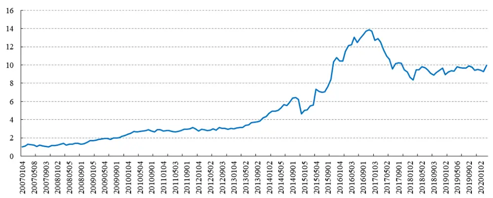
数据来源：Wind、开源证券研究所

关于 A 股市场小市值溢价的来源，各类研究众说纷纭，其中包括风险溢价、流动性溢价以及壳价值效应等。在本篇报告中，我们将从市场微观结构的视角，探讨市值风格与交易者行为的深层关联，并尝试构造出更为稳健有效的同类因子。

## 1.1、 成交额与市值风格

直觉上我们都知道，市值越大的股票，通常成交额也越大。这一点从图 2 中可以得到印证：在大部分时间里，流通市值与成交额在横截面上的相关性都显著为正。更进一步地，在图2中，通过与市值因子累计收益的比较，我们发现：当小市值风格显著占优时，流通市值与成交额的相关系数会降低；反之，当大市值风格占优时，相关性则会走高。对此，我们认为可以这样直观理解：小市值股票表现较好时，将吸引资金流入，使得成交额上升，从而导致市值与成交额的相关系数下降；反过来，当大市值风格占优时，资金从小市值股票中流出，推高了流通市值与成交额的相关性。

图2：流通市值与成交额呈正相关
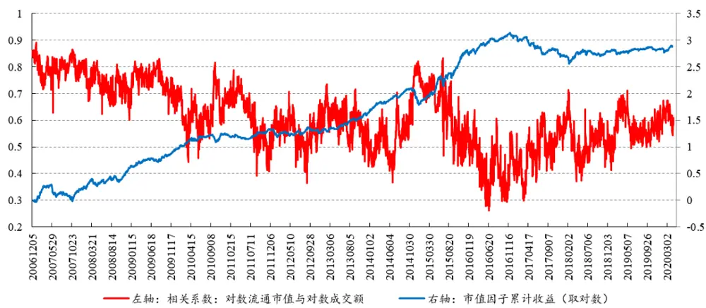
数据来源：Wind、开源证券研究所

## 1.2、 交易者结构与市值风格

市场中有机构与散户等形形色色的参与者，不同的股票，其交易者结构也不同。我们可以按照挂单金额的大小，对每笔成交做一个简单的划分：超大单（>100万元）、大单（20万元~100 万元）、中单（4万元~20 万元）、小单（<4万元），我们回看每个股票在过去 20个交易日的超大单、大单、中单、小单成交额之和，分别与总成交额相除，得到超大单（exlarge）、大单（large）、中单（median）与小单（small）占比因子。

$$
Ratio_{exlarge}=\frac{sum\big(amount_{exlarge}\big)}{sum\left(amount_{total}\right)}
$$

$$
Ratio_{large}=\frac{sum\bigl(amount_{large}\bigr)}{sum(amount_{total})}
$$

$$
Ratio_{median}=\frac{sum(amount_{median})}{sum(amount_{total})}
$$

$$
Ratio_{small}=\frac{sum(amount_{small})}{sum(amount_{total})}
$$

从各占比因子与对数市值的相关性可以看出，市值越小，超大单与大单成交占比越低，中单与小单成交占比越高。这与我们通常的印象也相符：机构投资者倾向于交易流动性较好的大盘股，而散户则更热衷于小盘股。

图3：市值与大单、超大单占比正相关，与小单、中单占比负相关
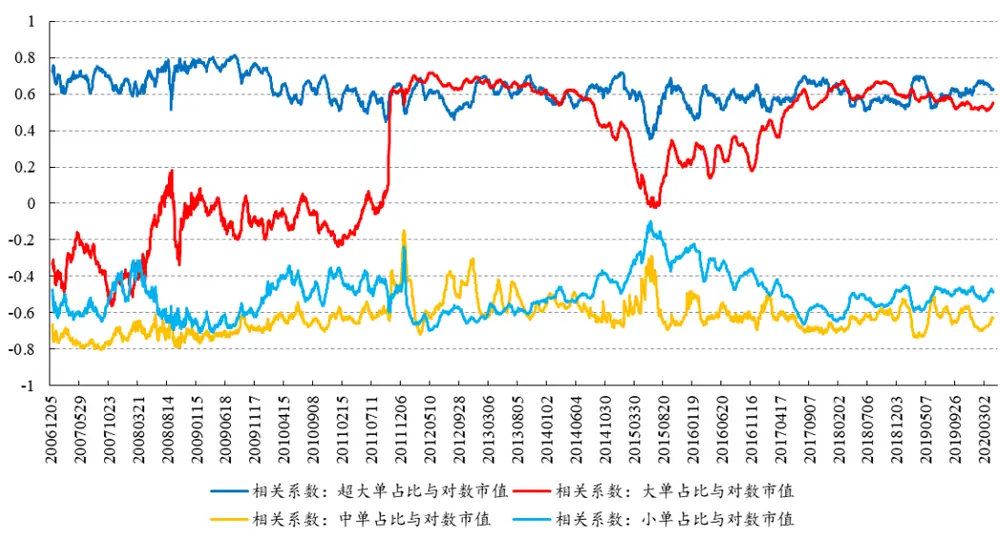
数据来源：Wind、开源证券研究所

上一小节中我们提到，市值风格的转换往往也伴随着资金流在大市值股票与小市值股票间的转移。在这个过程中，股票的交易者结构也会发生变化。我们把超大单占比因子与大单占比因子相加，得到大单以上成交占比因子，考察其与市值的相关性。如图 4 所示，当小市值风格占优时，大单以上成交占比因子与市值的相关性下降。这说明此时小市值股票的成交中，大单与超大单的占比相对提升了。

图4：小市值风格占优时，大单以上成交占比因子与市值的相关性下降
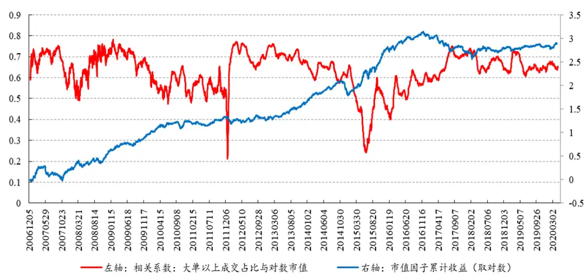
数据来源：Wind、开源证券研究所

## 2、 成交占比因子具有超额信息

在第一部分的讨论中，我们发现成交占比因子与市值因子有着较高的相关性，可以猜测其表现与市值风格因子也有同步性。图 5 展示了成交占比因子五分组多空对冲的净值表现，这其中，超大单因子表现最好，多空年化收益率达 16.31%，ICIR为-1.22，且在2018年后表现显著优于市值因子。但是在剔除市值因子后，因子多空年化收益率下降至 4.60%，ICIR 也降至-1.12。

图5：超大单占比因子在2018年后表现显著优于市值因子
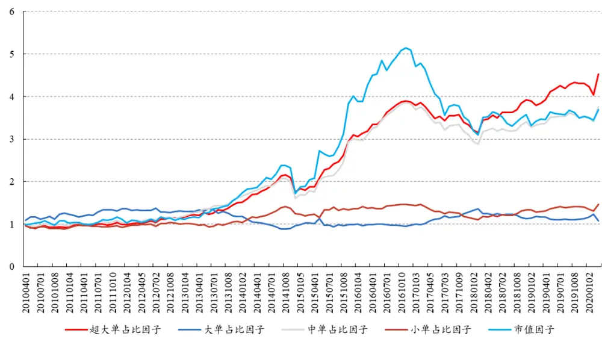
数据来源：Wind、开源证券研究所

以上计算表明，成交占比因子中可能有着市值以外的超额信息，但市值中性化后因子表现却又不够理想。如何解决这个问题呢？下面我们将尝试更加有效的信息提纯方式。回顾各成交占比因子与市值因子的关系，不难推测各成交占比因子间也有较强的相关性，如表 1所示。

表1：各成交占比因子间的截面相关系数均值

| 超大 | 大 | 中 | 小 |
| --- | --- | --- | --- |
| 超大 | 1 0.37 | -0.75 | -0.70 |
| 大 |  | 1 -0.19 | -0.67 |
| 中 |  | 1 | 0.51 |
| 小 |  |  | 1 |

数据来源：Wind、开源证券研究所

因此，我们尝试模仿市值中性化的方法，用两个成交占比因子之间的中性化去构造新的因子，以超大单占比因子和大单占比因子为例，具体方法如下：

(1) 在t时刻，记截面上超大单占比因子的因子值为 $y_{t}$ ，大单占比因子的因子值为 $x_{t}$ ；

(2) 作线性回归 $y_{t}=ax_{t}+b+\varepsilon_{t}$ ，得到相应的残差 ${\varepsilon}_{t}$

(3) 把残差 ${\varepsilon}_{t}$ 作为新因子 EVL。

按以上方法，从超大单占比因子中分别剔除大单占比因子、中单占比因子与小单占比因子，所得新因子依次记为 EVL、EVM、EVS。测试发现，三个新因子均有不俗表现。其中，EVL 因子多空年化收益可达 18.66%，ICIR为 1.85，且该因子在市值中性化后依旧稳健，多空年化收益为11.44%，ICIR为 2.39，最大回撤仅 6.09%。

图6：EVL、EVM、EVS因子均有不俗表现（原始因子）
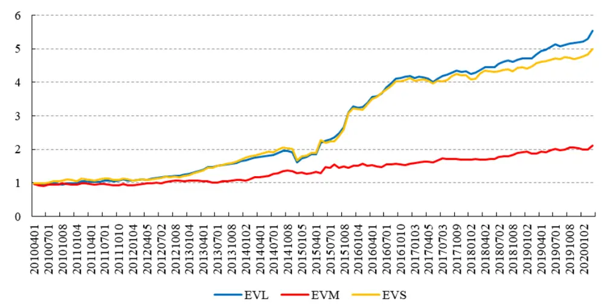
数据来源：Wind、开源证券研究所

图7：EVL、EVM、EVS因子均有不俗表现（市值中性化后）
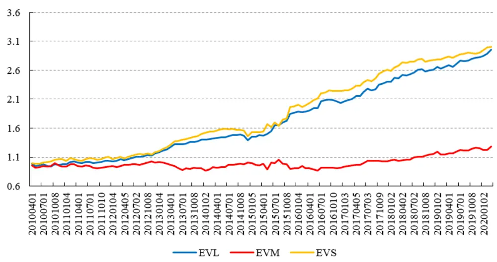
数据来源：Wind、开源证券研究所

## 3、 成交额因子：剔除市值因子后空头收益更显著

比起成交占比因子，成交额因子与市值的相关性更强。事实上，成交额因子比市值因子的收益更高，并且在剔除市值因子的影响后，成交额因子仍有一定收益。相反地，市值因子在剔除成交额因子后收益则不再显著（如图8、图 9所示）。

图8：成交额因子比市值因子收益更高
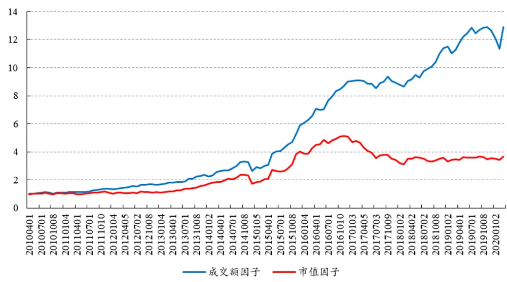
数据来源：Wind、开源证券研究所

图9：成交额因子剔除市值因子后仍有一定收益
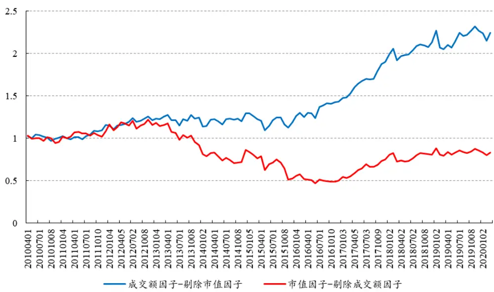
数据来源：Wind、开源证券研究所

进一步考察成交额因子的分组超额收益，我们发现，剔除市值的影响后，成交额因子的多空收益主要由因子值最大组（第五组）体现。分组收益的排序方向表明，相同市值下，成交额越高，预期收益越低。从交易的角度上可以解读为：前期被过度关注炒作的股票，未来预期收益会走低。

图10：成交额因子的分组超额收益
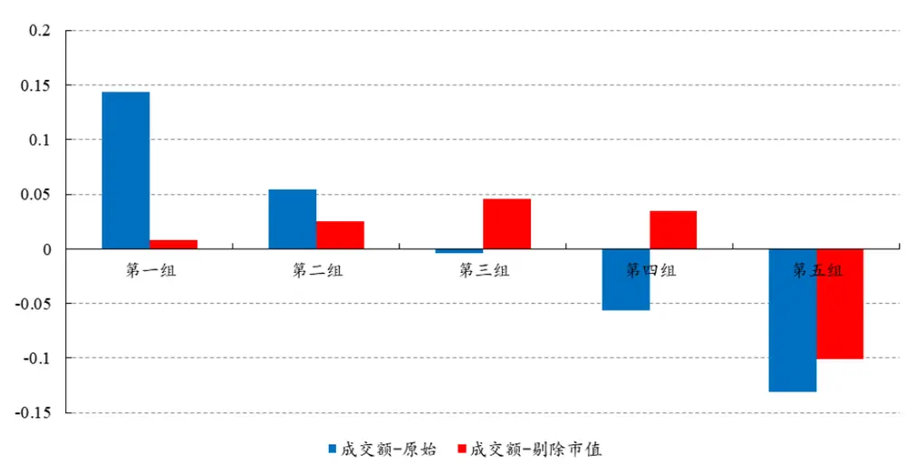
数据来源：Wind、开源证券研究所

那么，细化来说，哪一类交易者的过度涌入，对股票后续收益的影响更大呢？我们使用成交占比因子乘以成交额因子得到对应的调整后的成交额因子：超大单成交额、大单成交额、中单成交额、小单成交额。如图 11 所示，在剔除了市值的影响之后，各成交额因子的表现有明显的分化，其中小单、中单成交额因子收益较为显著，且表现均优于原始成交额因子，小单成交额因子市值中性化后年化多空收益仍有14.67%，ICIR为-1.90。可以说，小单交易者过度涌入的股票，过后更容易落得一地鸡毛。

图11：超大单、大单、中单、小单与原始成交额因子的表现（市值中性化后）
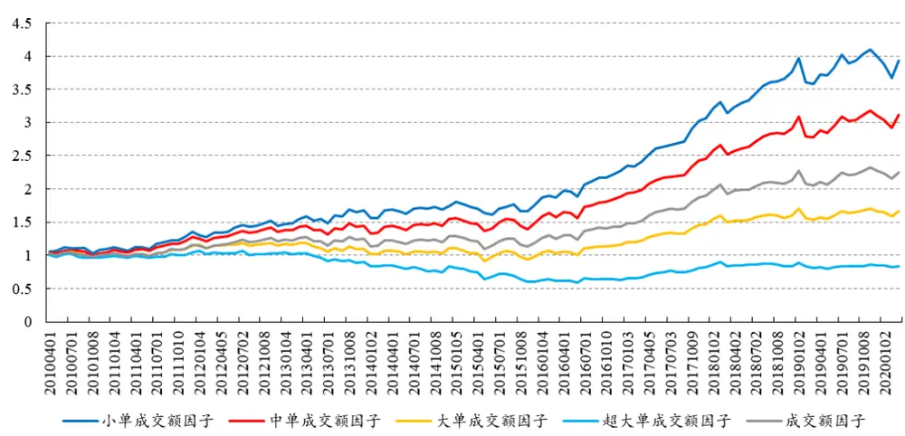
数据来源：Wind、开源证券研究所

## 4、 风险提示

模型测试基于历史数据，市场未来可能发生变化。

## 特别声明

《证券期货投资者适当性管理办法》、《证券经营机构投资者适当性管理实施指引（试行）》已于2017年7月1日起正式实施。根据上述规定，开源证券评定此研报的风险等级为R2（中低风险），因此通过公共平台推送的研报其适用的投资者类别仅限定为专业投资者及风险承受能力为C2、C3、C4、C5的普通投资者。若您并非专业投资者及风险承受能力为C2、C3、C4、C5的普通投资者，请取消阅读，请勿收藏、接收或使用本研报中的任何信息。

因此受限于访问权限的设置，若给您造成不便，烦请见谅！感谢您给予的理解与配合。

## 分析师承诺

负责准备本报告以及撰写本报告的所有研究分析师或工作人员在此保证，本研究报告中关于任何发行商或证券所发表的观点均如实反映分析人员的个人观点。负责准备本报告的分析师获取报酬的评判因素包括研究的质量和准确性、客户的反馈、竞争性因素以及开源证券股份有限公司的整体收益。所有研究分析师或工作人员保证他们报酬的任何一部分不曾与，不与，也将不会与本报告中具体的推荐意见或观点有直接或间接的联系。

## 股票投资评级说明

|  | 评级 | 说明 |
| --- | --- | --- |
| 证券评级 | 买入（Buy） | 预计相对强于市场表现20%以上； |
|  | 增持（outperform） | 预计相对强于市场表现 5%~20%; |
|  | 中性（Neutral） | 预计相对市场表现在-5%~+5%之间波动； |
|  | 减持 | 预计相对弱于市场表现5%以下。 |
| 行业评级 | 看好（overweight） | 预计行业超越整体市场表现; |
|  | 中性（Neutral） | 预计行业与整体市场表现基本持平； |
|  | 看淡 | 预计行业弱于整体市场表现。 |
| 备注：评级标准为以报告日后的6~12个月内，证券相对于市场基准指数的涨跌幅表现，其中A股基准指数为沪深300指数、港股基准指数为恒生指数、新三板基准指数为三板成指（针对协议转让标的）或三板做市指数（针对做市转让标的)、美股基准指数为标普500或纳斯达克综合指数。我们在此提醒您，不同证券研究机构采用不同的评级术语及评级标准。我们采用的是相对评级体系，表示投资的相对比重建议；投资者买入或者卖出证券的决定取决于个人的实际情况，比如当前的持仓结构以及其他需要考虑的因素。投资者应阅读整篇报告，以获取比较完整的观点与信息，不应仅仅依靠投资评级来推断结论。 |  |  |

## 分析、估值方法的局限性说明

本报告所包含的分析基于各种假设，不同假设可能导致分析结果出现重大不同。本报告采用的各种估值方法及模型均有其局限性，估值结果不保证所涉及证券能够在该价格交易。

## 法律声明

开源证券股份有限公司是经中国证监会批准设立的证券经营机构，由陕西开源证券经纪有限责任公司变更延续的专业证券公司，已具备证券投资咨询业务资格。

本报告仅供开源证券股份有限公司（以下简称“本公司”）的机构或个人客户（以下简称“客户”）使用。本公司不会因接收人收到本报告而视其为客户。本报告是发送给开源证券客户的，属于机密材料，只有开源证券客户才能参考或使用，如接收人并非开源证券客户，请及时退回并删除。

本报告是基于本公司认为可靠的已公开信息，但本公司不保证该等信息的准确性或完整性。本报告所载的资料、工具、意见及推测只提供给客户作参考之用，并非作为或被视为出售或购买证券或其他金融工具的邀请或向人做出邀请。本报告所载的资料、意见及推测仅反映本公司于发布本报告当日的判断，本报告所指的证券或投资标的的价格、价值及投资收入可能会波动。在不同时期，本公司可发出与本报告所载资料、意见及推测不一致的报告。客户应当考虑到本公司可能存在可能影响本报告客观性的利益冲突，不应视本报告为做出投资决策的唯一因素。本报告中所指的投资及服务可能不适合个别客户，不构成客户私人咨询建议。本公司未确保本报告充分考虑到个别客户特殊的投资目标、财务状况或需要。本公司建议客户应考虑本报告的任何意见或建议是否符合其特定状况，以及（若有必要）咨询独立投资顾问。在任何情况下，本报告中的信息或所表述的意见并不构成对任何人的投资建议。在任何情况下，本公司不对任何人因使用本报告中的任何内容所引致的任何损失负任何责任。若本报告的接收人非本公司的客户，应在基于本报告做出任何投资决定或就本报告要求任何解释前咨询独立投资顾问。

本报告可能附带其它网站的地址或超级链接，对于可能涉及的开源证券网站以外的地址或超级链接，开源证券不对其内容负责。本报告提供这些地址或超级链接的目的纯粹是为了客户使用方便，链接网站的内容不构成本报告的任何部分，客户需自行承担浏览这些网站的费用或风险。

开源证券在法律允许的情况下可参与、投资或持有本报告涉及的证券或进行证券交易，或向本报告涉及的公司提供或争取提供包括投资银行业务在内的服务或业务支持。开源证券可能与本报告涉及的公司之间存在业务关系，并无需事先或在获得业务关系后通知客户。

本报告的版权归本公司所有。本公司对本报告保留一切权利。除非另有书面显示，否则本报告中的所有材料的版权均属本公司。未经本公司事先书面授权，本报告的任何部分均不得以任何方式制作任何形式的拷贝、复印件或复制品，或再次分发给任何其他人，或以任何侵犯本公司版权的其他方式使用。所有本报告中使用的商标、服务标记及标记均为本公司的商标、服务标记及标记。

开源证券股份有限公司

地址：西安市高新区锦业路1号都市之门B座5层

邮编：710065

电话：029-88365835

传真：029-88365835