证书编号：S0790519120001

邮箱：weijianrong@kysec.cn

魏建榕（首席分析师）

## 金融工程研究团队

2020 年 05 月 16 日

## 傅开波（研究员）

证书编号：S0790119120026

## 高 鹏（研究员）

邮箱：gaopeng@kysec.cn

邮箱：fukaibo@kysec.cn

证书编号：S0790119120032

## 苏俊豪（研究员）

邮箱：sujunhao@kysec.cn

证书编号：S0790120020012

## 胡亮勇（研究员）

邮箱：huliangyong@kysec.cn

证书编号：S0790120030040

## 相关研究报告

《市场微观结构研究系列（1）-A股反转之力的微观来源》-2019.12.23《市场微观结构研究系列（2）-交易行为因子的2019年》-2019.12.28《市场微观结构研究系列（3）-聪明钱因子模型的2.0版本》-2020.02.09《市场微观结构研究系列（4）-A股行业动量的精细结构》-2020.03.02《市场微观结构研究系列（5）-APM因子模型的进阶版》-2020.03.07《市场微观结构研究系列（6）-交易者行为与市值风格》-2020.5.12

## 振幅因子的隐藏结构

# ——市场微观结构研究系列（7）

高鹏（联系人）

## 魏建榕（分析师）

weijianrong@kysec.cn

证书编号：S0790519120001

gaopeng@kysec.cn

苏俊豪（联系人）

证书编号：S0790119120032

sujunhao@kysec.cn

证书编号：S0790120020012

## ⚫ 振幅因子具有负向选股能力，但稳定性不佳

在国内外股票市场中，长期存在着低波动异象（Low-Volatility Anomaly），低波动股票收益表现往往优于高波动股票。我们选取股价振幅因子作为波动类因子的代理变量，测试结果显示：振幅因子具备一定负向选股能力，但选股效果的稳定性不佳。在全A样本空间内，振幅因子月度 IC 均值为-0.035，rankIC均值为-0.068，ICIR值为-0.77，月度胜率仅为 59.2%。同时，振幅因子的五分组收益并不单调，且多空对冲收益主要为空头收益贡献。

## ⚫ 振幅因子的切割：高价振幅因子具有更强的负向选股能力

为了考察振幅因子的隐藏结构，我们按照股价维度将振幅因子切割为：高价态振幅因子和低价态振幅因子。测试结果显示，高价振幅和低价振幅所蕴含的信息存在结构性差异。相比于传统振幅因子，高价振幅因子具有更强的负向选股能力，低价区域的振幅因子选股能力逐渐减弱。

## ⚫ 理想振幅因子的选股能力要显著优于高价振幅因子

我们在横截面上对高价振幅因子进行标准化处理，将高价振幅因子与低价振幅因子作差构造得到理想振幅因子。相较于高价振幅因子，理想振幅因子的多空对冲收益水平提升，波动水平下降，整体稳定性提升。在全样本空间内，理想振幅因子的多空对冲年化收益率为 23.3%，IC 均值为-0.067，ICIR 提升至-2.97，月度胜率为 84.2%，整体表现优异。

## ⚫ 换手率因子的隐藏结构

基于理想振幅因子的构造框架，我们尝试对换手率因子进行切割，构造得到理想换手率因子。结论上，高价换手率和低价换手率所蕴含的信息同样存在结构性差异，价格较高处的换手率具有更强的负向选股能力。从回测结果上看，理想换手率因子的选股能力要优于原始换手率因子，可以视为原始换手率因子的一种改进方案。

⚫ 风险提示：模型基于历史数据，市场未来可能发生变化。

## 1、 振幅因子选股能力稳定性不佳

在国内外股票市场中，长期存在着低波动异象（Low-Volatility Anomaly）。传统资本资产定价模型（CAPM）和套利定价理论（APT）告诉我们，资产的预期收益与其风险正相关，理论上高风险股票相对低风险股票应该具有更高收益回报。但越来越多的经验证据表明，低波动股票收益表现往往优于高波动股票，股票收益与波动之间存在着负相关性。

为了检验 A 股市场的低波动异象，我们选择了波动率因子、振幅因子和区间振幅因子这三个波动类因子。从表1 中因子的IC指标我们可以发现，波动类因子在A股市场具有负向选股能力：波动程度较低的股票，未来有相对较好的收益表现。由于本报告对因子微观结构的讨论，将涉及到对因子的“切割”，综合考虑因子的可切割性以及因子值对样本数量的敏感性，本文我们统一选取振幅因子作为波动类因子的代理变量。

表1：波动类因子在A股市场具有负向选股能力

| 因子名称 | 因子构造方式 | 因子 IC 均值 | 因子 ICIR |
| --- | --- | --- | --- |
| 波动率因子 | 回看最近20个交易日，计算股票每日的收益率，计 算其标准差作为波动率因子； | -0.028 | -0.65 |
| 振幅因子 | 回看最近20个交易日，计算股票每日的振幅（最高 价/最低价-1)，取其均值作为振幅因子； | -0.035 | -0.77 |
| 区间振幅 因子 | 回看最近20个交易日，计算区间振幅因子（全区间 最高价/全区间最低价-1); | -0.016 | -0.41 |

资料来源：开源证券研究所（测算区间：20100430-20200430）

振幅因子具有一定负向选股能力，但稳定性不佳。在全 A 样本空间内，振幅因子月度 IC 均值为-0.035，rankIC 均值为-0.068，ICIR 值为-0.77，月度胜率仅为 59.2%。结合图 1 多空对冲净值曲线，我们可以发现振幅因子具备一定选股能力，但选股效果的稳定性不佳。图2 给出了振幅因子 5分组收益情况（其中第一组为振幅最小组，第五组为振幅最大组），整体上振幅较小的股票未来表现较好，但不同分组的年化收益并不单调，且多空对冲收益主要为空头收益贡献。

图1：振幅因子选股效果稳定性不佳（5分组，多空对冲）
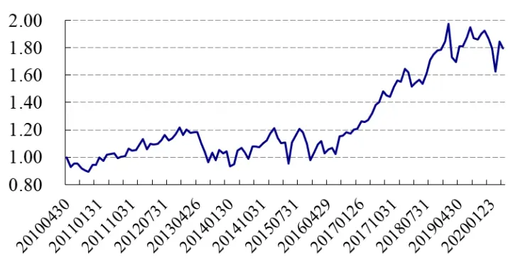
数据来源：Wind、开源证券研究所

图2：振幅因子 5分组年化收益率不单调
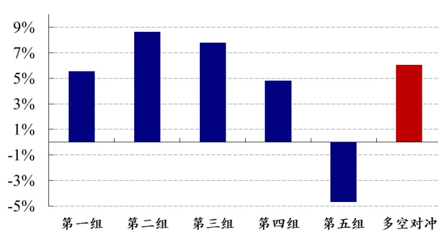
数据来源：Wind、开源证券研究所

振幅因子在稳定性上的不足，引发了我们对振幅因子隐藏结构的进一步探索。我们知道，振幅因子衡量了股票在过去一段时间内振幅的平均水平，它无法对振幅分布的差异性进行进一步分析和刻画。我们不禁思考：不同维度下的振幅分布差异是否蕴含有不同的信息？为了进一步分析振幅因子的信息结构，我们这里引入价格维度。这一步骤的主要动机是：我们知道，振幅因子可以衡量资金多空博弈的激烈程度，而不同价格位置的资金多空博弈情况往往蕴含不同的意义。

为了形象直观的理解，我们设想以下情景：假设股票S过去 20 个交易日的收盘价构成集合[10.01,10.02，…，10.19,10.20]，图 3 给出了股票 S 在不同价格处日度振幅的两种分布情形：左图为高价格处振幅较高情形，右图为低价格处振幅较高情形。图中纵轴为价格分布，蓝柱长度代表不同价格处的振幅大小，这里假设左右两图中振幅均值相同。可以发现，传统振幅因子在两种不同振幅分布下具有相同的因子值。显而易见，不同价格区间的振幅分布差异并没有被有效挖掘与刻画。

图3：股票S不同价格处振幅的两种分布（振幅因子无法刻画振幅分布差异）
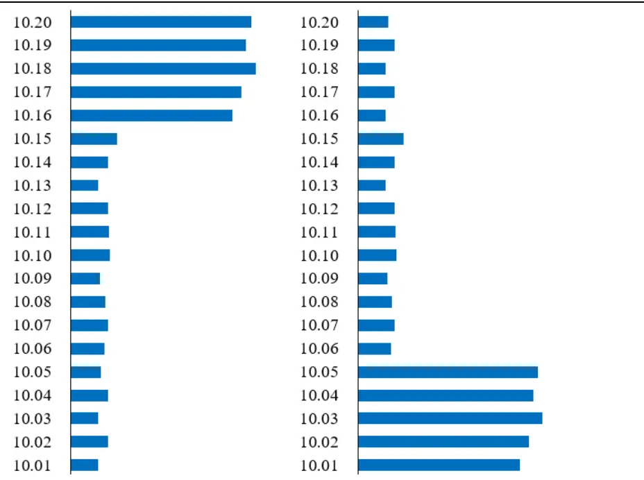
资料来源：开源证券研究所

根据上文的讨论，我们预期在不同价格位置，振幅分布所蕴含的信息会存在结构性差异。接下来我们将从价格维度对振幅因子进行不同切割，并提出了对振幅因子的重要改进。本篇报告是开源证券金融工程团队《市场微观结构研究系列》的第7篇。

## 2、 振幅因子的切割：高价振幅因子具有更强的负向选股能力

为了衡量不同价格下的振幅分布信息差异，我们给出了价格维度下的振幅因子切割方案，具体切割步骤如下：

表2：振幅因子的切割步骤

| 步骤1 | 对选定股票S，回溯取其最近N个交易日（这里选择N=20）的数据； |
| --- | --- |
| 步骤2 | 计算股票S每日的振幅（最高价/最低价-1）; |
| 步骤3 | 选择收盘价较高的λ（比如40%）有效交易日，计算振幅均值得到高价振幅 |
| 步骤4 | 因子 V_high(λ); 选择收盘价较低的λ（比如40%）有效交易日，计算振幅均值得到低价振幅 因子 V_low(λ)。 |

资料来源：开源证券研究所

需要说明的是，有效交易日是指剔除停牌和一字涨跌停后的交易日。若股票S在最近 20 个交易日内，有效交易日天数小于 10 日，则股票 S 当日因子值设为空值。同时为了更加精细的衡量不同价格位置处的振幅因子差异，我们选取不同的λ取值来构造高价振幅因子和低价振幅因子。可以知道，当λ=100%时，高价振幅因子V_high 和低价振幅因子V_low即为传统振幅因子。

我们对切割得到的高价振幅因子和低价振幅因子的绩效进行了测试。本文的因子回测框架为：回测区间为 2010 年 4 月 30 日至 2020 年 4 月 30 日；样本空间为全体A 股，剔除 ST 股和上市未满60日的新股；每月月初调仓，持仓一个自然月，交易费率千分之三。

从不同λ值的因子 IC 均值和 ICIR上看：1）高价振幅因子 V_high：随着切割比例λ由 100%逐渐减小至20%过程中，高价振幅因子的IC均值的绝对值和 ICIR绝对值逐渐增大（图4），表明高价振幅因子的负向选股能力逐渐增强。当λ为 20%时，因子 IC 均值为-0.062，ICIR 为-1.76。2）低价振幅因子 V_low：随着切割比例λ由100%逐渐减小至20%过程中，低价振幅因子的 IC 均值的绝对值和 ICIR绝对值逐渐减小至 0 附近（图 5），表明低价振幅因子的选股能力逐渐减弱。从回测结果我们可以发现：高价振幅和低价振幅所蕴含的信息存在结构性差异，价格较高处振幅具有更强的负向选股能力。相比于传统振幅因子，高价振幅因子V_high 具有更加优异的选股效果。我们对V_high进行风格行业中性化，纯化后的因子依然具有稳健的选股能力。

图4：不同λ值下高价振幅因子V_high绩效指标
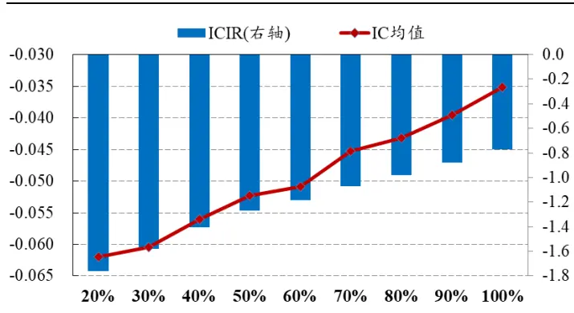
数据来源：Wind、开源证券研究所

图5：不同λ值下低价振幅因子V_low绩效指标
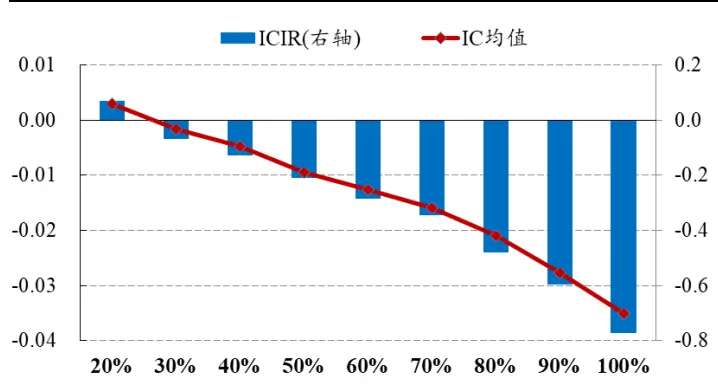
数据来源：Wind、开源证券研究所

虽然高价振幅因子具有较优的负向选股能力，但多空对冲净值波动性较高（图6）。以λ取值 20%为例，高价振幅因子 V_high（λ=20%）多空对冲年化收益较高（16.7%），但年化波动率（11.8%）和最大回撤（13.9%）也相对较高。同时观察高价振幅因子的 5分组收益（图 7）可以发现，不同分组收益的非单调性相较于传统振幅因子有所改善，但依然不单调。

图6：不同λ值高价振幅因子V_high多空对冲净值表现
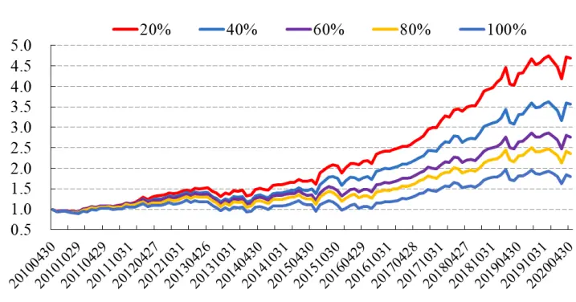
数据来源：Wind、开源证券研究所

图7：λ=20%时高价振幅因子 5分组年化收益率非单调
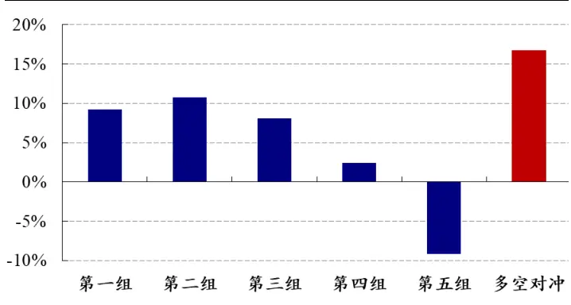
数据来源：Wind、开源证券研究所

## 3、 理想振幅因子的选股能力要显著优于高价振幅因子

为了提升高价振幅因子V_high 的选股稳定性，我们考虑在横截面上对高价振幅因子进行标准化处理。这里标准化的做法是：在同一切割比例λ下，我们将高价振幅因子 V_high 与低价振幅因子 V_low 作差，构造得到理想振幅因子 V，表达式如下：

$$
\mathrm{V}(\lambda)=\mathrm{V}_{\text{high}}(\lambda)-\mathrm{V}_{\text{low}}(\lambda)
$$

完成理想振幅因子的构造后，我们首先对不同切割比例下高价振幅因子和低价振幅因子的 IC 均值结构进行对比。从图 8 可以看出：随着λ值的逐渐减小，V_high与 V_low 因子 IC 均值的差距逐渐增加，图形上的效果则是呈现出“>”形状。因此我们预期：随着切割比例λ值的逐渐减小，对应的理想振幅因子V(λ)的选股能力会呈现出逐渐增强趋势。

图8：不同λ值下高价振幅因子和低价振幅因子 IC均值差距单调变化
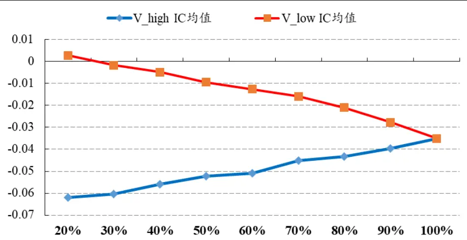
数据来源：Wind、开源证券研究所

通过对理想振幅因子的选股能力进行回测，我们发现理想振幅因子具有优异的选股表现。从不同λ值下理想振幅因子的 IC均值和 ICIR值走势（图 9）上看：随着λ的逐渐减小，理想振幅因子的 IC 均值绝对值和 ICIR 绝对值整体上呈现出逐渐增大的趋势，这表明对应λ下的理想振幅因子的选股能力逐渐增强，这与我们上文的预期一致。以λ为 25%为例，理想振幅因子 V(λ=25%)的多空对冲年化收益率为

23.3%，IC 均值为-0.067，ICIR 值为-2.97，月度胜率为 84.2%，整体表现优异。

图9：不同λ值下理想振幅因子IC均值和 ICIR值
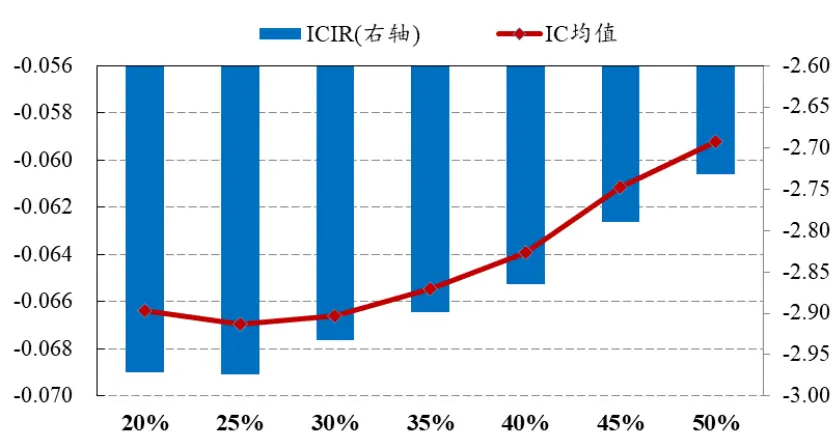
数据来源：Wind、开源证券研究所

图10 给出了不同λ值下理想振幅因子以及高价振幅因子V_high(20%)的多空对冲净值表现。从图上我们直观的可以感受到：相较于高价振幅因子，理想振幅因子的多空对冲收益水平提升，波动水平下降，整体稳定性提升。从不同分组的收益表现来看，不同于高价振幅因子分组收益的非单调，理想振幅因子的分组收益单调排列（图11）。整体上，理想振幅因子的选股能力要显著优于高价振幅因子。

图10：不同λ值下理想振幅因子多空对冲净值表现
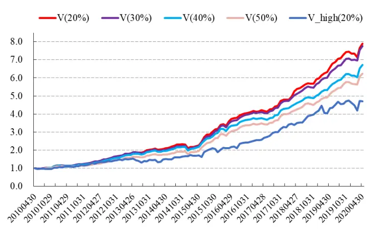
数据来源：Wind、开源证券研究所

图11：λ=25%时理想振幅因子 5分组年化收益率单调
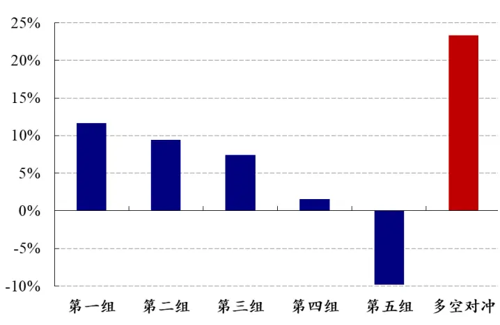
数据来源：Wind、开源证券研究所

## 4、 若干重要讨论

## 4.1、 理想振幅因子行业风格中性化后选股能力依然优异

我们首先考察理想振幅因子在行业风格中性化后的选股能力。直观上，理想振幅因子会与波动率因子有一定关联性。我们对行业风格中性化后的理想振幅因子的选股能力进行测试，表 3 给出了主要绩效指标。可以看出，剔除行业和主要风格因子（市值、动量、波动率、流动性、Beta）后，理想振幅因子依然有着优异的选股能力。以λ为25%为例，中性化后的理想振幅因子V(λ=25%)多空对冲年化收益率12.95%，IC 均值为-0.033，ICIR 为-2.81。

表3：不同λ值下理想振幅因子行业风格中性化后选股绩效表现依然优异

| λ值 | 多空对冲 IC 均值 年化收益率 | rankIC 均值 | ICIR |
| --- | --- | --- | --- |
| 20% | 13.23% -0.033 | -0.040 | -2.70 |
| 25% | 12.95% -0.033 | -0.041 | -2.81 |
| 30% | 12.58% -0.033 | -0.041 | -2.83 |
| 35% | 12.64% -0.032 | -0.039 | -2.79 |
| 40% | 12.08% -0.031 | -0.037 | -2.77 |
| 45% | 10.55% -0.030 | -0.035 | -2.69 |
| 50% | 10.44% -0.029 | -0.034 | -2.60 |

数据来源：Wind、开源证券研究所

## 4.2、 理想振幅因子对参数回看天数 N不敏感

进一步我们考察理想振幅因子对参数回看天数N的敏感性，图12给出了不同回看天数N 下理想振幅因子V(λ=25%)的绩效指标。可以发现，回看天数在 30日以内时，不同 N 下理想振幅因子表现相差不大；随着回看天数的进一步增加，理想振幅因子的选股能力会有一定衰减。整体上，理想振幅因子对参数回看天数N不敏感。

图12：不同回看天数N时理想振幅因子 V(λ=25%)选股能力对参数 N不敏感
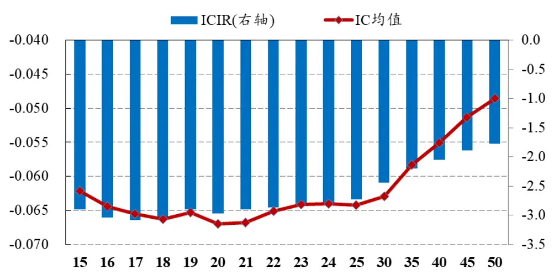
数据来源：Wind、开源证券研究所

## 4.3、 理想振幅因子不同样本空间选股能力表现优异

最后我们考察理想振幅因子在不同样本空间内的选股能力。我们选择切割比例λ为 25%时理想振幅因子，给出了因子在不同样本空间的多空对冲净值表现。

沪深300成分股中，因子多空对冲年化收益12.6%，ICIR为-1.40，月度胜率64.2%；中证 500成分股中，因子多空对冲年化收益16.5%，ICIR为-1.91，月度胜率70.0%；中证 1000 成分股中，因子多空对冲年化收益 24.4%，ICIR-3.18，月度胜率 80.8%。可以发现，理想振幅因子在中小股票中的选股效果更加优异。

图13：理想振幅因子（λ=25%）不同样本空间多空对冲净值（对中小股票效果更优）
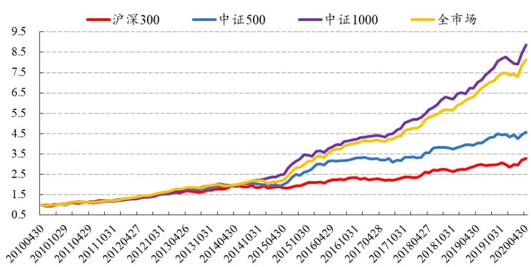
数据来源：Wind、开源证券研究所

## 4.4、 换手率因子的隐藏结构

我们知道，振幅和换手率都是反映股票成交活跃程度的指标。由上文结论可知，不同价格处的振幅分布信息存在结构性差异。我们不禁思考：换手率因子是否也具有同样的隐藏结构？

这里采用股票过去20日换手率均值代表换手率因子。我们知道，换手率因子同样具有一定的负向选股能力，过去换手率较低的股票未来收益表现较好。基于理想振幅因子的构造框架，我们尝试对换手率因子的隐藏结构进行探索。考虑到两者的构造框架和步骤基本一致，只是将振幅替换为换手率，这里我们不再赘述相关过程和步骤。最终我们基于换手率因子切割得到理想换手率因子T，我们将切割比例λ下的理想换手率因子记为T(λ)。

结论上，高价换手率和低价换手率所蕴含的信息同样存在结构性差异，价格较高处换手率具有更强的负向选股能力。从回测结果上看，理想换手率因子的选股能力要优于原始换手率因子（图 14），可以视为原始换手率因子的一种改进方案。

图14：不同λ值下理想换手率因子 T(λ)选股能力优于原始换手率因子
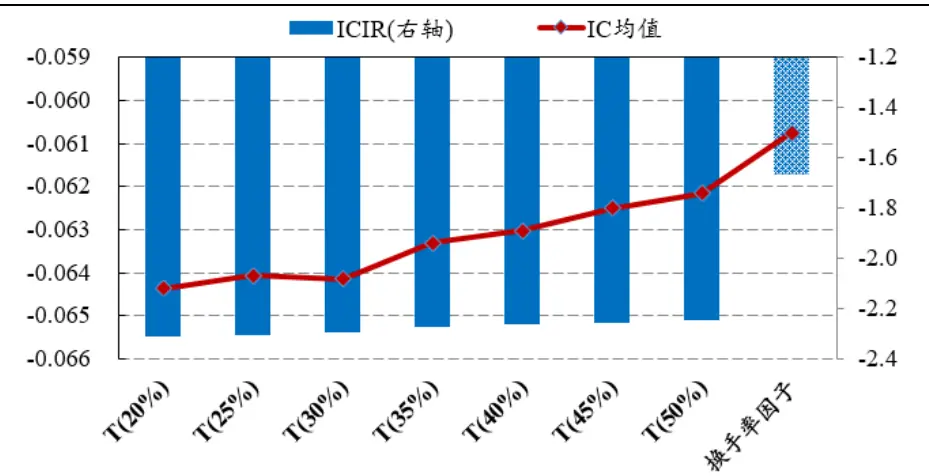
数据来源：Wind、开源证券研究所

## 4.5、 波动类因子的收益来源：一个股价动力学视角

综合本报告的所有测算结果，对于波动类因子的收益来源，我们提供一个股价动力学视角的理解框架。以振幅因子为例，我们将振幅加大视为多空博弈强烈的信号，进而视为该价格状态的不稳定性加大，这意味着该价格状态后续将难以维持，我们将以上过程简称为“振荡加大-状态跃迁”效应。振幅因子的收益来源在于：相比于低价态，高价态下的“振荡加大-状态跃迁”效应更为强烈。这种高低价态的不对称性导致：其一，在振幅因子的切割分析中，高价振幅因子具有更强的负向选股能力，此即为本报告第 2 节的结论；其二，当不对振幅因子进行切割时，由于高价振幅因子的贡献，振幅因子整体也呈现出负向选股能力，此即为我们最为熟悉的“低波动异象”。以上，是我们从振幅因子的隐藏结构中，得到的最为重要的启发。

## 5、风险提示

模型测试基于历史数据，市场未来可能发生变化。

## 特别声明

《证券期货投资者适当性管理办法》、《证券经营机构投资者适当性管理实施指引（试行）》已于2017年7月1日起正式实施。根据上述规定，开源证券评定此研报的风险等级为R2（中低风险），因此通过公共平台推送的研报其适用的投资者类别仅限定为专业投资者及风险承受能力为C2、C3、C4、C5的普通投资者。若您并非专业投资者及风险承受能力为C2、C3、C4、C5的普通投资者，请取消阅读，请勿收藏、接收或使用本研报中的任何信息。

因此受限于访问权限的设置，若给您造成不便，烦请见谅！感谢您给予的理解与配合。

## 分析师承诺

负责准备本报告以及撰写本报告的所有研究分析师或工作人员在此保证，本研究报告中关于任何发行商或证券所发表的观点均如实反映分析人员的个人观点。负责准备本报告的分析师获取报酬的评判因素包括研究的质量和准确性、客户的反馈、竞争性因素以及开源证券股份有限公司的整体收益。所有研究分析师或工作人员保证他们报酬的任何一部分不曾与，不与，也将不会与本报告中具体的推荐意见或观点有直接或间接的联系。

## 股票投资评级说明

|  | 评级 | 说明 |
| --- | --- | --- |
| 证券评级 | 买入（Buy） | 预计相对强于市场表现20%以上； |
|  | 增持（outperform） | 预计相对强于市场表现 5%~20%; |
|  | 中性（Neutral） | 预计相对市场表现在-5%~+5%之间波动； |
|  | 减持 | 预计相对弱于市场表现5%以下。 |
| 行业评级 | 看好（overweight） | 预计行业超越整体市场表现; |
|  | 中性（Neutral） | 预计行业与整体市场表现基本持平； |
|  | 看淡 | 预计行业弱于整体市场表现。 |
| 备注：评级标准为以报告日后的6~12个月内，证券相对于市场基准指数的涨跌幅表现，其中A股基准指数为沪深300指数、港股基准指数为恒生指数、新三板基准指数为三板成指（针对协议转让标的）或三板做市指数（针对做市转让标的)、美股基准指数为标普500或纳斯达克综合指数。我们在此提醒您，不同证券研究机构采用不同的评级术语及评级标准。我们采用的是相对评级体系，表示投资的相对比重建议；投资者买入或者卖出证券的决定取决于个人的实际情况，比如当前的持仓结构以及其他需要考虑的因素。投资者应阅读整篇报告，以获取比较完整的观点与信息，不应仅仅依靠投资评级来推断结论。 |  |  |

## 分析、估值方法的局限性说明

本报告所包含的分析基于各种假设，不同假设可能导致分析结果出现重大不同。本报告采用的各种估值方法及模型均有其局限性，估值结果不保证所涉及证券能够在该价格交易。

## 法律声明

开源证券股份有限公司是经中国证监会批准设立的证券经营机构，已具备证券投资咨询业务资格。

本报告仅供开源证券股份有限公司（以下简称“本公司”）的机构或个人客户（以下简称“客户”）使用。本公司不会因接收人收到本报告而视其为客户。本报告是发送给开源证券客户的，属于机密材料，只有开源证券客户才能参考或使用，如接收人并非开源证券客户，请及时退回并删除。

本报告是基于本公司认为可靠的已公开信息，但本公司不保证该等信息的准确性或完整性。本报告所载的资料、工具、意见及推测只提供给客户作参考之用，并非作为或被视为出售或购买证券或其他金融工具的邀请或向人做出邀请。本报告所载的资料、意见及推测仅反映本公司于发布本报告当日的判断，本报告所指的证券或投资标的的价格、价值及投资收入可能会波动。在不同时期，本公司可发出与本报告所载资料、意见及推测不一致的报告。客户应当考虑到本公司可能存在可能影响本报告客观性的利益冲突，不应视本报告为做出投资决策的唯一因素。本报告中所指的投资及服务可能不适合个别客户，不构成客户私人咨询建议。本公司未确保本报告充分考虑到个别客户特殊的投资目标、财务状况或需要。本公司建议客户应考虑本报告的任何意见或建议是否符合其特定状况，以及（若有必要）咨询独立投资顾问。在任何情况下，本报告中的信息或所表述的意见并不构成对任何人的投资建议。在任何情况下，本公司不对任何人因使用本报告中的任何内容所引致的任何损失负任何责任。若本报告的接收人非本公司的客户，应在基于本报告做出任何投资决定或就本报告要求任何解释前咨询独立投资顾问。

本报告可能附带其它网站的地址或超级链接，对于可能涉及的开源证券网站以外的地址或超级链接，开源证券不对其内容负责。本报告提供这些地址或超级链接的目的纯粹是为了客户使用方便，链接网站的内容不构成本报告的任何部分，客户需自行承担浏览这些网站的费用或风险。

开源证券在法律允许的情况下可参与、投资或持有本报告涉及的证券或进行证券交易，或向本报告涉及的公司提供或争取提供包括投资银行业务在内的服务或业务支持。开源证券可能与本报告涉及的公司之间存在业务关系，并无需事先或在获得业务关系后通知客户。

本报告的版权归本公司所有。本公司对本报告保留一切权利。除非另有书面显示，否则本报告中的所有材料的版权均属本公司。未经本公司事先书面授权，本报告的任何部分均不得以任何方式制作任何形式的拷贝、复印件或复制品，或再次分发给任何其他人，或以任何侵犯本公司版权的其他方式使用。所有本报告中使用的商标、服务标记及标记均为本公司的商标、服务标记及标记。

开源证券股份有限公司

地址：西安市高新区锦业路1号都市之门B座5层

邮编：710065

电话：029-88365835

传真：029-88365835