# 结合行业轮动的沪深300指数增强测试

2020年05月27日

傅开波（研究员）

证书编号：S0790519120001

## 金融工程研究团队

魏建榕（首席分析师）

邮箱：weijianrong@kysec.cn

邮箱：fukaibo@kysec.cn

证书编号：S0790119120026

## 高鹏（研究员）

邮箱：gaopeng@kysec.cn

证书编号：S0790119120032

## 苏俊豪（研究员）

邮箱：sujunhao@kysec.cn

证书编号：S0790120020012

## 胡亮勇（研究员）

邮箱：huliangyong@kysec.cn

证书编号：S0790120030040

## 相关研究报告

《市场微观结构研究系列（1）-A股反转之力的微观来源》-2019.12.23《市场微观结构研究系列（2）-交易行为因子的2019年》-2019.12.28《市场微观结构研究系列（3）-聪明钱因子模型的2.0版本》-2020.02.09《市场微观结构研究系列（4）-A股行业动量的精细结构》-2020.03.02《市场微观结构研究系列（5)-APM因子模型的进阶版》-2020.03.07《市场微观结构研究系列（6）-交易者行为与市值风格》-2020.05.12《市场微观结构研究系列（7）-振幅因子的隐藏结构》-2020.05.16

# ——市场微观结构研究系列（8）

## 魏建榕（分析师）

傅开波（联系人）

weijianrong@kysec.cn

证书编号：S0790519120001

fukaibo@kysec.cn

证书编号：S0790119120026

## 沪深300指数行业分布不均衡

指数增强一直是公募量化角力的主战场，尤其是沪深300指数增强产品，产品的数量和规模近几年来一直处于持续上涨的态势。沪深300成分股行业分布比较不均衡，非银金融和银行占很大的比重。对于沪深300增强策略，行业主动偏离显得尤为重要，如何对行业进行偏离，是本文的重点。

## 沪深300增强基础策略：年化收益率7.42%，年化波动率3.94%

我们按照多空IR大于1.5为筛选条件，得到沪深300成分股内的有效因子。按照上述对因子复合的方法，我们得到最终的因子值F。根据组合优化器，我们进行基础模型构建。基础模型的超额年化7.42%，超额年化波动率3.94%，夏普比率为 1.88。

## 行业轮动+沪深300增强策略：龙头股模型超额夏普比率2.07，黄金律模型超额夏普比率2.21，2020年以来表现优异

为了将行业龙头股模型和黄金律模型叠加到我们的最终策略，我们对组合优化模型的行业偏离这一限制条件做如下的改进：每一期，我们根据行业因子（黄金律因子/龙头股模型因子）对行业进行五分组划分，第一组为空头组，第五组为多头组，令行业多头组增加相应行业上的暴露，令行业空头组减少相应行业的暴露。根据上述对行业偏离的设置，我们分别对行业轮动模型中的龙头因子和黄金律因子进行策略构建。

龙头股模型+沪深300增强：超额年化收益率为8.53%，超额年化波动率为4.13%，夏普比率2.07，月度胜率为71.88%。2020年以来策略表现突出，超额年化收益率12.20%，超额年化波动率4.10%，夏普比率2.98。

黄金律模型+沪深300增强：超额年化收益率为9.24%，超额年化波动率为4.18%，夏普比率2.21，月度胜率为68.75%。2020年以来策略表现突出，超额年化收益率15.40%，超额年化波动率4.06%，夏普比率3.80。

- 风险提示：模型测试基于历史数据，市场未来可能发生变化。

## 1、引言：沪深300指数行业分布不均衡

指数增强一直是公募量化角力的主战场，尤其是沪深300指数增强产品，产品的数量和规模近几年来一直处持续上涨的态势。

图1：沪深300指数增强产品数量和规模
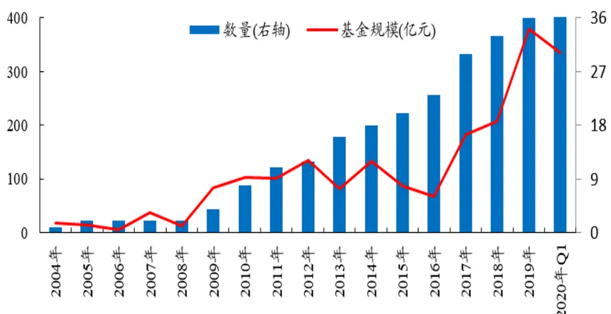
数据来源：Wind、开源证券研究所（数据截至20200331）

沪深300成分股行业分布并不均衡，非银金融和银行占很大的比重，从图2和图3可以看出，沪深300前五大行业（非银金融、银行、食品饮料、医药生物、电子）权重占比为56.13%，而中证500前五大行业（电子、医药生物、计算机、化工、传媒）权重占比为45.19%。相较于中证500，沪深300的行业集中度更高。

对于沪深300增强策略，行业主动偏离是有必要的。如何对行业进行偏离，是本文的重点。

图2：沪深300成分股：前五大行业权重占比56.13%
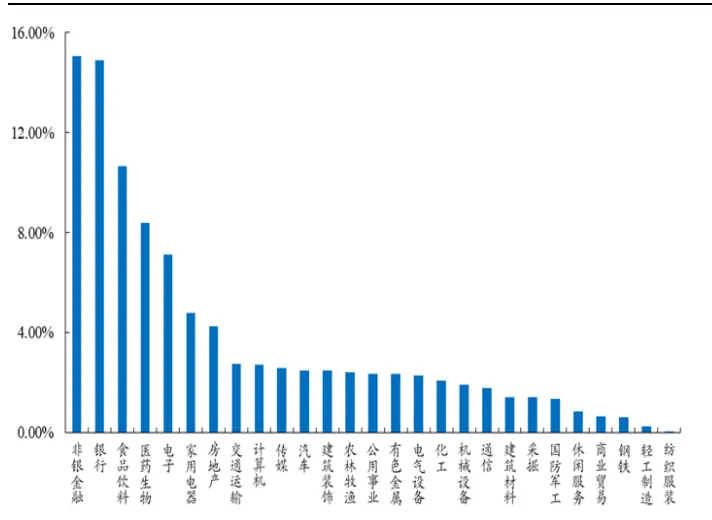
数据来源：Wind、开源证券研究所（数据截至20200520）

图3：中证500成分股：前五大行业权重占比45.19%
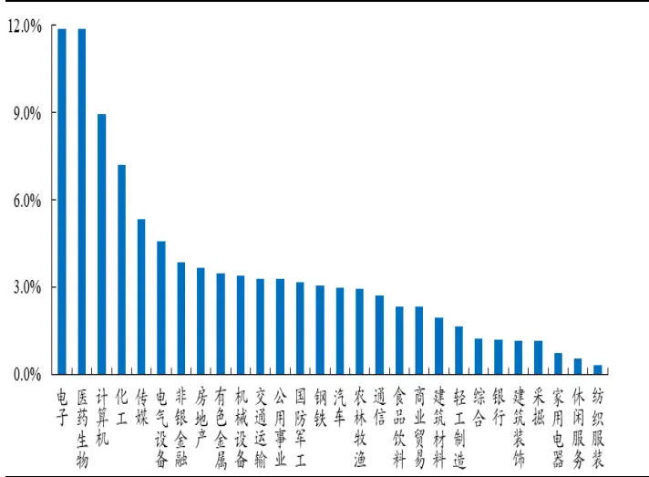
数据来源：Wind、开源证券研究所（数据截至20200520）

## 2、行业轮动模型回顾：横向切割的龙头股模型，纵向切割的黄金律模型

我们于2020年3月2日发布的报告《A股行业动量的精细结构》中，创新地从横向和纵向对行业动量进行切割，分别构建了龙头股模型和黄金律模型。

龙头股模型的构建基于对行业动量的横向切割。我们根据行业成分股内的牵引力大小和方向构建龙头股模型（见表1)。龙头股模型的多空对冲年化收益12.9%，年化波动11.21%，信息比率1.16（图4)。

表1：龙头股模型的计算步骤

| 序号 | 步骤 |
| --- | --- |
| 第一步 | 对“食品饮料”行业，回溯取过去20日的成分股数据； |
| 第二步 | 将成分股按近20日成交金额从大到小排序，逐一累积成交金额； |
| 第三步 | 取累计成交金额占比达到λ%，认定为龙头股，余下则为普通股; |
| 第四步 | 分别计算龙头股、普通股的近20日平均涨幅：R_龙头，R_普通； |
| 第五步 | 食品饮料行业的牵引力因子G=R_龙头-R_普通； |
| 第六步 | 重复以上操作，计算各个行业的牵引力因子。 |

资料来源：开源证券研究所

图4：龙头股模型的五分组与多空对冲净值(信息比率IR=1.16，切割参数λ%=60%)
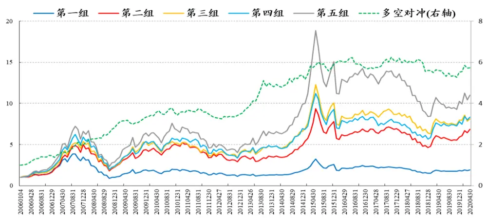
数据来源：Wind、开源证券研究所（时间区间20060101-20200430）

黄金律模型的构建基于对行业动量的纵向切割。我们根据行业指数在不同交易时段存在的系统性差异，将其分成日内和隔夜两段，基于此构建黄金律模型(见表2)。黄金律模型的多空对冲年化收益8.15%，年化波动11.77%，信息比率0.69（图5)。

表2：黄金律模型的计算步骤

| 第一步 | 对每个行业指数，回溯取其过去20日的行情数据； |
| --- | --- |
| 第二步 | 计算每个行业指数的日内因子M0与隔夜因子M1; |
| 第三步 | 将N个行业指数按照M0值从低到高分别打1分至N分； |
| 第四步 | 将N个行业指数按照M1值从高到低分别打1分至N分； |
| 第五步 | 将两项打分相加，得到每个行业的总得分。 |

资料来源：开源证券研究所

图5：黄金律模型的五分组与多空对冲净值（信息比率IR=0.69）
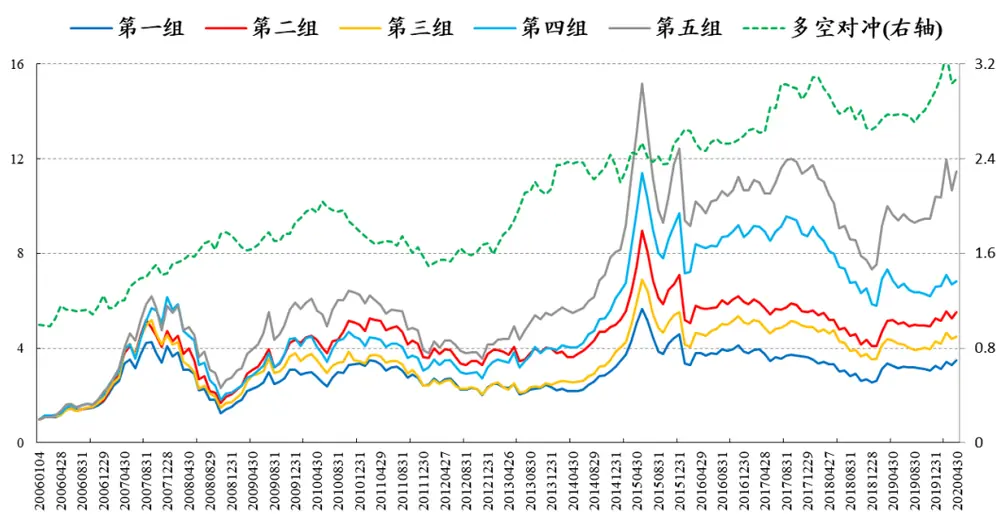
数据来源：Wind、开源证券研究所（时间区间20060101-20200430）

## 3、基于行业轮动的指数增强策略

## 3.1、沪深300增强基础策略构建：超额年化收益率7.42%，超额年化波动率3.94%

为了检验行业轮动模型对指数增强的效果，我们根据开源金工因子库构建沪深300基础策略。复合因子的构建框架为：

1、选股范围：中证800成分股，最小上市天数为60天，剔除ST、*ST和停牌股票；

2、因子处理：对于缺失的因子值使用行业中位数替代，各因子均去极值、标准化，各因子之间进行对称正交化处理；

3、因子复合：在每个因子大类里，对各因子滚动计算6个月的ICIR，作为各因子的权重进而复合得到每个大类因子，最后大类因子等权相加得到最终的因子值。

我们按照多空IR大于等于1.5为筛选条件，得到沪深300成分股内的有效因子。其中技术面的有效因子为：Technical_Last15MinVolumeRatio_20Day、Technical_MixLIQ、Technical_SmartMoney和Technical_IdealReversed，基本面的有效因子为：Fundamental_TTM_ROE_PbSizeNeutral、Fundamental_TTM_ROA_PbSizeNeutral。按照上述对因子复合的方法，我们得到最终的因子值F。

表3：沪深300成分股内选取的因子列表

| 因子大类 因子名称 |  | 因子含义 | IC | 多空IR |
| --- | --- | --- | --- | --- |
| 技术面 | Technical_Last15MinVolumeRatio_20Day过去20天最后15分钟成交量比率 |  | -0.085 | 2.16 |
|  | Technical_MixLIQ | 基于分钟数据构建的纯净化流动性因子 | -0.095 | 1.94 |
|  | Technical_SmartMoney | 聪明钱因子 | -0.048 | 1.50 |
|  | Technical_IdealReversed | 理想反转因子 | -0.067 | 1.51 |
| 基本面 | Fundamental_TTM_ROE_PbSizeNeutral | ROEttm对PB和市值因子做中性化 | 0.070 | 1.70 |
|  | Fundamental_TTM_ROA_PbSizeNeutral | ROAttm对PB和市值因子做中性化 | 0.068 | 1.52 |

数据来源：Wind、开源证券研究所

根据复合因子F得到每一期组合的预期收益率r，我们进行组合优化模型构建：

$$
\underset{w}{max}r^{T}w
$$

$$
\begin{array}{rlr}{s.t.}&{{}}&{S_{d}\leq X_{s}(w-w_{b})\leq S_{u}}\end{array}
$$

$$
I_{d}\leq X_{I}(w-w_{b})\leq I_{u}
$$

$$
w_{d}\leq w-w_{b}\leq w_{u}
$$

$$
w\geq0
$$

$$
(w-w_{b})^{T}\Sigma(w-w_{b})\leq\sigma^{2}
$$

$$
\sum|w-w_{-1}|\leq\rho
$$

上述优化方程中，目标函数中r为每预期收益率，w为目标求解得到组合优化的最优权重， $w_{-1}$ 为上一期组合的权重， $w_{b}$ 为基准组合的权重，Σ为风险模型中预测的协方差矩阵1。约束条件包含：

1) $X_{s}$ 为因子暴露矩阵， $S_{d}$ 与 $S_{u}$ 分别为在风格因子上暴露的下限与上限，这里只约束风格因子中的市值因子，其他不做约束；

2) $X_{I}$ 为行业暴露矩阵，基础模型中我们令行业中性，也就是 $I_{d}=I_{u}=0;$

3) $w_{d}$ 与 $w_{u}$ 为个股相对基准指数中低配和超配的权重上下限，本报告中设置上 下限为±0.025;

4) 个股限制卖空，也就是 $w\geq0$

5) 跟踪误差不超过5%，也就是 $\sigma=5\%$

6) $I_{c}$ 为表示组合成分股是否为基准指数成分股的向量，不同增强 $产$ 品的合同规定不同，这里我们令组合占基准的比例γ至少为80%;

7) 为了降低组合因高换手导致额外的交易费用，这里 $.\rho$ 代表换手率约束，上限为50%。

根据组合优化器，我们进行基础模型构建，其中买入和卖出的手续费分别设置为单边千分之1.5。可以看到，基础模型的超额年化为7.42%，超额年化波动率为3.94%，夏普比率为1.88。

图6：300增强基础模型：持续稳定战胜沪深300指数
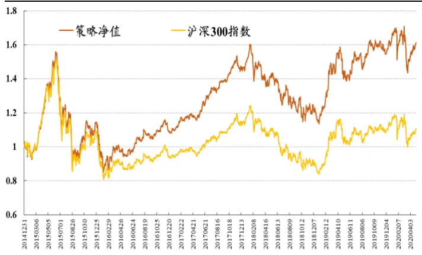
数据来源：Wind、开源证券研究所（数据截至20200430）

图7：300增强基础模型：夏普比率1.88
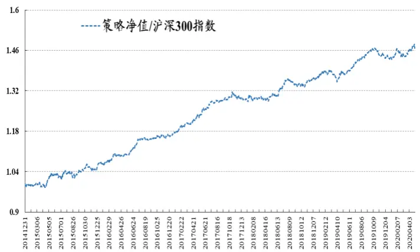
数据来源：Wind、开源证券研究所（数据截至20200430）

表4：300增强基础模型分年绩效：超额年化收益率7.42%，超额年化波动率3.94%，夏普比率1.88

| 年份 | 超额年化收益率 | 超额年化波动率 | 夏普比率 | 最大回撤 | 最大回撤日期 | 月度胜率 | 月数 |
| --- | --- | --- | --- | --- | --- | --- | --- |
| 2015年 | 6.71% | 5.47% | 1.23 | -2.56% | 20150902 | 58.33% | 12 |
| 2016年 | 9.02% | 3.51% | 2.57 | -1.15% | 20161201 | 66.67% | 12 |
| 2017年 | 10.83% | 3.36% | 3.23 | -2.09% | 20171221 | 83.33% | 12 |
| 2018年 | 5.93% | 3.61% | 1.64 | -2.10% | 20181026 | 66.67% | 12 |
| 2019年 | 4.73% | 3.27% | 1.45 | -3.03% | 20190409 | 58.33% | 12 |
| 2020年至今 | 7.35% | 4.13% | 1.78 | -1.94% | 20200302 | 75.00% | 4 |
| 全区间 | 7.42% | 3.94% | 1.88 | -3.03% | 20190409 | 67.19% | 64 |

数据来源：Wind、开源证券研究所（数据截至20200430）

## 3.2、行业轮动+沪深300增强策略：龙头股模型超额夏普比率2.07，黄金律模型超额夏普比率2.21，2020年以来表现优异

为了将行业龙头股模型和黄金律模型叠加到我们的最终策略，我们对组合优化模型的行业偏离这一限制条件做如下的改进：

每一期，我们根据行业因子（黄金律因子/龙头股模型因子）对行业进行五分组划分，第一组为空头组，第五组为多头组，令行业多头组增加相应行业上的暴露，令行业空头组减少相应行业的暴露。如表5所示：

表5：每一期行业偏离设置

| 行业偏离参数 | 第一组 | 第二组 | 第三组 | 第四组 | 第五组 |
| --- | --- | --- | --- | --- | --- |
| lu | 0 | 0 | 0 | η/2 | η |
| Id | -η | -η/2 | 0 | 0 | 0 |

资料来源：开源证券研究所

根据上述对行业偏离的设置，我们分别对行业轮动模型中的龙头因子和黄金律因子进行测试。可以看到龙头股模型在η=0.04的情况下，其超额年化收益率为8.53%，超额年化波动率为4.13%，夏普比率2.07，月度胜率为71.88%。尤其2020年以来，策略表现突出，超额年化收益率12.20%，超额年化波动率4.10%，夏普比率2.98。

图8： 龙头股模型+300增强策略(η=0.04)：夏普比率2.07
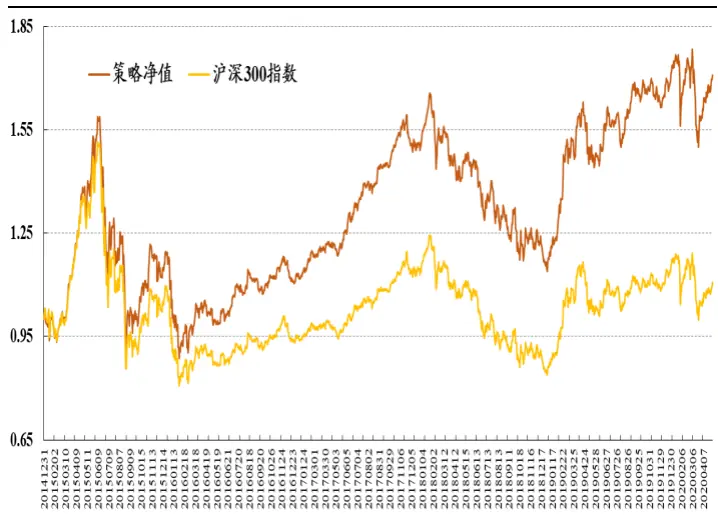
数据来源：Wind、开源证券研究所（数据截至20200430）

图9：龙头股模型+300增强策略(η=0.04)：月度胜率71.88%
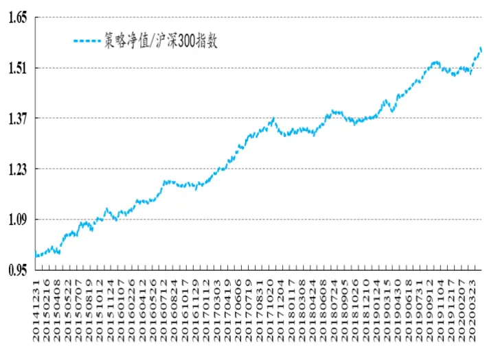
数据来源：Wind、开源证券研究所（数据截至20200430）

表6： 龙头股模型+沪深300 增强策略(η=0.04)：超额年化收益率8.53%，超额年化波动率4.13%，夏普比率 2.07

| 年份 | 超额年化收益率 | 超额年化波动率 | 夏普比率 | 最大回撤 | 最大回撤日期 | 月度胜率 | 月数 |
| --- | --- | --- | --- | --- | --- | --- | --- |
| 2015年 | 10.98% | 5.61% | 1.96 | -2.94% | 20151218 | 66.67% | 12 |
| 2016年 | 6.88% | 3.57% | 1.93 | -2.33% | 20161130 | 66.67% | 12 |
| 2017年 | 11.54% | 3.74% | 3.09 | -3.63% | 20171221 | 83.33% | 12 |
| 2018年 | 3.57% | 3.78% | 0.95 | -2.97% | 20181026 | 66.67% | 12 |
| 2019年 | 8.69% | 3.60% | 2.42 | -2.62% | 20191226 | 66.67% | 12 |
| 2020年至今 | 12.20% | 4.10% | 2.98 | -1.20% | 20200316 | 100.00% | 4 |
| 全区间 | 8.53% | 4.13% | 2.07 | -3.64% | 20180111 | 71.88% | 64 |

数据来源：Wind、开源证券研究所（数据截至20200430）

同样的，黄金律因子在η=0.04的情况下，策略的超额年化收益率为9.24%，超额年化波动率为4.18%，夏普比率2.21，月度胜率为68.75%。2020年以来表现突出，超额年化收益率15.40%，超额年化波动率4.06%，夏普比率3.80。

图10： 黄金律+300增强策略(η=0.04)：夏普比率2.21
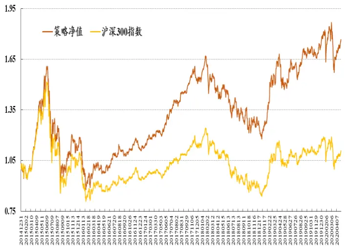
数据来源：Wind、开源证券研究所（数据截至20200430）

图11：黄金律+300增强策略(η=0.04):月度胜率68.75%
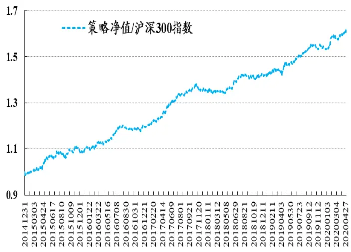
数据来源：Wind、开源证券研究所（数据截至20200430）

表7：黄金律模型+沪深300增强策略(η=0.04)：超额年化收益率9.24%，超额年化波动率4.18%，夏普比率2.21

| 年份 | 超额年化收益率 超额年化波动率 |  | 夏普比率 | 最大回撤 | 最大回撤日期 | 月度胜率 | 月数 |
| --- | --- | --- | --- | --- | --- | --- | --- |
| 2015年 | 10.30% | 5.56% | 1.85 | -2.93% | 20151217 | 66.67% | 12 |
| 2016年 | 8.15% | 3.80% | 2.14 | -2.20% | 20161201 | 58.33% | 12 |
| 2017年 | 13.42% | 3.86% | 3.48 | -2.41% | 20171206 | 83.33% | 12 |
| 2018年 | 4.91% | 3.83% | 1.28 | -1.55% | 20181030 | 58.33% | 12 |
| 2019年 | 7.67% | 3.63% | 2.11 | -1.84% | 20190409 | 66.67% | 12 |
| 2020年至今 | 15.40% | 4.06% | 3.80 | -1.21% | 20200316 | 100.00% | 4 |
| 全区间 | 9.24% | 4.18% | 2.21 | -3.14% | 20180206 | 68.75% | 64 |

数据来源：Wind、开源证券研究所（数据截至20200430）

## 3.3、参数敏感性分析：不同行业偏离参数下夏普比率均较稳定

为了验证不同行业偏离参数下的策略效果，我们对行业偏离参数进行参数遍历。表8和表9分别为龙头股模型和黄金律模型在不同行业偏离参数下的沪深300增强策略效果，可以看到，由于在行业上的偏离增大，策略的年化收益率提高，但波动也随之增加，因此夏普比率呈现先涨后跌的趋势。

表8：龙头股模型+沪深300增强策略：不同行业偏离参数下的超额绩效，夏普比率均较稳定

| 参数 | 超额年化收益率 | 超额年化波动率 | 夏普比率 | 最大回撤 | 最大回撤日期 | 月度胜率 |
| --- | --- | --- | --- | --- | --- | --- |
| 0 | 7.42% | 3.94% | 1.88 | -3.03% | 20190409 | 67.19% |
| 0.01 | 7.69% | 4.00% | 1.92 | -2.94% | 20180111 | 68.75% |
| 0.02 | 7.97% | 4.06% | 1.96 | -3.35% | 20171221 | 68.75% |
| 0.03 | 7.97% | 4.10% | 1.94 | -3.27% | 20171221 | 70.31% |
| 0.04 | 8.53% | 4.13% | 2.07 | -3.64% | 20180111 | 71.88% |
| 0.05 | 8.65% | 4.18% | 2.07 | -3.01% | 20190409 | 68.75% |
| 0.06 | 8.78% | 4.20% | 2.09 | -3.04% | 20190409 | 70.31% |
| 0.07 | 8.88% | 4.22% | 2.11 | -3.02% | 20190409 | 70.31% |
| 0.08 | 8.94% | 4.24% | 2.11 | -3.06% | 20180102 | 71.88% |
| 0.09 | 8.93% | 4.26% | 2.10 | -3.00% | 20190409 | 71.88% |
| 0.1 | 8.91% | 4.27% | 2.08 | -3.05% | 20181029 | 70.31% |

数据来源：Wind、开源证券研究所（时间区间为20150101-20200430）

表9：黄金律模型+沪深300增强策略：不同行业偏离参数下的超额绩效，夏普比率均较稳定

| 参数 | 超额年化收益率 | 超额年化波动率 | 夏普比率 | 最大回撤 | 最大回撤日期 | 月度胜率 |
| --- | --- | --- | --- | --- | --- | --- |
| 0 | 7.42% | 3.94% | 1.88 | -3.03% | 20190409 | 67.19% |
| 0.01 | 8.45% | 4.04% | 2.09 | -3.44% | 20180206 | 70.31% |
| 0.02 | 8.94% | 4.12% | 2.17 | -3.84% | 20180307 | 70.31% |
| 0.03 | 9.04% | 4.14% | 2.18 | -3.76% | 20180206 | 70.31% |
| 0.04 | 9.24% | 4.18% | 2.21 | -3.14% | 20180206 | 68.75% |
| 0.05 | 9.13% | 4.23% | 2.16 | -3.04% | 20180503 | 71.88% |
| 0.06 | 9.01% | 4.26% | 2.11 | -3.07% | 20180503 | 70.31% |
| 0.07 | 9.14% | 4.28% | 2.13 | -3.08% | 20180503 | 70.31% |
| 0.08 | 9.13% | 4.30% | 2.12 | -3.11% | 20180503 | 71.88% |
| 0.09 | 9.14% | 4.32% | 2.12 | -3.17% | 20180503 | 71.88% |
| 0.1 | 9.15% | 4.32% | 2.12 | -3.20% | 20150902 | 70.31% |

数据来源：Wind、开源证券研究所（时间区间为20150101-20200430）

## 4、风险提示

模型测试基于历史数据，市场未来可能发生变化。

## 特别声明

《证券期货投资者适当性管理办法》、《证券经营机构投资者适当性管理实施指引（试行)》已于2017年7月1日起正式实施。根据上述规定，开源证券评定此研报的风险等级为R2（中低风险)，因此通过公共平台推送的研报其适用的投资者类别仅限定为专业投资者及风险承受能力为C2、C3、C4、C5的普通投资者。若您并非专业投资者及风险承受能力为C2、C3、C4、C5的普通投资者，请取消阅读，请勿收藏、接收或使用本研报中的任何信息。

因此受限于访问权限的设置，若给您造成不便，烦请见谅！感谢您给予的理解与配合。

## 分析师承诺

负责准备本报告以及撰写本报告的所有研究分析师或工作人员在此保证，本研究报告中关于任何发行商或证券所发表的观点均如实反映分析人员的个人观点。负责准备本报告的分析师获取报酬的评判因素包括研究的质量和准确性、客户的反馈、竞争性因素以及开源证券股份有限公司的整体收益。所有研究分析师或工作人员保证他们报酬的任何一部分不曾与，不与，也将不会与本报告中具体的推荐意见或观点有直接或间接的联系。

## 股票投资评级说明

|  | 评级 | 说明 |
| --- | --- | --- |
| 证券评级 | 买入（Buy） | 预计相对强于市场表现20%以上； |
|  | 增持（outperform） | 预计相对强于市场表现5%~20%； |
|  | 中性（Neutral） | 预计相对市场表现在-5%~+5%之间波动； |
|  | 减持（underperform） | 预计相对弱于市场表现5%以下。 |
| 行业评级 | 看好（overweight） | 预计行业超越整体市场表现; |
|  | 中性（Neutral） | 预计行业与整体市场表现基本持平； |
|  | 看淡（underperform） | 预计行业弱于整体市场表现。 |
| 备注：评级标准为以报告日后的6~12个月内，证券相对于市场基准指数的涨跌幅表现，其中A股基准指数为沪深300指数、港股基准指数为恒生指数、新三板基准指数为三板成指（针对协议转让标的）或三板做市指数（针对做市转让标的)、美股基准指数为标普500或纳斯达克综合指数。我们在此提醒您，不同证券研究机构采用不同的评级术语及评级标准。我们采用的是相对评级体系，表示投资的相对比重建议；投资者买入或者卖出证券的决定取决于个人的实际情况，比如当前的持仓结构以及其他需要考虑的因素。投资者应阅读整篇报告，以获取比较完整的观点与信息，不应仅仅依靠投资评级来推断结论。 |  |  |

## 分析、估值方法的局限性说明

本报告所包含的分析基于各种假设，不同假设可能导致分析结果出现重大不同。本报告采用的各种估值方法及模型均有其局限性，估值结果不保证所涉及证券能够在该价格交易。

## 法律声明

开源证券股份有限公司是经中国证监会批准设立的证券经营机构，已具备证券投资咨询业务资格。

本报告仅供开源证券股份有限公司（以下简称“本公司”）的机构或个人客户（以下简称“客户”）使用。本公司不会因接收人收到本报告而视其为客户。本报告是发送给开源证券客户的，属于机密材料，只有开源证券客户才能参考或使用，如接收人并非开源证券客户，请及时退回并删除。

本报告是基于本公司认为可靠的已公开信息，但本公司不保证该等信息的准确性或完整性。本报告所载的资料、工具、意见及推测只提供给客户作参考之用，并非作为或被视为出售或购买证券或其他金融工具的邀请或向人做出邀请。本报告所载的资料、意见及推测仅反映本公司于发布本报告当日的判断，本报告所指的证券或投资标的的价格、价值及投资收入可能会波动。在不同时期，本公司可发出与本报告所载资料、意见及推测不一致的报告。客户应当考虑到本公司可能存在可能影响本报告客观性的利益冲突，不应视本报告为做出投资决策的唯一因素。本报告中所指的投资及服务可能不适合个别客户，不构成客户私人咨询建议。本公司未确保本报告充分考虑到个别客户特殊的投资目标、财务状况或需要。本公司建议客户应考虑本报告的任何意见或建议是否符合其特定状况，以及（若有必要）咨询独立投资顾问。在任何情况下，本报告中的信息或所表述的意见并不构成对任何人的投资建议。在任何情况下，本公司不对任何人因使用本报告中的任何内容所引致的任何损失负任何责任。若本报告的接收人非本公司的客户，应在基于本报告做出任何投资决定或就本报告要求任何解释前咨询独立投资顾问。

本报告可能附带其它网站的地址或超级链接，对于可能涉及的开源证券网站以外的地址或超级链接，开源证券不对其内容负责。本报告提供这些地址或超级链接的目的纯粹是为了客户使用方便，链接网站的内容不构成本报告的任何部分，客户需自行承担浏览这些网站的费用或风险。

开源证券在法律允许的情况下可参与、投资或持有本报告涉及的证券或进行证券交易，或向本报告涉及的公司提供或争取提供包括投资银行业务在内的服务或业务支持。开源证券可能与本报告涉及的公司之间存在业务关系，并无需事先或在获得业务关系后通知客户。

本报告的版权归本公司所有。本公司对本报告保留一切权利。除非另有书面显示，否则本报告中的所有材料的版权均属本公司。未经本公司事先书面授权，本报告的任何部分均不得以任何方式制作任何形式的拷贝、复印件或复制品，或再次分发给任何其他人，或以任何侵犯本公司版权的其他方式使用。所有本报告中使用的商标、服务标记及标记均为本公司的商标、服务标记及标记。

开源证券股份有限公司

地址：西安市高新区锦业路1号都市之门B座5层

邮编：710065

电话：029-88365835

传真：029-88365835