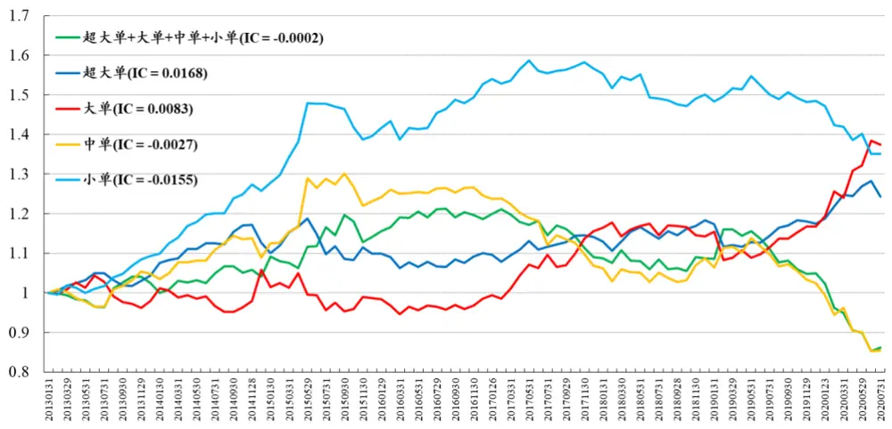
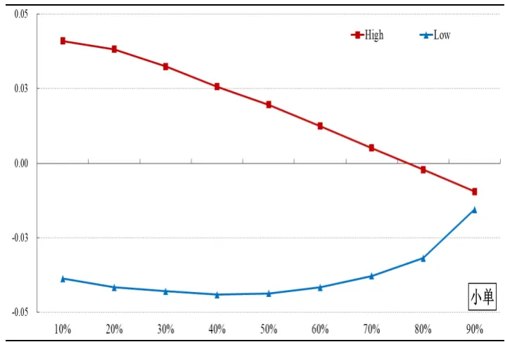
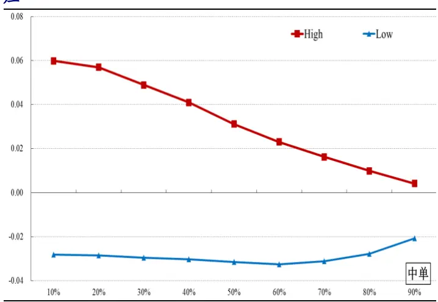
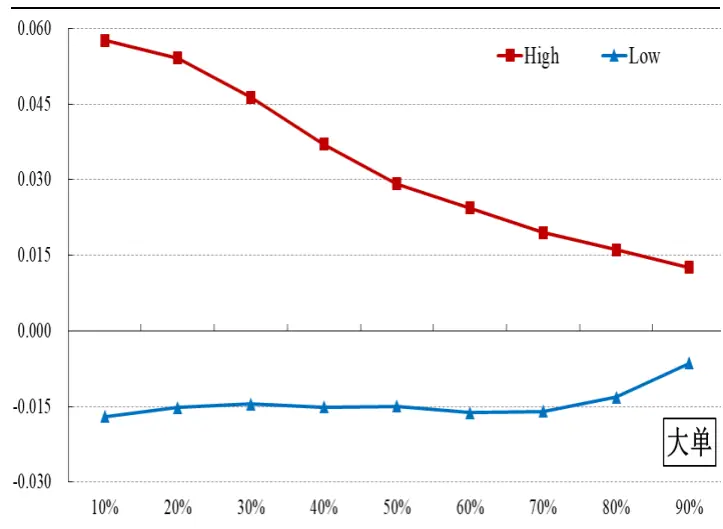
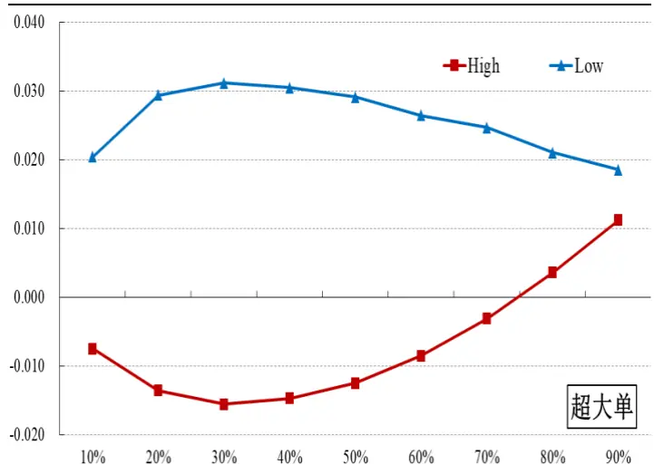
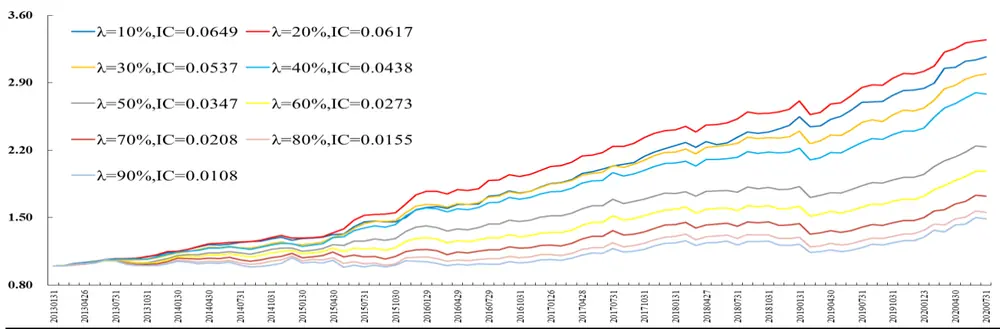
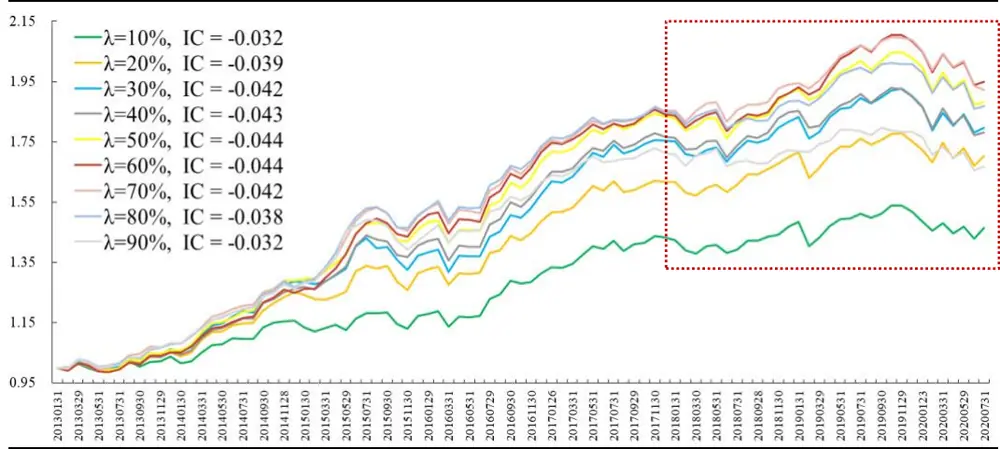

2020年09月05日

## 金融工程研究团队

魏建榕（首席分析师）

邮箱：weijianrong@kysec.cn

证书编号：S0790519120001

## 高鹏（研究员）

证书编号：S0790119120026

## 傅开波（研究员）

邮箱：gaopeng@kysec.cn

证书编号：S0790119120032

邮箱：fukaibo@kysec.cn

## 苏俊豪（研究员）

邮箱：sujunhao@kysec.cn

证书编号：S0790120020012

## 胡亮勇（研究员）

邮箱：huliangyong@kysec.cn

证书编号：S0790120030040

## 王志豪（研究员）

邮箱：wangzhihao@kysec.cn

证书编号：S0790120070080

## 相关研究报告

《市场微观结构研究系列（3）-聪明钱因子模型的2.0版本》-2020.02.09《市场微观结构研究系列（4）-A股行业动量的精细结构》-2020.03.02《市场微观结构研究系列（5）-APM因子模型的进阶版》-2020.03.07

《市场微观结构研究系列(6)-交易者行为与市值风格》-2020.05.12

《市场微观结构研究系列（7)-振幅因子的隐藏结构》-2020.05.16

《市场微观结构研究系列(8)-结合行业轮动的沪深300增强测试》-2020.05.27

## 主动买卖因子的正确用法

## ——市场微观结构研究系列（9）

## 魏建榕（分析师）

weijianrong@kysec.cn

fukaibo@kysec.cn

傅开波（联系人）

苏俊豪（联系人）

证书编号：S0790519120001

证书编号：S0790119120026

sujunhao@kysec.cn

证书编号：S0790120020012

## 主动买卖因子：基本不具备选股能力

A股市场上的各类交易者，通常采用订单委托金额的大小将其分为：机构、大户、中户、散户。对于每一类交易者而言，都有“主动成交”和“被动成交”两种交易行为。其中，“主动成交”相对“被动成交”，包含了更多关于股价未来走势的观点。目前市场上普遍使用主动买卖因子即本文提到的原始ACT因子进行主动性的刻画，但原始ACT因子的IC绝对值并不高，选股能力不达预期。

## 主动买卖因子的精细结构：上涨看大中单，下跌看小单

我们独家提出的“因子切割论”认为，市场行为模式的晦暗不明，往往只是由于代理变量选得不好，“切割”是剖析精细结构、寻找更优变量的有效方法。在市场上涨和下跌的不同情境下，投资者的主动买卖特征也可能有所不同，因此，我们借助“切割”的方法论，对ACT因子按照收益率高低进行不同交易日的切分。通过切分后的ACT因子具有不同的因子结论：

超大单：超大单的ACT因子，不管是高收益端还是低收益端，正向或者负向选股效应均表现微弱；

大单：大单的ACT因子，在高收益端呈现较强的正向选股效应，低收益端为微弱的负向选股效应；

中单：中单的ACT因子，在高收益端呈现较强的正向选股效应，在低收益端表现为微弱的负向选股效应，但低收益端的负向选股效应没有小单的ACT因子强；

小单：小单的ACT因子，在低收益率呈现较强的负向选股效应，随着切割比例的增大，因子负向选股效应衰弱的速度较慢；ACT因子在较高收益率端呈现正向选股效应，随着切割比例的增大，正向选股效应的衰减速度很快。

## 主动买卖因子合成： $\mathbf{ACT_{\perp\parallel}}_{\parallel}$ 较 $\mathbf{ACT}_{\sharp/\sharp}$ 具有更强的选股能力

基于切割分析，我们分别构建基于大单和中单的正向主动买卖因子 $\mathrm{ACT_{\perp\perp\perp}}_{\parallel\mathrm{E}\parallel}$ ，和基于小单的负向主动买卖因子 $\mathrm{\cdot}\operatorname{ACT}_{\sharp\sharp}$

$\mathrm{ACT_{\perp\perp\perp}}$ 因子在不同切割比例λ下的选股能力均优异，且λ越小，多空对冲的表现越佳。其中当λ=10%时，多空对冲的收益波动比达3.06;

$\mathsf{ACT}_{\sharp\sharp}$ 因子在不同切割比例λ下的收益波动比相对稳定，但近几年来收益逐渐变低（曲线收益变缓)，这与我们的直觉也是一致的：近年来，大资金的主导性越来越强，因此代表大户和中户的主动买卖因子 $\cdot\operatorname{ACT}_{\ I\operatorname{E}/\ v}$ 相对于代表散户的 $\mathsf{ACT}_{\mathfrak{A}}$ 向因子，在选股能力上表现更加优异。

- 风险提示：量化模型的收益测试基于历史数据，市场未来可能发生较大变化。

## 1、主动买卖因子：基本不具备选股能力

A股市场上的各类交易者，一般习惯性地被分为：机构、大户、中户、散户。这四类交易者的定量划分标准，通常采用订单委托金额（即挂单金额）的大小，其中：超大单（>100万元）对应机构，大单（20-100万）对应大户，中单（4-20万）对应中户，小单（<4万）对应散户。对于每一类交易者而言，都有“主动成交”和“被动成交”两种交易行为。其中，“主动成交”相对“被动成交”，成交意愿更强，包含了更多关于股价未来走势的观点。如何将主动成交的信息量，用于构建量化选股因子呢？以往研究的惯用做法是，通过“主动买入金额”与“主动卖出金额”的定量比较，构建一个度量“主动净买入强度”的指标，本文称之为主动买卖因子（ACT):

$$
ACT=\frac{\pm273\sqrt{3}}{\pm273\sqrt{3}}\wedge\frac{3}{2}\times301-\pm256\frac{3}{2}\div4\frac{3}{2}\times301
$$

为验证主动买卖因子的有效性，我们分别考察了四类交易者和全体交易者(四类加总）的ACT因子。具体来说，我们在每个月底对每只股票取过去20日的ACT指标的平均值，作为该股票的ACT因子值；剔除了停牌、ST、涨跌停、过去20日有效交易日小于10天的股票；分组组合按月调仓。实证结果显示：按照小单、中单、大单、超大单的顺序，ACT因子的IC水平逐渐上升（从负到正）。这意味着，越是偏机构的交易者，其主动净买入的强度，越可能对股价走势有正向的预测能力。这一点与直觉基本相符。然而，值得特别注意的是，ACT因子的IC绝对值并不高，图1所示的多空对冲净值曲线也不理想。主动买卖因子的选股能力不达预期，这也是近年来此类研究关注度不高的原因。

图1：ACT因子5分组多空对冲净值：主动买卖因子基本没有选股能力

数据来源：Wind、开源证券研究所

## 2、主动买卖因子的精细结构：上涨看大中单，下跌看小单

我们独家提出的“因子切割论”认为，市场行为模式的晦暗不明，往往只是由于代理变量选得不好，“切割”是剖析精细结构、寻找更优变量的有效方法。在市场上涨和下跌的不同情境下，投资者的主动买卖性质也可能有所不同，因此，我们借助“切割”的方法论，对ACT因子按照收益率高低进行不同交易日的切分。具体过程如下：

(1) 回溯过去20个交易日，计算逐日的ACT值。

(2)取收益率最高λ比例的交易日，称为高收益日；取收益率最低λ比例的交易日，称为低收益日。

(3) 对高收益日的ACT值取平均，得到ACT high因子；对低收益日的ACT值取平均，得到ACT_low因子。

图2-5分别展示了小单、中单、大单和超大单的ACT因子在不同切割比例λ下的IC均值。

图2：小单ACT因子的切割：低收益端存在强负向选股效应

数据来源：Wind、开源证券研究所

图3：中单ACT因子的切割：高收益端存在强正向选股效应

数据来源：Wind、开源证券研究所

图4：大单ACT因子的切割：高收益端存在强正向选股效应

数据来源：Wind、开源证券研究所

图5：超大单ACT因子的切割：高低收益端的选股效应都不明显

数据来源：Wind、开源证券研究所

从图2-5中的曲线可以看出，不同挂单水平的ACT因子，其切割后的结果差别较大。总体来说，以大户和中户投资者为主的ACT因子，在高收益端呈现正向选股效应，而以小户为代表的ACT因子，在低收益端呈现负向选股效应。具体来看：

- 超大单：超大单的ACT因子，不管是高收益端还是低收益端，正向或负向选股能力均表现微弱；

- 大单：大单的ACT因子，在高收益端呈现较强的正向选股效应，低收益端为微弱的负向选股效应；

- 中单：中单的ACT因子，在高收益端呈现较强的正向选股效应，在低收益端表现为微弱的负向选股效应，但低收益端的负向选股效应弱于小单的ACT因子；

小单：小单的ACT因子，在低收益率呈现较强的负向选股效应，随着切割比例的增大，因子负向选股效应衰弱的速度较慢；ACT因子在较高收益率端呈现正向选股效应，随着切割比例的增大，正向选股效应的衰减速度很快。

上述的这些现象跟我们的直觉是较相符：超大单由于因子覆盖率较低(见表1)，而且存在“拆单”行为，故超大单的ACT因子在高收益端和低收益端均表现不佳。而大单和中单的主体是机构投资者，在上涨交易日，该类投资者的主动购买，通常代表他们对该股后市上涨的确定性较高，因此，大单和中单在高收益端呈现的是正向选股效应。小单的主体是散户投资者，散户在下跌的市场环境中通常会因为恐慌而着急主动卖出，但这种因为恐慌而造成的短期下跌通常会在后市中回涨，因此，小单的主动买卖ACT因子在低收益端呈现较强的负向选股效应。

表1：各类因子在全样本的覆盖度：超大单指标在全样本中覆盖率仅为75%

| 指标 | 有 无 |
| --- | --- |
| 超大单买入总量(手) | 2932 972 |
| 大单买入总量(手) | 3888 16 |
| 中单买入总量(手) | 3897 7 |
| 小单买入总量(手) | 3892 12 |
| 超大单卖出总量(手) | 3050 854 |
| 大单卖出总量(手) | 3885 19 |
| 中单卖出总量(手) | 3894 10 |
| 小单卖出总量(手) | 3903 1 |

数据来源：Wind、开源证券研究所（时间为20200731当天）

## 3、主动买卖因子的合成： $\mathbf{ACT_{\perp\mid E\mid}}$ 较 $\mathbf{ACT}_{\sharp_{\nabla}\sharp}$ 有更强的选股能力

从上述的切割化分析，我们更精细化的发现四类挂单水平下的主动买卖对市场带来的影响。具体来说：小单ACT因子在低收益端呈现负向选股效应，大单和中单ACT因子在高收益率端呈现正向选股效应。基于此，我们分别构建基于大单和中单的正向主动买卖因子 $\mathrm{ACT_{\perp\perp\perp}}_{\parallel\mathrm{E}\parallel}$ ，和基于小单的负向主动买卖因子 $\mathsf{ACT}_{\sharp\sharp}$ ，具体过程如下：

(1) 逐日计算大单和中单总的主动买卖因子 $\mathsf{ACT}_{\underline{{\tau}}\parallel_{\Theta}},_{\mathrm{t}};$ 以及小单的主动买卖因子 $\cdot\operatorname{ACT}_{\mathfrak{A}}\sharp_{\mathbb{1}}.\operatorname{t}^{\cdot}$

$$
ACT_{1\pm\sqrt{9},\sqrt{9}}=\frac{\pm\sqrt{9}\sqrt{3}\sqrt{3}\pm\sqrt{9}(\varkappa+\Psi+\Psi)-\pm\overrightarrow{9}\pm\frac{1}{2}\pm\frac{1}{2}\pm\frac{3}{9}\times(\varkappa+\Psi+\Psi+\Psi)}{\pm\frac{1}{2}\pm\frac{1}{9}\vert\overrightarrow{9}\vert\sqrt{3}\vert\sqrt{3}\vert\sqrt{3}\pm\frac{1}{2}\pm\vert\overrightarrow{9}\vert}(\varkappa+\Psi\ast+\Psi)+\frac{1}{2}\mp\frac{1}{9}\varkappa\pm\frac{1}{2}\pm\frac{3}{9}\vert\vert\sqrt{3}\pm\frac{3}{9}\vert\vert\sqrt{3}\vert\sqrt{3}\vert\sqrt{4}+\Psi\ast\Psi\vert.
$$

$$
ACT_{\overrightarrow{j}\overrightarrow{j}\overrightarrow{i}\overrightarrow{j},t}=\frac{\overrightarrow{\pm}\overrightarrow{j}\overrightarrow{j}\overrightarrow{k}\cdot\overrightarrow{j}\overrightarrow{k}\cdot\overrightarrow{j}\overrightarrow{j}\cdot\overrightarrow{k}\cdot\overrightarrow{j}\overrightarrow{j}}{\overrightarrow{\pm}\overrightarrow{j}\overrightarrow{j}\overrightarrow{k}\cdot\overrightarrow{j}\overrightarrow{k}\cdot\overrightarrow{j}\overrightarrow{j}\left(\cdot\downarrow\cdot\overrightarrow{j}\right)+\overrightarrow{\pm}\overrightarrow{j}\overrightarrow{j}\overrightarrow{k}\cdot\overrightarrow{j}\overrightarrow{k}\cdot\overrightarrow{j}\overrightarrow{j}\left(\cdot\downarrow\cdot\overrightarrow{j}\right)}
$$

(2) 回溯过去20个交易日，取收益率最高λ比例的交 $\frac{\theta}{\mathcal{D}}$ 日，称为高收益日；取收益率最低λ比例的交易日，称为低收益日；

(3) 对高收益日的 $\mathrm\ ACT_{\mathrm{1:\mathbb{E}\ /\left|\circ\right\},t}}$ 因子取平均，记为 $\mathrm{ACT_{\perp\sqrt{\mathsf{\pi}}}}_{\parallel\sqrt{\mathsf{\pi}}}$ ；对低收益日的 $\mathsf{ACT}_{\sharp_{\Pi},\mathtt{t}}$ 因子取平均，记为 $\mathsf{ACT}_{\sharp},$ 向。

我们分别对 $\mathrm{\Delta\cdot\Delta ACT_{\perp\perp}}_{\perp}$ 和 $\mathrm{\Delta\Omega}\cdot\mathrm{ACT_{\mathfrak{A}\cap\mathfrak{a}}}$ 进行五分组回测。从图6的结果可以看到， $\mathrm{ACT_{\perp\perp\perp}}$ 因子在不同λ的切割比例下选股能力均优异，且λ越小，多空对冲的表现越佳。其中当λ=10%时，多空对冲的收益波动比达3.06。另外，通过表2可以看出，该因子在多头端的选股能力优异，λ=10%下，多头的收益波动比达到0.87。

图6: $\mathbf{ACT_{i\parallel}}_{\parallel}$ 的多空对冲净值：各多空对冲净值曲线在λ维度区分明显

数据来源：Wind、开源证券研究所

表2: $\mathbf{ACT_{i\parallel}}_{\parallel}$ 的绩效表现：因子的收益波动比随着λ的增加而变小，多空和多头绩效均表现优异

| 指标 | 多空绩效 |  |  |  |  |  | 多头绩效 |  |  |  |
| --- | --- | --- | --- | --- | --- | --- | --- | --- | --- | --- |
|  | 年化换手率 | 年化收益率 | 年化波动率 | 收益波动比 | 月度胜率 | 年化换手率 | 年化收益率 | 年化波动率 | 收益波动比 | 月度胜率 |
| λ=10% | 8.89 | 16.62% | 5.43% | 3.06 | 88.89% | 8.66 | 25.67% | 29.44% | 0.87 | 57.78% |
| λ=20% | 8.81 | 17.46% | 5.93% | 2.94 | 85.56% | 8.55 | 26.76% | 29.48% | 0.91 | 60.00% |
| λ=30% | 8.83 | 15.72% | 5.75% | 2.73 | 77.78% | 8.56 | 26.08% | 29.53% | 0.88 | 58.89% |
| λ=40% | 8.84 | 14.62% | 6.15% | 2.38 | 77.78% | 8.56 | 25.75% | 29.40% | 0.88 | 58.89% |
| λ=50% | 8.80 | 11.33% | 6.17% | 1.84 | 71.11% | 8.54 | 23.53% | 29.13% | 0.81 | 57.78% |
| λ=60% | 8.75 | 9.54% | 6.72% | 1.42 | 68.89% | 8.49 | 22.65% | 28.87% | 0.78 | 57.78% |
| λ=70% | 8.64 | 7.51% | 7.43% | 1.01 | 67.78% | 8.39 | 21.29% | 28.60% | 0.74 | 57.78% |
| λ=80% | 8.49 | 6.09% | 7.88% | 0.77 | 64.44% | 8.22 | 20.37% | 28.37% | 0.72 | 56.67% |
| λ=90% | 8.27 | 5.43% | 8.26% | 0.66 | 60.00% | 7.96 | 19.84% | 28.26% | 0.70 | 56.67% |

数据来源：Wind、开源证券研究所

从图7和表3可以看到， $\mathsf{ACT}_{\sharp\sharp}$ 因子在不同切割比例λ下的收益波动比相对稳定，但近几年来收益逐渐变低（曲线收益变缓)，这与我们的直觉也是一致的：近年来，大资金的主导性越来越强，因此代表大单和中单的主动买卖因子 $\mathrm{ACT_{\perp\perp}}_{\parallel\parallel}$ 相对于小单$\mathsf{ACT}_{\sharp\sharp}$ 因子，在选股能力上表现更加优异。

图7: $\mathbf{ACT}_{\sharp\sharp(\sharp)}$ 的多空对冲净值：近几年来，该因子的多空对冲收益逐渐降低

数据来源：Wind、开源证券研究所

表3: $\mathbf{ACT}_{\sharp\sharp}_{\sharp}$ 的绩效表现：在不同λ比例下，该因子的收益波动较稳定，但总体的选股能力表现不佳

| 多空绩效 |  |  |  |  |  |  | 多头绩效 |  |  |  |
| --- | --- | --- | --- | --- | --- | --- | --- | --- | --- | --- |
| 指标 | 年化换手率 | 年化收益率 | 年化波动率 | 收益波动比 | 月度胜率 | 年化换手率 | 年化收益率 | 年化波动率 | 收益波动比 | 月度胜率 |
| λ=10% | 8.36 | 5.22% | 6.36% | 0.82 | 63.33% | 8.25 | 21.17% | 29.06% | 0.73 | 57.78% |
| λ=20% | 7.96 | 7.35% | 6.75% | 1.09 | 66.67% | 7.91 | 22.13% | 28.99% | 0.76 | 57.78% |
| λ=30% | 7.80 | 8.13% | 7.02% | 1.16 | 65.56% | 7.78 | 22.63% | 29.16% | 0.78 | 57.78% |
| λ=40% | 7.69 | 8.00% | 6.78% | 1.18 | 65.56% | 7.69 | 22.22% | 29.18% | 0.76 | 57.78% |
| λ=50% | 7.72 | 8.80% | 6.78% | 1.30 | 65.56% | 7.70 | 22.22% | 29.14% | 0.76 | 57.78% |
| λ=60% | 7.77 | 9.30% | 6.49% | 1.43 | 68.89% | 7.77 | 22.78% | 29.41% | 0.77 | 54.44% |
| λ=70% | 7.85 | 9.10% | 6.39% | 1.42 | 67.78% | 7.82 | 22.86% | 29.50% | 0.77 | 55.56% |
| λ=80% | 7.95 | 8.69% | 6.30% | 1.38 | 70.00% | 7.93 | 22.38% | 29.48% | 0.76 | 54.44% |
| λ=90% | 8.09 | 7.06% | 6.00% | 1.18 | 67.78% | 8.10 | 21.54% | 29.57% | 0.73 | 56.67% |

数据来源：Wind、开源证券研究所

通过上述因子的分析，我们认为 $\mathrm{ACT_{\perp\perp\perp}}$ 因子更能代表股票的主动买卖性质。另外，我们对 $\mathrm{ACT_{\perp\perp\perp}}_{\parallel\mathrm{E}\parallel}$ 和常见的Barra风险因子进行相关性分析（这里我们取 $\lambda=10\%)$从表4可以看出，该因子和流动性、波动性因子具有较强的负相关性。

表4: $\mathbf{ACT}_{\mathtt{iE}\mathtt{fo}}(\lambda=1\mathbf{0}\%)$ 与Barra因子的相关性：该因子与流动性、波动等因子的负相关性较高

| Beta | 价值 | 杠杆 | 盈利 | 成长 | 流动性 | 动量 | 非线性规模 | 波动 | 规模 |
| --- | --- | --- | --- | --- | --- | --- | --- | --- | --- |
| -0.067 | 0.096 | 0.004 | 0.095 | 0.017 | -0.194 | -0.015 | 0.028 | -0.207 | 0.016 |

数据来源：Wind、开源证券研究所

为了剔除这些风格因子的干扰，我们对 $\mathrm{\Delta\cdot ACT_{\perp\mid E\mid}}_{}$ 进行行业和Barra风格因子的中性化处理，提纯后的因子表现如表5所示。可以看到，提纯后的因子表现依然优异，在λ=10%下，因子的多空收益波动比达到2.40。

表5: $\mathbf{ACT_{\perp\parallel}}_{\parallel}$ 因子的绩效表现(行业风格中性化)：提纯后的因子在多空和多头端表现均优异

| 指标 | 多空绩效 |  |  |  |  | 多头绩效 |  |  |  |  |
| --- | --- | --- | --- | --- | --- | --- | --- | --- | --- | --- |
|  | 年化换手率 | 年化收益率 | 年化波动率 | 收益波动比 | 月度胜率 | 年化换手率 | 年化收益率 | 年化波动率 | 收益波动比 | 月度胜率 |
| λ=10% | 9.04 | 7.79% | 3.25% | 2.40 | 81.82% | 8.87 | 20.51% | 31.02% | 0.66 | 53.41% |
| λ=20% | 9.01 | 8.04% | 3.36% | 2.39 | 79.55% | 8.83 | 21.44% | 30.82% | 0.70 | 54.55% |
| λ=30% | 8.98 | 7.55% | 3.86% | 1.96 | 72.73% | 8.78 | 21.17% | 30.55% | 0.69 | 53.41% |
| λ=40% | 8.97 | 6.90% | 3.87% | 1.78 | 67.05% | 8.78 | 21.23% | 30.46% | 0.70 | 54.55% |
| λ=50% | 8.95 | 6.33% | 4.14% | 1.53 | 68.18% | 8.77 | 20.82% | 30.35% | 0.69 | 55.68% |
| λ=60% | 8.89 | 5.60% | 4.69% | 1.19 | 63.64% | 8.73 | 20.13% | 30.22% | 0.67 | 54.55% |
| λ=70% | 8.84 | 5.04% | 5.05% | 1.00 | 65.91% | 8.69 | 19.34% | 30.34% | 0.64 | 53.41% |
| λ=80% | 8.72 | 5.28% | 5.31% | 0.99 | 63.64% | 8.57 | 19.01% | 30.42% | 0.62 | 55.68% |
| λ=90% | 8.58 | 5.98% | 5.09% | 1.17 | 65.91% | 8.45 | 19.55% | 30.28% | 0.65 | 59.09% |

数据来源：Wind、开源证券研究所

## 4、若干重要的讨论

## 4.1、参数敏感性测试：不同回看天数下的参数稳定性较强

在前文的探讨中，我们使用了过去20天作为切分的时间长度，为了防止参数的过拟合，我们对其进行不同回看天数下的绩效遍历。表6展现了在40天和60天下的$\mathrm{ACT_{\perp\sqrt{\mathsf{\pi}}}}_{\parallel\sqrt{\mathsf{\pi}}}$ 因子的表现：在λ=10%下，回看天数为40天的因子，多空和多头收益波动比为2.56和0.90；回看天数为60天下的因子，多空和多头收益波动比为2.37和0.93。因子的多空总体绩效较回看20天而言，表现稍弱，但多头依然稳健。

表6：不同回看天数下的 $\mathbf{ACT_{\perp\parallel}}_{\parallel}$ 因子表现：回看天数的参数稳定性较强

| 回看天数=40天 |  |  |  |  |  |  |  |  |  |  |
| --- | --- | --- | --- | --- | --- | --- | --- | --- | --- | --- |
| 指标 | 多空绩效 |  |  |  |  |  |  | 多头绩效 |  |  |
|  | 年化换手率 | 年化收益率 |  | 年化波动率 收益波动比 | 月度胜率 | 年化换手率 | 年化收益率 | 年化波动率 | 收益波动比 | 月度胜率 |
| λ=10% | 6.55 | 16.44% | 6.41% | 2.56 | 80.68% | 6.57 | 26.70% | 29.59% | 0.90 | 55.68% |
| λ=20% | 6.47 | 17.04% | 6.52% | 2.61 | 81.82% | 6.28 | 26.90% | 29.67% | 0.91 | 57.95% |

请务必参阅正文后面的信息披露和法律声明

| λ=30% | 6.46 | 15.08% | 6.14% | 2.45 | 78.41% | 6.21 | 26.25% | 29.37% | 0.89 | 59.09% |
| --- | --- | --- | --- | --- | --- | --- | --- | --- | --- | --- |
| λ=40% | 6.44 | 12.77% | 6.49% | 1.97 | 73.86% | 6.15 | 25.19% | 29.40% | 0.86 | 61.36% |
| λ=50% | 6.40 | 11.41% | 7.07% | 1.61 | 72.73% | 6.15 | 23.89% | 29.28% | 0.82 | 59.09% |

回看天数=60天

| 指标 | 多空绩效 |  |  |  | 多头绩效 |  |  |  |  |
| --- | --- | --- | --- | --- | --- | --- | --- | --- | --- |
|  | 年化换手率 年化收益率 | 年化波动率 | 收益波动比 | 月度胜率 | 年化换手率 | 年化收益率 | 年化波动率 | 收益波动比 | 月度胜率 |
| λ=10% | 5.32 | 16.57% | 7.00% | 2.37 | 73.86% | 5.41 27.27% | 29.30% | 0.93 | 59.09% |
| λ=20% | 5.24 | 16.44% | 6.69% | 2.46 | 77.27% | 5.12 27.07% | 29.21% | 0.93 | 57.95% |
| λ=30% | 5.25 | 16.01% | 6.24% | 2.57 | 79.55% | 5.02 26.90% | 29.41% | 0.91 | 60.23% |
| λ=40% | 5.24 | 13.29% | 6.65% | 2.00 | 73.86% | 4.99 25.53% | 29.14% | 0.88 | 60.23% |
| λ=50% | 5.20 | 11.82% | 6.99% | 1.69 | 69.32% | 4.97 | 24.78% 28.81% | 0.86 | 57.95% |

数据来源：Wind、开源证券研究所

## 4.2、其他样本空间测试：在沪深300和中证500内依旧具有优秀的选股能力

我们进一步探讨因子在其他样本空间中的表现。以回看过去20天为例， $\mathrm{ACT_{\perp}}$ 向因子在沪深300和中证500的样本空间内依然具有稳健的选股能力：以λ=20%为例，沪深300内因子的多空和多头的收益波动比分别为1.32和0.63，中证500内因子的多空和多头的收益波动比分别为1.78和0.80。

表7: $\mathbf{ACT_{i\parallel}}_{\parallel}$ 因子在其他样本空间的表现：因子在沪深300和中证500内的选股能力依然稳健

| 沪深300 |  |  |  |  |  |  |  |  |  |  |
| --- | --- | --- | --- | --- | --- | --- | --- | --- | --- | --- |
| 指标 | 多空绩效 |  |  |  |  | 多头绩效 |  |  |  |  |
|  | 年化换手率 | 年化收益率 | 年化波动率 | 收益波动比 | 月度胜率 | 年化换手率 | 年化收益率 | 年化波动率 | 收益波动比 | 月度胜率 |
| λ=10% | 8.60 | 6.22% | 6.18% | 1.01 | 65.56% | 8.56 | 14.01% 23.93% | 0.59 |  | 62.22% |
| λ=20% | 8.49 | 8.33% | 6.32% | 1.32 | 67.78% | 8.46 | 14.89% | 23.79% | 0.63 | 62.22% |
| λ=30% | 8.54 | 7.63% | 6.56% | 1.16 | 58.89% | 8.55 | 14.85% | 23.75% | 0.63 | 63.33% |
| λ=40% | 8.50 | 7.02% | 7.45% | 0.94 | 65.56% | 8.51 | 14.30% | 23.49% | 0.61 | 62.22% |
| λ=50% | 8.39 | 6.88% | 7.41% | 0.93 | 61.11% | 8.45 | 14.16% | 23.28% | 0.61 | 62.22% |
| λ=60% | 8.29 | 7.15% | 7.45% | 0.96 | 61.11% | 8.35 | 14.85% | 23.50% | 0.63 | 65.56% |
| λ=70% | 8.20 | 9.09% | 8.89% | 1.02 | 64.44% | 8.29 | 15.96% | 24.41% | 0.65 | 61.11% |
| λ=80% | 8.06 | 8.50% | 8.72% | 0.97 | 62.22% | 8.18 | 15.01% | 24.24% | 0.62 | 65.56% |
| λ=90% | 7.89 | 6.75% | 9.11% | 0.74 | 62.22% | 8.06 | 14.99% | 24.14% | 0.62 | 63.33% |

中证500

| 指标 | 多空绩效 |  |  |  | 多头绩效 |  |  |  |
| --- | --- | --- | --- | --- | --- | --- | --- | --- |
|  | 年化换手率 年化收益率 | 年化波动率 | 收益波动比 | 月度胜率 | 年化换手率 年化收益率 | 年化波动率 | 收益波动比 | 月度胜率 |
| λ=10% | 8.85 | 10.92% 6.62% | 1.65 | 70.00% | 8.71 19.37% | 25.77% | 0.75 | 60.00% |
| λ=20% | 8.82 | 11.91% 6.68% | 1.78 | 74.44% | 8.69 20.36% | 25.50% | 0.80 | 60.00% |
| λ=30% | 8.84 | 10.51% 6.40% | 1.64 | 72.22% | 8.69 19.74% | 25.82% | 0.76 | 60.00% |
| λ=40% | 8.85 | 9.14% 6.14% | 1.49 | 65.56% | 8.71 18.52% | 25.55% | 0.72 | 61.11% |
| λ=50% | 8.75 | 8.92% 6.43% | 1.39 | 68.89% | 8.62 18.95% | 25.52% | 0.74 | 62.22% |

| λ=60% | 8.68 | 10.02% | 7.16% | 1.40 | 68.89% | 8.61 | 19.55% | 25.64% | 0.76 | 64.44% |
| --- | --- | --- | --- | --- | --- | --- | --- | --- | --- | --- |
| λ=70% | 8.57 | 8.21% | 7.65% | 1.07 | 66.67% | 8.50 | 18.75% | 26.32% | 0.71 | 66.67% |
| λ=80% | 8.45 | 6.63% | 8.08% | 0.82 | 62.22% | 8.40 | 17.49% | 26.68% | 0.66 | 62.22% |
| λ=90% | 8.28 | 4.75% | 8.42% | 0.56 | 56.67% | 8.25 | 16.31% | 26.36% | 0.62 | 63.33% |

数据来源：Wind、开源证券研究所

## 5、风险提示

量化模型的收益测试基于历史数据，市场未来可能发生较大变化。

## 特别声明

《证券期货投资者适当性管理办法》、《证券经营机构投资者适当性管理实施指引（试行)》已于2017年7月1日起正式实施。根据上述规定，开源证券评定此研报的风险等级为R2（中低风险)，因此通过公共平台推送的研报其适用的投资者类别仅限定为专业投资者及风险承受能力为C2、C3、C4、C5的普通投资者。若您并非专业投资者及风险承受能力为C2、C3、C4、C5的普通投资者，请取消阅读，请勿收藏、接收或使用本研报中的任何信息。

因此受限于访问权限的设置，若给您造成不便，烦请见谅！感谢您给予的理解与配合。

## 分析师承诺

负责准备本报告以及撰写本报告的所有研究分析师或工作人员在此保证，本研究报告中关于任何发行商或证券所发表的观点均如实反映分析人员的个人观点。负责准备本报告的分析师获取报酬的评判因素包括研究的质量和准确性、客户的反馈、竞争性因素以及开源证券股份有限公司的整体收益。所有研究分析师或工作人员保证他们报酬的任何一部分不曾与，不与，也将不会与本报告中具体的推荐意见或观点有直接或间接的联系。

## 股票投资评级说明

|  | 评级 | 说明 |
| --- | --- | --- |
| 证券评级 | 买入（Buy） | 预计相对强于市场表现20%以上； |
|  | 增持（outperform） | 预计相对强于市场表现5%~20%; |
|  | 中性（Neutral） | 预计相对市场表现在-5%~+5%之间波动； |
|  | 减持 | 预计相对弱于市场表现5%以下。 |
| 行业评级 | 看好（overweight） | 预计行业超越整体市场表现; |
|  | 中性（Neutral） | 预计行业与整体市场表现基本持平； |
|  | 看淡 | 预计行业弱于整体市场表现。 |
| 备注：评级标准为以报告日后的6~12个月内，证券相对于市场基准指数的涨跌幅表现，其中A股基准指数为沪深300指数、港股基准指数为恒生指数、新三板基准指数为三板成指（针对协议转让标的）或三板做市指数（针对做市转让标的)、美股基准指数为标普500或纳斯达克综合指数。我们在此提醒您，不同证券研究机构采用不同的评级术语及评级标准。我们采用的是相对评级体系，表示投资的相对比重建议；投资者买入或者卖出证券的决定取决于个人的实际情况，比如当前的持仓结构以及其他需要考虑的因素。投资者应阅读整篇报告，以获取比较完整的观点与信息，不应仅仅依靠投资评级来推断结论。 |  |  |

## 分析、估值方法的局限性说明

本报告所包含的分析基于各种假设，不同假设可能导致分析结果出现重大不同。本报告采用的各种估值方法及模型均有其局限性，估值结果不保证所涉及证券能够在该价格交易。

## 法律声明

开源证券股份有限公司是经中国证监会批准设立的证券经营机构，已具备证券投资咨询业务资格。

本报告仅供开源证券股份有限公司（以下简称“本公司”）的机构或个人客户（以下简称“客户”）使用。本公司不会因接收人收到本报告而视其为客户。本报告是发送给开源证券客户的，属于机密材料，只有开源证券客户才能参考或使用，如接收人并非开源证券客户，请及时退回并删除。

本报告是基于本公司认为可靠的已公开信息，但本公司不保证该等信息的准确性或完整性。本报告所载的资料、工具、意见及推测只提供给客户作参考之用，并非作为或被视为出售或购买证券或其他金融工具的邀请或向人做出邀请。本报告所载的资料、意见及推测仅反映本公司于发布本报告当日的判断，本报告所指的证券或投资标的的价格、价值及投资收入可能会波动。在不同时期，本公司可发出与本报告所载资料、意见及推测不一致的报告。客户应当考虑到本公司可能存在可能影响本报告客观性的利益冲突，不应视本报告为做出投资决策的唯一因素。本报告中所指的投资及服务可能不适合个别客户，不构成客户私人咨询建议。本公司未确保本报告充分考虑到个别客户特殊的投资目标、财务状况或需要。本公司建议客户应考虑本报告的任何意见或建议是否符合其特定状况，以及（若有必要）咨询独立投资顾问。在任何情况下，本报告中的信息或所表述的意见并不构成对任何人的投资建议。在任何情况下，本公司不对任何人因使用本报告中的任何内容所引致的任何损失负任何责任。若本报告的接收人非本公司的客户，应在基于本报告做出任何投资决定或就本报告要求任何解释前咨询独立投资顾问。

本报告可能附带其它网站的地址或超级链接，对于可能涉及的开源证券网站以外的地址或超级链接，开源证券不对其内容负责。本报告提供这些地址或超级链接的目的纯粹是为了客户使用方便，链接网站的内容不构成本报告的任何部分，客户需自行承担浏览这些网站的费用或风险。

开源证券在法律允许的情况下可参与、投资或持有本报告涉及的证券或进行证券交易，或向本报告涉及的公司提供或争取提供包括投资银行业务在内的服务或业务支持。开源证券可能与本报告涉及的公司之间存在业务关系，并无需事先或在获得业务关系后通知客户。

本报告的版权归本公司所有。本公司对本报告保留一切权利。除非另有书面显示，否则本报告中的所有材料的版权均属本公司。未经本公司事先书面授权，本报告的任何部分均不得以任何方式制作任何形式的拷贝、复印件或复制品，或再次分发给任何其他人，或以任何侵犯本公司版权的其他方式使用。所有本报告中使用的商标、服务标记及标记均为本公司的商标、服务标记及标记。

## 开源证券研究所

地址：上海市浦东新区世纪大道1788号陆家嘴金控广场1号
楼10层
邮编：200120
邮箱：research@kysec.cn
北京
地址：北京市西城区西直门外大街18号金贸大厦C2座16层
邮编：100044
邮箱：research@kysec.cn
地址：深圳市福田区金田路2030号卓越世纪中心1号
楼45层
邮编：518000
邮箱：research@kysec.cn

## 西安

地址：西安市高新区锦业路1号都市之门B座5层
邮编：710065
邮箱：research@kysec.cn