证书编号：S0790519120001

## 金融工程研究团队

# A 股分层效应的普适规律与底层逻辑

2021年04月30日

魏建榕（首席分析师）

邮箱：weijianrong@kysec.cn

# ——市场微观结构研究系列（11）

## 魏建榕（分析师）

weijianrong@kysec.cn

证书编号：S0790519120001

王志豪（联系人）

wangzhihao@kysec.cn

证书编号：S0790120070080

苏俊豪（联系人）

sujunhao@kysec.cn

证书编号：S0790120020012

邮箱：zhangxiang2@kysec.cn

## 张翔（分析师）

证书编号：S0790520110001

## 傅开波（分析师）

邮箱：fukaibo@kysec.cn

证书编号：S0790520090003

## 高鹏（分析师）

邮箱：gaopeng@kysec.cn

证书编号：S0790520090002

## 苏俊豪（研究员）

邮箱：sujunhao@kysec.cn

证书编号：S0790120020012

## 胡亮勇（研究员）

邮箱：huliangyong@kysec.cn

证书编号：S0790120030040

## 王志豪（研究员）

邮箱：wangzhihao@kysec.cn

证书编号：S0790120070080

## 分层效应的实证现象

因子有效性的分域研究由来已久，但是通常无法得到因子有效性变化的通用规律。本报告我们提出将股价振幅作为因子有效性分域的标准，并总结不同振幅水平下因子有效性变化的普适规律。我们按照振幅水平由低到高将全市场股票划分为10组，分别测试因子在不同振幅层的有效性。从因子有效性的变化来看，随着振幅水平由低到高变化，价量类因子的有效性呈现逐步增强的走势，基本面因子的有效性呈现先衰减后增强的U型曲线。我们将以上规律称为A股市场的“振幅分层效应”，简称分层效应。

## 双因素模型：因子逻辑与预测机制共同发挥作用

关于分层效应的底层逻辑，我们提出了双因素模型1.0版本，猜想不同振幅水平下因子有效性受两个因素的共同影响：

因素A是从因子逻辑视角出发。短期交易行为对基本面因子的逻辑而言属于干扰项，对价量类因子的逻辑而言则属于加强项。因此，振幅水平越高，短期交易越活跃，则对基本面因子的削弱越多，而对价量类因子的增强越多。

《市场微观结构研究系列（10）-因子切割论》-2020.09.17

因素B是从预测机制视角出发。高振幅股票的信噪比更高，噪声信息难以改变股票的原有排序，因此，在高振幅股票上的收益预测效果具有天然优势。因素B是关于股票收益预测的机制，与因子自身属性无关，因此，对于基本面因子与价量类因子而言都是增强项。

对于基本面因子：因素A为削弱项，因素B为增强项，两者综合作用之后体现为先衰弱后增强的趋势，也即U型曲线。

《市场微观结构研究系列（9）-主动买卖因子的正确用法》-2020.09.05

## 相关研究报告

对于价量类因子：因素A与因素B同为增强项，两者综合作用之后体现为单调增强的趋势。

《市场微观结构研究系列（7）-振幅因子的隐藏结构》-2020.05.16

《市场微观结构研究系列（8）-结合行业轮动的沪深300指数增强测试》-2020.05.27

## 分层效应的应用范例：回撤改善，收益风险比提升

在沪深300股票池中，基本面因子与价量类因子存在振幅上的有效性错配。基本面因子在中、低振幅组有效性高，高振幅组有效性低。相反，价量类因子在中、低振幅组有效性低，在高振幅组有效性高。基于这一特点，本节在沪深300上提出分层组合的构建方案，即中、低振幅组应用基本面因子，高振幅组应用价量类因子。

- 风险提示：模型测试基于历史数据，市场未来可能发生重大变化。

## 1、分层效应的实证现象与底层逻辑

因子有效性的分域研究由来已久，常见的分域方法主要有三类：一是按照市值对股票池进行划分，探究因子在不同市值特征的股票池上的表现；二是按照行业划分，探究不同行业内部适用的选股因子；三是按照成长与价值风格对股票池进行划分。但是，以上对于股票池的划分，通常无法得到因子有效性变化的通用规律。本报告我们提出将股价振幅作为因子有效性分域的标准，并总结不同振幅水平下因子有效性变化的普适规律。

关于股价振幅的度量指标，本文选用过去20个交易日每日股价振幅（最高价/最低价-1）的均值。基于振幅水平对股票池进行的分层，是在每个月末都重新调整的。为了体现因子的代表性，本报告选取的因子体系如图1所示，分别由4个成长因子、2个盈利质量因子与2个价量因子组成。

我们按照振幅水平由低到高将全市场股票划分为10组，分别测试因子在不同振幅层的有效性（IC均值)。从因子有效性的变化来看，随着振幅水平由低到高变化，价量类因子的有效性呈现逐步增强的走势，基本面因子的有效性呈现先衰减后增强的U型曲线。我们将以上规律称为A股市场的“振幅分层效应”，简称分层效应。

图1：因子有效性在不同振幅水平上的分布规律（全市场）：价量类因子单调增强，基本面因子呈U型分布

| 因子大类 | 因子名称 | 总IC均值 | 第1组 | 第2组 | 第3组 | 第4组 | 第5组 | 第6组 | 第7组 | 第8组 | 第9组 | 第10组 | 图例 |
| --- | --- | --- | --- | --- | --- | --- | --- | --- | --- | --- | --- | --- | --- |
| 成长Y | TTM_SOS_ROEGrowth | 4.06% | 6.17% | 5.65% | 4.79% | 4.10% | 3.42% | 3.55% | 3.93% | 5.00% | 5.12% | 4.75% | Itmll |
|  | TTM_SOS_NetProfitGrowth | 3.65% | 6.88% | 4.34% | 4.90% | 3.63% | 2.50% | 3.40% | 3.34% | 4.86% | 3.54% | 4.43% | Ituu |
|  | OYSeason_Sales | 2.86% | 4.29% | 2.42% | 4.46% | 2.61% | 2.57% | 4.09% | 3.55% | 4.29% | 4.74% | 5.14% | Lul |
|  | YOYSeason_OP | 3.71% | 7.08% | 5.74% | 5.12% | 3.69% | 3.17% | 4.14% | 3.88% | 4.69% | 4.20% | 4.73% | luu |
| 盈利质量 | TTM_ROA_PbSizeNeutral | 3.38% | 4.25% | 1.37% | 2.39% | 0.63% | 1.66% | 1.61% | 1.18% | 3.21% | 2.91% | 3.83% | Lul |
|  | TTM_ROE_PbSizeNeutral | 3.27% | 4.22% | 1.67% | 2.79% | 1.09% | 1.92% | 1.78% | 1.72% | 3.02% | 2.65% | 3.95% | Ld |
| 价量 | Day20Momentum | -7.05% | 2.60% | 0.02% | -0.45% | -2.31% | -2.99% | -4.47% | -4.34% | -5.48% | -6.90% | -8.03% | Cm |
|  | LnTurnoverRatio_20Day | -7.49% | -1.87% | -1.24% | -1.00% | -2.98% | -2.51% | -3.08% | -3.99% | -3.98% | -4.49% | -8.73% | mm |

数据来源：Wind、开源证券研究所（第1组为振幅最低组）

## 1.1、双因素模型1.0：因子逻辑与预测机制共同发挥作用

全市场振幅分层下，基本面因子有效性的U型曲线，暗示因子有效性可能受到多种因素的共同影响。因此，我们提出了双因素模型1.0版本，猜想不同振幅水平下因子有效性受两个因素的共同影响：因素A和因素B。

因素A是从因子逻辑视角出发。短期交易行为对基本面因子的逻辑而言属于干扰项，对价量类因子的逻辑而言则属于加强项。因此，振幅水平越高，短期交易越活跃，则对基本面因子的削弱越多（图2短虚线），而对价量类因子的增强越多（图3短虚线)。

因素B是从预测机制视角出发。高振幅股票的信噪比更高，噪声信息难以改变股票的原有排序，因此，在高振幅股票上的收益预测效果（IC均值）具有天然优势。因素B是关于股票收益预测的机制，与因子自身属性无关，因此，对于基本面因子与价量类因子而言都是增强项（图2长虚线、图3长虚线）。

对于基本面因子，因素A为削弱项，因素B为增强项，两者综合作用之后体现为先衰弱后增强的趋势，也即U型曲线（图2红色实线)。对于价量类因子，因素A与因素B同为增强项，两者综合作用之后体现为单调增强的趋势（图3红色实线）。

图2: 基本面因子双因素模型1.0 示意图
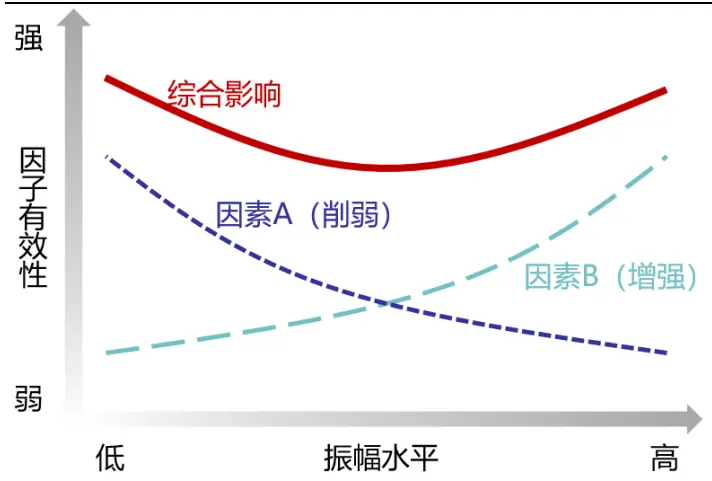
资料来源：开源证券研究所

图3: 价量类因子双因素模型1.0示意图
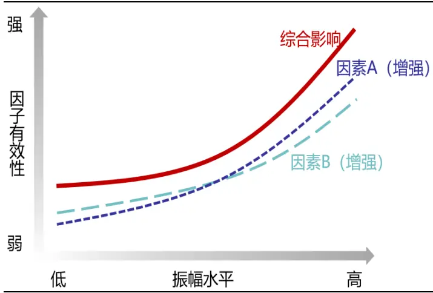
资料来源：开源证券研究所

## 1.2、证明：高振幅股票的信噪比更高

本节对1.1节中“高振幅股票的信噪比更高”的说法给出了证明。首先，我们定义了排序波动幅度指标（表1）。

表1：排序波动幅度指标构建步骤

| 步骤1 | 计算股票每日的月初至今累计收益，并得到股票的横截面排序； |
| --- | --- |
| 步骤2 | 计算股票排序的日度变化量； |
| 步骤3 | 计算所有股票日度变化量的绝对水平的均值，记作当日的排序波动幅度。 |

资料来源：开源证券研究所

图4展示了高排序波动幅度的示例，将图4展示的5只股票作为组合1，在2021年3月份，组合1从月初到月末，股票间累计收益的排序一直处于不稳定状态，股票间的排序易被噪声信息左右。图5展示了低排序波动幅度的示例，将图5展示的5只股票作为组合2，在2021年3月份，组合2在月初，股票累计收益较低的情况下，股票间的排序处于不稳定状态，但是在月中，收益累计一定程度后，股票间的排序基本稳定，在下半月股票间的排序难以被噪声信息改变。换言之，图4所示即为低信噪比示例，图5为高信噪比示例。

图4：高排序波动幅度示例
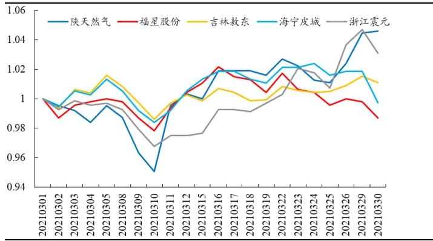
数据来源：Wind、开源证券研究所

图5：低排序波动幅度示例
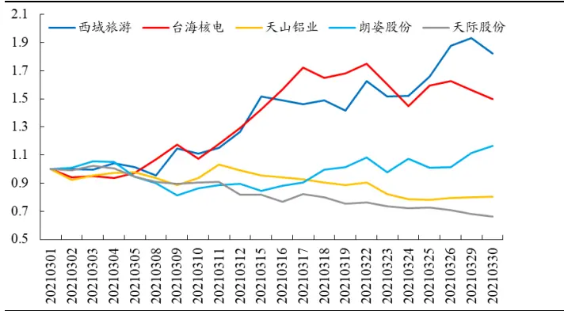
数据来源：Wind、开源证券研究所

为了说明高振幅股票的信噪比更高，我们只需要证明：在月末，收益累计一定程度后，高振幅股票的排序更难被噪声信息改变，即高振幅股票排序波动幅度更低。我们将月初5日排序波动幅度均值作为月初整体水平，将月末5日排序波动幅度均值作为月末整体水平，分别测试了不同振幅水平下，股票池月初与月末的排序波动幅度。从月初排序波动幅度来看，高振幅组排序波动幅度比低振幅组更高。这主要由于高振幅股票波动较大，在月初累计收益较低的情况下，高振幅股票间的排序波动也较大。而在月末，低振幅组排序波动幅度反而更高，说明低振幅组股票类似于图4示例，股票间排序受噪声信息干扰较大，信噪比低，高振幅股票类似于图5示例，股票间排序受噪声信息干扰较小，信噪比高。

图6：月初高振幅股票排序波动幅度更高
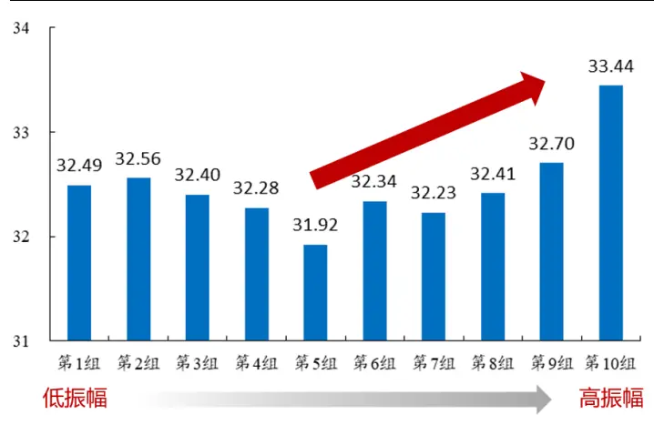
数据来源：Wind、开源证券研究所

图7：月末低振幅股票排序波动幅度更高
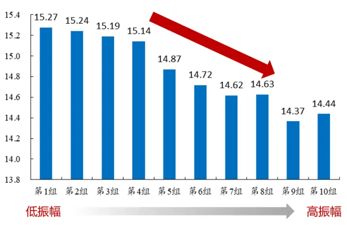
数据来源：Wind、开源证券研究所

## 1.3、双因素模型2.0：预测机制存在更精细的规律

本节将全市场股票按照振幅细分为40组，以观察图1所示不同振幅水平下，价量类因子与基本面因子有效性的分布是否稳健。价量类因子的有效性分布在细分振幅组上依旧稳健，呈现随振幅由低到高逐渐增强的趋势。而在细分振幅组上，基本面因子的有效性在振幅最高组出现一定程度下滑。

图8：更细的分层：价量类因子IC均值在高振幅组更显著（传统反转因子）
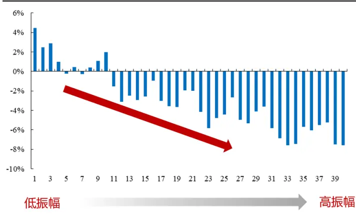
数据来源：Wind、开源证券研究所

图9：更细的分层：基本面因子IC均值在振幅最高组有所下滑（ROE增速）
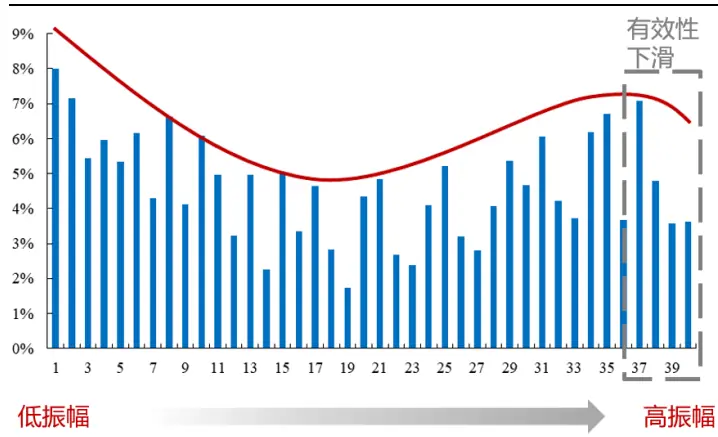
数据来源：Wind、开源证券研究所

基于基本面因子在细分振幅上有效性分布的变化，我们提出双因素模型2.0版本。在2.0版本中，影响因子有效性的两个因素与1.0版本一致。不同点在于，我们认为当振幅水平低于某一水平或高于某一水平之后（对应图10框线部分)，因素B中，信噪比对于预测机制的影响趋于稳定。换言之，在振幅最低组或者最高组，因素B的边际影响接近于0，因子有效性的边际变化完全由因素A的边际影响决定。因此，在振幅水平最高的股票池中，基本面因子有效性出现了一定程度的下滑。

图10: 基本面因子双因素模型 2.0 示意图
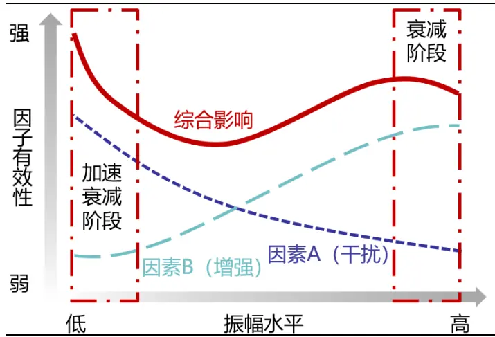
资料来源：开源证券研究所

图11：价量类因子双因素模型 2.0 示意图
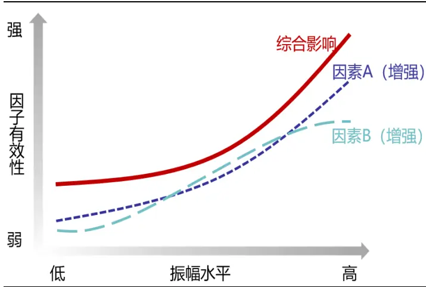
资料来源：开源证券研究所

## 2、沪深300的分层效应显著且稳定

上文讨论了全市场不同振幅水平下因子有效性的分布特征，并对其底层逻辑做出了解释。在本节，我们尝试基于股票池的振幅范围对因子有效性分布进行预判。例如，中证800股票池振幅范围相比于全市场处于较低水平，那么中证800上基本面因子有效性应该呈现一种U型曲线；沪深300股票池振幅范围相比中证800进一步降低，因此沪深300上基本面因子有效性或许处于单调下降通道；而无论是中证800还是沪深300股票池，价量类因子有效性都呈现单调增强的趋势。

图12：分层效应的预判：基本面因子有效性在中证800上呈U型分布，在沪深300上单调衰减
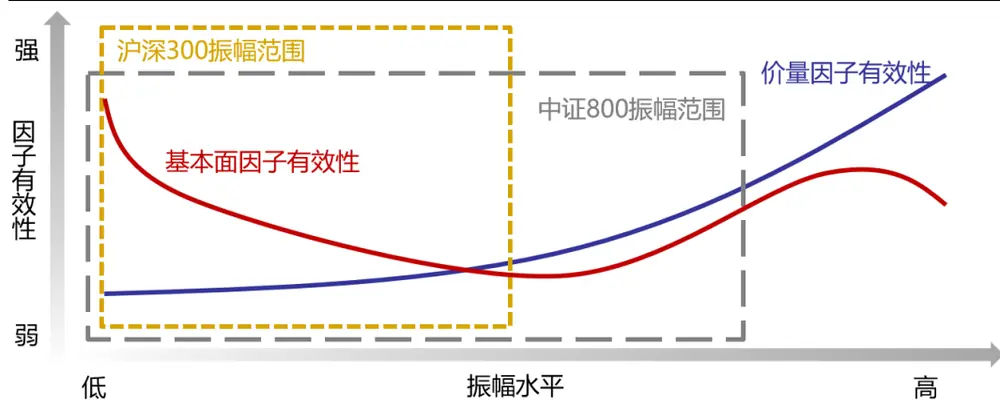
资料来源：开源证券研究所

通过振幅指标对中证800分层，可以看到，价量类因子有效性依旧随振幅水平提高而逐渐增强，而基本面因子有效性表现为U型曲线，与上述预判一致。

图13：因子有效性在不同振幅水平上的分布规律(中证800):价量类因子单调增强，基本面因子呈U型分布

| 因子大类 | 因子名称 | 总IC均值 | 第1组 | 第2组 | 第3组 | 第4组 | 图例 |
| --- | --- | --- | --- | --- | --- | --- | --- |
| 成长 | TTM_SOS_ROEGrowth | 4.88% | 5.77% | 5.68% | 4.06% | 6.12% |  |
|  | TTM_SOS_NetProfitGrowth | 5.21% | 6.73% | 6.60% | 4.24% | 4.81% |  |
|  | YOYSeason_Sa1es | 4.38% | 4.74% | 4.48% | 4.29% | 5.72% |  |
|  | YOYSeason_OP | 5.31% | 6.60% | 7.02% | 4.81% | 5.35% |  |
| 盈利质量 | TTM_ROA_PbSizeNeutra1 | 4.22% | 3.67% | 3.16% | 3.47% | 3.51% |  |
|  | TTM_ROE_PbSizeNeutral | 3.99% | 3.54% | 3.86% | 3.25% | 3.43% |  |
| 价量 | Day20Momentum | -4.17% | 1.08% | 0.28% | -2.05% | -5.81% |  |
|  | LnTurnoverRatio_20Day | -6.66% | -3.44% | -3.41% | -4.16% | -7.10% |  |

数据来源：Wind、开源证券研究所（第1组为振幅最低组）

按照振幅由低到高将沪深300股票池划分为3组，价量类因子有效性呈现单调增强的趋势，而基本面因子有效性随振幅提高单调衰减，与上述预判吻合。考虑到沪深300上基本面因子有效性处于单调下降通道，我们将股票池限定于沪深300，进一步探究沪深300上振幅指标的分层效应。

图14:因子有效性在不同振幅水平上的分布规律(沪深300):价量类因子单调增强，基本面因子单调衰减

| 因子大类 | 因子名称 | 总IC均值 | 第1组 | 第2组 | 第3组 | 图例 |
| --- | --- | --- | --- | --- | --- | --- |
| 成长 | TTM_SOS_ROEGrowth | 4.42% | 5.72% | 5.40% | 3.90% |  |
|  | TTM_SOS_NetProfitGrowth | 5.67% | 7.60% | 6.42% | 4.20% | ■ − – |
|  | YOYSeason_Sales | 4.94% | 6.08% | 5.16% | 4.29% |  |
|  | YOYSeason_OP | 5.40% | 6.87% | 6.34% | 4.38% |  |
| 盈利质量 | TTM_ROA_PbSizeNeutra1 | 4.62% | 4.92% | 4.56% | 3.35% |  |
|  | TTM_ROE_PbSizeNeutral | 4.72% | 5.54% | 5.67% | 2.97% |  |
| 价量 | Day20Momentum | -3.37% | 3.20% | -0.34% | -5.51% |  |
|  | LnTurnoverRatio_20Day | -5.67% | -2.26% | -4.12% | -6.44% |  |

数据来源：Wind、开源证券研究所（第1组为振幅最低组）

## 2.1、沪深300上分层效应的显著性

本节按照振幅将沪深300股票池等比例划分为低、中、高三组，测试各因子在不同振幅组的月度IC。为了反映历史上不同时点的IC总体水平，我们这里取月度IC序列的5年移动均值（IC MA5Y)，观察因子IC值在时序上的分布。

对于成长类因子，在不同振幅组上因子IC的分布具有显著差异。高振幅组因子IC分布分散，IC稳定度较差；其次，高振幅组IC绝对水平偏低。

图15： 成长类因子不同振幅水平IC MA5Y 分布：高振幅IC 绝对水平偏低
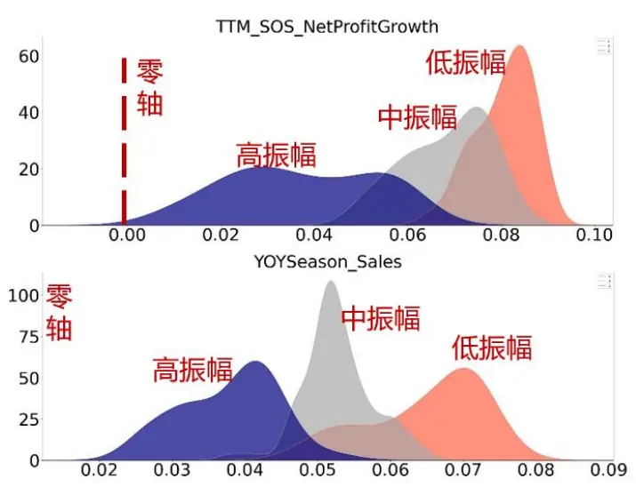
数据来源：Wind、开源证券研究所

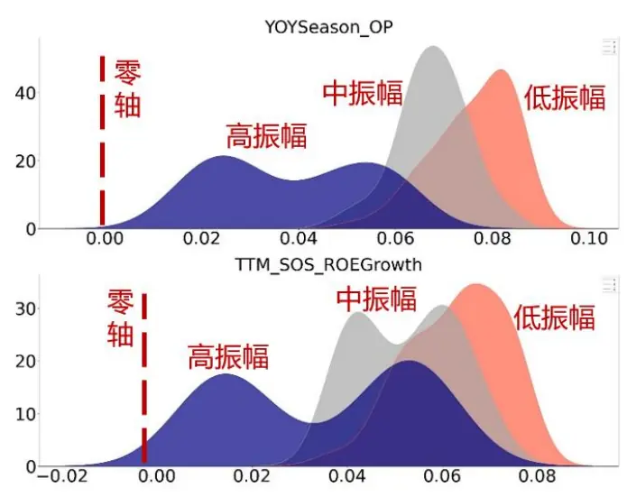

盈利质量类因子在不同振幅组IC的分布具有显著差异。高振幅组因子IC分布分散，IC稳定度较差；其次，高振幅组IC绝对水平偏低。

价量类因子在不同振幅组IC的分布也具有显著差异。高振幅组IC绝对水平偏高。

图16: 盈利质量类因子不同振幅水平 IC MA5Y 分布：高振幅层IC绝对水平偏低
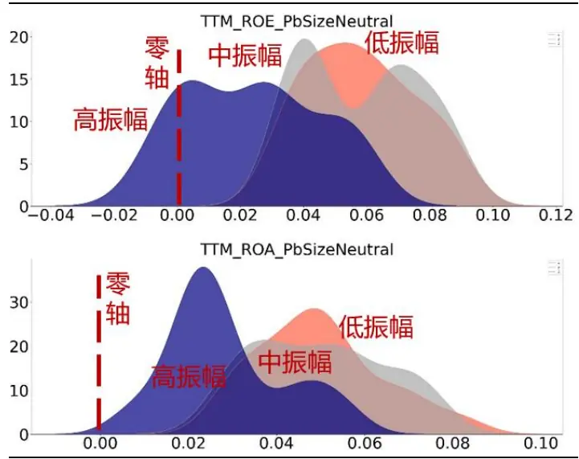
数据来源：Wind、开源证券研究所

图17：价量类因子不同振幅水平 IC_MA5Y 分布：高振幅层IC 绝对水平偏高
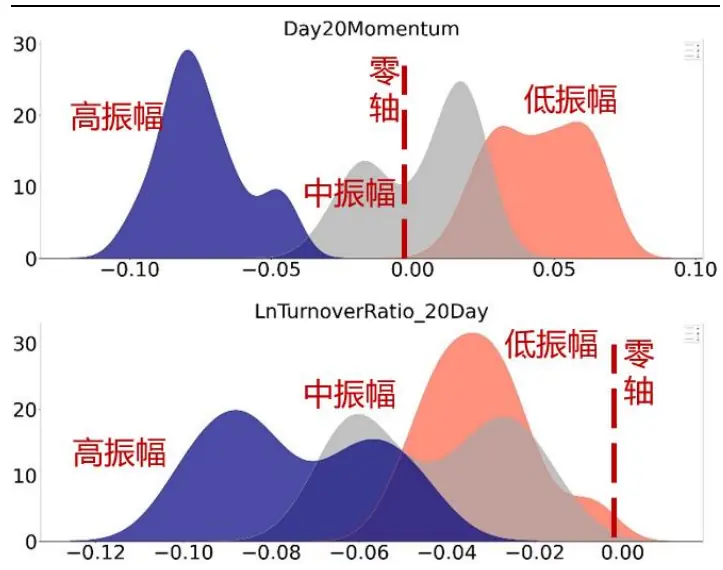
数据来源：Wind、开源证券研究所

## 2.2、沪深300上分层效应的稳定性

本节旨在说明因子在不同振幅组下的IC，在整个回测区间都具有稳定差异与单调性。这里我们仍然取月度IC序列的5年移动均值（IC MA5Y）作为因子历史上的IC水平。

在整个回测区间，成长类因子（图18-21)在不同振幅组下的IC具有稳定差异，尤其是高振幅组IC绝对水平稳定低于中、低振幅组；对于盈利质量类因子（图22-23)，高振幅组IC绝对水平稳定低于中、低振幅组；价量类因子（图24-25）高振幅组IC稳定区别于中、低振幅组，并且IC绝对水平稳定高于中、低振幅组。

图18: TTM SOS ROEGrowth 因子分层 IC 时序变化:高振幅层IC绝对水平稳定低于中低振幅层
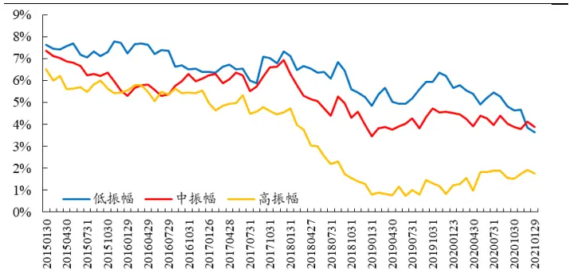
数据来源：Wind、开源证券研究所

图19: TTM SOS NetProfitGrowth 因子分层 IC 时序变 化：高振幅层IC绝对水平稳定低于中低振幅层
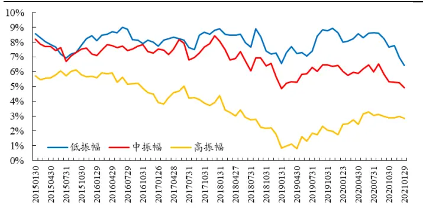
数据来源：Wind、开源证券研究所

图20: YOYSeason_Sales 因子分层 IC 时序变化：高振幅 层IC绝对水平稳定低于中低振幅层
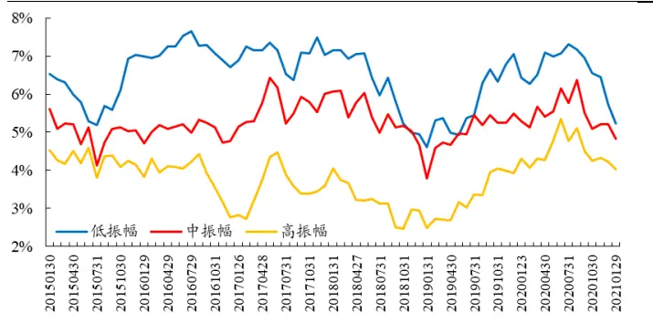
数据来源：Wind、开源证券研究所

图21：YOYSeason_OP 因子分层 IC 时序变化：高振幅层IC绝对水平稳定低于中低振幅层
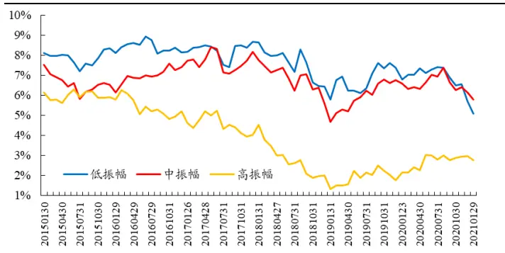
数据来源：Wind、开源证券研究所

图22:TTM ROA PbSizeNeutral 因子分层 IC 时序变化：高振幅层IC绝对水平稳定低于中低振幅层
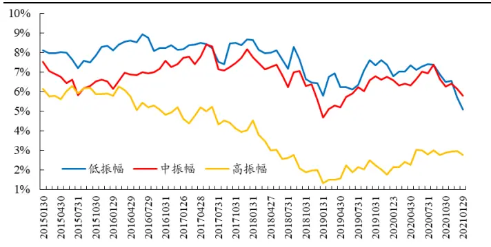
数据来源：Wind、开源证券研究所

图23: TTM ROE PbSizeNeutral 因子分层 IC 时序变化：高振幅层IC绝对水平稳定低于中低振幅层
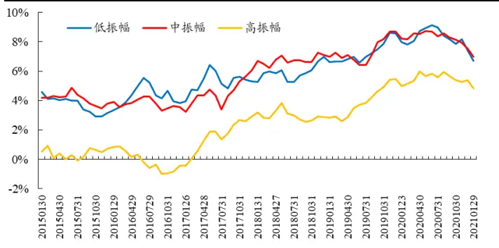
数据来源：Wind、开源证券研究所

图24：Day20Momentum 因子分层IC 时序变化：高振幅 层IC绝对水平稳定高于中低振幅层
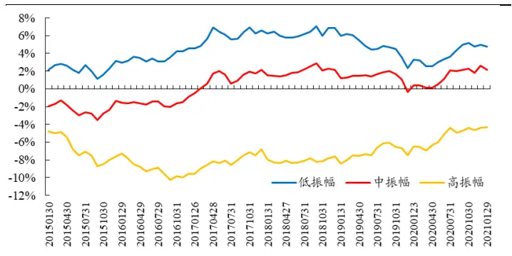
数据来源：Wind、开源证券研究所

图25：LnTurnoverRatio 20Day 因子分层IC 时序变化:高振幅层IC绝对水平稳定高于中低振幅层
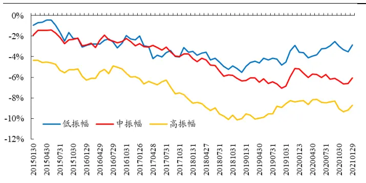
数据来源：Wind、开源证券研究所

## 3、分层效应的应用范例：回撤改善，收益风险比提升

在沪深300股票池中，基本面因子与价量类因子存在振幅上的有效性错配。基本面因子在中、低振幅组有效性高，高振幅组有效性低。相反，价量类因子在中、低振幅组有效性低，在高振幅组有效性高。基于这一特点，本节在沪深300上提出分层组合的构建方案，即：中、低振幅组应用基本面因子，高振幅组应用价量类因子。具体步骤如下（流程如图26所示）:

·第1步：按照振幅将沪深300划分为低、中、高三个振幅层；

·第2步：各振幅层选择对应的因子；

·第3步：振幅层内用所选因子排序分组；

·第4步：将各振幅层空头组合并为分层组合空头组，以此类推，得到分层组合。

图26：分层组合构建流程示意图

| 第4步 得到总体分组 | 第3步 层内用所选因子分组 |  |  |
| --- | --- | --- | --- |
| 组合空头组 | 空头组 | 空头组 | 空头组 第二组 |
| 组合第二组 | 第二组 | 第二组 |  |
|  | : | . |  |
| 组合多头组 | 多头组 | 多头组 多头组 |  |
| 第2步 C 选择各层因子 | 基本面因子Rank(升) | 基本面因子Rank(升) | 价量因子Rank(降) |
| 第1步 振幅分层 | 低振幅 | 中振幅 | 高振幅 |

资料来源：开源证券研究所

首先，我们通过单个价量因子与单个基本面因子构建分层组合，相比于因子等权多空组合与因子IR加权多空组合，分层多空组合年化收益差异较小，但多空组合稳定度提升，年化IR提升约0.2，最大回撤改善约8%。

表2：单个价量因子+基本面因子构建分层多空组合结果对比：最大回撤改善约8%，年化IR提升0.2

| 价量因子 | 基本面因子 | 年化收益 |  | 年化IR |  | 最大回撤 |  |
| --- | --- | --- | --- | --- | --- | --- | --- |
|  |  | 等权组合 IR 加权 | 分层组合 | 等权组合 IR加权 | 分层组合 | 等权组合 | IR加权 分层组合 |
| Day20Momentum | TTM ROA PbSizeNeutral | 7.10% 7.22% | 9.30% | 0.68 | 0.76 1.05 | 25.73% | 23.42% 17.13% |
|  | TTM ROE PbSizeNeutral | 8.47% 8.27% | 9.38% | 0.82 0.86 | 1.06 | 28.17% | 24.49% 16.04% |
|  | TTM_SOS_ROEGrowth | 10.33% 10.82% | 11.85% | 1.45 1.46 | 1.73 | 14.69% | 15.19% 6.68% |
|  | TTM_SOS_NetProfitGrowth | 13.47% 13.64% | 12.80% | 1.59 1.55 | 1.72 | 15.09% | 15.51% 5.99% |
|  | YOYSeason_Sales | 11.41% 11.97% | 10.85% | 1.25 1.34 | 1.50 | 14.73% | 15.86% 6.54% |
|  | YOYSeason_OP | 12.09% 12.46% | 12.30% | 1.47 | 1.48 1.69 | 14.97% | 14.66% 7.06% |
| LnTurnoverRatio _20Day | TTM_ROA_PbSizeNeutral | 8.46% 7.76% | 9.60% | 0.86 | 0.79 1.18 | 21.71% | 23.29% 12.05% |
|  | TTM_ROE_PbSizeNeutral | 9.63% 9.50% | 9.68% | 0.96 0.94 | 1.15 | 25.33% | 24.44% 16.01% |
|  | TTM_SOS_ROEGrowth | 12.11% 11.98% | 12.09% | 1.50 | 1.52 1.73 | 15.77% | 15.37% 7.70% |
|  | TTM_SOS_NetProfitGrowth | 15.90% 15.20% | 12.98% | 1.67 | 1.62 1.62 | 13.55% | 14.96% 7.68% |
|  | YOYSeason_Sales | 12.09% 12.33% | 11.10% | 1.37 | 1.37 1.53 | 17.42% | 16.39% 9.18% |
|  | YOYSeason_OP | 14.51% 13.80% | 12.47% | 1.58 | 1.55 1.58 | 15.67% | 14.79% 8.16% |

数据来源：Wind、开源证券研究所

其次，我们将成长类因子等权组合为成长因子。将盈利质量类因子等权组合为盈利质量因子，分别于价量因子构建分层组合。成长因子+价量因子的分层多空组合年化IR提升0.2，最大回撤改善10%。盈利质量因子+价量因子的分层多空组合年化IR提升0.3，最大回撤改善明显，改善12%。

图27：成长因子+价量因子构建分层组合：最大回撤改善10%
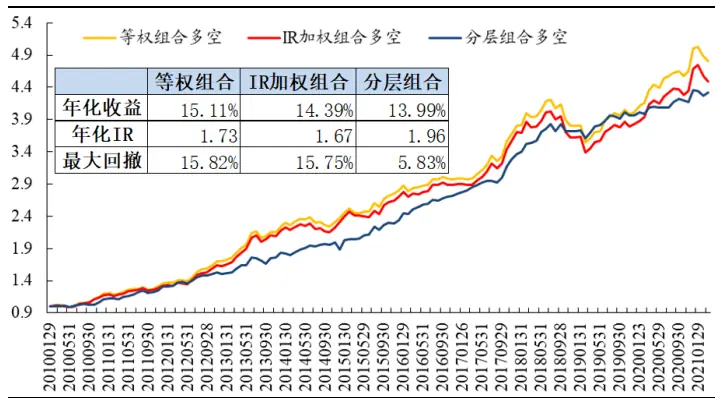
数据来源：Wind、开源证券研究所

图28：盈利质量类因子+价量因子构建分层组合：最大回撤改善12%
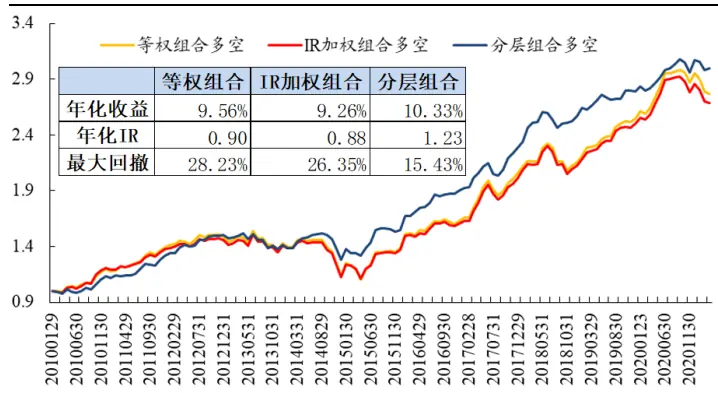
数据来源：Wind、开源证券研究所

最后，我们将成长因子与盈利质量因子合成基本面因子，其与价量因子构建的分层组合年化IR提升0.2，最大回撤改善6%。

图29：基本面因子+价量因子构建分层组合：最大回撤改善6%
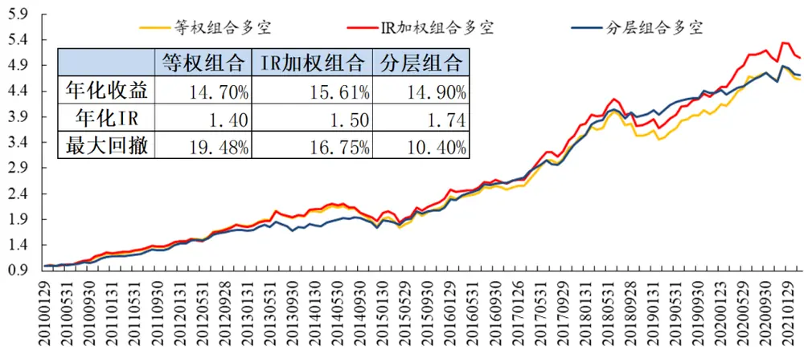
数据来源：Wind、开源证券研究所

## 4、重要讨论

## 4.1、振幅分层效应并非源于分层上的行业偏离

从沪深300各振幅分层的板块分布可知，低振幅组主要超配金融与制造板块，高振幅组主要超配科技板块。随着振幅提高，金融与制造板块的配置比例逐步下降，科技板块的配置比例逐步提高。

图30：各振幅水平下各版块占比：低振幅超配金融、制造，高振幅超配科技
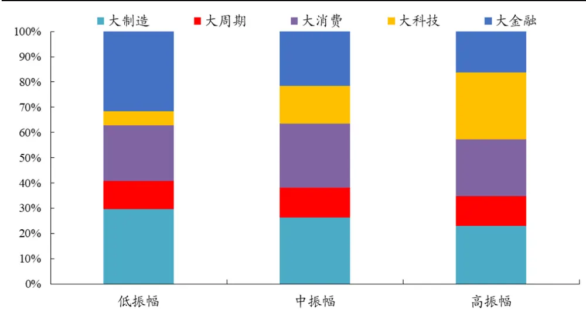
数据来源：Wind、开源证券研究所

为了探究振幅的分层效应是否源于分层间的行业偏离，这里我们对振幅指标做行业中性化处理，并用行业中性化后的振幅指标进行分层。可以看出，行业中性化后的分层效应依旧显著。

图31：按行业中性化振幅分层后仍存在分层效应（沪深300）

| 因子大类 | 因子名称 | 总IC均值 | 第1组 | 第2组 | 第3组 | 图例 |
| --- | --- | --- | --- | --- | --- | --- |
| 成长 | TTM_SOS_ROEGrowth | 4.06% | 6.40% | 4.06% | 3.76% | ■– – |
|  | TTM_SOS_NetProfitGrowth | 3.65% | 7.45% | 5.27% | 4.69% | ■ –– |
|  | YOYSeason_Sales | 2.86% | 5.30% | 4.78% | 4.59% |  |
|  | YOYSeason_OP | 3.71% | 6.57% | 5.45% | 4.54% |  |
| 盈利质量 | TTM_ROA_PbSizeNeutral | 3.38% | 5.21% | 5.10% | 3.17% |  |
|  | TTM_ROE_PbSizeNeutral | 3.27% | 5.66% | 5.02% | 3.15% |  |
| 价量 | Day20Momentum | -7.05% | 2.26% | -0.18% | -6.00% |  |
|  | LnTurnoverRatio_20Day | -7.49% | -4.05% | -4.41% | -7.25% |  |

数据来源：Wind、开源证券研究所（第1组为振幅最低组）

## 4.2、股票跃迁主要发生在相邻的振幅层，跃迁比率约为25%

本报告对沪深300股票池的分层，是每个月末按过去20日振幅均值重新调整的动态分层。因此，每月之间股票在不同振幅层的跃迁，也是应用中需要重点关注的因素。本节我们测算了月度股票在不同振幅层间的跃迁比率（也即转移股票数占原来该层股票数的比例)。从测算结果来看，股票的跃迁主要发生在相邻的振幅层。其中，每个月大约21.3%的股票从低振幅层跃迁至中振幅层；24.6%的股票从中振幅层跃迁至高振幅层；从中振幅层跃迁至低振幅层的股票为24.4%；从高振幅层跃迁至中振幅层的股票为27.9%。低振幅层与高振幅层间的股票跃迁比率相对较低：低振幅层跃迁至高振幅层的股票为6.23%；高振幅层跃迁至低振幅层的股票为3.93%。

图32：不同振幅分层之间的股票跃迁比率：相邻振幅层跃迁比率约为25%
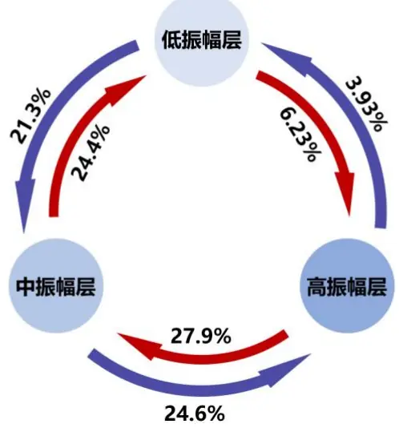
数据来源：Wind、开源证券研究所

## 4.3、实证数据支持双因素模型 2.0 的猜想

本节对双因素模型2.0版本进行简单验证。总体思路为：拟合不同振幅水平下因素A的影响，将实证得到的因子有效性真实值，剔除因素A的拟合结果后，得到因素B的影响，最终证明在不同振幅水平下的因素B影响基本符合双因素模型2.0中的猜想，且拟合度较高。

本节，我们用x代表振幅水平；F(x)代表综合影响； $f_{A}(x)$ 代表因素A 的影响；$f_{B}(x)$ 代表因素B的影响；则：

$$
F(\mathrm{x})=f_A(x)+f_B(x),(x_0\leq x\leq x_1);
$$

假设： $f_{A}(x)={\textstyle{\frac{1}{2}}}ax^{2}+bx;$

由于在振幅最低水平与振幅最高水平，基本面因子有效性的边际变化完全由因素A的边际变化决定，则可得条件：

$$
\lim_{x\to x_0}F'(x)=\lim_{x\to x_0}f_A'(x);
$$

$$
\lim_{x\to x_{1}}F^{\prime}(x)=\lim_{x\to x_{1}}{f_{A}}^{\prime}(x);
$$

$$
{f_{A}}^{\prime\prime}(x)=a=\left.\frac{F^{\prime}(x_{1})-F^{\prime}(x_{0})}{x_{1}-x_{0}}\right.;
$$

这里， $x_{0}$ 取前5 组振幅水平均值， $x_{1}$ 取后5组振幅水平均值， $F^{\prime}(x_{0})$ 取前5组回归斜率项， $F^{\prime}(x_{1})$ 取后5组回归斜率项。

得到参数a估计值之后，将前5组及后5组振幅水平带入下式得到参数b估计值。

$$
{f_A}'(x_0)=ax_0+b=F'(x_0)
$$

确定因素A拟合方程的参数之后，我们可以计算得到因子在各振幅水平上因素A的估计影响（图33蓝点)，将因子在不同振幅水平下的有效性真实值，扣减因素A的估计影响之后，最终得到因素B的估计影响。可以发现，因素B的形态（图33红点）与双因素模型2.0版本中的猜想一致，并且拟合度较高。

图33：数据拆解得到因素B验证猜想
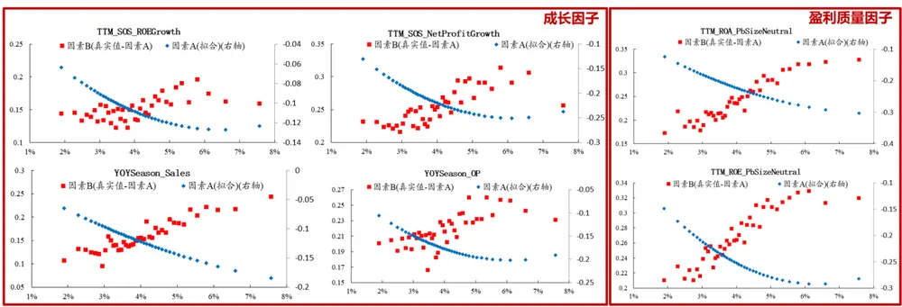
数据来源：Wind、开源证券研究所

## 4.4、分层框架最终可等效为一个新因子

上文提出的分层框架，实际上跳过了因子构建的步骤，直接得到股票组合。考虑到与存量因子的可加性，我们在本节讨论分层框架下构建因子的解决思路。具体流程如下：

·第1步：按照振幅将沪深300划分为低、中、高三个振幅层；

·第2步：各振幅层分别选择自身对应的有效因子；

·第3步：在各振幅层内用所选因子对股票进行排序，得到“层内排序值”；

·第4步：将各振幅层重新合并为大股票池，“层内排序值”即为新因子。

以上方法，最终为沪深300股票赋予了新的因子值，可以等效视为一个新因子，满足与存量因子结合时的可加性要求。

## 5、风险提示

模型测试基于历史数据，市场未来可能发生重大变化。

## 特别声明

《证券期货投资者适当性管理办法》、《证券经营机构投资者适当性管理实施指引（试行)》已于2017年7月1日起正式实施。根据上述规定，开源证券评定此研报的风险等级为R3（中风险)，因此通过公共平台推送的研报其适用的投资者类别仅限定为专业投资者及风险承受能力为C3、C4、C5的普通投资者。若您并非专业投资者及风险承受能力为C3、C4、C5的普通投资者，请取消阅读，请勿收藏、接收或使用本研报中的任何信息。

因此受限于访问权限的设置，若给您造成不便，烦请见谅！感谢您给予的理解与配合。

## 分析师承诺

负责准备本报告以及撰写本报告的所有研究分析师或工作人员在此保证，本研究报告中关于任何发行商或证券所发表的观点均如实反映分析人员的个人观点。负责准备本报告的分析师获取报酬的评判因素包括研究的质量和准确性、客户的反馈、竞争性因素以及开源证券股份有限公司的整体收益。所有研究分析师或工作人员保证他们报酬的任何一部分不曾与，不与，也将不会与本报告中具体的推荐意见或观点有直接或间接的联系。

## 股票投资评级说明

|  | 评级 | 说明 |
| --- | --- | --- |
| 证券评级 | 买入（Buy） | 预计相对强于市场表现20%以上； |
|  | 增持（outperform） | 预计相对强于市场表现 5%~20%; |
|  | 中性（Neutral） | 预计相对市场表现在-5%~+5%之间波动； |
|  | 减持 | 预计相对弱于市场表现5%以下。 |
| 行业评级 | 看好（overweight） | 预计行业超越整体市场表现； |
|  | 中性（Neutral） | 预计行业与整体市场表现基本持平； |
|  | 看淡 | 预计行业弱于整体市场表现。 |
| 备注：评级标准为以报告日后的6~12个月内，证券相对于市场基准指数的涨跌幅表现，其中A股基准指数为沪深300指数、港股基准指数为恒生指数、新三板基准指数为三板成指（针对协议转让标的）或三板做市指数（针对做市转让标的)、美股基准指数为标普500或纳斯达克综合指数。我们在此提醒您，不同证券研究机构采用不同的评级术语及评级标准。我们采用的是相对评级体系，表示投资的相对比重建议；投资者买入或者卖出证券的决定取决于个人的实际情况，比如当前的持仓结构以及其他需要考虑的因素。投资者应阅读整篇报告，以获取比较完整的观点与信息，不应仅仅依靠投资评级来推断结论。 |  |  |

## 分析、估值方法的局限性说明

本报告所包含的分析基于各种假设，不同假设可能导致分析结果出现重大不同。本报告采用的各种估值方法及模型均有其局限性，估值结果不保证所涉及证券能够在该价格交易。

## 法律声明

开源证券股份有限公司是经中国证监会批准设立的证券经营机构，由陕西开源证券经纪有限责任公司变更延续的专业证券公司，已具备证券投资咨询业务资格。

本报告仅供开源证券股份有限公司（以下简称“本公司”）的机构或个人客户（以下简称“客户”）使用。本公司不会因接收人收到本报告而视其为客户。本报告是发送给开源证券客户的，属于机密材料，只有开源证券客户才能参考或使用，如接收人并非开源证券客户，请及时退回并删除。

本报告是基于本公司认为可靠的已公开信息，但本公司不保证该等信息的准确性或完整性，本报告所载的资料、工具、意见及推测只提供给客户作参考之用，并非作为或被视为出售或购买证券或其他金融工具的邀请或向人做出邀请。本报告所载的资料、意见及推测仅反映本公司于发布本报告当日的判断，本报告所指的证券或投资标的的价格、价值及投资收入可能会波动。在不同时期，本公司可发出与本报告所载资料、意见及推测不一致的报告。客户应当考虑到本公司可能存在可能影响本报告客观性的利益冲突，不应视本报告为做出投资决策的唯一因素。本报告中所指的投资及服务可能不适合个别客户，不构成客户私人咨询建议。本公司未确保本报告充分考虑到个别客户特殊的投资目标、财务状况或需要。本公司建议客户应考虑本报告的任何意见或建议是否符合其特定状况，以及（若有必要）咨询独立投资顾问。在任何情况下，本报告中的信息或所表述的意见并不构成对任何人的投资建议。在任何情况下，本公司不对任何人因使用本报告中的任何内容所引致的任何损失负任何责任。若本报告的接收人非本公司的客户，应在基于本报告做出任何投资决定或就本报告要求任何解释前咨询独立投资顾问。

本报告可能附带其它网站的地址或超级链接，对于可能涉及的开源证券网站以外的地址或超级链接，开源证券不对其内容负责。本报告提供这些地址或超级链接的目的纯粹是为了客户使用方便，链接网站的内容不构成本报告的任何部分，客户需自行承担浏览这些网站的费用或风险。

开源证券在法律允许的情况下可参与、投资或持有本报告涉及的证券或进行证券交易，或向本报告涉及的公司提供或争取提供包括投资银行业务在内的服务或业务支持。开源证券可能与本报告涉及的公司之间存在业务关系，并无需事先或在获得业务关系后通知客户。

本报告的版权归本公司所有。本公司对本报告保留一切权利。除非另有书面显示，否则本报告中的所有材料的版权均属本公司。未经本公司事先书面授权，本报告的任何部分均不得以任何方式制作任何形式的拷贝、复印件或复制品，或再次分发给任何其他人，或以任何侵犯本公司版权的其他方式使用。所有本报告中使用的商标、服务标记及标记均为本公司的商标、服务标记及标记。

## 开源证券研究所

上海

地址：上海市浦东新区世纪大道1788号陆家嘴金控广场1号

楼10层

邮编：200120

邮箱：research@kysec.cn

北京
地址：北京市西城区西直门外大街18号金贸大厦C2座16层
邮编：100044
邮箱：research@kysec.cn

深圳

楼45层

地址：深圳市福田区金田路2030号卓越世纪中心1号

邮编：518000

邮箱：research@kysec.cn

西安

地址：西安市高新区锦业路1号都市之门B座5层

邮编：710065

邮箱：research@kysec.cn