# 大单与小单资金流的 alpha 能力

2021年06月02日

## 金融工程研究团队

魏建榕（首席分析师）

邮箱：weijianrong@kysec.cn

证书编号：S0790519120001

## 张翔（分析师）

邮箱：zhangxiang2@kysec.cn

证书编号：S0790520110001

## 傅开波（分析师）

邮箱：fukaibo@kysec.cn

证书编号：S0790520090003

## 高鹏（分析师）

邮箱：gaopeng@kysec.cn

证书编号：S0790520090002

## 苏俊豪（研究员）

邮箱：sujunhao@kysec.cn

证书编号：S0790120020012

## 胡亮勇（研究员）

邮箱：huliangyong@kysec.cn

证书编号：S0790120030040

## 王志豪（研究员）

邮箱：wangzhihao@kysec.cn

证书编号：S0790120070080

《市场微观结构研究系列(8)-结合行业轮动的沪深300指数增强测试》-2020.05.27

《市场微观结构研究系列(9)-主动买卖因子的正确用法》-2020.09.05

## 相关研究报告

《市场微观结构研究系列（10）-因子切割论》-2020.09.17

《市场微观结构研究系列（11）-A股分层效应的普适规律与底层逻辑》-2021.04.30

# ——市场微观结构研究系列（12）

## 魏建榕（分析师）

高鹏（分析师）

weijianrong@kysec.cn

证书编号：S0790519120001

gaopeng@kysec.cn

证书编号：S0790520090002

## 资金流的 alpha 来源是大单的预见性

从横截面上，我们可以看到，大单与小单的资金流之间，存在较强的负相关。我们使用比较常见的成交额标准化（资金净流入金额/同期的总成交金额)，得到大单和小单资金流因子。从大单和小单资金流因子的五分组对冲曲线(因子值最大组-因子值最小组)可以看出，大单资金流因子具有稳定的正向选股效果，小单资金流因子具有稳定的负向选股效果。其中，大单资金流因子IC均值为0.025，小单资金流因子IC均值为-0.027。从alpha产生的角度来讨论，大单资金流的正向alpha能力，源自大单资金的预见性；而小单资金流的负向alpha能力，源自大单资金的“挤出效应”。

## 资金流因子构造的关键：标准化

除了成交额外，我们提出了“资金流买入金额+卖出金额”标准化和“资金净流入金额绝对值”标准化两种方法。其中“净流入金额绝对值”标准化表现最优，IR明显高于成交额标准化和“买入金额+卖出金额”标准化，大单资金流强度因子 IC 均值提升至 0.042，IR 提升至 2.69；小单资金流强度因子IC 均值提升至-0.03，IR 提升至 1.37。

## 资金流强度因子的改进：残差资金流强度

通过研究发现大单资金流强度与涨跌幅同步正相关，小单资金流强度与涨跌幅同步负相关，且R2较高。为了剥离资金流强度因子中涨跌幅的影响，我们采用比较常见的横截面回归方法，回归后的残差记为残差资金流强度因子。残差资金流强度因子的选股效果有了明显提升：大单残差资金流强度因子IC均值提升至0.054，信息比率IR提升至3.96;小单残差资金流强度因子IC 均值提升至-0.057，信息比率IR提升至3.81。残差资金流强度因子表现显著优于资金流强度因子，另外其在沪深300和中证500内的效果也较好。

## 反转因子改进：残差反转因子

为了剥离传统反转因子中资金流强度的影响，本节同样采取横截面回归的方法将残差记为残差反转因子。其中回归掉大单、小单的残差反转因子，多空对冲信息比率IR分别为1.87、2.26，相比于传统反转因子1.42的信息比率都提升了，而且残差反转因子的多头相比于传统反转因子也改善了较多，是一个切实可行的改进方案。

风险提示：模型测试基于历史数据，市场未来可能发生变化。

## 1、资金流的 alpha 来源是大单的预见性

资金流行为通过逐笔成交数据计算得到，反映了股票的微观供求信息。按照通常习惯，资金流向被依据挂单金额的大小，分为四种类型进行统计：超大单(>100万元）、大单（20-100万元）、中单（4-20万元）和小单（<4万元)。资金净流入意味着该类资金持有的筹码增多，资金净流出则意味着持有的筹码减少。在A股市场中，各类资金流的行为特征如何？蕴含了怎样的领先信息？其alpha信息的来源是什么？这些问题至今没有得到很好的厘清。我们逐一做了考察，主要结论陈列如下。

（1）恐惧与贪婪的不对称性。图1我们给出了四类资金的净流入变化（曲线为全部A股每周净流入金额的中位数的5周移动平均)。一个非常突出的现象是，小单资金基本呈现净流入，大单资金基本呈现净流出。这种现象与A股市场投资者的行为特征有关：在买入时，倾向于小心翼翼地、试探性地分批建仓；在卖出时，往往容易出现恐慌式的快速抛售。以上这种“恐惧与贪婪的不对称性”，直接导致了“小单净流入、大单净流出”结构性偏移。

(2)大单与小单是关键变量。图1中另一个值得指出的现象是，在四类资金中，小单和大单净流入金额的绝对水平较高，而中单和超大单的净流入金额则明显偏小。这个现象是源于四类资金划分标准的瑕疵：超大单的门槛标准过高、中单的区间限定过窄。由于这个量级过小的问题，单独去考察“超大单”、“中单”的资金流行为，变得没有太大意义。另一方面，正如我们曾经指出的，A股市场逐笔成交金额的中位数约是0.8万元、80%分位约是2.4万元，所谓超大单、大单、中单，实际上都是偏大的订单，因此也不必拘泥于“超大单”“大单”“中单”的命名方式。本报告我们的考察聚焦于“小单”、“大单”两类，将其视为小订单、大订单的代理变量。

图1：大单净流出，小单净流入（万元）
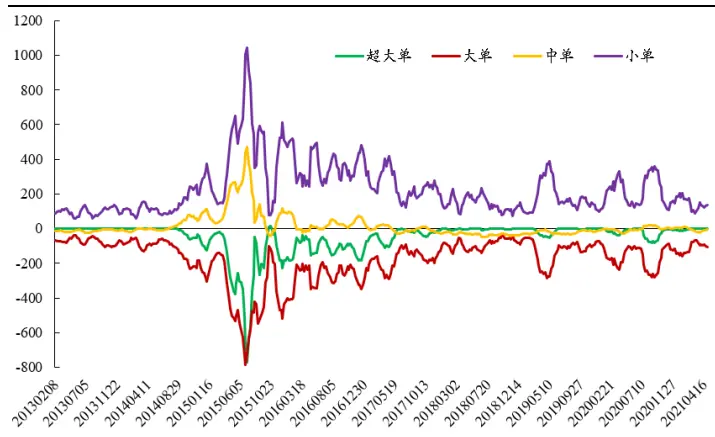
数据来源：Wind、开源证券研究所

图2：大单与小单资金流呈现负相关（截面相关系数）
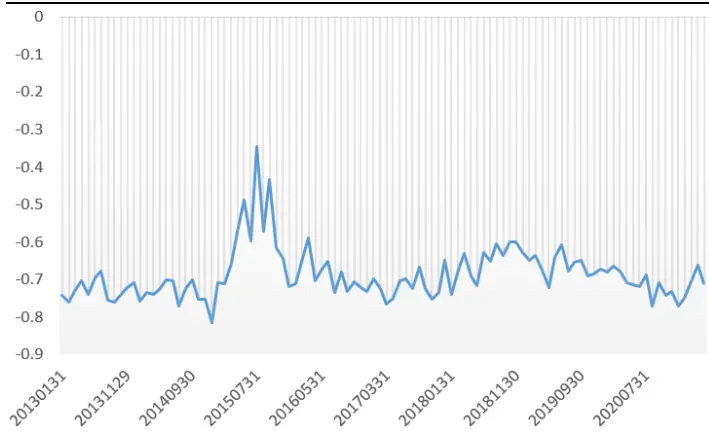
数据来源：Wind、开源证券研究所

(3)相关alpha来源是大单资金的预见性。从横截面上，我们可以看到，大单与小单的资金流之间，存在较强的负相关（图2)。我们使用比较常见的成交额标准化（资金净流入金额/同期的总成交金额)，得到大单和小单资金流因子。从大单和小单资金流因子的五分组对冲曲线（因子值最大组-因子值最小组）可以看出，大单资金流因子具有稳定的正向选股效果，小单资金流因子具有稳定的负向选股效果（图3)。其中，大单资金流因子IC均值为 0.025，小单资金流因子IC 均值为-0.027。从alpha产生的角度来讨论，大单资金流的正向alpha能力，源自大单资金的预见性;而小单资金流的负向alpha能力，源自大单资金的“挤出效应”。这里所谓的挤出效应，构成要素有如下三个方面：其一、对于四类资金而言，由于净流入的配平要求，需基本满足“超大单因子+大单因子+中单因子+小单因子=0”的等式；其二、大单资金的交易意愿更强，因此在筹码流动的过程中，大单资金是主动变量，其他三类资金整体上是被动变量；其三、如前文讨论，超大单与中单资金流的量级偏小，因此在其他三类资金与大单资金流的配平过程中，真正发挥作用的实际上是小单。挤出效应的直接结果是：小单资金流承担了配平大单资金流的主要压力，也顺带承接了相应的负向 alpha。

图3：大单资金流因子具有正向选股能力，小单资金流因子具有负向选股能力
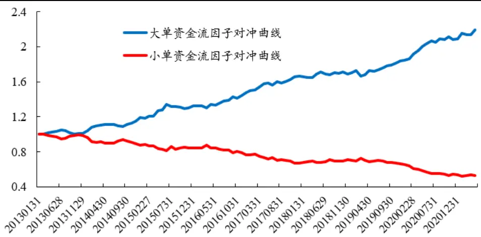
数据来源：Wind、开源证券研究所

## 2、资金流因子构造的关键：标准化

上面提到，我们在使用资金流因子前会进行标准化操作，这主要是考虑到不同股票的成交情况不同。最为常见的方式是使用成交额标准化，用来衡量资金流入强度(Cash InflowStrength，简记为 S)。我们这里讨论不同标准化方式对于因子最终选股效果的影响，以期望更好地衡量资金流入强度。除了成交额外，我们提出了两种标准化方法，分别是“资金流买入金额+卖出金额”标准化和“资金净流入金额绝对值”标准化（表1）。

表1：资金流强度因子的标准化方法（以大单为例）

| 标准化方法 | 标准化方法公式 | 标准化方法含义 |
| --- | --- | --- |
| 成交额 | $S1=\frac{\sum_{t-T}^{t}buy_{t}-sell_{t}}{\sum_{t-T}^{t}Amount_{t}}$ | 分母是过去T个交易日个股的成交额之和 进行标准化 |
| 买入金额+卖出金额 | $S2=\frac{\sum_{t-T}^{t}buy_{t}-sell_{t}}{\sum_{t-T}^{t}buy_{t}+sell_{t}}$ | 分母是过去T个交易日个股的大单买入金 额和大单卖出金额之和进行标准化 |
| 净流入金额绝对值 | $S3=\frac{\sum_{t-T}^{t}buy_{t}-sell_{t}}{\sum_{t-T}^{t}\|buy_{t}-sell_{t}\|}$ | 分母是过去T个交易日个股的大单净流入 金额绝对值之和进行标准化 |

资料来源：开源证券研究所

我们回看过去20个交易日的资金流数据，使用上述3种标准化方法构造资金流强度因子。进一步我们测试并对比不同资金流强度因子的选股能力。从大单和小单的测试结果来看（图4，图5)，不同标准化方法的资金流强度因子，选股能力存在明显差异。其中，净流入金额绝对值标准化表现最优，IR明显高于成交额标准化和“买入金额+卖出金额”标准化。大单资金流强度因子IC 均值提升至0.042，IR提升至2.69；小单资金流强度因子IC 均值提升至-0.03，IR 提升至1.37。

图4: 不同标准化方法的大单资金流强度因子IR
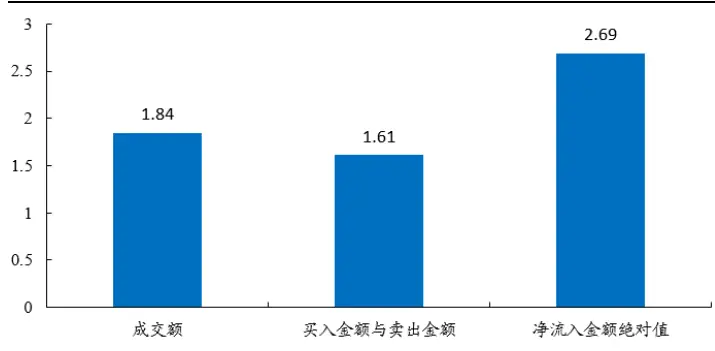
数据来源：Wind、开源证券研究所

图5：不同标准化方法的小单资金流强度因子IR
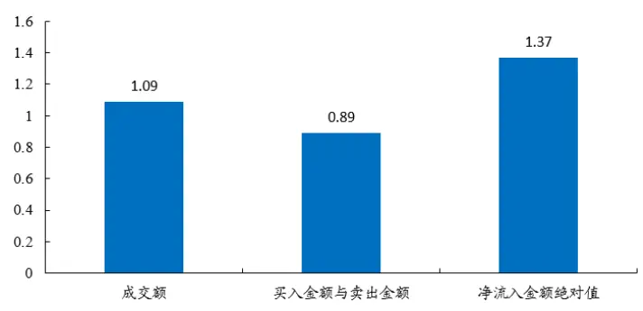
数据来源：Wind、开源证券研究所

资金的流入或流出会同步导致股票的上涨或下跌，直觉上我们可以猜想资金流强度和同时段的涨跌幅会存在一定相关性。我们任意选取单一交易日横截面上所有股票，绘制了资金流强度因子（净流入金额绝对值标准化）和20日涨跌幅因子的散点图（图6为大单，图7为小单；横轴为涨跌幅，纵轴为资金流强度)。从散点图回归线可以看出，大单资金流强度与涨跌幅同步正相关，小单资金流强度与涨跌幅同步负相关，且R2较高。不同资金流强度因子与涨跌幅具有一定相关性，且相关性存在差异。我们不禁思考：剥离涨跌幅影响后的资金流强度因子，选股能力是否有剧烈的变化?

图6：大单资金流强度与涨跌幅正相关
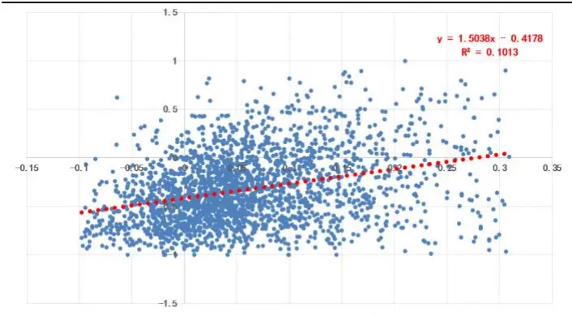
数据来源：Wind、开源证券研究所

图7：小单资金流强度与涨跌幅负相关
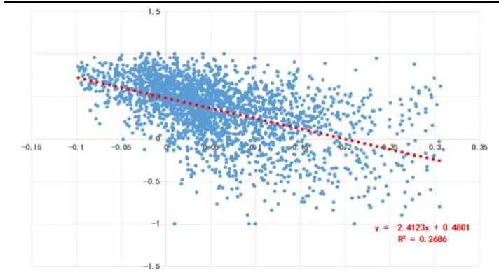
数据来源：Wind、开源证券研究所

## 3、资金流强度因子的改进：残差资金流强度

为了剥离资金流强度因子中涨跌幅的影响，我们采用比较常见的横截面回归方法，回归后的残差记为残差资金流强度因子。具体回归式如下：

$$
S_{t}=a+b*Ret20_{t}+\varepsilon_{t}
$$

其中S为净流入金额绝对值标准化后的资金流强度因子，Ret20为涨跌幅， $\varepsilon_{t}$ 为回归后的残差因子。以大单为例，回归后残差即为每个股票散点距离回归线的距离(图6)，残差资金流强度因子想要区分的是：在同等涨跌幅（Ret20）的情况下，资金流强度的选股能力如何？

我们对大单和小单资金流强度因子，进行上述回归后得到残差资金流强度因子。进一步，我们测试了大单和小单残差资金流强度因子的选股能力(图8，图9，表2)。可以发现，残差资金流强度因子的选股效果有了明显提升：大单残差资金流强度因子IC 均值提升至 0.054，信息比率 IR 提升至3.96；小单残差资金流强度因子IC均值提升至-0.057，信息比率IR提升至3.81。残差资金流强度因子表现显著优于资金流强度因子。

图8：大单残差资金流强度因子多空对冲表现显著提升
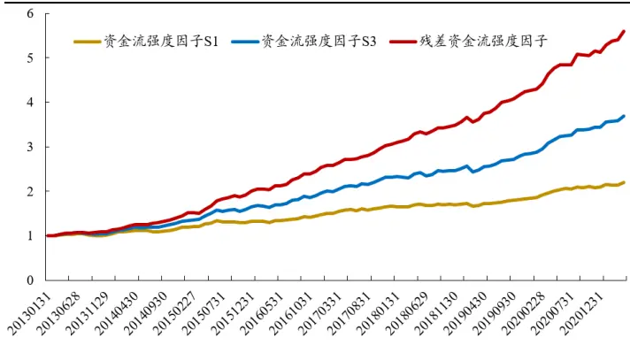
数据来源：Wind、开源证券研究所

图9：小单残差资金流强度因子多空对冲表现显著提升
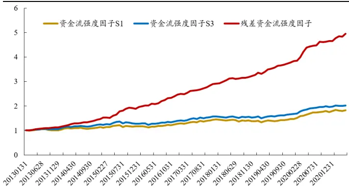
数据来源：Wind、开源证券研究所

表2：大单和小单残差资金流强度因子净值指标明显提升

| 大单因子 |  |  |  |  | 小单因子 |  |
| --- | --- | --- | --- | --- | --- | --- |
|  | 资金流强度 S1 | 资金流强度S3 | 残差资金流强度 | 资金流强度S1 | 资金流强度S3 | 残差资金流强度 |
| 年化收益率 | 9.98% | 17.14% | 23.22% | 7.51% | 8.93% | 21.41% |
| 年化波动率 | 5.41% | 6.38% | 5.86% | 6.89% | 6.52% | 5.63% |
| 收益波动比 | 1.84 | 2.69 | 3.96 | 1.09 | 1.37 | 3.81 |
| 月度胜率 | 67.68% | 82.83% | 83.84% | 66.67% | 68.69% | 87.88% |

数据来源：Wind、开源证券研究所

残差资金流强度因子在沪深300和中证500样本的选股效果表现优异。大单残差资金流强度因子在沪深300和中证500样本的多空信息比率分别为2.05和3.18，小单残差资金流强度因子在沪深300和中证500样本的多空信息比率分别为2.27和2.47。

图10：大单残差资金流强度因子沪深300和中证500样本选股效果
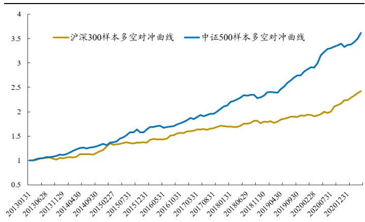
数据来源：Wind、开源证券研究所

图11：小单残差资金流强度因子沪深300和中证500样本选股效果
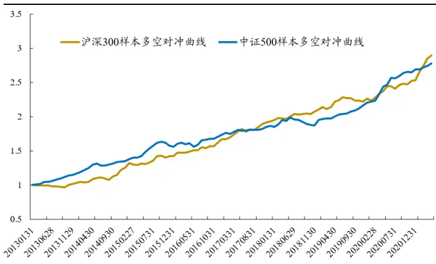
数据来源：Wind、开源证券研究所

最后我们以大单为例，给出资金流强度因子的alpha切分示意图（图12)。大单资金流强度因子具有正向alpha，然而alpha的内部成份并不单纯。我们可以将整体alpha 切分为正向 alpha 和负向 alpha 两部分。正向 alpha 部分非常明显，是因为大单行为本身的正向预见性直接带来的。而负向alpha部分比较隐蔽：大单资金流强度因子的多头组合对应大单的净流入，而大单净流入往往伴随股价上涨，因此组合会因为暴露反转因子而获得负向alpha。我们回归的动作，形象地讲，相当于从“大单资金流强度alpha”中，将反转因子带来的“负向alpha”剔除，最终获取到更纯粹、更强劲的“正向alpha”即大单残差资金流强度因子。

图12：资金流强度因子的alpha切分示意图（以大单为例）
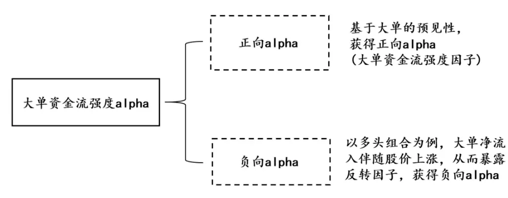
资料来源：开源证券研究所

## 4、反转因子改进：残差反转因子

从第三节可以看出，残差资金流强度因子比资金流强度因子表现更加优异，这种方式不由得让我们想到，如果使用反转因子Ret20对大单和小单强度因子进行回归，是否可以实现对传统反转因子的改进呢？

以大单为例，从大单资金强度来看，若两只股票A和B本月的收益率相同且上涨，但是相比较而言A股票的大单净流入强度更大，则可能代表着A股票的背后大单资金强度更强，这种上涨更具有持续性。同样的若A和B本月的收益率相同且下跌，而A股票大单净流入强度更小，其代表着这种下跌伴随着大资金的抛售，其后市可能会延续下跌效应。如上讨论使用图形可以表示为：

图13：资金流强度因子对传统反转因子的改进示意图（以大单为例）
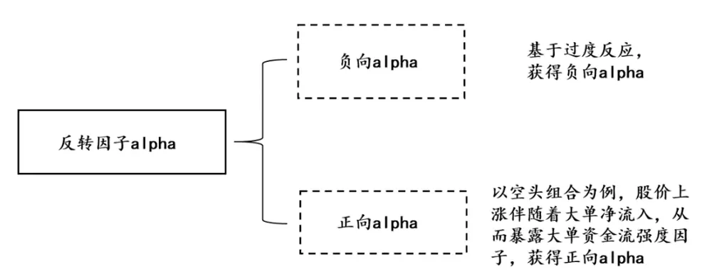
资料来源：开源证券研究所

为了验证这一想法，我们分别使用反转因子回归大单资金强度和小单资金强度得到大单和小单残差反转因子，具体回归式如下：

$$
Ret20_{t}=a+b*S_{t}+\varepsilon_{t}
$$

我们将 $\cdot\varepsilon_{t}$ 代替原来的反转因子进行全市场选股回测（图 14，图 15，图 16，图 17,表3)，可以发现，残差反转因子的选股效果有了明显提升：传统反转因子Ret20的多头信息比率 IR 为 0.53，空头信息比率 IR 为-0.05，多空对冲信息比率 IR 为1.42。大单残差反转因子的多头信息比率IR 提升至0.62，空头信息比率IR 降低至-0.11，多空对冲信息比率IR提升至1.87。小单残差反转因子的多头信息比率IR提升至0.72，空头信息比率IR降低至-0.14，多空对冲信息比率IR提升至2.26。可见残差反转因子显著优于传统反转因子，而且小单残差反转因子的表现更好。

图14:大单残差反转和传统反转多头对比
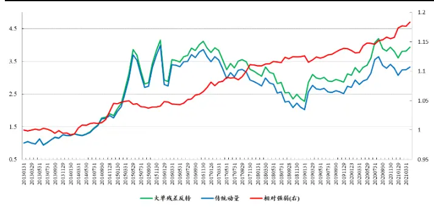
数据来源：Wind、开源证券研究所

图15：大单残差反转和传统反转空头对比
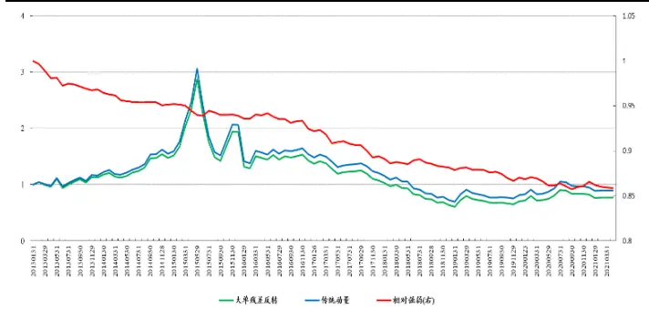
数据来源：Wind、开源证券研究所

图16：小单残差反转和传统反转多头对比
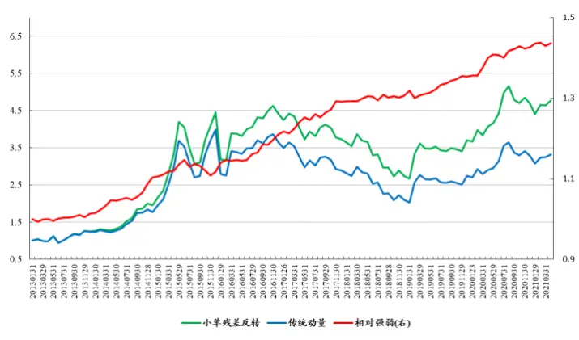
数据来源：Wind、开源证券研究所

图17：小单残差反转和传统反转空头对比
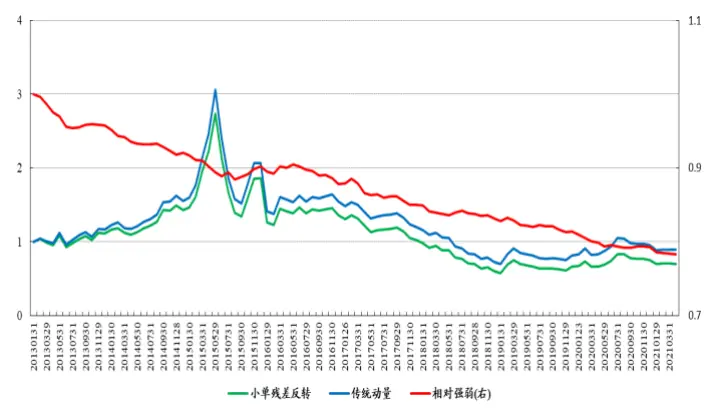
数据来源：Wind、开源证券研究所

图18：小单、大单残差反转和传统反转多空对冲对比
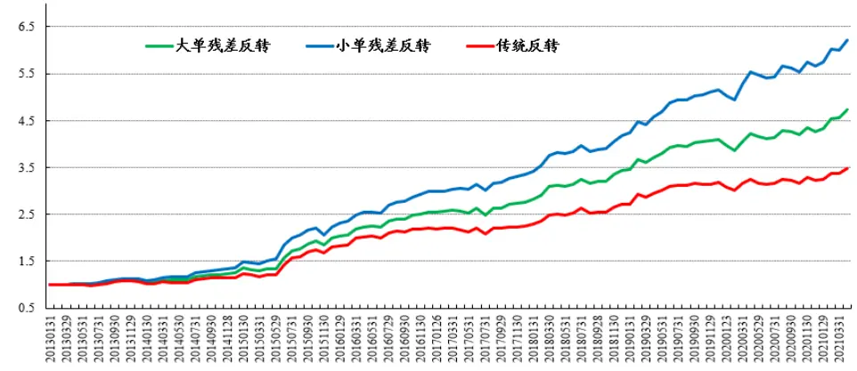
数据来源：Wind、开源证券研究所

表3： 残差反转因子多头组合和空头组合均优于传统反转因子(全市场)

|  | 多头组合 |  |  | 空头组合 |  |  | 多空对冲 |  |  |
| --- | --- | --- | --- | --- | --- | --- | --- | --- | --- |
|  | 传统反转 | 大单残差 反转 | 小单残差 反转 | 传统反转 | 大单残差 反转 | 小单残差 反转 | 传统反转 | 大单残差 反转 | 小单残差 反转 |
| 年化收益率 | 15.70% | 18.06% | 20.88% | -1.37% | -3.17% | -4.25% | 16.33% | 20.69% | 24.77% |
| 年化波动率 | 29.81% | 29.26% | 29.01% | 29.91% | 30.13% | 30.24% | 11.48% | 11.05% | 10.96% |
| 收益波动比 | 0.53 | 0.62 | 0.72 | -0.05 | -0.11 | -0.14 | 1.42 | 1.87 | 2.26 |
| 月度胜率 | 53.54% | 52.53% | 52.53% | 46.46% | 45.45% | 46.46% | 63.64% | 75.76% | 77.78% |

数据来源：Wind、开源证券研究所

进一步地，我们对比了大单、小单残差反转因子多头和市场等权组合的逐年绩效表现(表4)，可以发现，在回测期间内，残差反转因子的多头组合的绩效表现基本上都优于市场等权组合，而且小单残差反转多头组合表现的更加优异。

表4：残差反转因子多头组合逐年收益整体优于市场平均

| 市场等权组合 年化收益率年化波动率收益波动比 年化收益率年化波动率 |  |  |  | 大单残差反转多头 |  | 小单残差反转多头 |  |  |  |
| --- | --- | --- | --- | --- | --- | --- | --- | --- | --- |
|  |  |  |  |  |  |  | 收益波动比 年化收益率 年化波动率 |  | 收益波动比 |
| 2013 | 24.73% | 28.35% | 0.87 | 25.22% | 29.82% | 0.85 | 27.78% | 29.39% | 0.95 |
| 2014 | 46.82% | 16.53% | 2.83 | 50.27% | 17.00% | 2.96 | 55.65% | 17.09% | 3.26 |
| 2015 | 79.04% | 53.28% | 1.48 | 124.65% | 43.36% | 2.87 | 128.42% | 44.04% | 2.92 |
| 2016 | -11.58% | 39.83% | -0.29 | -5.81% | 40.85% | -0.14 | -0.95% | 40.10% | -0.02 |
| 2017 | -14.81% | 14.39% | -1.03 | -18.03% | 17.44% | -1.03 | -15.56% | 16.31% | -0.95 |
| 2018 | -29.92% | 18.10% | -1.65 | -26.30% | 21.19% | -1.24 | -26.39% | 20.59% | -1.28 |
| 2019 | 27.71% | 27.01% | 1.03 | 31.90% | 28.91% | 1.10 | 35.10% | 27.99% | 1.25 |
| 2020 | 19.08% | 18.62% | 1.02 | 22.14% | 20.26% | 1.09 | 26.56% | 19.69% | 1.35 |
| 至 2021.4.30 | -1.46% | 15.41% | -0.10 | 10.82% | 16.33% | 0.66 | 6.07% | 17.20% | 0.35 |
| 全区间 | 12.25% | 29.63% | 0.41 | 18.06% | 29.26% | 0.62 | 20.88% | 29.01% | 0.72 |

数据来源：Wind、开源证券研究所

以上的测试都是在全市场进行的，接着我们探讨了残差反转因子在沪深300和中证500样本空间中的表现（表5，表6)。可以发现，残差反转因子在沪深300和中证500的样本空间内的表现依然优于传统反转因子。其中在沪深300中，大单残差反转因子的多头信息比率IR提升至0.51，空头信息比率IR降低至-0.02，多空对冲信息比率IR提升至1.59。小单残差反转因子的多头信息比率IR提升至0.59，空头信息比率IR降低至-0.05，多空对冲信息比率IR提升至2.05。在中证500中，大单残差反转因子的多头信息比率IR提升至0.41，空头信息比率IR降低至-0.01，多空对冲信息比率IR提升至1.14。小单残差反转因子的多头信息比率IR提升至0.56，空头信息比率IR降低至-0.04，多空对冲信息比率IR提升至1.68。

表5： 残差反转因子多头组合和空头组合均优于传统反转因子(沪深300)

|  | 多头组合 |  |  | 空头组合 |  |  | 多空对冲 |  |  |
| --- | --- | --- | --- | --- | --- | --- | --- | --- | --- |
|  | 传统反转 | 大单残差 反转 | 小单残差 反转 | 传统反转 | 大单残差 反转 | 小单残差 反转 | 传统反转 | 大单残差 反转 | 小单残差 反转 |
| 年化收益率 | 9.48% | 11.86% | 13.43% | 1.95% | -0.54% | -1.08% | 6.99% | 12.08% | 14.16% |
| 年化波动率 | 23.83% | 23.43% | 22.93% | 23.72% | 23.48% | 23.53% | 8.80% | 7.62% | 6.89% |
| 收益波动比 | 0.40 | 0.51 | 0.59 | 0.08 | -0.02 | -0.05 | 0.79 | 1.59 | 2.05 |
| 月度胜率 | 55.56% | 59.60% | 57.58% | 57.58% | 56.57% | 55.56% | 51.52% | 68.69% | 70.71% |

数据来源：Wind、开源证券研究所

表6： 残差反转因子多头组合和空头组合均优于传统反转因子(中证500)

|  | 多头组合 |  |  | 空头组合 |  |  | 多空对冲 |  |  |
| --- | --- | --- | --- | --- | --- | --- | --- | --- | --- |
|  | 传统反转 | 大单残差 反转 | 小单残差 反转 | 传统反转 | 大单残差 反转 | 小单残差 反转 | 传统反转 | 大单残差 反转 | 小单残差 反转 |
| 年化收益率 | 9.83% | 11.10% | 14.80% | 2.51% | -0.22% | -1.03% | 6.70% | 10.77% | 15.23% |
| 年化波动率 | 27.36% | 27.13% | 26.52% | 27.01% | 27.25% | 27.12% | 9.87% | 9.43% | 9.08% |
| 收益波动比 | 0.36 | 0.41 | 0.56 | 0.09 | -0.01 | -0.04 | 0.68 | 1.14 | 1.68 |
| 月度胜率 | 52.53% | 51.52% | 52.53% | 50.51% | 49.49% | 50.51% | 55.56% | 61.62% | 71.72% |

数据来源：Wind、开源证券研究所

## 5、风险提示

模型测试基于历史数据，市场未来可能发生变化。

## 特别声明

《证券期货投资者适当性管理办法》、《证券经营机构投资者适当性管理实施指引（试行)》已于2017年7月1日起正式实施。根据上述规定，开源证券评定此研报的风险等级为R3（中风险)，因此通过公共平台推送的研报其适用的投资者类别仅限定为专业投资者及风险承受能力为C3、C4、C5的普通投资者。若您并非专业投资者及风险承受能力为C3、C4、C5的普通投资者，请取消阅读，请勿收藏、接收或使用本研报中的任何信息。

因此受限于访问权限的设置，若给您造成不便，烦请见谅！感谢您给予的理解与配合。

## 分析师承诺

负责准备本报告以及撰写本报告的所有研究分析师或工作人员在此保证，本研究报告中关于任何发行商或证券所发表的观点均如实反映分析人员的个人观点。负责准备本报告的分析师获取报酬的评判因素包括研究的质量和准确性、客户的反馈、竞争性因素以及开源证券股份有限公司的整体收益。所有研究分析师或工作人员保证他们报酬的任何一部分不曾与，不与，也将不会与本报告中具体的推荐意见或观点有直接或间接的联系。

## 股票投资评级说明

|  | 评级 | 说明 |
| --- | --- | --- |
| 证券评级 | 买入（Buy） | 预计相对强于市场表现20%以上； |
|  | 增持（outperform） | 预计相对强于市场表现 5%~20%; |
|  | 中性（Neutral） | 预计相对市场表现在-5%~+5%之间波动； |
|  | 减持 | 预计相对弱于市场表现5%以下。 |
| 行业评级 | 看好（overweight） | 预计行业超越整体市场表现; |
|  | 中性（Neutral） | 预计行业与整体市场表现基本持平； |
|  | 看淡 | 预计行业弱于整体市场表现。 |
| 备注：评级标准为以报告日后的6~12个月内，证券相对于市场基准指数的涨跌幅表现，其中A股基准指数为沪深300指数、港股基准指数为恒生指数、新三板基准指数为三板成指（针对协议转让标的）或三板做市指数（针对做市转让标的)、美股基准指数为标普500或纳斯达克综合指数。我们在此提醒您，不同证券研究机构采用不同的评级术语及评级标准。我们采用的是相对评级体系，表示投资的相对比重建议；投资者买入或者卖出证券的决定取决于个人的实际情况，比如当前的持仓结构以及其他需要考虑的因素。投资者应阅读整篇报告，以获取比较完整的观点与信息，不应仅仅依靠投资评级来推断结论。 |  |  |

## 分析、估值方法的局限性说明

本报告所包含的分析基于各种假设，不同假设可能导致分析结果出现重大不同。本报告采用的各种估值方法及模型均有其局限性，估值结果不保证所涉及证券能够在该价格交易。

## 法律声明

开源证券股份有限公司是经中国证监会批准设立的证券经营机构，已具备证券投资咨询业务资格。