2022年05月02日

## 金融工程研究团队

魏建榕（首席分析师）

证书编号：S0790520110001

证书编号：S0790519120001

张翔（分析师）

傅开波（分析师）

证书编号：S0790520090003

## 高鹏（分析师）

证书编号：S0790520090002

## 苏俊豪（分析师）

证书编号：S0790522020001

## 胡亮勇（分析师）

# 理想反转因子的4年总结：依旧理想

证书编号：S0790522030001

## 王志豪（研究员）

证书编号：S0790120070080

## 盛少成（研究员）

证书编号：S0790121070009

## 苏良（研究员）

证书编号：S0790121070008

## 相关研究报告

《市场微观结构研究系列(9)-主动买卖因子的正确用法》-2020.9.5

《市场微观结构研究系列（10）-因子切割论》-2020.9.17

《市场微观结构研究系列（11）-A股分层效应的普适规律与底层逻辑》-2021.4.30

《市场微观结构研究系列（12）-大小单资金流的 alpha 能力》-2021.6.2

# ——市场微观结构研究系列（13）

## 魏建榕（分析师）

weijianrong@kysec.cn

王志豪（联系人）

证书编号：S0790519120001

wangzhihao@kysec.cn

证书编号：S0790120070080

## 理想反转因子样本外表现强劲

在A股市场中，反转因子长期累计收益显著，短期回撤频繁。针对这一困难，我们在2018年底提出了反转因子的独家改进方案—W式切割，通过对过去20个交易日进行“切割”，发现单笔成交额最高的10个交易日的涨跌幅反转效应更强。在2019年底的报告《A股反转之力的微观来源》中，我们进一步提出反转之力的微观来源是大单成交。样本内，理想反转因子RankIC均值-6.39%，RankICIR-3.81。样本外RankIC均值-5.9%，RankICIR-3.14。从月度 RankIC来看，样本外40个月中，仅两个月RankIC显著为正，样本外表现稳健。全历史区间内，理想反转因子5分组多空年化收益 15.66%，年化IR2.79，最大回撤6.64%。样本外最大回撤5.7%，出现在2021年7月。样本外，理想反转因子出现了4次较大回撤，期间，市场常见价量因子回撤明显。此外，理想反转因子样本外避免了3次价量因子大规模回撤。

## 理想反转因子在TMT与医药板块中表现较优

从不同股票池表现来看，在TMT与医药股票池中，理想反转因子均有稳健表现。TMT 股票池中，理想反转因子5分组多空年化收益16.94%，年化IR1.76，最大回撤10.8%，出现在2020年2月。医药股票池中，理想反转因子5分组多空年化收益13.8%，年化 IR1.3，最大回撤10.8%，出现在2015年10月。

## M_high_13/16 因子样本外表现稳健

从M high 13/16 因子 5 分组多空来看，全区间内年化收益 19.14%，年化 IR2.56，最大回撤8.3%，出现在2021年7月。从分组表现来看，M_high_13/16因子5分组表现分化且单调，多头年化收益24.3%，年化超额8.96%，空头组年化超额-11.97%。

## 等效因子探索：同一逻辑，不同表达

基于同一逻辑，本文分别从反转强度指标与取值方式两维度，构建理想反转因子的兄弟因子。反转强度指标分别选取：单笔成交额、单笔成交量以及二者的日变动量指标。取值方式分别选取：理想反转、加权平均、回归Beta以及Corr方式。其中，理想反转与加权平均方式都是利用涨跌幅反转强度的差异，赋予其不同权重；回归Beta方式刻画涨跌幅对反转强度指标的敏感度；Corr方式刻画涨跌幅与反转强度指标的关联度。通过反转强度指标与取值方式的不同组合，我们构建了基于同一逻辑下的16个兄弟因子。反转强度指标对比来看，单笔成交量Diff指标构建的因子更加稳健。取值方式对比来看，Corr方式构建的因子更加稳健。

- 风险提示：模型测试基于历史数据，市场未来可能发生变化。

## 1、理想反转因子的4年总结：依旧理想

在A股市场中，反转因子长期累计收益显著，短期回撤频繁。针对这一困难，我们在2018年底提出了反转因子的独家改进方案—W式切割，通过对过去20个交易日进行“切割”，发现单笔成交额最高的10个交易日的涨跌幅反转效应更强。在2019年底的报告《A股反转之力的微观来源》中，我们进一步提出反转之力的微观来源是大单成交。

## 1.1、理想反转因子样本外表现强劲

理想反转因子将单笔成交额作为反转强度指标，通过切割有效区分过去20日涨跌幅中的动量与反转信息，从而实现对传统反转因子的改进。理想反转因子的构造方法如下：

- 对选定股票，回溯取其过去20日的数据；

- 计算该股票每日的平均单笔成交额（成交额/成交笔数)；

- 单笔成交额高的10 个交易日，涨跌幅加总，记作Mhighi

- 单笔成交额低的10个交易日，涨跌幅加总，记作 $M_{low}$

- 理想反转因子 $M=M_{\check{h}ig\check{h}}-M_{low}$

本文因子回测区间为20100129—20220429，因子做市值、行业中性化处理。样本内，理想反转因子RankIC 均值-6.39%，RankICIR-3.81。样本外 RankIC 均值-5.9%，RankICIR-3.14。从月度 RankIC来看，样本外40个月中，仅两个月RankIC 显著为正，样本外表现稳健。

图1：样本外因子月度RankIC表现稳健
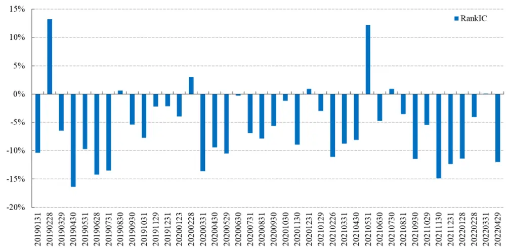
数据来源：Wind、开源证券研究所

全历史区间内，理想反转因子5分组多空年化收益15.66%，年化IR2.79，最大

回撤6.64%。样本外最大回撤5.7%，出现在2021年7月。

图2：理想反转因子多空表现稳健，样本外最大回撤5.7%
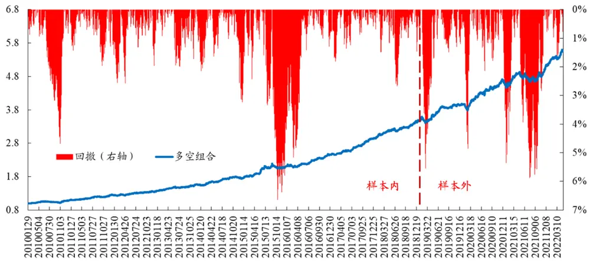
数据来源：Wind、开源证券研究所（回测区间：20100129—20220429）

分年度来看，理想反转因子逐年表现平稳，2015年之后年收益均超过13%，样本外多空每年收益14%左右。

图3：理想反转因子逐年表现平稳
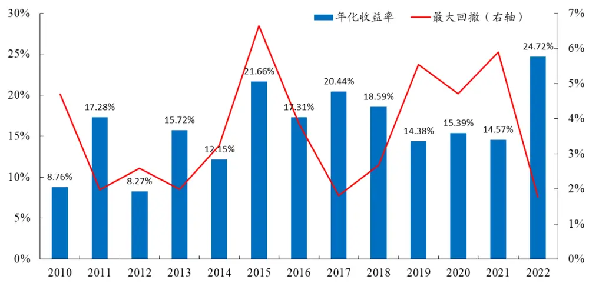
数据来源：Wind、开源证券研究所

样本外，理想反转因子多空共经历四次较大回撤，我们将多空净值从高点回落月份视为回撤起点，净值重回原高点月份视为回撤终点。

2019.02-2019.04：市场补涨行情下，理想反转因子受动量组 $M_{low}$ 回撤影响，区间最大回撤6%。同期，反转因子回撤较低，为2%，换手率因子最大回撤8%，波动率因子最大回撤12%。

2020.02-2020.03：理想反转因子受反转组 $M_{\hbar ig\hbar}$ 回撤影响，最大回撤5%。同期，反转因子回撤10%，换手率因子回撤6%，波动率因子回撤10%。

2020.12-2021.02：理想反转因子受反转组 $M_{\hbar ig\hbar}$ 回撤影响，最大回撤5%。同期，反转因子回撤11%，换手率因子回撤3%，波动率因子回撤9%。

2021.05-2021.11：市场价量因子普遍经历长周期大幅度回撤，理想反转因子受反转组 $M_{\hbar ig\hbar}$ 回撤影响，最大回撤5%。同期，反转因子回撤10%，换手率因子回撤14%，波动率因子回撤 12%。

表1：理想反转因子样本外共经历4次较大回撤（数字为回撤幅度）

| 理想反转回撤区间 | 理想反转 | 传统反转 换手 | 波动 |
| --- | --- | --- | --- |
| 2019.02-2019.04 | 6% | 2% 8% | 12% |
| 2020.02–2020.03 | 5% | 10% 6% | 10% |
| 2020.12–2021.02 | 5% | 11% 3% | 9% |
| 2021.05–2021.11 | 6% | 10% 14% | 12% |

数据来源：Wind、开源证券研究所

样本外，市场常见价量因子回撤区间中，理想反转因子共避免了3次较大回撤。

2020.06-2020.07：理想反转因子区间内最大回撤2%，同期，反转因子回撤5%，换手率因子回撤6%，波动率因子回撤 6%；

2020.10-2020.11：传统价量因子回撤明显，反转因子回撤7%，换手率因子回撤8%，波动率因子回撤10%，同期，理想反转因子回撤1%；

2022.02-2022.03：市场波动加剧，理想反转因子回撤2%，同期，反转因子回撤5%，换手率因子回撤 8%，波动率因子回撤 6%。

表2：理想反转因子样本外避免了3次较大回撤（数字为回撤幅度）

| 价量因子回撤区间 | 理想反转 | 传统反转 | 换手 波动 |
| --- | --- | --- | --- |
| 2020.06-2020.07 | 2% | 5% 6% | 6% |
| 2020.10-2020.11 | 1% | 7% | 8% 10% |
| 2022.02-2022.03 | 2% | 5% | 8% 6% |

数据来源：Wind、开源证券研究所

分组表现来看，5分组分化明显，多头组年化收益18.01%，年化超额收益8%， 空头组年化超额收益-9%。

图4：理想反转因子5分组表现分化且单调
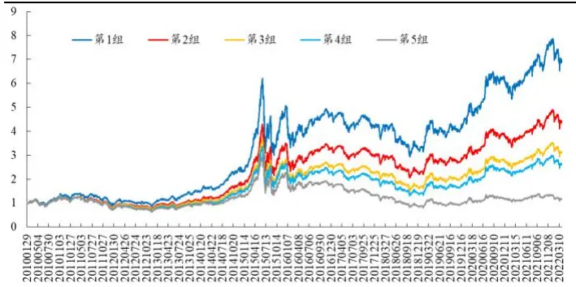
数据来源：Wind、开源证券研究所

图5：理想反转因子多头超额8%
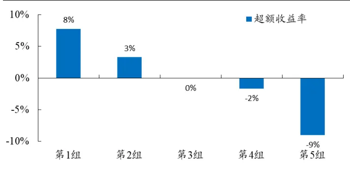
数据来源：Wind、开源证券研究所

从不同股票池表现来看，在TMT与医药股票池中，理想反转因子均有稳健表现。

TMT股票池中，理想反转因子5分组多空年化收益16.94%，年化IR1.76，最大回撤10.8%，出现在2020年2月。医药股票池中，理想反转因子5分组多空年化收益13.8%，年化IR1.3，最大回撤10.8%，出现在2015年10月。

图6：理想反转因子在TMT及医药股票中均有良好表现
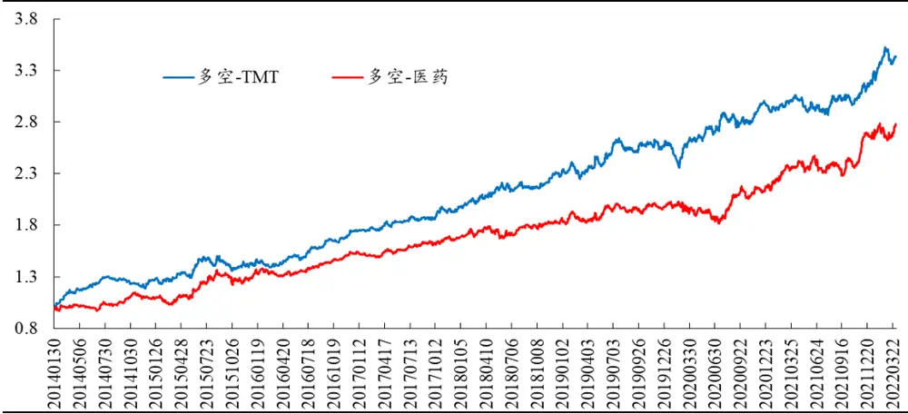
数据来源：Wind、开源证券研究所

## 1.2、M_high_13/16 因子样本外表现稳健

在2019年底的报告《A股反转之力的微观来源》中，我们采用日内逐笔成交额高分位作为W式切割的标准，取切割得到的M_high作为反转因子的代理变量，提出理想反转因子的高阶版——M_high_13/16（因子构建步骤详见表3)。

表3：M_high_13/16 因子构建步骤

| 步骤1 | 对选定股票S，回溯取其过去20日的数据； |
| --- | --- |
|  | 步骤2 计算股票S每日逐笔成交金额分布的 13/16分位值； |
| 步骤3 | 13/16分位值高的10个交易日，涨跌幅加总作为因子值，记作M_high_13/16 |

数据来源：Wind、开源证券研究所

从M_high_13/16因子5分组多空来看，全区间内年化收益19.14%，年化IR2.56，最大回撤8.3%，出现在2021年7月。

图7：M_high_13/16 因子年化收益 19.14%
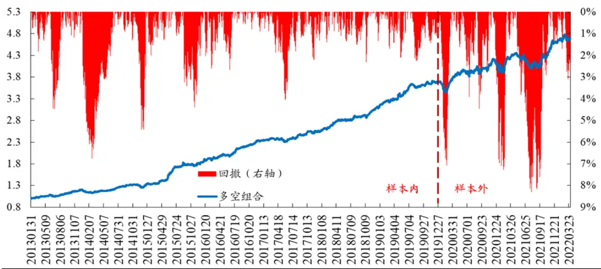
数据来源：Wind、开源证券研究所

从分组表现来看，M high 13/16 因子 5 分组表现分化且单调，多头年化收益24.3%，年化超额 8.96%，空头组年化超额-11.97%。

图8：M high 13/16 因子 5 分组表现分化
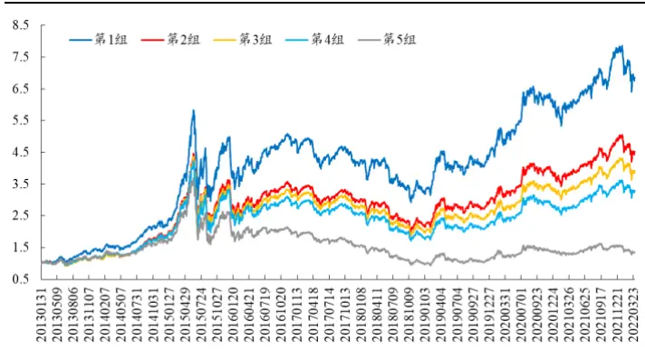
数据来源：Wind、开源证券研究所

图9：M_high_13/16 因子多头超额 8.96%
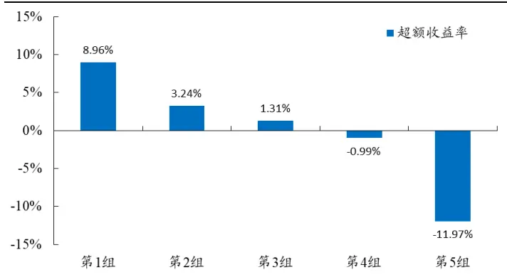
数据来源：Wind、开源证券研究所

## 2、等效因子探索：同一逻辑，不同表达

重新审视理想反转因子的底层逻辑：当日单笔成交额越高，涨跌幅反转效应越强；当日单笔成交额越低，涨跌幅动量效应越强。

基于这一逻辑，理想反转因子将过去20天涨跌幅，按单笔成交额分为动量组与强反转组，构建等权重反方向组合。理想反转因子的构建包含两个维度：

（1)反转强度指标：单笔成交额；

(2)取值方式：涨跌幅二分法等权重反方向组合

图10：因子逻辑示意图
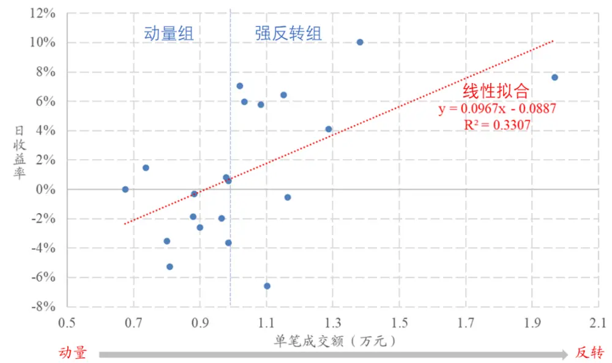
数据来源：Wind、开源证券研究所

基于同一逻辑，本节分别从反转强度指标与取值方式两维度，构建理想反转因子的兄弟因子。反转强度指标分别选取：单笔成交额、单笔成交量以及二者的日变动量指标。

取值方式分别选取：理想反转、加权平均、回归Beta以及Corr方式。其中，理想反转与加权平均方式都是利用涨跌幅反转强度的差异，赋予其不同权重；回归Beta方式刻画涨跌幅对反转强度指标的敏感度；Corr方式刻画涨跌幅与反转强度指标的关联度。取值方式构建因子值的具体步骤如下：

- 理想反转：过去20个交易日涨跌幅，按照反转强度指标等分为动量组与强反转组（图10中按蓝色虚线划分)，因子值=强反转组涨跌幅加总-动量组涨跌幅加总；

- 加权平均：过去20个交易日涨跌幅，以反转强度指标为权重，加权平均得到因子值（图10中横坐标作为权重）；

- 回归 Beta：过去20个交易日涨跌幅，时序回归20个交易日反转强度指标，回归斜率项作为因子值（图10中红色虚线线性拟合斜率项）；

- Corr：计算股票过去20个交易日涨跌幅与反转强度指标相关系数，作为因子值（图10中红色虚线线性拟合优度）。

通过反转强度指标与取值方式的不同组合，我们构建了基于同一逻辑下的16个兄弟因子。因子RankIC 均值与 RankICIR 详见表4 与表 5。反转强度指标对比来看，单笔成交量Diff指标构建的因子更加稳健。取值方式对比来看，Corr方式构建的因子更加稳健。

表4：因子RankIC 均值：整体有效性较高

|  | 单笔成交额 | 单笔成交额 Diff | 单笔成交量 | 单笔成交量 Diff |
| --- | --- | --- | --- | --- |
| 理想反转 | -6.20% | -6.99% | -5.97% | -5.69% |
| 加权平均 | -7.17% | -7.52% | -7.06% | -6.36% |
| 回归 Beta | -6.74% | -6.53% | -4.66% | -3.84% |
| Corr | -5.41% | -5.90% | -5.33% | -4.78% |

数据来源：Wind、开源证券研究所

表5：因子RankICIR：整体有效性较高

|  | 单笔成交额 | 单笔成交额 Diff | 单笔成交量 | 单笔成交量 Diff |
| --- | --- | --- | --- | --- |
| 理想反转 | -3.5 | -3.5 | -3.6 | -3.9 |
| 加权平均 | -2.6 | -3.4 | -2.5 | -4.0 |
| 回归 Beta | -2.4 | -2.8 | -2.3 | -2.4 |
| Corr | -3.5 | -3.6 | -3.5 | -3.7 |

数据来源：Wind、开源证券研究所

从因子相关性来看，由于底层逻辑相同，各因子之间相关性较高。同一反转强度指标，不同取值方式构建的因子间相关性非常高。同一取值方式，不同反转强度指标构建的因子，相关性相对较低（图11中红色虚线贯穿部分)，说明这16个兄弟因子间的差异主要由反转强度指标贡献。

图11：因子相关性：16个兄弟因子的差异主要由反转强度指标贡献

|  |  | 单笔成交额 |  |  | 单笔成交额Diff |  |  |  | 单笔成交量 |  |  |  | 单笔成交量 |  | Diff |  |  |  |  |
| --- | --- | --- | --- | --- | --- | --- | --- | --- | --- | --- | --- | --- | --- | --- | --- | --- | --- | --- | --- |
|  |  | 理想反转加权平均回归 | Beta | Corr | 理想反转加权平均回归 |  | BetaCorr |  | 理想反转加 | 权平均回 | 归Beta | Corr | 理想反转 | 加权平均 | 回归Beta | Corr |  |  |  |
| 单笔成交额 | 理想反转 | 100% | 36% 34% | 78% | 49% 52% |  | 45% 45% |  | 79% | 35% | 29% | 72% | 43% | 47% | 38% | 40% |  |  |  |
|  | 加权平均 |  | 100% 95% | 29% | 28% | 32% | 17% 17% |  | 36% | 100% | 82% | 30% | 24% | ~30% | 19% | 16% |  |  |  |
|  | 回归Beta | 100% |  | 28% | 27% | 30% | 19% | 16% | 34% | 95% | 78% | 28% | 23% | 28% | 18%– | 15% |  |  |  |
|  | Corr |  |  | 100% | 46% | 48% | 43% | 55% | 73% | 29% | 23% | 92% | 44% | 47% | 39% | 52% |  |  |  |
| 单笔成交额Diff | 理想反转 |  |  |  | 100% | 81% | 74% | 81% | 51% | 27% | 23% | 48% | 81% | 75% | 64% | 72% |  |  |  |
|  | 加权平均 |  |  |  |  |  |  | 100% 88% |  |  | 80% | 53% | 31% | 25% | 50% | 72% | 91% | 76% | 72% |
|  | 回归Beta | 100% |  |  |  |  |  | 77% | 46% | 17% | 14% | 45% | 64% | 77% | 71% | 66% |  |  |  |
|  | Corr |  |  |  |  |  |  | 100% | 48% | 17% | 14% | 58%- | 77% | 81% | 69% | 94% |  |  |  |
| 单笔成交量 | 理想反转 |  |  |  |  |  |  |  | 100% | 36% | 30% | 80% | 47% | 50% | 41% | 44% |  |  |  |
|  | 加权平均 |  |  |  |  |  |  |  |  | 100% | 82% | 30% | 24% | 29% – | 19% | 16% |  |  |  |
|  | 回归Beta |  |  |  |  |  |  |  |  |  | 100% | 25% | 21% | 25% | 23% | 14% |  |  |  |
|  | Corr |  |  |  |  |  |  |  |  |  |  | 100% | 48% | 52% | 42% | 57% |  |  |  |
| 单笔成交量Diff | 理想反转 |  |  |  |  |  |  |  |  |  |  |  | 100% | 77% | 64% | 80% |  |  |  |
|  | 加权平均 |  |  |  |  |  |  |  |  |  |  |  |  | 100% | 82% | 82% |  |  |  |
|  | m |  |  |  |  |  |  |  | 回归Beta |  |  |  |  |  |  | 100% | 68% |  |  |
|  | Corr |  |  |  |  |  |  |  |  |  |  |  |  |  |  | 100% |  |  |  |

数据来源：Wind、开源证券研究所

基于上述结论，我们选取同一取值方式（理想反转方式)，不同反转强度指标的4个因子等权合成。合成因子多空组合年化收益18.5%，年化IR2.9，相比于原始理想反转因子多空收益提升3%。

图12：合成因子多空年化收益18.5%
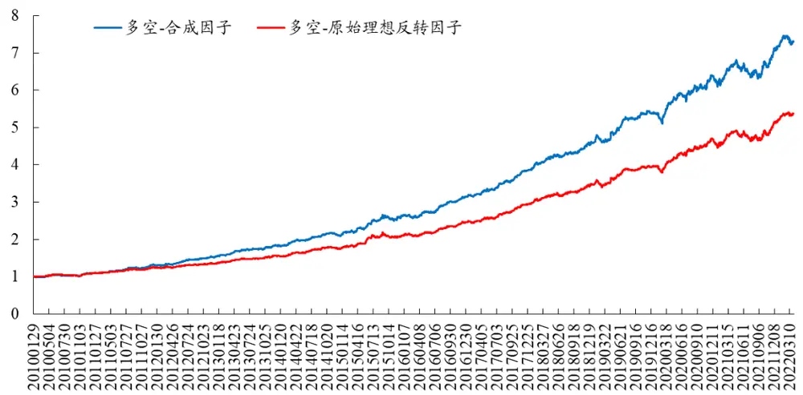
数据来源：Wind、开源证券研究所

从单因子表现来看，16个兄弟因子互有优劣。以因子Corr(单笔成交量Diff，收益率)为例，其反转强度指标为单笔成交量Diff，取值方式为Corr方式，因子在沪深300选股域的多空表现更加稳健，多空年化收益11.42%，年化IR1.75，最大回撤9.1%。

图13：Corr(单笔成交量 Diff,收益率)因子在沪深300 多空表现稳健
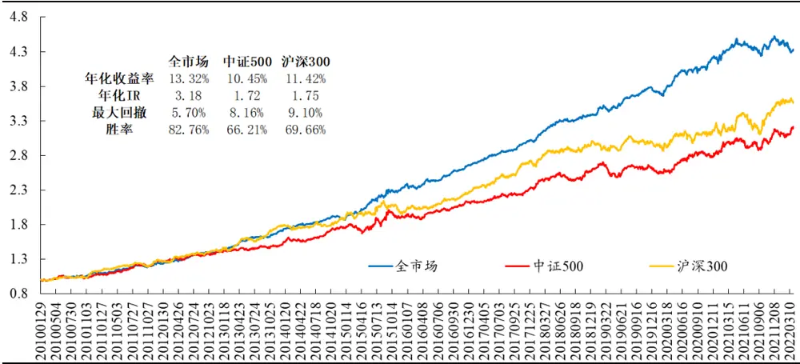
数据来源：Wind、开源证券研究所

Corr(单笔成交额，收益率）因子10分组多头年化收益21.5%，相比等权基准年化超额11.2%，相比原始理想反转因子10分组多头年化超额2.3%。

图14：Corr(单笔成交额,收益率)因子10 分组多头收益 21.5%
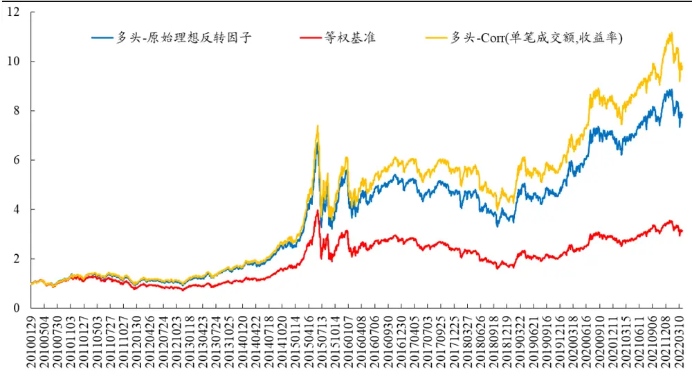
数据来源：Wind、开源证券研究所

## 3、风险提示

模型测试基于历史数据，市场未来可能发生变化。

## 特别声明

《证券期货投资者适当性管理办法》、《证券经营机构投资者适当性管理实施指引（试行)》已于2017年7月1日起正式实施。根据上述规定，开源证券评定此研报的风险等级为R3（中风险)，因此通过公共平台推送的研报其适用的投资者类别仅限定为专业投资者及风险承受能力为C3、C4、C5的普通投资者。若您并非专业投资者及风险承受能力为C3、C4、C5的普通投资者，请取消阅读，请勿收藏、接收或使用本研报中的任何信息。

因此受限于访问权限的设置，若给您造成不便，烦请见谅！感谢您给予的理解与配合。

## 分析师承诺

负责准备本报告以及撰写本报告的所有研究分析师或工作人员在此保证，本研究报告中关于任何发行商或证券所发表的观点均如实反映分析人员的个人观点。负责准备本报告的分析师获取报酬的评判因素包括研究的质量和准确性、客户的反馈、竞争性因素以及开源证券股份有限公司的整体收益。所有研究分析师或工作人员保证他们报酬的任何一部分不曾与，不与，也将不会与本报告中具体的推荐意见或观点有直接或间接的联系。

## 股票投资评级说明

|  | 评级 | 说明 |
| --- | --- | --- |
| 证券评级 | 买入（Buy） | 预计相对强于市场表现20%以上； |
|  | 增持（outperform） | 预计相对强于市场表现 5%～20%； |
|  | 中性（Neutral） | 预计相对市场表现在一5%～+5%之间波动； |
|  | 减持 | 预计相对弱于市场表现5%以下。 |
| 行业评级 | 看好（overweight） | 预计行业超越整体市场表现； |
|  | 中性（Neutral） | 预计行业与整体市场表现基本持平； |
|  | 看淡 | 预计行业弱于整体市场表现。 |
| 备注：评级标准为以报告日后的6~12个月内，证券相对于市场基准指数的涨跌幅表现，其中A股基准指数为沪深300指数、港股基准指数为恒生指数、新三板基准指数为三板成指（针对协议转让标的）或三板做市指数（针对做市转让标的)、美股基准指数为标普500或纳斯达克综合指数。我们在此提醒您，不同证券研究机构采用不同的评级术语及评级标准。我们采用的是相对评级体系，表示投资的相对比重建议；投资者买入或者卖出证券的决定取决于个人的实际情况，比如当前的持仓结构以及其他需要考虑的因素。投资者应阅读整篇报告，以获取比较完整的观点与信息，不应仅仅依靠投资评级来推断结论。 |  |  |

## 分析、估值方法的局限性说明

本报告所包含的分析基于各种假设，不同假设可能导致分析结果出现重大不同。本报告采用的各种估值方法及模型均有其局限性，估值结果不保证所涉及证券能够在该价格交易。

## 法律声明

开源证券股份有限公司是经中国证监会批准设立的证券经营机构，已具备证券投资咨询业务资格。

本报告仅供开源证券股份有限公司（以下简称“本公司”）的机构或个人客户（以下简称“客户”）使用。本公司不会因接收人收到本报告而视其为客户。本报告是发送给开源证券客户的，属于机密材料，只有开源证券客户才能参考或使用，如接收人并非开源证券客户，请及时退回并删除。

本报告是基于本公司认为可靠的已公开信息，但本公司不保证该等信息的准确性或完整性。本报告所载的资料、工具、意见及推测只提供给客户作参考之用，并非作为或被视为出售或购买证券或其他金融工具的邀请或向人做出邀请。本报告所载的资料、意见及推测仅反映本公司于发布本报告当日的判断，本报告所指的证券或投资标的的价格、价值及投资收入可能会波动。在不同时期，本公司可发出与本报告所载资料、意见及推测不一致的报告。客户应当考虑到本公司可能存在可能影响本报告客观性的利益冲突，不应视本报告为做出投资决策的唯一因素。本报告中所指的投资及服务可能不适合个别客户，不构成客户私人咨询建议。本公司未确保本报告充分考虑到个别客户特殊的投资目标、财务状况或需要。本公司建议客户应考虑本报告的任何意见或建议是否符合其特定状况，以及（若有必要）咨询独立投资顾问。在任何情况下，本报告中的信息或所表述的意见并不构成对任何人的投资建议。在任何情况下，本公司不对任何人因使用本报告中的任何内容所引致的任何损失负任何责任。若本报告的接收人非本公司的客户，应在基于本报告做出任何投资决定或就本报告要求任何解释前咨询独立投资顾问。

本报告可能附带其它网站的地址或超级链接，对于可能涉及的开源证券网站以外的地址或超级链接，开源证券不对其内容负责。本报告提供这些地址或超级链接的目的纯粹是为了客户使用方便，链接网站的内容不构成本报告的任何部分，客户需自行承担浏览这些网站的费用或风险。

开源证券在法律允许的情况下可参与、投资或持有本报告涉及的证券或进行证券交易，或向本报告涉及的公司提供或争取提供包括投资银行业务在内的服务或业务支持。开源证券可能与本报告涉及的公司之间存在业务关系，并无需事先或在获得业务关系后通知客户。

本报告的版权归本公司所有。本公司对本报告保留一切权利。除非另有书面显示，否则本报告中的所有材料的版权均属本公司。未经本公司事先书面授权，本报告的任何部分均不得以任何方式制作任何形式的拷贝、复印件或复制品，或再次分发给任何其他人，或以任何侵犯本公司版权的其他方式使用。所有本报告中使用的商标、服务标记及标记均为本公司的商标、服务标记及标记。

## 开源证券研究所

地址：上海市浦东新区世纪大道1788号陆家嘴金控广场1号
楼10层
邮编：200120
邮箱：research@kysec.cn
北京
地址：北京市西城区西直门外大街18号金贸大厦C2座16层
邮编：100044
邮箱：research@kysec.cn
地址：深圳市福田区金田路2030号卓越世纪中心1号
楼45层
邮编：518000
邮箱：research@kysec.cn
地址：西安市高新区锦业路1号都市之门B座5层
邮编：710065
邮箱：research@kysec.cn