2022 年 6 月 2 日

## 金融工程研究团队

魏建榕（首席分析师）

证书编号：S0790519120001

张 翔（分析师）

证书编号：S0790520110001

傅开波（分析师）

证书编号：S0790520090003

## 高 鹏（分析师）

证书编号：S0790520090002

## 苏俊豪（研究员）

证书编号：S0790522020001

## 胡亮勇（研究员）

证书编号：S0790522030001

## 王志豪（研究员）

证书编号：S0790120070080

## 盛少成（研究员）

证书编号：S0790121070009

## 苏 良（研究员）

证书编号：S0790121070008

## 相关研究报告

《市场微观结构研究系列（9）-主动买卖因子的正确用法》-2020.09.05《市场微观结构研究系列（12）-大单与 小 单 资 金流 的 alpha 能 力 》 -2021.06.02

# 新型因子：资金流动力学与散户羊群效应

《开源量化评论（42）-知情交易者背后的择时信息》-2021.10.24

《大类资产配置研究系列（6）-行业配置体系 2.0：轮动模型的回顾、迭代与思考》-2022.02.27

# ——市场微观结构研究系列（14）

## 魏建榕（分析师）

盛少成（联系人）

weijianrong@kysec.cn

shengshaocheng@kysec.cn

证书编号：S0790519120001

证书编号：S0790121070009

## ⚫ 资金流间同步相关性蕴含的 alpha 信息

在本篇报告中，我们首次尝试从“各类资金流的相关性结构”出发，更深入地挖掘“资金流动力学”背后蕴藏的 alpha 信息。

对于同步相关性因子而言，超大单和小单的同步相关性 $RankCorr(EL_{t},S_{t})$ 表现最好，IC 均值为 5.13%，ICIR 达 2.43。但其 alpha 来源是“伪动力学”，即在恒等式“超大单+大单+中单+小单=0”的约束下，资金流同步相关性 alpha，可以被两者流入量级所解释，其底层 alpha来源仍是资金流强度。

## ⚫ 资金流间错位相关性蕴含的 alpha 信息

对于错位相关性因子而言，小单和小单的错位相关性 $RankCorr(S_{t},S_{t+1})$ 表现最好，IC均值为3.09%，ICIR达 2.07，其 alpha来源是“散户羊群效应”。

在目前的 A 股市场中，个人投资者比例依旧较高，散户“追涨杀跌”的羊群效应现象较为明显，本篇报告使用 $RankCorr(R_{t},S_{t+\mathrm{N}})$ 来反映此现象。我们发现$RankCorr(R_{t},S_{t+\mathrm{N}})$ 在 N=1时选股效果最好，并且衰减得较快，滞后 1期的散户羊群效应因子 $RankCorr(R_{t},S_{t+1})$ 是较为有效的选股因子。由于当天小单净流入$S_{t}$ 和 当 天 收 益 率 $R_{t}$ 存 在 较 高 的 同 步 相 关 性 ， $RankCorr(S_{t},S_{t+1})$ 与$RankCorr(R_{t},S_{t+1})$ 相 关 性 较 高 ， 而 且 使 用 $RankCorr(S_{t},S_{t+1})$ 回 归$RankCorr(R_{t},S_{t+1})$ 后的残差基本没有选股效果，因此 $RankCorr(S_{t},S_{t+1})$ 的alpha来源就是“散户羊群效应”。

接着，我们对 $RankCorr(R_{t},S_{t+1})$ 进行回测，IC 均值-4.52%，ICIR-2.35，多空对冲年化收益率12.51%，收益波动比2.18，胜率77.48%，而且该因子回看参数敏感性不高。同时，其在沪深300、中证500、中证1000中多空对冲收益波动比分别为：1.35、1.32、2.05，表现较好。

## ⚫ 资金流动力学因子具备行业轮动能力

对于行业层面的散户羊群效应而言，我们发现使用一阶差分秩相关性$RankCorr(\Delta R_{t},\Delta\mathsf{S}_{t+N})$ 更有轮动效果。该指标在N=1,2的时候ICIR相对最显著，且呈现相反效果，这是由于二者强负相关性所导致。最终，我们采用$RankCorr(\Delta R_{t},\Delta\mathsf{S}_{t+1})$ 作为行业散户羊群效应的代理变量，具体解释为：对于某行业小单资金净流入的日度变化而言，若其跟随昨日行业收益日度变化越紧密，我们则认为该行业散户羊群效应较高，后市表现可能较差。

对于行业 $.RankCorr(\Delta R_{t},\Delta\mathsf{S}_{t+1})$ 而言，IC均值-5.85%，ICIR为-1.04。我们对其进行 3 分组回测，多空对冲的年化收益 11.99%，信息比率 1.25，胜率 66.07%，最大回撤 8.22%，整体绩效较为优异。

⚫ 风险提示：模型测试基于历史数据，市场未来可能发生变化。

资金流行为通过逐笔成交数据计算得到, 反映了股票的微观供求信息。按照通常习惯，资金流向被依据挂单金额的大小，分为四种类型进行统计：超大单（>100万元）、大单（20-100 万元）、中单（4-20 万元）和小单（<4 万元）。资金净流入意味着该类资金持有的筹码增多，资金净流出则意味着持有的筹码减少。在之前系列报告中，我们分别从选股、择时、行业轮动上验证了资金流数据蕴含丰富的 alpha信息，具体结论陈列如下：

（1）选股。在《主动买卖因子的正确用法》中，我们借助独家的“因子切割论”将资金主动买卖行为按照收益率进行切割，结果发现：大单和中单的主动买卖行为在高收益率端呈现较强正向选股效应，而小单的主动买卖行为在低收益率端呈现较强负向选股效应。在《大单与小单资金流的 alpha 能力》中，我们发现：大单资金流强度与涨跌幅显著呈同步正相关，且存在正向预测作用；相反，小单资金流强度与涨跌幅显著呈同步负相关，且存在负向预测作用；进一步，我们构造了剥离“反转缠绕效应”的大单和小单资金流强度，选股能力大幅提升。

（2）择时。在《知情交易者背后的择时信息》中，我们发现：由于超大单和大单交易意愿更强，交易金额更大，在筹码流动的过程中更加主动，其异常净流入流出具备一定择时能力—异常净流入密集区多在市场下跌末期和上涨初期，异常净流出密集区多在市场上涨末期和下跌初期。

（3）行业轮动。在《行业配置体系2.0：轮动模型的复盘、迭代与思考》中，我们发现“超大单抢筹+小单退出”的逻辑有明显的行业轮动能力。

值得指出的是，上述研究都是在“单一资金流”的维度上进行。在本篇报告中，我们首次尝试从“各类资金流之间的相关性结构”出发，更深入地挖掘“资金流动力学”背后蕴藏的 alpha 信息。

## 1、 资金流间同步相关性蕴含的alpha 信息

对于资金流间的相关性而言，同步关联是静态结构，不涉及时间先后的引领关系，较为容易理解，所以本节先行探究同步相关性蕴含的 alpha 信息。

## 1.1、 同步相关性因子具备一定选股能力

针对任意两类资金流，其同步相关性被定义为：两类资金流在过去N个交易日同步净流入的秩相关系数。若某只股票过去N个交易日 A 类资金净流入序列为 $A_{t}$ ，B类资金净流入序列为 $B_{t}$ ，则该股票的同步相关性被记为 $RankCorr(A_{t},B_{t})$ o

在 2013/01/01-2022/04/30 期间，以全体 A股为研究样本（剔除 ST、停牌以及上市不足 60个交易日的次新股），每月底针对四种类型的资金流：超大单 $\operatorname{EL}.$ 大单 L、中单 M、小单 S，我们两两求过去 20 个交易日同步秩相关系数 $RankCorr(A_{t},B_{t})$ 并测算其选股能力，结果如表1所示。

从表 1 我们可以看出，超大单和小单的同步相关性 $.RankCorr(EL_{t},S_{t})$ 表现最好。除此之外， $RankCorr(M_{t},S_{t})$ 以及 $.RankCorr(EL_{t},M_{t})$ 也具备一定选股能力，但是和$RankCorr(EL_{t},S_{t})$ 相关性较高：-55.19%、27.25%，而且将 $RankCorr(EL_{t},S_{t})$ 回归掉之后的 ICIR 分别为-0.45、0.87，基本没有选股能力。因此 $RankCorr(M_{t},S_{t})$ 以及$RankCorr(EL_{t},M_{t})$ 基 本 可 以 被 $RankCorr(EL_{t},S_{t})$ 解 释 ， 所 以 后 续 主 要 对$RankCorr(EL_{t},S_{t})$ 展开讨论。

接着，我们对 $RankCorr(EL_{t},S_{t})$ 进行回测，IC 均值为 5.13%，ICIR 达 2.43，其5 分组及多空对冲净值走势如图 1 所示。多空对冲年化收益为 12.09%，信息比率为1.93，月度胜率 76.79%，最大回撤 7.17%。

表1：同步相关性因子的选股 ICIR（回看 20天）： $RankCorr(EL_{t},S_{t})$ 最有效

|  | 超大单(t) | 大单(t) | 中单(t) | 小单(t) |
| --- | --- | --- | --- | --- |
| 超大单(t) |  | -1.02 | 1.41 | 2.43 |
| 大单(t) | -1.02 |  | -0.85 | 0.01 |
| 中单(t) | 1.41 | -0.85 |  | -1.70 |
| 小单(t) | 2.43 | 0.01 | -1.70 |  |

数据来源：Wind、开源证券研究所

图1：RankCorr(ELt, St)多空对冲信息比率 1.93
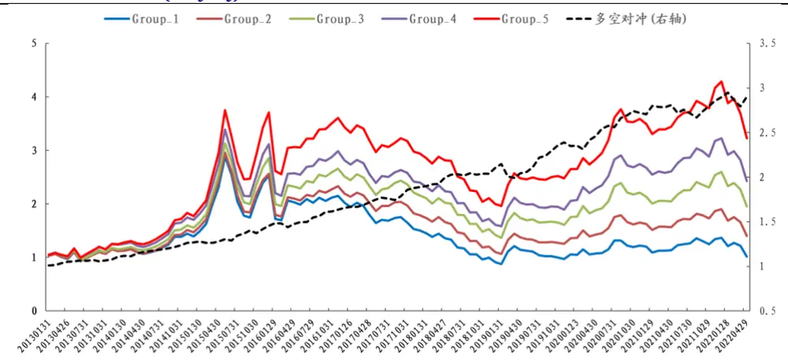
数据来源：Wind、开源证券研究所

## 1.2、 RankCorr(EL , S )的 alpha 解释：伪动力学

通过上一节的测算，我们发现同步相关性因子具备一定alpha，其中利用超大单与小单计算出的同步相关性 $RankCorr(EL_{t},S_{t})$ 表现最好，所以本节主要从该因子出发，尝试给出其 alpha 解释。

通过《大单与小单资金流的 alpha 能力》这篇报告的研究，我们可以得知：对于四类资金流，其净流入满足如下恒等式“超大单+大单+中单+小单=0”。受此恒等式的约束，超大单和小单具有天然的负相关；若在极端情况下，某只股票大单+中单=0，则超大单和小单的相关系数就会等于-1。因此，我们猜想：超大单和小单的量级水平，可能会影响恒等式的约束强度，进而影响两者之间的同步相关性。

为了验证这一猜想，我们计算了每只股票在过去20天中，超大单和小单净流入量级之和占全体资金净流入量级之和，并将其记为指标H。具体来看，若将超大、大、中、小单每天净流入记为 $NI_{EL}、NI_{L}、NI_{M}、NI_{S}$ ，则H可以被表达为：

$$
H=\frac{|NI_{EL}|+|NI_{S}|}{|NI_{EL}|+|NI_{L}|+|NI_{M}|+|NI_{S}|}
$$

接下来，同样以 2013/01/01-2022/04/30 为回测时间段，以全体 A 股为研究样本，指标H的5分组及多空对冲净值走势如图2所示。

图2：指标H回测曲线：与 $RankCorr(EL_{t},S_{t})$ 回测曲线极其相似
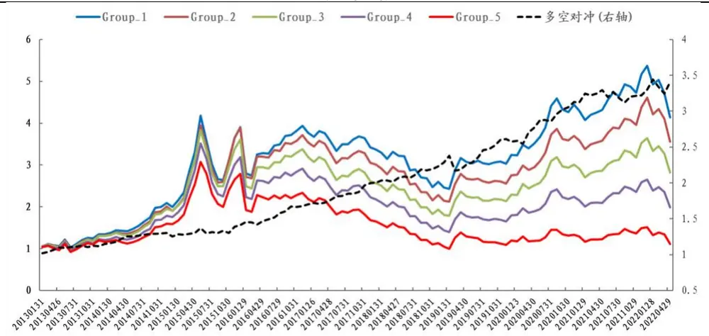
数据来源：Wind、开源证券研究所

从H指标的多空对冲曲线可以发现，其和 $RankCorr(EL_{t},S_{t})$ 多空对冲曲线走势极为相似。进一步，我们对两个因子做了相关性分析，发现二者相关性高达-54.56%，所以同步相关性因子 $RankCorr(EL_{t},S_{t})$ 的 alpha很可能会被H指标所解释。因此，我们使用 $RankCorr(EL_{t},S_{t})$ 回归H指标，观察残差是否依旧具有选股效果，结果如图3所示。

$图3:RankCorr(EL_{t},S_{t})$ 回归H指标后基本没选股效果
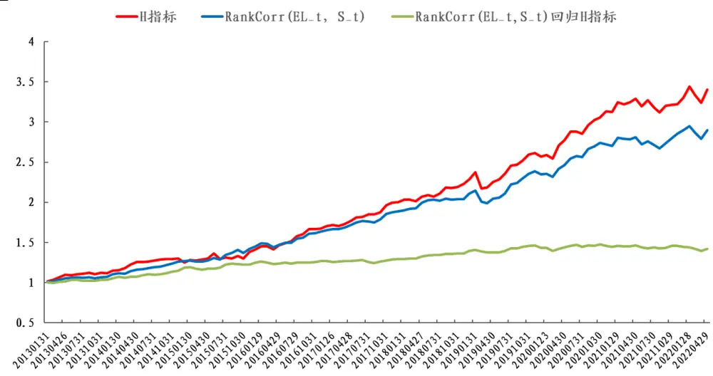
数据来源：Wind、开源证券研究所

从图 3 我们可以看到，原始因子 $RankCorr(EL_{t},S_{t})$ 回归掉H指标之后，基本不具备选股能力，所以我们前面的猜想基本正确：在恒等式“超大单+大单+中单+小单=0”的约束下，资金流同步相关性 alpha，可以被两者流入量级所解释。换言之，资金流同步相关性因子，是“伪动力学”因子，其底层 alpha 来源仍是资金流强度。

$图4:RankCorr(EL_{t},S_{t})$ 因子的 alpha 传导链：源自资金流强度
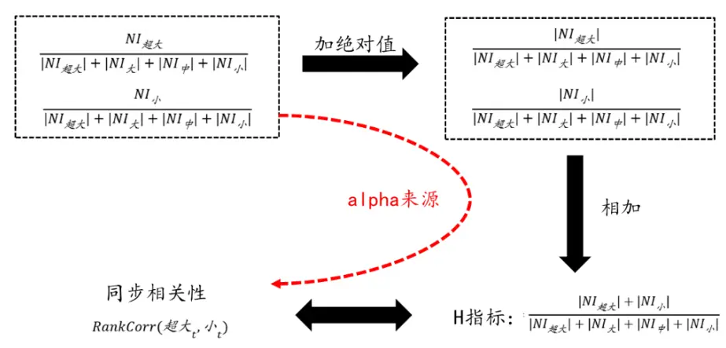
资料来源：开源证券研究所

## 2、 资金流间错位关系蕴含的 alpha 信息

本节我们聚焦于资金流的错位相关性。错位相关性，由于引入了时间先后引领的要素，天然具有更多的“动力学”涵义，直觉上讲可能蕴藏有更丰富的 alpha 信息。

## 2.1、 错位相关性因子具备一定选股能力

类似于同步相关性因子，针对任意两类资金流，其错位相关性被定义为：两类资金流在过去若干交易日错位净流入的秩相关系数。若某只股票过去一段时间 A 类资金净流入序列为 $A_{t}$ ，B 类资金净流入序列为 $B_{t}$ ，则该股票的错位相关性被记为$RankCorr(A_{t+N},B_{t+M})$

在 2013/01/01-2022/04/30 期间，以全体 A股为研究样本（剔除 ST、停牌以及上市不足 60 个交易日的次新股），每月底针对四种类型的资金流，以错位 1 期为例，我们两两求过去 20 个交易日秩相关系数 $RankCorr(A_{t},B_{t+1})$ ，并测算其选股能力，结果如表2所示。

从 表 2 我 们 可 以 看 出 ， $RankCorr(S_{t},S_{t+1})$ 表 现 最 好 。 除 此 之 外$RankCorr(S_{t},L_{t+1})$ $RankCorr(EL_{t},L_{t+1})$ $RankCorr(EL_{t},S_{t+1})$ 也具备一定选股能力，但是和 $RankCorr(S_{t},S_{t+1})$ 相关性很高，分别为-62.92%、35.30%、-54.44%，而且将 $rRankCorr(S_{t},S_{t+1})$ 回归掉之后的 ICIR 分别为-1.25、1.22、-0.56，基本没有选股能力，所以后续主要对 $RankCorr(S_{t},S_{t+1})$ 展开讨论。

接着，我们对 $RankCorr(S_{t},S_{t+1})$ 进行回测，IC均值为 3.09%，ICIR达 2.07，其5 分组及多空对冲净值走势如图 5 所示。多空对冲年化收益为 8.45%，信息比率为2.05，月度胜率 76.58%，最大回撤 4.21%。

表2：错位相关性因子的选股 ICIR（回看 20 天，错位 1 期）： $RankCorr(S_{t},S_{t+1})$ 最有效

|  | 超大单(t+1) | 大单(t+1) | 中单(t+1) | 小单(t+1) |
| --- | --- | --- | --- | --- |
| 超大单(t) | 0.84 | 1.79 | -1.15 | -1.58 |
| 大单(t) | 0.17 | 0.66 | 0.32 | -0.70 |
| 中单(t) | -0.70 | -0.62 | 0.88 | 0.82 |
| 小单(t) | -1.22 | -1.99 | 0.73 | 2.07 |

数据来源：Wind、开源证券研究所

$图5:RankCorr(S_{t},S_{t+1})$ 多空对冲信息比率 2.05
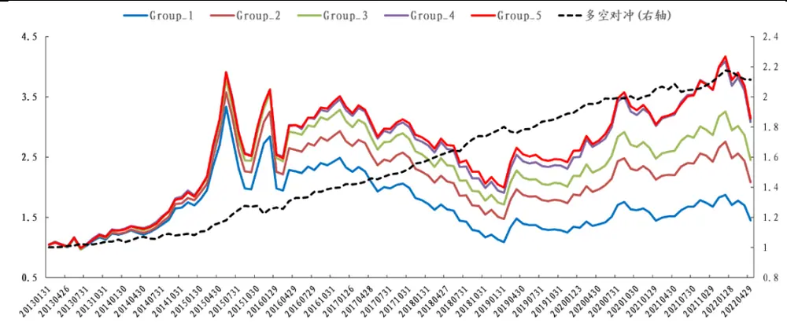
数据来源：Wind、开源证券研究所

## $2.2、{RankCorr}(S_{t},S_{t+1})$ 的 alpha解释：散户羊群效应

通过上一节的测算，我们发现错位相关性因子具备一定alpha，其中利用小单与小单计算出的错位相关性 $RankCorr(S_{t},S_{t+1})$ 表现最好，所以本节主要从该因子出发，尝试给出其 alpha 解释。

目前的 A 股市场，个人投资者比例依旧较高，相比于一些发达市场而言，散户“追涨杀跌”的羊群效应现象也更加明显。如何定量考察散户“追涨杀跌”行为的强度呢？在这里我们提供一个度量方法：（1）对于每只股票，都可以计算“过去 N日收益率”与“小单未来 N 日净流入”的相关系数，前者代表市场涨跌，后者代表散户行为；（2）考察全体 A 股，统计所有个股该项相关系数的中位数。作为对照，我们对另外三类资金流（中单、大单、超大单）也做了类似计算，整体结果如图 6所示。

图6：A股中散户“追涨杀跌”的羊群效应较为明显
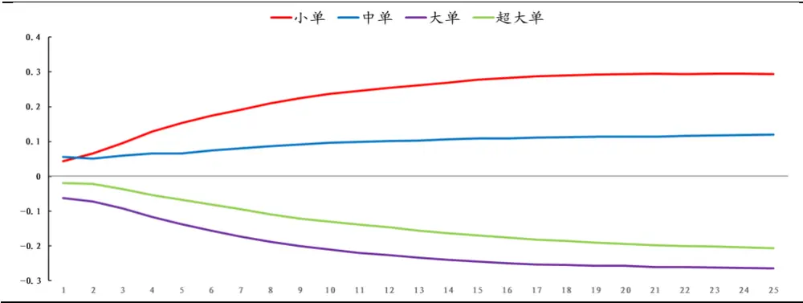
数据来源：Wind、开源证券研究所

进一步，我们分析上述散户羊群效应的选股潜力，具体做法为：在每月底回溯过去20个交易日，统计 $RankCorr(R_{t},S_{t+N})$ 在不同参数N下的选股ICIR，如图7所示。从图 7 可以发现， $RankCorr(R_{t},\mathsf{S}_{t+N})$ 在 N=1 时选股效果最好，并且衰减得较快，所以滞后1期的散户羊群效应因子 $RankCorr(R_{t},S_{t+1})$ 是较为有效的选股因子。

接下来，同样以 2013/01/01-2022/04/30 为回测时间段，以全体 A 股为研究样本，指标 $RankCorr(R_{t},S_{t+1})$ 的 5分组及多空对冲净值走势如图8所示。

图7：从 ICIR来看， $RankCorr(R_{t},S_{t+N})$ 在滞后期 N=1时最有效
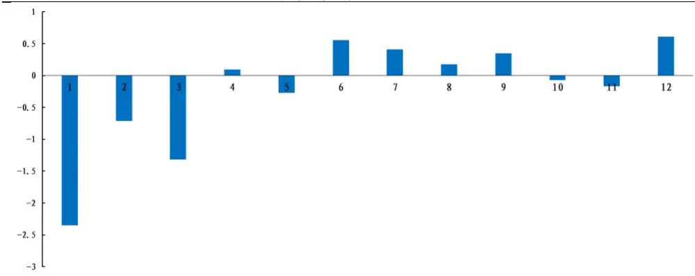
数据来源：Wind、开源证券研究所

$图8:RankCorr(R_{t},S_{t+1})$ 多空对冲信息比率 2.18
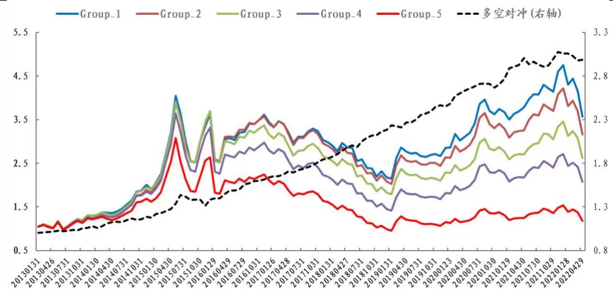
数据来源：Wind、开源证券研究所

从 $RankCorr(R_{t},S_{t+1})$ 指标的回测情况可以发现，该因子为负向选股因子，即“股票的散户羊群效应越高，未来预期收益越差”。除此之外，我们也观察到其和$RankCorr(S_{t},S_{t+1})$ 的多空对冲曲线走势极为相似。进一步，我们对两个因子做了相关性分析，发现两者相关性高达-58.77%，这主要是由于当天小单净流入 $-S_{t}$ 和当天收益 率 $R_{t}$ 存 在较 高的 同 步相 关性 。 所 以， 我们猜 想： 错位 相关 性因子$RankCorr(S_{t},S_{t+1})$ 的 alpha 很可能会被散 $\dot{产}$ 羊群效应因子 $RankCorr(R_{t},S_{t+1})$ 所解释。接下来，我们使用 $RankCorr(S_{t},S_{t+1})$ 回归 $RankCorr(R_{t},S_{t+1})$ 指标，观察残差是否依旧具有选股效果，结果如图9所示。

$图9:RankCorr(S_{t},S_{t+1})$ 回归 $RankCorr(R_{t},S_{t+1})$ 指标后基本没选股效果
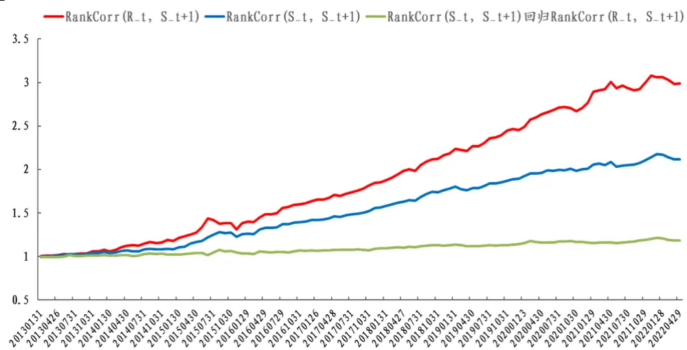
数据来源：Wind、开源证券研究所

从图 9 我们可以看到，原始因子 $RankCorr(\mathsf{S}_{t},\mathsf{S}_{t+1})回$ 归掉 $RankCorr(R_{t},S_{t+1})$ 指标之后，基本不具备选股效果，所以我们认为 $RankCorr(\mathsf{S}_{t},\mathsf{S}_{t+1})$ 的 alpha 来源于$RankCorr(R_{t},S_{t+1})$ 代表的散户羊群效应。具体的alpha传导链如图 10所示。

$图10:RankCorr(S_{t},S_{t+1})$ 因子 alpha传导链：散户羊群效应
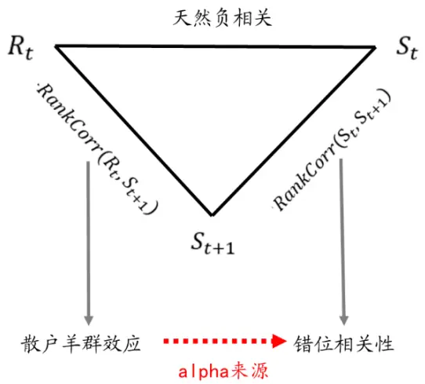
资料来源：开源证券研究所

## 2.3、 RankCorr(Rt, St+1)指标相关测试

$RankCorr(R_{t},\mathsf{S}_{t+1})$ 指 标 是 资 金 流 错 位 相 关 性 的 alpha 来 源 ， 而 且$RankCorr(R_{t},\mathsf{S}_{t+1})$ 指标在我们之前的报告中也没有涉及，所以本节将对其进行展开讨论。

首先，我们进行了回看参数的敏感性分析，在前文的探讨中，我们使用了过去20 个交易日的净流入做了秩相关性的计算。为了防止参数过拟合，我们对其进行不同回看天数下的绩效遍历。从表 3 可以看出，随着回看参数的提升，绩效敏感性并不高。

表3：RankCorr $(R_{t},S_{t+N})$ 回看天数敏感性不高

|  | 20 | 30 | 40 | 50 | 60 |
| --- | --- | --- | --- | --- | --- |
| 年化收益率 | 12.51% | 13.55% | 13.54% | 13.18% | 13.40% |
| 年化波动率 | 5.74% | 5.53% | 5.82% | 5.53% | 5.79% |
| 收益波动比 | 2.18 | 2.45 | 2.33 | 2.38 | 2.32 |
| 最大回撤 | 8.58% | 4.10% | 4.51% | 3.59% | 3.50% |
| 月度胜率 | 77.48% | 77.48% | 74.77% | 75.68% | 72.07% |

数据来源：Wind、开源证券研究所

通过上述分析，我们知道 $RankCorr(R_{t},\mathsf{S}_{t+1})$ 指标在全市场具备一定的选股能力，接下来我们进一步探讨该因子在其他样本空间中的表现。以回看天数20天为例，在沪深 300内多空和多空收益波动比分别为 1.35和 0.60，中证 500内因子的多空和多头的收益波动比分别为 1.32 和 0.43，中证 1000 内因子的多空和多头的收益波动比分别为 2.05 和 0.61。

表4：RankCorr $(R_{t},\mathsf{S}_{t+1})$ 在其他样本空间依然具有一定选股能力

|  | 多空对冲 |  |  |  | 多头 |  |  |  |
| --- | --- | --- | --- | --- | --- | --- | --- | --- |
|  | 全市场 | 沪深300 | 中证500 | 中证1000 | 全市场 | 沪深300 | 中证500 | 中证1000 |
| 年化收益率 | 12.51% | 6.78% | 8.48% | 12.99% | 16.66% | 8.14% | 11.08% | 17.91% |
| 年化波动率 | 5.74% | 5.03% | 6.44% | 6.33% | 27.89% | 22.03% | 25.91% | 29.31% |
| 收益波动比 | 2.18 | 1.35 | 1.32 | 2.05 | 0.60 | 0.37 | 0.43 | 0.61 |
| 最大回撤 | 8.58% | 5.46% | 5.09% | 14.51% | 47.02% | 46.10% | 52.72% | 49.31% |
| 月度胜率 | 77.48% | 69.37% | 63.96% | 73.87% | 54.95% | 59.46% | 56.76% | 56.76% |

数据来源：Wind、开源证券研究所

进一步地，我们对 $RankCorr(R_{t},\mathsf{S}_{t+1})$ 和常见 Barra 风险因子进行相关性分析，这里的因子以回看天数20天为例。从表5可以看出，该因子和流动性、波动性因子相关性较高。为剔除风格和行业的干扰，每月月底将该因子进行 Barra 风格因子以及行业中性化，全市场5分组及多空对冲净值走势如图11所示。纯净新因子多空对冲的年化收益为 8.49%，信息比率为 2.27，胜率为75%，最大回撤为 2.37%。

表5：RankCorr $(R_{t},\mathsf{S}_{t+1})$ 因子与传统 Barra因子相关性不高

| Beta | 价值 | 杠杆 | 盈利 | 成长 | 流动性 | 动量 | 非线性规模 | 波动 | 规模 |
| --- | --- | --- | --- | --- | --- | --- | --- | --- | --- |
| 8.92% | -4.44% | -1.78% | -7.21% | -3.55% | 15.57% | 2.46% | -3.28% | 10.09% | -7.65% |

数据来源：Wind、开源证券研究所

图11：纯净因子多空对冲信息比率：2.27
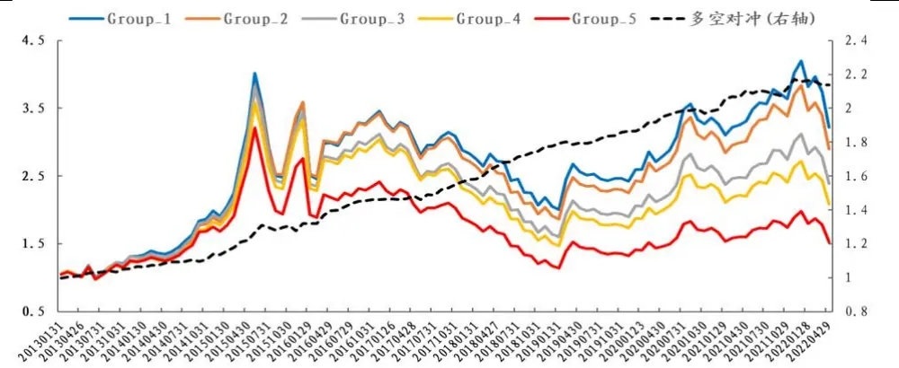
数据来源：Wind、开源证券研究所

## 3、 延伸应用：资金流动力学因子具备行业轮动能力

在前面两节的探讨中，我们主要聚焦“资金流动力学”的选股alpha，并挖掘出$以R_t和\mathbb{S}_{t+1}$ 秩相关系数代表的散户羊群效应因子 $RankCorr(R_{t},\mathsf{S}_{t+1})$ 。本节将从行业角度出发，研究其在行业上的轮动能力。首先，我们遍历参数 N 得到行业$RankCorr(R_{t},\mathsf{S}_{t+N})$ 的 ICIR，结果如图 12所示。

图12：行业 $RankCorr(R_{t},S_{t+N})$ 在不同滞后期 N下的ICIR
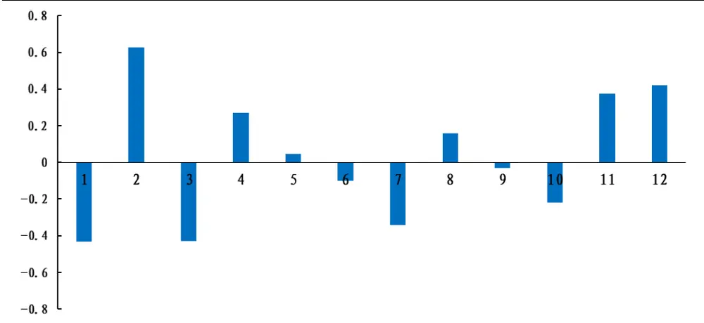
数据来源：Wind、开源证券研究所

从图11我们可以观察出，行业 $RankCorr(R_{\mathrm{t}},S_{t+N})$ 随着N的增大，ICIR呈现正负震荡、不断减弱的现象，所以对于行业层面的散户羊群效应 $而言$ ，使用一阶差分秩相关性 $RankCorr(\Delta R_{t},\Delta\mathsf{S}_{t+N})$ 可能更有轮动效果。进一步，我们遍历参数 N 得到行业 $RankCorr(\Delta R_{t},\Delta\mathsf{S}_{t+N})$ 的ICIR，结果如图13所示。

从图 13 可以看出，行业 $RankCorr(\Delta R_{t},\Delta\mathbb{S}_{t+N})$ 在 N=1,2 的时候 ICIR 相对最显著，且呈现相反效果，这是由于二者强负相关性所导致。最终，我们采用$RankCorr(\Delta R_{t},\Delta\mathsf{S}_{t+1})$ 作为行业散户羊群效应的代理变量，具体解释为：对于某行业小单资金净流入的日度变化而言，若其跟随昨日行业收益日度变化越紧密，我们则认为该行业散户羊群效应较高，后市表现可能较差。

图13：行业 $RankCorr(\Delta R_{t},\Delta S_{t+N})$ 在不同滞后期N下的ICIR
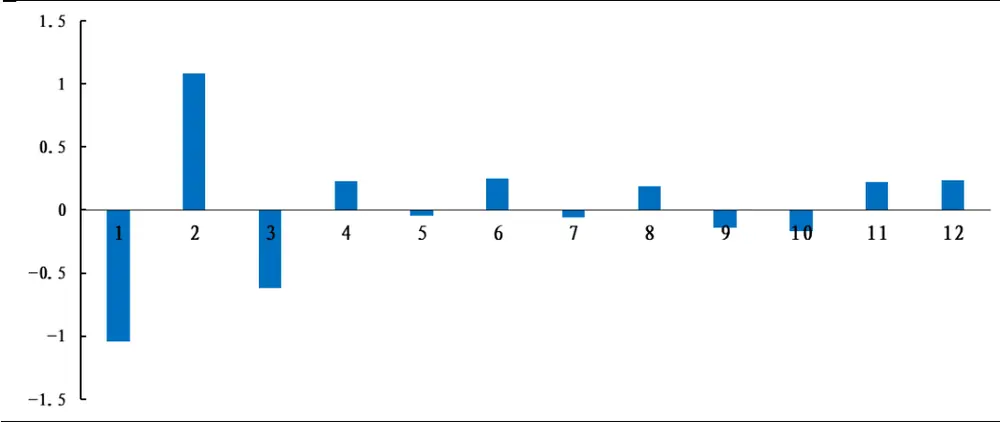
数据来源：Wind、开源证券研究所

对于行业 $RankCorr(\Delta R_{t},\Delta\mathsf{S}_{t+1})$ 而言，IC 均值-5.85%，ICIR 为-1.04。我们对其进行3分组回测，多空对冲的年化收益11.99%，信息比率1.25，胜率66.07%，最大回撤 8.22%，整体绩效较为优异。

图14：行业轮动多空对冲信息比率 1.25
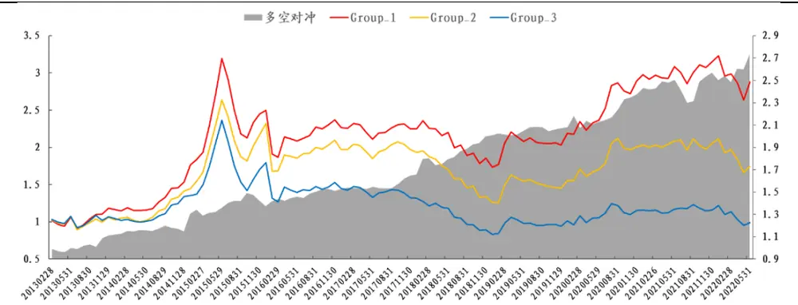
数据来源：Wind、开源证券研究所

表6：行业轮动多空对冲绩效表现较为优异

|  | 年化收益率 | 年化波动率 | 信息比率 | 最大回撤 | 胜率 |
| --- | --- | --- | --- | --- | --- |
| 2013 | 13.03% | 9.88% | 1.32 | 3.01% | 54.55% |
| 2014 | 16.77% | 14.78% | 1.14 | 4.59% | 50.00% |
| 2015 | 5.21% | 10.06% | 0.52 | 7.75% | 58.33% |
| 2016 | 10.96% | 4.62% | 2.37 | 0.94% | 75.00% |
| 2017 | 8.61% | 4.11% | 2.10 | 1.11% | 58.33% |
| 2018 | 21.18% | 9.53% | 2.22 | 3.42% | 91.67% |
| 2019 | 3.64% | 3.17% | 1.15 | 2.00% | 66.67% |
| 2020 | 16.92% | 9.18% | 1.84 | 5.04% | 83.33% |
| 2021 | 2.73% | 11.03% | 0.25 | 8.22% | 58.33% |
| 2022 (截至5月31日) | 24.06% | 11.53% | 2.09 | 2.23% | 60.00% |
| 全区间 | 11.99% | 9.08% | 1.25 | 8.22% | 66.07% |

数据来源：Wind、开源证券研究所

## 4、 风险提示

模型测试基于历史数据，市场未来可能发生变化。

## 特别声明

《证券期货投资者适当性管理办法》、《证券经营机构投资者适当性管理实施指引（试行）》已于2017年7月1日起正式实施。根据上述规定，开源证券评定此研报的风险等级为R3（中风险），因此通过公共平台推送的研报其适用的投资者类别仅限定为专业投资者及风险承受能力为C3、C4、C5的普通投资者。若您并非专业投资者及风险承受能力为C3、C4、C5的普通投资者，请取消阅读，请勿收藏、接收或使用本研报中的任何信息。

因此受限于访问权限的设置，若给您造成不便，烦请见谅！感谢您给予的理解与配合。

## 分析师承诺

负责准备本报告以及撰写本报告的所有研究分析师或工作人员在此保证，本研究报告中关于任何发行商或证券所发表的观点均如实反映分析人员的个人观点。负责准备本报告的分析师获取报酬的评判因素包括研究的质量和准确性、客户的反馈、竞争性因素以及开源证券股份有限公司的整体收益。所有研究分析师或工作人员保证他们报酬的任何一部分不曾与，不与，也将不会与本报告中具体的推荐意见或观点有直接或间接的联系。

## 股票投资评级说明

|  | 评级 | 说明 |
| --- | --- | --- |
| 证券评级 | 买入（Buy） | 预计相对强于市场表现20%以上； |
|  | 增持（outperform） | 预计相对强于市场表现5%～20%； |
|  | 中性（Neutral） | 预计相对市场表现在—5%～+5%之间波动； |
|  | 减持 | 预计相对弱于市场表现5%以下。 |
| 行业评级 | 看好（overweight） | 预计行业超越整体市场表现； |
|  | 中性（Neutral） | 预计行业与整体市场表现基本持平； |
|  | 看淡 | 预计行业弱于整体市场表现。 |
| 备注：评级标准为以报告日后的6~12个月内，证券相对于市场基准指数的涨跌幅表现，其中A股基准指数为沪深300指数、港股基准指数为恒生指数、新三板基准指数为三板成指（针对协议转让标的）或三板做市指数（针对做市转让标的)、美股基准指数为标普500或纳斯达克综合指数。我们在此提醒您，不同证券研究机构采用不同的评级术语及评级标准。我们采用的是相对评级体系，表示投资的相对比重建议；投资者买入或者卖出证券的决定取决于个人的实际情况，比如当前的持仓结构以及其他需要考虑的因素。投资者应阅读整篇报告，以获取比较完整的观点与信息，不应仅仅依靠投资评级来推断结论。 |  |  |

## 分析、估值方法的局限性说明

本报告所包含的分析基于各种假设，不同假设可能导致分析结果出现重大不同。本报告采用的各种估值方法及模型均有其局限性，估值结果不保证所涉及证券能够在该价格交易。

## 法律声明

开源证券股份有限公司是经中国证监会批准设立的证券经营机构，已具备证券投资咨询业务资格。

本报告仅供开源证券股份有限公司（以下简称“本公司”）的机构或个人客户（以下简称“客户”）使用。本公司不会因接收人收到本报告而视其为客户。本报告是发送给开源证券客户的，属于机密材料，只有开源证券客户才能参考或使用，如接收人并非开源证券客户，请及时退回并删除。

本报告是基于本公司认为可靠的已公开信息，但本公司不保证该等信息的准确性或完整性。本报告所载的资料、工具、意见及推测只提供给客户作参考之用，并非作为或被视为出售或购买证券或其他金融工具的邀请或向人做出邀请。本报告所载的资料、意见及推测仅反映本公司于发布本报告当日的判断，本报告所指的证券或投资标的的价格、价值及投资收入可能会波动。在不同时期，本公司可发出与本报告所载资料、意见及推测不一致的报告。客户应当考虑到本公司可能存在可能影响本报告客观性的利益冲突，不应视本报告为做出投资决策的唯一因素。本报告中所指的投资及服务可能不适合个别客户，不构成客户私人咨询建议。本公司未确保本报告充分考虑到个别客户特殊的投资目标、财务状况或需要。本公司建议客户应考虑本报告的任何意见或建议是否符合其特定状况，以及（若有必要）咨询独立投资顾问。在任何情况下，本报告中的信息或所表述的意见并不构成对任何人的投资建议。在任何情况下，本公司不对任何人因使用本报告中的任何内容所引致的任何损失负任何责任。若本报告的接收人非本公司的客户，应在基于本报告做出任何投资决定或就本报告要求任何解释前咨询独立投资顾问。

本报告可能附带其它网站的地址或超级链接，对于可能涉及的开源证券网站以外的地址或超级链接，开源证券不对其内容负责。本报告提供这些地址或超级链接的目的纯粹是为了客户使用方便，链接网站的内容不构成本报告的任何部分，客户需自行承担浏览这些网站的费用或风险。

开源证券在法律允许的情况下可参与、投资或持有本报告涉及的证券或进行证券交易，或向本报告涉及的公司提供或争取提供包括投资银行业务在内的服务或业务支持。开源证券可能与本报告涉及的公司之间存在业务关系，并无需事先或在获得业务关系后通知客户。

本报告的版权归本公司所有。本公司对本报告保留一切权利。除非另有书面显示，否则本报告中的所有材料的版权均属本公司。未经本公司事先书面授权，本报告的任何部分均不得以任何方式制作任何形式的拷贝、复印件或复制品，或再次分发给任何其他人，或以任何侵犯本公司版权的其他方式使用。所有本报告中使用的商标、服务标记及标记均为本公司的商标、服务标记及标记。

## 开源证券研究所

上海
地址：上海市浦东新区世纪大道1788号陆家嘴金控广场1号
楼10层
邮编：200120
邮箱：research@kysec.cn
北京
地址：北京市西城区西直门外大街18号金贸大厦C2座16层
邮编：100044
邮箱：research@kysec.cn
深圳
地址：深圳市福田区金田路2030号卓越世纪中心1号
楼45层
邮编：518000
邮箱：research@kysec.cn
西安
地址：西安市高新区锦业路1号都市之门B座5层
邮编：710065
邮箱：research@kysec.cn