2022 年 06 月 12 日

## 金融工程研究团队

魏建榕（首席分析师）

证书编号：S0790519120001

张 翔（分析师）

证书编号：S0790520110001

傅开波（分析师）

证书编号：S0790520090003

## 高 鹏（分析师）

证书编号：S0790520090002

## 苏俊豪（分析师）

证书编号：S0790522020001

## 胡亮勇（分析师）

证书编号：S0790522030001

## 王志豪（研究员）

证书编号：S0790120070080

## 盛少成（研究员）

证书编号：S0790121070009

## 苏 良（研究员）

证书编号：S0790121070008

## 相关研究报告

《市场微观结构研究系列（12）-大单与小单资金流的 alpha 能力》-2021.6.2《市场微观结构研究系列（13）-理想反转因子的 4 年总结：依旧理想》-2022.5.2

《市场微观结构研究系列（14）-新型因子：资金流动力学与散户羊群效应》-2022.6.2

# 高频因子：分钟单笔金额序列中的主力行为刻画

# ——市场微观结构研究系列（15）

## 魏建榕（分析师）

weijianrong@kysec.cn

苏良（联系人）

证书编号：S0790519120001

suliang@kysec.cn

证书编号：S0790121070008

## ⚫ 从分钟单笔成交金额中提炼选股因子

分钟单笔成交金额的分布包含更加细化的选股信息，从单笔成交金额的分组统计结果来看，其信息分布并不是均匀的，我们基于这一现象捕捉Alpha，构造了一系列统计指标因子，如分位数、标准差、偏度和峰度。以分位数因子为例：

（1）因子表现：Rank IC 为-0.072，Rank ICIR 达到 3.57，具备稳定有效的选股能力。多头组合的年化收益仍能达到 24.69%，信息比率达到 3.59；

（2）选股逻辑方面，我们引入“相对大单”的概念来辅助理解。对于分钟单笔成交金额而言，其分布越集中，整体右偏程度越高，股价未来表现越好。我们发现，因子核心Alpha缘自主力（“相对大单”）对于股票的关注度。

## ⚫ 从单笔成交金额相关性看主力强度和主力情绪

我们从相关性的视角出发，观察分钟单笔成交金额与价量指标的相关性，并分别构造了主力交易强度因子和主力交易情绪因子：

## （1）主力交易强度因子

Rank IC 值达到 0.065，Rank ICIR 为 3.18，具备稳定有效的选股能力。因子核心Alpha源自主力资金对于分钟成交的主导能力，主力资金对于成交额（成交量）的贡献越大，股价未来表现越好；

## （2）主力交易情绪因子

Rank IC 值为-0.039，Rank ICIR 达到 3.34，并且因子的分组单调性较好，属于多头有效的因子。该因子的理解框架与交易行为因子中的聪明钱因子非常相似，因子值的大小反映了主力资金的交易情绪。

## ⚫ 单笔成交金额对反转效应的提纯：越大单，越反转

A 股的反转之力微观来源为大单成交，这一结论在分钟频上依旧成立。我们基于分钟单笔成交金额，对理想反转因子的内部结构细化，并从中提纯出更为稳定的选股因子，即强反转因子。

从全区间测试表现来看，该因子 Rank IC 值为-0.055，Rank ICIR 达到 2.62，持仓胜率为 83.93%，多头年化收益为 24.19%，相比万得全A 超额收益在 14.6%以上。强反转因子的选股能力比较稳健，回归理想反转因子后仍有增量，多空年化收益为12.6%，多空 IR 达到 2.75，多头年化收益为 21.39%。

## ⚫ 因子实践：从因子到组合的具现

（1）宽基指数：在中证 1000 成分中表现最好，年化超额收益率达到 12.01%，回撤幅度较小；因子在中证 500和沪深300成分中的选股效果整体偏弱，超额收益分别为 3.72%和 1.13%。

（2）行业赛道：机械 50组合的年化收益为 19.35%，超额收益达到 13.14%；电子 50组合的年化收益为28.73%，超额收益为13.03%；计算机 30组合的年化收益为 25.22%，超额收益达到 11.5%。

⚫ 风险提示：模型基于历史数据测试，未来市场可能发生变化。

我们长期引领了“高频数据、低频因子”的研究潮流，在高频交易行为因子领域持续耕耘多年，独家的代表性成果包括：理想反转因子、聪明钱因子、理想振幅因子、APM因子、主动买卖因子、大小单资金流因子等，详见开源金融工程团队《市场微观结构研究》系列报告。在本报告中，我们将继续探讨逐笔成交数据的Alpha潜力，报告内容包含两部分：第 1 部分，从分钟单笔成交金额的分布特征、时序特征、反转效应三个维度出发，提炼有效的价量因子；第 2 部分，测试因子在主要宽基指数和行业赛道上的选股效果。

## 1、 从分钟单笔成交金额中提炼选股因子

A 股逐笔成交明细数据，主要由价格、成交量以及买卖序号等重要字段组成。表1 展示了逐笔成交数据的基本结构。

表1：逐笔成交数据结构：储存了最底层的价量信息

| 字段名称 | 字段说明 |
| --- | --- |
| TranID | 每笔交易的成交ID |
| Time | 成交的时间戳，如09:31:23 |
| Price | 成交价格（元） |
| Volume | 成交量（股） |
| Type | 买卖标识，B代表主买，S代表主卖 |
| BuyOrderID | 买入单的挂单ID |
| BuyOrderPrice | 买入单的挂单价格（元） |
| BuyOrderVolume | 买入单的挂单数量（股） |
| SaleOrderID | 卖出单的挂单 ID |
| SaleOrderPrice | 卖出单的挂单价格（元） |
| SaleOrderVolume | 卖出单的挂单数量（股） |

资料来源：Wind、开源证券研究所

图1：示例图：每日的单笔成交金额分布呈现金字塔形态
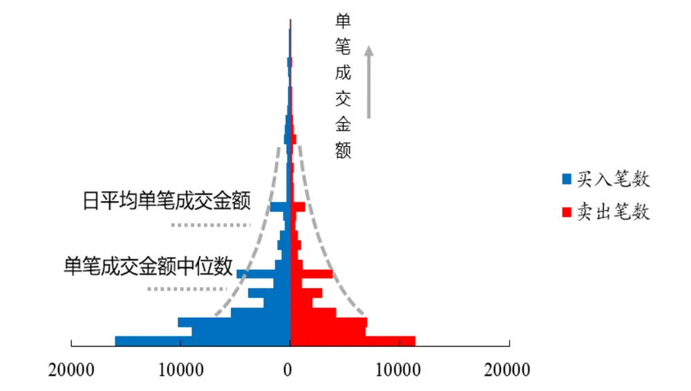
数据来源：Wind、开源证券研究所

如图 1 所示，股票每一天内发生的所有单笔成交金额的样本分布，大致呈现为金字塔形态：头部很尖、底部很宽。日频的平均单笔成交金额，作为一个高度降维的统计指标，将会流失过多的日内信息量。本篇报告中，我们将基于分钟频的平均单笔成交金额的时间序列，从三个维度出发提炼选股因子。

（1）分布特征。我们使用了分位数、标准差、偏度和峰度等指标来刻画分钟频单笔成交金额的分布形态。核心结论是：分钟频单笔成交金额分布越右偏，“相对大单”含量越多，则未来股价表现越好；

（2）时序特征。我们从相关性的视角考察分钟频单笔成交金额与价量指标的联动现象。核心结论是：一、单笔成交金额与分钟成交额相关性越高，未来股价表现越好；二、单笔成交金额与价格相关性越高，未来股价表现越差；

（3）反转效应。在系统梳理“理想反转因子”的时候，我们发现，利用分钟频单笔成交金额提纯反转效应，得到的反转因子效果更好。在2019 年底的《A股反转之力的微观来源》报告中，我们曾提出“反转之力的微观来源是大单成交”，该结论在分钟频上依然成立。

在本报告中，除非特别说明，因子的计算均采用如下流程：先基于日内数据计算每个交易日的特定指标，再取该指标过去 20日的均值作为因子值。

## 1.1、 从分钟单笔金额分布看主力痕迹

分钟单笔序列中包含更加细化的交易行为信息，我们可以计算统计指标作为选股因子，如分位数、标准差、偏度和峰度等。因子经过行业市值中性化处理，选股范围包括全市场所有A 股，调仓周期设为 20个交易日，暂不考虑交易费用的影响，表2 展示了上述统计指标因子的测试结果。

表2：单笔成交金额的统计指标因子测试表现：初步判断具备选股能力

| 测试指标 | 中位数 标准差 | 偏度 | 峰度 |
| --- | --- | --- | --- |
| 多头 Alpha | 5.1% 1.7% | 2.5% | 0.7% |
| 空头 Alpha | -7.6% | -6.8% -6.3% | -4.0% |
| 多空收益 | 13.7% | 9.2% 9.4% | 4.9% |
| 多空最大回撤 | 16.9% | 12.7% 8.5% | 8.8% |
| 多空IR | 1.601 | 1.412 1.430 | 0.949 |
| Rank IC | -0.034 | -0.027 0.028 | -0.015 |
| Rank ICIR | 1.279 | 1.232 1.904 | 1.287 |

数据来源：Wind、开源证券研究所

整体来看，标准差、偏度和峰度因子的选股能力较弱一些，RankIC绝对值均小于 0.03，多头超额不是特别显著。中位数因子的RankIC 也并不是很高，但整体的多头和空头收益较为均衡。我们至此只能初步判断，单笔成交金额的分布特征中可能蕴含选股Alpha，但具体该如何构造选股因子尚且不得而知。

在因子逻辑层面，中位数因子为负向因子，也即单笔成交金额分布的中心（中位数）越低，股价未来表现越好。但由于价格与单笔成交金额相关，这在一定程度上会干扰因子的选股效果。因此，统计指标因子的实际选股逻辑也并不明确。

图2：股价与单笔成交金额之间存在非线性关系
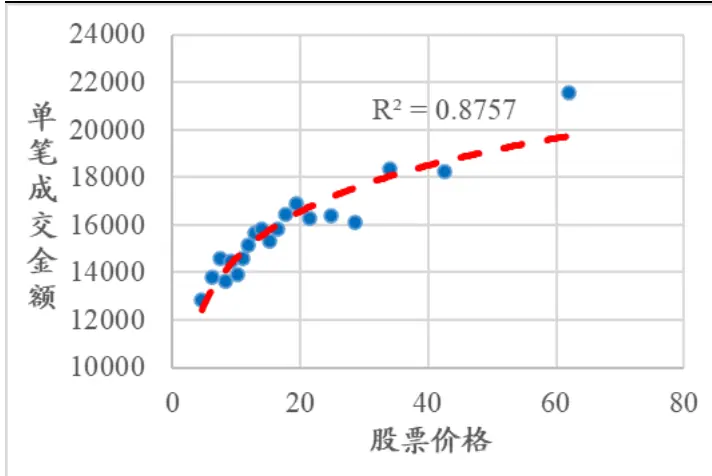
数据来源：Wind、开源证券研究所

图3：股价越高，单笔成交金额重心也越高
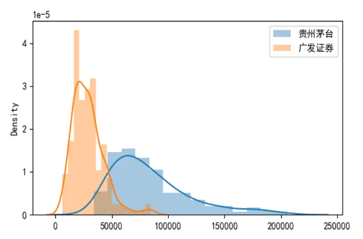
数据来源：Wind、开源证券研究所

从股价和单笔成交金额的关系来看，单笔成交金额较低端与价格相关性较高，随着股票价格的上升，二者的相关性（用回归系数来表征）逐渐减弱；不同价格水平下的两只股票，如图3所示，其分钟单笔成交金额的分布重心存在明显的差异。

此外，分钟单笔成交金额的分布并不均匀，不同单笔成交金额水平下构造因子可能具备不同选股效果。为了印证猜想，我们将每个交易日的所有分钟数据按照单笔成交金额由小到大分成 10 组，每组各有 24 个样本点，然后再分别基于这些样本点计算因子。通过上述分组构造方法，我们依次构造并测试了分位数、标准差、偏度和峰度因子的 IC表现，结果如图 4至图7 所示。

图4：分位数因子IC随分位数增大逐渐减弱
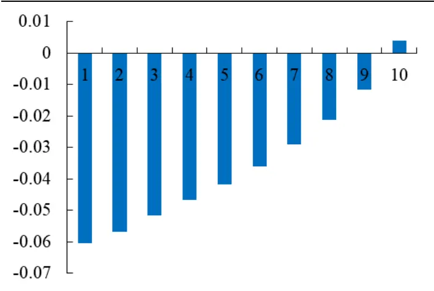
数据来源：Wind、开源证券研究所

图5：标准差因子在金额较低组的 IC较高
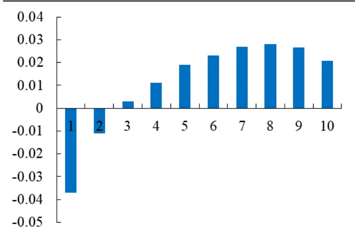
数据来源：Wind、开源证券研究所

分位数因子：我们选取了单笔成交金额的 5%到 95%的分位值构造因子（组1至组 10），为了减弱价格因素的影响，将因子回归20日均价取残差。如图4 所示，5%分位的 IC最高，随着分位数的逐渐增大，因子IC开始减弱直至不显著。

标准差因子：我们对10组样本分别计算组内标准差，回归价格因子后再计算各组因子的 IC，如图 5 所示。分别在金额较低组和金额较高组，因子方向出现相反的情况，但从IC的绝对值水平来看，似乎还是金额较低组的因子负向IC更强。

图6：偏度因子在金额较低组的 IC较高
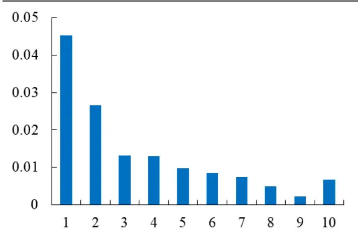
数据来源：Wind、开源证券研究所

图7：峰度因子在金额较低组的IC较高
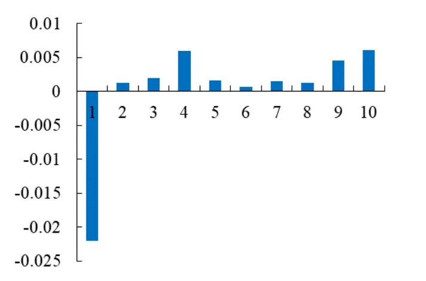
数据来源：Wind、开源证券研究所

偏度因子&峰度因子：无论是偏度因子还是峰度因子，在金额较低组都表现出了更强的选股能力，第1组偏度因子和峰度因子 IC 值分别达到0.045和-0.03；而且峰度因子与标准差因子类似，金额较高组的因子与金额较低组的因子选股方向相反。

综上，从单笔成交金额的分组统计结果来看，其信息分布并不是均匀的。进一步，我们希望能够利用上述现象去捕捉数据中的Alpha，具体以分位数因子为例。考虑到价格因素干扰，我们需要消除单笔成交金额的水平差异，为此，采取归一化方法分别将不同股票的单笔金额分布映射到[0,1]区间内。我们定义分位数因子（QUA因子），计算方法如表3所示。

表3：分位数因子（QUA 因子）构造步骤

| 序号 | 计算说明 |
| --- | --- |
| 步骤1 | 选定股票，逐个交易日回顾分钟单笔成交金额序列，记为A； |
| 步骤2 | 将A从小到大排序，剔除最大的10个样本值（极端值）； |
| 步骤3 | 构造指标S = (A10%− Amin)/(Amax − Amin)，其中Amax、Amin分别为最大和最小值，A10%为10%分位值； |
| 步骤4 | 滚动 20个交易日计算 S指标的均值，即可得到 QUA 因子。 |

资料来源：开源证券研究所

图 8 展示了 QUA 因子在全市场的分组测试表现，不考虑交易费用，因子做行业和市值中性化处理。

图8：QUA因子在全市场上分组表现较好，多头年化达到24.69%
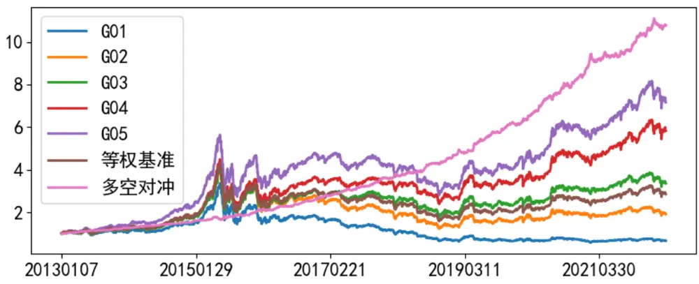
数据来源：Wind、开源证券研究所

全区间来看，QUA 因子 Rank IC 为-0.072，Rank ICIR 达到 3.57，具备稳定有效的选股能力。多头组合的年化收益仍能达到 24.69%，信息比率达到 3.59。

表4：QUA因子空头收益明显，多空 IR达到3.51

| 年化收益 | 最大回撤 | 多头 Alpha | 空头 Alpha | 多空收益 | 多空回撤 | 多空IR | 胜率 |
| --- | --- | --- | --- | --- | --- | --- | --- |
| 24.69% | 51.55% | 10.87% | -15.07% | 30.54% | 8.27% | 3.59 | 76.79% |

数据来源：Wind、开源证券研究所

为了理解QUA 因子的底层逻辑，我们在这里引入“相对大单”的概念。在每只股票的挂单结构中，小单金额受到最小成交单位（100股×股价）的限制，因此通常是一个比较稳定的参照基准。所谓“相对大单”，是指将大单的判别标准建立在与小单的相对比较（而非绝对金额的大小）之上。

在“相对大单”的框架下，QUA 因子的 Alpha来源可以理解为：大单相对小单的成交金额偏离越大，说明主力（“相对大单”）对于该股票的关注度越高，未来股价表现会越好。图9给出了QUA因子大致的数学拆解，不难看出，其核心部件是比值因子 $(A_{90\%}/A_{10\%})$ ）。其中， $A_{90\%}\mathcal{\bar{H}}\mathbf{\Xi}A_{10\%}$ 为单笔成交金额分布的 90%和 10%分位值。

图9：QUA因子的构造逻辑：大单相对小单的成交金额偏离
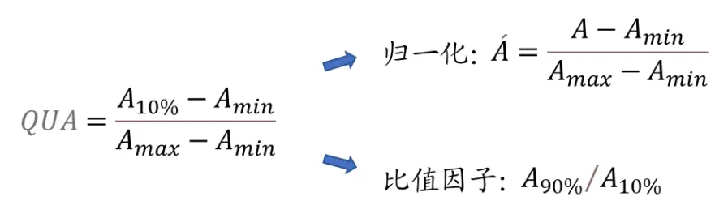
资料来源：开源证券研究所

图 10展示了比值因子的RankIC 及其累计值，整体来看，该因子的选股能力相对稳定，年化 ICIR为 3.03，因子Alpha 显著；图11则是QUA 因子、比值因子及其相互正交后的残差因子的多空对冲曲线。

图10：比值因子的 Rank IC 显著，Alpha 较为稳定
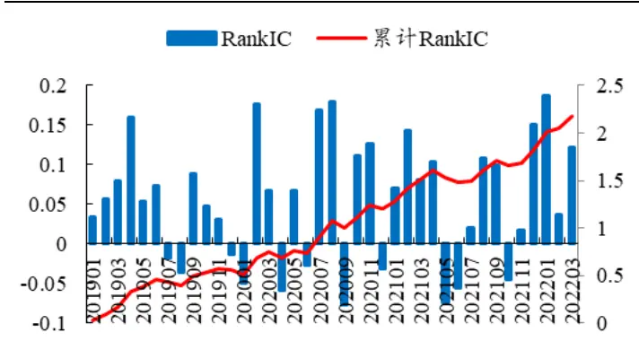
数据来源：Wind、开源证券研究所

图11：比值因子是 QUA因子的部分解释
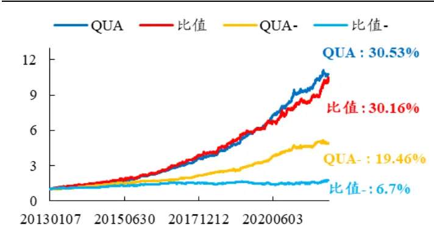
数据来源：Wind、开源证券研究所

如图11所示，将QUA因子回归掉比值因子，其残差项（记作QUA-）因子仍具备一定的选股能力，多空 IR 为 3.08，而将比值因子回归掉 QUA 因子的影响，得到的残差项（记作比值-）因子RankIC 仅为-0.017，选股效果并不显著。

此外，除了QUA 因子，我们还分别利用单笔成交金额构造了标准差（STD）因子、偏度（SKEW）因子和峰度（KURT）因子，但由于上述因子均是对单笔成交金额分布特征的刻画，解释性上多少会有些重叠的成分，笔者后续将不再详细介绍因子的构造过程，仅对其表现进行分析。因子构造的具体方法可参见附录中的内容，供读者参考。表5展示了上述统计指标因子的分组测试效果。

表5：重新定义下单笔成交金额的统计指标因子具有不错表现

| 测试指标 | QUA | STD SKEW | KURT |
| --- | --- | --- | --- |
| 年化收益 | 24.69% | 22.84% 26.05% | 24.68% |
| 最大回撤 | 51.55% | 52.26% 50.79% | 52.72% |
| 多头 Alpha | 10.87% | 9.22% 12.07% | 10.85% |
| 空头 Alpha | -15.07% | -13.97% -14.77% | -14.49% |
| 多空收益 | 30.54% | 26.96% 31.50% | 29.63% |
| 多空最大回撤 | -8.27% | -9.11% -6.39% | -6.26% |
| 多空IR | 3.587 | 3.235 3.865 | 4.140 |
| 胜率 | 76.79% | 75.00% 80.36% | 81.25% |
| Rank IC | -0.072 | -0.065 0.075 | -0.068 |
| Rank ICIR | 3.572 | 3.305 3.770 | 3.864 |

数据来源：Wind、开源证券研究所

STD 因子： RankIC 值为负，单笔成交金额分散程度更低，“相对大单”的成交金额偏离也更高，未来股价表现会更好。

SKEW因子：RankIC 值为正，单笔成交金额分布的右偏程度越高，大单相对小单的金额偏离越大，股票也更受主力资金的青睐。

KURT 因子：KURT 因子与 SKEW 因子的统计含义相近，单笔成交金额分布越离散，大单相对小单的金额偏离越小，主力资金对股票的看涨空间也比较有限。

图 12 展示了因子的相关系数，上述统计指标因子的两两相似度均高于 0.7。分别用 A 因子回归 B 因子，测试残差项在截面上的选股效果，图 13 展示了相互回归后的多空 IR表现，KURT因子在剔除其他因子后的表现更好一些。

图12：统计指标因子的相似性较高

|  | QUA | STD | SKEW | KURT |
| --- | --- | --- | --- | --- |
| STD | 0.924 | 1 | 1 | 1 |
| SKEW | 0.923 | 0.847 | 1 |  |
| KURT | 0.866 | 0.796 | 0.902 |  |

数据来源：Wind、开源证券研究所

图13：A因子回归 B因子后的多空 IR

| A因子B因子 | QUA | STD | SKEW | KURT |
| --- | --- | --- | --- | --- |
| QUA | 1 | 2.214 | 1.927 | 1.784 |
| STD | 2.537 |  | 1.927 | 2.714 |
| SKEW | 1.595 | 0.911 |  | 2.657 |
| KURT | 2.214 | 1.927 | 1.927 | 1 |

数据来源：Wind、开源证券研究所

因子相关性层面，QUA 因子与APM、理想反转以及聪明钱等交易行为因子的相关性比较低，与现有因子的解释能力重叠度较低，如图 14所示；QUA因子与Barra风格因子的相关性整体并不高，与流动性因子的相关系数低于0.45。

图14：QUA因子与交易行为的相关性较低
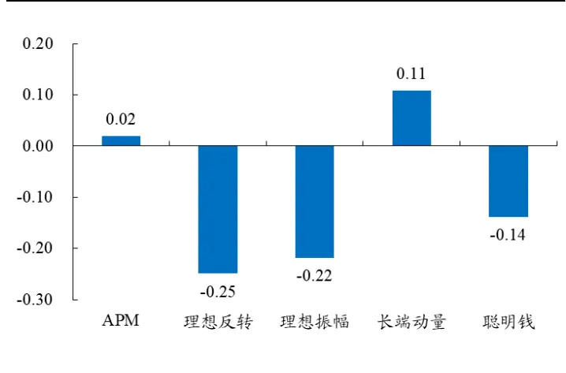
数据来源：Wind、开源证券研究所

图15：QUA因子与流动性相关性较高
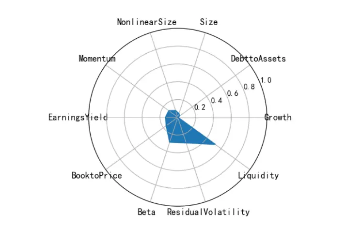
数据来源：Wind、开源证券研究所

回归Barra风格因子后，QUA 因子仍能保持20.3%的多头年化收益，空头Alpha有明显缩减，但多头 Alpha 损失较小；中性因子的多空 IR 为2.71，胜率为72.32%。

图16：Barra风格中性化后，QUA因子仍具备选股能力
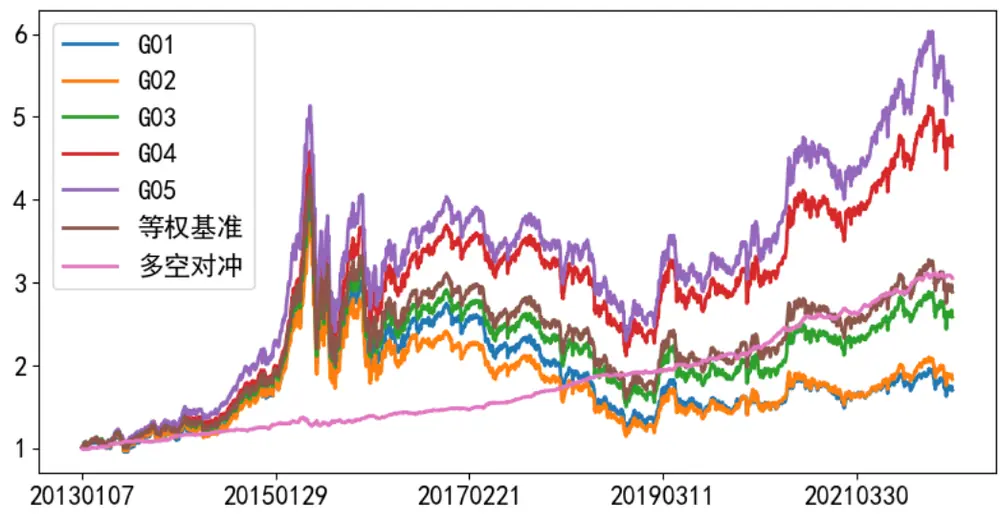
数据来源：Wind、开源证券研究所

## 1.2、 从单笔成交金额相关性看主力强度和主力情绪

单笔成交金额分布形态描述的是“相对大单”的关注度差异，反映了主力资金参与交易的意愿强弱，被证明有一定选股能力。在时序上是否也能基于单笔成交金额开发选股因子？我们不妨先从变量相关性的视角出发，观察分钟频上单笔成交金额与价量指标（成交量、收盘价等）之间的关系，如图17所示。

图17：单笔成交金额与分钟成交额（量）相关度较高
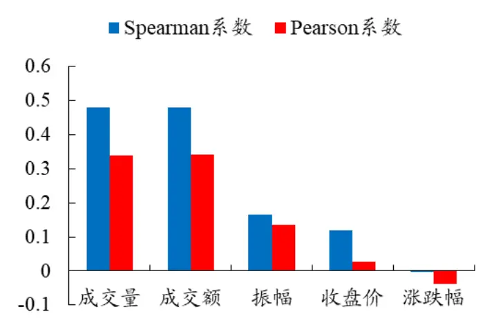
数据来源：Wind、开源证券研究所

图18：单笔成交金额与分钟成交额时序变化基本一致
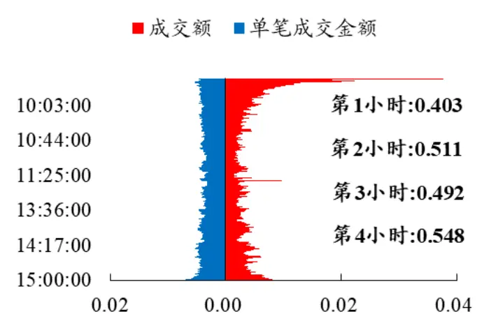
数据来源：Wind、开源证券研究所

比较关心的问题是，价格和成交量的变化中能否反映资金行为？从“价”（收盘价、涨跌幅、振幅）与“量”（成交额）两个维度来看，单笔成交金额与收盘价的相关性低，而与成交量和成交额的相关性更高一些。图18为单笔成交金额和分钟成交额的时序值，不难看出，二者变化基本一致，并且在盘中和盘尾的相关性更高。

因此，我们基于相关系数的定义，分别计算单笔成交金额与指标 B（如分钟成交额、收盘价等）的相关系数，测试其 IC和 RankIC表现，结果如表 6所示。

表6：单笔成交金额与分钟成交额相关系数因子表现较好

| 指标B | IC | Rank IC | Rank ICIR P{\|Rank IC\|>0.02} |
| --- | --- | --- | --- |
| 价格 | 0.058 | 0.043 3.488 | 71.43% |
| 涨跌幅 | 0.035 | 0.025 2.491 | 55.36% |
| 振幅 | 0.008 | 0.011 0.897 | 41.96% |
| 成交额 | 0.091 | 0.068 3.283 | 73.21% |

数据来源：Wind、开源证券研究所（测试区间为 20130104 至 20220311，因子经过方向调整）

单笔成交金额与分钟成交额的相关系数因子 Rank IC 值较高，绝对值大于 0.02的概率为73.21%；单笔成交金额与价格的相关系数因子Rank IC 值次之，但因子的稳定性更强，RankICIR接近3.5的水平。值得一提的是，我们尝试过计算单笔成交金额与指标 B的错位相关性，结果并不能给我们带来更多的信息增量。

图19：单笔成交金额的错位相关性不具备选股信息（表内数值为 RankIC）

| 指标B | N=-5 | N=-3 | N=-2 | N=-1 | N=0 | N=1 | N=2 | N=3 | N=5 |
| --- | --- | --- | --- | --- | --- | --- | --- | --- | --- |
| 价格 | 0.030 | 0.034 | 0.038 | 0.043 | 0.049 | 0.048 | 0.048 | 0.048 | 0.046 |
| 涨跌幅 | 0.018 | 0.027 | 0.030 | 0.037 | 0.029 | 0.002 | 0.007 | 0.008 | 0.008 |
| 振幅 | 0.002 | 0.000 | 0.000 | 0.005 | 0.002 | 0.011 | 0.006 | 0.004 | 0.004 |
| 成交额 | 0.015 | 0.020 | 0.025 | 0.033 | 0.070 | 0.013 | 0.000 | 0.004 | 0.008 |

数据来源：Wind、开源证券研究所

## 1.2.1、 主力交易强度因子：多头年化 22.84%，多空 IR 为 3.51

单笔成交金额与成交额之间的相关性强弱，描述的是代表主力的“相对大单”对分钟成交额的影响。从资金行为学的角度来理解，单笔成交金额与成交额的相关性越强，主力资金主导成交节奏的能力也越强。

基于单笔成交金额与成交额的相关性中蕴含的 Alpha 信息，笔者将二者的相关系数定义为主力交易强度因子（MTS因子），计算步骤如下：

表7：主力交易强度因子（MTS）构造步骤

| 序号 | 计算说明 |
| --- | --- |
| 步骤1 | 选定股票，逐个交易日回顾分钟单笔成交金额和分钟成交额； |
| 步骤2 | 计算单笔成交金额与成交额的相关系数，记为TS指标 |
| 步骤3 | 滚动 20 个交易日计算 TS 指标的均值，即 MTS 因子 |

资料来源：开源证券研究所

我们在全市场范围内测试MTS因子的选股能力，不考虑交易费用，因子经过行业和市值中性化，如图 20所示。

图20：MTS因子多空对冲信息比率达到 3.43
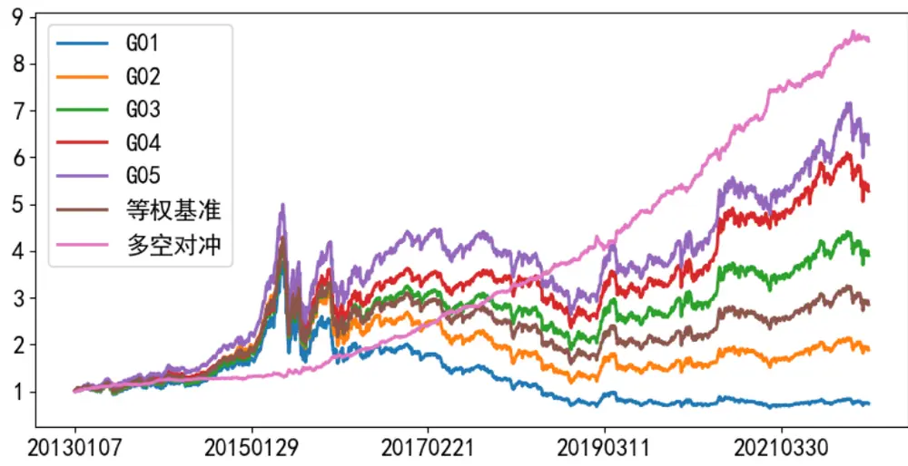
数据来源：Wind、开源证券研究所，测试区间为 20130104 至 20220311

MTS 因子的历史表现不错，其 Rank IC 值达到 0.065，Rank ICIR 为 3.18，具备稳定有效的选股能力。尽管因子收益偏向空头端，其多头组合的年化收益仍能达到22.84%，信息比率达到3.51，同期万得全A指数为 9.53%，超额13%以上。

表8：MTS因子空头收益明显，多空 IR达到 3.51

| 年化收益 | 最大回撤 | 多头 Alpha | 空头 Alpha | 多空收益 | 多空回撤 | 多空IR | 胜率 |
| --- | --- | --- | --- | --- | --- | --- | --- |
| 22.84% | 51.06% | 9.23% | -14.04% | 27.06% | 6.74% | 3.51 | 74.11% |

数据来源：Wind、开源证券研究所

因子相关性方面，我们分别测试了 MTS 因子与交易行为因子和 Barra 风格因子的相关性，结果如图 21和图 22所示。

图21：MTS因子与交易行为因子的相关性较低
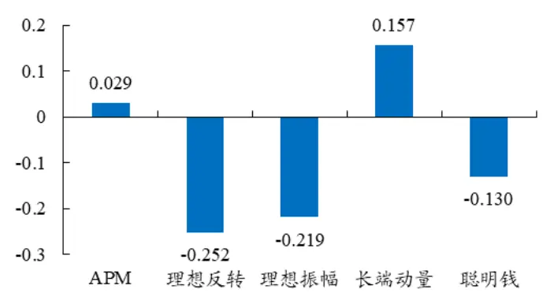
数据来源：Wind、开源证券研究所

图22：MTS因子与流动性因子相关低于0.5
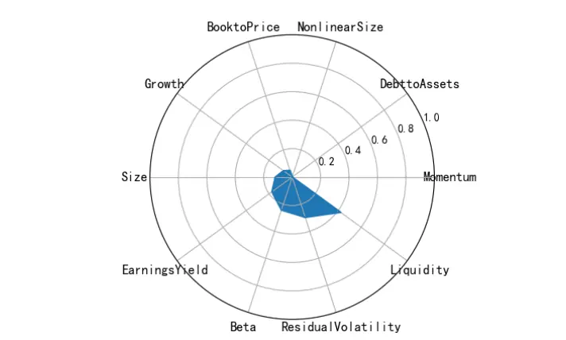
数据来源：Wind、开源证券研究所

MTS因子与理想反转因子和理想振幅因子的相关系数分别为-0.252和-0.219，整体上与交易行为因子的相关性不高，具有相对独立的 Alpha来源；在剔除掉Barra因子后，MTS 因子的收益有所减弱，多头和空头的Alpha分别降至 5%和-5.04%，信息比率仍有 2.18，年化收益率为 18.25%。

图23：Barra风格中性化后，MTS因子仍具备选股能力
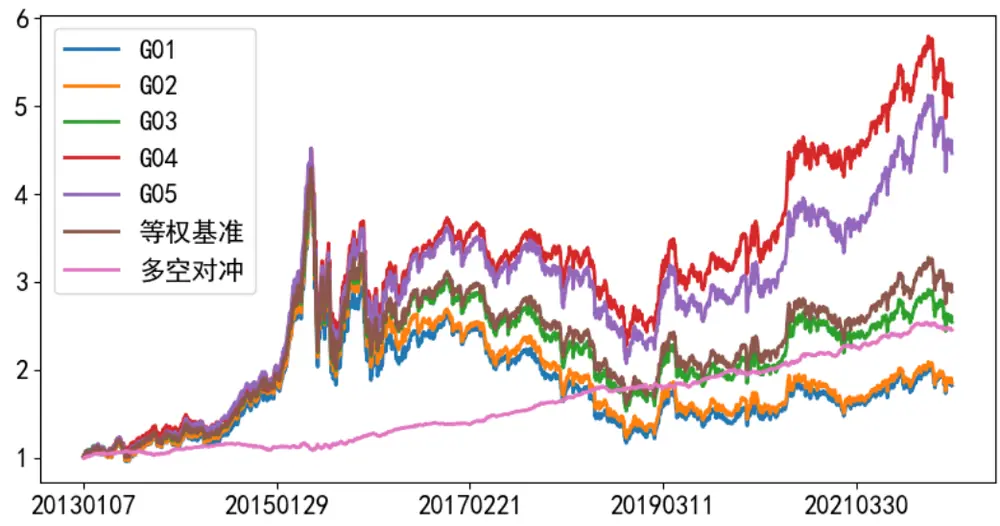
数据来源：Wind、开源证券研究所

## 1.2.2、 主力交易情绪因子：多头年化 21.56%，多空 IR为 3.00

再来观察另外一组指标对，即单笔成交金额与价格，二者的相关系数因子的 IC为负，单笔成交金额与分钟收盘价的相关性越强，未来股价表现越好。笔者将其定义为主力交易情绪因子（MTE 因子），计算步骤如下：

表9：主力交易情绪因子（MTE）构造步骤

| 序号 | 计算说明 |
| --- | --- |
| 步骤1 | 选定股票，逐个交易日回顾分钟单笔成交金额和分钟收盘价； |
| 步骤2 | 计算单笔成交金额与收盘价的相关系数，记为TE指标 |
| 步骤3 | 滚动 20 个交易日计算 TE 指标的均值，即 MTE因子 |

资料来源：开源证券研究所

图 24 展示了 MTE 因子在全市场的分组测试表现，不考虑交易费用，因子做行业和市值中性化处理。

图24：MTE因子的多空分组表现：多头年化 21.56%，多空 IR达到 3.0
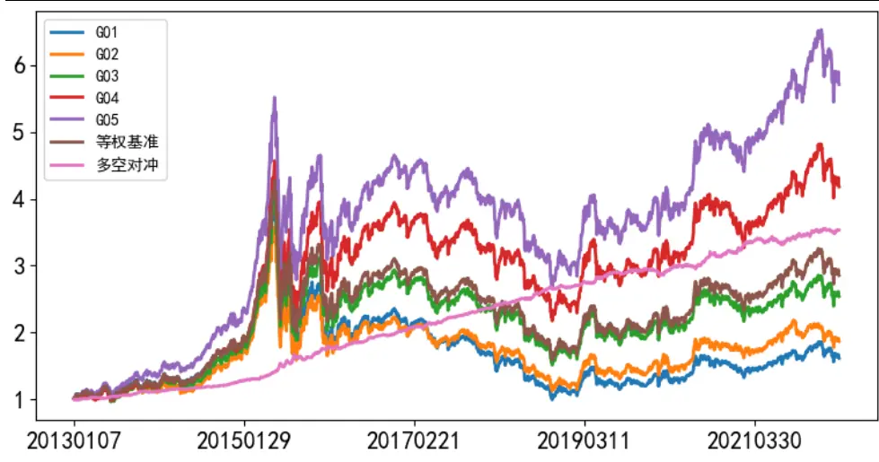
数据来源：Wind、开源证券研究所，测试区间为 20130104 至 20220311

在全区间（20130104-20220408）内，MTE 因子 Rank IC 值为-0.039，Rank ICIR达到 3.34；因子的分组单调性较好，属于多头有效的因子，年化收益率为 21.56%，相对万得全A 超额达到11.78%。

表10：MTE因子多头选股能力较强，年化收益为 21.56%

| 年化收益 | 最大回撤 | 多头 Alpha | 空头 Alpha | 多空收益 | 多空回撤 | 多空IR | 胜率 |
| --- | --- | --- | --- | --- | --- | --- | --- |
| 21.56% | 51.98% | 8.09% | -6.17% | 15.19% | 4.74% | 3.00 | 75.89% |

数据来源：Wind、开源证券研究所

MTE因子实质上反映了主力参与交易的相对价位，因子值越大，表明主力交易更倾向于出现在高价位，这是“逢高出货”的表现，反映了主力悲观态度；而因子值越小，则表明主力交易更多出现在低价位，这是“逢低吸筹”的表现，属于乐观情绪。这个理解框架与我们交易行为因子中的“聪明钱因子”比较相似。

因子相关性方面，图 25 和图 26 分别展示了 MTE 因子与交易行为因子和 Barra风格因子的相关性。整体上看，MTE因子相关性不高，即便与聪明钱因子的构造逻辑类似，二者的相关系数仍然低于 0.2，Alpha并不存在重合度较高的情况。

图25：MTE因子与交易行为因子的相关性偏低
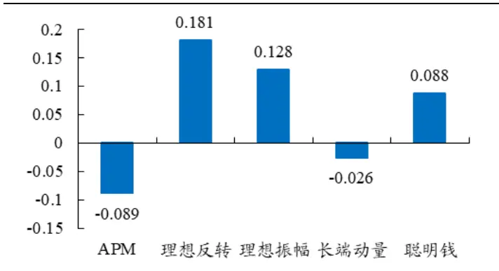
数据来源：Wind、开源证券研究所

图26：MTE因子与 Barra风格因子相关性较低
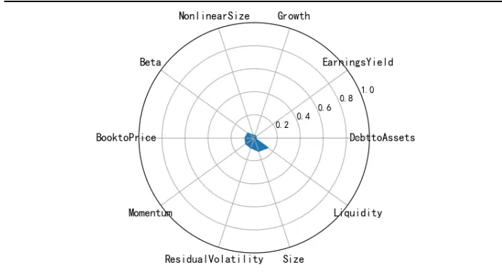
数据来源：Wind、开源证券研究所

剔除 Barra 风格因子后，MTE 因子的多空收益仍有 8.36%，其中多头 Alpha 仍然有 6%以上的收益，而空头Alpha 的减弱程度比较明显。

图27：Barra风格中性化后，MTE因子仍具备选股能力
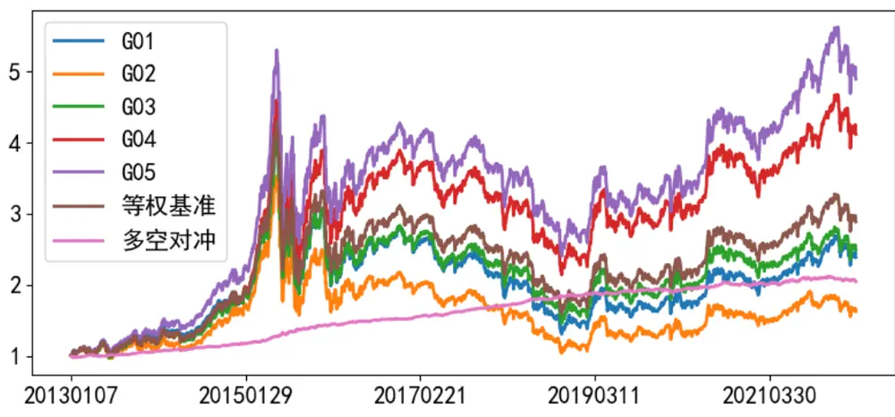
数据来源：Wind、开源证券研究所

## 1.3、 单笔成交金额对反转效应的提纯：越大单，越反转

单笔成交金额这一代理变量能够作为股票交易状态的特征变量，与我们的因子切割方法论相结合。A 股市场的反转效应长期来看具备显著的选股能力，但多空收益在短期的回撤经常发生。为了解决这一问题，我们创造性地提出理想反转因子，样本内（20100104-20181213）的 Rank IC 达到-0.064，因子整体表现稳定。不妨再来简单回顾一下理想反转因子的构造逻辑（见表11）。

表11：理想反转因子构造步骤（W式切割）

| 序号 | 计算说明 |
| --- | --- |
| 步骤1 | 回溯20个交易日，计算个股每日的平均单笔成交金额与涨跌幅； |
| 步骤2 | 选取单笔成交金额较高的10日，将其涨跌幅加总，记作 $M_{high};$ |
| 步骤3 | 选取单笔成交金额较低的10日，将其涨跌幅加总，记作 $M_{low};$ |
| 步骤4 | 将 $M_{high}$ 减去 $M_{low}$ 即可得到理想反转因子 |

资料来源：开源证券研究所

理想反转因子将单笔成交金额作为反转的强度指标，通过分割的方法得到过去20 日涨跌幅中的动量与反转信息，从而实现对传统反转因子的改进。因子的核心逻辑在于：单笔成交金额高的涨跌幅贡献较强的反转效应，而单笔成交金额低的涨跌幅反转效应较弱，甚至表现出轻微的动量效应。

在日频的单笔成交金额序列下，可供我们进行切割的数据容量相对有限，考虑基于分钟频单笔成交金额对理想反转因子的内部结构细化。具体来说，我们同样选取20 个交易日作为样本窗口，按照单笔成交金额由大到小将对应的分钟涨跌幅分成10组，然后分别加总涨跌幅得到累计涨跌幅因子。

图28：累计涨跌幅因子的 RankIC在不同单笔金额分组下非单调变化
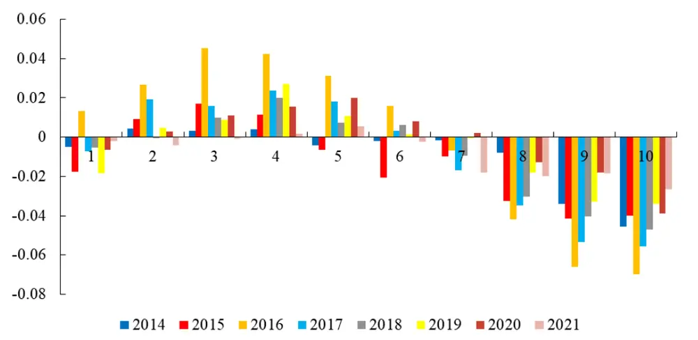
数据来源：Wind、开源证券研究所

图 28 给出了这些因子的 Rank IC，横轴表示不同分组的累计涨跌幅因子，纵轴为相应因子的RankIC 值。观察在单笔金额分组下，累计涨跌幅因子的RankIC 在不同年份的变化，我们得到三点信息：

（1）单笔成交金额最高组对应的累计涨跌幅因子的反转效应最强。随着单笔成交金额逐渐降低，反转效应逐渐减弱，动量效应增加；

（2）单笔成交金额较低组（也即图28中的1、2组）对应的累计涨跌幅因子的选股能力并不显著，在累计涨跌幅因子中属于“噪音”的成分；

（3）从近年的IC变化来看，累计涨跌幅因子的Alpha有减弱的趋势，仅“强反转”逻辑能够部分抵御因子失效的风险。

在分钟级别上，“单笔成交金额越高，反转强度越大”这个命题依旧成立，但在单笔成交金额较低的一端，实证结果已经不再支持。基于上述分析，我们在理想反转因子的基础上定义强反转因子（SR因子），计算方法如表12所示：

表12：强反转因子（SR）构造步骤

| 序号 | 计算说明 |
| --- | --- |
| 步骤1 | 回溯过去20个交易日内每分钟的涨跌幅和单笔成交金额； |
| 步骤2 | 将全部分钟涨跌幅按照单笔成交金额由大到小排序； |
| 步骤3 | 选取单笔成交金额前λ比例的涨跌幅加总，即为SR因子； |

资料来源：开源证券研究所

引入参数λ的目的在于确定强反转因子的最优切割比例。经过我们测试，当λ 取值较低时，SR因子的多空对冲更稳定，如图 29所示。随着参数λ逐渐增大，累计涨跌幅的信噪比逐渐减低，因子多空净值也出现较为明显的回撤。

图29：在较低的切割比例下，SR因子的多空表现更稳健
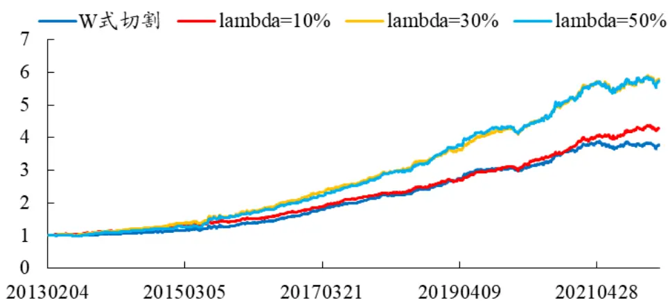
数据来源：Wind、开源证券研究所，测试区间为 20130204 至 20220408

我们应该保留较大单对应的累计涨跌幅。当λ取 10%时因子多空表现最好，但是多头收益相对较低，而保留 30%的比例，因子的多空最大回撤又会增加。因而权衡来看，20%的保留比例更适合用于构造大单的“强反转”因子。图 30 给出了 SR 因子的多空分组表现。

图30：SR因子分组单调性较好，多头年化收益为 24.19%（lambda=20%）
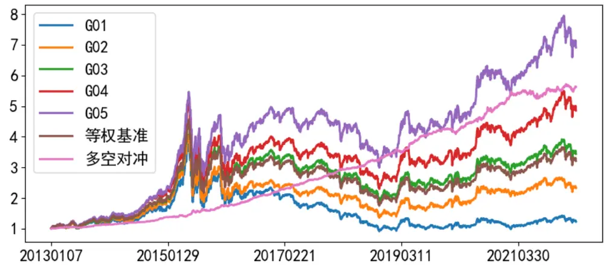
数据来源：Wind、开源证券研究所

表13：SR因子多头选股能力较强，年化收益为 24.19%

| 年化收益 | 最大回撤 | 多头 Alpha | 空头 Alpha | 多空收益 | 多空回撤 | 多空IR | 胜率 |
| --- | --- | --- | --- | --- | --- | --- | --- |
| 24.19% | 50.08% | 8.97% | -10.20% | 21.35% | 5.05% | 3.40 | 83.93% |

数据来源：Wind、开源证券研究所

SR因子相比理想反转因子提供了更多的信息增量。考虑到强反转因子是从理想反转因子的内部结构改进而来，我们测试了二者的相关系数仅有 0.32，并没有预想中的那么高，基于分钟单笔成交金额构造强反转因子并不等同于理想反转因子。

进一步，我们将强反转因子剔除理想反转因子，观察残差因子的多空表现，如图31 所示。在回归掉理想反转因子后，强反转因子的多空年化收益率仍有 12.6%，多空 IR 为 2.76，多头年化收益为 21.39%，持仓胜率为 78.57%。

图31：回归理想反转因子后，强反转因子仍有 6.52%的超额，多空 IR为2.75
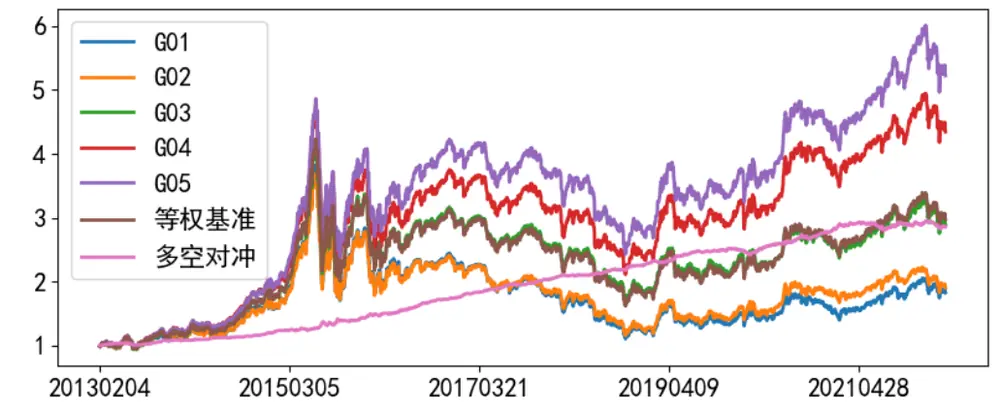
数据来源：Wind、开源证券研究所

综上，反转效应的微观来源是大单成交，在分钟频率上，基于单笔成交金额提纯的反转因子能够有更多的信息增量。

因子相关性方面，图32和图33分别展示了SR因子与交易行为因子和Barra风格因子的相关性。整体上看，SR 因子 Alpha 相对独立，与流动性因子关联度较高。

图32：SR因子与理想反转因子相关性一般
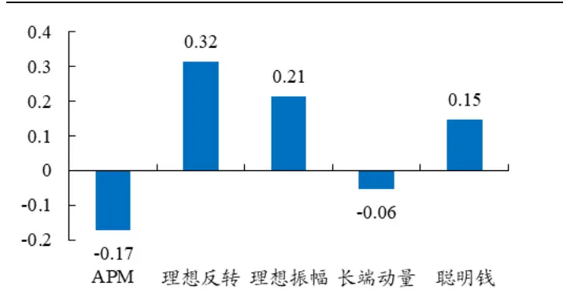
数据来源：Wind、开源证券研究所

图33：SR因子与Barra风格因子相关性较低
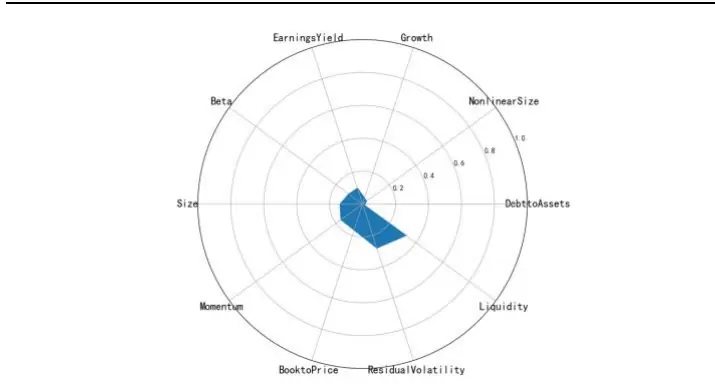
数据来源：Wind、开源证券研究所

剔除 Barra 风格因子后，SR 因子的多空收益仍有 9.16%，其中多头 Alpha 仍然有 5.6%的收益，空头端的因子单调性有所减弱。

图34：Barra风格中性化后，SR因子仍具备一定的选股能力
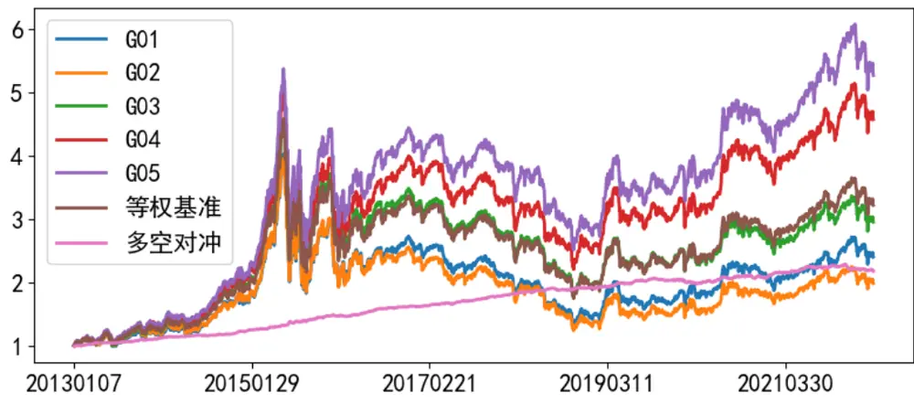
数据来源：Wind、开源证券研究所

## 2、 因子实践：从因子到组合的具现

分钟单笔成交数据构造的高频因子，具备稳健IC和空头收益，可以为多因子组合提供超额收益信息。考虑到投资者更关注因子在实际投资中的表现，我们选取了因子分域、赛道股优选两个应用维度，测试上述因子的实践效果。

## 2.1、 不同选股域下的选股效果：在小市值股票池上表现更优

考虑到 QUA 因子、MTS 因子、MTE 因子以及 SR 因子的相关性较低，我们将上述因子等权合成，分别在沪深 300、中证500等宽基指数上测试合成因子表现，如图 35、图36和图37 所示。交易费用设为千分之五，持仓周期为 20个交易日。

图35：中证1000成分股优选：超额年化 12.01%
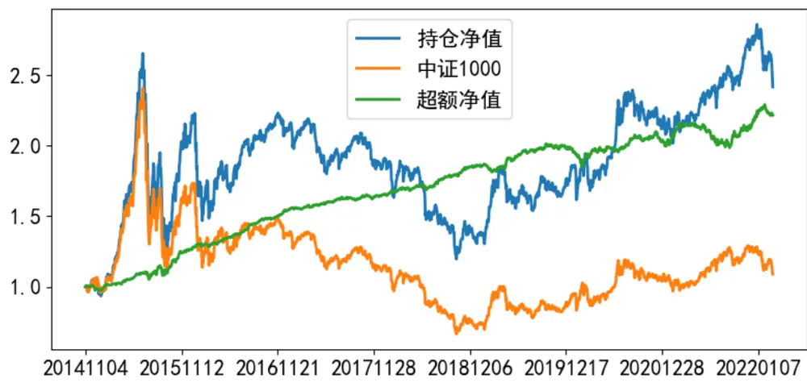
数据来源：Wind、开源证券研究所，组合股票数量为 200 只

与一般的价量因子相似，上述因子在小市值股票池上表现更优，在中证1000成分中表现最好，年化超额收益率达到12.01%，回撤幅度较小；因子在中证 500 和沪深 300成分中的选股效果整体偏弱，超额收益分别为3.72%和1.13%。

图36：中证500成分股优选：超额年化 3.72%
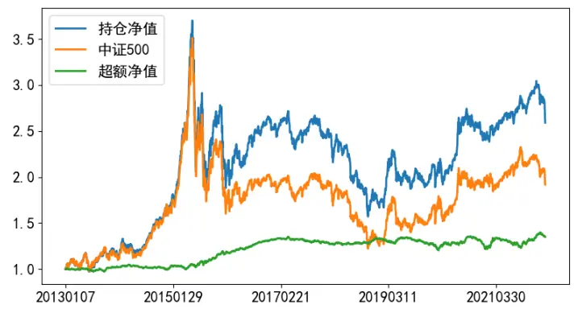
数据来源：Wind、开源证券研究所，组合股票数量为 100 只

图37：沪深 300成分股优选：超额年化 1.13%
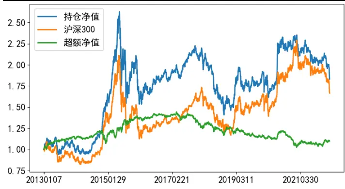
数据来源：Wind、开源证券研究所，组合股票数量为 50 只

换手率方面，等权因子在中证 1000、中证 500 和沪深 300 上的优选组合，双边换手率分别为 56.7%、60.4%和 57.15%。

## 2.2、 赛道股优选组合：汽车、传媒、机械设备等板块表现较好

单笔成交金额与市场投资者的交易情绪息息相关，在特定类型的选股域上表现可能会更好。因此，我们继续测试因子在不同赛道上的选股效果，选取机械设备等行业指数的成分股作为选股域，因子事先经过行业和市值中性化处理，交易费用及持仓周期同上一小节。

图38：环保、食品饮料、传媒的RankIC位于前三
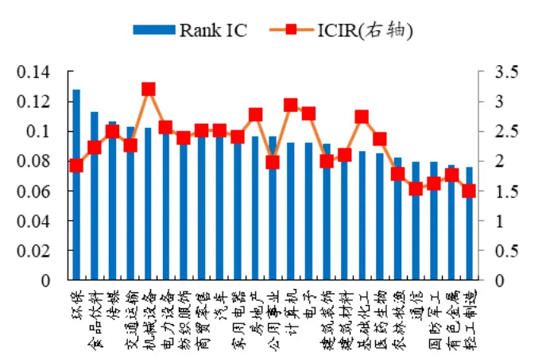
数据来源：Wind、开源证券研究所

图39：优选组合的股票数量在行业赛道内占比约 1/5
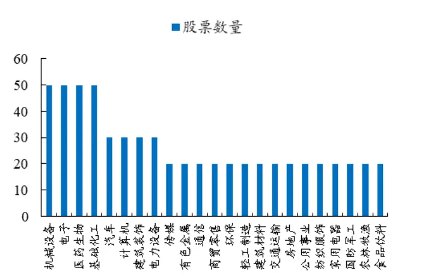
数据来源：Wind、开源证券研究所

图 38 展示了等权因子在不同行业赛道上的 Rank IC，可以看到，等权因子在各个行业内的分组能力都比较强。我们分别在不同的行业赛道上构造优选组合（持股数量见图 39），图40 给出了各行业优选组合的年化超额收益率。

图40：等权合成因子在汽车、传媒、机械设备等赛道表现较好
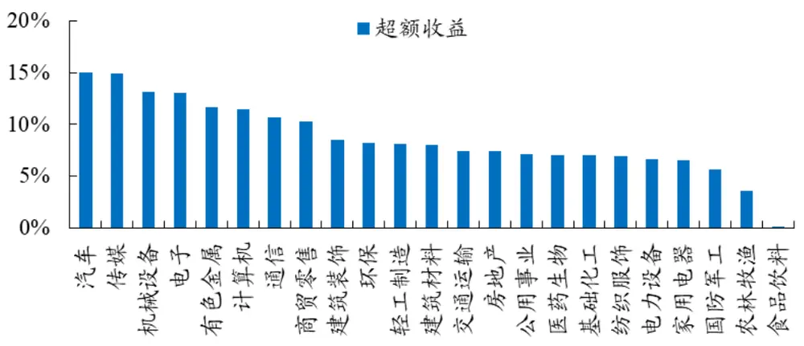
数据来源：Wind、开源证券研究所

图 41至图43展示了机械设备、电子和计算机优选组合的表现。机械50组合的年化收益为 19.35%，超额收益达到 13.14%；电子50组合的年化收益为28.73%，超额收益为 13.03%；计算机30组合的年化收益为25.22%，超额收益达到 11.5%。

图41：机械50组合：年化收益为 19.35%
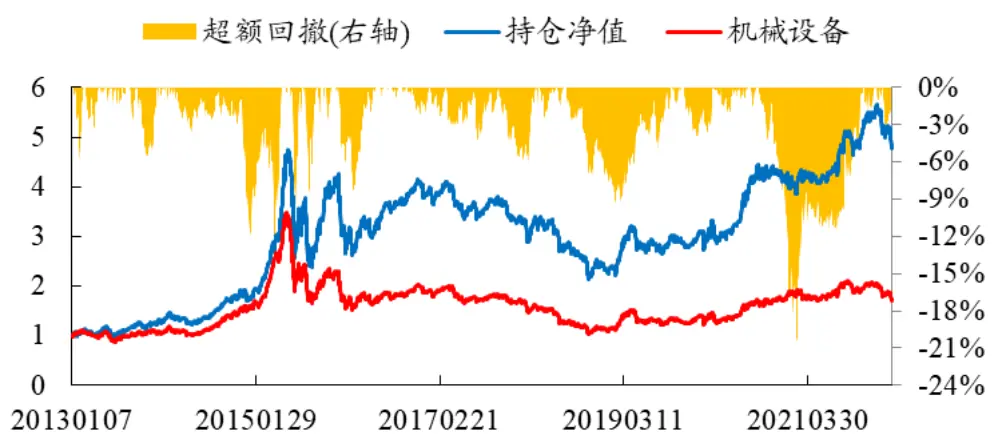
数据来源：Wind、开源证券研究所

图42：电子50组合：年化收益为 28.73%
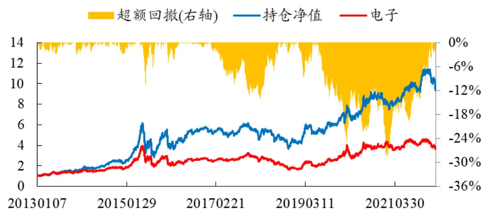
数据来源：Wind、开源证券研究所

图43：计算机30组合：年化收益为 25.22%
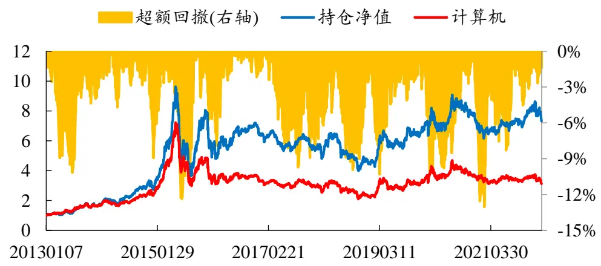
数据来源：Wind、开源证券研究所

## 3、 附录

## 3.1、 标准差（STD）因子的构造方法

我们从变量的离散程度观察单笔成交金额分布。在统计上，常用标准差作为衡量变量偏离重心的定量指标，本文第一小节介绍了分组构造因子方法，以及在不同分组下标准差因子的表现。

表14：保留参数为10%的 STD因子表现最好

| 由小到大 | lambda=10% | lambda=20% | lambda=30% | lambda=40% |
| --- | --- | --- | --- | --- |
| 年化收益 | 22.84% | 22.43% | 21.81% | 21.38% |
| 年化波动 | 26.77% | 26.70% | 26.63% | 26.58% |
| 最大回撤 | 52.26% | 52.17% | 52.52% | 53.08% |
| 下行波动 | 23.54% | 23.41% | 23.30% | 23.24% |
| 基准收益 | 12.47% | 12.47% | 12.47% | 12.47% |
| 基准波动 | 28.62% | 28.62% | 28.62% | 28.62% |
| 多头 Alpha | 9.22% | 8.85% | 8.30% | 7.92% |
| 空头 Alpha | -13.97% | -13.37% | -12.63% | -11.72% |
| 多空收益 | 26.96% | 25.66% | 23.95% | 22.25% |
| 多空最大回撤 | 9.11% | 8.90% | 9.45% | 9.07% |
| 多空IR | 3.235 | 3.087 | 2.930 | 2.767 |
| 胜率 | 75.00% | 75.89% | 73.21% | 75.00% |
| 日胜率 | 55.94% | 55.58% | 55.31% | 54.34% |
| 盈亏比 | 1.125 | 1.123 | 1.119 | 1.116 |
| Rank IC | -0.065 | -0.063 | -0.061 | -0.057 |
| Rank ICIR | 3.305 | 3.253 | 3.161 | 3.058 |

数据来源：Wind、开源证券研究所

表 14 展示了各组因子的多空对冲效果，在单笔金额较小的组（前 10%），因子多头年化收益能够达到 22.8%，多空 IR为 3.23，单笔成交金额较小的一端的离散程度更有信息含量。因此，我们构造标准差STD因子，计算步骤如表 15所示：

表15：标准差（STD）因子构造步骤

| 序号 | 计算说明 |
| --- | --- |
| 步骤1 | 选定股票，逐个交易日回顾分钟单笔成交金额序列； |
| 步骤2 | 保留10%单笔成交金额较小的样本计算标准差，记作D指标； |
| 步骤3 | 计算 D 指标的 20 日均值，即为 STD 因子 |

资料来源：开源证券研究所

## 3.2、 偏度与峰度因子的构造方法

从概率分布的形态来看，我们用偏度和峰度来描述单笔成交金额分布。同样的方法测试最优参数，分别观察因子在不同参数下的分组多空表现，图 44 和图 45 分别为偏度和峰度因子的 RankICIR，两类因子在单笔成交金额较低组更稳定。

图44：偏度因子最优参数为 50%（数值为 RankICIR）
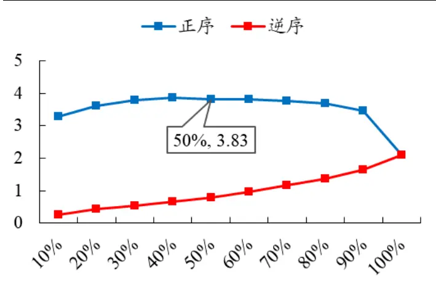
数据来源：Wind、开源证券研究所，ICIR取绝对值大小

图45：峰度因子最优参数为50%（数值为 RankICIR）
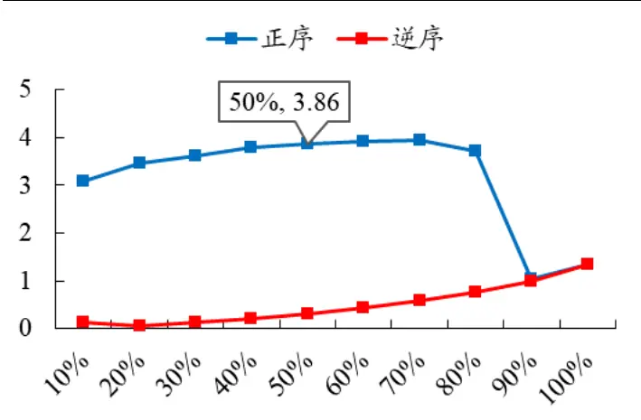
数据来源：Wind、开源证券研究所，ICIR取绝对值大小

综合上图得到的结论是，比较单笔金额的大小，应选择单笔金额小的样本构造偏度和峰度因子。为了避免参数敏感，我们将切割比例设为50%，计算步骤如下：

表16：偏度（SKEW）、峰度（KURT）因子构造步骤

| 序号 | 计算说明 |
| --- | --- |
| 步骤1 | 选定股票，逐个交易日回顾分钟单笔成交金额序列； |
| 步骤2 | 保留50%单笔成交金额较小的样本计算偏度和峰度，记为S指标和K指标； |
| 步骤3 | 分别计算 S 指标和K指标的 20 日均值，即 SKEW 因子和KURT 因子 |

资料来源：开源证券研究所

## 4、 风险提示

模型基于历史数据测试，未来市场可能发生变化。

## 特别声明

《证券期货投资者适当性管理办法》、《证券经营机构投资者适当性管理实施指引（试行）》已于2017年7月1日起正式实施。根据上述规定，开源证券评定此研报的风险等级为R3（中风险），因此通过公共平台推送的研报其适用的投资者类别仅限定为专业投资者及风险承受能力为C3、C4、C5的普通投资者。若您并非专业投资者及风险承受能力为C3、C4、C5的普通投资者，请取消阅读，请勿收藏、接收或使用本研报中的任何信息。

因此受限于访问权限的设置，若给您造成不便，烦请见谅！感谢您给予的理解与配合。

## 分析师承诺

负责准备本报告以及撰写本报告的所有研究分析师或工作人员在此保证，本研究报告中关于任何发行商或证券所发表的观点均如实反映分析人员的个人观点。负责准备本报告的分析师获取报酬的评判因素包括研究的质量和准确性、客户的反馈、竞争性因素以及开源证券股份有限公司的整体收益。所有研究分析师或工作人员保证他们报酬的任何一部分不曾与，不与，也将不会与本报告中具体的推荐意见或观点有直接或间接的联系。

## 股票投资评级说明

|  | 评级 | 说明 |
| --- | --- | --- |
| 证券评级 | 买入（Buy） | 预计相对强于市场表现20%以上； |
|  | 增持（outperform） | 预计相对强于市场表现5%～20%; |
|  | 中性（Neutral） | 预计相对市场表现在—5%～+5%之间波动； |
|  | 减持 | 预计相对弱于市场表现5%以下。 |
| 行业评级 | 看好（overweight） | 预计行业超越整体市场表现； |
|  | 中性（Neutral） | 预计行业与整体市场表现基本持平； |
|  | 看淡 | 预计行业弱于整体市场表现。 |
| 备注：评级标准为以报告日后的6~12个月内，证券相对于市场基准指数的涨跌幅表现，其中A股基准指数为沪深300指数、港股基准指数为恒生指数、新三板基准指数为三板成指（针对协议转让标的）或三板做市指数（针对做市转让标的)、美股基准指数为标普500或纳斯达克综合指数。我们在此提醒您，不同证券研究机构采用不同的评级术语及评级标准。我们采用的是相对评级体系，表示投资的相对比重建议；投资者买入或者卖出证券的决定取决于个人的实际情况，比如当前的持仓结构以及其他需要考虑的因素。投资者应阅读整篇报告，以获取比较完整的观点与信息，不应仅仅依靠投资评级来推断结论。 |  |  |

## 分析、估值方法的局限性说明

本报告所包含的分析基于各种假设，不同假设可能导致分析结果出现重大不同。本报告采用的各种估值方法及模型均有其局限性，估值结果不保证所涉及证券能够在该价格交易。

## 法律声明

开源证券股份有限公司是经中国证监会批准设立的证券经营机构，已具备证券投资咨询业务资格。

本报告仅供开源证券股份有限公司（以下简称“本公司”）的机构或个人客户（以下简称“客户”）使用。本公司不会因接收人收到本报告而视其为客户。本报告是发送给开源证券客户的，属于机密材料，只有开源证券客户才能参考或使用，如接收人并非开源证券客户，请及时退回并删除。

本报告是基于本公司认为可靠的已公开信息，但本公司不保证该等信息的准确性或完整性。本报告所载的资料、工具、意见及推测只提供给客户作参考之用，并非作为或被视为出售或购买证券或其他金融工具的邀请或向人做出邀请。本报告所载的资料、意见及推测仅反映本公司于发布本报告当日的判断，本报告所指的证券或投资标的的价格、价值及投资收入可能会波动。在不同时期，本公司可发出与本报告所载资料、意见及推测不一致的报告。客户应当考虑到本公司可能存在可能影响本报告客观性的利益冲突，不应视本报告为做出投资决策的唯一因素。本报告中所指的投资及服务可能不适合个别客户，不构成客户私人咨询建议。本公司未确保本报告充分考虑到个别客户特殊的投资目标、财务状况或需要。本公司建议客户应考虑本报告的任何意见或建议是否符合其特定状况，以及（若有必要）咨询独立投资顾问。在任何情况下，本报告中的信息或所表述的意见并不构成对任何人的投资建议。在任何情况下，本公司不对任何人因使用本报告中的任何内容所引致的任何损失负任何责任。若本报告的接收人非本公司的客户，应在基于本报告做出任何投资决定或就本报告要求任何解释前咨询独立投资顾问。

本报告可能附带其它网站的地址或超级链接，对于可能涉及的开源证券网站以外的地址或超级链接，开源证券不对其内容负责。本报告提供这些地址或超级链接的目的纯粹是为了客户使用方便，链接网站的内容不构成本报告的任何部分，客户需自行承担浏览这些网站的费用或风险。

开源证券在法律允许的情况下可参与、投资或持有本报告涉及的证券或进行证券交易，或向本报告涉及的公司提供或争取提供包括投资银行业务在内的服务或业务支持。开源证券可能与本报告涉及的公司之间存在业务关系，并无需事先或在获得业务关系后通知客户。

本报告的版权归本公司所有。本公司对本报告保留一切权利。除非另有书面显示，否则本报告中的所有材料的版权均属本公司。未经本公司事先书面授权，本报告的任何部分均不得以任何方式制作任何形式的拷贝、复印件或复制品，或再次分发给任何其他人，或以任何侵犯本公司版权的其他方式使用。所有本报告中使用的商标、服务标记及标记均为本公司的商标、服务标记及标记。

## 开源证券研究所

地址：上海市浦东新区世纪大道1788号陆家嘴金控广场1号
楼10层
邮编：200120
邮箱：research@kysec.cn
北京
地址：北京市西城区西直门外大街18号金贸大厦C2座16层
邮编：100044
邮箱：research@kysec.cn
地址：深圳市福田区金田路2030号卓越世纪中心1号
楼45层
邮编：518000
邮箱：research@kysec.cn
西安
地址：西安市高新区锦业路1号都市之门B座5层
邮编：710065
邮箱：research@kysec.cn