2022 年 09 月 04 日

## 金融工程研究团队

魏建榕（首席分析师）

证书编号：S0790519120001

张 翔（分析师）

证书编号：S0790520110001

傅开波（分析师）

证书编号：S0790520090003

## 高 鹏（分析师）

证书编号：S0790520090002

## 苏俊豪（分析师）

证书编号：S0790522020001

## 胡亮勇（分析师）

证书编号：S0790522030001

## 王志豪（分析师）

证书编号：S0790522070003

## 盛少成（研究员）

证书编号：S0790121070009

## 苏 良（研究员）

证书编号：S079012107000

## 相关研究报告

《高频因子：分钟单笔金额序列中的主力行为刻画--市场微观结构研究系列》-2022.6.12

《新型因子：资金流动力学与散户羊群效应--市场微观结构研究系列》-2022.6.2

《理想反转因子的 4 年总结：依旧理想--市场微观结构研究系列》-2022.5.2

# 大小单重定标与资金流因子改进

# ——市场微观结构研究系列（16）

## 魏建榕（分析师）

苏良（联系人）

weijianrong@kysec.cn

证书编号：S0790519120001

suliang@kysec.cn

证书编号：S0790121070008

## 资金流因子的两个关键点：识别与修正

大、小单重定标：逐笔数据包含每笔订单的挂单金额、挂单数量等信息，可用以还原成交订单的挂单信息。我们利用逐笔数据，通过设定 44 个金额阈值重新划定深市的大、小单来捕捉资金流中的主力行为信息。

MOD修正法：从资金流动力学的角度理解，大单资金流与涨跌幅呈正相关缘自主力资金买卖的不平衡，本文选取买入卖出金额比作为代理变量（IMB），通过截面回归的方法，剥离反转因素的影响以提纯资金流的 Alpha 信息。NIR_MOD因子相比NIR因子选股能力明显提升，IR由 2.63提升至 4.76。

## 资金流的微观结构分解：小单提供流动性支持

（1）我们测试不同金额阈值下NIR_MOD 因子的选股表现，结果表明：随着划分大单的金额阈值降低，因子的有效性逐渐减弱，最优的划分阈值并非是 20 万元，而是更小，例如2万元。低阈值下，NIR_MOD因子在十分组下的多空对冲收益由26.13%提升至32.16%，而多空净值的回撤幅度进一步减小至 6.02%。

（2）区分大单和小单的Alpha，本文分别测试大单NIR_MOD 和小单NIR_MOD的表现，大单的多空收益可以达到年化25%以上，相比小单收益多出 4%左右，资金流的Alpha更多来源自主力资金的信息优势而不是小单流动性映射。

（3）主动与非主动标签并未贡献明显的增量信息。依据逐笔数据的 Type、Side等字段划定主动与非主动交易，我们测试后发现基于主动买卖数据构造的大单NIR_MOD因子选股效果并未获得改进。

## 分域测试：小票表现更好，大票主力划定阈值较高

在大票为主的沪深300和中证 500指数成分股中，主力资金的最优划分阈值是不明确的，并且划分金额相对更高，而在中证 1000 以及全市场范围内因子的有效性曲线会更“光滑”。笔者认为这可能与机构拆单行为有关：

（1）机构在大票上交易更多。根据最新的公募持仓明细，截止 20220630，公募在中证 800 上的持仓集中度达到了 78.27%；

（2）小票上的委托单拆分金额更小。由于小票的流动性不足，主力资金通常会把大额的委托单拆得更细，而在大票上拆分的颗粒度则会更大一些。

## 基于大、小单重标结论的资金流因子改进

由参数敏感性测试得知，基于小金额标准（例如，2万元）识别的主力资金因子表现更好，仅在深市范围内测试，低阈值的 NIR_MOD 因子多头年化收益达到31.4%，多空 IR 为 4.61，多空净值的整体回撤幅度较小，仅为 3.28%。

为了更便捷地利用上述结论，我们将Wind的超大单、大单和中单合并，定义为有定价权的“广义主力资金”，进而在NIR_MOD的基础上构造CNIR因子。

在全市场上，CNIR因子的多头年化收益率达到 27.86%，IR也提升至 4.91；从分域测试效果来看，因子在中证 1000上表现要优于沪深 300 和中证500。

- 风险提示：模型基于历史数据统计，未来市场可能发生变化。

如何高效率识别市场上的交易主体？围绕该问题我们曾展开多方位的探索：

从交易行为的维度，我们针对单笔成交金额从分布特征、时序相关性、反转效应三个方面出发，提炼有效的价量因子。例如，我们从“相对大单”中挖掘QUA 因子，其选股逻辑来自主力资金的关注度差异：关注度越高，未来股价表现越好。详情参考：《高频因子：分钟单笔金额序列中的主力行为刻画》，2022-06-12。

从另类数据的维度，低频股东户数变化因子具有选股能力，而互动易平台实时披露的数据是定期报告披露的有益补充。我们纳入高频股东数据的合成股东变化因子具有收益增强的能力，但增益幅度与所选取的股票池相关。详情参考：《高频股东数据的隐含信息量》，2020-12-31。

从资金流向的维度，大单资金往往呈现正向Alpha能力，其源自大单资金的“预见性”。我们通过分析资金流与同期涨跌幅的关系发现，大单资金流强度与同期涨跌幅呈正相关关系，剥离掉涨跌幅因素后因子选股效果有显著提升。详情参考：《大单与小单资金流的 alpha 能力》，2021-06-02。

本文尝试利用逐笔数据重新划分买卖委托单，识别出真正具有显著选股能力的主力资金，主要内容为三部分：一是介绍资金流的处理方法，如何捕捉纯净的主力资金交易行为？二是拆分资金流的内部微观结构，探寻资金流因子的生效逻辑；三是改进资金流因子并测试其选股效果，因子经过改进后Alpha 收益显著提升。

## 1、 资金流因子的两个关键点：识别与修正

## 1.1、 大、小单的重定标：绝对金额法与相对金额法

上交所和深交所在 2013 年推出的 Level-2 行情数据包含了个股每笔成交的详细信息，通过分析每笔订单的委托价格和数量，揣摩背后投资人的交易意图，我们可以从中挖掘出有效的Alpha信息。

例如，委托单的挂单金额大小在一定程度上反映了投资人的资金实力，而大额委托单的背后对应着的是资金实力更强的投资者，往往具备更多的信息优势从而能够在股市的博弈中占据主导地位，即所谓的“大单投资者”或“主力资金”。

市场上关于资金流向策略的研究大多基于绝对金额的划分标准，即所有的成交委托单根据挂单金额划分为四类：超大单、大单、中单和小单。

（1）超大单：挂单金额大于100万元，定义为“机构”；

（2）大单：挂单金额介于 20万元至100 万元之间，定义为“主力”；

（3）中单：挂单金额介于 4 万元至 20 万元之间，定义为“大户”；

（4）小单：挂单金额小于 4 万元，定义为“散户”。

常规的划分标准应用并不表示其合理性，我们最早在探索逐笔数据信息时发现了其中存在的问题，在该划分体系下的资金流向数据主要有两点缺陷：

（1）划分阈值不合理。该标准共设立了三个阈值，分别为 4 万元、20 万元及100 万元。结合挂单金额金字塔（图 1）不难看出，“散户”的挂单金额上限实际可能会比 4万元更少，而部分股票缺少超大单成交并不能说明机构没有参与交易，有可能是采取了拆单等更为隐蔽的交易方式；

（2）划分体系过于复杂。四种类型委托单的划分方法既不能帮助我们识别出所有交易主体，也不能明确各自所代表的不同对象，容易让人陷入到诸如“某类委托单是否属于机构行为”的无意义论证当中，失去了特征识别模型的简洁和优雅。

图1：挂单金额金字塔与分位值变化趋势：小幅变动，整体相对稳定
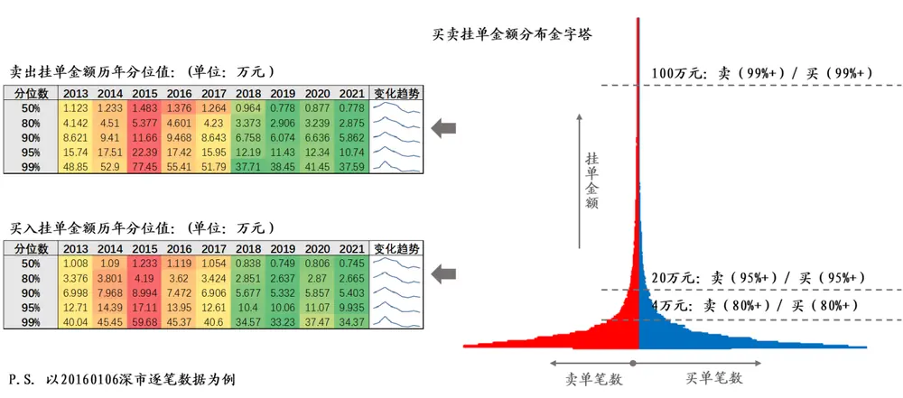
数据来源：Wind、开源证券研究所

挂单金额金字塔：我们统计了每个交易日在不同挂单金额的买、卖单数量，如图 1 右侧所示。横轴的双侧箭头分别表示卖单笔数和买单笔数，纵轴则表示挂单金额的大小。从形状上来看这比较像是一个畸形的金字塔，底座部分极宽（通常右侧买单会更宽一些），顶部则十分的狭长。统计结论是，大部分订单的挂单金额离4万元都很遥远，中位数大概在 1 万元，而 4 万元在 80%分位以上，挂单金额在 100 万元以上的超大单则更是稀少。

根据逐笔数据重新定义大、小单资金是否可行？

逐笔数据中包含了每笔订单的挂单金额、挂单数量等信息，可以还原所有成交订单的挂单信息。目前，划分大、小单的方法主要有两类：绝对金额法与相对金额法。绝对金额法设定某个金额阈值作为统一标准，适用于全市场的所有股票，而相对金额法则是针对不同股票分别设定各自适用的分立标准。

两种方法各有优缺点，我们考虑到相对金额法会面临更多的质疑，例如，同一交易者在两只股票上挂相同金额的订单，仅因为这两只股票价格的高低而将两笔订单视作不同类型的交易者行为，这显然是不合理的。因此，本文以绝对金额方法的思路对Wind 的划分标准进行改进，引入阈值参数λ来划分大单和小单，挂单金额大于λ万元的视为大单，相反则是以非机构交易者为代表的小单。

重新标定大、小单资金流的步骤如图2所示。在得到每笔订单的划分结果后，我们去统计每个交易日的资金流向数据。

图2：重新标定大、小单资金流的示意图
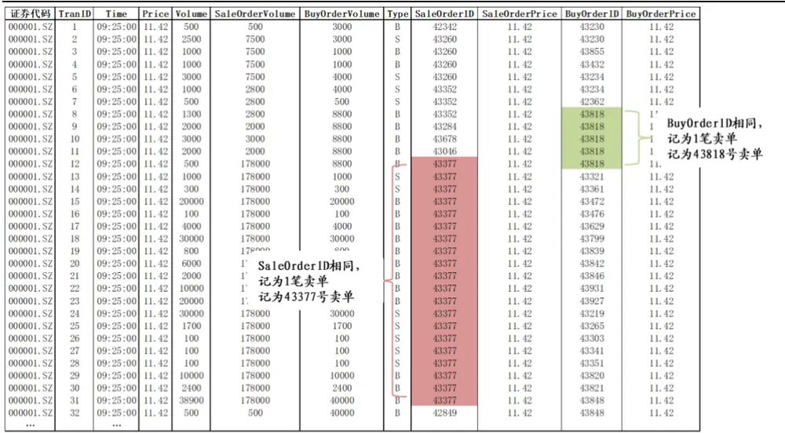
第一步：按照订单编号，分别统计每笔买单和卖单的挂单金额；(43377号买单挂单金额=178000×11.42；43818号买单挂单金额为8800×11.42)第二步：根据阈值λ将不同挂单金额的买（卖）单划分为大单和小单；第三步：统计每个交易日内大单和小单各自的成交金额等。
数据来源：Wind、开源证券研究所

由于上交所的逐笔数据并未包含委托信息，下述统计将重新划定大、小单资金的范围设为深市的股票。同时，为了方便确定最佳的大、小单划分阈值，我们根据金字塔结构特征“由低到高、先密后疏”地选定了0.5、0.6 至90、100万元等44个候选值，图 3 和图4为不同挂单金额下的累计成交占比和数据覆盖情况。

图3：不同阈值的累计成交金额分布较为均衡
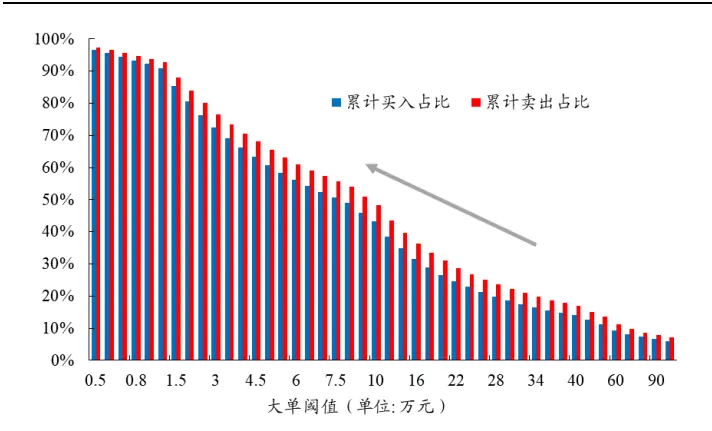
数据来源：Wind、开源证券研究所

图4：沪深 300的数据覆盖度最高、中证 500次之
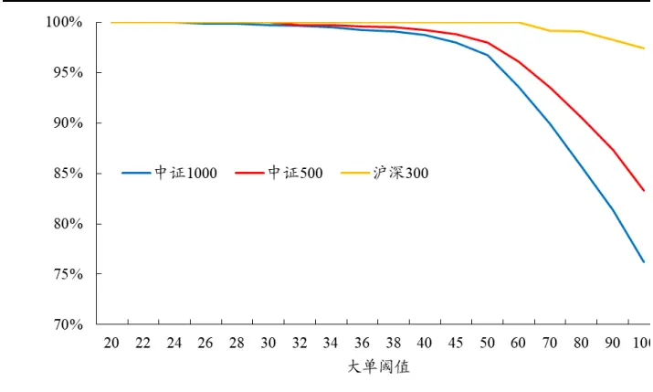
数据来源：Wind、开源证券研究所

从图 3来看，基于 44个阈值划分的金额区间，成交金额整体来说分布算是比较平均的，对于我们划定主力资金的范围而言会更加合理一些。在覆盖度方面，大单由于中证 1000 相比于沪深 300 的交易活跃度更低，部分大单（100 万元以上）的成交金额数据并不存在，导致覆盖度会整体偏低。

## 1.2、 资金流与涨跌幅的相关性处理：MOD修正法

股票的资金流向反映了微观供求信息，投资者根据这一信息能够对个股的市场关注及偏好程度有一定程度的了解，从而对投资决策的制定提供帮助。以大单资金流向为例，资金量越大的投资者具备越多信息优势，交易股票获利的概率更大。大单资金流因子则是捕捉聪明资金的交易行为信息的有效工具，下列大单资金流因子均来自Wind 的 AShareMoneyFlow，定义方式如表 1 所示。

表1：大单资金流因子常见的几种定义方式

| 因子代码 | 因子简称 | 计算公式 |
| --- | --- | --- |
| Net_Inflow (NI) | $\sum_{i}^{N}(B_{i}-S_{i})$ 净流入 |  |
|  | 其中， $B_{i}\notin S_{i}$ 分别表示大单资金在交易日i的买入金额和卖出金额。 |  |
| Net_Inflow_Ratio (NIR) | 净流入率 | ${\sum_{i}^{N}}(B_{i}-S_{i}){\Big/}{\sum_{i}^{N}}(B_{i}+S_{i})$ |
| Net_Inflow_PCT (NIPCT) | ${\sum_{i}^{N}(B_{i}-S_{i})\mathord{\left/{\vphantom{\sum_{i}^{N}(B_{i}-S_{i})\int MV_{Free}\ Float}}\right.\kern-delimiterspace}}$ 净流入占比 $MV_{Free\ Float}$ 为股票的流通市值。 | 其中， |
| Net_Inflow_ACT (NI_ACT) | $\sum_{i}^{N}B_{ACT,i}-S_{ACT,i}$ 主动净流入 其中， $B_{ACT,i}\mathcal{\dot{\bar{\pi}}}S_{ACT,i}$ 分别表示大单资金在交易日i的主动买入金额和主动卖出金额。 |  |
| Net_Inflow_Ratio_ACT (NIR_ACT) | 主动净流入率 | ${\sum}_{i}^{N}\bigl(B_{ACT,i}-S_{ACT,i}\bigr)\Bigl/{\sum}_{i}^{N}\bigl(B_{ACT,i}+S_{ACT,i}\bigr)$ |
| Net Inflow PCT ACT (NIPCT_ACT) | ${\sum}_{i}^{N}\big(B_{ACT,i}-S_{ACT,i}\big)/MV_{Free\ Float}$ 主动净流入占比 |  |

资料来源：开源证券研究所，注：回溯窗口 N通常设为 20个交易日

我们先来观察这些资金流因子在全市场范围内的选股表现，设置如图 5所示。

图5：大单资金流因子具备较为稳定的选股能力

| 测试指标 | NI NIR NIPCT NI_ACT NIR_ACT NIPCT_ACT |  |  |  |  |  |  |  |  |  |  |
| --- | --- | --- | --- | --- | --- | --- | --- | --- | --- | --- | --- |
| Rank ICRank ICIR多空IR | 0.056 | 0.029 | 0.051 | 0.044 | 0.016 | 0.039 |  |  |  |  |  |
|  | 2.712 | 2.093 | 2.250 | 2.180 | 1.102 | 1.756 |  |  |  |  |  |
|  | 2.764 | 2.631 | 2.830 | 2.144 | 1.245 | 2.315 |  |  |  |  |  |
| 多空收益多空最大回撤胜率 | 22.67% | 12.39% | 22.86% | 16.85% | 6.44% | 17.70% |  |  |  |  |  |
|  | 最大回撤 |  |  |  | -8.81% | -4.18% | -8.60% | -10.11% | -9.33% | -8.49% |  |
|  | 64.29% | 74.11% | 72.32% | 58.04% | 64.29% | 65.18% |  |  |  |  |  |
| 年份 | 多空收益-分年度 |  |  |  |  |  |  |  |  |  |  |
| 201320142015201620172018201920202021 | 13.33% | 7.25% | 9.88% | 3.78% | 0.12% | 3.04% |  |  |  |  |  |
|  |  | 25.36% | 12.90% | 25.33% | 20.97% | 9.76% | 18.66% |  |  |  |  |
|  |  | 33.98% | 20.19% | 33.40% | 18.14% | 2.22% | 19.07% |  |  |  |  |
|  | 37.83% | 23.78% | 34.00% | 29.15% | 12.05% | 26.01% |  |  |  |  |  |
|  | 25.89% | 6.97% | 26.84% | 16.70% | 0.09% | 19.42% |  |  |  |  |  |
|  | 22.27% | 4.41% | 20.10% | 19.75% | 2.54% | 20.14% |  |  |  |  |  |
|  |  |  |  |  |  | 17.12% | 8.92% | 20.49% | 13.48% | 6.31% | 18.37% |
|  | 19.24% | 17.45% | 23.46% | 22.47% | 17.31% | 24.08% |  |  |  |  |  |
|  | 21.38% | 15.33% | 21.51% | 17.95% | 12.75% | 19.33% |  |  |  |  |  |

数据来源：Wind、开源证券研究所

从图中可以看出，基于大单买入金额计算的资金流因子表现较好，NI、NIR、NIPCT 因子 Rank IC 分别为 0.056、0.029 和 0.051，并且三个因子的多空 IR 均能达到2.5 以上，对冲净值回撤幅度小于10%，因子收益较为稳定。基于主动买卖金额计算的大单资金流因子表现整体偏弱一些。

在报告《大单与小单资金流的 alpha 能力》中，我们讨论了资金流因子的 Alpha结构。大单资金流具有正向Alpha，但是内部成分并不单纯。整体可分为正、负两部分，正向Alpha部分非常明显，是直接由大单的信息优势带来的，而负向Alpha部分比较隐蔽：大单净流入伴随价格上涨，因此暴露反转因子而获得负向贡献。

笔者认为大单所夹杂的反转因素，从资金流动力学的角度理解其成因，应该是来自于主力资金买卖的不平衡。本着删繁就简的原则，选取大单（小单）的买入卖出金额比作为代理变量，记为IMB指标：

$$
IMB=ln(B/S)
$$

分别统计每日的大单 IMB和小单IMB 与涨跌幅的相关性，如图 6 和图 7 所示。

图6：大单 IMB与涨跌幅呈正相关
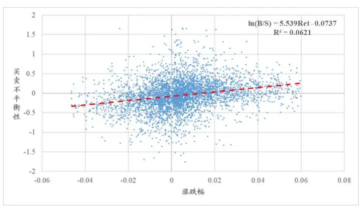
数据来源：Wind、开源证券研究所，测试区间为 20130101-20220311

图7：小单 IMB与涨跌幅呈负相关
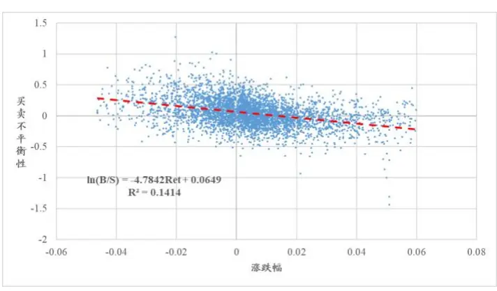
数据来源：Wind、开源证券研究所，测试区间为 20130101-20220311

可以看出，小单与涨跌幅的相关性较高，一部分成因来自于小单承受了大单的交易压力。金额越小的委托单在交易中的定价能力越弱，作为大单的交易对手方，小单净流入所反映的信息相对会更集中一些，因而与涨跌幅的负相关性更高。而大单资金流与涨跌幅存在显著的正相关，这取决于大单的信息优势，解释逻辑为大单净流入金额越多，说明主力资金越看好股票的未来表现。

若是改变观察的窗口参数 N，计算多个交易日的大单 IMB 指标与涨跌幅，再计算二者的秩相关系数，我们可以观察 IMB 与涨跌幅相关性的变化情况。图 8 为统计结果，横轴为计算大单 IMB 指标和涨跌幅的回溯天数，纵轴对应划定大单资金流的金额阈值，颜色越明亮表示 IMB 指标与涨跌幅相关系数越高。

图8：大单 IMB指标与 N日涨跌幅的秩相关系数矩阵：低阈值、短周期相关性更高
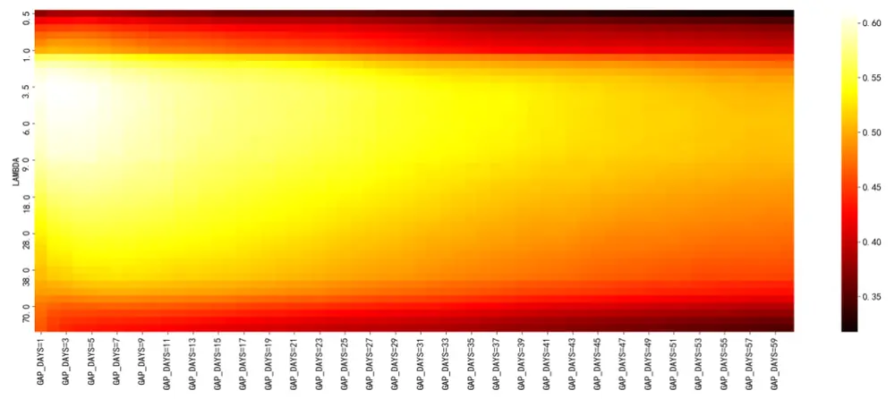
数据来源：Wind、开源证券研究所，测试区间为 20130101-20220311

从图 8 中可以看出，大单的 IMB 指标与涨跌幅，尽管累计了多个交易日的交易信息，二者仍能保持较高正相关，说明主力资金推动价格上涨的逻辑很稳健。而这张图的关键点就在于，最为明亮的区域集中在较短的指标统计周期和较低的大单划分阈值，前者说明主力资金的买卖的信息长期来看更容易隐藏，后者则提示了具有定价权的主力资金可能并非仅是 20 万元以上的大单。

为了方便后续因子构建，我们将每个交易日计算 IMB 指标和涨跌幅，然后利用截面回归的方法，消除 IMB 指标与涨跌幅的相关性影响，从而修正资金流向数据。

以Wind资金流向数据中的大单资金为例，其修正的步骤如下：

（1）统计每个交易日的大单买入和大单卖出的成交金额，记为B和S；

（2）逐个交易日计算下列回归方程，并取残差项ε作为修正系数；

$$
ln(B/S)=\alpha+\beta\times Ret+\varepsilon
$$

其中，Ret为当日涨跌幅。

（3）基于修正系数反算大单买入和大单卖出的比例关系，并重新分配大单买入和卖出的成交金额。

$$
\widehat{B}=\frac{e^{\varepsilon}}{1+e^{\varepsilon}}\times(B+S)
$$

$$
\hat{S}=\frac{1}{1+e^{\varepsilon}}\times\left(B+S\right)
$$

基于上述步骤的修正方法，记为 MOD修正法。基于该方法，我们可以剥离反转因素的干扰，重新测试上述资金流因子，结果如图 9 所示。笔者将原始资金流加以修正后的资金流数据，用以构造的因子代码后附加上 MOD作为区分标识。

图9：修正后资金流因子的选股能力显著提升
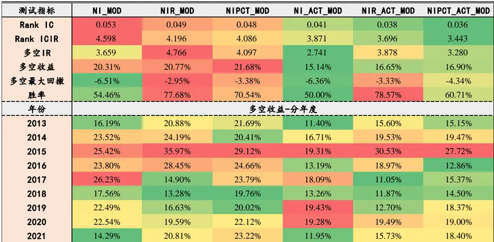
数据来源：Wind、开源证券研究所

从图 9 中可以看到，修正后的 NI_MOD、NIR_MOD 和 NIPCT_MOD 因子相比之前有明显提升，多空 IR 均提升到 3.5 以上，主动买卖资金流因子也有一定程度提升，但整体选股效果依旧不如使用买卖金额构造的资金流因子。

在上述六个资金流因子中，NIR_MOD因子的选股效果最好，故后文的测试都将以净流入率因子的构造形式用于刻画大单资金流的Alpha。为了更好观察因子分组的单调性，我们测试该因子在全市场的十分组的表现，对比标准设为修正前 NIR 因子和修正后NIR_MOD 因子的超额收益（图 10）和多空对冲净值（图 11）。

图10：NIR_MOD因子十分组超额单调性更好
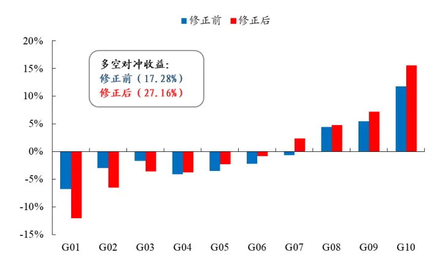
数据来源：Wind、开源证券研究所，测试区间为 20130101-20220311

图11：NIR_MOD因子的多空对冲效果有明显提升
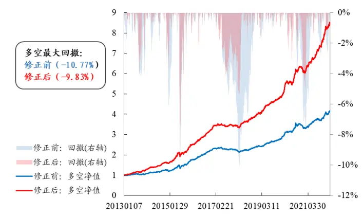
数据来源：Wind、开源证券研究所

图 10 和图 11 展示了 NIR_MOD 因子具有比 NIR 因子更好的单调性，并且多空收益也更高一些，回撤幅度有所降低。修正资金流能够减弱伴随主力资金的价格冲击对因子收益的负面影响，剥离反转效应后，我们能得到更为纯净的资金流因子。若是采用其他资金流的定义方式，笔者测试过 NI 因子和 NIPC 因子的分组效果同样有较大幅度的提升，并且多空对冲收益的回撤幅度显著降低。

## 2、 资金流因子的微观结构

基于资金流的重标数据，我们可进一步探究资金流内部的微观结构。需要事先声明的是，本文所使用的逐笔数据不包括上交所的逐笔委托，无法直接计算每笔委托单的具体挂单金额。为避免数据偏差，本章的测试范围将会集中在于深交所上市的股票池中，我们也曾用沪市的股票样本做过对比，结论差异并不大。

## 2.1、 主力资金的泛定义：20万元的大单标准并非最优

主力资金是指在股票市场中能够影响股市、甚至能够决定股市中个股中长期走势的资金，一般为市场中的机构投资者。若能跟踪市场主力投资动向，则可以获取超越市场的投资回报，那么应该如何定义主力资金？

根据 Wind 的判定标准，挂单金额位于 20 万元以上的资金才被视为主力，但还需要进一步识别其背后所交易主体的行为特征，而这部分资金的定价能力可以通过Alpha因子来捕捉。基于本文第一章中讨论的大单识别标准，笔者利用不同的阈值λ划分得到大、小单的资金流向数据，进而构造资金流因子和测试因子的选股效果。

基于深市逐笔数据计算，资金流因子的参数敏感性测试框架如下：

（1）根据逐笔数据和金额阈值λ划分深市股票的大、小单资金流向数据；

（2）基于 MOD 修正法调整资金流数据，分别计算得到修正后的大单买入额、大单卖出额，小单的处理则类似；

（3）利用计算好的资金流数据，构造大单（小单）的NIR_MOD因子，并测算因子的选股表现。

首先，我们基于大单的资金流向数据，测试 NIR_MOD 因子在全市场的五分组表现，选股的历史区间为20130101 至201220311，暂不考虑交易费用影响。图 12的三张子图分别对应不同阈值下的多空 IR、多空收益以及RankIC。

图12：NIR_MOD因子的参数敏感性测试：最优阈值为2万元
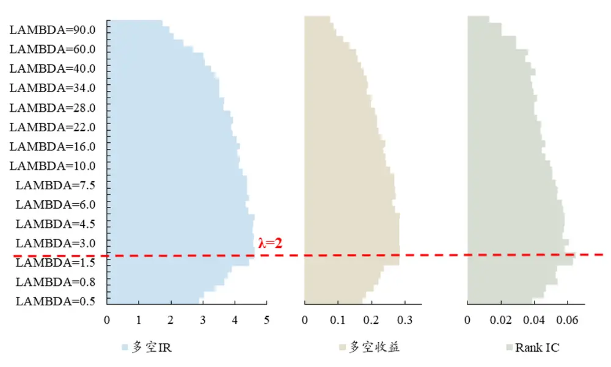
数据来源：Wind、开源证券研究所

经过参数测试我们发现，随着划分大单的金额阈值降低，NIR_MOD因子的有效性在逐渐增强，并且当金额低于10 万元时基本达到峰值，最优的划分阈值并未等于Wind预设的20万元，而是明显要偏低一些（例如，2万元）。

为了对比在20万元和2万元的标准下NIR因子的表现，我们分别测算了这两组资金流的NIR_MOD 因子在全市场的十分组的表现，结果如图 13和图14所示。

图13：NIR_MOD因子在2万元标准下表现更好
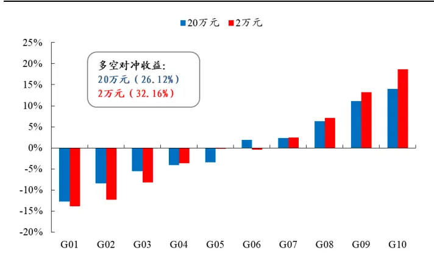
数据来源：Wind、开源证券研究所

图14：多空对冲测试结论同样支持更低的划分阈值
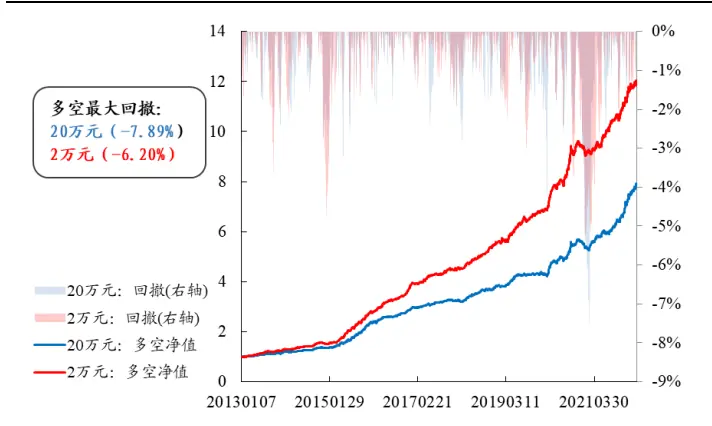
数据来源：Wind、开源证券研究所

从结果我们可以看出，在 20 万元的标准下，NIR_MOD 因子的多空对冲收益为26.13%，多空净值的回撤幅度较小，仅为 7.89%（20201119-20210208），已经具备相对不错的选股能力。而同样是采用资金流修正方法，若是我们把划分主力资金的金额阈值扩展至更低的 2万元标准，NIR_MOD因子则会有更加不错的表现，多空对冲收益提升至 32.16%，提升了6%的水平，并且回撤幅度更小。

因子标准化方式对测试结论的影响不大。进一步，考虑到不同股票的成交情况可能会对结果不同，我们分别测试不同“标准化”方法下的 NIPCT_MOD 因子，以及作为对照组的NI_MOD 因子，结果如图 13和图 14所示。

图15：NI因子：最优阈值为2.5万元
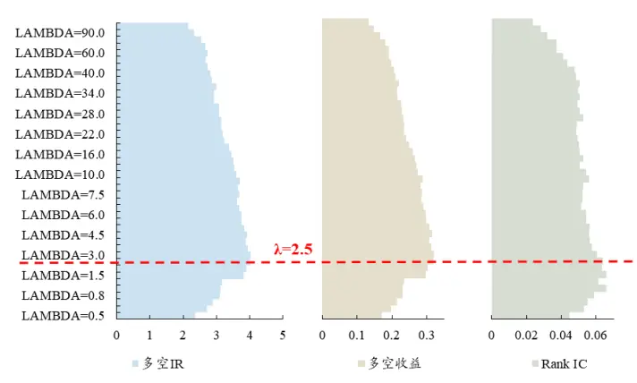
数据来源：Wind、开源证券研究所

图16：NIPCT因子：最优阈值为2 万元
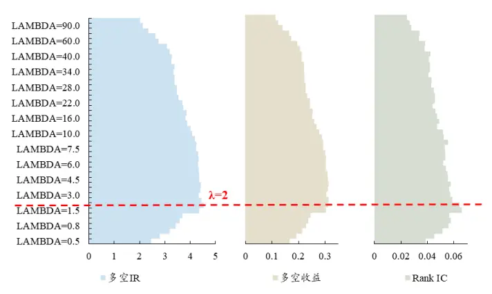
数据来源：Wind、开源证券研究所

综合上述结果，我们判断具有定价能力的并非仅限于 20 万元以上的“大单”和“超大单”，而是可以有划定更低的判断标准。

## 2.2、 资金流 Alpha来自主力资金而非小单

我们通过单一的金额阈值λ来划分大、小单，这样会导致二者天然相关，而资金流的因子收益究竟是来自大单的信息优势带来的正向Alpha，还是小单的流动性提供的负向 Alpha？笔者进一步分别测试基于大单和小单资金流构造NIR_MOD因子。图17 展示了在不同划分阈值下两个因子的对冲收益。

图17：大单 NIR_MOD 比小单 NIR_MOD 因子选股能力更强
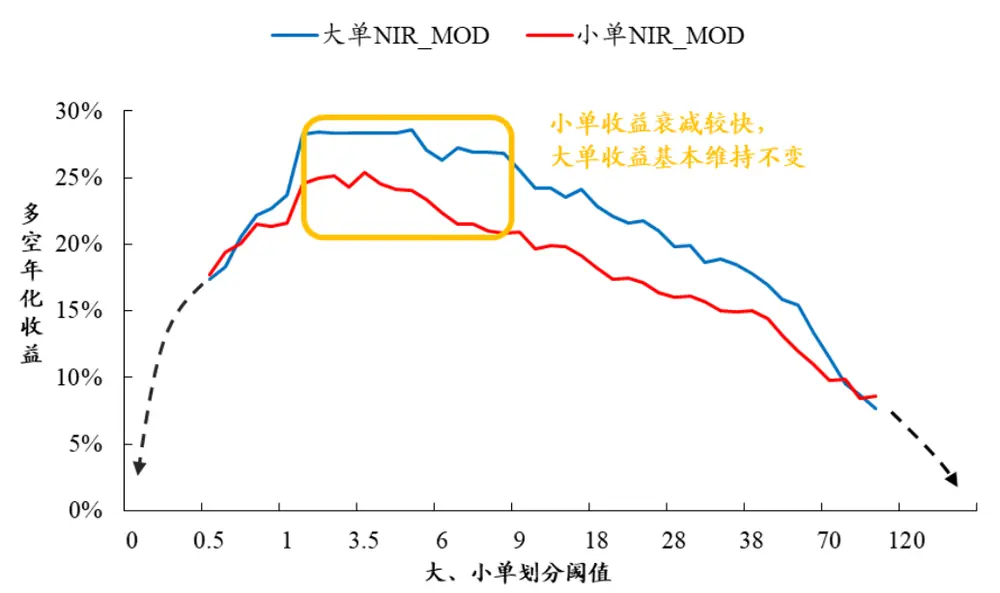
数据来源：Wind、开源证券研究所

关于资金流的因子逻辑，可以拆解为两部分来看：从因子的有效性来看，大单NIR_MOD 比小单 NIR_MOD 的选股能力更强，大单的多空收益可以达到年化 25%以上，相比小单的因子收益多出 4%左右；从因子逻辑来看，小单通常作为交易对手方为市场提供交易流动性，而资金流因子Alpha来源于大单更符合直觉。因此，资金流的最好定义方式是去捕捉主力资金的行为特征。本文后续将会继续对主力资金选股能力进行分析，而小单部分由于有效性偏低不再进行后续讨论和分析。

进一步探究资金的行为特征，我们需要调整一下参数测试的框架：基于相邻两个阈值计算小区间的大单资金流向数据，得到若干组区间资金流后再分别构造因子进行测试。此外，我们将NIR_MOD因子单独拆解成净流入（NI_MOD）和成交金额（AMT）两部分，最后再单独进行参数敏感性测试。

$$
NIR\_MOD=NI\_MOD/AMT
$$

图 18 和图 19 分别展示了不同区间的净流入因子和成交金额因子的多空 IR，其中，红色的折线表示因子的多空 IR，对应左侧的坐标轴；蓝色的阴影部分的大小表示多空对冲收益，为了更直观显示并未对因子方向进行调整，横轴对应收益为0。

图18：净流入因子的 Alpha 呈“两极分化”状
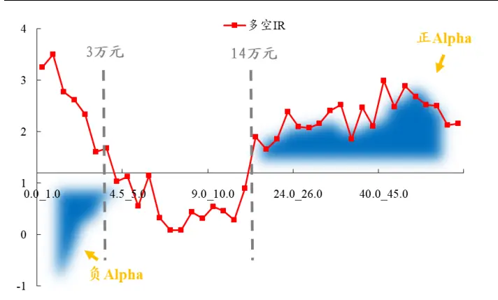
数据来源：Wind、开源证券研究所

图19：成交金额因子的Alpha分布比较均匀
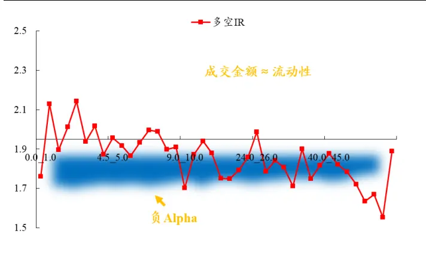
数据来源：Wind、开源证券研究所

观察图18和图19，我们可以总结得到两点信息：

（1）净流入因子随挂单金额的降低因子方向发生改变，并且因子的有效性曲线呈现凸函数变化（图 18）。小单部分Alpha较为集中，随着挂单金额提升因子收益会快速降低；大单部分的有效区间相对更宽，14 万元以上的资金净流入均有正选股能力；中间部分的资金流单独拎出来并未显示出具备显著的选股能力。

（2）成交金额因子提供稳定的负向选股效果（图 19）。整体上，NIR_MOD 的分母部分提供了较为均匀的负向选股能力，区间金额较大的一端相对会偏弱一些，但整体的区别并不是很明显。该因子描述的是股票的流动性特征，其Alpha来源主要为流动性风险补偿，也即成交金额越低，未来价格上涨的可能性更大。

从区间资金流测试上，并未发现导致主力资金划分金额偏低的影响因素。但我们推测，NIR_MOD 的有效性变化与 NI_MOD 有关：当主力资金的划定范围逐渐拓宽至中小金额的委托单，将会包括一些信息优势较弱的资金，这也导致了 NIR_MOD因子的有效性上升逐渐趋于缓慢。而当划定范围进一步扩大至小单部分，由于负向Alpha 的作用，因子的有效性会快速下降，直至衰减为负值时完全等价于常数 1。

因此，NIR_MOD因子的有效性曲线会是类似抛物线的形状。

## 2.3、 大、小单博弈与资金流相关性：小单提供流动性支持

进一步，我们统计了2013年以来，每个交易日的相邻区间资金流的相关系数并取均值，其中金额较大的资金作记为“L单”、而金额较小的资金记为“S单”。图20展示了“L单”和“S 单”的净流入之间秩相关系数热力图，我们取每期截面相关性的均值作为展示，颜色越明亮，说明两个区间资金的净流入相关系数越高。

图20：大单的交易对手方集中在 3 万元以下的小单
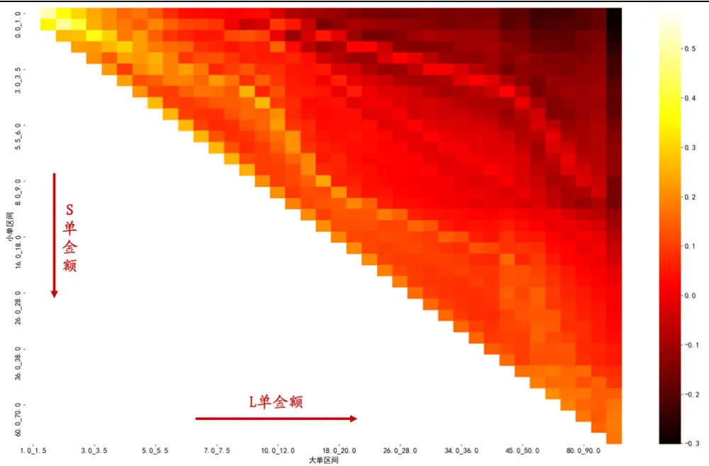
数据来源：Wind、开源证券研究所

从图 20 中我们可以直观看出，L单和 S 单净流入之间相关性具有一定规律，主要有以下三点结构特征：

（1）从“热力值”的水平来看，“热力值”较高的是3 万元以下的委托单，而金额偏小的 S 单与金额较大的 L 单表现不同程度的负相关，尤其是 100 万元以上的 L单与 3 万元以下的 S 单负相关关系最为显著，这表明市场上的流动性主要由数量更多、报价更为频繁的小额委托单提供；

（2）从金额大小来看，资金流并非存在明晰的断层效应。相邻金额区间的净流入具有一定相关性，例如股票A在某日有 1 笔 30万元左右的买入委托，同期可能会有 28万元、29万元等等的委托单跟随，诸如此类。这一现象的解释可有多个，如机构拆单、资金跟随策略等等，但这并不是本文讨论的重点，故不再展开；

（3）从逐笔成交数据的原始匹配上看，我们不难发现，大额委托单的交易对手方主要以小额委托单为主。L单的净流入对应着 S单资金的净流出，尤其是S单中金额小于约 L单挂单金额20%的那部分委托单，但金额小于约10万元的委托单似乎并不会显著地影响更小的对手单。

从区间资金流的相关性来看，至少在 A 股市场上，机构或主力的交易行为还是能够通过微观手段来捕捉，但上述结论也会受到一些其他因素的影响。

## 2.4、 主力资金阈值的分域差异：小票显著低于大票

在全市场上，划分主力资金的阈值明显偏低，大约在 2到3 万元之间。而资金行为通常表现出与成交活跃度较高的相关性，因此我们思考：在不同交易活跃度下，划分主力的最优阈值是否存在差异性？

进一步，我们对不同选股域内因子表现分析，分别在沪深 300、中证500和中证1000上测试NIR_MOD因子的选股效果，结果如图21 所示。

图21：不同选股域内测试：沪深300、中证 500的最优阈值取值相对模糊，并且水平整体偏高

| 阈值 | 沪深300 |  |  | 中证500 |  | 中证1000 |  | 全市场 |  |  |
| --- | --- | --- | --- | --- | --- | --- | --- | --- | --- | --- |
|  | 多空IR 多空收益Rank IC |  |  | 多空IR 多空收益 Rank IC |  | 多空IR 多空收益Rank IC |  | 多空IR 多空收益Rank IC |  |  |
| 0.5 | 0.963 0.103 |  | 0.033 | 1.485 0.123 | 0.028 | 2.091 0.153 | 0.042 | 2.896 0.174 0.038 |  |  |
| 0.6 | 1.295 0.143 |  | 0.053 | 1.528 0.128 | 0.043 | 2.208 0.166 | 0.041 | 3.044 0.183 0.046 |  |  |
| 0.7 | 1.234 0.133 |  | 0.054 | 1.697 0.145 | 0.043 | 2.566 0.193 | 0.040 | 3.388 0.206 0.047 |  |  |
| 0.8 | 1.394 0.151 |  | 0.058 | 1.705 0.145 | 0.041 | 2.604 0.194 | 0.043 | 3.666 0.222 0.054 |  |  |
| 0.9 | 1.507 0.172 |  | 0.057 | 1.746 0.150 | 0.045 | 2.371 0.175 | 0.043 | 3.765 0.226 0.053 |  |  |
| 1 | 1.397 0.154 |  | 0.046 | 1.552 0.132 | 0.039 | 2.460 0.181 | 0.045 | 3.890 0.237 0.054 |  |  |
| 1.5 | 1.366 0.153 |  | 0.057 | 2.012 0.176 | 0.050 | 3.088 0.238 | 0.064 | 4.446 0.283 0.063 |  |  |
| 2 | 1.624 0.186 |  | 0.053 | 2.052 0.179 | 0.050 | 3.221 0.241 | 0.064 | 4.607 0.284 |  | 0.064 |
| 2.5 | 1.759 0.204 |  | 0.044 | 2.009 0.174 | 0.049 | 3.281 0.252 | 0.066 | 4.605 0.284 |  | 0.058 |
| 3 | 1.653 | 0.191 | 0.046 | 1.948 0.167 | 0.046 | 3.347 0.267 | 0.065 | 4.564 0.284 |  | 0.060 |
| 3.5 | 1.793 | 0.206 | 0.058 | 1.920 0.168 | 0.051 | 3.388 0.263 | 0.063 | 4.592 0.283 |  | 0.057 |
| 4 | 1.649 0.183 |  | 0.058 | 2.073 0.178 | 0.055 | 3.411 0.268 | 0.059 | 4.544 0.283 |  | 0.058 |
| 4.5 | 1.588 | 0.179 | 0.067 | 2.000 0.174 | 0.051 | 3.499 0.269 | 0.060 | 4.567 0.283 |  | 0.058 |
| 5 | 1.550 | 0.174 | 0.063 | 2.032 0.177 | 0.053 | 3.497 0.272 | 0.061 | 4.614 0.286 |  | 0.058 |
| 5.5 | 1.642 | 0.185 | 0.057 | 1.874 0.159 | 0.052 | 3.447 0.267 | 0.059 | 4.412 0.271 |  | 0.057 |
| 6 | 1.581 | 0.175 | 0.059 | 1.913 0.163 | 0.050 | 3.498 0.274 | 0.059 | 4.332 0.263 |  | 0.056 |
| 6.5 | 1.596 | 0.178 | 0.060 | 2.017 0.175 | 0.049 | 3.457 0.271 | 0.055 | 4.445 0.272 |  | 0.054 |
| 7 | 1.607 | 0.180 | 0.055 | 2.133 0.184 | 0.046 | 3.358 0.261 | 0.057 | 4.365 0.269 |  | 0.054 |
| 7.5 | 1.538 0.170 |  | 0.055 | 2.040 0.174 | 0.048 | 3.386 0.264 | 0.055 | 4.376 0.269 |  | 0.053 |
| 8 | 1.540 | 0.169 | 0.051 | 2.177 0.189 | 0.048 | 3.204 0.246 | 0.051 | 4.380 0.268 |  | 0.051 |
| 9 | 1.610 | 0.180 | 0.051 | 2.148 0.190 | 0.049 | 3.046 0.227 | 0.046 | 4.247 | 0.255 | 0.051 |
| 10 | 1.651 | 0.183 | 0.048 | 2.001 0.175 | 0.048 | 3.085 0.231 | 0.048 | 4.116 0.242 |  | 0.049 |
| 12 | 1.515 | 0.164 | 0.047 | 2.116 0.187 | 0.051 | 2.803 0.206 | 0.048 | 4.148 0.242 |  | 0.046 |
| 14 | 1.612 | 0.172 | 0.045 | 2.229 0.192 | 0.052 | 2.879 0.212 | 0.044 | 4.069 0.236 |  | 0.044 |
| 16 | 1.725 | 0.185 | 0.044 | 2.045 0.181 | 0.049 | 2.726 0.202 | 0.043 | 4.157 0.241 |  | 0.046 |
| 18 | 1.854 0.200 |  | 0.043 | 2.081 0.184 | 0.047 | 2.764 0.201 | 0.042 | 4.059 0.229 |  | 0.044 |
| 20 | 1.748 0.184 |  | 0.048 | 2.090 0.182 | 0.048 | 2.877 0.213 | 0.047 | 3.911 0.221 |  | 0.043 |
| 22 | 1.546 0.164 |  | 0.053 | 2.001 0.174 | 0.046 | 2.837 0.207 | 0.046 | 3.886 0.216 |  | 0.044 |
| 24 | 1.443 0.152 |  | 0.056 | 2.149 0.188 | 0.047 | 2.751 0.202 | 0.045 | 3.934 0.217 |  | 0.041 |
| 26 | 1.584 0.168 |  | 0.058 | 2.040 0.175 | 0.050 | 2.809 0.204 | 0.043 | 3.851 0.210 |  | 0.040 |
| 28 | 1.546 0.164 |  | 0.050 | 2.238 0.194 | 0.048 | 2.649 0.191 | 0.040 | 3.634 0.199 |  | 0.040 |
| 30 | 1.685 0.181 |  | 0.050 | 2.035 0.175 | 0.049 | 2.605 0.184 | 0.039 | 3.657 0.199 |  | 0.042 |
| 32 | 1.401 0.147 |  | 0.056 | 1.962 0.166 | 0.045 | 2.615 0.187 | 0.037 | 3.507 0.186 |  | 0.040 |
| 34 | 1.424 0.151 |  | 0.057 | 2.101 0.180 | 0.046 | 2.685 0.189 | 0.038 | 3.510 0.189 |  | 0.039 |
| 36 | 1.390 0.147 |  | 0.057 | 2.164 0.185 | 0.045 | 2.565 0.180 | 0.038 | 3.510 0.185 |  | 0.038 |
| 38 | 1.375 0.147 |  | 0.060 | 2.061 0.175 | 0.044 | 2.619 0.183 | 0.038 | 3.383 0.178 |  | 0.041 |
| 40 | 1.190 0.125 |  | 0.056 | 1.949 0.166 | 0.049 | 2.583 0.179 | 0.040 | 3.253 0.170 |  | 0.038 |
| 45 | 1.338 0.142 |  | 0.057 | 1.897 0.159 | 0.035 | 2.279 0.160 | 0.036 | 3.061 0.158 |  | 0.034 |
| 50 | 1.272 0.132 |  | 0.053 | 1.674 0.139 | 0.032 | 1.977 0.133 | 0.039 | 3.022 0.155 |  | 0.036 |
| 60 | 1.119 0.117 |  | 0.040 | 1.622 0.133 | 0.030 | 1.835 0.122 | 0.033 | 2.699 0.133 |  | 0.029 |
| 70 | 1.003 0.102 |  | 0.048 | 1.730 0.145 | 0.033 | 1.732 0.114 | 0.026 | 2.387 0.115 |  | 0.029 |
| 8090 | 0.843 0.084 |  | 0.042 | 1.514 0.123 | 0.020 | 1.793 0.115 | 0.025 | 2.091 0.095 |  | 0.020 |
|  | 1.096 0.115 |  | 0.044 | 1.245 0.098 | 0.017 | 1.601 0.099 | 0.019 | 1.949 0.087 |  | 0.020 |
| 100 | 0.976 0.103 |  | 0.033 | 1.060 0.084 | 0.020 | 1.612 0.100 | 0.023 | 1.744 0.077 0.013 |  |  |

数据来源：Wind、开源证券研究所

从分域测试的结果来看，最优的划分阈值呈现出明显的风格特征。在大票为主的沪深 300 和中证500指数成分股中，主力资金的最优划分阈值是不明确的，并且划分金额相对更高。而在中证1000 以及全市场范围内测试，主力资金的划分阈值会明显偏低，二者之中的全市场又要更低一些，整体上有效性曲线会更“光滑”。

笔者认为这可能与机构拆单行为有关，主要原因在于：

（1）机构在大票上交易更多。根据最新披露的公募基金持仓明细，截止 2022年 6月30日，在中证800上的持仓集中度达到了 78.27%，仅有不到四分之一的比例是小票。若是扩大至中证800+中证1000的范围，非公募持仓比例将会降低至 12%。

（2）小票上委托单被拆分的金额更小。由于小票的流动性不足，而大额委托单会造成更大的冲击成本，主力资金会把委托单拆得更细；而在大票上不会有过多的流动性方面的顾虑，委托单被拆分的颗粒度也会更大一些。

为了方便理解 NIR_MOD 因子的测试结果，我们以简单的模型进行说明。图 22展示了因子的 Alpha 拆解以及有效性曲线。

图22：资金流Alpha拆解示意图
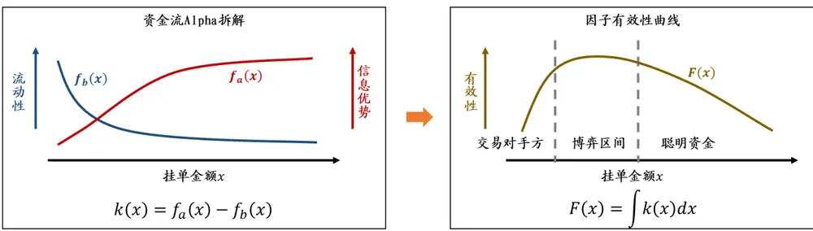
资料来源：开源证券研究所

左图为市场上资金流挂单结构的Alpha拆分。大单具有信息优势而表现出来正向选股能力，小单部分为大单提供流动性，表现为负向选股能力。大、小单的 Alpha能力是相对而言的，资金量更大的委托单含有预知信息的概率会更高一些，而随着资金量的减少，其信息优势会逐渐降低，反而提供了市场的流动性。

右图为 NIR_MOD 因子的有效性曲线，大致为抛物线的形状，我们将其划分为三个区间：最右侧为机构等聪明资金，最左侧为聪明资金的交易对手方，中间则是交易结构中博弈最为激烈的区间。在沪深300、中证 500 等股票池内，机构投资者频繁地拆单对于原始委托单分布的影响更大，导致大资金的行为信息在这一区间内的变化并不连续，而在中证1000成分股以及其他小票样本内，影响会相对弱化一些。

## 2.5、 主动买卖划分：未发现有额外的信息增益

市场中投资者的委托单在时间上有先后顺序之分，可以分为主动单和被动单两种类型。逐笔数据中的 Type、Side 等字段依据买卖委托单的时间先后顺序，划定了每笔交易是属于主动买入成交或是主动卖出成交。本文根据这一划分统计主动买入金额和主动卖出金额，具体分类方法是：

（1）分别统计每笔委托买单和委托卖单的成交金额；

（2）若某一笔（买入/卖出）委托单的第一笔分笔成交的标识为（B/S），则将该笔委托整体视为主动（买入/卖出）委托，也即后续所有的分笔成交均为主动成交；

（3）加总得到个股每个交易日的主动买入金额和主动卖出金额。

根据资金流动力学的底层逻辑：先来的委托单挂在订单簿中等待成交，为市场提供流动性，而后来的委托单则主动促使成交，影响市场价格，而主动买卖数据应该会比买卖成交数据刻画资金流的效果要好。

结合大、小单的划分方法，我们可以得到阈值取2 万元的大单主动买入金额和大单主动卖出金额，然后基于资金流的修正方法剥离涨跌幅的负面影响，进而利用这些主动买卖数据分别计算 NI_ACT_MOD、NIR_ACT_MOD、NIPCT_ACT_MOD，测试这些因子的选股效果，如图23所示。

图23：基于主动买卖金额构造资金流因子并未有正超额
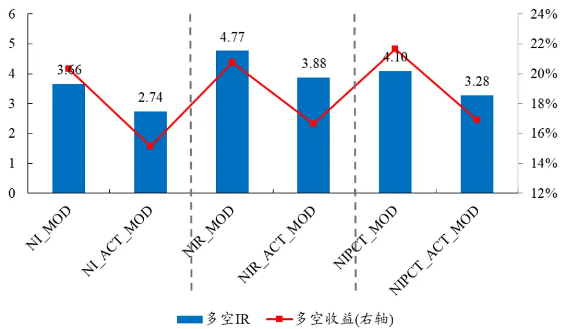
数据来源：Wind、开源证券研究所，测试区间为 20130101-20220311

对于主动买卖单的划分方法，总结下来可以分为两类：逐笔划分算法和批量划分方法。前者使用与本文相同的逐笔数据，划分每笔委托单的主动买卖方向，后者则是在将一段时间区间的总成交量进行主动买卖划分，也各有优缺点。

从结果上来看，主力资金的划分并未给资金流因子的构造带来信息增量，而本文介绍的主动买卖划分方法并非完全合理，此处仅作为补充测试供读者参考，也欢迎感兴趣的读者与笔者进一步探讨。

## 3、 基于大、小单重定标的资金流因子改进

## 3.1、 逐笔信息的低频化应用：从 NIR_MOD 到 CNIR

由上一章的参数敏感性测试得知，基于小金额标准（例如，2万元）识别的主力资金因子表现更好，我们想要利用这其中的超额信息，但是逐笔数据计算因子的实现难度比较大，显然对因子的生产和应用产生了较大的阻碍。

那是否可以有更好的处理方法呢？其实问题比较容易解决，我们将 Wind的超大单、大单和中单合并，将其定义为具有市场定价能力的“广义主力资金”，进而构造改进后的净流入率因子（记作CNIR因子），其计算步骤如表2所示。

表2：CNIR因子的计算步骤

| 顺序 | 计算方法 |
| --- | --- |
| 第一步 | 分别计算主力资金的买入金额 $B_{P}$ 和卖出金额Sp: $B_{P}=B_{Extra}+B_{Large}+B_{Med}$ $S_{P}=S_{Extra}+S_{Large}+S_{Med}$ |
| 第二步 | 利用日涨跌幅来修正主力资金的买入金额 ${\hat{B}}_{P}$ 和卖出金额Sp: $\begin{array}{r}{ln(B_{P}/S_{P})=\alpha+\beta Ret+\varepsilon}\\{\varepsilon=\ ln\big(\hat{B}_{P}/\hat{S}_{P}\big)}\end{array}$ |
| 第三步 | 计算主力资金的净流入占比，即为NIR因子： $CNIR=\frac{\sum_{i}^{N}\left(\hat{B}_{P,i}-\hat{S}_{P,i}\right)}{\sum_{i}^{N}\left(\hat{B}_{P,i}+\hat{S}_{P,i}\right)}$ |

资料来源：开源证券研究所

在全市场范围内将CNIR因子分五组测试其有效性，图 24展示了因子的RankIC及其累计值，图25则是五分组的净值曲线，收益稳定性的定义是股票未来收益率的标准差，用以反映因子分组测试中各组解释程度的差异。

图24：CNIR 因子月度 Rank IC 相对稳定
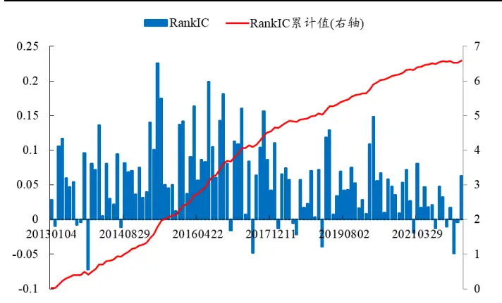
数据来源：Wind、开源证券研究所

图25：全市场五分组表现：多头收益显著
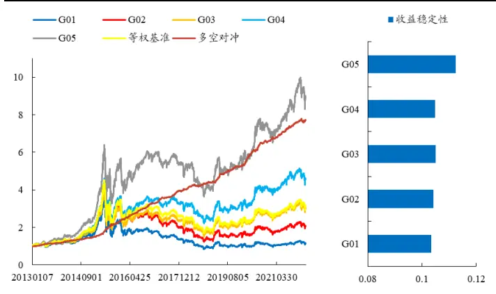
数据来源：Wind、开源证券研究所

CNIR因子整体上来看为非常有效的选股因子，并且多头收益十分显著，因子各组收益的稳定性也比较高，因子逻辑相对稳健。回撤方面，因子多头的最大回撤为48.79%，主要发生在2015年下半年。

本文针对资金流因子的改进，至此共分为两步：一是剔除资金流向数据中的涨跌幅负面影响；二是利用跟随资金的敏感度增强因子收益。为了方便读者更清楚地对比这两步的效用，图 26和图 27 分别展示了 NIR因子、NIR_MOD 因子、CNIR因子的多空对冲和多头组合净值曲线。

图26：叠加两步改进，CNIR因子收益明显增厚
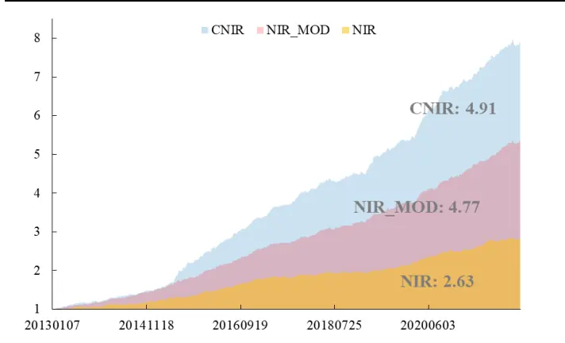
数据来源：Wind、开源证券研究所

图27：CNIR因子多头收益进一步提升
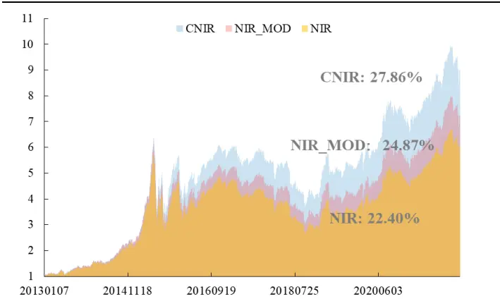
数据来源：Wind、开源证券研究所

基于 Wind-AShareMoneyFlow 的大单资金流计算的 NIR 因子本身就属于有效的Alpha因子。在修正资金流的动量特征后，NIR_MOD 因子有了较为明显的提升，多头年化收益率达到 24.87%，多空信息比率为 4.77。最后，叠加跟随资金增强收益的CNIR因子的收益得到了进一步放大，多头收益提升至27.86%，多空 IR为 4.91。

## 3.2、 因子收益特征：呈现“二月魔咒”，小票上表现更好

我们再来观察因子的月度收益表现，图28展示了因子在全市场五分组下的多空收益。可以看出，CNIR因子在 2月份收益会有所降低，其他各个月份的收益相对而言比较均衡，整体的因子收益和胜率都比较高。

图28：CNIR因子的对冲收益统计：整体收益分布相对均衡，存在一定的月度差异

| 指标 | 1月 | 2月 | 3月 | 4月 | 5月 | 6月 | 7月 | 8月 | 9月 | 10月 | 11月 | 12月 |
| --- | --- | --- | --- | --- | --- | --- | --- | --- | --- | --- | --- | --- |
| 2013 | 6.45% | 1.87% | 50.58% | 33.53% | 22.78% | 54.14% | 13.63% | 6.73% | 5.09% | 48.26% | 1.54% | 12.54% |
| 2014 | 41.09% | 76.84% | 9.45% | 30.09% | 6.72% | 12.68% | 20.91% | -0.78% | 43.73% | 31.95% | 30.07% | 11.13% |
| 2015 | 46.37% | 13.66% | 37.47% | 66.56% | 33.90% | 265.42% | 102.26% | 65.09% | 10.65% | 19.77% | 27.21% | 47.64% |
| 2016 | 36.60% | 48.68% | 21.25% | 53.53% | 35.12% | 18.39% | 60.02% | 24.82% | 37.12% | 7.56% | 55.64% | 53.81% |
| 2017 | 18.48% | -4.17% | 25.16% | 83.54% | 28.86% | 2.44% | 7.80% | 3.30% | 36.37% | 52.93% | 40.12% | 11.86% |
| 2018 | 14.97% | 6.87% | 19.97% | 36.93% | 15.87% | 0.08% | -9.89% | 7.45% | 13.92% | 19.26% | 16.12% | 7.59% |
| 2019 | 23.53% | -20.97% | 57.08% | 85.26% | 6.72% | 14.86% | 20.90% | 6.03% | 23.77% | 26.83% | 18.72% | -5.21% |
| 2020 | 12.92% | 27.34% | 83.72% | 59.62% | 49.48% | 24.94% | 5.04% | 71.21% | 17.15% | 22.24% | -10.20% | 15.52% |
| 2021 | 32.97% | -6.53% | 3.07% | 33.39% | 6.72% | 23.73% | 23.04% | 31.96% | 11.99% | 20.00% | 13.93% | 16.62% |
| 2022 | 24.89% | -16.04% | 1.09% |  |  |  |  |  |  |  |  |  |
| 正回报月数 | 10 | 6 | 10 | 9 | 9 | 9 | 8 | 8 | 9 | 9 | 8 | 8 |
| 总月数 | 10 | 10 | 10 | 9 | 9 | 9 | 9 | 9 | 9 | 9 | 9 | 9 |
| 胜率 | 100.00% | 60.00% | 100.00% | 100.00% | 100.00% | 100.00% | 88.89% | 88.89% | 100.00% | 100.00% | 88.89% | 88.89% |
| 月均收益 | 25.83% | 12.75% | 30.88% | 53.61% | 22.91% | 46.30% | 27.08% | 23.98% | 22.20% | 27.65% | 21.46% | 19.06% |

数据来源：Wind、开源证券研究所，测试区间为 20130101-20220311

2017年以来，CNIR因子在 2月份的收益表现大多数在全年尾部，推测可能存在一些使得因子的逻辑失效情况，如近几年的贸易冲突、新冠疫情反复等。

我们基于改进后的CNIR因子测算资金流Alpha在不同选股域的表现，选取沪深300、中证500、中证1000和全样本进行测试。测算多头超额时考虑交易费用，设为买卖双边 5‰，测试区间为 20150101 至 20220311，净值基准为对应宽基，全样本的基准为万得全A指数。

表3：不同选股域内的五分组表现：CNIR因子在小票上表现更好

| 选股域 | Rank IC | Rank ICIR | 月度胜率 | 多空收益 | 多头超额 |
| --- | --- | --- | --- | --- | --- |
| 沪深300 | 0.057 | 2.578 | 68.18% | 18.21% | 3.31% |
| 中证500 | 0.050 | 2.856 | 67.05% | 17.79% | 7.68% |
| 中证 1000 | 0.054 | 3.277 | 72.73% | 19.65% | 8.68% |
| 全样本 | 0.056 | 3.647 | 76.14% | 25.19% | 10.18% |

数据来源：Wind、开源证券研究所，测试区间为 20150101-20220311

在不同选股域内的分组测试，CNIR因子的多空净值曲线如图 29 所示。

图29：CNIR因子的多空对冲净值曲线：全市场对冲收益最高
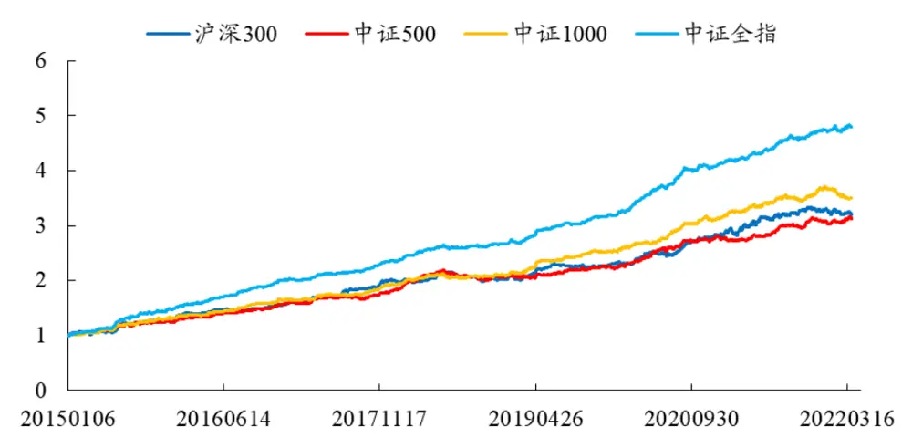
数据来源：Wind、开源证券研究所，测试区间为 20150101-20220311

从图 29 中可以看出，CNIR 因子在不同选股域内均有不错的选股 Alpha。我们测试发现，该因子的选股逻辑在小盘股的样本池上演绎效果会更好，在全市场上多空信息比率能够达到 4.68 以上；在沪深 300 成本股内将样本池分五分组，多空对冲信息比率也有 2.21，而中证 500 和中证 100 的五分组 IR 分别为 2.66 和 3.15。

## 3.3、 因子相关性分析：与常见因子关联度低

因子相关性层面，我们分别测试了CNIR因子与交易行为因子和Barra风格因子的相关性，结果如图25和图26所示。该因子与我们跟踪的交易行为因子重叠度不高，与理想反转因子和APM因子的秩相关系数分别为-0.146 和-0.083，并且与Barra风格因子的相关性也比较低，与规模因子的相关系数低于 0.2。

图30：CNIR因子与Barra风格因子相关性偏低
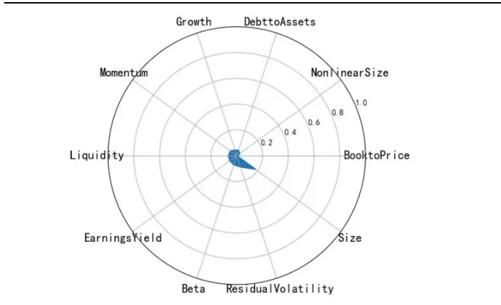
数据来源：Wind、开源证券研究所，测试区间为 20130101-20220311

图31：CNIR因子与交易行为因子解释能力重叠度低
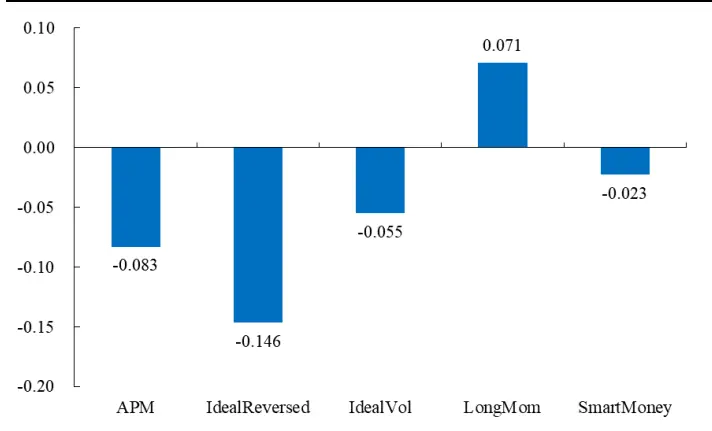
数据来源：Wind、开源证券研究所，测试区间为 20130101-20220311

若是剔除掉其他因子的影响，CNIR 因子的表现如何？在扣减 Barra 风格因子的收益之后，CNIR因子的多头收益依旧显著，年化收益达到 23.04%，多空对冲收益稳健，信息比率为 4.48，多空收益仍有 17.4%以上；扣减交易行为因子的收益后，因子的多头和空头损失程度会加重，多空收益为15.25%，但胜率保持在 85%。

图32：剥离风格因子、交易行为因子收益后，CNIR因子多头仍然有效
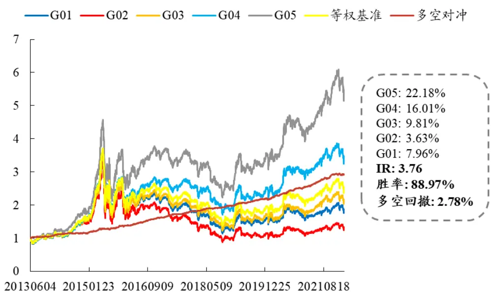
数据来源：Wind、开源证券研究所

同时剔除风格因子以及交易行为因子的收益，五分组下 CNIR因子的多头仍然相对有效，年化收益为 22.18%，如图 27所示。其在考虑交易费用后仍有 16.7%，相对万得全 A 指数超额在 10%以上，说明该因子具有独立的 Alpha 源。

## 3.4、 持仓分析与复盘

从板块维度来看，我们在中证 800 的股票池内滚动20 个交易日选取100只股票作为持仓，分析所持股票的板块权重分布，如图28所示。

图33：中证 800多头组合板块配置情况：2021年 6月以来超配大金融板块
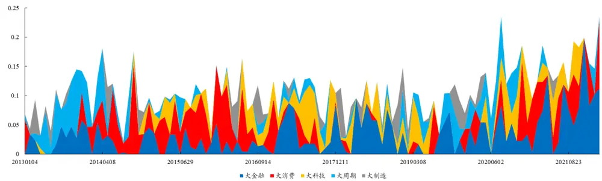
数据来源：Wind、开源证券研究所

（1）2020 年 6 月至 2021 年底，主力资金超配大科技板块。受新能源产业链的贡献利好政策，同期电力设备行业指数涨幅达167%，其中不乏资金推动行情；而大消费板块的配置偏好短期的反复性比较高。

（2）主力资金对大金融板块的超配具有避险特征。2022年初至今，A 股市场出现了普遍下跌的走势，或许与疫情反复、部分地区经济增速不及预期等有关。而每当资金避险情绪较高的时候，大金融板块凭借高容量起到了一定“蓄水池”的作用。

从行业维度来看，我们根据每期公募基金年报、半年报披露的持仓明细，统计期间所有基金的个股持仓的变动与同期主力资金的净流入额的相关性。图34展示了二者的散点分布，整体上呈现一定程度的正相关关系；图35则是2017年以来每半年度公募持仓个股的市值变动与同期主力资金净流入的秩相关系数。

图34：主力净流入与公募基金持仓变动正相关
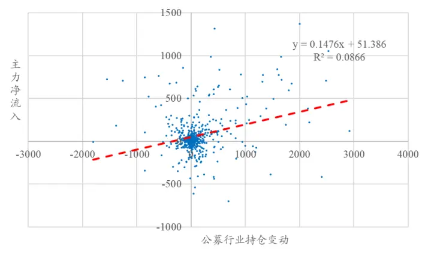
数据来源：Wind、开源证券研究所，测试区间为 20170630-20211231

图35：主力净流入与公募基金持仓变动相关性较高
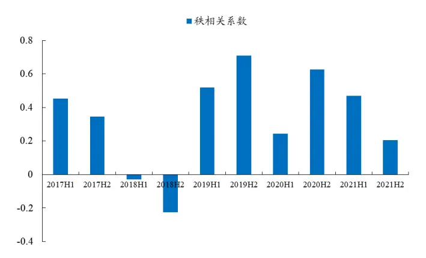
数据来源：Wind、开源证券研究所

主力资金净流入能够部分反映公募持仓的变动，除了 2018年主力资金小幅净流

出与持仓变动相关性较弱以外，二者的秩相关系数保持在 0.3左右的水平。

从个股维度来看，我们观察 CNIR 因子的持仓换手情况。在滚动 20 日的窗口内计算因子，并且将调仓频率设为20 个交易日，测试该因子在全市场五分组的换手率时序变化情况，如图 36所示。

图36：CNIR因子换手率整体偏低
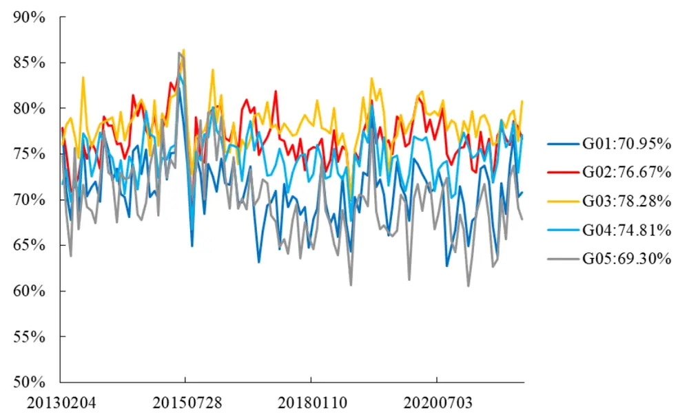
数据来源：Wind、开源证券研究所

多头组合的每隔 20日调仓的换手约为70%，换手率并不算高，若是将股票组合的调仓频率提高至双周频、周频甚至更高则会进一步降低。CNIR因子在双周频、周频下因子换手率分别会达到 49.03%和34.01%，而每隔3 个交易日调整持仓的收益率最高，对应的换手率为25.64%。

## 4、 风险提示

模型基于历史数据统计，未来市场可能发生变化。

## 特别声明

《证券期货投资者适当性管理办法》、《证券经营机构投资者适当性管理实施指引（试行）》已于2017年7月1日起正式实施。根据上述规定，开源证券评定此研报的风险等级为R3（中风险），因此通过公共平台推送的研报其适用的投资者类别仅限定为专业投资者及风险承受能力为C3、C4、C5的普通投资者。若您并非专业投资者及风险承受能力为C3、C4、C5的普通投资者，请取消阅读，请勿收藏、接收或使用本研报中的任何信息。因此受限于访问权限的设置，若给您造成不便，烦请见谅！感谢您给予的理解与配合。

## 分析师承诺

负责准备本报告以及撰写本报告的所有研究分析师或工作人员在此保证，本研究报告中关于任何发行商或证券所发表的观点均如实反映分析人员的个人观点。负责准备本报告的分析师获取报酬的评判因素包括研究的质量和准确性、客户的反馈、竞争性因素以及开源证券股份有限公司的整体收益。所有研究分析师或工作人员保证他们报酬的任何一部分不曾与，不与，也将不会与本报告中具体的推荐意见或观点有直接或间接的联系。

## 股票投资评级说明

|  | 评级 | 说明 |
| --- | --- | --- |
| 证券评级 | 买入（Buy） | 预计相对强于市场表现20%以上； |
|  | 增持（outperform） | 预计相对强于市场表现5%～20%; |
|  | 中性（Neutral） | 预计相对市场表现在—5%～+5%之间波动； |
|  | 减持（underperform） | 预计相对弱于市场表现5%以下。 |
| 行业评级 | 看好（overweight） | 预计行业超越整体市场表现； |
|  | 中性（Neutral） | 预计行业与整体市场表现基本持平； |
|  | 看淡（underperform） | 预计行业弱于整体市场表现。 |
| 备注：评级标准为以报告日后的6~12个月内，证券相对于市场基准指数的涨跌幅表现，其中A股基准指数为沪深300指数、港股基准指数为恒生指数、新三板基准指数为三板成指（针对协议转让标的）或三板做市指数（针对做市转让标的)、美股基准指数为标普500或纳斯达克综合指数。我们在此提醒您，不同证券研究机构采用不同的评级术语及评级标准。我们采用的是相对评级体系，表示投资的相对比重建议；投资者买入或者卖出证券的决定取决于个人的实际情况，比如当前的持仓结构以及其他需要考虑的因素。投资者应阅读整篇报告，以获取比较完整的观点与信息，不应仅仅依靠投资评级来推断结论。 |  |  |

## 分析、估值方法的局限性说明

本报告所包含的分析基于各种假设，不同假设可能导致分析结果出现重大不同。本报告采用的各种估值方法及模型均有其局限性，估值结果不保证所涉及证券能够在该价格交易。

## 法律声明

开源证券股份有限公司是经中国证监会批准设立的证券经营机构，已具备证券投资咨询业务资格。

本报告仅供开源证券股份有限公司（以下简称“本公司”）的机构或个人客户（以下简称“客户”）使用。本公司不会因接收人收到本报告而视其为客户。本报告是发送给开源证券客户的，属于机密材料，只有开源证券客户才能参考或使用，如接收人并非开源证券客户，请及时退回并删除。

本报告是基于本公司认为可靠的已公开信息，但本公司不保证该等信息的准确性或完整性。本报告所载的资料、工具、意见及推测只提供给客户作参考之用，并非作为或被视为出售或购买证券或其他金融工具的邀请或向人做出邀请。本报告所载的资料、意见及推测仅反映本公司于发布本报告当日的判断，本报告所指的证券或投资标的的价格、价值及投资收入可能会波动。在不同时期，本公司可发出与本报告所载资料、意见及推测不一致的报告。客户应当考虑到本公司可能存在可能影响本报告客观性的利益冲突，不应视本报告为做出投资决策的唯一因素。本报告中所指的投资及服务可能不适合个别客户，不构成客户私人咨询建议。本公司未确保本报告充分考虑到个别客户特殊的投资目标、财务状况或需要。本公司建议客户应考虑本报告的任何意见或建议是否符合其特定状况，以及（若有必要）咨询独立投资顾问。在任何情况下，本报告中的信息或所表述的意见并不构成对任何人的投资建议。在任何情况下，本公司不对任何人因使用本报告中的任何内容所引致的任何损失负任何责任。若本报告的接收人非本公司的客户，应在基于本报告做出任何投资决定或就本报告要求任何解释前咨询独立投资顾问。

本报告可能附带其它网站的地址或超级链接，对于可能涉及的开源证券网站以外的地址或超级链接，开源证券不对其内容负责。本报告提供这些地址或超级链接的目的纯粹是为了客户使用方便，链接网站的内容不构成本报告的任何部分，客户需自行承担浏览这些网站的费用或风险。

开源证券在法律允许的情况下可参与、投资或持有本报告涉及的证券或进行证券交易，或向本报告涉及的公司提供或争取提供包括投资银行业务在内的服务或业务支持。开源证券可能与本报告涉及的公司之间存在业务关系，并无需事先或在获得业务关系后通知客户。

本报告的版权归本公司所有。本公司对本报告保留一切权利。除非另有书面显示，否则本报告中的所有材料的版权均属本公司。未经本公司事先书面授权，本报告的任何部分均不得以任何方式制作任何形式的拷贝、复印件或复制品，或再次分发给任何其他人，或以任何侵犯本公司版权的其他方式使用。所有本报告中使用的商标、服务标记及标记均为本公司的商标、服务标记及标记。

## 开源证券研究所

上海

地址：上海市浦东新区世纪大道1788号陆家嘴金控广场1号

楼10层

邮编：200120

邮箱：research@kysec.cn

北京
地址：北京市西城区西直门外大街18号金贸大厦C2座16层
邮编：100044
邮箱：research@kysec.cn
地址：深圳市福田区金田路2030号卓越世纪中心1号
楼45层
邮编：518000
邮箱：research@kysec.cn
西安
地址：西安市高新区锦业路1号都市之门B座5层
邮编：710065
邮箱：research@kysec.cn