2022 年 12 月 03 日

## 金融工程研究团队

魏建榕（首席分析师）

证书编号：S0790519120001

张 翔（分析师）

# 日内极端收益前后的反转特性与因子构建

证书编号：S0790520110001

傅开波（分析师）

证书编号：S0790520090003

## 高 鹏（分析师）

证书编号：S0790520090002

## 苏俊豪（分析师）

证书编号：S0790522020001

## 胡亮勇（分析师）

证书编号：S0790522030001

## 王志豪（分析师）

证书编号：S0790522070003

## 盛少成（研究员）

证书编号：S0790121070009

## 苏 良（研究员）

证书编号：S0790121070008

## 何申昊（研究员）

证书编号：S0790122080094

## 相关研究报告

《A 股反转之力的微观来源—市场微观结构研究系列（1）》-2019.12.23

《APM因子模型的进阶版—市场微观结构研究系列（5）》-2020.03.07

《因子切割论—市场微观结构研究系列（10）》-2020.09.16

# ——市场微观结构研究系列（17）

## 魏建榕（分析师）

weijianrong@kysec.cn

盛少成（联系人）

shengshaocheng@kysec.cn

苏良（联系人）

证书编号：S0790519120001

证书编号：S0790121070009

suliang@kysec.cn

证书编号：S0790121070008

## 日内最极端收益的alpha信息

本篇报告试图从分钟数据出发，探寻日内极端收益的 alpha信息。对于极端收益的定义，我们使用S = |x−median(x)|为衡量标准。首先，我们从简出发，考虑S 最大那根最极端bar的alpha 信息。

相比于传统反转因子，最极端收益因子10分组多空信息比率从1.55提升至2.73，胜率从 65.71%提升至 81.90%，最大回撤从 13.77%降至 5.71%，为较为有效的改进方式；除此之外，最极端收益前后收益率的选股能力和方向有显著的区别：最极端收益前呈现反转，最极端收益后呈现动量。

进一步地，我们把最极端收益前 1分钟的收益率信息也利用进来，和最极端收益率排序相加后，因子十分组多空对冲信息比率进一步提升至 3.01。

## 日内第N极端收益的 alpha 信息

进一步地，我们将最极端这一标准放开，考虑第N极端的 alpha信息。我们对参数N 进行遍历，发现单根极端收益率选股ICIR随N 增加呈现递减规律，基本在N 大于10之后 ICIR绝对幅度就在 1.5以下。除此之外，结合各自前 1分钟收益率之后，所有的单根极端收益的选股 ICIR 效果都得到了提升，而且也是基本呈现单调的关系。最后，我们将前 N（极端收益率+前 1 分钟）进行排序合成，其中最极端收益+前 1 分钟的因子效果是最好的，所以我们使用其作为本篇报告最后推荐的因子，将其命名为 ERR 因子。其 RankIC 均值-7.08%，RankICIR-3.18，10 分组多空对冲年化收益率 19.58%，信息比率 3.01，胜率 81.90%，最大回撤5.71%。

## 其他重要讨论

（1）在上述的因子构建中，我们使用了最极端收益和前 1 分钟的收益率合成，这里我们将前1分钟扩展至前 t分钟，最后发现参数敏感性不高；

（2）ERR因子在沪深300、中证500、中证1000中多空对冲收益波动比分别为：1.13、0.94、1.82；

（3）对 ERR 因子进行行业风格中性化，纯净新因子多空对冲的年化收益为9.49%，信息比率为 1.88，胜率为 68.57%，最大回撤为 4.84%；

（4）极端收益后动量效应可被ERR因子完全解释，并不是独立的alpha来源。但是在 A 股反转效应为主的海洋中，能够找出由真实收益率构造出的动量因子还是非常难能可贵的。

- 风险提示：模型测试基于历史数据，市场未来可能发生变化。

## 1、 日内最极端收益的alpha信息

通常认为，反转因子的alpha 源于市场对过度反应的修复，也即非理性超涨或超跌在未来时段的均值回归。传统反转因子的构造方法是：在每个月底，取过去 20个交易日的区间总收益率Ret，或者取20个每日收益率ret的均值。这种做法实际上是把过去 20日的所有涨跌信息都均匀地用上了。如果从日频甚至分钟频的细分视角去看，一个无法回避的挑战是：部分时段可能未受市场极端情绪的强烈干扰，并不存在明显的超涨或超跌，因此后续均值回归的概率也不会很大。基于以上思路，开源金融工程团队最早提出从微观切割视角去考察量价因子，并给出了大量关于反转因子的经典改进方案，其中包括广受认可的理想反转因子、APM因子等。

仿照类似思路，本篇报告我们尝试从分钟数据出发，探寻日内极端收益前后的反转特性差异。对于极端收益的定义，我们使用S = |x−median(x)|为衡量标准。首先，从简出发，我们考虑 S最大那根最极端bar的 alpha信息。

在寻找alpha之前，我们统计了最极端bar在盘中的时点分布，如图1所示。日内最极端 bar 出现在 10 点前的概率高达 68.50%，出现在上午的概率高达 99.94%，中位数在9:55。

图1：日内最极端bar出现在 10点前的概率高达68.50%，中位数在 9:55
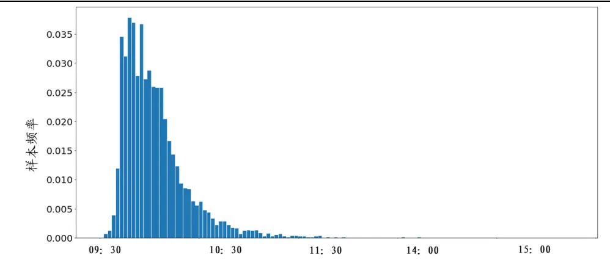
数据来源：Wind、开源证券研究所

进一步我们探寻最极端收益的 alpha 信息。在 2014/01/01-2022/09/30 期间，以全体A 股为研究样本（剔除ST、停牌以及上市不足 60个交易日的次新股），每月底回看过去 20天，计算每天S最高那根 bar的收益率，并将 20天进行平均作为月末调仓的因子，市值行业中性化后测算其选股能力，十分组多空效果如图2 所示。

从图 2 我们可以看出，虽然相比于传统反转因子，最极端收益因子多空年化收益略有降低，从 21.71%降至 19.10%，但信息比率从 1.55 提升至 2.73，胜率从 65.71%提升至 81.90%，最大回撤从13.77%降至 5.71%，为较为有效的改进方案。

图2：相比于传统反转因子，最极端收益因子信息比率从1.55提升至 2.73
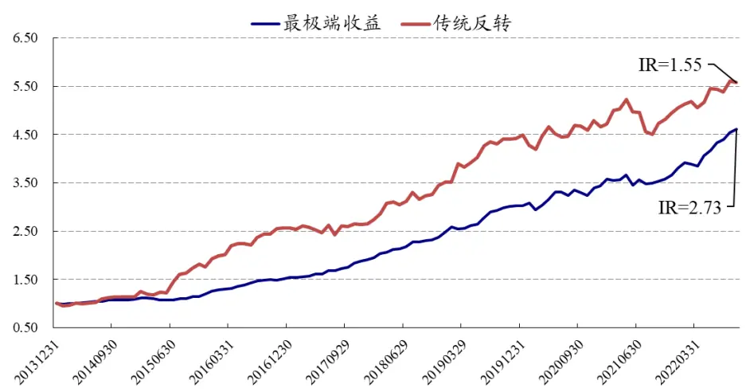
数据来源：Wind、开源证券研究所

进一步地，最极端收益的出现是否会对相邻时段的收益率预测方向以及能力有所影响？为了找到这一答案，我们采取如下方案进行验证：每月底回看过去 20 天，计算每天S 最高那根bar前 30分钟以及后 30分钟内单根 bar收益率，并针对于每根bar收益率进行20 天平均作为月末调仓因子，ICIR如图3所示。

图3：最极端收益前呈现反转，最极端收益后呈现动量（单根 bar收益率 ICIR）
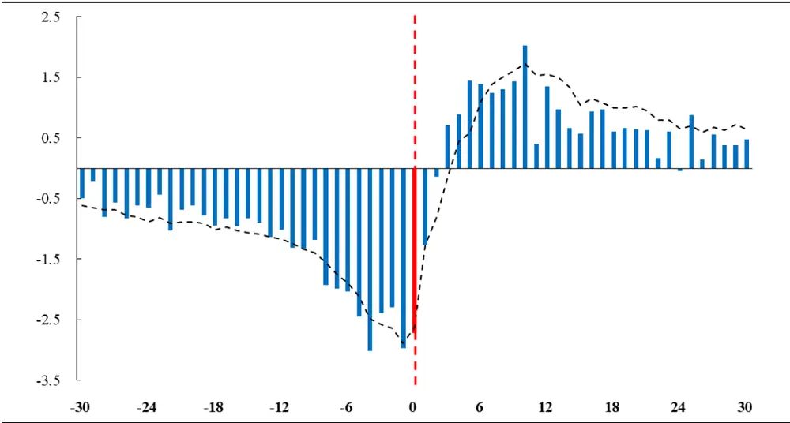
数据来源：Wind、开源证券研究所

从图 3我们可以看出，在S 最高那根bar之前和之后呈现明显不同的选股效应，具体为：

（1）最极端收益前呈现反转特性。我们认为具有强反转的最极端收益的出现打破了弱反转现象，而且从弱反转至强反转会存在一定渐变过程，所以最极端收益前的分钟收益率整体呈现负 IC，且离最极端收益率那根bar越近反转效应越强。

（2）最极端收益后呈现动量特性。我们认为从相关性的传导可以解释这一现象。在这里我们统计了最极端收益前和后的单根bar收益率与最极端收益率的相关性，如图 4 所示。从图 4 我们可以看出：最极端收益前的收益率与最极端收益率呈现正相关，且离最极端收益率越近正相关性越高；最极端收益后的收益率与最极端收益率呈现负相关，且离最极端收益率越近负相关性越高。

图4：最极端收益前后的收益率呈现负相关
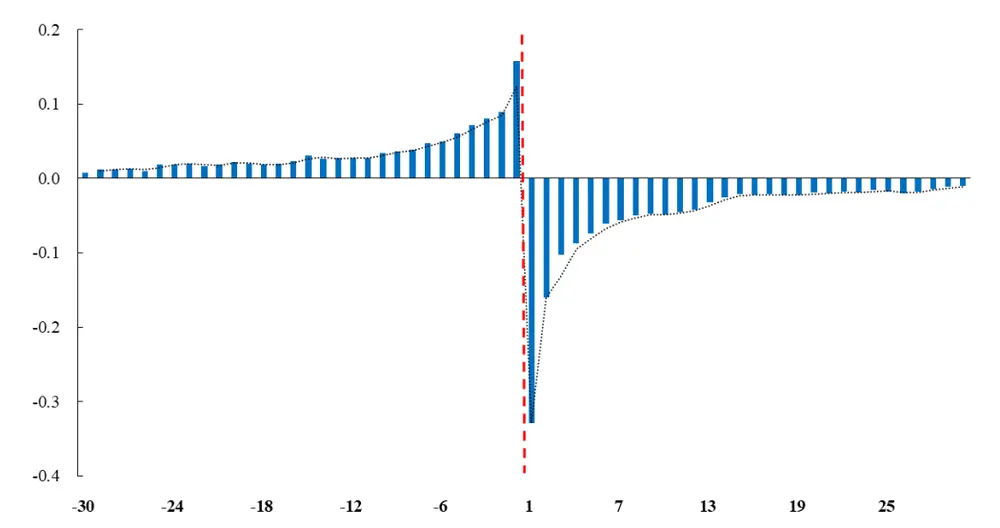
数据来源：Wind、开源证券研究所

结合图4，最极端收益后的动量现象可以被解释为：最极端收益以及之前的分钟收益率与下月收益率为负相关，而且和最极端收益之后分钟收益率也呈现负相关，所以最极端收益率后分钟收益率普遍呈现正IC，上述过程可以被示意为图 5。

图5：最极端收益后动量因子的alpha传导链
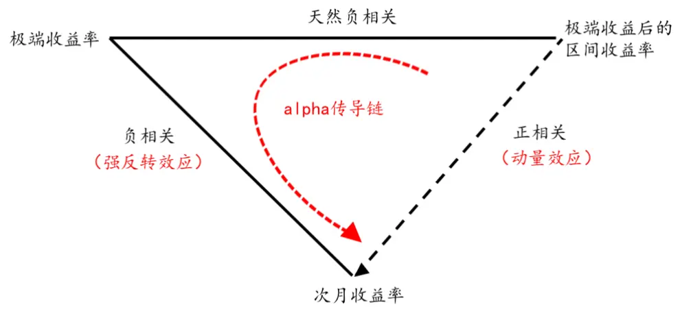
资料来源：开源证券研究所

对于最极端收益因子而言，我们可以进一步进行改进：即把最极端收益率前 1分钟的收益率信息也利用进来。但是考虑到二者可能存在量级的差别，结合方式并不是数值相加，而是使用排序相加，合成后的因子十分组多空对冲净值如图 6 所示。从图 6 我们可以发现：相比于最极端收益，把前 1 分钟收益率也考虑进来效果有一定提升，年化收益率从 19.10%提升至19.58%，信息比例从 2.73提升至3.01。（后续会对极端收益率前纳入的分钟数做敏感性分析，敏感性不高）

图6：相比于最极端收益，考虑前 1分钟后，信息比率从2.73提升至 3.01
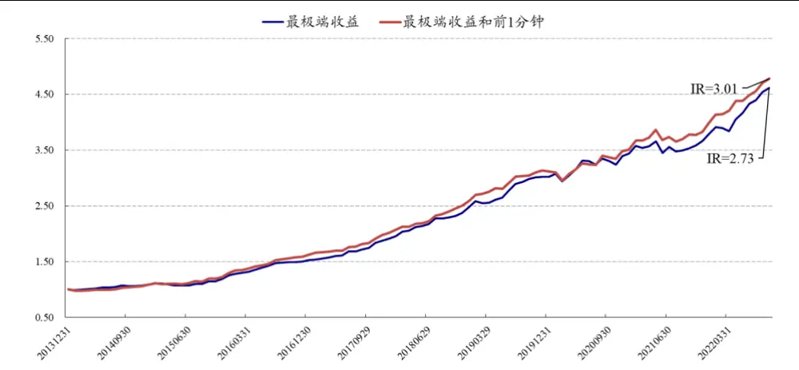
数据来源：Wind、开源证券研究所

## 2、 日内第 N 极端收益的 alpha 信息

在文章的第一部分，我们讨论了最极端收益的相关alpha 信息，接下来我们将最极端这一标准放开，考虑第 N 极端的 alpha 信息，其中第 N 极端收益因子的计算方式为：每月底回看过去 20 天，计算每天第 N 极端收益率，并将 20 天进行平均。进一步我们对参数 N 进行遍历，如图 7 所示，我们发现第 N 极端收益因子选股 ICIR随N 增加基本呈现递减规律，而且在N 大于10之后ICIR绝对幅度就在1.5以下。

图7：单根极端收益率选股ICIR随N增加基本呈现递减规律
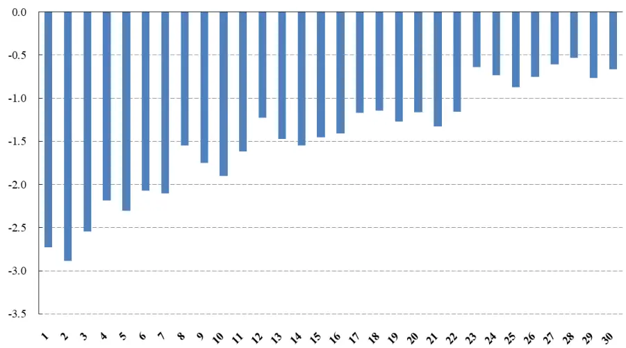
数据来源：Wind、开源证券研究所

在第一部分的分析中，我们发现最极端收益率前 1 分钟也具备一定 alpha 信息。进一步，对于第 N 极端收益率，我们也将其前 1 分钟采用排序合成给包括进去，效果如图 8 所示。我们发现结合各自前 1 分钟收益率之后，所有的单根第N 极端收益的选股 ICIR效果都得到了提升，而且也是基本呈现单调递减的规律。

最后我们将前N（极端收益率+前1 分钟）进行排序合成，如图 9所示，我们可以可以看出：最极端收益+前 1 分钟收益的因子效果是最好的。因此，在本篇报告中，我们定义“最极端收益+前 1 分钟收益”为极端收益率反转因子（Extreme Return

Reversal Factor，简称 ERR 因子）。

图8：单根极端收益率+前 1 分钟选股 ICIR 随 N 增加基本呈现递减规律
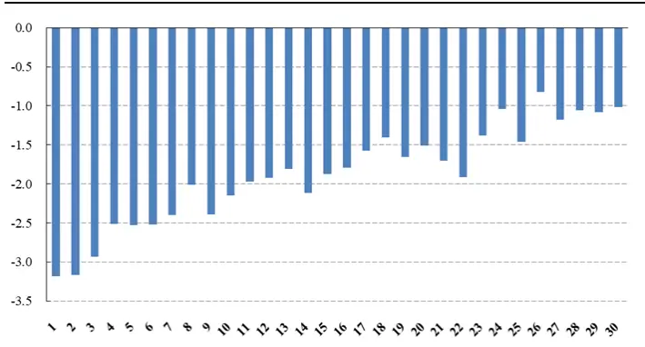
数据来源：Wind、开源证券研究所

图9：前 N（极端收益率+前 1 分钟）选股 ICIR 随 N 增加基本呈现递减规律
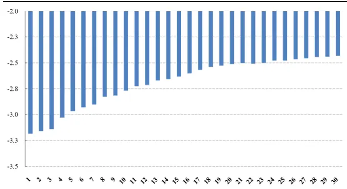
数据来源：Wind、开源证券研究所

对于最终给出的 ERR 因子而言，RankIC 均值-7.08%，RankICIR-3.18，10 分组多空对冲年化收益率 19.58%，信息比率3.01，胜率81.90%，最大回撤5.71%。其 10分组的效果如图 10所示。

图10：ERR因子的 10分组多空信息比率为 3.01
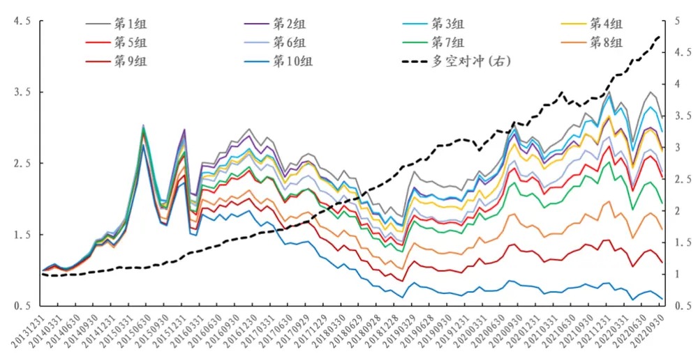
数据来源：Wind、开源证券研究所

## 3、 ERR因子其他重要讨论

## 3.1、 最极端收益率结合前 t分钟的参数敏感性不高

在上文因子的定义中，我们使用了最极端收益和前 1 分钟的收益率合成，这里我们将前 1分钟扩展至前t分钟，其敏感性分析效果如表 1所示。

表1：最极端收益率结合前 t分钟的参数敏感性不高

|  | t=1 | t=2 | t=3 | t=4 | t=5 |
| --- | --- | --- | --- | --- | --- |
| 年化收益率 | 19.58% | 19.64% | 18.59% | 19.10% | 19.32% |
| 年化波动率 | 6.50% | 6.74% | 6.29% | 6.70% | 6.68% |
| 收益波动比 | 3.01 | 2.91 | 2.96 | 2.85 | 2.89 |
| 最大回撤 | 5.71% | 8.39% | 9.29% | 9.48% | 10.83% |
| 多空月度胜率 | 81.90% | 80.00% | 81.90% | 79.05% | 82.86% |

数据来源：Wind、开源证券研究所

## 3.2、 ERR因子在各类样本空间普遍适用

接下来我们进一步探讨 ERR 因子在其他样本空间中的表现。ERR 因子在沪深300 内多空和多头收益波动比分别为 1.13 和 0.36，中证 500 内因子的多空和多头的收益波动比分别为 0.94和0.31，中证1000内因子的多空和多头的收益波动比分别为1.82 和 0.35。

表2：ERR因子在其他样本空间依然具有一定选股能力

| 多空对冲 |  |  |  |  | 多头 |  |  |  |
| --- | --- | --- | --- | --- | --- | --- | --- | --- |
|  | 全市场 | 沪深300 | 中证500 | 中证1000 | 全市场 | 沪深300 | 中证500 | 中证1000 |
| 年化收益率 | 19.58% | 7.19% | 5.79% | 11.70% | 13.94% | 8.01% | 7.88% | 10.55% |
| 年化波动率 | 6.50% | 6.37% | 6.17% | 6.43% | 28.03% | 22.14% | 25.06% | 29.78% |
| 收益波动比 | 3.01 | 1.13 | 0.94 | 1.82 | 0.50 | 0.36 | 0.31 | 0.35 |
| 最大回撤 | 5.71% | 6.03% | 8.50% | 11.18% | 42.11% | 44.60% | 49.66% | 50.40% |
| 月度胜率 | 81.90% | 62.86% | 61.90% | 79.05% | 53.33% | 57.14% | 55.24% | 51.43% |

数据来源：Wind、开源证券研究所

## 3.3、 ERR因子与传统 Barra 因子相关性不高

进一步地，ERR 因子和传统 Barra 因子进行相关性分析。从表 3 可以看出，该因子和流动性、波动性因子相关性较高。为剔除风格和行业的干扰，每月底将 ERR因子进行 Barra 风格因子以及行业中性化，全市场 10 分组及多空对冲净值走势如图11所示。纯净新因子多空对冲的年化收益为9.49%，信息比率为1.88，胜率为68.57%，最大回撤为 4.84%。

表3：ERR因子与传统Barra因子相关性不高

| Beta | 价值 | 杠杆 | 盈利 | 成长 | 流动性 | 动量 | 非线性规模 | 波动 | 规模 |
| --- | --- | --- | --- | --- | --- | --- | --- | --- | --- |
| 9.92% | -14.96% | -2.10% | -16.29% | -4.04% | 22.94% | 1.85% | -1.40% | 23.88% | -7.99% |

数据来源：Wind、开源证券研究所

图11：ERR因子提纯后的 10分组多空信息比率1.88
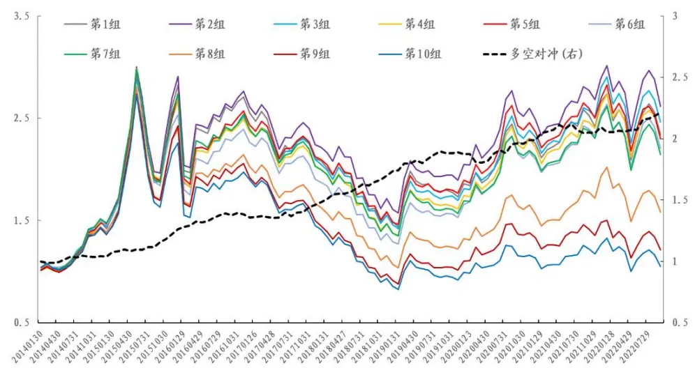
数据来源：Wind、开源证券研究所

## 3.4、 极端收益后的动量效应可被 ERR因子完全解释

在前文讨论中，我们聚焦于“反转因子”的构建，而没有过多关注“极端收益后的动量因子”，这是因为，从图 5 所示的 alpha 传导链看，我们偏向于认为“极端收益后的动量效应”可被ERR因子完全解释。为了进一步验证这一猜想，我们测算了极端收益后 20 分钟区间收益因子 10 分组多空对冲，以及回归 ERR 因子后的 10分组多空对冲效果，结果如图 12 所示。我们可以看出，在回归掉 ERR 因子后，残差基本没有选股效果，这也进一步证实了极端收益后动量效应并不是独立的 alpha 来源。

虽然极端收益后的动量效应可以被解释，并不是独立的 alpha 来源，但是在 A股反转效应为主的海洋中，能够找出由真实收益率构造出的动量因子还是非常难能可贵的。

图12：极端收益后20分钟区间收益因子回归 ERR因子后残差不再有选股效果
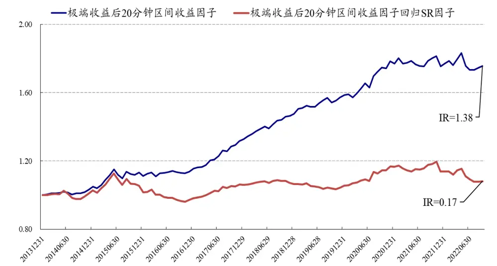
数据来源：Wind、开源证券研究所

## 4、 风险提示

模型测试基于历史数据，市场未来可能发生变化。

## 特别声明

《证券期货投资者适当性管理办法》、《证券经营机构投资者适当性管理实施指引（试行）》已于2017年7月1日起正式实施。根据上述规定，开源证券评定此研报的风险等级为R3（中风险），因此通过公共平台推送的研报其适用的投资者类别仅限定为专业投资者及风险承受能力为C3、C4、C5的普通投资者。若您并非专业投资者及风险承受能力为C3、C4、C5的普通投资者，请取消阅读，请勿收藏、接收或使用本研报中的任何信息。

因此受限于访问权限的设置，若给您造成不便，烦请见谅！感谢您给予的理解与配合。

## 分析师承诺

负责准备本报告以及撰写本报告的所有研究分析师或工作人员在此保证，本研究报告中关于任何发行商或证券所发表的观点均如实反映分析人员的个人观点。负责准备本报告的分析师获取报酬的评判因素包括研究的质量和准确性、客户的反馈、竞争性因素以及开源证券股份有限公司的整体收益。所有研究分析师或工作人员保证他们报酬的任何一部分不曾与，不与，也将不会与本报告中具体的推荐意见或观点有直接或间接的联系。

## 股票投资评级说明

|  | 评级 | 说明 |
| --- | --- | --- |
| 证券评级 | 买入（Buy） | 预计相对强于市场表现20%以上； |
|  | 增持（outperform） | 预计相对强于市场表现5%～20%； |
|  | 中性（Neutral） | 预计相对市场表现在—5%～+5%之间波动； |
|  | 减持（underperform） | 预计相对弱于市场表现5%以下。 |
| 行业评级 | 看好（overweight） | 预计行业超越整体市场表现； |
|  | 中性（Neutral） | 预计行业与整体市场表现基本持平； |
|  | 看淡（underperform） | 预计行业弱于整体市场表现。 |
| 备注：评级标准为以报告日后的6~12个月内，证券相对于市场基准指数的涨跌幅表现，其中A股基准指数为沪深300指数、港股基准指数为恒生指数、新三板基准指数为三板成指（针对协议转让标的）或三板做市指数（针对做市转让标的)、美股基准指数为标普500或纳斯达克综合指数。我们在此提醒您，不同证券研究机构采用不同的评级术语及评级标准。我们采用的是相对评级体系，表示投资的相对比重建议；投资者买入或者卖出证券的决定取决于个人的实际情况，比如当前的持仓结构以及其他需要考虑的因素。投资者应阅读整篇报告，以获取比较完整的观点与信息，不应仅仅依靠投资评级来推断结论。 |  |  |

## 分析、估值方法的局限性说明

本报告所包含的分析基于各种假设，不同假设可能导致分析结果出现重大不同。本报告采用的各种估值方法及模型均有其局限性，估值结果不保证所涉及证券能够在该价格交易。

## 法律声明

开源证券股份有限公司是经中国证监会批准设立的证券经营机构，已具备证券投资咨询业务资格。

本报告仅供开源证券股份有限公司（以下简称“本公司”）的机构或个人客户（以下简称“客户”）使用。本公司不会因接收人收到本报告而视其为客户。本报告是发送给开源证券客户的，属于商业秘密材料，只有开源证券客户才能参考或使用，如接收人并非开源证券客户，请及时退回并删除。

本报告是基于本公司认为可靠的已公开信息，但本公司不保证该等信息的准确性或完整性。本报告所载的资料、工具、意见及推测只提供给客户作参考之用，并非作为或被视为出售或购买证券或其他金融工具的邀请或向人做出邀请。本报告所载的资料、意见及推测仅反映本公司于发布本报告当日的判断，本报告所指的证券或投资标的的价格、价值及投资收入可能会波动。在不同时期，本公司可发出与本报告所载资料、意见及推测不一致的报告。客户应当考虑到本公司可能存在可能影响本报告客观性的利益冲突，不应视本报告为做出投资决策的唯一因素。本报告中所指的投资及服务可能不适合个别客户，不构成客户私人咨询建议。本公司未确保本报告充分考虑到个别客户特殊的投资目标、财务状况或需要。本公司建议客户应考虑本报告的任何意见或建议是否符合其特定状况，以及（若有必要）咨询独立投资顾问。在任何情况下，本报告中的信息或所表述的意见并不构成对任何人的投资建议。在任何情况下，本公司不对任何人因使用本报告中的任何内容所引致的任何损失负任何责任。若本报告的接收人非本公司的客户，应在基于本报告做出任何投资决定或就本报告要求任何解释前咨询独立投资顾问。

本报告可能附带其它网站的地址或超级链接，对于可能涉及的开源证券网站以外的地址或超级链接，开源证券不对其内容负责。本报告提供这些地址或超级链接的目的纯粹是为了客户使用方便，链接网站的内容不构成本报告的任何部分，客户需自行承担浏览这些网站的费用或风险。

开源证券在法律允许的情况下可参与、投资或持有本报告涉及的证券或进行证券交易，或向本报告涉及的公司提供或争取提供包括投资银行业务在内的服务或业务支持。开源证券可能与本报告涉及的公司之间存在业务关系，并无需事先或在获得业务关系后通知客户。

本报告的版权归本公司所有。本公司对本报告保留一切权利。除非另有书面显示，否则本报告中的所有材料的版权均属本公司。未经本公司事先书面授权，本报告的任何部分均不得以任何方式制作任何形式的拷贝、复印件或复制品，或再次分发给任何其他人，或以任何侵犯本公司版权的其他方式使用。所有本报告中使用的商标、服务标记及标记均为本公司的商标、服务标记及标记。

## 开源证券研究所

上海

地址：上海市浦东新区世纪大道1788号陆家嘴金控广场1号

楼10层

邮编：200120

邮箱：research@kysec.cn

北京
地址：北京市西城区西直门外大街18号金贸大厦C2座9层
邮编：100044
邮箱：research@kysec.cn

地址：深圳市福田区金田路2030号卓越世纪中心1号

邮编：518000

邮箱：research@kysec.cn

西安
地址：西安市高新区锦业路1号都市之门B座5层
邮编：710065
邮箱：research@kysec.cn