2022 年 12 月 18 日

## 金融工程研究团队

魏建榕（首席分析师）

证书编号：S0790519120001

张 翔（分析师）

证书编号：S0790520110001

傅开波（分析师）

证书编号：S0790520090003

## 高 鹏（分析师）

# 大小单资金流 alpha 探究 2.0：变量精筛与高频测算

证书编号：S0790520090002

## 苏俊豪（分析师）

证书编号：S0790522020001

## 胡亮勇（分析师）

证书编号：S0790522030001

## 王志豪（分析师）

证书编号：S0790522070003

## 盛少成（研究员）

证书编号：S0790121070009

## 苏 良（研究员）

证书编号：S0790121070008

## 何申昊（研究员）

证书编号：S0790122080094

## 相关研究报告

《主动买卖因子的正确用法—市场微观结构研究系列（9）》-2020.09.05《大单与小单资金流的 alpha 能力—市场微观结构研究系列（12）》-2021.06.02

《新型因子：资金流动力学与散户羊群效应—市场微观结构研究系列（14）》-2022.06.02

# ——市场微观结构研究系列（18）

## 魏建榕（分析师）

weijianrong@kysec.cn

盛少成（联系人）

证书编号：S0790519120001

shengshaocheng@kysec.cn

证书编号：S0790121070009

## 大小单资金流研究回顾

对于大小单资金流的研究，在之前系列报告中，我们分别从资金流强度以及相关性结构两个角度出发，挖掘出了大小单残差以及散户羊群效应因子。其中在大小单残差因子的挖掘中，我们发现剥离收益率缠绕的资金流强度选股效果显著增强。而对于散户羊群效应因子，我们首次从小单资金流的角度进行了定义，选股效果较好且有独立信息增量。通过对两大因子的绩效跟踪，我们发现样本内外皆较为优异，但是其还有进一步改进的空间：1、变量的精筛；2、数据的高频化。

## 大小单残差因子的改进

对于原始大单残差，其使用的方式为大单资金流回归收益率，但是其中的非主动大单强度与收益率明显不相关，除此之外主动中单残差也具备一定正向选股能力，因此在变量精筛部分我们做的改进为：将主动大单净流入和主动中单净流入相加，计算主动大中单残差，再和非主动大单强度排序相加。相比于原始大单残差，改进大单残差 10分组多空信息比率从3.48提升至 4.81。

对于原始小单残差，其使用的方式为小单资金流回归收益率，但是其中主动小单性质在 2017 年后发生变化，其或和市场成熟度提高，机构的拆单行为有关，所以我们在计算小单残差时不再考虑主动小单，只使用非主动小单残差。相比于原始小单残差，改进小单残差 10分组多空信息比率从 3.02提升至 3.56。

进一步地，我们对于改进大/小单残差进行高频化测算，最终发现维持日频的做法，即对于资金流强度以及月度收益率的计算，使用每月底回看过去 20 天的日度资金净流入和日度收益率是较优的做法。

## 散户羊群效应的改进

对于原始散户羊群效应而言，其计算方式为：当前交易日收益率 $.R_{t}$ 与下个交易日小单净流入 $S_{t+1}$ 之间的秩相关系数。对于其的改进，我们可以归纳为以下 3 点：（1）对于 $\cdot R_{t}$ 的计算，使用日内收益率 $\cdot close_{t}/open_{t}-1$ 代替 $\cdot close_{t}/close_{t-1}-1$ ；（2）由于主动小单2017年后性质的变化，我们使用小单非主动净流入代替小单全部净流入；（3）对于小单非主动而言，使用开盘至10 点之间的净流入代表 $S_{t+1^{\circ}}$ 相比于原始散户羊群效应因子，改进散户羊群效应因子 10 分组多空信息比率从2.51提升至 3.01，最大回撤从 8.85%降至 3.15%，为较为有效的改进方案。

## 大小单资金流综合应用方案

我们将改进大单残差、改进小单残差、改进散户羊群效应排序等权合成，将其命名为大小单综合资金流因子，该因子 RankIC 均值 7.89%，RankICIR3.99，10分组多空对冲年化收益率35.36%，信息比率4.82，胜率89.19%，最大回撤2.09%，绩效非常优异。除此之外，该因子在沪深300、中证 500、中证 1000中多空对冲收益波动比分别为：1.92、2.71、4.26。最后，我们对大小单综合资金流因子进行行业风格中性化，纯净新因子多空对冲信息比率依旧可达 3.83。

- 风险提示：模型测试基于历史数据，市场未来可能发生变化。

资金流行为通过逐笔成交数据计算得到, 反映了股票的微观供求信息。按照通常习惯，资金流向被依据挂单金额的大小，分为四种类型进行统计：超大单（>100 万元）、大单（20-100 万元）、中单（4-20 万元）和小单（<4 万元）。资金净流入意味着该类资金持有的筹码增多，资金净流出则意味着持有的筹码减少。对于大小单资金流的研究而言，在之前系列报告中，我们分别从资金流强度以及相关性结构两个角度出发，挖掘出了大小单残差以及散户羊群效应因子，具体结论陈列如下：

（1）在《大单与小单资金流的 alpha能力》中，我们发现：大单资金流强度与涨跌幅显著呈同步正相关，且存在正向预测作用；相反，小单资金流强度与涨跌幅显著呈同步负相关，且存在负向预测作用；进一步，我们构造了剥离“反转缠绕效应”的大单和小单资金流强度，选股能力大幅提升。

（2）在《新型因子：资金流动力学与散户羊群效应》中，我们首次从小单资金流的角度来定义散户羊群效应，具体为：针对某只股票而言，计算当前交易日收益率 $\cdot R_{t}$ 与下个交易日小单净流入 $\mathcal{S}_{t+1}$ 之间的秩相关系数，该因子选股效果较好且有独立信息增量。

对于大小单残差和散户羊群效应而言，样本内外的绩效皆较为优异，但是我们发现其还有进一步改进的空间，主要的改进维度有如下两点：1、变量的精筛；2、数据的高频化。

## 1、 大小单残差因子的再思考

## 1.1、 原始大小单残差因子样本内外绩效皆较为优异

对于原始大小单残差而言，其本质为：剥离收益率缠绕的资金流强度。就 alpha的理解，我们以大单为例，给出其切分示意（图 1）。大单资金流强度因子具有正向alpha，我们可以将整体 alpha 切分为正向 alpha 和负向 alpha 两部分。我们假设大单资金流强度因子的多头组合对应大单的净流入，而大单净流入往往伴随股价上涨，因此组合会负向暴露反转因子贡献负向alpha；另外，由于大单本身具有正向预见性，这一部分贡献正向 alpha，也即剥离涨跌幅影响后的大单残差资金流强度因子。

在 2013/01/01-2022/10/31 期间，以全体 A 股为研究样本（剔除 ST、停牌以及上市不足 60个交易日的次新股），市值行业中性化后进行 10分组回测（后续回测若无明确说明，皆为市值行业中性化）。原始大单残差的RankIC 均值 6.71%，RankICIR3.44，10 分组多空对冲年化收益率26.62%，信息比率3.48，胜率 79.49%，最大回撤4.21%。原始小单残差的 RankIC 均值-5.56%，RankICIR-2.90，10 分组多空对冲年化收益率23.04%，信息比率 3.02，胜率 82.91%，最大回撤 3.38%。

从回测绩效来看，原始大单残差和原始小单残差的多空信息比率都达到了 3 以上，而且从图 2 可以看出，二者样本外的表现依旧较为稳健，其中原始大单残差的效果会更加优异一些。

图1：以大单为例：原始大单残差 alpha来源的解释
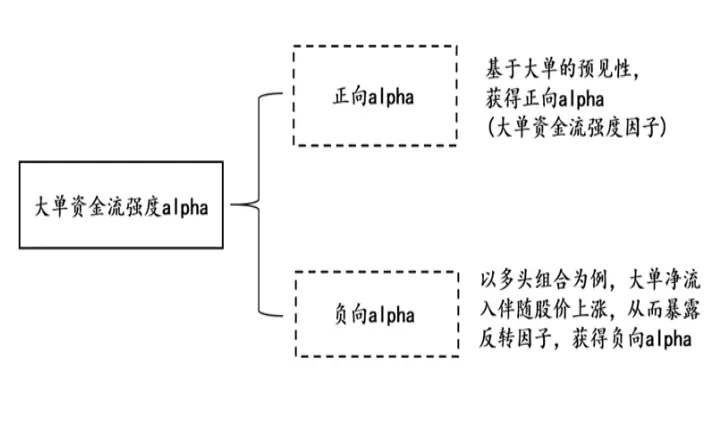
资料来源：开源证券研究所

图2：原始大小单残差因子选股效果皆较为优异
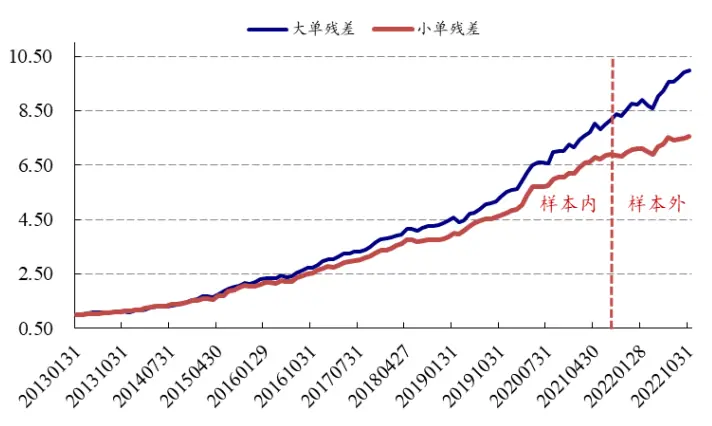
数据来源：Wind、开源证券研究所

## 1.2、 原始大单残差因子的改进：变量精筛

针对 4 类资金流超大、大、中、小单而言，主动与非主动的区分是否会对资金流属性：“与收益率相关性”产生影响？为了找到这一答案，每月底回看过去20 天，我们将 4类资金流按照主动/非主动拆分开，计算这 8 类资金流净流入强度。由于考虑到不同股票净流入量级的差别，在计算时需要对其进行标准化，这里沿用之前报告《大单与小单资金流的alpha 能力》里的方式，如表 1所示。最后，对于每类资金流，我们分别计算与 20天累积收益率的相关性，结果如图 3 所示。

表1：资金流净流入强度因子的标准化方法

| 标准化方法 | 标准化方法公式 | 标准化方法含义 |
| --- | --- | --- |
| 净流入金额绝对值 | Σt-T buyt − Sellt | 分母是过去T个交易日个股的大单净流入金 |
|  | S3 = Σt-T \|buyt − Sellt\| | 额绝对值之和进行标准化 |

资料来源：开源证券研究所

图3：除了超大，其他三类资金流主动和非主动净流入强度与收益率相关性差别较大
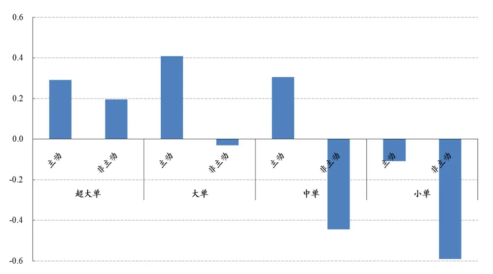
数据来源：Wind、开源证券研究所

从图 3 我们可以发现，除了超大单的主动和非主动净流入强度与收益率的相关性方向和幅度差不多，其它三类资金流差别皆较大。大单的非主动净流入强度与收益率基本无相关性；中单的主动和非主动净流入强度与收益率的相关性是反向的；小单主动与非主动净流入强度与收益率相关性虽然都是负向的，但主动净流入强度与收益率的相关性较弱。

对于原始大单残差，其使用的方式为大单资金流回归收益率，但是其中的非主动大单强度与收益率明显不相关，我们改进的方式可以为：计算主动大单残差以及非主动大单强度，然后将主动大单残差和非主动大单强度排序相加。除此之外，主动中单残差也具备一定正向选股能力，RankIC为2.52%，RankICIR为 1.61，所以我们将主动中单残差也考虑进去，观察是否能够进一步改进因子的效果。综上，针对原始大单残差的改进，我们尝试了如下3种测算方案：

（1）主动大单残差；

（2）主动大单残差与非主动大单强度排序相加；

（3）将主动大单净流入和主动中单净流入相加，计算主动大中单残差，再和非主动大单强度排序相加。

以上 3种测算净值图与原始大单残差的10 分组多空对冲如图 4所示。从图中可以看出：（1）相比于原始大单残差，主动大单残差与非主动大单强度排序相加之后，虽然多空年化收益相近，但更加稳定，信息比率从 3.48 提升至 3.98；（2）主动大中单残差和非主动大单强度排序相加之后的效果最好，10 分组的多空信息比率达到4.81，是对原始大单残差较为有效的改进。

图4：大中单残差和非主动大单强度排序相加后，10分组多空信息比率 4.81
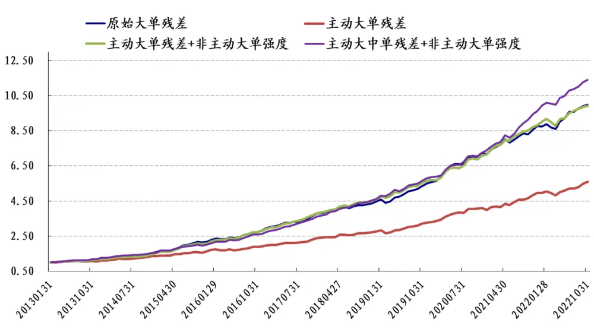
数据来源：Wind、开源证券研究所

最终，我们将大中单残差和非主动大单强度排序相加后作为改进大单残差因子，其10分组分层净值图如图5所示。改进大单残差的RankIC均值6.70%，RankICIR3.84，10 分组多空对冲年化收益率28.37%，信息比率4.81，胜率 91.45%，最大回撤2.36%。

图5：相比于原始大单残差，改进后的大单残差多空信息比率从 3.48提升至4.81
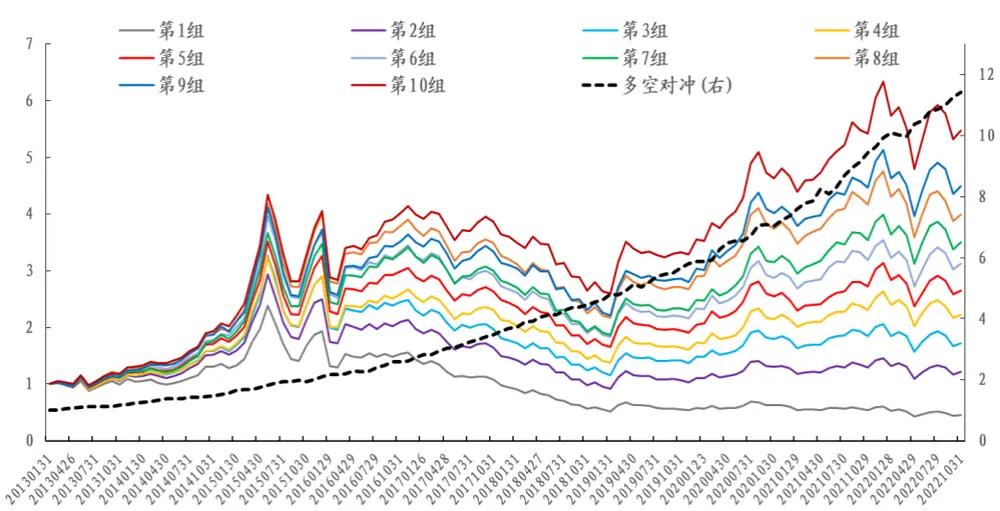
数据来源：Wind、开源证券研究所

## 1.3、 原始小单残差因子的改进：变量精筛

结合图3，对于原始小单残差，其使用的方式为小单资金流回归收益率，但是其中的主动小单强度与收益率明显不相关，我们改进的方式可以为：计算非主动小单残差以及主动小单强度，然后将非主动小单残差和主动小单强度排序相加。除此之外，非主动中单残差也具备一定负向选股能力，RankIC 为-1.73%，RankICIR 为-1.35，所以我们将非主动中单残差也考虑进去，观察是否能够进一步改进因子的效果。综上，针对于原始小单残差的改进，我们也尝试了如下3 种方案的测算：

（1）非主动小单残差；

（2）非主动小单残差与主动小单强度排序相加；

（3）将非主动小单净流入和非主动中单净流入相加，计算非主动中小单残差，再和主动小单强度排序相加。

以上 3种测算净值图与原始小单残差的10 分组多空对冲如图 6所示。从图中可以看出：（1）相比于原始小单残差，非主动小单残差与主动小单强度排序相加之后，虽然多空年化收益相近，但更加稳定，信息比率从 3.02 提升至 3.17；（2）非主动小单残差效果最好，10 分组的多空信息比率达到 3.56，是对原始小单残差较为有效的改进；（3）在非主动小单残差 3.56 的信息比率基础上，叠加主动小单强度后下降至3.17，再考虑非主动中单后进一步下降至2.97。

图6：非主动小单残差10分组信息比率 3.56
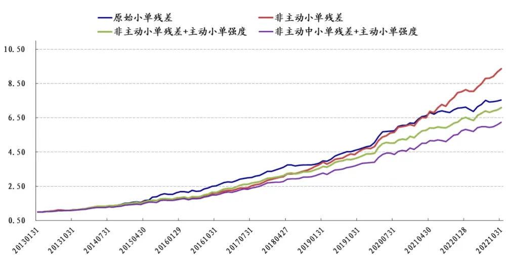
数据来源：Wind、开源证券研究所

对于叠加主动小单强度后效果变差的现象，我们认为是主动小单性质发生了变化。为了解释这一现象，我们统计了主动小单和非主动小单净流入强度与同期收益率的相关系数，结果如图7 所示。从图 7中我们可以看出，在 2017年后市场成熟度逐渐变高，包括机构的拆单行为变得更加频繁，主动小单的性质逐渐变化，与收益率之间的相关性从原来的负相关变成现在的正相关，所以我们在计算小单残差时不再考虑小单主动。

图7：小单主动强度在 2017年前和 2017年后与收益率相关性差别较大
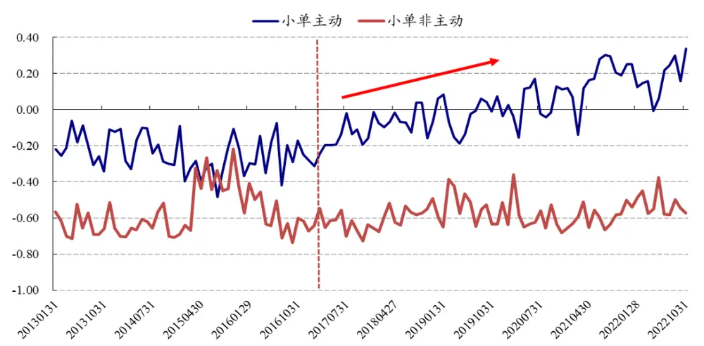
数据来源：Wind、开源证券研究所

而对于叠加非主动中单资金流效果变差的原因，我们认为是其存在正 IC 部分。首先，通过测算，我们发现非主动小单残差和非主动中单残差相关性较高，达到了51.42%。进一步地，非主动中单残差回归非主动小单残差之后的部分RankIC为1.76%，RankICIR 为1.49，具有正向选股能力，所以直接相加去叠加非主动中单残差会削弱非小单主动残差的负向选股效果。

最终，我们使用非主动小单残差作为改进小单残差因子，其 10 分组多空对冲曲线如图 8 所示。改进小单残差的 RankIC 均值-5.59%，RankICIR-3.20，10 分组多空对冲年化收益率 25.78%，信息比率 3.56，胜率 81.20%，最大回撤 3.32%。

图8：相比于原始小单残差，改进后的小单残差多空信息比率从 3.02提升至3.56
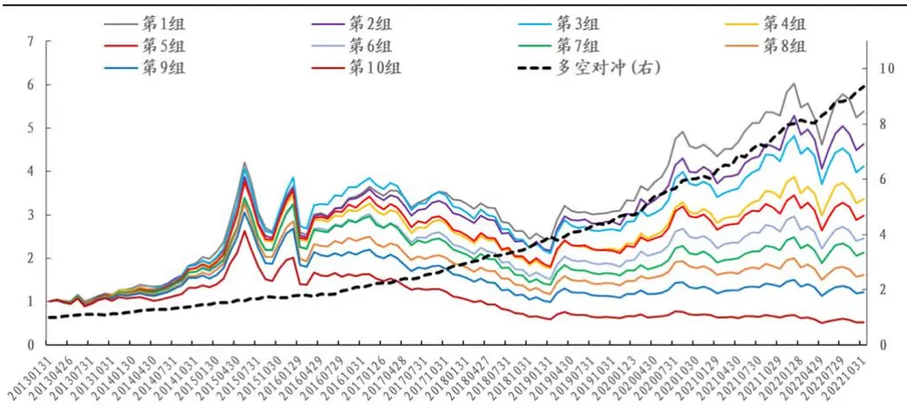
数据来源：Wind、开源证券研究所

## 1.4、 改进大小单残差因子的高频化测算

对于改进后的大单残差和小单残差而言，效果已有较大的提升，这里我们对其进行数据升频，观察效果能否有进一步提升，具体做法如下：（1）在计算资金流强度时，每月底回看过去20天，每天只使用昨收至今天第N分钟的净流入；（2）同样地，在计算月度收益率时，每月底回看过去 20 天,每天也只使用昨收至今天第 N 分钟的收益率。随着 N 从 09：25 遍历至 15：00，改进大单残差和改进小单残差的效果如图 9及图 10 所示。从图中我们发现，对于改进大/小单残差而言，在 15：00 时的效果都是相对较优的，所以我们维持日频的做法，即对于资金流强度以及月度收益率的计算，使用的是每月底回看过去 20 天的日度资金净流入和日度收益率。

图9：随着参数 N 的变化，改进大单残差 RankICIR 在15：00效果最优
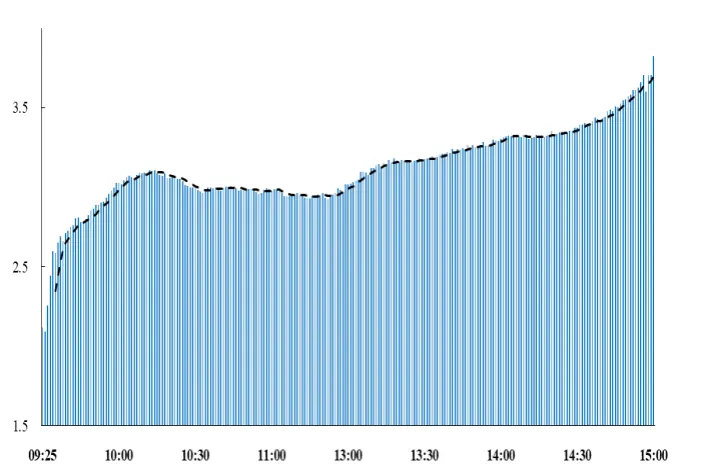
数据来源：Wind、开源证券研究所

图10：随着参数 N 的变化，改进小单残差的 RankICIR变化不明显，在 15：00时也是相对较优的状态
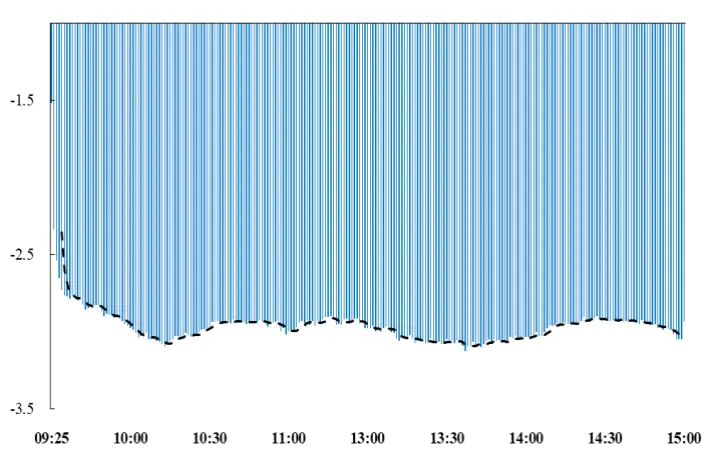
数据来源：Wind、开源证券研究所

## 2、 散户羊群效应的再思考

## 2.1、 原始散户羊群效应的历史绩效较为优异

针对第一部分探讨的大小单残差因子而言，其属于资金流强度范畴。而我们在《新型因子：资金流动力学与散户羊群效应》中发现资金流相关性结构也存在一定alpha 信息，其中当前交易日的小单 $S_{t}$ 与下个交易日小单净流入 $\mathcal{S}_{t+1}$ 之间的秩相关系数效果较好。究其根源，我们发现散户羊群效应即当前交易日收益率 $\cdot R_{t}$ 与下个交易日小单净流 $入S_{t+1}.$ 之间的秩相关系数 $RankCorr(R_{t},S_{t+1})$ ，可以完全解释小单错位相关性，为真正的 alpha源，示意图如图 11所示。

在 2013/01/01-2022/10/31 期间，以全体 A 股为研究样本（剔除 ST、停牌以及上市不足 60个交易日的次新股），市值行业中性化后10 分组进行回测，原始散户羊群效应的 RankIC 均值-4.90%，RankICIR-2.35，10 分组多空对冲年化收益率 16.88%，信息比率 2.51，胜率 81.20%，最大回撤 8.85%。

通过图 12 可以看出，该因子有效但信息比率不高以及最大回撤较大，尤其在2021 年以来波动较大，因此我们想对该因子进行改进，改进的思路主要为：代理变量的细化以及高频化的尝试。

图11：小单错位相关性的alpha来源
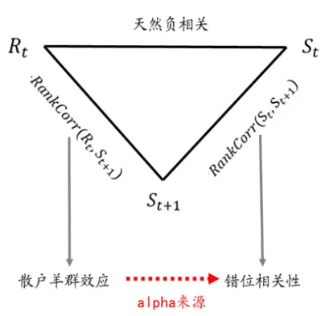
资料来源：开源证券研究所

图12：原始散户羊群效应的10分组多空对冲表现优异
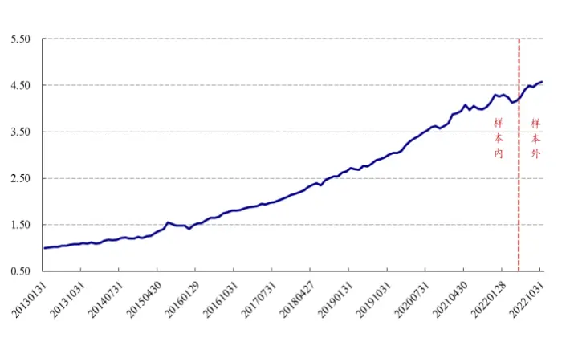
数据来源：Wind、开源证券研究所

## 2.2、 原始散户羊群效应的改进：变量精筛

在第一部分小单残差的改进中，我们发现主动小单强度与收益率同期的相关性在 2017年前后发生了较大的变化。进一步地，为了验证主动小单的羊群效应是否也在 2017年后发生较大的变化，我们分别在 2017年前后计算全体A 股“过去N日收益率”与“主动小单未来 N 日净流入”的相关系数中位数。作为对照，我们对非主动小单净流入也做了如上的操作，结果如图 13 所示。从图 13 我们可以看出主动小单 2017 年后的羊群效应明显弱于 2017 年前，而非主动小单的羊群效应并没有发生明显变化。

图13：主动小单2017年后的羊群效应明显弱于 2017年前
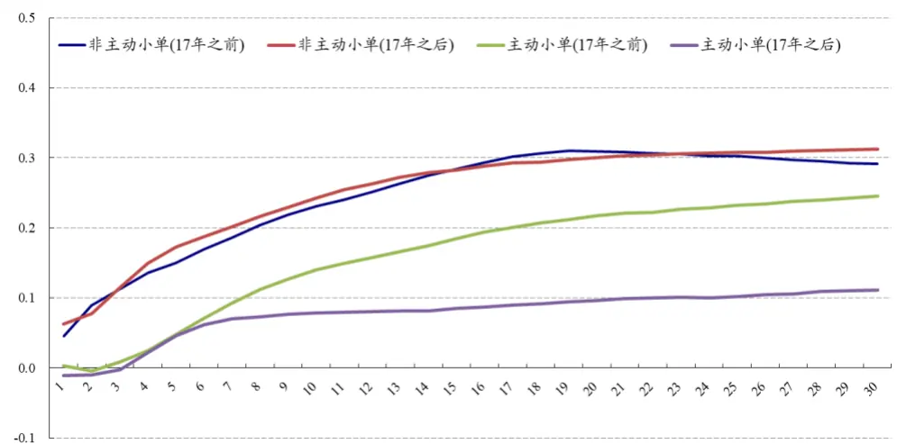
数据来源：Wind、开源证券研究所

进一步地，为了测试由于主动小单的性质变化，散户羊群效应因子受到的影响程度如何？我们使用全部小单资金流和非主动资金流计算散户羊群效应，其二者 10分组多空对冲曲线以及相对强弱如图14所示。我们可以发现代表相对强弱的灰色阴影部分在2017年以后就基本走平，说明主动小单性质的变化确实对因子的效果产生了影响，所以后续使用非主动小单来计算散户羊群效应。

图14：2017年后，主动小单净流入在散户羊群效应中的贡献基本消失
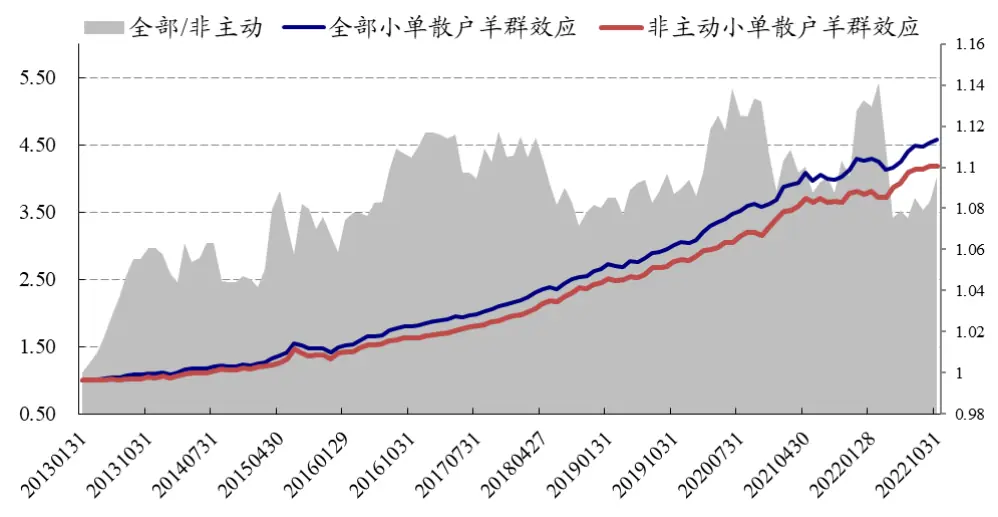
数据来源：Wind、开源证券研究所

## 2.3、 原始散户羊群效应的改进：高频化的新发现

## 1、 $R_{t}$ 的高频化

对于原始散户羊群效应 $RankCorr(R_{t},S_{t+1})$ 而言，之前在计算 $.R_{t}$ 时我们使用的是$close_{t}/close_{t-1}-1$ ，在本篇报告中我们将计算维度细化到分钟频，具体做法为：每月底回看过去 20天，计算从昨天收盘至今天收盘这个时间段内，第N分钟至今天收盘的区间收益率与下个交易日非主动小单净流入之间秩相关系数，并验证其选股效果，RankICIR如图15所示。从图 15 可以看出，随着N从 14：57至 09：25，选股RankICIR 绝对幅度基本呈现了单调递增的情况，而从 09：25 到昨 15：00，选股效果明显变差。所以，对于散户羊群效应因子中 $R_{t}$ 的计算， $close_{t}/open_{t}$ −1为更优的选择。

图15：对于散户羊群效应因子中 $R_{t}$ 的计算，日内收益率为更优的选择
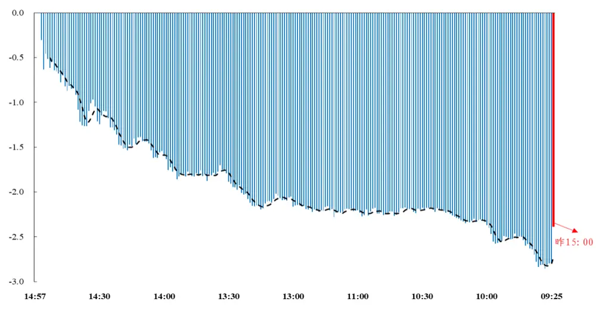
数据来源：Wind、开源证券研究所

## 2、 $s_{t+\mathbf{1}}$ 的高频化

对于原始散户羊群效应 $RankCorr(R_{t},S_{t+1})$ 而言，之前在计算 $\cdot S_{t+1}$ 时我们使用的是日度的非主动小单净流入。进一步地，我们从分钟频角度出发，每月底回看过去20天，计算当日收益率与下个交易日非主动小单第N分钟之前净流入的秩相关系数，并验证其选股效果，RankICIR 如图 16 所示。从图 16 可以看出：随着 N 从 09：25至 15：00，选股RankICIR在早盘出现了极值点，所以，对于散户羊群效应因子中 $S_{t+1}$ 的计算，后续我们使用开盘至 10：00 前的非主动小单净流入。

图16：对于散户羊群效应因子中 $S_{t+1}$ 的计算，使用开盘至 10：00 前的非主动小单净流入为更优的选择
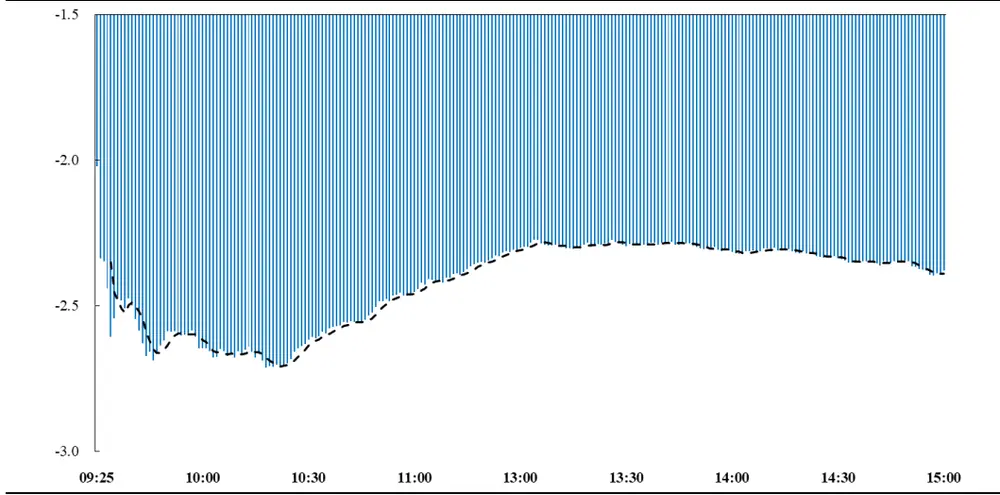
数据来源：Wind、开源证券研究所

## 3、改进后的羊群效应

综上，对于原始散户羊群效应 $RankCorr(R_{t},S_{t+1})$ 的改进，可以归纳为以下3点：（1）对于 $R_{t},$ ，使用日内收益率 $\cdot close_{t}/open_{t}-1$ 代替 $tclose_{t}/close_{t-1}-1$ ；（2）对于$S_{t+1}$ ，使用小单非主动净流入代替小单全部净流入；（3）进一步地，对于小单非主动净流入，使用开盘至10点之间的。

相比于原始散户羊群效应因子，改进后的散户羊群效应因子 10 分组多空年化收益略有降低，从 16.88%降至 16.49%，但信息比率从 2.51 提升至 3.01，最大回撤从8.85%降至3.15%，为较为有效的改进方案。

图17：相比于原始散户羊群效应，改进散户羊群效应 10分组多空对冲从 2.51提升至 3.01
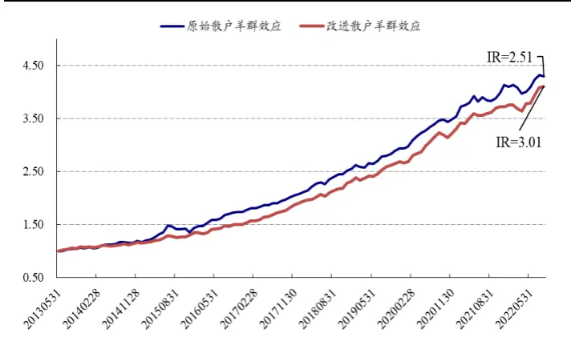
数据来源：Wind、开源证券研究所

图18：改进散户羊群效应的10分组分层绩效较为优异
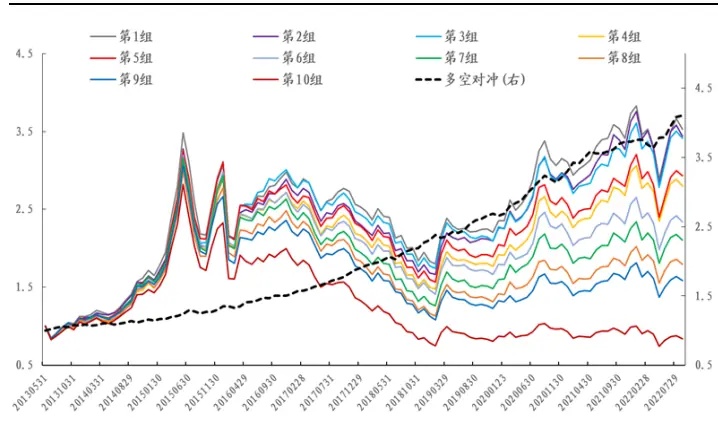
数据来源：Wind、开源证券研究所

## 3、 大小单资金流因子综合应用方案

在本文的第1、2部分，我们分别改进了大小单残差和散户羊群效应因子，其中大单残差的 10 分组多空对冲信息比率由 3.48 提升至4.81，小单残差的 10 分组多空对冲信息比率由 3.02提升至3.56，散户羊群效应的 10分组多空对冲信息比率由 2.51提升至 3.01，皆为较为成功的改进。

进一步我们将三者进行合成，在合成之前我们测算了三者的相关性，如表 2 所示。其中改进大单残差和改进小单残差由于资金流配平公式“超大单+大单+中单+小单=0”，导致其天然负相关，而改进散户羊群效应与改进大/小单残差相关性较低，为较为独立的 alpha源。最后我们将三者等权合成，将其命名为大小单综合资金流因子，其市值行业中性化后的10分组效果如图19所示。大小单综合资金流因子RankIC均值 7.89%，RankICIR3.99，10 分组多空对冲年化收益率 35.36%，信息比率 4.82，胜率 89.19%，最大回撤2.09%。

表2：改进散户羊群效应与改进大/小单残差相关性较低

|  | 改进大单残差 | 改进小单残差 | 改进散户羊群效应 |
| --- | --- | --- | --- |
| 改进大单残差 |  | -53.24% | -13.06% |
| 改进小单残差 | -53.24% |  | 9.70% |
| 改进散户羊群效应 | -13.06% | 9.70% |  |

数据来源：Wind、开源证券研究所

图19：大小单综合资金流因子的10分组多空对冲信息比率达 4.82
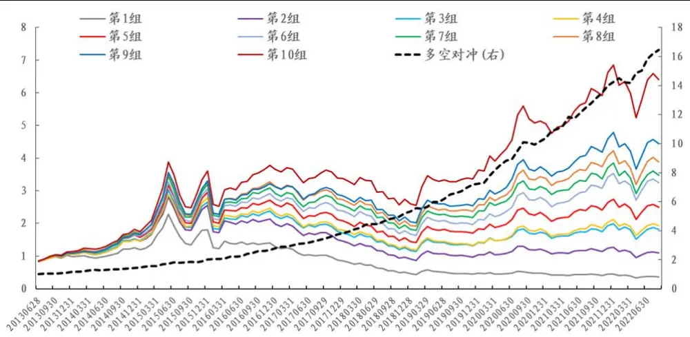
数据来源：Wind、开源证券研究所

## 3.1、 大小单综合因子在其他样本空间依旧具备一定选股能力

接下来我们进一步探讨大小单综合因子在其他样本空间中的表现。大小单综合因子在沪深300内多空和多头收益波动比分别为 1.92 和 0.42，中证 500 内因子的多空和多头的收益波动比分别为 2.71和 0.57，中证1000内因子的多空和多头的收益波动比分别为 4.26 和 0.67。

表3：大小单综合因子在其他样本空间依然具有一定选股能力

|  | 多空对冲 |  |  |  | 多头 |  |  |  |
| --- | --- | --- | --- | --- | --- | --- | --- | --- |
|  | 全市场 | 沪深300 | 中证500 | 中证1000 | 全市场 | 沪深300 | 中证500 | 中证1000 |
| 年化收益率 | 35.36% | 14.01% | 19.98% | 33.19% | 22.24% | 9.28% | 14.37% | 20.90% |
| 年化波动率 | 7.33% | 7.31% | 7.38% | 7.78% | 28.32% | 22.16% | 25.38% | 31.25% |
| 收益波动比 | 4.82 | 1.92 | 2.71 | 4.26 | 0.79 | 0.42 | 0.57 | 0.67 |
| 最大回撤 | 2.09% | 7.56% | 6.34% | 3.93% | 36.25% | 42.06% | 39.27% | 41.06% |
| 月度胜率 | 89.19% | 70.27% | 79.28% | 85.59% | 58.56% | 57.66% | 58.56% | 60.36% |

数据来源：Wind、开源证券研究所

## 3.2、 大小单综合因子剔除 Barra风格因子后选股效果依旧优秀

进一步地，大小单综合因子和传统Barra因子进行相关性分析。从表4可以看出，该因子和流动性、波动性、市值因子相关性较高。为剔除风格和行业的干扰，每月底将大小单综合因子因子进行 Barra 风格因子以及行业中性化，全市场 10 分组及多空对冲净值走势如图 20所示。纯净新因子多空对冲的年化收益为 22.63%，信息比率为 3.83，胜率为 88.29%，最大回撤为 3.97%。

表4：大小单综合因子与传统Barra因子相关性不高

| Beta | 价值 | 杠杆 | 盈利 | 成长 | 流动性 | 动量 | 非线性规模 | 波动 | 规模 |
| --- | --- | --- | --- | --- | --- | --- | --- | --- | --- |
| -9.04% | 7.55% | 6.03% | 10.27% | 4.84% | -16.57% | -0.03% | 4.91% | -18.77% | 17.49% |

数据来源：Wind、开源证券研究所

图20：大小单综合因子提纯后的10分组多空信息比率3.83
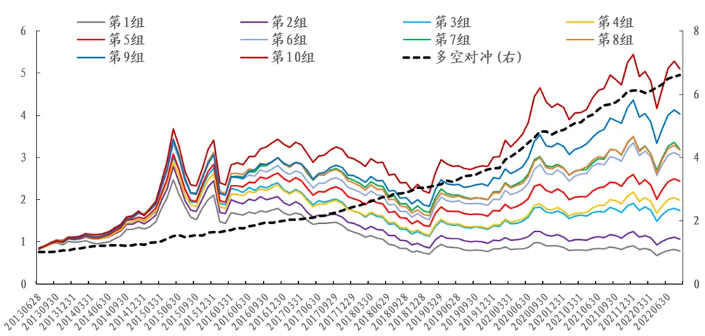
数据来源：Wind、开源证券研究所

## 4、 其他相关讨论：日内散户羊群效应

在上述散户羊群效应因子的讨论中，我们始终围绕的是当日收益率与下个交易日小单净流入的秩相关性，其为日间羊群效应。进一步地，本篇报告基于分钟高频数据计算了日内羊群效应的效果，具体做法为：对于某只股票，每月底回看过去 20天，每天以10分钟为单位间隔，计算前 10分钟收益率和下 10分钟小单净流入的相关性，最后进行 20 天相关性的平均作为月末因子值。通过回测，我们发现日内羊群效应并没有明显的负向选股效果，其RankIC为 2.81%，RankICIR为0.89，反而呈现了一定微弱的正向选股效果。（采用1 分钟以及5分钟等其他频率结果类似）

为了进一步探讨其微弱正向 alpha的来源，我们首先观察了日内散户羊群效应的全 A 中位数幅度，结果如图 21 所示。从图 21 我们可以看出其并不是正相关而是负相关，这有悖小单背后的散户交易群体跟随的现象，我们认为其和日内小单净流入的“惯性”较强有关。为此，我们测算了日内前 10 分钟小单净流入和下 10 分钟小单净流入的相关性，我们发现高达 28%，而如果变成日频即当天小单净流入和下个交易日小单净流入的相关性，仅仅只有 11%，其说明日内小单惯性远强于日间的小单惯性，这也导致了日内散户羊群效应呈现负值。

上述的讨论只是解决了日内羊群效应为负值的现象，但是没有解决其为正向选股能力的现象。为此，我们测试了日内收益率和日内小单以 10 分钟为间隔单位的日内同步相关性，并在月底取过去 20天的均值作为因子值进行回测，发现为更强的正向选股效果效果，RankIC为 4.59%，RankICIR为 1.81，而且其和日内羊群效应相关性高达 39%。进一步地，我们使用日内羊群效应回归日内同步相关性，残差基本没有选股效果，残差 RankIC 为1.04%，RankICIR为0.35，所以日内羊群效应的微弱正alpha 来源于日内同步相关性，而日内同步相关性究其根源还是资金流强度，其在《新型因子：资金流动力学与散户羊群效应》有详细解释。

综上讨论，日内羊群效应并不存在强负向选股效果，使用小单来衡量散户羊群效应需要从日间维度出发。

图21：日内散户羊群效应全A中位数为负值
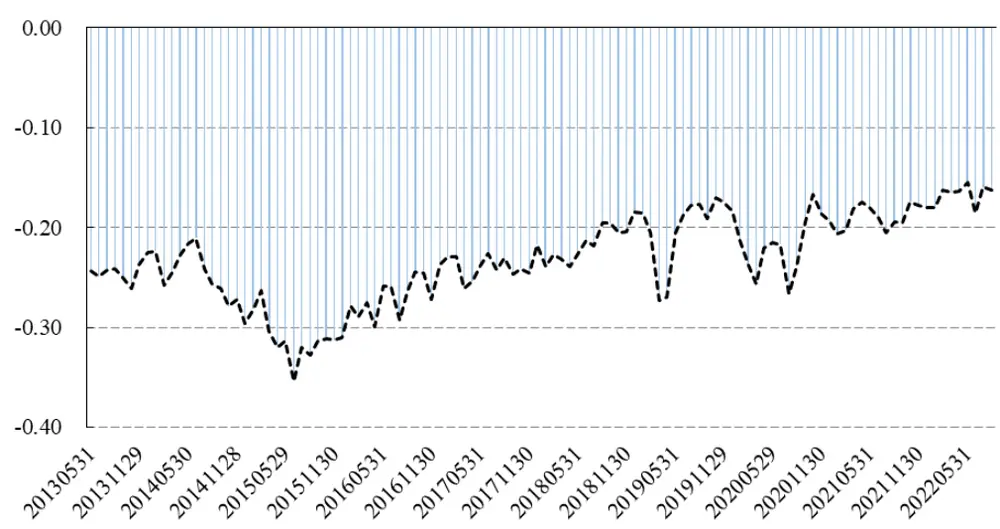
数据来源：Wind、开源证券研究所

## 5、 风险提示

模型测试基于历史数据，市场未来可能发生变化。

## 特别声明

《证券期货投资者适当性管理办法》、《证券经营机构投资者适当性管理实施指引（试行）》已于2017年7月1日起正式实施。根据上述规定，开源证券评定此研报的风险等级为R3（中风险），因此通过公共平台推送的研报其适用的投资者类别仅限定为专业投资者及风险承受能力为C3、C4、C5的普通投资者。若您并非专业投资者及风险承受能力为C3、C4、C5的普通投资者，请取消阅读，请勿收藏、接收或使用本研报中的任何信息。因此受限于访问权限的设置，若给您造成不便，烦请见谅！感谢您给予的理解与配合。

## 分析师承诺

负责准备本报告以及撰写本报告的所有研究分析师或工作人员在此保证，本研究报告中关于任何发行商或证券所发表的观点均如实反映分析人员的个人观点。负责准备本报告的分析师获取报酬的评判因素包括研究的质量和准确性、客户的反馈、竞争性因素以及开源证券股份有限公司的整体收益。所有研究分析师或工作人员保证他们报酬的任何一部分不曾与，不与，也将不会与本报告中具体的推荐意见或观点有直接或间接的联系。

## 股票投资评级说明

|  | 评级 | 说明 |
| --- | --- | --- |
| 证券评级 | 买入（Buy） | 预计相对强于市场表现20%以上； |
|  | 增持（outperform） | 预计相对强于市场表现5%～20%; |
|  | 中性（Neutral） | 预计相对市场表现在—5%～+5%之间波动； |
|  | 减持（underperform） | 预计相对弱于市场表现5%以下。 |
| 行业评级 | 看好（overweight） | 预计行业超越整体市场表现； |
|  | 中性（Neutral） | 预计行业与整体市场表现基本持平； |
|  | 看淡（underperform） | 预计行业弱于整体市场表现。 |
| 备注：评级标准为以报告日后的6~12个月内，证券相对于市场基准指数的涨跌幅表现，其中A股基准指数为沪深300指数、港股基准指数为恒生指数、新三板基准指数为三板成指（针对协议转让标的）或三板做市指数（针对做市转让标的)、美股基准指数为标普500或纳斯达克综合指数。我们在此提醒您，不同证券研究机构采用不同的评级术语及评级标准。我们采用的是相对评级体系，表示投资的相对比重建议；投资者买入或者卖出证券的决定取决于个人的实际情况，比如当前的持仓结构以及其他需要考虑的因素。投资者应阅读整篇报告，以获取比较完整的观点与信息，不应仅仅依靠投资评级来推断结论。 |  |  |

## 分析、估值方法的局限性说明

本报告所包含的分析基于各种假设，不同假设可能导致分析结果出现重大不同。本报告采用的各种估值方法及模型均有其局限性，估值结果不保证所涉及证券能够在该价格交易。

## 法律声明

开源证券股份有限公司是经中国证监会批准设立的证券经营机构，已具备证券投资咨询业务资格。

本报告仅供开源证券股份有限公司（以下简称“本公司”）的机构或个人客户（以下简称“客户”）使用。本公司不会因接收人收到本报告而视其为客户。本报告是发送给开源证券客户的，属于商业秘密材料，只有开源证券客户才能参考或使用，如接收人并非开源证券客户，请及时退回并删除。

本报告是基于本公司认为可靠的已公开信息，但本公司不保证该等信息的准确性或完整性。本报告所载的资料、工具、意见及推测只提供给客户作参考之用，并非作为或被视为出售或购买证券或其他金融工具的邀请或向人做出邀请。本报告所载的资料、意见及推测仅反映本公司于发布本报告当日的判断，本报告所指的证券或投资标的的价格、价值及投资收入可能会波动。在不同时期，本公司可发出与本报告所载资料、意见及推测不一致的报告。客户应当考虑到本公司可能存在可能影响本报告客观性的利益冲突，不应视本报告为做出投资决策的唯一因素。本报告中所指的投资及服务可能不适合个别客户，不构成客户私人咨询建议。本公司未确保本报告充分考虑到个别客户特殊的投资目标、财务状况或需要。本公司建议客户应考虑本报告的任何意见或建议是否符合其特定状况，以及（若有必要）咨询独立投资顾问。在任何情况下，本报告中的信息或所表述的意见并不构成对任何人的投资建议。在任何情况下，本公司不对任何人因使用本报告中的任何内容所引致的任何损失负任何责任。若本报告的接收人非本公司的客户，应在基于本报告做出任何投资决定或就本报告要求任何解释前咨询独立投资顾问。

本报告可能附带其它网站的地址或超级链接，对于可能涉及的开源证券网站以外的地址或超级链接，开源证券不对其内容负责。本报告提供这些地址或超级链接的目的纯粹是为了客户使用方便，链接网站的内容不构成本报告的任何部分，客户需自行承担浏览这些网站的费用或风险。

开源证券在法律允许的情况下可参与、投资或持有本报告涉及的证券或进行证券交易，或向本报告涉及的公司提供或争取提供包括投资银行业务在内的服务或业务支持。开源证券可能与本报告涉及的公司之间存在业务关系，并无需事先或在获得业务关系后通知客户。

本报告的版权归本公司所有。本公司对本报告保留一切权利。除非另有书面显示，否则本报告中的所有材料的版权均属本公司。未经本公司事先书面授权，本报告的任何部分均不得以任何方式制作任何形式的拷贝、复印件或复制品，或再次分发给任何其他人，或以任何侵犯本公司版权的其他方式使用。所有本报告中使用的商标、服务标记及标记均为本公司的商标、服务标记及标记。

## 开源证券研究所

上海

地址：上海市浦东新区世纪大道1788号陆家嘴金控广场1号

楼10层

邮编：200120

邮箱：research@kysec.cn

北京
地址：北京市西城区西直门外大街18号金贸大厦C2座9层
邮编：100044
邮箱：research@kysec.cn

地址：深圳市福田区金田路2030号卓越世纪中心1号

邮编：518000

邮箱：research@kysec.cn

西安
地址：西安市高新区锦业路1号都市之门B座5层
邮编：710065
邮箱：research@kysec.cn