2022 年 12 月 25 日

## 金融工程研究团队

魏建榕（首席分析师）

证书编号：S0790519120001

张 翔（分析师）

证书编号：S0790520110001

傅开波（分析师）

证书编号：S0790520090003

## 高 鹏（分析师）

证书编号：S0790520090002

## 苏俊豪（分析师）

证书编号：S0790522020001

## 胡亮勇（分析师）

证书编号：S0790522030001

## 王志豪（分析师）

证书编号：S0790522070003

## 盛少成（研究员）

证书编号：S0790121070009

## 苏 良（研究员）

证书编号：S0790121070008

## 何申昊（研究员）

证书编号：S0790122080094

## 相关研究报告

《高频因子：分钟单笔金额序列中的主力行为刻画—市场微观结构研究系列（15）》-2022.06.12

《日内极端收益前后的反转特性与因子构建—市场微观结构研究系列（17）》-2022.12.03

《大小单重定标与资金流因子改进—市场微观结构研究系列（15）》-2022.09.04

# 日内分钟收益率的时序特征：逻辑讨论与因子增强

# ——市场微观结构研究系列（19）

## 魏建榕（分析师）

weijianrong@kysec.cn

苏良（联系人）

suliang@kysec.cn

盛少成（联系人）

证书编号：S0790519120001

证书编号：S0790121070008

shengshaocheng@kysec.cn

证书编号：S0790121070009

## 跌幅时间重心偏离是更适合刻画“时间差 Alpha”的指标

涨、跌幅在时间轴上的分布位置捕捉了股票的交易行为特征，两者的相对位置也可能蕴含某种选股信息。

经过详细的测试，我们倾向于认为，涨、跌幅时间重心的相对位置是一个有效的Alpha因子，但提取的方法并非是将二者简单做差，原因有二：

（1）涨、跌时间重心存在较强的正相关。线性相关导致“时间差”的大小取决于起始位置，而这不符合一般定义：“时间差”在盘初、盘中或盘尾应是一致的。

（2）涨、跌时间重心的波动率水平存在差异。作差方法用于构造“时间差”信息会使得因子暴露更多高波动成分（涨幅时间重心因子），因子有效性较弱。我们以跌幅时间重心对涨幅时间重心在截面上回归取残差，再取其 20 日均值记为跌幅时间重心偏离因子，该因子更适合用以刻画“时间差Alpha”。

## “时间差 Alpha”的生效逻辑讨论

跌幅时间重心偏离能更有效地刻画日内分钟收益率时序特征的选股因子。但我们对Alpha的逻辑解释仍然不清楚，于是，本章将从因子的层面探究其 Alpha来源，推测主要有三种可能性：（1）收益率结构；（2）极端涨跌幅度 or 涨跌幅的分布位置；（3）A股市场的“低波效应”。

基于上述三个维度的讨论，我们找到了“时间差Alpha”的解释因子：（1）盘尾阶段的收益率；（2）零涨跌幅数量。中性化后的跌幅时间重心偏离因子几乎不具备选股能力，这也说明“时间差Alpha”是收益率结构和“低波效应”的综合。

## 因子增强方案：时间重心偏离（TGD）因子

因子改进思路较为简单，剥离可能影响“时间差Alpha”的干扰因子，在跌幅时间重心偏离因子的基础上改进得到时间重心偏离（TGD）因子。

TGD 因子的有效性较原始因子大幅提升，全市场五分组下的多空信息比率达到4.5 以上，Rank ICIR 为 4.93，因子收益较为稳定。

同样基于收益率结构的 APM 因子是 TGD 因子的 Alpha 子集。通过相互回归的方法证明，TGD因子在对APM因子中性化后仍然保留一定的选股信息，而 APM因子在回归掉TGD因子后几乎是噪音。

## 时序特征因子与分布特征因子合成后效果更佳

TCD 因子属于时间维度的综合信息，并不受收益率分布的影响，如果与收益率分布的典型因子进行合成，效果还会继续提升。

本文选取分布特征的典型因子：日内收益率偏度SKEW 因子作为代表，将TCD因子与SKEW 因子在横截面上排序加总得到合成因子。

合成因子相比 TGD 因子在稳定性方面进一步改善，Rank ICIR 达到 5.74。

- 风险提示：模型测试基于历史数据，未来市场可能发生改变。

在 2022年6月，我们曾创新性构建了“分钟单笔成交金额”指标，从分布特征和时序特征维度开发出捕捉主力行为特征的高频因子，诸如QUA、MTS 和MTE等因子在样本内外的表现均十分优异。在这一研究框架的基础上，本文将继续挖掘和探究更有效的高频信号，不妨让我们把关注点集中于分钟收益率的时序特征。

时间维度的信息会更加复杂和难以解释，而分钟收益率的时间戳与时间差的Alpha也早已被市场发现，但目前为止还没有研究能阐明其生效逻辑。于是，我们希望在本篇报告中解决两个关键问题：

（1）什么是时间因子的 Alpha 解释？（2）如何改进因子使其变得更好？

## 1、 时序特征：跌幅时间重心偏离因子

为了观察收益率的时序特征，我们将重新标注日内分钟时间戳，将09:31至 15:00间的 240根分钟Bar依次标记为1至240，然后分别统计价格上涨和价格下跌两组分钟 Bar的时间标识序列，记作U和D，对应的收益率序列为 $R_{u}和R_{d}$

$$
\begin{aligned}&\left(U,R_{u}\right)=\left[(u_{1},r_{1}^{u}),(u_{2},r_{2}^{u}),\cdots,(u_{n},r_{n}^{u})\right]\\&\\&\left(D,R_{d}\right)=\left[\binom{u_{1},r_{1}^{d}}{},\binom{u_{2},r_{2}^{d}}{},\cdots,\binom{u_{m},r_{m}^{d}}{}\right]\\\end{aligned}
$$

其中， $u_{i}$ 和 $\boldsymbol{r}_{i}^{u}$ 分别表示第i涨幅分钟的时间序号及收益率， $d_{j}和r_{j}^{d}$ 同理； $i\in[1,n]$ $而j\in[1,m]$ ；由于不考虑分钟涨跌幅为零的序列， $n+m\leq240$ o

图1：日内收益率的时序特征：涨、跌幅的时间重心
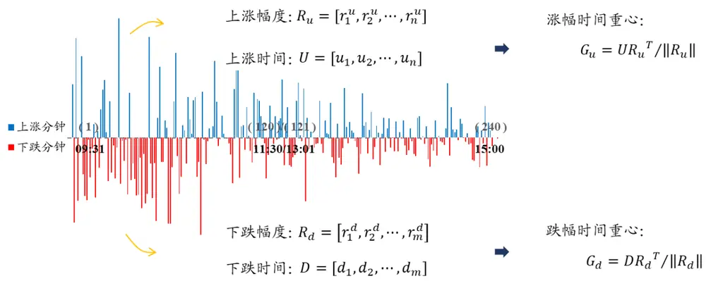
资料来源：开源证券研究所

图 1 展示了股票 A 在某日的分钟涨跌幅序列，涨幅较高和跌幅较大的分钟往往会靠得比较近，并呈现出一定的日内结构：股价在开盘半小时至一小时内变动幅度最大。我们以每分钟价格变动幅度对修正的时间戳加权平均，分别求得涨幅和跌幅的时间分布重心，记作 $G_{u}$ 和 ${\cdot}G_{d}$ ：

$$
\begin{aligned}&G_{u}={UR_{u}}^{T}/\|R_{u}\|_{1}\\&\\&G_{d}={UR_{d}}^{T}/\|R_{d}\|_{1}\\\end{aligned}
$$

我们统计某个交易日的截面上所有股票的涨、跌幅的时间重心的相关性，二者呈现出强正相关，相关系数可达 0.7，结果如图2和图3 所示。

图2：截面上，涨幅和跌幅的时间重心呈正相关
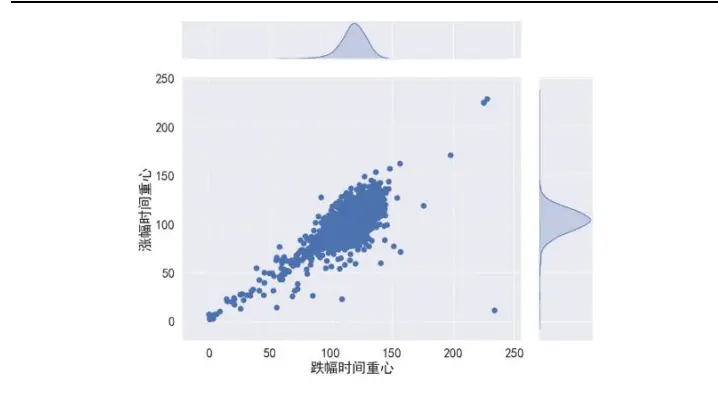
数据来源：Wind、开源证券研究所

图3：涨、跌幅时间重心的截面相关系数分布
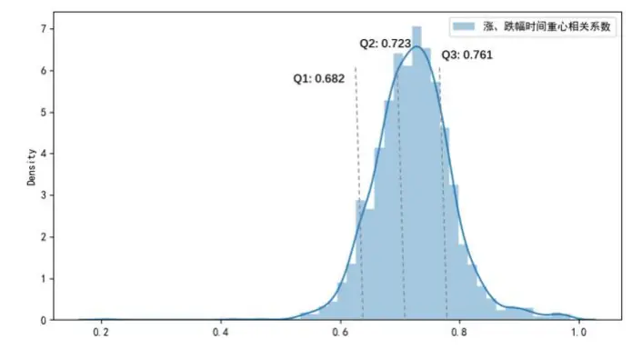
数据来源：Wind、开源证券研究所

涨、跌幅时间重心之间的强相关性与 A股市场整体上偏向于反转属性有关，当出现极端涨幅或跌幅的分钟，通常会在较短时间内出现幅度相当、方向相反的价格变动。我们将距离的讨论转化为概率矩阵：以 5 分钟为测试的周期，将涨跌幅由小到大分成 10组样本，并统计相邻时段出现极端涨跌幅的概率，结果如图4 所示。

图4：极端涨幅和极端跌幅的转换概率较高，说明在时间轴上的分布距离较近

| T\I+1 | G01 G02 G03 |  |  | G04 | G05 | G06 | G07 | G08 | G09 G10 |  |
| --- | --- | --- | --- | --- | --- | --- | --- | --- | --- | --- |
| G01 | 10.80% | 7.63% | 7.23% | 7.26% | 7.46% | 7.93% | 8.89% | 10.57% | 13.49% | 18.74% |
| G02 | 7.85% | 8.34% | 8.72% | 9.02% | 9.44% | 10.06% | 10.88% | 11.88% | 12.71% | 11.10% |
| G03 | 7.37% | 8.68% | 9.81% | 10.21% | 10.26% | 10.57% | 11.23% | 11.68% | 11.24% | 8.96% |
| G04 | 7.23% | 8.87% | 10.11% | 11.35% | 11.44% | 10.83% | 10.88% | 10.98% | 10.25% | 8.05% |
| G05 | 7.24% | 9.13% | 10.07% | 11.38% | 12.39% | 11.62% | 10.66% | 10.31% | 9.61% | 7.60% |
| G06 | 7.50% | 9.65% | 10.32% | 10.73% | 11.60% | 12.18% | 11.25% | 10.08% | 9.19% | 7.49% |
| G07 | 8.17% | 10.40% | 10.97% | 10.77% | 10.62% | 11.22% | 11.26% | 10.04% | 8.91% | 7.65% |
| G08 | 9.46% | 11.48% | 11.58% | 10.97% | 10.26% | 9.97% | 9.92% | 9.57% | 8.68% | 8.10% |
| G09 | 12.34% | 12.96% | 11.57% | 10.37% | 9.51% | 8.92% | 8.54% | 8.31% | 8.36% | 9.12% |
| G10 | 22.18% | 12.84% | 9.56% | 7.94% | 7.05% | 6.61% | 6.45% | 6.59% | 7.48% | 13.30% |

数据来源：Wind、开源证券研究所

涨、跌幅时间重心反映了股价在日内交易中上涨和下跌的位置，此外还可以定义两个时间重心的差值和绝对差值，分别作为涨跌幅分布的“时间差”指标和“时间距离”指标，定义为 $\tau=G_{d}-G_{u}和\upsilon=|G_{d}-G_{u}|$ 。我们统计了涨跌幅时间重心，以及时间差的分布情况，如图 5和图6 所示。

图5：涨跌幅时间重心存在日间差异
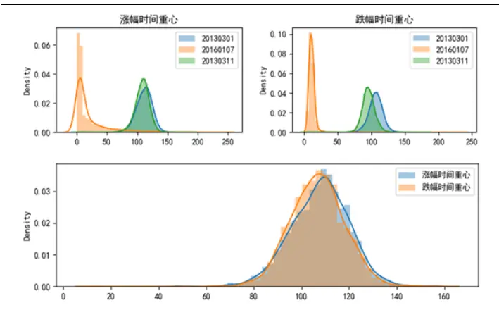
数据来源：Wind、开源证券研究所

图6：“时间差”的分布：样本越少，差异越大
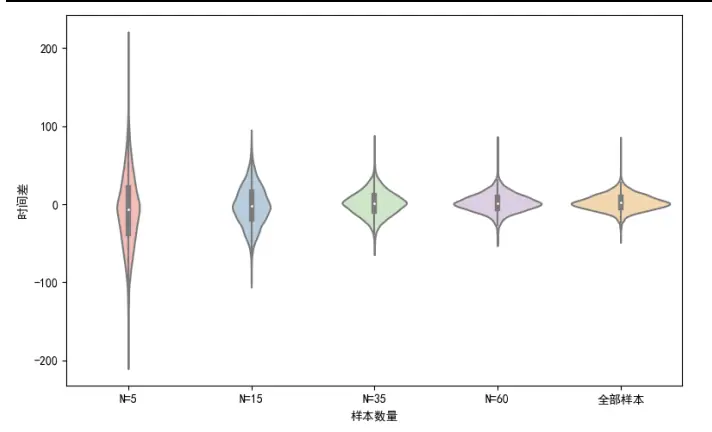
数据来源：Wind、开源证券研究所

图 5 和图 6 分别展示了涨、跌幅时间重心以及“时间差”的分布。不同交易日的涨、跌幅时间重心具有同向差异性，而相同股票的 $G_{d}和G_{u}$ 的分布基本一致，没有表现明显的结构性特征；若由大到小选取一定数量的涨、跌幅样本计算各自时间重心，其“时间差”随着样本数量的减少而逐渐发散，极端样本涨跌时间重心的离散度相比全部样本会更高一些。

涨、跌幅在时间轴上的分布位置捕捉了股票的交易行为特征，两者的相对位置也可能蕴含某种选股信息。于是，笔者选取涨幅时间重 $心G_{u}$ 、跌幅时间重 $心G_{d}$ 以及“时间差”信息τ、“时间距离”信息υ，并计算上述指标在过去 20 个交易日的均值作为选股因子，具体的构造方法如表 1 所示。

表1：两类时间重心因子以及“时间差”、“时间距离”因子的构造步骤

| 顺序 | 计算方法 |
| --- | --- |
| 第一步 | 基于个股上涨和下跌的1分钟收益率序列，逐日统计幅度和时间信息，记为： 上涨幅度和时间 $(U,R_{u})$ |
| 第二步 | 下跌幅度和时间(D,Ra) |
|  | 分别计算如下日频指标： |
|  | 涨幅时间重心 $G_{u}={UR_{u}}^{T}/{\\|R_{u}\\|_{1}}$ |
|  | 跌幅时间重心 $G_{d}={UR_{d}}^{T}/\\|R_{d}\\|_{1}$ |
|  | 时间差 $\tau=G_{d}-G_{u}$ 时间距离 $\upsilon=\|G_{d}-G_{u}\|$ |
| 第三步 | 回溯过去一段时间，对日频指标进行平滑处理得到相应的选股因子： |
|  | $F=\frac{1}{N}\sum_{i=1}^{N}Ind_{i}$ |
|  | 其中，F和Ind分别表示因子暴露和日频指标，N=20。 |

资料来源：开源证券研究所

我们以20个交易日为调仓周期，在全市场上分十组观测选股效果，暂时不考虑交易费率的影响。

图 7 和图 8 分别展示涨幅时间重心因子和跌幅时间重心因子的表现，其中跌幅时间重心因子有效性明显更高，而尽管涨幅和跌幅二者“时间差”因子的多空信息比率最高，但其 RankIC仅为 0.02，明显弱于跌幅时间重心因子。

图7：涨幅时间重心因子为正 IC，但效果较弱
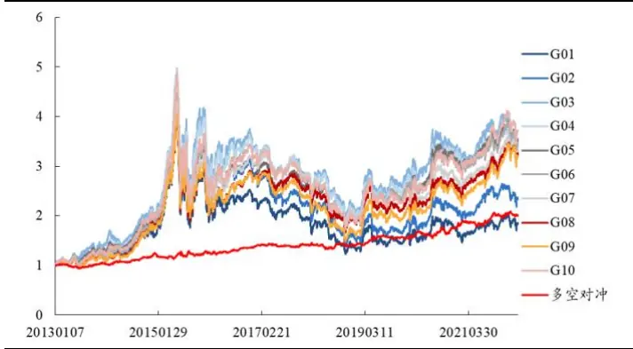
数据来源：Wind、开源证券研究所

图8：跌幅时间重心因子：Rank IC 为 0.053
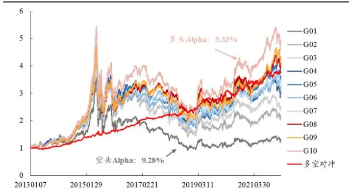
数据来源：Wind、开源证券研究所

“时间差”因子的稳定性没有显著提升，“时间距离”信息则是最弱（图 9）。

图9：“时间差”τ所能提供信息增量有限
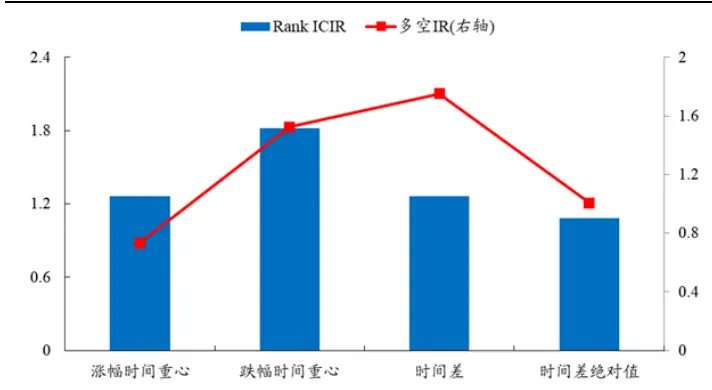
数据来源：Wind、开源证券研究所，测试区间为 20130104-20220315

图10：“时间差”τ剥离 $G_{d}和G_{u},$ ，Alpha信噪比明显降低
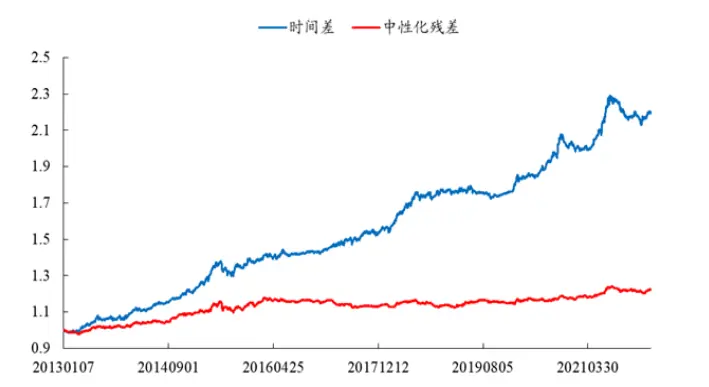
数据来源：Wind、开源证券研究所

“时间差”因子回归涨、跌幅时间重心因子，多空收益出现明显滑落，大部分Alpha 都能够被单个时间重心的信息解释（图 10）。从整体上看，“时间差”的解释能力与涨、跌幅时间重心因子明显重合，实际的因子收益是由单个的时间重心因子贡献，因此，“时间差”并没有给我们提供更多的信息。

经过详细的测试，我们倾向于认为，涨、跌幅时间重心的相对位置是一个有效的 Alpha 因子，但提取的方法并非是将二者简单做差，截面回归的方法会更好。我们以跌幅时间重心作为被解释变量，对涨幅时间重心回归取残差，取其 20日均值作为选股因子，记为跌幅时间重心偏离因子。图11展示了该因子的五分组效果。

图11：跌幅时间重心偏离因子：Rank IC 为 0.054，Rank ICIR 接近 3.0
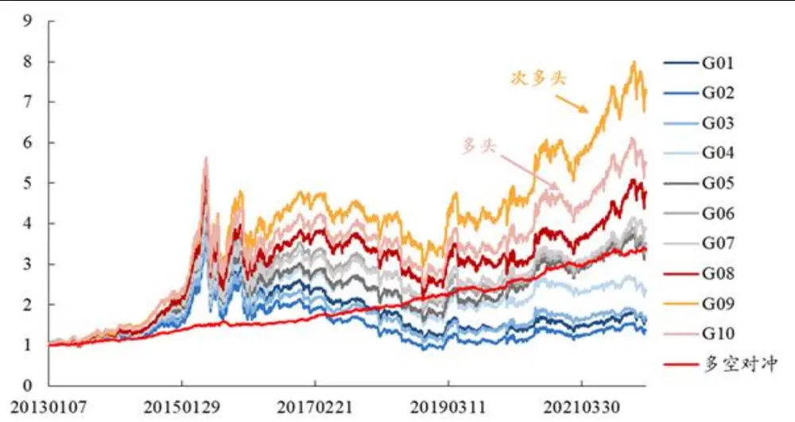
数据来源：Wind、开源证券研究所

测试结果表明，跌幅时间重心偏离因子多头年化收益率为 21.2%，多空信息比率为 2.39，Rank IC 和 Rank ICIR 分别为 0.054 和 2.99，跌幅时间重心偏离因子是刻画分钟时序特征更有效的指标，而且因子的稳定性相比原始“时间差”因子更高。

进一步，我们测算了跌幅时间重心偏离因子的相关性，结果如图 13 所示。

图12：跌幅时间重心偏离因子RankIC 累计值
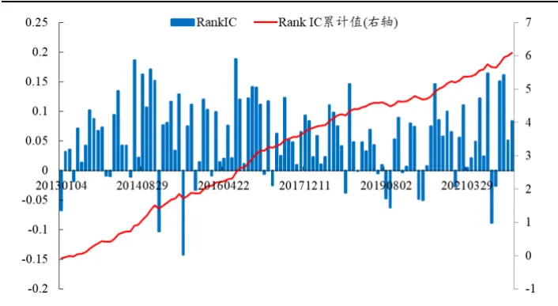
数据来源：Wind、开源证券研究所

图13：跌幅时间重心偏离因子的相关网络图
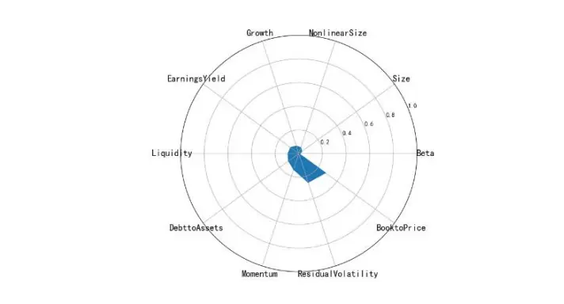
数据来源：Wind、开源证券研究所

跌幅时间重心偏离因子暴露最多的前三个风格特征分别是价值因子、波动率因子和动量因子，相关系数分别为 0.279、-0.256 和-0.141。该因子与我们跟踪的交易行为因子重叠度不高，其中，APM 因子的解释能力稍强一些（0.182）。若是剔除上述因子收益，Rank ICIR 仍然有 2.29，其 Alpha 来源相对独立。

单个的时间重心是跌幅时间重心偏离的 Alpha 子集。我们将跌幅时间重心偏离因子依次回归涨、跌幅时间重心因子，结果发现，虽然时间差 Alpha 有一定程度衰减，但残差仍然具备对未来收益的解释能力；若是相反地分别将单个的时间重心对跌幅时间重心偏离中性化，剩余部分则是没有选股信息的噪音（图14）。

图14：跌幅时间重心偏离因子的Alpha独立于单个的时间重心
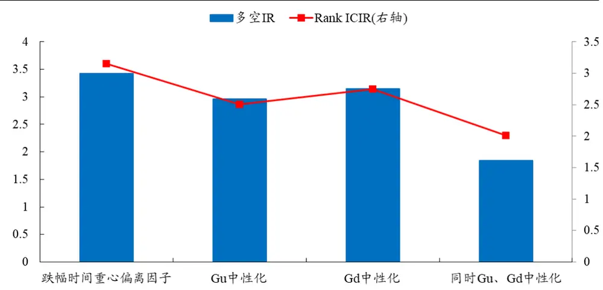
数据来源：Wind、开源证券研究所，测试区间：20130104-20220315

回归方法相当于寻找到某个基准维度，计算目标变量在这一维度的投影，朴素含义的理解可以是跌幅时间重心相对于涨幅时间重心的偏离。而作差的方法并不适合用于刻画时间差 Alpha，主要有以下两个原因：

（1）涨、跌时间重心存在较强的正相关。线性相关导致“时间差”的大小取决于起始位置，而这不符合一般定义：“时间差”在盘初、盘中或盘尾应是一致的。

（2）涨、跌时间重心的波动率水平存在差异。作差方法用于构造“时间差”信息会使得因子暴露更多高波动成分（涨幅时间重心因子），有效性不会理想。

综上，我们得到比较明确的结论：日内分钟收益率的时序特征，利用回归方法得到的跌幅时间重心偏离更适合用于刻画“时间差 Alpha”。

## 2、 “时间差 Alpha”的生效逻辑探究

跌幅时间重心偏离能更有效地刻画日内分钟收益率时序特征的选股因子。但我们对 Alpha 的逻辑解释仍然比较迷惑，于是，本章将从因子的层面探究其 Alpha 来源，推测主要有以下可能性：

（1）收益率结构。日内收益率与隔夜收益率分别具有反转与动量特性，时间差Alpha 是否为两者的有机组合？本文分别讨论隔夜收益率和日内收益率对于时间差的影响效果，以及更加细化地讨论日内分时段的差异；

（2）极端涨跌幅度or涨跌幅的分布位置。时间重心因子的核心 Alpha是极端收益幅度还是涨跌幅的位置信息贡献收益？本文将其拆分为平均涨、跌幅和时间中心两个部件，分别探测不同部件对因子选股信息的贡献程度；

（3）“低波效应”。考虑时间差产生的原因，有可能与日内零涨幅的分钟样本数量有关，底层的交易行为逻辑来自A股市场中较为显著的“低波效应”。我们可将其定量化为选股指标，观察其是否能用于解释时间差 Alpha 的规律。

本章将集中讨论本文的第一个关键问题：哪些属于“时间差 Alpha”的解释因子，而哪些是干扰因子？这将有助于我们理解因子的生效逻辑。

## 2.1、 收益率结构对“时间差”的影响分析

涨、跌幅的位置信息与股票的收益率结构相关，涨幅时间重心与隔夜和日内的收益率相关系数为-0.052和-0.168，跌幅时间重心则相应为 0.014和-0.132。为更加明确二者的关系，我们分别按照涨跌幅由低到高的顺序，对日内收益率和隔夜收益率分组，观察时间重心以及“时间差”的单调性，如图15所示。

图15：时间差与日内收益率正相关，与隔夜收益率负相关
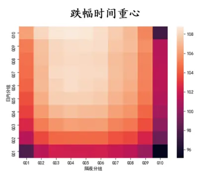
数据来源：Wind、开源证券研究所

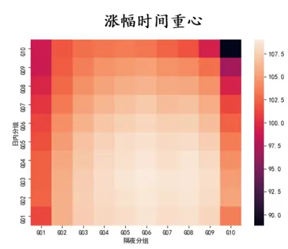

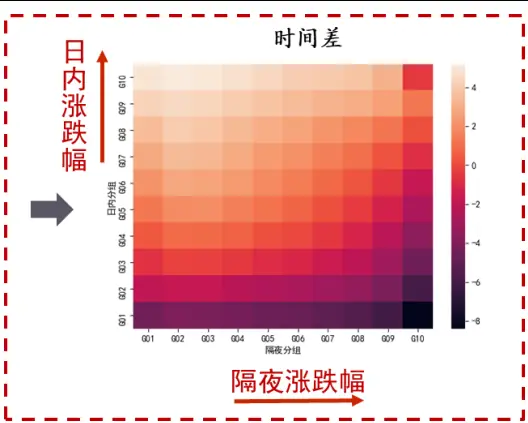

涨、跌幅时间重心在收益结构上的暴露程度不同。由图 15可见，涨幅的分布位置与日内收益率负相关，而跌幅与日内收益率的关联性较弱；隔夜收益率与涨、跌幅时间重心的变化规律并非是单调的。隔夜收益率的绝对值越高，涨、跌幅时间重心也越靠前，盘初更容易出现集中上涨或者下跌的行情。收益率结构对于时间差Alpha的影响呈现出如下规律：

日内收益率：负IC、正相关，负贡献；

隔夜收益率：正IC、负相关，负贡献。

无论是日内收益率或是隔夜收益率，对于时间差 Alpha 均是干扰因素，若我们对其进行中性化处理，因子效果非但不会降低反而会提升。笔者对涨、跌幅时间重心分别建模：通过截面回归的方法，保留残差项以剔除收益率结构的影响。

$$
G_{u}=\alpha_{u}+\beta_{u}R_{intraday}+\gamma_{u}R_{overight}+\varepsilon_{u}
$$

$$
G_{d}=\alpha_{d}+\beta_{d}R_{intraday}+\gamma_{d}R_{overight}+\varepsilon_{d}
$$

基于回归得到的残差项 $\varepsilon_{u}和\varepsilon_{d}$ ，再继续提取时间差 Alpha：

$$
\varepsilon_{d}=\alpha+\beta\varepsilon_{u}+\varepsilon
$$

取残差ε在过去 20 个交易日的均值，表示剥离后的时间差 Alpha。图 16 展示了时间重心和时间差在中性化前后的有效性变化情况，图17为处理后的跌幅时间重心偏离因子十分组效果。结果与预期一致，时间差因子的效果有所提升。

图16：剔除日内、隔夜收益率，因子有效性改善
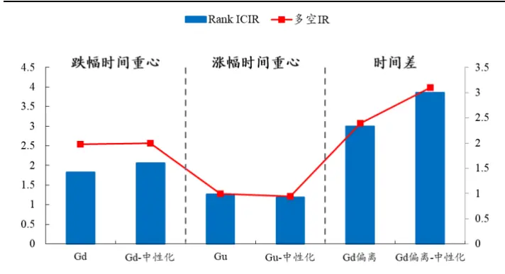
数据来源：Wind、开源证券研究所，测试区间：20130104-20220315

图17：时间差 Alpha 增强：多空 IR 达 3.01
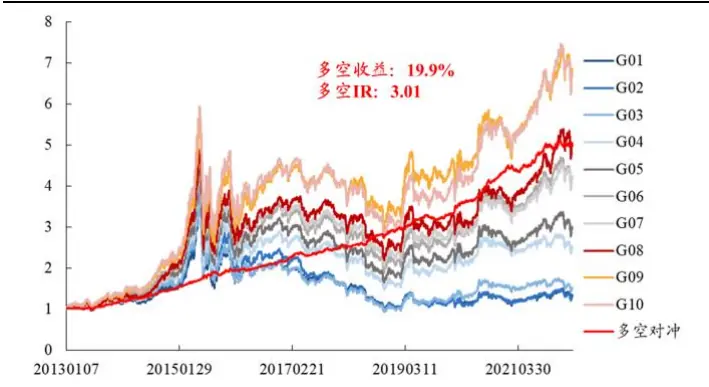
数据来源：Wind、开源证券研究所

隔夜收益率和日内收益率对跌幅时间重心偏离因子的解释作用不显著，仅仅会干扰时间差因子的有效性。但统计结果告诉我们，收益率结构中大概率有解释时间差 Alpha的成分，我们不妨再做一些更加细化的研究，图 18 分别展示了隔夜收益率和日内累计收益率与时间差等指标的在不同交易日截面的相关性。

图18：时间指标与隔夜、日内累计收益率的相关系数
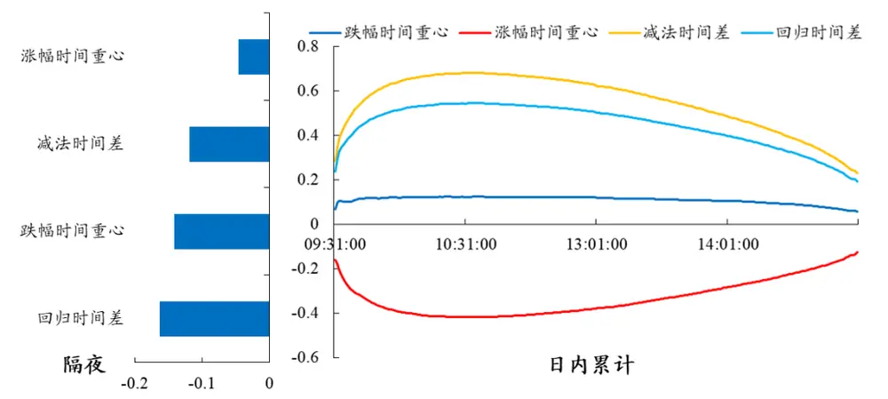
数据来源：Wind、开源证券研究所，测试区间：20130104-20220315

右侧的曲线反映了时间指标与日内累计收益的相关性水平的变化规律：涨幅时间重心的暴露程度较高，并且相关性在 10:30 达到峰值，也即开盘后约 1 小时的收益率越高，涨幅时间重心也越靠前，随后二者的相关性水平逐渐减弱。

进一步，笔者将日内收益率拆分成 8 段，每半个小时为一小段区间，然后统计每段小区间的收益率与时间差等指标的单调性变化规律，测试区间保持一致。

图19：时段 1（09:31-10:00）涨跌幅分组单调性
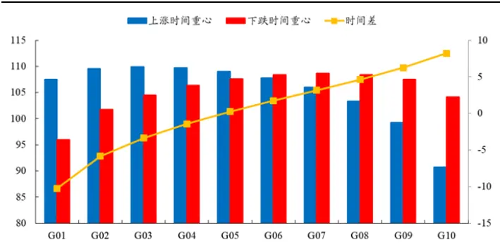
数据来源：Wind、开源证券研究所

图20：时段 2（10:01-10:30）涨跌幅分组单调性
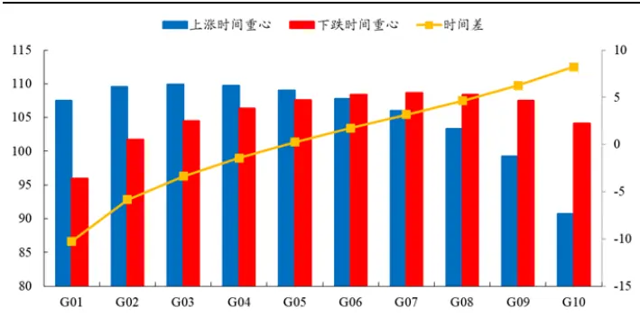
数据来源：Wind、开源证券研究所

图21：时段 3（10:31-11:00）涨跌幅分组单调性
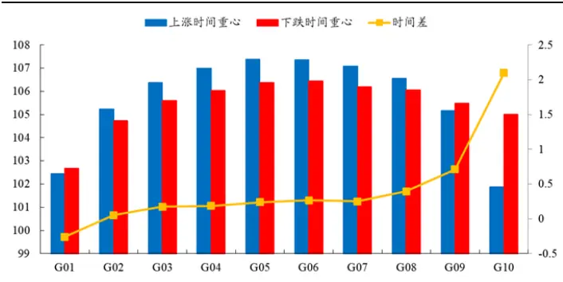
数据来源：Wind、开源证券研究所

图22：时段 4（11:01-11:30）涨跌幅分组单调性
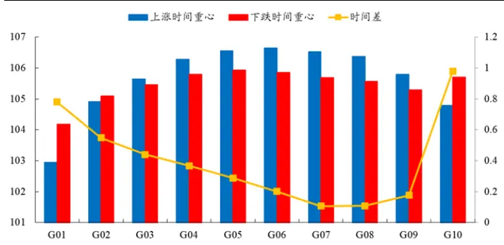
数据来源：Wind、开源证券研究所

图23：时段 5（13:01-13:30）涨跌幅分组单调性
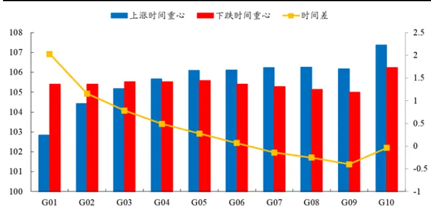
数据来源：Wind、开源证券研究所

图24：时段 6（13:31-14:00）涨跌幅分组单调性
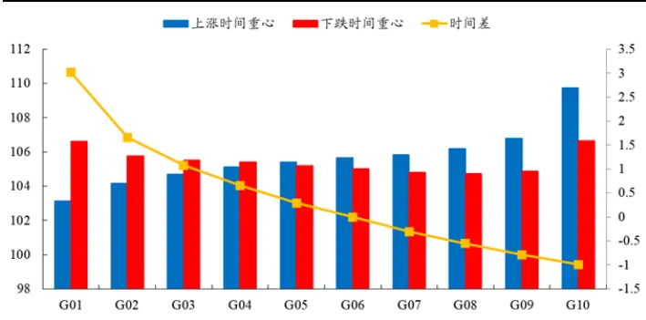
数据来源：Wind、开源证券研究所

图25：时段 7（14:01-14:30）涨跌幅分组单调性
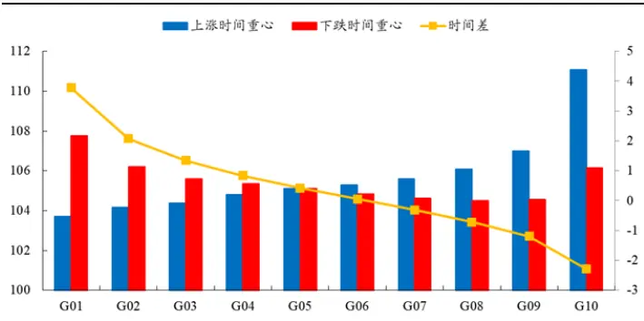
数据来源：Wind、开源证券研究所

图26：时段 8（14:31-15:00）涨跌幅分组单调性
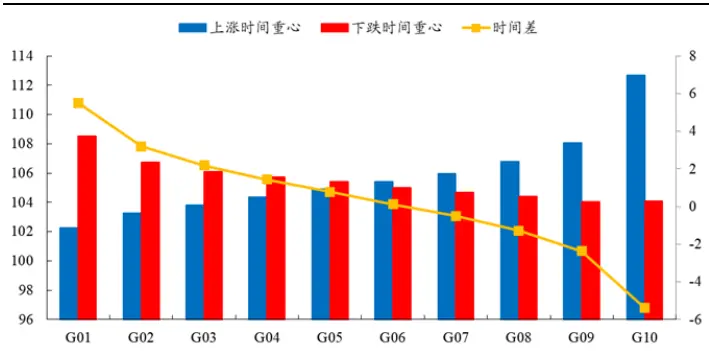
数据来源：Wind、开源证券研究所

由图 19到图26我们可以总结出如下规律：“时间差”与盘初时段（例如，时段1、时段 2）的收益率正相关，而与盘尾时段（时段7、时段 8）的收益率负相关。因而日内收益结构对于“时间差Alpha”并非始终如一，盘初阶段收益率会干扰跌幅时间重心偏离因子的有效性，盘尾阶段则能够解释时间差的有因子收益（正贡献）。

我们将涨、跌幅时间重心分别回归日内尾盘时段的收益率，观察剥离掉收益率影响后，两类时间重心因子有效性是否改变。进一步，构造时间差 Alpha 的解释模型，对于涨、跌幅时间重心的中性化处理分别设为如下形式：

$$
\begin{aligned}&G_{u}=\alpha_{u}+\beta_{u,7}R_{7}+\beta_{u,8}R_{8}+\varepsilon_{u}\\&G_{d}=\alpha_{d}+\beta_{d,7}R_{7}+\beta_{d,8}R_{8}+\varepsilon_{d}\\\end{aligned}
$$

再在残差项 $\Gamma_{\varepsilon_{u}}$ 和 $^{\prime}\varepsilon_{d}$ 的基础上，通过回归方法得到时间差 Alpha。

图27：剔除盘尾阶段收益率后，因子有效性降低
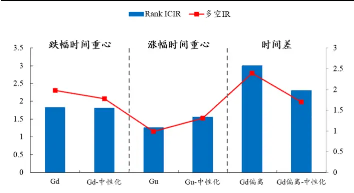
数据来源：Wind、开源证券研究所，测试区间：20130104-20220315

图28：时间差 Alpha 减弱：Rank ICIR 降至 2.3
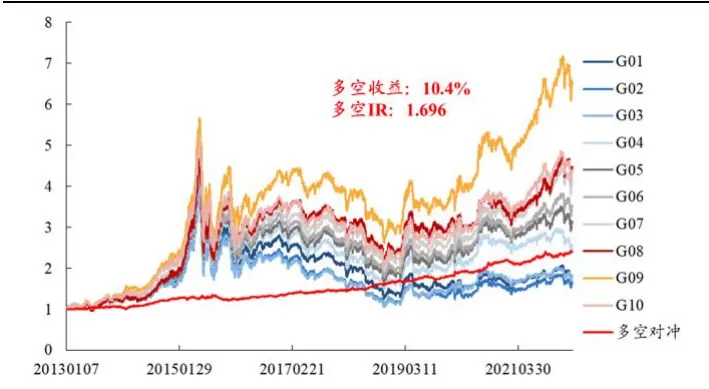
数据来源：Wind、开源证券研究所

剔除掉日内收益率结构的影响，涨幅时间重心因子和跌幅时间重心因子的有效性均有所增强（图27），说明暴露会影响一定的因子收益。而回归掉日内收益率的暴露，因子的预测能力也随之降低，这样也证实时间差 Alpha 的收益部分源于此。

于是，我们分别找到了时间差Alpha的解释因子和干扰因子。

解释因子：盘尾阶段收益率，例如，时段7 和时段8 的涨跌幅；

干扰因子：盘初阶段收益率，例如，时段1 和时段2 的涨跌幅。

## 2.2、 极端样本对时间差 Alpha 的影响分析

时间重心是由涨跌幅加权计算的平均时间戳，由此会受到两个变量的影响：一是涨、跌幅分钟在时间轴上的分布位置，二是用以加权平均的权重，也即分钟样本的价格变动幅度。为了观察以上两个指标对因子的影响，笔者用时间中心和平均涨跌幅来分别表示上述指标。

假设极端涨跌的分钟往往具备更多的信息，而这在日内分钟收益率的分布特征规律上可以被证明。根据我们在《日内极端收益前后的反转特性与因子构造》这一篇报告中得到的实证结果，极端涨跌幅的反转效应会表现得更强，并且在时间轴相近位置的涨跌幅也是较强的负向选股因子。于是，笔者将指标的计算方法设为：

（1）分别将涨幅和跌幅的分钟样本，按照价格变动幅度由大到小排序；

（2）选取靠前的N 根分钟 Bar用以计算极端涨、跌幅和时间中心。其中，极端涨幅和极端跌幅分别为涨幅和跌幅的价格变化幅度均值，时间中心为对应分钟样本时间戳的中位数。

极端的分钟样本是否贡献了因子的主要收益？为了验证猜想，笔者将跌幅时间重心偏离因子分别回归掉由前 N 个分钟样本计算得到的平均涨幅和平均跌幅，观察残差项的选股能力，以及随着被剥离样本数增大的有效性变化规律。

图29：极端样本的反转效应会对因子产生干扰
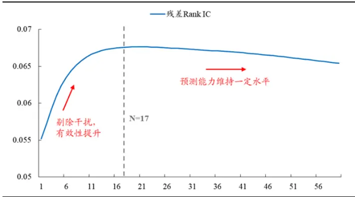
数据来源：Wind、开源证券研究所

图30：残差 Rank IC 分布：极端反转影响 Alpha 收益
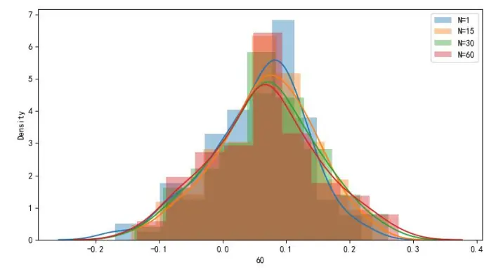
数据来源：Wind、开源证券研究所

图 29展示了第一步测算的结果，极端涨跌幅的反转效应会导致时间差Alpha的有效性降低，也即对于时间差Alpha而言，极端收益率属于干扰因子。

因此，设置如下回归模型以剥离极端收益率的影响：

$$
\begin{aligned}&G_{u}=\alpha_{u}+\delta_{u}\bar{R}_{u}+\varepsilon_{u}\\&G_{d}=\alpha_{d}+\delta_{d}\bar{R}_{d}+\varepsilon_{d}\\\end{aligned}
$$

其中， $\bar{R}_{u}和\bar{R}_{d}$ 分别表示涨、跌幅较大的 17 根分钟Bar的平均涨幅和平均跌幅。

图31：剔除极端收益率后，时间指标的有效性变化
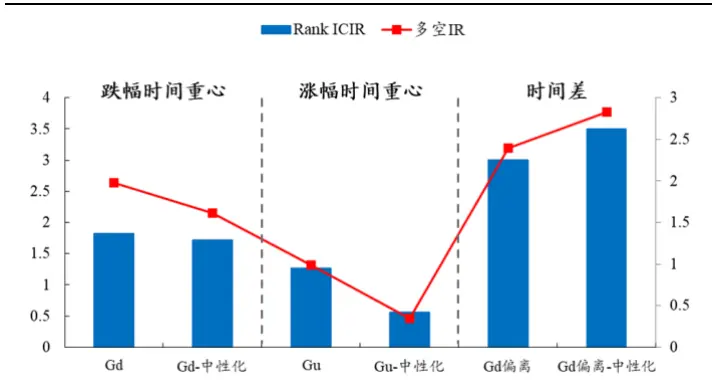
数据来源：Wind、开源证券研究所

图32：跌幅时间重心偏离因子多空收益提升至 17.9%
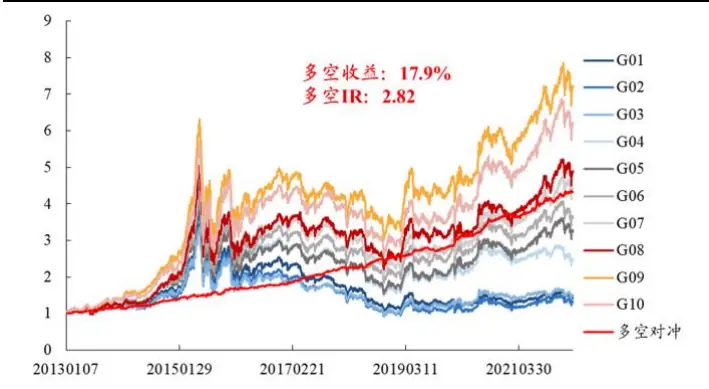
数据来源：Wind、开源证券研究所

图 31 和图 32 的测试结论支持干扰因子的判断，若我们单纯考虑收益率的时间分布，容易受到极端收益率样本影响。此外，涨幅时间重心因子受其影响程度要大于跌幅时间重心，这可能也与跌幅时间重心对收益率分布特征的暴露较小有关。

另一方面，考虑涨跌幅本身的位置信息大概率也会解释时间差 Alpha。笔者采取相同的测试方法来剔除极端样本的收益贡献，结果如图33 所示。

图33：“时间差”因子Alpha来源与位置特征
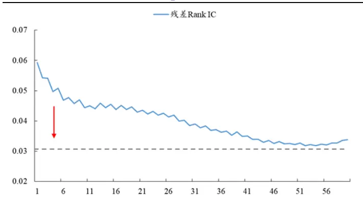
数据来源：Wind、开源证券研究所

图34：回归涨、跌幅时间中心后，因子效果减弱
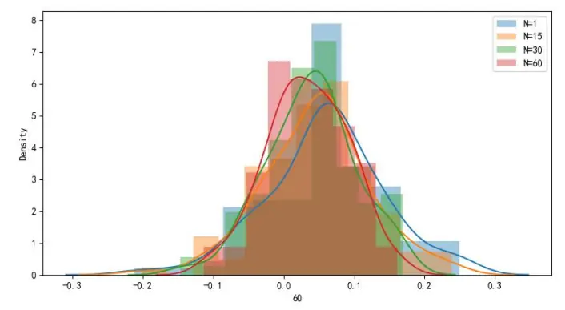
数据来源：Wind、开源证券研究所

图 33展示了第二步测算的结果。涨跌分钟的位置信息的影响相比极端涨跌幅更显著，在依次回归掉前 N 样本的位置信息后，因子 Alpha 出现较快衰减，并最终稳定在一定水平，因而涨跌幅的时间中心属于解释因子。

进一步，设置如下回归模型以剥离涨跌幅位置信息：

$$
\begin{aligned}&G_{u}=\alpha_{u}+\gamma_{u}C_{u}+\varepsilon_{u}\\&G_{d}=\alpha_{d}+\gamma_{d}C_{d}+\varepsilon_{d}\\\end{aligned}
$$

其中， $C_{u}和C_{d}$ 分别表示全部涨幅与全部跌幅的时间戳中位数。

图35：剔除时间中心后，时间指标的有效性变化
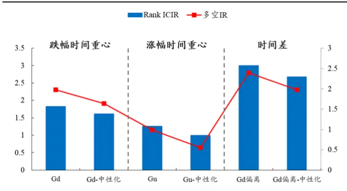
数据来源：Wind、开源证券研究所

图36：跌幅时间重心偏离因子的多空收益降低至 12.5%
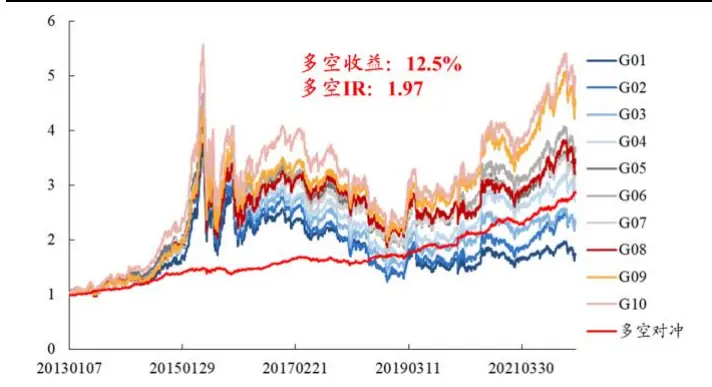
数据来源：Wind、开源证券研究所

回归掉涨、跌幅时间戳的位置信息后，时间差因子有效性降低（图35）。结合第一步测试得到的基本结论，我们能够得到初步的判断，时间差 Alpha 与收益率分布特征的 Alpha之间相互独立且收益相反。

极端涨跌幅对于“时间差”信息而言是干扰，在回归掉极端涨跌幅后，因子的有效性提升而后缓慢衰减。整体来看，因子的 Alpha 收益来源并不是极端收益率本身的幅度，而还是来源于涨跌幅的位置信息。相似地，我们得到了时间差 Alpha 的解释因子和干扰因子。

解释因子：极端收益率样本的时间中心

干扰因子：极端收益率样本的平均涨幅和平均跌幅

## 2.3、 基于“低波效应”与事件收益维度的解释

我们在前文讨论中仅使用了上涨和下跌的分钟样本，但实际上日内还有一部分分钟Bar的涨跌幅为零，而这也包含了某种信息。笔者计算股票在过去20个交易日中，平均每天的零涨跌幅分钟数量，在全市场上测试分组效果，如图 37 所示。

图37：零涨幅数量为弱有效的正向因子：RankICIR为 1.223，多空 IR为 0.88
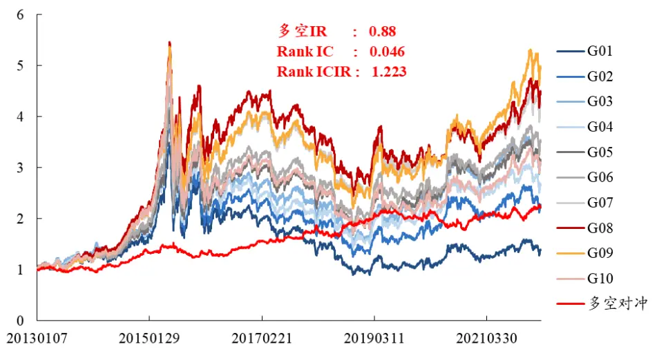
数据来源：Wind、开源证券研究所

零涨跌幅数量因子的 Rank IC 为 0.046，Rank ICIR 为 1.22。尽管该因子的选股能力较弱，但对于时间差 Alpha 而言同样具备解释能力。若将跌幅时间重心偏离因子回归零涨跌幅数量因子，我们观察到多空收益从 17.6%降低至 13.78%，多空净值曲线如图 38所示。

零涨跌幅数量与 A 股的“低波效应”相关。考虑零涨跌幅分钟的形成原因，主要有自然因素和人为因素两种。

自然因素：个股的成交活跃度低，或是市值等风格特征导致价格变动较小；

人为因素：当股票价格盘中曾触及涨停价或跌停价时，日内收益率序列会记录有连续的零涨跌幅分钟样本。

由图 39我们可以直观看出，股票在盘中触及涨停价，在未来一段时间内仍然保留一定程度的动量特征，在触涨样本、触跌样本以及全样本中的未来收益率最高。

图38：剥离零涨跌幅或极端事件收益，Alpha减弱
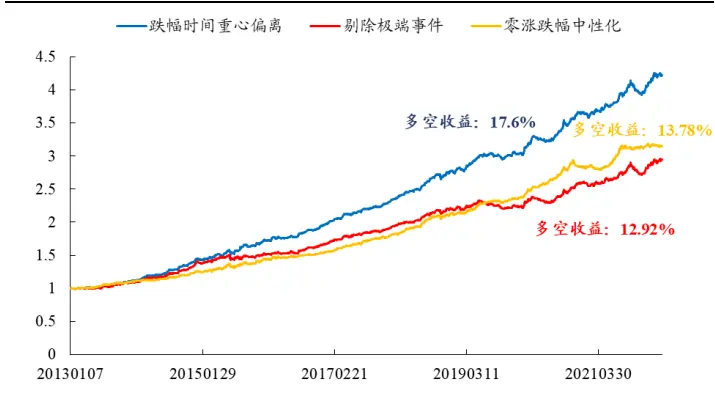
数据来源：Wind、开源证券研究所

图39：极端事件的收益率统计：当日触涨属于利好
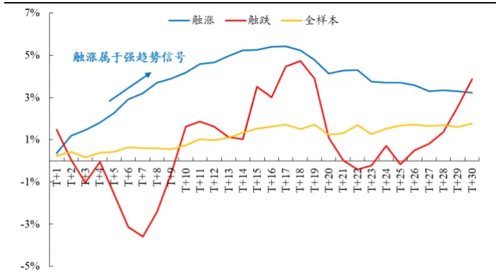
数据来源：Wind、开源证券研究所，测试区间：20130104-20220315

笔者利用股票是否在盘中触及涨跌停作为0-1变量，对计算涨跌幅时间重心因子的日频指标进行分类：若发生极端事件，则在回溯过去20 日均值计算月频因子的时候，将当天的相应指标赋为空值。分别测试极端收益率对时间指标因子的有效性影响程度，结果如表 2所示。

表2：极端事件对时间差Alpha的影响

| 因子 | 样本操作 | Rank IC | Rank ICIR 多空收益 | 多空IR |
| --- | --- | --- | --- | --- |
| 跌幅时间重心 | 全样本 | 0.053 | 1.82 16.10% | 1.98 |
|  | 剔除触涨 | 0.04 1.40 | 10.67% | 1.40 |
|  | 剔除触跌 | 0.053 | 1.89 15.90% | 2.12 |
|  | 全剔除 | 0.038 | 9.70% | 1.44 |
| 涨幅时间重心 | 全样本 | 0.037 | 1.37 1.26 8.18% | 0.99 |
|  | 剔除触涨 | 0.026 | 0.88 4.92% | 0.66 |
|  | 剔除触跌 | 0.024 | 0.84 5.02% | 0.72 |
|  | 全剔除 |  |  | 0.72 |
| 时间差 跌幅时间重心 偏离 | 全样本 | 0.024 | 0.84 5.02% | 2.39 |
|  | 剔除触涨 | 0.054 | 3.00 14.74% 2.10 |  |
|  | 剔除触跌 | 0.043 | 13.38% | 2.18 |
|  | 全剔除 | 0.055 0.043 | 3.13 15.26% 2.09 12.47% | 2.53 2.08 |

数据来源：Wind、开源证券研究所，测试区间：20130104-20220315

与极端事件的收益统计结果一致，盘中触及涨跌停的信号对于时间差 Alpha 而言具有较强的解释能力。跌幅时间重心在剥离这一事件收益后，因子收益出现了较为明显的下降，而涨幅时间重心因子对于触涨和触跌均有一定程度的暴露，这也说明涨、跌幅对于极端事件的敏感度是不同的。

整体上看，极端事件对时间差 Alpha 的影响同样不容忽视，我们也发现了时间差 Alpha的解释因子和事件收益的控制变量。

解释因子：零涨跌幅数量

控制变量：盘中是否触及涨跌停

## 2.4、 “时间差 Alpha”的综合解释模型

基于前面章节的讨论，我们找到了时间差 Alpha 的解释因子和干扰因子，对于日内收益率的时序特征有了更为明确的认知：

（1）时间差Alpha为时间维度的信息，与收益率的分布特征相关性较低。极端收益率对于因子的影响是负面的，进一步证明二者的收益来源有所不同；

（2）收益率结构对于“时间差”因子既有干扰的成分，也有解释的成分，但整体上表现为干扰作用。剥离盘初收益率能够有效提升因子的稳定性，而剥离盘尾收益率则使得时间差Alpha预测能力降低；

（3）股票的某些交易属性可能也会贡献因子收益：例如，交易活跃度偏低，或是盘中触及涨、跌停等，会造成日内录得较多的零涨跌幅分钟样本，从因子层面亦能解释一部分的“时间差”因子收益。

进一步，笔者将上述能够解释时间差 Alpha 的成分综合到一起，观察是否足够解释时间差 Alpha 的收益来源。表 3 列出了通过本章实证发现的三个解释因子及其计算说明，盘中是否触及涨跌停可能会影响时间差的选股能力，我们将其作为“滤波器”来过滤极端事件（涨停、跌停）的信号。

表3：时间差 Alpha 的解释因子

| 因子名称 | 计算说明 |
| --- | --- |
| 解释因子A | 时段7（14:01-14:30）的涨跌幅 |
| 解释因子B | 时段8（14:31-15:00）的涨跌幅 |
| 解释因子C | 日内零涨跌幅分钟的数量 |
| 控制变量 | 盘中是否触及涨跌停，若是则时间差信号取空，若否则不处理 |

资料来源：开源证券研究所

图 38展示了逐步剔除解释因子后时间差Alpha的剩余解释能力，若我们将所有解释因子和极端事件影响剔除，最终得到的是近似噪音的信号。

图40：时间差Alpha的收益来源：收益率结构与低波效应
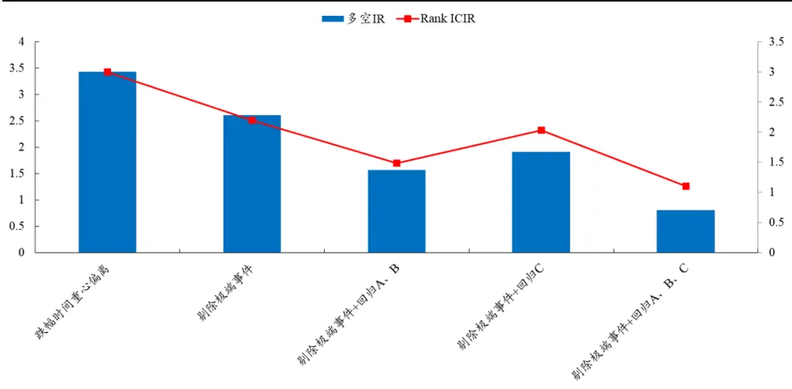
数据来源：Wind、开源证券研究所，测试区间：20130104-20220315

综上，经过我们的测试，“时间差 Alpha”并非具有独立的 Alpha 源，其真正的来源也基本确定，主要包括股票的“收益率结构”和“低波效应”的交易特征，而极端事件也会贡献部分收益。

## 3、 “时间差”因子的选股方案设计

## 3.1、 时间重心偏离（TCD）因子构建

我们在分析时间指标与收益率结构的关系时发现日内涨跌幅，尤其是盘尾阶段的涨跌幅对于“时间差Alpha”有较强的解释能力，而盘初阶段的涨跌幅会带来负向干扰。此外，诸如极端涨跌幅样本的平均涨幅和平均跌幅越高，同样也会降低因子的有效性。简单归纳一下影响因素，主要有两个方面：

（1）收益率结构：时段1和时段2 的收益率、隔夜收益率；

## （2）极端收益率的反转效应：平均涨幅、平均跌幅

于是，笔者考虑将这些干扰因素剥离，增强时间差因子的有效性。基于前文讨论和分析的内容，在跌幅时间重心偏离指标的基础上构造时间重心偏离（TGD）因子，具体的计算步骤如表4所示。

表4：TGD因子的计算步骤

| 顺序 | 计算方法 |
| --- | --- |
| 第一步 | 逐日计算个股的涨幅时间重 $心G_{u}$ 和跌幅时间重 $心G_{d}$ ，并统计以下指标： |
|  | 平均涨幅 $\bar{R}_{u}$ |
|  | 平均跌幅 $\bar{R}_{d}$ |
|  | 时段1（09:31-10:00）的涨跌幅 $R_{1}$ |
|  | 时段2（10:01-10:30）的涨跌幅 $R_{2}$ 隔夜涨跌幅 Rovernight |
| 第二步 | 将涨、跌幅的时间重心单独剥离干扰因子： |
|  | $\begin{aligned}G_{u}&=f_{u}\big(\bar{R}_{u},R_{1},R_{2},R_{overright}\big)+\varepsilon_{u}\\G_{d}&=f_{d}\big(\bar{R}_{d},R_{1},R_{2},R_{overright}\big)+\varepsilon_{d}\end{aligned}$ |
| 第三步 |  |
|  | 通过截面回归方法，构造“时间差”指标，并取其20日均值作为因子： |
|  | $\varepsilon_{d}=\alpha+\beta\varepsilon_{u}+\varepsilon$ |
|  | N 1 TGD = ε N |

资料来源：开源证券研究所

在全市场范围内将TGD因子分五组测试其有效性，图 41展示了因子的RankIC及其累计值，图 42为该因子的五分组净值图。

图41：TGD 因子月度 RankIC 及其累计值
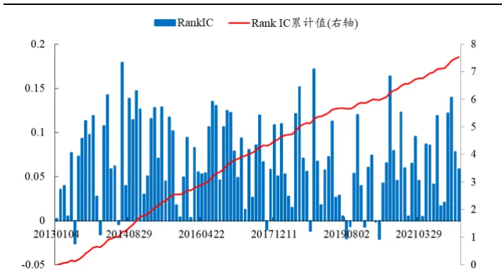
数据来源：Wind、开源证券研究所

图42：全市场五分组表现：多空收益稳健
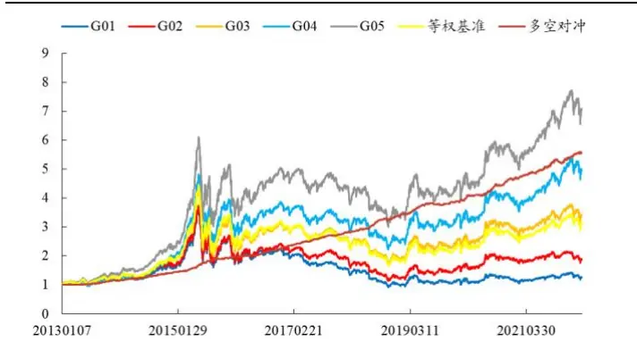
数据来源：Wind、开源证券研究所

TGD 因子整体上来看是非常稳定的选股因子，五分组下的多头年化收益率可达24.5%，并且多空 Alpha 收益分布均匀。

## 3.2、 因子相关性分析：波动和价值风格暴露分别为 0.23和 0.21

因子相关性层面，我们分别测试了 TGD 因子与交易行为因子和 Barra 风格因子的相关性，结果如图 43 和图 44 所示。该因子与我们跟踪的交易行为因子重叠度不高，除了以收益率结构为特征挖掘的APM因子，相关性稍高一些（0.37）。

这也一定程度说明了 TGD 因子的 Alpha 源自收益率结构等交易行为特征，但TGD因子的综合收益表现相比APM因子更高。笔者通过中性化方法，当 TGD因子对 APM 因子进行中性化，残差因子的多空 IR 仍然有 2.34，而相反的处理得到的则是近似噪音的成分。

图43：TGD因子与Barra风格因子相关性低
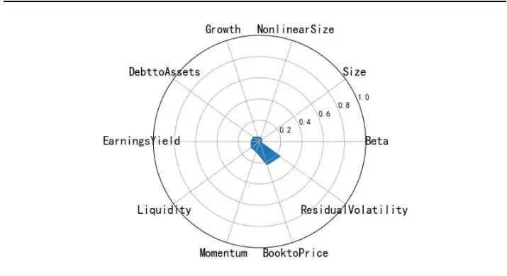
数据来源：Wind、开源证券研究所，测试区间：20130104-20220315

图44：TGD因子与 APM因子相关性较高
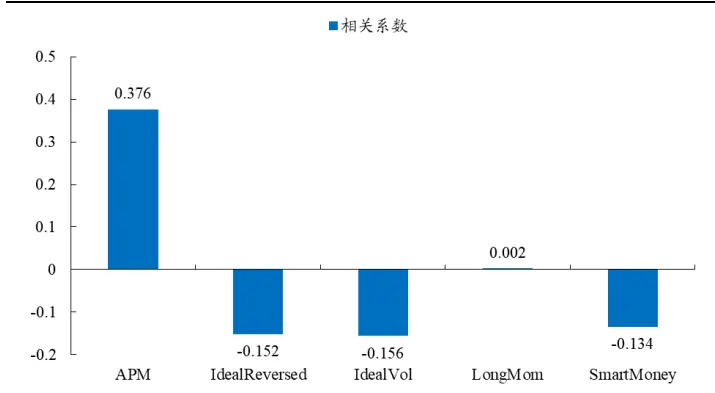
数据来源：Wind、开源证券研究所，测试区间：20130104-20220315

若是剔除掉其他因子的影响，TGD 因子的表现如何？在扣减 Barra 风格因子的收益之后，TGD 因子的多头分组能力依旧显著，多空年化收益为 13.8%，多空信息比率仍然保持3.77的较高水平。

图45：剥离Barra风格因子收益后，TGD因子多空信息比率仍有 3.77
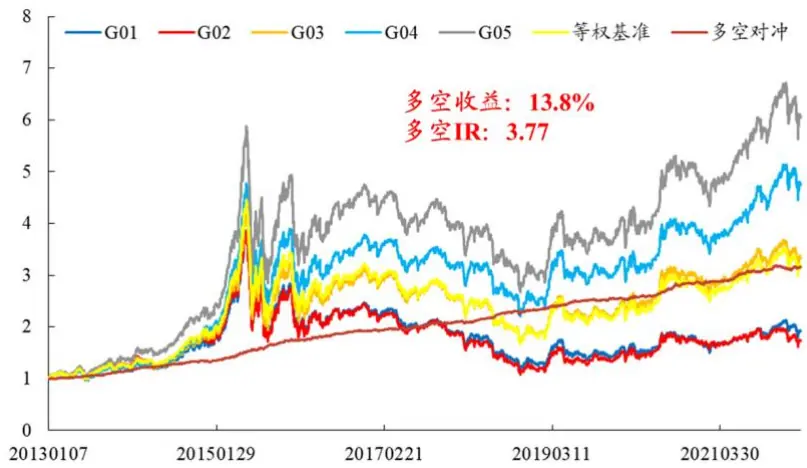
数据来源：Wind、开源证券研究所

我们再来观察因子的月度收益表现，图 46 展示了 TGD 因子在全市场五分组下的多空收益，表内的数值为对应月份多空收益的年化值。可以看出，TGD 因子在10月份表现会偏弱一些，而其他月份的收益率相对而言比较均匀，整体的因子的收益和稳定性都比较高。

图46：TGD因子的日历效应：整体收益稳定，10月份稍弱一些

| 年份 | 1月 | 2月 | 3月 | 4月 | 5月 | 6月 | 7月 | 8月 | 9月 | 10月 | 11月 | 12月 |
| --- | --- | --- | --- | --- | --- | --- | --- | --- | --- | --- | --- | --- |
| 2013 | 3.20% | 9.77% | -0.93% | -3.78% | 20.09% | -11.42% | 36.56% | 17.07% | 59.35% | 28.16% | 19.54% | 10.61% |
| 2014 | 4.66% | 60.53% | 26.00% | 8.19% | 25.78% | 8.48% | 46.61% | 9.20% | 51.94% | 11.40% | 19.78% | 30.41% |
| 2015 | 9.92% | 22.19% | 22.42% | 66.78% | 29.23% | 112.45% | 64.77% | 23.67% | 55.26% | -7.85% | 20.27% | 11.76% |
| 2016 | 9.44% | -3.13% | 19.00% | -1.50% | 13.90% | 4.81% | 56.14% | 26.85% | 29.51% | 9.87% | 49.04% | 16.98% |
| 2017 | 23.35% | 17.87% | 25.98% | 30.60% | 7.32% | 45.36% | 10.23% | 22.64% | 29.20% | -7.87% | 21.51% | 16.62% |
| 2018 | 19.03% | 16.13% | 17.32% | 24.68% | 10.50% | 36.45% | 67.65% | 25.83% | 19.18% | -0.94% | 26.18% | 13.56% |
| 2019 | 14.92% | 13.14% | 38.87% | 38.27% | 29.52% | 9.00% | 5.16% | -11.94% | -9.50% | 22.62% | 22.95% | 6.17% |
| 2020 | 12.38% | 13.72% | 30.27% | 9.97% | -6.66% | 1.08% | 37.21% | 69.55% | 16.67% | 6.34% | 59.61% | 3.35% |
| 2021 | 16.03% | 30.09% | 14.00% | 25.23% | -11.87% | 34.14% | 21.48% | 25.10% | 24.04% | -20.31% | 6.11% | 18.99% |
| 2022 | 30.12% | 11.92% | 6.47% |  |  |  |  |  |  |  |  |  |
| 正回报月数 | 10 | 9 | 9 | 7 | 7 | 8 | 9 | 8 | 8 | 5 | 9 | 9 |
| 总月数 | 10 | 10 | 10 | 9 | 9 | 9 | 9 | 9 | 9 | 9 | 9 | 9 |
| 胜率 | 100% | 90% | 90% | 78% | 78% | 89% | 100% | 89% | 89% | 56% | 100% | 100% |
| 月均收益 | 14.31% | 19.22% | 19.94% | 22.05% | 13.09% | 26.70% | 38.42% | 23.11% | 30.63% | 4.60% | 27.22% | 14.27% |

数据来源：Wind、开源证券研究所

## 3.3、 持仓风格分析：整体偏向小票样本更有效

我们基于 TGD 因子测算在不同选股域内的表现，选取沪深 300、中证 500、中证 1000等宽基成分股作为选股样本进行测试。在测算多头的超额收益率时，设定买卖费率为 5‰，测试区间为 20130104 至 20220315，超额基准设为对应的宽基指数，全样本的基准为万得全A指数。

表5：不同选股域内五分组测试表现：全样本范围更有效

| 选股域 | Rank IC | Rank ICIR 月度胜率 | 多空收益 | 多头超额 |
| --- | --- | --- | --- | --- |
| 沪深300 | 0.045 | 1.91 63.39% | 14.10% | 0.76% |
| 中证500 | 0.054 | 3.08 65.18% | 14.70% | 3.09% |
| 中证1000 | 0.064 | 4.51 77.78% | 20.69% | 4.03% |
| 全样本 | 0.067 | 4.94 81.25% | 21.35% | 5.19% |

数据来源：Wind、开源证券研究所，中证 1000 范围的测试区间为 20141104-20220315

在不同选股域内的五分组测试，TGD 因子的多空净值曲线如图 47所示。

图47：TGD因子的多空对冲净值曲线：在全样本上表现更好
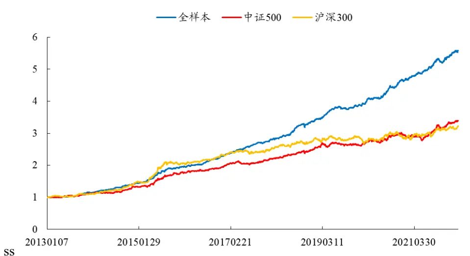
数据来源：Wind、开源证券研究所

笔者截取了 20220311当天的因子信号，并测算因子多头持仓的 100只股票与沪深 300、中证1000等宽基指数成分股的市值分布差异，结果如图 48所示。

图48：持仓100：市值风格整体偏向小票
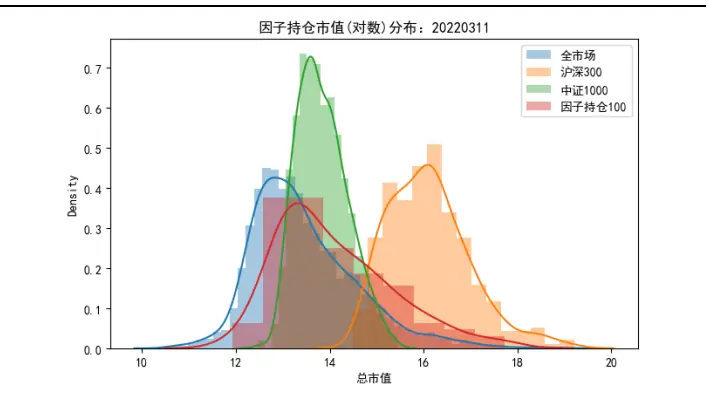
数据来源：Wind、开源证券研究所

图49：TGD因子换手率相对中等，单笔换仓近 40%
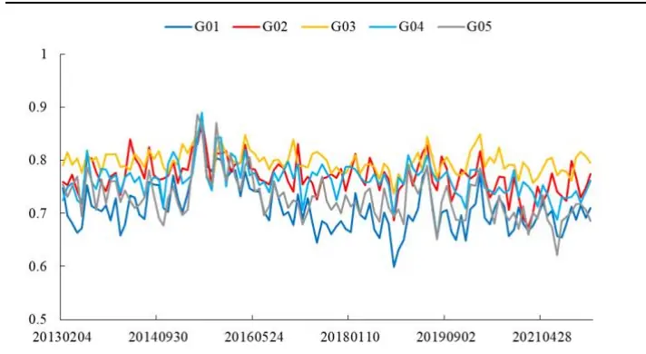
数据来源：Wind、开源证券研究所

如图 49 所示，多头组合每隔 20 个交易日调仓给的换手率约为 75%，整体费率损益中等，如若是将股票组合的调整至双周频、周频甚至更高的频率下调仓，因子收益增厚逐渐减弱，换手成本也会增加，综合考虑下双周频最优。

## 3.4、 基于多维度信息的因子合成

TCD 因子属于时间维度的综合信息，并不受收益率分布的影响，如果与收益率分布的典型因子进行合成，效果还会继续提升。笔者选取分布特征的典型因子：日内收益率偏度 SKEW 因子作为代表，将 TCD 因子与 SKEW 因子在横截面上排序加总得到合成因子，RankIC累计以及五分组结果如图50和图 51所示。

图50：合成因子月度RankIC及其累计值
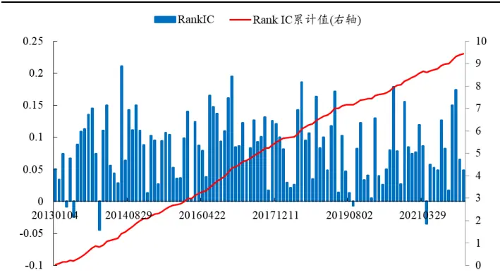
数据来源：Wind、开源证券研究所

图51：合成因子五分组表现：多空 IR为 4.45
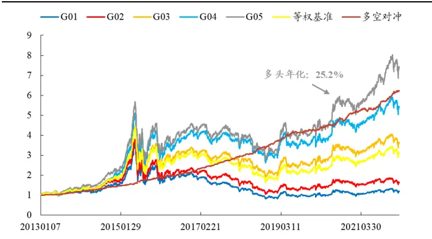
数据来源：Wind、开源证券研究所

我们基于合成因子测算在不同选股域内的表现，选取沪深 300、中证500、中证1000等宽基指数成分股作为选股样本进行测试，结果如表 6所示。

表6：不同选股域内五分组测试表现：合成因子在沪深300 内多头仍有超额

| 选股域 | Rank IC | Rank ICIR | 月度胜率 | 多空收益 | 多头超额 |
| --- | --- | --- | --- | --- | --- |
| 沪深300 | 0.057 | 2.55 | 53.57% | 16.23% | 2.72% |
| 中证500 | 0.066 | 3.97 | 53.57% | 14.58% | 2.38% |
| 中证 1000 | 0.083 | 5.51 | 66.67% | 21.96% | 4.71% |
| 全样本 | 0.084 | 5.74 | 78.57% | 22.99% | 5.97% |

数据来源：Wind、开源证券研究所

合成因子在不同选股域内的五分组测试结果，相比TGD更好。在全市场范围内的 RankICIR进一步提升至5.74。图52展示了该因子的日历效应统计结果。

图52：合成因子的日历效应：稳定性相比TGD因子更强

| 年份 | 1月 | 2月 | 3月 | 4月 | 5月 | 6月 | 7月 | 8月 | 9月 | 10月 | 11月 | 12月 |
| --- | --- | --- | --- | --- | --- | --- | --- | --- | --- | --- | --- | --- |
| 2013 | 7.55% | 16.97% | 15.58% | -0.31% | 12.64% | -14.55% | 43.01% | 13.35% | 33.68% | 33.87% | 3.66% | 34.26% |
| 2014 | 5.27% | 52.64% | 45.84% | 4.23% | 21.85% | 3.71% | 43.14% | 14.46% | 67.48% | 7.93% | 5.29% | 18.39% |
| 2015 | 19.46% | 8.95% | 29.57% | 36.59% | -20.21% | 61.33% | 114.40% | 12.42% | 19.31% | -2.82% | 26.63% | 21.97% |
| 2016 | 30.71% | -1.77% | 26.17% | 5.26% | 5.29% | 6.48% | 51.60% | 8.72% | 27.29% | 17.13% | 43.22% | 21.05% |
| 2017 | 66.90% | 17.21% | 18.81% | 48.31% | 8.13% | 40.68% | 19.71% | 24.03% | 42.99% | 8.24% | 31.86% | 22.28% |
| 2018 | 30.05% | 22.92% | 18.32% | 34.99% | 6.23% | 34.35% | 68.10% | 24.42% | 23.39% | 10.93% | 35.07% | 18.48% |
| 2019 | 39.32% | 13.38% | 46.68% | 49.85% | 0.44% | 31.98% | 9.10% | -4.71% | -0.43% | 34.15% | 11.75% | -0.83% |
| 2020 | -6.80% | 13.77% | 27.93% | 19.55% | 16.70% | -2.76% | 11.25% | 86.30% | 20.50% | -10.63% | 78.33% | 21.00% |
| 2021 | 27.25% | 8.02% | 33.13% | 13.72% | -31.84% | 31.33% | -12.15% | 23.46% | 71.65% | 11.90% | 9.04% | 34.29% |
| 2022 | 67.52% | 7.46% | 5.40% |  |  |  |  |  |  |  |  |  |
| 正回报月数 | 9 | 9 | 10 | 8 | 7 | 7 | 8 | 8 | 8 | 7 | 9 | 8 |
| 总月数 | 10 | 10 | 10 | 9 | 9 | 9 | 9 | 9 | 9 | 9 | 9 | 9 |
| 胜率 | 90% | 90% | 100% | 89% | 78% | 78% | 89% | 89% | 89% | 78% | 100% | 89% |
| 月均收益 | 28.72% | 15.95% | 26.74% | 23.58% | 2.14% | 21.39% | 38.69% | 22.50% | 33.98% | 12.30% | 27.20% | 21.21% |

数据来源：Wind、开源证券研究所

## 4、 风险提示

模型基于历史数据测试，未来市场可能发生改变。

## 特别声明

《证券期货投资者适当性管理办法》、《证券经营机构投资者适当性管理实施指引（试行）》已于2017年7月1日起正式实施。根据上述规定，开源证券评定此研报的风险等级为R3（中风险），因此通过公共平台推送的研报其适用的投资者类别仅限定为专业投资者及风险承受能力为C3、C4、C5的普通投资者。若您并非专业投资者及风险承受能力为C3、C4、C5的普通投资者，请取消阅读，请勿收藏、接收或使用本研报中的任何信息。因此受限于访问权限的设置，若给您造成不便，烦请见谅！感谢您给予的理解与配合。

## 分析师承诺

负责准备本报告以及撰写本报告的所有研究分析师或工作人员在此保证，本研究报告中关于任何发行商或证券所发表的观点均如实反映分析人员的个人观点。负责准备本报告的分析师获取报酬的评判因素包括研究的质量和准确性、客户的反馈、竞争性因素以及开源证券股份有限公司的整体收益。所有研究分析师或工作人员保证他们报酬的任何一部分不曾与，不与，也将不会与本报告中具体的推荐意见或观点有直接或间接的联系。

## 股票投资评级说明

|  | 评级 | 说明 |
| --- | --- | --- |
| 证券评级 | 买入（Buy） | 预计相对强于市场表现20%以上； |
|  | 增持（outperform） | 预计相对强于市场表现5%～20%; |
|  | 中性（Neutral） | 预计相对市场表现在—5%～+5%之间波动； |
|  | 减持（underperform） | 预计相对弱于市场表现5%以下。 |
| 行业评级 | 看好（overweight） | 预计行业超越整体市场表现； |
|  | 中性（Neutral） | 预计行业与整体市场表现基本持平； |
|  | 看淡（underperform） | 预计行业弱于整体市场表现。 |
| 备注：评级标准为以报告日后的6~12个月内，证券相对于市场基准指数的涨跌幅表现，其中A股基准指数为沪深300指数、港股基准指数为恒生指数、新三板基准指数为三板成指（针对协议转让标的）或三板做市指数（针对做市转让标的)、美股基准指数为标普500或纳斯达克综合指数。我们在此提醒您，不同证券研究机构采用不同的评级术语及评级标准。我们采用的是相对评级体系，表示投资的相对比重建议；投资者买入或者卖出证券的决定取决于个人的实际情况，比如当前的持仓结构以及其他需要考虑的因素。投资者应阅读整篇报告，以获取比较完整的观点与信息，不应仅仅依靠投资评级来推断结论。 |  |  |

## 分析、估值方法的局限性说明

本报告所包含的分析基于各种假设，不同假设可能导致分析结果出现重大不同。本报告采用的各种估值方法及模型均有其局限性，估值结果不保证所涉及证券能够在该价格交易。

## 法律声明

开源证券股份有限公司是经中国证监会批准设立的证券经营机构，已具备证券投资咨询业务资格。

本报告仅供开源证券股份有限公司（以下简称“本公司”）的机构或个人客户（以下简称“客户”）使用。本公司不会因接收人收到本报告而视其为客户。本报告是发送给开源证券客户的，属于商业秘密材料，只有开源证券客户才能参考或使用，如接收人并非开源证券客户，请及时退回并删除。

本报告是基于本公司认为可靠的已公开信息，但本公司不保证该等信息的准确性或完整性。本报告所载的资料、工具、意见及推测只提供给客户作参考之用，并非作为或被视为出售或购买证券或其他金融工具的邀请或向人做出邀请。本报告所载的资料、意见及推测仅反映本公司于发布本报告当日的判断，本报告所指的证券或投资标的的价格、价值及投资收入可能会波动。在不同时期，本公司可发出与本报告所载资料、意见及推测不一致的报告。客户应当考虑到本公司可能存在可能影响本报告客观性的利益冲突，不应视本报告为做出投资决策的唯一因素。本报告中所指的投资及服务可能不适合个别客户，不构成客户私人咨询建议。本公司未确保本报告充分考虑到个别客户特殊的投资目标、财务状况或需要。本公司建议客户应考虑本报告的任何意见或建议是否符合其特定状况，以及（若有必要）咨询独立投资顾问。在任何情况下，本报告中的信息或所表述的意见并不构成对任何人的投资建议。在任何情况下，本公司不对任何人因使用本报告中的任何内容所引致的任何损失负任何责任。若本报告的接收人非本公司的客户，应在基于本报告做出任何投资决定或就本报告要求任何解释前咨询独立投资顾问。

本报告可能附带其它网站的地址或超级链接，对于可能涉及的开源证券网站以外的地址或超级链接，开源证券不对其内容负责。本报告提供这些地址或超级链接的目的纯粹是为了客户使用方便，链接网站的内容不构成本报告的任何部分，客户需自行承担浏览这些网站的费用或风险。

开源证券在法律允许的情况下可参与、投资或持有本报告涉及的证券或进行证券交易，或向本报告涉及的公司提供或争取提供包括投资银行业务在内的服务或业务支持。开源证券可能与本报告涉及的公司之间存在业务关系，并无需事先或在获得业务关系后通知客户。

本报告的版权归本公司所有。本公司对本报告保留一切权利。除非另有书面显示，否则本报告中的所有材料的版权均属本公司。未经本公司事先书面授权，本报告的任何部分均不得以任何方式制作任何形式的拷贝、复印件或复制品，或再次分发给任何其他人，或以任何侵犯本公司版权的其他方式使用。所有本报告中使用的商标、服务标记及标记均为本公司的商标、服务标记及标记。

## 开源证券研究所

上海

地址：上海市浦东新区世纪大道1788号陆家嘴金控广场1号

楼10层

邮编：200120

邮箱：research@kysec.cn

北京
地址：北京市西城区西直门外大街18号金贸大厦C2座9层
邮编：100044
邮箱：research@kysec.cn

地址：深圳市福田区金田路2030号卓越世纪中心1号

邮编：518000

邮箱：research@kysec.cn

西安
地址：西安市高新区锦业路1号都市之门B座5层
邮编：710065
邮箱：research@kysec.cn