张 翔（分析师）

证书编号：S0790520110001

傅开波（分析师）

证书编号：S0790519120001

2023 年 08 月 06 日

## 金融工程研究团队

魏建榕（首席分析师）

证书编号：S0790520090003

## 高 鹏（分析师）

证书编号：S0790520090002

## 苏俊豪（分析师）

证书编号：S0790522020001

## 胡亮勇（分析师）

证书编号：S0790522030001

## 王志豪（分析师）

证书编号：S0790522070003

## 盛少成（分析师）

# 遗传算法赋能交易行为因子

证书编号：S0790523060003

## 苏 良（分析师）

证书编号：S0790523060004

## 何申昊（研究员）

证书编号：S0790122080094

## 陈威（研究员）

证书编号：S0790123070027

## 蒋韬（研究员）

证书编号：S0790123070037

## 相关研究报告

《因子切割论 —市场微观结构研究系列（10）》-2020.9.16

《A 股反转之力的微观来源 —市场微观结构研究系列（1）》-2019.12.23

# ——市场微观结构研究系列（20）

魏建榕（分析师）

盛少成（分析师）

weijianrong@kysec.cn

shengshaocheng@kysec.cn

证书编号：S0790519120001

证书编号：S0790523060003

## 开源金工特色遗传算法简介

在算子部分，我们引入了4大类算子，第一大类为横截面算子，其中除了较为常见的基本运算符，我们考虑了“回归算子”，这个算子是大小单残差因子的来源；第二类为时序算子，我们创新性的引入了“切割算子”，其是我们的招牌因子理想反转、理想振幅等的来源；第三大类是横截面和时序算子的结合，这一类组合算子的加入可以减少公式长度的同时涵盖更多信息；第四大类为逻辑判断，其可以进行变量的状态转化。

在变量部分，我们引入了日内量价、日间量价以及资金流相关指标，细分指标里除了基本统计指标，我们也融入了些特色指标，部分指标进行了标准化处理。在遗传算法的具体流程上，我们从个体初始化到初始种群的生成，再到选择、交叉、变异，每一步都做了对应的针对性改写，使其更加高效的进行因子挖掘。

## 遗传算法挖掘出的因子结果展示

经过一轮完整的迭代，我们得到了近200个有效因子，进一步地，我们选取样本内 RankICIR 大于 3.5 的个体，并将其合成，综合因子全区间 RankICIR 为 5.52，效果非常亮眼。除此之外，我们在挖掘出的因子中进一步精筛，选取了8大因子进行后续的逻辑解释和衍生测算，对我们已有的人工因子库为有效的补充。

## 沙里淘金：部分因子的再探究

1、我们解决了超大单好看不好用的痛点，发现“小单切割”是其关键的因素，其中在小单强度较高处，超大单强度呈现正 IC，而在小单强度较低处却呈现出负 IC。针对于这一现象，我们从行为金融学角度出发，引出了超大单关注度效应，是对我们以往资金流研究的重要补充，该因子 RankICIR 为 2.88，5 分组多空收益波动比为2.63，月度胜率为 82.4%；

2、针对于理想反转和理想振幅而言，我们发现了替代的形式，丰富了收益率和振幅改进的手段，其中将振幅替换为日内分钟收益波动，绩效有进一步的提升，RankICIR 由-3.58 提升至-4.08；

3、我们利用日内分钟特征如分钟收益波动、分钟量价相关性、分钟标准成交量波动，并结合算子“日间时序极差”定义了交易情绪不稳定性因子，该因子表现较为出色，RankICIR为-3.43，5分组多空收益波动比为 3.35，月度胜率为84.2%，是对传统振幅波动率因子很好的改进；

4、类似于散户羊群效应中“时序相关性”算子，我们发现振幅与分钟收益波动以及分钟标准化成交量波动的相关性因子效果较好，将两个因子合成后定义了主力控盘能力因子，该因子的绩效为 RankICIR 为 2.82，5 分组多空收益波动比为2.46，月度胜率为 80.7%

- 风险提示：本报告模型基于历史数据测算，市场未来可能发生重大改变。

相较于传统人工挖掘因子而言，遗传算法和神经网络是当下较为流行的挖掘因子的机器学习模型。其中遗传算法的优点在于公式的可视化，每个因子均可用算子树的形式展现，供我们在有一定变量和算子储备的前提下，最大程度的找到蕴含在背后的有效因子。本篇报告以遗传算法为基础，结合我们已有的特色变量和算子，尝试了量价因子的挖掘，具体从如下 3 大部分展开。

在第一部分，我们介绍了遗传算法框架。其中在算子部分，我们创新性地引入了切割算子，其是我们的招牌因子理想反转、理想振幅等的来源；在变量部分，我们引入了日内量价、日间量价以及资金流相关指标；在遗传算法的具体流程上，我们从个体初始化到初始种群的生成，再到选择、交叉、变异，每一步都做了对应的针对性改写，使其更加高效的进行因子挖掘。

在第二部分，经过一轮完整的迭代，我们得到了近200 个有效因子，进一步地，我们选取样本内 RankICIR大于 3.5 的个体，并将其合成，综合因子全区间RankICIR为 5.52，效果非常亮眼。除此之外，我们在挖掘出的因子中进一步精筛，选取了 8大因子进行后续的逻辑解释和衍生测算，对我们已有的人工因子库为有效的补充。

在第三部分，我们把目光聚集在了第二部分筛选出的 8 大因子，尝试从逻辑对其进行了一定程度的解释。第一，我们解决了超大单好看不好用的痛点，发现“小单切割”是其关键的因素，定义了超大单关注度因子，是对我们以往资金流研究的重要补充；第二，针对于理想反转和理想振幅而言，我们发现了替代的形式，丰富了收益率和振幅改进的手段；第三，我们利用日内分钟特征如分钟收益波动、分钟量价相关性，并结合算子“日间时序极差”定义了交易情绪不稳定性因子，是对传统振幅波动率因子很好的改进；第四、类似于散户羊群效应中“时序相关性”算子，我们发现振幅与分钟收益波动、以及分钟标准化成交量波动的相关性因子效果较好，进一步发现了时序相关性的更多可能。

## 1、 开源金工特色遗传算法框架

## 1.1、 算子的赋予：创造性引入切割算子

这里我们引入了 4 大类算子，第一大类为横截面算子，其中除了较为常见的基本运算符，比如加、减、乘、除等之外，也引入了“回归算子”，这个算子在《大单与小单资金流的 alpha能力》中帮助挖掘出了大小单残差因子。

第二类为时序算子，这里我们引入了“开源金工特色切割算子”，该算子已经用在了我们很多的独家因子发掘上了，比如理想反转、理想振幅等，该算子最核心的思想即：面对分布不均匀的市场信息，切割是剖析精细结构、寻找最优变量的有效方法。

第三大类是横截面和时序算子的结合，这一类组合算子的加入有两点好处：1、减少公式长度的同时涵盖更多信息；2、丰富算子多样性。

第四大类为逻辑判断，例如 sign 函数，该类算子和前三类都有所不同，其将某种变量转化为某种状态。除此之外，我们自定义了 diff_sign 算子，相较于 sign 衡量的绝对状态，其更多衡量的是相对状态。

表1：四大类算子列示 (部分)

| 大类 | 例子 | 说明 |
| --- | --- | --- |
| 横截面 | 基本运算符 | add、sub、mul、div等 |
|  | ols(x,y) | 使用 y 回归 x 取残差 |
| 时序 | 基本运算符 | ts_sum、ts_mean、ts_median、ts_corr、delay等 |
|  | rolling selmean btm(x, y, d, n) | 在过去d日上，根据y的值对x进行排序，取最小n个x的平均值 |
|  | rolling_selmean_top(x, y, d, n) 切割算子 | 在过去d日上，根据y的值对x进行排序，取最大n 个x的平均值 |
|  | rolling_selmean_diff(x, y, d, n) | 在过去d日上，根据y的值对x进行排序， |
|  | ts_max_to_min(x,d) | 取最大n个x的平均值与最小n个x的平均值的差值 在过去d日上，对变量x时序求最大值和最小值，并做差 |
| 横截面和时序结合 | ts_meanrank(x,d) | 先对变量x横截面排序，然后在过去d日上取均值 |
|  |  | x>0，返回1；x<0，返回-1；x=0时，返回0 |
| 逻辑判断 | sign(x) |  |
|  | diff_sign(x,d) | 先计算 x 与过去d 日均值的差，再使用 sign 函数 |

资料来源：开源证券研究所

## 1.2、 变量的遴选：大小单资金流、日内分钟特征、日间特征

对于变量而言，我们选取了 3 大类变量，第一大类为大小单资金流，包含全部和主动的超大单、大单、中单、小单，为了消除量纲的影响，这里我们对其进行了时序标准化处理；第二大类为日内分钟特征，基本统计指标如分钟收益波动等，除此之外我们也加入了一些衍生特色指标，比如分钟极端收益、分钟聪明度等；第三大类为日间特征，基本统计指标如行情数据，在此基础上我们也对其进行了一定加工，形成比如隔夜及日内收益、单笔成交金额等。

表2：3 大类变量列示 (部分)

| 大类 | 例子 | 说明 |
| --- | --- | --- |
| 大小单资金流 | 时序标准化的全部资金流 | 含有超大单、大单、中单、小单 |
|  | 时序标准化的主动资金流 | 含有超大单、大单、中单、小单 |
| 日内分钟特征 | 基本统计指标 | 分钟收益波动、分钟标准化成交量波动、分钟量价相关性等 |
|  | 衍生统计指标 | 分钟极端收益、分钟聪明度等 |
| 日间特征 | 基本统计指标 | 高、开、低、收等 |
|  | 衍生统计指标 | 隔夜及日内收益、单笔成交金额等 |

资料来源：开源证券研究所

## 1.3、 遗传算法流程：针对性的改写

对于遗传算法而言，除了变量和算子需要进行精细化处理，整体的流程也需要针对性的改写，大致的流程主要分为如下 5 步：

（1）个体初始化：在该步骤，我们需要将上述的变量和算子赋予个体进行初始化，其中需要注意的点为：对于算子里常数的赋值，我们采取的是定点赋值，比如切割算子中的第一个参数我们将其固定为：10、20、60、120，而第二个参数我们将其限定在 1~10 之间的整数，这样可以一定程度上节省算力和无意义的运算。除此之外，对于个体适应度而言，我们采取的是市值行业中性化后的 RankICIR，若个体长度过长，我们会对适应度进行一定的惩罚。

（2）初始种群构建：优良的父代是能繁衍出好种群的重要条件，所以在初始种群中，我们要求里面的个体需要满足的条件为：RankICIR>2且互相关系数不超过40%。

（3）选择：锦标赛法的规则会使得优秀的个体被重复选中，种群的多样性在一定程度上会消失，导致最后训练出的子代非常趋同。针对这一现象，我们的解决方案为：使用个体中变量和算子的差异度衡量相似性，若某种个体的重复度高于我们设定的阈值，在后续的选择则不会再选择该个体。

（4）交叉：遗传算法的本质为“物竞天择，适者生存”，而在已有的遗传算法框架中，往往是子代直接替换父代，会使得并不一定逐代变优，所以我们的解决方案为：若子代的适应度高于父代，且在当前种群中与其他个体相关系数小于 40%，交叉后的个体树深度依旧在 3及3 以下，我们才会将该子代替换父代。

（5）变异：注意的点与交叉一样，需要考虑子代替换父代所满足的条件。

综合以上的步骤，整体流程可以描述为如图1所示。

图1：开源金工特色遗传算法整体流程
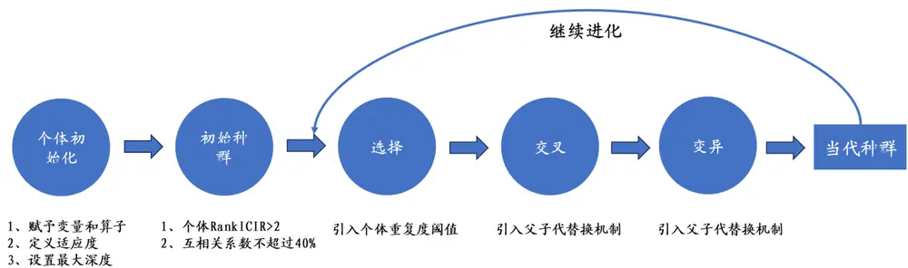
资料来源：开源证券研究所

## 2、 遗传算法的因子挖掘成果举例

## 2.1、 遗传算法优选综合因子表现优异

经过一轮完整的迭代，我们得到了近 200 个有效因子，进一步地，我们选取样本内行业市值中性化 RankICIR大于3.5的个体，并将其合成，综合因子的5 分组回测如图 2 所示。综合因子样本内(20131231-20211231)的 RankICIR 为 5.81，样本外(20211231-20230630)的 RankICIR 为 4.13，全区间 RankICIR 为 5.52。5 分组多空信息比例为 3.83，年化收益为28.33%，胜率为85.09%，效果较为优异。

图2：遗传算法优选综合因子回测曲线较为优异
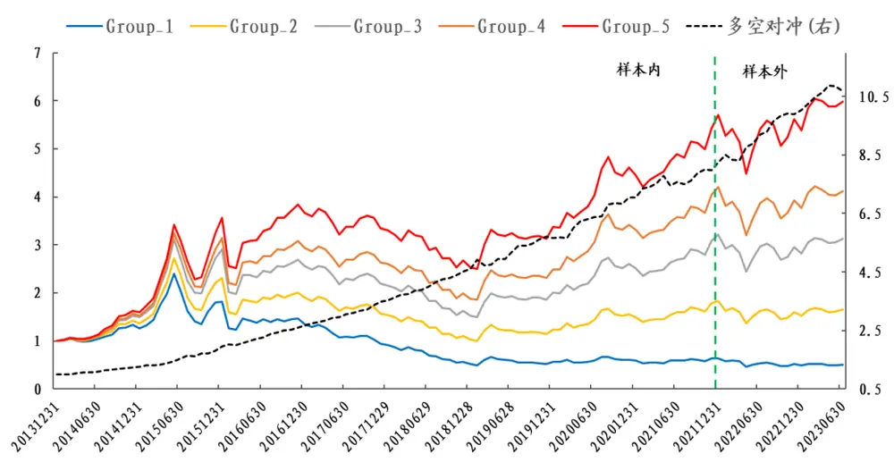
数据来源：Wind、开源证券研究所

表3：遗传算法优选综合因子在不同股票域的测试结果皆较为优秀

|  | 多空对冲 |  |  |  | 多头 |  |  |  |
| --- | --- | --- | --- | --- | --- | --- | --- | --- |
|  | 全市场 | 沪深300 | 中证500 | 中证1000 | 全市场 | 沪深300 | 中证500 | 中证1000 |
| 年化收益率 | 28.33% | 9.55% | 12.50% | 23.34% | 20.73% | 8.81% | 10.09% | 17.65% |
| 年化波动率 | 7.40% | 6.29% | 7.29% | 7.94% | 26.89% | 21.07% | 24.42% | 28.94% |
| 收益波动比 | 3.83 | 1.52 | 1.71 | 2.94 | 0.77 | 0.42 | 0.41 | 0.61 |
| 最大回撤 | 4.23% | 6.04% | 8.18% | 10.16% | 34.82% | 39.93% | 44.15% | 39.25% |
| 月度胜率 | 85.09% | 67.54% | 72.81% | 82.46% | 57.89% | 54.39% | 56.14% | 57.02% |

数据来源：Wind、开源证券研究所

## 2.2、 沙里淘金：遵循“可解释”理念

在上述的测算中，虽然整体的效果很好，但是遵循着“可解释”的理念，我们把目光聚集在了对我们以往研究有所补充的一些因子，争取从逻辑对其进行了一定程度的解释。

表4：遗传算法精筛因子明细

| 因子序号 | 具体定义公式 | 样本内 | 样本外 | 全区间 |
| --- | --- | --- | --- | --- |
| 因子1 | ts_correlation(asharemoneyflow_s_diff_value, delay(stockquote_ret, 1), 10) | -4.20 | -2.23 | -3.80 |
| 因子2 | ts_meanrank(ols(stockquote_ret, asharemoneyflow_1_diff_value), 10) | 3.89 | 1.46 | 3.44 |
| 因子3 | rolling_selmean_diff(asharemoneyflow_exl_diff_value_act, asharemoneyflow_s_diff_value, 20, 4) | 2.16 | 2.70 | 2.19 |
| 因子4 | rank_add(rolling_selmean_diff(stockminute_std, stockquote_close, 20, 4), | -4.53 | -5.87 | -4.68 |
|  | ts_max_to_min(stockminute_std, 10)) |  |  |  |
| 因子5 因子6 | rolling_selmean_top(stockquote_ret, stockminute_volume_distribution, 10, 1) | -3.02 | -3.26 -5.02 | -3.01 |
| 因子7 | ts_max_to_min(ts_mean_standard(stockminute_volume_distribution, 3), 5) ts_max_to_min(stockminute_rv_corr, 6) | -3.66 -3.55 | -2.29 | -3.77 -3.32 |
| 因子8 | ts_covariance(stockminute_volume_distribution, stockquote_zf, 10) | -3.77 | -2.79 | -3.64 |

数据来源：Wind、开源证券研究所

## 3、 因子 3的精细化讨论

表 4 前三个因子都是和资金流相关，其中因子 1 和因子 2 是我们已有人工因子库里的因子：因子 1 类似散户羊群效应因子，因子 2 类似大单残差因子，而因子 3是新增的亮点而且和切割算子有关，所以我们把目光主要集中在因子 3的讨论上。

## 3.1、 主动超大单强度效果不佳

在之前系列的资金流研究中，我们针对于大单、中单和小单都构造出了一系列有效因子，但是超大单相关的资金流一直效果不佳。其中针对于主动超大单强度而言，其 5 分组的年化收益如图 3 所示。从图中我们可以发现其 5 分组年化收益并不单调，而且还是负 IC，其也说明在拆单现象存在的基础下，对于某只股票而言，划分过于极端的超大单的买卖强度并不能直接代表机构看好程度。

图3：主动超大单强度5分组年化收益不单调
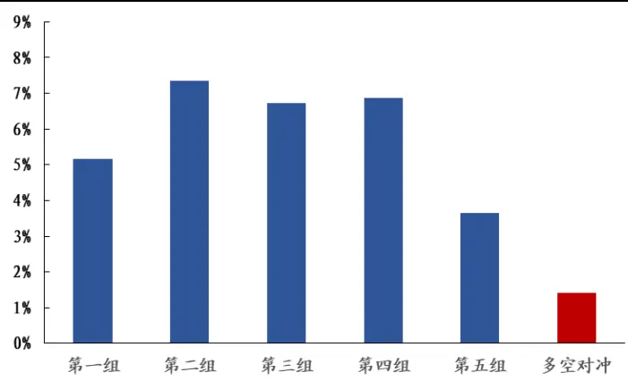
数据来源：Wind、开源证券研究所

## 3.2、 “小单强度”切割“主动超大单强度”敏感性分析

从因子3的构造方式我们可以看出，“小单切割”是解锁主动超大单强度的正确方式。进一步地，我们测算了不同小单强度下的主动超大单强度指标信息差异，方案如下：

（1）选择小单强度较高的λ交易日，计算主动超大单强度均值 $\_EXL_{ACT\_}high(\lambda)$

（2）选择小单强度较低的λ交易日，计算主动超大单强度均值 $EXL_{ACT\_}low(\lambda)$

从图 4中不同λ值的因子RankICIR上看：（1） $EXL_{ACT\_}high(\lambda)$ ：随着切割比例λ从 90%减小至10%的过程中，其RankICIR逐渐增大，表明其正向选股能力不断增强；（2） $EXL_{ACT\_}low(\lambda)$ ：随着切割比例λ从90%减小至10%的过程中，其 RankICIR绝对值逐渐增大，表明其负向选股能力不断增强；

通过回测我们发现，主动超大单强度在不同小单强度域下，其蕴含的信息存在结构性差异。在小单强度比较高的部分，主动大单强度呈现正向选股效果，而在小单强度比较低的部分，主动大单强度却呈现负向选股效果。针对这一现象，我们尝试从行为金融学的角度对其进行解释：由于拆单现象的存在，小单中充斥着超大单的拆单产物，当机构看好某只股票时，其往往会以小单进货，再用具备足够市场关注度的超大单来抬升市场情绪，从而达到抬升股价收获利润的目的，所以在小单强度较高处的超大单强度有正向选股效果；相反，若机构不看好某只股票时，其往往会以小单出货，为了防止市场恐慌，机构往往会用超大单来稳住情绪来完成平稳出货，所以在小单强度较低处的超大单强度有负向选股效果。本篇报告将这种现象称之为：超大单的关注度效应。

图4：不同λ值下EXLACT_high(λ)和EXLACT_low(λ)的 RankICIR 绩效
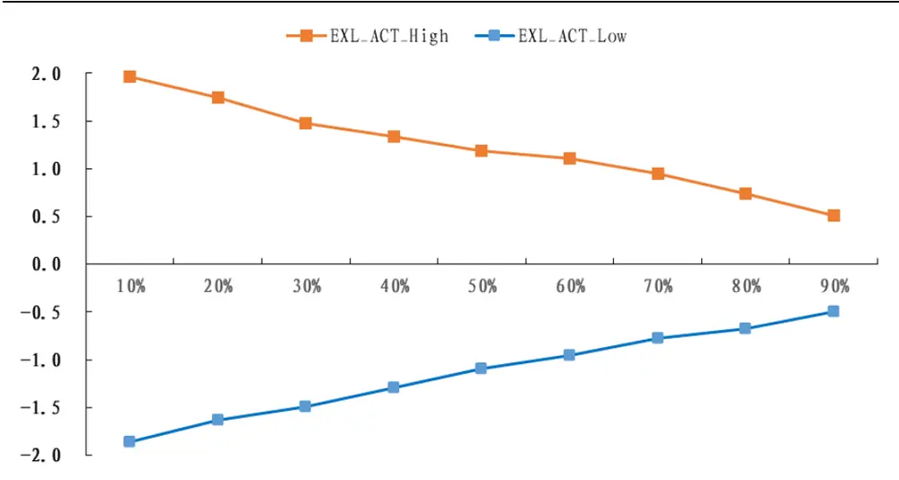
数据来源：Wind、开源证券研究所

我们以λ为 20%为例，计算 $EXL_{ACT\_}high(20\%)$ 与 $EXL_{ACT\_}low(20\%)$ ，并作差，将其命名为主动超大单关注度因子，其 5 分组绩效测算如图 5 所示。该因子整体绩效较为优异，RankICIR为2.19，5分组多空收益波动比为 2.08，月度胜率为74.4%。

图5：主动超大单关注度因子多空收益波动比为 2.08
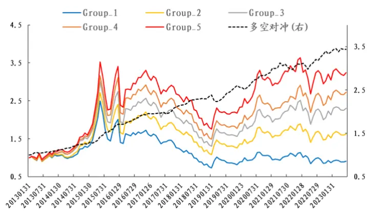
数据来源：Wind、开源证券研究所

图6：主动超大单关注度因子 5分组年化收益单调
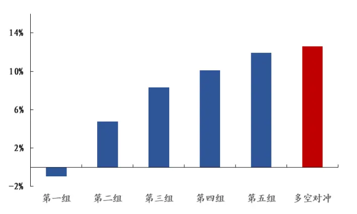
数据来源：Wind、开源证券研究所

## 3.3、 “小单强度”切割“全部超大单强度”敏感性分析

由于遗传算法只挖掘出小单切割主动超大单的因子，这里我们顺着该思路，衍生测算小单切割全部超大单的因子，具体的做法同 3.2 节一样不再赘述。不同λ值下EXL_ℎigℎ(λ)和EXL_low(λ)的 RankICIR 绩效如图 7 所示。其中我们可以看出的结论为：（1）EXL_ℎigℎ(λ)：随着切割比例λ从 90%减小至 10%的过程中，其 RankICIR逐渐增大，且幅度近似于 $EXL_{ACT\_}high(\lambda)$ ；（2） $EXL_{ACT\_}low(\lambda)$ ：随着切割比例λ从90%减小至 10%的过程中，其 RankICIR 绝对值逐渐增大，且幅度要大于$EXL_{ACT\_}low(\lambda)$

图7：不同λ值下EXL_high(λ)和EXL_low(λ)的 RankICIR 绩效
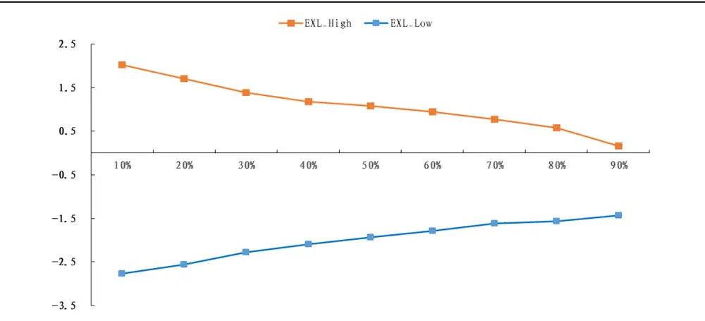
数据来源：Wind、开源证券研究所

同样地，我们以λ为 20%为例，计算EXL_ℎigℎ(20%)与EXL_low(20%)，并作差，将其命名为超大单关注度因子，其 5 分组绩效测算如图 8 所示。该因子整体绩效较为优异，RankICIR 为 2.88，5 分组多空收益波动比为 2.63，月度胜率为 82.4%，相较于主动超大单关注度因子效果更好。

图8：超大单关注度因子多空收益波动比为 2.63
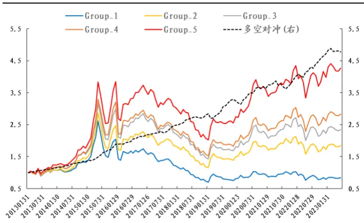
数据来源：Wind、开源证券研究所

图9：超大单关注度因子5分组年化收益单调
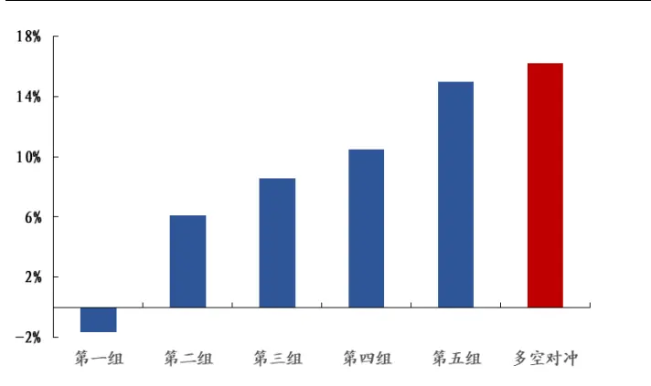
数据来源：Wind、开源证券研究所

进一步地，我们探讨了超大单关注度因子在其他样本空间的表现，如表 5所示。其在沪深 300 内的多空和多头收益波动比为 0.65 和 0.17，在中证 500 内的多空和多头的收益波动比为 1.07 和 0.37，在中证 1000 内的多空和多头的收益波动比为 1.72和 0.48。

表5：超大单关注度因子在其他样本空间依然具有一定选股能力

|  | 多空对冲 |  |  |  | 多头 |  |  |  |
| --- | --- | --- | --- | --- | --- | --- | --- | --- |
|  | 全市场 | 沪深300 | 中证500 | 中证1000 | 全市场 | 沪深300 | 中证500 | 中证1000 |
| 年化收益率 | 16.20% | 4.65% | 7.03% | 12.88% | 14.95% | 3.80% | 8.99% | 14.33% |
| 年化波动率 | 6.16% | 7.18% | 6.57% | 7.47% | 27.37% | 21.79% | 24.58% | 29.68% |
| 收益波动比 | 2.63 | 0.65 | 1.07 | 1.72 | 0.55 | 0.17 | 0.37 | 0.48 |
| 最大回撤 | 6.24% | 10.84% | 6.69% | 14.36% | 47.31% | 48.16% | 54.02% | 56.02% |
| 月度胜率 | 82.40% | 61.60% | 62.40% | 72.00% | 53.60% | 52.80% | 52.00% | 53.60% |

数据来源：Wind、开源证券研究所

接着，我们探讨了超大单关注度因子与 Barra 风格因子的相关性，如表 6 所示。从表 6 可以看出，该因子和流动性的相关性较高，其余皆在 20%以内。除此之外，其和我们已有资金流因子相关性的测算如表7所示，和主动买卖因子的相关性略高，但也在 20%以内的范围，相较于之前的资金流体系有一定的补充。

表6：超大单关注度因子与传统Barra因子相关性不高

| Beta | 价值 | 杠杆 | 盈利 | 成长 | 流动性 | 动量 | 非线性规模 | 波动 | 规模 |
| --- | --- | --- | --- | --- | --- | --- | --- | --- | --- |
| -8.66% | -1.05% | -6.43% | 1.34% | 0.52% | -22.28% | 2.53% | -4.10% | -10.03% | -13.98% |

数据来源：Wind、开源证券研究所

表7：超大单关注度因子与已有资金流因子相关性也不高

| 主动买卖 | 大单残差 | 小单残差 | 散户羊群 | 大单残差2.0 | 小单残差2.0 | 散户羊群2.0 |
| --- | --- | --- | --- | --- | --- | --- |
| 19.15% | 12.22% | 3.39% | -10.4% | 8.64% | 2.20% | -10.27% |

数据来源：Wind、开源证券研究所

## 4、 因子 4的精细化讨论

对于因子4而言，其全区间 RankICIR可以达到-4.68，公式定义如下：

表8：因子 4 的公式定义

| 因子序号 | 具体定义公式 | 样本内 样本外 全区间 |  |  |
| --- | --- | --- | --- | --- |
| 因子4 | rank_add(rolling_selmean_diff(stockminute_std, stockquote_close, 20, 4), | -4.53 | -5.87 | -4.68 |
|  | ts_max_to_min(stockminute_std, 10)) |  |  |  |

数据来源：Wind、开源证券研究所

但是具体观察其结构可以发现其为复合型因子，可以拆解成如下两部分：1、时序极差算子 2、切割算子，这里我们将分别讨论这两部分。

图10：因子4原始公式的拆分
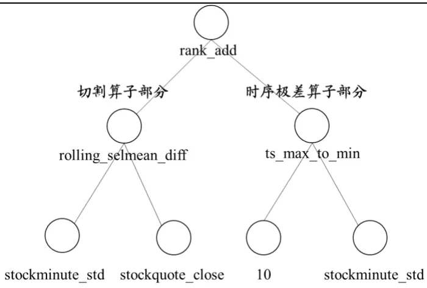
资料来源：开源证券研究所

## 4.1、 切割算子部分的讨论

因子 4中切割算子代表的含义为：回看过去20 天，计算收盘价较高4 天的日内分钟收益波动均值，同时计算收盘价较低 4天的日内分钟收益波动均值，二者做差。该切割算子中的被切割对象为：日内分钟收益波动率。在分析切割效果之前，我们首先计算了日内分钟收益波动过去 20 天均值，发现选股效果一般，5 分组年化收益率为图11所示，并不单调。

图11：日内分钟收益波动5分组年化收益不单调
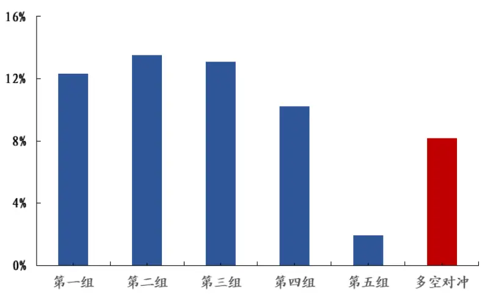
数据来源：Wind、开源证券研究所

进一步地，我们测算了不同股价下的日内分钟收益波动指标信息差异，方案如下所示：

（1）选择股价较高的λ交易日，计算日内分钟收益波动均值VM_ℎigℎ(λ)；

（2）选择股价较低的λ交易日，计算日内分钟收益波动均值VM_low(λ)；

从图 12 中不同λ值的因子 RankICIR 上看出：（1）VM_ℎigℎ(λ)：随着切割比例λ从 90%减小至10%的过程中，其 RankICIR绝对逐渐增大，表明其负向选股能力不断增强；（2） $EXL_{ACT\_}low(\lambda)$ ：随着切割比例λ从90%减小至10%的过程中，其RankICIR由负转正，在λ位于20%以下时呈现了正向选股效果。

图12：不同λ值下VM_high(λ)和VM_low(λ)的 RankICIR 绩效
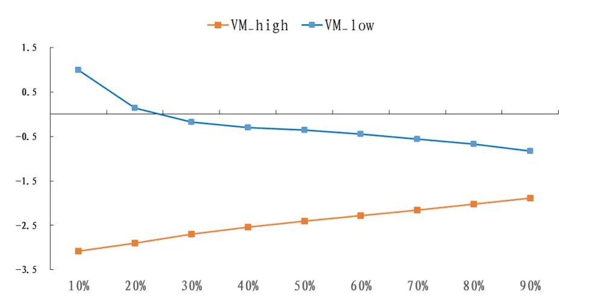
数据来源：Wind、开源证券研究所

我们以λ为 20%为例，计算VM_ℎigℎ(20%)与VM_low(20%)，并作差，将其命名为VM_diff因子，其 5 分组绩效测算如图 13 所示。该因子整体绩效较为优异，RankICIR 为-4.08，5 分组多空收益波动比为 2.83，月度胜率为 79.82%。

图13：VM_diff因子多空收益波动比为 2.83
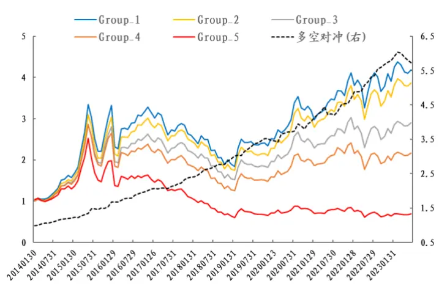
数据来源：Wind、开源证券研究所

图14：VM_diff因子 5分组年化收益单调
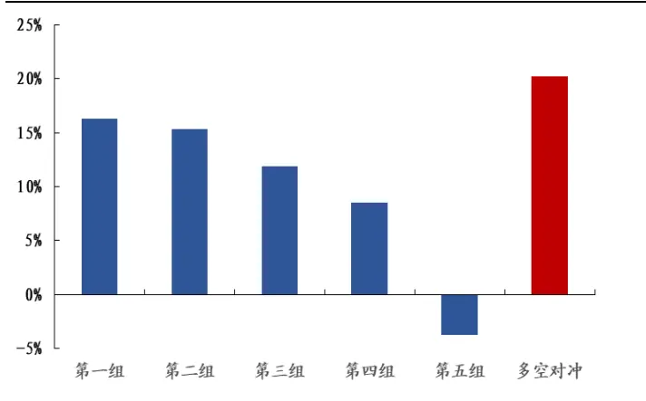
数据来源：Wind、开源证券研究所

相较于理想振幅因子，VM_diff因子只是将振幅换成了分钟收益波动率而已，而振幅和日内波动率相关性又较高，所以这两个因子本质非常相似，相关性达到80%。以此我们对比了新因子VM_diff和理想振幅的选股效果，5 分组多空对冲结果如图15 所示，二者走势非常近似，在多空IR值上VM_diff略胜于理想振幅。

图15：在多空 IR值上VM_diff略胜于理想振幅
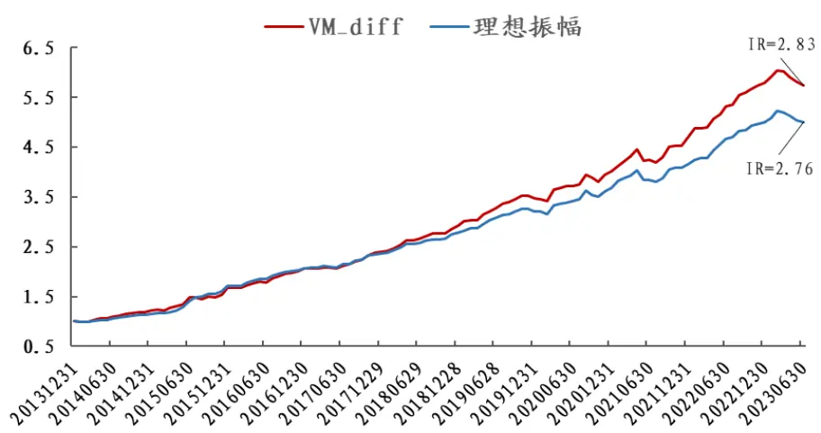
数据来源：Wind、开源证券研究所

我们开源金工特色因子除了上述讨论的理想振幅，还有理想反转。对于理想反转的替代版本遗传算法中也给出了一定的参考，即因子 5。相较于使用单笔成交金额，我们可以使用标准化的分钟成交量波动来替代，但是替代后的因子整体效果并不如原始理想反转，所以这里就不进行展开了。

表9：相较于理想反转，标准化的分钟成交量波动也可改进传统反转因子

|  | RANKICIR | 5分组多空 IR | 多头IR | 多头年化收益 | 多空年化收益 |
| --- | --- | --- | --- | --- | --- |
| 单笔成交金额 | -2.89 | 2.46 | 0.57 | 15.76% | 17.15% |
| 标准化的分钟成交量波动 | -3.11 | 2.44 | 0.49 | 13.32% | 13.17% |

数据来源：Wind、开源证券研究所

## 4.2、 时序极差算子

因子 4的第二个部分即时序极差 ts_max_to_min 算子，对于这个算子而言，除了日内分钟收益波动适用，因子 6 和因子 7 中的标准化的分钟成交量波动以及分钟量价相关性也用到了这个算子，这三者回测的绩效如表 10所示，这三者都具备一定的选股能力。

表10：时序极差 ts_max_to_min 的应用

| 变量 | RankICIR | 5分组多空IR | 多头 IR | 多头年化收益 | 多空年化收益 |
| --- | --- | --- | --- | --- | --- |
| 分钟收益波动 | -2.72 | 2.64 | 0.57 | 15.91% | 15.23% |
| 标准化的分钟成交量波动 | -3.38 | 2.70 | 0.52 | 14.36% | 13.30% |
| 分钟量价相关性 | -2.38 | 2.56 | 0.57 | 15.64% | 12.35% |

数据来源：Wind、开源证券研究所

相较于理想振幅改进的是振幅均值因子，对于表10中的3个因子而言，我们可以将其看作是对振幅波动率因子的改进版本。在 A 股中，交易情绪的稳定属性已经被验证具备一定的选股能力，传统的振幅波动率因子就是其中的代表。但是经过回测发现，振幅波动率因子效果一般，其 5分组多空IR只有 1.56，往往不能够直接使用。表10中列举的三大变量较为完备的从量、价以及量价相关性衡量了当天的交易情绪，而稳定度的衡量这里我们使用时序极差进行表征，整体的改进效果较为明显，3 个因子的多空 IR值均在2.5 以上。

最后我们将这3个因子进行rank合成，综合因子命名为交易情绪不稳定性因子，其分组效果如图 16所示。整体绩效较为优异，RankICIR为-3.43，5 分组多空收益波动比为 3.35，月度胜率为84.2%。

图16：交易情绪不稳定因子多空收益波动比为 3.35
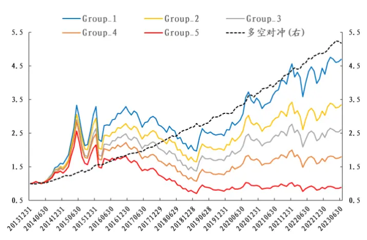
数据来源：Wind、开源证券研究所

图17：交易情绪不稳定因子5分组年化收益单调
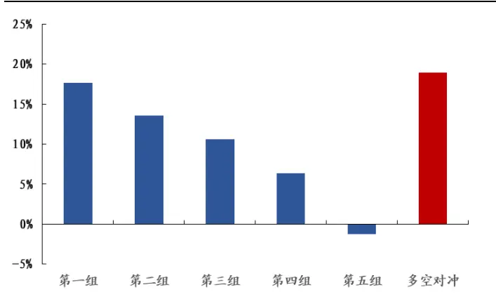
数据来源：Wind、开源证券研究所

进一步地，我们探讨了交易情绪不稳定因子在其他样本空间的表现，如表11所示。其在沪深 300 内的多空和多头收益波动比为 1.48 和 0.39，在中证500 内的多空和多头的收益波动比为 2.01 和 0.43，在中证 1000 内的多空和多头的收益波动比为2.82 和 0.49。

接着，我们探讨了其与Barra 风格因子的相关性，如表 12所示。从表12可以看

出，该因子和波动率的相关性较高，其余皆在 20%以内。

表11：交易情绪不稳定性因子在其他样本空间依然具有一定选股能力

|  | 多空对冲 |  |  |  | 多头 |  |  |  |
| --- | --- | --- | --- | --- | --- | --- | --- | --- |
|  | 全市场 | 沪深300 | 中证500 | 中证1000 | 全市场 | 沪深300 | 中证500 | 中证1000 |
| 年化收益率 | 18.89% | 8.14% | 11.33% | 17.66% | 17.68% | 8.64% | 10.80% | 14.54% |
| 年化波动率 | 5.64% | 5.49% | 5.63% | 6.27% | 27.73% | 22.08% | 24.94% | 29.53% |
| 收益波动比 | 3.35 | 1.48 | 2.01 | 2.82 | 0.64 | 0.39 | 0.43 | 0.49 |
| 最大回撤 | 3.67% | 7.92% | 3.34% | 6.25% | 40.75% | 43.29% | 46.61% | 49.29% |
| 月度胜率 | 84.21% | 68.42% | 72.81% | 81.58% | 57.02% | 53.51% | 55.26% | 57.02% |

数据来源：Wind、开源证券研究所

表12：交易情绪不稳定性因子与传统 Barra因子相关性不高

| Beta | 价值 | 杠杆 | 盈利 | 成长 | 流动性 | 动量 | 非线性规模 | 波动 | 规模 |
| --- | --- | --- | --- | --- | --- | --- | --- | --- | --- |
| 6.03% | -13.44% | -4.09% | -11.79% | -2.37% | 18.09% | -2.22% | -4.77% | 22.98% | -11.61% |

数据来源：Wind、开源证券研究所

## 5、 因子 8的精细化讨论

对于因子 8 而言，其反映的是“标准化的分钟成交量波动”与“振幅”的时序协方差，其实该因子也是复合因子，其可以拆分为：“标准化的分钟成交量波动”与“振幅”的时序相关性以及两个变量自身的标准差，而两个变量自身的标准差已经是有效的因子，所以我们主要把目光集中在“标准化的分钟成交量波动”与“振幅”的时序相关性分析上。

一般来说，随着日内成交量波动的放大，日度振幅往往也会加大，不同股票的差别存在于幅度的不同。对于幅度较大的股票而言，代表其内在主力的控盘能力较弱，股票波动较大后续往往会表现较差。作为衍生测算，我们测试了“分钟收益波动”与“振幅”之间的相关性，发现同样具备一定选股效果，结果如表13所示。

表13：时序相关性算子 ts_corr 的应用

|  | RANKICIR | 5分组多空 IR | 多头IR | 多头年化收益 | 多空年化收益 |
| --- | --- | --- | --- | --- | --- |
| 分钟收益波动 | -2.68 | 2.36 | 0.59 | 16.01% | 12.67% |
| 标准化的分钟成交量波动 | -2.48 | 2.09 | 0.47 | 12.99% | 9.82% |

数据来源：Wind、开源证券研究所

我们将“分钟收益波动”与“振幅”相关性，“标准化的分钟成交量波动”与振幅相关性这两个因子 rank取反并合成，将其命名为主力控盘能力因子，其分组效果如图 18所示。该因子整体绩效较为优异，RankICIR为 2.82，5分组多空收益波动比为 2.46，月度胜率为 80.7%。

图18：主力控盘能力因子多空收益波动比为 2.46
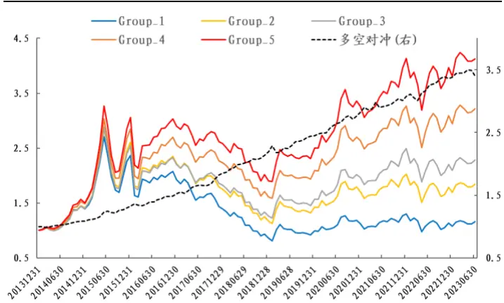
数据来源：Wind、开源证券研究所

图19：主力控盘能力因子5分组年化收益单调
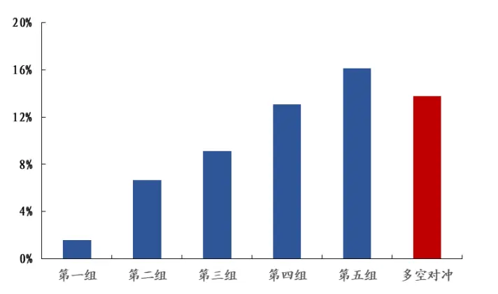
数据来源：Wind、开源证券研究所

进一步地，我们探讨了主力控盘能力因子在其他样本空间的表现，如表14所示。其在沪深 300 内的多空和多头收益波动比为 0.86 和 0.37，在中证 500 内的多空和多头的收益波动比为 0.91 和 0.37，在中证 1000 内的多空和多头的收益波动比为 2.19和 0.47。

接着，我们探讨了主力控盘能力因子与Barra风格因子的相关性，如表15所示。从表 15可以看出，该因子和流动性的相关性较高，其余皆在 20%以内。

表14：主力控盘能力因子在其他样本空间依然具有一定选股能力

| 多空对冲 |  |  |  |  | 多头 |  |  |  |
| --- | --- | --- | --- | --- | --- | --- | --- | --- |
|  | 全市场 | 沪深300 | 中证500 | 中证1000 | 全市场 | 沪深300 | 中证500 | 中证1000 |
| 年化收益率 | 13.74% | 5.75% | 6.22% | 14.41% | 16.09% | 7.53% | 9.05% | 13.81% |
| 年化波动率 | 5.60% | 6.68% | 6.82% | 6.59% | 27.12% | 20.54% | 24.19% | 29.23% |
| 收益波动比 | 2.46 | 0.86 | 0.91 | 2.19 | 0.59 | 0.37 | 0.37 | 0.47 |
| 最大回撤 | 4.90% | 10.09% | 9.25% | 10.01% | 42.18% | 38.85% | 46.13% | 48.18% |
| 月度胜率 | 80.70% | 64.04% | 64.91% | 73.68% | 57.02% | 56.14% | 55.26% | 53.51% |

数据来源：Wind、开源证券研究所

表15：主力控盘能力因子与传统Barra因子相关性不高

| Beta | 价值 | 杠杆 | 盈利 | 成长 | 流动性 | 动量 | 非线性规模 | 波动 | 规模 |
| --- | --- | --- | --- | --- | --- | --- | --- | --- | --- |
| -11.22% | 1.70% | -2.26% | 9.09% | 4.43% | -25.87% | 4.59% | 0.21% | -16.42% | 5.93% |

数据来源：Wind、开源证券研究所

## 6、 风险提示

本报告模型基于历史数据测算，市场未来可能发生重大改变。

## 特别声明

《证券期货投资者适当性管理办法》、《证券经营机构投资者适当性管理实施指引（试行）》已于2017年7月1日起正式实施。根据上述规定，开源证券评定此研报的风险等级为R3（中风险），因此通过公共平台推送的研报其适用的投资者类别仅限定为专业投资者及风险承受能力为C3、C4、C5的普通投资者。若您并非专业投资者及风险承受能力为C3、C4、C5的普通投资者，请取消阅读，请勿收藏、接收或使用本研报中的任何信息。

因此受限于访问权限的设置，若给您造成不便，烦请见谅！感谢您给予的理解与配合。

## 分析师承诺

负责准备本报告以及撰写本报告的所有研究分析师或工作人员在此保证，本研究报告中关于任何发行商或证券所发表的观点均如实反映分析人员的个人观点。负责准备本报告的分析师获取报酬的评判因素包括研究的质量和准确性、客户的反馈、竞争性因素以及开源证券股份有限公司的整体收益。所有研究分析师或工作人员保证他们报酬的任何一部分不曾与，不与，也将不会与本报告中具体的推荐意见或观点有直接或间接的联系。

## 股票投资评级说明

|  | 评级 | 说明 |
| --- | --- | --- |
| 证券评级 | 买入（Buy） | 预计相对强于市场表现20%以上； |
|  | 增持（outperform） | 预计相对强于市场表现5%～20%; |
|  | 中性（Neutral） | 预计相对市场表现在—5%～+5%之间波动； |
|  | 减持（underperform） | 预计相对弱于市场表现5%以下。 |
| 行业评级 | 看好（overweight） | 预计行业超越整体市场表现； |
|  | 中性（Neutral） | 预计行业与整体市场表现基本持平； |
|  | 看淡（underperform） | 预计行业弱于整体市场表现。 |
| 备注：评级标准为以报告日后的6~12个月内，证券相对于市场基准指数的涨跌幅表现，其中A股基准指数为沪深300指数、港股基准指数为恒生指数、新三板基准指数为三板成指（针对协议转让标的）或三板做市指数（针对做市转让标的)、美股基准指数为标普500或纳斯达克综合指数。我们在此提醒您，不同证券研究机构采用不同的评级术语及评级标准。我们采用的是相对评级体系，表示投资的相对比重建议；投资者买入或者卖出证券的决定取决于个人的实际情况，比如当前的持仓结构以及其他需要考虑的因素。投资者应阅读整篇报告，以获取比较完整的观点与信息，不应仅仅依靠投资评级来推断结论。 |  |  |

## 分析、估值方法的局限性说明

本报告所包含的分析基于各种假设，不同假设可能导致分析结果出现重大不同。本报告采用的各种估值方法及模型均有其局限性，估值结果不保证所涉及证券能够在该价格交易。

## 法律声明

开源证券股份有限公司是经中国证监会批准设立的证券经营机构，已具备证券投资咨询业务资格。

本报告仅供开源证券股份有限公司（以下简称“本公司”）的机构或个人客户（以下简称“客户”）使用。本公司不会因接收人收到本报告而视其为客户。本报告是发送给开源证券客户的，属于商业秘密材料，只有开源证券客户才能参考或使用，如接收人并非开源证券客户，请及时退回并删除。

本报告是基于本公司认为可靠的已公开信息，但本公司不保证该等信息的准确性或完整性。本报告所载的资料、工具、意见及推测只提供给客户作参考之用，并非作为或被视为出售或购买证券或其他金融工具的邀请或向人做出邀请。本报告所载的资料、意见及推测仅反映本公司于发布本报告当日的判断，本报告所指的证券或投资标的的价格、价值及投资收入可能会波动。在不同时期，本公司可发出与本报告所载资料、意见及推测不一致的报告。客户应当考虑到本公司可能存在可能影响本报告客观性的利益冲突，不应视本报告为做出投资决策的唯一因素。本报告中所指的投资及服务可能不适合个别客户，不构成客户私人咨询建议。本公司未确保本报告充分考虑到个别客户特殊的投资目标、财务状况或需要。本公司建议客户应考虑本报告的任何意见或建议是否符合其特定状况，以及（若有必要）咨询独立投资顾问。在任何情况下，本报告中的信息或所表述的意见并不构成对任何人的投资建议。在任何情况下，本公司不对任何人因使用本报告中的任何内容所引致的任何损失负任何责任。若本报告的接收人非本公司的客户，应在基于本报告做出任何投资决定或就本报告要求任何解释前咨询独立投资顾问。

本报告可能附带其它网站的地址或超级链接，对于可能涉及的开源证券网站以外的地址或超级链接，开源证券不对其内容负责。本报告提供这些地址或超级链接的目的纯粹是为了客户使用方便，链接网站的内容不构成本报告的任何部分，客户需自行承担浏览这些网站的费用或风险。

开源证券在法律允许的情况下可参与、投资或持有本报告涉及的证券或进行证券交易，或向本报告涉及的公司提供或争取提供包括投资银行业务在内的服务或业务支持。开源证券可能与本报告涉及的公司之间存在业务关系，并无需事先或在获得业务关系后通知客户。

本报告的版权归本公司所有。本公司对本报告保留一切权利。除非另有书面显示，否则本报告中的所有材料的版权均属本公司。未经本公司事先书面授权，本报告的任何部分均不得以任何方式制作任何形式的拷贝、复印件或复制品，或再次分发给任何其他人，或以任何侵犯本公司版权的其他方式使用。所有本报告中使用的商标、服务标记及标记均为本公司的商标、服务标记及标记。

## 开源证券研究所

上海

地址：上海市浦东新区世纪大道1788号陆家嘴金控广场1号

楼10层

邮编：200120

邮箱：research@kysec.cn

北京
地址：北京市西城区西直门外大街18号金贸大厦C2座9层
邮编：100044
邮箱：research@kysec.cn

地址：深圳市福田区金田路2030号卓越世纪中心1号

邮编：518000

邮箱：research@kysec.cn

西安
地址：西安市高新区锦业路1号都市之门B座5层
邮编：710065
邮箱：research@kysec.cn