2023年09月19日

## 金融工程研究团队

魏建榕（首席分析师）

# 订单流系列：关于市场微观结构变迁的故事

证书编号：S0790519120001

## 张翔（分析师）

证书编号：S0790520110001

傅开波（分析师）

证书编号：S0790520090003

## 高鹏（分析师）

证书编号：S0790520090002

## 苏俊豪（分析师）

证书编号：S0790522020001

## 胡亮勇（分析师）

证书编号：S0790522030001

## 王志豪（分析师）

证书编号：S0790522070003

## 盛少成（分析师）

证书编号：S0790523060003

## 苏良（分析师）

证书编号：S0790523060004

## 何申昊（研究员）

证书编号：S0790122080094

## 陈威（研究员）

证书编号：S0790123070027

## 蒋韬（研究员）

证书编号：S0790123070037

## 相关研究报告

《日内分钟收益率的时序特征：逻辑讨论与因子增强—市场微观结构研究系列（19)》-2022.12.25

《大小单重定标与资金流因子改进—市场微观结构研究系列（16）》-2022.09.04

《高频因子：分钟单笔金额序列中的主力行为刻画—市场微观结构研究系列（15)》-2022.06.12

# ——市场微观结构研究系列（21）

## 魏建榕（分析师）

weijianrong@kysec.cn

苏良（分析师）

suliang@kysec.cn

证书编号：S0790519120001

证书编号：S0790523060004

## 高频因子近期回撤并不能完全归因于策略的“同质化”

我们基于高频数据开发了一系列因子，如单笔金额分位数QUA、广义主力净流入率CNIR、时间重心偏离TGD等。在样本内均有不错表现，但近期稳定性均有所降低，单因子的表现在2018年前后有所差异，2020年以来ICIR降低明显。

策略“同质化”不能很好解释高频因子失效。公募、私募策略在2019年以来出现了一定的趋同性。我们的理解是，策略“同质化”的方向应在低频维度，高频因子回撤的根源还是市场微观结构变迁在悄然改变原有逻辑的适用性。

## A 股投资者结构全景图解析

我们参考中基协、中证协等协会年报、上市公司披露的股东明细及公募基金持仓等数据，统计以下几类机构持有的流通股市值占比情况。公募与私募等机构持仓规模在经历2019至2021年的快速增长期后，上升的趋势逐渐放缓；相反地，从交易所口径统计的数据看，机构的交易占比在2017年以来不断提升。

未来A股的变化趋势将会是整体资金换手率的提升，对于微观结构变迁的理解也需要修正：机构化进程体现为“交易”机构化，而并非是“持仓”机构化。

## 市场微观结构变迁的三大特征：速度、质量、集中度

（1）委托交易速度提升：小市值股票的委托平均执行时间缩短最为明显。机构化的定义可以补充为“不均匀”或是“小市值”的机构化，市场微观结构变迁对主动暴露小市值风格的因子影响会更加显著。

(2)平均挂单金额缩小：在《大小单重定标与资金流因子改进》报告中，我们对大小单划分的阈值进行重新定义，大单与小单的分界值从20万元不断降低至2.5万元，并且实测的最优参数还在降低，对于策略的参考意义也在减弱。

（3）开盘成交占比增加：在2013年，完成当天20%的交易量需要35分钟，而在2022年这一时长则缩短至20分钟左右。早盘交易的比例在增加，不同选股域之间并没有显著区别。市场上投资者似乎达成了一种交易默契：当隔夜有利好或利空消息时，第二天应该要尽早地完成交易，避免被其他投资者推高或踩踏。

## 其他重要讨论

(1）因子策略相适性分析。在因子策略层面，市场微观结构的变化，直接导致原有的构造方法不再适合当前的市场。由于投资者在日内分布结构的不均匀，盘初阶段的涨跌幅会对日内反转因子产生干扰，剔除掉这部分往往能够改造出比较好的反转因子。然而，自2018年以来，提纯日内反转的做法不再有效。

（2）微盘股交易结构变化。万得微盘股指数2023年年初以来相对沪深300和中证500超额收益分别为26.8%和29.1%。配置微盘股作为子策略而言有效，部分含“微”量高的基金超额明显跑赢同类偏股类产品。我们判断微盘股策略市场容量暂时还没达到峰值，但是累计超额收益在同类结构下已经较高，不排除会出现部分投资者选择在当下将盈利变现的处置效应风险。

- 风险提示：模型基于历史数据测试，未来市场可能发生变化。

Level-2行情数据包含逐笔成交、逐笔委托和买卖档口数据。其中蕴含的丰富信息能够帮助我们了解金融市场的微观结构，包括但不限于机构资金流识别、日内行为模式差异以及聪明钱交易等等。

在《高频因子：分钟单笔金额序列中的主力行为刻画》报告中，我们基于分钟单笔成交金额刻画了机构参与程度的度量（QUA因子)，2018年以来跟踪效果表现优异，RankIC为-0.093，ICIR为-4.92，多头超额收益达到 7%以上。

在《大小单重定标与资金流因子改进》报告中，我们尝试利用逐笔委托和逐笔成交数据重新划分大小单，同时解决了资金流因子多头超额不显著的问题。改进的广义主力净流入率（CNIR因子）多头超额优异，样本外超越沪深300达到5.1%。

在《日内分钟收益率的时序特征：逻辑讨论与因子增强》报告中，我们以涨跌幅的日内效应为出发点，探究涨跌幅在时间轴上的分布信息。所构造的时间重心偏离 TGD 因子的多空信息比率较高，Rank IC 为 0.06，多空月度胜率超过 90%。

我们将上述因子通过z-score处理后等权合成并测试其分组效果，间隔20个交易日来调仓，暂时不考虑费率的影响。尽管获取超额收益的难度在逐渐增大，但是合成因子在2023年上半年，仍然有着3%以上的多头超额，最大回撤为1.93%。

图1：单笔金额分位数 QUA 因子十分组测试结果
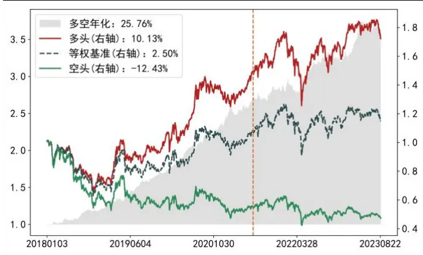
数据来源：Wind、开源证券研究所（20180102-20230823）

图2：广义主力净流入率CNIR 因子十分组测试结果
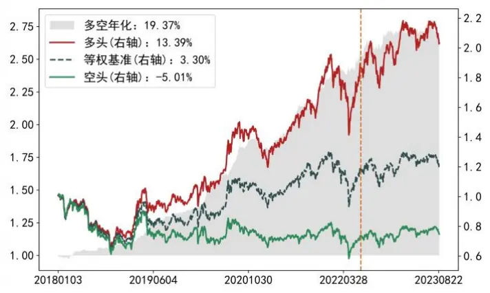
数据来源：Wind、开源证券研究所（20180102-20230823）

图3：时间重心偏离TGD 因子十分组测试结果
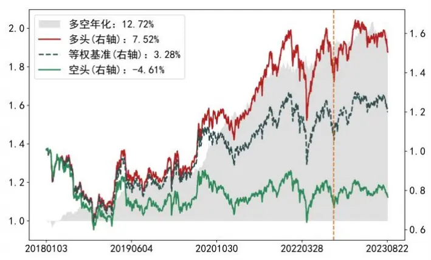
数据来源：Wind、开源证券研究所（20180102-20230823）

图4：合成因子十分组合多头超额在9.5%以上
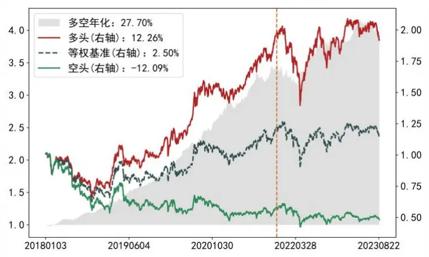
数据来源：Wind、开源证券研究所（20180102-20230823）

进一步地，我们将双边费率设为3%，计算上述因子在全市场十分组净值，表1的计算结果为因子多头相对等权的超额收益率，未经过年化处理。

表1：增加因子广度虽能增强IC，但也无法解决ICIR降低的问题

| 因子简称 | 年份 | 1月 | 2月 | 3月 | 4月 | 5月 | 6月 | 7月 | 8月 | 9月 | 10月 | 11月 | 12月 | 月均 |
| --- | --- | --- | --- | --- | --- | --- | --- | --- | --- | --- | --- | --- | --- | --- |
|  | 2018 | 0.21 | 1.53 | 0.48 | -0.30 | 0.56 | -0.28 | 0.91 | 0.14 | 0.89 | 0.07 | 1.26 | -0.47 | 0.42 |
|  | 2019 | 1.02 | 0.02 | -0.11 | 0.13 | 0.32 | -0.50 | -0.67 | -0.82 | -0.26 | -0.35 | 0.38 | -0.42 | -0.11 |
|  | 2020 | 0.19 | 0.61 | 0.98 | 0.41 | -1.19 | -0.79 | 0.23 | 2.72 | 1.82 | 1.73 | 0.93 | 0.90 | 0.71 |
|  | 2021 | 0.67 | -0.37 | 1.60 | 1.41 | 1.02 | 1.96 | 2.22 | -0.85 | 1.87 | 0.45 | 1.56 | 0.84 | 1.03 |
|  | 2022 | 0.47 | -0.04 | -0.53 | -0.42 | 0.47 | -0.43 | 1.48 | 0.52 | -0.15 | 0.63 | -0.13 | 1.00 | 0.24 |
|  | 2023 | -0.44 | 0.01 | 1.29 | -0.86 | -0.60 | -2.03 | 0.82 | -0.50 |  |  |  |  | -0.29 |
| CNIR | 2018 | 0.05 | -0.86 | 0.99 | 0.81 | 0.16 | -1.80 | -0.35 | -0.30 | -0.03 | 0.37 | 2.01 | 1.09 | 0.18 |
|  | 2019 | 1.12 | -1.32 | 1.60 | 1.74 | 2.51 | 0.51 | 1.68 | -0.36 | 0.32 | 0.74 | 0.41 | -0.88 | 0.67 |
|  | 2020 | -0.15 | 0.80 | 4.89 | 0.95 | 1.72 | 0.26 | 0.79 | 3.92 | -0.34 | 1.20 | 0.41 | -1.93 | 1.04 |
|  | 2021 | -0.17 | 0.94 | 2.37 | 0.40 | -0.25 | 1.35 | -0.80 | -0.47 | -0.19 | 0.39 | 3.54 | 0.85 | 0.66 |
|  | 2022 | 1.38 | -0.66 | 1.01 | -0.70 | 1.23 | 0.17 | 3.08 | 0.04 | 0.50 | 0.23 | 1.37 | -0.12 | 0.63 |
|  | 2023 | -0.09 | 0.81 | -0.07 | 0.78 | 1.51 | 1.87 | -0.06 | -1.17 | 一 | 一 | 一 | 一 | 0.45 |
| QUA | 2018 | -0.93 | 1.12 | 0.60 | 1.21 | -1.06 | -0.99 | 0.19 | 1.68 | -0.77 | -0.49 | 0.94 | 1.22 | 0.23 |
|  | 2019 | 2.15 | -0.84 | 1.00 | 1.43 | -0.05 | -0.56 | 2.16 | 0.86 | 1.28 | 1.46 | 0.70 | 0.17 | 0.81 |
|  | 2020 | 0.41 | 2.69 | -0.08 | 2.29 | 2.91 | 1.49 | -0.16 | 1.96 | 0.26 | 0.21 | -0.81 | 1.14 | 1.03 |
|  | 2021 | 2.37 | -1.80 | 3.03 | 1.04 | -0.27 | 1.72 | -0.86 | -0.86 | 1.96 | 2.05 | 1.63 | -0.54 | 0.79 |
|  | 2022 | 1.11 | -0.47 | -0.57 | 1.46 | -0.27 | -0.26 | 1.45 | 0.89 | 0.98 | 0.21 | -1.32 | 0.22 | 0.29 |
|  | 2023 | -0.67 | 2.09 | 1.44 | 2.51 | -0.09 | -0.94 | 0.41 | -0.26 | 一 | 一 | 一 | 一 | 0.56 |
| 合成因子 | 2018 | -1.04 | 0.80 | 2.14 | 1.04 | 0.33 | -0.94 | 1.48 | 0.79 | -0.02 | -0.55 | 2.11 | 0.64 | 0.57 |
|  | 2019 | 1.84 | -0.01 | 2.62 | 0.73 | 2.66 | -0.19 | 1.43 | 0.86 | 0.83 | 0.74 | 0.37 | 0.00 | 0.99 |
|  | 2020 | 0.13 | 2.26 | 2.41 | 1.71 | 0.64 | 0.71 | -0.17 | 2.82 | 1.77 | 1.97 | -0.96 | 1.57 | 1.24 |
|  | 2021 | 2.39 | -1.66 | 2.26 | 1.48 | 0.92 | 3.35 | 2.31 | -1.41 | 0.58 | 2.16 | 1.67 | 0.51 | 1.21 |
|  | 2022 | 0.44 | -0.31 | -3.24 | 0.68 | 0.92 | 0.35 | 1.71 | 0.42 | 0.23 | 0.19 | -2.09 | 0.61 | -0.01 |
|  | 2023 | -0.17 | 1.95 | 1.96 | 0.14 | 0.36 | -0.96 | -0.88 | -0.58 | 一 |  |  |  | 0.23 |

数据来源：Wind、开源证券研究所，单位：%

我们观察到，单因子的稳定性近期均有所降低，而增加因子广度虽然能提升收益表现，但也存在一定局限性。那是否应归咎于因子策略的“同质化”？以量化产品的净值相关性为例，笔者在公募和私募中各取了20只成立时间较早、规模较大的500指增产品，计算超额净值的相关系数及其时序变化，如图5和图6所示。

图5：公募500指增超额相关性相对私募偏高
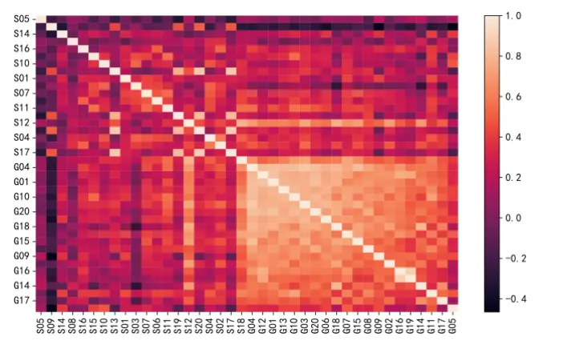
数据来源：Wind、朝阳永续、开源证券研究所，统计2019年

图6：公募&私募在某些时期有趋同的趋势
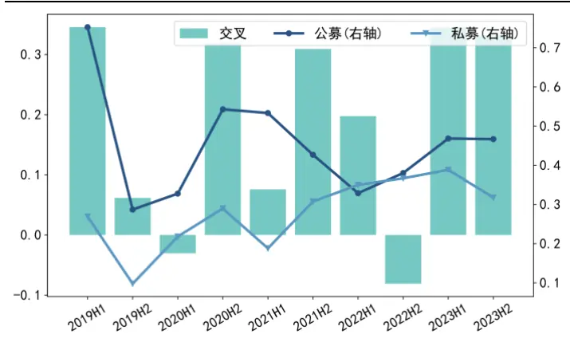
数据来源：Wind、朝阳永续、开源证券研究所(20181231-20230811)

由于公募量化面临更严格的约束，内部策略的同质化程度相比私募更高。而私募内部的超额相关性在2019年以来同样在提升，并且在某些时期，公募和私募指增的超额收益还会表现出趋同性，二者之间的相关系数随着时间不断增强。或许，我们可以大胆猜测，公募与私募策略“同质化”的方向应在低频，而高频因子回撤的根源还是交易结构变迁在悄然改变原有逻辑的适用性。

本文使用Level-2逐笔数据来研究，继续分析和探讨有关金融市场的微观结构的有趣结论，核心的研究内容将会聚焦于有关交易逻辑的变化及其成因讨论。

## 1、投资者结构全景图：机构化体现在交易而非持仓

A股参与者包括一般法人、自然人和专业机构三类，其中，自然人和专业机构贡献了大部分交易量。专业机构按照属地不同可以分为境内机构和境外机构，参考Wind分类方法将境内机构分为以下六类：公募基金、私募基金、证券公司、保险、养老金和信托机构等，而境外投资者通常是指QFII、RQFII和陆股通。

图7：A股投资者分类示意图
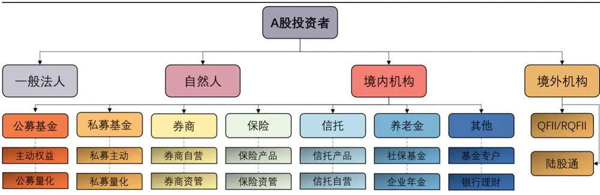
资料来源：Wind、中国证券投资基金业协会（简称，中基协，下同）、开源证券研究所

根据上交所披露的数据，专业机构的持股占比在2017年后快速上升，截至2021年底，该类占比已经提升至接近20%，相对自然人的比重也在增加。

表2：2014至2021年年末投资者持股市值占比：机构持仓占比在持续提升

| 投资者类别 | 2014 | 2015 | 2016 | 2017 | 2018 | 2019 | 2020 | 2021 |
| --- | --- | --- | --- | --- | --- | --- | --- | --- |
| 自然人 | 23.51 | 25.18 | 23.70 | 21.17 | 19.62 | 20.59 | 22.93 | 24.48 |
| 其中，10万元以下 | 2.68 | 1.20 | 1.52 | 1.23 | 1.25 | 1.09 | 0.93 | 0.90 |
| 10-50万元 | - | - | - | 3.55 | 3.50 | 3.15 | 2.75 | 2.82 |
| 50-100万元 | 7.77(1) | 6.36(1) | 6.72(1) | 2.33 | 2.20 | 2.29 | 2.21 | 2.31 |
| 100-300万元 | 3.93 | 4.50 | 4.19 | 3.61 | 3.26 | 3.40 | 3.59 | 3.85 |
| 300-1000万元 | 3.49 | 4.45 | 3.80 | 3.23 | 2.78 | 2.94 | 3.21 | 3.52 |
| 1000万元以上 | 5.64 | 8.68 | 7.47 | 7.21 | 6.63 | 7.72 | 10.24 | 11.08 |
| 一般法人 | 61.44 | 59.83 | 60.01 | 61.53 | 64.55 | 60.89 | 55.97 | 53.11 |
| 沪股通 | 0.39 | 0.49 | 0.72 | 1.18 | 1.91 | 2.79 | 3.34 | 3.28 |
| 专业机构(2) | 14.65 | 14.49 | 15.58 | 16.13 | 13.92 | 15.74 | 17.77 | 19.14 |

数据来源：上交所、开源证券研究所，比例单位为%；(1)2014-2016年由于数据区间拆分不同，均合并为10-100万元统计；(2)此处专业机构包含公募基金、私募基金、券商资管/自营、保险、信托及养老金等机构在内。

图8：公募基金持有流通股市值约为5.6万亿元
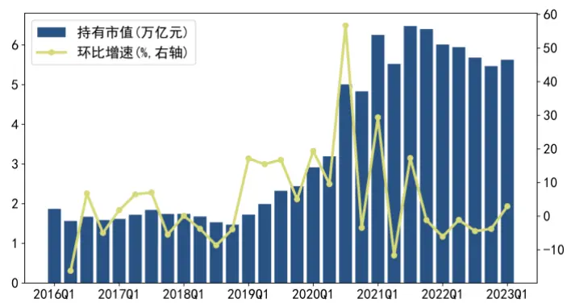
数据来源：Wind、中基协、开源证券研究所，截至2023Q1

图9：私募基金持有流通股市值约3.2万亿元
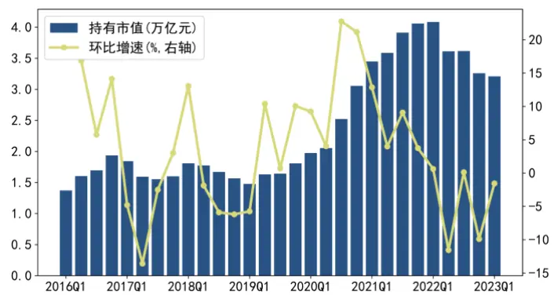
数据来源：Wind、中基协、开源证券研究所，截至2023Q1

图10：保险机构持有流通股市值约为2万亿元
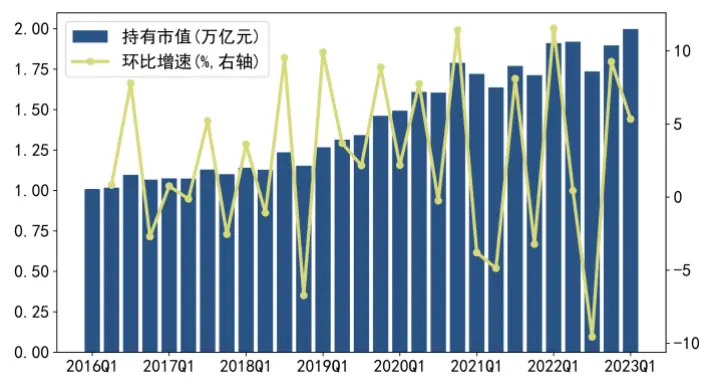
数据来源：Wind、金监局、开源证券研究所，截至2023Q1

图11：养老金持有流通股市值约2万亿元
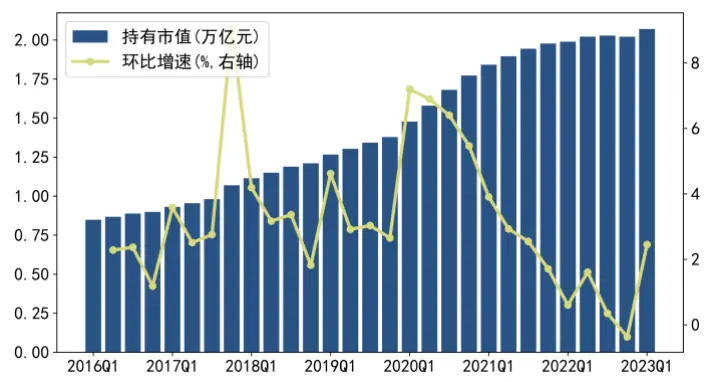
数据来源：Wind、中基协、开源证券研究所，截至2023Q1

图12：券商资管/自营持有流通股市值约0.5万亿元
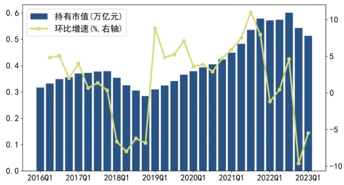
数据来源：Wind、中证协、开源证券研究所，截至2023Q1

图13：信托机构持有流通股市值约0.68万亿元
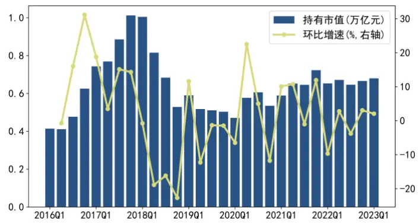
数据来源：Wind、中信协、开源证券研究所，截至2023Q1

图14：其他境内机构持有流通股市值约1.8万亿元
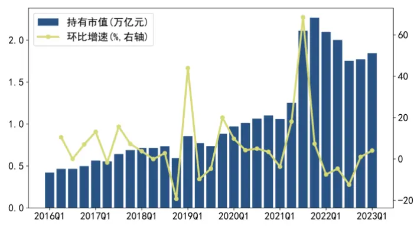
数据来源：Wind、开源证券研究所，截至2023Q1

图15：境外机构及个人投资者持有流通股约3.5万亿元
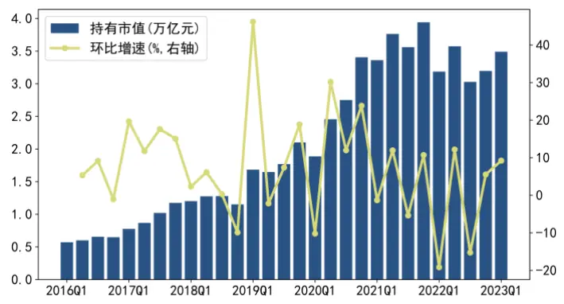
数据来源：Wind、中国人民银行、开源证券研究所，截至2023Q1

我们参考中基协、中证协等协会年报、上市公司披露的股东明细及公募基金持仓等数据，统计以下几类机构持有的流通股市值占比情况（图8至图15)。因部分数据统计口径并不完全一致，测算值可能与实际值存在一定的偏差。从持仓占比历年的变化情况来看，保险和养老金的占比在稳步提升，而偏向交易的机构资金，如公募基金、私募基金、券商资管和自营等机构，持仓规模在经历2019至2021年的快速增长期后，上升的趋势也有所放缓，2021年以来并未有明显增长。

在流动市值口径下，截至2023Q1，一般法人持有的流通股市值占比最高，而专业机构的合并占比达到27%，与自然人的比例相当。其中，占比较高的三类境内机构依次是公募基金、私募基金以及养老金，内部占比分别为35.3%、20.1%和13%。

图16：一般法人在A股投资者结构中占比最高，专业机构占比约为27%
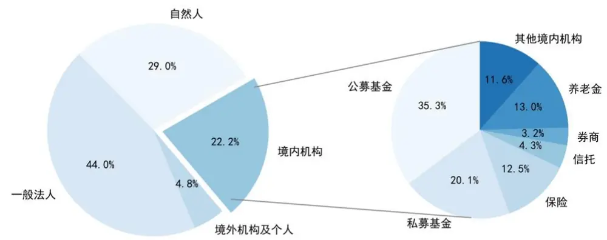
数据来源：Wind、开源证券研究所，数据截至2023Q1

虽然自然人和专业机构的持仓占比都在上升，但是并不意味在市场上二者的定价权也是如此。在注册制制度实施以来，自然人的交易占比由2016年的80%以上逐渐降低至2021年的65.1%，而专业机构的交易占比则在不断提高。参考国外股票市场的发展经验，我们认为随着市场交易制度的不断成熟，公募及私募等资金交易占比提升，机构化进程大概率还会持续，目前市场并没有表现为机构绝对强势。

表3：境外其他国家或地区的股票交易市场结构占比

| 交易市场 | 美国 | 中国香港 | 印度 | 日本 | 英国 |
| --- | --- | --- | --- | --- | --- |
| 机构交易占比 | 93.2% | 77.1% | 22.5% | 64% | 82.3% |
| 个人投资者交易占比 | 6% | 22.9% | 47% | 22% | 12% |

数据来源：上交所、开源证券研究所，不足100%的部分为做市或自营交易；数据截至2021年底

增量资金不足的市场环境下，存量的博弈或许是一种常态。一方面，虽然公募基金等专业机构在2019至2020年经历了快速增长，但后续没有形成稳定、持续的资金流入，“资金牛”难以预期；另一方面，根据上交所和深交所数据，机构订单比例在2017年后显著提升，专业投资者在A股的定价权不断加强。未来A股的变化趋势将会是整体资金换手率的提升，我们对于微观结构变迁的理解也需要修正：机构化进程体现为“交易”机构化，而并非是“持仓”机构化。

表4：A 股市场的机构订单提交比例逐渐提升

| 交易所 | 2011 | 2012 | 2013 | 2014 | 2015 | 2016 | 2017 | 2018 | 2019 | 2020 | 2021 | 2022 |
| --- | --- | --- | --- | --- | --- | --- | --- | --- | --- | --- | --- | --- |
| 上交所 | 9.81 | 15.05 | 14.68 | 13.02 | 11.27 | 11.57 | 14.04 | 17.9 | 17.54 | 19.96 | 25.11 | 31.8 |
| 深交所 | 9.01 | 9.00 | 8.74 | 9.42 | 9.13 | 8.78 | 21.53 | 13.16 | 15.52 | 19.50 | 24.01 | 29.46 |

数据来源：上交所、深交所、开源证券研究所，按股数来统计比例，单位为%

## 2、股票市场在交易层面的三大重要变化

## 2.1、电光石火：订单交易速度普遍提升

我们利用逐笔委托和逐笔成交数据，统计了深交所上平均每笔挂单执行（成交或撤回）所需要花费的时间。如图17所示，2018年以来整体的订单交易速度在逐步提升，2022年3月至5月该指标达到历史低位。根据深交所发布的《股票市场质量报告》的统计结果，2022年，深市非市价化限价委托执行时间约为508秒，市价化限价委托则要更快一些（约20秒），平均用时也是自2006年以来的最低水平。

图17：订单执行时间逐渐缩短，交易越来越快
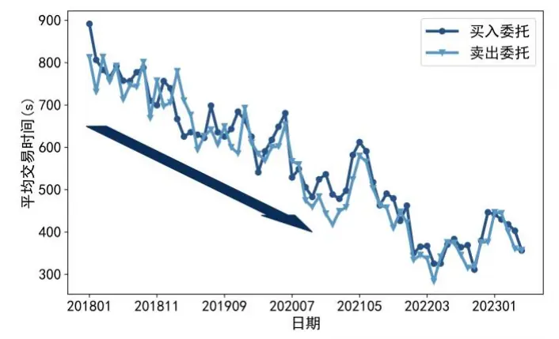
数据来源：Wind、开源证券研究所

图18：不同选股域的订单执行时间差异较小
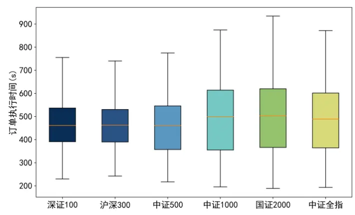
数据来源：Wind、开源证券研究所（20180102-20230531）

## 我们推测交易提速的驱动因素主要有两种可能性：

(1）交易机构化。伴随着A股的机构持仓、交易占比不断提升，市场上会充斥会更多机构单。通常而言，机构交易者更倾向于用算法下单，这部分由程序自动生成的订单能够快速识别交易机会，速度上也会比传统手动下单交易更快，对于市场的冲击也更小。由机构提交的算法委托单越多，整体交易速度也越快。

(2)流动性改善。交易速度与盘口的流动性密不可分，例如，在流动性比较好的股票上，委托单会更容易成交，执行时间也会缩短。这部分订单的交易提速通常与机构行为关系不大，而是与市场上数量更多的个人投资者的交易热情有关。

结合数据方便我们理解，不妨先观察第一种可能性：交易机构化。

机构算法交易带来的变化可通过Level2数据观测，细化到每笔委托的特征。在所有下达至交易所的委托订单中，有部分呈现出明显的高频交易属性：订单的持续时间极短，例如，部分委托在3秒内经历下单与撤单的周期，而这并非是传统手动操作所能实现的交易行为，大概率是机构的算法单或是高频交易策略。

我们统计这部分订单的比例，图19展示了高频（10秒以内）撤单占比的变化，2018年以撤单比例的分布重心在逐渐往右移动，撤回的股数占比越来越高。而从撤单占比的整体水平来看，撤单占比2018年以来维持在稳定水平，主动撤回的股数占全部委托股数的比例约为32%（图20）。

图19：高频（10秒内）撤单的比例在逐年增大
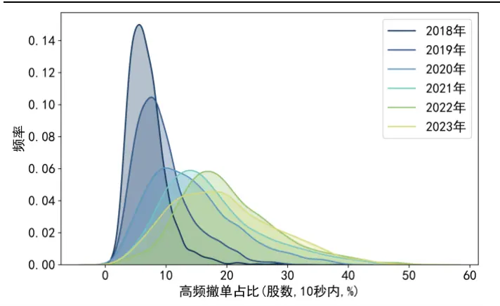
数据来源：Wind、开源证券研究所

图20：撤单比例保持稳定，高频撤单的结构占比提升
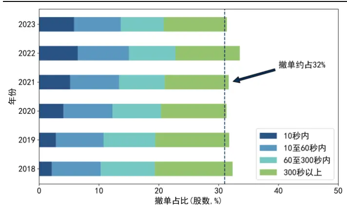
数据来源：Wind、开源证券研究所，2023年数据截至5月31日

撤单比例没有特别明显的变化，而是在内部表现出结构性转变，也说明了在机构交易占比渐渐增多，与交易所提供的统计结果一致；在流动性供给方面，机构也在逐渐挤占个人投资者的位置。此外，上图还有一点值得关注的变化：依据2023年上半年的统计数据，高频撤单比例相比2022年下降了0.6%。该现象有可能是样本偏差，但不排除是一种趋势见底的信号（对照图17）。

上述测算结果可能揭示了一种现象：相较以往，当前交易订单簿充斥着越来越多的算法订单，这部分交易委托会在一定程度上提供市场的流动性（盘口宽度会缩窄，执行时间进一步缩短)。原本由个人投资者贡献的交易现在逐渐由部分机构投资者来完成，A股市场的撮合交易的环境在变化，因子策略亦要顺时施宜。

第二种可能性是由投资者情绪主导的放量行情。在A股市场中，投资者较多在盘口附近提交委托单，其数量越多，股票的流动性越好，订单的交易速度也相应地更快一些。然而，市价委托的比例非常少（表5)，大部分交易还是通过限价委托完成，我们进一步按价格顺序划分为“市价化”和“非市价化”的限价委托。

表5：2018至2022年不同类型订单统计：委托方式的结构没有发生较大变化

| 指标（单位：%） | 2018 2019 | 2020 | 2021 | 2022 |
| --- | --- | --- | --- | --- |
| 市价委托提交比例 | 0.21 | 0.20 0.27 | 0.24 | 0.21 |
| 市价化限价委托提交比例 | 54.1 | 53.8 54.2 | 54.1 | 53.4 |
| 非市价化限价委托提交比例 | 45.7 | 46.0 45.5 | 45.7 | 46.4 |

数据来源：Wind、深交所、开源证券研究所，限价委托为笔者统计结果，非交易所数据

市价化限价委托与非市价化限价委托的区别在于在交易的优先程度：为了快速完成一笔交易，投资者会报出更为激进的价格（高于买一价或者低于卖一价)，这部分订单即为市价化限价委托，否则，为非市价化限价委托。在“价格优先、时间优先”的规则下，市价化限价委托更容易成交，数量占比上也最多，约占全部委托的54%。上述两类订单平均执行时间的变化趋势如图21所示。

图21：限价委托的平均执行时间在2018年以来逐渐缩短
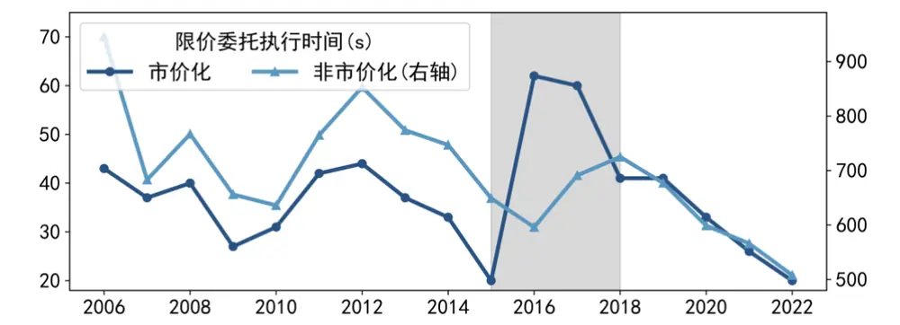
数据来源：深交所、开源证券研究所

大多数情况下，市价化与非市价化的限价委托的执行速度同向变动，但在2015至2018年间两者存在明显的背离。我们理解，上述两类订单执行时间变化的驱动内因不一样：前者取决于盘口流动性供给，而后者则与大额交易需求关系密切。在经历2015年的大跌后，个人投资者对股市的看法普遍消极，盘口流动性的供给出现了短缺，市价化限价委托的执行速度大幅降低。当市场交易情绪提升时，盘口的交易委托也会更多，进而缩短订单周期，2015年之前的交易提速大多属于这种情况。

进一步，我们观察不同选股域的变化情况。图22和图24分别对应两类限价委托执行时间在不同年份的变化，其中市价限价委托的分域效果会更明显一些。

图22：非市价化限价委托执行时间的历年变化
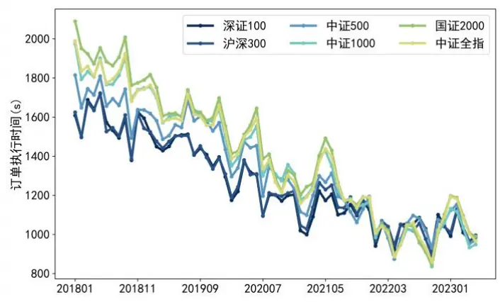
数据来源：Wind、开源证券研究所

图23：非市价化限价委托在大小市值上的差异不大
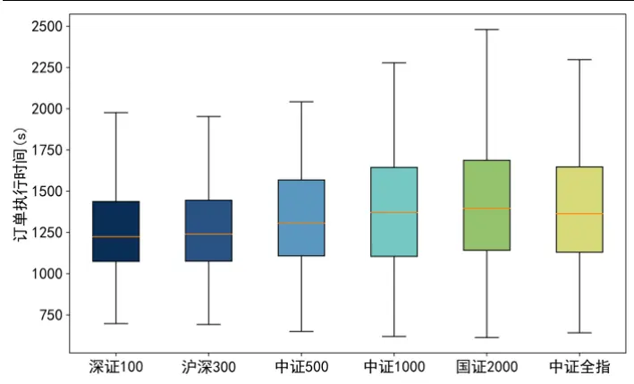
数据来源：Wind、开源证券研究所

图24：市价化限价委托执行时间的历年变化
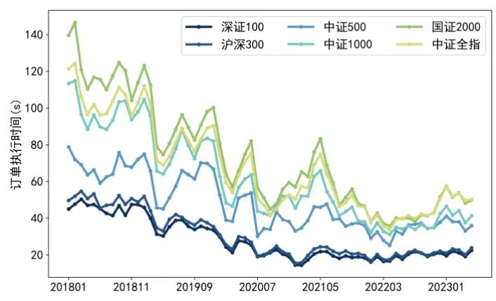
数据来源：Wind、开源证券研究所

图25：市价化限价委托在小市值上执行速度更慢
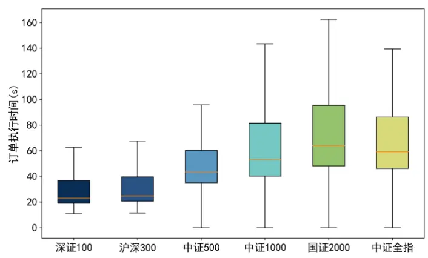
数据来源：Wind、开源证券研究所

无论是市价化还是非市价化的限价委托，平均执行时间均在缩短，但又存在一定区别：（1）不同选股域的差异；（2）时序变化的显性程度。

在不同选股域内，订单执行时间基本上遵循“大票时间短，小票时间长”的变化规律，主要原因在于大小市值股票的流动性差异：大票的交易比较活跃，限价委托能被迅速地成交，而在成交较为低迷的小票中所需时间更长。这一特征在与流动性相关度更高的市价化限价委托中体现更为明显。

从变化趋势来看，小市值股票的市价化限价委托，平均执行时间缩短的程度最为明显。我们或许可以补充机构化为“不均匀”或是“小市值”的机构化，而市场微观结构变迁对主动暴露小市值风格的因子影响会更加显著。两类委托的平均执行时间在2022年以来均再没有显著降低，合理设想，这一变化背后的资金博弈可能已经达到了某种平衡，订单流交易提速的边际变化在逐渐收敛。

## 2.2、精耕细作：激烈竞争下的策略优化

在《大小单重定标与资金流因子改进》报告中，我们观察到A股的平均单笔挂单金额在近年来呈现下降趋势（图26），2022年4月达到最低值。考虑这点，报告对大小单划分的阈值进行重新定义，大单与小单的分界值从20万元不断降低至2.5万元，并且参数还在缩减，对于策略的参考意义也在降低。

从分域测试结果来看，挂单金额的大小与股票流动性有关。流动性越好的股票标的委托金额越大，若是交易流动性偏差的标的，拆分下单的概率会更大，一方面能避免过度影响到市场价格（图27)，另一方面也能降低交易成本。

图26：2018年以来平均单笔挂单金额呈下降趋势
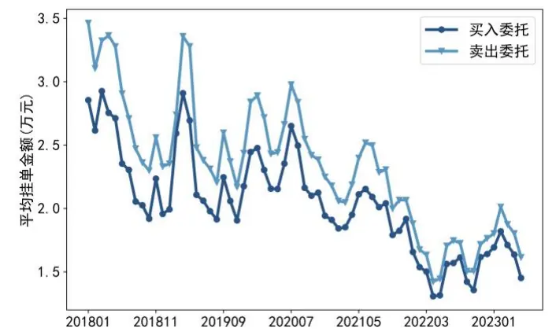
数据来源：Wind、开源证券研究所

图27：大市值、流动性好的股票挂（卖）单金额偏大
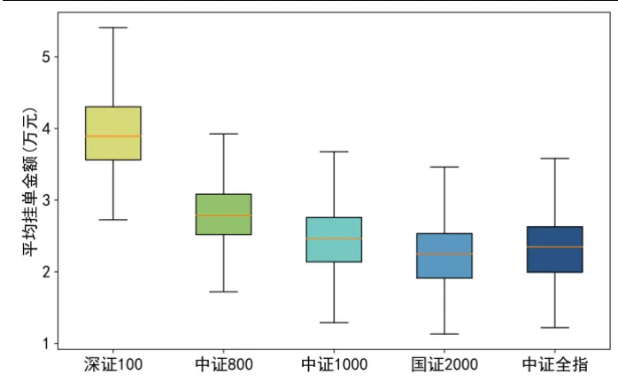
数据来源：Wind、开源证券研究所（20180103-20230531）

全市场的单笔挂单金额与成交额的相关系数可以达到0.67，单笔挂单金额的变动具有一定的周期性，当市场处于交易很活跃的时候，投资者通常不需要将订单拆分得很细，例如2019年初、2020年等。出于隐藏交易意图和摊薄成本的考虑，投资者通常会分笔买入，导致卖出委托的金额要大于买入委托，但二者均呈现相同的变化趋势，对统计结果也没有显著影响。

大小市值股票的挂单金额变化并不一致，机构化的演绎过程有所不同。我们同样分域观察挂单金额的时序变化，图28展示了不同选股域内股票近几年挂单金额的变化情况。在2020年至2023年期间，股票的平均挂单金额均有不同程度降低，降幅最为明显为中证1000、国证2000指数成分股等小市值股票，而大票同期变化幅度却不是很大，仅2022年和2023年有小幅降低。

图28：平均挂（卖）单金额变化存在差异：小市值股票的降幅更明显
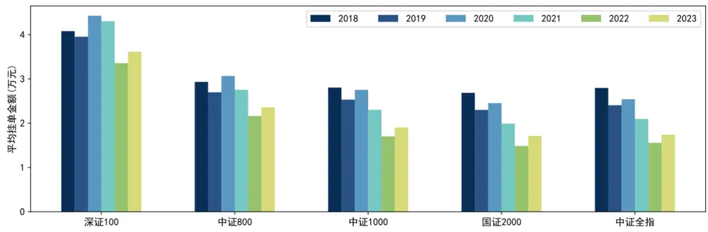
数据来源：Wind、开源证券研究所（20180102-20230531）

在前一小节中，我们观测到小市值股票的交易提速更明显（图24)，再结合图28的结果，更加印证了一开始的想法：A股的机构化是不均匀的，对于因子策略的影响也存在大小市值的差异。为了验证这一结论是否可靠，我们不妨将统计时间拉长一些，图29展示了不同选股域在2010年以来单笔成交金额的时序变化。

图29：大市值股票的单笔成交金额下降趋势不如小市值股票明显
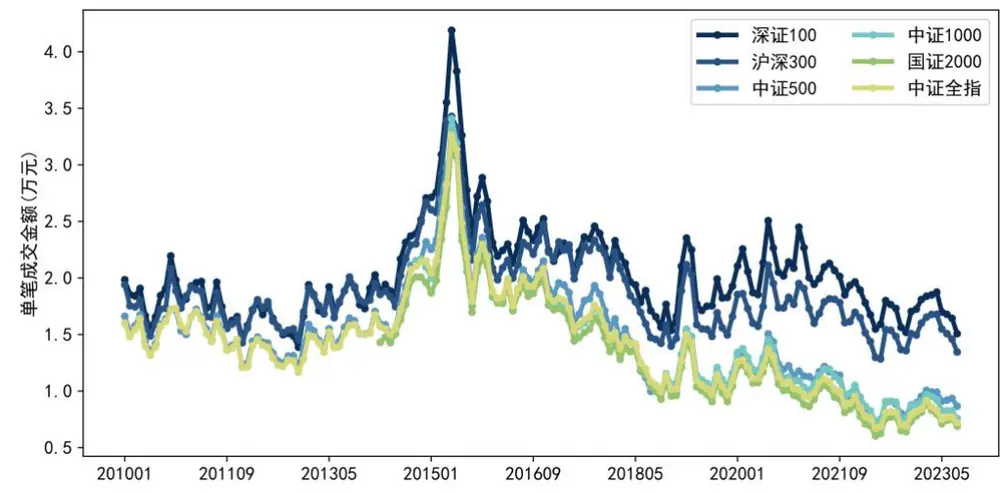
数据来源：Wind、开源证券研究所

图29的结果基本上验证了我们的猜想，微观交易数据的变化能够体现出来市场交易结构变迁的规律，大市值股票受到机构拆单交易的影响小，而小市值股票交易结构变化大，在交易特征上的变化则会更加明显。A股的机构化并不是均匀的机构化，而是倾向于在小市值范围内的机构化，而微观结构变迁的影响在局部更大。

那紧接着的问题是，驱动市场微观结构变化的投资者是谁？根据我们估算的投资者结构，推测可能有以下几类：公募、私募、养老保险、券商和外资。

从交易换手的特性上，我们可以优先排除养老金和保险，这部分资金的交易频率偏低、风险控制要求更为严格，并不具备连续推动市场放量的客观条件。而对比公募基金和私募基金，公募面临的监管相比私募要更加严格，在持仓、换手方面都有要求。主动偏股型公募基金的持仓集中在中证800指数成分股内，约占71.2%（截至2023Q2)，也不太可能在小市值上主动暴露过大。

图30：公募基金持仓并未整体偏向小市值
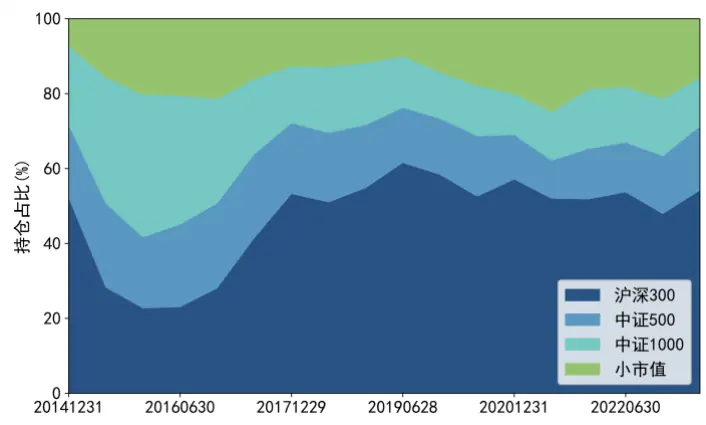
数据来源：Wind、开源证券研究所

图31：量化私募在小市值上布局的进度加快
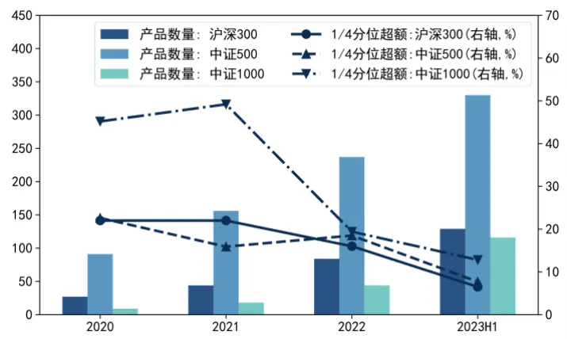
数据来源：私募排排网、开源证券研究所

当前持续披露净值的私募指数增强产品的数量不断增长。相比较公募而言，私募的持仓更偏小票，私募500增强的业绩也优于公募。以2023年上半年为例，公募基金的平均超额收益为0.6%，而同期私募产品超额为4.4%，差异的来源不仅限于交易能力和模型，选股范围和衍生工具也是关键因素。并且据中基协统计数据的保守估计，量化私募的规模已经突破万亿，对于市场交易的贡献度也在20%左右。

因此，我们合理推测私募是A股小市值机构化的主要推手。在2022年以前，外资持股与境内私募机构关联，同样也是重要驱动要素，但随着北向通道不再向内地投资者开放，这部分资金也受到了一定干扰。券商持仓不透明，仅作一般性推断。

## 2.3、凤鸣朝阳：交易量向早盘阶段漂移

除了微观订单视角的变化，在更宏观的日内分时交易形态上也存在变化。以开盘累计成交用时为例，我们统计2013年以来的时序变化趋势（图32）。

图32：日内交易愈发集中于早盘时段
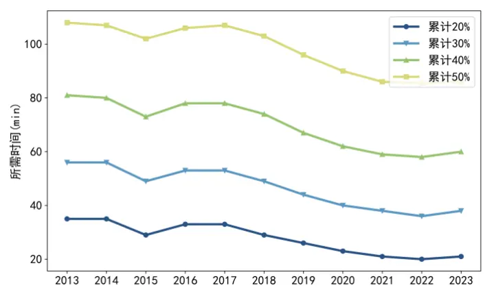
数据来源：Wind、开源证券研究所

图33：成交重心的计算示意图
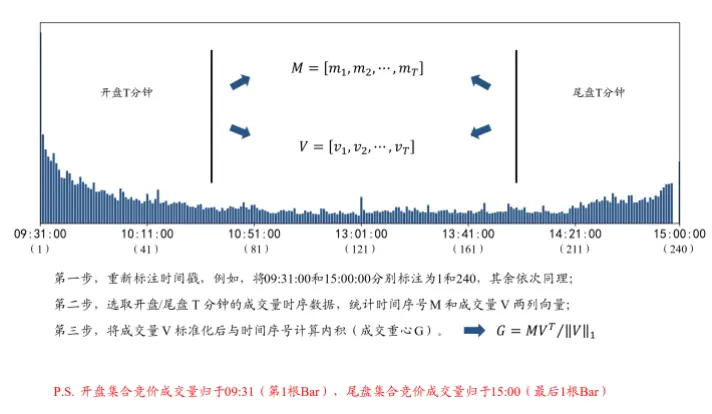
资料来源：开源证券研究所

在2013年，完成当天20%的交易量预计需要35分钟，而在2022年这一时长则缩短至20分钟左右，早盘交易的比例在增加。似乎在2017年之前，我们观测投资者提早交易的特征并不明显。2015年出现了较长的牛市行情，一定程度上提早了整体的交易时点，但后续又回复到前几年的平均水平，说明这可能也是交易意愿的表象指标。2017年以来累计时长呈现降低趋势，我们推测与市场结构变化有关。

图34展示了日内第1小时和第4小时来计算成交重心，观察其在历年来的变化趋势。与开盘不同的是，尾盘交易的比例整体没有发生显著的改变。

图34：盘中时段的交易向开盘集中，而尾盘的结构相对稳定
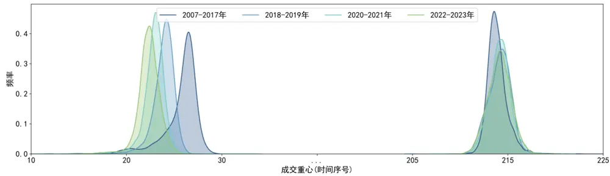
数据来源：Wind、开源证券研究所

成交重心越来越靠前，投资者对于交易的渴望也达到历史极值。然而，趋向早盘交易的特性，我们理解这更像是机构交易行为，原因在于早盘1小时筹码多，机构投资者交易的流动性条件也更好。那是否也会与挂单金额和交易速度类似呈现大小票的不同规律？于是，我们分别拆分不同的选股域，观察日内交易时段中第1小时和第4小时成交重心的变化趋势，如图35和图36所示。

图35：第1小时成交重心2018年以来普遍前移
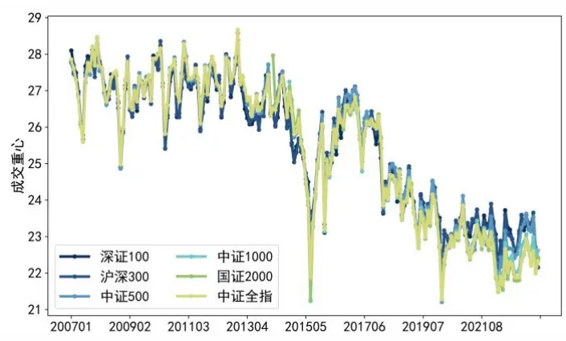
数据来源：Wind、开源证券研究所

图36：第4小时成交重心基本维持稳定
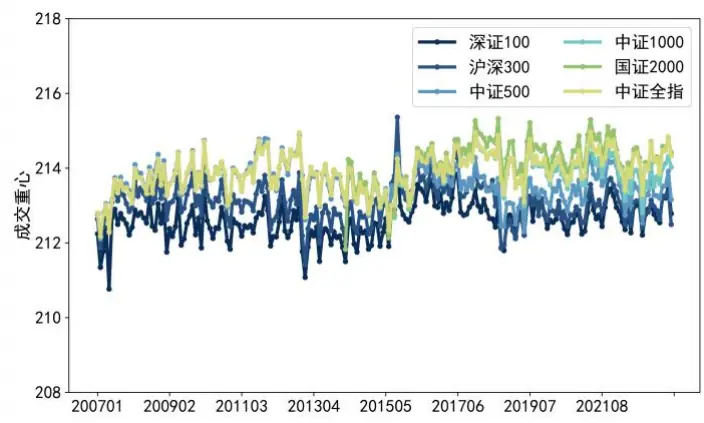
数据来源：Wind、开源证券研究所

测试结果似乎有些令人诧异，不同选股域之间并没有显著区别，而是与全市场的规律基本一致。市场上投资者似乎达成了一种交易默契：当隔夜有利好或利空消息时，第二天应该要尽早地完成交易，避免被其他投资者推高或踩踏。

我们推测，机构投资者倾向在早盘流动性好的时段交易，但个人投资者同样需要及时消化掉隔夜发产生的信息，二者相似的交易偏好推动成交移向早盘。2017年以来，机构交易者占比提高（机构化进程）可能增强了趋势。在因子策略层面，日内交易者结构的变化，最直接的结果是原有的构造方法不再适合当前的市场。

## 3、市场微观结构变迁与策略优化讨论

## 3.1、反转策略的日内优化逻辑

日内反转Alpha主要在捕捉市场上的短期错误定价，这部分由投资者的不理智交易的行为导致。开盘一段时间（T1至T2）股价上涨/下跌的幅度会较大，主动买卖盘量大容易引起价格偏离。开盘价格冲高后会小幅回落，也即反转效应累计过程不单调，这是因为机构在主导交易定价，反转逻辑在早盘较难演绎（图38)。

图37：上午时段股价走势示意图
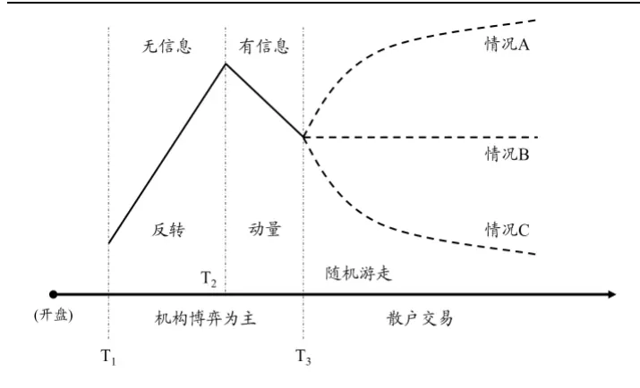
资料来源：开源证券研究所

图38：分时段的反转强度（RankICIR)，盘中最高
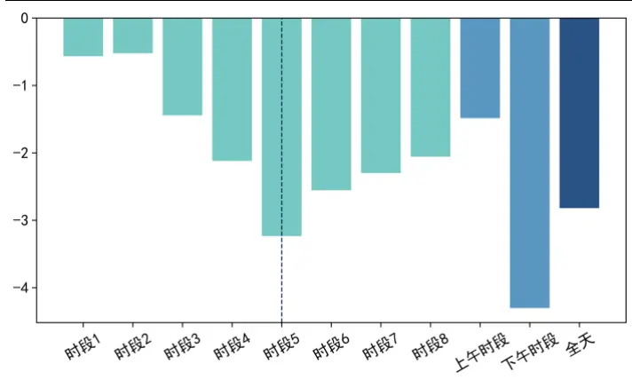
数据来源：Wind、开源证券研究所（20070102至20171231）

以半小时为间隔，笔者分别测算时段1（9:31-10:00）至时段8（14:31-15:00）的反转强度，将各时段的涨跌幅平滑20日，测算月度调仓的RankICIR，结果如图38所示。早盘的反转效应最弱，而随着机构交易时段结束，由个人投资者贡献的错误定价Alpha逐渐显现，这一结构特征与我们在APM因子得到的结论一致。

图39：不同年度开盘累计涨跌幅因子RankIC的结构变化
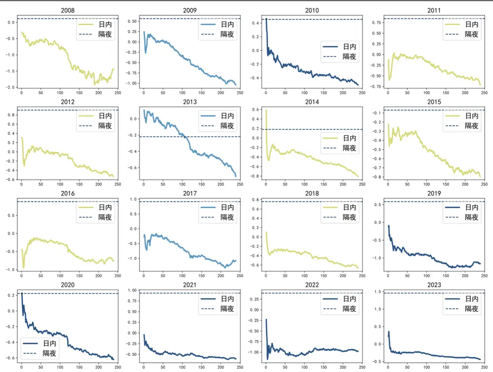
数据来源：Wind、开源证券研究所

我们进一步探究上述结构在不同年份的演绎情况。以开盘累计涨跌幅因子的Rank IC 为例，图 39 的子图展示了因子 Rank IC 随时间变化趋势，横轴为因子对应累计的分钟数i(i=1,2,3,...,240)，虚线表示隔夜涨跌幅因子对应的 Rank IC 均值。

首先，观察日内反转IC的结构，以2018年之前为例，主要呈现以下规律：

(1）早盘阶段，日内反转效应的特征并不强烈。RankIC随着开盘后交易时间的延长，呈现出先强后弱的趋势，这类样本在2018年以前尤其普遍。盘初的一段时间内（约1小时）反转效应都未有显著的提升，反转的逻辑在早盘表现较差。

(2)非理性交易导致的错误定价主要集中在盘中时段，尤其是中午休市后开盘的第1个半小时时段（13:01-13:30)，RankIC的日内结构表现为在开盘后出现明显提升，其中2008、2012、2013和2016这四年的特征最为显著。

(3)尾盘阶段，因子RankIC的变化方向并不确定，有些年份样本表现出较强的反转性质，如2011、2013和2014年，但也有部分年份的测试结果出现相反的情况，例如2008和2015年。整体没有呈现出特别强的规律性，故而不展开讨论。

简单概括上述规律是：早盘阶段，机构交易者参与定价较多，反转效应的逻辑演绎并不通畅，因而RankIC没有持续的提升。在机构集中交易时段结束后，个人投资者的交易比例逐渐提高，错误定价的Alpha特征也开始显现出来。

在2018年以后，这一规律发生了变化，早盘反转效应强度在逐渐增强，而盘中及盘尾却没有明显的改变，甚至弱化。这说明随着交易向早盘集中，错误定价行为也在往前移动，日内的反转Alpha结构在逐渐淡化。然而，机构投资者占据着早盘时段，错误定价转移的方向并不理想，可以设想日内反转效果还会进一步减弱。

我们把当日涨跌幅拆分为隔夜和日内若干时段，IC结构性测试结果表明：隔夜涨跌幅呈现弱动量效应，而日内涨跌幅则呈现不同程度的反转效应。那么在此基础上，构造反转因子的思路可以是，将弱动量的隔夜部分剔除而仅保留日内部分，经测试有效（图 40)，Rank ICIR 由-2.22 提升至-2.73。

图40：日内涨跌幅多空收益相对超额为4.56%
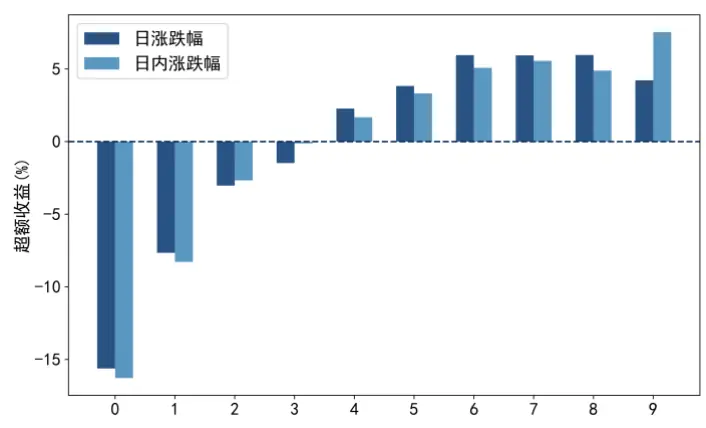
数据来源：Wind、开源证券研究所（20080102-20230821）

图41：隔夜涨跌幅因子 Rank IC 为 0.04
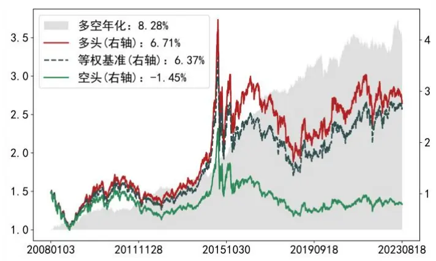
数据来源：Wind、开源证券研究所

反转效应由日间转移到日内的优化逻辑稳健，图41展示了20日平滑后的日涨跌幅因子和日内涨跌幅因子的十分组效果，多空收益提升效果稳定在4.6%以上。隔夜涨跌幅的动量逻辑来源于市场对休市期间信息的合理定价，这部分收益在过去较长时间内都保持相对稳定，但在2019年以后，整体的稳定性也在变差。

类似的切割方法，同样可以放到日内的交易时段。为了验证交易量前移对日内反转的影响，我们分别构造两个不同的日内涨跌幅因子并测试表现，其中A因子是剔除开盘第1小时数据计算的累计涨跌幅，B因子作为对照组则不做任何处理。

表6：剔除开盘第1小时涨跌幅因子效果更好，但2018年以来并不理想

| 指标 | 因子 | 2012H1 | 2012H2 | 2013H1 | 2013H2 | 2014H1 | 2014H2 | 2015H1 | 2015H2 | 2016H1 | 2016H2 | 2017H1 | 2017H2 |
| --- | --- | --- | --- | --- | --- | --- | --- | --- | --- | --- | --- | --- | --- |
| 多空 | A | 10.07 | 15.33 | 5.51 | 15.30 | 12.69 | 17.38 | 27.34 | 40.84 | 8.29 | 6.96 | 14.61 | 14.97 |
|  | B | 7.39 | 12.82 | 4.55 | 13.97 | 11.30 | 15.25 | 27.70 | 35.38 | 5.86 | 8.94 | 10.17 | 16.68 |
| 多头 | A | 3.57 | 7.08 | 6.42 | 7.25 | 3.93 | 1.13 | 16.60 | 21.48 | 2.00 | -0.51 | 2.63 | 3.60 |
|  | B | 3.33 | 4.42 | 2.11 | 4.03 | 4.19 | 1.31 | 16.31 | 10.12 | 1.04 | -0.88 | 0.53 | 2.61 |
| Rank | A | -0.059 | -0.079 | -0.065 | -0.087 | -0.045 | -0.097 | -0.108 | -0.088 | -0.081 | -0.035 | -0.077 | -0.075 |
| IC | B | -0.032 | -0.080 | -0.045 | -0.088 | -0.046 | -0.106 | -0.113 | -0.068 | -0.094 | -0.017 | -0.068 | -0.070 |

| 指标 | 因子 | 2018H1 | 2018H2 | 2019H1 | 2019H2 | 2020H1 | 2020H2 | 2021H1 | 2021H2 | 2022H1 | 2022H2 | 2023H1 | 全区间 |
| --- | --- | --- | --- | --- | --- | --- | --- | --- | --- | --- | --- | --- | --- |
| 多空 | A | 20.83 | 14.41 | 12.62 | 2.02 | -4.55 | 14.84 | 5.57 | 13.35 | 13.49 | 6.07 | 2.57 | 26.68 |
|  | B | 15.90 | 11.47 | 14.12 | 4.74 | -1.43 | 10.69 | 5.49 | 18.76 | 20.99 | 10.96 | 2.05 | 25.14 |
| 多头 | A | 5.42 | 4.47 | 3.53 | 2.94 | 0.44 | 6.76 | 2.01 | 8.40 | 3.73 | 0.79 | 4.75 | 10.27 |
|  | B | 2.06 | 2.31 | 3.50 | 2.47 | 0.34 | 0.72 | -0.37 | 5.33 | 4.55 | 1.90 | -0.20 | 6.85 |
| Rank | A | -0.086 | -0.081 | -0.090 | -0.029 | -0.069 | -0.044 | -0.017 | -0.041 | -0.038 | -0.053 | -0.055 | -0.068 |
| IC | B | -0.040 | -0.103 | -0.132 | -0.043 | -0.070 | -0.044 | -0.021 | -0.084 | -0.077 | -0.110 | -0.056 | -0.070 |

数据来源：Wind、开源证券研究所，A因子：剔除开盘第1小时的日内涨跌幅因子，B因子：日内涨跌幅因子（对照组）

A因子在2018年以前表现要显著优于B因子，说明由于投资者在日内结构分布的不均匀，盘初阶段的涨跌幅会对日内反转因子产生干扰，剔除掉这部分往往能够改造出比较好的反转因子。然而，自2019年以来，上述做法变得不再有效，我们再次观察，日内因子游戏的玩法已经发生变化（图42）。

图42：2019年以来，反转改进效果变差
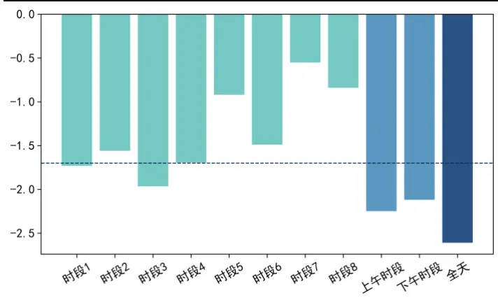
数据来源：Wind、开源证券研究所（20190102-20230531）

图43：早盘阶段行情与全天行情的相关性在提升
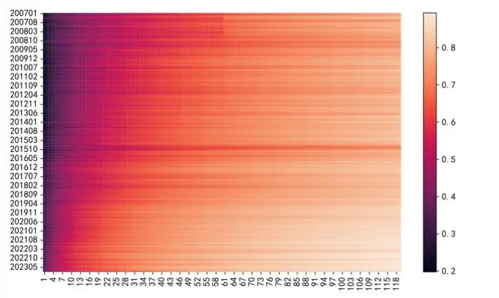
数据来源：Wind、开源证券研究所

错误定价在日内由盘中和盘尾移动到早盘阶段，这种趋势是明确的。而交易量堆积到早盘会使得后续行情变动乏力，往往一天的涨跌幅只需要开盘后半小时的行情就能大概率猜出。图43直观描述了市场出现的变化，横轴是累计涨跌幅所用的分钟数，图中计算了开盘前N分钟涨跌幅与日内涨跌幅相关系数随时间的变化。

成交量前移对于构造日内反转因子而言，是一种困扰。以前我们可以通过剔除日内的弱反转来构造增强特征，但是如今已经不支持这类提纯操作，早盘这部分弱反转逐渐变强，但因为存在机构的强定价能力，反转特征也就很难表现为一个稳定的Alpha。或许，这也是近些年来反转类因子普遍失效的内在原因。

## 3.2、微盘股的交易结构变化与相关测算

相较于较为拥挤的大盘股，微盘股的短期表现更加亮眼。截至2023年8月25日，万得微盘股指数2023年年初以来相对沪深300和中证500超额收益分别为29.9%和30.8%。配置微盘股指数增强收益作为子策略而言相对有效，部分含“微”量高的基金超额明显跑赢同类偏股类产品。

图44：2023年以来，微盘股相对沪深300超额29.9%
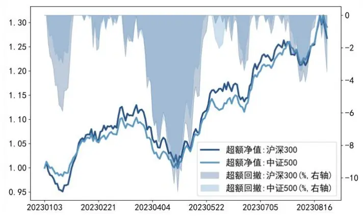
数据来源：Wind、开源证券研究所

图45：含“微”量高的基金业绩表现较好
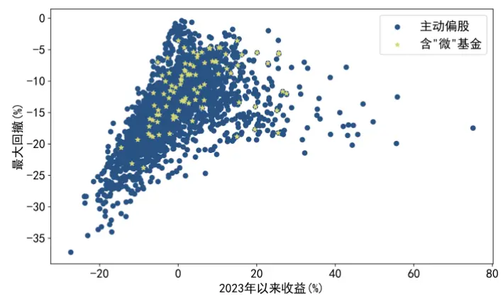
数据来源：Wind、开源证券研究所，数据截至20230630

根据2023年二季度报披露的基金前十大重仓股，我们统计了持有微盘股市值较大的10只公募基金，图45为主动偏股基金在2023年初以来的业绩分布。部分持有微盘股的基金在年内跑出不错的收益，整体排名相对靠前（表7)。

表7：持有微盘股市值较大的10只公募基金

| 序号 | 基金代码 | 基金简称 | 持仓市值 (亿元) | 持仓占比 区间收益 (%) (2023H1,%) | 最大回撤 (%) |
| --- | --- | --- | --- | --- | --- |
| 1 | 011403.OF | 融通鑫新成长A | 1.10 | 5.47 4.08 | -11.29 |
| 2 | 001643.OF | 汇丰晋信智造先锋A | 0.86 | 3.88 -2.17 | -18.37 |
| 3 | 007484.OF | 信澳核心科技A | 0.79 | 2.50 15.49 | -13.40 |
| 4 | 007130.OF | 中庚小盘价值 | 0.72 | 0.97 4.92 | -11.83 |
| 5 | 007343.OF | 嘉实科技创新 | 0.67 | 5.44 -0.51 | -15.75 |
| 6 | 009993.OF | 嘉实前沿创新 | 0.63 | 4.93 -4.79 | -15.35 |
| 7 | 004450.OF | 嘉实前沿科技 | 0.63 | 5.91 -6.45 | -18.86 |
| 8 | 506006.OF | 汇添富科创板2年定开 | 0.59 | 3.78 1.91 | -12.69 |
| 9 | 007994.OF | 华夏中证 500 指数增强 A | 0.51 | 1.43 8.08 | -4.72 |
| 10 | 006551.OF | 中庚价值领航 | 0.46 | 0.51 -1.23 | -16.04 |

数据来源：Wind、开源证券研究所，数据截至20230630

微盘股不应该单看估值，更应该分析策略的容量，这也是当前市场上讨论较为广泛的问题。我们认为微盘股策略的超额来源于持续的资金关注，但因为策略容量偏小，若是机构等长线资金持仓的比例过高，则后续的增量资金可能不足以再继续推动价格上涨，因而有必要弄清楚当前微盘股指数的现状。

从资金持仓市值来看，我们统计了公募持有微盘股市值，截至2023年2季度，测算公募基金持仓市值达到106亿元，约为全部微盘股流通市值的2.68%，整体占比虽然在2021年中以来不断提升，但目前持仓的绝对值并不高。不妨简单地测算一下微盘股的交易结构：目前400只微盘股的每日的交易额约150亿元，而取高、低换手资金的年换手率平均值为40倍，则当前交易结构下策略能够容纳900至1000亿元的活跃资金，而低换手的公募等机构的持仓仅占其中10%左右。

图46：公募基金持有微盘股市值增长迅速
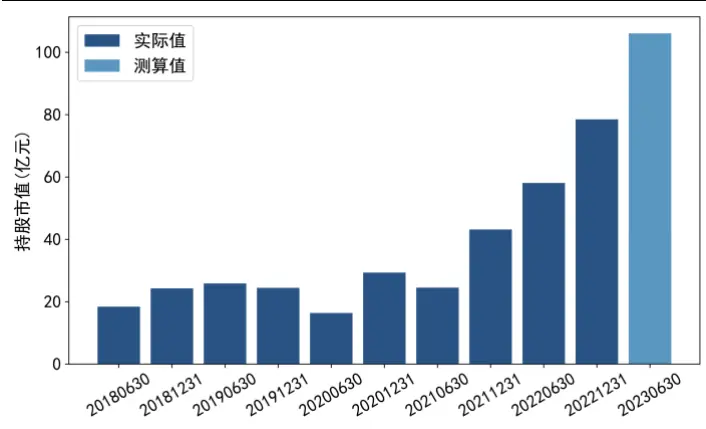
数据来源：Wind、开源证券研究所

图47：基于聚类误差确定核心参数N=3
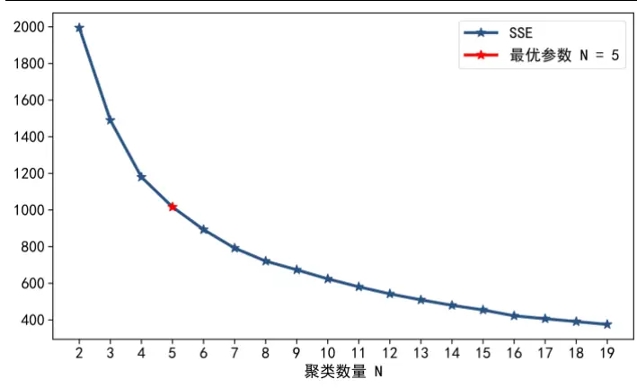
数据来源：Wind、开源证券研究所

进一步，分析微盘股指数的时序特征。我们使用平均挂单金额、委托平均执行时间以及开盘成交重心等指标对微盘股时序样本进行聚类。确定参数的曲线如图47所示，最终根据肘方法选定聚类数量为5，设定时序样本的区间为20180101至20230531（共计1312个交易日)，图48展示分类结果以及各指标相关性情况。

图48：微盘股指数的时序样本分为5类，交易速度和挂单金额上区分度较高
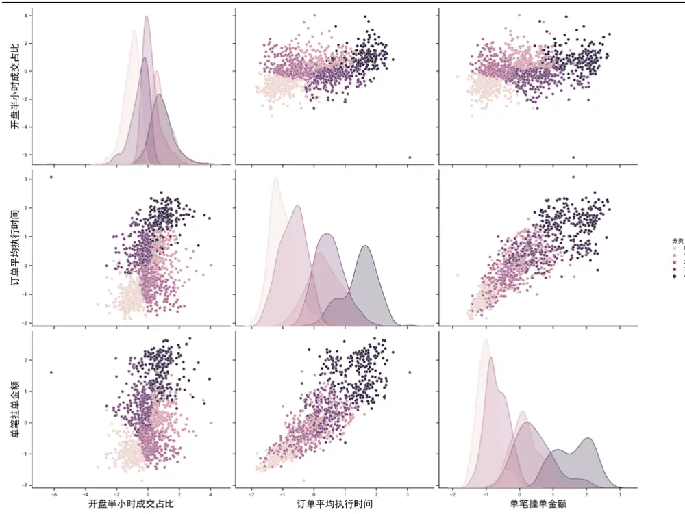
数据来源：Wind、开源证券研究所

根据上述对微盘股时序样本的分类结果，微盘股指数在平均挂单金额和交易速度上具有明显的区分度，并且距离当前时间越近的样本平均挂单金额越小，交易速度越快，说明当前的机构持仓还在持续增加。

进一步，我们在图49中将不同分类的时间区间标注出来，其中，黄色区间对应时段5，其他按照时间先后依次对应。微盘股市场处于当前分类的持续时间较长，在不同时段中，与目前交易结构最为类似的是时段3。从超额收益来看，当前策略的累计超额收益已经较高，达到50%以上，而同类结构下时段3仅有不到5%（图50)。

图49：微盘股指数交易日期的时段划分
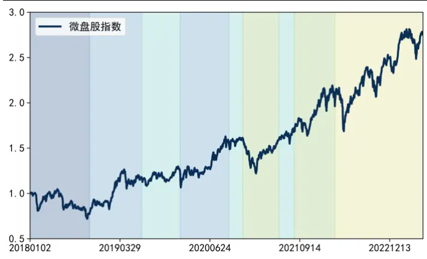
数据来源：Wind、开源证券研究所，从左至右依次为时段1-5

图50：当前（时段5）相对300超额收益较高
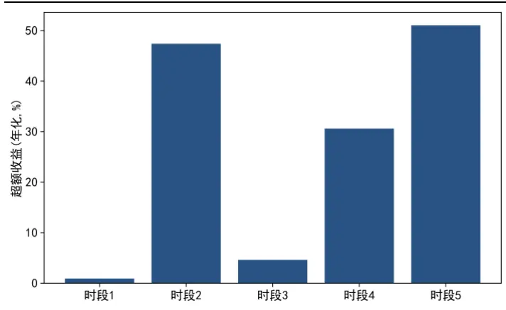
数据来源：Wind、开源证券研究所

综上，我们判断微盘股策略市场容量暂时还没达到峰值，但是超额收益在同类结构下累计已经较高，不排除会出现部分投资者选择在当下盈利变现的风险。在实际应用中需要警惕微盘股策略回撤，整体而言，该策略还是有一定可行性。

## 4、风险提示

模型基于历史数据测试，未来市场可能发生改变。

## 特别声明

《证券期货投资者适当性管理办法》、《证券经营机构投资者适当性管理实施指引（试行)》已于2017年7月1日起正式实施。根据上述规定，开源证券评定此研报的风险等级为R3（中风险)，因此通过公共平台推送的研报其适用的投资者类别仅限定为专业投资者及风险承受能力为C3、C4、C5的普通投资者。若您并非专业投资者及风险承受能力为C3、C4、C5的普通投资者，请取消阅读，请勿收藏、接收或使用本研报中的任何信息。因此受限于访问权限的设置，若给您造成不便，烦请见谅！感谢您给予的理解与配合。

## 分析师承诺

负责准备本报告以及撰写本报告的所有研究分析师或工作人员在此保证，本研究报告中关于任何发行商或证券所发表的观点均如实反映分析人员的个人观点。负责准备本报告的分析师获取报酬的评判因素包括研究的质量和准确性、客户的反馈、竞争性因素以及开源证券股份有限公司的整体收益。所有研究分析师或工作人员保证他们报酬的任何一部分不曾与，不与，也将不会与本报告中具体的推荐意见或观点有直接或间接的联系。

## 股票投资评级说明

|  | 评级 | 说明 |
| --- | --- | --- |
| 证券评级 | 买入（Buy） | 预计相对强于市场表现20%以上； |
|  | 增持（outperform） | 预计相对强于市场表现5%～20%； |
|  | 中性（Neutral） | 预计相对市场表现在—5%～+5%之间波动； |
|  | 减持（underperform） | 预计相对弱于市场表现5%以下。 |
| 行业评级 | 看好（overweight） | 预计行业超越整体市场表现； |
|  | 中性（Neutral） | 预计行业与整体市场表现基本持平； |
|  | 看淡（underperform） | 预计行业弱于整体市场表现。 |
| 备注：评级标准为以报告日后的6~12个月内，证券相对于市场基准指数的涨跌幅表现，其中A股基准指数为沪深300指数、港股基准指数为恒生指数、新三板基准指数为三板成指（针对协议转让标的）或三板做市指数（针对做市转让标的)、美股基准指数为标普500或纳斯达克综合指数。我们在此提醒您，不同证券研究机构采用不同的评级术语及评级标准。我们采用的是相对评级体系，表示投资的相对比重建议；投资者买入或者卖出证券的决定取决于个人的实际情况，比如当前的持仓结构以及其他需要考虑的因素。投资者应阅读整篇报告，以获取比较完整的观点与信息，不应仅仅依靠投资评级来推断结论。 |  |  |

## 分析、估值方法的局限性说明

本报告所包含的分析基于各种假设，不同假设可能导致分析结果出现重大不同。本报告采用的各种估值方法及模型均有其局限性，估值结果不保证所涉及证券能够在该价格交易。

## 法律声明

开源证券股份有限公司是经中国证监会批准设立的证券经营机构，已具备证券投资咨询业务资格。

本报告仅供开源证券股份有限公司（以下简称“本公司”）的机构或个人客户（以下简称“客户”）使用。本公司不会因接收人收到本报告而视其为客户。本报告是发送给开源证券客户的，属于商业秘密材料，只有开源证券客户才能参考或使用，如接收人并非开源证券客户，请及时退回并删除。

本报告是基于本公司认为可靠的已公开信息，但本公司不保证该等信息的准确性或完整性。本报告所载的资料、工具、意见及推测只提供给客户作参考之用，并非作为或被视为出售或购买证券或其他金融工具的邀请或向人做出邀请。本报告所载的资料、意见及推测仅反映本公司于发布本报告当日的判断，本报告所指的证券或投资标的的价格、价值及投资收入可能会波动。在不同时期，本公司可发出与本报告所载资料、意见及推测不一致的报告。客户应当考虑到本公司可能存在可能影响本报告客观性的利益冲突，不应视本报告为做出投资决策的唯一因素。本报告中所指的投资及服务可能不适合个别客户，不构成客户私人咨询建议。本公司未确保本报告充分考虑到个别客户特殊的投资目标、财务状况或需要。本公司建议客户应考虑本报告的任何意见或建议是否符合其特定状况，以及（若有必要）咨询独立投资顾问。在任何情况下，本报告中的信息或所表述的意见并不构成对任何人的投资建议。在任何情况下，本公司不对任何人因使用本报告中的任何内容所引致的任何损失负任何责任。若本报告的接收人非本公司的客户，应在基于本报告做出任何投资决定或就本报告要求任何解释前咨询独立投资顾问。

本报告可能附带其它网站的地址或超级链接，对于可能涉及的开源证券网站以外的地址或超级链接，开源证券不对其内容负责。本报告提供这些地址或超级链接的目的纯粹是为了客户使用方便，链接网站的内容不构成本报告的任何部分，客户需自行承担浏览这些网站的费用或风险。

开源证券在法律允许的情况下可参与、投资或持有本报告涉及的证券或进行证券交易，或向本报告涉及的公司提供或争取提供包括投资银行业务在内的服务或业务支持。开源证券可能与本报告涉及的公司之间存在业务关系，并无需事先或在获得业务关系后通知客户。

本报告的版权归本公司所有。本公司对本报告保留一切权利。除非另有书面显示，否则本报告中的所有材料的版权均属本公司。未经本公司事先书面授权，本报告的任何部分均不得以任何方式制作任何形式的拷贝、复印件或复制品，或再次分发给任何其他人，或以任何侵犯本公司版权的其他方式使用。所有本报告中使用的商标、服务标记及标记均为本公司的商标、服务标记及标记。

## 开源证券研究所

上海

地址：上海市浦东新区世纪大道1788号陆家嘴金控广场1号

楼10层

邮编：200120

邮箱：research@kysec.cn

北京
地址：北京市西城区西直门外大街18号金贸大厦C2座9层
邮编：100044
邮箱：research@kysec.cn

地址：深圳市福田区金田路2030号卓越世纪中心1号

楼45层

邮编：518000

邮箱：research@kysec.cn

西安
地址：西安市高新区锦业路1号都市之门B座5层
邮编：710065
邮箱：research@kysec.cn