2024 年 01 月 28 日

## 金融工程研究团队

魏建榕（首席分析师）

证书编号：S0790519120001

张 翔（分析师）

证书编号：S0790520110001

傅开波（分析师）

证书编号：S0790520090003

## 高 鹏（分析师）

证书编号：S0790520090002

## 苏俊豪（分析师）

证书编号：S0790522020001

## 胡亮勇（分析师）

证书编号：S0790522030001

# 大小单资金流为核心的综合行业轮动方案

## 王志豪（分析师）

证书编号：S0790522070003

## 盛少成（分析师）

证书编号：S0790523060003

## 苏 良（分析师）

证书编号：S0790523060004

## 何申昊（研究员）

证书编号：S0790122080094

## 陈 威（研究员）

证书编号：S0790123070027

## 蒋 韬（研究员）

证书编号：S0790123070037

## 相关研究报告

《大小单资金流 alpha 探究 2.0：变量精筛与高频测算—市场微观结构系列（18）》-2022.12.18

《新型因子：资金流动力学与散户羊群效应—市场微观结构系列（14）》-2022.06.02

# ——市场微观结构研究系列（23）

魏建榕（分析师）

盛少成（分析师）

weijianrong@kysec.cn

shengshaocheng@kysec.cn

证书编号：S0790519120001

证书编号：S0790523060003

## 从选股到行业轮动：自下而上的聚合

对于大小单资金流的研究而言，之前我们着重在选股层面，构建了市场上认可度较高的一系列因子，如超大单关注度、大小单残差、散户羊群效应等。对于选股因子聚合至行业层面的方法，主要有两个思考的维度：1、何种方式加权；2、因子用原始值还是分域赋值。对此，我们尝试了5种方案但是整体效果一般，所以后续我们直接从行业本身出发构建行业轮动因子。

## 从行业层面出发构建有效因子：超大单和小单

对于超大单而言，我们发现原始主动超大单强度 2022 年之后波动加剧，且出现走平的趋势，因子逐渐失效。针对这一现象，我们采取两种方式进行修正：1、考虑近期强弱趋势；2、考虑资金流的极端与温和。改进后的因子 RankICIR 从原始 0.95 提升至 1.16，近两年波动和回撤较大的问题一定程度上得到了解决。对于小单而言，我们主要改进了行业羊群效应因子，主要也分为两步：1、将小单净流入改成非主动小单净流入；2、考虑行业羊群效应的变动，改进后RankICIR-0.86 提升至-1.03。

将改进后的主动超大单强度和羊群效应等权合成效果优异，月频调仓下效果最好，RankIC 为 9.28%，RankICIR为 1.62，其逻辑可以归纳为：超大单本期强度较高且不位于高位，散户羊群效应较低且无大幅增加。

## 从行业层面出发构建有效因子：大单

对于大单强度而言，我们发现不同行业之间量级存在天然的差别，导致横向比较失真，因子效果较差。因此，针对于大单，我们从行业时序构建事件性因子，发现极端突破具备一定的行业轮动能力，周频调仓效果最优。除此之外，北向券商净流入同样具备这一规律，将二者融合后行业轮动效果较为优异。

## 大小单行业轮动的综合方案

除了资金流之外，我们综合考虑了动量、基本面、拥挤度几大维度。在动量维度，我们主要从“极端切割”这一思路出发，构建了极端情绪动量因子，相较于传统动量因子而言，近两年的表现依旧较好。在财务维度，我们抓住了超预期景气模型和困境反转模型显著的轮动周期，相较于只使用单一的景气模型而言，二者轮动后的效果显著提升。在拥挤度维度，我们主要讨论了两种衡量方式：1、以成交额表征的交易热度；2、以赚钱效应表征的盈利水平，其中后者对组合收益提升较为显著。

最终，我们以资金流因子为主体，其余维度进行负向剔除，构建了行业轮动策略，周频调仓下选取 5个行业，扣费后年化 21.84%，效果优异。

除此之外，行业轮动模型在指增上也能带来增量。以中证 1000 指增为例，相较于只使用资金流选股因子，结合行业后多空信息比率从 1.55提升至1.98。

- 风险提示：本报告模型基于历史数据测算，市场未来可能发生重大改变。

对于大小单资金流的研究而言，之前我们着重在选股层面，构建了市场上认可度较高的一系列因子，如超大单关注度、大小单残差、散户羊群效应等。本篇报告将继续围绕着大小单资金流这一话题展开，多维度探讨其在行业轮动上的能力。

在第一部分，我们简单回顾了大小单资金流相关的选股因子，并采取自下而上聚合的方式构建行业轮动因子。

在第二部分，我们直接从行业层面出发，改进了行业主动超大单强度和行业羊群效应因子，二者等权合成后效果非常优异，RankIC 为 9.28%，RankICIR 为 1.62。对于大单强度而言，我们发现不同行业之间量级存在天然的差别，导致横向比较失真，因子效果较差。因此，针对于大单，我们从行业时序构建事件性因子，并且和基于北向资金构建的事件性因子合成后，效果提升较为明显。

在第三部分，我们从动量、财务、拥挤度维度出发，构建特色负向剔除因子。在动量维度，我们主要从“极端切割”这一思路出发，构建了极端情绪动量因子，相较于传统动量因子而言，近两年的表现依旧较好。在财务维度，我们发现超预期景气模型和困境反转模型存在较为显著的轮动周期：经济上行时超预期景气因子较好，经济下行时困境反转因子较好，相较于只使用单一的景气模型而言，二者轮动后的效果显著提升。在拥挤度维度，我们主要讨论了两种衡量方式：1、以成交额表征的交易热度；2、以赚钱效应表征的盈利水平，其中后者对组合收益提升较为显著。

在第四部分，我们以资金流因子为主体，其余维度进行负向剔除，构建了行业轮动策略，周频调仓下选取 5 个行业，扣费后年化21.84%，效果非常优异。

在第五部分，我们将目前已成体系的资金流选股因子和行业轮动因子进行综合，进行了指数增强的尝试。以中证 1000指增为例，相较于只使用资金流选股因子，结合行业后多空信息比率从1.55 提升至 1.98。

## 1、 从选股到行业轮动：自下而上的聚合

对于大小单资金流的研究而言，之前我们在选股上有一系列特色研究，具体列示为表 1所示。从表1可以看出，每个单因子的RankICIR皆在3以上的水平，效果较为优异。

表1：大小单选股：单因子的RankICIR皆在3以上的水平，效果较为优异

| 因子名称 | RankIC | RankICIR | 对应报告 |
| --- | --- | --- | --- |
| 超大单关注度效应 | 5.48% | 3.33 | 《遗传算法赋能交易行为因子》 |
| 大单残差 | 5.69% | 3.86 | 《大小单资金流 alpha探究2.0：变量精筛与高频测算》 《大单与小单资金流的 alpha能力》 |
| 小单残差 | -4.64% | -3.28 | 《大小单资金流 alpha探究2.0：变量精筛与高频测算》 《大单与小单资金流的alpha 能力》 |
| 散户羊群效应 | -4.29% | -3.12 | 《新型因子：资金流动力学与散户羊群效应》 |

数据来源：Wind、开源证券研究所（统计区间：20130101-20231231）

进一步地，我们尝试将选股因子聚合至行业层面，观察行业轮动的效果。对于聚合方法，主要有两个思考的维度：1、何种方式加权；2、因子用原始值还是分域赋值。具体地，我们采取如下 5种方法：

（1）因子值均值；（2）因子值市值加权；（3）按照因子值分域：从高至低排序，若处于 1/3 以上标注为1，若处于后 2/3标注为-1，其余则标注为 0，最后取均值；（4）同（3）进行因子值分域，之后按照市值加权；（5）选取因子值较高的 20%，统计分布在不同行业的股票数占各自行业总股票数的比例。

如上几种做法对应的行业轮动因子RankICIR如表 2所示。我们可以发现：自下而上聚合的做法效果并不好，其中因子使用超大单关注度效应、方法使用第五种效果最好，但RankICIR也只有0.81。所以后续我们直接从行业层面出发构建行业轮动因子。（注：本文测试为一级行业对应的结果，后文不再重复说明）

表2：从RankICIR来看，自下而上聚合的行业轮动因子效果一般，但方向与选股因子一致

| 因子名称 | 方式一 | 方式二 | 方式三 | 方式四 | 方式五 |
| --- | --- | --- | --- | --- | --- |
| 超大单关注度效应 | 0.76 | 0.53 | 0.70 | 0.51 | 0.81 |
| 大单残差 | 0.35 | 0.00 | 0.28 | -0.06 | 0.36 |
| 小单残差 | -0.30 | -0.26 | -0.28 | -0.42 | -0.51 |
| 散户羊群效应 | -0.04 | -0.51 | -0.04 | -0.51 | -0.32 |

数据来源：Wind、开源证券研究所（统计区间：20130101-20231231）

## 2、 从行业层面出发构建有效因子

## 2.1、 资金流强度：改进主动超大单强度 RankICIR为 1.16

首先，我们测试了四类全部及主动资金流强度的行业轮动效果。具体做法为：（1）针对于单个行业，每月底回看过去 20天，计算该行业的累计净流入；（2）由于不同行业净流入存在量级的差别，在定义资金流强度时需进行标准化，方式上我们尝试了市值、成交额、买+卖、净流入绝对值四种。这些因子月频调仓下的 RankICIR 如表 3所示。

从表 3我们可以发现，超大单和大单呈现正向预测作用，且由于“超大单+大单+中单+小单=0”，中单和小单呈现负向预测作用。从因子效果而言，利用主动超大单净流入，并市值标准化后的强度效果较好，后文简称原始主动超大单强度。进一步地，我们对其进行5分组回测，如图 1 所示。

表3：利用主动超大单净流入，并市值标准化后的强度效果较好

| 资金流类别 |  | 市值 | 成交额 | 买+卖 | 净流入绝对值 |
| --- | --- | --- | --- | --- | --- |
| 全部 | 超大单 | 0.69 | 0.51 | 0.38 | 0.63 |
|  | 大单 | 0.23 | 0.18 | 0.14 | 0.30 |
|  | 中单 | -0.53 | -0.40 | -0.40 | -0.48 |
|  | 小单 | -0.32 | -0.41 | -0.55 | -0.37 |
| 主动 | 超大单 | 0.95 | 0.61 | 0.58 | 0.89 |
|  | 大单 | 0.11 | 0.06 | 0.05 | 0.27 |
|  | 中单 | -0.32 | -0.37 | -0.40 | -0.37 |
|  | 小单 | -0.45 | -0.59 | -0.60 | -0.45 |

数据来源：Wind、开源证券研究所（统计区间：20130101-20231231）

图1：原始主动超大单强度5分组：多空对冲净值波动较大，尤其 2022年以来
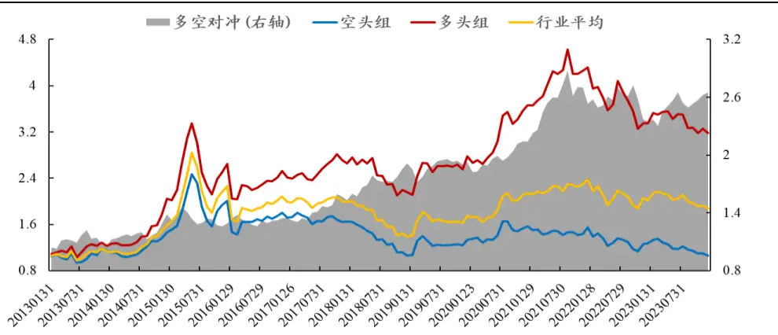
数据来源：Wind、开源证券研究所

从图 1 我们可以发现：原始主动超大单强度的多空对冲波动较大，且经常会出现较大的回撤，尤其是在 2022 年之后波动加剧、出现走平的趋势，因子逐渐失效。后续我们采取两种方式进行修正：1、考虑近期强弱趋势；2、考虑资金流的极端与温和。

## 1、考虑近期强弱趋势

对于强弱趋势 K 的界定而言，我们采取的方法为：首先，对原始主动超大单强度取rank值，接着取其过去 2 个月均值和过去12个月均值的比值。针对于原始主动超大单强度 5 分组的多头和空头，我们使用 K 进行分域，统计不同域的年化收益，具体如图 2所示。

从图中我们可以发现：无论是多头还是空头，K 值相对较低的一组收益表现更好，尤其是近两年，该现象尤其显著。所以这里我们衍生出的改进思路为：在原始主动超大单强度排序的基础上乘以 1/K。比值 K 中的长短回看窗口参数对因子RankICIR影响敏感性分析如图 3所示，其中2和12为较合适的参数选择。

图2：利用 K 进行分域，原始主动超大单多头和空头的分域收益统计
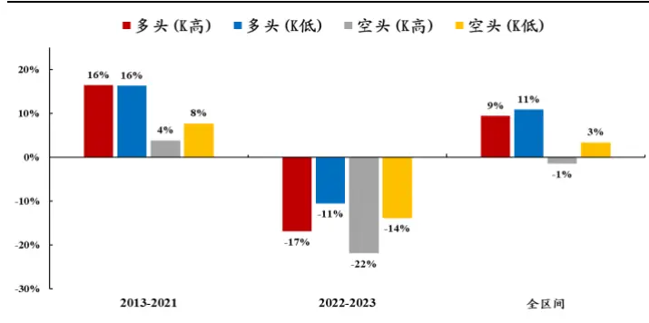
数据来源：Wind、开源证券研究所

图3：强弱趋势 K的长短回看参数敏感性分析

|  | 6 | 7 | 8 | 9 | 10 | 11 | 12 | 13 | 14 | 15 | 16 | 17 | 18 |
| --- | --- | --- | --- | --- | --- | --- | --- | --- | --- | --- | --- | --- | --- |
| 2 | 1.06 | 1.10 | 1.22 | 1.19 | 1.20 | 1.22 | 1.21 | 1.19 | 1.16 | 1.15 | 1.15 | 1.14 | 1.23 |
| 3 | 0.91 | 0.94 | 1.00 | 0.98 | 0.96 | 0.97 | 0.99 | 0.97 | 0.94 | 0.93 | 0.94 | 0.97 | 1.00 |
| 4 | 0.98 | 1.01 | 1.04 | 1.02 | 0.98 | 1.01 | 1.04 | 1.01 | 1.03 | 1.00 | 0.98 | 0.99 | 1.04 |
| 5 | 0.94 | 0.99 | 1.04 | 1.00 | 0.99 | 1.02 | 1.00 | 0.98 | 0.97 | 0.98 | 0.99 | 0.97 | 1.02 |

数据来源：Wind、开源证券研究所（统计区间：20130101-20231231）

## 2、考虑资金流的极端与温和

进一步地，我们发现资金流是否极端对因子效果也存在一定的影响。对于是否极端，我们的定义方式为：回看过去 120 天计算均值和标准差，观察净流入是否突破均值上下0.5倍标准差。接着，我们分别计算了极端及温和主动超大单强度，二者在全区间和近两年的RankICIR如图4所示。

从图 4 中我们可以发现：从近两年看，温和净流入对于因子的效果存在一定拖累；从全区间来看，相较于使用全部净流入，只使用极端净流入计算的主动超大单强度RankICIR并无明显区别，所以后续我们只使用极端净流入计算因子。对于是否极端的定义，我们做了相关参数敏感性分析，因子RankICIR结果如图5 所示，其中120 和0.5为较合适的参数选择。

图4：极端及温和主动超大单强度 RankICIR
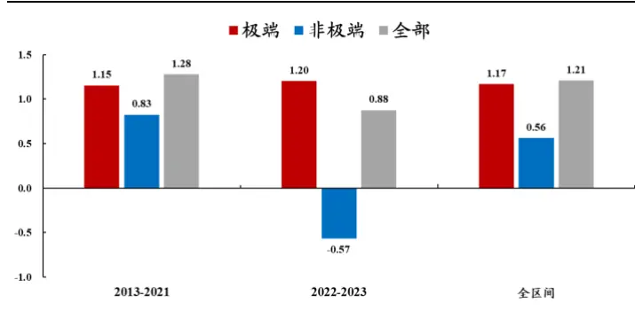
数据来源：Wind、开源证券研究所（统计区间：20130101-20231231）

图5：是否极端参数的敏感性分析

| 0.1 |  | 0.2 0.3 |  | 0.4 | 0.5 0.6 0.7 |  |  | 0.8 | 0.9 | 1 |
| --- | --- | --- | --- | --- | --- | --- | --- | --- | --- | --- |
| 60 | 1.13 | 1.09 | 1.04 | 1.14 | 1.02 | 1.23 | 1.20 | 1.21 | 1.07 | 0.91 |
| 80 | 1.15 | 1.17 | 1.09 | 1.15 | 1.15 | 1.29 | 1.25 | 1.02 | 1.01 | 0.92 |
| 100 | 1.20 | 1.19 | 1.12 | 1.22 | 1.21 | 1.19 | 1.23 | 1.07 | 0.90 | 0.98 |
| 120 | 1.21 | 1.24 | 1.14 | 1.16 | 1.17 | 1.25 | 1.14 | 1.08 | 0.97 | 1.01 |
| 140 | 1.20 | 1.14 | 1.21 | 1.11 | 1.17 | 1.19 | 1.09 | 1.02 | 0.95 | 0.99 |
| 160 | 1.17 | 1.17 | 1.14 | 1.03 | 1.15 | 1.15 | 1.06 | 1.03 | 0.84 | 1.00 |
| 180 | 1.14 | 1.16 | 1.20 | 1.14 | 1.08 | 1.09 | 1.06 | 1.04 | 0.94 | 0.94 |
| 200 | 1.19 | 1.17 | 1.19 | 1.18 | 1.00 | 1.00 | 1.04 | 0.98 | 0.90 | 0.95 |
| 220 | 1.22 | 1.19 | 1.14 | 1.22 | 1.05 | 1.01 | 1.06 | 0.93 | 0.92 | 1.00 |
| 240 | 1.26 | 1.19 | 1.22 | 1.09 | 1.11 | 0.96 | 1.03 | 0.84 | 0.95 | 0.95 |

数据来源：Wind、开源证券研究所（统计区间：20130101-20231231）

在原始主动超大单强度的基础上，考虑了是否处于高位和资金流的极端与否之后，改进的效果非常明显，RankICIR从原始0.95提升至 1.16。除此之外，5分组多空对冲波动明显减小，收益波动比从原始 0.74 提升至 1.03，尤其是近两年波动和回撤较大的问题一定程度上得到了解决。

图6：改进主动超大单强度 5分组回测图
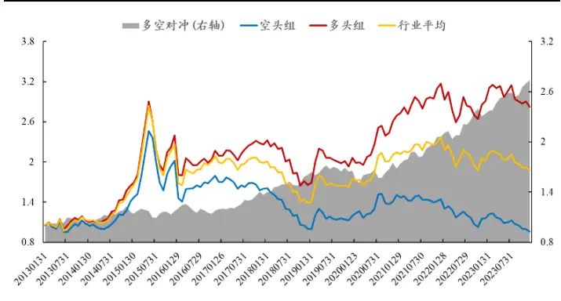
数据来源：Wind、开源证券研究所

图7：原始和改进后主动超大单强度多空对比
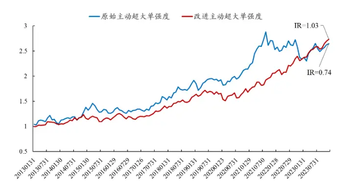
数据来源：Wind、开源证券研究所

## 2.2、 资金流相关系数：改进行业羊群效应 RankICIR为-1.03

对于资金流之间的相关系数分析而言，我们在《新型因子：资金流动力学与散户羊群效应》中有过详细的分析，其中行业上的羊群效应和个股上的羊群效应规律并不一致。对于个股而言， $RankCorr(R_{t},S_{t+N})$ 因子在N=1时选股效果较好，并且随着 N 的增加衰减较快。但是对于行业而言，随着 N 的增加，其 RankICIR 呈现正负震荡、不断减弱的现象，如图 8所示，最终我们选取 $RankCorr(\Delta R_{t},\Delta S_{t+1})$ 为行业羊群效应因子的形式。

$RankCorr(\Delta R_{t},\Delta S_{t+1})$ 具体做法为：针对单个行业，每月底回看过去 20 天，计算行业当天日度收益率的一阶差分，和下个交易日小单净流入一阶差分的秩相关系数，RankICIR 为-0.86。该因子月频调仓的 5 分组多空对冲如图 9，其近两年的表现较差，出现了较大回撤。进一步我们尝试对其进行改进，试图减小近期的失效问题。

图8：RankCorr(Rt, St+N)的 RankICIR 在行业上呈现正负震荡、不断减弱的现象
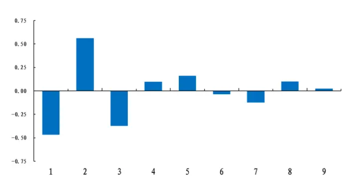
数据来源：Wind、开源证券研究所（统计区间：20130101-20231231）

图9：原始行业羊群效应5分组回测表现
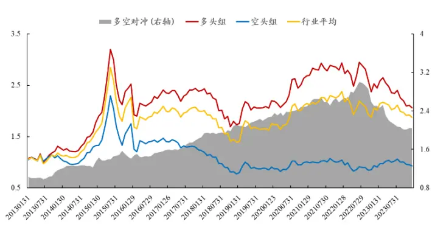
数据来源：Wind、开源证券研究所

对于原始行业羊群效应的改进思路同样也是两条：1、在计算原始行业羊群效应因子时，我们使用的是全部小单净流入，但是我们在《大小单资金流 alpha探究 2.0：变量精筛与高频测算》详细分析过，主动小单和非主动小单近年来的性质发生了较大的变化，其中非主动小单往往更能代表散户，所以我们将小单净流入改成非主动小单净流入；2、除此之外，我们发现行业羊群效应的变动同样也是较为显著的行业轮动因子，RankICIR为-0.88，所以我们会进行结合。

结合以上两点的改进，我们得到了改进行业羊群效应因子，其 5 分组多空如图10 所示，RankICIR从-0.86提升至-1.03，近两年的失效和回撤得到一定程度的解决。

图10：改进行业羊群效应 5分组回测图
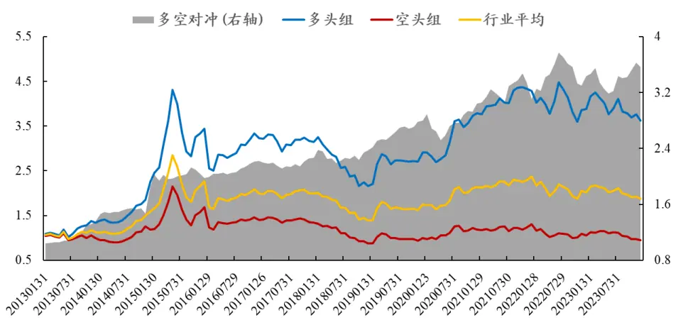
数据来源：Wind、开源证券研究所

## 2.3、 行业超大单和小单综合资金流因子

我们将上述的改进行业主动超大单强度和改进行业羊群效应进行合成，月频调仓下的效果如图 11 所示。该因子的 RankIC 为 9.28%，RankICIR 为 1.62，效果非常优异。该综合因子逻辑可以解释为：超大单本期强度较高且不位于高位，散户羊群效应较低且无大幅增加。

图11：行业超大单和小单资金流综合后月频调仓下的5分组回测图
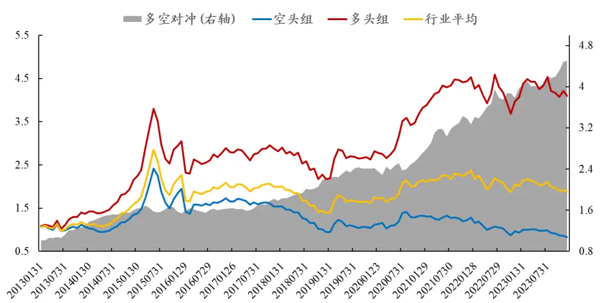
数据来源：Wind、开源证券研究所

## 2.4、 行业主动超大单和羊群效应升频后效果

近年来，行业轮动和风格轮动的速度逐渐加快。对于行业轮动因子而言，大家倾向于提高调仓频率来减弱因子失效的问题。在此部分，我们尝试将行业主动超大单强度和行业羊群效应因子升高调仓频率，尝试周频调仓下的效果。

## 1、行业主动超大单强度

首先，对于主动超大单强度而言，在月频调仓下我们采取两条改进思路：1、考虑近期是否处于高位；2、考虑资金流的极端与温和。在升高调仓频率后，由于能够更快的把握资金短期的动向，所以第一条改进思路在升频后用处不大。除此之外，在提高调仓频率后，计算资金流强度的时间窗口适当缩短可以提升因子效果，其对因子 RankICIR 影响的参数敏感性分析如图 12 所示。我们以回看过去 10 天为例，RankICIR 为 1.40，5 分组的回测如图 13，相较于月频调仓效果有一定程度的提升。

图12：周频调仓下，行业主动超大单强度回看天数的参数敏感性分析
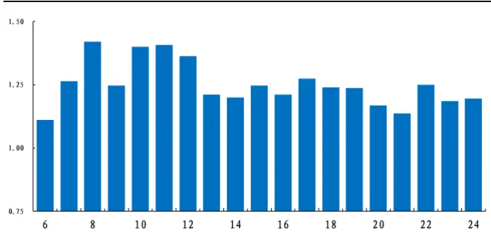
数据来源：Wind、开源证券研究所（统计区间：20130101-20231231）

图13：以回看过去 10天为例，行业主动超大单强度周频调仓下的 5 分组回测（RankICIR 为 1.40）
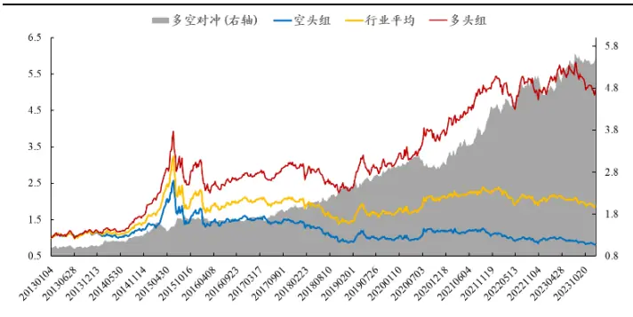
数据来源：Wind、开源证券研究所

## 2、行业羊群效应因子

对于行业羊群效应因子周频调仓而言，回看天数对因子RankICIR影响的参数敏感性分析如图 14所示。从图中我们可以看出，相较于月频的羊群效应因子，RankICIR并无提升。这里以回看过去15天为例，RankICIR仅为-0.73，5 分组的回测如图15。

图14：周频调仓下，行业羊群效应回看天数的参数敏感性分析
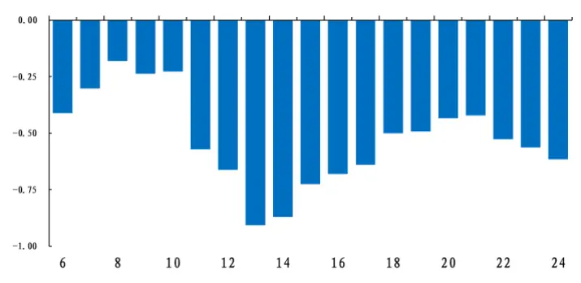
数据来源：Wind、开源证券研究所（统计区间：20130101-20231231）

图15：以回看过去 15天为例，行业羊群效应周频调仓下的 5 分组回测（RankICIR 为-0.73）
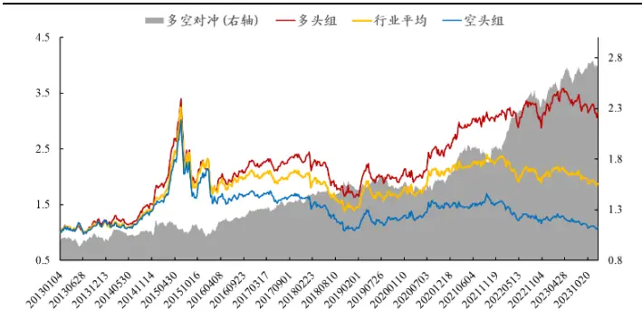
数据来源：Wind、开源证券研究所

进一步地，我们尝试将周度的行业主动大单强度和行业羊群效应因子进行合成，其 5 分组回测如图 16 所示，合成后的因子 RankICIR 为 1.44，其相较于月频的 1.62反而有所下降。对于行业轮动模型而言，升频后往往对应的是交易费用的提升和操作难度的加大，若因子RankICIR无显著提升，维持低频的做法相对较为合理，所以对于二者结合我们推荐月频的做法。

图16：周度的行业主动超大单强度和羊群效应因子合成，因子 5分组回测
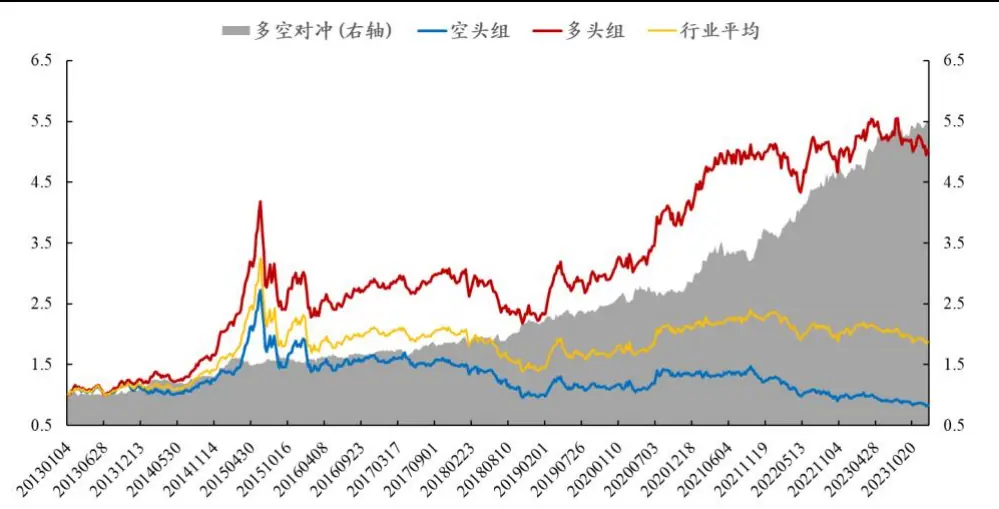
数据来源：Wind、开源证券研究所

## 3、 大单资金流：极端突破存在行业轮动能力

在以上的分析中，我们主要针对超大单、小单进行了改进，本章节我们集中在大单在行业轮动上的应用。在本文第一部分，我们已经测试了大单强度的行业轮动能力，但效果非常一般，其原因我们认为主要为大单强度在不同行业的量级有显著差别。

以交通运输和银行行业为例，二者的大单强度时序数值如图 17 所示，可以发现数值明显有偏。进一步地，我们分别测试了超大单强度和大单强度的滞后一期自相关系数，如图18所示，可以发现大单强度滞后一期自相关系数明显高于超大单强度。因此对于大单而言，我们倾向于采取时序研究方式，探究其能否进一步带来行业轮动相关的增量。

图17：大单资金流强度在不同行业量级有显著差别
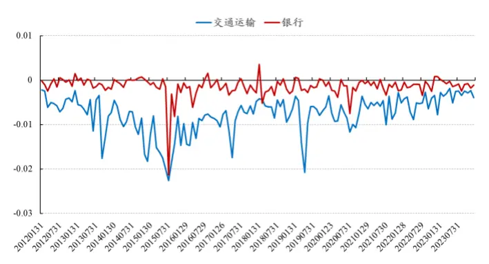
数据来源：Wind、开源证券研究所

图18：超大单和大单资金流强度滞后一期自相关系数
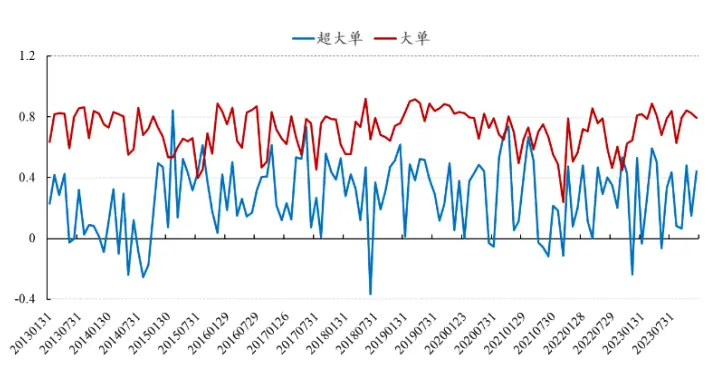
数据来源：Wind、开源证券研究所

## 3.1、 事件效应构成行业轮动因子：大单极端突破效应

对于大单的时序信息挖掘而言，我们在《知情交易者背后的择时信息》中已经分析了其极端突破具备一定指数择时的能力。顺着这个思路，我们进一步探究其是否具备行业轮动能力。具体做法为：对于单个行业每日净流入，回看过去 120 天计算均值和标准差，观察是否突破均值上下0.5倍标准差，若当日发生极端向上突破计为 1，发生极端向下突破计为-1，其余情况计为0，在调仓日回看过去N 个交易日并求和，若大于 0为多头，小于 0为空头。

在上述的做法中，涉及到了调仓频率和回看天数的问题。首先，以回看过去 10天为例，月频调仓下对冲收益波动比为 0.44，双周频为 1.19，周频为 1.50，可以发现周频调仓下的多空表现明显高于其余频率调仓，所以这里以周频为主进行展开。其次，回看天数对多空年化收益影响的参数敏感性分析如图 19 所示，我们选取回看天数N=10为最终的参数。

图19：就大单极端突破而言，回看天数对多空年化收益 影响的参数敏感性分析
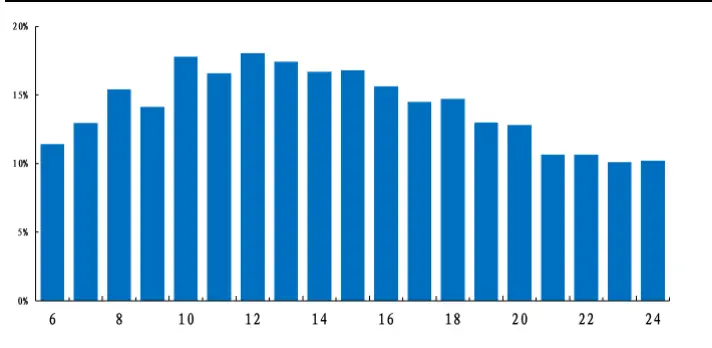
数据来源：Wind、开源证券研究所（统计区间：20130101-20231231）

图20：回看天数 N=10 下，大单极端突破的行业轮动回测净值
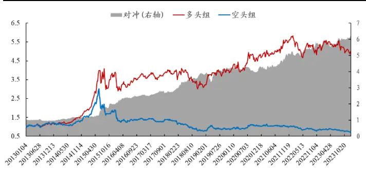
数据来源：Wind、开源证券研究所

## 3.2、 事件效应构成行业轮动因子：与其他资金流的联合

除了大小单资金流，市场中较为常见的，且能够进行日频跟踪的为北向资金和两融资金等。这里我们也采取同样的方法做了尝试，其中较为有效的为外资券商的净流入数据，回看天数对多空年化收益影响的参数敏感性分析如图21所示。相较于大单而言，最优回看天数会更长一些，这里我们选取N=20 为最后的参数。

图21：就外资券商极端突破而言，回看天数对多空年化收益影响的参数敏感性分析
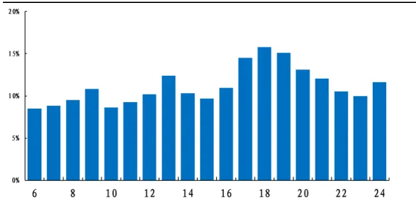
数据来源：Wind、开源证券研究所（统计区间：20130101-20231231）

图22：回看天数 N=20 下，外资券商极端突破的行业轮动回测净值
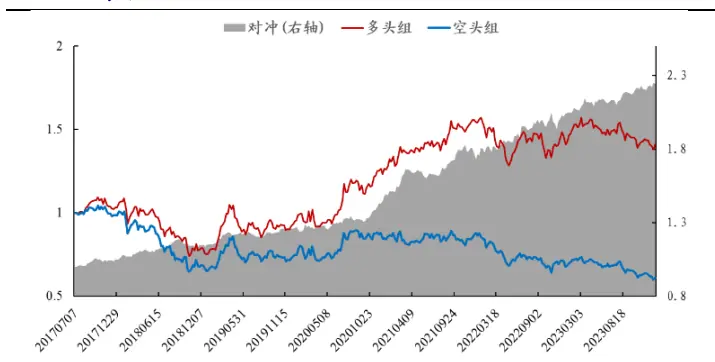
数据来源：Wind、开源证券研究所

## 3.3、 大单和外资券商联合的综合效果分析

最终我们将大单极端突破和外资券商极端突破进行结合，其中大单和外资券商都有 3 种信号，我们将其结合可以得到如下 9 种收益表现，可以发现二者如果都看多，则效果相对较好，而二者若都看空效果是最差的，有一定联合增强效果。

图23：大单和外资券商结合后的收益统计
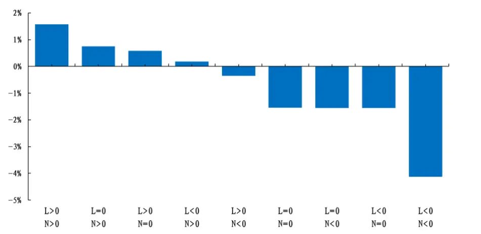
数据来源：Wind、开源证券研究所（统计区间：20180101-20231231）

## 3.4、 资金流的综合应用方案

至此，大小单资金流在行业轮动上的应用已经做了详细的分析，最后我们将上述的因子进行合成，得到最终资金流因子。合成方法为：（1）将改进行业主动超大单和改进行业羊群效应等权合成 IND_EX_S；（2）将大单异常突破因子和外资券商异常突破因子等权合成 IND_L_N；（3）由于 IND_EX_S 为月频，而 IND_L_N 为周频，首先我们将 IND_EX_S升频，空缺值前向填充，接着将其与 IND_L_N 等权合成，构成最终周频的资金流综合因子。其 5 分组回测如图 24 所示，表现较为优异，RankICIR为2.03，该因子也是本文最后优选行业的核心主体因子。

图24：周频的资金流综合因子 5分组回测净值图
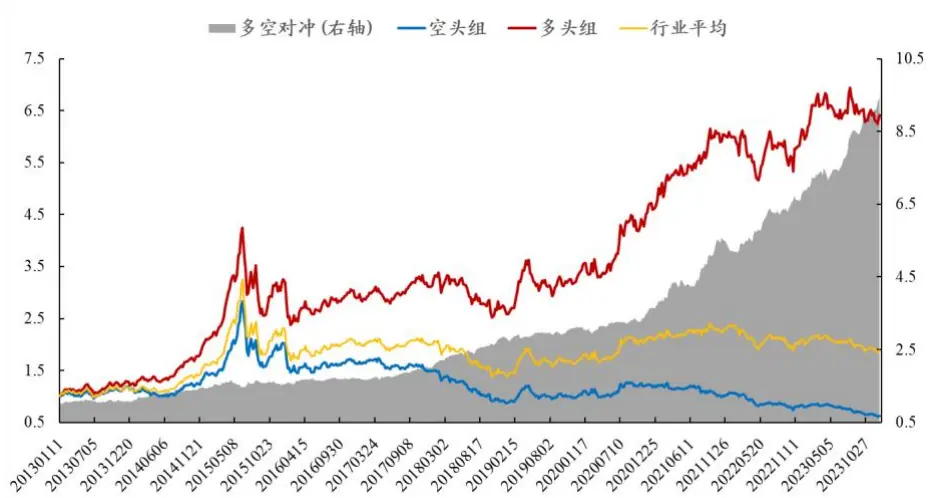
数据来源：Wind、开源证券研究所

## 4、 其他维度的综合考虑：动量和财务维度

对于资金流因子而言，其表现已经较为优异。进一步地，我们尝试从其他维度出发，提升资金流因子的行业轮动效果。本部分我们主要考虑了动量维度和财务维度，并定义了一些特色因子，这些因子近两年的表现依旧较为优异。

## 4.1、 动量维度：“极端切割”为核心改进点

## 1、传统动量：周频调仓效果较好

由于近年来行业轮动的速度在加快，低频调仓的动量策略失效较为严重，调仓频率的提高对于动量因子效果的提升有明显的帮助。这里，我们以 5 日、10 日、20日、60日和120 日为例，测试了周频、双周频和月频调仓的RankICIR，具体如表4所示。从表中我们不难发现，在如上的几种回看天数下，周度调仓的效果都是最好，其中回看天数为 10 天效果最优。该因子 RankICIR 可以达到 1.00，但是其 5 分组多空对冲近两年也出现逐渐走平的迹象。这里我们尝试从“极端切割”思路对其改进。

表4：传统动量下在不同回看天数，不同调仓频率RankICIR对比

| 回看天数 | 周频 | 双周频 | 月频 |
| --- | --- | --- | --- |
| 5 | 0.22 | 0.96 | 0.61 |
| 10 | 0.41 | 0.66 | 1.00 |
| 20 | 0.31 | 0.57 | 0.73 |
| 60 | -0.04 | -0.05 | 0.14 |
| 120 | 0.32 | 0.27 | 0.55 |

数据来源：Wind、开源证券研究所（统计区间：20130101-20231231）

图25：回看天数为10，周频调仓下的多空对冲近两年逐渐走平
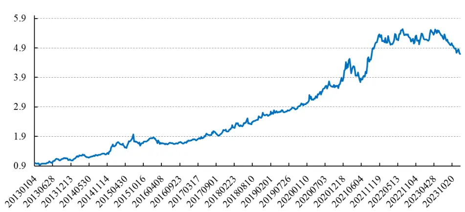
数据来源：Wind、开源证券研究所

## 2、“极端切割”思路一：行业自身极端的信息

我们在《日内极端收益前后的反转特性与因子构建》中从股票层面出发，发现日内最极端的收益往往alpha属性较为强烈。在这里，我们将这一想法衍生至行业层面，定义了行业极端情绪动量。具体做法为：对于单个行业，求过去 N 天正收益最大的日度收益，过去 N 天负收益最大的日度收益绝对值，最后取二者的比值。其中回看天数N对因子RankICIR影响的参数敏感性分析如图26所示。这里我们取N=10，5 分组的效果如图 27 所示，相较于传统动量，近两年的表现也依旧较为优异。

图26：就行业极端情绪动量改进而言，回看天数 N 对RankICIR影响的参数敏感性分析
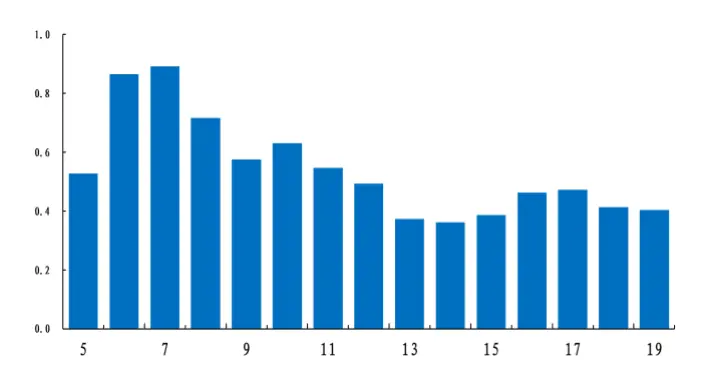
数据来源：Wind、开源证券研究所（统计区间：20130101-20231231）

图27：N=10下，行业极端情绪动量的 5分组回测净值
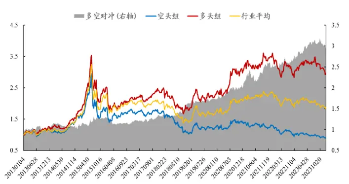
数据来源：Wind、开源证券研究所

除此之外，我们发现对于行业极端情绪动量因子而言，叠加趋势系数后因子效果可以得到进一步改善，具体做法为：对行业极端情绪动量取 Rank值，并取其过去M 个月均值和过去N 个月均值的比值 K，用 K乘以行业极端情绪动量的 Rank 值为最终的因子。M和N对因子RankICIR影响的参数敏感性分析如图 28 所示。我们选取 M=10,N=20 为最终参数。

图28：就行业极端情绪动量改进而言，趋势系数的参数敏感性分析

|  | 15 16 17 18 |  |  |  | 19 20 21 22 23 24 25 |  |  |  |  |  |  |
| --- | --- | --- | --- | --- | --- | --- | --- | --- | --- | --- | --- |
| 5 | 0.54 | 0.57 | 0.57 | 0.60 | 0.64 | 0.66 | 0.66 | 0.65 | 0.63 | 0.63 | 0.64 |
| 6 | 0.56 | 0.61 | 0.62 | 0.63 | 0.64 | 0.66 | 0.67 | 0.66 | 0.66 | 0.66 | 0.65 |
| 7 | 0.60 | 0.62 | 0.64 | 0.67 | 0.69 | 0.69 | 0.69 | 0.71 | 0.70 | 0.71 | 0.69 |
| 8 | 0.64 | 0.66 | 0.71 | 0.72 | 0.75 | 0.74 | 0.74 | 0.74 | 0.72 | 0.73 | 0.73 |
| 9 | 0.69 | 0.72 | 0.73 | 0.76 | 0.78 | 0.77 | 0.77 | 0.76 | 0.75 | 0.76 | 0.77 |
| 10 | 0.71 | 0.73 | 0.75 | 0.78 | 0.79 | 0.78 | 0.81 | 0.81 | 0.78 | 0.79 | 0.79 |
| 11 | 0.71 | 0.73 | 0.76 | 0.77 | 0.79 | 0.80 | 0.81 | 0.79 | 0.78 | 0.77 | 0.78 |
| 12 | 0.70 | 0.71 | 0.76 | 0.77 | 0.80 | 0.80 | 0.80 | 0.78 | 0.78 | 0.79 | 0.80 |
| 13 | 0.66 | 0.70 | 0.73 | 0.73 | 0.77 | 0.75 | 0.74 | 0.77 | 0.77 | 0.78 | 0.78 |
| 14 | 0.65 | 0.68 | 0.75 | 0.74 | 0.76 | 0.77 | 0.76 | 0.75 | 0.75 | 0.76 | 0.76 |

数据来源：Wind、开源证券研究所（统计区间：20130101-20231231）

## 3、“极端切割”思路二：市场整体极端的信息

在传统动量的做法中，我们倾向于回看过去N 天，把这N天的收益都用上。但是由于信息在时间轴的分布可能是不均匀的，导致并不是每天的涨跌都能对最终的因子有所贡献。

这里我们尝试探究市场在大涨大跌时的行业收益的动量属性，具体做法为：（1）在每个交易日计算行业收益的均值，并回看过去 120 天，计算均值和标准差，判定在 120天均值上下M倍标准差之外的为市场极端日；（2）在调仓日，回看过去N 个交易日，计算这 N 个交易日中市场极端日行业动量排序值均值，为市场极端情绪动量。

其中，判断极端的条件中的标准差倍数，以及回看天数对最终因子月频调仓的RankICIR敏感性分析如图29 所示。最终我们选取2倍标准差，回看过去5 天均值，月频调仓下的 5 分组对冲如图 30 所示。（注：这里尝试了不同频率的调仓效果，月频较优）

图29：就市场极端情绪动量而言，标准差倍数及回看天数的参数敏感性分析

|  | 0.50.60.7 0.8 0.9 1 1.1 |  |  |  |  |  |  | 1.2 1.3 |  | 1.4 | 1.5 | 1.6 | 1.7 | 1.8 | 1.9 2 2.1 2.2 |  |  |  | 2.3 2.42.5 |  |  |
| --- | --- | --- | --- | --- | --- | --- | --- | --- | --- | --- | --- | --- | --- | --- | --- | --- | --- | --- | --- | --- | --- |
| 2 | 0.03 | -0.09 | 0.08 | -0.15 | 0.12 | 0.01 | 0.09 | 0.42 | 0.52 | 0.52 | 0.52 | 1.07 | 1.04 | 1.51 | 1.81 | 1.97 | 1.52 | 0.91 | 0.97 | 1.04 | 0.71 |
| 3 | 0.18 | -0.03 | 0.16 | -0.00 | 0.10 | 0.13 | 0.01 | 0.10 | 0.04 | 0.18 | 0.13 | 0.76 | 0.71 | 0.70 | 0.47 | 0.77 | 0.37 | 0.19 | 0.40 | 0.63 | 0.16 |
| 4 | 0.13 | -0.19 | 0.05 | -0.10 | 0.07 | 0.05 | -0.12 | 4.03 | 0.09 | 0.31 | 0.12 | 0.80 | 0.74 | 0.88 | 0.79 | 115 | 0.83 | 0.74 | 0.86 | 0.61 | 0.05 |
| 5 | 0.20 | 0 10 | 0.34 | 0.19 | 0.26 | 0.30 | 0 24 | 0.23 | 0.23 | 041 | 0.22 | 0 75 | 0.80 | 0.92 | 0.90 | 119 | 0 99 | 1.11 | 1.04 | 0.75 | 0.16 |
| 6 | 0.56 | 0.38 | 0.71 | 0.55 | 0.64 | 0.69 | 0.62 | 0.60 | 0.59 | 0.71 | 0.47 | 0.88 | 0.94 | 0.81 | 0.93 | 1.18 | 0.97 | 1.12 | 1.07 | 0.89 | 0.22 |
| 7 | 0.50 | 0.29 | 0.53 | 0.51 | 0.57 | 0.49 | 0.43 | 0.46 | 0.46 | 0.62 | 0.31 | 0.66 | 0.68 | 0.71 | 0.78 | 0.94 | 0.83 | 0.95 | 0.88 | 0.77 | 0.24 |
| 8 | 0.42 | 0.31 | 0.64 | 0.62 | 0.73 | 0.63 | 0.54 | 0.58 | 0.53 | 0.68 | 0.34 | 0.65 | 0.65 | 0.68 | 0.72 | 0.84 | 0.82 | 0.93 | 0.75 | 0.64 | 0.17 |
| 9 | 0.53 | 040 | 0.61 | 0.61 | 0.70 | 0.65 | 0 60 | 0.75 | 0.71 | 0.85 | 0.42 | 0.76 | 0.69 | 0.70 | 0.76 | 0.85 | 0 96 | 0.85 | 0.71 | 0.60 | 0.18 |
| 10 | 0.59 | 0.46 | 0.66 | 0.68 | 0.81 | 0.72 | 0.75 | 0.89 | 0.84 | 0.92 | 0.44 | 0.80 | 0.68 | 0.77 | 0.76 | 0.87 | 0.94 | 0.97 | 0.84 | 0.86 | 0.46 |
| 11 | 0.53 | 046 | 0.68 | 0.61 | 0.78 | 0.70 | 070 | 0.92 | 0.88 | 0.93 | 0.50 | 085 | 0.79 | 0.90 | 0.76 | 0.82 | 0.93 | 0.95 | 0.84 | 0.85 | 0.49 |
| 12 | 0á1 | 049 | 0.69 | 0.64 | 0.73 | 0.56 | 0.63 | 0.85 | 0.71 | 0.78 | 0.41 | 0.70 | 0.60 | 0.79 | 0.69 | 0.61 | 0.68 | 0.67 | 0.49 | 0.67 | 0.27 |
| 13 | 0.58 | 0.43 | 0.60 | 0.46 | 0.64 | 0.53 | 0.59 | 0.80 | 0.60 | 0.72 | 0.30 | 0.57 | 0.44 | 0.56 | 0.44 | 0.36 | 0.52 | 0.50 | 0.30 | 0.62 | 0.22 |
| 14 | 0.55 | 047 | 0.53 | 0.41 | 0.59 | 0.54 | 061 | 0.80 | 0.62 | 0.79 | 0.40 | 0.70 | 0.60 | 0.66 | 0.55 | 0.47 | 0.60 | 0.58 | 0.41 | 0.73 | 0.35 |
| 15 | 0.64 | 051 | 0.66 | 0.57 | 0.68 | 0.61 | 0.59 | 0.73 | 0.60 | 0.74 | 0.31 | 0.56 | 0.46 | 0.48 | 0.36 | 0.36 | 041 | 0.49 | 0.26 | 0.61 | 0.24 |

数据来源：Wind、开源证券研究所（统计区间：20130101-20231231）

图30：月频调仓，2 倍标准差及回看过去 5 天下，五分组对冲曲线
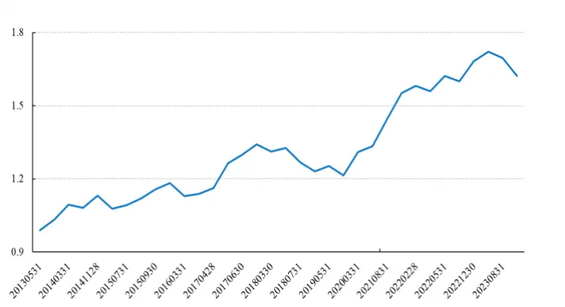
数据来源：Wind、开源证券研究所

虽然市场极端情绪动量因子效果较为优异，但是其存在缺失值，非空的样本数只占到全区间的 25%，并不能作为单独因子进行使用。最终我们将行业极端情绪动量和市场极端情绪动量进行合成，为综合极端动量因子。该因子 RankICIR 为 0.88，其 5分组的净值如图31所示。

图31：综合极端动量因子 RankICIR 为 0.88
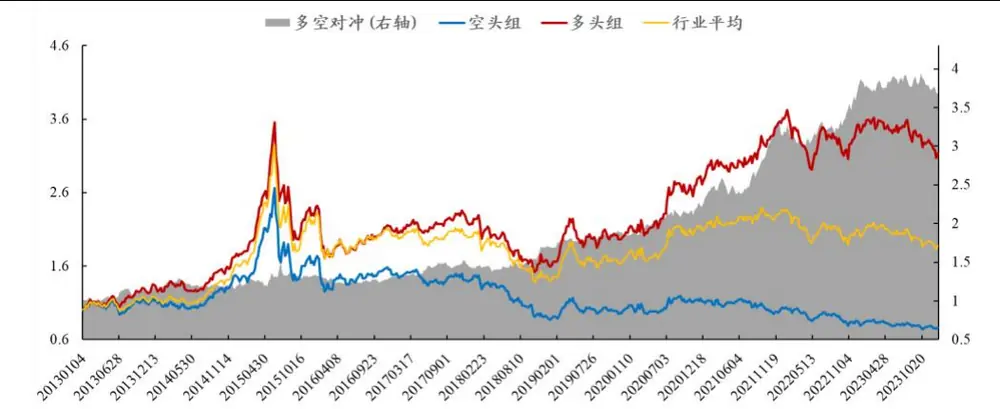
数据来源：Wind、开源证券研究所

## 4.2、 基本面维度：困境反转和超预期景气的有效轮动

对于基本面维度而言，我们在《业绩超预期 Plus2.0：基于预期调整的修正》中构建了行业超预期景气因子，RankICIR为0.60，在《价值Plus组合构建与多策略融合实践》中构建了困境反转因子，RankICIR为 1.00。二者在行业轮动上的5分组效果如下所示。

图32：行业困境反转因子5分组对冲净值表现
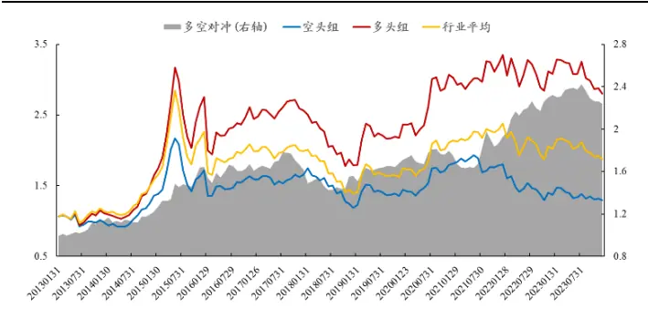
数据来源：Wind、开源证券研究所

图33：行业超预期景气因子5分组对冲净值表现
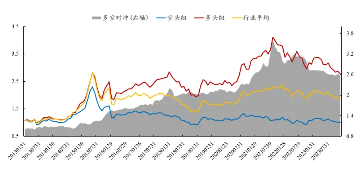
数据来源：Wind、开源证券研究所

对于以上的两个基本面模型而言，其存在天然的互补性。为了更加直观的观察这一现象，我们使用两个模型的月度 RankIC 相减，如下图所示，该相对强弱有着明显的轮动周期：经济上行时超预期景气因子较好，经济下行时困境反转因子较好。

图34：行业困境反转因子和行业超预期因子存在明显的轮动周期
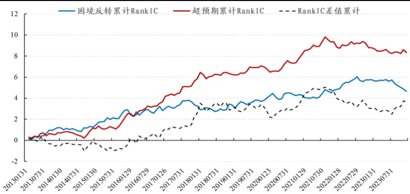
数据来源：Wind、开源证券研究所

进一步地，我们利用二者的轮动周期，尝试了如下的行业尾部剔除方案：使用RankIC 累计差值进行强弱判断，若 RankIC 累计差值在 6 个月均线之上，则剔除困境反转后 6个行业；若RankIC 累计差值在 6个月之下，则剔除超预期景气后6 个行业。从图 35可以发现结合二者轮动的尾部剔除方案，相对于行业等权基准有较为稳定的超额。

图35：结合困境反转和超预期景气轮动下的尾部剔除方案
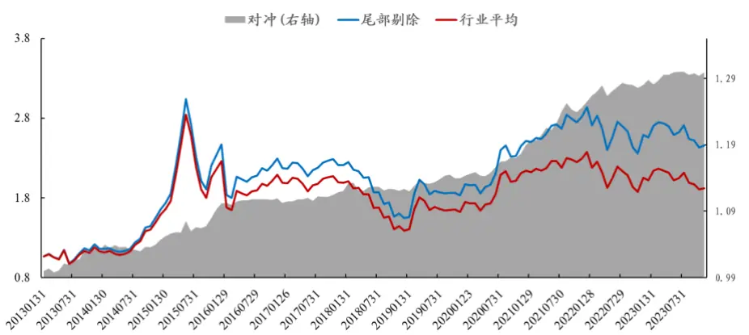
数据来源：Wind、开源证券研究所

## 5、 资金流的综合行业轮动方案

本章节我们以综合资金流因子为主体，其余维度为负向剔除维度，构建行业轮动策略。

## 5.1、 动量和财务维度剔除的敏感性分析

对于作为负向剔除维度的动量和财务，我们对剔除数量做了相关敏感性测试。以动量维度为例，具体做法如下：使用动量剔除排名较低的 N 个行业后，利用资金流综合因子选取 5 个行业，观察这 5 个行业的年化收益。具体的敏感性分析结果如下图所示。从图中我们可以看出，动量维度的剔除较为有效，财务维度的剔除效果不佳。

图36：动量维度剔除行业数量的敏感性分析
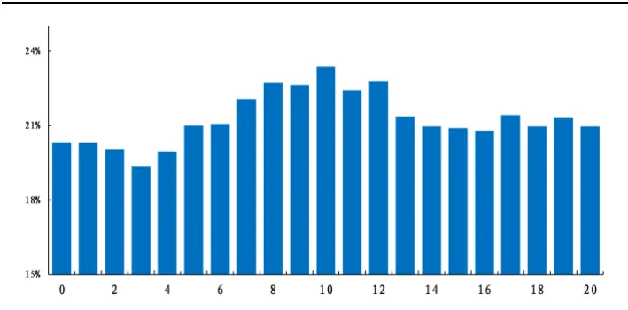
数据来源：Wind、开源证券研究所（统计区间：20130101-20231231）

图37：财务维度剔除行业数量的敏感性分析
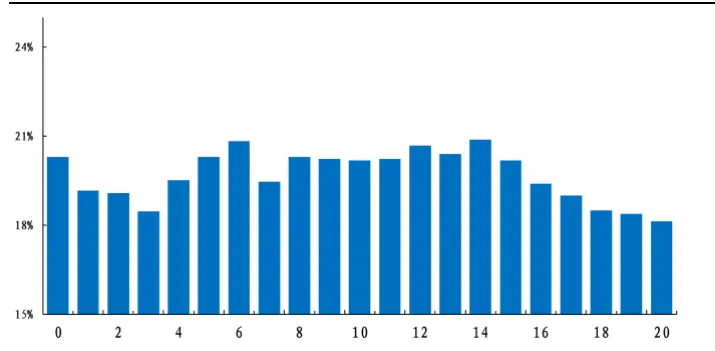
数据来源：Wind、开源证券研究所（统计区间：20130101-20231231）

## 5.2、 拥挤度加入的影响探讨

除此之外，以上讨论的模型，不论是核心因子综合资金流，还是补充因子动量

而言，其往往都是偏右侧的，这里我们加入了拥挤度指标作为最后一道的筛选。

对于拥挤的衡量同样存在两种方式：1、以成交额表征的交易热度；2、以赚钱效应表征的盈利水平。对于交易热度而言，我们回看过去 120 天计算每天成交额的分位数，并取过去 10天均值。对于盈利水平而言，每天计算月度涨跌幅较高的 20%的个股，统计分布在不同行业的股票数占各自行业总股票数的比例作为赚钱效应，并回看过去120天赚钱效应计算每天的分位数，取过去10 天均值。

不论是交易热度还是盈利水平，最终都是历史分位数的形式。最终多少分位数以上算是较为拥挤呢？我们进行了参数敏感性测试。以交易热度为例，具体做法如下：剔除动量排序较低的 10 个行业，且交易热度在λ分位以上的行业后，利用资金流综合因子选取 5 个行业，观察这 5 个行业的年化收益。具体的敏感性分析结果如下图所示。从图中我们可以看出，盈利水平对于组合的改进有一定帮助。

图38：交易热度剔除的λ敏感性分析
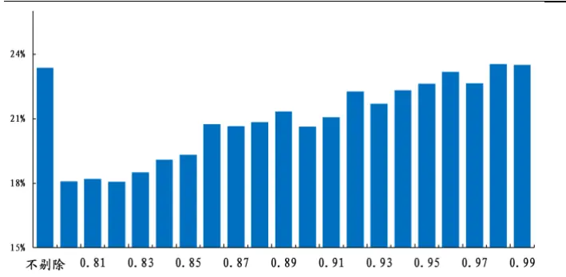
数据来源：Wind、开源证券研究所（统计区间：20130101-20231231）

图39：盈利水平剔除的λ敏感性分析
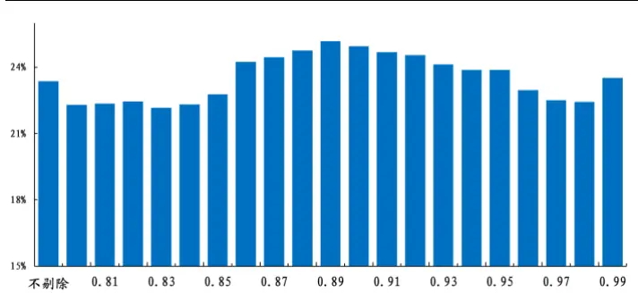
数据来源：Wind、开源证券研究所（统计区间：20130101-20231231）

结合以上的讨论，我们的方案为：剔除动量排序较低的 10个行业，且盈利水平在 90%分位以上的行业后，利用资金流综合因子选取 5 个行业，周频调仓，手续费双边千一，最后组合净值如图 40，绩效如表5所示。

图40：最终优选5个行业对应的净值
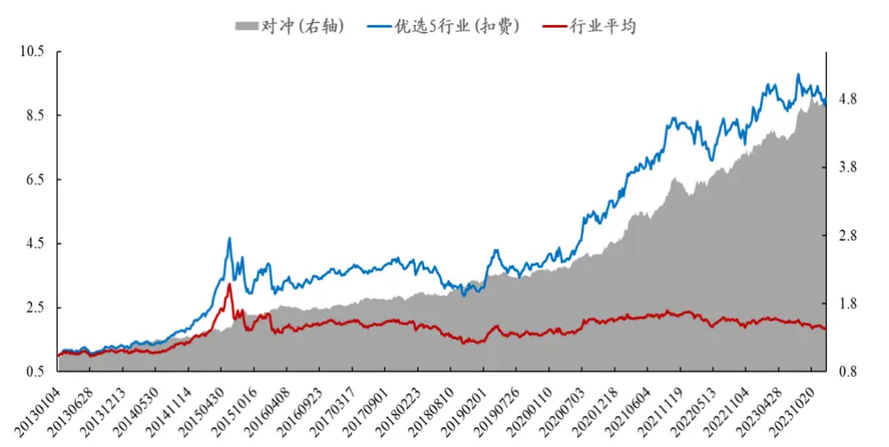
数据来源：Wind、开源证券研究所

表5：最终优选5个行业的绩效较为优异

|  | 年度 | 年化收益 | 信息比率 | 最大回撤 | 周度胜率 |
| --- | --- | --- | --- | --- | --- |
| 绝对收益 | 2013 | 28.63% | 1.36 | 16.49% | 58.00% |
|  | 2014 | 61.88% | 3.57 | 7.18% | 66.04% |
|  | 2015 | 75.80% | 1.88 | 36.92% | 69.23% |
|  | 2016 | -5.82% | -0.25 | 15.16% | 54.00% |
|  | 2017 | 5.19% | 0.44 | 8.49% | 49.02% |
|  | 2018 | -20.18% | -0.88 | 28.43% | 47.06% |
|  | 2019 | 33.51% | 1.63 | 19.76% | 56.86% |
|  | 2020 | 43.95% | 1.98 | 10.56% | 65.38% |
|  | 2021 | 36.39% | 2.27 | 5.22% | 55.77% |
|  | 2022 | 3.81% | 0.20 | 14.78% | 58.00% |
|  | 2023 | 7.87% | 0.53 | 9.87% | 48.00% |
|  | 全区间 | 21.84% | 0.99 | 38.77% | 57.12% |
| 相对收益(基准 为行业平均） | 2013 | 14.37% | 2.05 | 3.19% | 54.00% |
|  | 2014 | 17.05% | 2.54 | 3.10% | 66.04% |
|  | 2015 | 23.56% | 2.43 | 4.35% | 61.54% |
|  | 2016 | 6.44% | 1.15 |  | 44.00% |
|  | 2017 | 5.18% |  | 4.32% | 58.82% |
|  | 2018 | 13.63% | 0.98 2.16 | 3.19% 3.34% | 56.86% |
|  | 2019 | 8.05% | 1.39 | 4.39% | 56.86% |
|  | 2020 | 16.72% | 2.26 | 2.67% | 59.62% |
|  | 2021 | 23.37% | 2.26 | 8.07% | 67.31% |
|  | 2022 | 22.38% | 2.50 | 3.05% | 60.00% |
| 2023 | 16.15% | 2.09 | 3.60% | 60.00% |  |
| 全区间 | 15.05% | 2.00 | 8.07% | 58.72% |  |

数据来源：Wind、开源证券研究所

对于行业的选取数量而言，我们这里也做了相关敏感性分析，不同行业的年化收益和收益波动比如图 41所示。从图中我们可以发现随着选择行业数量的增多，整体绩效较为单调，其中在选取行业个数为 2~5 的情况下，年化收益和收益波动比较为稳定，所以我们最终方案是每期推荐 5个行业。

图41：行业选取个数的敏感分析
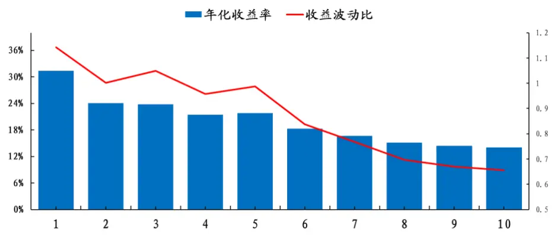
数据来源：Wind、开源证券研究所（统计区间：20130101-20231231）

## 6、 附录：中证 1000指增的尝试

至此，对于大小单资金流而言，我们在选股上和行业轮动上都有相对应的解决方案，具体列示如表 6所示。

表6：大小单在选股和行业轮动应用汇总

|  | 超大单关注度因子 |
| --- | --- |
|  | 大单残差 |
|  | 小单残差 |
|  | 散户羊群效应 |
| 行业轮动 |  |
|  | 改进行业主动超大单强度 |
|  | 改进行业羊群效应 |

数据来源：Wind、开源证券研究所

其中对于选股因子而言，合成后 RankIC 为 6.71%，RankICIR 为 4.74，其 5 分组多空对冲曲线如下所示，效果较为优异。

图42：资金流综合选股因子的分组较为优异
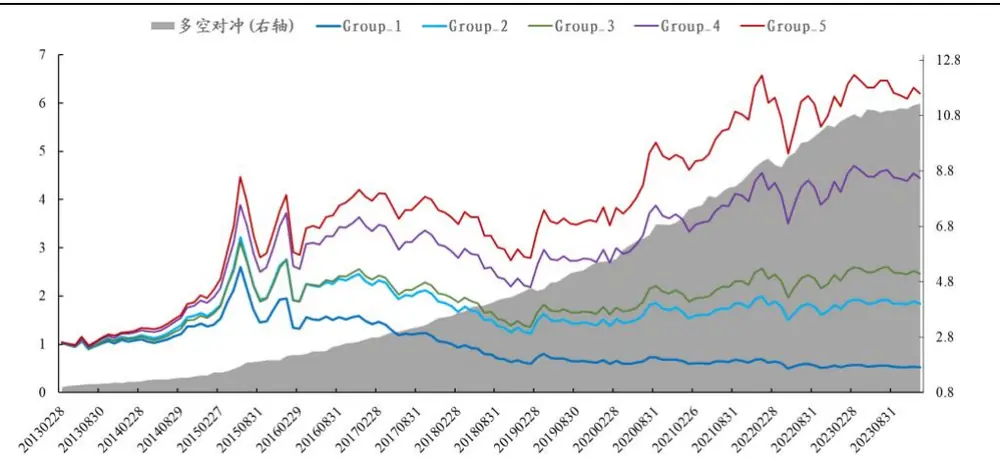
数据来源：Wind、开源证券研究所

进一步地，我们结合行业和个股因子进行了1000指数增强的尝试，因为指数增强往往以月频为主，这里我们进行了月频的尝试，因而在行业轮动上我们只采用了超大单和小单的结合，大单并没有进行使用。

对于 1000指增的参数设置，这里我们规定：（1）手续费双边千三，组合换手率约束上限为 50%；（2）个股权重超额基准上下限不超过 1%，且个股限制卖空；（3）风格因子暴露上下限制不超过2%；（4）若不加行业轮动模型，则行业上下限的暴露都为 0，若加行业轮动模型，则上下限的暴露参数设置如表 7所示。

表7：1000指增下的行业轮动参数设置

|  | 第一组 | 第二组 | 第三组 | 第四组 | 第5组 |
| --- | --- | --- | --- | --- | --- |
| 行业上限 | 0 | 0 | 0 | 0.04 | 0.04 |
| 行业下限 | -0.04 | -0.04 | 0 | 0 | 0 |

数据来源：Wind、开源证券研究所

从图 44我们可以发现：行业轮动对于指增存在一定增量，考虑行业之后多空信息比率从 1.55 提升至 1.98。

图43：结合行业的1000指增绩效优异
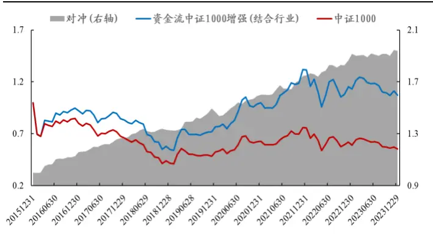
数据来源：Wind、开源证券研究所

图44：结合行业后，指增的绩效有进一步提升
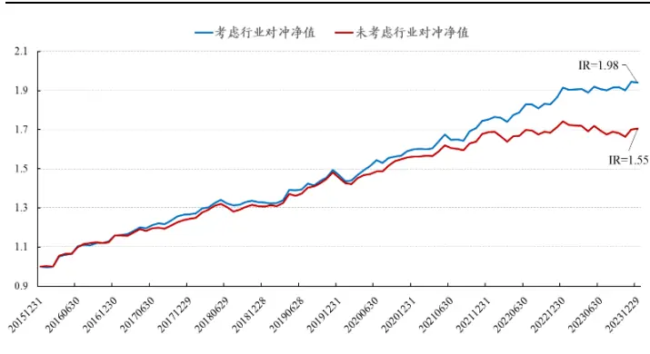
数据来源：Wind、开源证券研究所

## 7、 风险提示

本报告模型基于历史数据测算，市场未来可能发生重大改变。

## 特别声明

《证券期货投资者适当性管理办法》、《证券经营机构投资者适当性管理实施指引（试行）》已于2017年7月1日起正式实施。根据上述规定，开源证券评定此研报的风险等级为R3（中风险），因此通过公共平台推送的研报其适用的投资者类别仅限定为专业投资者及风险承受能力为C3、C4、C5的普通投资者。若您并非专业投资者及风险承受能力为C3、C4、C5的普通投资者，请取消阅读，请勿收藏、接收或使用本研报中的任何信息。

因此受限于访问权限的设置，若给您造成不便，烦请见谅！感谢您给予的理解与配合。

## 分析师承诺

负责准备本报告以及撰写本报告的所有研究分析师或工作人员在此保证，本研究报告中关于任何发行商或证券所发表的观点均如实反映分析人员的个人观点。负责准备本报告的分析师获取报酬的评判因素包括研究的质量和准确性、客户的反馈、竞争性因素以及开源证券股份有限公司的整体收益。所有研究分析师或工作人员保证他们报酬的任何一部分不曾与，不与，也将不会与本报告中具体的推荐意见或观点有直接或间接的联系。

## 股票投资评级说明

|  | 评级 | 说明 |
| --- | --- | --- |
| 证券评级 | 买入（Buy） | 预计相对强于市场表现20%以上； |
|  | 增持（outperform） | 预计相对强于市场表现5%～20%; |
|  | 中性（Neutral） | 预计相对市场表现在—5%～+5%之间波动； |
|  | 减持（underperform） | 预计相对弱于市场表现5%以下。 |
| 行业评级 | 看好（overweight） | 预计行业超越整体市场表现； |
|  | 中性（Neutral） | 预计行业与整体市场表现基本持平； |
|  | 看淡（underperform） | 预计行业弱于整体市场表现。 |
| 备注：评级标准为以报告日后的6~12个月内，证券相对于市场基准指数的涨跌幅表现，其中A股基准指数为沪深300指数、港股基准指数为恒生指数、新三板基准指数为三板成指（针对协议转让标的）或三板做市指数（针对做市转让标的)、美股基准指数为标普500或纳斯达克综合指数。我们在此提醒您，不同证券研究机构采用不同的评级术语及评级标准。我们采用的是相对评级体系，表示投资的相对比重建议；投资者买入或者卖出证券的决定取决于个人的实际情况，比如当前的持仓结构以及其他需要考虑的因素。投资者应阅读整篇报告，以获取比较完整的观点与信息，不应仅仅依靠投资评级来推断结论。 |  |  |

## 分析、估值方法的局限性说明

本报告所包含的分析基于各种假设，不同假设可能导致分析结果出现重大不同。本报告采用的各种估值方法及模型均有其局限性，估值结果不保证所涉及证券能够在该价格交易。

## 法律声明

开源证券股份有限公司是经中国证监会批准设立的证券经营机构，已具备证券投资咨询业务资格。

本报告仅供开源证券股份有限公司（以下简称“本公司”）的机构或个人客户（以下简称“客户”）使用。本公司不会因接收人收到本报告而视其为客户。本报告是发送给开源证券客户的，属于商业秘密材料，只有开源证券客户才能参考或使用，如接收人并非开源证券客户，请及时退回并删除。

本报告是基于本公司认为可靠的已公开信息，但本公司不保证该等信息的准确性或完整性。本报告所载的资料、工具、意见及推测只提供给客户作参考之用，并非作为或被视为出售或购买证券或其他金融工具的邀请或向人做出邀请。本报告所载的资料、意见及推测仅反映本公司于发布本报告当日的判断，本报告所指的证券或投资标的的价格、价值及投资收入可能会波动。在不同时期，本公司可发出与本报告所载资料、意见及推测不一致的报告。客户应当考虑到本公司可能存在可能影响本报告客观性的利益冲突，不应视本报告为做出投资决策的唯一因素。本报告中所指的投资及服务可能不适合个别客户，不构成客户私人咨询建议。本公司未确保本报告充分考虑到个别客户特殊的投资目标、财务状况或需要。本公司建议客户应考虑本报告的任何意见或建议是否符合其特定状况，以及（若有必要）咨询独立投资顾问。在任何情况下，本报告中的信息或所表述的意见并不构成对任何人的投资建议。在任何情况下，本公司不对任何人因使用本报告中的任何内容所引致的任何损失负任何责任。若本报告的接收人非本公司的客户，应在基于本报告做出任何投资决定或就本报告要求任何解释前咨询独立投资顾问。

本报告可能附带其它网站的地址或超级链接，对于可能涉及的开源证券网站以外的地址或超级链接，开源证券不对其内容负责。本报告提供这些地址或超级链接的目的纯粹是为了客户使用方便，链接网站的内容不构成本报告的任何部分，客户需自行承担浏览这些网站的费用或风险。

开源证券在法律允许的情况下可参与、投资或持有本报告涉及的证券或进行证券交易，或向本报告涉及的公司提供或争取提供包括投资银行业务在内的服务或业务支持。开源证券可能与本报告涉及的公司之间存在业务关系，并无需事先或在获得业务关系后通知客户。

本报告的版权归本公司所有。本公司对本报告保留一切权利。除非另有书面显示，否则本报告中的所有材料的版权均属本公司。未经本公司事先书面授权，本报告的任何部分均不得以任何方式制作任何形式的拷贝、复印件或复制品，或再次分发给任何其他人，或以任何侵犯本公司版权的其他方式使用。所有本报告中使用的商标、服务标记及标记均为本公司的商标、服务标记及标记。

## 开源证券研究所

上海

地址：上海市浦东新区世纪大道1788号陆家嘴金控广场1号

楼10层

邮编：200120

邮箱：research@kysec.cn

北京
地址：北京市西城区西直门外大街18号金贸大厦C2座9层
邮编：100044
邮箱：research@kysec.cn

地址：深圳市福田区金田路2030号卓越世纪中心1号

楼45层

邮编：518000

邮箱：research@kysec.cn

西安
地址：西安市高新区锦业路1号都市之门B座5层
邮编：710065
邮箱：research@kysec.cn