2024 年 05 月 24 日

## 金融工程研究团队

魏建榕（首席分析师）

证书编号：S0790519120001

张 翔（分析师）

证书编号：S0790520110001

傅开波（分析师）

证书编号：S0790520090003

## 高 鹏（分析师）

证书编号：S0790520090002

## 苏俊豪（分析师）

证书编号：S0790522020001

## 胡亮勇（分析师）

证书编号：S0790522030001

## 王志豪（分析师）

证书编号：S0790522070003

## 盛少成（分析师）

证书编号：S0790523060003

## 苏 良（分析师）

证书编号：S0790523060004

## 何申昊（研究员）

证书编号：S0790122080094

## 陈 威（研究员）

证书编号：S0790123070027

## 蒋 韬（研究员）

证书编号：S0790123070037

## 相关研究报告

《遗传算法赋能交易行为因子—市场微观结构（20）》-2023.8.6

《A 股反转之力的微观来源—市场微观结构（1）》-2019.12.23

## 深度学习赋能交易行为因子

# ——市场微观结构（24）

魏建榕（分析师）

weijianrong@kysec.cn

盛少成（分析师）

证书编号：S0790519120001

shengshaocheng@kysec.cn

证书编号：S0790523060003

## 遗传算法绩效回顾

我们在《遗传算法赋能交易行为因子》中，创新性地提出“切割算子”，并结合其他算子和变量，利用改进的遗传算法流程，经过1 轮 10 代的挖掘，得到了开源金工遗传算法因子：Alpha185。从 2017 年 1 月至 2024 年 4 月，合成后因子RankIC 为 12.14%，RankICIR 为 4.45，10 分组多空年化收益为 34.79%，信息比率为3.16，2022年6月份以来的样本外整体表现也较为优异。

## 深度学习挖掘因子

基于LSTM框架的因子挖掘，为本文主要讨论的部分，从输入层到输出层分为4部分：1、输入层。我们考虑了三大类变量：日频量价、分钟频量价、大小单资金流；2、中间主体模型。我们使用时序处理应用较多的 LSTM 模型；3、加入财务数据，弥补量价类因子多头端分层一般的劣势；4、输出层。我们对比了单输出和多输出的绩效差别。基于该框架，产生了三大月频因子： $LSTM_{init}$ $LSTM_{pro},\ LSTM_{pro_{-}multi}:$

1、未考虑财务数据的 $LSTM_{init}$ RankIC 为 8.08%，RankICIR 为 3.99，已经具备较为优异的选股效果，但 10 分组多头较为一般，为量价类因子普遍的劣势。进一步地，我们引入财务数据去改善。

2、对于财务数据而言，考虑到其时序变化较慢，我们并没有将其和日度变化的量价类指标一起作为初始输入层数据，而是将其转化为分位点后，放入输出层前一层，和量价类指标通过隐藏层后的神经元进行拼接，一起通过全连接层输出为最后的因子 $LSTM_{pro}$ 。该因子 RankIC 为 9.17%，RankICIR 为 4.49，相较于 $LSTM_{init}$ 整体的绩效有所提升，更为重要的是，多头端的分层效果更为优异。

3、通过在原始损失函数的基础上加上多因子间的相关性惩罚，我们构建了多输出 $LSTM_{pro\_mulit}$ ，但是该因子绩效相较于 $LSTM_{pro}$ 并无显著提升，训练成本反而更高，所 $\therefore LSTM_{pro}$ 为本文最后推荐的因子。

## 深度学习改进因子

除了因子挖掘，LSTM框架还可以尝试因子改进，本文我们以理想反转为例进行小篇幅展开，尝试使用 LSTM 对其进行改进，具体的做法即在原损失函数的基础上考虑与待改进因子的相关系数。改进理想反转因子的 RankIC 为-9.03%，RankICIR 为-4.13，明显优于原始理想反转。

## 人工因子、遗传算法因子、深度学习因子对比

对于人工因子而言，我们选取了 8 大因子：理想反转、APM、聪明钱、理想振幅、主动买卖、大单残差、小单残差、散户羊群效应，8大因子的等权合成综合因子 RankICIR 为 4.59；遗传算法 Alpha_185 因子 RankICIR 为 4.45；深度学习因子 RankICIR 为 4.49。在多头超额上，深度学习因子表现最优，在中证 1000指数增强上表现也最好。

- 风险提示：本报告模型基于历史数据测算，市场未来可能发生重大改变。

近年来机器学习逐渐被市场所重视，目前主流模型即树模型和神经网络。对于树模型而言，我们在《遗传算法赋能交易行为因子》中，创新性地提出“切割算子”，并结合其他算子和变量，利用改进的遗传算法流程，经过1轮10代的挖掘，得到了一系列有效因子，这里将其命名为：Alpha185。在本篇报告中，我们将探索神经网络模型在因子投研的应用，以及对比人工因子、遗传算法因子和深度学习因子间的异同点。其中神经网络在因子上的应用为本文的主体，主要分为因子挖掘和因子改进：

（1）因子挖掘。从输入层到输出层分为 4 部分：1、输入层。我们考虑了三大类变量：日频量价、分钟频量价、大小单资金流；2、中间主体模型。我们使用在时序处理上应用较多的LSTM模型；3、加入财务数据，弥补量价类因子多头端分层一般的劣势。考虑到财务数据变化较慢，我们并没有将其作为初始输入层数据，而是将其转化为分位点后，放入输出层前一层，和量价类指标通过隐藏层后的神经元进行拼接，一起通过最后的全连接层输出为最终因子；4、输出层。我们对比了单输出和多输出的绩效差别。

（2）因子改进。如果单纯从因子本身构造出发，不结合因子择时的范畴，常见的改进方法即：公式的变形和变量的替换。在公式的变形中，我们在《聪明钱因子模型的 2.0版本》中发现：不同的 S指标的构造方式，将产生不同的聪明钱划分结果，对因子最后的绩效有显著影响。在变量的替换中，我们在《APM因子模型的进阶版》中发现：相较于使用日内第 1 小时收益，使用隔夜收益的效果更好。本文我们以理想反转为例，尝试使用 LSTM 对其进行改进，具体的修改即：在原损失函数的基础上，考虑与待改进因子的相关性。

## 1、 遗传算法因子 Apha185 绩效回顾

对于遗传算法挖掘因子而言，我们将其主要分为如下 5 大步骤：1、个体初始化；2、初始种群构建；3、选择；4、交叉；5、变异。为了提升遗传算法的有效挖掘概率，我们在每一步都做了对应的处理，具体流程如图1 所示。

图1：开源金工特色遗传算法整体流程
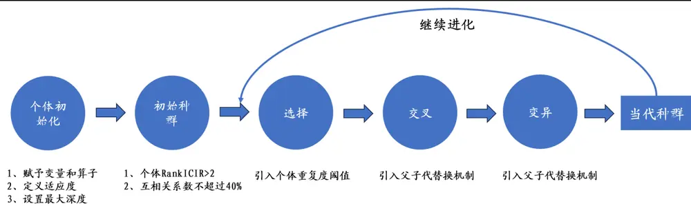
资料来源：开源证券研究所

通过1 轮 10 代的挖掘，我们得到了 Alpha185，等权合成后的 10 分组回测如图2 所示。从 2017 年 1 月至 2024 年 4 月，合成因子 RankIC 为 12.14%，RankICIR 为4.45，多空年化收益为34.79%，信息比率为3.16。从2022年 6月份以来，样本外表现也较为优异。

图2：开源金工遗传算法 Alpha185因子合成后 10分组表现较为优异
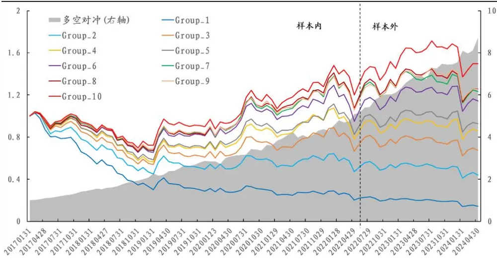
数据来源：Wind、开源证券研究所

## 2、 基于 LSTM框架应用一：因子挖掘

基于 LSTM 框架的因子挖掘，为本文主要讨论的部分，具体流程可以表示为图3 所示。该流程主要可以分为：1、输入层数据及其预处理；2、主体模型 LSTM 的搭建；3、财务数据的并入；4、输出层因子个数的修改。

图3：开源金工特色LSTM因子挖掘整体流程
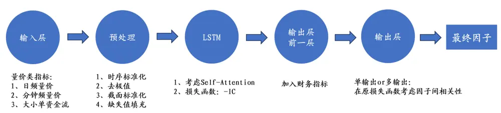
资料来源：开源证券研究所

## 2.1、 输入层数据：3大类变量

对于初始输入层数据而言，我们选取了 3大类变量，第一大类为大小单资金流，包含全部和主动的超大单、大单、中单、小单；第二大类为日内分钟特征，基本统计指标如分钟收益波动等，除此之外我们也加入了一些衍生特色指标，比如分钟极端收益、分钟聪明度等；第三大类为日间特征，包含基本统计指标如高、开、低、收等。对于这三大类变量而言，我们都对其先后进行了：时序标准化、去极值、横截面标准化、缺失值填充。

表1：输入层3大类变量列示

| 大类 | 例子 | 说明 |
| --- | --- | --- |
| 日频量价 | 基本行情指标 | 高、开、低、收等 |
| 分钟频量价 | 基本统计指标 | 分钟收益波动、分钟标准化成交量波动、分钟量价相关性等 |
|  | 衍生统计指标 | 分钟极端收益、分钟聪明度等 |
| 大小单资金流 | 全部资金流 | 含有超大单、大单、中单、小单 |
|  | 主动资金流 | 含有超大单、大单、中单、小单 |

资料来源：开源证券研究所

## 2.2、 主体模型：LSTM

对于时序数据处理任务而言，LSTM 为较为常用的模型，本篇报告也将基于此模型进行因子的挖掘。在训练 LSTM 模型时会涉及到一些参数的选择，以生成月频因子为例，参数设定如下：

（1）每个样本回看天数：4 个月；

（2）滚动训练时间窗口：6年；

（3）训练集和验证集比例为9：1；

（4）模型更新时点：每年年底；

（5）预测标签：未来 20天收益率；

（6）损失函数：IC 的负数；

（7）LSTM层数：2 层；

（8）自注意力机制 Self-Attention：考虑；

（9）早停机制 Early-Stopping：考虑。

结合输入层数据，并利用如上模型，在设置输出层因子数量为 1 的情况下，我们可以得到因子 $\cdot LSTM_{init}.$ 。进一步地，我们对其进行回测，在回测时剔除停牌、ST、上市不满 60天的股票，月度等权构建组合，10分组表现如图 4所示。该因子RankIC为 8.08%，RankICIR 为 3.99，10 分组多空年化收益 30.16%，收益波动比为 3.37，已经具备较为优异的选股效果，但多头端的分层效果较为一般，为量价类因子普遍的劣势。进一步地，我们引入财务数据去改善该因子。

图4：LSTM 因子 10分组表现较为优异，但多头端分组效果一般
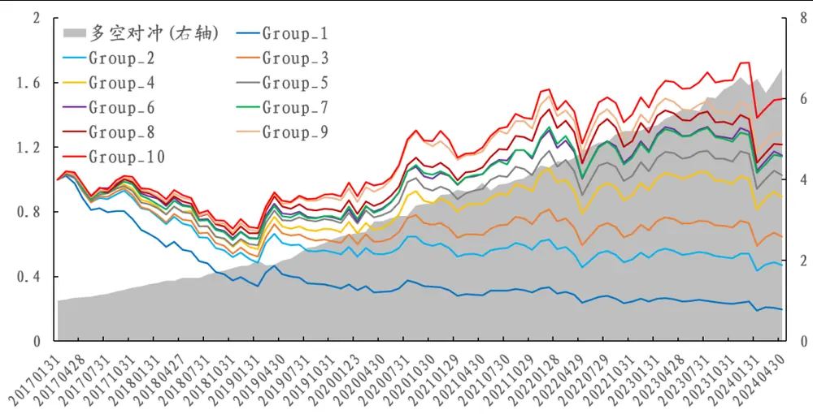
数据来源：Wind、开源证券研究所

## 2.3、 输出层前一层：加入财务数据

对于财务数据而言，考虑到其时序变化较慢，我们并没有将其和日度变化的量价类指标一起作为初始输入层数据，而是将其转化为分位点后，放入输出层前一层，和量价类指标通过隐藏层后的神经元进行拼接，一起通过全连接层输出为最后的因子。对于财务指标的选择，我们从成长、盈利、质量、偿债能力、资本结构、周转、商誉、研发和估值 9 大分类出发，具体细分指标如表 2 所示。除此之外，对于这些财务指标，在使用时我们考虑了原始值、同比和环比。

表2：财务指标：9大类汇总

| 大类 名称 |  |  |  |  |  |
| --- | --- | --- | --- | --- | --- |
| 成长 |  | 同比增长率-经营活动产生的现金流量净额 |  |  |  |
|  |  | 单季度.归属母公司股东的净利润同比增长率 |  |  |  |
|  |  | 单季度.营业收入同比增长率 |  |  |  |
| 盈利 |  | ROIC |  |  |  |
|  |  |  |  | 单季度.销售毛利率 |  |
|  |  |  |  |  | 单季度.销售净利率 |
|  |  | 单季度.ROA |  |  |  |
|  |  | 单季度.ROE（扣除非经常损益） |  |  |  |
| 质量 |  | 单季度.经营活动产生的现金流量净额/营业收入 |  |  |  |
|  |  | 单季度.销售商品提供劳务收到的现金/营业收入 |  |  |  |
| 偿债能力 |  | 现金比率 |  |  |  |
|  |  | 流动比率 |  |  |  |
|  |  | 经营活动产生的现金流量净额/流动负债 |  |  |  |
|  |  | 速动比率 |  |  |  |
| 资本结构长期负债率 |  |  |  |  |  |
|  |  |  | 有息负债率 |  |  |
|  | 短期借款率 |  |  |  |  |
|  | 资产负债率 |  |  |  |  |
|  | 应收账款周转率 |  |  |  |  |
| 周转 | 总资产周转率 |  |  |  |  |
|  | 流动资产周转率 |  |  |  |  |
|  | 固定资产周转率 |  |  |  |  |
|  | 存货周转率 |  |  |  |  |
| 商誉 | 商誉收入比 |  |  |  |  |
| 研发 | 研发收入比 |  |  |  |  |
| 估值 | PE |  |  |  |  |
|  | PB |  |  |  |  |

资料来源：开源证券研究所

在考虑财务指标后，我们可以得到因子 $LSTM_{pro}$ ，其 10 分组表现如图 5 所示。该因子 RankIC 为 9.17%，RankICIR 为 4.49，10 分组多空年化收益 35.14%，收益波动比为 3.99，相较于 $\cdot{LSTM}_{init}$ 整体的绩效有所提升。更为重要的是，在加入财务指标后，因子整体的波动和回撤有明显减小的趋势，多头端的分层效果更为优异。

图5：加入财务后构建的因子LSTMpro的 10 分组表现：多头端改善明显
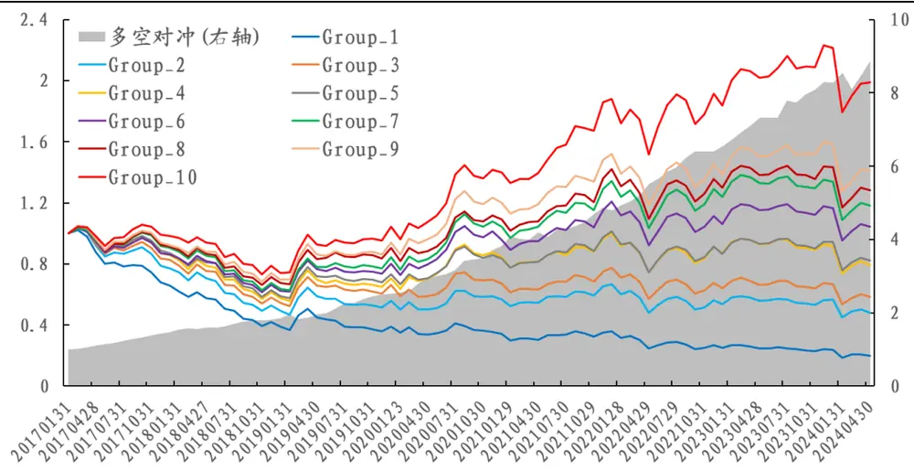
数据来源：Wind、开源证券研究所

## 2.4、 输出层：因子数量的讨论

对于输入层而言，我们放入了 3 大类变量。对于不同变量如何拟合因子而言，目前常用的思路即分开拟合，最后将不同类的再合成，但是这种做法会缺失对不同变量间因子的捕捉。以我们人工挖掘因子的经验为例，散户羊群效应和大小单残差因子都用到了资金流数据和股价数据，如果分变量去拟合模型，这类因子或较难进行挖掘。但是如果把三大类变量都混在一起，可能不能充分挖掘每一大类变量内的alpha 信息。这里我们采取的做法为：3大类变量一起输入模型，但是在输出的时候，并不是输出单一的因子，而是输出 3 个尽可能低相关的因子。实现这一操作的核心步骤即：在原始损失函数的基础上加上多因子间的相关性惩罚。

通过如上做法，输出的3个因子绩效如表3 所示，RankICIR皆在3以上的水平。

进一步地，我们将这 3个因子进行等权合成，并命名为 $LSTM_{pro\_multi}$ ，其10分组回测如图 6 所示。其 RankIC 为 8.94%，RankICIR 为 4.27，多空年化收益 34.11%，收益波动比为 4.07。通过绩效我们可以发现：相较于 $LSTM_{pro}$ 而言，RankIC 和 RankICIR有所下降，但多空对冲的收益波动比有所提升。这里需要说明的是，多输出的 3 个因子互相关性为 45.93%，并没有特别低，原因在于为了保证因子的选股效果以及降低训练成本，因子间相关性惩罚系数并没有调太高。

表3：多输出的三个因子绩效：RankICIR皆在3以上

|  | RankIC | RankICIR | 多空对冲 |  |  |  | 多头-各组均值 |  |  |  |
| --- | --- | --- | --- | --- | --- | --- | --- | --- | --- | --- |
|  |  |  | 年化收益 | 信息比率 | 最大回撤 | 胜率 | 年化收益 | 信息比率 | 最大回撤 | 胜率 |
| 多输出-因子1 | 7.48% | 3.49 | 29.57% | 3.46 | 4.72% | 86.21% | 9.92% | 2.38 | 2.80% | 80.46% |
| 多输出-因子2 | 6.53% | 3.18 | 25.30% | 3.03 | 4.27% | 83.91% | 6.82% | 1.72 | 3.21% | 77.01% |
| 多输出-因子3 | 7.17% | 3.90 | 24.07% | 3.09 | 4.52% | 83.91% | 9.08% | 2.49 | 1.90% | 80.46% |

数据来源：Wind、开源证券研究所（统计区间：20170101-20240430）

图6：多输出 $LSTM_{pro\_multi}$ 的 10分组对冲：相较于 $LSTM_{pro}$ 而言，收益波动比提升
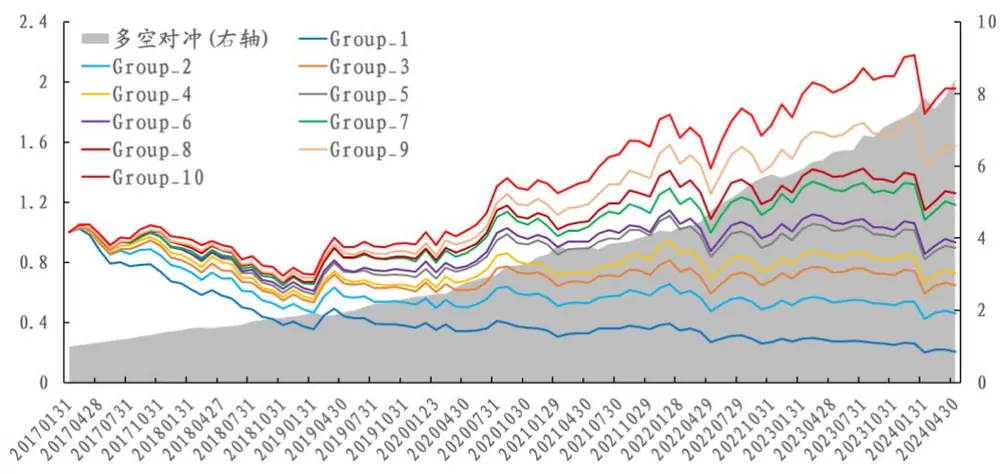
数据来源：Wind、开源证券研究所

## 2.5、 LSTM因子挖掘绩效汇总

截至此处，我们已经将 LSTM 因子挖掘从输入端至输出端介绍完毕，具体因子绩效对比如表4所示。从表中我们可以发现： $LSTM_{pro}$ 和模型 $LSTM_{pro\_multi}$ 的绩效明显优于 $.LSTM_{init}$ ，无论是 RankIC、多空对冲还是多头维度，说明相较于只使用量价类数据，财务数据的加入有一定程度的提升，尤其是多头端。而对 $\mathtt{ELSTM}_{pro}$ 和$LSTM_{pro\_multi}$ ，我们发现整体差异不大，但是多输出的训练成本更高，所以这里我们使用 $LSTM_{pro}$ 作为最后的因子。

表4： $LSTM_{init}$ $LSTM_{pro}$ $LSTM_{pro\_multi}$ 绩效对比

|  | RankIC | RankICIR | 多空对冲 |  |  | 多头-各组均值 |  |  |  |
| --- | --- | --- | --- | --- | --- | --- | --- | --- | --- |
|  |  |  | 年化收益 | 信息比率 | 最大回撤 | 胜率 年化收益 | 信息比率 | 最大回撤 | 胜率 |
| $LSTM_{init}$ | 8.08% | 3.99 | 30.16% | 3.37 | 6.09% | 87.36% | 8.03% 1.92 | 4.12% | 72.41% |
| $LSTM_{pro}$ | 9.17% | 4.49 | 35.14% | 3.99 | 6.43% | 86.21% | 12.29% 3.16 | 2.76% | 89.66% |
| LSTMpro_multi | 8.94% | 4.27 | 34.11% | 4.07 | 5.32% | 90.80% | 11.98% 3.25 | 3.33% | 88.51% |

数据来源：Wind、开源证券研究所（统计区间：20170101-20240430）

## 2.6、 不同样本空间测试

进一步地，我们探讨了 $LSTM_{pro}$ 在其他样本空间中的表现。在回测时，沪深300内 3分组、中证500内 5分组、中证 1000内10分组，测试效果如表 5所示。 $LSTM_{pro}$ 在沪深 300 内多空年化收益 4.9%、信息比率 0.94，多头超额年化收益 2.98%、信息比率 1.03；在中证500内多空年化收益 14.02%、信息比率2.00，多头超额年化收益5.69%、信息比率1.50；在中证 1000内多空年化收益31.29%、信息比率3.10，多头超额年化收益12.18%、信息比率 $2.32\circ LSTM_{pro}$ 在中证1000内的表现相对更加优异。

表5： $LSTM_{pro}.$ 在沪深300、中证 500、中证 1000测试绩效：中证 1000内表现最优异

|  | 多空对冲 |  |  |  | 多头-各组均值 |  |  |  |
| --- | --- | --- | --- | --- | --- | --- | --- | --- |
|  | 年化收益 | 信息比率 | 最大回撤 | 胜率 | 年化收益 | 信息比率 | 最大回撤 | 胜率 |
| 沪深300 | 4.90% | 0.94 | 8.00% | 59.77% | 2.98% | 1.03 | 3.00% | 57.47% |
| 中证500 | 14.02% | 2.00 | 5.72% | 72.41% | 5.69% | 1.50 | 3.56% | 72.41% |
| 中证 1000 | 31.29% | 3.10 | 7.14% | 78.16% | 12.18% | 2.32 | 3.49% | 79.31% |

数据来源：Wind、开源证券研究所（统计区间：20170101-20240430）

接着，我们将 $LSTM_{pro}$ 因子应用在 1000 指数增强上，整体的表现如图 7 和表 6所示。其中对于指增的约束条件，我们规定如下所示：（1）组合换手率约束上限为50%；（2）个股权重超额基准上下限不超过1%；（3）风格因子暴露上下限不超过2%；（4）行业暴露上下限不超过1%；（5）不低于80%成分股约束。

从 2019年1月至2024年4 月，超额年化收益15.74%，所有年份都录得了正超额。2024 年以来，深度学习因子表现一般，但截至 4 月 30 日，1000 指增也录得正超额。

图7：深度学习因子 $\cdot LSTM_{pro}$ 的中证 1000指增净值表现较为优异
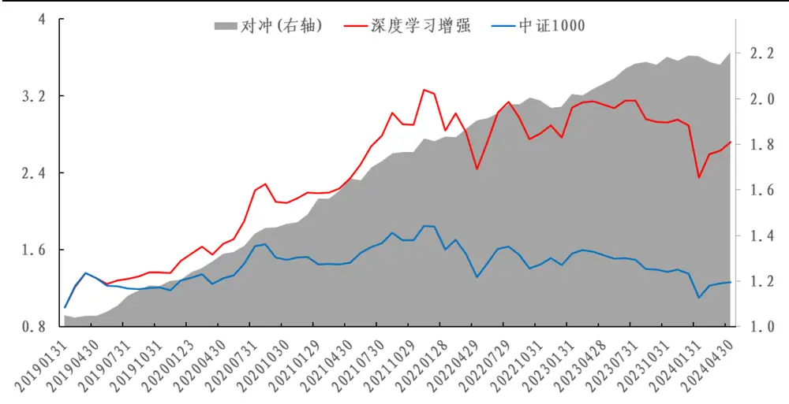
数据来源：Wind、开源证券研究所

表6：深度学习因子LSTM 的中证 1000指增超额绩效：所以年份都录得正超额

| 年化收益 | 收益波动比 | 最大回撤 | 月度胜率 |
| --- | --- | --- | --- |
| 2019 17.13% | 3.31 | 3.41% | 72.73% |
| 2020 | 24.82% 6.31 | 1.91% | 100.00% |
| 2021 | 22.26% 3.44 | 3.37% | 75.00% |
| 2022 | 8.61% 2.12 | 2.80% | 75.00% |
| 2023 | 11.69% 3.03 | 1.60% | 75.00% |
| 2024(截至4月30日） | 0.65% 0.34 | 3.01% | 25.00% |
| 全区间 | 15.74% 3.15 | 3.41% | 76.19% |

数据来源：Wind、开源证券研究所

## 2.7、 深度学习因子与人工因子、遗传算法因子的对比分析

对于因子挖掘而言，目前市场上常见的思路即人工因子、遗传算法因子和深度学习因子，截至这篇报告，开源金融工程团队在这三块皆有所部署。进一步，我们尝试对比这三大类因子的区别。

图8：人工因子、遗传算法因子、深度学习因子挖掘因子流程
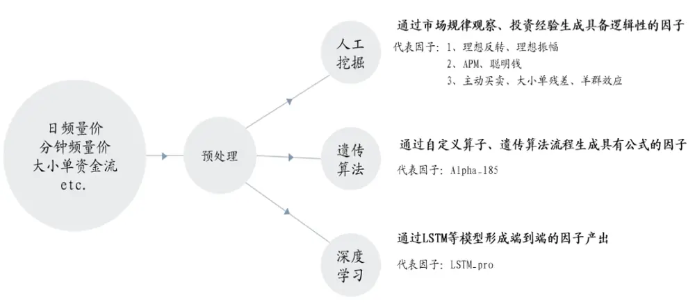
资料来源：开源证券研究所

对于人工因子而言，我们从日频量价、分钟频量价、大小单资金流三大维度出发，选取了8大因子：理想反转、APM、聪明钱、理想振幅、主动买卖、大单残差、小单残差、散户羊群效应。8大因子的等权合成综合因子RankIC为11.10%，表现较为优异，如图9所示。

对于遗传算法而言，我们选取的是在《遗传算法赋能交易行为因子》中构造的Alpha_185，RankIC 为 12.14%。

图9：人工因子 RankIC 统计：综合因子 RankIC 达到 11.1%
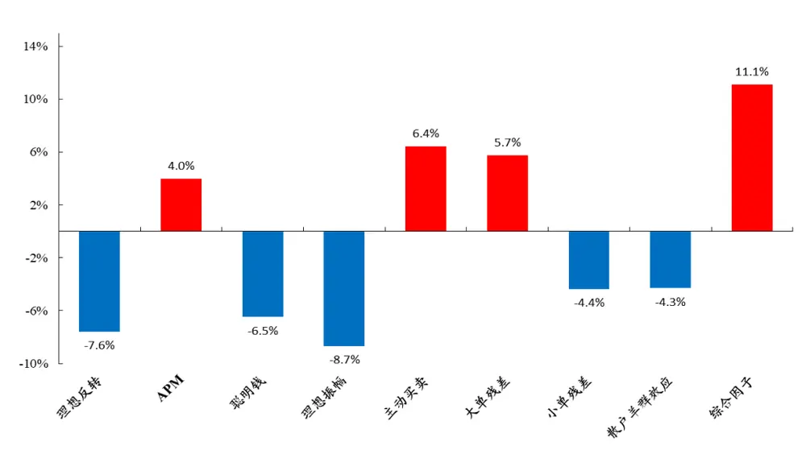
数据来源：Wind、开源证券研究所（统计区间：20170101-20240430）

三大类因子绩效对比如表7 所示。我们可以发现人工因子在RankICIR以及多空对冲上效果较为优异，深度学习因子在多头超额方面的表现较为优异。

表7：人工因子、遗传算法因子和深度学习因子绩效对比：深度学习在多头超额表现优异

|  | RankIC | RankICIR | 多空对冲 |  |  | 多头-各组均值 |  |  |  |
| --- | --- | --- | --- | --- | --- | --- | --- | --- | --- |
|  |  |  | 年化收益 | 信息比率 最大回撤 | 胜率 | 年化收益 | 信息比率 | 最大回撤 | 胜率 |
| 人工因子 | 11.10% | 4.59 | 35.78% | 4.09 | 4.84% | 82.76% | 10.55% 2.92 | 3.15% | 78.16% |
| 遗传算法 | 12.14% | 4.45 | 34.79% | 3.16 | 6.51% 79.31% | 8.29% | 1.67 | 4.31% | 71.26% |
| 深度学习 | 9.17% | 4.49 | 35.14% | 3.99 | 6.43% | 86.21% | 12.29% 3.16 | 2.76% | 89.66% |

数据来源：Wind、开源证券研究所（统计区间：20170101-20240430）

除此之外，我们测试了三大类因子在中证1000指数上的增强效果，其超额净值和绩效如图 10和表8所示。从图中我们可以发现：从全区间来看，深度学习因子表现较为优异，但是 2024年以来深度学习因子的表现略弱于其他两者。

图10：人工因子、遗传算法因子和深度学习因子的中证1000指增超额净值对比
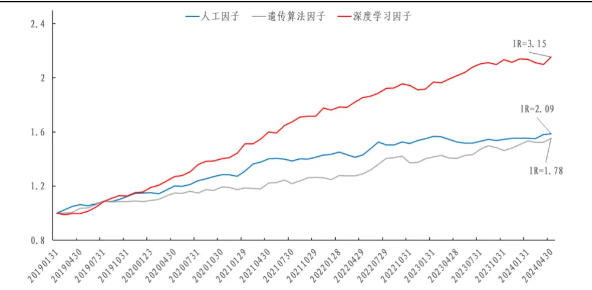
数据来源：Wind、开源证券研究所

表8：深度学习因子的中证 1000指增超额收益最高，达到了 15.74%

| 年份 | 人工因子 | 遗传算法因子 | 深度学习因子 |
| --- | --- | --- | --- |
| 2019 | 16.37% | 9.26% | 17.13% |
| 2020 | 10.75% | 8.19% | 24.82% |
| 2021 | 12.79% | 6.38% | 22.26% |
| 2022 8.11% |  | 12.33% | 8.61% |
| 2023 | 0.17% | 7.40% | 11.69% |
| 2024(截至4月30日） | 2.05% | 3.25% | 0.65% |
| 全区间 9.19% 8.77% |  |  | 15.74% |

数据来源：Wind、开源证券研究所（注：颜色深浅按行标记，收益越高颜色越深）

## 3、 基于 LSTM框架应用二：因子改进

如果单纯从因子本身出发，不结合因子择时的范畴，常见的因子改进方法即进行公式的变形和变量的替换。在公式的变形中，我们在《聪明钱因子模型的 2.0版本》中发现：不同的 S 指标的构造方式，将产生不同的聪明钱划分结果，对因子最后的绩效有显著影响。在变量的替换中，我们在《APM因子模型的进阶版》中发现：相较于使用日内第 1 小时收益，使用隔夜收益的效果更好。本文我们以理想反转为例进行小篇幅展开，尝试使用 LSTM 对其进行改进，具体的做法即在原损失函数的基础上考虑与待改进因子的相关系数。

对于原始理想反转而言，其具体的构造方式为表 9 所示，10 分组对冲表现如图11 所示。其年化收益23.37%，收益波动比为 2.84，多头超额年化收益为 4.61%，多头超额信息比率为 1.44。

我们在《A 股反转之力的微观来源》中其实已经对该因子进行了一定程度的改进，核心点为：相较于使用平均单笔成交金额去切割，使用逐笔成交金额分布的高分位去切割效果更好。但是这种改进方式也引入了更高频的逐笔数据。这里我们尝试的是：能否依旧使用常见的日度数据，结合 LSTM 框架自动学习变量间的组合方式，从而达到更好的效果。

表9：原始理想反转构造步骤

| 原始理想反转构造步骤详情 |  |
| --- | --- |
| 步骤1 | 对选定股票S，回溯取其过去20日的数据； |
| 步骤2 | 计算股票S每日的平均单笔成交金额（成交金额/成交笔数） |
| 步骤3 | 单笔成交金额高的10个交易日，涨跌幅加总，记作M_high |
| 步骤4 | 单笔成交金额低的10个交易日，涨跌幅加总，记作M_low |
| 步骤5 | 理想反转因子 M=M high-M_low |
| 步骤6 | 对所有股票，都进行以上操作，计算各自的理想反转因子M |

资料来源：开源证券研究所

图11：原始理想反转因子 10分组多空对冲收益波动比为 2.84
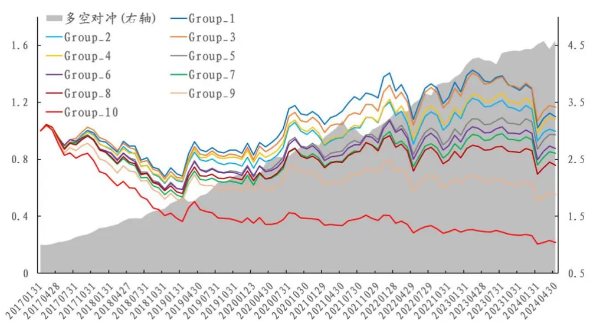
数据来源：Wind、开源证券研究所

在使用LSTM框架对理想反转因子改进的过程中，输入变量依旧是三大类变量：日频量价、分钟频量价、大小单资金流，对于损失函数而言，我们不仅考虑了挖掘出因子的选股能力，还考虑了其与原始理想反转的相关性。改进理想反转因子与原始理想反转因子相关性为 52.85%，RankIC 为-9.03%，RankICIR 为-4.13，明显优于原始理想反转。除此之外，在多空对冲和多头超额的收益率上，改进理想反转也明显更高，但是信息比率并无明显跑赢。

图12：相较于原始理想反转，改进理想反转多空对冲净值显著更高
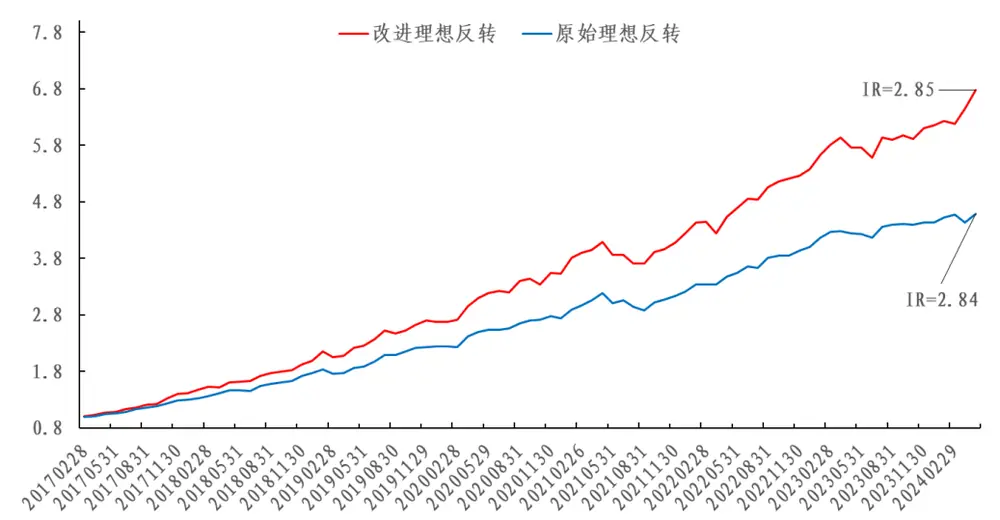
数据来源：Wind、开源证券研究所

表10：相较于原始理想反转，改进理想反转 RankIC 明显更高，多空对冲和多头年化收益也更高

|  | RankIC | RankICIR | 多空对冲 |  |  | 多头超额 |  |  |  |
| --- | --- | --- | --- | --- | --- | --- | --- | --- | --- |
|  |  |  | 年化收益 | 信息比率 最大回撤 | 胜率 | 年化收益 | 信息比率 | 最大回撤 | 胜率 |
| 原始理想反转 | -7.59% | -3.00 | 23.37% | 2.84 | 9.27% | 80.46% 4.61% | 1.44 | 6.32% | 60.92% |
| 改进后 | -9.03% | -4.13 | 30.21% | 2.85 9.52% | 79.31% | 5.04% | 1.36 | 6.16% | 67.82% |

数据来源：Wind、开源证券研究所（统计区间：20170101-20240430）

## 4、 风险提示

本报告模型基于历史数据测算，市场未来可能发生重大改变。

## 特别声明

《证券期货投资者适当性管理办法》、《证券经营机构投资者适当性管理实施指引（试行）》已于2017年7月1日起正式实施。根据上述规定，开源证券评定此研报的风险等级为R3（中风险），因此通过公共平台推送的研报其适用的投资者类别仅限定为专业投资者及风险承受能力为C3、C4、C5的普通投资者。若您并非专业投资者及风险承受能力为C3、C4、C5的普通投资者，请取消阅读，请勿收藏、接收或使用本研报中的任何信息。

因此受限于访问权限的设置，若给您造成不便，烦请见谅！感谢您给予的理解与配合。

## 分析师承诺

负责准备本报告以及撰写本报告的所有研究分析师或工作人员在此保证，本研究报告中关于任何发行商或证券所发表的观点均如实反映分析人员的个人观点。负责准备本报告的分析师获取报酬的评判因素包括研究的质量和准确性、客户的反馈、竞争性因素以及开源证券股份有限公司的整体收益。所有研究分析师或工作人员保证他们报酬的任何一部分不曾与，不与，也将不会与本报告中具体的推荐意见或观点有直接或间接的联系。

## 股票投资评级说明

|  | 评级 | 说明 |
| --- | --- | --- |
| 证券评级 | 买入（Buy） | 预计相对强于市场表现20%以上； |
|  | 增持（outperform） | 预计相对强于市场表现5%～20%； |
|  | 中性（Neutral） | 预计相对市场表现在—5%～+5%之间波动； |
|  | 减持（underperform） | 预计相对弱于市场表现5%以下。 |
| 行业评级 | 看好（overweight） | 预计行业超越整体市场表现； |
|  | 中性（Neutral） | 预计行业与整体市场表现基本持平； |
|  | 看淡（underperform） | 预计行业弱于整体市场表现。 |
| 备注：评级标准为以报告日后的6~12个月内，证券相对于市场基准指数的涨跌幅表现，其中A股基准指数为沪深300指数、港股基准指数为恒生指数、新三板基准指数为三板成指（针对协议转让标的）或三板做市指数（针对做市转让标的)、美股基准指数为标普500或纳斯达克综合指数。我们在此提醒您，不同证券研究机构采用不同的评级术语及评级标准。我们采用的是相对评级体系，表示投资的相对比重建议；投资者买入或者卖出证券的决定取决于个人的实际情况，比如当前的持仓结构以及其他需要考虑的因素。投资者应阅读整篇报告，以获取比较完整的观点与信息，不应仅仅依靠投资评级来推断结论。 |  |  |

## 分析、估值方法的局限性说明

本报告所包含的分析基于各种假设，不同假设可能导致分析结果出现重大不同。本报告采用的各种估值方法及模型均有其局限性，估值结果不保证所涉及证券能够在该价格交易。

## 法律声明

开源证券股份有限公司是经中国证监会批准设立的证券经营机构，已具备证券投资咨询业务资格。

本报告仅供开源证券股份有限公司（以下简称“本公司”）的机构或个人客户（以下简称“客户”）使用。本公司不会因接收人收到本报告而视其为客户。本报告是发送给开源证券客户的，属于商业秘密材料，只有开源证券客户才能参考或使用，如接收人并非开源证券客户，请及时退回并删除。

本报告是基于本公司认为可靠的已公开信息，但本公司不保证该等信息的准确性或完整性。本报告所载的资料、工具、意见及推测只提供给客户作参考之用，并非作为或被视为出售或购买证券或其他金融工具的邀请或向人做出邀请。本报告所载的资料、意见及推测仅反映本公司于发布本报告当日的判断，本报告所指的证券或投资标的的价格、价值及投资收入可能会波动。在不同时期，本公司可发出与本报告所载资料、意见及推测不一致的报告。客户应当考虑到本公司可能存在可能影响本报告客观性的利益冲突，不应视本报告为做出投资决策的唯一因素。本报告中所指的投资及服务可能不适合个别客户，不构成客户私人咨询建议。本公司未确保本报告充分考虑到个别客户特殊的投资目标、财务状况或需要。本公司建议客户应考虑本报告的任何意见或建议是否符合其特定状况，以及（若有必要）咨询独立投资顾问。在任何情况下，本报告中的信息或所表述的意见并不构成对任何人的投资建议。在任何情况下，本公司不对任何人因使用本报告中的任何内容所引致的任何损失负任何责任。若本报告的接收人非本公司的客户，应在基于本报告做出任何投资决定或就本报告要求任何解释前咨询独立投资顾问。

本报告可能附带其它网站的地址或超级链接，对于可能涉及的开源证券网站以外的地址或超级链接，开源证券不对其内容负责。本报告提供这些地址或超级链接的目的纯粹是为了客户使用方便，链接网站的内容不构成本报告的任何部分，客户需自行承担浏览这些网站的费用或风险。

开源证券在法律允许的情况下可参与、投资或持有本报告涉及的证券或进行证券交易，或向本报告涉及的公司提供或争取提供包括投资银行业务在内的服务或业务支持。开源证券可能与本报告涉及的公司之间存在业务关系，并无需事先或在获得业务关系后通知客户。

本报告的版权归本公司所有。本公司对本报告保留一切权利。除非另有书面显示，否则本报告中的所有材料的版权均属本公司。未经本公司事先书面授权，本报告的任何部分均不得以任何方式制作任何形式的拷贝、复印件或复制品，或再次分发给任何其他人，或以任何侵犯本公司版权的其他方式使用。所有本报告中使用的商标、服务标记及标记均为本公司的商标、服务标记及标记。

## 开源证券研究所

上海

地址：上海市浦东新区世纪大道1788号陆家嘴金控广场1号

楼10层

邮编：200120

邮箱：research@kysec.cn

北京
地址：北京市西城区西直门外大街18号金贸大厦C2座9层
邮编：100044
邮箱：research@kysec.cn

地址：深圳市福田区金田路2030号卓越世纪中心1号

邮编：518000

邮箱：research@kysec.cn

西安
地址：西安市高新区锦业路1号都市之门B座5层
邮编：710065
邮箱：research@kysec.cn