# 订单流系列：挂单方向长期记忆性的讨论与应用

2024 年 06 月 09 日

## 金融工程研究团队

魏建榕（首席分析师）

证书编号：S0790519120001

## 张 翔（分析师）

证书编号：S0790520110001

傅开波（分析师）

证书编号：S0790520090003

## 高 鹏（分析师）

证书编号：S0790520090002

## 苏俊豪（分析师）

证书编号：S0790522020001

## 胡亮勇（分析师）

证书编号：S0790522030001

## 王志豪（分析师）

证书编号：S0790522070003

## 盛少成（分析师）

证书编号：S0790523060003

## 苏 良（分析师）

证书编号：S0790523060004

## 何申昊（研究员）

证书编号：S0790122080094

## 陈 威（研究员）

证书编号：S0790123070027

## 蒋 韬（研究员）

证书编号：S0790123070037

## 相关研究报告

《订单流系列：撤单行为规律初探—市场微观结构研究系列（22）》-2024.01.24

《订单流系列：关于市场微观结构变迁的故事—市场微观结构研究系列（21）》-2023.09.19

《大小单重定标与资金流因子改进—市场微观结构研究系列（16）》-2022.09.04

# ——市场微观结构研究系列（25）

## 魏建榕（分析师）

weijianrong@kysec.cn

## 苏良（分析师）

证书编号：S0790519120001

suliang@kysec.cn

证书编号：S0790523060004

## 挂单方向长期记忆性的实证规律

（1）如何识别长期记忆性？

编码：我们将每笔买入委托的标识记作“1”，而卖出委托的标识记作“-1”，从而得到了一组连续的数值序列；定量化：通过计算序列自相关系数作为指标；

## （2）挂单方向具备长期记忆性的特征在A股普遍存在

宏观视角：无论大票、小票均存在挂单方向的长期记忆性，但我们发现在 2022年以前并不显著，并且在高低价格股票中呈现前后不一的选择偏好。

微观视角：连续竞价阶段的长期记忆性强度在 2022 年以来明显提高，并且要优于集合竞价；此外，越靠近盘口、委托数量偏小的委托，在时序中的相似度越高。

## 长期记忆的驱动因素

订单流的长期记忆性并非是由价格趋势所致，而应归因于委托的连续性。关于这一特性的成因，目前主要有两种看法：羊群效应、算法拆单。

我们从机构持仓、股东户数、因子跟踪、订单微观视角上给出我们的理解：订单流的连续性并非是由散户在时间上的拥挤行为，而是某种或者多种算法共同作用的条件下所实现的表象特征。

## Alpha 策略开发

基于对长期记忆性的规律分析，笔者基于三种计算方法开发因子，分别是：

## （1）自相关系数回归法：长期记忆强度_LMS、高维记忆_MEMO

方法核心为基于挂单方向的数值序列，计算其1至 100 阶的自相关系数，并通过对滞后阶的对数值进行回归，得到OLS 模型估计参数。

（2）基于“傅里叶变换”的频谱分析：分拆痕迹_OST

傅里叶变换、小波等方法，将原本时域（常见时序特征）信息转变为频域（由数据周期性决定的）信息，方便我们计算得到更深层的因子信号。

## （3）同类订单连续重复次数统计

长期记忆性的因子逻辑表述为：从订单流角度观察时序的相似性，若指标显著偏高，说明信息优势投资者倾向交易股票，从选股质量上提供正向的分层效果。

## 基于机器学习的特征合成：树模型、网络模型

## （1）树模型（XGBoost、Light GBM）

XGBoost样本内效果比较理想，多头超额收益显著。但是，在样本外，仅有8.6%的超额收益，胜率也从 98%降至 70%，模型泛化能力较差。Light GBM 预测因子在分组单调性上要优于XGBoost，样本外预测能力的衰减程度也相对较轻。

## （2）网络模型（LSTM）

我们在尝试LSTM的损失函数中添加负 IC 绝对值作为惩罚项后，模型得到的预测效果有明显的提升。特征合成过程需要考虑因子间的共线性，对于模型复杂度不宜过高，同时加以适当的惩罚可以避免陷入局部最优。

- 风险提示：模型基于历史数据测试，未来市场可能发生变化。

基于微观视角观察投资者的行为规律，并通过指标进行宏观监测，是研究市场微观结构的重要课题。对此，我们做了多方位的尝试与探索：单笔成交金额能够反映了市场中大资金交易者的参与度，订单执行速度变化则在某种程度上描述了高频交易行为等。而本篇将从时间序列分析的角度切入，继续讨论市场微观结构。

我们首先将聚焦于一个有意思的现象：委托的挂单方向具有长期记忆性，讨论该现象在 A 股市场的规律以及背后的形成机制；然后，笔者引入自相关系数和频谱分析等方法，构造多个选股因子来捕捉规律背后的 Alpha 信息；最后，我们从特征工程视角，初步探讨“高频+机器学习”的可实现路径，并给出针对性的解决方案。

## 1、 挂单方向长期记忆性的实证研究

## 1.1、 长期记忆性的定量刻画

Lillo 等学者（2004）曾指出，由连续委托的挂单方向组成的序列基本符合长期记忆过程的特征，即序列的自相关强度随着距离变远而减小的速度较慢，即便在间隔很长的样本之间仍保留一定的关联性。后续学者则在不同市场内检验此结论的合理性，例如，Doojin Ryu（2012）在韩国期货市场中确认该规律显著存在，Yuki Sato等（2023）则在日本股市中找寻了能够定量刻画的指标。

我们沿用前辈们的做法，将每笔买入委托的标识记作“1”，而卖出委托的标识记作“-1”，从而得到了一组连续的数值序列。图 1展示了某只股票订单流信息，以及挂单方向经数值处理后的结果。从图中不难发现，时序相邻的两笔委托之间的相似度通常比较高，包括但不限于委托方向、价格以及数量等。

图1：订单流中的每笔订单的挂单方向具有连续性

|  |  |  | 数值处理：Embedding |  |  |
| --- | --- | --- | --- | --- | --- |
| 交易所委托号 | 时间 | 委托代码 | 委托价格 | 委托数量 | 挂单方向 |
| 14071094 | 103027150 | B | 10.71 | 500 | 1 |
| 14071219 | 103027210 | S | 10.7 | 100 | -1 |
| 14071247 | 103027230 | S | 10.68 | 39100 | -1 |
| 14071277 | 103027240 | S | 10.68 | 2800 | -1 |
| 14071280 | 103027240 | S | 10.68 | 2800 | -1 |
| 14071285 | 103027240 | S | 10.68 | 3000 | -1 |
| 14071286 | 103027240 | S | 10.68 | 2700 | -1 |
| 14071287 | 103027240 | S | 10.68 | 1500 | -1 |
| 14071289 | 103027240 | S | 10.68 | 3000 | -1 |
| 14071290 | 103027240 | B | 10.68 | 100 | 1 |
| 14071376 | 103027260 | S | 10.75 | 900 | -1 |
| 14071749 | 103027410 | S | 11.18 | 5000 | -1 |
| 14071790 | 103027420 | S | 10.68 | 200 | -1 |

资料来源：Wind、开源证券研究所

针对上述现象进行定量刻画，笔者采取通用做法，利用计算自相关系数的方法描述变量的长期记忆性。为了方便讨论，我们先处理所需的数学符号，若股票单日订单数量为N，每笔订单挂单方向组成的数值序列为{X }，其中， $n=1{,}2,\cdots,N{\mathrm{。}}$ 。对于上述变量在间隔k期后的自相关程度计算如下。

自协方差：

$$
\begin{array}{r}{\gamma_{k}=Cov(X_{n},X_{n-k})=\frac{1}{N-k}\sum_{n=k+1}^{N}(x_{n}-\bar{x})(x_{n-k}-\bar{x})}\end{array}
$$

自相关系数：

$$
\rho_{k}=\gamma_{k}/\gamma_{0}
$$

其中，x̅表示数值序列 $\{X_{n}\}$ 的均值。

## 1.2、 挂单方向具备长期记忆性的特征在 A股普遍存在

## 1.2.1、 自相关系数在较长时间内显著不为零

在时间序列分析中，自相关函数（ACF）和偏自相关函数（PACF）可以用来衡量时间序列的趋势性和周期性等特征。利用深市的逐笔委托数据，我们可以测算股票挂单方向是否存在长期记忆，如图 2 所示。挂单方向的数值序列 $\{X_{n}\}$ 的 ACF 和PACF均显著不为零，两笔订单买卖方向即便间隔较长期仍具有联系，这也说明了A股的订单流中同样存在挂单方向的长期记忆性。

图2：挂单方向的ACF和PACF显著大于零
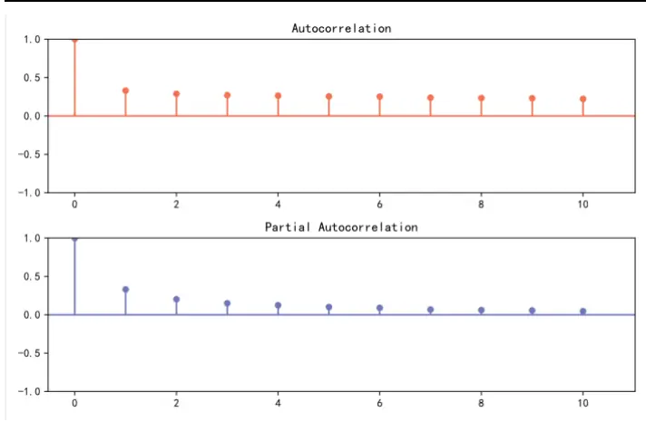
数据来源：Wind、开源证券研究所，日期截取 20240315

图3：滞后多阶的两笔委托的方向同样存在联系
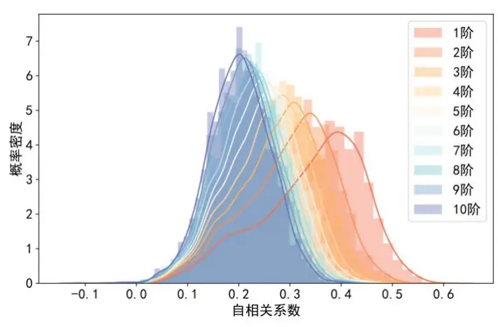
数据来源：Wind、开源证券研究所，日期截取 20240315

后续订单的挂单方向和当前方向大概率是相同的。这种在交易行为上表现出的令人疑惑的一致性，在数学上可以大致地被描述为一种近似线性的规律。

$$
\rho_{k}\propto ln(k)
$$

为了更加直观说明，笔者选取京东方 A 和五粮液两只股票作为示例，分别绘制不同滞后阶k与其对应自相关系数的散点分布。自相关系数会随k呈现不同速率的指数衰减，而将k取对数则可以一定程度避免讨论幂律函数的具体形态，并且得到一组符合线性相关特性的样本。经过处理后的结果如图4 所示。

图4：自相关系数随滞后阶数对数值的变化基本符合线性特征
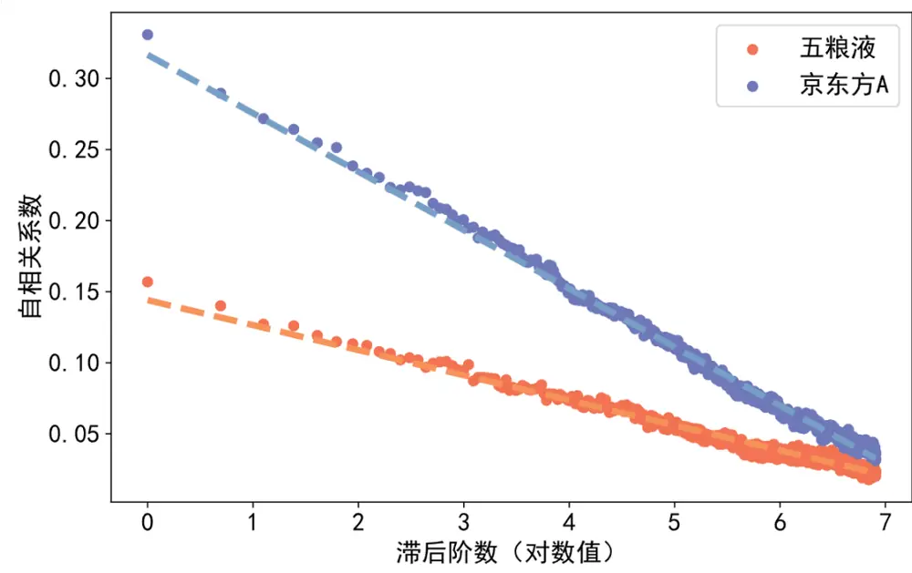
数据来源：Wind、开源证券研究所，日期截取 20240315

图 4 中呈现线性分布的散点反映了个股间两点重要的差异，一是相关系数的绝对水平（截距项），二是自相关性的衰减速率（斜率）。京东方 A 的订单间联系要强于五粮液，因为蓝色线段与Y 轴的相交值更大。

若分域讨论，我们会发现不同选股域的长期记忆性同样存在差异，沪深 300 和微盘股的自相关性绝对水平要弱于其他（表 1），说明“在A股市场中，挂单方向具有长期记忆性”的命题有约束条件。

表1：A股委托的挂单方向普遍存在长记忆性

| 指标 | 选股域 | 均值 | 标准差 | 最小值 | 25% | 50% | 75% | 最大值 |
| --- | --- | --- | --- | --- | --- | --- | --- | --- |
| 斜率 | 沪深300 | -0.032 | 0.009 | -0.054 | -0.038 | -0.032 | -0.025 | -0.011 |
|  | 中证500 | -0.034 | 0.009 | -0.059 | -0.040 | -0.033 | -0.028 | -0.012 |
|  | 中证1000 | -0.035 | 0.011 | -0.069 | -0.042 | -0.034 | -0.028 | -0.008 |
|  | 国证 2000 | -0.035 | 0.010 | -0.071 | -0.042 | -0.034 | -0.028 | -0.010 |
|  | 微盘股 | -0.025 | 0.008 | -0.052 | -0.030 | -0.024 | -0.019 | -0.003 |
| 截距项 | 沪深300 | 0.219 | 0.061 | 0.094 | 0.180 | 0.223 | 0.262 | 0.359 |
|  | 中证500 | 0.238 | 0.067 | 0.076 | 0.186 | 0.231 | 0.279 | 0.401 |
|  | 中证 1000 | 0.238 | 0.072 | 0.072 | 0.184 | 0.231 | 0.286 | 0.460 |
|  | 国证 2000 | 0.236 | 0.071 | 0.062 | 0.185 | 0.227 | 0.283 | 0.482 |
|  | 微盘股 | 0.164 | 0.055 | 0.031 | 0.122 | 0.161 | 0.191 | 0.353 |

数据来源：Wind、开源证券研究所，日期截取 20240315

至此，我们能够确定的是，无论大票、小票，沪深300 抑或中证1000均存在挂单方向的长期记忆性。虽然我们均可以使用斜率和截距项来衡量这一规律，但这两个指标相当于同一个硬币的不同面，信息相似度较高（-0.9以上），我们只选取截距项作为分析指标，衡量长期记忆性的强度，后文除非需要不再提及其他。

在高频特征分析中，我们通常不能忽视在指标在时序上的变化。投资者行为演变使得不同时期的市场微观结构存在较大差异，在《订单流系列：关于市场微观结构变迁的故事》报告中，笔者曾引出一个观点：自2018年以来，大量机构类型的交易者涌入并逐渐成为市场交易的主体，例如挂单金额、交易速度等高频特征也会因此而发生改变。我们做一则最为基础的假设，订单流的长期记忆性的根本来源是投资者某种特殊的交易行为。因此，该规律势必在不同时间上也会呈现差异性。

## 1.2.2、 宏观视角：长期记忆性在2022年以前特征并不显著

为了验证我们的猜想，笔者分别选取市值（总市值）和流动性（换手率）作为工具变量，在每个交易日内将所有股票等分成20组，然后分别统计每组的截距项的均值，观察其单调性在时序上呈现的规律，结果如图5 和图 6所示。

图5：在市值分组下截距项随时间变化
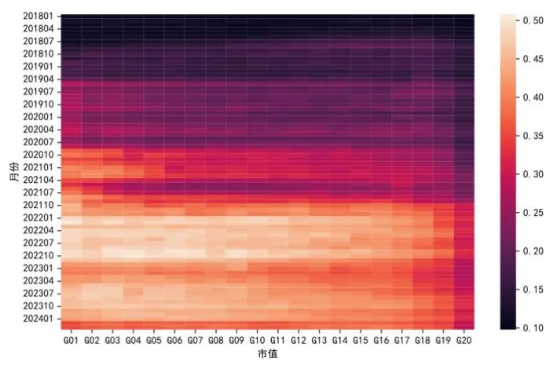
数据来源：Wind、开源证券研究所

图6：在换手率分组下截距项随时间变化
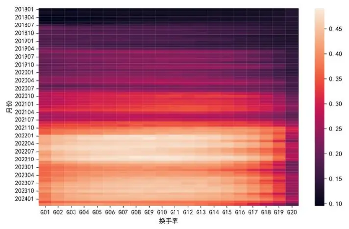
数据来源：Wind、开源证券研究所

无论在市值还是流动性分组下，我们均能够看到较为明显的分界带：在2021年底前后，挂单方向的长期记忆强度差异较大，前一阶段均值为 0.2，而后一阶段则可以达到0.4以上。推时序角度如此，而从截面相关性来看，自相关性在市值和换手率上的单调性规律不明显，因而该特征可能不会主动暴露常规风格。

该现象是否与股票的特殊状态有关？于是，我们分别统计了如 ST、盘中涨跌停触板、新股等样本，在长期记忆强度上并没有明显偏高。造成订单流出现时序上相似性的原因并非是一些常见的哑变量。

图7：特殊的股票样本并非是长期记忆性的主要贡献力量
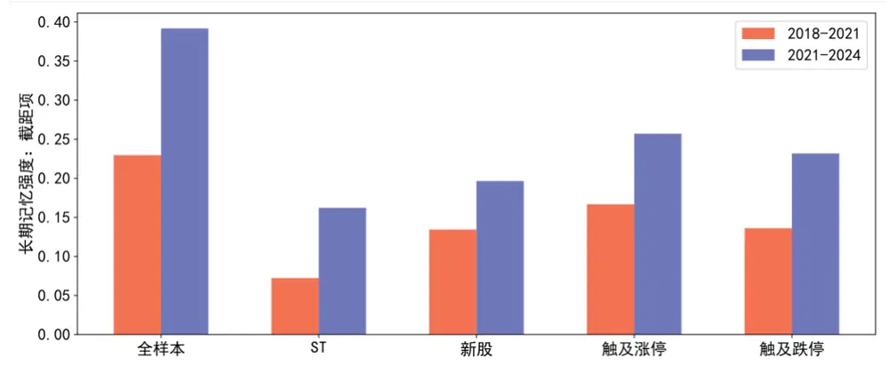
数据来源：Wind、开源证券研究所

除了市值和流动性上的差异，我们还发现在高价股与低价股间，上述变化呈现出了前后不一的“偏好”。图8 展示了以股票价格分组，不同样本的长期记忆强度随价格变化趋势。在2018年至2021 年期间，高价股似乎更受青睐，但 2022年以来的分组单调性则出现相反的情况。

图8：高、低股价的强度分布重心前后不一致
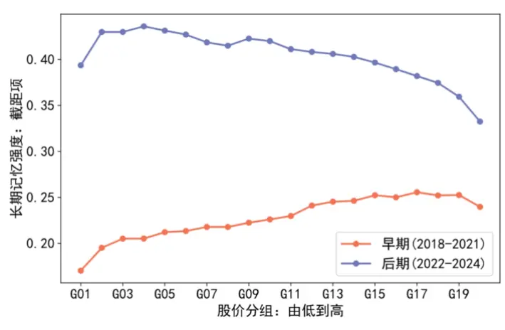
数据来源：Wind、开源证券研究所

图9：高价股“偏好”的转变大致发生在2021年底
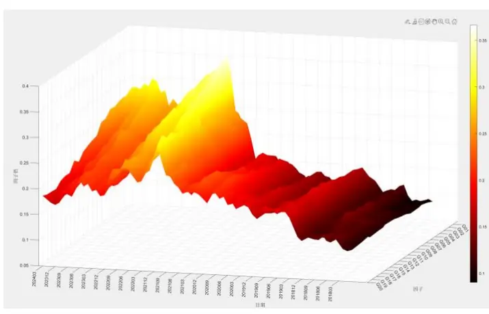
数据来源：Wind、开源证券研究所

高价股与低价股属于是市场上一种风格。其中，在“机构抱团”的行情下，高价股与基金重仓股间具有很高的相似度，而在 2021 年至 2024 年初期间，整体风格偏向市值下沉。在小市值股票逐渐占优的过程中，导致长期记忆性的交易行为也开始逐渐将重心转移至非抱团股，这也是过去一段时间的变化方向。

## 1.2.3、 微观视角：小额、价优的委托是导致长期记忆性的具象

我们从两个角度来研究不同样本的挂单方向的长期记忆性，分别是变化规律和预测能力。一般观察订单流中每笔委托的差异性，考虑的角度有：交易时段、下单量、下单位置等等。笔者为了继续探究长期记忆性的规律，从微观角度对订单流的样本进行分类。此处仅展示具有显著性的特征，关于其预测能力部分不做展开，读者可自行跳跃至第2章阅读。

## （1）交易时段

我们将完整的交易时间段划分为 6 段，分别是早、尾盘的集合竞价阶段以及盘中 4个小时的连续竞价阶段。

图10：连续竞价阶段长期记忆性有明显增强
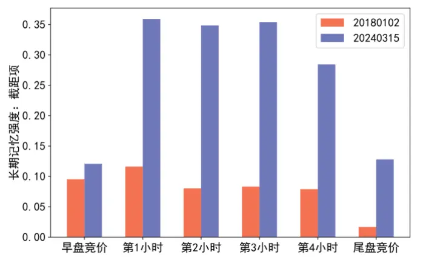
数据来源：Wind、开源证券研究所

图11：自相关系数回归模型的 P值分布：开盘最强
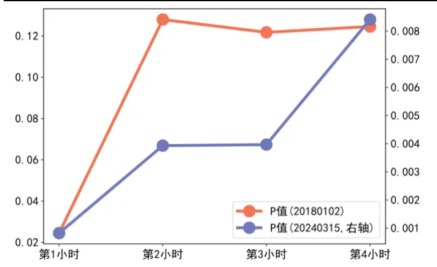
数据来源：Wind、开源证券研究所

图 10展示了这几个不同时段长期记忆强度的水平差异。对比 2018年与2024年

的两个交易日的不同，我们发现在连续竞价的订单相似性有了明显的提升，说明这一现象背后的交易行为变化大概率发生在盘中。

## （2）委托价格&委托数量

图 12 和图 13 展示了长期记忆强度随价格和数量的变化情况。笔者分别按照委托价格或者委托数量由小到大排序，将价格（数量）较大（小）的部分样本筛选出来计算长期记忆性的强度。

图12：价优委托的长期记忆性强度更高
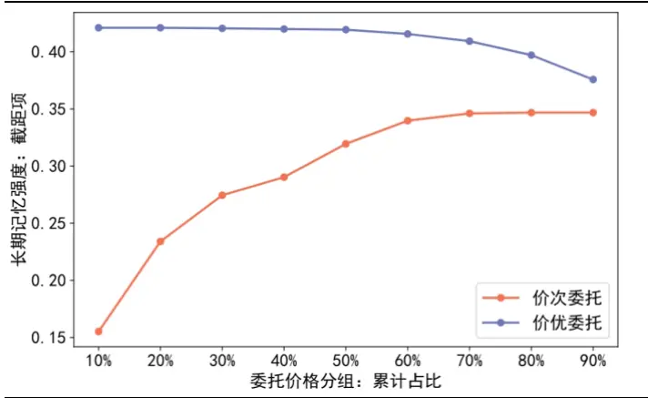
数据来源：Wind、开源证券研究所

图13：小额委托的长期记忆性强度更高
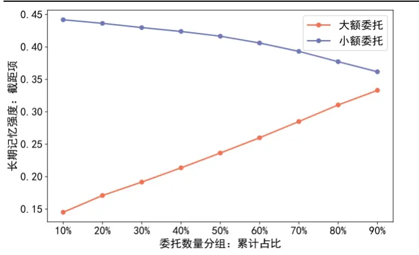
数据来源：Wind、开源证券研究所

委托价格较为接近盘口的订单（价优委托）以及委托数量较小的订单（小额委托）在时序上的相似性较高，说明这一交易的目的是为了快速成交，而非从干扰订单簿的角度，并且小额的订单受到流动性的局限更小。

## 1.3、 长期记忆性驱动因素分析

订单流的长期记忆性并非是由价格趋势所致，而应归因于委托的连续性。我们假定买卖委托的发生是随机的，并以不同订单发生的概率作为条件模拟实际的订单流序列。图X 分别展示了在上涨 $(P_{b}=0.8,P_{s}=0.2)$ 、震荡 $(P_{b}=0.5,P_{s}=0.5)$ 和下跌$(P_{b}=0.2,P_{s}=0.8)$ 三种行情下，自相关系数随着滞后阶的变化趋势。

图14：相互独立的订单流不具备长期记忆性
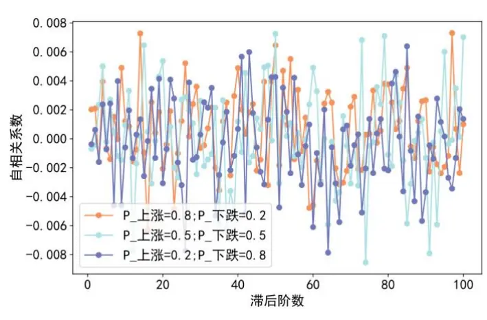
数据来源：Wind、开源证券研究所

图15：长期记忆性表现为相似订单的时序联系

| 0.18 | 0.21 | B | 0.2 | 0.23 |
| --- | --- | --- | --- | --- |
| 0.21 | 0.4 | S | 0.23 | 0.34 |
| B20240315,0 | S |  | B | S00333.SZ |
|  | 00001.SZ |  | 20240315,0 |  |
| 0.25 | 0.21 | B | 0.37 | 0.19 |
| 0.21 | 0.32 | S | 0.19 | 0.26 |
| B | S |  | B | S |

数据来源：Wind、开源证券研究所，日期截取 20240315

由此可见，即便是价格呈现趋势性致使挂单方向偏向某一侧，同样无法得到具有较高自相关性的订单序列。图14 的概率转移矩阵说明了是订单之间的连续性导致了长期记忆。而关于订单连续性的成因，目前主要有两种较为成熟的解释：

## （1）羊群效应（Herding）

在一个投资群体中，单个投资者总是会观察群体的行为而采取行动，在他人买入时买入，在他人卖出时卖出。当突然出现有指向性的委托时，部分投资者观测到后会认为股价会自此进一步上涨或下跌，从而选择跟随买入或者卖出，导致订单流在方向上存在长期记忆性的规律。

## （2）算法拆单（Order-splitting）

“拆单”被认为是一种用以降低成本的交易策略。部分投资者在下单交易时会将金额较大的一笔订单（Metaorder）拆成若干相同方向的子订单，并且在未来一段时间内完成这些交易。由于这是同一个投资主体的行为，所以在时序上往往变现为方向、价格和数量存在长期自相关。

上述观点国内外学者均有详细论证，可作为长期记忆性的理论支撑。但结合市场实际情况，笔者更倾向于认为“拆单”或是其他算法交易是导致长期记忆性的关键原因。至少在经验数据上，我们找到了如下几点证据：

证据 1：随着机构持仓比例上升，长期记忆强度呈现抛物线式变化。

证据 2：单位投资人持有市值越高，筹码相对集中，交易局促性越明显。

我们选取年报中披露的机构持仓比例，以及股东户数作为分母计算的平均持股市值作为分组指标，将全部股票样本依次分为低、中、高数值组，统计不同组内样本截至统计日期前30个交易日的平均长期记忆强度，结果如图 16所示。

图16：随着低水平的机构持仓比例上升，长期记忆性更易被观测
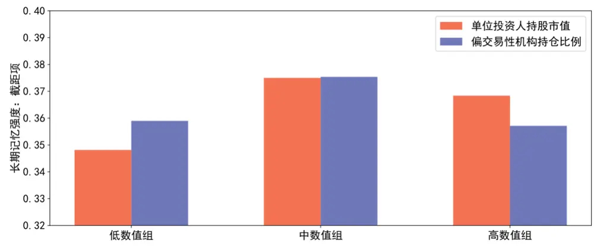
数据来源：Wind、开源证券研究所，日期截取 20231231

无论是从机构持仓视角，还是从股东户数视角来看，机构的持仓比例上升都会在一定程度上导致订单变得更加“连续”，但受限于数据无法完全及时反映的交易行为的动态影响，结论整体偏弱。在“机构重仓”的样本（高数值组）中，我们观测到数据相反的变化趋势，猜想可能原因是这部分的配置需求要优先于交易需求，导致在委托交易上的自关联现象变得相对不那么明显。

证据 3:“算法拆单”行为增强与资金流Alpha衰减趋势基本吻合。

交易行为的改变会影响微观结构因子有效性。在《大小单重定标与资金流因子改进》的报告中，我们曾对大小单的划分阈值进行讨论，得到的结论是划分机构与散户的分界线正在逐渐变得模糊，并且由于交易上普遍存在“拆单”行为，识别大单的金额标准也在下移。通过优化这一阈值得到的广义主力净流入率_CNIR因子表现优异，对冲收益率稳定在25%以上，但2022年以来整体收益不如以往。

图17：资金流Alpha弱化与长期记忆强度跃迁基本重叠
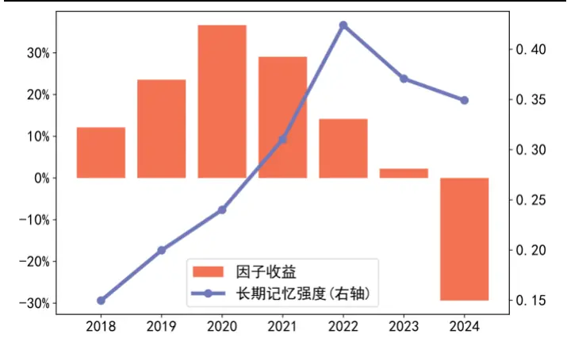
数据来源：Wind、开源证券研究所

图18：单笔挂单金额 2021年以来快速降低
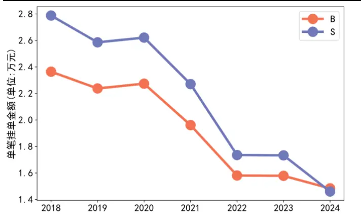
数据来源：Wind、开源证券研究所

资金流 Alpha 衰减的背后原因，我们认为是市场上微观交易行为发生了显著的变化。以挂单金额为例，图18展示了在过往几年中订单被剥得越来越细，无论是买入还是卖出委托，在 2020年至 2024年间迅速降低。截至 2024年，全市场个股平均单笔挂单金额的中位数仅在1.4万元附近，对于“大单”行为的捕捉难度增大。

证据 4：时序连续的订单金额呈现衰减特征，并且具有时点差异。

我们进一步统计同方向连续的逐笔委托挂单金额的是否由大到小依次变化，目的是找寻在“拆单”过程的交易逻辑。图 19中展示了2018 年和2024年各选取的一个交易日的数据。笔者将若干长度的委托进行对齐，分别统计第 1 笔至第 N 笔的挂单金额，结果发现在2018年的样本中，订单金额的变化整体并不连续；相反，2024年的样本却表现出递减趋势，一定程度上能说明“拆单”的行为确实隐藏在这些连续的同向委托中，并且具有主动跟随“大单”来进一步实现伪装目的的特点。

图19：2024年相比2018年，连续订单的金额衰减的现象更明显
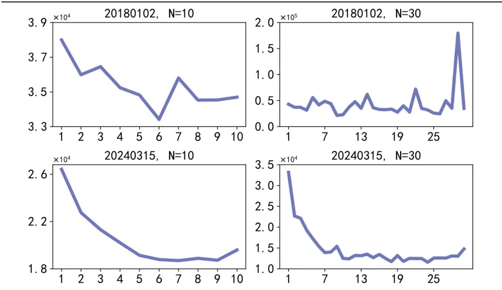
数据来源：Wind、开源证券研究所

一般而言，市场青睐算法交易的原因是其拥有有效降低交易成本、控制冲击成本、争取最优的成交价格和数量、隐藏意图等传统方法不具有的交易优势。经过多年的研究和开发，现阶段的交易算法已经相对成熟，例如，冰山算法等。

图20：交易员通过算法将原始订单拆分成若干子订单
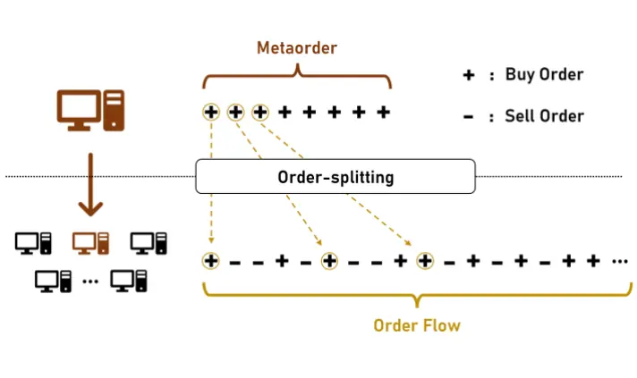
资料来源：开源证券研究所

图21：交易算法经过多年发展已渐成熟
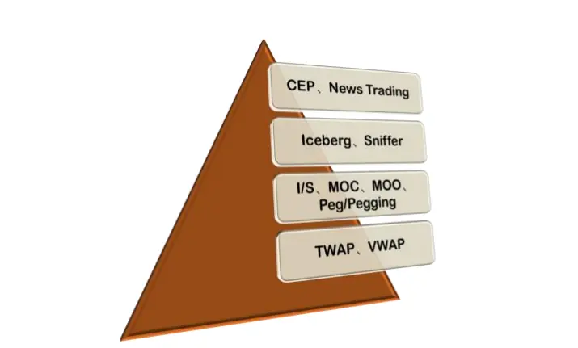
资料来源：开源证券研究所

综上所述，订单流的连续性并非是由散户在时间上的拥挤行为，而是某种或者多种算法共同作用的条件下所实现的表象特征。尽管市场环境的变化让因子策略开发面临挑战，但仍需客观来看，算法交易的存在并不会使得 Alpha 完全消失，我们希望在现有的市场环境中寻找这些特征的蛛丝马迹。

## 2、 Alpha策略：特征识别与分域讨论

基于本文第 1 章对长期记忆性的规律分析，笔者写了多个因子，但对每个因子都分别详细地介绍并不现实，此处仅展示因子的测试效果与关键结论分析。文中主要提供三种计算方法，分别是：

## （1）自相关系数回归法

方法核心为基于挂单方向的数值序列，计算其 1 至 100 阶的自相关系数，并通过对滞后阶的对数值进行回归，得到 OLS 模型估计参数。

## （2）基于“傅里叶变换”的频谱分析

傅里叶变换、小波等方法，将原本时域（常见时序特征）信息转变为频域（由数据周期性决定的）信息，方便我们计算得到更深层的因子信号。

## （3）同类订单连续重复次数统计

从相似性角度出发，我们统计不同订单连续出现的次数，例如，连续出现若干笔买入委托的情况，作为长期记忆性的刻画指标。

## 2.1、 自相关系数回归法

在时序上相邻的两笔订单的关联性可以通过相关系数来刻画，我们在1.2小节中已经观察到，随着滞后阶的对数值增大，相关系数呈现线性衰减的变化趋势。通过最小二乘回归的方法，挂单方向长期记忆性可以被描述得更加立体，如用截距项表示长期记忆行的强度以及用斜率反映其持续性等等。

我们将回归得到的截距项记为长期记忆强度因子_LMS，以其连续 20 日平滑的结果为例，该因子在 2018年至 2024年 3月期间可获得 13%的多空收益。尽管LMS在存在因子收益偏低的问题，但仍然不失为一个有效的因子（ICIR 接近 2）。

图22：长期记忆强度LMS的十分组不单调
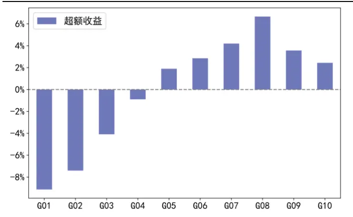
数据来源：Wind、开源证券研究所，20180102-20240318

图23：LMS与常规风格特征相关性偏低
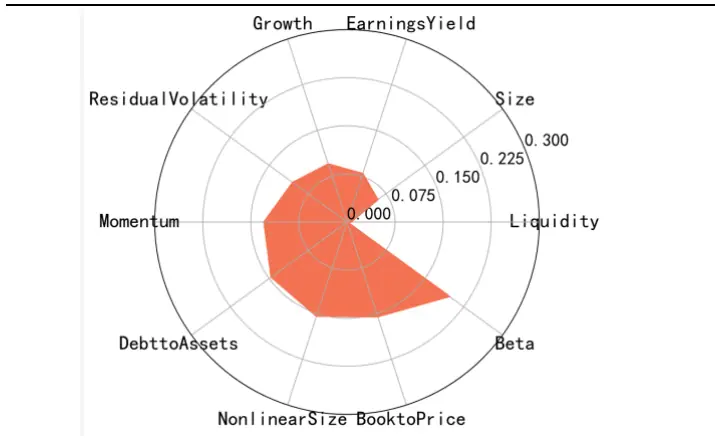
数据来源：Wind、开源证券研究所，20180102-20240318

LMS的IC 为正，从逻辑上不难解释：该因子属于刻画微观结构的指标，当在市场中采取算法交易的投资者越多，所反映机构特征也越明显。一般倾向于认为，机构投资者在优选股票的整体质地上要比散户更胜一筹，从而形成了多头与空头分组的相对差异，更本质的驱动逻辑可能是来自于两类不同交易者的信息优势。

作为一个从订单流中捕捉的高频指标，LMS 无意外地会与常规风格保持相对偏低的相关性，测算结果可见图 24。在不同选股域间该因子所表现出的差异可能归因于分域微观结构的不同。我们希望能够区分出机构或是散户为主的股票，这一逻辑似乎与按市值排序的宽基指数不谋而合，然而测试结果并非如此。

表2：长期记忆强度_LMS因子在中证 1000指数成分股范围内表现最优

| 选股域 | IC | Rank ICIR | 多头超额 | 空头超额 | 最大回撤 | 胜率 |
| --- | --- | --- | --- | --- | --- | --- |
| 沪深300 | 0.041 | 1.397 | 5.07% | 8.17% | 52.1% | 55.41% |
| 中证500 | 0.037 | 1.791 | 2.97% | 11.35% | 44.8% | 54.05% |
| 中证 1000 | 0.042 | 2.344 | 4.67% | 10.78% | 47.2% | 64.86% |
| 国证 2000 | 0.040 | 1.930 | 4.03% | 8.93% | 43.1% | 55.41% |
| 微盘股 | 0.031 | 0.663 | 7.00% | 12.43% | 49.9% | 66.22% |
| 中证全指 | 0.039 | 1.962 | 2.48% | 9.38% | 43.6% | 54.05% |

数据来源：Wind、开源证券研究所，20180102-20240318

结合图 24的相关性测算和表2 中展示因子测试的结果来看，长期记忆强度LMS因子并未主动暴露大、小市值风格，信息分布相对均匀：在沪深300中能够获取 5%以上的超额，IC 与 ICIR 未有明显的衰减迹象；在中证 1000 指数的成分股中的区分能力要略优于其他指数。这也说明 LMS因子并非描述机构持仓行为，而是从交易层面区分哪些是信息优势投资者倾向交易的股票，并非严格属于“机构重仓”范畴。

在上一章节中，我们探讨了长期记忆性的时序变化，发现在2022年前后市场微观交易行为发生了较为明显的变动。但是，在LMS因子中并没有出现时点前后明显的差异。图 24 和图 25 分别展示 LMS 因子的月度多空收益情况，以及 IC 累计值随时间变化的曲线。因子在2018年的表现偏弱，整体的稳定性相对较差。

图24：因子分年度收益统计：2018 年相对一般

| 年份 | 1月 2月 3月 |  |  | 4月 5月 |  | 6月 7月 8月 9月 |  |  |  | 10月 11月 12月 |  |  |
| --- | --- | --- | --- | --- | --- | --- | --- | --- | --- | --- | --- | --- |
| 2018 | -0.63% | 1.22% | 1.82% | -2.93% | 1.75% | -0.67% | -6.00% | -1.34% | 0.58% | 2.79% | 0.30% | 1.11% |
| 2019 | 2.55% | -3.18% | -0.12% | -1.62% | 1.32% | 0.51% | 0.24% | 0.57% | 1.78% | 1.30% | 0.39% | 1.70% |
| 2020 | 3.11% | 2.16% | 6.47% | 5.13% | 4.62% | 2.73% | 2.11% | 2.48% | -0.05% | 0.18% | -3.91% | 8.31% |
| 2021 | 6.39% | -2.34% | -2.26% | 4.84% | -2.36% | 6.19% | 1.47% | -2.03% | 2.39% | 2.03% | -1.28% | 2.40% |
| 2022 | -0.51% | -0.56% | -2.36% | 3.53% | 1.47% | 8.86% | 0.19% | 0.88% | -0.89% | -2.39% | -0.06% | -1.38% |
| 2023 | 2.58% | 1.77% | 1.48% | 7.71% | -2.52% | 1.01% | 2.14% | -3.46% | 0.96% | 0.91% | -1.01% | -0.47% |
| 2024 | 3.18% | 0.32% | 0.00% |  |  |  |  |  |  |  |  |  |

数据来源：Wind、开源证券研究所

图25：LMS 因子的 ICIR 偏低
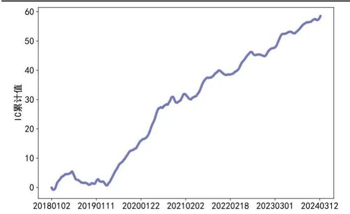
数据来源：Wind、开源证券研究所

LMS 因子的测试效果，我们认为原因在于线性回归模型可能无法很好拟合自相关系数的变化，直接基于截距项作为长期记忆性的代理特征，容易失真。因此，需要在此基础上进行改进和优化。

改进逻辑1：线性回归模型转为统计模型

如果线性模型反映自相关系数的衰减过程的准确性较差，我们可以换种思路，采用统计模型来规避对某个拟合函数的讨论。例如，我们选取 1 至 100 阶的自相关系数，计算其统计指标作为日频信号，测试结果如表 3 所示。其中，偏度和峰度因子对比改进效果最好，在原有因子的基础上增厚了多空收益的同时提高了因子稳定性，IC 达到 0.06，Rank ICIR 则均在 4 以上。

表3：偏度和峰度指标对比长期记忆强_LMS因子的改进效果更好

| 统计算子 | IC | Rank ICIR | 多头超额 | 空头超额 | 最大回撤 | 胜率 |
| --- | --- | --- | --- | --- | --- | --- |
| 均值 | -0.010 | -1.143 | -5.25% | -1.78% | 52.51% | 39.19% |
| 标准差 | 0.049 | 2.903 | 3.50% | 10.59% | 40.95% | 48.65% |
| 偏度 | 0.064 | 4.267 | 5.92% | 15.56% | 40.38% | 62.16% |
| 峰度 | 0.063 | 4.135 | 5.28% | 17.91% | 37.96% | 64.86% |
| 变异系数 | 0.041 | 2.938 | -1.63% | 12.03% | 45.59% | 45.95% |
| 10%分位差 | 0.038 | 1.986 | 1.16% | 8.59% | 42.68% | 45.95% |

数据来源：Wind、开源证券研究所

基于统计指标构造的因子的并不影响 Alpha 的逻辑表述。我们认为，算法交易属于机构类交易行为，在自相关系数分布上表现为：机构交易越多，自相关系数右侧极端值越大，但同时衰减速度也会提升，因而在分布上表现出类似“尖峰厚尾”的形态（左侧通常会被0值约束），峰度也会相应更高一些。

尽管偏度和峰度具有较高的一致性，但在具体情况下可能彼此反映的信息也会有所差异，二者相关系数为 0.75。图26展示了偏度因子和峰度因子与长期记忆强度LMS 因子的多空对冲净值。

图26：偏度、峰度因子表现要比LMS要好
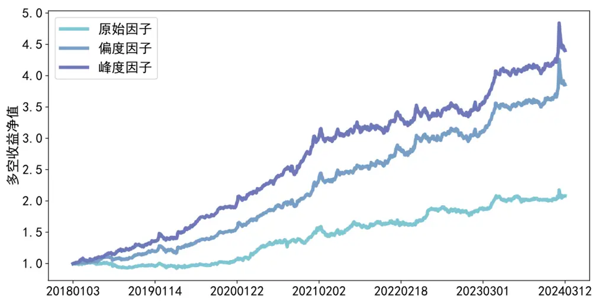
数据来源：Wind、开源证券研究所

除了改变长期记忆性的拟合模型外，我们还可以从两个方面改进。

改进逻辑2：筛选订单流样本，挑选最能反映长期记忆性的订单；

改进逻辑3：补充价格和数量的信息，增强相似订单识别的准确度。

首先，我们尝试第一种做法：筛选部分样本。表 4 展示了不同筛选子样本的作为选股因子的分组测试效果，其中表现较好的包括价优委托和小额委托。

筛选改进的逻辑点在于更加准确识别时序的自相关性，而价优、小额委托更好地表达了选股效果。不同交易时段样本选股的效果差异不明显，相对而言，可能由于盘初交易中算法交易占比更高，第1 小时的样本在线性模型中更占优（图11）。

表4：不同子样本的测试效果展示：时段差异不大，价优优于价次，小额优于大额

| 抽样算子 | IC | Rank ICIR | 多头超额 | 空头超额 | 最大回撤 | 胜率 |
| --- | --- | --- | --- | --- | --- | --- |
| 第 1 小时 | 0.050 | 2.921 | 3.31% | -9.19% | -41.18% | 55.41% |
| 第 2 小时 | 0.040 | 2.052 | 4.15% | -9.93% | -41.67% | 52.70% |
| 第3小时 | 0.041 | 2.100 | 2.36% | -9.04% | -44.06% | 52.70% |
| 第 4 小时 | 0.043 | 2.428 | 3.18% | -8.14% | -43.44% | 54.05% |
| 价优委托 | 0.039 | 2.334 | 3.55% | -10.65% | -41.15% | 52.70% |
| 价次委托 | -0.010 | -1.104 | 3.59% | -5.41% | -39.71% | 58.11% |
| 小额委托 | 0.040 | 2.502 | 3.32% | -10.72% | -42.15% | 54.05% |
| 大额委托 | 0.005 | -0.324 | -3.26% | -1.95% | -46.18% | 44.59% |

数据来源：Wind、开源证券研究所

第二种方法是基于方向调整的委托价格序列或是委托数量序列，计算并测试自相关系数的选股效果。举例来看，以截距项为例，我们将挂单方向的数值序列与委托数量相乘，得到新的序列再用于计算 1 至 100 阶的自相关系数。表 5 展示了基于复合序列的因子在全市场月度调仓的分组效果。

表5：引入价量复合的因子测试效果不理想

| 复合因子 | IC | Rank ICIR | 多头超额 | 空头超额 | 最大回撤 | 胜率 |
| --- | --- | --- | --- | --- | --- | --- |
| 峰度_数量 | 0.012 | 1.464 | 4.53% | 7.10% | 44.76% | 60.81% |
| 峰度_价格 | 0.064 | 4.143 | 5.29% | 17.99% | 38.00% | 64.86% |
| 截距项_数量 | -0.011 | -1.307 | 5.41% | 6.40% | 40.32% | 58.11% |
| 截距项_价格 | 0.039 | 1.976 | 2.38% | 9.43% | 43.62% | 54.05% |

数据来源：Wind、开源证券研究所，20180102-20240318

从测试结果来看，复合价格特征的时间序列与原有的挂单方向数值序列构造的因子相差无几，主要原因是价格在日内接近盘口位置的变化幅度有限。

图27：价量筛选逻辑有一定改进效果
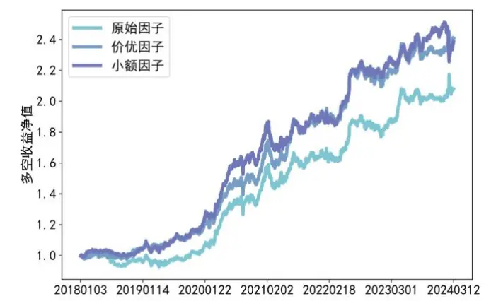
数据来源：Wind、开源证券研究所

图28：价量补充逻辑基本无效
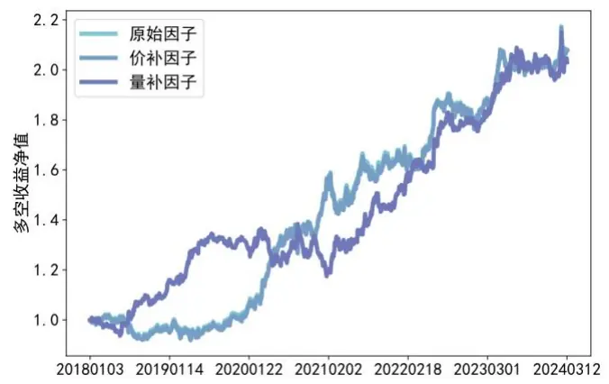
数据来源：Wind、开源证券研究所

于是根据上面改进方向的测试结论，我们利用自相关系数分布形态的统计特征构造了高维记忆_MEMO 因子。计算过程分为三步：首先，将时序样本缩短至最后半小时，然后计算订单流挂单方向滞后 1 至 100 阶的自相关系数作为统计分布，最后分别计算该分布的峰度和偏度指标，在截面上等权合成为最终信号。

图29：高维记忆MEMO因子的十分组测试结果较优
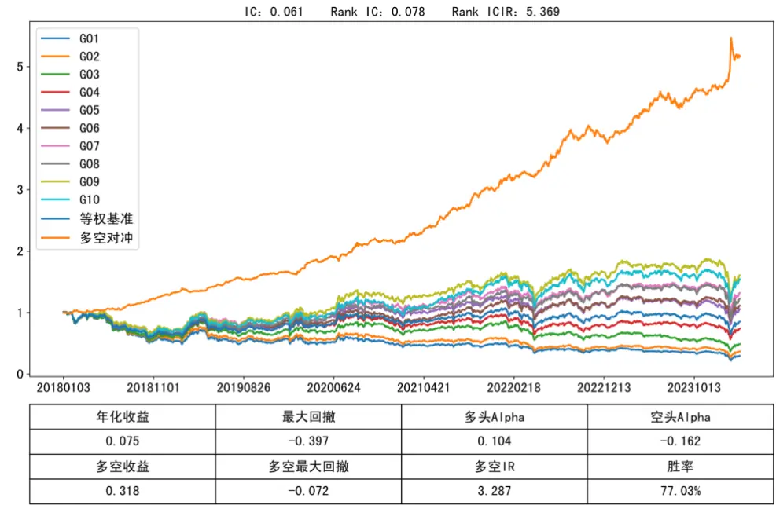
数据来源：开源证券研究所

图 29 展示了在全市场范围内，将日频信号平滑 20 个交易日后用于月频调仓的分组测试结果。从效果上看，虽然 MEMO 在多空收益分布上相对更偏空头，但多头相对等权基准的超额收益仍然可观，Rank ICIR 可以达到 5以上。

图30：MEMO的收益稳定性较高

| 年份 | 1月 | 2月 | 3月 | 4月 | 5月 | 6月 | 7月 | 8月 | 9月 | 10月 | 11月 | 12月 |
| --- | --- | --- | --- | --- | --- | --- | --- | --- | --- | --- | --- | --- |
| 2018 | 0.48% | 1.58% | -0.11% | 2.73% | 1.53% | -0.78% | 4.11% | 4.35% | 2.56% | 4.18% | 4.37% | 2.86% |
| 2019 | 5.57% | -3.39% | -0.10% | 3.76% | 3.18% | 3.22% | 4.32% | -0.83% | 1.33% | 3.62% | 0.92% | 1.39% |
| 2020 | -0.09% | -0.44% | 9.19% | 1.41% | 2.13% | 1.82% | 1.77% | 5.63% | 3.13% | 2.58% | -0.89% | 1.24% |
| 2021 | -0.93% | 3.18% | 1.17% | 5.36% | 0.59% | 5.70% | 5.49% | 1.02% | 6.87% | 1.63% | 2.50% | 4.26% |
| 2022 | 2.98% | -1.15% | 1.19% | 0.12% | 4.79% | 3.59% | 7.19% | 0.97% | 1.03% | 2.59% | -3.03% | -0.69% |
| 2023 | 2.58% | 0.63% | 5.75% | 2.37% | 3.76% | 1.28% | -2.75% | -0.37% | 3.01% | 2.08% | -0.08% | 1.51% |
| 2024 | 4.31% | 5.63% | 0.14% |  |  |  |  |  |  |  |  |  |

数据来源：Wind、开源证券研究所

图31：MEMO在流动性上暴露为 0.21
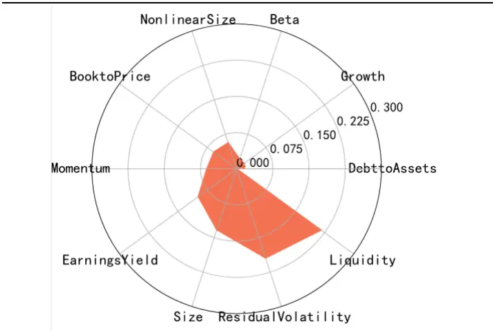
数据来源：Wind、开源证券研究所

由于采取了更为模糊的刻画方式，因子收益方面有所提升，MEMO 在相关性上也存在一定的暴露，但相对可控（高维记忆与流动性相关性最高为0.21）。

表6：MEMO因子的测试结果

| 选股域 | IC | Rank ICIR | 多头超额 | 空头超额 | 最大回撤 | 胜率 |
| --- | --- | --- | --- | --- | --- | --- |
| 沪深300 | 0.037 | 1.713 | 1.49% | -2.72% | -57.28% | 50.00% |
| 中证500 | 0.049 | 2.446 | 9.48% | -15.76% | -40.97% | 56.76% |
| 中证 1000 | 0.060 | 4.572 | 7.00% | -15.36% | -44.64% | 59.46% |
| 国证 2000 | 0.057 | 4.553 | 9.87% | -12.33% | -39.90% | 66.22% |
| 微盘股 | 0.024 | 0.941 | -1.48% | -6.78% | -50.44% | 47.30% |
| 全样本 | 0.061 | 4.795 | 10.44% | -16.19% | -39.74% | 77.03% |

数据来源：Wind、开源证券研究所

在分域表现上，MEMO在沪深 300和微盘股范围内选股效果相对较差，这与我们在高频撤单行为上观测的规律基本一致。此处，给出一般性解释：在市值较大和市值较小两端样本内，通常不容易观测到算法交易现象（图 10）。一方面，沪深300的流动性较好，节约成本型“拆单”的必要性不高，而策略型“拆单”的拥挤度也会比较高；另一方面，在微盘股的范围内，按照常规算法交易的隐蔽性太差，在盘口的交易特征也会相对稀少，两者的识别模型都容易失真。

## 2.2、 频谱分析：信号处理方法的迁移应用

任何事物在两个不同时刻都不可能保持完全相同的状态，但很多变化往往存在着一定的规律，例如 24 小时日出日落，潮起潮落，这些现象通常称为“周期”。针对时间序列的周期性检测问题，“傅里叶变换”和“自相关系数”是两种在解决实际问题中常用的方法。

我们将时间序列利用傅里叶变换提取频谱信息后，从中找到振幅较大的波，并以其振幅占比作为选股因子。但由于不同股票间委托订单数量存在差异，笔者这里按照样本数量的固定比例来选取“强波”以计算频率占比。图32 展示了在不同抽样比例下，强波占比的变化形态，大体上是一条“下凹”的曲线。

图32：强波占比的累计变化曲线表现为“下凹”
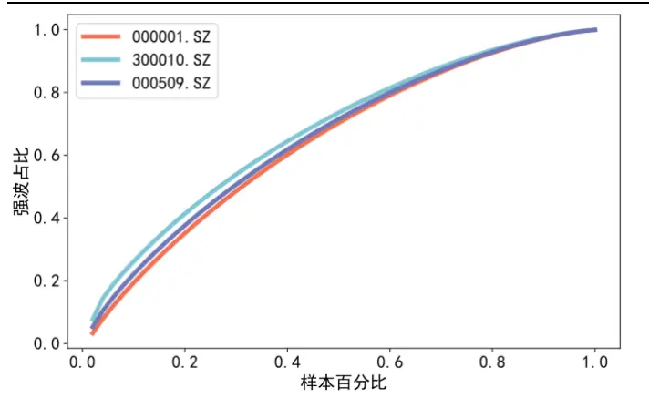
数据来源：Wind、开源证券研究所

图33：自相关系数与强波占比的散点图
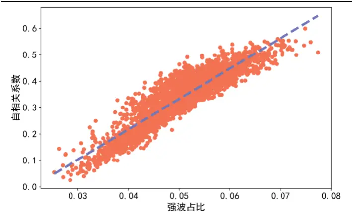
数据来源：Wind、开源证券研究所

基于上述方法可以从频域中捕获序列的周期性，但与 2.1小节的问题一样，我们很难准确刻画强波累计占比的曲线形态，因而更建议采取以下方法构造因子：

首先，利用傅里叶变换将挂单方向的时域信息转变为更容易刻画周期性的频域特征，然后再统计频域强度的峰度作为日频信号并平滑20 日作为最终因子。与前文的处理有所不同，我们通过分析不同类型委托订单的特点，发现小额委托的长期记强度在区分股票间“拆单”行为强度上更准确。因而，在因子的计算步骤中，笔者增加了一步样本筛选的处理，只选取当日委托数量较小的 50%订单用于转换频域信息，并将上述计算得到的因子命名为分拆痕迹_OST 因子。

图34：分拆痕迹_OST因子在 2022年以来表现有所增强
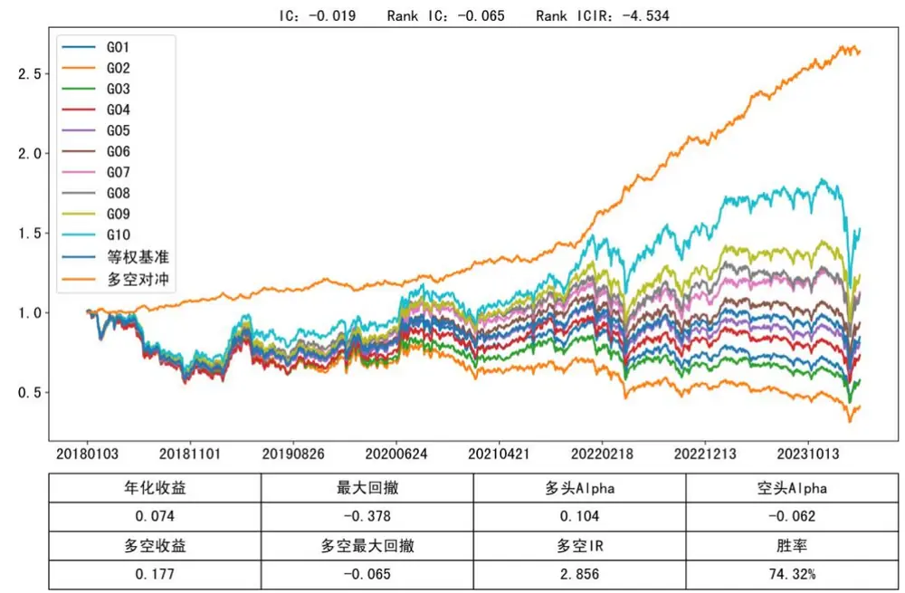
数据来源：Wind、开源证券研究所

图 34展示的OST 因子测试结果比较明显，存在有效性差异明显的时点。在 2022年以后，因子的收益提升十分显著，而这也恰好与长期记忆性强度跃迁后显著提升的时间节点非常相似，说明该因子用于捕捉跃迁后的Alpha 较为合适。

表 7为 OST因子的分域测试结果，该因子同样在位于市值分布的中间部分股票池内表现较好。全样本的多头相对等权基准的超额收益在 10%以上。

表7：OST因子在不同选股域内表现均不错

| 选股域 | IC | Rank ICIR 多头超额 | 空头超额 | 最大回撤 | 胜率 |
| --- | --- | --- | --- | --- | --- |
| 沪深 300 | -0.010 | -0.629 7.86% | -6.06% | -52.98% | 64.86% |
| 中证500 | -0.009 | -1.862 4.04% | -7.10% | -40.21% | 52.70% |
| 中证 1000 | -0.024 | -3.485 6.41% | -7.74% | -44.74% | 63.51% |
| 国证 2000 | -0.018 | -3.627 8.68% | -4.45% | -37.87% | 72.97% |
| 微盘股 | -0.016 | -1.500 8.63% | -3.84% | -47.61% | 59.46% |
| 全样本 | -0.020 | -3.973 10.38% | -6.23% | -37.80% | 74.32% |

数据来源：Wind、开源证券研究所

表 35 展示了 OST 因子的月度对冲收益。在 2022 年至 2024 年初期间，该因子收益十分稳定，但在 2024年 2 月与3月遭遇小幅度的回撤。

图35：OST因子2024年初遭遇较大回撤
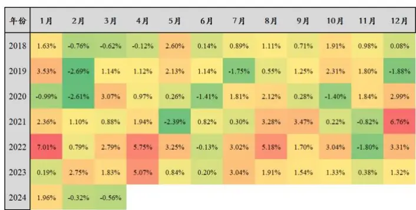
数据来源：Wind、开源证券研究所

图36：OST因子在常规风格上几乎没有暴露
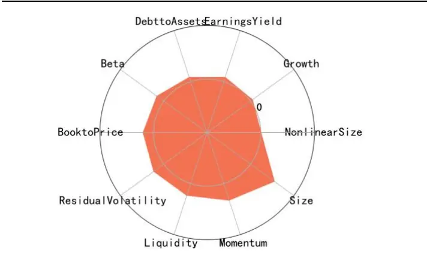
数据来源：Wind、开源证券研究所

## 2.3、 订单小岛：从交易行为中区分选股逻辑的方向

最后，我们还可以统计相似订单连续出现的次数，将连续出现的订单长度计数为一个新的序列，直观示例可以参考图 37。由于买卖订单总是交替出现，可以分别统计买入委托和卖出委托两个样本。

图37：订单小岛的编码过程
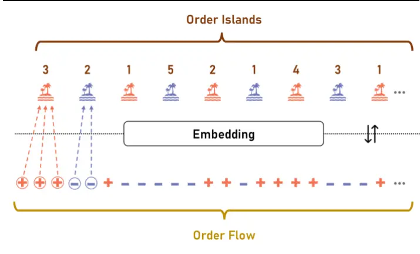
资料来源：开源证券研究所

图38：订单小岛的样本数量有明显差异
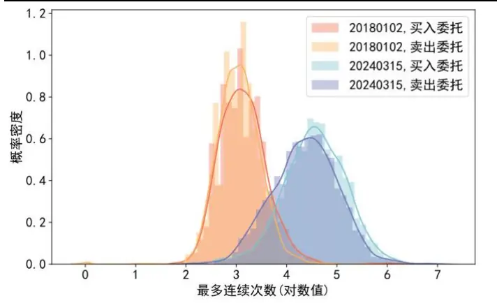
数据来源：Wind、开源证券研究所

图 38展示了2018年和 2024 年的某个交易日，全部股票买入、卖出委托连续重复出现次数的分布情况，与笔者先前测试的结论基本一致。

订单连续重复出现次数因子选股逻辑与长期记忆强度_LMS 等因子相同。表 8展示了基于这两组数据构造的因子，其中，均值和标准差因子表现优异。

表8：基于订单小岛开发因子的选股效果

| 因子 | IC | Rank ICIR 多头超额 | 空头超额 | 最大回撤 | 胜率 |
| --- | --- | --- | --- | --- | --- |
| 买入偏度 | 0.017 | 0.680 2.67% | -9.17% | -41.26% | 63.51% |
| 买入均值 | 0.051 | 3.678 4.76% | -11.92% | -42.14% | 55.41% |
| 买入峰度 | 0.004 | -0.279 -7.26% | 0.48% | -58.41% | 36.49% |
| 买入标准差 | 0.052 | 3.746 4.96% | -13.50% | -41.81% | 56.76% |
| 卖出偏度 | 0.012 | 0.498 2.53% | -8.80% | -42.03% | 63.51% |
| 卖出均值 | 0.056 | 3.524 7.19% | -11.86% | -38.44% | 63.51% |
| 卖出峰度 | 0.001 | -0.362 -6.44% | 0.09% | -55.61% | 32.43% |
| 卖出标准差 | 0.053 | 3.510 5.21% | -11.61% | -41.47% | 58.11% |

数据来源：Wind、开源证券研究所

我们倾向于认为长期记忆性是机构的交易行为，并且从交易者结构的角度解释了因子具备正向排序能力的原因。那么可以更深入讨论，在长期记忆性的特征中是否能表现出买卖的方向？笔者尝试了不同种方法寻找买卖委托的差异性，结果却不如人意，图 39展示了几种测试的结果。

图39：订单流长期记忆性的逻辑较难区分买卖方向
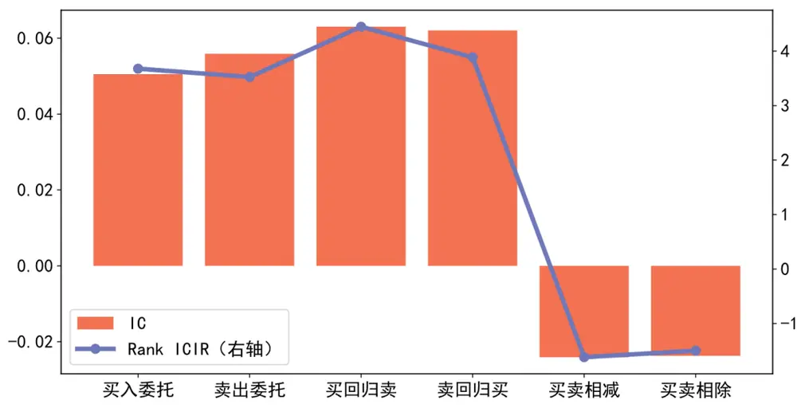
数据来源：Wind、开源证券研究所

由测试结果可知，买入和卖出之间的行为基本是一致的。“拆单”行为可能发生在买卖任何一方，所构造的指标并不是对某个知情交易者的定量描述，而是整体反映某类交易者的行为特征，也就无法给微观结构添加上买或卖的“方向”。

## 2.4、 模型赋能：提供非线性的因子收益增强

目前机器学习与人工智能在各领域广泛应用，而在高频领域中的大量数据也为模型的发展提供了丰沃的土壤。笔者尝试使用两种不同类型的机器学习模型，用于处理在量化策略开发中最基础的问题之一：特征合成。

## 2.4.1、 树模型

集成学习是一种先进的机器学习方法，集成学习通过结合多个模型的预测结果来改善整体模型的预测准确性。我们选取常用的两个梯度提升树算法：Light GBM和 XGBoost，输入模型的变量则来自笔者所写的一组因子，共计 57个有效特征。

## （1）XGBoost

我们将标签设置为未来20日的收益率，截取20180102 至 20220601的所有股票作为训练样本，考虑到模型复杂度，将树的最大深度设置为 5层。

图40：XGBoost 样本内 R2 为 0.013
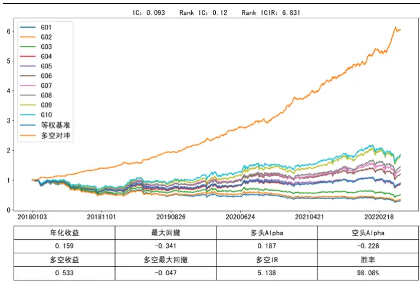
数据来源：Wind、开源证券研究所

图41：XGBoost 样本外 R2 为 0.011
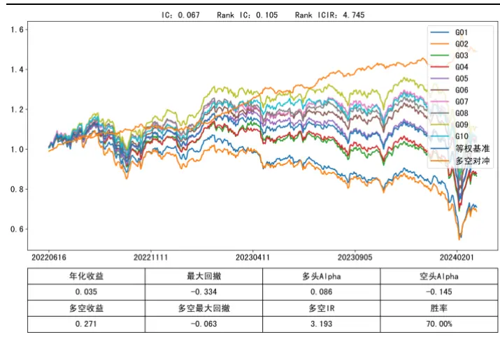
数据来源：Wind、开源证券研究所

在样本内，XGBoost 的因子收益效果比较理想，多头超额收益显著。但是，在样本外，仅有8.6%的超额收益，胜率也从 98%降至70%，模型泛化能力较差。

## （2）Light GBM

Light GBM为梯度提升树的一种高效工程版本的实现，由微软 2017年开发。相比传统的梯度提升树算法。在相同的框架下训练，我们分别样本内和样本外的回测结果（图 42和图43）。从测试结果看出，Light GBM预测因子在分组单调性上要优于 XGBoost，样本外预测能力的衰减程度也相对较轻。

图42：Light GBM 样本内 R2 为 0.015
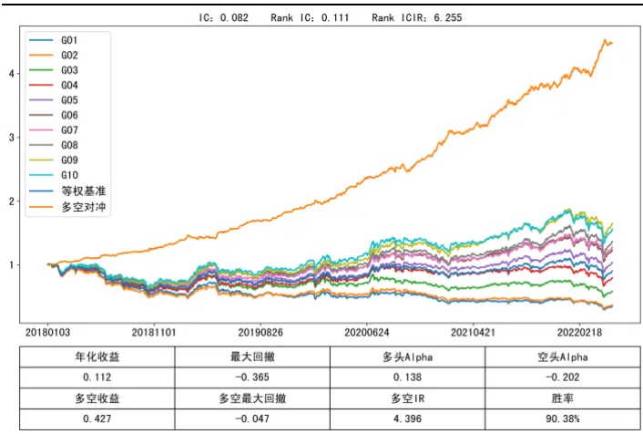
数据来源：Wind、开源证券研究所

图43：Light GBM 样本外 R2 为 0.011
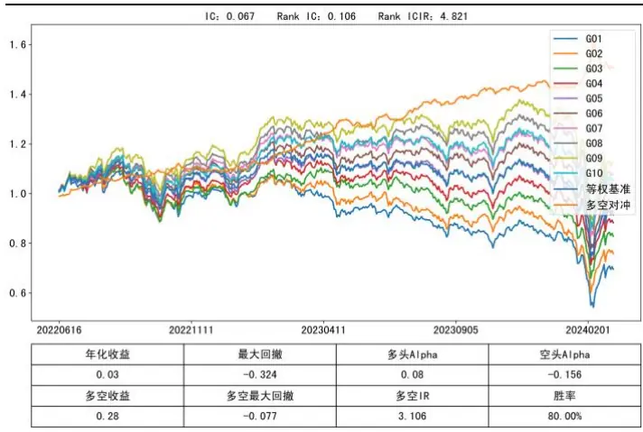
数据来源：Wind、开源证券研究所

## 2.4.2、 网络模型

考虑到“拆单”算法可能持续的时间比较长，例如大额订单通常会分拆在几天甚至几周内完成，有必要将特征的时序信息纳入到模型选择当中。长短期记忆网络（LSTM）或许是个不错的选择。该模型引入了“门”结构，通过这些门控制信息的流动，从而能够更好地捕捉和记忆长期依赖关系。

图 44为LSTM在样本外测试的结果，多头收益能力明显不足。我们检查后发现是因为 MSE 损失函数中缺少对分组单调性的约束，从而导致其在空头效果较好的特征上赋予更大的权重。于是，在尝试 LSTM的损失函数中添加负 IC 绝对值作为惩罚项后，模型得到的预测效果有明显的提升。

图44：LSTM_MSE样本外预测效果较为一般
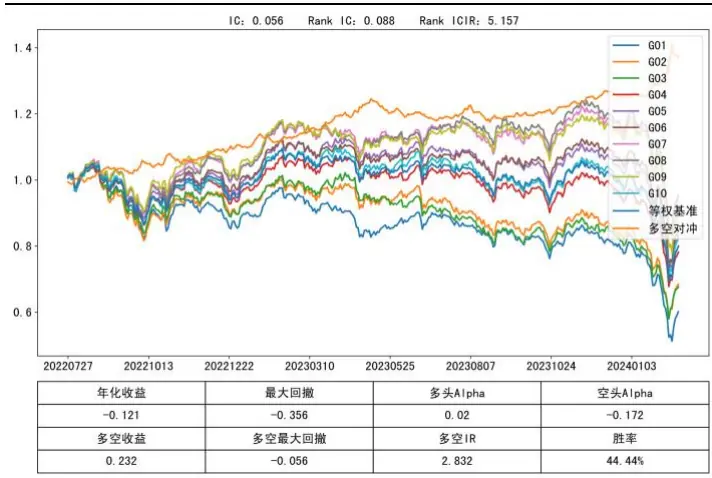
数据来源：Wind、开源证券研究所

图45：LSTM_IC样本外有明显提升
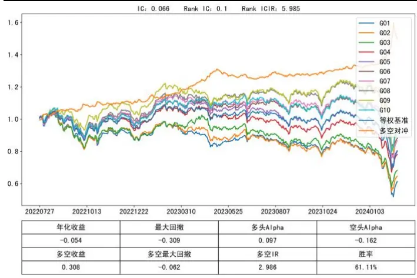
数据来源：Wind、开源证券研究所

综上测试结果，处理本文的特征效果最好的是 Light GBM，整体分组单调性较优。LSTM 在对特征合成的时候，因为涉及的特征较多，还需对回溯时序的范围进行优选，整体效果并不理想。特征合成过程需要考虑因子间的共线性，对于模型复杂度不宜过高，同时加以适当的惩罚可以避免陷入局部最优。

## 3、 风险提示

模型基于历史数据测试，未来市场可能发生变化。

## 特别声明

《证券期货投资者适当性管理办法》、《证券经营机构投资者适当性管理实施指引（试行）》已于2017年7月1日起正式实施。根据上述规定，开源证券评定此研报的风险等级为R3（中风险），因此通过公共平台推送的研报其适用的投资者类别仅限定为专业投资者及风险承受能力为C3、C4、C5的普通投资者。若您并非专业投资者及风险承受能力为C3、C4、C5的普通投资者，请取消阅读，请勿收藏、接收或使用本研报中的任何信息。

因此受限于访问权限的设置，若给您造成不便，烦请见谅！感谢您给予的理解与配合。

## 分析师承诺

负责准备本报告以及撰写本报告的所有研究分析师或工作人员在此保证，本研究报告中关于任何发行商或证券所发表的观点均如实反映分析人员的个人观点。负责准备本报告的分析师获取报酬的评判因素包括研究的质量和准确性、客户的反馈、竞争性因素以及开源证券股份有限公司的整体收益。所有研究分析师或工作人员保证他们报酬的任何一部分不曾与，不与，也将不会与本报告中具体的推荐意见或观点有直接或间接的联系。

## 股票投资评级说明

|  | 评级 | 说明 |
| --- | --- | --- |
| 证券评级 | 买入（Buy） | 预计相对强于市场表现20%以上； |
|  | 增持（outperform） | 预计相对强于市场表现5%～20%； |
|  | 中性（Neutral） | 预计相对市场表现在—5%～+5%之间波动； |
|  | 减持（underperform） | 预计相对弱于市场表现5%以下。 |
| 行业评级 | 看好（overweight） | 预计行业超越整体市场表现； |
|  | 中性（Neutral） | 预计行业与整体市场表现基本持平； |
|  | 看淡（underperform） | 预计行业弱于整体市场表现。 |
| 备注：评级标准为以报告日后的6~12个月内，证券相对于市场基准指数的涨跌幅表现，其中A股基准指数为沪深300指数、港股基准指数为恒生指数、新三板基准指数为三板成指（针对协议转让标的）或三板做市指数（针对做市转让标的)、美股基准指数为标普500或纳斯达克综合指数。我们在此提醒您，不同证券研究机构采用不同的评级术语及评级标准。我们采用的是相对评级体系，表示投资的相对比重建议；投资者买入或者卖出证券的决定取决于个人的实际情况，比如当前的持仓结构以及其他需要考虑的因素。投资者应阅读整篇报告，以获取比较完整的观点与信息，不应仅仅依靠投资评级来推断结论。 |  |  |

## 分析、估值方法的局限性说明

本报告所包含的分析基于各种假设，不同假设可能导致分析结果出现重大不同。本报告采用的各种估值方法及模型均有其局限性，估值结果不保证所涉及证券能够在该价格交易。

## 法律声明

开源证券股份有限公司是经中国证监会批准设立的证券经营机构，已具备证券投资咨询业务资格。

本报告仅供开源证券股份有限公司（以下简称“本公司”）的机构或个人客户（以下简称“客户”）使用。本公司不会因接收人收到本报告而视其为客户。本报告是发送给开源证券客户的，属于商业秘密材料，只有开源证券客户才能参考或使用，如接收人并非开源证券客户，请及时退回并删除。

本报告是基于本公司认为可靠的已公开信息，但本公司不保证该等信息的准确性或完整性。本报告所载的资料、工具、意见及推测只提供给客户作参考之用，并非作为或被视为出售或购买证券或其他金融工具的邀请或向人做出邀请。本报告所载的资料、意见及推测仅反映本公司于发布本报告当日的判断，本报告所指的证券或投资标的的价格、价值及投资收入可能会波动。在不同时期，本公司可发出与本报告所载资料、意见及推测不一致的报告。客户应当考虑到本公司可能存在可能影响本报告客观性的利益冲突，不应视本报告为做出投资决策的唯一因素。本报告中所指的投资及服务可能不适合个别客户，不构成客户私人咨询建议。本公司未确保本报告充分考虑到个别客户特殊的投资目标、财务状况或需要。本公司建议客户应考虑本报告的任何意见或建议是否符合其特定状况，以及（若有必要）咨询独立投资顾问。在任何情况下，本报告中的信息或所表述的意见并不构成对任何人的投资建议。在任何情况下，本公司不对任何人因使用本报告中的任何内容所引致的任何损失负任何责任。若本报告的接收人非本公司的客户，应在基于本报告做出任何投资决定或就本报告要求任何解释前咨询独立投资顾问。

本报告可能附带其它网站的地址或超级链接，对于可能涉及的开源证券网站以外的地址或超级链接，开源证券不对其内容负责。本报告提供这些地址或超级链接的目的纯粹是为了客户使用方便，链接网站的内容不构成本报告的任何部分，客户需自行承担浏览这些网站的费用或风险。

开源证券在法律允许的情况下可参与、投资或持有本报告涉及的证券或进行证券交易，或向本报告涉及的公司提供或争取提供包括投资银行业务在内的服务或业务支持。开源证券可能与本报告涉及的公司之间存在业务关系，并无需事先或在获得业务关系后通知客户。

本报告的版权归本公司所有。本公司对本报告保留一切权利。除非另有书面显示，否则本报告中的所有材料的版权均属本公司。未经本公司事先书面授权，本报告的任何部分均不得以任何方式制作任何形式的拷贝、复印件或复制品，或再次分发给任何其他人，或以任何侵犯本公司版权的其他方式使用。所有本报告中使用的商标、服务标记及标记均为本公司的商标、服务标记及标记。

## 开源证券研究所

上海

地址：上海市浦东新区世纪大道1788号陆家嘴金控广场1号

楼10层

邮编：200120

邮箱：research@kysec.cn

北京
地址：北京市西城区西直门外大街18号金贸大厦C2座9层
邮编：100044
邮箱：research@kysec.cn

深圳

楼45层

地址：深圳市福田区金田路2030号卓越世纪中心1号

邮编：518000

邮箱：research@kysec.cn

西安

地址：西安市高新区锦业路1号都市之门B座5层

邮编：710065

邮箱：research@kysec.cn