# 资金流与交易行为：因子失效的原因与讨论

2024 年 12 月 31 日

## 金融工程研究团队

魏建榕（首席分析师）

证书编号：S0790519120001

张 翔（分析师）

证书编号：S0790520110001

## 傅开波（分析师）

证书编号：S0790520090003

## 高 鹏（分析师）

证书编号：S0790520090002

## 苏俊豪（分析师）

证书编号：S0790522020001

## 胡亮勇（分析师）

证书编号：S0790522030001

## 王志豪（分析师）

证书编号：S0790522070003

## 盛少成（分析师）

证书编号：S0790523060003

## 苏 良（分析师）

证书编号：S0790523060004

## 何申昊（分析师）

证书编号：S0790524070009

## 陈威（研究员）

证书编号：S0790123070027

## 蒋韬（研究员）

证书编号：S0790123070037

## 相关研究报告

《大小单重定标与资金流因子改进—市场微观结构研究系列（16）》-2022.09.04

《订单流系列：关于市场微观结构变迁的故事—市场微观结构研究系列（21）》-2023.09.19

《订单流系列：撤单行为规律初探—市场微观结构研究系列（22）》-2024.01.24

## ——市场微观结构研究系列（26）

## 魏建榕（分析师）

weijianrong@kysec.cn

苏良（分析师）

证书编号：S0790519120001

suliang@kysec.cn

证书编号：S0790523060004

我们《大小单重定标与资金流因子改进》的报告中，利用逐笔成交数据重新切分大小单资金流并构造CNIR 因子，但是在实际使用过程中发现效果并不理想。

## 资金流因子失效不应归结于策略同质化

1、资金流因子失效不应归结于策略同质化

CNIR 因子在不同预测周期长度下的 IC 变化趋势，2016 年以前的峰值大约出现在第15个交易日，2016年以后峰值似乎已经消失并且均值水平出现明显下滑。这说明即便是在若干个组合内共同使用资金流策略，也不至于出现的因子衰减。2、以CNIR 因子的构造为例，具体分析：

其一，合并资金流：将超大单、大单和中单合并为广义主力资金；

其二，剥离反转效应：逐日计算资金流指标（IMB）对涨跌幅的截面回归残差值，作为修正后的 Alpha 因子。

上述两步骤在分组的多空收益、多头超额等均有不错的收益增强，我们着重从这两个方面着手讨论。

## 关于回归方式的讨论

由于买卖行为促使价格发生变动会导致资金流因子暴露反转特征，我们在原始报告中通过截面回归的方式，剥离反转的负向IC，从而得到正向的资金流 Alpha。考虑到改进的可能性，我们使用备用的回归方法构造 CNIR 因子。

1、此对比时序回归和截面回归而言，极端考虑个股差异同样不是可选项，因为这容易在截面上丧失同一分布假设的显著性，因子 IC 会降低；

2、资金流因子的核心定价逻辑主要背靠机构的优秀的选股能力。在A 股市场，机构交易者往往是以市值由大到小的方向覆盖其选股范围，在大市值股票中的选股效果会更加稳定，在小市值范围的排序能力较弱；

## 关于大小单识别标准的讨论

行情软件中提供的超大单、大单、中单和小单的四类划分方法并不适合 2015 年以后的订单分布，我们讨论了如何更好地重新界定大单与小单的边界。

1、绝对阈值：设定某个金额作为统一的划分阈值，将大于该金额的订单识别为大单；

2、相对阈值：逐日统计所有个股的逐笔成交订单的委托金额，设定其由小到大的百分位r对应的金额作为阈值；

3、动态阈值：回溯过去N个交易日，将区间内所有股票的逐笔成交订单视作整体，将其委托金额由小到大的百分位 r对应数值作为统一标准。

主力资金识别难的问题并不能通过单纯调节大小单划分阈值来解决。划分标准的普适性减弱，拆单行为是最直接的影响因素，并且这一变化在流动性上分布不均。

- 风险提示：模型基于历史数据测试，未来市场可能发生变化。

我们曾利用逐笔成交数据重新切分大小单资金流并构造 CNIR 因子，但是在实际使用过程中发现效果并不理想。关于资金流失效原因及如何应对的讨论较多，本篇报告将着重讨论CNIR 构造的两个关键问题，进一步探讨研究的可能性。

图1：广义主力净流入率（CNIR）因子在全市场中的超额衰减明显
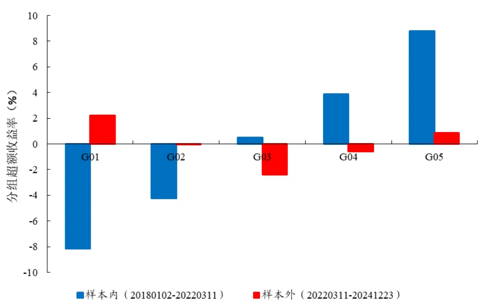
数据来源：Wind、开源证券研究所

表 1 统计了 CNIR 因子分年度测试的结果，2021 年以来，该因子出现了较为明显的衰减。截至2024年底，因子并未出现明显的回调和改善的迹象。

表1：广义主力资金净流入率（CNIR）因子样本外表现变差

| 统计区间 IC | RankIC | 多空收益（%） | 多空最大回撤（%） | 回撤区间 |
| --- | --- | --- | --- | --- |
| 2018 0.030 | 0.034 | 10.3 | 2.0 | 20180206_20180306 |
| 2019 0.056 | 0.061 | 19.1 | 2.2 | 20190131_20190307 |
| 2020 0.061 | 0.063 | 30.0 | 1.2 | 20200207_20200221 |
| 2021 0.031 | 0.025 | 17.7 | 1.9 | 20210830_20210914 |
| 2022 0.022 | 0.015 | 8.5 | 2.3 | 20220810_20220921 |
| 2023 0.000 | -0.008 | 2.8 | 4.2 | 20230619_20230828 |
| 2024 -0.010 | -0.013 | -6.6 | 10.7 | 20240207_20241031 |

数据来源：Wind、开源证券研究所，统计区间：20180102-20241223

笔者根据因子的实际使用以及收到的反馈情况，分成三部分展开讨论：第一节主要分析资金流策略的拥挤情况；第二节则讨论了 CNIR 因子构造过程中使用的截面回归方法；第三节侧重于大小单划分标准的重新设定。

## 1、 资金流 Alpha减弱不应归结于策略拥挤

我们首先需要回答的问题是：因子失效是因为策略同质化导致的交易拥挤？有一组比较有意思的数据，券商发布的涉及资金流的报告数量，自2021年开始大幅度增加，这说明资金流的确已经被市场广泛认知和使用。

图2：资金流相关的报告数量2021年以来大幅增加
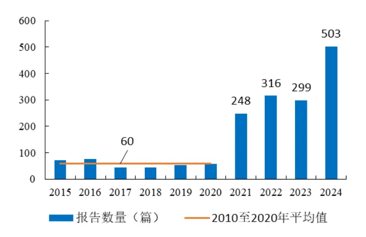
数据来源：Wind、开源证券研究所

图3：CNIR因子最优的预测区间长度没有变短
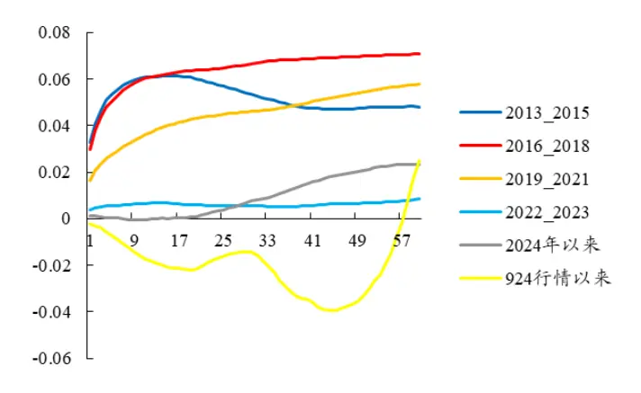
数据来源：Wind、开源证券研究所

我们很自然地会认为是策略被关注了引起交易上拥挤，从而导致 Alpha 出现衰减和因子失效的情况。然而，报告带来的关注度上升并不足以引起同质化交易。图3展示了 CNIR 因子在不同预测周期长度下的 IC 变化趋势，2016 年以前的峰值大约出现在第 15个交易日，2016年以后峰值似乎已经消失并且均值水平出现明显下滑。这说明即便是在若干个组合内共同使用资金流策略，也不至于出现的因子衰减。

矛盾并非千篇一律，关键是具体问题具体分析。以 CNIR 因子为例，其构造过程主要有两步处理，分别是（1）合并资金流：将超大单、大单和中单合并为广义主力资金；（2）剥离反转效应：逐日计算资金流指标（IMB）对涨跌幅的截面回归残差值，作为修正后的 Alpha 因子。上述两步骤在分组的多空收益、多头超额等均有不错的收益增强，我们将着重从这两个方面着手讨论。

## 2、 构造方式不合理，截面回归容易忽视大小市值的差异

股票的资金流向反映了微观供求信息，投资者根据这一信息能够对个股的市场关注及偏好程度有一定程度的了解，从而对投资决策的制定提供帮助。但是，买卖行为促使价格发生变动会导致资金流因子暴露反转特征（图 4）。我们以前的做法是通过截面回归的方式，剥离反转的负向 IC，从而得到正向的资金流 Alpha。

图4：资金流与涨跌幅相关
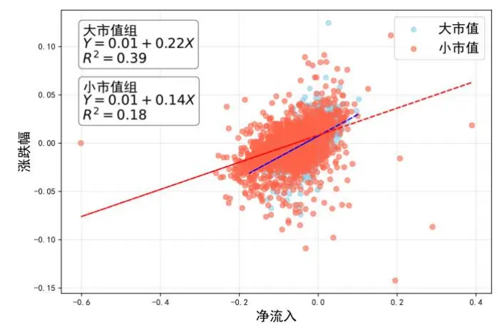
数据来源：Wind、开源证券研究所

图5：剥离反转还是很有必要的，否则 Alpha很难凸显
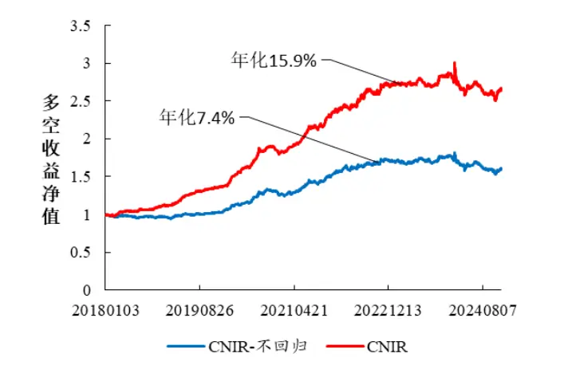
数据来源：Wind、开源证券研究所，抽取 20241223 的统计结果

从结果来看，虽然截面回归模型要求样本应服从同一分布，这与实际情况可能

存在些许出入，但至少截面回归能够给最终因子带来稳定的收益改善（图5）。

我们剥离涨跌幅的目的是对因子进行反转中性化。回归模型的估计结果描述了股票价格冲击的一致性规律，因截面选取的大部分样本属于中小市值股票，Beta 不能较好地反映大票的流动性冲击影响，通常会导致大市值股票的主力资金净流入被错误估计，从而会在分组收益中凸显小市值的阶段性表现。

$$
ln(B/S)=\alpha+\beta\times Ret+\varepsilon
$$

从表达式中不难看出，回归系数β反映了个股对于资金净流入的敏感程度。流动性好的大市值股票订单簿的厚度更厚，因大额交易产生的冲击较小，但从回归结果来看，似乎市值的影响关系并非是通过订单簿深度来传导的。为了检验市值对于回归模型剥离翻转效应的效果是否会产生明显干扰，笔者在表 2 中罗列了 5 种可能的回归方式，并分别构造和测试对应因子相对CNIR 因子的改进效果。

表2：剥离反转效应的五种备用方案

| 回归方法 | 步骤说明 |
| --- | --- |
| 分组回归-市值 | 第一步，将当日的所有股票按照市值由大到小分成N组（例如，N=3)； 第二步，根据不同市值组别生成N-1 组哑变量 V1、V2； 第三步，构造下列回归模型，输入当日全部股票的样本数据进行估计，得 到模型的残差项，作为当日修正后的资金净流入ε； $ln(B/S)=\alpha+\beta_{1}\times Ref+\beta_{2}\times V_{1}+\beta_{3}\times V_{2}+\varepsilon$ |
| 分组回归-行业 | 第四步，月底回溯过往20个交易日求ε的均值作为因子。 步骤同上，行业类别作为分组标签，生成对应的哑变量用以构造回归模型。 |
| 补充市值变量 | 第一步，补充股票的市值作为解释变量，将原来的回归表达式修改为如下： $ln(B/S)=\alpha+\beta_{1}\times Ret+\beta_{2}\times MV+\varepsilon$ 其中，MV为截面全部个股的对数市值。 第二步，输入当日全部股票的样本数据，估计模型取得残差项作为当日修 正的资金净流入ε； |
| 补充流动性变量 | 第三步，月底回溯过往20个交易日求ε的均值作为因子。 步骤同上，添加的流动性指标为股票当日的换手率。 |
| 时间序列回归 | 第一步，逐个统计每只股票的过去120个交易日的资金流和涨跌幅数据； 第二步，构造下列回归模型，输入股票i的历史数据，如买入金额B、卖出 金额 S 以及涨跌幅 ret，估计模型并得到残差项 e; $ln(B/S)=\alpha+\beta\times Ret+\varepsilon$ |

资料来源：开源证券研究所

通过分组回归-市值、分组回归-行业、补充市值变量、补充流动性变量和时序回归五种方法构造的因子分别记作 CNIR_G1、CNIR_G2、CNIR_MV、CNIR_LQ 和CNIR_TS。我们用这五个因子以及原始CNIR 因子分别对沪深 300、中证500、中证1000和国证2000的成分股分组，图 6至图 9展示了多空收益曲线的对比效果。

图6：沪深300指数成分股分组效果较优
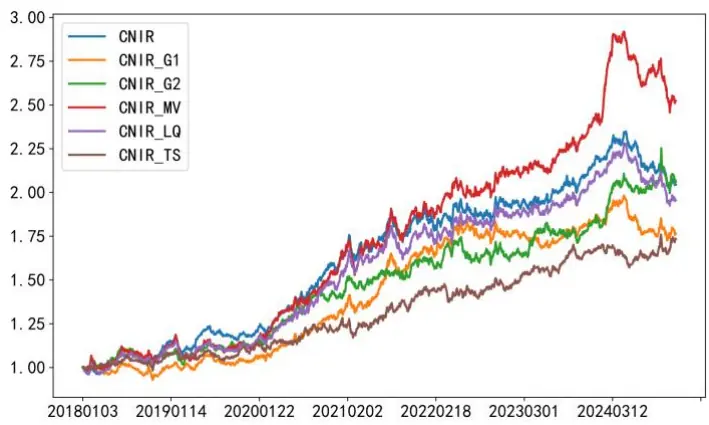
数据来源：Wind、开源证券研究所，20180102 至 20241223

图7：中证 500指数成分股分组效果最优
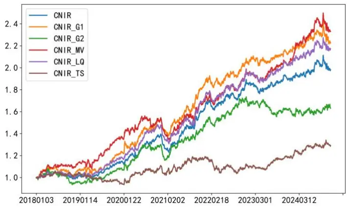
数据来源：Wind、开源证券研究所，20180102 至 20241223

图8：中证1000指数成分股分组效果最差
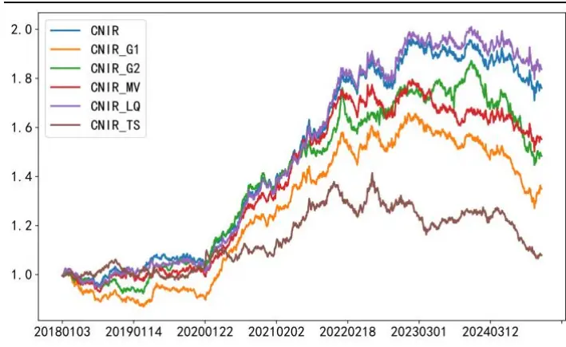
数据来源：Wind、开源证券研究所，20180102 至 20241223

图9：国证 2000指数成分股分组效果较差
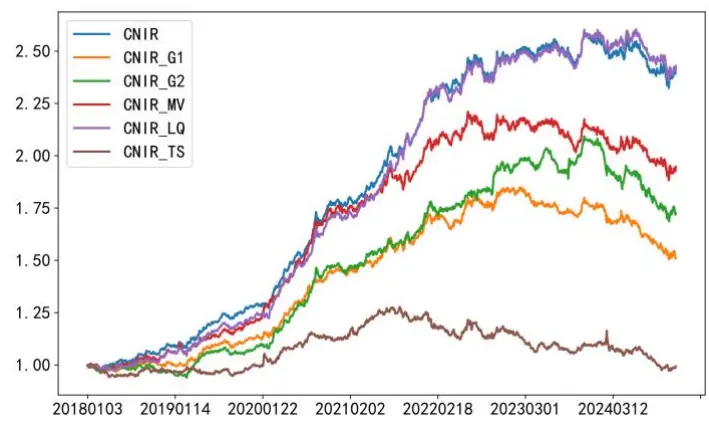
数据来源：Wind、开源证券研究所，20180102 至 20241223

从上述结果可以看出，表 2 中涉及的 5 种方案，并没有提供预想中明显的优化结果。无论是添加解释变量或是分域处理，能够提供的增量信息有限。此外，对比时序回归和截面回归而言，极端考虑个股差异同样不是可选项，因为这容易在截面上丧失同一分布假设的显著性，换言之即因子的IC会降低，收益会变差。

图 6 至图 9 的分域测试结果可以给予我们一定的启发：资金流因子的核心定价逻辑主要背靠机构的优秀的选股能力。在 A 股市场，机构交易者往往是以市值由大到小的方向覆盖其选股范围，在大市值股票中的选股效果会更加稳定，在小市值范围的排序能力较弱。以中证 1000 和国证 2000 为例，2022 年以来多空收益持平的现象明显，而同期沪深 300 和中证 500 的选股多空收益回撤较小，这说明并不一定是资金流本身的选股逻辑发生本质的改变，CNIR 因子收益衰减的问题有可能是由另外的原因导致。

2023 年底以来，市场风格发生了较为明显的变化。从 2023 年 11 月份开始的流动性危机，到 2024年 5月“新国九条”颁布影响市场内投资者结构的变化，再至 2024年 9 月的政策催化下的放量行情。资金流 Alpha 对于非稳定的市场环境的适应性会更弱一些，CNIR 因子在沪深300指数成分股内的分组多空收益出现了较大回撤，自20240510 至 20241112，跌幅达 14.9%以上。一方面，沪深 300 指数的成分股包含了极端大市值的股票，相比于中证 500 指数而言对于大小市值风格的更加敏感，出现风格切换损失超额的可能性更高；另一方面，子域交易者结构的变化也会造成因子的最优的超参数（例如，划分大小单的标准阈值）发生变化，从而影响选股效果。

## 3、 大小单的识别方法缺乏适应性

在原始的报告中，我们讨论的另一个关键问题是如何准确地识别主力资金。主流行情软件中的分类方法是：参照委托金额大小，任意一笔交易订单可以被分成超大单、大单、中单和小单四种不同类型。其中，超大单和大单的买入卖出操作常常作为“机构投资者”或是“主力资金”交易的观测窗口。但是，这四类划分方法并不适合2015年以后的订单分布，因此需要重新界定大单与小单的边界。

为了方便确定最佳的大、小单划分阈值，我们原先的做法是根据金字塔结构特征“由低到高、先密后疏”地选定了 0.5、0.6至 90、100 万元等44个候选值。然后根据不同的金额阈值分别划分资金流向并构造CNIR 因子。图10 展示着这些因子在中证 1000指数成分股内的分组测试的结果。在样本内，笔者可以统计出较为明确的金额阈值：2.5 万元，即大于 2.5 万元的委托订单属于机构交易订单。但是，在样本外，我们发现测试结果不能给出相同的答案，甚至无法给出确定的阈值。

图10：中证1000指数成分股最优参数变化较大
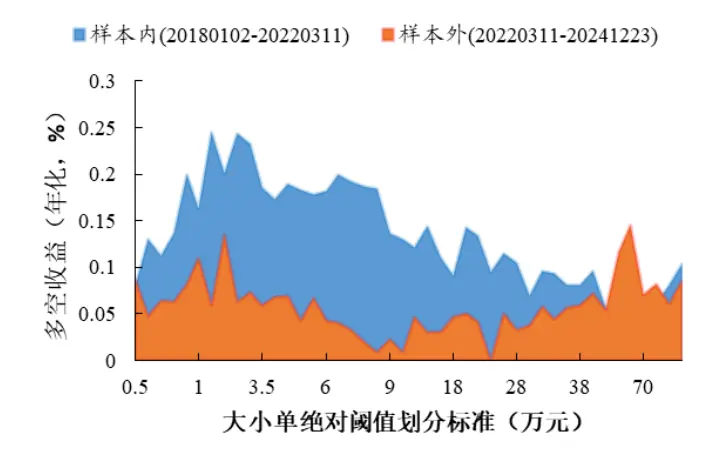
数据来源：Wind、开源证券研究所

图11：最优参数的逐年统计结果并不稳定
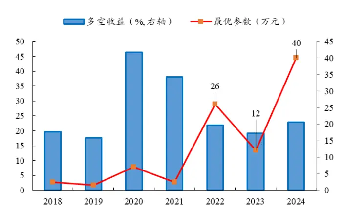
数据来源：Wind、开源证券研究所

更加具体来看，我们统计了不同年份的最优参数，如图11 所示。2022年、2023年和 2024年的阈值分别是 26 万元、12 万元和 40万元，均远大于原始报告中的 2.5万元的经验值。我们分析原因，这主要是因为市场微观结构发生了较大变化。以私募量化为代表的高频交易资金在交易中贡献的比重在这期间逐渐上升，通过观察我们的观测指标（图 12，单笔金额）不难发现，在这期间每笔订单的委托金额快速下降，交易流动性得到改善的同时，主力资金识别的难度也在增加。

此外，从最优参数的变化情况来看，资金流Alpha的变化还体现在 IC 降低。我们认为这种选股能力降低的背后是大单资金识别的准确度在降低。由于市场微观结构的改变，我们无法即时的更新对大小单的阈值，导致 CNIR 因子出现明显失准的情况。几乎与此同时，以普通股票型和偏股混合型基金为代表的机构资金收益能力进入到一个较长的衰退周期，Alpha衰减自然也会伴随逻辑的弱化而发生。

图12：市场微观结构变化致使委托金额分布漂移
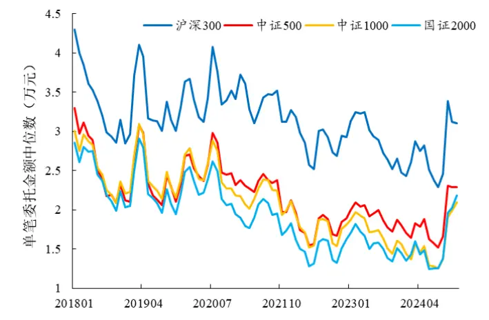
数据来源：Wind、开源证券研究所

图13：主力资金表现目前相对弱势
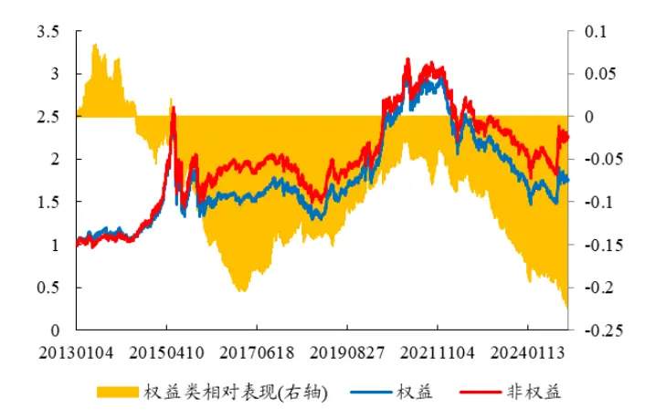
数据来源：Wind、开源证券研究所

为了更好的跟踪大小单的边界变化，我们调整了原有的划分标准，由 1.0的绝对阈值衍生出两种确认方法，具体步骤如表 3 所示。其中，相对阈值考虑到市场不同时期的微观结构差异，通过金额排序的百分位数来确定划分边界。动态阈值则是在此基础上，增加历史样本来提高阈值的显著性，是相对阈值划分方法的补充。

表3：大小单划分标准1.0衍生出两种划分方法

| 大小单分类标准 | 方法简介 |
| --- | --- |
| 绝对阈值 | 设定某个金额作为统一的划分阈值，将大于该金额的订单识别为大单。 |
| 相对阈值 | 逐日统计所有个股的逐笔成交订单的委托金额，设定其由小到大的百分 位r对应的金额作为阈值。例如，某日所有成交订单中委托金额较大的 r=90%为10万元，那么该日任意个股大于10万元的订单均被视作机 |
| 动态阈值 | 构交易的大单。 回溯过去N个交易日，将区间内所有股票的逐笔成交订单视作整体，将 其委托金额由小到大的百分位r对应数值作为统一标准，将当前交易日内 所有订单与该阈值作比较，大于此金额的订单均被视作大单。 |

资料来源：开源证券研究所

我们简单测算了三种不同划分方法，在 20180102 至 20241223 期间，最优参数下的分组收益情况。其中，绝对阈值方法选取了2.5万元，相对阈值和动态阈值的百分位均设置为 82%，结果如图 14 所示。

图14：三种不同分类阈值的因子多空收益对比
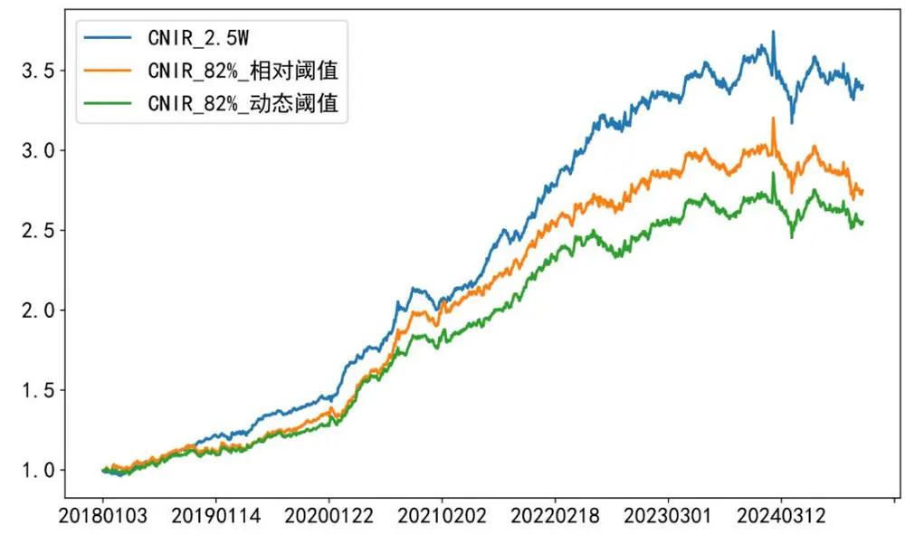
数据来源：Wind、开源证券研究所

结构变化并非是单一的，而是受到诸多复杂因素的影响。从结果来看，相对阈值和动态阈值调整没有起到很好的增厚收益的作用，这说明主力资金识别难的问题并不能通过单纯调节大小单划分阈值来解决。划分标准的普适性减弱，拆单行为是最直接的影响因素，并且这一变化在流动性上分布不均。我们可以判断，微观结构变化在主要以市值区分的不同选股域中存在差异，对于大单的讨论不能一概而论。

图 15和图16分别展示了参数的敏感性分析结果。

图15：相对阈值和动态阈值的最优参数接近
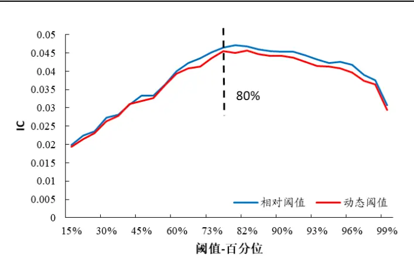
数据来源：Wind、开源证券研究所，20130104-20241223

图16：逐年的最优参数变化不大
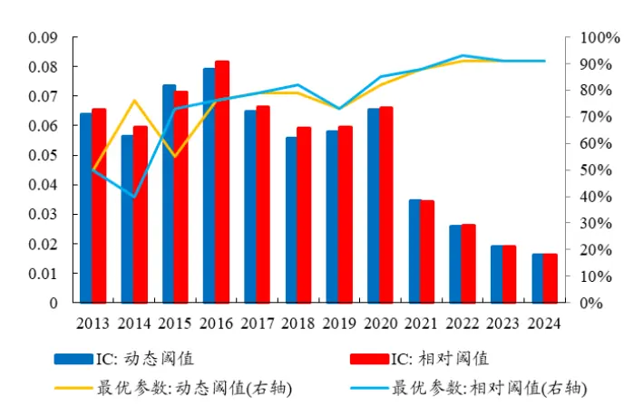
数据来源：Wind、开源证券研究所，20130104-20241223

从整个回撤区间来看，相对阈值和动态阈值的百分位达到 80%左右，CNIR 因子的分组能力会收敛于一个极大值，而后缓慢变化。在不同年度的统计结果中，这一结果似乎又不值得继续推敲，2021年以来，最优参数大致稳定在 90%，且上升的边际变化较小。根据我们前文的判断，该参数同样不具备外推能力，只限于市场在短期局部达到平衡的“伪最优”。

## 4、 风险提示

模型基于历史数据测试，未来市场可能发生变化。

## 特别声明

《证券期货投资者适当性管理办法》、《证券经营机构投资者适当性管理实施指引（试行）》已于2017年7月1日起正式实施。根据上述规定，开源证券评定此研报的风险等级为R3（中风险），因此通过公共平台推送的研报其适用的投资者类别仅限定为专业投资者及风险承受能力为C3、C4、C5的普通投资者。若您并非专业投资者及风险承受能力为C3、C4、C5的普通投资者，请取消阅读，请勿收藏、接收或使用本研报中的任何信息。因此受限于访问权限的设置，若给您造成不便，烦请见谅！感谢您给予的理解与配合。

## 分析师承诺

负责准备本报告以及撰写本报告的所有研究分析师或工作人员在此保证，本研究报告中关于任何发行商或证券所发表的观点均如实反映分析人员的个人观点。负责准备本报告的分析师获取报酬的评判因素包括研究的质量和准确性、客户的反馈、竞争性因素以及开源证券股份有限公司的整体收益。所有研究分析师或工作人员保证他们报酬的任何一部分不曾与，不与，也将不会与本报告中具体的推荐意见或观点有直接或间接的联系。

## 股票投资评级说明

|  | 评级 | 说明 |
| --- | --- | --- |
| 证券评级 | 买入（Buy） | 预计相对强于市场表现20%以上； |
|  | 增持（outperform） | 预计相对强于市场表现5%～20%； |
|  | 中性（Neutral） | 预计相对市场表现在—5%～+5%之间波动； |
|  | 减持（underperform） | 预计相对弱于市场表现5%以下。 |
| 行业评级 | 看好（overweight） | 预计行业超越整体市场表现； |
|  | 中性（Neutral） | 预计行业与整体市场表现基本持平； |
|  | 看淡（underperform） | 预计行业弱于整体市场表现。 |
| 备注：评级标准为以报告日后的6~12个月内，证券相对于市场基准指数的涨跌幅表现，其中A股基准指数为沪深300指数、港股基准指数为恒生指数、新三板基准指数为三板成指（针对协议转让标的）或三板做市指数（针对做市转让标的)、美股基准指数为标普500或纳斯达克综合指数。我们在此提醒您，不同证券研究机构采用不同的评级术语及评级标准。我们采用的是相对评级体系，表示投资的相对比重建议；投资者买入或者卖出证券的决定取决于个人的实际情况，比如当前的持仓结构以及其他需要考虑的因素。投资者应阅读整篇报告，以获取比较完整的观点与信息，不应仅仅依靠投资评级来推断结论。 |  |  |

## 分析、估值方法的局限性说明

本报告所包含的分析基于各种假设，不同假设可能导致分析结果出现重大不同。本报告采用的各种估值方法及模型均有其局限性，估值结果不保证所涉及证券能够在该价格交易。

## 法律声明

开源证券股份有限公司是经中国证监会批准设立的证券经营机构，已具备证券投资咨询业务资格。

本报告仅供开源证券股份有限公司（以下简称“本公司”）的机构或个人客户（以下简称“客户”）使用。本公司不会因接收人收到本报告而视其为客户。本报告是发送给开源证券客户的，属于商业秘密材料，只有开源证券客户才能参考或使用，如接收人并非开源证券客户，请及时退回并删除。

本报告是基于本公司认为可靠的已公开信息，但本公司不保证该等信息的准确性或完整性。本报告所载的资料、工具、意见及推测只提供给客户作参考之用，并非作为或被视为出售或购买证券或其他金融工具的邀请或向人做出邀请。本报告所载的资料、意见及推测仅反映本公司于发布本报告当日的判断，本报告所指的证券或投资标的的价格、价值及投资收入可能会波动。在不同时期，本公司可发出与本报告所载资料、意见及推测不一致的报告。客户应当考虑到本公司可能存在可能影响本报告客观性的利益冲突，不应视本报告为做出投资决策的唯一因素。本报告中所指的投资及服务可能不适合个别客户，不构成客户私人咨询建议。本公司未确保本报告充分考虑到个别客户特殊的投资目标、财务状况或需要。本公司建议客户应考虑本报告的任何意见或建议是否符合其特定状况，以及（若有必要）咨询独立投资顾问。在任何情况下，本报告中的信息或所表述的意见并不构成对任何人的投资建议。在任何情况下，本公司不对任何人因使用本报告中的任何内容所引致的任何损失负任何责任。若本报告的接收人非本公司的客户，应在基于本报告做出任何投资决定或就本报告要求任何解释前咨询独立投资顾问。

本报告可能附带其它网站的地址或超级链接，对于可能涉及的开源证券网站以外的地址或超级链接，开源证券不对其内容负责。本报告提供这些地址或超级链接的目的纯粹是为了客户使用方便，链接网站的内容不构成本报告的任何部分，客户需自行承担浏览这些网站的费用或风险。

开源证券在法律允许的情况下可参与、投资或持有本报告涉及的证券或进行证券交易，或向本报告涉及的公司提供或争取提供包括投资银行业务在内的服务或业务支持。开源证券可能与本报告涉及的公司之间存在业务关系，并无需事先或在获得业务关系后通知客户。

本报告的版权归本公司所有。本公司对本报告保留一切权利。除非另有书面显示，否则本报告中的所有材料的版权均属本公司。未经本公司事先书面授权，本报告的任何部分均不得以任何方式制作任何形式的拷贝、复印件或复制品，或再次分发给任何其他人，或以任何侵犯本公司版权的其他方式使用。所有本报告中使用的商标、服务标记及标记均为本公司的商标、服务标记及标记。

## 开源证券研究所

上海

地址：上海市浦东新区世纪大道1788号陆家嘴金控广场1号

深圳

地址：深圳市福田区金田路2030号卓越世纪中心1号

楼3层

楼45层

邮编：200120

邮编：518000

邮箱：research@kysec.cn

邮箱：research@kysec.cn

北京

邮编：100044

地址：北京市西城区西直门外大街18号金贸大厦C2座9层

邮箱：research@kysec.cn

西安

地址：西安市高新区锦业路1号都市之门B座5层

邮编：710065

邮箱：research@kysec.cn