# 高频成交量的峰、岭、谷信息

2025 年 07 月 20 日

## 金融工程研究团队

魏建榕（首席分析师）

证书编号：S0790519120001

张 翔（分析师）

证书编号：S0790520110001

傅开波（分析师）

证书编号：S0790520090003

## 高 鹏（分析师）

证书编号：S0790520090002

## 苏俊豪（分析师）

证书编号：S0790522020001

## 胡亮勇（分析师）

证书编号：S0790522030001

## 王志豪（分析师）

证书编号：S0790522070003

## 盛少成（分析师）

证书编号：S0790121070009

## 苏 良（分析师）

证书编号：S0790121070008

## 何申昊（分析师）

证书编号：S0790524070009

## 蒋 韬（分析师）

证书编号：S0790525070001

## 相关研究报告

《长端动量 2.0：长期、低换手、多头显著的量价因子—开源量化评论（67）》-2022.11.26

《从涨跌停外溢行为到股票关联网络—开源量化评论（92）》-2024.4.16《从高频股价形态到追涨杀跌因子—开源量化评论（94）》-2024.6.23

《成长与周期共振：基于业绩增速与景气定位的双因子协同—开源量化评论（107）》-2025.3.30

# ——市场微观结构研究系列（27）

魏建榕（分析师）

weijianrong@kysec.cn

王志豪（分析师）

证书编号：S0790519120001

wangzhihao@kysec.cn

证书编号：S0790522070003

## 日内成交量状态划分：峰、岭、谷

日内分钟成交量一方面体现了分钟交易活跃度；另一方面，日内分钟成交量的局域分布特征，体现了日内不同时点，各类投资者的交易参与度。本报告中，我们对个股日内分钟成交量状态进行划分，先按成交量水平将分钟成交量划分为喷发成交量与温和成交量，考虑到个股日内成交量受交易时段影响较大，总体呈现“U”型分布特征，我们对过去 20日同时点成交量按照 1倍标准差的标准划分，高于1倍标准差划为喷发成交量，低于1倍标准差划为温和成交量。然后，我们对喷发成交量进一步按照连续与否划分。若当前分钟为喷发成交量，且前后 1分钟均为温和成交量，则划为孤立喷发成交量；若当前分钟为喷发成交量，且前后1分钟存在喷发成交量，则划为连续喷发成交量。

为表述方便，我们套用地理中的“峰、岭、谷”定义。横看成岭侧成峰，地理中将孤耸的高山称为“峰”，将连绵的高山称为“岭”，将高山之间的低洼地带称为“谷”。因此，本报告中，我们将温和成交量称为“量谷”，将连续喷发成交量称为“量岭”，将孤立喷发成交量称为“量峰”。

## 基于“峰、岭、谷”划分构建有效因子

本报告中，我们按“峰、岭、谷”的标准划分交易时点，构建了 11 个大类的20个有效因子。前 5 个因子类型针对“峰、岭、谷”分别独立构建共 13 个因子，后6个类别则将“峰、岭、谷”按不同方式结合，构建共 7个因子。

我们认为，“量岭”的跟随交易与个人投资者的交易特征更加相符；“量峰”的大额交易发生在情绪低迷处，与知情交易者的交易特征更加相符；“量谷”则是日内情绪低迷时点，其价格过度反应概率更低。因此，对于“量谷”时点，价格、收益类因子更加有效，且为正向因子；对于“量峰”时点，分钟数、成交额类因子更加有效，反映知情交易参与度，为正向因子；对于“量岭”时点，分钟数、成交额类因子反映个人投资者参与度，价格、收益类因子反映个人投资者的过度反应，均比较有效，且均为负向alpha贡献。

## 因子表现稳健，偏好小市值股票池

本报告构建因子数量较多，且表现稳健。部分因子表现如下：量峰分钟数因子全市场10分组多空年化收益31.58%，年化 IR3.22；
量谷相对加权价格因子全市场 10分组多空年化收益25.35%，年化IR3.04；
量谷加权价格分位点因子全市场10分组多空年化收益 20.22%，年化IR3.29；
量峰间隔峰度因子全市场10 分组多空年化收益23.3%，年化IR3.39；
谷岭加权价格比因子全市场 10分组多空年化收益15.83%，年化IR1.83；
同时点峰岭数相关性因子全市场10分组多空年化收益 22.78%，年化IR3.27；

- 风险提示：模型测试基于历史数据，市场未来可能发生变化。

A 股市场中，股票日内分钟成交量在时间维度，总体呈现“头尾高，中间低”的 $\text{" }U\text{" }$ 型分布特征。日内分钟成交量一方面体现了分钟交易活跃度；另一方面，日内分钟成交量的局域分布特征，体现了日内不同时点，各类投资者的交易参与度。本报告中，我们对日内分钟成交量做全方位解析，通过日内分钟成交量的局域分布特征，将个股日内分钟成交量划分为“峰、岭、谷”三种状态，从而挖掘不同状态下的 alpha 信息。

第一节，我们详细介绍对成交量“峰、岭、谷”三类状态的划分方法。第二节至第六节，报告分别从分钟数、分钟收益、相对加权价格、加权价格分位点以及时间间隔统计特征方面，对“峰、岭、谷”各类别独立构建相应因子。第七节，我们将不同类别之间相互结合，分别从加权价格比值、成交额比值、成交额跟随比例、成交额敏感度、成交额相关性以及同时点统计数相关性方面，构建有效因子。考虑到报告涉及因子数量较多，将部分数据在第八节进行补充，讨论了本报告因子与Barra 风格因子的相关性、本报告因子间的相关性以及因子的分域表现。

## 1、 日内成交量状态划分：峰、岭、谷

本报告中，我们对个股日内分钟成交量状态进行划分，先按成交量水平将分钟成交量划分为喷发成交量与温和成交量，考虑到个股日内成交量受交易时段影响较大，总体呈现“U”型分布特征，我们对过去 20 日同时点成交量按照 1 倍标准差的标准划分，高于 1 倍标准差划为喷发成交量，低于 1 倍标准差划为温和成交量。然后，我们对喷发成交量进一步按照连续与否划分。若当前分钟为喷发成交量，且前后 1 分钟均为温和成交量，则划为孤立喷发成交量；若当前分钟为喷发成交量，且前后 1分钟存在喷发成交量，则划为连续喷发成交量。

为表述方便，我们套用地理中的“峰、岭、谷”定义。横看成岭侧成峰，地理中将孤耸的高山称为“峰”，将连绵的高山称为“岭”，将高山之间的低洼地带称为“谷”。因此，本报告中，我们将温和成交量称为“量谷”，将连续喷发成交量称为“量岭”，将孤立喷发成交量称为“量峰”。

图1：峰、岭、谷划分示意图（红色为喷发成交量）

| Dt1,1 | Dt1,2 | Dt1,3 | Dt1,4 |  | Dt1,5 | Dt1,6 Dt1,7 |  | .… | Dt1,240 |
| --- | --- | --- | --- | --- | --- | --- | --- | --- | --- |
|  | Dt2,1 | Dt2,2 | Dt2,3 | Dt2,4 | Dt2,5 量峰 | Dt2,6 Dt2,7 |  | … | Dt2,240 |
| Dt3,1 | Dt3,2 | Dt3,3 | Dt3,4 | Dt3,5 |  | Dt3,6 Dt3,7 |  | … | Dt3,240 |
| 交易日 Dt{4,1 |  | Dt{4,2 量谷 | Dt4,3 | Dt4,4 | Dt4,5 | Dt4,6 量岭 | Dt4,7 |  | Dt4,240 |
| Dt5,1 |  | Dt5,2 | Dt5,3 | Dt5,4 | Dt5,5 | Dt5,6 | Dt5,7 |  | Dt5,240 |
| … | … |  | …… ……… | … | … | .. |  |  | … |
| Dt20,1 | Dt20,2 | Dt20,3 | Dt20,4 | Dt20,5 | Dt20,6 | Dt20,7 |  |  | Dt20,240 |
| 1倍标准差 |  |  |  |  |  |  |  |  |  |

资料来源：开源证券研究所

“峰、岭、谷”的划分方式中，“量谷”反映了个股日内的交易低迷时点，以小额交易为主。“量峰”和“量岭”均是大额交易时点，二者的区别在于：“量峰”时点的大额交易没有资金跟随交易，其局域交易情绪低迷；“量岭”的大额交易有资金跟随交易，其局域交易情绪高涨。

图2：峰、岭、谷划分示例
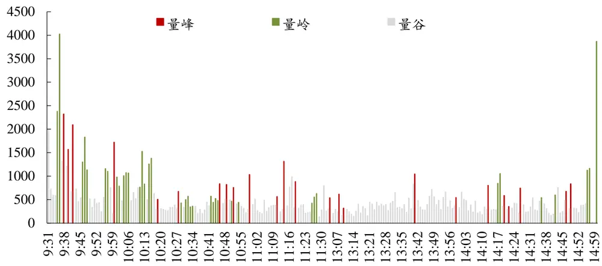
数据来源：Wind、开源证券研究所

本报告中，我们按“峰、岭、谷”的标准划分交易时点，构建了11个大类的20个有效因子（如图 3 所示，√代表有效因子，×代表无效因子）。前5 个因子类型针对“峰、岭、谷”分别独立构建共 13 个因子，后6个类别则将“峰、岭、谷”按不同方式结合，构建共 7个因子。

我们认为，量岭的跟随交易与个人投资者的交易特征更加相符；量峰的大额交易发生在情绪低迷处，与知情交易者的交易特征更加相符；量谷则是日内情绪低迷时点，其价格过度反应概率更低。因此，对于量谷时点，价格、收益类因子更加有效，且为正向因子；对于量峰时点，分钟数、成交额类因子更加有效，反映知情交易参与度，为正向因子；对于量岭时点，分钟数、成交额类因子反映个人投资者参与度，价格、收益类因子反映个人投资者的过度反应，均比较有效，且均为负向 alpha贡献。

图3：本报告因子构建示意图

| 成交量划分因子类型 | 量峰 | 量岭 | 量谷 |
| --- | --- | --- | --- |
| 分钟数 |  |  | x |
| 分钟收益 | X |  | X |
| 相对加权价 |  |  |  |
| 加权价格分位点 |  | X |  |
| 时间间隔统计特征 |  |  | X |
| 加权价格比值 |  |  | x |
|  | x |  |  |
| 成交额比值 |  |  | X |
| 成交额跟随比例 |  |  | x |
| 成交额敏感度 |  |  | X |
| 成交额corr |  |  | x |
| 同时点统计数corr |  |  |  |

资料来源：开源证券研究所（√代表有效因子，×代表无效因子）

## 2、 量峰分钟数因子多空年化收益 31.58%

我们简单统计过去 20日量峰的分钟数，作为量峰分钟数因子。因子衡量日内的知情交易参与频率，因子值越高，知情交易参与度越高。

本报告的因子测试中，对因子做市值、行业中性化处理，月频调仓，费率为双边千三，测试区间为 20130101-20250531（下文未做特别说明，则同处理方式）。

量峰分钟数因子 RankIC 均值 10.62%，RankICIR4.36。从全市场表现来看，多头组年化收益率 14.36%，多空组合年化收益率 31.58%，年化 IR3.22，最大回撤9.43%，月度胜率 79.73%，多空组合表现稳健。

图4：量峰分钟数因子全市场多空年化收益 31.58%
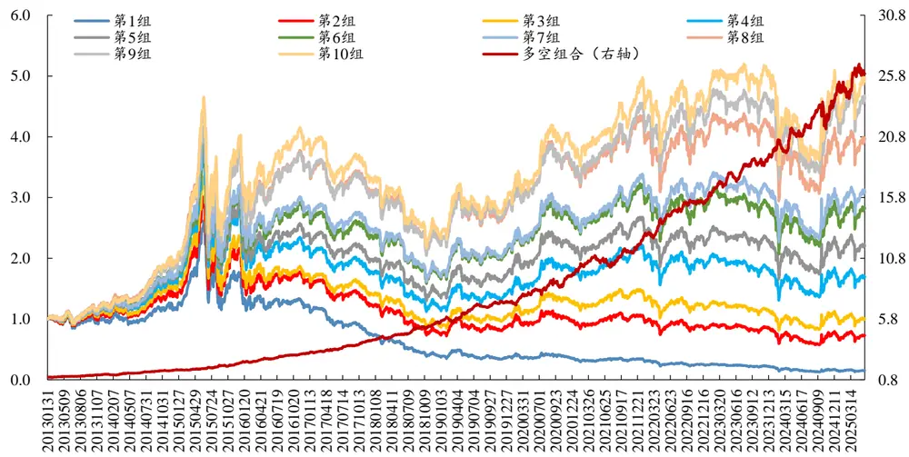
数据来源：Wind、开源证券研究所

从分年度表现来看，量峰分钟数因子多空组合所有年份均录得正收益，且大多数年份收益超30%。

表1：量峰分钟数因子全市场多空分年度表现：多数年份收益超 30%

| 年份 | 年化收益率 年化 IR | 最大回撤 |
| --- | --- | --- |
| 2013 | 30.27% 3.29 | 2.94% |
| 2014 | 27.66% | 3.46 5.79% |
| 2015 | 40.30% 3.77 | 5.26% |
| 2016 | 35.81% 4.00 | 4.36% |
| 2017 | 38.48% 4.70 | 3.27% |
| 2018 | 37.48% 4.64 | 4.37% |
| 2019 | 30.54% | 3.40 7.80% |
| 2020 | 32.75% | 2.58 7.63% |
| 2021 | 26.91% | 2.40 8.93% |
| 2022 | 31.58% | 3.66 3.80% |
| 2023 | 24.20% 3.47 | 4.35% |
| 2024 | 31.84% | 2.59 9.43% |
| 2025（截至5月） | 9.36% | 0.68 5.49% |
| 2015-2025.5 | 31.58% | 3.22 9.43% |

数据来源：Wind、开源证券研究所

从分域表现来看，量峰分钟数因子更加适用小市值股票池。在沪深 300 中，多空组合年化收益率9.99%，年化IR1.05；在中证500中，多空组合年化收益率14.96%，年化 IR1.66；在中证 1000 中，多空组合年化收益率 24.73%，年化 IR2.94。

图5：量峰分钟数因子分域多空表现：偏向小市值股票池
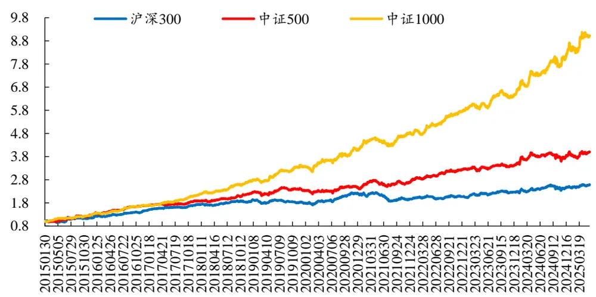
数据来源：Wind、开源证券研究所（统计区间：20150101-20250531）

从分年度表现来看，量峰分钟数因子在中证500与中证 1000中，所有年份均录得正收益，且多数年份收益较高。在沪深 300中除 2019年与2021年出现负收益外，其余年份录得正收益。

表2：量峰分钟数因子分域多空分年度年化收益表现：中证 1000中所有年份正收益

| 年份 沪深300 | 中证500 中证1000 |
| --- | --- |
| 2015 17.75% | 34.62% 35.84% |
| 2016 27.98% | 29.01% 29.69% |
| 2017 17.09% | 13.09% 29.10% |
| 2018 12.40% | 19.84% 28.98% |
| 2019 -7.27% | 4.50% 21.93% |
| 2020 24.58% | 4.34% 22.66% |
| 2021 -11.02% | 12.68% 17.61% |
| 2022 5.53% | 20.38% 22.33% |
| 2023 9.07% | 5.34% 12.15% |
| 2024 11.15% | 14.97% 31.37% |
| 2025（截至5月） 8.44% | 4.53% 17.70% |
| 2015-2025.5 9.99% | 14.96% 24.73% |

数据来源：Wind、开源证券研究所（统计区间：20150101-20250531）

类似的，我们构建了量岭分钟数因子，衡量个人投资者交易参与频率。因子RankIC 均值-9.04%，RankICIR-3.13。从全市场表现来看，多头组年化收益率 13.37%，多空组合年化收益率 26.2%，年化 IR2.2，最大回撤15.56%，月度胜率69.6%。

## 3、 量岭分钟收益因子多空年化收益 14.98%

我们计算过去20日量岭时点的累计收益作为量岭分钟收益因子，衡量个人投资者交易的收益贡献，个人投资者交易的过度反应，导致量岭分钟收益因子为显著负向因子。

量岭分钟收益因子 RankIC 均值-6.29%，RankICIR-3.55。从全市场表现来看，多头组年化收益率7.47%，多空组合年化收益率14.98%，年化IR1.73，最大回撤13.84%，月度胜率 70.3%。

图6：量岭分钟收益因子全市场多空年化收益14.98%
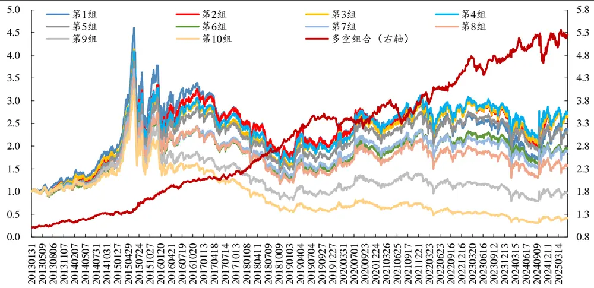
数据来源：Wind、开源证券研究所

从分年度表现来看，量岭分钟收益因子多空组合所有年份均录得正收益，2023年至 2025年收益偏弱。

表3：量岭分钟收益因子全市场多空分年度表现：所有年份正收益

| 年份 年化收益率 | 年化 IR 最大回撤 |
| --- | --- |
| 2013 17.80% | 2.11 3.85% |
| 2014 14.27% | 1.89 4.23% |
| 2015 34.50% | 3.25 4.90% |
| 2016 18.52% | 2.70 4.49% |
| 2017 9.76% | 1.46 4.51% |
| 2018 31.34% | 4.58 2.91% |
| 2019 16.87% | 2.84 3.79% |
| 2020 3.10% | 0.34 7.33% |
| 2021 6.65% | 0.60 13.84% |
| 2022 18.79% | 2.18 6.44% |
| 2023 7.42% | 1.08 8.81% |
| 2024 9.67% | 0.85 12.47% |
| 2025（截至5月） 2.40% | 0.21 6.02% |
| 2015-2025.5 14.98% | 1.73 13.84% |

数据来源：Wind、开源证券研究所

## 4、 量谷相对加权价格因子多空年化收益 25.35%

在开源金融工程团队 2020 年的报告《聪明钱因子模型的 2.0 版本》中，我们从分钟行情数据的价量信息中，通过分钟成交量的价格冲击程度，尝试识别机构参与交易的多寡，最终构造出一个跟踪聪明钱的选股因子。样本外 5 年中，聪明钱因子始终表现稳健。

本节，我们参考聪明钱因子的构建方式，计算每日量谷的成交量加权价格，与当日总成交量加权价格做比，并计算20日均值作为量谷相对加权价格因子。考虑到量谷时点交易情绪低迷，其价格过度反应概率较低，因此其价格相对水平越高，个股未来表现越好。

量谷相对加权价格因子 RankIC 均值 8.69%，RankICIR4.44。从全市场表现来看，多头组年化收益率 12.03%，多空组合年化收益率 25.35%，年化 IR3.04，最大回撤12.59%，月度胜率 79.7%。

图7：量谷相对加权价格因子全市场多空年化收益25.35%
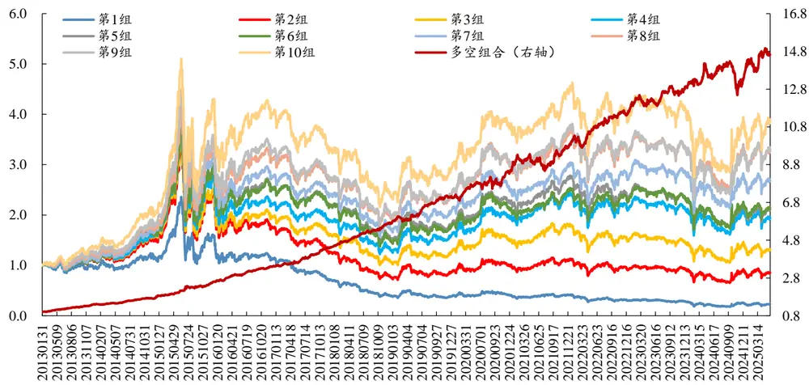
数据来源：Wind、开源证券研究所

从分年度表现来看，量谷相对加权价格因子多空组合所有年份均录得正收益，2021 年之前收益均在 20%以上，2021 年以来收益有所下滑，2024 年、2025 年收益偏弱。

表4：量谷相对加权价格因子全市场多空分年度表现：所有年份正收益

| 年份 | 年化收益率 年化 IR 最大回撤 |
| --- | --- |
| 2013 48.37% | 6.23 2.52% |
| 2014 | 22.97% 3.60 2.94% |
| 2015 52.95% | 4.86 4.56% |
| 2016 32.97% | 5.52 2.35% |
| 2017 30.78% | 4.47 2.61% |
| 2018 30.72% | 4.99 1.78% |
| 2019 23.43% | 3.50 4.61% |
| 2020 20.63% | 1.97 7.81% |
| 2021 16.99% | 1.59 9.41% |
| 2022 18.42% | 2.38 6.24% |
| 2023 11.79% | 1.81 4.73% |

| 年份 | 年化收益率 年化 IR | 最大回撤 |
| --- | --- | --- |
| 2024 | 9.42% | 0.93 12.59% |
| 2025（截至5月） | 8.61% | 0.82 5.06% |
| 2015-2025.5 | 25.35% | 3.04 12.59% |

数据来源：Wind、开源证券研究所

从分域表现来看，量谷相对加权价格因子在沪深 300 中，多空组合年化收益率8.18%，年化 IR0.99；在中证 500 中，多空组合年化收益率 9.94%，年化 IR1.26；在中证 1000中，多空组合年化收益率 19.89%，年化IR2.66。

图8：量谷相对加权价格因子分域多空表现：偏向小市值股票池
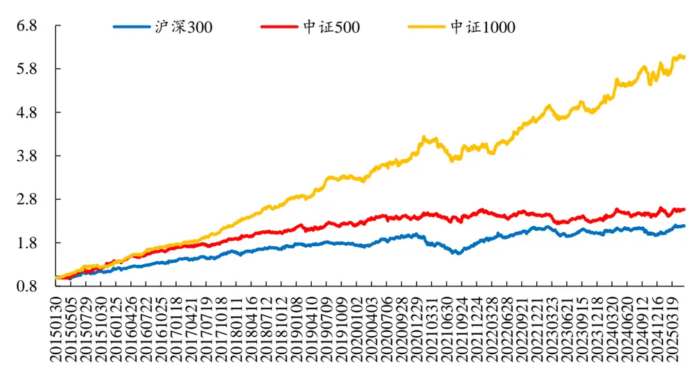
数据来源：Wind、开源证券研究所（统计区间：20150101-20250531）

从分年度表现来看，量谷相对加权价格因子在中证1000中，所有年份均录得正收益，且多数年份收益较高。在沪深 300 中，在 2019 年、2021年和 2023 年出现负收益，其余年份录得正收益，2025年以来年化收益率22%。在中证500中，除2022年和 2023年外，其余年份均录得正收益，2025年收益偏弱。

表5：量谷相对加权价格因子分域多空分年度年化收益表现：2023年收益偏弱

| 年份 | 沪深300 中证500 中证1000 |
| --- | --- |
| 2015 17.47% | 38.67% 34.23% |
| 2016 19.94% | 25.27% 36.08% |
| 2017 15.17% | 13.45% 27.54% |
| 2018 11.95% |  |
|  | 12.99% 29.66% |
| 2019 -1.02% | 4.25% 15.17% |
| 2020 14.06% | 7.31% 18.03% |
| 2021 -8.96% | 6.51% 3.70% |
| 2022 18.56% | -2.80% 17.77% |
| 2023 -6.18% | -4.26% 5.84% |
| 2024 0.96% | 9.71% 19.46% |
| 2025（截至5月） 22.00% 2015-2025.5 8.18% | 0.39% 10.55% 9.94% 19.89% |

数据来源：Wind、开源证券研究所（统计区间：20150101-20250531）

类似的，我们构建了量岭相对加权价格因子，衡量个人投资者交易的价格相对水平。因子 RankIC 均值-6.27%，RankICIR-3.77。从全市场表现来看，多头组年化收益率 8.35%，多空组合年化收益率 17.99%，年化IR2.27，最大回撤 10.49%，月度胜率 77%。

## 5、 量谷加权价格分位点因子多空年化收益 20.22%

本节，我们将“日内最高价、日内最低价、昨日收盘价”三者的最高值与最低值作为[昨收,今收]区间的价格高低位，并计算每日量谷成交量加权价格的相对分位点，将20日的分位点均值作为量谷加权价格分位点因子，衡量交易低迷时点的价格水平。考虑到因子计算中正向暴露 20 日反转因子，我们进一步对量谷加权价格分位点因子做反转中性化处理。

量谷加权价格分位点因子 RankIC 均值 6.34%，RankICIR4.32。从全市场表现来看，多头组年化收益率 13.1%，多头组收益贡献显著，多空组合年化收益率 20.22%，年化 IR3.29，最大回撤 10.18%，月度胜率 80.4%，相较于量峰加权价格分位点因子表现明显更稳健。

图9：量谷加权价格分位点因子全市场多空年化收益20.22%
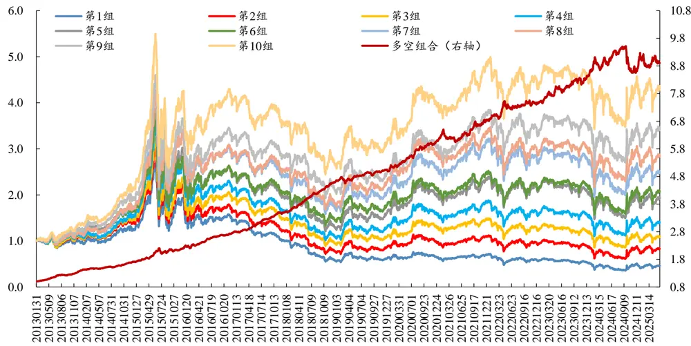
数据来源：Wind、开源证券研究所

从分年度表现来看，量谷加权价格分位点因子多空组合除 2025年外，其余年份均录得正收益，且大多数年份收益较高。

表6：量谷加权价格分位点因子全市场多空分年度表现：多数年份收益较高

| 年份 | 年化收益率 年化IR 最大回撤 |
| --- | --- |
| 2013 47.89% | 8.16 2.43% |
| 2014 | 22.28% 5.12 1.92% |
| 2015 30.09% | 3.19 9.18% |
| 2016 28.09% | 4.67 4.55% |
| 2017 26.28% | 6.62 1.74% |
| 2018 | 33.36% 7.18 1.34% |
| 2019 8.46% | 2.08 4.68% |
| 2020 22.01% | 4.32 2.23% |
| 2021 12.69% | 2.07 7.03% |
| 2022 9.65% | 1.61 3.91% |
| 2023 | 13.12% 2.34 3.04% |
| 2024 8.24% | 0.98 10.18% |
| 2025（截至5月） -5.83% | -0.68 5.84% |
| 2015-2025.5 20.22% | 3.29 10.18% |

数据来源：Wind、开源证券研究所

从分域表现来看，量谷加权价格分位点因子在沪深 300 中，多空组合年化收益率 9.35%，年化 IR1.25；在中证 500 中，多空组合年化收益率 11.71%，年化 IR1.76；在中证 1000中，多空组合年化收益率14.98%，年化IR2.59。

图10：量谷加权价格分位点因子分域多空表现：沪深 300中多空年化 IR1.25
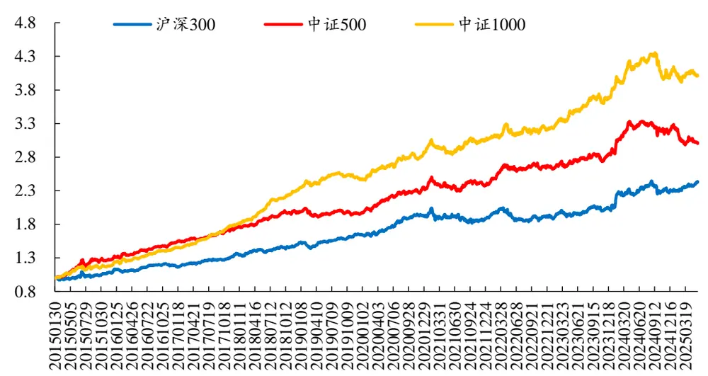
数据来源：Wind、开源证券研究所（统计区间：20150101-20250531）

从分年度表现来看，量谷加权价格分位点因子在沪深 300中，除 2021年外其余年份均录得正收益，2025 年以来年化收益率 16.7%。在中证 500 中，多数年份均录得正收益，2025 年因子回撤较大。在中证 1000 中，仅 2025 年出现负收益，其余年份录得正收益。

表7：量谷加权价格分位点因子分域多空分年度年化收益表现：2021年收益偏弱

| 年份 沪深300 | 中证500 中证1000 |
| --- | --- |
| 2015 8.58% | 31.91% 21.87% |
| 2016 10.76% | 19.60% 22.31% |
| 2017 15.00% | 15.78% 25.09% |
| 2018 12.76% | 13.79% 31.14% |
| 2019 7.73% | -0.75% 5.97% |
| 2020 18.09% | 18.31% 16.34% |
| 2021 -1.65% | 3.79% 7.61% |
| 2022 1.51% | 10.90% 5.04% |
| 2023 3.98% | 6.72% 14.83% |
| 2024 15.03% | 15.93% 11.46% |
| 2025（截至5月） 16.70% | -19.25% -5.54% |
| 2015-2025.5 9.35% | 11.71% 14.98% |

数据来源：Wind、开源证券研究所（统计区间：20150101-20250531）

类似的，我们构建了量峰加权价格分位点因子，衡量知情交易价格的相对水平。因子RankIC均值3.47%，RankICIR2.9。从全市场表现来看，多头组年化收益率6.82%，多空组合年化收益率 11.2%，年化 IR1.88，最大回撤11.8%，月度胜率71.6%。

## 6、 量峰间隔峰度因子多空年化收益 23.3%

本节中，我们针对两个量峰之间的时间间隔计算统计指标，对过去20日同日前后两个量峰之间的时间间隔分布，计算其峰度作为量峰间隔峰度因子。

量峰间隔峰度因子 RankIC 均值 7.19%，RankICIR4.63。从全市场表现来看，多头组年化收益率11.78%，多空组合年化收益率23.3%，年化IR3.39，最大回撤7.37%，月度胜率 82.4%。

图11：量峰间隔峰度因子全市场多空年化收益 23.3%
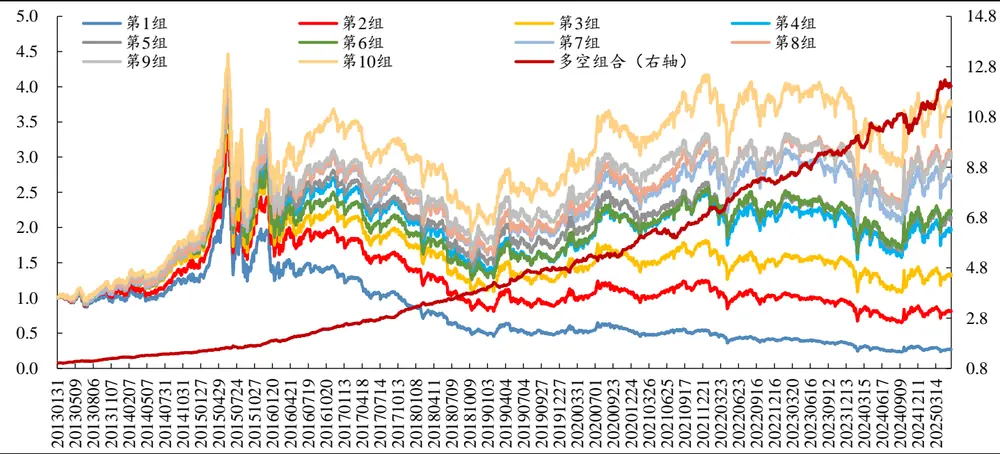
数据来源：Wind、开源证券研究所

从分年度表现来看，量峰间隔峰度因子多空组合所有年份均录得正收益，且多数年份收益较高。

表8：量峰间隔峰度因子全市场多空分年度表现：所有年份正收益

| 年份 | 年化收益率 | 年化 IR 最大回撤 |
| --- | --- | --- |
| 2013 | 28.99% | 4.99 2.25% |
| 2014 | 15.79% | 2.88 1.97% |
| 2015 | 28.62% | 3.96 4.92% |

| 年份 | 年化收益率 年化 IR 最大回撤 |
| --- | --- |
| 2016 37.01% | 5.74 4.01% |
| 2017 30.34% | 4.54 2.23% |
| 2018 24.50% | 4.30 2.49% |
| 2019 20.06% | 2.97 5.00% |
| 2020 19.54% | 2.34 4.76% |
| 2021 22.15% | 3.18 5.80% |
| 2022 20.87% | 3.43 3.27% |
| 2023 17.32% | 3.07 3.10% |
| 2024 18.32% | 2.07 7.37% |
| 2025（截至5月） 16.10% | 1.63 2.78% |
| 2015-2025.5 23.30% | 3.39 7.37% |

数据来源：Wind、开源证券研究所

从分域表现来看，量峰间隔峰度因子在沪深300中，多空组合年化收益率 7.63%，年化 IR1.05；在中证 500 中，多空组合年化收益率 9.93%，年化 IR1.43；在中证 1000中，多空组合年化收益率17.09%，年化IR2.76。

图12：量峰间隔峰度因子分域多空表现：中证 1000中多空年化收益 17.09%
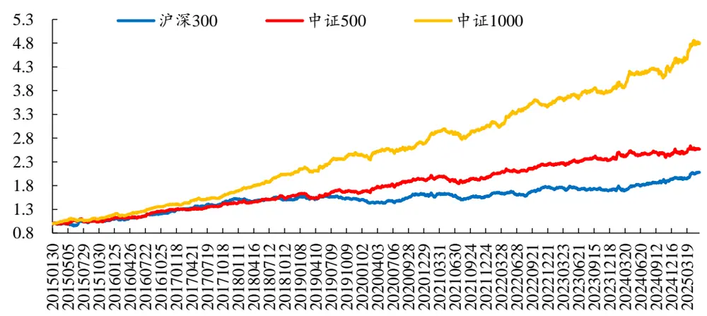
数据来源：Wind、开源证券研究所（统计区间：20150101-20250531）

从分年度表现来看，量峰间隔峰度因子在中证500与中证 1000中，所有年份均录得正收益。在沪深 300 中，2019 年、2021 年及 2023 年出现负收益，2025年以来年化收益率 16.3%。

表9：量峰间隔峰度因子分域多空分年度年化收益表现：2023年收益偏弱

| 年份 沪深300 | 中证500 中证1000 |
| --- | --- |
| 2015 8.25% | 8.97% 18.12% |
| 2016 18.46% | 20.71% 22.29% |
| 2017 20.39% | 10.63% 20.15% |
| 2018 3.96% | 13.55% 27.34% |
| 2019 -4.40% | 2.97% 15.43% |
| 2020 7.36% | 15.69% 10.15% |
| 2021 -2.12% | 3.80% 14.74% |
| 2022 12.66% | 14.80% 15.13% |
| 年份 | 沪深300 中证500 中证1000 |
| 2023 -3.45% | 4.21% 8.50% |
| 2024 15.01% | 7.63% 15.97% |
| 2025（截至5月） 16.30% | 3.32% 26.09% |
| 2015-2025.5 7.63% | 9.93% 17.09% |

数据来源：Wind、开源证券研究所（统计区间：20150101-20250531）

类似的，我们分别构建了量峰间隔标准差因子、量峰间隔偏度因子、量岭间隔标准差因子、量岭间隔偏度因子和量岭间隔峰度因子。

量峰间隔标准差因子 RankIC 均值-8.57%，RankICIR-3.99。从全市场表现来看，多头组年化收益率 10.74%，多空组合年化收益率 25.66%，年化 IR2.93，最大回撤9.86%，月度胜率 79.1%。

量峰间隔偏度因子 RankIC 均值 7.68%，RankICIR4.58。从全市场表现来看，多头组年化收益率11.56%，多空组合年化收益率24.56%，年化IR3.37，最大回撤7.56%，月度胜率 80.4%。

量岭间隔标准差因子 RankIC 均值 7.34%，RankICIR3.75。从全市场表现来看，多头组年化收益率 12.59%，多头组收益贡献较高，多空组合年化收益率 18.41%，年化 IR2.23，最大回撤 8.63%，月度胜率 70.3%。

量岭间隔偏度因子 RankIC 均值-8.08%，RankICIR-3.82。从全市场表现来看，多头组年化收益率12.32%，多空组合年化收益率22.19%，年化IR2.66，最大回撤7.07%，月度胜率 73.7%。

量岭间隔峰度因子 RankIC 均值-7.61%，RankICIR-3.77。从全市场表现来看，多头组年化收益率10.25%，多空组合年化收益率19.47%，年化IR2.45，最大回撤7.21%，月度胜率 72.3%。

## 7、 “峰、岭、谷”的信息组合

前文针对“峰、岭、谷”独立构建相关因子，本部分，我们尝试将三者相互结合，构建价格比、成交额比、相关性等因子。

## 7.1、 谷岭加权价格比因子多空年化收益 15.83%

如前文所述，量谷时点交易低迷，价格过度反应概率较低，量岭时点个人投资者交易使得价格过度反应概率较高。因此，我们计算每日量谷成交量加权价格，与量岭成交量加权价格做比，并计算 20 日价格比均值作为谷岭加权价格比因子。因子值越高，个人投资者过度反应使得价格向下偏离程度越高，个股未来表现越好。

谷岭加权价格比因子 RankIC 均值 6.98%，RankICIR3.56。从全市场表现来看，多头组年化收益率 11.5%，多空组合年化收益率 15.83%，年化 IR1.83，最大回撤11.73%，月度胜率 72.3%。

图13：谷岭加权价格比因子全市场多空年化收益15.83%
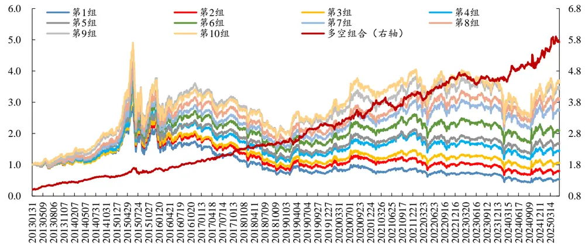
数据来源：Wind、开源证券研究所

从分年度表现来看，谷岭加权价格比因子仅2023年出现负收益，其余年份均录得较高正收益。

表10：谷岭加权价格比因子全市场多空分年度表现：仅2023年出现负收益

| 年份 | 年化收益率 年化 IR 最大回撤 |
| --- | --- |
| 2013 28.39% | 3.59 3.08% |
| 2014 13.79% | 2.12 4.34% |
| 2015 19.01% | 1.79 11.73% |
| 2016 15.26% | 2.48 5.69% |
| 2017 20.98% |  |
| 2018 11.51% | 2.62 3.55% 1.51 3.86% |
| 2019 20.26% | 2.44 7.69% |
| 2020 17.95% | 1.74 7.64% |
| 2021 12.77% | 1.38 10.50% |
| 2022 14.63% | 1.98 6.87% |
| 2023 -1.69% | -0.26 8.36% |
| 2024 21.28% | 1.84 8.37% |
| 2025（截至5月） 12.61% | 1.03 4.41% |
| 2015-2025.5 15.83% | 1.83 11.73% |

数据来源：Wind、开源证券研究所

从分域表现来看，谷岭加权价格比因子在沪深 300 中，多空组合年化收益率9.73%，年化 IR1.21；在中证 500 中，多空组合年化收益率 10.49%，年化 IR1.34；在中证 1000中，多空组合年化收益率12.91%，年化IR1.76。

图14：谷岭加权价格比因子分域多空表现：沪深 300中多空年化 IR1.21
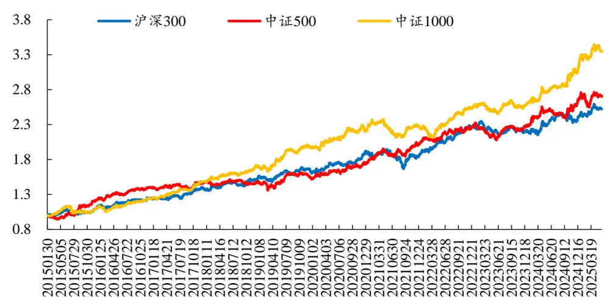
数据来源：Wind、开源证券研究所（统计区间：20150101-20250531）

从分年度表现来看，谷岭加权价格比因子在中证1000中所有年份均录得正收益，2021 年、2023 年收益偏弱。在沪深 300 中，2021 年与 2023 年出现负收益，其余年份均录得正收益。在中证500 中，2023年和 2025年出现负收益，其余年份均录得正收益。

表11：谷岭加权价格比因子分域多空分年度年化收益表现：2023、2025年偏弱

| 年份 沪深300 | 中证500 中证1000 |
| --- | --- |
| 2015 12.61% | 24.80% 12.09% |
| 2016 12.46% | 15.46% 12.77% |
| 2017 10.20% | 5.42% 19.98% |
| 2018 14.07% |  |
| 2019 4.04% | 0.87% 15.54% |
| 2020 19.10% | 2.57% 16.36% 15.33% 12.48% |
| 2021 -2.34% | 17.22% 1.73% |
| 2022 22.75% |  |
| 2023 -3.57% | 12.80% 14.47% -0.58% 0.81% |
| 2024 11.60% |  |
| 2025（截至5月） | 19.40% 27.13% |
| 7.83% 2015-2025.5 9.73% | -0.51% 6.80% 10.49% 12.91% |

数据来源：Wind、开源证券研究所（统计区间：20150101-20250531）

类似的，我们构建了峰岭加权价格比因子，因子RankIC 均值4.7%，RankICIR3.61。从全市场表现来看，多头组年化收益率 5.3%，多空组合年化收益率 10.31%，年化IR1.81，最大回撤 11.41%，月度胜率 68.9%。

## 7.2、 峰岭成交比因子多空年化收益 27.13%

本小节通过计算20日量峰总成交额与量岭总成交额，二者做比作为峰岭成交比因子，衡量知情交易相对个人投资者交易的相对参与程度。峰岭成交比因子RankIC均值 10.28%，RankICIR4.07。从全市场表现来看，多头组年化收益率 16.06%，多头组收益贡献显著，多空组合年化收益率 27.13%，年化 IR2.89，最大回撤 7.88%，月度胜率 74.3%。

图15：峰岭成交比因子全市场多空年化收益 27.13%
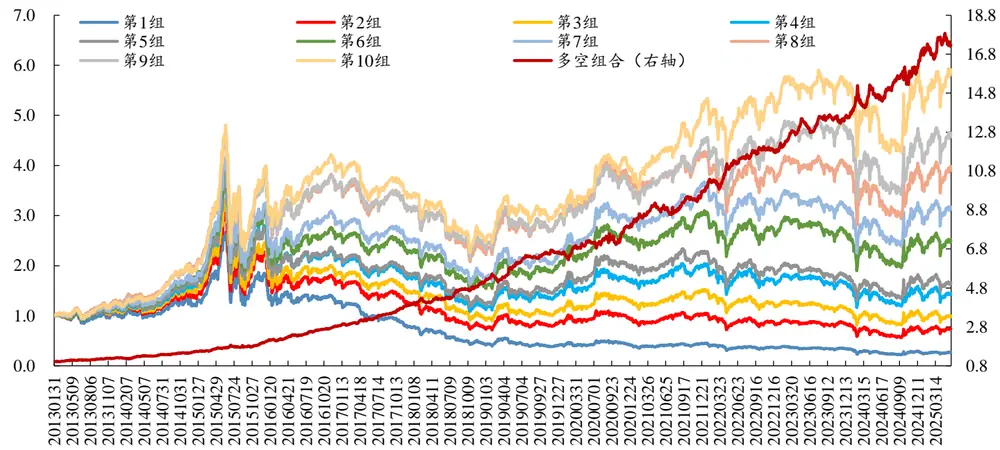
数据来源：Wind、开源证券研究所

从分年度表现来看，峰岭成交比因子多空组合所有年份均录得正收益，2025 年收益偏低，其余年份均有较高收益表现，多数年份收益超 20%。

表12：峰岭成交比因子全市场多空分年度表现：多数年份收益超 20%

| 年份 | 年化收益率 年化 IR 最大回撤 |
| --- | --- |
| 2013 25.35% 2.61 | 3.21% |
| 2014 24.91% | 2.95 5.90% |
| 2015 37.46% | 3.43 6.18% |
| 2016 41.09% |  |
| 2017 39.21% | 4.67 4.18% |
|  | 4.65 3.04% 3.56 5.77% |
| 2018 31.72% 2019 28.56% | 3.44 7.88% |
| 2020 21.89% 2021 23.19% | 1.77 7.26% 2.46 6.55% |
| 2022 22.18% |  |
|  | 2.58 5.04% |
| 2023 14.48% 2024 26.03% | 2.41 5.37% 2.43 7.50% |
| 2025（截至5月） |  |
| 5.13% 2015-2025.5 27.13% | 0.52 4.61% 2.89 7.88% |

数据来源：Wind、开源证券研究所

## 7.3、 喷发成交额跟随比例因子多空年化收益 30.09%

如前文所述，将喷发成交划分为量峰与量岭，二者均代表大额成交时点，但区别在于，量峰的大额成交没有资金跟随，量岭的大额成交有资金跟随。因此，本节将过去20日喷发成交时点的总成交额作为分母，将喷发成交时点的下一分钟总成交额作为分子，从而衡量大额成交后的资金跟随程度，作为喷发成交额跟随比例因子，资金跟随程度越高，则个股交易中的个人投资者交易占比越高，个股未来表现越弱。

喷发成交额跟随比例因子 RankIC 均值-10.59%，RankICIR-3.9。从全市场表现来看，多头组年化收益率 16.13%，多空组合年化收益率30.09%，年化IR2.85，最大回撤 9.8%，月度胜率 73.65%。

图16：喷发成交额跟随比例因子全市场多空年化收益30.09%
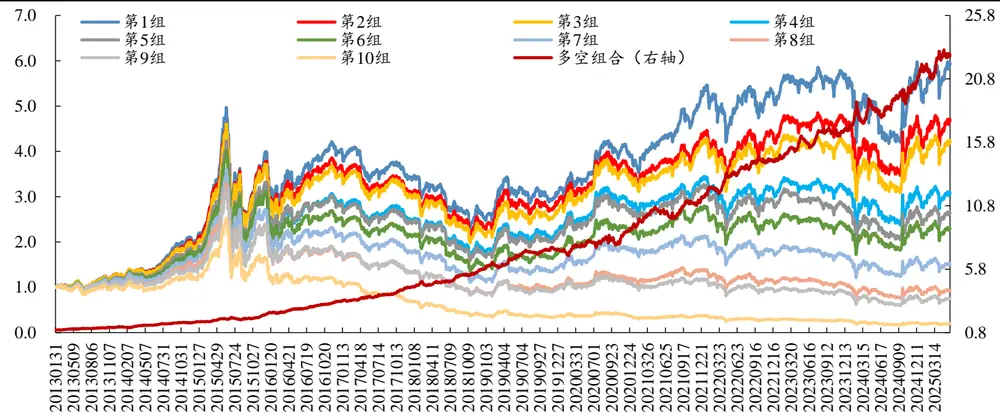
数据来源：Wind、开源证券研究所

从分年度表现来看，喷发成交额跟随比例因子多空组合所有年份均录得正收益，且多数年份收益超20%。

表13：喷发成交额跟随比例因子全市场多空分年度表现：所有年份正收益

| 年份 年化收益率 | 年化 IR 最大回撤 |
| --- | --- |
| 2013 29.73% | 2.87 3.27% |
| 2014 29.93% | 3.24 6.33% |
| 2015 41.22% | 3.40 9.80% |
| 2016 46.58% | 5.04 4.63% |
| 2017 35.19% |  |
| 2018 36.24% | 3.80 3.39% 3.74 7.06% |
| 2019 24.39% | 2.78 6.91% |
| 2020 23.10% | 1.59 9.25% |
| 2021 29.37% | 2.55 8.57% |
| 2022 26.93% | 2.79 4.63% |
| 2023 15.97% | 2.30 5.60% |
| 2024 30.60% | 2.49 8.93% |
| 2025（截至5月） 13.35% | 1.09 5.25% |
| 2015-2025.5 30.09% | 2.85 9.80% |

数据来源：Wind、开源证券研究所

类似逻辑下，我们构建了喷发成交额敏感度因子与喷发成交额相关性因子。

我们将过去20日喷发成交时点分钟成交额作为自变量，将喷发成交时点的下一分钟成交额作为因变量，从而衡量分钟成交额对大额成交的敏感度，作为喷发成交额敏感度因子。喷发成交额敏感度因子 RankIC 均值-7.14%，RankICIR-3.58。从全市场表现来看，多头组年化收益率 13.96%，多头收益贡献显著，多空组合年化收益率15.61%，年化 IR2.18，最大回撤 8.31%，月度胜率 69.59%。

我们计算过去20日喷发成交时点分钟成交额与下一分钟成交额的相关系数，作为喷发成交额相关性因子。喷发成交额相关性因子 RankIC 均值-10.94%，RankICIR-3.99。从全市场表现来看，多头组年化收益率15.12%，多空组合年化收益率 29.72%，年化 IR2.73，最大回撤 11.54%，月度胜率 75.7%。

## 7.4、 同时点峰岭数相关性因子多空年化收益 22.78%

本小节，我们统计过去20日同一时点的量峰与量岭样本数，并计算二者相关性，作为同时点峰岭数相关性因子。

同时点峰岭数相关性因子 RankIC 均值-6.67%，RankICIR-4.4。从全市场表现来看，多头组年化收益率 10.09%，多空组合年化收益率22.78%，年化IR3.27，最大回撤 8.39%，月度胜率 80.4%。

图17：同时点峰岭数相关性因子全市场多空年化收益22.78%
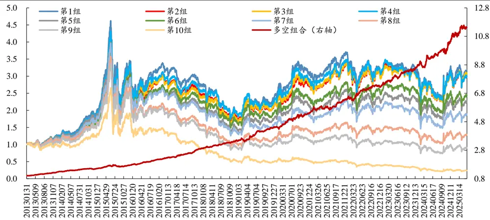
数据来源：Wind、开源证券研究所

从分年度表现来看，同时点峰岭数相关性因子多空组合所有年份均录得正收益，且多数年份收益较高。

表14：同时点峰岭数相关性因子全市场多空分年度表现：所有年份正收益

| 年份 | 年化收益率 年化 IR 最大回撤 |
| --- | --- |
| 2013 33.83% | 5.71 1.88% |
| 2014 | 15.41% 2.92 4.11% |
| 2015 19.47% | 2.18 8.39% |
| 2016 30.05% | 5.54 3.10% |
| 2017 30.13% | 4.62 2.31% |
| 2018 19.18% | 3.41 2.12% |
| 2019 28.30% | 3.86 6.95% |
| 2020 23.29% | 2.67 4.47% |
| 2021 17.91% | 2.61 4.70% |
| 2022 15.85% | 2.46 4.36% |
| 2023 18.37% | 3.52 3.10% |
| 2024 28.28% | 3.37 4.95% |
| 2025（截至5月） 10.72% | 1.10 2.82% |
| 2015-2025.5 22.78% | 3.27 8.39% |

数据来源：Wind、开源证券研究所

从分域表现来看，同时点峰岭数相关性因子在沪深 300 中，多空组合年化收益率 6.07%，年化 IR0.83；在中证 500 中，多空组合年化收益率 9.96%，年化 IR1.44；在中证 1000中，多空组合年化收益率18.13%，年化IR2.9。

图18：同时点峰岭数相关性因子分域多空表现：偏向小市值股票池
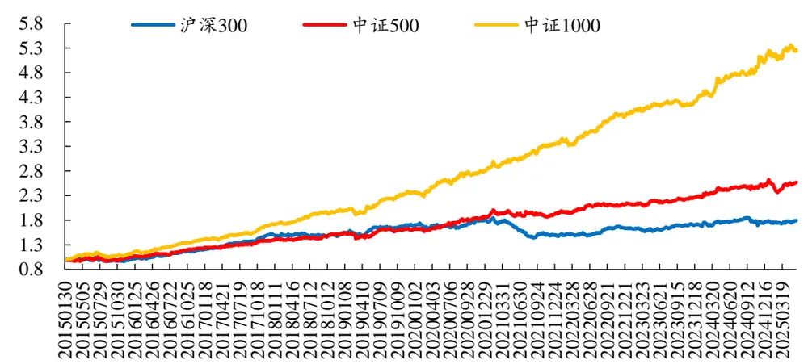
数据来源：Wind、开源证券研究所（统计区间：20150101-20250531）

从分年度表现来看，同时点峰岭数相关性因子在沪深 300 中，2021 年出现较高负收益。在中证500中，仅2025年出现负收益，其余年份均录得正收益。在中证 1000中，所有年份均录得正收益。

表15：同时点峰岭数相关性因子分域多空分年度年化收益表现：2023、2025年偏弱

| 年份 | 沪深300 中证500 中证1000 |
| --- | --- |
| 2015 -0.06% | 5.12% 13.51% |
| 2016 20.80% | 18.74% 26.62% |
| 2017 26.37% | 13.34% 22.70% |
| 2018 3.25% |  |
| 2019 | 9.99% 16.92% |
| 9.02% | 6.67% 19.17% 19.11% |
| 2020 7.50% 2021 -18.52% | 14.97% |
|  | 4.64% 20.43% |
| 2022 10.48% 2023 4.73% | 10.57% 18.99% 6.49% 7.43% |
| 2024 4.21% |  |
|  | 14.40% 22.68% |
| 2025（截至5月） 2.28% 2015-2025.5 6.07% | -2.36% 3.25% 9.96% 18.13% |

数据来源：Wind、开源证券研究所（统计区间：20150101-20250531）

## 8、 补充材料：因子相关性及分域表现

本报告中，我们通过将日内分钟成交量按照“峰、岭、谷”划分，从而对日内信息进行切割，基于此构建了11个大类共20 个有效因子。从与Barra风格因子相关性来看，部分因子在波动率、流动性上有较高暴露（如分钟数类因子、时间间隔统计指标类因子等）。

表16：与Barra风格因子相关性

| 因子编号 | 因子名 | Beta | 规模 | 非线性规模 | 估值 | 成长 | 盈利质量 | 动量 | 波动率 | 流动性 | 杠杆率 |
| --- | --- | --- | --- | --- | --- | --- | --- | --- | --- | --- | --- |
| f1 | 量峰分钟数 | -14% | -21% | -2% | 25% | -5% | 11% | -19% | -43% | -49% | 2% |
| f2 | 量岭分钟数 | 28% | 29% | 4% | -24% | 11% | -2% | 26% | 36% | 62% | -7% |
| f3 | 量岭分钟收益 | 5% | 7% | 4% | -17% | 0% | -11% | 4% | 20% | 19% | -1% |
| f4 | 量岭相对加权价 | 7% | 0% | 0% | -12% | -3% | -10% | 4% | 18% | 21% | -1% |
| f5 | 量谷相对加权价 | -12% | 4% | 1% | 13% | 5% | 14% | -1% | -24% | -30% | 1% |
| f6 | 量峰加权价格分位 | 7% | -5% | -5% | 0% | -1% | 2% | 4% | -7% | -1% | -6% |
| f7 | 量谷加权价格分位 | 3% | -4% | -2% | 6% | 1% | 7% | 0% | -20% | -15% | -5% |
| f8 | 量峰间隔标准差 | 15% | 25% | 3% | -22% | 7% | -6% | 20% | 36% | 48% | -1% |
| f9 | 量峰间隔偏度 | -12% | -15% | -1% | 15% | -2% | 7% | -13% | -28% | -39% | 0% |
| f10 | 量峰间隔峰度 | -11% | -13% | -1% | 13% | -1% | 7% | -11% | -25% | -35% | -1% |
| f11 | 量岭间隔标准差 | -17% | -16% | -1% | 18% | -6% | 4% | -15% | -31% | -41% | 4% |
| f12 | 量岭间隔偏度 | 17% | 22% | 2% | -20% | 7% | -3% | 17% | 34% | 45% | -3% |
| f13 | 量岭间隔峰度 | 17% | 22% | 2% | -19% | 7% | -3% | 17% | 34% | 44% | -3% |
| f14 | 峰岭加权价格比 | -7% | 5% | 0% | 7% | 3% | 9% | -1% | -12% | -15% | 0% |
| f15 | 谷岭加权价格比 | -20% | 9% | 2% | 12% | 5% | 13% | -7% | -26% | -30% | 4% |
| f16 | 峰岭成交比 | -22% | -19% | -1% | 23% | -5% | 10% | -18% | -42% | -57% | 3% |
| f17 | 喷发成交额跟随比例 | 26% | 29% | 3% | -24% | 8% | -6% | 21% | 41% | 60% | -3% |
| f18 | 喷发成交额敏感度 | 21% | 8% | 1% | -12% | 1% | -9% | 6% | 27% | 43% | 0% |
| f19 | 喷发成交额相关性 | 25% | 15% | 3% | -22% | 2% | -13% | 17% | 43% | 60% | -1% |
| f20 | 同时点峰岭数相关性 | 9% | 6% | 1% | -8% | -2% | -7% | 5% | 19% | 30% | 1% |

数据来源：Wind、开源证券研究所

从因子间相关性来看，量峰分钟数因子与多个因子存在较高相关性。其中，与量岭分钟数因子负相关 69%，与量峰间隔标准差、峰岭成交比、喷发成交额跟随比例等因子相关性绝对水平超过 80%，属于同一逻辑的不同表达。量峰间隔峰度因子与量峰间隔偏度因子之间相关性高达 98%。量谷加权价格分位因子与量峰加权价格分位因子之间相关性 66%。

表17：因子间相关性

|  | f16 |  | f17 | f8 f19 | f12 | f13 | f11 | f2 | f18 | f10 | f9 | f15 | f20 | f5 | f4 | f14 | f3 | f7 | f6 |
| --- | --- | --- | --- | --- | --- | --- | --- | --- | --- | --- | --- | --- | --- | --- | --- | --- | --- | --- | --- |
| f1 | 90 | -84 | -81 | -78 | -77 | -75 | 70 | -69 | -54 | 58 | 63 | 50 | -46 | 48 | -30 | 23 | -30 | 28 | 9 |
| f16 |  | -94 | -79 | -90 | -82 | -80 | 74 | -85 | -72 | 58 | 62 | 56 | -52 | 52 | -31 | 28 | -33 | 28 | 10 |
| f17 |  |  | 74 | 89 | 82 | 80 | -74 | 86 | 69 | -53 | -57 | -51 | 48 | -49 | 30 | -24 | 30 | -25 | -7 |
| f8 |  |  |  | 63 | 68 | 66 | -53 | 71 | 44 | -45 | -50 | -42 | 50 | -43 | 28 | -22 | 29 | -25 | -8 |
| f19 |  |  |  |  | 72 | 70 | -68 | 74 | 74 | -51 | -55 | -53 | 46 | -52 | 32 | -27 | 30 | -27 | -8 |
| f12 |  |  |  |  |  | 100 | -74 | 76 | 53 | -40 | -44 | -50 | 41 | -40 | 23 | -18 | 24 | -21 | -7 |
| f13 |  |  |  |  |  |  | -74 | 75 | 52 | -39 | -42 | -49 | 40 | -39 | 22 | -17 | 23 | -20 | -7 |

| f16 f17 f8 f19 f12 f13 | f11 f2 | f18 | f10 | f9 |  | f15 | f20 | f5 | f4 | f14 | f3 | f7 | f6 |
| --- | --- | --- | --- | --- | --- | --- | --- | --- | --- | --- | --- | --- | --- |
| f11 |  | -68 | -53 | 35 | 38 | 48 | -31 | 36 | -20 | 15 | -20 | 17 | 5 |
| f2 |  |  | 54 | -48 | -52 | -41 | 45 | -39 | 26 | -20 | 26 | -18 | -3 |
| f18 |  |  |  | -37 | -39 | -47 | 32 | -41 | 23 | -28 | 20 | -22 | -12 |
| f10 |  |  |  |  | 98 | 31 | -40 | 32 | -21 | 18 | -20 | 19 | 7 |
| f9 |  |  |  |  |  | 33 | -43 | 34 | -22 | 19 | -22 | 20 | 7 |
| f15 |  |  |  |  |  |  | -32 | 46 | -25 | 25 | -22 | 19 | 6 |
| f20 |  |  |  |  |  |  |  | -35 | 21 | -18 | 21 | -20 | -7 |
| f5 |  |  |  |  |  |  |  |  | -67 | 56 | -52 | 45 | 9 |
| f4 |  |  |  |  |  |  |  |  |  | -80 | 45 | -35 | -10 |
| f14 |  |  |  |  |  |  |  |  |  |  | -32 | 37 | 36 |
| f3 |  |  |  |  |  |  |  |  |  |  |  | -23 | -10 |
| f7 |  |  |  |  |  |  |  |  |  |  |  |  | 66 |

数据来源：Wind、开源证券研究所（单位：%，编号对应因子名参考表 16）
如表 18所示，多数因子在 Barra风格、行业中性后，仍保持较高有效性。

表18：本报告因子表现汇总

| 因子名 | 市值、行业中性 RankIC 均值 | 市值、行业中性 RankICIR | Barra 风格、行业中性 RankIC 均值 | Barra 风格、行业中性 RankICIR | 多空组合（市值、行业中性）年化收益率 | 多空组合（市值、行业中性）年化 IR | 多空组合（市值、行业中性）最大回撤 | 多空组合（市值、行业中性）月度胜率 |
| --- | --- | --- | --- | --- | --- | --- | --- | --- |
| 量峰分钟数 | 10.62% | 4.36 | 5.49% | 3.79 | 31.58% | 3.22 | 9.43% | 79.73% |
| 量岭分钟数 | -9.04% | -3.13 | -3.43% | -2.42 | 26.20% | 2.20 | 15.56% | 69.59% |
| 量岭分钟收益 | -6.29% | -3.55 | -3.16% | -1.92 | 14.98% | 1.73 | 13.84% | 70.27% |
| 量岭相对加权价 | -6.27% | -3.77 | -3.31% | -2.39 | 17.99% | 2.27 | 10.49% | 77.03% |
| 量谷相对加权价 | 8.69% | 4.44 | 4.87% | 2.82 | 25.35% | 3.04 | 12.59% | 79.73% |
| 量峰加权价格分位 | 3.47% | 2.90 | 2.24% | 2.44 | 11.20% | 1.88 | 11.80% | 71.62% |
| 量谷加权价格分位 | 6.34% | 4.32 | 3.79% | 3.33 | 20.22% | 3.29 | 10.18% | 80.41% |
| 量峰间隔标准差 | -8.57% | -3.99 | -3.56% | -3.19 | 25.66% | 2.93 | 9.86% | 79.05% |
| 量峰间隔偏度 | 7.68% | 4.58 | 3.52% | 4.31 | 24.56% | 3.37 | 7.56% | 80.41% |
| 量峰间隔峰度 | 7.19% | 4.63 | 3.24% | 4.33 | 23.30% | 3.39 | 7.37% | 82.43% |
| 量岭间隔标准差 | 7.34% | 3.75 | 2.74% | 2.34 | 18.41% | 2.23 | 8.63% | 70.27% |
| 量岭间隔偏度 | -8.08% | -3.82 | -2.98% | -2.33 | 22.19% | 2.66 | 7.07% | 73.65% |
| 量岭间隔峰度 | -7.61% | -3.77 | -2.28% | -1.77 | 19.47% | 2.45 | 7.21% | 72.30% |
| 峰岭加权价格比 | 4.70% | 3.61 | 2.75% | 2.57 | 10.31% | 1.81 | 11.41% | 68.92% |
| 谷岭加权价格比 | 6.98% | 3.56 | 2.90% | 1.83 | 15.83% | 1.83 | 11.73% | 72.30% |
| 峰岭成交比 | 10.28% | 4.07 | 3.77% | 2.66 | 27.13% | 2.89 | 7.88% | 74.32% |
| 喷发成交额跟随比例 | -10.59% | -3.90 | -4.82% | -3.28 | 30.09% | 2.85 | 9.80% | 73.65% |
| 喷发成交额敏感度 | -7.14% | -3.58 | -2.72% | -2.25 | 15.61% | 2.18 | 8.31% | 69.59% |
| 喷发成交额相关性 | -10.94% | -3.99 | -5.35% | -3.51 | 29.72% | 2.73 | 11.54% | 75.68% |
| 同时点峰岭数相关性 | -6.67% | -4.40 | -3.29% | -3.53 | 22.78% | 3.27 | 8.39% | 80.41% |

数据来源：Wind、开源证券研究所

由于篇幅限制，前文仅从因子间相关性维度出发，挑选个别相关性偏低的因子做分域回测，其余因子在各分域有效性可参考表 19。

表19：本报告因子分域RankICIR表现

| 因子名 | 沪深300 |  | 中证500 |  | 中证1000 |  |
| --- | --- | --- | --- | --- | --- | --- |
|  | RankIC | IR | RankIC | IR | RankIC | IR |
| 量峰分钟数 | 5.96% | 2.06 | 7.26% | 2.85 | 10.11% | 4.21 |
| 量岭分钟数 | -4.88% | -1.67 | -5.87% | -2.07 | -8.73% | -3.11 |
| 量岭分钟收益 | -2.70% | -1.26 | -3.38% | -1.67 | -5.30% | -2.65 |
| 量岭相对加权价 | -4.09% | -1.87 | -4.13% | -2.12 | -5.60% | -3.01 |
| 量谷相对加权价 | 5.21% | 2.11 | 5.89% | 2.61 | 8.19% | 3.90 |
| 量峰加权价格分位 | 3.34% | 1.61 | 2.82% | 1.71 | 2.59% | 1.72 |
| 量谷加权价格分位 | 4.20% | 1.81 | 5.01% | 2.61 | 5.64% | 3.31 |
| 量峰间隔标准差 | -3.97% | -1.57 | -5.49% | -2.43 | -8.23% | -3.89 |
| 量峰间隔偏度 | 4.74% | 2.02 | 5.22% | 2.78 | 7.37% | 4.12 |
| 量峰间隔峰度 | 4.34% | 1.95 | 4.97% | 2.82 | 6.92% | 4.09 |
| 量岭间隔标准差 | 3.50% | 1.77 | 4.45% | 2.11 | 6.70% | 3.40 |
| 量岭间隔偏度 | -3.38% | -1.54 | -5.04% | -2.33 | -7.49% | -3.61 |
| 量岭间隔峰度 | -3.05% | -1.43 | -4.60% | -2.22 | -7.05% | -3.55 |
| 峰岭加权价格比 | 3.77% | 2.02 | 3.62% | 2.12 | 3.97% | 2.63 |
| 谷岭加权价格比 | 4.45% | 1.83 | 4.94% | 2.19 | 6.16% | 2.78 |
| 峰岭成交比 | 5.78% | 2.06 | 6.85% | 2.63 | 9.75% | 3.83 |
| 喷发成交额跟随比例 | -5.49% | -1.83 | -7.05% | -2.56 | -10.05% | -3.71 |
| 喷发成交额敏感度 | -4.61% | -1.87 | -5.29% | -2.25 | -6.65% | -3.05 |
| 喷发成交额相关性 | -6.53% | -2.04 | -7.90% | -2.78 | -10.24% | -3.53 |
| 同时点峰岭数相关性 | -4.21% | -1.82 | -4.58% | -2.65 | -6.80% | -3.91 |

数据来源：Wind、开源证券研究所

## 9、 风险提示

模型测试基于历史数据，市场未来可能发生变化。

## 特别声明

《证券期货投资者适当性管理办法》、《证券经营机构投资者适当性管理实施指引（试行）》已于2017年7月1日起正式实施。根据上述规定，开源证券评定此研报的风险等级为R3（中风险），因此通过公共平台推送的研报其适用的投资者类别仅限定为专业投资者及风险承受能力为C3、C4、C5的普通投资者。若您并非专业投资者及风险承受能力为C3、C4、C5的普通投资者，请取消阅读，请勿收藏、接收或使用本研报中的任何信息。

因此受限于访问权限的设置，若给您造成不便，烦请见谅！感谢您给予的理解与配合。

## 分析师承诺

负责准备本报告以及撰写本报告的所有研究分析师或工作人员在此保证，本研究报告中关于任何发行商或证券所发表的观点均如实反映分析人员的个人观点。负责准备本报告的分析师获取报酬的评判因素包括研究的质量和准确性、客户的反馈、竞争性因素以及开源证券股份有限公司的整体收益。所有研究分析师或工作人员保证他们报酬的任何一部分不曾与，不与，也将不会与本报告中具体的推荐意见或观点有直接或间接的联系。

## 股票投资评级说明

|  | 评级 | 说明 |
| --- | --- | --- |
| 证券评级 | 买入（Buy） | 预计相对强于市场表现20%以上； |
|  | 增持（outperform） | 预计相对强于市场表现5%～20%； |
|  | 中性（Neutral） | 预计相对市场表现在—5%～+5%之间波动； |
|  | 减持（underperform） | 预计相对弱于市场表现5%以下。 |
| 行业评级 | 看好（overweight） | 预计行业超越整体市场表现； |
|  | 中性（Neutral） | 预计行业与整体市场表现基本持平； |
|  | 看淡（underperform） | 预计行业弱于整体市场表现。 |
| 备注：评级标准为以报告日后的6~12个月内，证券相对于市场基准指数的涨跌幅表现，其中A股基准指数为沪深300指数、港股基准指数为恒生指数、新三板基准指数为三板成指（针对协议转让标的）或三板做市指数（针对做市转让标的)、美股基准指数为标普500或纳斯达克综合指数。我们在此提醒您，不同证券研究机构采用不同的评级术语及评级标准。我们采用的是相对评级体系，表示投资的相对比重建议；投资者买入或者卖出证券的决定取决于个人的实际情况，比如当前的持仓结构以及其他需要考虑的因素。投资者应阅读整篇报告，以获取比较完整的观点与信息，不应仅仅依靠投资评级来推断结论。 |  |  |

## 分析、估值方法的局限性说明

本报告所包含的分析基于各种假设，不同假设可能导致分析结果出现重大不同。本报告采用的各种估值方法及模型均有其局限性，估值结果不保证所涉及证券能够在该价格交易。

## 法律声明

开源证券股份有限公司是经中国证监会批准设立的证券经营机构，已具备证券投资咨询业务资格。

本报告仅供开源证券股份有限公司（以下简称“本公司”）的机构或个人客户（以下简称“客户”）使用。本公司不会因接收人收到本报告而视其为客户。本报告是发送给开源证券客户的，属于商业秘密材料，只有开源证券客户才能参考或使用，如接收人并非开源证券客户，请及时退回并删除。

本报告是基于本公司认为可靠的已公开信息，但本公司不保证该等信息的准确性或完整性。本报告所载的资料、工具、意见及推测只提供给客户作参考之用，并非作为或被视为出售或购买证券或其他金融工具的邀请或向人做出邀请。本报告所载的资料、意见及推测仅反映本公司于发布本报告当日的判断，本报告所指的证券或投资标的的价格、价值及投资收入可能会波动。在不同时期，本公司可发出与本报告所载资料、意见及推测不一致的报告。客户应当考虑到本公司可能存在可能影响本报告客观性的利益冲突，不应视本报告为做出投资决策的唯一因素。本报告中所指的投资及服务可能不适合个别客户，不构成客户私人咨询建议。本公司未确保本报告充分考虑到个别客户特殊的投资目标、财务状况或需要。本公司建议客户应考虑本报告的任何意见或建议是否符合其特定状况，以及（若有必要）咨询独立投资顾问。在任何情况下，本报告中的信息或所表述的意见并不构成对任何人的投资建议。在任何情况下，本公司不对任何人因使用本报告中的任何内容所引致的任何损失负任何责任。若本报告的接收人非本公司的客户，应在基于本报告做出任何投资决定或就本报告要求任何解释前咨询独立投资顾问。投资者应自主作出投资决策并自行承担投资风险，任何形式的分享证券投资收益或者分担证券投资损失的书面或口头承诺均为无效。

本报告可能附带其它网站的地址或超级链接，对于可能涉及的开源证券网站以外的地址或超级链接，开源证券不对其内容负责。本报告提供这些地址或超级链接的目的纯粹是为了客户使用方便，链接网站的内容不构成本报告的任何部分，客户需自行承担浏览这些网站的费用或风险。

开源证券在法律允许的情况下可参与、投资或持有本报告涉及的证券或进行证券交易，或向本报告涉及的公司提供或争取提供包括投资银行业务在内的服务或业务支持。开源证券可能与本报告涉及的公司之间存在业务关系，并无需事先或在获得业务关系后通知客户。

本报告的版权归本公司所有。本公司对本报告保留一切权利。除非另有书面显示，否则本报告中的所有材料的版权均属本公司。未经本公司事先书面授权，本报告的任何部分均不得以任何方式制作任何形式的拷贝、复印件或复制品，或再次分发给任何其他人，或以任何侵犯本公司版权的其他方式使用。所有本报告中使用的商标、服务标记及标记均为本公司的商标、服务标记及标记。

## 开源证券研究所

上海

地址：上海市浦东新区世纪大道1788号陆家嘴金控广场1号

深圳

地址：深圳市福田区金田路2030号卓越世纪中心1号

楼3层

楼45层

邮编：200120

邮编：518000

邮箱：research@kysec.cn

邮箱：research@kysec.cn

北京

地址：北京市西城区西直门外大街18号金贸大厦C2座9层

西安

地址：西安市高新区锦业路1号都市之门B座5层

邮编：100044

邮箱：research@kysec.cn

邮编：710065

邮箱：research@kysec.cn