张 翔（分析师）

证书编号：S0790520110001

傅开波（分析师）

证书编号：S0790519120001

魏建榕（首席分析师）

2025 年 07 月 26 日

## 金融工程研究团队

证书编号：S0790520090003

## 高 鹏（分析师）

证书编号：S0790520090002

## 苏俊豪（分析师）

证书编号：S0790522020001

## 胡亮勇（分析师）

证书编号：S0790522030001

## 王志豪（分析师）

证书编号：S0790522070003

## 盛少成（分析师）

证书编号：S0790121070009

## 苏 良（分析师）

证书编号：S0790121070008

## 何申昊（分析师）

证书编号：S0790524070009

## 蒋 韬（分析师）

证书编号：S0790525070001

## 相关研究报告

《A 股反转之力的微观来源》-2019。12.23

# 因子切割论与深度学习的结合应用

《振幅因子的隐藏结构》-2020.05.16

《 主 动 买 卖 因 子 的 正 确 用 法 》2020.09.05

《因子切割论》-2020.09.16

《遗传算法赋能交易行为因子》-2023.08.06

# ——市场微观结构研究系列（28）

## 魏建榕（分析师）

weijianrong@kysec.cn

苏俊豪（分析师）

sujunhao@kysec.cn

证书编号：S0790519120001

证书编号：S0790522020001

## 因子切割论：剖析市场精细结构的利器

事物内部的各要素之间，往往存在着对立统一的矛盾。在金融市场中，当人们普遍预期的行为模式未能出现时，常常只是因为代理变量选得不好，以致未能窥见其内部更为本质的精细结构。我们在近十几年的因子研究历程中，既收获了大量个性鲜明的独家因子，也从中领悟了系统普适的方法论——因子切割论。

我们以理想反转因子的构造过程为例，归纳出因子切割论的三要素：对象、刀法、产出。

对象：具有可加性的目标变量

刀法：有区分能力的切割指标

产出：对切割后变量的再加工

## DBD-GRU模型：因子切割论与深度学习的有机结合

我们将切割论思想与深度学习有机结合，构造出双分支差异网络模型（Dual-Branch Difference GRU，以下简称 DBD-GRU 模型）在 DBD-GRU 模型中，假设输入的数据 x 包含了 A、B 两个特征，其中特征 A 为切割指标。我们以特征A在时序上的中位数为阈值，构造两个掩码 mask_Ahigh和 mask_Alow，将使用掩码处理后的数据分别输入两个分支网络 GRU_high和 GRU_low中。取两个网络最后一个时间步的差异输入输出层。

## DBD-GRU模型因子表现优异

我们使用 DBD-GRU 模型改进了切割论的三个因子：理想振幅因子、理想反转因子、主动买卖因子；同时作为对比，也将相同数据输入 GRU模型中，将其作为基线模型。

与原始切割论因子和基线模型的 GRU 因子相比，DBD-GRU 模型因子表现优异，测试区间（201412~202505）内，理想振幅-DBD、理想反转-DBD、主动买卖-DBD 因子的 RankIC 分别为-10.33%、-10.31%、-9.81%。

DBD-GRU 模型在剔除对应的切割论因子与 GRU 因子后仍有较好的表现，这表明 DBD-GRU 模型并非只是以上两者的简单叠加，而是提供了较多的信息增量，作为对比，GRU模型因子在剔除 DBD-GRU因子后表现不佳。

我们将 DBD-GRU 模型的三个因子对称正交处理后等权合成，得到 DBD-Combine 因子，DBD-Combine 因子在主流宽基指数中均有较好表现，在沪深300、中证 500、 中证 1000 成 分股中的 RankIC 分别为-5.76%、-7.40%、-9.84%。应用于指增组合时，在中证 1000 中的超额年化收益为 11.8%，超额 IR为2.21，表现优秀。

- 风险提示：模型基于历史数据测试，市场未来可能发生重大改变。

事物内部的各要素之间，往往存在着对立统一的矛盾。在金融市场中，当人们普遍预期的行为模式未能出现时，常常只是因为代理变量选得不好，以致未能窥见其内部更为本质的精细结构。我们在近十几年的因子研究历程中，既收获了大量个性鲜明的独家因子，也从中领悟了系统普适的方法论——因子切割论，详见我们于2020年9月发布的专题报告《因子切割论》（魏建榕、苏俊豪）。

在 2023 年的专题报告《遗传算法赋能交易行为因子》（魏建榕，盛少成）中，我们创新性地提出“切割算子”，并结合其他算子和变量，利用改进的遗传算法流程，经过 1 轮 10 代的挖掘，得到了开源金工遗传算法因子，因子在样本内外整体表现优异。本篇报告我们尝试将因子切割论思想与神经网络模型结合，提升模型的信息提炼能力与预测效果。开源证券长期关注金融科技发展，本项研究的高效开展，得益于开源证券总部高性能服务器资源的稳定算力支持。

## 1、 因子切割论回顾：剖析市场精细结构的利器

我们以开源金工“理想反转因子”的开发过程为例展开讨论。众所周知，A股市场中的反转效应比较显著，典型的代理变量可取为Ret20（最近20日的区间收益率）。然而，反转因子Ret20一方面是收益很强劲，另一方面却是稳定性很不理想、常常出现较大回撤。在这种“用之不安、弃之可惜”的困境下，对传统反转因子的改进，是一个非常具有吸引力的课题。

我们最初的灵感触发点，是来自咖啡店里一件非常简单直白的事情：既然花式咖啡的成分里可以有苦有甜，那么涨跌幅的成分里为何不能区分出反转和动量？我们留意到，传统反转因子本质上是一段区间的涨跌幅，可以被很自然地拆分为许多更小的时段。那么，会不会存在这样的情况：组成传统反转因子的各个时段中，某些时段贡献了很强的反转，而某些时段只是贡献了很弱的反转、甚至是贡献了动量效应？换而言之，信息在时间轴上的分布可能是不均匀的。这是我们分析的出发点。

图1：信息在时间轴上的分布不均匀（示意图）
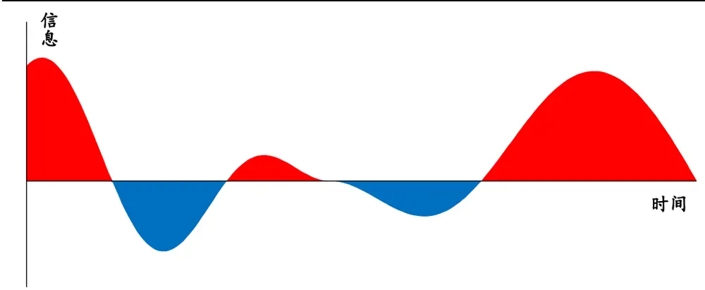
资料来源：开源证券研究所

面对分布不均匀的市场信息，我们的处理方法也是如出一辙——切割。切割是剖析精细结构、寻找最优变量的有效方法。下面以我们独家理想反转因子的构造过程为例，阐述开源金工因子切割论的思想：

（1）对选定股票，回溯取其过去20日的数据；

（2）计算该股票每日的平均单笔成交金额（成交金额/成交笔数）；

（3）单笔成交金额高的10个交易日，涨跌幅加总，记作 M_high；

（4）单笔成交金额低的10个交易日，涨跌幅加总，记作 M_low；

（5）理想反转因子 M = M_high–M_low；

（6）对所有股票，都进行以上操作，计算每只股票的理想反转因子M。

我们从前文讨论中可以归纳出因子切割论的三个要素：

对象：具有可加性的目标变量

刀法：有区分能力的切割指标

产出：对切割后变量的再加工

关于对象。我们要求对象要具有可加性。所谓可加性，是指在时间轴上对“整体”进行分割后所得到的“部分”，其变量含义保持不变，并且可以重新进行组合加总。在“理想反转因子”的步骤中，切割对象为股票的涨跌幅。涨跌幅是具有可加性的母变量，股票20日的总涨跌幅被拆分为逐日的涨跌幅，进而被重新分组加总为M_high和M_low两个子变量。具有类似性质的对象，还有换手率、成交量、日均振幅等常见量价指标，而流通市值、市盈率等指标则显然不具有可加性。

关于刀法。对信息有区分能力的指标则犹如盘古开天辟地的大斧，是切割论的核心所在。在“理想反转因子”的构造中，我们选定了股票每日的“平均单笔成交金额”作为切割指标。我们根据切割指标的大小，把股票的逐日涨跌幅分为两组，若两组之间表现出显著差异，则说明我们的切割达到了目的。

图2：M_high与 M_low 的累计 IC 差异显著
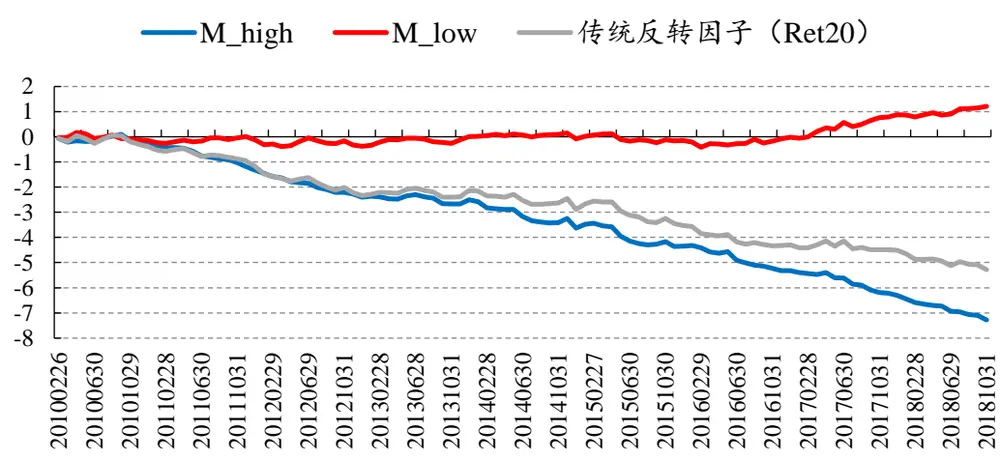
数据来源：Wind、开源证券研究所

切割指标的形式和来源，往往需要我们不拘一格、匠心独运。在开源金工独家的众多交易行为因子中：聪明钱因子使用“机构参与痕迹”在分钟数据上进行切割，APM因子直接以“日内交易时段”为依据切割，理想振幅因子则以“股票高低价态”为切割指标。

表1：基于因子切割论的模型汇总

| 因子模型名称 | 对象 | 刀法 | 报告原文 |
| --- | --- | --- | --- |
| 聪明钱因子 | 成交均价 | 机构参与痕迹 | 《聪明钱因子模型的2.0版本》，20200209 |
| APM 因子 | 涨跌幅 | 日内交易时段 | 《APM因子模型的进阶版》，20200307 |
| 理想反转因子 | 涨跌幅 | 平均单笔成交金额 | 《A股反转之力的微观来源》，20191223 |
| 理想振幅因子 | 振幅均值 | 股价 | 《振幅因子的隐藏结构》，20200512 |
| 长端动量因子 | 长端涨跌幅 | 振幅 | 《A股市场中如何构造动量因子？》，20200721 |
| 主动买卖因子 | 主动买卖比率 | 日度涨跌幅 | 《主动买卖因子的正确用法》，20200905 |
| 行业黄金律模型 | 行业动量因子 | 日内交易时段 | 《A股行业动量的精细结构》，20200302 |
| 行业龙头股模型 | 行业动量因子 | 龙头股/非龙头股 |  |

资料来源：开源证券研究所

关于产出。切割完成之后，我们对信息进一步加工便可得到最终产出。我们可以单独选用切割后信息含量高的部分，作为新因子的代理变量，此时切割过程相当于起到了沙里淘金、信息提纯的作用。在更多情况下，我们推荐使用“相减或相除”的操作，把切割后的各部分信息都纳入到新因子的构造中。“相减或相除”在隐蔽之处起到了“标准化”的重要作用。被减去的部分，通常并未带来显著的收益增量，却提供了公允标准化的水准线，从而最终提升了因子的稳定性。

表2：相减的操作提升了因子稳定性

|  | M_high | 理想反转因子（M_high-M_low） |
| --- | --- | --- |
| IC均值 | -0.069 | -0.057 |
| 多空组合信息比率 | 1.98 | 2.51 |

数据来源：Wind、开源证券研究所（测试区间：201004~202004）

关于逻辑。切割论的提出来源于市场信息分布的不均匀，而其底层的逻辑，是投资者在不同市场环境下的行为差异。切割的本质在于寻找合理的市场环境代理变量，使其可以对投资者的行为进行有效的区分，为此我们需要对切割对象所表征的交易行为有更深入的理解。仍然以“理想反转因子”为例。在研究报告《A股反转之力的微观来源》（魏建榕、傅开波）中，我们剖析了理想反转因子有效性的原因：反转效应来源于投资者的跟风效应与过度反应，而在大单交易更多的时候，这类行为也会更多，从而使得后续的反转效应更强。简而言之：反转之力的微观来源，是大单成交。大单成交较多的交易日，其平均单笔成交金额也较大，因此我们的模型可以获得理想的切割效果。

## 2、 DBD-GRU模型：因子切割论与深度学习的有机结合

从理想反转因子以及表 1 中各因子的构造过程，我们可以抽象出因子切割论下的因子构造的一般流程，如图 3所示。特征 A代表切割指标，特征 B代表切割对象，f代表对切割对象进行再加工的函数。

图3：因子切割论示意图
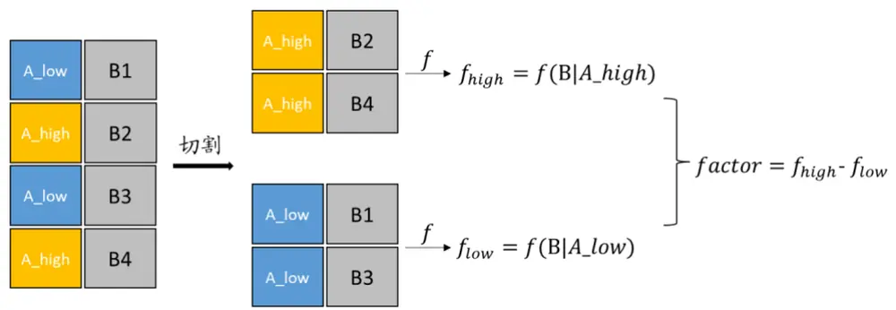
资料来源：开源证券研究所

我们使用 GRU 模型进行时序信息提取，GRU 是一种改进的循环神经网络，通过两个门控机制动态控制信息流动，在处理序列数据（如时间序列、文本）时表现良好。我们将切割论思想与 GRU 模型结合，构造如图 4 所示的双分支差异网络模型（Dual-Branch Difference GRU，以下简称 DBD-GRU 模型）。

在 DBD-GRU 模型中，假设输入的数据x包含了 A、B 两个特征，其中特征 A为切割指标。我们以特征 A 在时序上的中位数为阈值，构造两个掩码mask_Aℎigℎ和mask_Alow，将使用掩码处理后的数据分别输入两个分支网络GRU_ℎigℎ和GRU_low中。取两个网络最后一个时间步的差异输入输出层。

图4：DBD-GRU 模型示意图
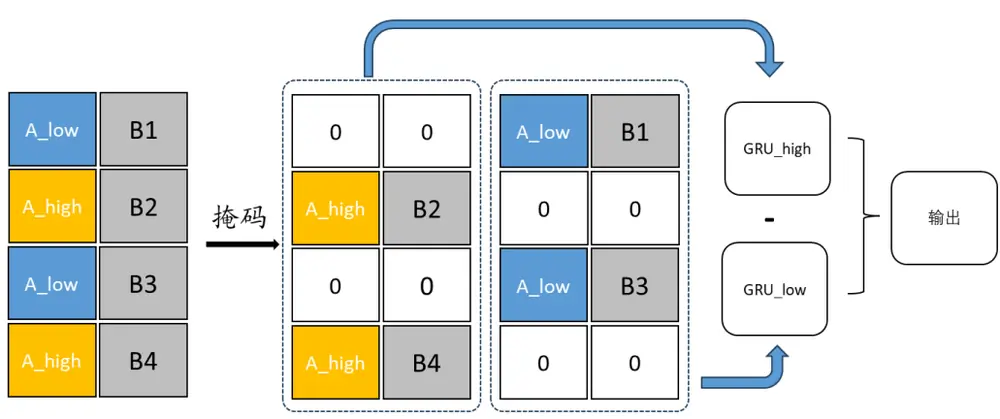
资料来源：开源证券研究所

本篇报告选取 A股 2010年 1月~2025年 5月的数据进行模型的训练与测试，以5 年为窗口滚动训练模型，每年年底更新。为提高训练效率，在构建训练集数据时，采取按周抽样的方法，在每周最后一个交易日回溯过去 20个交易日的数据。

模型的其他训练参数如下表所示：

表3：DBD-GRU 模型参数

| 变量 | 参数设置 |
| --- | --- |
| 预测标签 | 未来 20 日收益率 |
| 损失函数 | ICLoss |
| GRU hidden state | 64 |
| GRU 层数 | 2 |
| 早停阈值 | 20 |
| 最大 epoch | 100 |

资料来源：开源证券研究所

我们选取表 4 中的三个基于日线数据的切割论因子作为改进对象，三个因子中，理想反转因子的构造过程在第一部分已经列出，理想振幅因子与主动买卖因子的构造过程详见附录。在构造 DBD-GRU 模型时，将对应因子的切割指标与切割对象作为特征输入模型，使用切割指标生成掩码。同时，选择 GRU 模型作为基线模型，基线模型的输入特征为不经切割掩码处理的切割指标与切割对象，其他参数设置与DBD-GRU 模型一致。因子测试区间为 20241231~20250530，月频调仓，测试时剔除上市未满 60天的新股、因涨跌停无法成交的股票以及 ST股票，并对因子进行市值行业中性化。

表4：改进因子列表

| 因子模型名称 | 切割指标 | 切割对象 |
| --- | --- | --- |
| 理想反转因子 | 平均单笔成交金额 | 日度涨跌幅 |
| 理想振幅因子 | 股价 | 振幅均值 |
| 主动买卖因子 | 日度涨跌幅 | 小单主动买卖比率 |

资料来源：开源证券研究所

切割论因子的分组表现与绩效指标如图 5~6 与表 5 所示。理想反转因子与理想振幅因子整体表现优异，在测试区间内十分组多空组合年化收益均可达 20%以上。其中，理想反转因子自 2018 年底发布至今已有近 7 年时间，因子在样本外表现十分稳健，经受住了市场的考验。不过，从图 6 我们也可以发现，理想振幅因子与理想反转因子在 10分组下的分组收益并不完全单调。

图5：理想振幅因子与理想反转因子多空净值表现优异
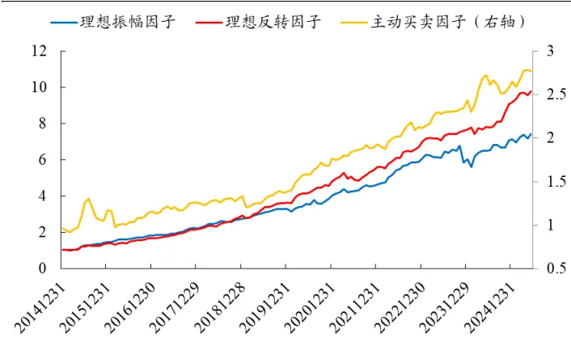
数据来源：Wind、开源证券研究所

图6：理想振幅与理想反转因子多空收益可达 20%以上
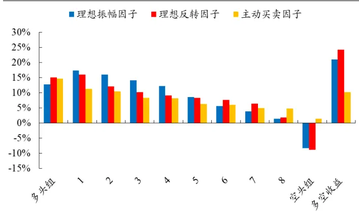
数据来源：Wind、开源证券研究所

表5：切割论因子整体表现优秀

| 因子 | 理想振幅因子 | 理想反转因子 | 主动买卖因子 |
| --- | --- | --- | --- |
| RankIC | -7.00% | -6.06% | -3.39% |
| RankICIR | -3.47 | -2.98 | -1.27 |
| 多空年化收益率 | 21.02% | 24.26% | 10.20% |
| 多空年化波动率 | 10.53% | 9.38% | 12.57% |
| 多空收益波动比 | 2.00 | 2.59 | 0.81 |
| 多空最大回撤 | 17.67% | 7.80% | 25.26% |
| 多空月度胜率 | 76.98% | 78.57% | 70.63% |

数据来源：Wind、开源证券研究所

同样的，我们对基线模型下的几个因子进行测试，测试结果如图 7~8 与表 6 所示。相较于原始的切割论因子，基线模型下几个因子的表现均有较大提升，其中主动买卖因子提升最为明显。同时，理想振幅-GRU、理想反转-GRU 因子的分组收益单调性相较原因子也有所改善。

图7：GRU模型下切割论因子的多空表现均有较大提升
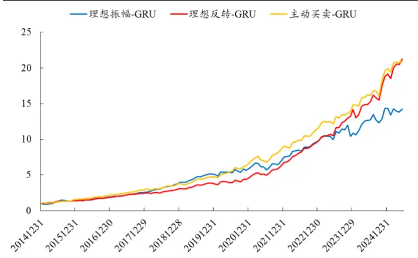
数据来源：Wind、开源证券研究所

图8：GRU因子的分组收益单调性较好
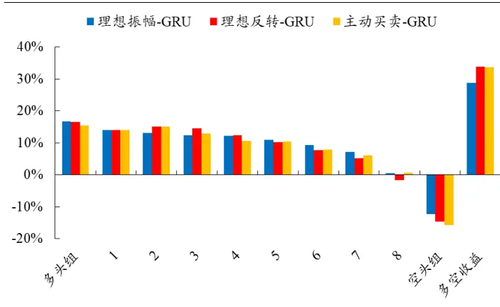
数据来源：Wind、开源证券研究所

表6：GRU因子表现大幅提升

| 因子 | 理想振幅-GRU | 理想反转-GRU | 主动买卖-GRU |
| --- | --- | --- | --- |
| RankIC | -8.26% | -9.83% | -9.41% |
| RankICIR | -2.58 | -3.28 | -3.70 |
| 多空年化收益率 | 28.77% | 33.79% | 33.63% |
| 多空年化波动率 | 16.50% | 12.67% | 12.45% |
| 多空收益波动比 | 1.74 | 2.67 | 2.70 |
| 多空最大回撤 | 14.73% | 8.26% | 10.20% |
| 多空月度胜率 | 69.84% | 77.78% | 74.60% |

数据来源：Wind、开源证券研究所

最后，我们测试 DBD-GRU 模型下各因子的表现，如图 9~10 与表 7 所示。和基线模型相比，DBD-GRU 模型的表现进一步提升。其中，理想振幅-DBD 的RankIC 为-10.33%，提升最为明显（基线模型中为-8.26%）；理想反转-DBD 在RankICIR（-3.28 • -3.57）与多空年化收益率（33.79% • 37.62%）上也有较大提升；主动买卖-DBD则与基线模型表现相当。

图9：DBD-GRU模型下，因子多空表现进一步提升
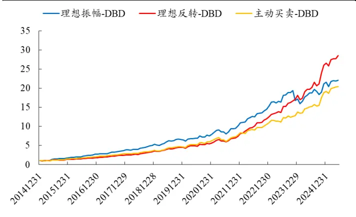
数据来源：Wind、开源证券研究所

图10：DBD-GRU模型因子的多空收益均在 30%以上
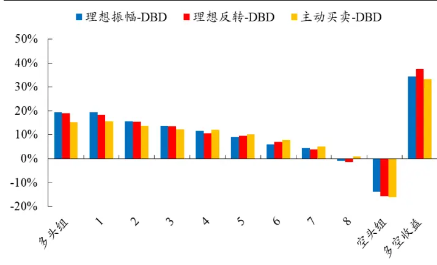
数据来源：Wind、开源证券研究所

表7：DBD-GRU模型下，因子表现进一步提升

| 因子 | 理想振幅-DBD | 理想反转-DBD | 主动买卖-DBD |
| --- | --- | --- | --- |
| RankIC | -10.33% | -10.31% | -9.81% |
| RankICIR | -3.68 | -3.57 | -3.63 |
| 多空年化收益率 | 34.31% | 37.62% | 33.33% |
| 多空年化波动率 | 15.17% | 12.55% | 13.32% |
| 多空收益波动比 | 2.26 | 3.00 | 2.50 |
| 多空最大回撤 | 17.98% | 8.96% | 13.82% |
| 多空月度胜率 | 76.98% | 80.95% | 75.40% |

数据来源：Wind、开源证券研究所

分年来看，三个因子的表现如表 8 所示，在测试区间内，DBD-GRU 模型的三个因子在每一年的多空对冲与多头超额收益均为正值，总体表现十分稳健。

表8：DBD-GRU模型的三个因子逐年多空对冲与多头超额收益均为正值

| 多空对冲 |  |  |  |  |  |
| --- | --- | --- | --- | --- | --- |
|  | 理想振幅- DBD | 理想反转- DBD | 主动买卖- DBD | 多头超额 理想振幅- 理想反转- DBD DBD | 主动买卖- DBD |
| 2015 | 75.12% | 35.46% | 49.90% | 31.43% 8.73% | 10.19% |
| 2016 | 54.57% | 33.85% | 37.91% | 17.35% 9.23% | 14.24% |
| 2017 | 36.65% | 37.71% | 36.62% | 9.60% 9.89% | 7.26% |
| 2018 | 37.43% | 36.54% | 27.43% | 9.84% 5.37% | 2.45% |
| 2019 | 30.39% | 33.42% | 31.76% | 2.17% 6.73% | 4.56% |
| 2020 | 13.53% | 20.35% | 26.58% | 7.66% 7.24% | 10.56% |
| 2021 | 35.53% | 36.65% | 29.79% | 10.63% 13.85% | 6.33% |
| 2022 | 42.83% | 60.07% | 35.40% | 4.94% 20.04% | 1.98% |
| 2023 | 15.40% | 42.85% | 22.11% | 11.89% 18.49% | 4.90% |
| 2024 | 26.14% | 52.52% | 46.94% | 1.41% 5.59% | 6.45% |
| 2025 | 8.93% | 20.14% | 17.40% | 0.96% 6.96% | 3.07% |

数据来源：Wind、开源证券研究所

图 11 展示了各因子之间的相关性。可以看到，使用相同数据的因子（如理想反转因子、理想反转-GRU、理想反转-DBD）两两间相关性较高，其中 DBD-GRU模型与切割论因子相关性明显高于 GRU模型与切割论因子的相关性，这表明 DBD-GRU模型确实对“切割”做了有效融合。

图11：DBD-GRU模型因子与另外两类因子的相关性较高

|  |  | 切割论因子 |  |  | GRU因子 |  |  | DBD-GRU因子 |  |  |
| --- | --- | --- | --- | --- | --- | --- | --- | --- | --- | --- |
|  |  | 理想振幅 | 理想反转 | 主动买卖 | 理想振幅 | 理想反转 | 主动买卖 | 理想振幅 | 理想反转 | 主动买卖 |
| 切割论因子 | 理想振幅 |  |  |  |  |  |  |  |  |  |
|  | 理想反转 | 0.25 |  |  |  |  |  |  |  |  |
|  | 主动买卖 | 0.03 | 0.05 |  |  |  |  |  |  |  |
| GRU因子 | 理想振幅 | 0.33 | 0.28 | 0.08 |  |  |  |  |  |  |
|  | 理想反转 | 0.33 | 0.30 | 0.11 | 0.59 |  |  |  |  |  |
|  | 主动买卖 | 0.36 | 0.36 | 0.19 | 0.58 | 0.67 |  |  |  |  |
| DBD-GRU因子 | 理想振幅 | 0.53 | 0.28 | 0.06 | 0.68 | 0.61 | 0.61 |  |  |  |
|  | 理想反转 | 0.35 | 0.44 | 0.10 | 0.59 | 0.83 | 0.66 | 0.61 |  |  |
|  | 主动买卖 | 0.35 | 0.36 | 0.20 | 0.60 | 0.67 | 0.87 | 0.61 | 0.69 |  |

数据来源：Wind、开源证券研究所

DBD-GRU模型可以看作是切割论与 GRU模型的有机结合，那么，模型在二者的基础上提供了多少增量呢？我们把 DBD-GRU 模型因子分别对切割论因子和

GRU 模型因子作截面回归以剔除两者的影响，计算残差因子的 RankIC 均值。作为对比，我们还计算了 GRU模型因子剔除 DBD-GRU模型因子的表现。如图 12所示，DBD-GRU模型因子在剔除切割论因子与 GRU模型因子后仍有较强的预测能力。而GRU 模型因子在剔除 DBD-GRU 模型因子后预测能力大幅削弱，RankIC 绝对值均小于 2%。

图12：DBD-GRU因子在剔除切割论因子与 GRU因子后仍有较强的预测能力
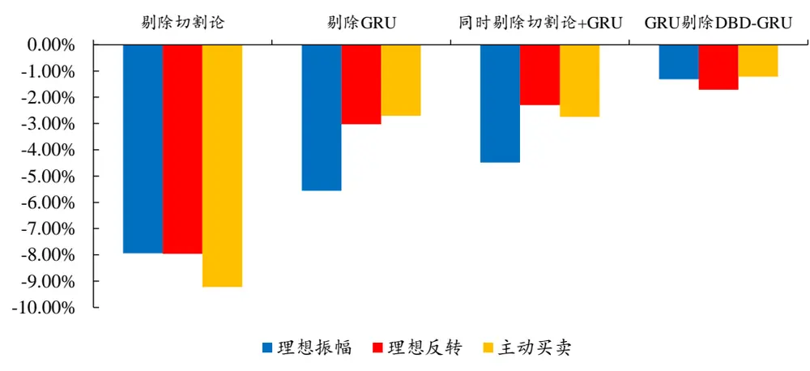
数据来源：Wind、开源证券研究所

最后，我们测试 DBD-GRU 模型因子在主流宽基指数（沪深 300、中证 500、中证 1000）中的因子绩效与指增选股效果。由于 DBD-GRU模型下的几个因子相关性较高，我们先对因子做对称正交处理，再将处理后的因子等权合成为 DBD-Combine 因子。

在构建指增组合时，我们以最大化因子暴露为目标，并规定以下约束条件：

（1） 个股权重偏离：上限 1%；

（2） 行业权重偏离：上限 2%；

（3） Barra风格暴露偏离：上限0.2个标准差；

（4） 成分股约束：权重不低于80%；

（5） 换手率约束：上限 50%。

在沪深 300 中，DBD-Combine 因子 RankIC 均值为-5.76%，RankICIR 为-1.87。如图 13、14 所示，因子 RankIC 序列总体表现平稳，十分组多空年化收益为 14.9%。指增组合层面，组合超额表现十分稳健，年化超额收益为 7.64%，超额 IR为 1.84，超额最大回撤仅 3.37%。

图13：沪深 300 中，DBD-Combine 因子的 RankIC 均值为-5.76%
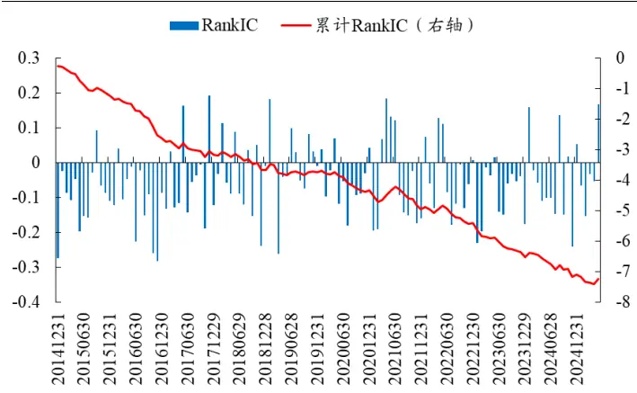
数据来源：Wind、开源证券研究所

图14：沪深 300 中，DBD-Combine 因子十分组多空年化收益为 14.9%
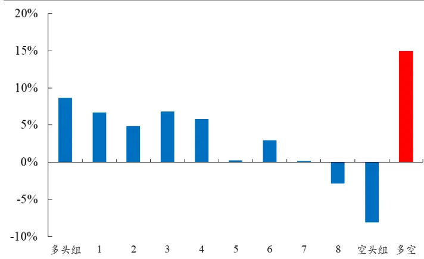
数据来源：Wind、开源证券研究所

图15：DBD-Combine因子在沪深 300中的增强组合年化超额为 7.64%
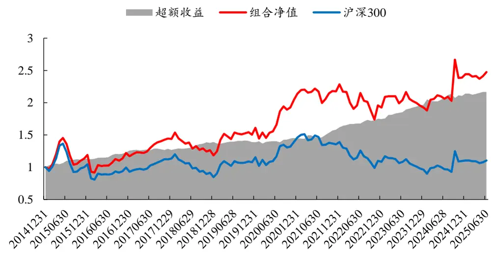
数据来源：Wind、开源证券研究所

中证 500 中，因子的 RankIC 与 Rank ICIR 分别进一步提升至-7.40%与-2.58，十分组多空年化收益为 17.5%。不过，从图 16也可以发现，近两年来因子选股能力有所减弱。指增组合层面，组合年化超额为 7.23%，超额 IR为 1.37，超额最大回撤为6.43%。

图16：中证 500 中，DBD-Combine 因子的 RankIC 均值为-7.40%
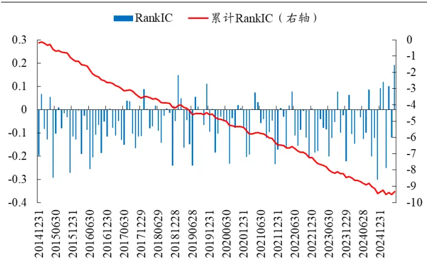
数据来源：Wind、开源证券研究所

图17：中证 500 中，DBD-Combine 因子十分组多空年化收益为 17.5%
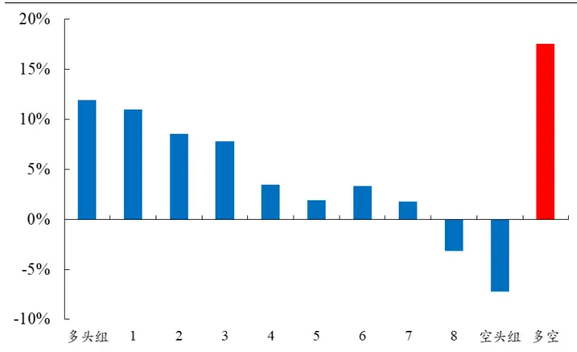
数据来源：Wind、开源证券研究所

图18：DBD-Combine因子在中证 500中的增强组合年化超额为 7.23%
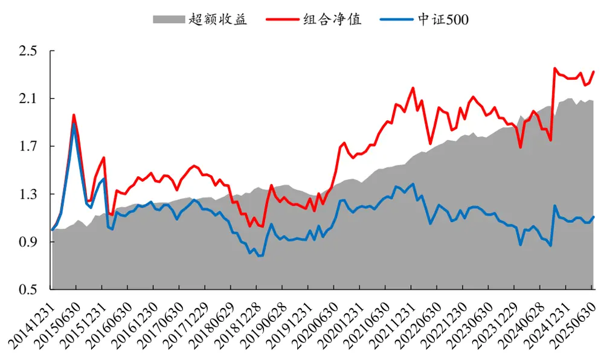
数据来源：Wind、开源证券研究所

中证 1000 中，因子表现与全市场选股最为接近，RankIC 可达-9.84%，RankICIR为-3.48，十分组多空收益则为 30.8%。指增组合表现优秀：年化超额收益率 11.8%，超额 IR为 2.21，超额最大回撤 3.94%。

图19：中证 1000 中，DBD-Combine 因子的 RankIC 均值为-9.84%
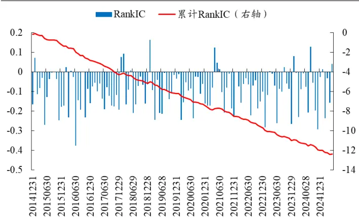
数据来源：Wind、开源证券研究所

图20：中证 1000 中，DBD-Combine 因子十分组多空年化收益为 30.8%
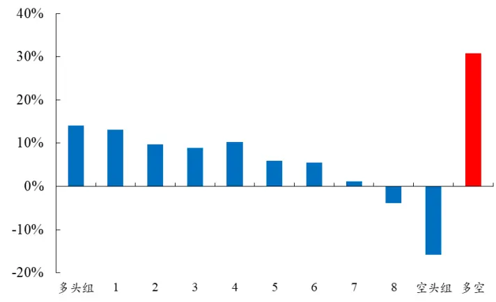
数据来源：Wind、开源证券研究所

图21：DBD-Combine 因子在中证 1000 中的增强组合年化超额为 11.8%
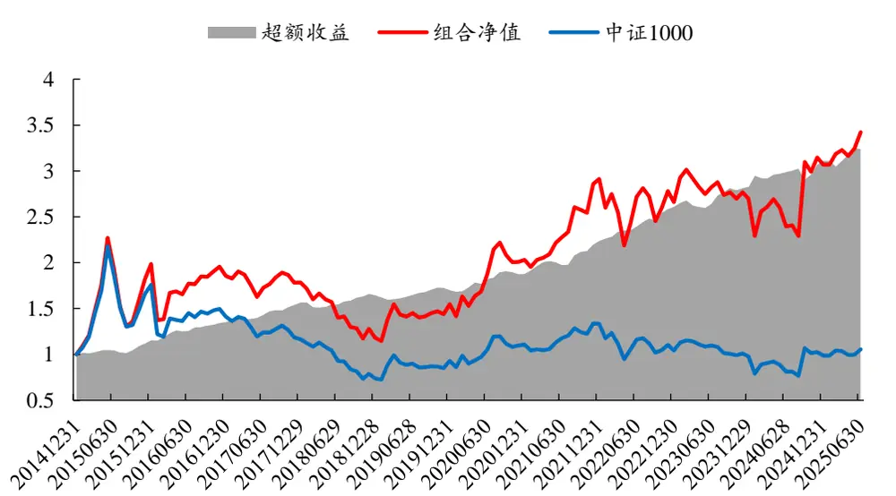
数据来源：Wind、开源证券研究所

## 3、 风险提示

模型基于历史数据测试，市场未来可能发生重大改变。

## 4、 附录

理想振幅因子用来衡量股票高价态和低价态振幅信息差异程度，具体步骤如下：

（1） 对选定股票，回溯取其最近 20 个交易日数据，计算股票每日振幅（最高价/最低价-1）；

（2） 选择收盘价较高的 25%有效交易日，计算振幅均值得到高价振幅因子$V_{high}$ ；

（3） 选择收盘价较低的 25%有效交易日，计算振幅均值得到低价振幅因子$V_{low}$

（4） 将高价振幅因子 $V_{high}$ 与低价振幅因子 $V_{low}$ 作差，得到理想振幅因子V =$V_{high}-V_{low}\circ$

详细构造步骤请参考开源金工专题研究报告《振幅因子的隐藏结构》（魏建榕、高鹏、苏俊豪）。

本文中，主动买卖因子（小单）构造方法如下：

（1） 对选定股票，回溯其过去过去 20 个交易日的数据，计算每日的股票涨跌幅与小单流入强度，其中，小单流入强度的计算公式为：

$$
\frac{主动买入金额\big(小单\big)-主动卖出金额\big(小单\big)}{主动买入金额\big(小单\big)+主动卖出金额\big(小单\big)}
$$

（2） 选择收盘价较低的 25%有效交易日，计算小单流入强度均值，得到主动买卖因子（小单）。

主动买卖因子衡量了散户在下跌市场环境中的交易行为，对于各类资金流的详细讨论请参考开源金工专题研究报告《主动买卖因子的正确用法》（魏建榕、傅开波、苏俊豪）。

值得注意的是，在构造主动买卖因子时，我们并未采用相减的操作，而是只取用了其中的一部分。这也是对应的 DBD-GRU 因子与切割论因子相关性较低的原因：原切割论因子中并未包含“相减”的结构。

## 特别声明

《证券期货投资者适当性管理办法》、《证券经营机构投资者适当性管理实施指引（试行）》已于2017年7月1日起正式实施。根据上述规定，开源证券评定此研报的风险等级为R3（中风险），因此通过公共平台推送的研报其适用的投资者类别仅限定为专业投资者及风险承受能力为C3、C4、C5的普通投资者。若您并非专业投资者及风险承受能力为C3、C4、C5的普通投资者，请取消阅读，请勿收藏、接收或使用本研报中的任何信息。因此受限于访问权限的设置，若给您造成不便，烦请见谅！感谢您给予的理解与配合。

## 分析师承诺

负责准备本报告以及撰写本报告的所有研究分析师或工作人员在此保证，本研究报告中关于任何发行商或证券所发表的观点均如实反映分析人员的个人观点。负责准备本报告的分析师获取报酬的评判因素包括研究的质量和准确性、客户的反馈、竞争性因素以及开源证券股份有限公司的整体收益。所有研究分析师或工作人员保证他们报酬的任何一部分不曾与，不与，也将不会与本报告中具体的推荐意见或观点有直接或间接的联系。

## 股票投资评级说明

|  | 评级 | 说明 |
| --- | --- | --- |
| 证券评级 | 买入（Buy） | 预计相对强于市场表现20%以上； |
|  | 增持（outperform） | 预计相对强于市场表现 5%～20%； |
|  | 中性（Neutral） | 预计相对市场表现在—5%～+5%之间波动； |
|  | 减持 | 预计相对弱于市场表现5%以下。 |
| 行业评级 | 看好（overweight） | 预计行业超越整体市场表现； |
|  | 中性（Neutral） | 预计行业与整体市场表现基本持平； |
|  | 看淡 | 预计行业弱于整体市场表现。 |
| 备注：评级标准为以报告日后的6~12个月内，证券相对于市场基准指数的涨跌幅表现，其中A股基准指数为沪深300指数、港股基准指数为恒生指数、新三板基准指数为三板成指（针对协议转让标的）或三板做市指数（针对做市转让标的)、美股基准指数为标普500或纳斯达克综合指数。我们在此提醒您，不同证券研究机构采用不同的评级术语及评级标准。我们采用的是相对评级体系，表示投资的相对比重建议；投资者买入或者卖出证券的决定取决于个人的实际情况，比如当前的持仓结构以及其他需要考虑的因素。投资者应阅读整篇报告，以获取比较完整的观点与信息，不应仅仅依靠投资评级来推断结论。 |  |  |

## 分析、估值方法的局限性说明

本报告所包含的分析基于各种假设，不同假设可能导致分析结果出现重大不同。本报告采用的各种估值方法及模型均有其局限性，估值结果不保证所涉及证券能够在该价格交易。

## 法律声明

开源证券股份有限公司是经中国证监会批准设立的证券经营机构，已具备证券投资咨询业务资格。

本报告仅供开源证券股份有限公司（以下简称“本公司”）的机构或个人客户（以下简称“客户”）使用。本公司不会因接收人收到本报告而视其为客户。本报告是发送给开源证券客户的，属于商业秘密材料，只有开源证券客户才能参考或使用，如接收人并非开源证券客户，请及时退回并删除。

本报告是基于本公司认为可靠的已公开信息，但本公司不保证该等信息的准确性或完整性。本报告所载的资料、工具、意见及推测只提供给客户作参考之用，并非作为或被视为出售或购买证券或其他金融工具的邀请或向人做出邀请。本报告所载的资料、意见及推测仅反映本公司于发布本报告当日的判断，本报告所指的证券或投资标的的价格、价值及投资收入可能会波动。在不同时期，本公司可发出与本报告所载资料、意见及推测不一致的报告。客户应当考虑到本公司可能存在可能影响本报告客观性的利益冲突，不应视本报告为做出投资决策的唯一因素。本报告中所指的投资及服务可能不适合个别客户，不构成客户私人咨询建议。本公司未确保本报告充分考虑到个别客户特殊的投资目标、财务状况或需要。本公司建议客户应考虑本报告的任何意见或建议是否符合其特定状况，以及（若有必要）咨询独立投资顾问。在任何情况下，本报告中的信息或所表述的意见并不构成对任何人的投资建议。在任何情况下，本公司不对任何人因使用本报告中的任何内容所引致的任何损失负任何责任。若本报告的接收人非本公司的客户，应在基于本报告做出任何投资决定或就本报告要求任何解释前咨询独立投资顾问。

本报告可能附带其它网站的地址或超级链接，对于可能涉及的开源证券网站以外的地址或超级链接，开源证券不对其内容负责。本报告提供这些地址或超级链接的目的纯粹是为了客户使用方便，链接网站的内容不构成本报告的任何部分，客户需自行承担浏览这些网站的费用或风险。

开源证券在法律允许的情况下可参与、投资或持有本报告涉及的证券或进行证券交易，或向本报告涉及的公司提供或争取提供包括投资银行业务在内的服务或业务支持。开源证券可能与本报告涉及的公司之间存在业务关系，并无需事先或在获得业务关系后通知客户。

本报告的版权归本公司所有。本公司对本报告保留一切权利。除非另有书面显示，否则本报告中的所有材料的版权均属本公司。未经本公司事先书面授权，本报告的任何部分均不得以任何方式制作任何形式的拷贝、复印件或复制品，或再次分发给任何其他人，或以任何侵犯本公司版权的其他方式使用。所有本报告中使用的商标、服务标记及标记均为本公司的商标、服务标记及标记。

## 开源证券研究所

地址：上海市浦东新区世纪大道1788号陆家嘴金控广场1号
楼3层
邮编：200120
邮箱：research@kysec.cn
北京
地址：北京市西城区西直门外大街18号金贸大厦C2座9层
邮编：100044
邮箱：research@kysec.cn
深圳
地址：深圳市福田区金田路2030号卓越世纪中心1号
楼45层
邮编：518000
邮箱：research@kysec.cn
西安
地址：西安市高新区锦业路1号都市之门B座5层
邮编：710065
邮箱：research@kysec.cn