2025年08月06日

## 金融工程研究团队

# 市场微观结构观察与2023年以来的高频因子回顾

魏建榕（首席分析师）

证书编号：S0790519120001

张翔（分析师）

证书编号：S0790520110001

## 傅开波（分析师）

证书编号：S0790520090003

## 高鹏（分析师）

证书编号：S0790520090002

## 苏俊豪（分析师）

证书编号：S0790522020001

## 胡亮勇（分析师）

证书编号：S0790522030001

## 王志豪（分析师）

证书编号：S0790522070003

## 盛少成（分析师）

证书编号：S0790523060003

## 苏良（分析师）

证书编号：S0790523060004

## 何申昊（分析师）

证书编号：S0790524070009

## 蒋韬（分析师）

证书编号：S0790525070001

## 相关研究报告

《订单流系列：挂单方向长期记忆性的讨论与应用—市场微观结构研究系列（25)》-2024.06.09

《订单流系列：撤单行为规律初探—市场微观结构研究系列（22）》-2024.01.24

《订单流系列：关于市场微观结构变迁的故事—市场微观结构研究系列(21)》-2023.09.18

# —市场微观结构研究系列（29）

魏建榕（分析师）

weijianrong@kysec.cn

苏良（分析师）

证书编号：S0790519120001

suliang@kysec.cn

证书编号：S0790523060004

## 资金驱动下的A 股表现亮眼

2024年9月24日国家出台了涵盖“降息”、创设新的货币政策工具以及引导提升上市公司质量等一系列超预期举措，A股市场的投资热情被迅速点燃。

(1）被动投资在行情初期发挥了重要作用，部分投资者通过购买ETF的方式为指数价格上涨提供了流动性，并进一步提升整体的投资情绪。

（2）杠杆类资金是放量行情的重要支撑。2024年9月24日以来，全市场融资融券余额快速增长，截至2025年8月4日已超过1.99万亿，突破了2024年以来的历史高点，并且从7月份以来有明显加速抬升的迹象。

(3)量价齐升，赚钱效应放大是行情的核心驱动因素。市场赚钱效应刺激下散户参与意愿会增加，这与2017年以来机构占比增加的大体趋势有所不同，对量价规律也会造成一定的影响。

## 观察微观交易特征的四大视角

## (1) 早盘交易集中度

早盘（9:30-10:00）成交的股票数量与全天成交量之比往往能够反映投资者对股票交易的急迫性，比值过高表明交易产生拥挤。截至2025年8月4日的集中比例大约为25%，维持在2024年“新国九条”颁布以前的水平。

## (2) 委托金额

市场是由资金实力不等的各类投资者组合而成，统计平均一笔订单委托金额的变化能够间接反映市场中机构和散户参与比例的动态变化规律。

## (3) 筹码充足率

观察市场上交易筹码是否充足，不仅仅可以从市场总成交量等“宏观”指标来判断，还可以结合股票的订单簿（盘口）状态分析。

## (4)程序化交易比例

程序化交易在A股市场内被广泛使用，但随着2024年“新国九条”等政策对高频交易的限制措施施行以来，程序化交易的使用也变得克制。放量阶段带来的高交易活跃度能够给予高频策略更多空间，程序化交易比例有所增长。

## 高频因子跟踪

为了持续跟踪有效性，我们统计以往发布的高频因子的表现，取因子的20日滚动均值并测试其在全市场分组效果。

高维记忆_MEMO 因子：2023 年以来多空收益 29.3%；

强反转_SR因子：2023年以来多空收益 19.7%；

彩票委托 LOTTERY 因子：2023 年以来多空收益 32.9%。

- 风险提示：模型基于历史数据测试，未来市场可能发生变化。

## 1、市场回顾与微观结构分析

## 1.1、资金驱动下的A股市场表现亮眼

2024年9月24日国家出台了涵盖“降息”、创设新的货币政策工具以及引导提升上市公司质量等一系列超预期举措，A股市场的投资热情被迅速点燃，9月24日至10月8日期间，上证指数累计涨跌幅超过26%。价格上涨也进一步盘活了市场的交易量，10月8日更是创下了京沪深三市3.48万亿的历史纪录。

根据基金重仓股统计，ETF在沪深300指数成分股内的持仓比例在2024年三季度有明显的上涨。被动投资在行情初期发挥了重要作用，部分投资者通过购买ETF的方式为指数价格上涨提供了流动性，并进一步提升整体的投资情绪。

图1：沪深300指数成分股内ETF持仓占比近4个季度有所增加
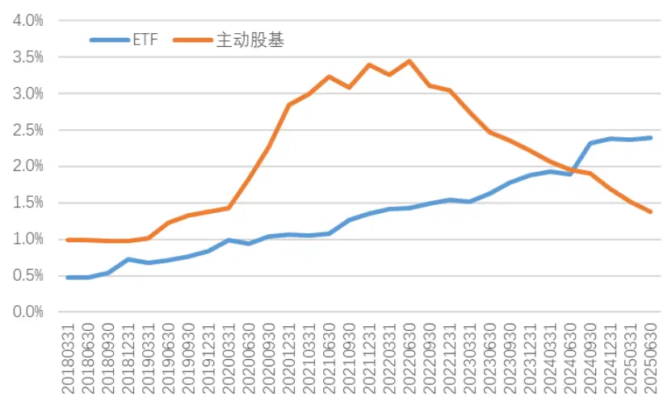
数据来源：Wind、开源证券研究所

杠杆类资金是放量行情的重要支撑。2024年9月24日以来，全市场融资融券余额快速增长，截至2025年8月4日已超过1.99万亿，突破了2024年以来的历史高点，并且从7月份以来有明显加速抬升的迹象。

图2：2024年9月24日以来成交规模屡破万亿
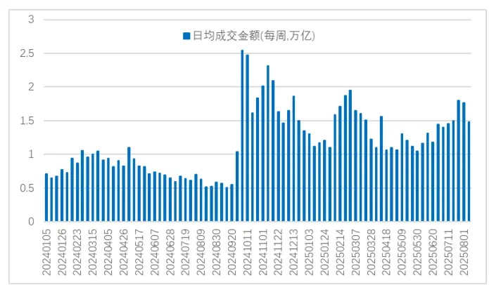
数据来源：Wind、开源证券研究所，数据截至20250804，下同

图3：“放量”行情的背后是杠杆资金的加注
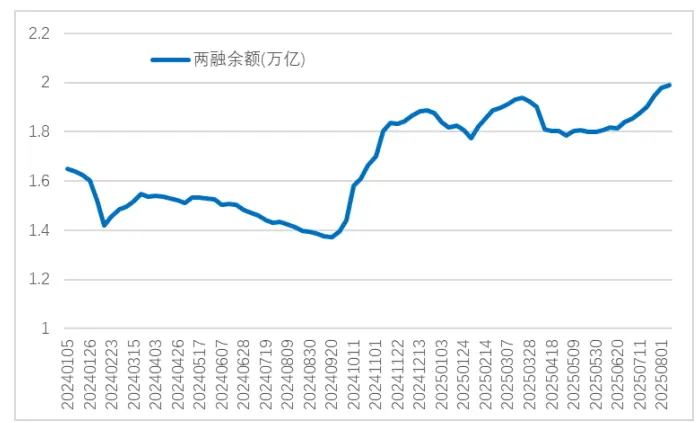
数据来源：Wind、开源证券研究所

量价齐升，赚钱效应放大是9月24日以来行情的核心驱动因素。2024年10月至11月，资金驱动整个顺周期板块反弹；2025年2月，AI和机器人板块的创新和相关政策支持受到市场追捧，万得AI算力指数当月创出30%以上的涨幅；4月份的贸易冲突并未像2018年那般对市场造成显著且持续的冲击，出海贸易等板块后续也陆续突破前期高点；7月份政治局会议落地，“反内卷”相关措施成为市场关注的焦点，这一主题持续牵引市场热度。市场赚钱效应刺激下散户参与意愿会增加，这与2017年以来机构占比增加的大体趋势有所不同，对量价规律也会造成一定的影响。

## 1.2、微观交易特征的四大观察视角

基于对上述散户和机构比例变化复杂和不确定性的考虑，我们从微观的视角来推测可能的投资者结构变化，不做确定数值的测算。笔者将主要的微观交易特征总结为四个维度：早盘交易集中度、委托金额、筹码充足率、程序化交易比例。

## (1)早盘交易集中度

该指标包括成交占比和价格波动两个维度，从交易量来看，早盘（9:30-10:00）成交的股票数量与全天成交量之比往往能够反映投资者对股票交易的急迫性，如果股票出现明显的交易放量并伴随早盘成交比例的增加，则投资者对于股票的交易情绪较高，交易上表现出一定的拥挤，反而需要注意后续下跌的风险。

图4展示了早盘交易集中度2018年以来的变化趋势，截至2025年8月4日的集中比例大约为25%，维持在2024年“新国九条”颁布以来的水平。

为了更加直观地观察当前的热点，笔者统计了截至2025年8月4日全市场股票中部分集中度较高的个股，同时剔除了ST股以及当日涨跌停的股票。选取的标准为股票过去20日早盘（9:30-10:00）成交量占比的均值（图5）。

图4：早盘交易集中度的稍有增加
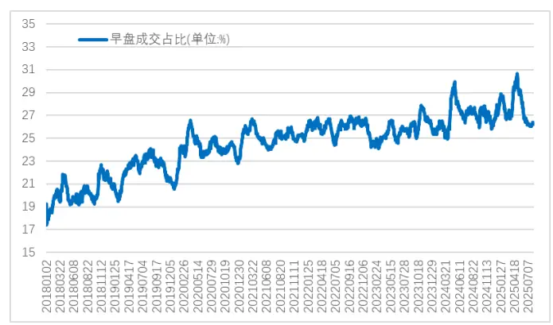
数据来源：Wind、开源证券研究所，指标为20日平均值

图5：早盘集中度偏高的个股举例（2024年8月4日）
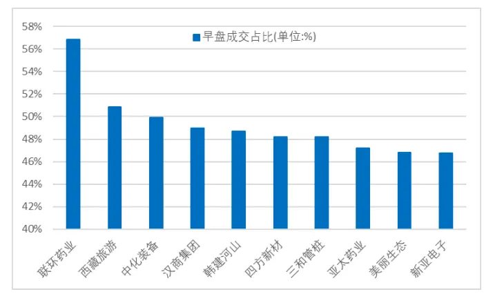
数据来源：Wind、开源证券研究所，指标为过去20日平均值

涉及的概念股主要有：流感（联环药业、汉商集团、亚太药业）和西藏水利建设（西藏旅游、韩建河山、三和管桩、美丽生态)，上述股票大多数是前期出现过阶段性上涨的题材股，资金博弈导致短期波动风险较大的标的。

## (2) 委托金额

市场是由资金实力不等的各类投资者组合而成，统计平均一笔订单委托金额的变化能够间接反映市场中机构和散户参与比例的动态变化规律。我们在《订单流系列：关于市场微观结构变迁的故事》中讨论过历史原因，感兴趣的读者可以自行扩展阅读。图6展示了沪深300和中证500等多个选股域内订单大小的变化趋势。

图6：不同选股域的单笔成交金额变化趋势基本一致（单位：万元）
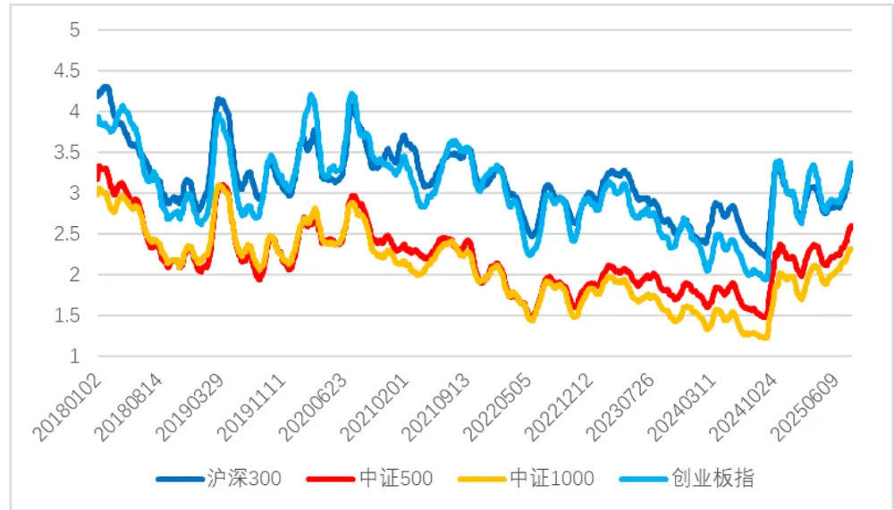
数据来源：Wind、开源证券研究所，指标为20日平均值

当前各市场平均单笔金额相比2024年8月都有明显的提高，游资和机构的交易占比提升有一定促进作用，因为大额订单的涌入会抬高委托金额的平均水平。

## (3)筹码充足率

观察市场上交易筹码是否充足，不仅仅可以从市场总成交量等“宏观”指标来判断，还可以结合股票的订单簿（盘口）状态分析。根据交易所质量运行报告，被用以衡量交易流动性的指标是订单簿厚度（金额深度）和交易冲击成本。订单簿的厚度可以用五档或十档的盘口委托数据进行测量，计算其委托金额之和来反映当前价格超涨超跌的阻力：交易冲击成本则是用单位交易金额刻画可能的价格变动。通常这两个指标得到的结论能够相互印证。

图7：2024年9月以来订单簿逐渐增厚
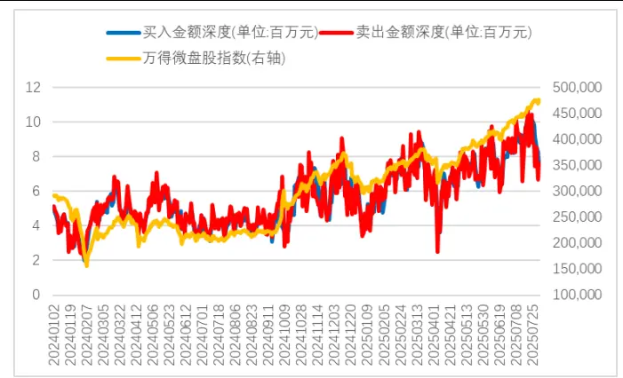
数据来源：Wind、开源证券研究所

图8：伴随订单簿厚度增加，冲击成本降低
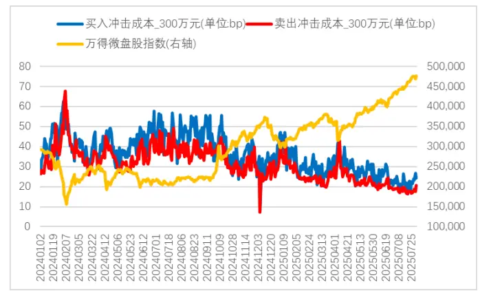
数据来源：Wind、开源证券研究所

本轮行情是由资金驱动的特征在微盘股中尤其明显。2024年9月24日，大量资金涌入股市支撑其价格不断上涨。我们分别对比订单簿厚度、冲击成本与万得微盘股指数的变化趋势，不难看出微盘股在2025年1月和4月的回调是因为流动性供给出现了不足，而当前的流动性供给相对充足。

## (4)程序化交易比例

除了从底层支持价量的成交订单外，我们还可以捕捉投资者“撤回委托”这一动作蕴含的交易信息。例如，高频（挂单时长小于1秒）的订单的撤回数量占全部撤单的比例可以描述程序化交易在交易中的影响，因为散户买卖股票的机械操作速度要远远慢于自动化交易订单的执行速度，1秒则是一个相对而言的经验值。

图9展示了高频撤单的变化趋势：自有统计数据以来，高频撤单的平均比例在逐渐增加，程序化交易在A股市场内被广泛使用，但随着2024年“新国九条”等政策对高频交易的限制措施施行以来，程序化交易的使用也变得更加克制。放量阶段带来的高交易活跃度，能够给这些经过调整后的高频策略更多空间，于是高频撤单比例在2024年9月以来明显增长。

图9：高频撤单比例整体稳定
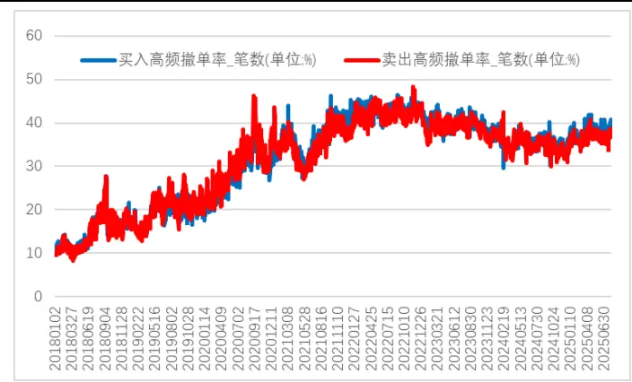
数据来源：Wind、开源证券研究所

图10：高频撤单率较高的个股举例（2025年8月4日）
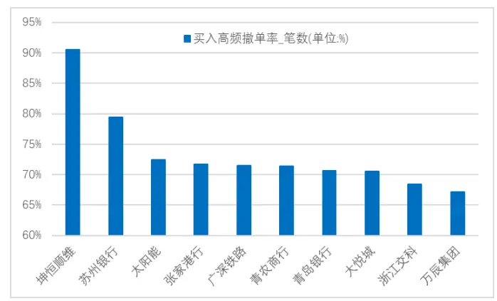
数据来源：Wind、开源证券研究所，指标为过去20日平均值

涉及的概念股主要有：电子元件（坤恒顺维）)、银行（苏州银行、青农商行、青岛银行、张家港行）和光伏（太阳能）等。

最后，我们对包含上述维度的各类微观指标进行选股效果测试，并将测试的结果放在附录便于读者查照。

## 2、高频因子表现回顾：2023年以来均有不同程度减弱

在过往的几年里，我们集中开发了一系列高频因子。在《高频因子：分钟单笔金额序列中的主力行为刻画》报告中，我们利用分钟单笔成交金额作为切割变量开发了单笔金额分位数、主力交易强度和强反转等因子，可以从多个维度中识别出主力资金的交易行为并捕捉其Alpha信息；在《订单流系列：撤单行为规律初探》报告中，我们基于Level2数据开发了诸如彩票委托和毒流动性等表现亮眼的因子，从撤单动作中挖掘特定投资者的行为规律；在《订单流系列：挂单方向长期记忆性的讨论与应用》报告中，我们讨论了算法拆单行为的可识别方法，并基于统计算子挖掘了长期记忆强度和高维记忆等因子。这些因子经过了样本外的较长检验，有部分因子效果不如人意，有部分因子则依旧表现亮眼。

为了持续跟踪有效性，我们统计以往发布的高频因子的表现，取因子的20日滚动均值并测试其在全市场分组效果，结果如表1所示。

表1：高频因子表现跟踪：“拆单”相关因子表现亮眼

| 因子名称 | 2018年至2022年 |  |  | 2023年以来 |  |  |
| --- | --- | --- | --- | --- | --- | --- |
|  | IC | ICIR | 年化多空收益 | IC | ICIR | 年化多空收益 |
| 高维记忆MEMO | 0.050 | 3.993 | 20.7% | 0.045 | 2.989 | 29.3% |
| 长期记忆强度_LMS | 0.044 | 3.085 | 17.2% | 0.049 | 2.966 | 33.5% |
| 分拆痕迹_OST | 0.001 | 0.239 | 7.4% | -0.001 | -0.268 | 15.7% |
| 时间重心偏离_TGD | 0.049 | 4.194 | 21.4% | 0.037 | 2.559 | 21.9% |
| 短线交易拥挤度 STC | -0.058 | -3.899 | 22.8% | -0.029 | -1.478 | 11.8% |
| 彩票委托 LOTTERY | -0.073 | -3.707 | 26.9% | -0.054 | -2.792 | 32.9% |
| 毒流动性_TOX | 0.049 | 3.037 | 16.4% | 0.027 | 1.864 | 15.3% |
| 单笔金额分位数_QUA | -0.061 | -3.866 | 26.6% | -0.041 | -2.155 | 26.0% |
| 主力交易强度_MTS | 0.065 | 3.501 | 24.1% | 0.040 | 2.034 | 21.3% |
| 强反转_SR | -0.053 | -3.110 | 21.7% | -0.043 | -2.473 | 19.7% |

数据来源：Wind、开源证券研究所

我们选取2023年以来表现较好的部分因子进行简要回顾。

## 2.1、高维记忆_MEMO因子：2023年以来多空收益29.3%

我们通过符号处理方法，将每笔委托的交易方向处理成数值序列，通过计算相关系数的方式刻画一笔订单与后续几笔订单的关系。订单之间的关联性越强，说明机构在交易当中的贡献度越高，而这部分公司的质量也就越高。

图11：高维记忆_MEMO 因子累计 IC 曲线
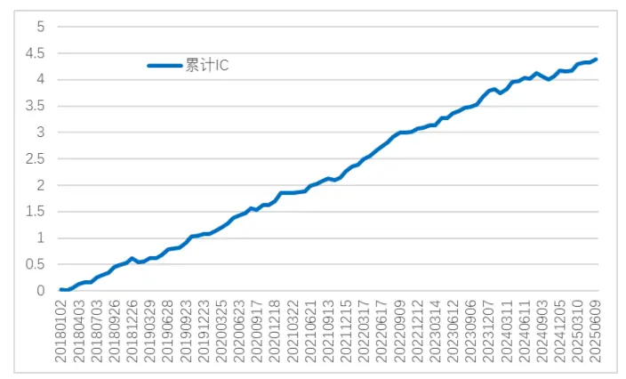
数据来源：Wind、开源证券研究所

图12：MEMO十分组单调性对比（行业、市值中性）
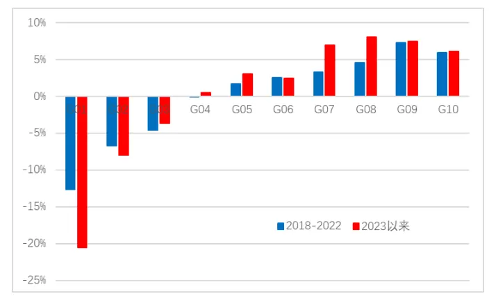
数据来源：Wind、开源证券研究所

## 2.2、强反转_SR 因子：2023 年以来多空收益19.7%

在分钟级别上，“单笔成交金额越高，反转强度越大”这个命题依旧成立。我们利用分钟频单笔成交金额对日内240分钟的涨跌幅进行切割，在理想反转因子的基础上构造强反转因子，效果相比日频的理想反转因子更好。

图13：强反转_SR 因子累计 IC 曲线
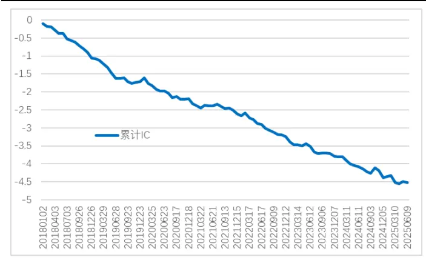
数据来源：Wind、开源证券研究所

图14：SR十分组单调性对比（行业、市值中性）
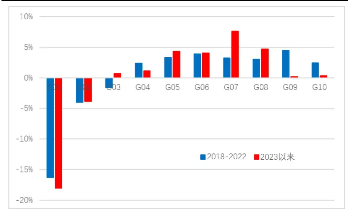
数据来源：Wind、开源证券研究所

## 2.3、彩票委托_LOTTERY因子：2023 年以来多空收益32.9%

从报价习惯来看，抱着“彩票博弈”的心理在涨停价挂卖单（或者在跌停价挂买单）一般是散户的交易行为。这部分委托的占比越高，说明当前交易者结构中散户的特征占据主导，而缺乏机构投资者的标的价格表现往往偏差。

图15：彩票委托_LOTTERY 因子累计 IC 曲线
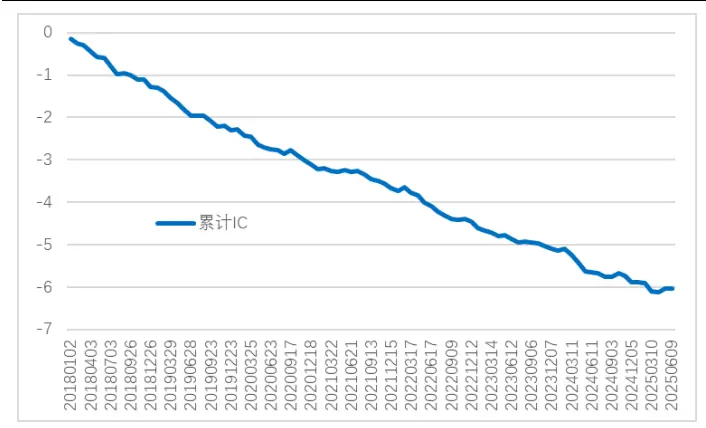
数据来源：Wind、开源证券研究所

图16：LOTTERY十分组单调性对比（行业、市值中性）
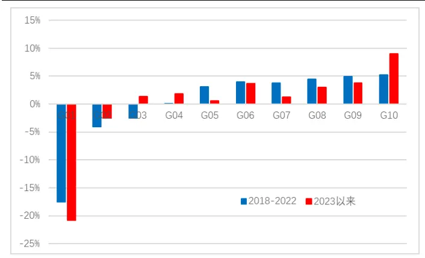
数据来源：Wind、开源证券研究所

## 3、风险提示

模型基于历史数据测试，未来市场可能发生变化。

## 4、附录

表2：微观交易特征指标测试结果

| 指标名称 | IC | ICIR | 年化多空收益 | 多空IR |
| --- | --- | --- | --- | --- |
| 买入高频撤单率_笔数 | 0.045 | 2.938 | 24.7% | 2.802 |
| 卖出高频撤单率_笔数 | 0.043 | 2.690 | 25.1% | 2.803 |
| 卖出高频撤单率委托量 | 0.042 | 2.839 | 23.6% | 2.800 |
| 买入高频撤单率_委托量 | 0.040 | 2.592 | 21.0% | 2.487 |
| 买入冲击成本_300万元 | 0.037 | 1.765 | 16.2% | 1.334 |
| 卖出冲击成本_300万元 | 0.035 | 1.715 | 17.0% | 1.400 |
| 买入冲击成本_10万元 | 0.034 | 1.697 | 20.2% | 1.689 |
| 卖出冲击成本_10万元 | 0.034 | 1.704 | 20.4% | 1.717 |
| 下跌时间重心 | 0.034 | 1.510 | 18.9% | 1.703 |
| 连续买入笔数 | 0.030 | 2.241 | 21.1% | 2.673 |
| 上涨时间重心 | 0.027 | 1.156 | 11.9% | 1.026 |
| 连续卖出笔数 | 0.021 | 0.972 | 28.0% | 2.799 |
| 原始价差_十档 | 0.009 | 0.352 | 7.0% | 0.772 |
| 加权价差_十档 | 0.009 | 0.334 | 6.3% | 0.661 |
| 原始价差_一档 | 0.009 | 0.402 | 6.8% | 0.786 |
| 加权价差五档 | 0.009 | 0.333 | 5.8% | 0.638 |
| 原始价差_五档 | 0.008 | 0.325 | 6.2% | 0.692 |
| 成交比率 | 0.001 | 0.033 | 2.1% | 0.267 |
| 买卖委量比 | 0.000 | -0.126 | 2.8% | 0.360 |
| 成交比率_卖出 | -0.002 | -0.111 | 3.6% | 0.415 |
| 尾盘成交占比 | -0.006 | -0.300 | -4.3% | -0.366 |
| 广义市价比例 | -0.009 | -0.489 | 5.5% | 0.639 |
| 成交比率_买入 | -0.011 | -0.528 | 9.7% | 0.957 |
| 成交用时 | -0.019 | -0.884 | 8.8% | 0.921 |
| 单笔委托金额_买入 | -0.021 | -2.121 | 13.1% | 1.214 |
| 尾盘收益波动 | -0.023 | -1.208 | 10.7% | 1.128 |
| 单笔委托金额_卖出 | -0.033 | -1.909 | 17.6% | 1.630 |
| 撤单用时 | -0.035 | -1.532 | 16.1% | 1.333 |
| 买入金额深度 | -0.035 | -1.695 | 17.0% | 1.385 |
| 卖出金额深度 | -0.035 | -1.676 | 16.7% | 1.350 |
| 单笔金额 | -0.035 | -2.077 | 21.4% | 1.966 |
| 早盘成交占比 | -0.041 | -1.744 | 19.0% | 1.498 |
| 尾盘成交重心 | -0.041 | -2.620 | 24.9% | 2.585 |
| 日内收益波动 | -0.045 | -1.676 | 21.6% | 1.601 |
| 下行波动 | -0.048 | -1.778 | 27.0% | 1.834 |
| 早盘收益波动 | -0.048 | -1.690 | 24.8% | 1.681 |
| 上行波动 | -0.059 | -2.197 | 34.5% | 2.342 |

数据来源：Wind、开源证券研究所

## 特别声明

《证券期货投资者适当性管理办法》、《证券经营机构投资者适当性管理实施指引（试行)》已于2017年7月1日起正式实施。根据上述规定，开源证券评定此研报的风险等级为R3（中风险)，因此通过公共平台推送的研报其适用的投资者类别仅限定为专业投资者及风险承受能力为C3、C4、C5的普通投资者。若您并非专业投资者及风险承受能力为C3、C4、C5的普通投资者，请取消阅读，请勿收藏、接收或使用本研报中的任何信息。

因此受限于访问权限的设置，若给您造成不便，烦请见谅！感谢您给予的理解与配合。

## 分析师承诺

负责准备本报告以及撰写本报告的所有研究分析师或工作人员在此保证，本研究报告中关于任何发行商或证券所发表的观点均如实反映分析人员的个人观点。负责准备本报告的分析师获取报酬的评判因素包括研究的质量和准确性、客户的反馈、竞争性因素以及开源证券股份有限公司的整体收益。所有研究分析师或工作人员保证他们报酬的任何一部分不曾与，不与，也将不会与本报告中具体的推荐意见或观点有直接或间接的联系。

## 股票投资评级说明

|  | 评级 | 说明 |
| --- | --- | --- |
| 证券评级 | 买入（Buy） | 预计相对强于市场表现20%以上； |
|  | 增持（outperform） | 预计相对强于市场表现5%～20%； |
|  | 中性（Neutral） | 预计相对市场表现在—5%～+5%之间波动； |
|  | 减持（underperform） | 预计相对弱于市场表现5%以下。 |
| 行业评级 | 看好（overweight） | 预计行业超越整体市场表现； |
|  | 中性（Neutral） | 预计行业与整体市场表现基本持平； |
|  | 看淡（underperform） | 预计行业弱于整体市场表现。 |
| 备注：评级标准为以报告日后的6~12个月内，证券相对于市场基准指数的涨跌幅表现，其中A股基准指数为沪深300指数、港股基准指数为恒生指数、新三板基准指数为三板成指（针对协议转让标的）或三板做市指数（针对做市转让标的)、美股基准指数为标普500或纳斯达克综合指数。我们在此提醒您，不同证券研究机构采用不同的评级术语及评级标准。我们采用的是相对评级体系，表示投资的相对比重建议；投资者买入或者卖出证券的决定取决于个人的实际情况，比如当前的持仓结构以及其他需要考虑的因素。投资者应阅读整篇报告，以获取比较完整的观点与信息，不应仅仅依靠投资评级来推断结论。 |  |  |

## 分析、估值方法的局限性说明

本报告所包含的分析基于各种假设，不同假设可能导致分析结果出现重大不同。本报告采用的各种估值方法及模型均有其局限性，估值结果不保证所涉及证券能够在该价格交易。

## 法律声明

开源证券股份有限公司是经中国证监会批准设立的证券经营机构，已具备证券投资咨询业务资格。

本报告仅供开源证券股份有限公司（以下简称“本公司”）的机构或个人客户（以下简称“客户”）使用。本公司不会因接收人收到本报告而视其为客户。本报告是发送给开源证券客户的，属于商业秘密材料，只有开源证券客户才能参考或使用，如接收人并非开源证券客户，请及时退回并删除。

本报告是基于本公司认为可靠的已公开信息，但本公司不保证该等信息的准确性或完整性。本报告所载的资料、工具、意见及推测只提供给客户作参考之用，并非作为或被视为出售或购买证券或其他金融工具的邀请或向人做出邀请。本报告所载的资料、意见及推测仅反映本公司于发布本报告当日的判断，本报告所指的证券或投资标的的价格、价值及投资收入可能会波动。在不同时期，本公司可发出与本报告所载资料、意见及推测不一致的报告。客户应当考虑到本公司可能存在可能影响本报告客观性的利益冲突，不应视本报告为做出投资决策的唯一因素。本报告中所指的投资及服务可能不适合个别客户，不构成客户私人咨询建议。本公司未确保本报告充分考虑到个别客户特殊的投资目标、财务状况或需要。本公司建议客户应考虑本报告的任何意见或建议是否符合其特定状况，以及（若有必要）咨询独立投资顾问。在任何情况下，本报告中的信息或所表述的意见并不构成对任何人的投资建议。在任何情况下，本公司不对任何人因使用本报告中的任何内容所引致的任何损失负任何责任。若本报告的接收人非本公司的客户，应在基于本报告做出任何投资决定或就本报告要求任何解释前咨询独立投资顾问。投资者应自主作出投资决策并自行承担投资风险，任何形式的分享证券投资收益或者分担证券投资损失的书面或口头承诺均为无效。

本报告可能附带其它网站的地址或超级链接，对于可能涉及的开源证券网站以外的地址或超级链接，开源证券不对其内容负责。本报告提供这些地址或超级链接的目的纯粹是为了客户使用方便，链接网站的内容不构成本报告的任何部分，客户需自行承担浏览这些网站的费用或风险。

开源证券在法律允许的情况下可参与、投资或持有本报告涉及的证券或进行证券交易，或向本报告涉及的公司提供或争取提供包括投资银行业务在内的服务或业务支持。开源证券可能与本报告涉及的公司之间存在业务关系，并无需事先或在获得业务关系后通知客户。

本报告的版权归本公司所有。本公司对本报告保留一切权利。除非另有书面显示，否则本报告中的所有材料的版权均属本公司。未经本公司事先书面授权，本报告的任何部分均不得以任何方式制作任何形式的拷贝、复印件或复制品，或再次分发给任何其他人，或以任何侵犯本公司版权的其他方式使用。所有本报告中使用的商标、服务标记及标记均为本公司的商标、服务标记及标记。

## 开源证券研究所

上海

地址：上海市浦东新区世纪大道1788号陆家嘴金控广场1号

深圳

地址：深圳市福田区金田路2030号卓越世纪中心1号

楼3层

楼45层

邮编：200120

邮箱：research@kysec.cn

北京

邮编：100044

地址：北京市西城区西直门外大街18号金贸大厦C2座9层

邮箱：research@kysec.cn

邮编：518000

邮箱：research@kysec.cn

西安

邮编：710065

地址：西安市高新区锦业路1号都市之门B座5层

邮箱：research@kysec.cn