## 高频振幅因子的内部切割

2025 年 8 月 9 日

## 金融工程研究团队

魏建榕（首席分析师）

张 翔（分析师）

证书编号：S0790519120001

证书编号：S0790520110001

傅开波（分析师）

证书编号：S0790520090003

## 高 鹏（分析师）

证书编号：S0790520090002

## 苏俊豪（分析师）

证书编号：S0790522020001

## 胡亮勇（分析师）

证书编号：S0790522030001

## 王志豪（分析师）

证书编号：S0790522070003

## 盛少成（分析师）

证书编号：S0790523060003

## 苏 良（分析师）

证书编号：S0790523060004

## 何申昊（分析师）

证书编号：S0790524070009

## 蒋 韬（分析师）

证书编号：S0790525070001

## 相关研究报告

《振幅因子的隐藏结构—市场微观结构研究系列（7）》-2020.5.16

《因子切割论—市场微观结构研究系列（10）》-2020.9.16

# ——市场微观结构系列（30）

魏建榕（分析师）

weijianrong@kysec.cn

高鹏（分析师）

证书编号：S0790519120001

gaopeng@kysec.cn

证书编号：S0790520090002

## 理想振幅因子再出发

理想振幅因子选股效果表现优异。理想振幅因子全区间 IC 均值为-0.051，ICIR为-2.39，5分组多空对冲年化收益率为17%。从理想振幅因子的 5 分组多空对冲曲线可以发现，理想振幅因子样本外表现相对稳健，但近两年因子选股效果有一定波动。

当我们拿到股票过去 N 天的 1 分钟交易信息后，我们有两种切割思路：（1）将过去 N 天分钟数据合并在一起进行切割；（2）先对每天的分钟交易信息进行日内切割，得到日度序列后再合成。以上两种思路我们最终分别构造得到分钟理想振幅因子和日内振幅切割因子。

## 分钟理想振幅因子的构造

不同切割比例：随着切割比例降低，分钟理想振幅因子选股效果先升后降，IC均值最优为20%比例-0.057，ICIR最优为25%比例-2.77。整体上所有切割比例的分钟理想振幅因子选股效果差异不大。

不同回看天数：随着回看天数由 30天降低至10天，分钟理想振幅因子选股效果整体呈现上升趋势，当N=10 天时，分钟理想振幅因子的选股效果最优（IC 均值-0.059，ICIR-3.1）。

最终分钟理想振幅因子选择回看天数 N=10、切割比例λ=25%参数，因子 IC 均值为-0.059，ICIR为-3.1，5分组多空对冲年化收益为19.5%，整体选股效果优异，相对原始理想振幅因子有一定提升。

## 日内振幅切割因子的构造

日内切割的情绪指标分别选择价格、振幅、成交额、1 分钟涨跌幅、5 分钟涨跌幅，日内振幅切割因子整体上选股效果更优，其中成交额、1 分钟涨跌幅、5 分钟涨跌幅切割得到的合成因子选股表现差异不大。1分钟涨跌幅切割得到的合成因子选股效果最优，rankICIR 达到-3.75。

随着切割比例降低，日内振幅切割因子选股绩效整体更优。当切割比例λ=20%时，因子 rankIC 均值为-0.067， rankICIR 为-3.82，5 分组多空对冲年化收益率为 16.7%。我们最终日内振幅切割因子参数选择回看天数 N=10、切割比例λ=20%，采用1分钟涨跌幅指标进行切割。

## 高频振幅合成因子选股效果优异

分钟理想振幅因子与日内振幅切割因子二者相关性不算太高（30%），在横截面上将二者标准化后进行等权合成，得到最终高频振幅合成因子。

高频振幅合成因子选股绩效优异：全市场因子 rankIC 均值为-0.086，rankICIR为-4.58，5 分组多空对冲年化收益率提升至 22.4%。高频振幅合成因子在沪深 300指数样本中，rankICIR 为-2.32，信息比率 1.53；在中证 500 指数样本中，rankICIR为-2.13，信息比率 1.43。

- 风险提示：模型测试基于历史数据，市场未来可能发生变化。

## 1、 理想振幅因子再出发

振幅因子衡量了股票在过去一段时间内振幅的平均水平，可以衡量资金多空博弈的激烈程度。我们在2020年的专题报告《振幅因子的隐藏结构》（魏建榕，高鹏，苏俊豪）中，采用价格指标对日度振幅因子进行了切割再构造。我们引入了价格维度，刻画了不同价格位置的资金多空博弈情况，并切割得到高价振幅因子（V_high）和低价振幅因子（V_low），最终因子再构造得到理想振幅因子（表 1）。

理想振幅因子选股效果表现优异。理想振幅因子全区间 IC 均值为-0.051，ICIR为-2.39，5 分组多空对冲年化收益率为 17%。图 1 展示了理想振幅因子 5 分组多空对冲曲线，可以发现理想振幅因子样本外表现相对稳健，但近两年选股效果有一定波动。

表1：理想振幅因子的切割构造步骤

| 步骤1 | 对选定股票S，回溯取其最近N个交易日（这里选择N=20）的数据； |
| --- | --- |
| 步骤2 | 计算股票S每日的振幅（最高价/最低价-1)； |
| 步骤3 | 选择收盘价较高的λ（比如40%）有效交易日，计算振幅均值得到高价振幅 因子 V_high(λ ); |
| 步骤4 | 选择收盘价较低的λ（比如40%）有效交易日，计算振幅均值得到低价振幅 因子 V_low(λ); |
| 步骤5 | 取λ=25%，计算V=V_high(0.25)-V_low(0.25)，即为理想振幅因子。 |

资料来源：开源证券研究所

图1：理想振幅因子多空对冲曲线（行业市值中性化，201304026-20250530）
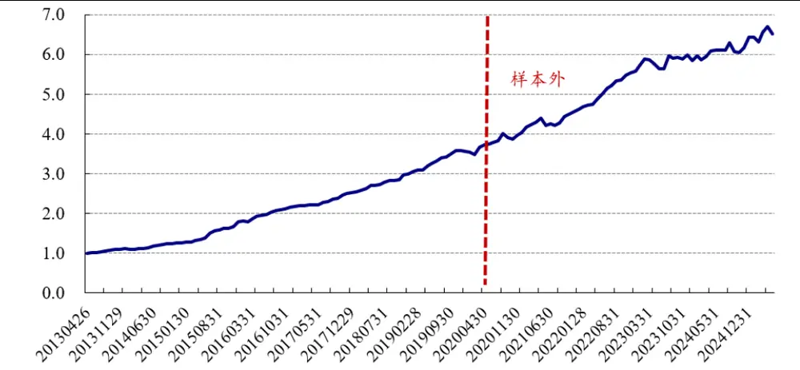
数据来源：Wind、开源证券研究所

为了对理想振幅因子做进一步改进，我们尝试引入更高频率的分钟交易信息。这里对数据频率进行提升，主要基于日频交易数据信息含量有限、颗粒度不够精细的考虑。相对来讲，分钟交易信息颗粒度更高，能够对个股日内交易结构进行呈现；日频交易信息只能看到特定信息，日内结构信息无法知晓。在引入切割思路后，分钟交易信息在切割比例选取、回看天数、时间频率上更有优势。因此，这里我们引入分钟交易信息，对高频振幅因子进行内部切割。关于“因子切割思想”的更多讨论，详见我们 2020年的专题报告《因子切割论》（魏建榕，苏俊豪）。

## 2、 分钟理想振幅因子的构造

当我们拿到股票过去 N 天的 1 分钟交易信息后（N*240 个分钟 K 线），我们有两种切割思路：（1）将过去 N 天分钟数据合并在一起进行切割；（2）先对每天的分钟交易信息进行日内切割，得到日度序列后再合成。以上两种思路我们最终分别构造得到分钟理想振幅因子和日内振幅切割因子，本部分我们首先对分钟理想振幅因子进行介绍。

我们回看股票过去 N 天的 1 分钟数据，设置不同切割比例，对分钟振幅因子按照分钟收盘价进行高低价切割，得到高价分钟振幅因子和低价分钟振幅因子，并用高价分钟振幅因子与低价分钟振幅因子相减，得到分钟理想振幅因子。

表2：分钟理想振幅因子的构造步骤

| 步骤1 | 对选定股票S，回溯取其最近N个交易日的1分钟数据； |
| --- | --- |
| 步骤2 | 计算股票S每分钟的分钟振幅（最高价/最低价-1)； |
| 步骤3 | 选择分钟收盘价较高的λ（比如40%）有效交易分钟，计算分钟振幅均值得 到高价振幅因子 V_high(λ); |
| 步骤4 | 选择分钟收盘价较低的λ（比如40%）有效交易分钟，计算分钟振幅均值得 到低价振幅因子 V_low(λ); |
| 步骤5 | 计算 V=V_high(λ)-V_low(λ)，即为分钟理想振幅因子。 |

资料来源：开源证券研究所

我们对比日频与分钟切割得到的V_high、V_low因子的 IC 均值结构：日度和分钟的 IC 均值结构整体呈现向左开口的喇叭口形状，分钟的图形相对日度上移，分钟V_low 在低切割比例部分呈现动量属性。通过图形可以发现：由于分钟数据样本足够多，当切割比例 10%时，分钟V_high 反转效应继续增加，日度V_high 出现波动，这也体现出分钟数据的优势。

图2：日度振幅切割与分钟振幅切割：V_high、V_low 的 IC 均值结构（N=20）
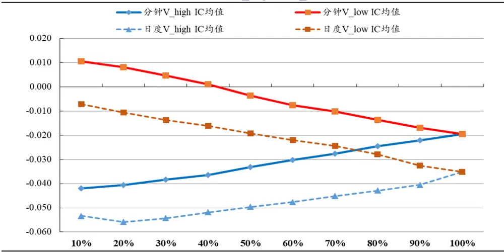
数据来源：Wind、开源证券研究所

我们设置回看天数N=20天，选择不同切割比例λ（5%-50%），测算分钟理想振幅因子的选股效果。随着切割比例降低，分钟理想振幅因子选股效果先升后降，IC均值最优为 20%比例-0.057，ICIR 最优为 25%比例-2.77。整体上所有切割比例的分钟理想振幅因子选股效果差异不大，并且所有切割比例的分钟振幅因子选股效果均优于日度原始理想振幅因子。

图3：不同切割比例的分钟理想振幅因子绩效对比（N=20）
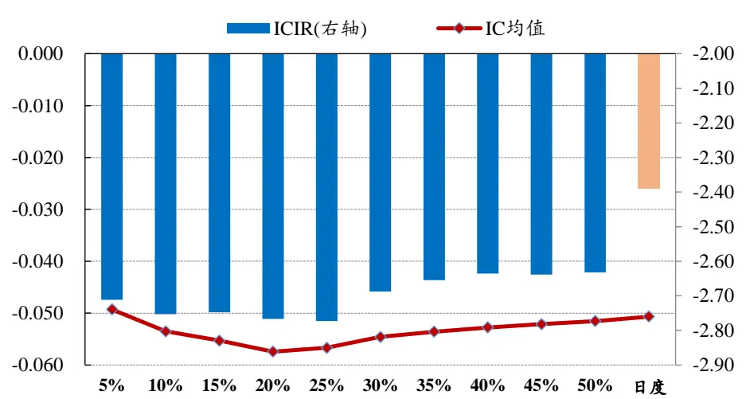
数据来源：Wind、开源证券研究所

我们设置切割比例λ=25%，选择不同回看天数 N（5 天-30 天），测算分钟理想振幅因子的选股效果。可以发现，随着回看天数由 30 天降低至 10 天，分钟理想振幅因子选股效果整体呈现上升趋势，当N=10 天时，分钟理想振幅因子的选股效果最优（IC 均值-0.059，ICIR-3.1）。当回看天数降低为 5 天时，分钟理想振幅因子选股效果下降。所有不同回看天数的分钟理想振幅因子，选股效果均优于日度原始理想振幅因子。

图4：不同回看天数的分钟理想振幅因子绩效对比（λ=25%）
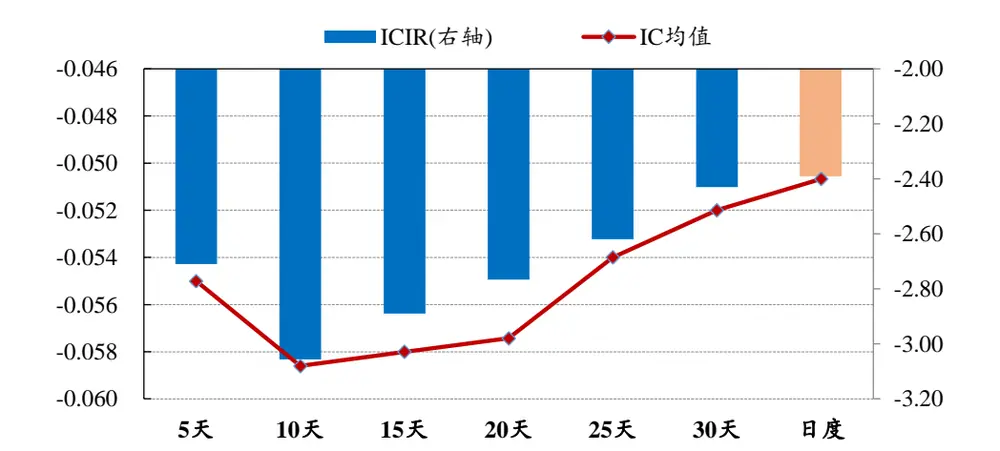
数据来源：Wind、开源证券研究所

最终我们分钟理想振幅因子选择回看天数 N=10、切割比例λ=25%参数，因子IC 均值为-0.059，ICIR 为-3.1，5 分组多空对冲年化收益为 19.5%，整体选股效果优异，相对原始理想振幅因子有一定提升。

图5：分钟理想振幅因子五分组多空对冲曲线（N=10，λ=25%）
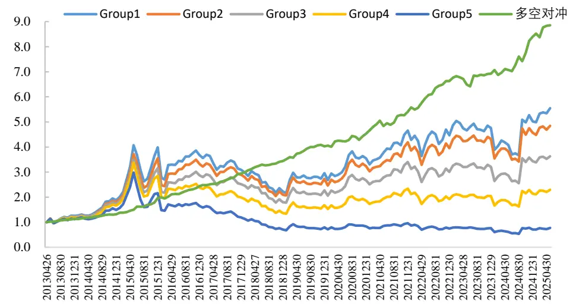
数据来源：Wind、开源证券研究所

## 3、 日内振幅切割因子的构造

我们换第二种思路，拿到股票过去 N 天的 1 分钟交易信息后，先对每日分钟交易信息进行日内切割，得到日度序列后再合成构建因子。具体做法上，我们选择股票单个交易日的 1 分钟数据，设置不同切割比例，对分钟振幅因子按照分钟收盘价进行高低价切割，使用情绪指标对分钟振幅进行高低切割，并计算两者差值得到该交易日的振幅切割因子。得到日频振幅切割因子序列后，我们计算10日均值（V_mean）和标准差（V_std），将两者进行横截面标准化后，等权合成得到最终的日内振幅切割因子。

表3：日内振幅切割因子的构造步骤

| 步骤1 | 对选定股票S，选择单个交易日内所有1分钟数据，计算每分钟的分钟振幅（最 |
| --- | --- |
| 步骤2 | 高价/最低价-1)； 使用情绪指标对分钟振幅进行排序：选择指标较高的λ比例交易分钟，计算分 |
|  | 钟振幅均值记为V high；选择指标较低的λ比例交易分钟，计算分钟振幅均 值记为 V low。计算 V=V high-V low，得到该交易 日的振幅切割因子； |
| 步骤3 步骤4 | 回看过去 10个交易日，计算指标 V均值记为 V_mean，计算指标V 标准差记 为 V_std; |

资料来源：开源证券研究所

日内切割的情绪指标我们分别选择价格、振幅、成交额、1分钟涨跌幅、5分钟涨跌幅，分别切割得到最终因子并测算因子选股效果。

表4：日内振幅切割情绪指标

| 情绪指标 | 指标介绍 |
| --- | --- |
| 价格 | 个股分钟收盘价 |
| 振幅 | 个股分钟振幅（分钟最高价/分钟最低价-1） |
| 成交额 | 个股分钟成交金额 |
| 1分钟涨跌幅 | 个股最近1分钟涨跌幅 |
| 5 分钟涨跌幅 | 个股最近5分钟涨跌幅 |

资料来源：开源证券研究所

我们设置回看天数 N=10、切割比例λ=25%，分别测试不同情绪指标切割下，均值因子V_mean、标准差因子V_std和合成因子的选股效果（表 5）。可以发现：均值因子 V_mean和标准差因子V_std均有较好的选股效果，部分情绪指标的V_std选股效果优于 V_mean（振幅、成交额）。合成因子整体上选股效果更优，其中成交额、1 分钟涨跌幅、5 分钟涨跌幅切割得到的合成因子选股表现差异不大。1 分钟涨跌幅切割得到的合成因子选股效果最优，rankICIR达到-3.75。

表5：不同情绪指标的日内振幅切割因子绩效指标（N=10，λ=25%）

| 情绪指标 | 因子 | IC均值 | rankIC 均值 | ICIR | rankICIR | 多空对冲年化收益 | 信息比率 |
| --- | --- | --- | --- | --- | --- | --- | --- |
| 价格 | V_mean | -0.034 | -0.056 | -2.37 | -3.31 | 11.6% | 1.94 |
|  | V_std | -0.036 | -0.057 | -2.17 | -2.52 | 10.3% | 1.18 |
|  | 合成因子 | -0.043 | -0.068 | -2.87 | -3.59 | 14.7% | 2.37 |
| 振幅 | V_mean | -0.039 | -0.065 | -1.33 | -2.04 | 8.7% | 0.71 |
|  | V_std | -0.042 | -0.067 | -2.61 | -3.42 | 15.6% | 1.97 |
|  | 合成因子 | -0.044 | -0.070 | -1.90 | -2.53 | 11.4% | 1.04 |
| 成交额 | V_mean | -0.056 | -0.086 | -1.94 | -2.70 | 15.8% | 1.39 |
|  | V_std | -0.043 | -0.069 | -2.68 | -3.67 | 15.6% | 2.06 |
|  | 合成因子 | -0.054 | -0.085 | -2.32 | -3.10 | 16.4% | 1.59 |
| 1 分钟涨跌幅 | V_mean | -0.036 | -0.050 | -2.76 | -3.42 | 13.3% | 2.38 |
|  | V_std | -0.032 | -0.060 | -2.42 | -3.05 | 12.7% | 1.64 |
|  | 合成因子 | -0.042 | -0.065 | -2.93 | -3.75 | 16.7% | 2.45 |
| 5分钟涨跌幅 | V_mean | -0.053 | -0.071 | -2.82 | -3.50 | 15.3% | 2.04 |
|  | V_std | -0.039 | -0.070 | -2.29 | -3.36 | 13.9% | 1.69 |
|  | 合成因子 | -0.050 | -0.078 | -2.72 | -3.63 | 16.5% | 2.03 |

数据来源：Wind、开源证券研究所

图6：不同情绪指标的日内振幅切割合成因子 5分组多空对冲曲线（N=10，λ=25%）
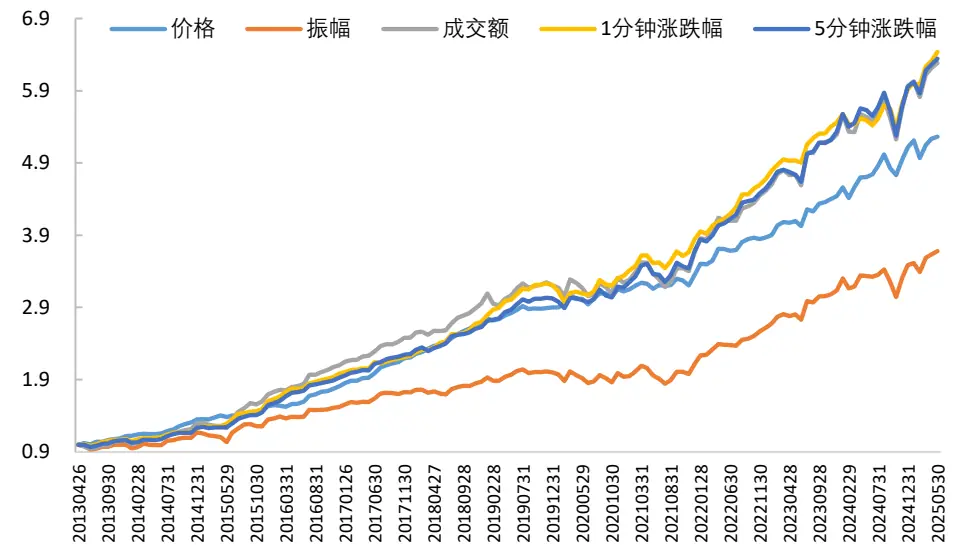
数据来源：Wind、开源证券研究所

我们对1分钟涨跌幅日内切割振幅因子，讨论不同切割比例的选股绩效（图 7）。可以发现，随着切割比例降低，因子选股绩效整体更优。当切割比例λ=20%时，因子 rankIC 均值为-0.067， rankICIR 为-3.82，5 分组多空对冲年化收益率为 16.7%。我们最终日内振幅切割因子参数选择回看天数 N=10、切割比例λ=20%，采用 1 分钟涨跌幅指标进行切割。

图7：不同切割比例的涨跌幅日内振幅切割因子绩效对比（N=10）
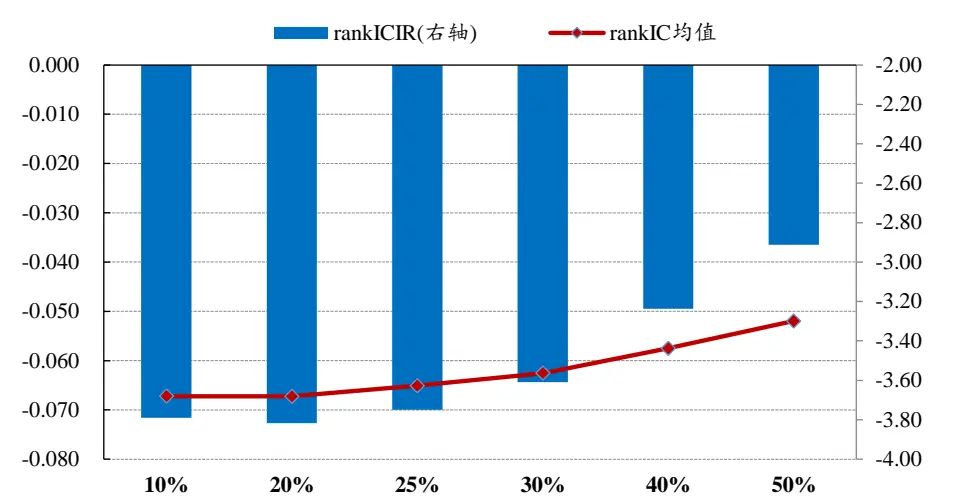
数据来源：Wind、开源证券研究所

图8：涨跌幅日内振幅切割因子五分组多空对冲曲线（N=10，λ=20%）
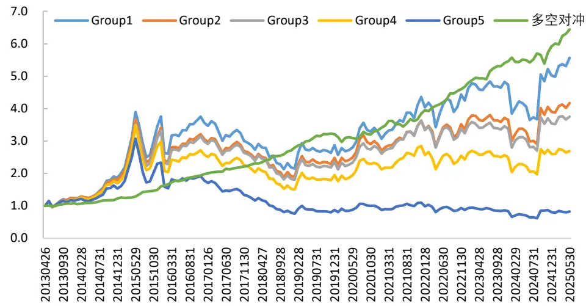
数据来源：Wind、开源证券研究所

## 4、 高频振幅合成因子选股效果优异

上文我们基于两种切割思路，构造了分钟理想振幅因子和日内振幅切割因子，我们考虑将二者进行合成。从因子相关性矩阵来看（表 6），分钟理想振幅因子、日内振幅切割因子与原始理想振幅因子之间，彼此相关性不算很高：分钟理想振幅因子和原始理想振幅因子相关性相对较高（47%），主要是因为二者切割方法基本一致，只是数据频率的差异，但相关性也没有超过 50%；日内振幅切割因子与原始理想振幅因子相关性较低（26%）；分钟理想振幅因子与日内振幅切割因子二者相关性也不算太高（30%），因此接下来我们将二者进行合成。

表6：因子相关性矩阵：分钟理想振幅与日内振幅切割因子相关性不高

| 分钟理想振幅 日内振幅切割 理想反转 聪明钱 |  |  |  |  |
| --- | --- | --- | --- | --- |
| 分钟理想振幅 | 1 | 0.30 | 理想振幅 0.47 | APM |
|  |  |  | -0.08 | 0.22 0.39 |
| 日内振幅切割 |  | 1 0.26 | -0.18 | 0.18 0.25 |
| 理想振幅 |  | 1 | -0.15 | 0.23 0.38 |
| APM |  |  | 1 | -0.03 -0.05 |
| 理想反转 |  |  |  | 1 0.14 |
| 聪明钱 |  |  |  | 1 |

数据来源：Wind、开源证券研究所

我们选择分钟理想振幅因子和日内振幅切割因子，在横截面上标准化后进行等权合成，得到最终高频振幅合成因子。高频振幅合成因子选股绩效优异：因子IC 均值为-0.06，ICIR 为-3.27，rankIC 均值为-0.086，rankICIR 为-4.58，5 分组多空对冲年化收益率提升至 22.4%。从因子多空曲线和绩效指标上看，高频振幅合成因子相对分钟理想振幅因子和日内振幅切割因子选股效果有显著提升。

图9：高频振幅合成因子5分组多空对冲曲线
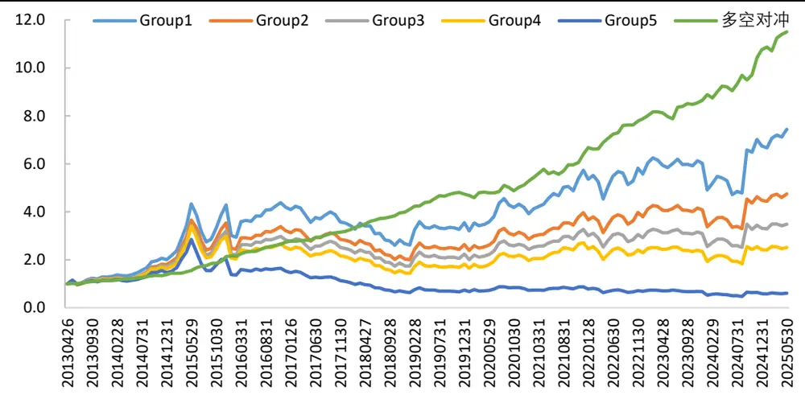
数据来源：Wind、开源证券研究所

图10：高频振幅合成因子多空曲线优于分钟理想振幅因子和日内振幅切割因子
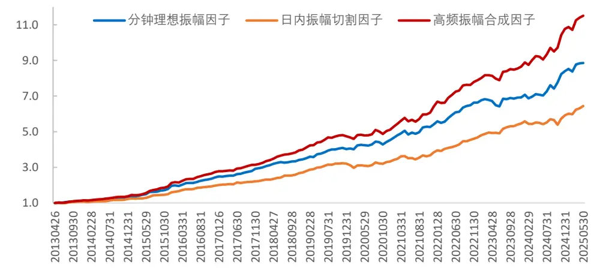
数据来源：Wind、开源证券研究所

表7：高频振幅合成因子绩效指标优于分钟理想振幅因子和日内振幅切割因子

| IC均值 rankIC 均值 ICIR rankICIR 多空对冲年化收益 信息比率 |  |
| --- | --- |
| 分钟理想振幅因子 -0.059 -0.076 -3.06 | -3.88 19.5% 2.64 |
| 日内振幅切割因子 -0.043 -0.067 | -2.90 -3.82 16.7% 2.47 |
| 高频振幅合成因子 -0.060 -0.086 -3.27 | -4.58 22.4% 3.09 |

数据来源：Wind、开源证券研究所

我们对比了高频振幅合成因子、分钟理想振幅因子、日内振幅切割因子和原始理想振幅因子的分年度多空对冲收益率。我们原始理想振幅因子发布于2020年，从因子样本外 2021 年-2025 年累计收益来看：原始理想振幅因子累计多空收益率为51.3%，高频振幅合成因子、分钟理想振幅因子、日内振幅切割因子累计多空收益率分别为 89.4%、73.2%、70.9%，三类高频振幅因子样本外绩效均优于原始理想振幅因子，其中高频振幅合成因子表现最为优异。

表8：不同振幅因子分年度多空对冲收益率：高频振幅合成因子表现优异

| 年份 高频振幅合成因子 分钟理想振幅因子 日内振幅切割因子 原始理想振幅因子 |  |  |  |
| --- | --- | --- | --- |
| 2013 | 14.8% 13.5% | 7.8% | 11.2% |
| 2014 | 20.0% 16.1% | 13.8% | 14.2% |
| 2015 | 54.5% 48.9% | 30.6% | 41.7% |
| 2016 | 28.6% 24.4% | 23.6% | 21.4% |
| 2017 | 16.5% 20.7% | 12.6% | 15.7% |
| 2018 | 25.1% 16.8% | 21.2% | 18.8% |
| 2019 | 18.9% 17.0% | 18.8% | 18.4% |
| 2020 | 7.9% 12.4% | 3.8% | 13.7% |
| 2021 | 25.2% 19.4% | 15.4% | 14.1% |
| 2022 | 23.1% 22.6% | 21.6% | 20.8% |
| 2023 | 9.8% 4.4% | 16.8% | 4.9% |
| 2024 | 24.3% 21.2% | 8.3% | 10.1% |
| 2025(截至5月) | 6.9% 5.5% | 8.8% | 1.4% |
| 2021-2025 | 89.4% 73.2% | 70.9% | 51.3% |

数据来源：Wind、开源证券研究所（所有收益率均为区间累计收益率）

我们测算了高频振幅合成因子在沪深 300 指数和中证 500 指数样本股中的选股效果。高频振幅合成因子在沪深 300 指数样本中，rankICIR 为-2.32，5 分组多空对冲年化收益率为9.1%，选股信息比率1.53；在中证500指数样本中，rankICIR为-2.13，5 分组多空对冲年化收益率为 10.6%，选股信息比率1.43。可以发现，高频振幅合成因子在沪深 300 和中证 500 中选股效果较优，多空对冲曲线均呈现向上趋势。相对来看，高频振幅合成因子在沪深 300指数中选股效果优于中证 500指数。

图11：高频振幅合成因子在沪深300和中证 500样本的多空对冲曲线
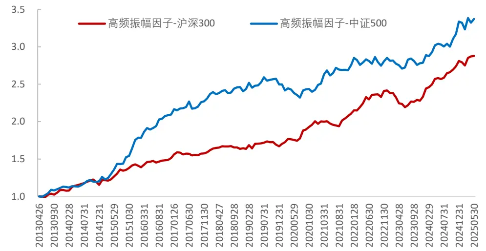
数据来源：Wind、开源证券研究所

表9：高频振幅合成因子在沪深300和中证 500中的选股绩效

| IC均值 rankIC 均值 ICIR rankICIR 多空对冲年化收益 |  |  |  |  |  |  |
| --- | --- | --- | --- | --- | --- | --- |
| 沪深300 | -0.041 | -0.046 | -1.79 | -2.32 | 9.1% | 信息比率 1.53 |
| 中证500 | -0.037 | -0.050 | -1.46 | -2.13 | 10.6% | 1.43 |

数据来源：Wind、开源证券研究所

## 5、 风险提示

模型测试基于历史数据，市场未来可能发生变化。

## 特别声明

《证券期货投资者适当性管理办法》、《证券经营机构投资者适当性管理实施指引（试行）》已于2017年7月1日起正式实施。根据上述规定，开源证券评定此研报的风险等级为R3（中风险），因此通过公共平台推送的研报其适用的投资者类别仅限定为专业投资者及风险承受能力为C3、C4、C5的普通投资者。若您并非专业投资者及风险承受能力为C3、C4、C5的普通投资者，请取消阅读，请勿收藏、接收或使用本研报中的任何信息。因此受限于访问权限的设置，若给您造成不便，烦请见谅！感谢您给予的理解与配合。

## 分析师承诺

负责准备本报告以及撰写本报告的所有研究分析师或工作人员在此保证，本研究报告中关于任何发行商或证券所发表的观点均如实反映分析人员的个人观点。负责准备本报告的分析师获取报酬的评判因素包括研究的质量和准确性、客户的反馈、竞争性因素以及开源证券股份有限公司的整体收益。所有研究分析师或工作人员保证他们报酬的任何一部分不曾与，不与，也将不会与本报告中具体的推荐意见或观点有直接或间接的联系。

## 股票投资评级说明

|  | 评级 | 说明 |
| --- | --- | --- |
| 证券评级 | 买入（Buy） | 预计相对强于市场表现20%以上； |
|  | 增持（outperform） | 预计相对强于市场表现5%～20%； |
|  | 中性（Neutral） | 预计相对市场表现在—5%～+5%之间波动； |
|  | 减持（underperform） | 预计相对弱于市场表现5%以下。 |
| 行业评级 | 看好（overweight） | 预计行业超越整体市场表现； |
|  | 中性（Neutral） | 预计行业与整体市场表现基本持平； |
|  | 看淡（underperform） | 预计行业弱于整体市场表现。 |
| 备注：评级标准为以报告日后的6~12个月内，证券相对于市场基准指数的涨跌幅表现，其中A股基准指数为沪深300指数、港股基准指数为恒生指数、新三板基准指数为三板成指（针对协议转让标的）或三板做市指数（针对做市转让标的)、美股基准指数为标普500或纳斯达克综合指数。我们在此提醒您，不同证券研究机构采用不同的评级术语及评级标准。我们采用的是相对评级体系，表示投资的相对比重建议；投资者买入或者卖出证券的决定取决于个人的实际情况，比如当前的持仓结构以及其他需要考虑的因素。投资者应阅读整篇报告，以获取比较完整的观点与信息，不应仅仅依靠投资评级来推断结论。 |  |  |

## 分析、估值方法的局限性说明

本报告所包含的分析基于各种假设，不同假设可能导致分析结果出现重大不同。本报告采用的各种估值方法及模型均有其局限性，估值结果不保证所涉及证券能够在该价格交易。

## 法律声明

开源证券股份有限公司是经中国证监会批准设立的证券经营机构，已具备证券投资咨询业务资格。

本报告仅供开源证券股份有限公司（以下简称“本公司”）的机构或个人客户（以下简称“客户”）使用。本公司不会因接收人收到本报告而视其为客户。本报告是发送给开源证券客户的，属于商业秘密材料，只有开源证券客户才能参考或使用，如接收人并非开源证券客户，请及时退回并删除。

本报告是基于本公司认为可靠的已公开信息，但本公司不保证该等信息的准确性或完整性。本报告所载的资料、工具、意见及推测只提供给客户作参考之用，并非作为或被视为出售或购买证券或其他金融工具的邀请或向人做出邀请。本报告所载的资料、意见及推测仅反映本公司于发布本报告当日的判断，本报告所指的证券或投资标的的价格、价值及投资收入可能会波动。在不同时期，本公司可发出与本报告所载资料、意见及推测不一致的报告。客户应当考虑到本公司可能存在可能影响本报告客观性的利益冲突，不应视本报告为做出投资决策的唯一因素。本报告中所指的投资及服务可能不适合个别客户，不构成客户私人咨询建议。本公司未确保本报告充分考虑到个别客户特殊的投资目标、财务状况或需要。本公司建议客户应考虑本报告的任何意见或建议是否符合其特定状况，以及（若有必要）咨询独立投资顾问。在任何情况下，本报告中的信息或所表述的意见并不构成对任何人的投资建议。在任何情况下，本公司不对任何人因使用本报告中的任何内容所引致的任何损失负任何责任。若本报告的接收人非本公司的客户，应在基于本报告做出任何投资决定或就本报告要求任何解释前咨询独立投资顾问。

本报告可能附带其它网站的地址或超级链接，对于可能涉及的开源证券网站以外的地址或超级链接，开源证券不对其内容负责。本报告提供这些地址或超级链接的目的纯粹是为了客户使用方便，链接网站的内容不构成本报告的任何部分，客户需自行承担浏览这些网站的费用或风险。

开源证券在法律允许的情况下可参与、投资或持有本报告涉及的证券或进行证券交易，或向本报告涉及的公司提供或争取提供包括投资银行业务在内的服务或业务支持。开源证券可能与本报告涉及的公司之间存在业务关系，并无需事先或在获得业务关系后通知客户。

本报告的版权归本公司所有。本公司对本报告保留一切权利。除非另有书面显示，否则本报告中的所有材料的版权均属本公司。未经本公司事先书面授权，本报告的任何部分均不得以任何方式制作任何形式的拷贝、复印件或复制品，或再次分发给任何其他人，或以任何侵犯本公司版权的其他方式使用。所有本报告中使用的商标、服务标记及标记均为本公司的商标、服务标记及标记。

## 开源证券研究所

上海

地址：上海市浦东新区世纪大道1788号陆家嘴金控广场1号

深圳

地址：深圳市福田区金田路2030号卓越世纪中心1号

楼3层

楼45层

邮编：200120

邮箱：research@kysec.cn

邮编：518000

邮箱：research@kysec.cn

北京
地址：北京市西城区西直门外大街18号金贸大厦C2座9层
邮编：100044
邮箱：research@kysec.cn

西安

地址：西安市高新区锦业路1号都市之门B座5层

邮编：710065

邮箱：research@kysec.cn