傅开波（分析师）

证书编号：S0790520090003

# 分钟资金流因子的构建方法

2025年12月21日

## 金融工程研究团队

魏建榕（首席分析师）

证书编号：S0790519120001

高鹏（分析师）

证书编号：S0790520090002

## 苏俊豪（分析师）

证书编号：S0790522020001

## 胡亮勇（分析师）

证书编号：S0790522030001

## 王志豪（分析师）

证书编号：S0790522070003

## 盛少成（分析师）

证书编号：S0790523060003

## 蒋韬（分析师）

证书编号：S0790525070001

《大小单资金流为核心的综合行业轮动方案—市场微观结构系列（23)》-2024.1.28

《大小单资金流 alpha 探究 2.0：变量精筛与高频测算—市场微观结构系列(18)》-2022.12.18

《大单与小单资金流的alpha能力—市场微观结构系列（12)》-2021.6.2《因子切割论—市场微观结构系列(10)》-2020.9.16

# ——市场微观结构系列（31）

魏建榕（分析师）

高鹏（分析师）

## 相关研究报告

weijianrong@kysec.cn

gaopeng@kysec.cn

证书编号：S0790519120001

证书编号：S0790520090002

## 分钟资金流信息的因子构建

我们在专题报告《大单与小单资金流的alpha能力》中，对日度资金流信息进行了标准化和动量中性化两步处理，构造得到了大单和小单资金流残差因子。日度资金流残差因子选股效果优异，样本外选股效果相对稳健。本文参考日度资金流残差因子的构造思路，以逐笔成交数据合成得到的分钟资金流信息为对象，提供三类分钟资金流因子的构造方法。

## 分钟资金流切割残差因子

我们对分钟资金流进行切割再构造，切割指标分别选择分钟价格、分钟涨跌幅、分钟振幅，切割对象为分钟大单净流入金额和分钟小单净流入金额。

我们选定“50%较高振幅分钟资金流”作为分钟资金流切割残差因子的构造方案：大单分钟资金流切割残差因子IC 均值为 0.041、ICIR 为3.23、RankIC 均值为 0.045、RankICIR为3.34、多空对冲年化收益率 15.9%、信息比率为 3.39。小单分钟资金流切割残差因子IC均值为-0.047、ICIR为-2.96、RankIC 均值为-0.054、RankICIR为-3.32、多空对冲年化收益率17.7%、信息比率为3.02。

## 分钟资金流时段残差因子

我们将日内交易时段划分为第1小时、第2小时、第3小时、第4小时、前半小时和整点时段，筛选出特定时段分钟资金流信息后，构造得到不同时段的大单和小单分钟资金流残差因子。

我们选定“前半小时资金流信息”作为分钟资金流时段残差因子的构造方案：大单分钟资金流时段残差因子IC 均值为0.043、ICIR为3.41、RankIC均值为0.049、RankICIR为3.47、多空对冲年化收益率为16.8%、信息比率为3.64。小单分钟资金流时段残差因子IC 均值为-0.061、ICIR 为-3.47、RankIC 均值为-0.07、RankICIR为-3.82、多空对冲年化收益率为 23.3%、信息比率为3.65。

## 分钟资金流情景残差因子

我们使用振幅、1min涨跌幅、5min涨跌幅、符号成交额指标，对市场情景状态进行划分，选出同样市场情景资金流信息，构造分钟资金流情景残差因子。

我们选定“5min涨跌幅指标”作为分钟资金流情景残差因子的构造方案：大单分钟资金流情景残差因子IC 均值为 0.037、ICIR 为 3.88、RankIC 均值为 0.04、RankICIR为3.86、多空对冲年化收益率为14.1%、信息比率为4.04。小单分钟资金流情景残差因子IC均值为-0.054、ICIR为-3.99、RankIC均值为-0.059、RankICIR为-4.15、多空对冲年化收益率为21.2%、信息比率为4.22。从多空对冲曲线走势上看，2021年以来因子选股效果依然稳健。

- 风险提示：模型测试基于历史数据，市场未来可能发生变化。

我们在专题报告《大单与小单资金流的alpha能力》（魏建榕，高鹏，盛少成）中，对日度资金流信息进行了标准化和动量中性化两步处理，构造得到了大单和小单资金流残差因子。日度资金流残差因子选股效果优异，样本外选股效果相对稳健。本文参考日度资金流残差因子的构造思路，以逐笔成交数据合成得到的分钟资金流信息为对象，提供三类分钟资金流因子的构造方法。开源证券长期关注金融科技发展，本项研究的高效开展，得益于开源证券总部高性能服务器资源的稳定算力支持。

## 1、分钟资金流切割残差因子

我们在2020年发布的专题报告《因子切割论》（魏建榕，苏俊豪）中，系统阐述了因子切割论三要素：对象（具有可加性的目标变量）、刀法（有区分能力的切割指标)、产出（对切割后变量的再加工)，因子切割论也成为剖析市场内部精细结构的利器。

本文尝试采用因子切割论对分钟资金流进行切割再构造，切割指标分别选择分钟价格、分钟涨跌幅、分钟振幅，切割对象为过去20日的分钟大单净流入金额和分钟小单净流入金额。三个切割指标选择上：（1）不同股价位置资金流含义不同：股价高位低位的机构买入（大单净流入）、股价高位低位的散户卖出（小单净流出），代表的含义往往不同；（2）不同涨跌幅资金流含义不同：股价涨跌是由机构推动（大单)、还是散户推动（小单)，代表的含义往往不同；(3）不同振幅资金流含义不同：股价四平八稳或交易活跃时，机构（大单）和散户（小单）资金流入强度代表含义不同。

我们选择分钟价格作为切割指标，对分钟资金流进行切割，构造得到价格维度的分钟资金流切割残差因子。不同切割比例的因子效果对比来看（图1&图2，横轴为切割比例）：随着切割比例逐渐增加，高价部分（head）和低价部分（tail）分钟资金流切割残差因子选股效果整体上升。当切割比例为50%时，大单-head因子和小单-head 因子表现最优。

图1：不同价格大单分钟资金流切割：因子信息比率IR
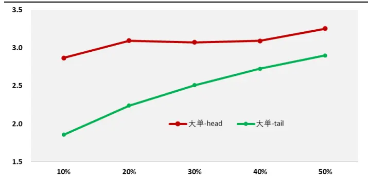
数据来源：Wind、开源证券研究所（数据截至20250530）

图2：不同价格小单分钟资金流切割：因子信息比率IR
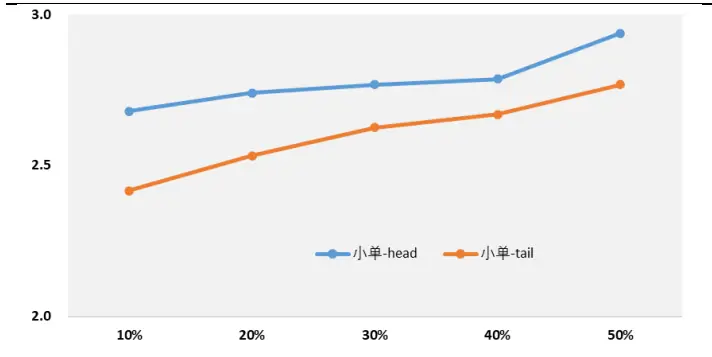
数据来源：Wind、开源证券研究所（数据截至20250530）

分钟价格切割的分钟资金流残差因子选股表现：这里选择切割比例50%的较高价格分钟资金流，构造价格维度的分钟资金流切割残差因子。大单分钟资金流切割残差因子（价格）的 IC 均值为 0.037、ICIR 为3.05、RankIC 均值为 0.04、RankICIR为3.1、多空对冲年化收益率为14.2%、信息比率为3.25。小单分钟资金流切割残差因子（价格）的 IC均值为-0.041、ICIR为-2.83、RankIC 均值为-0.046、RankICIR为-3.13、多空对冲年化收益率为15.2%、信息比率为2.94。

图3：大单资金流切割残差因子5分组曲线（价格）
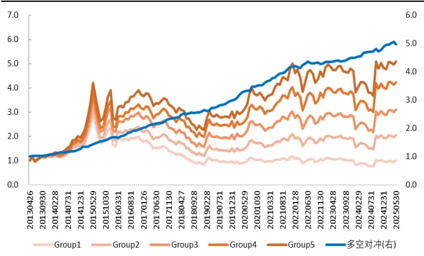
数据来源：Wind、开源证券研究所（数据截至20250530）

图4：小单资金流切割残差因子5分组曲线（价格）
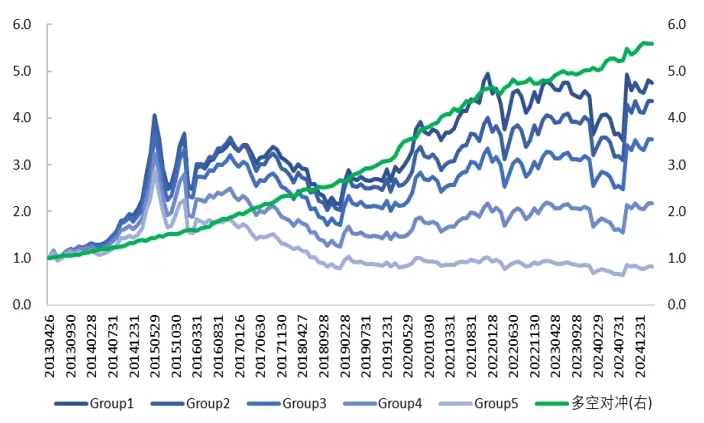
数据来源：Wind、开源证券研究所（数据截至20250530）

表1：大单和小单分钟资金流切割残差因子（价格）选股绩效指标

| IC 均值 | rankIC 均值 |  | ICIR | rankICIR | 多空对冲年化收益 | 信息比率 |
| --- | --- | --- | --- | --- | --- | --- |
| 大单 | 0.037 | 0.040 | 3.05 | 3.10 | 14.2% | 3.25 |
| 小单 | -0.041 | -0.046 | -2.83 | -3.13 | 15.2% | 2.94 |

数据来源：Wind、开源证券研究所（数据区间：20130426-20250530）

分钟涨跌幅切割的分钟资金流残差因子选股表现：这里选择切割比例50%的较高涨跌幅分钟资金流，构造涨跌幅维度的分钟资金流切割残差因子。大单分钟资金流切割残差因子（涨跌幅）的 IC 均值为 0.032、ICIR 为 2.73、RankIC 均值为 0.029、RankICIR为2.3、多空对冲年化收益率为11.7%、信息比率为2.72。小单分钟资金流切割残差因子（涨跌幅）的 IC均值为-0.024、ICIR为-1.66、RankIC均值为-0.01、RankICIR为-0.59、多空对冲年化收益率为8.1%、信息比率为1.36。

图5：大单分钟资金流切割残差因子5分组曲线(涨跌幅)
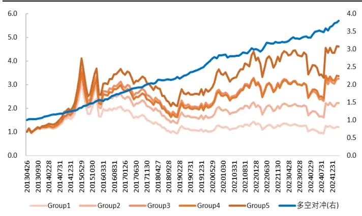
数据来源：Wind、开源证券研究所（数据截至20250530）

图6：小单分钟资金流切割残差因子5分组曲线(涨跌幅)
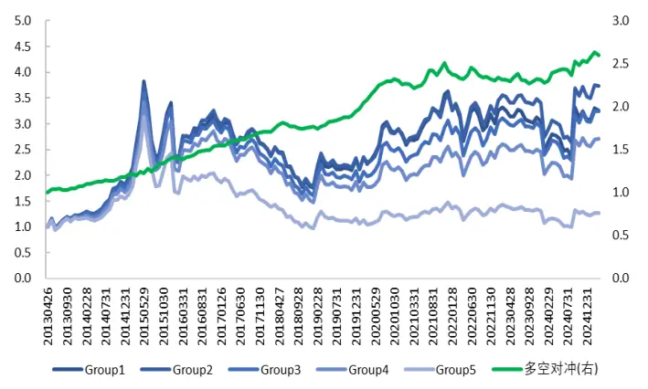
数据来源：Wind、开源证券研究所（数据截至20250530）

表2：大单和小单分钟资金流切割残差因子（涨跌幅）选股绩效指标

| IC均值 | rankIC 均值 |  | ICIR | rankICIR | 多空对冲年化收益 | 信息比率 |
| --- | --- | --- | --- | --- | --- | --- |
| 大单 | 0.032 | 0.029 | 2.73 | 2.30 | 11.7% | 2.72 |
| 小单 | -0.024 | -0.010 | -1.66 | -0.59 | 8.1% | 1.36 |

数据来源：Wind、开源证券研究所（数据区间：20130426-20250530）

分钟振幅切割的分钟资金流残差因子选股表现：这里选择切割比例50%的较高振幅分钟资金流，构造振幅维度的分钟资金流切割残差因子。大单分钟资金流切割残差因子（振幅）的 IC 均值为 0.041、ICIR 为 3.23、RankIC 均值为 0.045、RankICIR为3.34、多空对冲年化收益率15.9%、信息比率为3.39。小单分钟资金流切割残差因子(振幅)的 IC 均值为-0.047、ICIR为-2.96、RankIC 均值为-0.054、RankICIR为-3.32、多空对冲年化收益率17.7%、信息比率为3.02。

对比分钟价格、分钟涨跌幅、分钟振幅的切割效果，可以发现分钟振幅切割得到的分钟资金流切割残差因子绩效最优。最终，我们选定“50%较高振幅分钟资金流”作为分钟资金流切割残差因子的构造方案。

图7：大单分钟资金流切割残差因子5分组曲线（振幅）
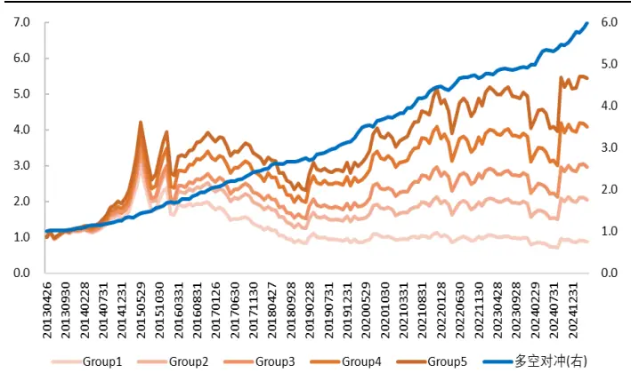
数据来源：Wind、开源证券研究所（数据截至20250530）

图8：小单分钟资金流切割残差因子5分组曲线（振幅）
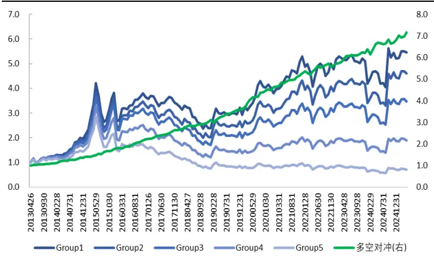
数据来源：Wind、开源证券研究所（数据截至20250530）

表3：大单和小单分钟资金流切割残差因子（振幅）选股绩效指标

| IC均值 |  | rankIC 均值 | ICIR | rankICIR | 多空对冲年化收益 | 信息比率 |
| --- | --- | --- | --- | --- | --- | --- |
| 大单 | 0.041 | 0.045 | 3.23 | 3.34 | 15.9% | 3.39 |
| 小单 | -0.047 | -0.054 | -2.96 | -3.32 | 17.7% | 3.02 |

数据来源：Wind、开源证券研究所（数据区间：20130426-20250530）

## 2、分钟资金流时段残差因子

实证研究表明，机构资金偏好在上午甚至是上午开盘时段进行交易，不同类型投资者对日内交易时段的偏好存在明显差异，因此不同时段的资金流蕴含了不同的信息。本部分我们考察日内不同交易时段，构造分钟资金流时段残差因子。

因子构造方法上，我们将日内交易时段划分为：第1小时、第2小时、第3小时、第4小时、前半小时和整点时段（整点时刻9:30、10:00、10:30、11:00、13:00、13:30、14:00、14:30的随后5分钟的合并，共计40分钟)，筛选出过去20日特定时段的分钟资金流信息后，分别构造得到不同时段的大单和小单分钟资金流残差因子。

不同时段分钟资金流残差因子选股效果差异显著：前半小时因子选股效果最优(大单因子IR 为 3.64，小单因子IR 为 3.65)，第 1小时因子相比前半小时因子选股效果略有降低；整点时段因子选股效果较优；日内4个小时因子选股效果单调下降，上午时段因子选股效果显著优于下午时段因子。最终，我们选定“前半小时资金流信息”作为分钟资金流时段残差因子的构造方案。

图9：不同时段大单分钟资金流残差因子信息比率IR
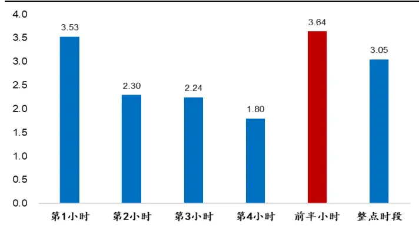
数据来源：Wind、开源证券研究所（数据截至20250530）

图10：不同时段小单分钟资金流残差因子信息比率IR
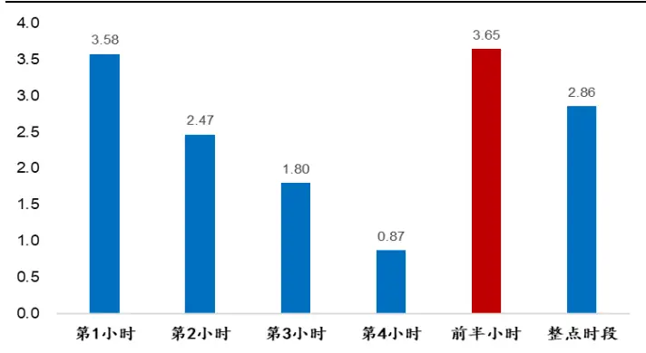
数据来源：Wind、开源证券研究所（数据截至20250530）

不同时段大单和小单分钟资金流残差因子多空曲线对比：前半小时和第1小时因子多空曲线走势稳健，2021年以来依然具备选股效果；第2小时、第3小时、第4小时因子多空曲线2021年以来走势趋平，选股效果显著下降。我们认为有必要选择前半小时或第1小时资金流信息进行资金流因子构造。

图11：不同时段大单分钟资金流残差因子多空对冲曲线
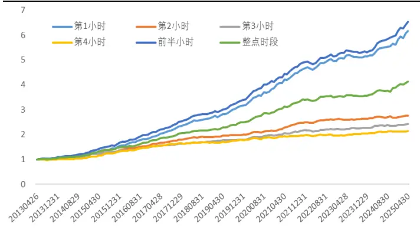
数据来源：Wind、开源证券研究所（数据截至20250530）

图12：不同时段小单分钟资金流残差因子多空对冲曲线
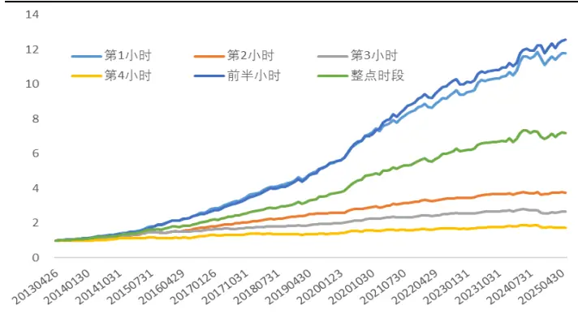
数据来源：Wind、开源证券研究所（数据截至20250530）

大单和小单分钟资金流时段残差因子选股效果优异：大单分钟资金流时段残差因子的 IC 均值为 0.043、ICIR 为 3.41、RankIC 均值为 0.049、RankICIR 为 3.47、多空对冲年化收益率为16.8%、信息比率为3.64。小单分钟资金流时段残差因子的IC均值为-0.061、ICIR为-3.47、RankIC均值为-0.07、RankICIR为-3.82、多空对冲年化收益率为 23.3%、信息比率为 3.65。

图13：大单分钟资金流时段残差因子5分组曲线
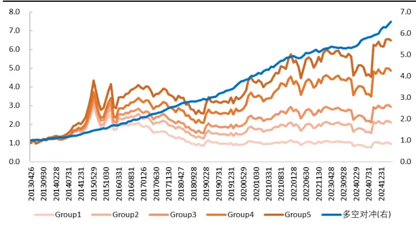
数据来源：Wind、开源证券研究所（数据截至20250530）

图14：小单分钟资金流时段残差因子5分组曲线
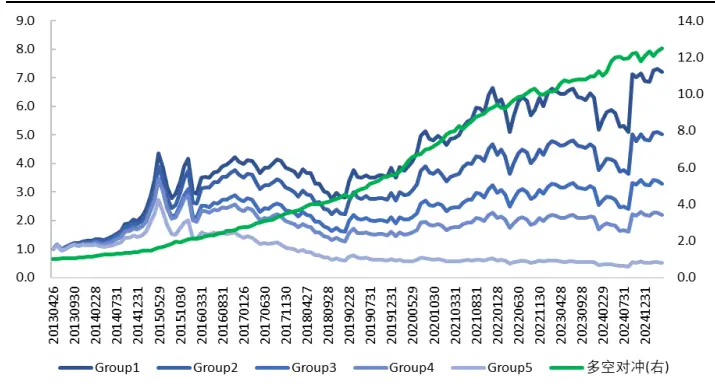
数据来源：Wind、开源证券研究所（数据截至20250530）

表4：大单和小单分钟资金流时段残差因子选股绩效指标

| IC 均值 |  | rankIC 均值 | ICIR | rankICIR | 多空对冲年化收益 | 信息比率 |
| --- | --- | --- | --- | --- | --- | --- |
| 大单 | 0.043 | 0.049 | 3.41 | 3.47 | 16.8% | 3.64 |
| 小单 | -0.061 | -0.070 | -3.47 | -3.82 | 23.3% | 3.65 |

数据来源：Wind、开源证券研究所（数据区间：20130426-20250530）

## 3、分钟资金流情景残差因子

本部分我们按照市场情景状态进行划分，选出特定的交易时刻，对所有股票的这些相同的交易时刻，进行分钟资金流情景残差因子构造。市场情景状态划分方法上，首先选择过去20日第1小时分钟信息，计算上证指数分钟指标（振幅、1min涨跌幅、5min涨跌幅、符号成交额1)，挑选出指数分钟指标靠前的50%交易分钟，并选取个股对应分钟的资金流信息，分别构造得到不同情景的大单和小单分钟资金流残差因子。

不同情景指标的分钟资金流残差因子选股效果差异显著：5min涨跌幅情景指标因子选股效果最优（大单因子IR为4.04，小单因子IR为4.22)，1min涨跌幅情景指标因子选股效果最差。我们认为5min涨跌幅指标能够有效衡量市场趋势上涨的情景，1min涨跌幅的噪音相对较大。最终，我们选定“5min涨跌幅指标”作为分钟资金流情景残差因子的构造方案。

图15：不同市场情景大单资金流残差因子信息比率IR
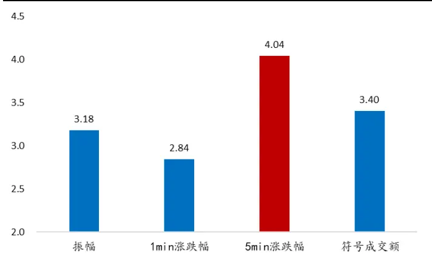
数据来源：Wind、开源证券研究所（数据截至20250530）

图16：不同市场情景小单资金流残差因子信息比率IR
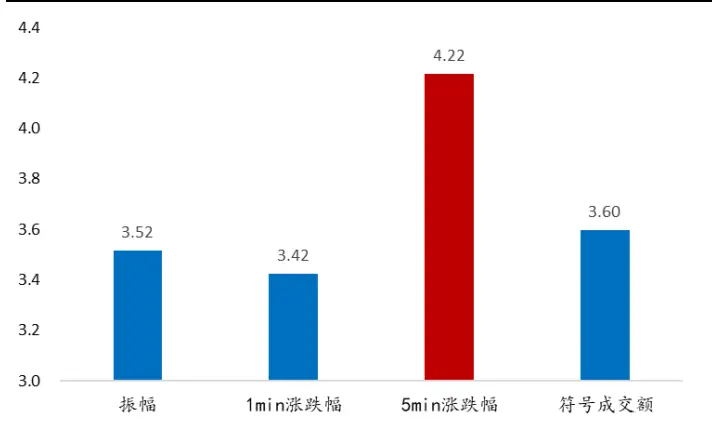
数据来源：Wind、开源证券研究所（数据截至20250530）

大单和小单分钟资金流情景残差因子选股效果优异：大单分钟资金流情景残差因子的 IC 均值为 0.037、ICIR为 3.88、RankIC 均值为 0.04、RankICIR为 3.86、多空对冲年化收益率为14.1%、信息比率为4.04。小单分钟资金流情景残差因子的IC均值为-0.054、ICIR为-3.99、RankIC 均值为-0.059、RankICIR为-4.15、多空对冲年化收益率为21.2%、信息比率为4.22。从多空对冲曲线走势上看，2021年以来因子选股效果依然稳健。

图17：大单分钟资金流情景残差因子5分组曲线
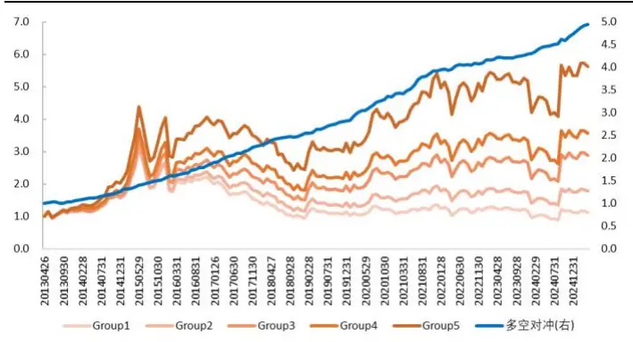
数据来源：Wind、开源证券研究所（数据截至20250530）

图18：小单分钟资金流情景残差因子5分组曲线
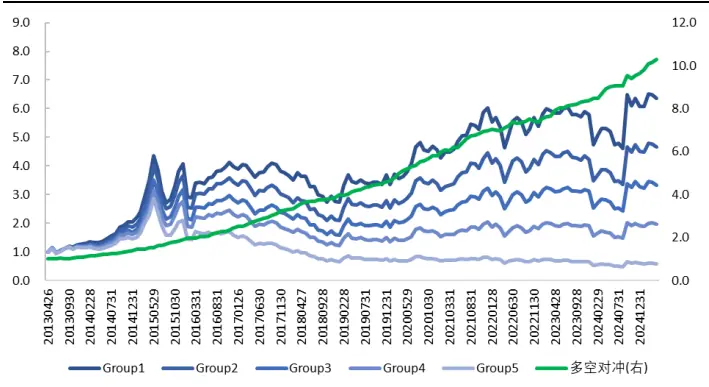
数据来源：Wind、开源证券研究所（数据截至20250530）

表5：大单和小单分钟资金流情景残差因子选股绩效指标

| IC均值 | rankIC 均值 |  | ICIR | rankICIR | 多空对冲年化收益 | 信息比率 |
| --- | --- | --- | --- | --- | --- | --- |
| 大单 | 0.037 | 0.040 | 3.88 | 3.86 | 14.1% | 4.04 |
| 小单 | -0.054 | -0.059 | -3.99 | -4.15 | 21.2% | 4.22 |

数据来源：Wind、开源证券研究所（数据区间：20130426-20250530）

我们对比原始资金流残差因子、分钟资金流切割残差因子、分钟资金流时段残差因子、分钟资金流情景残差因子选股效果（图19&图20)：大单和小单的分钟资金流情景残差因子选股效果最优，三类分钟资金流残差因子选股效果均优于原始资金流残差因子。

因子相关性上，三类分钟资金流残差因子与原始资金流残差因子之间相关性较低，但三类分钟资金流残差因子之间相关性较高。因子使用选择上，可以单独使用效果最优的分钟资金流情景残差因子，也可将三类分钟资金流残差因子进行合成使用。

图19：不同大单资金流残差因子信息比率IR对比
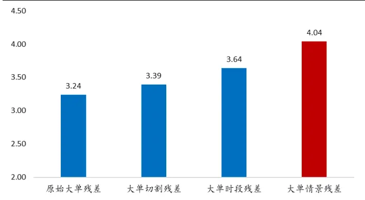
数据来源：Wind、开源证券研究所（数据截至20250530）

图20：不同小单资金流残差因子信息比率IR对比
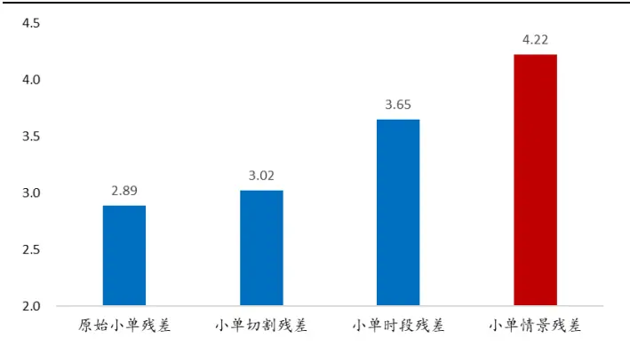
数据来源：Wind、开源证券研究所（数据截至20250530）

表6：大单资金流残差因子相关性矩阵

|  | 原始大单残差 | 大单切割残差 | 大单时段残差 | 大单情景残差 |
| --- | --- | --- | --- | --- |
| 原始大单残差 | 1 | 0.47 | 0.34 | 0.32 |
| 大单切割残差 |  | 1 | 0.60 | 0.61 |
| 大单时段残差 |  |  | 1 | 0.65 |
| 大单情景残差 |  |  |  | 1 |

数据来源：Wind、开源证券研究所（数据区间：20130426-20250530）

表7：小单资金流残差因子相关性矩阵

|  | 原始小单残差 | 小单切割残差 | 小单时段残差 | 小单情景残差 |
| --- | --- | --- | --- | --- |
| 原始小单残差 | 1 | 0.49 | 0.36 | 0.37 |
| 小单切割残差 |  | 1 | 0.64 | 0.66 |
| 小单时段残差 |  |  | 1 | 0.68 |
| 小单情景残差 |  |  |  | 1 |

数据来源：Wind、开源证券研究所（数据区间：20130426-20250530）

不同样本空间选股效果方面，我们测试了分钟资金流情景残差因子在沪深300和中证500样本中的选股效果：大单分钟资金流情景残差因子沪深300样本信息比率为1.14，中证500样本信息比率为1.83。小单分钟资金流情景残差因子沪深300样本信息比率为1.63，中证500样本信息比率为2.48。全区间来看，分钟资金流情景残差因子在沪深300和中证500样本中表现较优。

图21：大单分钟资金流情景残差因子沪深300和中证500样本选股多空曲线
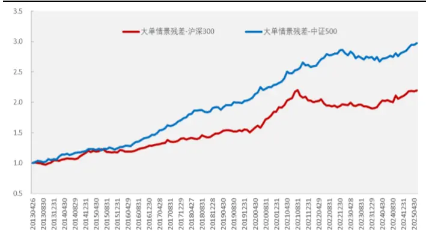
数据来源：Wind、开源证券研究所（数据截至20250530）

图22：小单分钟资金流情景残差因子沪深300和中证500样本选股多空曲线
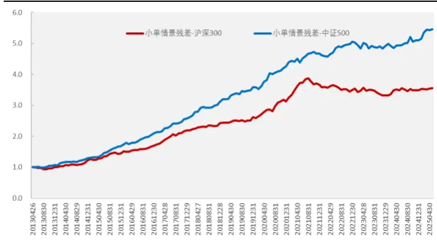
数据来源：Wind、开源证券研究所（数据截至20250530）

表8：大单与小单分钟资金流情景残差因子沪深300和中证500样本中选股绩效指标
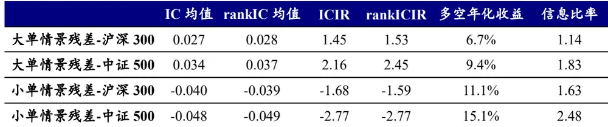
数据来源：Wind、开源证券研究所（数据区间：20130426-20250530）

## 4、总结

本文的核心工作有二：一是利用逐笔成交数据进行资金流划分，将资金流信息由日频提升到分钟频，这一步骤带来了显著的信息增量。二是提供了三类选股效果更优的分钟资金流因子构建思路：（1）指标切割维度得到的分钟资金流切割残差因子；（2）日内不同时段维度得到的分钟资金流时段残差因子；（3）市场情景维度得到的分钟资金流情景残差因子。

## 5、风险提示

模型测试基于历史数据，市场未来可能发生变化。

## 特别声明

《证券期货投资者适当性管理办法》、《证券经营机构投资者适当性管理实施指引（试行)》已于2017年7月1日起正式实施。根据上述规定，开源证券评定此研报的风险等级为R3（中风险)，因此通过公共平台推送的研报其适用的投资者类别仅限定为专业投资者及风险承受能力为C3、C4、C5的普通投资者。若您并非专业投资者及风险承受能力为C3、C4、C5的普通投资者，请取消阅读，请勿收藏、接收或使用本研报中的任何信息。因此受限于访问权限的设置，若给您造成不便，烦请见谅！感谢您给予的理解与配合。

## 分析师承诺

负责准备本报告以及撰写本报告的所有研究分析师或工作人员在此保证，本研究报告中关于任何发行商或证券所发表的观点均如实反映分析人员的个人观点。负责准备本报告的分析师获取报酬的评判因素包括研究的质量和准确性、客户的反馈、竞争性因素以及开源证券股份有限公司的整体收益。所有研究分析师或工作人员保证他们报酬的任何一部分不曾与，不与，也将不会与本报告中具体的推荐意见或观点有直接或间接的联系。

## 股票投资评级说明

|  | 评级 | 说明 |
| --- | --- | --- |
| 证券评级 | 买入（Buy） | 预计相对强于市场表现20%以上； |
|  | 增持（outperform） | 预计相对强于市场表现5%～20%; |
|  | 中性（Neutral） | 预计相对市场表现在—5%～+5%之间波动； |
|  | 减持（underperform） | 预计相对弱于市场表现5%以下。 |
| 行业评级 | 看好（overweight） | 预计行业超越整体市场表现； |
|  | 中性（Neutral） | 预计行业与整体市场表现基本持平； |
|  | 看淡（underperform） | 预计行业弱于整体市场表现。 |
| 备注：评级标准为以报告日后的6~12个月内，证券相对于市场基准指数的涨跌幅表现，其中A股基准指数为沪深300指数、港股基准指数为恒生指数、新三板基准指数为三板成指（针对协议转让标的）或三板做市指数（针对做市转让标的)、美股基准指数为标普500或纳斯达克综合指数。我们在此提醒您，不同证券研究机构采用不同的评级术语及评级标准。我们采用的是相对评级体系，表示投资的相对比重建议；投资者买入或者卖出证券的决定取决于个人的实际情况，比如当前的持仓结构以及其他需要考虑的因素。投资者应阅读整篇报告，以获取比较完整的观点与信息，不应仅仅依靠投资评级来推断结论。 |  |  |

## 分析、估值方法的局限性说明

本报告所包含的分析基于各种假设，不同假设可能导致分析结果出现重大不同。本报告采用的各种估值方法及模型均有其局限性，估值结果不保证所涉及证券能够在该价格交易。

## 法律声明

开源证券股份有限公司是经中国证监会批准设立的证券经营机构，已具备证券投资咨询业务资格。

本报告仅供开源证券股份有限公司（以下简称“本公司”）的机构或个人客户（以下简称“客户”）使用。本公司不会因接收人收到本报告而视其为客户。本报告是发送给开源证券客户的，属于商业秘密材料，只有开源证券客户才能参考或使用，如接收人并非开源证券客户，请及时退回并删除。

本报告是基于本公司认为可靠的已公开信息，但本公司不保证该等信息的准确性或完整性。本报告所载的资料、工具、意见及推测只提供给客户作参考之用，并非作为或被视为出售或购买证券或其他金融工具的邀请或向人做出邀请。本报告所载的资料、意见及推测仅反映本公司于发布本报告当日的判断，本报告所指的证券或投资标的的价格、价值及投资收入可能会波动。在不同时期，本公司可发出与本报告所载资料、意见及推测不一致的报告。客户应当考虑到本公司可能存在可能影响本报告客观性的利益冲突，不应视本报告为做出投资决策的唯一因素。本报告中所指的投资及服务可能不适合个别客户，不构成客户私人咨询建议。本公司未确保本报告充分考虑到个别客户特殊的投资目标、财务状况或需要。本公司建议客户应考虑本报告的任何意见或建议是否符合其特定状况，以及（若有必要）咨询独立投资顾问。在任何情况下，本报告中的信息或所表述的意见并不构成对任何人的投资建议。在任何情况下，本公司不对任何人因使用本报告中的任何内容所引致的任何损失负任何责任。若本报告的接收人非本公司的客户，应在基于本报告做出任何投资决定或就本报告要求任何解释前咨询独立投资顾问。

本报告可能附带其它网站的地址或超级链接，对于可能涉及的开源证券网站以外的地址或超级链接，开源证券不对其内容负责。本报告提供这些地址或超级链接的目的纯粹是为了客户使用方便，链接网站的内容不构成本报告的任何部分，客户需自行承担浏览这些网站的费用或风险。

开源证券在法律允许的情况下可参与、投资或持有本报告涉及的证券或进行证券交易，或向本报告涉及的公司提供或争取提供包括投资银行业务在内的服务或业务支持。开源证券可能与本报告涉及的公司之间存在业务关系，并无需事先或在获得业务关系后通知客户。

本报告的版权归本公司所有。本公司对本报告保留一切权利。除非另有书面显示，否则本报告中的所有材料的版权均属本公司。未经本公司事先书面授权，本报告的任何部分均不得以任何方式制作任何形式的拷贝、复印件或复制品，或再次分发给任何其他人，或以任何侵犯本公司版权的其他方式使用。所有本报告中使用的商标、服务标记及标记均为本公司的商标、服务标记及标记。

## 开源证券研究所

上海

地址：上海市浦东新区世纪大道1788号陆家嘴金控广场1号

深圳

地址：深圳市福田区金田路2030号卓越世纪中心1号

楼3层

楼45层

邮编：200120

邮箱：research@kysec.cn

邮编：518000

邮箱：research@kysec.cn

北京
地址：北京市西城区西直门外大街18号金贸大厦C2座9层
邮编：100044
邮箱：research@kysec.cn

西安

地址：西安市高新区锦业路1号都市之门B座5层

邮编：710065

邮箱：research@kysec.cn