2026 年 01 月 28 日

## 金融工程研究团队

魏建榕（首席分析师）

证书编号：S0790519120001

傅开波（分析师）

证书编号：S0790520090003

## 高 鹏（分析师）

证书编号：S0790520090002

## 苏俊豪（分析师）

证书编号：S0790522020001

## 胡亮勇（分析师）

证书编号：S0790522030001

## 王志豪（分析师）

证书编号：S0790522070003

## 盛少成（分析师）

证书编号：S0790523060003

## 蒋 韬（分析师）

证书编号：S0790123070037

## 相关研究报告

《遗传算法赋能交易行为因子—市场微观结构（20）》-2023.8.6《深度学习赋能交易行为因子—市场微观结构（24）》-2024.5.24《深度学习赋能风格轮动与多策 略 融 合 — 开 源 量 化 评 论（103）》-2024.12.12

《深度学习赋能技术分析—开源量化评论（109）》-2025.6.25

## 深度学习赋能因子挖掘 2.0：综合应用方案

# ——市场微观结构系列（32）

## 魏建榕（分析师）

盛少成（分析师）

weijianrong@kysec.cn

证书编号：S0790519120001

shengshaocheng@kysec.cn

证书编号：S0790523060003

## 开源金工因子挖掘2.0模型框架概览

在《深度学习赋能交易行为因子》，我们初步提出了1.0因子挖掘框架：1、日度变化类指标通过 LSTM，提取隐藏层；2、财务指标截面标准化后拼接在其后，再通过 MLP 输出为最终的因子。本篇报告将对 1.0 版本的因子挖掘框架进行升级，主要为三点：1、变量的丰富；2、网络的迭代；3、应用的升级。

## 基础行情测试模型有效性

1、对于网络而言，本文选择GRU和GAT。对于GAT的关联网络我们尝试了：行业、财务、资金流三大维度，其中基于财务网络挖掘出的因子多头表现相对最好。

2、对于三种不同的 GAT 网络而言，未来 10 日RankIC 与过去 20 日 Barra 因子收益存在一定相关性。相较于三个因子简单等权，本文采取 SA 加权：在训练时加入一层可学习的 mlp 层，输入端为Barra风格因子收益。

3、进一步地，我们参考《深度学习赋能交易行为因子》，考虑财务后，因子绩效进一步提升，尤其多头端提升较为明显。其10日RankIC 为11.7%；多头超额收益为24.1%，信息比例为 3.0；多空收益为58.9%，信息比例为5.1。

## 多特征集训练

1、G。该维度来自《深度学习赋能技术分析》，是基于基础行情的衍生指标，包含：技术指标和K线状态变量。因子 10日 RankIC为11.0%。

2、C。该维度是大小单资金流相关特征，包含：1、原始数据；2、衍生指标；3、状态变量。因子 10 日 RankIC 为 10.6%。

3、HF。该维度是高频数据降维的日度特征。因子10日RankIC 为11.6%。

4、DP。该维度是遗传算法有效因子。因子10 日RankIC 为11.4%。

5、合成。ML_C 因子 10 日 RankIC 为 14.2%；多头超额收益为 26.1%，信息比例为3.1；多空收益为 72.7%，信息比例为6.1。

## 深度学习应用

1、多头优选个股。在《深度学习赋能风格轮动和多策略融合》中，我们提出了基于强化学习的风格轮动方案。本篇报告中，我们将选股和风格轮动融合在一起，构建Beta+Alpha 的深度学习优选组合。从 2020年至今，全A 优选50年化收益38.52%，在中证 800+中证 1000 成分股内，优选 30 年化收益 26.18%。

2、行业轮动因子构建。采取自下而上的聚合，构建行业轮动因子，10日RankIC为9.27%。其还可用在上证 50增强中，超额年化收益为 4.95%，信息比率为2.28。3、指数增强。使用 ML_C 进行指增，从 2020 年至今，不同宽基绩效如下：沪深300增强超额年化收益为 6.77%，信息比率为2.06；中证 500增强超额年化收益为 10.72%，信息比率为 2.83；中证 1000 增强超额年化收益为 14.41%，信息比率为 3.26。

- 风险提示：本报告模型基于历史数据测算，市场未来可能发生重大改变。

在“深度学习赋能系列”中，我们已发布一系列专题报告。在本篇报告书写之初，我们将核心创新点与研究亮点进行梳理提炼，列示如下：

1、在《遗传算法赋能交易行为因子》（魏建榕，盛少成，2023 年）中，我们创新性地将“因子切割论”转化为切割算子，融入遗传算法框架进行因子挖掘。此外，在算法层面，对于选择、交叉、变异过程，我们对变量相关性进行一定管控，每轮可生成若干独特的新型因子。最终经过10轮的迭代，成功挖掘出 185个因子，我们将其命名为Alpha185 因子集。

2、在《深度学习赋能交易行为因子》（魏建榕，盛少成，2024 年）中，我们将财务指标嵌入量价特征的隐藏层之后，探索出一种新型财务与量价特征的融合方式，对多头组合的收益表现有一定程度的提升。同时，我们亦将深度学习技术应用于因子改进，通过优化损失函数设计，实现对传统人工因子效果的提升。

3、在《深度学习赋能分析师行为：更稳的盈利预期调整组合》（魏建榕，盛少成，2024年）中，首先，我们采用 LoRA方法对Llama3大模型进行微调。其次，在研报情感变动因子的计算中，股价跟随性加权方法仍表现出较好的有效性，可显著增强因子的稳定性。最后，研究发现，相较于分析师盈利预测变动因子，研报情感变动因子的稳定性更优，即便在高景气周期失效阶段仍能保持稳健表现；据此构建的分析师修正预期调整组合，有效降低了组合的回撤幅度与波动水平。

4、在《深度学习赋能技术分析》（魏建榕，盛少成，2025 年）中，我们聚焦于传统量价日度行情数据的特征拓展工作。相较于仅采用开盘价、收盘价、最高价、最低价及成交量等基础数据，我们从图形分析思路出发，基于基础行情计算技术指标、合成 K线，并通过状态变量编码实现特征维度的拓展。

5、在《深度学习赋能风格轮动与多策略融合》（魏建榕，盛少成，2024年）中，针对深度学习因子，极端多头组合的优选一直是行业难点：这类因子往往风格倾向性较强，在极端市场环境下易引发大幅回撤。对此，我们提出结合风格优选实现Alpha与 Beta 的协同优选思路。在风格优选环节，我们未采用胜率较低的风格收益择时策略，而是通过构建虚拟风格指数，使用强化学习SAC 方法进行截面维度的风格指数优选。

在本报告的因子挖掘端，我们尝试关联前述相关成果，同步丰富网络结构与输入特征。第一部分将简要阐述本文整体模型框架；第二部分采用开盘价、最高价、最低价、收盘价、均价、成交量等基础行情数据，初步验证模型的有效性及内在规律；第三部分进一步拓展特征维度，验证不同维度因子的效能并完成因子合成；最终构建的因子自 2020年至今，在双周频调仓下，RankIC 可达 14.2%。

在因子应用端，本报告涵盖行业轮动、指数增强及多头优选。在行业轮动方面，我们通过自下而上的聚合方法计算行业轮动因子，自 2020 年至今，双周频调仓下，RankIC 达 9.27%；在多头优选环节，我们结合《深度学习赋能风格轮动与多策略融合》中的风格轮动方案，构建 Beta+Alpha深度学习优选组合，全市场优选 50 只个股年化收益率达 38%，在中证 800和中证1000成分股内优选仍保持优异表现，优选 30只个股年化收益率达 26%；在指数增强领域，除覆盖沪深 300、中证500、中证1000指数增强外，我们还拓展了上证 50指数增强的应用场景，探讨行业轮动策略在上证50 指数增强中的实际效用。开源证券长期关注金融科技发展，本项研究的高效开展，得益于开源证券总部高性能服务器资源的稳定算力支持。

## 1、 开源金工因子挖掘2.0模型框架概览

在《深度学习赋能交易行为因子》，我们初步提出了LSTM 因子挖掘框架，归纳为两步：1、日度变化类指标通过 LSTM，提取隐藏层；2、财务指标截面标准化后拼接在其后，再通过MLP 输出为最终的因子。

随着深度学习研究的向前推进，本篇报告将对1.0版本的因子挖掘框架做了重要升级，开源金工因子挖掘 2.0 版本的三大亮点是：1、变量的丰富：六大类特征概览详见表 1；2、网络的迭代：在挖掘时序信息的 RNN 网络基础上，加入了挖掘截面信息的 GAT 网络（除此之外，不同特征集在联合挖掘时，需分离信息提取网络，在最终输出因子前再合成）；3、应用的升级： 广泛涉及指数增强、多头优选、行业轮动等应用领域，详细讨论请见正文第 5 节。开源金工因子挖掘 2.0 版本的流程概览，如图 1所示。

表1：开源金工因子挖掘2.0特征概览

| 特征 | 说明 |
| --- | --- |
| PV | 基础行情，包含：开、高、低、收、均价、成交量 |
| G | 基于基础行情衍生，包含：技术指标和K线状态变量 |
| C | 大小单资金流数据，包含：1、原始数据；2、衍生指标；3、状态变量 |
| HF | 高频数据降维的日度特征 |
| DP | 遗传算法有效因子 |
| F | 9大类基础财务指标，包含：原始值、同比和环比，辅助上述维度提升多头绩效 |

资料来源：开源证券研究所

图1：开源金工因子挖掘2.0流程概览
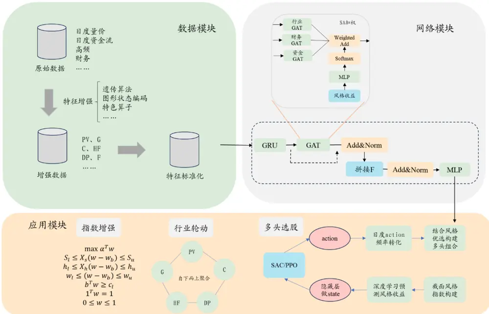
资料来源：开源证券研究所

## 2、 基础行情测试模型有效性

对于不同的特征集而言，其最适用的模型有所差别。本文中，我们先使用维度最少的基础行情初步敲定，其他特征集在此基础上进行调整。

对于本文在训练时的参数和细节而言，整体保持与1.0 版本一致，有几点区别这里列示如下：

1、随着市场轮动速度加快，机构的调仓频率也在提升。因此本文的预测收益周期缩短，从 20 日变为 10 日，但依旧需要市值行业中性化。后续因子和组合测试如无明确说明，皆为双周频调仓；

2、对于每年滚动训练的方式而言，在市场发生极端变化时，验证集的评判效果大打折扣。本文采取一次性的训练，训练集和验证集的时间区间为 2010 年至 2020年，分割比例为4：1；

3、早停的次数增加，RNN 网络的注意力头数增加；

4、对于不同特征集而言，若要联合挖掘，需分离信息提取网络，在最终输出因子前再合成。

## 2.1、 时序信息挖掘网络 RNN的选择

RNN 常见为 3 种：GRU、LSTM、TransFormer。考虑到本文后续测试的变量较多，TransFormer耗时较长，这里不予考虑。对于GRU和 LSTM 挖掘出的因子而言，回测绩效对比如表 2 所示。（回测设置如下：1、需剔除 ST、停牌、上市不满 60 天的股票；2、因子需进行市值行业中性化；3、调仓频率为双周，分组数为10；4、若为全市场回测，计算多头超额时，基准为中证全指；若为宽基内回测，计算多头超额时，基准为对应的宽基指数。下文回测参数保持不变）

从表 2我们可以看出：GRU 因子无论在因子的RankIC、多头超额、多空对冲都略优于LSTM，且其训练的速度更快，所以对于RNN而言不再沿用1.0版本的LSTM，而是更换为 GRU。

表2：GRU和 LSTM因子挖掘绩效对比：GRU略胜一筹

| 模型 | 10 日 RankIC | 年化 RankICIR | 多空对冲 |  |  | 多头超额 |  |  |  |
| --- | --- | --- | --- | --- | --- | --- | --- | --- | --- |
|  |  |  | 年化收益 | 信息比率 | 最大回撤 胜率 | 年化收益 | 信息比率 | 最大回撤 | 胜率 |
| GRU | 10.5% | 5.4 | 48.6% | 4.6 -5.1% | 80.0% | 20.7% | 2.5 | -9.5% | 72.0% |
| LSTM | 10.4% | 5.2 | 43.6% 4.1 | -5.0% | 80.0% | 17.6% | 2.1 | -11.1% | 68.7% |

数据来源：Wind、开源证券研究所（统计区间：20200101-20251128）

## 2.2、 截面信息挖掘 GAT 的关联网络选择

在 GAT 网络中，股票间的关联关系可以人为界定。本文中，我们考虑了 3种关联：1、行业关联网络；2、财务关联网络；3、资金流关联网络。选择这三大类网络主要是想验证如下两个猜想：1、在量价主导的因子挖掘中，我们一直在尝试加入基本面信息，观察是否能够提升多头绩效，这里也不例外；2、已经能够挖掘出优质人工因子的关联网络，是否在深度学习挖掘中也是更优的。

对于财务关联网络，我们围绕“股票收益=估值提升+盈利+分红”，使用分红、

估值、成长、盈利几大维度将股票划分为 16种状态。

资金流关联网络参照《从小单资金流行为到股票关联网络》（魏建榕，王志豪，2022 年），但是略微有些区别，具体定义方式为：在每个交易日，回看过去 20 个交易日，计算小单净流入强度，并按照强度大小将股票分为 20种状态。

值得一提的是，基于资金流关联网络，收益率的牵引因子就具备一定选股效果，双周频调仓下RankIC为2.3%，10 分组收益如图2所示。（收益率牵引因子：针对某只股票 A，找到与其同状态的股票集，计算该股票集收益平均值，再回归掉股票 A自身收益，残差即股票A的因子值）

其实，收益率牵引因子的计算过程是GAT 网络挖掘因子的雏形，GAT 网络本质也是将邻居节点的特征聚合至自身，从而挖掘截面股票间的 alpha信息。

图2：基于资金流关联网络，收益率牵引因子具备一定选股效果
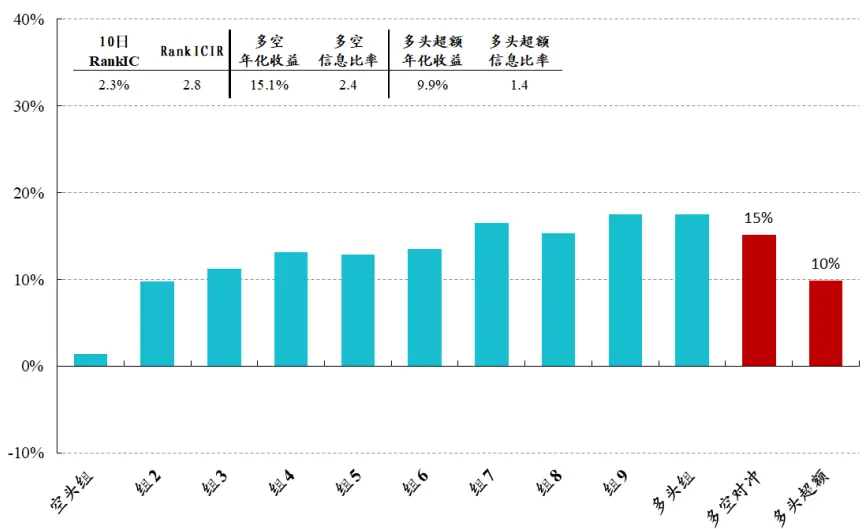
数据来源：Wind、开源证券研究所（统计区间：20130101-20251128）

## 2.3、 时序和截面网络的合并

在上述两个部分，我们分别确定了时序信息挖掘网络 GRU、GAT 网络的关联网络。在网络的连接设计上，我们采取的方式为：GRU（输入）+ GAT（GRU（输入））。

GRU+GAT 中三类不同关联网络的因子绩效对比如表 3 所示。其中，采用“GRU+GAT_行业”模型的绩效 RankIC 最低，采用“GRU+GAT_财务”模型的多头绩效相对最优。

表3：“GRU+GAT_财务”模型的多头效果最优

| 模型 | 10日 RankIC | 年化 RankICIR | 多空对冲 |  |  |  | 多头超额 |  |  |
| --- | --- | --- | --- | --- | --- | --- | --- | --- | --- |
|  |  |  | 年化收益 | 信息比率 最大回撤 | 胜率 | 年化收益 |  | 信息比率 最大回撤 | 胜率 |
| GRU+GAT_行业 | 10.6% | 6.1 | 51.3% | 4.9 -4.8% | 82.7% | 19.9% | 2.4 | -9.9% | 69.3% |
| GRU+GAT_财务 | 11.1% | 5.7 | 52.5% | 5.4 -5.5% | 83.3% | 20.2% | 2.7 | -6.0% | 76.0% |
| GRU+GAT_资金流 | 11.0% | 5.5 | 56.7% | 5.9 -4.8% | 84.7% | 20.2% | 2.6 | -10.0% | 74.0% |
| 合成-等权 | 11.4% | 5.8 | 54.4% | 5.3 -5.9% | 81.3% | 20.2% | 2.5 | -7.8% | 73.3% |

数据来源：Wind、开源证券研究所（统计区间：20200101-20251128）

## 2.4、 GRU+GAT 网络在不同关联网络下的融合方案

通过表 3 的测算，我们可以看出：等权合成后绩效并无明显提升。对于上述三大关联网络而言，本文采取的融合方式为：在训练时加入一层可学习的 mlp 层，输出进行 softmax归一化，得到三大网络的权重。对于mlp 层的输入端，本文选择 Barra风格因子的收益。后文将这种方法统一简称为：SA加权。

我们采取这样的做法原因在于：在三个因子挖掘过程中，未来 10 日 RankIC 与过去 20 日 Barra 因子收益存在一定特定相关性，比如在大市值、高成长、强动量占优的市场中，基于“GRU+GAT_财务”得到的因子，绩效会好于基于“GRU+GAT_行业”得到的因子，如图3所示。

通过表 4 的因子绩效，我们不难发现：SA 加权下的因子无论是 RankIC、多空对冲还是多头超额，绩效都略优于等权。

图3：“GRU+GAT_财务”与“GRU+GAT_行业”计算得到因子的未来 10 日 RankIC差值与过去20日 Barra因子相关性测算

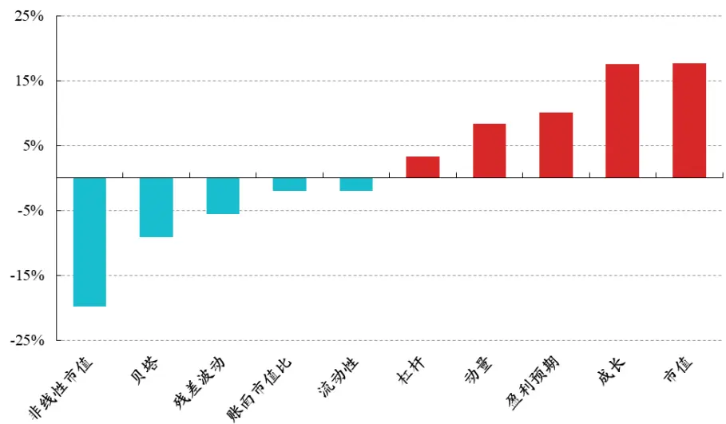
数据来源：Wind、开源证券研究所（统计区间：20100101-20191031，训练集和验证集规律）

表4：相较于等权，SA加权下的融合方案绩效显著更优

| 加权方式 | 10 日 RankIC | 年化 RankICIR | 多空对冲 |  |  |  | 多头超额 |  |  |  |
| --- | --- | --- | --- | --- | --- | --- | --- | --- | --- | --- |
|  |  |  | 年化收益 | 信息比率 | 最大回撤 | 胜率 | 年化收益 | 信息比率 | 最大回撤 | 胜率 |
| 合成-等权 | 11.4% | 5.8 | 54.4% | 5.3 | -5.9% | 81.3% | 20.2% | 2.5 | -7.8% | 73.3% |
| 合成-SA 加权 | 11.5% | 5.9 | 58.3% | 5.3 | -5.8% | 86.7% | 22.1% | 2.8 | -8.8% | 72.0% |

数据来源：Wind、开源证券研究所（统计区间：20200101-20251128）

## 2.5、 考虑财务指标对多头绩效有一定程度提升

在《深度学习赋能交易行为因子挖掘中》，对于财务数据，考虑到其时序变化较慢，我们并没有将其和日度变化的量价类指标一起作为初始输入层数据，而是将其截面标准化后，放入输出层前一层，和量价类指标通过隐藏层后的神经元进行拼接，一起通过全连接层输出为最后的因子。

在本篇报告中，我们依旧使用财务来增强因子表现，依旧将其放在输出层前一层，和量价类指标通过 GRU 和 GAT 后的神经元进行拼接，一起通过全连接层输出为最后的因子。

对于财务指标的选择，我们从成长、盈利、质量、偿债能力、资本结构、周转、商誉、研发和估值 9 大分类出发，具体细分指标部分如表 5 所示。除此之外，对于这些财务指标，在使用时我们考虑了原始值、同比和环比。

表5：财务指标：9大类部分汇总

| 大类 名称 |  |  |
| --- | --- | --- |
| 成长 | 同比增长率-经营活动产生的现金流量净额 |  |
|  | 单季度.归属母公司股东的净利润同比增长率 |  |
|  | 单季度.营业收入同比增长率 |  |
| 盈利 | ROIC |  |
|  | 单季度.销售毛利率 |  |
|  | 单季度.销售净利率 |  |
|  | 单季度.ROA |  |
|  | 单季度.ROE（扣除非经常损益） |  |
| 质量 | 单季度.经营活动产生的现金流量净额/营业收入 |  |
|  | 单季度.销售商品提供劳务收到的现金/营业收入 |  |
|  | 现金比率 |  |
| 偿债能力 | 流动比率 |  |
|  | 经营活动产生的现金流量净额/流动负债 |  |
|  | 速动比率 |  |
|  | 股东权益对固定资产比率 |  |
|  | 资本结构 | 有息负债率 |
| 长期负债率 |  |  |
|  | 短期借款率 |  |
|  | 资产负债率 |  |
|  | 应收账款周转率 |  |
|  | 总资产周转率 |  |
|  | 存货周转率 |  |
| 商誉 | 商誉收入比 |  |
| 研发 | 研发收入比 |  |
| 估值 | PE |  |
|  | PB |  |

资料来源：开源证券研究所

截至目前，本文网络模块部分介绍基本完毕，流程如图 4 所示。基于基本行情PV，使用“GRU+GAT_SA加权_考虑财务”模型挖掘出的因子10日RankIC为11.7%，多空收益为 58.9%，多头超额信息比率为 5.1，多头超额为 24.1%，多头超额信息比率为 3.0，10分组的净值如图 5所示。

图4：因子挖掘2.0网络模块示意
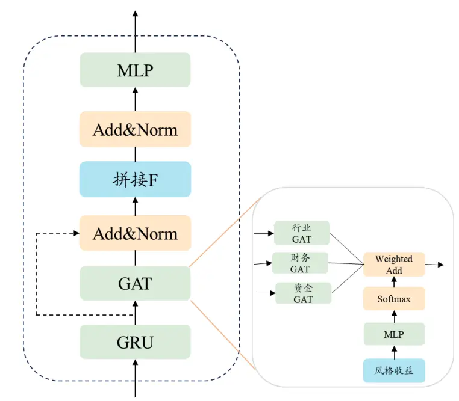
资料来源：开源证券研究所

图5：基于基础行情PV，“GRU+GAT_SA加权_考虑财务”模型挖掘的因子表现优异
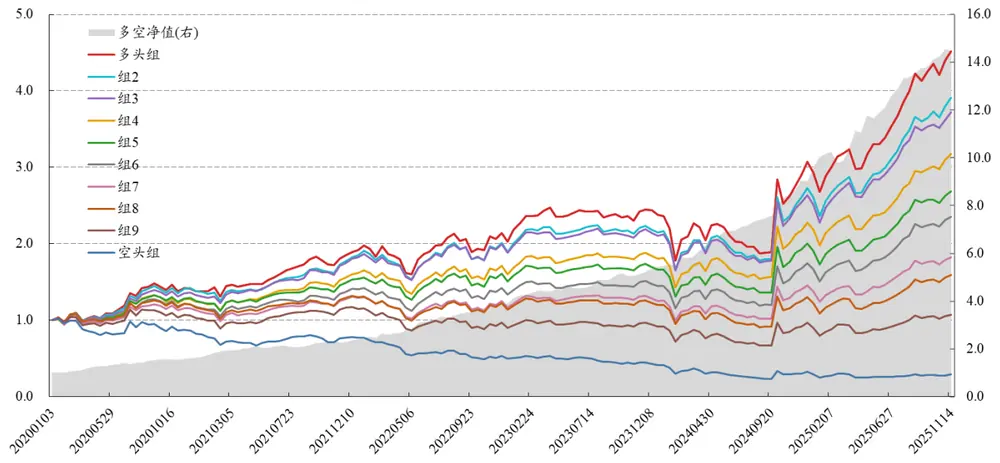
数据来源：Wind、开源证券研究所

关于基础行情的相关测算结论汇总如表 6 所示。在后续的特征集中，我们仅测“GRU+GAT_SA 加权”和“GRU+GAT_SA 加权_考虑财务”两个子模型。

表6：基于基础行情PV，不同模型绩效对比

| 模型 | 10日 RankIC RankICIR | 年化 | 多空对冲 |  |  | 多头超额 |  |  |
| --- | --- | --- | --- | --- | --- | --- | --- | --- |
|  |  |  | 年化收益 | 信息比率 最大回撤 | 胜率 | 年化收益 信息比率 最大回撤 |  | 胜率 |
| GRU+GAT_行业 | 10.6% | 6.1 | 51.3% 4.9 | -4.8% | 82.7% | 19.9% 2.4 | -9.9% | 69.3% |
| GRU+GAT_财务 | 11.1% | 5.7 | 52.5% | 5.4 -5.5% | 83.3% | 20.2% 2.7 | -6.0% | 76.0% |
| GRU+GAT_资金流 | 11.0% | 5.5 | 56.7% | 5.9 -4.8% | 84.7% | 20.2% 2.6 | -10.0% | 74.0% |
| 合成-等权 | 11.4% | 5.8 | 54.4% | 5.3 -5.9% | 81.3% | 20.2% 2.5 | -7.8% | 73.3% |
| GRU+GAT_SA 加权 | 11.5% | 5.9 | 58.3% | 5.3 -5.8% | 86.7% | 22.1% 2.8 | -8.8% | 72.0% |
| GRU+GAT_SA 加权_考虑财务 | 11.7% | 5.7 | 58.9% | 5.1 -4.8% | 82.7% | 24.1% | 3.0 -5.4% | 72.0% |

数据来源：Wind、开源证券研究所（统计区间：20200101-20251128）

## 3、 多特征集训练

在前期的报告中，我们积累了一些测试的维度，主要包含以下几大类，本篇报告将分别进行测试：

1、G：基于基础行情衍生，包含：技术指标和K线状态变量；

2、C: 大小单资金流数据，包含：1、原始数据；2、衍生指标；3、状态变量

3、HF：高频数据降维的日度特征

4、DP：遗传算法有效因子

## 3.1、 G：技术指标和 K 线状态变量

## 3.1.1、 状态变量转化示意

对于基础行情数据集而言，如何进行特征拓展为一项重要的工作。我们在《深度学习赋能技术分析》中，从图形识别的思路出发，基于基础行情指标，计算技术指标和 K 线状态变量，将其放入深度学习模型进行学习，发现存在一定增量。转化思路如图 6所示。

图6：技术指标和K线状态变量转化示意图
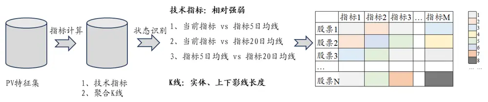
资料来源：开源证券研究所

## 3.1.2、 基于特征集G挖掘的因子绩效展示

进一步地，我们特征 G 放入“GRU+GAT_SA 加权”和“GRU+GAT_SA 加权_考虑财务”模型进行训练，绩效如表7所示：考虑财务后的因子10日RankIC为11.0%，多空收益为 59.9%，多空信息比率为 6.2，多头超额为 23.3%，多头超额信息比率为3.3。

表7：基于特征集G，使用“GRU+GAT_SA 加权_考虑财务”模型，因子 10日 RankIC 为 11.0%

| 模型 | 10日 | 年化 RankIC RankICIR | 多空对冲 |  |  | 多头超额 |  |  |  |
| --- | --- | --- | --- | --- | --- | --- | --- | --- | --- |
|  |  |  | 年化收益 | 信息比率 最大回撤 | 胜率 | 年化收益 | 信息比率 最大回撤 |  | 胜率 |
| GRU+GAT_SA 加权 | 10.1% | 6.0 | 55.7% | 6.0 | -3.3% | 85.3% 21.4% | 2.9 | -8.1% | 76.7% |
| GRU+GAT_SA 加权_考虑财务 | 11.0% | 5.8 | 59.9% | 6.2 | -2.5% | 82.7% | 23.3% 3.3 | -5.4% | 75.3% |

数据来源：Wind、开源证券研究所（统计区间：20200101-20251128）

## 3.1.3、 PV 和 G 的联合

除此之外，因为 G 维度是 PV 维度的衍生维度，这里我们测试了二者在“GRU+GAT_SA 加权_考虑财务”模型挖掘后，因子合成后的绩效，如表 8 所示。我们可以发现：合成后的因子比单独的PV和G 效果都要更好，全市场10日RankIC为 12.4%，多空年化收益 66.7%，信息比率为 6.0，多头超额为 24.5%，多头超额信息比率为 3.3。

表8：在“GRU+GAT_SA加权_考虑财务”模型下，PV和 G分别挖掘后再合成，不同样本空间绩效皆较为优异

|  | 10 日 RankIC | 年化 RankICIR | 多空对冲 |  |  |  | 多头超额 |  |  |
| --- | --- | --- | --- | --- | --- | --- | --- | --- | --- |
|  |  |  | 年化收益 | 信息比率 | 最大回撤 | 胜率 | 年化收益 信息比率 | 最大回撤 | 胜率 |
| 沪深300 | 7.7% | 2.7 | 25.5% | 1.9 | -13.4% | 64.7% | 12.8% 1.2 | -13.3% | 58.7% |
| 中证500 | 8.1% | 3.2 | 35.8% | 2.7 | -9.9% | 68.0% | 15.4% 1.9 | -5.4% | 66.0% |
| 中证1000 | 10.4% | 4.7 | 52.5% | 4.2 | -5.8% | 80.7% | 15.2% 2.1 | -3.6% | 66.7% |
| 全市场 | 12.4% | 6.0 | 66.7% | 6.0 | -4.5% | 82.7% | 24.5% 3.3 | -3.9% | 75.3% |

数据来源：Wind、开源证券研究所（统计区间：20200101-20251128）

## 3.2、 C：大小单资金流

## 3.2.1、 人工挖掘因子回顾

对于大小单资金流而言，我们前期基于 AshareMoneyFlow 这张基础表，挖掘了一些交易行为因子，主要包括：大单残差、小单残差、主动买卖、散户羊群效应、超大单关注度，列示为表9所示。

表9：开源金工特色大小单资金流因子

| 因子名称 | 报告名称 | 10日 RankIC | RankICIR |
| --- | --- | --- | --- |
| 大单残差 | 《大小单资金流的 alpha 能力》 | 2.1% | 1.6 |
| 小单残差 | 《大小单资金流的 alpha 能力》 | -2.2% | -1.9 |
| 主动买卖 | 《主动买卖因子的正确用法》 | 4.8% | 3.5 |
| 散户羊群效应 | 《资金流动力学：散户羊群效应与散户羊群效应》 | -3.0% | -2.3 |
| 超大单关注度 | 《遗传算法赋能交易行为因子》 | 5.3% | 3.9 |

数据来源：Wind、开源证券研究所（统计区间：20200101-20251128）

## 3.2.2、 大小单资金流特征增强

在进行深度学习训练之前，我们对大小单资金流因子进行一定的特征处理，主要为以下 3大思路：

1、原始资金流数据；

2、特征增强之一：资金流的特征计算，如资金流过去 250日的分位点等；

3、特征增强之二：资金流的状态变量转化。具体做法为：针对每一类资金流，使用每天的买入、卖出、主动买入、主动卖出数据，判断如下四个问题：1、当天净买入是否大于 0；2、当天主动净买入是否大于0；3、当天主动买入比例是否大于0.5；4、当天主动卖出比例是否大于 0.5。示例如图7 所示。

图7：资金流状态变量转化示意
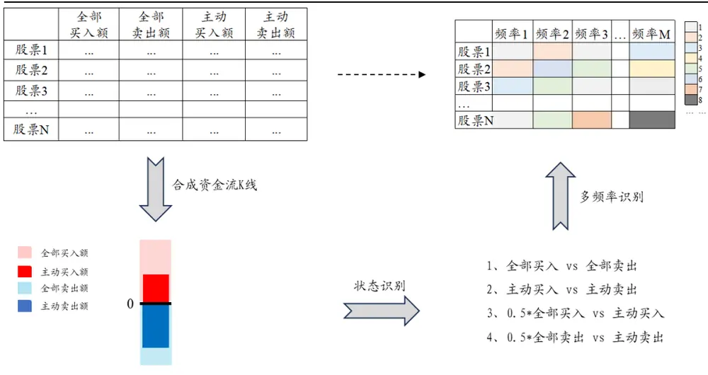
资料来源：开源证券研究所

## 3.2.3、 基于特征集C挖掘的绩效展示

进一步地，我们将上述3个资金流维度进行训练，不同特征集之间使用SA加权，绩效如表 10所示：考虑财务后因子 10日 RankIC 为 10.6%，多空收益为56.4%，多空信息比率为 5.2，多头超额为 19.5%，多头超额信息比率为 2.8。

表10：基于特征集 C，使用“GRU+GAT_SA 加权_考虑财务”模型，因子 10 日 RankIC 为 10.6%

| 模型 | 10 日 RankIC RankICIR | 年化 | 多空对冲 |  | 多头超额 |  |
| --- | --- | --- | --- | --- | --- | --- |
|  |  |  | 年化收益 信息比率 最大回撤 | 胜率 | 年化收益 信息比率 最大回撤 | 胜率 |
| GRU+GAT_SA 加权 | 10.1% | 5.1 50.9% | 4.8 -3.6% | 82.0% | 16.7% 2.3 | -7.2% 70.7% |
| GRU+GAT_SA 加权_考虑财务 | 10.6% | 5.1 | 56.4% 5.2 -4.4% | 81.3% | 19.5% 2.8 | -5.6% 70.0% |

数据来源：Wind、开源证券研究所（统计区间：20200101-20251128）

## 3.2.4、 人工挖掘资金流因子和深度学习资金流因子对比

对于特征集C，我们将上述人工因子和“GRU+GAT_SA 加权”模型下的深度学习因子进行对比。利用人工因子回归深度学习因子之后，残差基本不具备选股效果，多空净值对比如图 8所示。

图8：对于特征集C，人工因子回归深度学习因子后，残差基本不具备选股效果
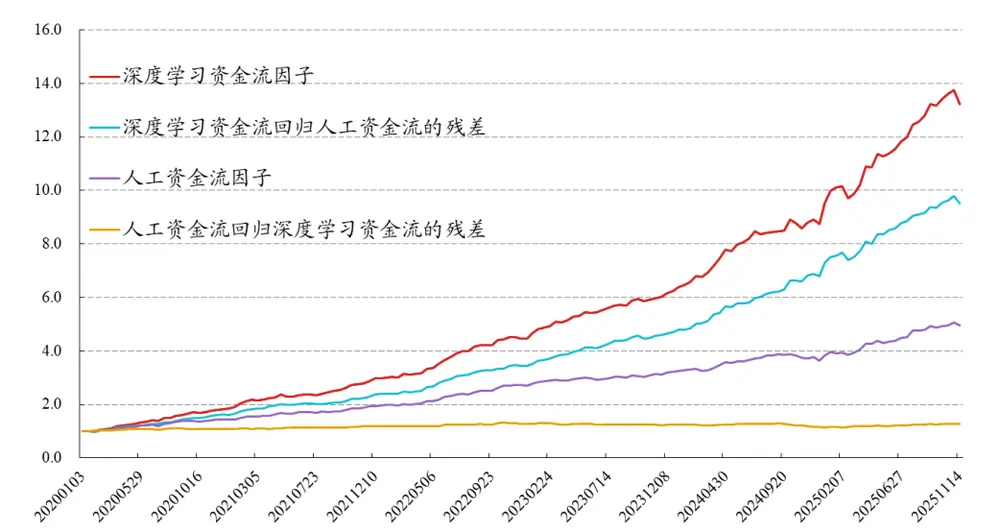
数据来源：Wind、开源证券研究所

## 3.3、 HF：高频特征

对于高频特征而言，我们暂时还是将其降至日度特征来挖掘，后续我们将进一步展开更高频数据的因子挖掘工作。

对于输入特征，我们考虑两块：1、分钟收益和分钟成交量相关衍生指标；2、逐笔成交数据降频至分钟频，再计算相关衍生指标，相关指标主要来自《大小单资金流的变量精筛与高频测算》（魏建榕，盛少成，2022年）及《分钟资金流因子的构建方法》（魏建榕，高鹏，2025 年）。因子绩效如表 11 所示：考虑财务后因子 10 日RankIC 为 11.6%，多空收益为 57.5%，多空信息比率为 5.8，多头超额为 19.1%，多头超额信息比率为 2.6。

表11：基于特征集 HF，使用“GRU+GAT_SA 加权_考虑财务”模型，因子 10 日 RankIC 为 11.6%

| 模型 | 10 日 RankIC RankICIR | 年化 | 多空对冲 信息比率最大回撤 |  |  |  | 多头超额 |  |
| --- | --- | --- | --- | --- | --- | --- | --- | --- |
| GRU+GAT_SA 加权 | 10.9% | 5.8 | 年化收益 53.0% 5.6 | -3.7% | 胜率 84.0% | 年化收益 16.9% 2.1 | 信息比率 最大回撤 -11.2% | 胜率 |
| GRU+GAT_SA 加权_考虑财务 | 11.6% | 5.9 | 57.5% 5.8 | -5.2% | 82.0% | 19.1% 2.6 | -7.4% | 66.7% |
|  |  |  |  |  |  |  |  | 73.3% |

数据来源：Wind、开源证券研究所（统计区间：20200101-20251128）

## 3.4、 DP：遗传算法因子

## 3.4.1、 遗传算法因子挖掘流程回顾

利用遗传算法进行因子挖掘，再放入深度学习进行挖掘，其本质也是一种特征增强。在《遗传算法赋能交易行为因子挖掘》中，我们挖掘出了 185 个因子，将其命名为 alpha185，这里我们筛选在 2017 年之前表现较好，且缺失度较低的 48 个因子作为输入特征。

图9：遗传算法因子挖掘挖掘示意
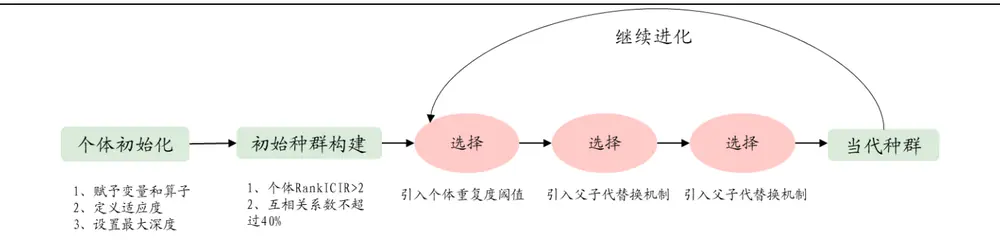
资料来源：开源证券研究所

## 3.4.2、 深度学习再掘金

因为遗传算法这些因子都是有效因子，在本部分的挖掘中，我们不再采用时序网络，而是直接采取GAT网络，其绩效如表 12所示。从表中我们发现：1、深度学习再掘金下的绩效优于遗传算法等权绩效；2、考虑财务后因子10日RankIC为11.4%，多空收益为 49.2%，多空信息比率为 4.4，多头超额为 20.3%，多头超额信息比率为2.8。

表12：基于特征集 DP，使用“GRU+GAT_SA 加权_考虑财务”模型，因子 10 日 RankIC 为 11.4%

| 模型 | 10日 RankIC RankICIR | 年化 | 多空对冲 |  | 多头超额 |  |
| --- | --- | --- | --- | --- | --- | --- |
|  |  |  | 年化收益 信息比率 最大回撤 | 胜率 年化收益 | 信息比率 最大回撤 | 胜率 |
| 遗传算法因子等权 | 9.4% | 4.3 | 32.1% 3.0 -6.1% | 74.7% 15.0% | 1.4 | -10.6% 64.7% |
| GRU+GAT_SA 加权 | 10.8% | 6.0 | 47.2% 4.9 -4.8% | 79.3% 18.8% | 2.3 -6.6% | 67.3% |
| GRU+GAT_SA 加权_考虑财务 | 11.4% | 6.2 | 49.2% 4.4 -4.7% | 76.0% 20.3% | 2.8 -4.6% | 70.0% |

数据来源：Wind、开源证券研究所（统计区间：20200101-20251128）

## 4、 综合深度学习因子 ML_C

## 4.1、 不同特征集汇总

以上我们详细测试了不同特征集的因子效果，最后汇总为表 13 所示。从表中我们可以看出：1、从 RankIC 来看，C 特征集略微低一些；2、从多头超额来看，PV和G 特征集最好。

表13：在“GRU+GAT_SA加权_考虑财务”模型下，不同特征集绩效对比

| 维度 | 10 日 RankIC | 年化 RankICIR | 多空对冲 |  |  | 多头超额 |  |  |  |
| --- | --- | --- | --- | --- | --- | --- | --- | --- | --- |
|  |  |  | 年化收益 | 信息比率 最大回撤 | 胜率 |  | 年化收益 信息比率 | 最大回撤 | 胜率 |
| PV | 11.7% | 5.7 | 58.9% | 5.1 | -4.8% | 82.7% | 24.1% 3.0 | -5.4% | 72.0% |
| G | 11.0% | 5.8 | 59.9% | 6.2 | -2.5% | 82.7% | 23.3% 3.3 | -5.4% | 75.3% |
| C | 10.6% | 5.1 | 56.4% | 5.2 | -4.4% | 81.3% | 19.5% 2.8 | -5.6% | 70.0% |
| HF | 11.6% | 5.9 | 57.5% | 5.8 | -5.2% | 82.0% | 19.1% 2.6 | -7.4% | 73.3% |
| DP | 11.4% | 6.2 | 49.2% | 4.4 | -4.7% | 76.0% | 20.3% 2.8 | -4.6% | 70.0% |

数据来源：Wind、开源证券研究所（统计区间：20200101-20251128）

## 4.2、 不同维度交叉挖掘

上述挖掘过程都是针对单一维度进行挖掘。进一步地，我们尝试将多维度放在一起进行挖掘，维度之间使用 SA 加权，本文只考虑 2个维度。最后我们将表 13中的因子和二维度挖掘下的因子一起合成，合成方式为多头收益加权，得到最终深度学习因子 ML_C，分组绩效及净值如图 10 和表14所示。

图10：最终深度学习因子ML_C分组净值
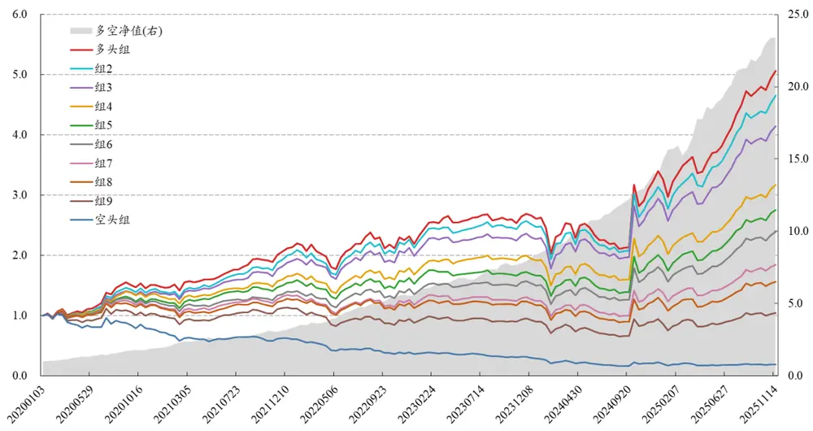
数据来源：Wind、开源证券研究所

表14：最终深度学习因子ML_C分年度绩效

|  | 10 日 RankIC | 年化 RankICIR | 多空对冲 |  |  |  | 多头超额 |  |  |  |
| --- | --- | --- | --- | --- | --- | --- | --- | --- | --- | --- |
|  |  |  | 年化收益 | 信息比率 | 最大回撤 | 胜率 | 年化收益 | 信息比率 | 最大回撤 | 胜率 |
| 2020 | 15.8% | 8.2 | 106.8% | 7.4 | -4.8% | 84.6% | 26.0% | 2.6 | -1.9% | 61.5% |
| 2021 | 12.9% | 6.5 | 64.8% | 5.2 | -3.9% | 76.9% | 28.0% | 3.3 | -4.8% | 73.1% |
| 2022 | 14.1% | 7.4 | 74.6% | 6.5 | -2.5% | 84.0% | 24.8% | 3.5 | -3.2% | 84.0% |
| 2023 | 11.7% | 5.0 | 49.0% | 5.3 | -2.5% | 84.0% | 30.9% | 5.9 | -1.1% | 76.0% |
| 2024 | 14.1% | 5.1 | 83.1% | 7.9 | -1.9% | 88.5% | 19.5% | 1.9 | -5.0% | 69.2% |
| 2025 | 16.9% | 6.8 | 60.9% | 4.6 | -4.4% | 72.7% | 28.7% | 3.6 | -4.2% | 81.8% |
| 全区间 | 14.2% | 6.3 | 72.7% | 6.1 | -4.8% | 82.0% | 26.1% | 3.1 | -5.0% | 74.0% |

数据来源：Wind、开源证券研究所（统计区间：20200101-20251128）

## 4.3、 不同样本空间测试

进一步地，我们探讨了ML_C 因子在其他样本空间中的表现。双周频调仓下10分组测试效果如表 15 所示。ML_C 在沪深 300 内 10 日 RankIC 为 8.6%，多空年化收益 26.4%、信息比率1.9，多头超额年化收益 12.4%、信息比率 1.3；在中证500内10日RankIC为9.4%，多空年化收益37.9%、信息比率2.8，多头超额年化收益13.7%、信息比率 2.0；在中证 1000 内 10 日 RankIC 为 11.8%，多空年化收益 57.0%、信息比率 4.1，多头超额年化收益 17.3%、信息比率2.3。ML_C 在中证 1000内的表现相对更加优异。

表15：ML_C在不同样本空间内绩效皆较为优异

|  | 10 日 RankIC | 年化 RankICIR | 多空对冲 |  |  |  | 多头超额 |  |  |
| --- | --- | --- | --- | --- | --- | --- | --- | --- | --- |
|  |  |  | 年化收益 | 信息比率 最大回撤 | 胜率 |  | 年化收益 信息比率 | 最大回撤 | 胜率 |
| 沪深300 | 8.6% | 2.7 | 26.4% | 1.9 | -14.6% | 60.7% | 12.4% 1.3 | -6.3% | 57.3% |
| 中证 500 | 9.4% | 3.5 | 37.9% | 2.8 | -15.5% | 70.0% | 13.7% 2.0 | -5.3% | 66.7% |
| 中证 1000 | 11.8% | 4.7 | 57.0% | 4.1 | -12.4% | 78.0% | 17.3% 2.3 | -8.1% | 65.3% |

数据来源：Wind、开源证券研究所（统计区间：20200101-20251128）

## 5、 深度学习应用

## 5.1、 应用一：多头优选

针对深度学习因子，极端多头组合的优选一直是行业难点：这类因子往往风格倾向性较强，在极端市场环境下易引发大幅回撤。对此，我们提出结合风格优选实现 Alpha与Beta的协同优选思路。

## 5.1.1、 强化学习风格优选示意

在《深度学习赋能风格轮动和多策略融合》中，我们提出了基于强化学习的风格轮动方案，不同于直接对风格收益进行择时，我们将其转化为截面标的进行优选。

图11：强化学习风格优选示意
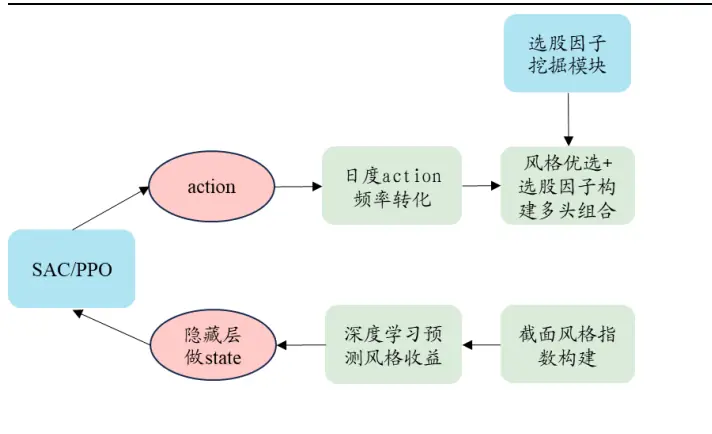
资料来源：开源证券研究所

图12：日度 action交易下的超额净值
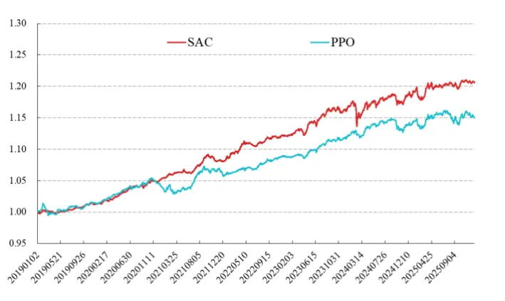
数据来源：Wind、开源证券研究所

## 5.1.2、 全 A 优选

对于风格优选而言，其是日度 action，我们降低频率的做法为：在每个调仓日，回看过去 20个交易日，将每种风格的action数值加总进行排序，选取排名靠前的 10种风格。

本文我们同时测了双周频和月频调仓，但是由于双周频整体绩效弱于月度，这里只展示月度调仓绩效。从图 13绩效对比中，我们可以看出：相较于直接用ML_C优选，结合风格轮动后的绩效相对更加优异，优选50只股票的年化收益达到 38.52%。

图13：结合风格轮动优选后绝对收益更优（全A内）

| 加风格优选 |  |  |  |  | 不加风格优选 |  |  |  |  |
| --- | --- | --- | --- | --- | --- | --- | --- | --- | --- |
| 选股数目 | 年化收益 |  | 年化波动率 夏普比率 | 最大回撤 | 选股数目 | 年化收益 | 年化波动率 夏普比率 |  | 最大回撤 |
| 30 | 32.56% | 29.89% | 1.09 | -45.43% | 30 | 33.60% | 30.21% | 1.11 | -35.46% |
| 40 | 36.83% | 29.25% | 1.26 | -38.04% | 40 | 34.13% | 29.51% | 1.16 | -33.05% |
| 50 | 38.52% | 29.00% | 1.33 | -38.25% | 50 | 33.56% | 28.98% | 1.16 | -32.91% |
| 60 | 39.75% | 28.65% | 1.39 | -37.11% | 60 | 35.53% | 28.56% | 1.24 | -33.11% |
| 70 | 38.79% | 28.30% | 1.37 | -36.36% | 70 | 35.27% | 28.43% | 1.24 | -33.93% |
| 80 | 37.60% | 27.95% | 1.35 | -35.52% | 80 | 34.60% | 28.29% | 1.22 | -33.76% |
| 90 | 37.40% | 27.83% | 1.34 | -35.63% | 90 | 33.70% | 28.16% | 1.20 | -33.36% |
| 100 | 37.05% | 27.76% | 1.33 | -35.08% | 100 | 33.81% | 28.08% | 1.20 | -33.12% |

数据来源：Wind、开源证券研究所（统计区间：20200101-20251128）

## 5.1.3、 中证 800+中证 1000 内优选

上述在全 A 优选时，我们发现组合最终整体市值偏小。进一步地，我们将成分股限制在中证800+中证1000 成分股内进行优选。通过图 14 的测算，我们发现：1、在相对大市值成分股内，考虑风格轮动后绩效也是更加优异；2、随着选股数目的增加，绩效相对比较单调。最后我们选取了 30 只股票，绝对收益 26.18%，超额收益20.11%，净值如图 15 所示。

图14：结合风格轮动优选后绝对收益更优（中证800+中证 1000成分股内）

| 选股数目 年化收益 年化波动率夏普比率 |  |  |  |  |
| --- | --- | --- | --- | --- |
| 30 | 26.18% | 25.52% | 1.03 | 最大回撤 -31.76% |
| 40 | 24.23% | 25.32% | 0.96 | -31.78% |
| 50 | 22.42% | 25.05% | 0.90 | -33.45% |
| 60 | 20.68% | 24.78% | 0.83 | -34.80% |
| 70 | 19.14% | 24.63% | 0.78 | -36.64% |
| 80 | 17.87% | 24.51% | 0.73 | -38.01% |
| 90 | 16.58% | 24.31% | 0.68 | -38.51% |
| 100 | 16.68% | 24.24% | 0.69 | -37.78% |

数据来源：Wind、开源证券研究所（统计区间：20200101-20251128）

| 选股数目 | 年化收益 年化波动率夏普比率 |  | 最大回撤 |
| --- | --- | --- | --- |
| 30 | 17.24% | 27.06% | 0.64 -39.71% |
| 40 | 19.15% | 26.59% | 0.72 -37.78% |
| 50 | 18.98% | 26.15% | 0.73 -36.56% |
| 60 | 17.13% | 25.86% | 0.66 -38.70% |
| 70 | 17.42% | 25.57% | 0.68 -41.27% |
| 80 | 16.93% | 25.38% | 0.67 -40.77% |
| 90 | 16.60% | 25.29% | 0.66 -39.90% |
| 100 | 17.05% | 25.22% | 0.68 -39.31% |

图15：中证800+中证1000成分股内优选 30只股票净值及绩效
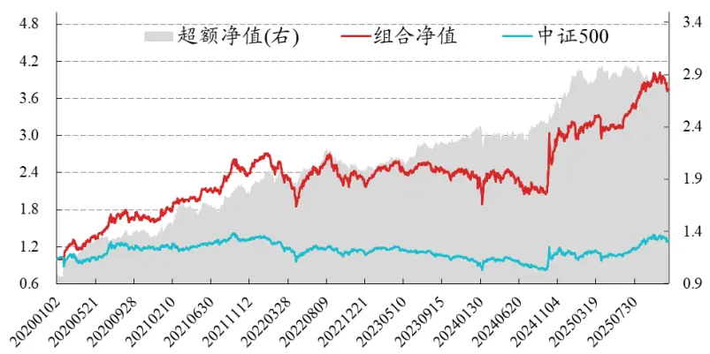
数据来源：Wind、开源证券研究所（统计区间：20200101-20251128）

| 绝对绩效 |  |  |  |  |
| --- | --- | --- | --- | --- |
| 年份 | 年化收益 | 年化波动率夏普比率 |  | 最大回撤 |
| 2020 | 74.65% | 26.60% | 2.81 | -12.49% |
| 2021 | 59.48% | 19.22% | 3.09 | -10.50% |
| 2022 | -15.93% | 24.81% | -0.64 | -31.76% |
| 2023 | 6.60% | 16.15% | 0.41 | -12.07% |
| 2024 | 30.46% | 39.65% | 0.77 | -21.90% |
| 2025 | 23.41% | 18.83% | 1.24 | -11.24% |
| 全区间 | 26.18% | 25.52% | 1.03 | -31.76% |

| 年份 | 年化收益 | 年化波动率 | 信息比率 | 最大回撤 |
| --- | --- | --- | --- | --- |
| 2020 | 43.22% | 16.71% | 2.59 | -5.50% |
| 2021 | 36.77% | 12.16% | 3.02 | -6.23% |
| 2022 | 7.10% | 12.10% | 0.59 | -10.47% |
| 2023 | 15.23% | 7.94% | 1.92 | -3.61% |
| 2024 | 24.59% | 14.70% | 1.67 | -9.40% |
| 2025 | -2.37% | 9.29% | -0.25 | -7.61% |
| 全区间 | 20.11% | 12.56% | 1.60 | -10.47% |

## 5.2、 应用二：行业轮动

对于行业轮动因子的构建而言，将个股因子聚合至行业为一种思路。这里我们采用《大小单资金流为核心的综合行业轮动方案》（魏建榕，盛少成，2024年）中的5 种聚合方式：（1）因子值均值；（2）因子值市值加权；（3）按照因子值分域：从高至低排序，若处于 1/3 以上标注为 1，若处于后 2/3 标注为-1，其余则标注为 0，最后取均值；（4）同（3）进行因子值分域，之后按照市值加权；（5）选取因子值较高的 20%，统计分布在不同行业的股票数占各自行业总股票数的比例。如上几种做法对应的行业轮动因子 10日 RankIC 和多头收益如表16所示。

首先，我们测试了直接将ML_C 因子聚合至行业的效果，如图16 所示：RankIC在“市值加权”方法下的表现相对较好，多头收益在“分域_市值加权”方法下的表现较好。

图16：ML_C原始值行业聚合后，因子的 10日RankIC 与多头收益

| Rank1C |  |  |  |  |  |
| --- | --- | --- | --- | --- | --- |
| 因子名称 | 等权 | 市值加权 分域_等权 分域-市值加权 |  |  | 头部比例 |
| C SA加权 | 3.6% | 3.9% | 2.4% | 3.4% | 0.2% |
| C_SA加权_考虑财务 | 4.7% | 4.9% | 3.7% | 3.8% | 3.4% |
| DP_SA加权 | 6.2% | 5.7% | 7.1% | 5.8% | 6.5% |
| DP_SA加权_考虑财务 | 6.1% | 4.4% | 6.3% | 4.7% | 5.3% |
| G SA加权 | 5.5% | 4.4% | 5.6% | 3.6% | 4.4% |
| G SA加权 考虑财务 | 4.8% | 5.1% | 4.6% | 5.0% | 4.7% |
| HF_SA加权 | 4.0% | 4.8% | 3.9% | 4.9% | 4.0% |
| HF_SA加权_考虑财务 | 4.5% | 3.6% | 3.8% | 3.7% | 4.0% |
| PV_GRU | 6.0% | 6.5% | 5.2% | 5.7% | 3.4% |
| PV_LSTM | 5.9% | 5.1% | 5.8% | 5.3% | 4.7% |
| PV_SA加权 | 6.2% | 7.4% | 5.1% | 6.8% | 4.1% |
| PV_SA加权_考虑财务 | 6.6% | 7.2% | 5.8% | 6.1% | 4.6% |
| PV_等权 | 6.2% | 6.5% | 5.1% | 6.1% | 3.5% |
| PV_行业 | 5.6% | 4.3% | 3.4% | 3.1% | 1.8% |
| PV_财务 | 7.6% | 8.1% | 7.2% | 6.9% | 6.0% |
| PV_资金流 4.6% |  | 5.8% | 4.2% | 5.7% | 2.4% |
| 综合因子ML_C 5.3% |  | 6.2% | 5.1% | 6.1% | 5.0% |

数据来源：Wind、开源证券研究所（统计区间：20200101-20251128）

| 因子名称 | 等权 市值加权 |  | 分域-等权 | 分域-市值加权 | 头部比例 |
| --- | --- | --- | --- | --- | --- |
| C SA加权 | 1.3% | 6.2% | 1.9% | 4.8% | 1.6% |
| C_SA加权_考虑财务 | 3.0% | 8.8% | 4.2% | 7.2% | 4.6% |
| DP SA加权 | 9.8% | 11.0% | 9.6% | 13.0% | 13.1% |
| DP_SA加权_考虑财务 | 7.8% | 8.1% | 11.7% | 9.4% | 12.3% |
| G_SA加权 | 7.0% | 6.5% | 9.5% | 8.1% | 9.8% |
| G_SA加权_考虑财务 | 7.6% | 9.0% | 9.8% | 8.2% | 9.0% |
| HF SA加权 | 6.9% | 9.1% | 6.4% | 10.0% | 9.5% |
| HF_SA加权_考虑财务 | 7.2% | 9.7% | 6.7% | 9.2% | 7.7% |
| PV_GRU | 10.6% | 10.8% | 12.1% | 9.2% | 10.1% |
| PV_LSTM | 9.6% | 12.9% | 11.6% | 13.7% | 12.3% |
| PV_SA加权 | 8.1% | 15.1% | 11.2% | 15.6% | 12.6% |
| PV_SA加权_考虑财务 | 8.2% | 12.7% | 8.2% | 10.2% | 11.0% |
| PV_等权 | 8.8% | 11.8% | 8.4% | 12.1% | 9.6% |
| PV_行业 | 10.9% | 9.8% | 10.9% | 9.0% | 8.8% |
| PV_财务 | 9.9% | 17.3% | 13.7% | 12.1% | 15.1% |
| PV_资金流 | 4.6% | 12.4% | 5.0% | 11.6% | 5.0% |
| 综合因子ML_C | 7.0% | 10.9% | 7.5% | 11.1% | 7.5% |

除此之外，我们还测试了将 ML_C 因子市值行业中性化之后，再聚合至行业的效果，如图17所示：无论是 RankIC 还是多头收益，都在“等权”方法下相对更好。

图17：ML_C市值行业中性化后，行业聚合因子的 10日RankIC 与多头收益

| Rank1C |  |  |  |  |  |
| --- | --- | --- | --- | --- | --- |
| 因子名称 | 等权 | 市值加权 分域-等权 分域-市值加权 |  |  | 头部比例 |
| C_SA加权 | 5.2% | -1.3% | -2.4% | -2.3% | -3.6% |
| C_SA加权_考虑财务 | 4.0% | -1.9% | -1.7% | -3.4% | -3.5% |
| DP_SA加权 | 2.1% | -0.7% | 0.9% | 0.1% | -2.5% |
| DP_SA加权_考虑财务 | 0.6% | -2.0% | -0.6% | -0.9% | -1.6% |
| G_SA加权 | 2.8% | 0.2% | -2.1% | -1.7% | -3.7% |
| G_SA加权_考虑财务 | 0.5% | -0.9% | -0.9% | -0.3% | -1.5% |
| HF_SA加权 | -1.8% | 0.1% | -0.6% | -0.3% | -3.9% |
| HF_SA加权_考虑财务 | 2.0% | -1.4% | -1.2% | -1.2% | -2.8% |
| PV_GRU | -0.9% | 1.8% | 1.6% | 2.2% | -1.6% |
| PV_LSTM | 0.0% | 0.1% | -0.1% | -1.1% | -3.5% |
| PV_SA加权 0.0% |  | 1.9% | -2.4% | 1.9% | -4.3% |
| PV_SA加权_考虑财务 -0.1% |  | 1.6% | -0.7% | 1.5% | -2.2% |
| PV_等权 -0.7% |  | 1.7% | -1.8% | 0.8% | -3.2% |
| PV_行业 1.2% |  | 1.2% | -1.0% | 1.6% | -2.7% |
| PV_财务 0.9% |  | 1.1% | -0.1% | 1.0% | -2.8% |
| PV_资金流 | 2.5% | 1.6% | -2.0% | 1.2% | -3.5% |
| 综合因子ML_C | 3.1% | -0.9% | 2.9% | -0.2% | -0.1% |

数据来源：Wind、开源证券研究所（统计区间：20200101-20251128）

| 因子名称 | 等权 | 市值加权 分域_等权 分 |  | 域-市值加权 | 头部比例 |
| --- | --- | --- | --- | --- | --- |
| C_SA加权 | 12.2% | 5.1% | 6.0% | 5.7% | 3.5% |
| C_SA加权_考虑财务 | 10.3% | 4.7% | 5.1% | 8.6% | 10.3% |
| DP SA加权 | 8.3% | 6.3% | 6.5% | 3.5% | 8.4% |
| DP_SA加权_考虑财务 | 3.4% | 8.0% | 10.1% | 3.6% | 8.5% |
| G_SA加权 | 10.4% | 4.7% | 6.0% | 3.7% | 7.1% |
| G SA加权_考虑财务 | 6.3% | 4.5% | 6.7% | 4.8% | 6.8% |
| HF_SA加权 | 8.4% | 6.4% | 0.9% | -1.0% | 7.0% |
| HF_SA加权_考虑财务 | 7.5% | 2.5% | 2.4% | 6.5% | 4.3% |
| PV_GRU | 6.3% | 2.6% | 8.2% | 3.1% | 4.8% |
| PV_LSTM | 8.2% | 5.7% | 5.0% | 6.8% | 11.5% |
| PV_SA加权 | 7.5% | 8.0% | 9.5% | 6.8% | 11.2% |
| PV_SA加权_考虑财务 | 6.1% | 7.2% | 5.9% | 3.6% | 9.3% |
| PV_等权 | 5.4% | 4.4% | 4.5% | 3.2% | 4.8% |
| PV_行业 | 6.5% | 6.4% | 5.8% | 6.3% | 5.7% |
| PV财务 | 11.1% | 5.4% | 6.1% | 8.1% | 5.0% |
| PV_资金流 | 13.2% | 4.7% | 7.2% | 3.6% | 9.1% |
| 综合因子ML_C | 13.7% | 5.2% | 6.4% | 5.8% | 8.5% |

结合上述规律，我们选取如下 5个因子进行等权合成：

1、“综合因子ML_C”在“分域_市值加权”下的聚合因子；

2、“DP_SA 加权”在“分域_市值加权”下的聚合因子；

3、“PV_SA 加权”在“分域_市值加权”下的聚合因子；

4、市值行业化后，“综合因子 ML_C”在“等权”下的聚合因子；

5、市值行业化后，“C_SA加权”在“等权”下的聚合因子。

上述 5个因子等权合成后，绩效如图18 所示：双周频调仓下RankIC为 9.21%，多头收益为 17.93%，多空对冲年化收益 22.41%，胜率60.00%，夏普比例为1.70。

图18：行业轮动净值及绩效
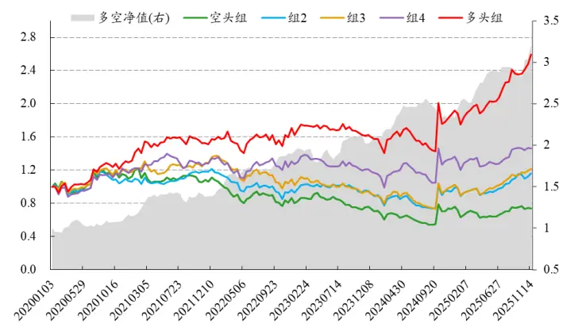

| 年化收益 |  | 年化波动率 最大回撤 | 胜率 | 夏普比率 |
| --- | --- | --- | --- | --- |
| 组1 -5.17% | 28.29% | -55.16% | 48.67% | -0.18 |
| 组2 | 2.61% | 25.75% -39.47% | 51.33% | 0.10 |
| 组3 | 3.43% 26.49% | -46.52% | 53.33% | 0.13 |
| 组4 | 6.84% 26.44% | -29.08% | 55.33% | 0.26 |
| 组5 | 17.93% 25.44% | -20.23% | 54.67% | 0.70 |
| 多空对冲 | 22.41% | 13.16% | -9.96% 60.00% | 1.70 |

数据来源：Wind、开源证券研究所（统计区间：20200101-20251128）

## 5.3、 应用三：指数增强实践

## 5.3.1、 上证 50 增强

上证 50增强，因其成分股数量少、行业权重特点，一直以来都是一个颇具挑战的课题。本文我们尝试了两种增强方案，测试对于上证 50 的增强效果。第一种为行业轮动的增强方式，具体方案为：若本期股票处于行业轮动 5 分组多头，则在原始股票权重加上 1%，若若本期股票位于行业轮动5分组空头，则在原始股票权重基础上减去1%，但是下限为0。最后将所有股票权重归一化。其整体绩效如图 19所示：超额年化收益为 4.95%，超额波动率为 2.17%，超额信息比率为 2.28，超额最大回撤为 1.98%。

图19：上证50行业轮动指增净值及绩效
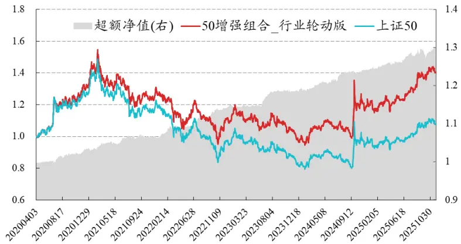

| 超额绩效 |  |  |  |
| --- | --- | --- | --- |
| 年份 | 年化收益 | 年化波动率 信息比率 | 最大回撤 |
| 2020 | 4.53% | 2.10% 2.16 | -0.79% |
| 2021 | 3.47% | 2.37% 1.47 | -0.99% |
| 2022 | 8.01% | 2.13% 3.76 | -1.37% |
| 2023 | 4.07% | 1.70% 2.40 | -0.65% |
| 2024 | 4.50% | 1.92% 2.35 | -0.67% |
| 2025 | 5.10% | 2.71% 1.88 | -1.98% |
| 全区间 | 4.95% | 2.17% 2.28 | -1.98% |

数据来源：Wind、开源证券研究所（统计区间：20200101-20251128）

第二种为使用Barra框架的增强。这里的约束条件，我们规定如下所示：（1）组合单边换手率约束上限为20%；（2）个股权重超额基准上下限不超过1%；（3）风格因子暴露上下限不超过0.1倍标准化；（4）行业暴露上下限不超过1%；（5）不低于80%成分股约束。其中为了降低组合超额回撤，这里的目标TE设置为不超过2%。

第二种方式下的绩效如图20所示：超额年化收益为5.82%，超额波动率为2.78%，超额信息比率为2.09，超额最大回撤为 3.03%。相较于直接使用行业增强而言，使用Barra 框架优化做出来的因子年化收益会高一些，但是整体的超额回撤增大，信息比率低一些。

图20：上证50指增净值及绩效
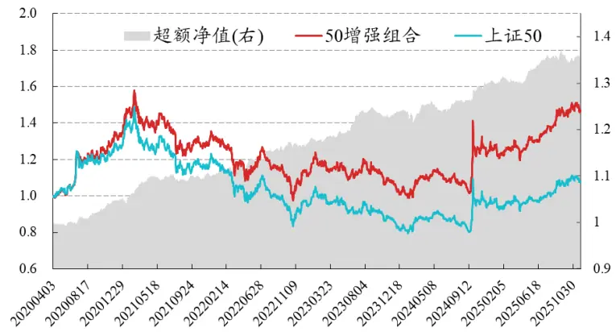

| 超额绩效 |  |  |  |
| --- | --- | --- | --- |
| 年份 | 年化收益 年化波动率 | 信息比率 | 最大回撤 |
| 2020 | 7.06% | 2.49% 2.83 | -0.78% |
| 2021 | 5.35% | 2.58% 2.08 | -1.74% |
| 2022 | 6.95% | 2.98% 2.33 | -1.45% |
| 2023 | 5.82% | 2.20% 2.65 | -1.84% |
| 2024 | 4.72% | 3.55% 1.33 | -2.49% |
| 2025 | 5.28% | 2.65% 1.99 | -2.04% |
| 全区间 | 5.82% | 2.78% 2.09 | -3.03% |

数据来源：Wind、开源证券研究所（统计区间：20200101-20251128）

## 5.3.2、 沪深 300 增强、中证 500 增强、中证 1000 增强

对于沪深 300、中证 500、中证 1000 的指增组合构建，我们采取和上证 50 在Barra 指增框架下同样的约束条件，净值和绩效如下所示。

沪深 300 增强超额年化收益为 6.77%，超额波动率为 3.29%，超额信息比率为2.06，超额最大回撤为 3.81%；

中证 500 增强超额年化收益为 10.72%，超额波动率为 3.78%，超额信息比率为2.83，超额最大回撤为 3.31%；

中证 1000增强超额年化收益为 14.41%，超额波动率为 4.42%，超额信息比率为3.26，超额最大回撤为 3.34%。

图21：沪深300指增净值及绩效
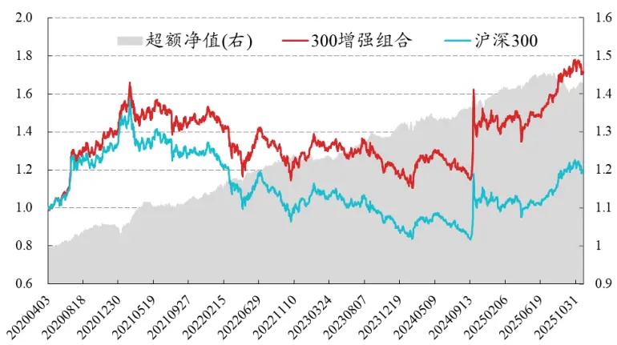

| 超额绩效 |  |  |  |
| --- | --- | --- | --- |
| 年份 | 年化收益 | 年化波动率 信息比率 | 最大回撤 |
| 2020 | 6.77% | 2.81% 2.41 | -1.08% |
| 2021 | 9.21% | 3.44% 2.67 | -1.60% |
| 2022 | 8.41% | 2.91% 2.89 | -1.75% |
| 2023 | 7.47% | 2.71% 2.76 | -1.43% |
| 2024 | 6.38% | 4.31% 1.48 | -1.96% |
| 2025 | 2.09% | 3.21% 0.65 | -3.81% |
| 全区间 | 6.77% | 3.29% 2.06 | -3.81% |

数据来源：Wind、开源证券研究所（统计区间：20200101-20251128）

图22：中证500指增净值及绩效
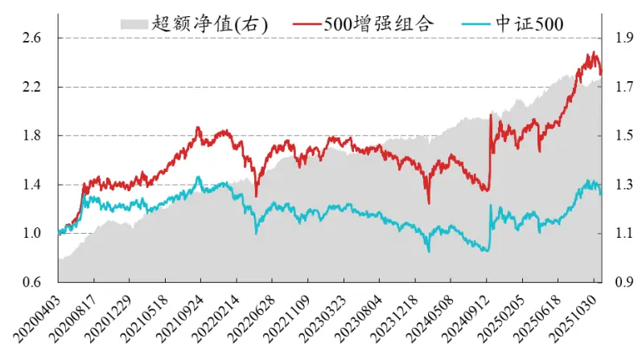

| 年份 | 年化收益 年化波动率 信息比率 |  |  |
| --- | --- | --- | --- |
| 2020 | 19.42% | 3.41% | 最大回撤 5.69 -2.10% |
| 2021 | 14.59% | 4.00% 3.65 | -1.60% |
| 2022 | 12.21% | 3.39% 3.60 | -1.97% |
| 2023 | 3.66% | 3.58% | 1.02 -2.79% |
| 2024 | 9.50% | 4.35% | 2.18 -2.95% |
| 2025 | 7.34% | 3.78% | 1.94 -3.07% |
| 全区间 | 10.72% | 3.78% | 2.83 -3.31% |

数据来源：Wind、开源证券研究所（统计区间：20200101-20251128）

图23：中证1000指增净值及绩效
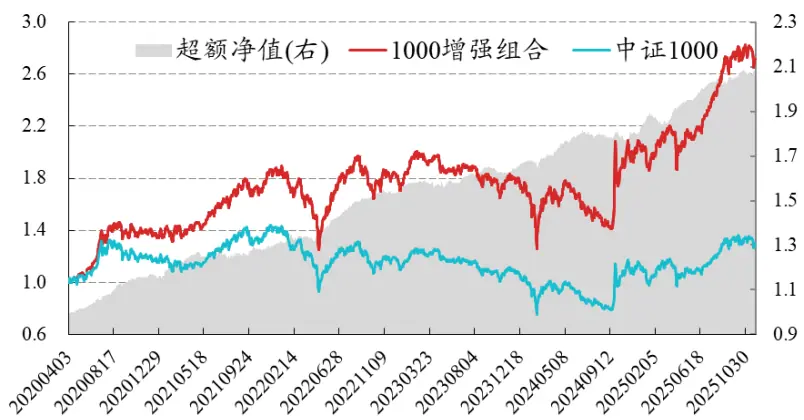

| 超额绩效 |  |  |  |  |
| --- | --- | --- | --- | --- |
| 年份 | 年化收益 | 年化波动率信息比率 |  | 最大回撤 |
| 2020 | 23.03% | 3.97% | 5.80 | -1.54% |
| 2021 | 13.52% | 5.08% | 2.66 | -2.69% |
| 2022 | 19.81% | 4.60% | 4.31 | -2.33% |
| 2023 | 7.38% | 3.84% | 1.92 | -2.17% |
| 2024 | 11.94% | 4.73% | 2.53 | -3.34% |
| 2025 | 13.41% | 4.04% | 3.32 | -2.67% |
| 全区间 | 14.41% | 4.42% | 3.26 | -3.34% |

数据来源：Wind、开源证券研究所（统计区间：20200101-20251128）

## 6、 附录：分域训练的影响

在本部分，我们主要讨论了：训练集的样本切分是否对因子绩效存在一定影响。为了验证这一猜想，我们选取 PV 为特征集、GRU 为模型，使用 Barra 风格因子收益进行训练集的样本高低切分，分域训练。

不同特征集下训练出的因子 10日RankIC 如表 16所示，可以发现：分域训练对最后因子的 RankIC 有一定影响。其中贝塔和成长因子分域后，等权合成的 RankIC相对最高。

表16：分域训练下的10日RankIC对比

| Barra 维度 | 高 | 低 | 等权合成 |
| --- | --- | --- | --- |
| 贝塔 | 11.1% | 10.4% | 11.5% |
| 成长 | 9.8% | 11.1% | 11.3% |
| 杠杆 | 10.0% | 10.4% | 11.1% |
| 残差波动 | 7.6% | 10.2% | 10.9% |
| 流动性 | 9.3% | 10.2% | 10.8% |
| 盈利预期 | 10.1% | 9.7% | 10.8% |
| 账面市值比 | 10.6% | 9.2% | 10.8% |
| 动量 | 9.6% | 10.0% | 10.5% |
| 市值 | 9.3% | 10.3% | 10.5% |
| 非线性市值 | 10.6% | 8.8% | 10.3% |

数据来源：Wind、开源证券研究所（统计区间：20200101-20251128）

## 7、 风险提示

本报告模型基于历史数据测算，市场未来可能发生重大改变。

## 特别声明

《证券期货投资者适当性管理办法》、《证券经营机构投资者适当性管理实施指引（试行）》已于2017年7月1日起正式实施。根据上述规定，开源证券评定此研报的风险等级为R3（中风险），因此通过公共平台推送的研报其适用的投资者类别仅限定为专业投资者及风险承受能力为C3、C4、C5的普通投资者。若您并非专业投资者及风险承受能力为C3、C4、C5的普通投资者，请取消阅读，请勿收藏、接收或使用本研报中的任何信息。

因此受限于访问权限的设置，若给您造成不便，烦请见谅！感谢您给予的理解与配合。

## 分析师承诺

负责准备本报告以及撰写本报告的所有研究分析师或工作人员在此保证，本研究报告中关于任何发行商或证券所发表的观点均如实反映分析人员的个人观点。负责准备本报告的分析师获取报酬的评判因素包括研究的质量和准确性、客户的反馈、竞争性因素以及开源证券股份有限公司的整体收益。所有研究分析师或工作人员保证他们报酬的任何一部分不曾与，不与，也将不会与本报告中具体的推荐意见或观点有直接或间接的联系。

## 股票投资评级说明

|  | 评级 | 说明 |
| --- | --- | --- |
| 证券评级 | 买入（Buy） | 预计相对强于市场表现20%以上； |
|  | 增持（outperform） | 预计相对强于市场表现5%～20%； |
|  | 中性（Neutral） | 预计相对市场表现在—5%～+5%之间波动； |
|  | 减持（underperform） | 预计相对弱于市场表现5%以下。 |
| 行业评级 | 看好（overweight） | 预计行业超越整体市场表现； |
|  | 中性（Neutral） | 预计行业与整体市场表现基本持平； |
|  | 看淡（underperform） | 预计行业弱于整体市场表现。 |
| 备注：评级标准为以报告日后的6~12个月内，证券相对于市场基准指数的涨跌幅表现，其中A股基准指数为沪深300指数、港股基准指数为恒生指数、新三板基准指数为三板成指（针对协议转让标的）或三板做市指数（针对做市转让标的)、美股基准指数为标普500或纳斯达克综合指数。我们在此提醒您，不同证券研究机构采用不同的评级术语及评级标准。我们采用的是相对评级体系，表示投资的相对比重建议；投资者买入或者卖出证券的决定取决于个人的实际情况，比如当前的持仓结构以及其他需要考虑的因素。投资者应阅读整篇报告，以获取比较完整的观点与信息，不应仅仅依靠投资评级来推断结论。 |  |  |

## 分析、估值方法的局限性说明

本报告所包含的分析基于各种假设，不同假设可能导致分析结果出现重大不同。本报告采用的各种估值方法及模型均有其局限性，估值结果不保证所涉及证券能够在该价格交易。

## 法律声明

开源证券股份有限公司是经中国证监会批准设立的证券经营机构，已具备证券投资咨询业务资格。

本报告仅供开源证券股份有限公司（以下简称“本公司”）的机构或个人客户（以下简称“客户”）使用。本公司不会因接收人收到本报告而视其为客户。本报告是发送给开源证券客户的，属于商业秘密材料，只有开源证券客户才能参考或使用，如接收人并非开源证券客户，请及时退回并删除。

本报告是基于本公司认为可靠的已公开信息，但本公司不保证该等信息的准确性或完整性。本报告所载的资料、工具、意见及推测只提供给客户作参考之用，并非作为或被视为出售或购买证券或其他金融工具的邀请或向人做出邀请。本报告所载的资料、意见及推测仅反映本公司于发布本报告当日的判断，本报告所指的证券或投资标的的价格、价值及投资收入可能会波动。在不同时期，本公司可发出与本报告所载资料、意见及推测不一致的报告。客户应当考虑到本公司可能存在可能影响本报告客观性的利益冲突，不应视本报告为做出投资决策的唯一因素。本报告中所指的投资及服务可能不适合个别客户，不构成客户私人咨询建议。本公司未确保本报告充分考虑到个别客户特殊的投资目标、财务状况或需要。本公司建议客户应考虑本报告的任何意见或建议是否符合其特定状况，以及（若有必要）咨询独立投资顾问。在任何情况下，本报告中的信息或所表述的意见并不构成对任何人的投资建议。在任何情况下，本公司不对任何人因使用本报告中的任何内容所引致的任何损失负任何责任。若本报告的接收人非本公司的客户，应在基于本报告做出任何投资决定或就本报告要求任何解释前咨询独立投资顾问。投资者应自主作出投资决策并自行承担投资风险，任何形式的分享证券投资收益或者分担证券投资损失的书面或口头承诺均为无效。

本报告可能附带其它网站的地址或超级链接，对于可能涉及的开源证券网站以外的地址或超级链接，开源证券不对其内容负责。本报告提供这些地址或超级链接的目的纯粹是为了客户使用方便，链接网站的内容不构成本报告的任何部分，客户需自行承担浏览这些网站的费用或风险。

开源证券在法律允许的情况下可参与、投资或持有本报告涉及的证券或进行证券交易，或向本报告涉及的公司提供或争取提供包括投资银行业务在内的服务或业务支持。开源证券可能与本报告涉及的公司之间存在业务关系，并无需事先或在获得业务关系后通知客户。

本报告的版权归本公司所有。本公司对本报告保留一切权利。除非另有书面显示，否则本报告中的所有材料的版权均属本公司。未经本公司事先书面授权，本报告的任何部分均不得以任何方式制作任何形式的拷贝、复印件或复制品，或再次分发给任何其他人，或以任何侵犯本公司版权的其他方式使用。所有本报告中使用的商标、服务标记及标记均为本公司的商标、服务标记及标记。

## 开源证券研究所

上海

地址：上海市浦东新区世纪大道1788号陆家嘴金控广场1号

深圳

地址：深圳市福田区金田路2030号卓越世纪中心1号

楼3层

楼45层

邮编：200120

邮箱：research@kysec.cn

北京

邮编：100044

地址：北京市西城区西直门外大街18号金贸大厦C2座9层

邮箱：research@kysec.cn

邮编：518000

邮箱：research@kysec.cn

西安

邮编：710065

地址：西安市高新区锦业路1号都市之门B座5层

邮箱：research@kysec.cn