傅开波（分析师）

# 高频价格跳跃的峰、岭、谷信息

2026 年 05 月 15 日

## 金融工程研究团队

魏建榕（首席分析师）

证书编号：S0790519120001

证书编号：S0790520090003

## 高 鹏（分析师）

证书编号：S0790520090002

胡亮勇（分析师）

证书编号：S0790522030001

## 王志豪（分析师）

证书编号：S0790522070003

## 盛少成（分析师）

证书编号：S0790121070009

## 蒋 韬（分析师）

证书编号：S0790525070001

## 常津铭（研究员）

证书编号：S0790126010044

## 相关研究报告

《长端动量 2.0：长期、低换手、多头显著的量价因子—开源量化评论（67）》-2022.11.26

《从涨跌停外溢行为到股票关联网络—开源量化评论（92）》-2024.4.16

《从高频股价形态到追涨杀跌因子—开源量化评论（94）》-2024.6.23

《成长与周期共振：基于业绩增速与景气定位的双因子协同—开源量化评论（107）》-2025.3.30

《高频成交量的峰、岭、谷信息—市场微观结构（27）》-2025.7.20

# ——市场微观结构研究系列（33）

魏建榕（分析师）

王志豪（分析师）

weijianrong@kysec.cn

wangzhihao@kysec.cn

证书编号：S0790519120001

证书编号：S0790522070003

## 日内价格跳跃状态划分：峰、岭、谷

本文以股票分钟振幅为价格跳跃代理变量，将振幅在1 倍标准差之上的时点作为价格跳跃时点，振幅在1倍标准差之下的时点作为非跳跃时点（下文称作价谷时点）。对于价格跳跃时点，我们以跳跃的前后时点是否存在价格跳跃衡量局域情绪，以跳跃的前后时点之间是否存在价格缺口衡量跳跃结果。

按照局域情绪特征，我们将日内跳跃时点划分为4类，统计每类跳跃时点的数量作为因子值，从因子RankIC 来看，局域情绪低迷的跳跃呈现正向alpha，局域情绪高涨的跳跃呈现负向alpha，局域情绪适中的跳跃的 alpha并不显著。按照跳跃结果特征，我们将日内跳跃时点划分为 2 类，无缺口的跳跃呈现正向 alpha，有缺口的跳跃呈现负向alpha。

按照局域情绪与跳跃结果双特征，我们将日内跳跃时点划分为 8类。非局域情绪高涨状态下的无缺口跳跃整体呈现较强正向 alpha，非局域情绪低迷状态下的有缺口跳跃整体呈现较强负向 alpha。本文中，我们将非局域情绪高涨状态下的无缺口跳跃时点取并集，作为价峰时点，将非局域情绪低迷状态下的有缺口跳跃时点取并集，作为价岭时点。

## 因子表现稳健，更适用小市值股票池

我们基于三类价格跳跃时点的量价数据，构建11个大类的 17个有效因子。部分因子表现如下：

价峰分钟数因子多空年化收益 16.4%，年化IR2.1；

价岭分钟收益因子多空年化收益 25.9%，年化IR2.96；

价谷相对加权价因子多空年化收益 18.4%，年化IR2.38；

价岭间隔偏度因子多空年化收益 21.7%，年化IR2.44；

价格跳跃成交额相关性因子多空年化收益31.2%，年化 IR2.98。

## 基于6个独立 alpha因子构建合成因子

全域中，我们对比了Barra风格因子剔除前后的因子有效性，大部分因子在剔除Barra 风格因子后仍有效。从因子相关性角度，我们筛选了 6 个具备独立 alpha的因子，简单等权得到合成因子。合成因子多空年化收益 32.9%，年化IR3.34，最大回撤 10.64%，月度胜率 78%。基于合成因子，通过约束优化，在行业、风格偏离约束下，构建指数增强组合，沪深 300 增强组合超额年化收益 5.9%，年化 IR1.38；中证 500 增强组合超额年化收益 11%，年化 IR1.32；中证 1000 增强组合超额年化收益10.7%，年化 IR1.37。

- 风险提示：模型测试基于历史数据，市场未来可能发生变化。

在专题报告《高频成交量的峰、岭、谷信息》（魏建榕、王志豪，2025 年 7 月）中，我们基于日内成交量的局域分布特征，将分钟成交量按照高成交与低成交划分为喷发成交量与温和成交量，然后根据喷发成交量的局域情绪特征，将喷发成交量进一步划分为孤立喷发成交量与连续喷发成交量，并套用地理中的峰岭谷概念，将日内成交量划分为量峰、量岭、量谷三类，基于三类成交量时点的量价数据，构建了 11个大类共20个有效因子。

本文，我们延续前报告的研究框架，从价格跳跃维度，基于分钟价格跳跃的局域情绪与跳跃结果双特征，将分钟价格跳跃划分为价峰、价岭、价谷三类，并基于三类价格跳跃时点的量价数据，构建 11个大类的17个有效因子。

第一节，我们详细介绍对价格跳跃“峰、岭、谷”三类状态的划分方法。第二节至第六节，报告分别从分钟数、分钟收益、相对加权价格、时间间隔统计特征、以及成交额相关性方面，对“峰、岭、谷”各类别构建相应因子。考虑到报告涉及因子数量较多，将部分数据在第七节进行补充，讨论了本报告因子与Barra风格因子的相关性、本报告因子间的相关性，并基于相关性结果构建合成因子。

## 1、 日内价格跳跃状态划分：峰、岭、谷

本文以股票分钟振幅为价格跳跃代理变量，将振幅在 1 倍标准差之上的时点作为价格跳跃时点，振幅在 1 倍标准差之下的时点作为非跳跃时点（下文称作价谷时点）。对于价格跳跃时点，我们以跳跃的前后时点是否存在价格跳跃衡量局域情绪，以跳跃的前后时点之间是否存在价格缺口衡量跳跃结果。

局域情绪：通过跳跃时点前后时点的振幅高低，衡量跳跃时点的局域情绪。前低后低代表前后时点均为低振幅，则局域情绪低迷，前高后高代表前后时点均为高振幅，则局域情绪高涨，前低后高与前高后低则代表局域情绪适中。

跳跃结果：通过跳跃前后时点之间是否存在价格缺口衡量跳跃结果。若跳跃前后时点的价格震荡区间存在重叠，则无缺口；若跳跃前后时点的价格震荡区间不存在重叠，则有缺口。

按照局域情绪特征，我们将日内跳跃时点划分为 4 类，统计每类跳跃时点的数量作为因子值，从因子 RankIC 来看，局域情绪低迷的跳跃呈现正向 alpha，局域情绪高涨的跳跃呈现负向 alpha，局域情绪适中的跳跃的 alpha 并不显著。按照跳跃结果特征，我们将日内跳跃时点划分为 2 类，无缺口的跳跃呈现正向 alpha，有缺口的跳跃呈现负向 alpha。

按照局域情绪与跳跃结果双特征，我们将日内跳跃时点划分为 8 类。非局域情绪高涨状态下的无缺口跳跃整体呈现较强正向alpha，非局域情绪低迷状态下的有缺口跳跃整体呈现较强负向alpha。本文中，我们将非局域情绪高涨状态下的无缺口跳跃时点取并集，作为价峰时点，将非局域情绪低迷状态下的有缺口跳跃时点取并集，作为价岭时点。

图1：日内跳跃时点的双特征划分

| 局域情绪 跳跃结果 | 前低后低 前低后高 4.3% 1.0% | 前高后低 0.2% | 前高后高 -2.7% |
| --- | --- | --- | --- |
| 无缺口 5.6% | 5.7% 6.6% | 3.7% | 0.4% |
| 有缺口-4.4% | -1.0% -7.3% | -5.7% | -8.4% |

数据来源：Wind、开源证券研究所（注：值为因子 RankICIR值）

以 2026年4月统计为例，价峰时点数量整体多于价岭时点数量。价格跳跃时点划分示例可参考图 2。

图2：价格跳跃时点划分示例
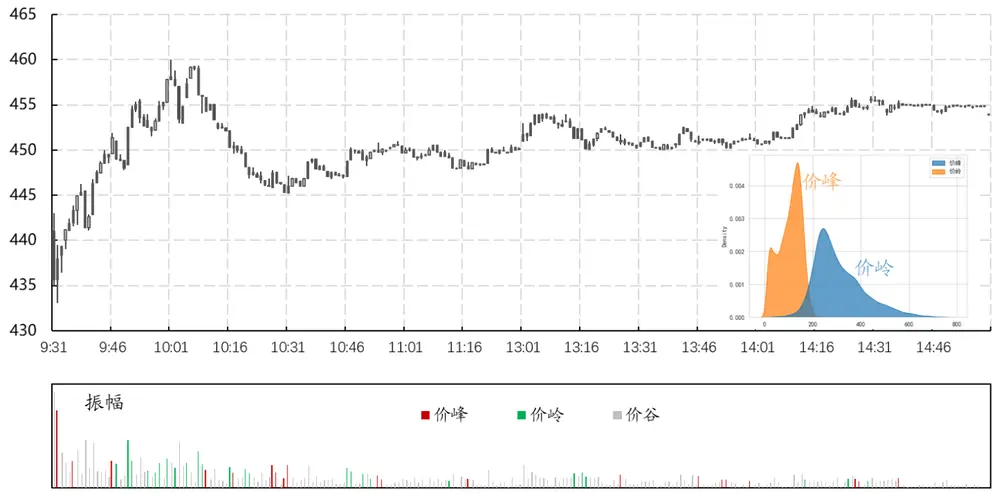
数据来源：Wind、开源证券研究所

本文延续前报告《高频成交量的峰、岭、谷信息》（魏建榕、王志豪，2025年7月）的因子框架，基于价格跳跃的峰、岭、谷划分，构建 11 个大类的 17 个有效因子（如图3所示，√代表有效因子，×代表无效因子）。出于篇幅考虑，我们对其中6个代表性因子作展开介绍。如无特殊说明，本文因子测试采用月末再平衡，双边千三扣费，因子做市值、行业中性化处理，测试区间为 20130101 至20260430。

图3：本报告因子构建示意图

| 价格划分因子类型 | 价峰 | 价岭 | 价谷 |
| --- | --- | --- | --- |
| 分钟数 |  |  |  |
| 分钟收益 |  |  |  |
| 相对加权价 |  |  |  |
| 加权价格分位点 |  |  |  |
| 时间间隔统计特征 |  |  |  |
| 加权价格比值 |  |  |  |
| 成交额比值 |  |  |  |
| 成交额跟随比例 |  |  |  |
| 成交额敏感度 |  |  |  |
| 成交额corr |  |  |  |
| 同时点统计数corr |  |  |  |

资料来源：开源证券研究所

## 2、 价峰分钟数因子：多空年化收益 16.4%

我们简单统计过去 20 天的价峰时点数量，作为价峰分钟数因子。因子 RankIC均值 6.38%，RankICIR3.0，全市场 10 分组多空年化收益率 16.37%，年化 IR2.1，最大回撤 10.6%，月度胜率68%，多头组年化收益率11.52%。

图4：价峰分钟数因子10分组多空年化收益率 16.4%
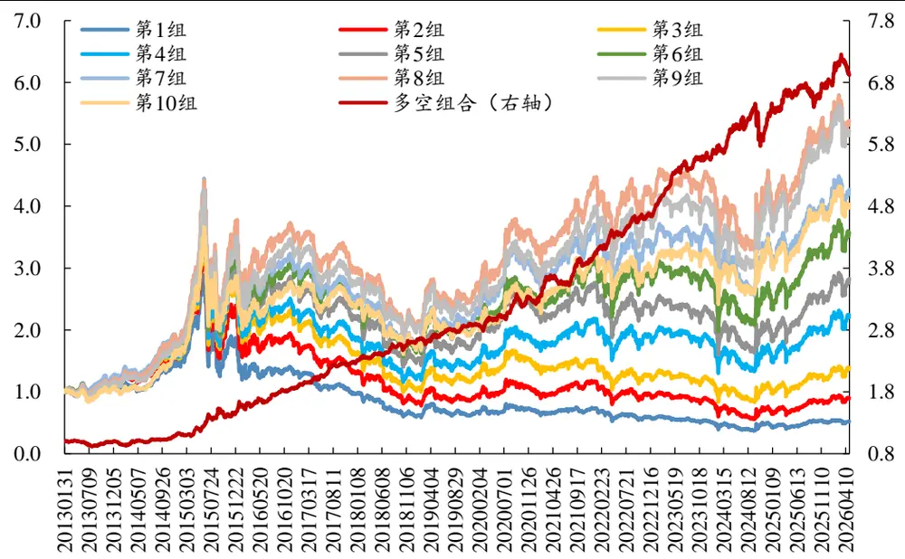
数据来源：Wind、开源证券研究所

从分域表现来看，价峰分钟数因子更适用于小市值股票池。在沪深 300 中，多

空年化收益率 7.25%，年化 IR0.82；在中证 500 中，多空年化收益率 13.24%，年化IR1.71；在中证 1000 中，多空年化收益率 18.44%，年化 IR2.52。

图5：价峰分钟数因子分域多空表现：更适用于小市值股票池
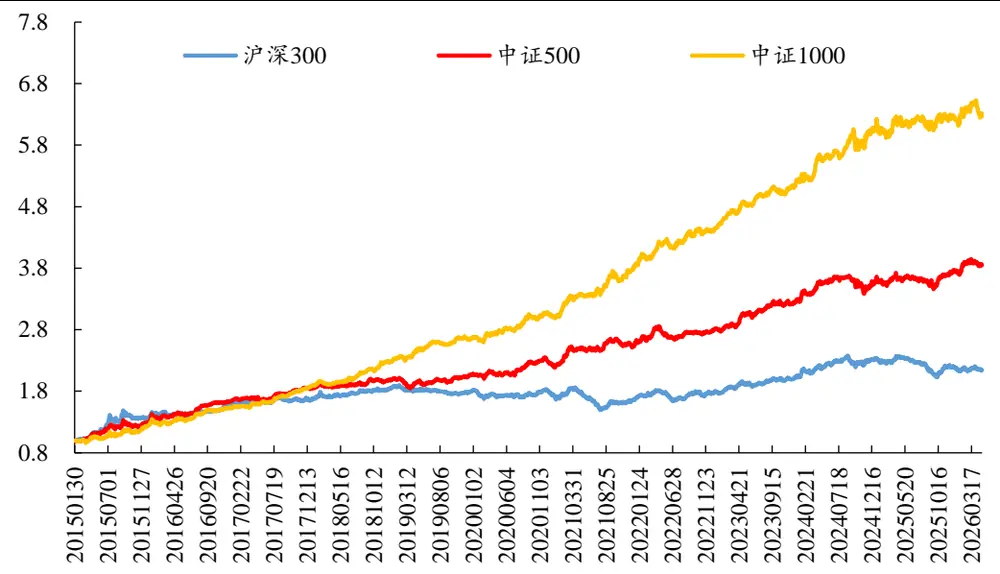
数据来源：Wind、开源证券研究所（测试区间：20150101-20260430）

从分年度多空年化收益来看，全域下，仅2013年出现负收益，其余年份均录得正收益；沪深 300中，2019至 2021年、2025至 2026年出现负收益；中证500与中证 1000中，所有年份均录得正收益。

表1：价峰分钟数因子分年度多空年化收益：中证 500 与中证 1000 中所有年份正收益

| 年份 | 全域 | 沪深300 | 中证500 | 中证1000 |
| --- | --- | --- | --- | --- |
| 2013 | -1.22% | - | - |  |
| 2014 | 13.63% | - | - | - |
| 2015 | 34.55% | 41.81% | 33.82% | 28.51% |
| 2016 | 26.34% | 15.49% | 26.92% | 23.44% |
| 2017 | 22.75% | 5.97% | 13.87% | 23.16% |
| 2018 | 13.84% | 12.50% | 7.62% | 22.51% |
| 2019 | 11.57% | -2.80% | 4.31% | 17.47% |
| 2020 | 13.33% | -3.98% | 6.40% | 12.97% |
| 2021 | 23.36% | -5.10% | 15.89% | 27.97% |
| 2022 | 17.75% | 8.59% | 11.11% | 16.74% |
| 2023 | 21.29% | 12.75% | 15.68% | 16.43% |
| 2024 | 13.41% | 16.22% | 11.76% | 18.57% |
| 2025 | 7.40% | -6.47% | 4.46% | 2.89% |
| 2026（截至4月） | 4.75% | -6.50% | 7.93% |  |
| 全区间 | 16.37% | 7.25% | 13.24% | 1.98% 18.44% |

数据来源：Wind、开源证券研究所

## 3、 价岭分钟收益因子：多空年化收益 25.9%

我们将过去 20 天价岭时点的分钟涨跌幅加总，作为价岭分钟收益因子。因子RankIC 均值-8.51%，RankICIR-3.8，全市场 10 分组多空年化收益率 25.93%，年化IR2.96，最大回撤 10.2%，月度胜率 80%，多头组年化收益率 14.83%。

图6：价岭分钟收益因子10分组多空年化收益 25.9%
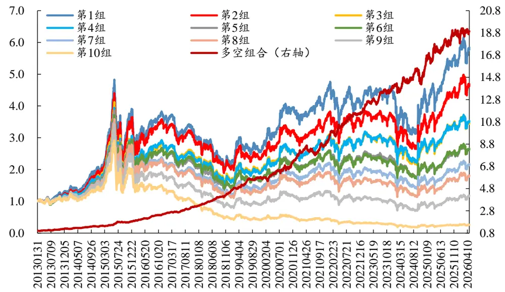
数据来源：Wind、开源证券研究所

从分域表现来看，价岭分钟收益因子在沪深300中，多空年化收益率6.07%，年化 IR0.72；在中证 500 中，多空年化收益率 6.88%，年化 IR0.83；在中证 1000 中，多空年化收益率 16.85%，年化 IR2.18。

图7：价岭分钟收益因子分域多空表现：中证 1000多空年化收益 16.85%
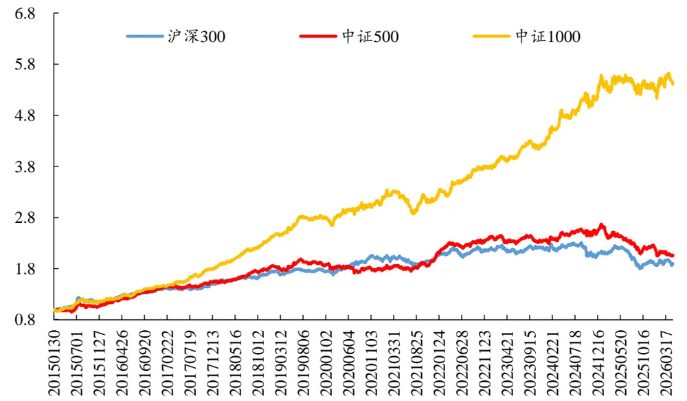
数据来源：Wind、开源证券研究所（测试区间：20150101-20260430）

从分年度多空年化收益来看，全域中，所有年份均录得正收益；沪深 300 中，2023至2025年出现负收益，其余年份正收益；中证500中，2020年、2023年、2025至 2026年录得负收益；中证 1000 中，仅 2025年负收益，其余年份均录得正收益。

表2：价岭分钟收益因子分年度多空年化收益：全域中所有年份正收益

| 年份 | 全域 | 沪深300 | 中证500 | 中证1000 |
| --- | --- | --- | --- | --- |
| 2013 | 23.94% | 1 | 1 | 1 |
| 2014 | 18.01% | - | - | - |
| 2015 | 33.14% | 18.98% | 11.13% | 20.42% |
| 2016 | 38.08% | 21.25% | 29.56% | 23.72% |
| 2017 | 28.10% | 6.45% | 10.38% | 25.94% |
| 2018 | 41.49% | 16.58% | 18.26% | 33.34% |
| 2019 | 28.44% | 0.62% | 2.56% | 17.21% |
| 2020 | 30.74% | 14.01% | -4.29% | 9.84% |
| 2021 | 23.44% | 2.03% | 13.48% | 3.30% |
| 2022 | 27.38% | 9.37% | 19.98% | 21.24% |
| 2023 | 20.38% | -1.93% | -3.28% | 12.26% |
| 2024 | 19.02% | -2.24% | 12.93% | 29.50% |
| 2025 | 13.46% | -12.13% | -18.08% | -2.93% |
| 2026（截至4月） | 5.12% | 4.84% | -16.29% | 5.97% |
| 全区间 | 25.93% | 6.07% | 6.88% | 16.85% |

数据来源：Wind、开源证券研究所

## 4、 价谷相对加权价因子：多空年化收益18.4%

在开源金融工程团队2020年的报告《聪明钱因子模型的 2.0版本》（魏建榕、高鹏、傅开波，2020 年）中，我们从分钟行情数据的价量信息中，通过分钟成交量的价格冲击程度，尝试识别机构参与交易的多寡，最终构造出一个跟踪聪明钱的选股因子。

本节，我们参考聪明钱因子的构建方式，计算每日价谷的成交量加权价格，与当日总成交量加权价格做比，并计算 20 日均值作为价谷相对加权价因子。因子RankIC 均值 6.53%，RankICIR4.0，全市场 10 分组多空年化收益率 18.37%，年化 IR2.38，最大回撤 13.56%，月度胜率79%，多头组年化收益率11.14%。

图8：价谷相对加权价因子10分组多空年化收益18.4%
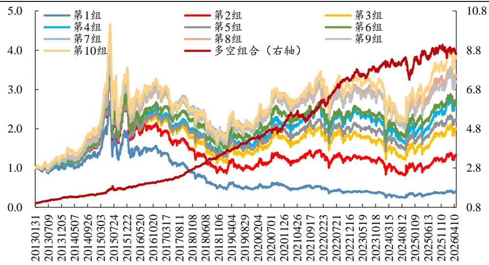
数据来源：Wind、开源证券研究所

从分域表现来看，价谷相对加权价因子在沪深300中，多空年化收益率4.35%，年化 IR0.53；在中证 500 中，多空年化收益率 5.27%，年化 IR0.65；在中证 1000 中，多空年化收益率 12.67%，年化 IR1.81。

图9：价谷相对加权价因子分域多空表现：中证 1000中多空年化收益 12.7 %
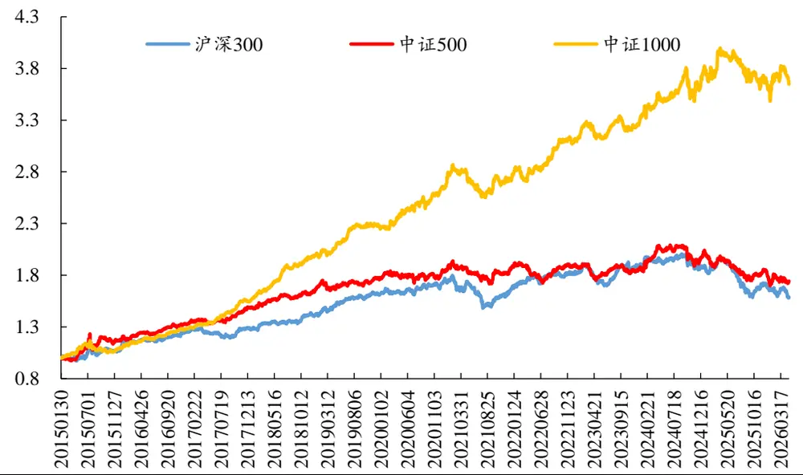
数据来源：Wind、开源证券研究所（测试区间：20150101-20260430）

从分年度多空年化收益来看，全域下，仅2026年出现负收益，其余年份均录得正收益；沪深 300 中，2021 年、2025 年、2026 年出现负收益；中证 500 中，2023年、2025年、2026年出现负收益；在中证1000中，仅2025 年出现负收益。

表3：价谷相对加权价因子分年度年化收益：中证1000中仅 2025年负收益

| 年份 | 全域 | 沪深300 | 中证500 | 中证1000 |
| --- | --- | --- | --- | --- |
| 2013 | 35.30% | - | 1 |  |
| 2014 | 10.45% | - | - | - |
| 2015 | 27.50% | 8.91% | 19.05% | 10.96% |
| 2016 | 17.28% | 17.15% | 13.76% | 17.43% |
| 2017 | 28.91% | 1.49% | 12.50% | 22.07% |
| 2018 | 32.45% | 11.65% | 12.36% | 29.29% |
| 2019 | 22.37% | 14.72% | 6.83% | 13.84% |
| 2020 | 22.76% | 8.53% | 4.62% | 18.04% |
| 2021 | 13.12% | -5.88% | 0.70% | 2.84% |
| 2022 | 23.71% | 10.15% | 1.94% | 14.69% |
| 2023 | 10.70% | 2.71% | -1.99% | 5.06% |
| 2024 | 3.63% | 0.38% | 9.23% | 16.43% |
| 2025 | 5.20% | -11.23% | -13.75% | -4.34% |
| 2026（截至4月） | -5.89% | -15.31% | -2.45% | 1.55% |
| 全区间 | 18.37% | 4.35% | 5.27% | 12.67% |

数据来源：Wind、开源证券研究所

## 5、 价岭间隔偏度因子：多空年化收益 21.7%

我们对过去20日同日前后两个价岭之间的时间间隔分布，计算偏度指标作为价岭间隔偏度因子。因子 RankIC 均值-7.62%，RankICIR-3.5，全市场 10 分组多空年化收益率 21.69%，年化 IR2.44，最大回撤 8.12%，月度胜率 74%，多头组年化收益率14.51%。

图10：价岭间隔偏度因子10分组多空年化收益 21.69%
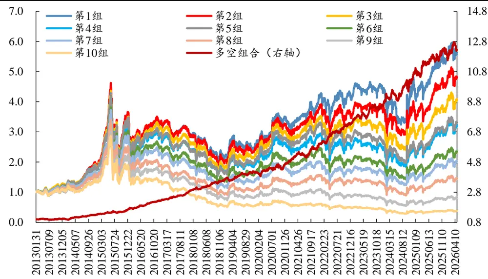
数据来源：Wind、开源证券研究所

从分域表现来看，价岭间隔偏度因子在沪深300中，多空年化收益率7.68%，年化 IR0.96；在中证 500 中，多空年化收益率 11.77%，年化 IR1.49；在中证 1000 中，多空年化收益率 16.26%，年化 IR2.18。

图11：价岭间隔偏度因子分域多空表现：中证 1000中多空年化收益 16.3%
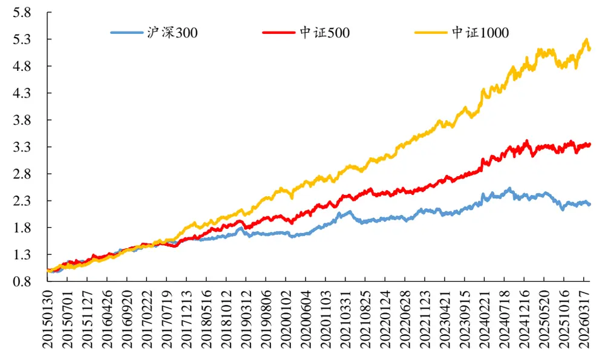
数据来源：Wind、开源证券研究所（测试区间：20150101-20260430）

从分年度多空年化收益来看，全域与中证1000中，所有年份均录得正收益；沪深 300 中，2019 年、2025 出现负收益，其余年份正收益；中证 500 中，仅 2025 年出现负收益，其余年份均录得正收益。

表4：价岭间隔偏度因子分年度多空年化收益：全域与中证 1000中所有年份正收益

| 年份 | 全域 | 沪深300 | 中证500 | 中证1000 |
| --- | --- | --- | --- | --- |
| 2013 | 3.84% | - | - | 1 |
| 2014 | 27.86% | - | - | - |
| 2015 | 28.60% | 24.55% | 22.73% | 19.60% |
| 2016 | 35.07% | 17.35% | 21.91% | 23.58% |
| 2017 | 33.09% | 13.41% | 10.05% | 26.66% |
| 2018 | 22.32% | 8.34% | 20.36% | 14.68% |
| 2019 | 14.79% | -3.27% | 1.98% | 20.60% |
| 2020 | 16.44% | 15.88% | 12.99% | 7.22% |
| 2021 | 26.91% | 1.27% | 12.31% | 16.64% |
| 2022 | 24.49% | 8.95% | 6.33% | 17.45% |
| 2023 | 14.81% | 3.11% | 9.40% | 9.81% |
| 2024 | 29.16% | 9.71% | 19.70% | 23.31% |
| 2025 | 10.47% | -7.61% | -2.69% | 2.13% |
| 2026（截至4月） | 7.50% | 0.92% | 5.29% | 13.38% |
| 全区间 | 21.69% | 7.68% | 11.77% | 16.26% |

数据来源：Wind、开源证券研究所

## 6、 价格跳跃成交额相关性因子：多空年化收益 31.2%

我们计算过去20天价格跳跃时点成交额与下一分钟成交额的错位相关系数，作为价格跳跃成交额相关性因子。因子 RankIC 均值-10.23%，RankICIR-3.8，全市场10 分组多空年化收益率 31.17%，年化 IR2.98，最大回撤 10.42%，月度胜率 77%，多头组年化收益率 17.23%。

图12：价格跳跃成交额相关性因子 10分组多空年化收益 31.2%
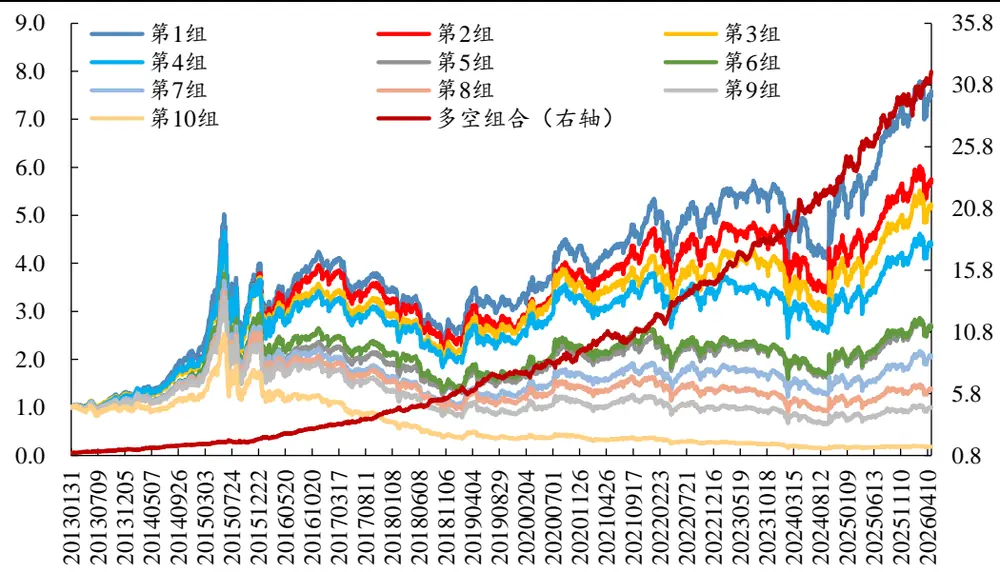
数据来源：Wind、开源证券研究所

从分域表现来看，价格跳跃成交额相关性因子在沪深 300 中，多空年化收益率5.34%，年化 IR0.58；在中证 500 中，多空年化收益率 12.13%，年化 IR1.3；在中证

1000 中，多空年化收益率 21.61%，年化 IR2.43。

图13：价格跳跃成交额相关性因子分域多空表现：中证1000 中多空年化收益 21.6%
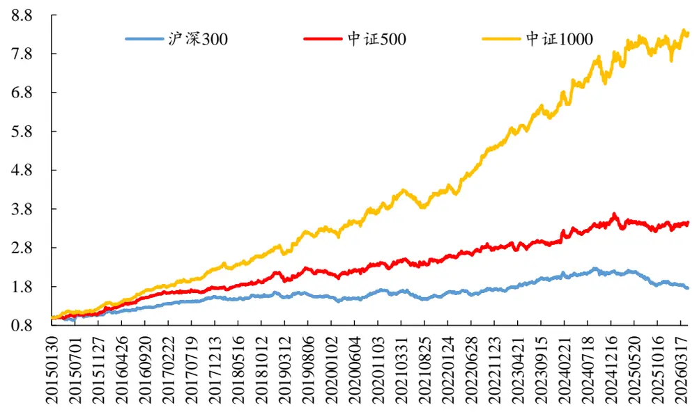
数据来源：Wind、开源证券研究所（测试区间：20150101-20260430）

从分年度多空年化收益来看，全域与中证1000中，所有年份均录得正收益；沪深 300 中，2019 年、2021 年、2025 年与 2026 年出现负收益；中证 500 中，2019 年与 2025年出现负收益，其余年份正收益。

表5：价格跳跃成交额相关性因子分年度年化收益：全域与中证 1000 中所有年份正收益

| 年份 | 全域 | 沪深300 | 中证500 | 中证1000 |
| --- | --- | --- | --- | --- |
| 2013 | 35.55% | - | - | 1 |
| 2014 | 30.34% | - | - | - |
| 2015 | 29.02% | 9.68% | 18.00% | 37.16% |
| 2016 | 49.25% | 21.89% | 41.00% | 37.04% |
| 2017 | 39.24% | 15.49% | 9.23% | 27.01% |
| 2018 | 35.59% | 8.28% | 21.60% | 23.58% |
| 2019 | 28.30% | -7.33% | -0.01% | 17.83% |
| 2020 | 25.91% | 11.44% | 7.82% | 17.33% |
| 2021 | 23.57% | -5.49% | 10.48% | 11.53% |
| 2022 | 30.86% | 9.41% | 13.40% | 31.06% |
| 2023 | 24.83% | 16.02% | 2.93% | 15.16% |
| 2024 | 34.35% | 9.42% | 23.67% | 22.09% |
| 2025 | 20.56% | -15.64% | -6.50% | 4.17% |
| 2026（截至4月） | 27.56% | -16.76% | 8.74% | 16.19% |
| 全区间 | 31.17% | 5.34% | 12.13% | 21.61% |

数据来源：Wind、开源证券研究所

## 7、 基于 6个独立 alpha因子构建合成因子

从 Barra风格暴露来看，分钟数以及成交额类因子在波动率、流动性风格暴露较多，基于收益与价格的因子在Barra的风格暴露相对较低。

表6：Barra风格暴露统计

| 因子编号 | 因子名 | Beta | 规模 | 非线性规模 | 估值 | 成长 | 盈利质量 | 动量 | 波动率 | 流动性 | 杠杆率 |
| --- | --- | --- | --- | --- | --- | --- | --- | --- | --- | --- | --- |
| p1 | 价峰分钟数 | -12 | 14 | 11 | 34 | -1 | 21 | -9 | -31 | -21 | 17 |
| p2 | 价岭分钟数 | 31 | -1 | -10 | -49 | 9 | -19 | 22 | 43 | 43 | -25 |
| p3 | 价岭分钟收益 | 18 | -3 | 3 | -28 | -1 | -21 | 11 | 36 | 37 | -7 |
| p4 | 价谷相对加权价 | -4 | 3 | 0 | 12 | 5 | 13 | -1 | -22 | -22 | -1 |
| p5 | 价谷加权价分位点 | 7 | -8 | -3 | 8 | -1 | 5 | -2 | -20 | -10 | -5 |
| p6 | 价峰时间间隔标准差 | 10 | -13 | -11 | -30 | 2 | -17 | 8 | 22 | 14 | -16 |
| p7 | 价峰间隔偏度 | -13 | 17 | 10 | 22 | 2 | 18 | -3 | -16 | -15 | 12 |
| p8 | 价峰间隔峰度 | -12 | 17 | 9 | 21 | 2 | 18 | -3 | -15 | -14 | 11 |
| p9 | 价岭间隔标准差 | -11 | -3 | 1 | 16 | -1 | 9 | -8 | -25 | -26 | 4 |
| p10 | 价岭间隔偏度 | 18 | 5 | 0 | -25 | 4 | -13 | 11 | 36 | 39 | -8 |
| p11 | 价岭间隔峰度 | 18 | 4 | -1 | -26 | 4 | -13 | 12 | 36 | 38 | -9 |
| p12 | 价格谷岭加权价格比 | 1 | -1 | -3 | 4 | 4 | 8 | -1 | -15 | -14 | -5 |
| p13 | 价格峰岭成交额比 | -25 | 9 | 9 | 44 | -5 | 23 | -13 | -42 | -38 | 22 |
| p14 | 价格跳跃成交额跟随比例 | 27 | 10 | -5 | -39 | 6 | -17 | 19 | 45 | 47 | -14 |
| p15 | 价格跳跃成交额敏感度 | 20 | 12 | 3 | -14 | 1 | -10 | 7 | 29 | 42 | 1 |
| p16 | 价格跳跃成交额相关性 | 22 | 26 | 7 | -26 | 6 | -11 | 20 | 45 | 58 | -1 |
| p17 | 同时点价格峰岭数相关性 | -20 | 4 | 9 | 42 | -7 | 18 | -18 | -38 | -29 | 22 |

数据来源：Wind、开源证券研究所（单位：%）

在全域中，我们对比了Barra 风格因子剔除前后的因子有效性，大部分因子在剔除 Barra风格因子后仍有效。

表7：因子RankIC 总结：大部分因子在剔除 Barra风格后仍有效

| 因子 编号 | 因子名 | 全域(市值、行业中性) |  | 全域（Barra、行业中性） | 沪深300 |  | 中证500 |  | 中证1000 |  |
| --- | --- | --- | --- | --- | --- | --- | --- | --- | --- | --- |
|  |  | RankIC IR | RankIC |  | IR | RankIC IR | RankIC | IR | RankIC | IR |
| p1 | 价峰分钟数 | 6.38% | 3.0 | 3.32% | 2.9 | 3.69% | 1.4 5.05% | 2.1 | 6.74% | 3.4 |
| p2 | 价岭分钟数 | -7.65% | -2.3 | -3.27% | -1.9 | -5.21% -1.5 | -5.81% | -1.8 | -7.87% | -2.5 |
| p3 | 价岭分钟收益 | -8.51% | -3.8 | -3.47% | -2.4 | -4.81% -2.1 | -5.52% | -2.4 | -7.68% | -3.6 |
| p4 | 价谷相对加权价 | 6.53% | 4.0 | 3.33% | 2.7 | 3.70% 1.8 | 4.24% | 2.3 | 6.09% | 3.4 |
| p5 | 价谷加权价分位点 | 5.40% | 3.5 | 3.33% | 3.0 | 4.20% 2.0 | 4.03% | 2.2 | 4.68% | 2.8 |
| p6 | 价峰时间间隔标准差 | -3.96% | -2.0 | -2.35% | -2.1 | -3.20% | -1.1 -3.75% | -1.6 | -4.55% | -2.7 |
| p7 | 价峰间隔偏度 | 3.58% | 2.2 | 1.85% | 2.1 | 3.10% | 1.3 3.75% | 1.8 | 4.43% | 2.5 |
| p8 | 价峰间隔峰度 | 3.55% | 2.4 | 1.75% | 2.1 | 2.94% | 1.3 3.56% | 1.8 | 4.33% | 2.5 |
| p9 | 价岭间隔标准差 | 5.60% | 3.0 | 2.69% | 2.2 | 3.15% | 1.4 3.74% | 1.9 | 5.06% | 2.7 |
| p10 | 价岭间隔偏度 | -7.62% | -3.5 | -2.85% | -2.4 | -4.57% -1.8 | -5.33% | -2.4 | -7.19% | -3.4 |
| p11 | 价岭间隔峰度 | -7.46% | -3.3 | -2.65% | -2.2 | -4.75% -1.9 | -5.17% | -2.3 | -7.08% | -3.3 |
| p12 | 价格谷岭加权价格比 | 4.14% | 2.9 | 2.00% | 1.8 | 2.11% 1.2 | 2.50% | 1.5 | 3.42% | 2.2 |
| p13 | 价格峰岭成交额比 | 6.03% | 2.0 | -0.97% | -0.3 | 1.73% | 0.7 4.07% | 1.7 | 5.62% | 2.4 |
| p14 | 价格跳跃成交额跟随比例 | -8.92% | -3.5 | -4.06% | -3.0 | -5.14% | -1.8 -6.07% | -2.4 | -9.06% | -3.5 |

| 因子 编号 | 因子名 | 全域(市值、行业中性) RankIC IR | 全域（Barra、行业中性） RankIC | IR | 沪深300 | 中证500 |  | 中证1000 |  |
| --- | --- | --- | --- | --- | --- | --- | --- | --- | --- |
|  |  |  |  |  |  | IR | RankIC IR | RankIC IR |  |
| p15 | 价格跳跃成交额敏感度 | -6.82% -3.4 | -2.56% | -2.3 | RankIC -3.77% | -1.6 | -5.34% | -2.4 | -6.34% -3.1 |
| p16 | 价格跳跃成交额相关性 | -10.23% -3.8 | -4.70% | -3.5 | -5.73% | -1.9 | -7.31% | -2.7 | -9.83% -3.6 |
| p17 | 同时点价格峰岭数相关性 | 5.45% 2.1 | 1.42% | 1.1 | 3.28% | 1.2 | 4.18% | 1.6 | 5.68% 2.4 |

数据来源：Wind、开源证券研究所

由于本报告的因子，均依赖于价格跳跃的峰、岭、谷时点划分，且部分因子间的构建逻辑相似，因此，部分因子间的相关性较高。

表8：部分因子间相关性较高

| p2 |  | p3 | p4 | p5 | p6 | p7 | p8 | p9 | p10 | p11 | p12 | p13 | p14 | p15 | p16 | p17 |
| --- | --- | --- | --- | --- | --- | --- | --- | --- | --- | --- | --- | --- | --- | --- | --- | --- |
| pl | -58 | -28 | 21 | 11 | -85 | 73 | 71 | 46 | -44 | -45 | 12 | 68 | -40 | -18 | -30 | 56 |
| p2 |  | 48 | -24 | -11 | 50 | -42 | -40 | -47 | 64 | 66 | -8 | -88 | 72 | 34 | 53 | -65 |
| p3 |  |  | -53 | -27 | 23 | -18 | -17 | -26 | 41 | 41 | -36 | -53 | 50 | 38 | 51 | -40 |
| p4 |  |  |  | 49 | -16 | 13 | 12 | 18 | -26 | -26 | 67 | 34 | -33 | -32 | -36 | 23 |
| p5 |  |  |  |  | -10 | 5 | 5 | 9 | -14 | -13 | 44 | 17 | -16 | -14 | -18 | 13 |
| p6 |  |  |  |  |  | -60 | -57 | -33 | 33 | 34 | -9 | -55 | 27 | 8 | 17 | -46 |
| p7 |  |  |  |  |  |  | 99 | 27 | -23 | -23 | 6 | 49 | -22 | -10 | -14 | 32 |
| p8 |  |  |  |  |  |  |  | 26 | -22 | -22 | 6 | 47 | -21 | -10 | -13 | 31 |
| p9 |  |  |  |  |  |  |  |  | -62 | -64 | 10 | 48 | -43 | -29 | -41 | 34 |
| p10 |  |  |  |  |  |  |  |  |  | 99 | -14 | -67 | 64 | 44 | 60 | -49 |
| p11 |  |  |  |  |  |  |  |  |  |  | -14 | -68 | 64 | 42 | 59 | -50 |
| p12 |  |  |  |  |  |  |  |  |  |  |  | 17 | -16 | -19 | -22 | 11 |
| p13 |  |  |  |  |  |  |  |  |  |  |  |  | -73 | -44 | -58 | 69 |
| p14 |  |  |  |  |  |  |  |  |  |  |  |  |  | 56 | 72 | -55 |
| p15 |  |  |  |  |  |  |  |  |  |  |  |  |  |  | 69 | -27 |
| p16 |  |  |  |  |  |  |  |  |  |  |  |  |  |  |  | -43 |

数据来源：Wind、开源证券研究所（单位：%）

我们对本文的 17 个因子做两两剔除处理，从而筛选具有相对独立 alpha的因子。表 9统计了两两剔除后的因子RankICIR值，其中，对角坐标（标红值）为因子原始RankICIR，坐标（p1，p2）的值为 p1 因子做市值、行业以及 p2 因子中性化后的RankICIR，以此衡量 p1 因子能否被 p2 因子所解释。基于表 9 结果，我们筛选出 6个独立 alpha因子，分别为：价峰分钟数、价岭分钟收益、价谷相对加权价、价谷加权价格分位点、价岭间隔偏度、价格跳跃成交额相关性。

表9：因子互剔的年化RankICIR统计

|  | pl | p2 | p3 | p4 | p5 | p6 | p7 | p8 | p9 | p10 | pl1 | p12 | p13 | p14 | p15 | p16 | p17 |
| --- | --- | --- | --- | --- | --- | --- | --- | --- | --- | --- | --- | --- | --- | --- | --- | --- | --- |
| pl | 3.0 | 1.8 | 1.9 | 2.4 | 2.9 | 3.2 | 2.5 | 2.7 | 2.8 | 2.1 | 2.0 | 2.9 | 2.9 | 2.4 | 2.7 | 2.0 | 2.7 |
| p2 | -2.4 | -2.3 | -1.2 | -1.9 | -2.3 | -2.5 | -2.4 | -2.4 | -2.3 | -1.4 | -1.4 | -2.3 | -2.2 | -0.9 | -1.8 | -1.0 | -2.3 |
| p3 | -3.8 | -2.8 | -3.8 | -3.1 | -3.4 | -3.8 | -3.8 | -3.8 | -3.9 | -3.4 | -3.4 | -3.7 | -3.7 | -3.1 | -3.5 | -2.7 | -3.7 |
| p4 | 3.8 | 3.0 | 1.7 | 4.0 | 2.7 | 3.9 | 3.9 | 3.9 | 3.9 | 3.3 | 3.4 | 4.0 | 3.8 | 3.0 | 3.5 | 2.6 | 3.5 |
| p5 | 3.6 | 3.4 | 2.1 | 1.5 | 3.5 | 3.5 | 3.6 | 3.6 | 3.6 | 3.3 | 3.3 | 3.0 | 3.6 | 3.2 | 3.3 | 2.8 | 3.6 |
| p6 | 1.4 | -0.8 | -1.2 | -1.6 | -1.8 | -2.0 | -1.3 | -1.5 | -1.7 | -1.4 | -1.4 | -1.9 | -1.9 | -1.6 | -1.9 | -1.5 | -1.5 |
| p7 | -0.6 | 0.6 | 1.4 | 1.8 | 2.1 | 1.4 | 2.2 | 1.5 | 2.0 | 1.8 | 1.8 | 2.1 | 2.1 | 1.8 | 2.0 | 1.6 | 1.8 |
| p8 | -0.7 | 0.4 | 1.5 | 1.9 | 2.3 | 1.5 | -1.2 | 2.4 | 2.2 | 1.9 | 1.9 | 2.3 | 2.3 | 1.9 | 2.2 | 1.8 | 1.9 |
| p9 | 2.5 | 2.8 | 2.1 | 2.6 | 2.9 | 2.9 | 2.9 | 2.9 | 3.0 | 1.6 | 1.4 | 2.9 | 3.0 | 2.2 | 2.4 | 1.4 | 3.1 |
| p10 | -3.4 | -2.7 | -2.5 | -3.0 | -3.4 | -3.6 | -3.5 | -3.5 | -4.0 | -3.5 | -1.5 | -3.4 | -3.1 | -2.2 | -2.9 | -1.5 | -3.5 |
| p11 | -3.3 | -2.6 | -2.3 | -2.8 | -3.2 | -3.4 | -3.3 | -3.3 | -4.0 | -0.5 | -3.3 | -3.2 | -3.1 | -2.2 | -2.7 | -1.4 | -3.5 |
| p12 | 2.7 | 2.4 | 0.6 | -1.0 | 1.5 | 2.7 | 2.7 | 2.7 | 2.6 | 2.3 | 2.3 | 2.9 | 2.7 | 2.2 | 2.3 | 1.5 | 2.6 |
| p13 | 1.1 | -1.1 | -0.2 | 0.8 | 1.6 | 1.9 | 1.9 | 2.0 | 3.6 | -0.1 | 1.0 | 1.6 | 2.0 | -1.4 | -0.1 | -1.1 | -0.2 |
| p14 | -3.6 | -3.1 | -2.5 | -3.0 | -3.3 | -3.6 | -3.5 | -3.5 | -3.6 | -3.1 | -3.0 | -3.4 | -3.3 | -3.5 | -2.7 | -1.5 | -3.8 |
| p15 | -3.1 | -2.6 | -2.6 | -2.9 | -3.3 | -3.4 | -3.3 | -3.4 | -3.2 | -2.6 | -2.7 | -3.3 | -3.2 | -1.7 | -3.4 | -0.3 | -3.0 |
| p16 | -3.7 | -3.3 | -3.1 | -3.5 | -3.7 | -3.8 | -3.7 | -3.8 | -3.9 | -3.6 | -3.6 | -3.8 | -3.7 | -3.2 | -3.6 | -3.8 | -3.7 |
| p17 | 1.4 | 0.3 | 0.9 | 1.5 | 1.9 | 2.1 | 1.9 | 1.9 | 1.9 | 0.7 | 0.9 | 2.0 | 1.9 | 0.1 | 1.4 | 0.3 | 2.1 |

数据来源：Wind、开源证券研究所

## 7.1、 合成因子：多空年化收益 32.9%

我们将前述 6 个因子做简单等全合成，合成因子 RankIC 均值 10.72%，RankICIR4.1，全市场 10 分组多空年化收益率 32.86%，年化 IR3.34，最大回撤 10.64%，月度胜率 78%，多头组年化收益率 17.65%。

图14：合成因子10分组多空年化收益 32.86%
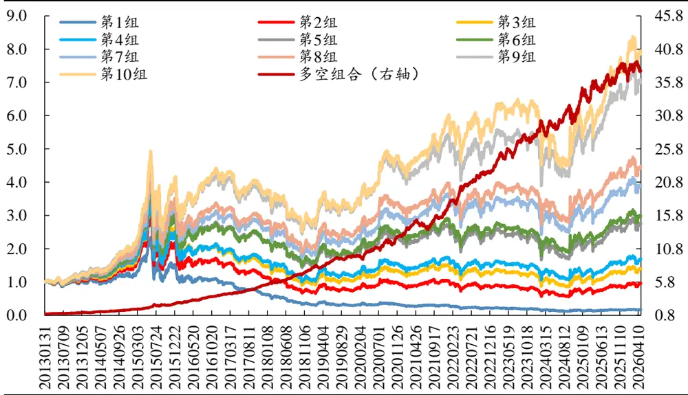
数据来源：Wind、开源证券研究所

从分域表现来看，合成因子在沪深300中，多空年化收益率10.47%，年化IR1.05；在中证500中，多空年化收益率13.23%，年化IR1.4；在中证 1000中，多空年化收益率 25.66%，年化 IR2.97。

图15：合成因子分域多空表现：中证1000中多空年化收益 25.7%
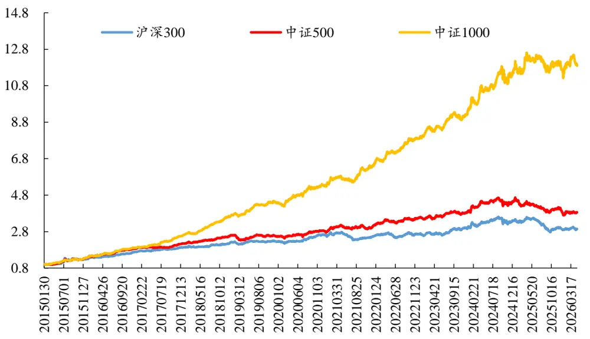
数据来源：Wind、开源证券研究所（测试区间：20150101-20260430）

从分年度多空年化收益来看，全域中，所有年份均录得正收益；沪深300中，2021年、2025 年出现负收益；中证 500 中，2019 年、2025 年与 2026 年出现负收益；中证 1000中，仅2025年出现负收益，其余年份均录得正收益。

表10：合成因子分年度年化收益：全域中所有年份录得正收益

| 年份 | 全域 | 沪深300 | 中证500 | 中证1000 |
| --- | --- | --- | --- | --- |
| 2013 | 27.08% | - | 1 | - |
| 2014 | 34.25% | - | - | - |
| 2015 | 59.56% | 33.84% | 42.50% | 45.02% |
| 2016 | 51.24% | 31.41% | 37.40% | 39.02% |
| 2017 | 41.14% | 14.45% | 15.71% | 36.44% |
| 2018 | 45.61% | 15.16% | 20.97% | 42.49% |
| 2019 | 26.19% | 2.25% | -1.72% | 20.62% |
| 2020 | 32.56% | 17.29% | 10.50% | 21.95% |
| 2021 | 32.03% | -4.04% | 11.15% | 21.55% |
| 2022 | 36.28% | 6.46% | 16.54% | 25.86% |
| 2023 | 23.98% | 9.70% | 6.96% | 15.56% |
| 2024 | 24.14% | 17.18% | 19.40% | 28.96% |
| 2025 | 9.64% | -14.88% | -15.21% | -0.80% |
| 2026（截至4月） | 0.72% | 1.03% | -3.18% | 5.69% |
| 全区间 | 32.86% | 10.47% | 13.23% | 25.66% |

数据来源：Wind、开源证券研究所

## 7.2、 指数增强测试

我们尝试使用约束优化求解的方式进行沪深 300、中证 500 与中证 1000 增强测试。合成因子为正向因子，因此组合因子暴露度最大化等价于预期收益率最大化。

$$
\operatorname*{max}\ \alpha^{T}w\quad s.t.
$$

$$
s_{l}\le X_{s}(w-w_{b})\le s_{u}
$$

$$
\begin{array}{c}{h_{l}\leq X_{h}(w-w_{b})\leq h_{u}}\\{\ }\\{w_{l}\leq w-w_{b}\leq w_{u}}\\{\ b^{T}w\geq c_{l}}\\{\ }\\{1^{T}w=1}\\{\ }\\{0\leq w\leq1}\end{array}
$$

其中， $\alpha.$ 表示因子暴露度，w表示待优化权重， $X_{s}$ 表示风格暴露度矩阵， $X_{h}$ 表示行业哑变量矩阵， $s_{u}$ 和s 分别表示风格暴露度的偏离上下限， $h_{u}\star\mathsf{e}h_{l}$ 分别表示行业偏离上下限， $w_{u}$ 和 $w_{l}$ 分别表示权重偏离的上下限，b表示股票池个股是否位于指数成分股的示性向量， $c_{l}$ 表示成分股权重之和下限。

沪深300增强组合年化收益率11.45%，相较于沪深300，超额年化收益率5.9%，年化 IR1.38，最大回撤 8.7%，月度胜率 67%。

图16：沪深300指数增强超额年化收益 5.9%
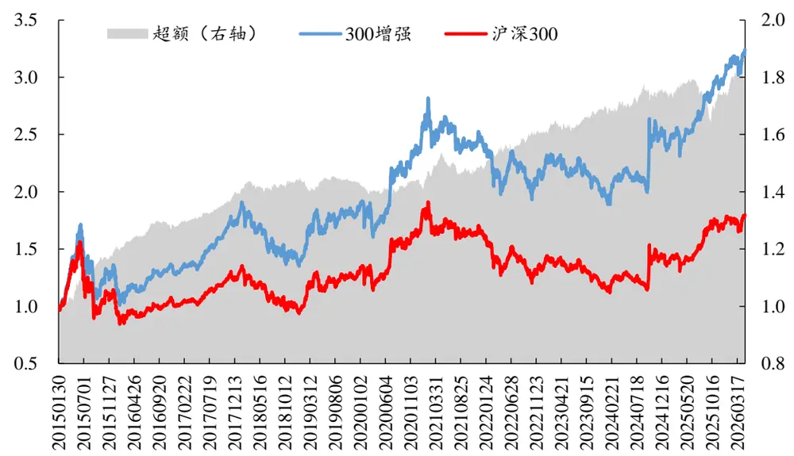
数据来源：Wind、开源证券研究所（测试区间：20150101-20260430）

分年度来看，沪深300增强组合仅 2019年跑输沪深 300，其余年份均跑赢。

表11：沪深300增强组合分年度年化收益：除2019年外均跑赢

| 年份 | 300 增强 | 沪深300 | 超额 |
| --- | --- | --- | --- |
| 2015 | 36.82% | 11.60% | 25.23% |
| 2016 | -3.25% | -9.51% | 6.26% |
| 2017 | 36.68% | 25.02% | 11.66% |
| 2018 | -21.79% | -24.31% | 2.51% |
| 2019 | 38.86% | 40.51% | -1.65% |
| 2020 | 31.25% | 31.01% | 0.24% |
| 2021 | 0.32% | -3.63% | 3.95% |
| 2022 | -13.58% | -20.49% | 6.91% |
| 2023 | -5.00% | -9.46% | 4.46% |
| 2024 | 23.78% | 18.98% | 4.80% |
| 2025 | 22.08% | 21.74% | 0.34% |
| 2026（截至4月） | 24.51% | 14.04% | 10.47% |
| 2015-2026.4 | 11.45% | 5.56% | 5.90% |

数据来源：Wind、开源证券研究所

中证 500增强组合年化收益 14.7%，相较于中证500，超额年化收益 11%，年化IR1.32，最大回撤 17.2%，月度胜率 69%。

图17：中证500增强组合超额年化收益 11%
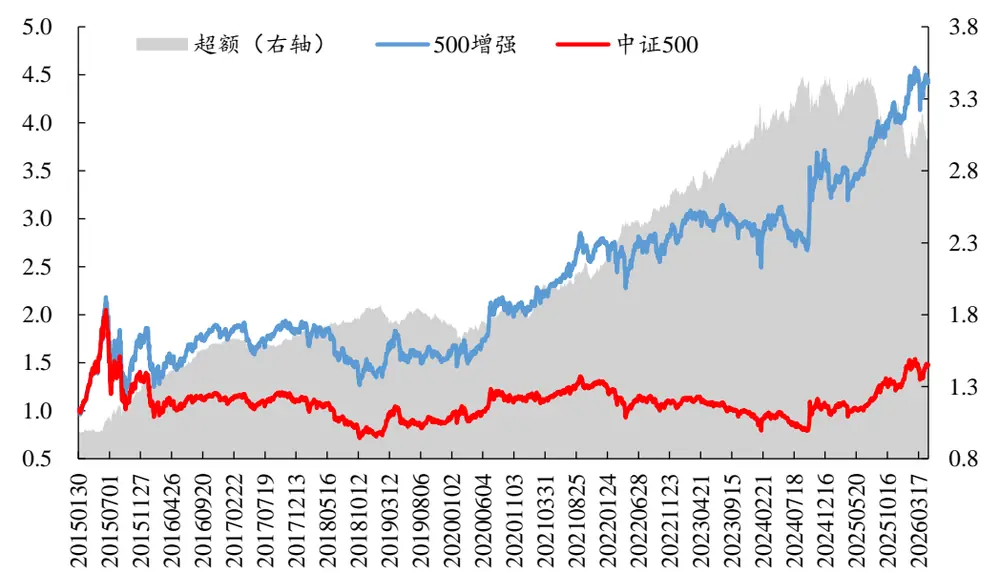
数据来源：Wind、开源证券研究所（测试区间：20150101-20260430）

分年度来看，中证 500增强组合 2019 年、2025年以及 2026年跑输中证 500指数。

表12：中证500增强组合分年度年化收益

| 年份 | 500增强 中证500 | 超额 |
| --- | --- | --- |
| 2015 | 95.96% 40.23% | 55.73% |
| 2016 | -1.53% | -18.23% 16.71% |
| 2017 | 2.99% -0.21% | 3.20% |
| 2018 | -26.77% | -34.20% 7.43% |
| 2019 | 19.23% 27.23% | -8.00% |
| 2020 | 28.05% 21.63% | 6.43% |
| 2021 | 37.31% 16.13% | 21.17% |
| 2022 | -1.25% -20.98% | 19.73% |
| 2023 | 5.17% -7.69% | 12.86% |
| 2024 | 19.55% 5.67% | 13.89% |
| 2025 | 17.85% 31.53% | -13.67% |
| 2026（截至4月） | 33.10% 43.55% | -10.45% |
| 2015-2026.4 | 14.70% | 3.70% 11.00% |

数据来源：Wind、开源证券研究所

中证 1000 增强组合年化收益 13.03%，相较于中证 1000 指数，超额年化收益

10.72%，年化 IR1.37，最大回撤 16.8%，月度胜率 71%。

图18：中证1000增强组合超额年化收益 10.7%
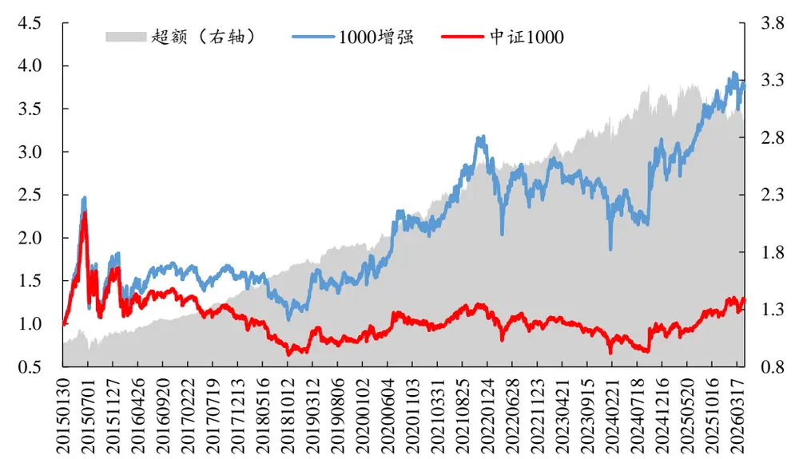
数据来源：Wind、开源证券研究所（测试区间：20150101-20260430）

分年度来看，中证1000增强组合2025年、2026年跑输中证 1000，其余年份均跑赢。

表13：中证1000增强组合分年度年化收益：仅2025、2026年负超额

| 年份 | 1000增强 | 中证1000 | 超额 |
| --- | --- | --- | --- |
| 2015 | 92.18% | 71.82% | 20.36% |
| 2016 | -11.46% | -20.51% | 9.05% |
| 2017 | -2.55% | -17.80% | 15.26% |
| 2018 | -26.29% | -37.82% | 11.53% |
| 2019 | 38.89% | 26.49% | 12.40% |
| 2020 | 35.65% | 20.09% | 15.57% |
| 2021 | 51.07% | 21.26% | 29.81% |
| 2022 | -21.90% | -22.28% | 0.38% |
| 2023 | 2.47% | -6.50% | 8.97% |
| 2024 | 12.17% | 1.24% | 10.93% |
| 2025 | 24.22% | 28.51% | -4.29% |
| 2026（截至4月） | 22.67% | 37.49% | -14.82% |
| 2015-2026.4 | 13.03% | 2.31% | 10.72% |

数据来源：Wind、开源证券研究所

## 8、 风险提示

模型测试基于历史数据，市场未来可能发生变化。

## 特别声明

《证券期货投资者适当性管理办法》、《证券经营机构投资者适当性管理实施指引（试行）》已于2017年7月1日起正式实施。根据上述规定，开源证券评定此研报的风险等级为R3（中风险），因此通过公共平台推送的研报其适用的投资者类别仅限定为专业投资者及风险承受能力为C3、C4、C5的普通投资者。若您并非专业投资者及风险承受能力为C3、C4、C5的普通投资者，请取消阅读，请勿收藏、接收或使用本研报中的任何信息。

因此受限于访问权限的设置，若给您造成不便，烦请见谅！感谢您给予的理解与配合。

## 分析师承诺

负责准备本报告以及撰写本报告的所有研究分析师或工作人员在此保证，本研究报告中关于任何发行商或证券所发表的观点均如实反映分析人员的个人观点。负责准备本报告的分析师获取报酬的评判因素包括研究的质量和准确性、客户的反馈、竞争性因素以及开源证券股份有限公司的整体收益。所有研究分析师或工作人员保证他们报酬的任何一部分不曾与，不与，也将不会与本报告中具体的推荐意见或观点有直接或间接的联系。

## 股票投资评级说明

|  | 评级 | 说明 |
| --- | --- | --- |
| 证券评级 | 买入（Buy） | 预计相对强于市场表现20%以上； |
|  | 增持（outperform） | 预计相对强于市场表现5%～20%； |
|  | 中性（Neutral） | 预计相对市场表现在—5%～+5%之间波动； |
|  | 减持（underperform） | 预计相对弱于市场表现5%以下。 |
| 行业评级 | 看好（overweight） | 预计行业超越整体市场表现； |
|  | 中性（Neutral） | 预计行业与整体市场表现基本持平； |
|  | 看淡（underperform） | 预计行业弱于整体市场表现。 |
| 备注：评级标准为以报告日后的6~12个月内，证券相对于市场基准指数的涨跌幅表现，其中A股基准指数为沪深300指数、港股基准指数为恒生指数、新三板基准指数为三板成指（针对协议转让标的）或三板做市指数（针对做市转让标的)、美股基准指数为标普500或纳斯达克综合指数。我们在此提醒您，不同证券研究机构采用不同的评级术语及评级标准。我们采用的是相对评级体系，表示投资的相对比重建议；投资者买入或者卖出证券的决定取决于个人的实际情况，比如当前的持仓结构以及其他需要考虑的因素。投资者应阅读整篇报告，以获取比较完整的观点与信息，不应仅仅依靠投资评级来推断结论。 |  |  |

## 分析、估值方法的局限性说明

本报告所包含的分析基于各种假设，不同假设可能导致分析结果出现重大不同。本报告采用的各种估值方法及模型均有其局限性，估值结果不保证所涉及证券能够在该价格交易。

## 法律声明

开源证券股份有限公司是经中国证监会批准设立的证券经营机构，已具备证券投资咨询业务资格。

本报告仅供开源证券股份有限公司（以下简称“本公司”）的机构或个人客户（以下简称“客户”）使用。本公司不会因接收人收到本报告而视其为客户。本报告是发送给开源证券客户的，属于商业秘密材料，只有开源证券客户才能参考或使用，如接收人并非开源证券客户，请及时退回并删除。

本报告是基于本公司认为可靠的已公开信息，但本公司不保证该等信息的准确性或完整性。本报告所载的资料、工具、意见及推测只提供给客户作参考之用，并非作为或被视为出售或购买证券或其他金融工具的邀请或向人做出邀请。本报告所载的资料、意见及推测仅反映本公司于发布本报告当日的判断，本报告所指的证券或投资标的的价格、价值及投资收入可能会波动。在不同时期，本公司可发出与本报告所载资料、意见及推测不一致的报告。客户应当考虑到本公司可能存在可能影响本报告客观性的利益冲突，不应视本报告为做出投资决策的唯一因素。本报告中所指的投资及服务可能不适合个别客户，不构成客户私人咨询建议。本公司未确保本报告充分考虑到个别客户特殊的投资目标、财务状况或需要。本公司建议客户应考虑本报告的任何意见或建议是否符合其特定状况，以及（若有必要）咨询独立投资顾问。在任何情况下，本报告中的信息或所表述的意见并不构成对任何人的投资建议。在任何情况下，本公司不对任何人因使用本报告中的任何内容所引致的任何损失负任何责任。若本报告的接收人非本公司的客户，应在基于本报告做出任何投资决定或就本报告要求任何解释前咨询独立投资顾问。投资者应自主作出投资决策并自行承担投资风险，任何形式的分享证券投资收益或者分担证券投资损失的书面或口头承诺均为无效。

本报告可能附带其它网站的地址或超级链接，对于可能涉及的开源证券网站以外的地址或超级链接，开源证券不对其内容负责。本报告提供这些地址或超级链接的目的纯粹是为了客户使用方便，链接网站的内容不构成本报告的任何部分，客户需自行承担浏览这些网站的费用或风险。

开源证券在法律允许的情况下可参与、投资或持有本报告涉及的证券或进行证券交易，或向本报告涉及的公司提供或争取提供包括投资银行业务在内的服务或业务支持。开源证券可能与本报告涉及的公司之间存在业务关系，并无需事先或在获得业务关系后通知客户。

本报告的版权归本公司所有。本公司对本报告保留一切权利。除非另有书面显示，否则本报告中的所有材料的版权均属本公司。未经本公司事先书面授权，本报告的任何部分均不得以任何方式制作任何形式的拷贝、复印件或复制品，或再次分发给任何其他人，或以任何侵犯本公司版权的其他方式使用。所有本报告中使用的商标、服务标记及标记均为本公司的商标、服务标记及标记。

## 开源证券研究所

上海

地址：上海市浦东新区世纪大道1788号陆家嘴金控广场1号

深圳

地址：深圳市福田区金田路2030号卓越世纪中心1号

楼3层

楼45层

邮编：200120

邮箱：research@kysec.cn

北京

邮编：100044

地址：北京市西城区西直门外大街18号金贸大厦C2座9层

邮箱：research@kysec.cn

邮编：518000

邮箱：research@kysec.cn

西安

邮编：710065

地址：西安市高新区锦业路1号都市之门B座5层

邮箱：research@kysec.cn