# 聪明钱 3.0：AI 赋能从分钟至逐笔的精细切割

2026 年 08 月 28 日

## 金融工程研究团队

魏建榕（首席分析师）

证书编号：S0790519120001

傅开波（分析师）

证书编号：S0790520090003

高 鹏（分析师）

证书编号：S0790520090002

胡亮勇（分析师）

证书编号：S0790522030001

## 王志豪（分析师）

证书编号：S0790522070003

## 盛少成（分析师）

证书编号：S0790523060003

## 蒋 韬（分析师）

证书编号：S0790123070037

## 常津铭（研究员）

证书编号：S0790126010044

## 赵 睿（研究员）

证书编号：S0790126080032

## 相关研究报告

《大单与小单资金流的 alpha 能力—市场微观结构研究系列（12）》-2021.6.2

《大小单资金流 alpha 探究 2.0：变量精筛与高频测算—市场微观结构研究系列（18）》-2022.12.18

《分钟资金流因子的构建方法—市场 微 观 结 构 研 究 系 列 （ 31 ）》-2025.12.21

《因子切割论—市场微观结构研究系列（10）》-2020.9.16

《聪明钱因子模型的 2.0 版本—市场微观结构研究系列（3）》-2020.2.9

# ——市场微观结构研究系列（34）

魏建榕（分析师）

盛少成（分析师）

weijianrong@kysec.cn

shengshaocheng@kysec.cn

证书编号：S0790519120001

证书编号：S0790523060003

## ⚫ AI赋能因子改进

随着 AI 技术快速发展，量化因子的研究方式也在不断升级。本报告以“聪明钱因子”为例，尝试将 AI 工具贯穿因子改进全过程，构建从思路形成到因子输出的完整工作流。首先，通过大量语料的输入，让 AI 学习市场微观结构知识，辅助发散并筛选聪明钱的识别维度；其次，依托 AI 完成因子代码编写、参数化族设计及多版本变体批量生成；最后，通过代码审查、数值核对与逻辑复盘等环节把控质量，并结合回测结果持续迭代优化因子。

## ⚫ 分钟级别的改进

分钟层面引入时点成交量变化、前后收益差、前后成交量比、相对收盘价位置、局部密度、时间切片六类市场反应维度，参数化比较“先按聪明度筛选再按市场反应分高低”与“先按市场反应分位再按聪明度筛选”两种构建路径。

筛选出两个绩效较优的因子：一是 Smart_PriceImpact，在高 $S_{t}$ 样本中保留前后收益差较大的时刻，以识别真正引发价格反应的聪明钱；二是 Smart_VolDecay，在高 $S_{t}$ 样本中筛选发生后成交量相对前序萎缩的时刻，以识别非跟风驱动的定向交易。两个因子等权合成 Smart_Minute_Enhanced，合成后 RankIC 为-6.24%，多空年化收益为 17.49%，信息比率为 2.41，较 Baseline 有所提升。

## ⚫ Level-2 级别的改进

将识别粒度下沉至 Level-2 高频数据，从逐笔成交、逐笔委托与盘口三个维度捕捉分钟层面无法刻画的聪明钱信息：逐笔成交维度基于单笔聪明度、成交强度与大单过滤刻画成交执行特征；逐笔委托维度基于撤单比例、方向持续性与前后委托差异刻画委托结构变化；盘口维度基于绝对价差、相对价差与价差变化率刻画流动性环境。

筛选出三个有效因子：1、Smart_TradeFlow_Patient，捕捉低 $S_{t}$ 但有大单参与的耐心执行型交易，其 alpha 来源于控制冲击成本、缓慢执行的大额交易往往对应信息优势方的真实布局，相较于只用 Smart_Minute_Enhanced 因子，加入Smart_TradeFlow_Patient 因子后绩效进一步提升，二者有互补之处；2、Smart_OrderFlow_Impact，基于前后委托方向差别比例识别对委托簿有实质影响的委托流，其 alpha 来源于委托方向的显著变化反映了信息优势方的主动介入；3、Smart_Tick_Spread，基于绝对价差筛选流动性充裕环境中的成交，其 alpha 来源于低交易成本环境更易吸引机构投资者主动交易。

## ⚫ 聪明钱 3.0 因子

综合分钟、逐笔成交、逐笔委托、盘口四大维度，将 Smart_Minute_Enhanced 与Level-2 层面的有效因子进一步合成，得到 聪明钱 3.0 因子。该因子在20210701-20260430 期间 RankIC 为 -7.21%，RankICIR 为 -4.30，多空对冲年化收益为 27.59%，信息比率为 3.21。

⚫ 风险提示：本报告模型基于历史数据测算，市场未来可能发生重大改变。

在 A 股市场，信息优势是超额收益的重要来源之一，而“聪明钱”因子正是捕捉这类信息优势的核心工具。它通过识别具有信息优势的交易行为，帮助投资者从纷繁的成交细节中洞察主力资金动向，是量化策略获取 Alpha、理解市场微观结构的关键抓手。

在《聪明钱因子模型的 2.0 版本》（魏建榕、傅开波、高鹏，2020 年）中，我们从分钟数据出发，以分钟级收益率 $R_{t}$ 和成交量 $V_{t}$ 构造聪明度指标 $S_{t}$ ，并以高$S_{t}$ 时刻的成交量加权平均价格 (VWAP) 相对全部 VWAP 的比值 Q 作为因子值。本报告在该框架基础上沿两大方向进一步拓展：一是引入市场反应对聪明时刻进行二次筛选，从时点成交量变化、前后收益差、前后成交量比、相对收盘价位置、局部密度、时间切片等维度提炼更有效信号；二是将数据维度从分钟行情延伸至逐笔成交、逐笔委托与盘口快照，构建多个参数化因子族、逾百个变体，形成“分钟 →逐笔成交 → 逐笔委托 → 盘口”的完整聪明钱识别体系。

本报告结构安排如下：第一部分介绍 AI 赋能因子改进的整体架构与研究路径。第二部分回顾并改进分钟级聪明钱因子，优化聪明钱的时点选择。第三部分将数据维度从分钟 K 线拓展至逐笔成交、逐笔委托与盘口三类高频数据：基于逐笔成交数据，直接计算单笔成交聪明度，并引入成交强度、大单过滤等维度，从交易执行层面改进聪明钱的识别精度；基于逐笔委托数据，通过撤单比例与委托方向持续性识别机构的隐藏意图；基于盘口数据，利用买卖价差极端状态刻画市场微观结构变化，定位聪明钱的主动介入时点。第四部分将上述分钟级改进与逐笔成交、逐笔委托、盘口信息按统一框架融合，给出聪明钱因子 3.0的构造形式。

## 1、 AI 赋能下的因子改进实践

随着 AI 技术快速发展，量化因子的研究方式也在不断升级。本报告以“聪明钱因子”为例，尝试将 AI 工具贯穿因子改进全过程，构建从思路形成到因子输出的完整工作流，具体如图 1 所示。首先，通过大量语料的输入，让 AI 学习市场微观结构知识，辅助发散并筛选聪明钱的识别维度；其次，依托 AI 完成因子代码编写、参数化族设计及多版本变体批量生成；最后，通过代码审查、数值核对与逻辑复盘等环节把控质量，并结合回测结果持续迭代优化因子。

图1：AI赋能因子改进流程图
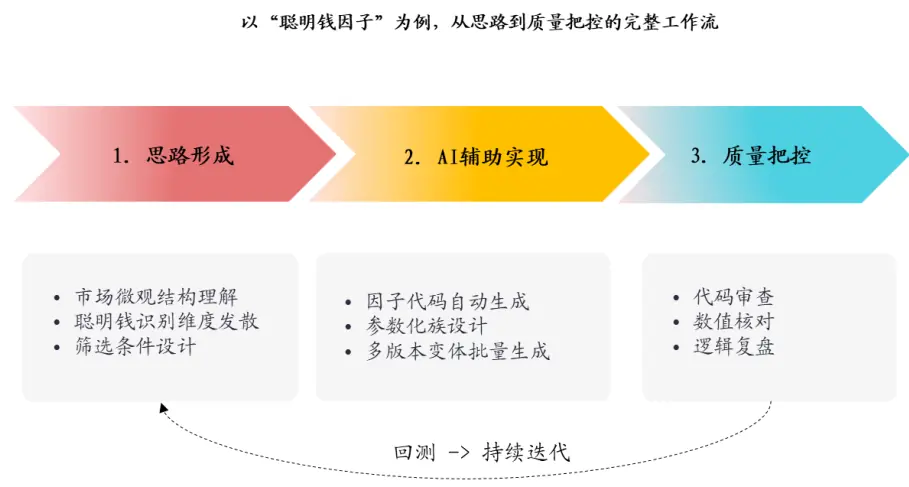
资料来源：开源证券研究所

## 2、 聪明钱因子：分钟数据层面的再思考

## 2.1、 聪明钱 2.0构造流程及绩效回顾

聪明钱因子模型的核心问题是：如何识别聪明钱的交易。大量的实证研究表明聪明钱在交易过程中往往呈现“单笔订单数量更大、订单报价更为激进”的基本特征。基于这个考虑，我们在《聪明钱因子模型的 2.0 版本》构造了用于度量交易聪明度的指标 S（表 1，步骤 2），指标 S 的数值越大，则认为该分钟的交易中有越多聪明钱参与。借助指标S，我们通过以下方法筛选聪明钱的交易：对于特定股票、特定时段的所有分钟行情数据，将其按照指标 S 从大到小进行排序，将成交量累积占比前 20%视为聪明钱的交易（表1，步骤3）。

表1：聪明钱2.0构造步骤

| 步骤1 | 对选定股票，回溯取其过去10个交易日的分钟行情数据； |
| --- | --- |
| 步骤2 | 构造指标St=\|Rtl/(Vt^0.25)，其中Rt为第t分钟涨跌幅，Vt为第t分钟成交量； |
| 步骤3 | 将分钟数据按照指标St从大到小进行排序，取成交量累积占比前20%的分钟，视为聪明钱交易； |
| 步骤4 | 计算聪明钱交易的成交量加权平均价VWAPsmart； |
| 步骤5 | 计算所有交易的成交量加权平均价VWAPall; |
| 步骤6 | 聪明钱因子 Q=VWAPsmart/VWAPall。 |

资料来源：开源证券研究所

后文将聪明钱 2.0 因子作为改进的基准（以下简称“Baseline 因子”）。该因子回测绩效如下：RankIC 为-6.4%，多空收益为16.82%，多空信息比率为 2.09。(回测设置：区间为 2021/07/01–2026/04/30；剔除 ST、停牌及上市不满 60 个交易日的股票；因子做市值行业中性化；月度调仓，双边千三扣费，10 分组；全市场回测以中证全指为多头超额基准，宽基内回测以对应宽基指数为基准。后文回测保持不变。)

图2：Baseline因子分组较为单调，但多头组欠佳
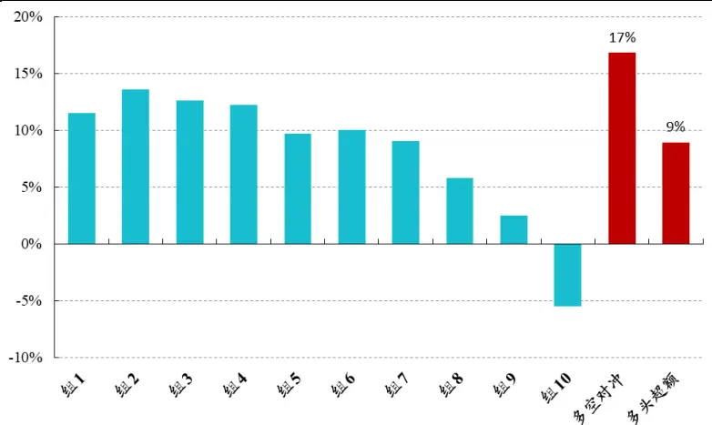
数据来源：Wind、开源证券研究所（统计区间：20210701-20260430）

表2：Baseline 因子 RankIC 为-6.40%

|  | 月度 RankIC | 年化 RankICIR | 多空对冲 |  |  |  | 多头超额(对标中证全指) |  |  |  |
| --- | --- | --- | --- | --- | --- | --- | --- | --- | --- | --- |
|  |  |  | 年化收益 | 信息比率 | 最大回撤 | 胜率 | 年化收益 | 信息比率 | 最大回撤 | 胜率 |
| Baseline | -6.40% | -3.74 | 16.82% | 2.09 | -3.10% | 71.93% | 8.95% | 0.74 | -14.00% | 63.16% |

数据来源：Wind、开源证券研究所（统计区间：20220701-20260430）

## 2.2、 分钟级聪明钱因子的再刻画

分钟层面的聪明钱识别不能仅依赖单一聪明度指标，还需引入多个市场反应维度进行辅助判断。为此，我们选取时点成交量变化、前后收益差、前后成交量比、相对收盘价位置、局部密度、时间切片六类候选维度，测试高聪明度时刻的市场反应特征，并参数化比较“先按聪明度筛选再按市场反应分高低”与“先按市场反应分位再按聪明度筛选”两种构建路径，以寻找最优组合。具体如图 3 所示。

上述所有因子的 RankIC 对比如图 4 所示。整体来看，Baseline 因子存在一定改进空间。

图3：分钟级别聪明钱因子改进体系
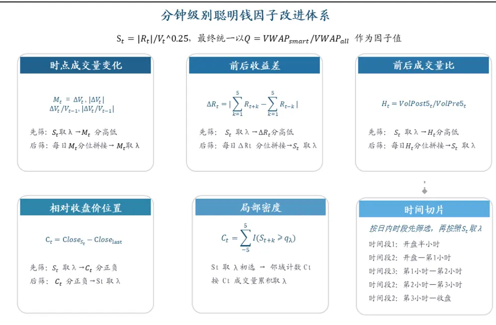
资料来源：开源证券研究所

图4：分钟级别聪明钱因子簇多空收益对比
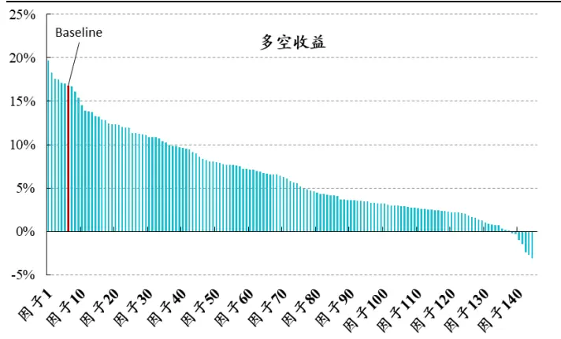
数据来源：Wind、开源证券研究所（统计区间：20210701-20260430）

图5：分钟级别聪明钱因子簇RankICIR对比
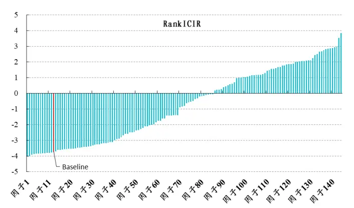
数据来源：Wind、开源证券研究所（统计区间：20210701-20260430）

在分钟层面的改进族中，我们筛选出两个绩效较优的因子：

一是 Smart_PriceImpact（聪明价格冲击因子），先计算分钟聪明度 $S_{t}$ ，再在高 $S_{t}$ 样本中筛选前后收益差较大的时刻计算 Q。其 alpha 来源于：真正的聪明钱交易往往会在短时间内引起市场价格反应，前后收益差是识别这种信息驱动型价格变化的工具，从而在高S 中二次确认出真正具有信息含量的聪明钱时刻；该因子RankIC 为-7.00%，多空年化收益为 19.69%，信息比率为 2.20。

二是 Smart_VolDecay（聪明钱成交量衰减因子），先计算分钟聪明度 $S_{t}$ ，再在高$S_{t^{\prime}}$ 样本中筛选发生后成交量相对前序显著萎缩的时刻计算 Q。其 alpha 来源于：缩量说明该价格变动并非由散户追涨杀跌驱动，更可能来自信息优势方的定向交易，从而在高 $S_{t}$ 中进一步筛选出真正具有信息含量的聪明钱时刻；该因子 RankIC 为-6.24%，多空年化收益为 17.49%，信息比率为 2.41。

最终方案将两个因子等权合成，得到 Smart_Minute_Enhanced（分钟聪明钱增强因子），合成后 RankIC 为 -6.89%，多空对冲年化收益为 20.50%，信息比率为 2.41。该因子相较于 Baseline 有一定幅度的提升，说明引入价格冲击与成交量衰减两个维度的二次筛选能够有效增强分钟级聪明钱因子的选股能力。

图6：相较于 Baseline 因子，Smart_Minute_Enhanced 因子多空对冲表现更加优异
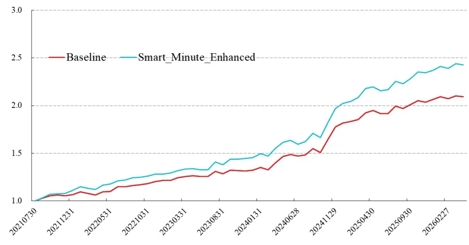
数据来源：Wind、开源证券研究所（统计区间：20210701-20260430）

表3：相较于 Baseline 因子，Smart_Minute_Enhanced 因子绩效表现更加优异

|  | 月度 RankIC | 年化 RankICIR | 多空对冲 |  |  |  | 多头超额(对标中证全指) |  |  |
| --- | --- | --- | --- | --- | --- | --- | --- | --- | --- |
|  |  |  | 年化收益 | 信息比率 最大回撤 | 胜率 |  | 年化收益 信息比率 | 最大回撤 | 胜率 |
| Baseline | -6.40% | -3.74 | 16.82% | 2.09 | -3.10% | 71.93% | 8.95% 0.74 | -14.00% | 63.16% |
| Smart_Minute_Enhanced | -6.89% | -3.69 | 20.50% | 2.41 | -2.69% | 77.19% | 10.83% 0.88 | -14.57% | 63.16% |

数据来源：Wind、开源证券研究所（统计区间：20220701-20260430）

## 3、 聪明钱因子改进：Level-2层面数据的再思考

在该部分，我们将聪明钱因子的识别粒度从分钟 K 线进一步下沉到 L2 高频数据，依次从逐笔成交、逐笔委托与盘口快照三个维度展开。在逐笔成交维度，我们直接基于单笔收益率与成交量构造聪明度指标，将识别对象下沉至单笔成交，并引入成交强度与大单过滤筛选有效成交；在逐笔委托维度，我们通过撤单比例、委托方向持续性及前后委托差异捕捉委托层面的隐藏信息；在盘口维度，我们则以买卖价差为核心，从绝对价差、相对价差、相对价差变化率三个方向刻画流动性紧张与信息交易行为。三个维度均以参数化方式构建因子族，为最终合成提供候选。如图7所示。

这里同样可以产生许多的变体，后续我们对于每一大类内部选择相对表现较优异、逻辑比较通顺的因子做举例。

图7：Level-2级别聪明钱因子改进体系
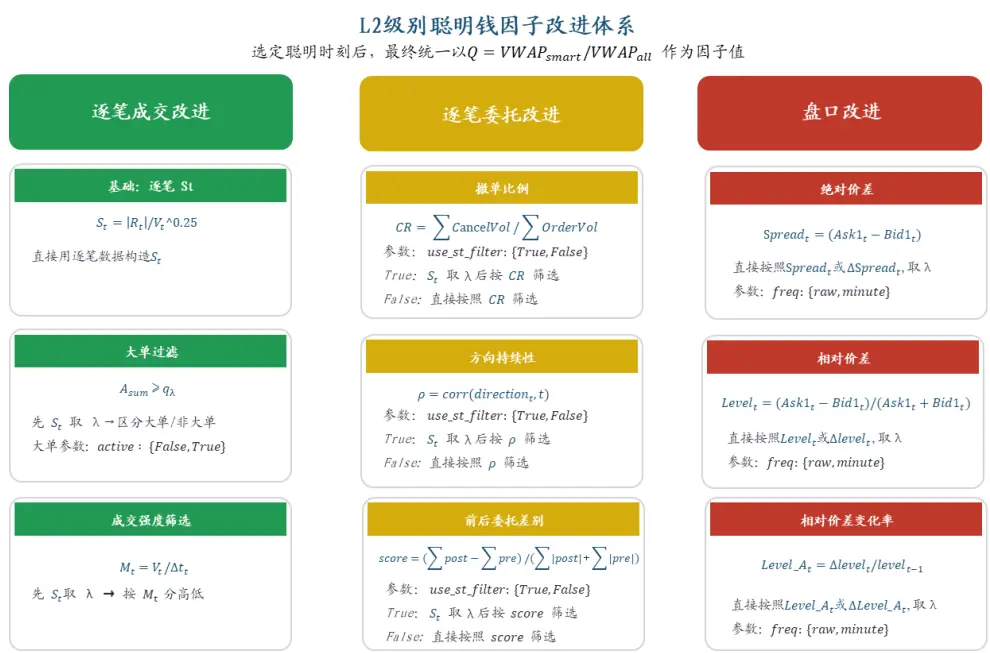
资料来源：开源证券研究所

## 3.1、 聪明钱因子改进：逐笔成交维度

在分钟级聪明钱因子中，我们主要认为高 $S_{t}$ 代表聪明钱。然而，并非所有聪明钱都采取激进的瞬时冲击方式成交——部分信息优势方出于控制冲击成本、隐藏交易意图等考虑，会选择以较为温和、缓慢的节奏执行大额交易。这种耐心执行模式下，单笔成交的价格变动有限，导致 $S_{t}$ 偏低，但成交背后的信息含量可能并不低，这一特征在逐笔成交维度更能体现。

基于此，我们构建 Smart_TradeFlow_Patient（聪明耐心执行因子）：先基于逐笔成交数据计算单笔聪明度 $S_{t}$ ，选取 $S_{t}$ 较低的尾部样本，再在其中筛选有大单参与的时刻计算 $\mathrm{Q}_{\mathrm{c}}$ 。该因子从全新维度刻画那些不追求短期价格冲击、而以较大规模耐心执行的交易行为，拓展了聪明钱因子的识别边界。

其中，若仅使用低 $S_{t}$ 样本而不区分大单参与，因子选股效果较弱，RankIC 仅为 -0.63%；而在叠加大单筛选后，Smart_TradeFlow_Patient 的 RankIC 提升至-3.61%。这一对比说明，大单参与是识别耐心执行型聪明钱的关键条件。

进 一步 地， 我们 发现相 较于 只用 Smart_Minute_Enhanced 因 子， 加入Smart_TradeFlow_Patient 因子后绩效进一步提升，二者有互补之处。

图8：相较于只用 Smart_Minute_Enhanced 因子，加入 Smart_TradeFlow_Patient因子后，多空对冲净值表现更加优异
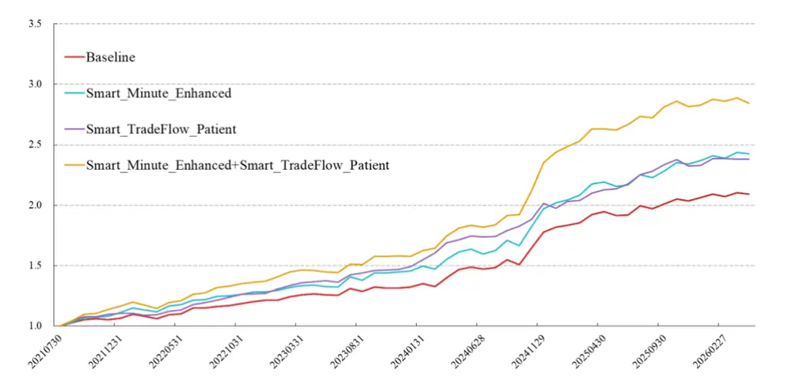
数据来源：Wind、开源证券研究所（统计区间：20210701-20260430）

表4：相较于只用 Smart_Minute_Enhanced 因子，加入 Smart_TradeFlow_Patient 因子后，绩效表现更加优异

|  | 月度 RankIC | 年化 RankICIR | 多空对冲 |  |  |  | 多头超额(对标中证全指) |  |  |  |
| --- | --- | --- | --- | --- | --- | --- | --- | --- | --- | --- |
|  |  |  | 年化收益 | 信息比率 | 最大回撤 | 胜率 | 年化收益 | 信息比率 | 最大回撤 | 胜率 |
| Baseline | -6.40% | -3.74 | 16.82% | 2.09 | -3.10% | 71.93% | 8.95% | 0.74 | -14.00% | 63.16% |
| Smart_Minute_Enhanced | -6.89% | -3.69 | 20.50% | 2.41 | -2.69% | 77.19% | 10.83% | 0.88 | -14.57% | 63.16% |
| Smart_TradeFlow_Patient | -3.61% | -2.86 | 18.75% | 2.62 | -2.45% | 80.70% | 7.44% | 0.56 | -12.08% | 56.14% |
| Smart Minute Enhanced+ Smart TradeFlow Patient | -7.29% | -4.17 | 24.63% | 2.75 | -4.23% | 75.44% | 11.63% | 0.94 | -12.80% | 61.40% |

数据来源：Wind、开源证券研究所（统计区间：20220701-20260430）

## 3.2、 聪明钱因子改进：逐笔委托维度

在逐笔委托维度，撤单相关因子的测试效果较弱，此处不展示。相比之下，基于委托方向前后变化的因子表现较好。我们据此构建 Smart_OrderFlow_Impact（聪明委托流冲击因子）：以单笔委托为锚点，衡量其前后委托方向的差别比例，选取方向变化较大的样本作为聪明钱，并使用该部分计算 Q。其 alpha 来源于：当一笔委托下单后显著改变了市场委托方向时，说明该委托对委托簿产生了实质性影响，方向差别比例越大，对应的信息优势方主动介入特征越强，聪明钱的信息含量越高。

我们将差别比例按 4 分组测算，差别最大组因子的 RankIC 为-4.29%，其次为-2.53%，再者为0.58%，差别最小组为3.71%，验证了委托方向变化对聪明钱识别具有显著的区分能力。(注：后续在处理过程中，我们也尝试了不同因子的组合，但是相较于只使用差别最大组做出的因子而言，并无明显提升)

绩效方面，Smart_OrderFlow_Impact 的 RankIC 为-4.29%，RankICIR 为-4.15，多空对冲年化收益为 20.05%，信息比率为 3.28。

图9：相较于 Baseline，Smart_OrderFlow_Impact 因子多空对冲表现更加优异
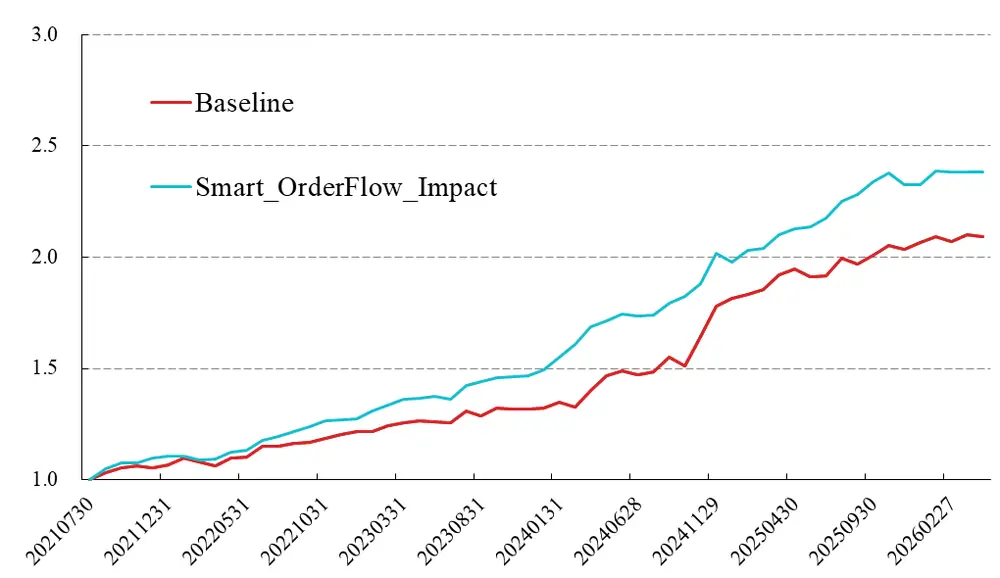
数据来源：Wind、开源证券研究所（统计区间：20200701-20260430）

表5：相较于 Baseline 因子，Smart_OrderFlow_Impact 因子绩效表现更加优异

|  | 月度 RankIC | 年化 RankICIR | 多空对冲 |  |  |  | 多头超额(对标中证全指) |  | 最大回撤 胜率 |
| --- | --- | --- | --- | --- | --- | --- | --- | --- | --- |
|  |  |  | 年化收益 | 信息比率 | 最大回撤 胜率 |  | 年化收益 信息比率 |  |  |
| Baseline | -6.40% | -3.74 | 16.82% | 2.09 | -3.10% | 71.93% | 8.95% 0.74 | -14.00% | 63.16% |
| Smart_OrderFlow_Impact -4.29% |  | -4.15 | 20.05% | 3.28 | -2.20% | 84.21% | 11.80% 0.92 | -10.94% | 66.67% |

数据来源：Wind、开源证券研究所（统计区间：20220701-20260430）

## 3.3、 聪明钱因子改进：盘口维度

在盘口维度，买卖价差是衡量流动性与交易成本的重要微观结构指标。绝对价差较小意味着盘口报价接近、流动性较好、交易成本较低，机构投资者等具有信息优势的交易方更倾向于在此类环境中执行交易；而绝对价差过大往往意味着盘口报价分歧大或流动性紧张，交易成本上升，噪音成分更高。因此，我们构建Smart_Tick_Spread（聪明价差因子）：基于 Level-2 盘口快照计算绝对价差 Spread =Ask1 -Bid1，选取绝对价差较低、流动性较好的样本作为聪明钱，并计算 Q。其 alpha来源于：在流动性充裕、交易成本较低时发生的成交，更可能来自机构投资者的主动交易，而非流动性补偿或情绪驱动的噪音交易，从而提升聪明钱的识别精度。

绩效方面，Smart_Tick_Spread 的 RankIC 为 -7.55%，RankICIR 为 -2.74，多空对冲年化收益为 17.93%，信息比率为 1.45。其相对于Baseline 因子绩效并无明显提升，而且因子的波动较大，所以后续在合成时并没有考虑这一因子。

图10：相较 Baseline 因子，Smart_Tick_Spread 因子多空对冲表现相对一般
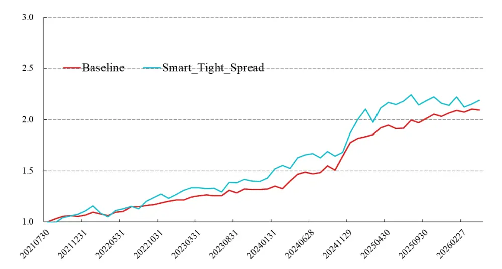
数据来源：Wind、开源证券研究所（统计区间：20220701-20260430）

表6：相较于 Baseline 因子，Smart_Tick_Spread 因子绩效表现一般

|  | 月度 RankIC | 年化 RankICIR | 多空对冲 |  |  |  | 多头超额(对标中证全指) |  |  |  |
| --- | --- | --- | --- | --- | --- | --- | --- | --- | --- | --- |
|  |  |  | 年化收益 | 信息比率 | 最大回撤 | 胜率 | 年化收益 | 信息比率 | 最大回撤 | 胜率 |
| Baseline | -6.40% | -3.74 | 16.82% | 2.09 | -3.10% | 71.93% | 8.95% | 0.74 | -14.00% | 63.16% |
| Smart_Tick_Spread | -7.55% | -2.74 | 17.93% | 1.45 | -9.10% | 64.91% | 5.42% | 0.57 | -10.40% | 54.39% |

数据来源：Wind、开源证券研究所（统计区间：20220701-20260430）

## 4、 聪明钱因子改进：综合维度

## 4.1、 聪明钱 3.0因子定义

综上所述，我们将聪明钱的识别维度从分钟层面拓展至逐笔成交、逐笔委托与盘口层面，形成分钟、成交、委托、盘口四大类候选因子。各维度从不同角度刻画聪明钱行为：分钟层面关注聪明时刻的市场反应，逐笔成交层面捕捉耐心执行的大额交易，逐笔委托层面识别对委托结构有冲击的委托流，盘口层面则筛选流动性充裕环境中的成交。各维度代表性因子的绩效对比如图 12所示，最终通过合成有效维度得到增强后的聪明钱 3.0因子。

图11：聪明钱3.0构造流程
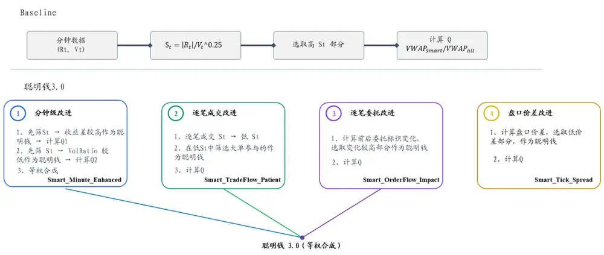
资料来源：开源证券研究所

绩效方面，聪明钱 3.0 的 RankIC 为 -7.21%，RankICIR 为 -4.30，多空对冲年化收益为 27.59%，信息比率为 3.21。

图12：相较Baseline因子，聪明钱 3.0因子多空对冲表现更加优异
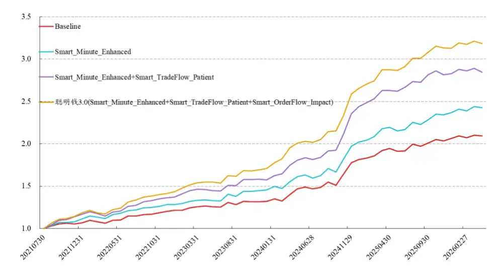
数据来源：Wind、开源证券研究所（统计区间：20220701-20260430）

表7：相较于Baseline因子，聪明钱 3.0因子绩效表现更加优异

|  | 月度 RankIC | 年化 RankICIR | 多空对冲 |  |  |  | 多头超额(对标中证全指) |  |  |
| --- | --- | --- | --- | --- | --- | --- | --- | --- | --- |
|  |  |  | 年化收益 | 信息比率 | 最大回撤 胜率 |  | 年化收益 信息比率 | 最大回撤 | 胜率 |
| Baseline | -6.40% | -3.74 | 16.82% | 2.09 | -3.10% | 71.93% | 8.95% 0.74 | -14.00% | 63.16% |
| 聪明钱3.0 | -7.21% | -4.30 | 27.59% | 3.21 | -3.39% | 80.70% | 12.65% 1.02 | -10.95% | 63.16% |

数据来源：Wind、开源证券研究所（统计区间：20220701-20260430）

## 4.2、 不同成分股下的测算

进一步地，我们探讨了聪明钱 3.0 因子在其他样本空间中的表现。月频调仓下10 分组测试效果如表 8所示。聪明钱 3.0在沪深800内 RankIC 为-4.63%，多空年化收益 9.24%、信息比率 1.48；在中证 1000 内 10 日 RankIC 为-5.35%，多空年化收益11.98%、信息比率 1.72。

表8：聪明钱3.0在不同成分股下的绩效

|  | 月度 RankIC | 年化 RankICIR | 多空对冲 |  |  | 多头超额 |  |  |  |
| --- | --- | --- | --- | --- | --- | --- | --- | --- | --- |
|  |  |  | 年化收益 | 信息比率 最大回撤 | 胜率 | 年化收益 | 信息比率 | 最大回撤 | 胜率 |
| 中证 800 | -4.63% | -2.49 | 9.24% 1.48 | -5.11% | 66.67% | 4.98% | 0.69 | -5.91% | 49.12% |
| 中证 1000 | -5.35% | -2.79 | 11.98% 1.72 | -4.29% | 64.91% | 3.62% | 0.83 | -3.27% | 57.89% |
| 全市场 | -7.21% | -4.3 | 27.59% 3.21 | -3.39% | 80.70% | 12.65% | 1.02 | -10.95% | 63.16% |

数据来源：Wind、开源证券研究所（统计区间：20220701-20260430）

## 4.3、 与 Barra 因子相关性测算

如图 13 所示，聪明钱 3.0 因子除了流动性和残差波动之外，和 Barra 因子相关性幅度基本都在 20%以内。

图13：聪明钱3.0因子与Barra因子相关性测算
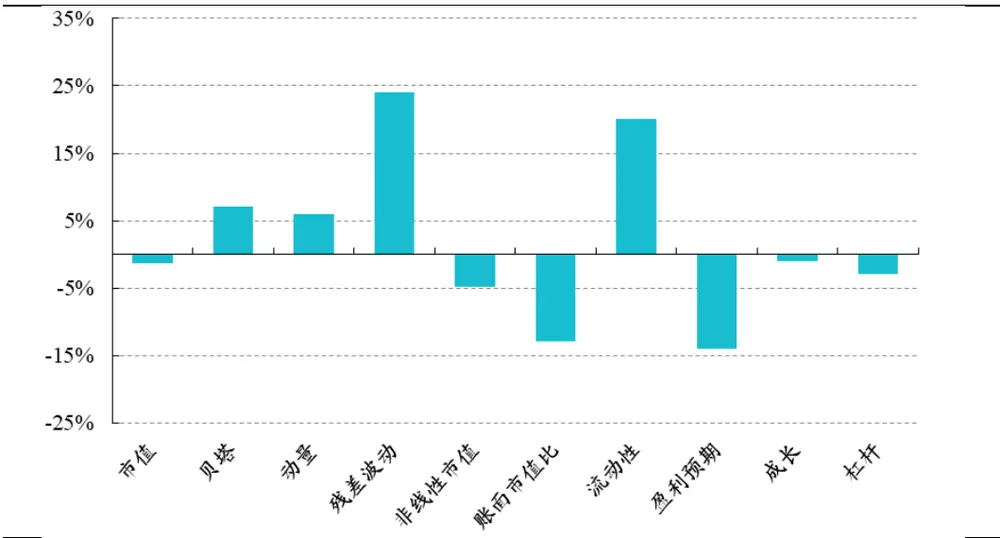
数据来源：Wind、开源证券研究所（统计区间：20220701-20260430）

## 5、 风险提示

本报告模型基于历史数据测算，市场未来可能发生重大改变。

## 特别声明

《证券期货投资者适当性管理办法》、《证券经营机构投资者适当性管理实施指引（试行）》已于2017年7月1日起正式实施。根据上述规定，开源证券评定此研报的风险等级为R3（中风险），因此通过公共平台推送的研报其适用的投资者类别仅限定为专业投资者及风险承受能力为C3、C4、C5的普通投资者。若您并非专业投资者及风险承受能力为C3、C4、C5的普通投资者，请取消阅读，请勿收藏、接收或使用本研报中的任何信息。

因此受限于访问权限的设置，若给您造成不便，烦请见谅！感谢您给予的理解与配合。

## 分析师承诺

本研究报告的署名人员具有中国证券业协会授予的证券投资咨询执业资格或相当的专业胜任能力，以勤勉的职业态度，独立、客观地出具本报告，并对内容和观点负责。本报告清晰准确地反映了署名人员的研究观点，所包含的分析基于各种假设，不同假设可能导致分析结果出现重大不同。本报告采用的各种估值方法及模型均有其局限性，估值结果不保证所涉及证券能够在该价格交易。本报告署名人员保证他们报酬的任何一部分不曾与，不与，也将不会与本报告中具体的推荐意见或观点有直接或间接的联系。

## 股票投资评级说明

|  | 评级 | 说明 |
| --- | --- | --- |
| 证券评级 | 买入（Buy） | 预计相对强于市场表现20%以上； |
|  | 增持（outperform） | 预计相对强于市场表现 5%~20%; |
|  | 中性（Neutral） | 预计相对市场表现在-5%~+5%之间波动； |
|  | 减持（underperform） | 预计相对弱于市场表现5%以下。 |
| 行业评级 | 看好（overweight） | 预计行业超越整体市场表现; |
|  | 中性（Neutral） | 预计行业与整体市场表现基本持平； |
|  | 看淡（underperform） | 预计行业弱于整体市场表现。 |
| 备注：评级标准为以报告日后的6~12个月内，证券相对于市场基准指数的涨跌幅表现，其中A股基准指数为沪深300指数、港股基准指数为恒生指数、新三板基准指数为三板成指（针对协议转让标的）或三板做市指数（针对做市转让标的)、美股基准指数为标普500或纳斯达克综合指数。我们在此提醒您，不同证券研究机构采用不同的评级术语及评级标准。我们采用的是相对评级体系，表示投资的相对比重建议；投资者买入或者卖出证券的决定取决于个人的实际情况，比如当前的持仓结构以及其他需要考虑的因素。投资者应阅读整篇报告，以获取比较完整的观点与信息，不应仅仅依靠投资评级来推断结论。 |  |  |

## 分析、估值方法的局限性说明

本报告所包含的分析基于各种假设，不同假设可能导致分析结果出现重大不同。本报告采用的各种估值方法及模型均有其局限性，估值结果不保证所涉及证券能够在该价格交易。

## 法律声明

开源证券股份有限公司是经中国证监会批准设立的证券经营机构，已具备证券投资咨询业务资格。

本公司不会因接收人收到本报告而视其为

客户。本报告是发送给开源证券客户的，属于商业秘密材料，只有开源证券客户才能参考或使用。

本报告是基于本公司认为可靠的已公开信息，但本公司不保证该等信息的准确性或完整性。本报告所载的资料、工具、意见及推测只提供给客户作参考之用，并非作为或被视为出售或购买证券或其他金融工具的邀请或向人做出邀请。本报告所载的资料、意见及推测仅反映本公司于发布本报告当日的判断，本报告所指的证券或投资标的的价格、价值及投资收入可能会波动，过往的业绩表现不应作为其日后表现的预示。在不同时期，本公司可发出与本报告所载资料、意见及推测不一致的报告。客户应当考虑到本公司可能存在可能影响本报告客观性的利益冲突，不应视本报告为做出投资决策的唯一因素。本报告中所指的投资及服务可能不适合个别客户，不构成客户私人咨询建议。本公司未确保本报告充分考虑到个别客户特殊的投资目标、财务状况或需要。本公司建议客户应考虑本报告的任何意见或建议是否符合其特定状况，以及（若有必要）咨询独立投资顾问。在任何情况下，本报告中的信息或所表述的意见并不构成对任何人的投资建议。在任何情况下，本公司不对任何人因使用本报告中的任何内容所引致的任何损失负任何责任。若本报告的接收人非本公司的客户，应在基于本报告做出任何投资决定或就本报告要求任何解释前咨询独立投资顾问。投资者应自主作出投资决策并自行承担投资风险，任何形式的分享证券投资收益或者分担证券投资损失的书面或口头承诺均为无效。

开源证券在法律允许的情况下可参与、投资或持有本报告涉及的证券或进行证券交易，或向本报告涉及的公司提供或争取提供包括投资银行业务在内的服务或业务支持。开源证券可能与本报告涉及的公司之间存在业务关系，并无需事先或在获得业务关系后通知客户。

本报告的版权归本公司所有。本公司对本报告保留一切权利。未经本公司事先书面授权，本报告的任何部分均不得以任何方式制作任何形式的拷贝、复印件或复制品，或再次分发给任何其他人，或以任何侵犯本公司版权的其他方式使用。所有本报告中使用的商标、服务标记及标记均为本公司的商标、服务标记及标记。

## 开源证券研究所

地址：上海市浦东新区世纪大道1788号陆家嘴金控广场1号
楼3层
邮编：200120
邮箱：research@kysec.cn
北京
地址：北京市西城区西直门外大街18号金贸大厦C2座9层
邮编：100044
邮箱：research@kysec.cn
深圳
地址：深圳市福田区金田路2030号卓越世纪中心1号
楼45层
邮编：518000
邮箱：research@kysec.cn
西安
地址：西安市高新区锦业路1号都市之门B座5层
邮编：710065
邮箱：research@kysec.cn