傅开波（分析师）

# 高频资金流分布因子的构建方法

2026 年 09 月 04 日

## 金融工程研究团队

证书编号：S0790520090003

魏建榕（首席分析师）

证书编号：S0790519120001

高 鹏（分析师）

证书编号：S0790520090002

胡亮勇（分析师）

证书编号：S0790522030001

## 王志豪（分析师）

证书编号：S0790522070003

## 盛少成（分析师）

证书编号：S0790523060003

## 蒋 韬（分析师）

证书编号：S0790525070001

## 常津铭（研究员）

证书编号：S0790126010044

## 赵睿（研究员）

证书编号：S0790126080032

## 相关研究报告

《分钟主动资金流中的选股信息—开源量化评论（122）》-2026.02.25《分钟资金流因子的构建方法—市场微观结构系列（31）》-2025.12.21《大单与小单资金流的 alpha 能力—市场微观结构系列（12）》-2021.6.2《主动买卖因子的正确用法—市场微观结构系列（9）》-2020.9.5

# ——市场微观结构研究系列（35）

魏建榕（分析师）

weijianrong@kysec.cn

高鹏（分析师）

证书编号：S0790519120001

gaopeng@kysec.cn

证书编号：S0790520090002

## ⚫ 资金流分布蕴含选股信息

资金流强度指标与分布：我们构建了四类资金流强度指标—净流入指标、ACT指标、净流入占比指标、SIGN 指标，来衡量分钟资金流强度。四类资金流强度指标分布存在差异：净流入指标存在绝对金额量纲，ACT 指标标准化后取值介于-1 至 1 之间，SIGN 指标相对 ACT 指标和净流入占比指标只保留了强度方向而过滤了强度水平。

资金流分布因子构造：获取股票 1 分钟大单主动资金流信息后，计算 1分钟大单主动资金流四类强度指标，进一步计算 20 个交易日 1 分钟大单主动资金流强度序列的均值、标准差、偏度、峰度指标。最后将均值、标准差、偏度、峰度指标在截面上回归股票的20日涨跌幅，所得残差分别为mean因子、std因子、skew因子、kurt 因子。SIGN 指标的 4 个资金流分布因子表现最优，mean 因子、std因子、skew 因子、kurt 因子信息比率分别为 3.53、4.39、3.46、4.41。

## ⚫ 资金流分布因子改进思路

资金流分布时段因子：mean因子、std因子、skew 因子、kurt因子的4个时段因子效果均单调下降，第 1小时资金流分布因子选股效果最优。综合选股绩效指标来看，第 1 小时的 std 因子和 kurt 因子表现优异：std 因子 RankICIR 为 4.59，信息比率为 4.62，多头组合年化收益为 19.8%；kurt 因子 RankICIR 为-4.51，信息比率为 4.5，多头组合年化收益为 19.9%。

资金流分布情景因子：符号成交额情景资金流分布因子表现整体更优，其中 mean因子和 skew 因子表现优异：mean 因子 RankICIR 为 4.16，信息比率为 4.29，多头组合年化收益为 17.7%；skew 因子 RankICIR 为-4.2，信息比率为 4.21，多头组合年化收益为 17.5%。

## ⚫ 其他相关讨论

资金流分布因子回看天数：随着回看天数由 5 天增加至 30 天，mean 因子、std因子、skew 因子、kurt因子选股效果先升后降。其中，mean 因子、std因子、skew因子的最优回看天数为 15 天，rankICIR 分别为 4.23、4.78、-4.26、kurt 因子的最优回看天数为 20 天，rankICIR 为-4.51。

资金流分布因子路径选择：我们首先计算日内分布得到日频的 mean 特征、std特征、skew 特征、kurt 特征，再进一步计算日频特征的日间分布（均值、标准差、偏度、峰度）得到最终16个资金流分布因子。从构造得到的 16个资金流分布因子的表现来看（表 9）：不同分布路径的 mean-mean 因子和 skew-mean 因子表现优异，信息比率分别为 3.33 和3.44。

资金流分布因子不同样本空间表现：在沪深 300 指数样本中，std 资金流因子和kurt 资金流因子表现较优，rankICIR 分别为 2.07 和-2.01，信息比率分别为 2.16和 2.12。在中证 500 样本中，mean 资金流因子和 skew 资金流因子表现较优，rankICIR 分别为 2.44 和-2.36，信息比率分别为 2.1 和 2.03。

⚫ 风险提示：模型测试基于历史数据，市场未来可能发生变化。

## 1、 资金流分布蕴含选股信息

## 1.1、 资金流强度指标与分布

我们在专题报告《分钟资金流因子的构建方法》（魏建榕、高鹏）、《分钟主动资金流中的选股信息》（魏建榕、高鹏）中，基于卖单和买单委托金额信息，将买单和卖单划分为超大单、大单、中单、小单四类，进一步按照逐笔成交信息汇总得到每 1分钟四类订单交易信息。如果不区分主动成交和被动成交，将所有成交的买卖订单都进行汇总，可以得到不同资金流的分钟买入金额、卖出金额和净流入金额。如果对逐笔成交进行主动成交和被动成交区分，单独对主动成交资金流进行汇总，可以得到不同资金流的分钟主动买入金额、主动卖出金额和主动净流入金额（图 1）。本文以分钟频率大单主动资金流为例，进行资金流分布因子构建。

图1：逐笔数据合成分钟资金流指标示意图

| TranID | 成交信息 |  |  | 卖单信息 |  |  |  |  |  | 买单信息 |  |
| --- | --- | --- | --- | --- | --- | --- | --- | --- | --- | --- | --- |
|  | Time |  |  |  | Price Volume Type SaleOrderlD |  | SaleOrderPrice | SaleOrderVolume BuyOrderlD |  |  | BuyOrderPrice BuyOrderVolume |
| 3070 | 9:35:04 | 9.7 | 1000 | s | 3323040 | 9.7 | 1000 |  | 2825826 | 9.7 | 36400 |
| 3071 | 9:35:04 | 9.7 | 500 | s | 3323048 | 9.7 | 500 |  | 2825826 | 9.7 | 36400 |
| 3072 | 9:35:04 | 9.7 | 600 | S | 3323050 | 9.7 | 600 |  | 2825826 | 9.7 | 36400 |
| 3073 | 9:35:04 | 9.7 | 300 | S | 3323169 | 9.7 | 300 |  | 2825826 | 9.7 | 36400 |
| 3074 | 9:35:04 | 9.7 | 600 |  | 3323171 | 9.7 | 600 |  | 2825826 | 9.7 | 36400 |
| 3075 | 9:35:04 | 9.71 | 5200 | s B | 3034744 | 9.71 | 245100 |  | 3323911 | 9.71 | 5200 |
| 3076 | 9:35:04 | 9.71 | 5000 | B | 3034744 | 9.71 | 245100 |  | 3324179 | 9.71 | 5000 |
| 3077 | 9:35:04 | 9.7 | 8700 | s | 3324487 | 9.7 | 8700 |  | 2825826 | 9.7 | 36400 |
| 3078 | 9:35:05 | 9.71 | 300 | 8 | 3034744 | 9.71 | 245100 |  | 3333090 | 9.71 | 300 |
| 3079 | 9:35:05 | 9.7 | 21700 | SS | 3337041 | 9.7 | 36900 |  | 2825826 | 9.7 | 36400 |
| 3080 | 9:35:05 | 9.7 | 700 |  | 3337041 | 9.7 | 36900 |  | 2828121 | 9.7 | 700 |
| 3081 | 9:35:05 | 9.7 | 14500 | s | 3337041 | 9.7 | 36900 |  | 2828656 | 9.7 | 15400 |
| 3082 | 9:35:05 | 9.71 | 300 | 8 | 3034744 | 9.71 | 245100 |  | 3338563 | 9.71 | 300 |
| 3083 | 9:35:05 | 9.71 | 1100 | B | 3034744 | 9.71 | 245100 |  | 3338565 | 9.71 | 1100 |
| 3084 | 9:35:05 | 9.71 | 2100 | B | 3034744 | 9.71 | 245100 |  | 3338583 | 9.71 | 2100 |
| 3085 | 9:35:07 | 9.71 | 2400 | 8 | 3034744 | 9.71 | 245100 |  | 3348030 | 9.71 | 2400 |
| 3086 | 9:35:07 | 9.7 | 900 | Ss | 3348172 | 9.7 | 1800 |  | 2828656 | 9.7 | 15400 |
| 3087 | 9:35:07 | 9.7 | 900 |  | 3348172 | 9.7 | 1800 |  | 2831181 | 9.7 | 1100 |
| 3088 | 9:35:07 | 9.7 | 200 |  | 3348231 | 9.7 | 700 |  | 2831181 | 9.7 | 1100 |
| 3089 | 9:35:07 | 9.7 | 500 | ss | 3348231 | 9.7 | 700 |  | 2832453 | 9.7 | 10000 |
| 3090 | 9:35:07 | 9.7 | 100 | s | 3348236 | 9.7 | 100 |  | 2832453 | 9.7 | 10000 |
| 3091 | 9:35:07 | 9.7 | 200 |  | 3349529 | 9.7 | 200 |  | 2832453 | 9.7 | 10000 |
| 3092 | 9:35:08 | 9.71 | 100 | sB | 3034744 | 9.71 | 245100 |  | 3362086 | 9.71 | 100 |
| 3093 | 9:35:08 | 9.71 | 2000 | 88 | 3034744 | 9.71 | 245100 |  | 3363900 | 9.71 | 2000 |
| 3094 | 9:35:08 | 9.71 | 19100 |  | 3034744 | 9.71 | 245100 |  | 3364856 | 9.71 | 19100 |
| 3095 | 9:35:09 | 9.71 | 500 |  | 3034744 | 9.71 | 245100 |  | 3370659 | 9.71 | 500 |
| 3096 | 9:35:09 | 9.71 | 600 | 88 | 3034744 | 9.71 | 245100 |  | 3370866 | 9.71 | 600 |
| 3097 | 9:35:10 | 9.71 | 2400 | B | 3034744 | 9.71 | 245100 |  | 3372072 | 9.71 | 2400 |
| 3098 | 9:35:10 | 9.7 | 100 |  | 3372292 | 9.7 | 100 |  | 2832453 | 9.7 | 10000 |
| 3099 | 9:3510 | 9.7 | 900 | ss | 3372317 | 9.69 | 900 |  | 2832453 | 9.7 | 10000 |
| 3100 | 9.35:10 | 9.7 | 800 |  | 3372357 | 9.7 | 800 |  | 2832453 | 9.7 | 10000 |
| 3101 | 9:35:10 | 9.7 | 200 | s s | 3372490 | 9.7 | 200 |  | 2832453 | 9.7 | 10000 |
| 3102 3103 | 9:35:10 9:35:10 | 9.7 9.7 | 700 200 | s s | 3372515 3372523 | 9.7 9.7 | 700 200 |  | 2832453 2832453 | 9.7 9.7 | 10000 10000 |

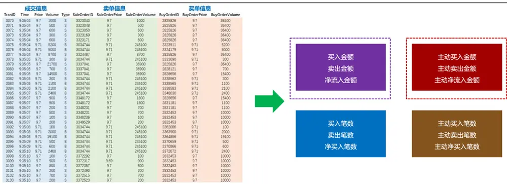
数据来源：Wind、开源证券研究所

在进行资金流分布因子构建之前，我们需要对分钟资金流强度进行衡量。表 1展示了四类资金流强度指标—净流入指标、ACT指标、净流入占比指标、SIGN 指标的对比情况。净流入指标直接使用分钟资金净流入绝对金额作为强度指标，不同股票之间的净流入水平会有差异；ACT 指标、净流入占比指标均对不同股票的净流入绝对金额进行了标准化；SIGN 指标去除了净流入强度信息，直接取净流入方向作为强度衡量。

表1：分钟资金流强度指标对比

| 指标名称 | 指标计算公式 | 含义 |
| --- | --- | --- |
| 净流入 | B-S | 分钟资金买入金额-分钟资金卖出金额 |
| ACT | (B-S) / (B+S) | (分钟资金买入金额-分钟资金卖出金额) /(分钟资金买入金额+分钟资金卖出金额) |
| 净流入占比 | (B-S) / amount | (分钟资金买入金额-分钟资金卖出金额) /分钟成交额 |
| SIGN | sign (B-S) | 分钟资金买入金额-分钟资金卖出金额的 符号，为正取1，为负取-1 |

资料来源：开源证券研究所

我们选取了2026年7月份贵州茅台分钟频率大单主动资金流，分别计算了净流入指标、ACT 指标、净流入占比指标、SIGN 指标，并将四类资金量强度指标分布图进行对比（图 2）。可以发现，四类资金流强度指标分布存在差异：净流入指标存在绝对金额量纲，ACT 指标标准化后取值介于-1至1之间，SIGN 指标相对ACT 指标和净流入占比指标只保留了强度方向而过滤了强度水平。

图2：四类资金流强度指标分布示例：贵州茅台2026年7月份
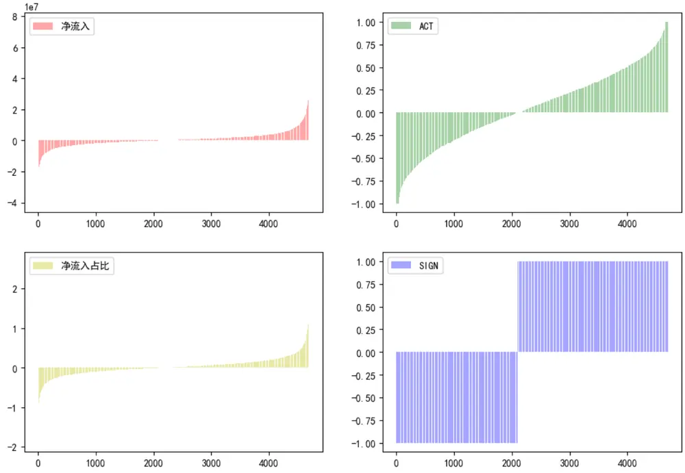
数据来源：Wind、开源证券研究所

## 1.2、 资金流分布因子构造

我们以分钟频率大单主动资金流为例，进行资金流分布因子的构造。在获取股票 1 分钟大单主动资金流信息后，计算 1 分钟大单主动资金流强度指标：净流入指标、ACT 指标、净流入占比指标、SIGN 指标。对每类强度指标，分别计算 20个交易日 1 分钟大单主动资金流强度序列的均值、标准差、偏度、峰度指标。进一步分别将均值、标准差、偏度、峰度指标在截面上回归股票的20日涨跌幅，所得残差分别为均值因子、标准差因子、偏度因子、峰度因子，记为 mean因子、std因子、skew因子、kurt因子。具体因子构造步骤见表2：

表2：大单主动资金流分布因子构造步骤

| 步骤1 | 对选定股票，取最近20个交易日的1分钟大单主动资金流数据； |
| --- | --- |
| 步骤2 | 计算1分钟大单主动资金流强度指标：净流入指标、ACT指标、净流入占比 |
|  | 指标、SIGN指标； |
| 步骤3 | 选择20个交易日所有1分钟大单主动资金流强度序列，计算均值、标准差、 偏度、峰度，得到20日大单主动资金流分布指标S; |
| 步骤4 | 将指标S在截面上回归20日涨跌幅，残差即为大单主动资金流分布因子。 |

资料来源：开源证券研究所

上述 4类强度指标搭配4个分布指标，我们共计得到 16个资金流分布因子，表3 展示了 16个资金流分布因子的绩效指标。可以看出，SIGN指标的 4个资金流分布因子表现最优，mean 因子、std 因子、skew 因子、kurt 因子信息比率分别为 3.53、4.39、3.46、4.41，整体表现显著优于净流入指标、ACT指标、净流入占比指标的资金流分布因子。在后续资金流分布因子构建中，我们均使用SIGN指标来衡量分钟资金流强度。

表3：不同资金流强度指标因子绩效指标对比

| 强度指标 | 因子 | IC 均值 | rankIC 均值 | ICIR | rankICIR | 多空对冲年 化收益 | 多头组合年 化收益 | 信息比率 |
| --- | --- | --- | --- | --- | --- | --- | --- | --- |
| 净流入 | mean | 0.046 | 0.054 | 3.08 | 3.39 | 18.5% | 15.1% | 3.12 |
|  | std | -0.042 | -0.052 | -1.89 | -2.37 | 11.2% | 11.5% | 1.36 |
|  | skew | -0.007 | -0.015 | -0.78 | -1.53 | 2.4% | 6.0% | 0.60 |
|  | kurt | -0.039 | -0.047 | -2.59 | -2.56 | 11.3% | 10.7% | 1.78 |
| ACT | mean | 0.036 | 0.042 | 3.01 | 2.93 | 15.2% | 17.0% | 3.25 |
|  | std | 0.045 | 0.066 | 1.88 | 2.58 | 14.1% | 13.9% | 1.54 |
|  | skew | -0.035 | -0.040 | -3.03 | -2.95 | 15.3% | 17.1% | 3.27 |
|  | kurt | -0.046 | -0.064 | -2.45 | -3.01 | 16.7% | 15.8% | 2.27 |
| 净流入占比 | mean | -0.009 | -0.016 | -0.76 | -1.11 | 1.7% | 14.3% | 0.32 |
|  | std | 0.032 | 0.059 | 1.56 | 2.45 | 12.4% | 16.4% | 1.39 |
|  | skew | -0.001 | 0.001 | -0.11 | 0.23 | -0.2% | 9.4% | -0.07 |
|  | kurt | -0.005 | -0.008 | -0.54 | -0.65 | 1.0% | 9.0% | 0.22 |
| SIGN | mean | 0.039 | 0.046 | 3.15 | 3.13 | 16.8% | 17.2% | 3.53 |
|  | std | 0.037 | 0.052 | 3.77 | 4.02 | 18.1% | 19.2% | 4.39 |
|  | skew | -0.039 | -0.046 | -3.16 | -3.15 | 16.6% | 17.1% | 3.46 |
|  | kurt | -0.036 | -0.050 | -3.70 | -4.07 | 18.3% | 19.7% | 4.41 |

数据来源：Wind、开源证券研究所（数据区间：20130426-20260731）

SIGN 指标构造得到的 mean 因子、std 因子、skew 因子、kurt 因子中，kurt 因子表现最优，这里我们展示 SIGN 指标下绩效表现最优的 kurt 因子五分组多空对冲曲线（图 3）。kurt 因子 IC 均值为-0.036、ICIR 为-3.7、RankIC 均值为-0.05、RankICIR为-4.07、多空对冲年化收益为18.3%、信息比率为4.41，多头组合年化收益为 19.7%。从图 3 可看出，kurt 因子多头组合收益表现优异，多空收益偏向多头组合，空头组合收益区分度不高，多空曲线稳健向上整体表现优异。

图3：代表性资金流分布因子五分组选股表现（SIGN指标 kurt因子）
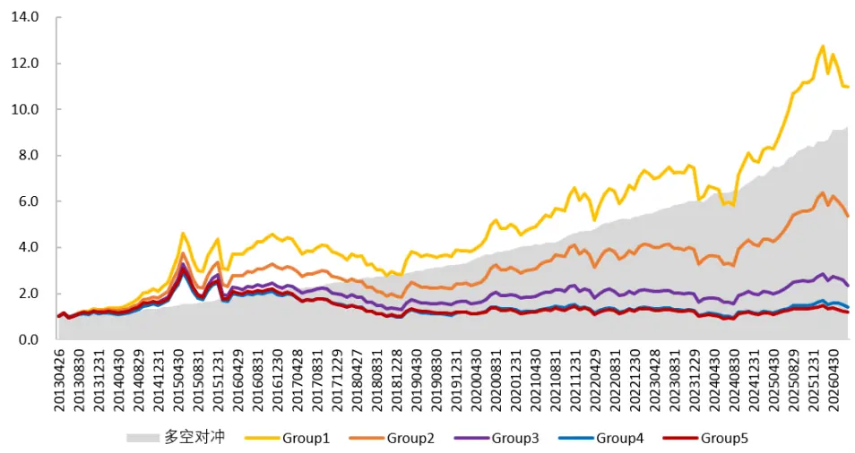
数据来源：Wind、开源证券研究所（数据区间：20130426-20260731）

## 2、 资金流分布因子改进思路

## 2.1、 资金流分布时段因子

实证研究表明，机构资金偏好在上午甚至是上午开盘时段进行交易，不同类型投资者对日内交易时段的偏好存在明显差异，因此不同时段的资金流蕴含了不同的信息。我们将日内交易时段划分为第 1 小时、第 2 小时、第 3 小时、第 4 小时，筛选出过去 20日特定时段资金流信息，构造得到不同时段的资金流分布因子。具体因子构造步骤见表 4：

表4：大单主动资金流分布时段因子构造步骤（以第1小时为例）

| 步骤1 | 对选定股票，取最近20个交易日第1小时的1分钟大单主动资金流数据； |
| --- | --- |
| 步骤2 | 计算1分钟大单主动资金流强度SIGN指标：净流入取值为1，净流入取值为 -1; |
| 步骤3 | 选择上述时段的1分钟大单主动资金流强度序列，计算均值、标准差、偏度、 峰度，得到20日大单主动资金流分布指标S; |
| 步骤4 | 将指标S在截面上回归20日涨跌幅，残差即为大单分钟主动资金流分布时段 因子。 |

资料来源：开源证券研究所

第 1 小时构造的资金流分布时段因子选股效果整体更优。对比不同时段构造的资金流分布因子选股效果可以发现（表 5）：mean 因子、std 因子、skew 因子、kurt因子的 4 个时段因子效果均单调下降，第 1 小时资金流分布因子选股效果最优。综合选股绩效指标来看，第1 小时的 std因子和kurt因子表现优异：std因子IC均值为0.035、ICIR 为 3.73、RankIC 均值为 0.054、RankICIR 为 4.59、多空对冲年化收益为17.6%、信息比率为 4.62，多头组合年化收益为 19.8%；kurt 因子 IC 均值为 0.033、ICIR 为-3.51、RankIC 均值为-0.053、RankICIR 为-4.51、多空对冲年化收益为 17.5%、信息比率为 4.5，多头组合年化收益为 19.9%。从第 1 小时的 std 因子和 kurt 因子五分组选股表现来看（图 4，图 5），两因子多头组合收益表现优异，多空收益偏向多头组合，空头组合收益区分度不高，多空曲线稳健向上。最终的 std因子和kurt因子采用第 1小时资金流数据进行构建。

表5：不同时段资金流分布因子绩效指标

| 因子 | 时段 | IC 均值 | rankIC 均值 | ICIR | rankICIR | 多空对冲年 化收益 | 多头组合年 化收益 | 信息比率 |
| --- | --- | --- | --- | --- | --- | --- | --- | --- |
| mean | 1hour | 0.041 | 0.047 | 3.80 | 3.57 | 17.3% | 18.3% | 3.83 |
|  | 2hour | 0.020 | 0.025 | 2.21 | 2.20 | 7.6% | 14.5% | 2.13 |
|  | 3hour | 0.018 | 0.022 | 1.92 | 2.05 | 7.5% | 14.0% | 1.87 |
|  | 4hour | 0.013 | 0.018 | 1.38 | 1.60 | 4.8% | 13.4% | 1.27 |
| std | 1hour | 0.035 | 0.054 | 3.73 | 4.59 | 17.6% | 19.8% | 4.62 |
|  | 2hour | 0.015 | 0.034 | 2.11 | 2.97 | 10.7% | 17.4% | 2.75 |
|  | 3hour | 0.012 | 0.032 | 1.71 | 2.80 | 11.0% | 18.4% | 2.63 |
|  | 4hour | 0.010 | 0.029 | 1.43 | 2.64 | 8.0% | 16.7% | 2.08 |
| skew | 1hour | -0.040 | -0.047 | -3.71 | -3.59 | 17.1% | 18.3% | 3.86 |
|  | 2hour | -0.020 | -0.025 | -2.13 | -2.27 | 7.6% | 14.5% | 2.13 |
|  | 3hour | -0.017 | -0.022 | -1.89 | -2.09 | 7.4% | 14.2% | 1.93 |
|  | 4hour | -0.013 | -0.018 | -1.37 | -1.68 | 5.0% | 13.4% | 1.38 |
| kurt | 1hour | -0.033 | -0.053 | -3.51 | -4.51 | 17.5% | 19.9% | 4.50 |
|  | 2hour | -0.014 | -0.034 | -1.88 | -2.82 | 10.9% | 17.5% | 2.68 |
|  | 3hour | -0.008 | -0.030 | -1.15 | -2.21 | 10.8% | 18.0% | 2.44 |
|  | 4hour | -0.007 | -0.028 | -1.07 | -2.08 | 7.9% | 16.7% | 1.94 |

数据来源：Wind、开源证券研究所（数据区间：20130426-20260731）

图4：第 1小时std因子五分组选股表现
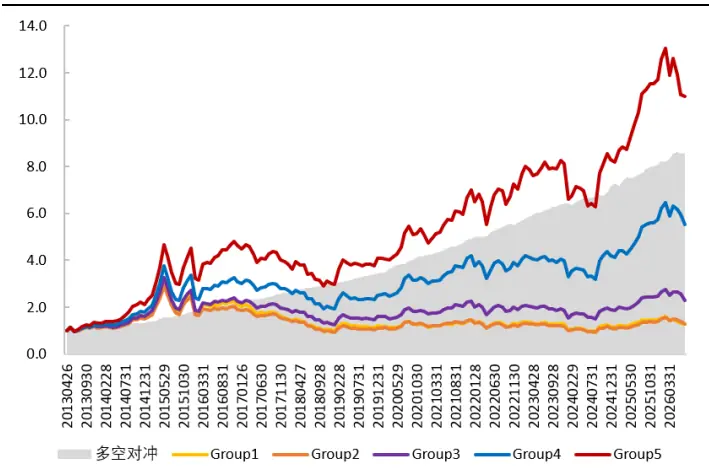
数据来源：Wind、开源证券研究所（数据区间：20130426-20260731）

图5：第 1小时 kurt因子五分组选股表现
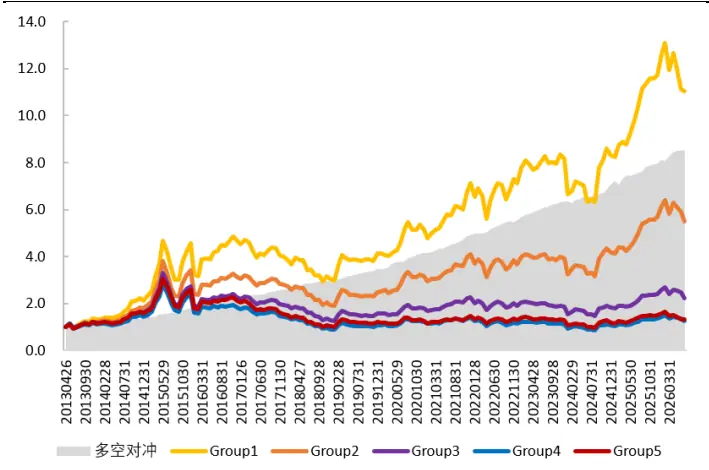
数据来源：Wind、开源证券研究所（数据区间：20130426-20260731）

## 2.2、 资金流分布情景因子

本部分我们按照市场情景状态进行划分，选出特定的交易时刻，对所有股票的这些相同的交易时刻，进行大单分钟主动资金流情景因子构造。市场情景状态划分方法上，首先选择过去 20 日第 1 小时分钟信息，计算上证指数分钟指标（1 分钟涨跌幅、5 分钟涨跌幅、符号成交额1），挑选出指数分钟指标靠前的 50%交易分钟，并选取个股对应分钟的大单主动资金流信息，构造得到大单分钟主动资金流情景因子。具体因子构造步骤见表 6：

表6：大单主动资金流情景分布因子构造步骤（以5min涨跌幅为例）

| 步骤1 | 对选定股票，取最近20个交易日第1小时的1分钟大单主动资金流数据； |
| --- | --- |
| 步骤2 | 计算1分钟大单主动资金流强度SIGN指标：净流入取值为1，净流入取值为 -1; |
| 步骤3 | 取最近20个交易日第1小时上证指数的1分钟数据，滚动计算上证指数5min 涨跌幅指标，选出指标较高的50%交易分钟； |
| 步骤4 | 选择上述时段的1分钟大单主动资金流强度序列，计算均值、标准差、偏度、 峰度，得到20日大单主动资金流分布指标S; |
| 步骤5 | 将指标S在截面上回归20日涨跌幅，残差即为大单分钟主动资金流分布情景 因子。 |

资料来源：开源证券研究所

符号成交额情景指标的资金流分布因子效果整体更优。对比不同情景指标构造的资金流分布因子选股效果可以发现（表7）：符号成交额构造的因子表现整体更优，其中 mean 因子和 skew 因子表现优异：mean 因子 IC 均值为 0.036、ICIR 为 4.07、RankIC 均值为 0.046、RankICIR为4.16、多空对冲年化收益为16%、信息比率为 4.29，多头组合年化收益为 17.7%；skew 因子 IC 均值为-0.035、ICIR 为-4.05、RankIC 均值为-0.045、RankICIR 为-4.2、多空对冲年化收益为 15.8%、信息比率为 4.21，多头组合年化收益为 17.5%。从符号成交额情景的 mean 因子和 skew 因子五分组选股表现来看（图 6，图 7），两因子多头组合收益表现优异，多空收益偏向多头组合，空头组合收益区分度不高，多空曲线稳健向上。最终的 mean 因子和 skew 因子采用符号成交额情景指标进行构建。

表7：不同情景资金流分布因子绩效指标

| 情景指标 | 因子 | IC 均值 | rankIC 均值 | ICIR | rankICIR | 多空对冲年 化收益 | 多头组合年 化收益 | 信息比率 |
| --- | --- | --- | --- | --- | --- | --- | --- | --- |
| 1分钟涨跌幅 | mean | 0.036 | 0.047 | 4.04 | 4.23 | 15.9% | 17.8% | 4.29 |
|  | std | 0.013 | 0.032 | 1.82 | 2.77 | 8.9% | 16.2% | 2.31 |
|  | skew | -0.036 | -0.047 | -4.05 | -4.28 | 15.8% | 17.8% | 4.28 |
|  | kurt | -0.010 | -0.030 | -1.40 | -2.47 | 8.7% | 16.2% | 2.02 |
| 5分钟涨跌幅 | mean | 0.038 | 0.050 | 3.85 | 4.22 | 15.9% | 18.2% | 3.87 |
|  | std | 0.008 | 0.026 | 1.21 | 2.31 | 7.8% | 15.8% | 1.83 |
|  | skew | -0.037 | -0.050 | -3.77 | -4.24 | 15.6% | 18.0% | 3.68 |
|  | kurt | -0.006 | -0.025 | -0.80 | -1.98 | 8.3% | 16.2% | 1.87 |
| 符号成交额 | mean | 0.036 | 0.046 | 4.07 | 4.16 | 16.0% | 17.7% | 4.29 |
|  | std | 0.014 | 0.033 | 2.01 | 2.79 | 9.9% | 16.5% | 2.56 |
|  | skew | -0.035 | -0.045 | -4.05 | -4.20 | 15.8% | 17.5% | 4.21 |
|  | kurt | -0.012 | -0.031 | -1.61 | -2.46 | 10.1% | 16.7% | 2.49 |

数据来源：Wind、开源证券研究所（数据区间：20130426-20260731）

图6：符号成交额情景mean因子五分组选股表现
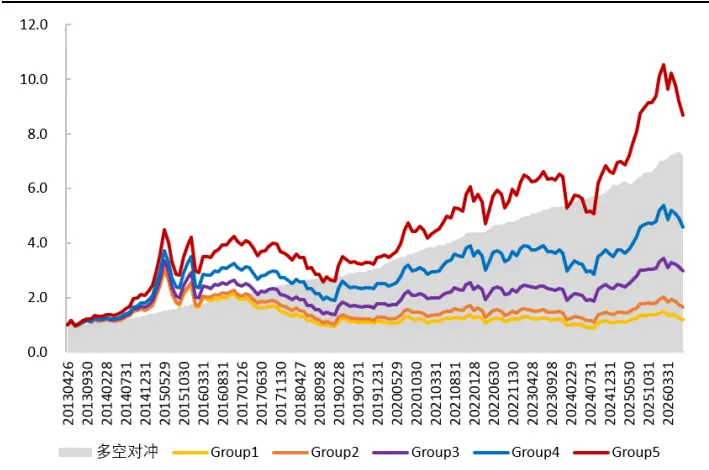
数据来源：Wind、开源证券研究所（数据区间：20130426-20260731）

图7：符号成交额情景 skew因子五分组选股表现
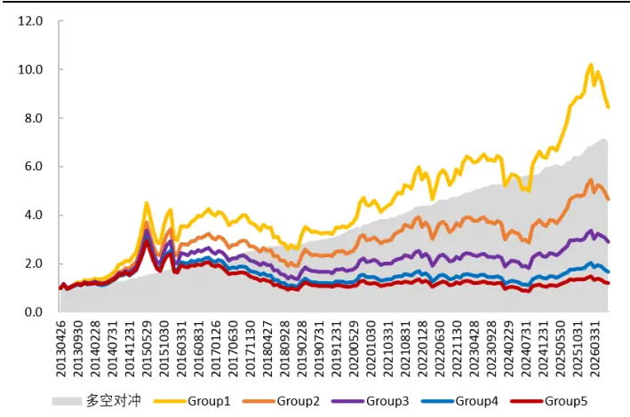
数据来源：Wind、开源证券研究所（数据区间：20130426-20260731）

我们计算资金流分布的 mean 因子、std 因子、skew 因子、kurt 因子之间的因子相关性（表8）。综合来看，mean因子和 skew 因子之间相关性、std因子和kurt因子之间相关性超过 80%，其他因子两两之间相关性不算太高，可以考虑将不同因子进行合成使用。

表8：资金流分布因子相关性矩阵

| mean 因子 | std 因子 | skew 因子 | kurt 因子 |
| --- | --- | --- | --- |
| mean 因子 1 | 0.628 | -0.877 | -0.641 |
| std 因子 | 1 | -0.639 | -0.834 |
| skew 因子 |  | 1 | 0.632 |
| kurt 因子 |  |  | 1 |

数据来源：Wind、开源证券研究所（数据区间：20130426-20260731）

## 3、 其他相关讨论

## 3.1、 资金流分布因子回看天数

我们对上述资金流分布的 mean 因子、std 因子、skew 因子、kurt 因子，测算不同回看天数的选股表现（图 8，图9）。可以发现，随着回看天数由 5天增加至30 天，mean 因子、std 因子、skew 因子、kurt 因子选股效果先升后降。其中，mean 因子、std 因子、skew 因子的最优回看天数为 15 天，rankICIR 分别为 4.23、4.78、-4.26、kurt 因子的最优回看天数为 20 天，rankICIR 为-4.51。

图8：不同回看天数下 mean 因子和 std 因子 rankICIR
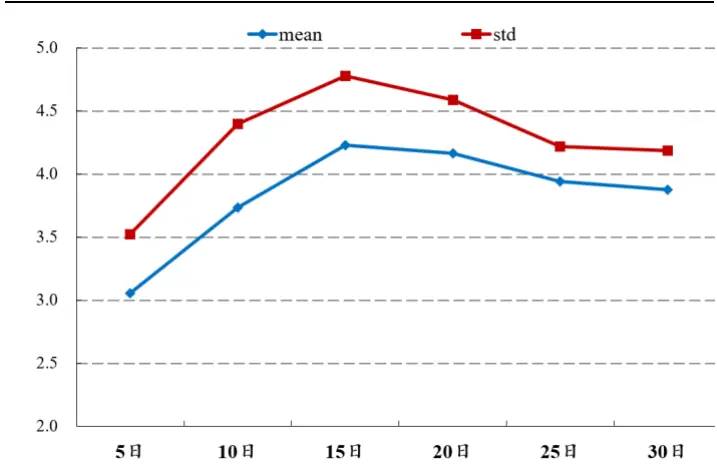
数据来源：Wind、开源证券研究所（数据区间：20130426-20260731）

图9：不同回看天数下 skew 因子和 kurt 因子 rankICIR
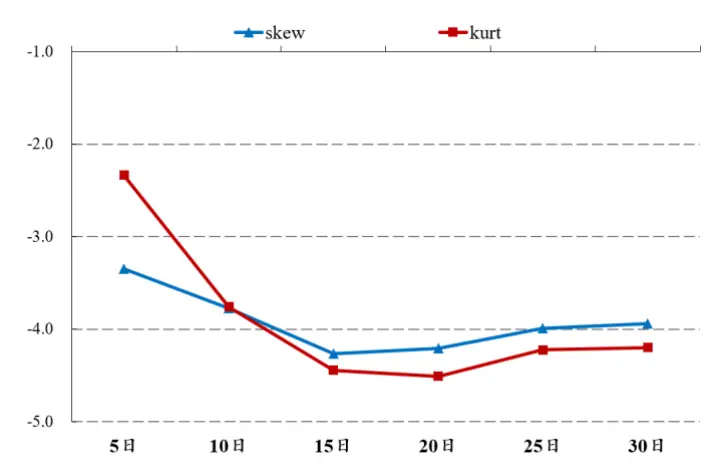
数据来源：Wind、开源证券研究所（数据区间：20130426-20260731）

## 3.2、 资金流分布因子路径选择

我们在高频数据低频化因子构建中，会存在路径选择问题：由最初逐笔频率数据最终得到月度频率因子过程中，会经历逐笔频率—分钟频率—日度频率—月度频率的降频过程。在上述资金流分布因子构建过程中，我们先是将逐笔频率数据汇总至分钟频率，然后将分钟资金流直接计算得到月度因子。在得到分钟频率资金流后，我们可以先计算每日分钟资金流的日内分布得到日频特征，后续计算日间分布得到最终月频因子。

具体因子构建上，我们首先计算日内分布得到日频的mean特征、std特征、skew特征、kurt特征，再进一步计算日频特征的日间分布（均值、标准差、偏度、峰度）得到最终 16个资金流分布因子。从构造得到的16个资金流分布因子的表现来看（表9）：不同分布路径的 mean-mean 因子和 skew-mean 因子表现优异，信息比率分别为3.33 和 3.44。

表9：资金流分布路径因子绩效指标

| 日内分布 | 日间分布 | IC 均值 | rankIC 均值 | ICIR | rankICIR | 多空对冲年 化收益 | 多头组合年 化收益 | 信息比率 |
| --- | --- | --- | --- | --- | --- | --- | --- | --- |
| mean | mean | 0.034 | 0.038 | 3.52 | 3.21 | 14.40% | 17.30% | 3.33 |
|  | std | 0.028 | 0.052 | 1.34 | 2.11 | 9.20% | 15.30% | 1.09 |
|  | skew | -0.01 | -0.009 | -1.64 | -1.41 | 4.40% | 10.40% | 1.57 |
|  | kurt | -0.008 | -0.012 | -1.15 | -1.39 | 2.30% | 9.90% | 0.71 |
| std | mean | -0.007 | -0.012 | -0.52 | -0.74 | -0.40% | 12.70% | -0.06 |
|  | std | 0.021 | 0.041 | 1.09 | 1.75 | 5.40% | 14.20% | 0.69 |
|  | skew | -0.001 | 0.003 | -0.13 | 0.34 | 0.70% | 9.80% | 0.19 |
|  | kurt | 0.002 | -0.004 | 0.24 | -0.45 | 0.90% | 9.40% | 0.26 |
| skew | mean | -0.034 | -0.04 | -3.58 | -3.41 | 13.90% | 17.50% | 3.44 |
|  | std | 0.023 | 0.044 | 1.32 | 2.18 | 7.70% | 13.90% | 1.12 |
|  | skew | -0.003 | -0.005 | -0.66 | -1.02 | 0.90% | 8.80% | 0.41 |
|  | kurt | -0.003 | -0.004 | -0.51 | -0.56 | 0.90% | 9.10% | 0.33 |
| kurt | mean | 0.008 | 0.019 | 0.61 | 1.21 | 0.80% | 12.10% | 0.15 |
|  | std | 0.016 | 0.035 | 0.98 | 1.84 | 4.50% | 12.20% | 0.67 |
|  | skew | -0.009 | -0.018 | -0.78 | -1.41 | 2.50% | 10.60% | 0.58 |
|  | kurt | -0.005 | -0.011 | -0.51 | -1.05 | 1.00% | 8.40% | 0.24 |

数据来源：Wind、开源证券研究所（数据区间：20130426-20260731）

## 3.3、 资金流分布因子不同样本空间表现

我们测算了资金流分布因子在偏大市值的沪深 300 指数和中证 500 指数样本股中的选股效果。在沪深300指数样本中，std资金流因子和kurt资金流因子表现较优，rankICIR 分别为 2.07 和-2.01，信息比率分别为 2.16 和 2.12。在中证 500 样本中，mean 资金流因子和 skew 资金流因子表现较优，rankICIR 分别为 2.44 和-2.36，信息比率分别为 2.1 和 2.03。

可以发现，资金流因子在沪深 300 和中证 500 样本中选股效果较优，多空对冲曲线均呈现向上趋势，（图 10，图 11）。相较来看，近几年高频量价因子在沪深 300和中证 500样本中选股效果均有一定失效，而资金流分布因子在沪深 300和中证500样本中选股效果维持稳健。

表10：沪深300和中证500样本空间因子绩效指标

| 样本空间 | 因子名称 | IC 均值 | rankIC 均值 | ICIR | rankICIR | 多空对冲年 化收益 | 多头组合年 化收益 | 信息比率 |
| --- | --- | --- | --- | --- | --- | --- | --- | --- |
| 沪深300 | mean | 0.038 | 0.040 | 1.93 | 1.86 | 9.4% | 7.6% | 1.49 |
|  | std | 0.046 | 0.048 | 2.18 | 2.07 | 13.4% | 10.1% | 2.16 |
|  | skew | -0.040 | -0.042 | -2.00 | -1.89 | 10.8% | 7.9% | 1.69 |
|  | kurt | -0.043 | -0.045 | -2.05 | -2.01 | 13.1% | 9.6% | 2.12 |
| 中证500 | mean | 0.037 | 0.040 | 2.35 | 2.44 | 11.3% | 10.5% | 2.10 |
|  | std | 0.039 | 0.045 | 2.43 | 2.49 | 10.7% | 10.4% | 1.64 |
|  | skew | -0.034 | -0.037 | -2.29 | -2.36 | 10.9% | 10.2% | 2.03 |
|  | kurt | -0.034 | -0.042 | -2.34 | -2.39 | 10.5% | 10.3% | 1.61 |

数据来源：Wind、开源证券研究所（数据区间：20130426-20260731）

图10：std资金流因子在沪深300样本中选股表现
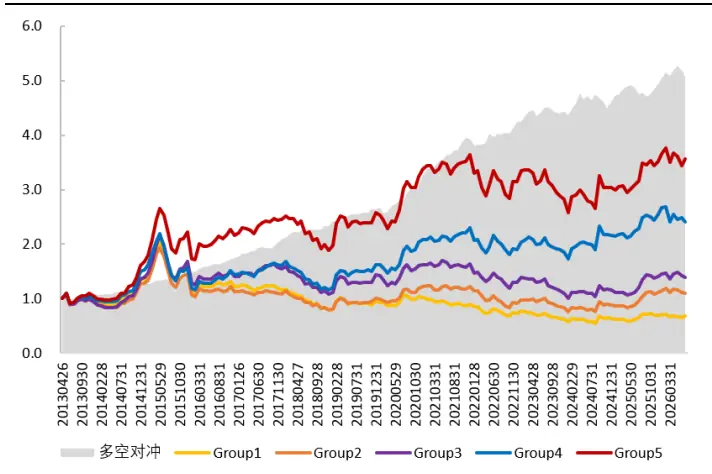
数据来源：Wind、开源证券研究所（数据区间：20130426-20260731）

图11：mean资金流因子在中证500样本中选股表现
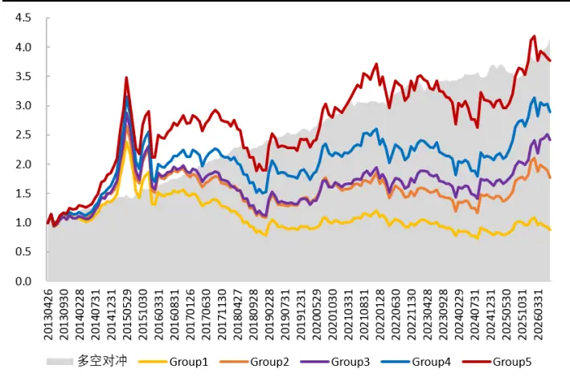
数据来源：Wind、开源证券研究所（数据区间：20130426-20260731）

## 4、 风险提示

模型测试基于历史数据，市场未来可能发生变化。

## 特别声明

《证券期货投资者适当性管理办法》、《证券经营机构投资者适当性管理实施指引（试行）》已于2017年7月1日起正式实施。根据上述规定，开源证券评定此研报的风险等级为R3（中风险），因此通过公共平台推送的研报其适用的投资者类别仅限定为专业投资者及风险承受能力为 、 、 的普通投资者。若您并非专业投资者及风险承受能力为C3、C4、C5的普通投资者，请取消阅读，请勿收藏、接收或使用本研报中的任何信息。因此受限于访问权限的设置，若给您造成不便，烦请见谅！感谢您给予的理解与配合。

## 分析师承诺

负责准备本报告以及撰写本报告的所有研究分析师或工作人员在此保证，本研究报告中关于任何发行商或证券所发表的观点均如实反映分析人员的个人观点。负责准备本报告的分析师获取报酬的评判因素包括研究的质量和准确性、客户的反馈、竞争性因素以及开源证券股份有限公司的整体收益。所有研究分析师或工作人员保证他们报酬的任何一部分不曾与，不与，也将不会与本报告中具体的推荐意见或观点有直接或间接的联系。

## 股票投资评级说明

|  | 评级 | 说明 |
| --- | --- | --- |
| 证券评级 | 买入（Buy） | 预计相对强于市场表现20%以上； |
|  | 增持（outperform） | 预计相对强于市场表现5%~20%; |
|  | 中性（Neutral） | 预计相对市场表现在-5%~+5%之间波动； |
|  | 减持（underperform） | 预计相对弱于市场表现5%以下。 |
| 行业评级 | 看好（overweight） | 预计行业超越整体市场表现; |
|  | 中性（Neutral） | 预计行业与整体市场表现基本持平； |
|  | 看淡（underperform） | 预计行业弱于整体市场表现。 |
| 备注：评级标准为以报告日后的6~12个月内，证券相对于市场基准指数的涨跌幅表现，其中A股基准指数为沪深300指数、港股基准指数为恒生指数、新三板基准指数为三板成指（针对协议转让标的）或三板做市指数（针对做市转让标的)、美股基准指数为标普500或纳斯达克综合指数。我们在此提醒您，不同证券研究机构采用不同的评级术语及评级标准。我们采用的是相对评级体系，表示投资的相对比重建议；投资者买入或者卖出证券的决定取决于个人的实际情况，比如当前的持仓结构以及其他需要考虑的因素。投资者应阅读整篇报告，以获取比较完整的观点与信息，不应仅仅依靠投资评级来推断结论。 |  |  |

## 分析、估值方法的局限性说明

本报告所包含的分析基于各种假设，不同假设可能导致分析结果出现重大不同。本报告采用的各种估值方法及模型均有其局限性，估值结果不保证所涉及证券能够在该价格交易。

## 法律声明

开源证券股份有限公司是经中国证监会批准设立的证券经营机构，已具备证券投资咨询业务资格。

本报告仅供开源证券股份有限公司（以下简称“本公司”）的机构或个人客户（以下简称“客户”）使用。本公司不会因接收人收到本报告而视其为客户。本报告是发送给开源证券客户的，属于商业秘密材料，只有开源证券客户才能参考或使用，如接收人并非开源证券客户，请及时退回并删除。

本报告是基于本公司认为可靠的已公开信息，但本公司不保证该等信息的准确性或完整性。本报告所载的资料、工具、意见及推测只提供给客户作参考之用，并非作为或被视为出售或购买证券或其他金融工具的邀请或向人做出邀请。本报告所载的资料、意见及推测仅反映本公司于发布本报告当日的判断，本报告所指的证券或投资标的的价格、价值及投资收入可能会波动。在不同时期，本公司可发出与本报告所载资料、意见及推测不一致的报告。客户应当考虑到本公司可能存在可能影响本报告客观性的利益冲突，不应视本报告为做出投资决策的唯一因素。本报告中所指的投资及服务可能不适合个别客户，不构成客户私人咨询建议。本公司未确保本报告充分考虑到个别客户特殊的投资目标、财务状况或需要。本公司建议客户应考虑本报告的任何意见或建议是否符合其特定状况，以及（若有必要）咨询独立投资顾问。在任何情况下，本报告中的信息或所表述的意见并不构成对任何人的投资建议。在任何情况下，本公司不对任何人因使用本报告中的任何内容所引致的任何损失负任何责任。若本报告的接收人非本公司的客户，应在基于本报告做出任何投资决定或就本报告要求任何解释前咨询独立投资顾问。

本报告可能附带其它网站的地址或超级链接，对于可能涉及的开源证券网站以外的地址或超级链接，开源证券不对其内容负责。本报告提供这些地址或超级链接的目的纯粹是为了客户使用方便，链接网站的内容不构成本报告的任何部分，客户需自行承担浏览这些网站的费用或风险。

开源证券在法律允许的情况下可参与、投资或持有本报告涉及的证券或进行证券交易，或向本报告涉及的公司提供或争取提供包括投资银行业务在内的服务或业务支持。开源证券可能与本报告涉及的公司之间存在业务关系，并无需事先或在获得业务关系后通知客户。

本报告的版权归本公司所有。本公司对本报告保留一切权利。除非另有书面显示，否则本报告中的所有材料的版权均属本公司。未经本公司事先书面授权，本报告的任何部分均不得以任何方式制作任何形式的拷贝、复印件或复制品，或再次分发给任何其他人，或以任何侵犯本公司版权的其他方式使用。所有本报告中使用的商标、服务标记及标记均为本公司的商标、服务标记及标记。

## 开源证券研究所

上海

地址：上海市浦东新区世纪大道1788号陆家嘴金控广场1号

楼3层

邮编：200120

邮箱：research@kysec.cn

北京
地址：北京市西城区西直门外大街18号金贸大厦C2座9层
邮编：100044
邮箱：research@kysec.cn

深圳

楼45层

地址：深圳市福田区金田路2030号卓越世纪中心1号

邮编：518000

邮箱：research@kysec.cn

西安

邮编：710065

地址：西安市高新区锦业路1号都市之门B座5层

邮箱：research@kysec.cn