## 金融工程专题

证券分析师

肖承志

资格编号：S0120521080003

邮箱：xiaocz＠tebon.com.cn

## 研究助理

## 相关研究

1. 《机器学习因子：在线性因子模型中捕获非线性—德邦金工文献精译第一期》 2021.9.17

# 金融工程中期报告利用机器学习捕捉因子的非线性效应

## ——德邦金工机器学习专题之一

## [Table_Summ投资要点：

- 证券收益与风格因子之间不止存在线性关系。本文的研究表明，在因子与收益的线性关系之外，还有很强的待挖掘的非线性关系。

- 机器学习算法可以用于挖掘非线性关系。因子与收益之间的非线性关系可能是复杂函数，而用机器学习算法可以高效地对这种非线性关系进行建模、近似。

以线性回归的残差训练机器学习模型。线性模型是具有明显含义且相对容易理解的部分。我们保留线性模型的这一优势，用机器学习模型拟合线性回归的残差。

- 机器学习的训练数据需要进行筛选和处理。训练机器学习模型时，需要选择合适的回顾期和频率。尤其重要的是，输入的回报数据需要进行标准化处理。

采用集成模型的方法降低噪音和提取信号。由于回报数据的低信噪比，机器学习模型总是在拟合信号的同时拟合了噪音，通过训练多个机器学习模型，再将多个模型的预测值取平均，以尽可能消除噪音、保留信号。

- 通过部分依赖曲线观测机器学习模型的行为。机器学习模型具有黑箱特征，但我们可以通过部分依赖曲线等工具研究其输入、输出之间的关系。通过部分依赖曲线，可以观测到各个因子的非线性贡献的强度。

因子交互效应显著。机器学习方法具有非线性特征，因此可以表征因子共同变化时产生的协同作用，称为交互效应。交互效应对机器学习因子的值具有显著的作用。

剥离机器学习因子中的风格因子。将机器学习因子对风格因子进行回归取残差，可以得到剔除风格因子线性影响后的机器学习残差因子。机器学习残差因子表现出稳定的 alpha因子特征，也是对传统多元线性回归方法的增量因子。

- 利用新构建的因子进行分组回测。利用机器学习因子分组回测可以得到很高的收益率，但第十组(多头)超额收益在 2017 年以后不显著。剔除风格因子影响后，机器学习残差因子的分组回测的第十组总体收益率下滑，但超额收益在近几年表现良好。

- 因子表现统计。我们用多元线性回归的框架统计了所有风格因子与机器学习残差因子的表现，包括t值、因子收益率、收益波动率、信息比率IR 、R2增益、最大回撤、方差膨胀因子VIF、月自相关系数等，统计结果表明，机器学习残差因子是一个显著的 alpha因子。

- 因子表现归因。机器学习因子和机器学习残差因子的选股能力来源于所有其他因子的非线性效应的集成。

- 风险提示：海外市场波动风险，宏观数据、政策变化风险，模型失效风险

## 1. 前言

我们在题为《机器学习因子：在线性因子模型中捕获非线性——德邦金工文献精译第一期》的报告中对一篇 MSCI的论文[1]进行了精译，该文献用机器学习方法和残差收益率构造了一个很好的选股因子。MSCI 论文的选股范围为全球主要发达国家的股票市场，所使用的因子是 GEMTR [2]的 22个风格因子。在本文中，我们基于CNE5[3]模型复现了A股市场的情况，即利用机器学习的方法构造自变量(CNE5的 10个风格因子)和因变量(特质收益率)之间的非线性关系。本文很大程度上借鉴了论文[1]的思路，也在一些方面处做出了改变、完善和补充。

## 2. 介绍

多元线性回归被广泛应用于多因子选股的研究和实践当中。它关注的是本期因子暴露与下一期股票回报之间的线性关系。线性在取得很大成功的同时，也包括以下几个方面的局限：

第一，模型预测的回报关于任意一个有解释力的因子的关系只可能是单调递增或者单调递减。在实际情况当中，因子的影响可能是非单调的。

第二，模型预测的回报对于因子值的敏感性是常数。在现实中，敏感性可能变化，例如，当某个因子值数值较小时，股票的回报对因子值不敏感，但当这个因子值数值较大时，股票的回报随着因子值的增加而快速变化。

第三，不同的因子之间的作用是完全解耦的，即因子间的交互作用始终等于零。实际上，两个或多个因子其共同作用的结果可能大于各自的作用的总和。除此以外，某个因子对于回报的影响方向可能依赖于其他因子的取值。例如，当因子A的值较低时，因子 B与回报之间呈现正相关；而当因子 A的值较高时，因子B与回报之间呈现负相关。

上述三种情况只能用非线性模型建模，而非线性的信息蕴含在线性回归的残差收益率当中。因此，我们应该对残差收益率进行非线性的建模。

我们把线性与非线性关系做个简单的对比：线性关系的表达式是确定的，其不确定因素仅是截距项和各个因子的收益率；非线性关系的表达式可以是任意的，其不确定因素包括函数的形式以及所有参数。由此可见，非线性拟合拥有很高的自由度，是一个复杂的问题。

本文的研究是对传统的多元线性回归框架的一次拓展。我们使用十个风格因子作为输入，用机器学习模型得到线性回归的残差的预测值，将其称为机器学习因子，并检验该因子的选股效果。在数据层面，我们使用全A市场的股票从2004年 2月至 2021年 9月的价格、因子数据。其中样本内的时间段为2009年 2月到2014年 12月，前五年的数据只用于训练而不用于回测，其余数据用于样本内回测和调参。样本外的时间段为2015年 1月到2021年 9月。我们采用滚动训练的方式，每两年训练一次模型，每次训练回顾过去约五年。我们通过分析和对比样本内外因子的表现，衡量本文构造的机器学习因子的有效性。在方法层面，从线性模型拓展到了基于机器学习的非线性模型，所用的机器学习模型包括神经网络、提升树和随机森林模型。我们对各种模型的稳定性和拟合特性进行了研究。

在样本内，我们对上述三种机器学习模型进行调参，以达到样本内最优的表现。我们通过拟合多个机器学习模型，并集成模型的输出的方式，来达到抑制噪音、突出信号的效果。结果表明，集成的方法有利于降低模型的参数敏感度，提高预测的稳健性。机器学习本身具有黑箱性质，但我们通过探索输入输出之间的关系，一定程度上探索黑箱作用的机理。

在样本外，我们使用样本内调参得到的最优模型，回测了策略的表现。我们在多元线性回归的框架中从不同的维度评价了机器学习因子的性质，包括t值、因子收益率、收益波动率、信息比率IR 、 $R^{2}$ 增益、最大回撤、方差膨胀因子 VIF、月自相关系数等。结果表明，机器学习因子与非线性市值的线性相关性较高，与其他因子的线性相关性较低，并且具有很高的信息比率和最小的回撤。

## 3. 方法

## 3.1. 回测方法

投资组合每二十个交易日进行调仓换股，即基本上每月换仓。不换仓时持股数量保持不变。回测至少涉及到模型训练和模型预测两个方面。

每两年训练一次模型，每次训练使用过去约五年的数据训练机器学习模型。训练模型时刻可得的数据截止至交易日T日，则第T−20个交易日的风格因子值X与从T− 20至T日的股票回报R构成一组训练数据，若向前滚动 20 个交易日，则可得到前一期的一组训练数据，以此类推，一共向前滚动59次，获得总共60期的数据，即可覆盖过去约五年的数据。图 1示意了上述滚动训练的流程。

图 1：滚动训练示意图
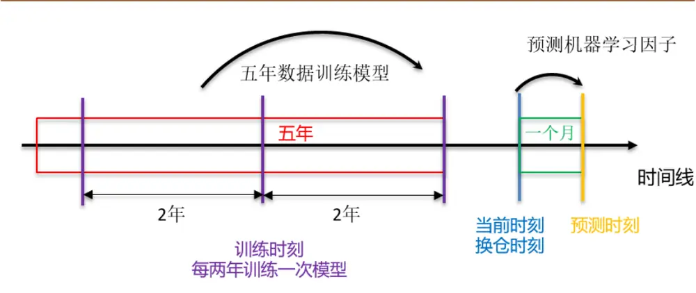
资料来源：德邦研究所

每一组训练数据对应于一个横截面，我们在横截面上用因子值 $X_{T-20}$ 对下一期的回报 $R_{T}$ 取线性回归并获得残差收益率 $\varepsilon_{T^{\circ}}$ 。线性回归可以表述为：

$$
R_{T}=X_{T-20}\cdot f_{T}+\varepsilon_{T},\tag{1}
$$

其中， $f_{T}$ 为因子收益率向量。线性回归时，可以选用普通最小二乘法(OLS)或者加权最小二乘法(WLS)。在 WLS 中，采用股票的市值的四分之一次方作为权重。WLS的好处是可以缓解线性回归的异方差问题，然而其劣势是加权线性回归所得的残差 $\varepsilon_{T}$ 与各个风格因子的线性相关系数不为零。相比之下，OLS存在异方差问题，但其残差 $\varepsilon_{T}$ 与各个风格因子的线性相关系数严格等于零。因此，在两种回归方法的选取上存在一定的取舍。本文采用 WLS回归股票收益。

回归得到全部 60期的 $X_{T-20}$ 与 $\varepsilon_{T}$ 后，用它们训练机器学习模型。训练时， $\overline{{\mathfrak{d}}}$ 以对残差 ${\bf\nabla}_{\varepsilon_{T}}$ 进行标准化处理，即计算残差 $\varepsilon_{T}$ 的 z-score 值，记为 $\tilde{\varepsilon}_{T},$ ，并用 $\tilde{\varepsilon}_{T}$ 代替 ${\bf\mathcal{E}}_{T}$ 来训练机器学习模型，通常来说，对变量进行标准化处理可以加快机器学习模型的收敛速度，从而达到更好的效果。这种做法的问题是改变了原始残差值的大小和标准差，也让模型的预测值不再具有残差收益率的意义。一方面，对于我们关注的分组回测，这一问题不会产生任何影响，因为分组回测中唯一重要的是各个股票的因子大小的排序，而标准化处理并不改变排序。另一方面，在必要的情况下，我们可以通过反 z-score处理将预测值还原为具有残差收益率含义的量。

接下来，在预测阶段，我们采用一种相对保守的方式计算因子值。在某个换仓日，我们利用前一个交易日盘后的因子值作为选股的依据。我们使用当前的模型和上一个交易日的因子计算机器学习因子，将机器学习因子从小到大排序并分为十组，进行分组回测。每一组内，设定各个股票市值等权，因此，各组的回报等于各组内的股票的回报的加权平均值。我们使用收盘价计算回报。换仓时，设定双边交易成本为千分之三。

## 3.2. 机器学习模型

我们采用神经网络、提升树和随机森林三种不同的机器学习方法。以下，我们对每种机器学习模型及其涉及到的主要参数做简单介绍。

神经网络是一种拟合非线性函数关系的有效方法，根据 Cybenko [4]提出和证明的通用逼近定理，有足够宽度（神经元个数）或深度（网络层数）的神经网络可以拟合几乎所有的函数关系。神经网络依靠迭代调节神经元之间的连接权重，来最小化损失函数的值，从而达到训练的目的。在本文中，我们采用全连接神经网络，选用均方误差作为损失函数，使用 Adam优化器进行迭代优化。我们预设每个隐藏层神经元个数相等，在此基础调节了神经网络的激发函数、深度和神经元个数。

我们使用的提升树和随机森林都是建立在使用 CART 算法的回归决策树的基础上。回归树的工作原理是根据输入特征将数据划分入一个单元，而每个单元有其对应的预测值。决策树的生成包括一系列分裂的过程，在各个节点上应用最大信息增益原则选择特征，递归构建决策树。

提升树是一种基于决策树的机器学习算法，由一组小型决策树组成[5]，每个决策树都是一个基学习器。该模型以迭代方式拟合数据，一次使用一个基学习器，每个学习器都拟合上一次迭代的残差。算法按照损失函数减小的方向更新各个子决策树，并最终从许多弱学习器中创建出一个强学习器。我们选用均方误差作为损失函数，调节了树的深度、每次拆分使用的最大特征数目以及学习率。

随机森林也是一种基于决策树的机器学习算法，使用一种名为“装袋”的过程，计算许多决策树的预测的平均值[6]。训练时，每个决策树都是通过训练数据的随机子样本生成的。我们同样使用均方误差作为损失函数，调节了树的深度、每次拆分使用的最大特征数目以及决策树的数量。由于随机森林的预测结果本身是多个模型预测的平均值，随机森林本身具有防止过拟合的机制。

## 4. 结果

## 4.1. 机器学习模型对比

按照 3.1 节所述的回测方法，我们用不同的机器学习模型回测了机器学习因子在样本内的表现，回测时间范围为2009年 2月至2014年 12月。

对于各类机器学习模型，我们均构造了不同复杂度的单一模型。神经网络模型均为具有单个隐藏层的全连接神经网络，输出层只有一个神经元且没有激发函数，复杂度为n的神经网络模型的隐藏层有4n个神经元。复杂度为n的提升树模型的最大深度为2n。复杂度为n的随机森林模型的树的数量为40n。在单一模型的基础上构造集成模型，复杂度为n的集成模型的输出是对应类型的复杂度为1,2,…,n的单一模型的输出值的算术平均值。

图 2显示了不同复杂度的单一模型和集成模型的机器学习因子的平均信息系数 IC。集成模型相对单一模型而言具有明显的优势，首先，随着复杂度的变化，其输出相对稳定，其次，集成模型的 IC通常比对应的单一模型更高。神经网络和提升树模型的单一模型的IC随着复杂度的提升呈现较快的下降，尤其是神经网络模型，而随机森林模型因为本身具有对抗过拟合的特性，其单一模型表现稳定。

高复杂度的神经网络和提升树的单一模型的表现逐渐，其可能原因是它们过多地拟合了信号中的噪声部分。实际上，单一模型都一定程度上拟合了数据中的信号成分和噪声成分，其中信号成分是稳定的，而噪声成分比较随机，当把多个单一模型的输出取平均值时，可以削弱噪声成分而增强信号成分，从而达到了更优的效果。对于神经网络模型，这一现象或可通过使用诸如随机舍弃（randomdropout）等防止过拟合的隐藏层来规避，但在本文中暂不展开讨论。

图 2：各种单一模型与集成模型的平均信息系数
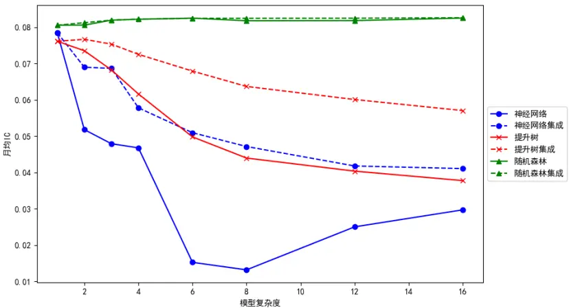
注：所有模型的训练回顾周期均为五年，训练频率均为两年一次，对于集成模型而言，同时训练其下属的单一模型。资料来源：Wind, 德邦研究所

接下来，我们进一步发挥集成的优势，将表现相对较好的三个种类的机器学习模型集成再次集成起来，以获得总集成模型。为了使得各种类型的机器学习模型在总集成模型中具有相等的波动率，我们把各类机器学习模型因子先做 z-score标准化再相加。标准化处理使得各个机器学习模型的输出在横截面上具有相等的波动率，从而同等程度地影响总集成模型的输出。总集成模型的训练频率为每两年一次。进一步地，为了避免在重训练时刻造成的模型不稳定性和相对应的股票高换手率，我们定义一种交错训练的总集成模型。除了初次训练外，交错训练的总集成模型的各个子模型都尽量在不同的时间点进行重新训练，各个子模型的重训练周期从21个月到 28个月不等。图3显示了上述各种模型的机器学习因子第十组对第一组的多空净值，总集成模型的表现优于任何单一品种机器学习模型的表现，而交错训练的总集成模型的表现最优。这再一次验证了集成方法或可提高表现的观点。

图 3：各种集成模型和总集成模型的多空净值
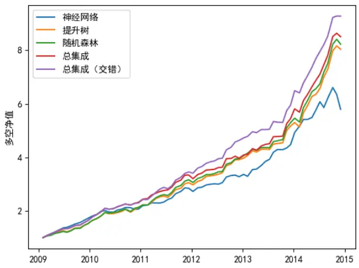
资料来源：Wind, 德邦研究所

图 4显示了各种机器学习因子的平均横截面相关系数。可以观察到，不同复杂度的神经网络模型之间的相关性较低，不同复杂度的提升树模型之间的相关系数也较低，这和图 2中这两类模型表现大幅度变化一致。不同复杂度的随机森林模型之间的相关系数很高，这和图 2中随机森林模型的稳定表现一致，同时，由于这种高相关性，随机森林模型的集成的效果并不能显著超越单一的随机森林模型。我们认为，随机森林模型的这种特性是因为模型内部已经执行过一次集成操作。另外，我们观察到低复杂度的提升树模型和随机森林模型的相关性很高。两种模型都基于决策回归树，且决策树深度这个参数取值相近，因而可以呈现出非常相似的表现。图 4中的相关系数严重依赖于各种机器模型的参数选择，因此，该结果只能作为当前参数下的参考值。

图 4：各种机器学习因子之间的平均截面相关系数

|  |  |  |  | 神经网络 |  |  | 提升树 |  |  |  |  | 随机森林 |  |  |  |  |
| --- | --- | --- | --- | --- | --- | --- | --- | --- | --- | --- | --- | --- | --- | --- | --- | --- |
|  | 参数 | 4 | 8 | 16 | 32 | 64 | 2 | 4 | 8 | 16 | 32 | 40 | 80 | 160 | 320 | 640 |
|  | 4 | 1.000 | 0.741 | 0.624 | 0.222 | 0.405 | 0.529 | 0.475 | 0.387 | 0.270 | 0.226 | 0.525 | 0.535 | 0.555 | 0.565 | 0.577 |
|  | 8 | 0.741 | 1.000 | 0.604 | 0.293 | 0.387 | 0.384 | 0.374 | 0.340 | 0.269 | 0.227 | 0.399 | 0.4150.4220.432 |  |  | 0.448 |
| 神经网络 | 16 | 0.624 | 0.604 | 1.000 | 0.676 | 0.720 | 0.303 | 0.289 | 0.276 | 0.199 | 0.141 | 0.314 | 0.318 | 0.335 | 0.340 | 0.348 |
|  | 32 | 0.222 | 0.293 | 0.676 | 1.000 | 0.874 | 0.115 | 0.124 | 0.152 | 0.100 | 0.064 | 0.095 | 0.101 | 0.120 | 0.116 | 0.118 |
|  | 64 | 0.405 | 0.387 | 0.720 | 0.874 | 1.000 | 0.197 | 0.179 | 0.187 | 0.118 | 0.074 | 0.205 | 0.203 | 0.219 | 0.213 | 0.215 |
| 提升树 | 2 | 0.529 | 0.384 | 0.303 | 0.115 | 0.197 | 1.000 | 0.882 | 0.615 | 0.353 | 0.280 | 0.896 | 0.920 | 0.936 | 0.941 | 0.942 |
|  | 4 | 0.475 | 0.374 | 0.289 | 0.124 | 0.179 | 0.882 | 1.000 | 0.806 | 0.518 | 0.404 | 0.826 | 0.864 | 0.891 | 0.886 | 0.887 |
|  | 8 | 0.387 | 0.340 | 0.276 | 0.152 | 0.187 | 0.615 | 0.806 | 1.000 | 0.689 | 0.538 | 0.617 | 0.661 | 0.690 | 0.684 | 0.693 |
|  | 16 | 0.270 | 0.269 | 0.199 | 0.100 | 0.118 | 0.353 | 0.518 | 0.689 | 1.000 | 0.697 | 0.384 | 0.407 | 0.433 | 0.425 | 0.430 |
|  | 32 | 0.226 | 0.227 | 0.141 | 0.064 | 0.074 | 0.280 | 0.404 | 0.538 | 0.697 | 1.000 | 0.306 | 0.318 | 0.341 | 0.337 | 0.342 |
|  | 40 | 0.525 | 0.399 | 0.314 | 0.095 | 0.205 | 0.896 | 0.826 | 0.617 | 0.384 | 0.306 | 1.000 | 0.965 | 0.946 | 0.939 | 0.929 |
|  | 80 | 0.535 | 0.415 | 0.318 | 0.101 | 0.203 | 0.920 | 0.864 | 0.661 | 0.407 | 0.318 | 0.965 | 1.000 | 0.977 | 0.970 | 0.964 |
| 随机森林 | 160 | 0.555 | 0.422 | 0.335 | 0.120 | 0.219 | 0.936 | 0.891 | 0.690 | 0.433 | 0.341 | 0.946 | 0.977 | 1.000 | 0.991 | 0.982 |
|  | 320 | 0.565 | 0.432 | 0.340 | 0.116 | 0.213 | 0.941 | 0.886 | 0.684 | 0.425 | 0.337 | 0.939 | 0.970 | 0.991 | 1.000 | 0.994 |
|  | 640 | 0.577 | 0.448 | 0.348 | 0.118 | 0.215 | 0.942 | 0.887 | 0.693 | 0.430 | 0.342 | 0.929 | 0.964 | 0.9820.994 1.000 |  |  |

资料来源：Wind, 德邦研究所

## 4.2. 模型稳定性

模型的输出越稳定，用模型构建的投资组合的换手率越低。我们用机器学习因子逐月的自相关系数的平均值来衡量模型的稳定性。图 5显示了各单一类机器学习模型和两个总集成模型的因子逐月自相关系数。从左子图观察到，神经网络模型的逐月自相关系数最高，提升树和随机森林的逐月自相关系数相近。对于各种机器学习模型而言，在每两年的重训练时刻，逐月因子自相关系数会显著降低。右子图显示了一般总集成模型和交错训练总集成模型的逐月因子自相关系数，这两种模型的对比清晰地显示了交错训练可以有效避免重训练导致的集中高换手率。

图 5：机器学习因子的逐月自相关系数
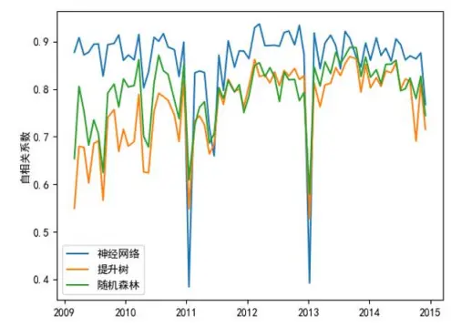
资料来源：Wind, 德邦研究所

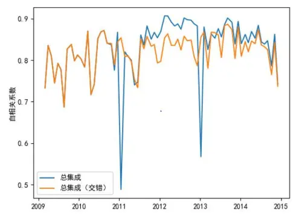

## 4.3. 部分依赖曲线

机器学习模型不根据原理进行建模，而是完全由数据驱动，这也就决定了它的黑箱性质。然而，我们可以通过观测机器学习模型的输入与输出之间的关系，在一定程度上掌握机器学习模型的性质，从而试图理解它。机器学习模型的一种常用的可视化技术是部分依赖曲线 PDP (Partial Dependence Plot)，我们绘制单一变量的 $\mathsf{PDP}$ 曲线。对于每一个自变量，都可以绘制一条 $\mathsf{PDP}$ 曲线，而其定义为：

$$
{\hat{G}}_{x_{s}}(x_{s})=E_{X_{c}}\big[{\hat{G}}(x_{s};X_{c})\big]=\int{\hat{G}}(x_{s};X_{c})dP(X_{c}),\tag{2}
$$

其中， $x_{s}$ 是作为横轴的自变量， $X_{c}$ 是所有其他自变量， $P(X_{c})$ 是其他自变量取$X_{c}$ 的概率。部分依赖的工作原理是在变量 $X_{c}$ 分布上边缘化机器学习模型输出，以便显示我们感兴趣的变量 $x_{s}$ 与预测结果之间的关系。PDP的定义是连续的，在实际运算中，样本本身的分布反映了所有自变量 $X_{c}$ 的概率分布，故可以用离散的方法来近似绘制PDP曲线。图6绘制了三种机器学习模型的所有因子的PDP曲线，可以看到，提升树和随机森林的曲线高度相似，但在细微处也有所区别，而神经网络模型的曲线则有很大的差异。

图 6：三种机器学习模型的部分依赖曲线
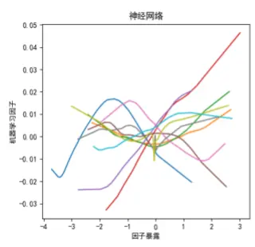

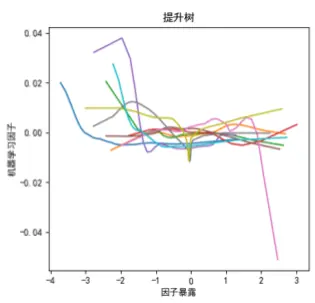

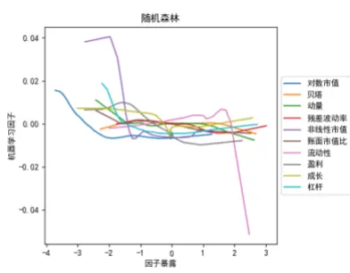
注：图中展示的部分依赖曲线是基于样本内（2015 年之前）数据训练的结果。资料来源：Wind, 德邦研究所

图 7显示了集成模型的PDP曲线，它反映了三种机器学习PDP曲线的特征。图中的每一条曲线均不是简单的直线，而呈现一系列的拐点、非单调性和凹凸性，我们也能观察出一些具有经济学意义的结论：

1）小市值溢价：对数市值、非线性市值较小的组具有较大正向特质收益。

2）高流动性损耗：流动性较大时，随着流动性的继续增加，特质收益迅速下降。

3）盈利转向：盈利因子的特质收益由正斜率变为负斜率。

4）低杠杆溢价：在杠杆率较低时，随着杠杆率的降低，特质收益迅速变大。

图 7：集成模型的部分依赖曲线
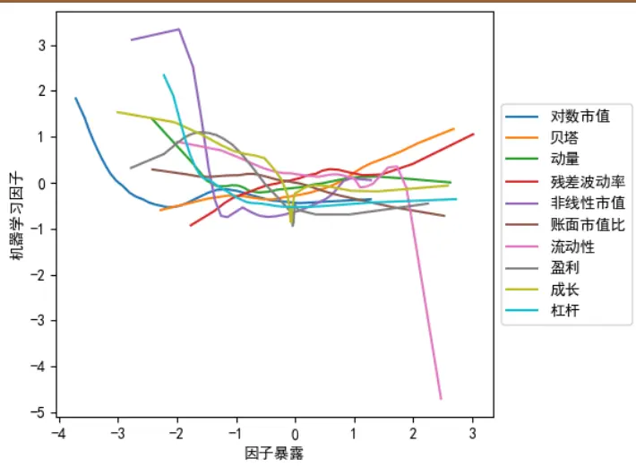
注：图中展示的部分依赖曲线是基于样本内（2015 年之前）数据训练的结果。资料来源：Wind, 德邦研究所

## 4.4. 因子重要性

因子重要性(Feature Importance)定义为单个因子对于机器学习因子的影响幅度。对任意一个因子，将因子重要性的计算方法是用其PDP曲线达到的最大值减去最小值，即极差。根据图6和图7给出的 PDP曲线，分别绘制图8所示的两类因子重要性图，对机器学习因子影响前两名的风格因子是流动性和非线性市值，这两个因子也通常是信息比率最大的两个因子。

图 8：三种机器学习模型和集成模型的因子重要性
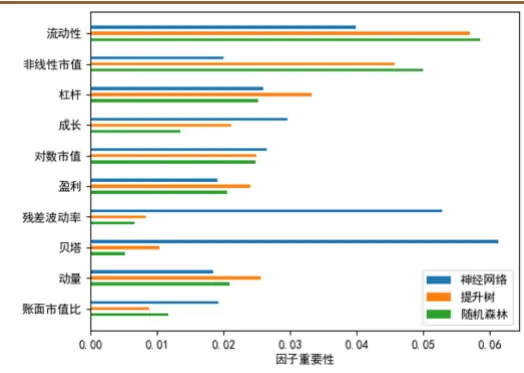

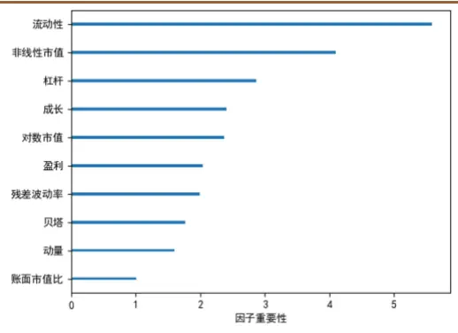
注：图中展示的因子重要性是基于样本内数据（2015 年之前）训练的结果。资料来源： 德邦研究所

## 4.5. 因子交互效应

通过部分依赖曲线和因子重要性，我们可以观测到单个风格因子对于机器学习因子的影响幅度和方式。然而，机器学习模型通常是复杂的线性模型，当两个因子共同作用时，其共同产生的效果通常与单因子变化产生的效果之和不一样。我们用图9来形象描述这种交互作用(interaction)。机器学习因子是十个风格因子的非线性函数，当我们考察两个因子 $X_{i},X_{j}$ 的交互作用时，将所有其他因子的值取为样本内各自的中位数，则两个风格因子和一个机器学习因子这三个变量构成一张三维曲面。从所有因子取值为样本中位数的中性点 O 出发，若同时变化 $X_{i},X_{j}$ 可以达到曲面上的任意点 C，该点 C 在 $X_{i},X_{j}$ 对应的坐标轴上的投影分别为 A 和B。在三维曲面上，OC之间的高度差未必等于OA高度差与 OB高度差之和，其差额就是双因子在 $\left(x_{i},x_{j}\right)$ 的交互效应 $\hat{I}\big(x_{i},x_{j}\big)$ ，它是一个二维分布。

图 9：交互效应示意图
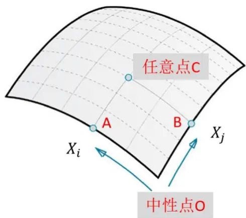
资料来源：德邦研究所

图 10显示了非线性市值和贝塔的交互作用、杠杆和非线性市值的交互作用。这两对组合在所有两两之间的交互作用中也属较为显著的两组（详见图11）。左子图中，右下角的黄色区域显示，具有高弹性的小盘股票容易产生正交互，左下角的深蓝色区域显示，具有低弹性的小盘股易产生负交互。右子图中，左下角的黄色区域表明，低杠杆的小市值股票易产生正交互；左上角的蓝色区域反映出，小市值的高杠杆股票易产生负交互。在两个图的其他区域，交互强度相对要弱很多。由此可见，交互作用在整个定义域内的分布可以呈现非常不均匀的分布。

图 10：两对因子的交互效应

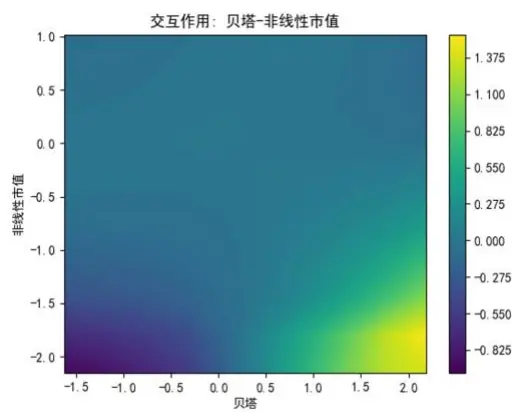
资料来源：Wind, 德邦研究所

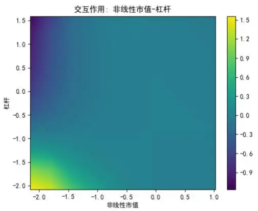

将十个风格因子两两组合，产生有45对交互作用。有的因子间交互作用效果强，而有的因子间交互作用效果弱。两个因子的交互强度 $S_{ij}$ 定义为:

$$
S_{ij}=\operatorname*{max}{\left({\hat{I}}{\left(x_{i},x_{j}\right)}\right)}-\operatorname*{min}{\left({\hat{I}}{\left(x_{i},x_{j}\right)}\right)},\tag{3}
$$

图 11显示了交互强度最强的前 20组因子。其中非线性市值、流动性两个因子常与其他因子产生较强的交互作用，这与这两个因子较高的因子重要性也是有关的。值得一提的是，账面市值比、贝塔、杠杆这几个因子虽然具有较低的重要性，但都与其他重要性高的因子一起形成了较强的因子交互效应。因此，前述因子重要性指标只是刻画了因子单独变化时的影响幅度，而因子交互作用是它们的重要补充。实际上，除了双因子交互作用外，还有更高阶的多因子交互作用，在此暂不展开讨论。

图 11：双因子交互强度前二十名
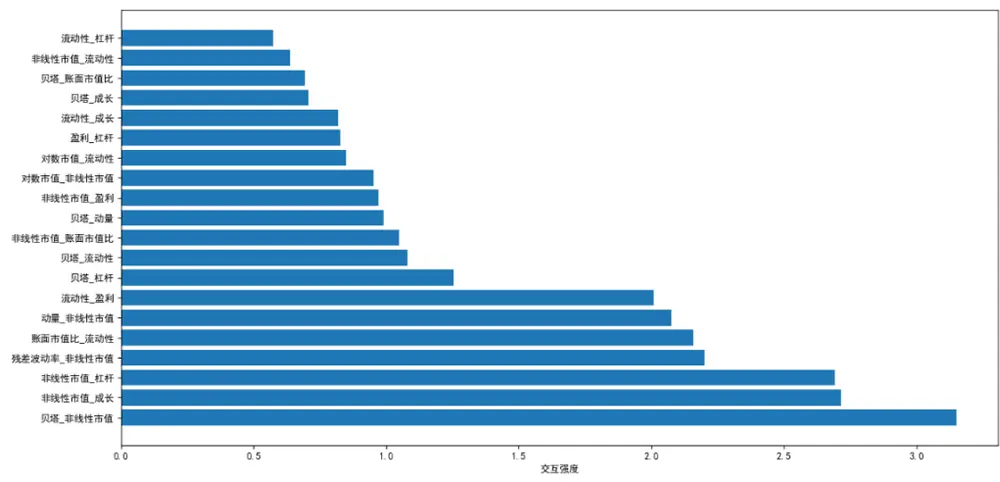
资料来源：Wind, 德邦研究所

## 4.6. 样本外表现

我们把交错训练的总模型应用到全样本，并考察其选股效果。我们按照分组回测法，把股票按照机器学习因子从小到大的次序均分为十组。图12显示了交错训练的总集成模型输出的机器学习因子在全样本内的相对于中证 500指数的分组超额收益。在全样本空间内，各组的超额收益的单调性很高，并且第一组的空头收益和第十组的多头收益都较高。

图 12：机器学习因子全样本内的分组回测年化超额收益率
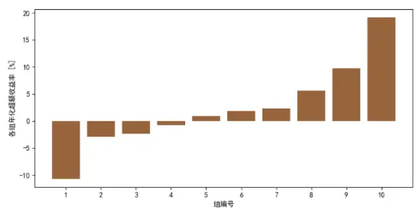
注：机器学习因子来源于交错训练的总集成模型，模型的调参基于样本内（ 年以前）的数据完成。资料来源：Wind, 德邦研究所

图 13以对数坐标绘制了十组净值曲线、第十组相对于各组平均的曲线以及第十组相对于中证500的曲线。在样本外，从2015年至2017年，策略依然能带来显著的超额收益，然而，2017年以后，不能持续带来超额收益。这是因为，第十组不仅仅在机器学习因子上有暴露，而且在十个风格因子上也有暴露，在风格因子上的暴露可能提高或者降低组合的超额回报。

图 13：机器学习因子全样本内的分组回测的净值曲线
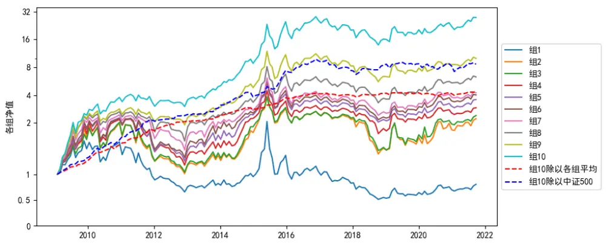
注：机器学习因子来源于交错训练的总集成模型，模型的调参基于样本内（2015 年以前）的数据完成。资料来源：Wind, 德邦研究所

我们检验机器学习因子与原始风格因子之间的线性相关性。图14展示了机器学习因子和风格因子的平均相关系数。机器学习因子和非线性市值、对数市值、动量、流动性这四个因子的平均相关系数相对较高。如3.1节所述，我们采用WLS进行线性回归，从而使得残差收益率与风格因子保留了线性相关性，这很大程度上导致了机器学习因子与风格因子间的线性相关性。经测试，如果采用OLS回归，则可以使得平均线性相关性均保持在正负 0.2以内。

我们依然采用 WLS回归的原因是一方面可以保持公式（1）不变，另一方面我们可以通过OLS回归的方法线性剔除风格因子对机器学习因子的影响，从而只需关注残差因子的表现即可。由于对其他风格因子有暴露，图 13 中的第十组在2017年之前获得的较高的超额收益率来源也来自于其他风格因子的收益；同理在2017年之后超额收益率的降低也与风格因子失效有关。因此，我们更需要研究剔除风格因子之后的机器学习因子独立贡献的部分收益。

图 14：机器学习因子和风格因子的相关系数的均值
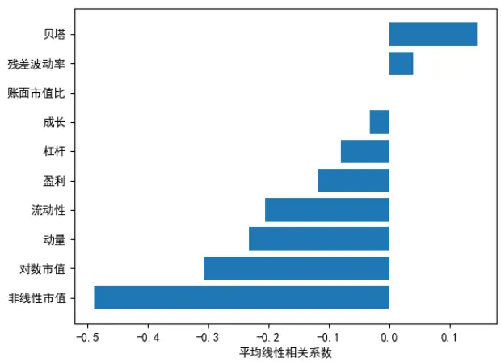
注：图中展示的是全样本内的平均相关系数。资料来源： 德邦研究所

图 15显示了机器学习因子和其他因子十二个月的平均相关系数的时间序列，在 2017年以前，高的机器学习因子暴露导致了低的流动性、市值、非线性市值暴露，这几个因子一定程度上对第十组的多头收益有所贡献。2017年以后，情况发生变化，首先，机器学习因子与流动性因子的负相关性大幅减弱，随后，机器学习因子与市值、非线性市值因子的负相关性也逐渐减弱。

图 15：机器学习因子和风格因子的相关系数的时间序列
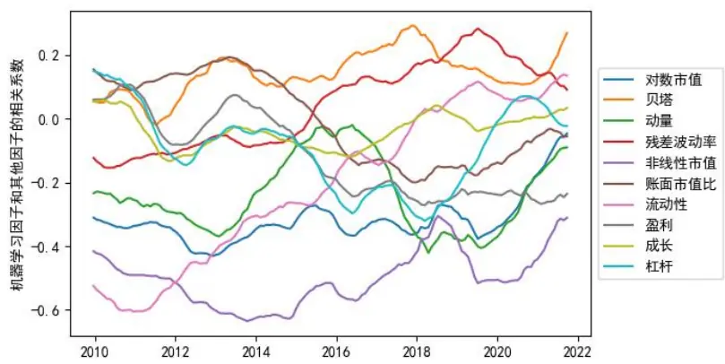
注：图中展示的是过去十二个月的平均相关系数的时间序列。资料来源：Wind, 德邦研究所

## 4.7. 机器学习因子分解

鉴于机器学习因子和某些因子相对较强的线性相关性，其选股效应既包含风格因子的非线性函数的贡献，也包括风格因子的线性组合的贡献，这让我们难以分辨出非线性部分带来的增益。因此，我们用回归法分解机器学习因子，并单独检验机器学习因子中与风格因子线性不相关部分的超额收益贡献。我们采用OLS回归的方式来剔除风格因子对机器学习因子的影响，即

$$
G(X)=X\cdot f_{G}+\varepsilon_{G},\tag{4}
$$

其中，G(X)是机器学习因子， $f_{G}$ 是线性拟合的斜率， $\varepsilon_{G}$ 是拟合残差。 $\varepsilon_{G}$ 保留了G(X)中的非线性成分，且与风格因子X的线性相关性严格等于零。我们以残差 $\varepsilon_{G}$ （以下称 $\varepsilon_{G}$ 为机器学习残差因子）作为代替原始机器学习因子，再次进行分组回测，图16显示了回测得到的各组超额收益，除了从第五组到第六组的单调性被破坏以外，其他组均保持良好地单调性，因此，在总体上机器学习残差因子的单调性较好。在剔除了风格因子的影响之后，多头年化超额收益率下降了10%，空头年化超额收益率也下降了5%。

图 16：机器学习残差因子全样本内的分组回测的年化超额收益率
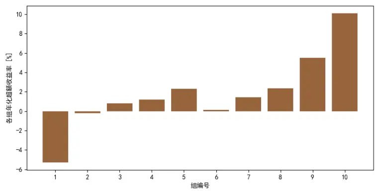
资料来源：Wind, 德邦研究所

图 17显示了各组的净值曲线，以及组十相对各组平均、中证 500的曲线。相对 10组平均而言，其超额收益一直稳定为正。相对中证500而言，其超额收益也大致稳定，然而， $\varepsilon_{G}$ 因子的超额收益能保持稳定为正，呈现了显著的 alpha 因子特征。

图 17：机器学习残差因子全样本内的分组回测的净值曲线
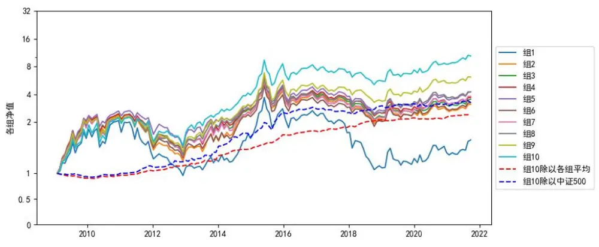
资料来源：Wind, 德邦研究所

若将机器学习残差因子 $\varepsilon_{G}$ 与风格因子一起在多元线性回归的框架中对收益进行 WLS回归，可以计算各个因子的因子收益率。图18展示了机器学习残差因子在全样本内的累积因子收益率。在起点处，累积因子收益率为零，每经过20个交易日，通过 WLS回归计算机器学习残差因子的收益率，并将该收益率加总到累积因子收益率当中。从 2009 年至 2021年间，A股市场经历过多轮的牛市、熊市、震荡市，市场的风格经历过明显的转变，市场波动率在此期间也发生过显著的变化。即使如此，机器学习残差因子的表现非常稳定，其累积收益率随着时间稳定增加且回撤幅度非常小。

图 18：机器学习残差因子的累积回报曲线
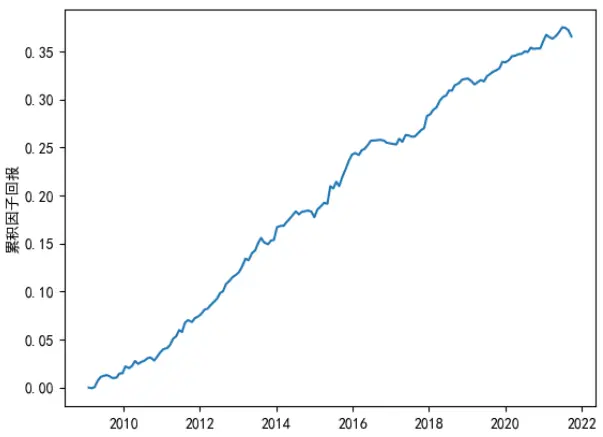
资料来源：Wind, 德邦研究所

表 1 统计了含有机器学习残差因子的多元线性 WLS 回归统计量。信息比率是因子收益率与收益波动率的比值。其中，因子收益率与收益波动率都是按20个交易日计算的。

计算交叉验证R2时，将每一期的数据分为训练和测试集，在训练集上进行线性回归，将模型应用于测试集，并计算模型预测值在测试集上的可决系数 $R^{2}$ ；首先，计算包含所有因子的回归模型的交叉验证 $.R^{2}$ ，随后，逐个计算排除某个因子后的交叉验证 $R^{2}$ ，前者与后者的差即为该因子带来的交叉验证R2增益。

计算最大回撤时，对于回报为正的因子，取一个对该因子暴露为 1的投资组合，并计算该组合的最大回撤；对于回报为负的因子，则取一个对该因子暴露为-1的投资组合并计算最大回撤。

对于某个因子x，方差膨胀因子的定义为：

$$
VIF_{\mathrm{x}}=\frac{1}{1-R_{x}^{2}},\tag{5}
$$

其中， $R_{x}^{2}$ 为用其他所有因子对因子x的线性可决系数。

虽然机器学习残差因子的交叉验证的R2增益并不算高，但它具有很高的信息比率、最小的波动率、最小的回撤，此外，它还具有最低的月自相关系数；由于机器学习残差因子与其他因子线性不相关，其方差膨胀因子恰好等于1。此外，表 1还表明，流动性和非线性市值都具有显著为负的信息比率，回顾图 13，机器学习因子与这两个因子的强负相关性，在很大程度上解释了机器学习因子G(X)的在全样本空间的回测表现强于机器学习残差因子 $\varepsilon_{G}$ 的原因。然而，我们的关注重点是通过非线性关系构造的增量信息，即 $\textstyle|{\varepsilon_{G}},$ ，而非原始风格因子的线性组合带来的收益。机器学习因子作为一个单因子，集成了所有其他因子的非线性成分，因此，基础因子数量越多，机器学习因子便可集成越多信息，并有望构造一个有强大选股能力的因子。

表 1：含有机器学习残差因子的多元线性回归统计量

|  | 平均 tl | \|t\|>2 比例 (%) | 因子 收益率 (%) | 收益 波动率 (%) | 信息比率 | 交叉验证 R²增益 (bp) | 因子 最大回撤 (%) | 因子 | 方差膨胀月自相关 系数 |
| --- | --- | --- | --- | --- | --- | --- | --- | --- | --- |
| 对数市值 | 6.23 | 81.94 | -2.82 | 5.15 | -0.55 | 106.7 | 21.20 | 4.20 | 0.99 |
| 贝塔 | 4.81 | 71.61 | 5.04 | 4.72 | 1.07 | 119.3 | 4.62 | 2.12 | 0.85 |
| 动量 | 3.83 | 63.87 | 4.09 | 4.27 | 0.96 | 81.9 | 6.97 | 2.03 | 0.85 |
| 残差波动率 | 3.38 | 56.77 | -2.87 | 3.81 | -0.76 | 68.2 | 11.14 | 1.36 | 0.89 |
| 非线性市值 | 2.90 | 53.55 | -4.50 | 2.50 | -1.80 | 56.2 | 1.89 | 1.53 | 0.98 |
| 账面市值比 | 3.05 | 60.65 | 0.32 | 3.45 | 0.09 | 44.8 | 11.13 | 2.14 | 0.98 |
| 流动性 | 4.08 | 69.68 | -7.57 | 3.25 | -2.33 | 88.8 | 3.27 | 1.90 | 0.93 |
| 盈利 | 2.69 | 52.90 | 0.27 | 2.70 | 0.10 | 32.5 | 11.35 | 2.00 | 0.92 |
| 成长 | 1.56 | 30.97 | 0.30 | 1.44 | 0.21 | 13.9 | 7.92 | 1.14 | 0.94 |
| 杠杆 | 2.63 | 52.26 | -0.77 | 2.46 | -0.31 | 27.8 | 5.87 | 2.56 | 0.99 |
| ML 残差因子 | 2.93 | 58.06 | 2.92 | 1.29 | 2.26 | 58.8 | 0.96 | 1.00 | 0.74 |

注：ML 残差因子即机器学习残差因子，因子收益率和收益波动率均按二十个交易日度量资料来源：Wind，德邦研究所

作为对比，表 2列举了不含机器学习残差因子的多元线性回归的统计量。如果使用 OLS，则风格因子的统计量与表 1 完全一致。但是，由于我们使用的是WLS，统计量相对表1发生了微小的变化。因为变化足够小，可以认为机器学习残差因子并不影响风格因子的性质和效果，因此，机器学习残差因子是一个新增的具有显著选股能力的独立因子。

表 2：不含机器学习残差因子的多元线性回归统计量

|  | 平均 Itl | \|t\|>2 比例 (%) | 因子 收益率 (%) | 收益 波动率 (%) | 信息比率 | 交叉验证 R²增益 (bp) | 因子 最大回撤 (%) | 因子 | 方差膨胀月自相关 系数 |
| --- | --- | --- | --- | --- | --- | --- | --- | --- | --- |
| 对数市值 | 6.22 | 80.65 | -3.35 | 5.16 | -0.65 | 106.6 | 18.79 | 4.20 | 0.99 |
| 贝塔 | 4.79 | 70.97 | 4.59 | 4.74 | 0.97 | 119.3 | 4.65 | 2.12 | 0.85 |
| 动量 | 3.88 | 63.23 | 4.35 | 4.31 | 1.01 | 81.9 | 6.82 | 2.03 | 0.85 |
| 残差波动率 | 3.42 | 58.71 | -3.05 | 3.88 | -0.80 | 68.2 | 11.25 | 1.36 | 0.89 |
| 非线性市值 | 2.71 | 55.48 | -3.39 | 2.41 | -1.41 | 56.2 | 2.29 | 1.53 | 0.98 |
| 账面市值比 | 3.05 | 63.87 | 0.24 | 3.44 | 0.07 | 44.7 | 11.35 | 2.14 | 0.98 |
| 流动性 | 4.00 | 69.68 | -7.11 | 3.27 | -2.17 | 88.8 | 3.18 | 1.90 | 0.93 |
| 盈利 | 2.69 | 54.19 | 0.83 | 2.70 | 0.31 | 32.5 | 10.18 | 2.00 | 0.92 |
| 成长 | 1.56 | 30.97 | 0.26 | 1.45 | 0.18 | 13.9 | 8.27 | 1.14 | 0.94 |
| 杠杆 | 2.52 | 52.90 | -0.16 | 2.35 | -0.07 | 27.8 | 6.14 | 2.56 | 0.99 |

注：因子收益率和收益波动率均按二十个交易日度量
资料来源：Wind，德邦研究所

## 5. 结论

本文研究的问题是如何利用机器学习模型对线性回归的残差进行建模(捕捉残差和自变量之间的非线性关系)，并通过模型得到对于残差的预测因子。该因子具有显著的alpha因子的特点。研究表明，因子对于收益率的影响并非是线性的，在线性回归的残差当中，还可以挖掘出大量有效的信息。我们的模型在全 A股市场进行选股，并使用 CNE5中十个风格因子作为输入。我们首先用 WLS 回归风格因子和股票收益率之间的关系，随后，再用机器学习模拟拟合风格因子和回归的残差收益率之间的关系。这样做的好处是在保留传统线性模型的同时，用非线性的方法捕捉残差收益率中的信息。

我们用到的机器学习方法包括神经网络、提升树和随机森林模型，并尝试了各种模型在各种复杂度下的表现。对于各种类机器学习模型的单一模型，用算术平均的方法构建了集成模型，并验证了集成模型的效果通常优于对应复杂度的单一模型。接着，我们把三种类型的机器学习集成模型的输出先做z-score标准化再相加，从而构建了总集成模型。总集成模型的表现优于任何单一类型的机器学习集成模型。集成的方法之所以能够带来更好的表现，主要是因为回报和因子数据中含有比较强的噪音，不同的机器学习模型都一定程度上拟合到了信号和噪音，当信号相对稳定，噪音相对随机时，噪音会相互削弱，而信号可以加强。进一步，我们交错训练总集成模型中的各个子模型，达到了更好的效果。交错训练的好处是利用到不同时间段的数据，避免集中训练模型时刻导致的模型预测值突变和随之而来的突发高换手率。

机器学习模型具有黑箱特征，我们用部分依赖曲线、因子重要性和因子交互效应衡量了机器学习模型的特性，并分析了各个因子对于机器学习因子的贡献程度和方式。对于许多因子的部分依赖曲线，我们给出了具有经济学意义的解释。我们注意到，因子间的交互效应对于机器学习因子的值具有显著的贡献，是不可忽视的因素。

我们在样本内调节机器学习模型的参数，并把调参的模型应用于整个样本，发现机器学习模型取得了较好的选股效果，在2017年后不再存在超额收益。我们分析了机器学习因子和风格因子的相关系数，发现了一些与机器学习因子高度线性相关的风格因子，因此，机器学习因子的选股效果不完全基于非线性部分。我们认为，风格因子在2017年之前产生了正面的贡献，而在 2017年之后产生了负面的效应。因此，我们将机器学习因子拆分为风格因子的线性组合部分和线性不相关部分，并将后者称为机器学习残差因子。通过对机器学习残差因子的回测，我们发现它一直具有稳定的正超额回报，呈现显著的alpha因子的特征。

最后，我们用多因子的框架对所有的风格因子和机器学习残差因子进行了评价，发现机器学习残差因子在所有因子中具有相对好的选股效果，而且其选股能力相对稳定，不随市场的风格、波动率、总体收益情况而发生显著变化。此外，在WLS 回归的框架中，加入机器学习残差因子并不会对原始的风格因子的收益率、波动率等产生显著影响。机器学习残差因子作为一个单因子，却集成了众多的基础因子的非线性效应。集成的优势在于叠加和分散风险，而这或许正是机器学习残差因子的强大选股能力的来源。基于此，随着基础因子数量的增多，机器学习残差因子的选股能力也有望逐渐提高。

## 6. 参考文献

[1] Bonne, G., Wang, J., and Zhang, H., 2021. “Machine Learning Factors: Capturing Nonlinearities in Linear Factor Models” MSCI Research Insights.

[2] Menchero, J., Morozov, A., and Shepard P., 2010. "Global equity risk modeling." Handbook of Portfolio Construction. Springer, Boston, MA. 439-480.

[3] Orr, D. J., Mashtaler, I., Nagy, A. 2012. “The Barra China Equity Model (CNE5)” MSCI Model Insight.

[4] Cybenko, G., 1989. “Approximation by Superpositions of a Sigmoidal Function. Mathematics of Control” Signals, and Systems, 2, 303-314.

[5] Sutton, C. D., 2005 "Classification and regression trees, bagging, and boosting" Handbook of statistics.

[6] Andy, L., Wiener, M., 2002 "Classification and regression by random forest." R news 2(3), 18-22.

## 7. 风险提示

海外市场波动风险，宏观数据、政策变化风险，模型失效风险。

## 信息披露

## 分析师与研究助理简介

肖承志，同济大学应用数学本科、硕士，现任德邦证券研究所首席金融工程分析师。具有 6 年证券研究经历，曾就职于东北证券研究所担任首席金融工程分析师。致力于市场择时、资产配置、量化与基本面选股。撰写独家深度“扩散指标择时”系列报告；擅长各类择时与机器学习模型，对隐马尔可夫模型有深入研究；在因子选股领域撰写多篇因子改进报告，市场独家见解。

## 分析师声明

本人具有中国证券业协会授予的证券投资咨询执业资格，以勤勉的职业态度，独立、客观地出具本报告。本报告所采用的数据和信息均来自市场公开信息，本人不保证该等信息的准确性或完整性。分析逻辑基于作者的职业理解，清晰准确地反映了作者的研究观点，结论不受任何第三方的授意或影响，特此声明。

## 投资评级说明

| 1. 投资评级的比较和评级标准：以报告发布后的6个月内的市场表现为比较标准，报告发布日后6个月内的公司股价（或行业指数）的涨跌幅相对同期市场基准指数的涨跌幅；2. 市场基准指数的比较标准：A股市场以上证综指或深证成指为基准；香港市场以恒生指数为基准；美国市场以标普500或纳斯达克综合指数为基准。 | 类别 | 评级 | 说明 |
| --- | --- | --- | --- |
|  | 股票投资评级 | 买入 | 相对强于市场表现20%以上； |
|  |  | 增持 | 相对强于市场表现 5%~20%； |
|  |  | 中性 | 相对市场表现在-5%~+5%之间波动； |
|  |  | 减持 | 相对弱于市场表现5%以下。 |
|  | 行业投资评级 | 优于大市 | 预期行业整体回报高于基准指数整体水平10%以上； |
|  |  | 中性 | 预期行业整体回报介于基准指数整体水平-10%与10%之间； |
|  |  | 弱于大市 | 预期行业整体回报低于基准指数整体水平10%以下。 |

## 法律声明

。本公司不会因接收人收到本报告而视其为客户。在任何情况

下，本报告中的信息或所表述的意见并不构成对任何人的投资建议。在任何情况下，本公司不对任何人因使用本报告中的任何内容所引致的任何损失负任何责任。

本报告所载的资料、意见及推测仅反映本公司于发布本报告当日的判断，本报告所指的证券或投资标的的价格、价值及投资收入可能会波动。在不同时期，本公司可发出与本报告所载资料、意见及推测不一致的报告。

市场有风险，投资需谨慎。本报告所载的信息、材料及结论只提供特定客户作参考，不构成投资建议，也没有考虑到个别客户特殊的投资目标、财务状况或需要。客户应考虑本报告中的任何意见或建议是否符合其特定状况。在法律许可的情况下，德邦证券及其所属关联机构可能会持有报告中提到的公司所发行的证券并进行交易，还可能为这些公司提供投资银行服务或其他服务。

本报告仅向特定客户传送，未经德邦证券研究所书面授权，本研究报告的任何部分均不得以任何方式制作任何形式的拷贝、复印件或复制品，或再次分发给任何其他人，或以任何侵犯本公司版权的其他方式使用。所有本报告中使用的商标、服务标记及标记均为本公司的商标、服务标记及标记。如欲引用或转载本文内容，务必联络德邦证券研究所并获得许可，并需注明出处为德邦证券研究所，且不得对本文进行有悖原意的引用和删改。

根据中国证监会核发的经营证券业务许可，德邦证券股份有限公司的经营范围包括证券投资咨询业务。