## 金融工程专题

证券分析师

肖承志

资格编号：S0120521080003

邮箱：xiaocz＠tebon.com.cn

## 研究助理

## 相关研究

1. 《机器学习因子：在线性因子模型中捕获非线性—德邦金工文献精译第一期》 2021.9.17

2. 《利用机器学习捕捉因子的非线性效应—德邦金工机器学习专题之一》 2021.10.18

# 金融工程机器学习残差因子表现归因

# ——德邦金工机器学习专题之二

## 姓名[Table_Summ投资要点：

- 线性回归的残差收益率可以分解。残差收益率可以由自变量的非线性函数、自变量不蕴含的信息和其他因素解释。

用机器学习模型可以拟合自变量的非线性函数。用机器学习模型拟合残差收益率，可以对自变量的非线性函数进行建模。

- 构造机器学习残差因子。机器学习模型的预测值为机器学习因子，该因子对风格因子做正交化处理，获得机器学习残差因子。

- 使用机器学习残差因子选股的投资组合没有明显的风格。机器学习残差因子与风格因子线性不相关，因而根据该因子选股基本没有风格偏好。

- 全市场选股的超额收益归因。机器学习残差因子的选股能力大部分不能被风格、行业主动暴露解释。大部分超额收益来源于特质选股能力，并且该部分超额收益很稳定。

全市场选股的指数成分归因。全市场选股构造的投资组合在沪深 300 指数、中证500指数成分股以及两指数成分股以外股票这三个股票池中均有选股，其中最后一类小市值的股票最多，且小市值股票带来最多的收益。

- 全市场选股的策略容量较大。基于每日交易个股 10%交易额的假设，在超百亿规模情况下投资组合也有可观的超额收益。

- 计算调仓完成度。我们定义和计算了调仓完成度，该指标反映持仓和策略相符合的程度。

- 机器学习残差因子在不同的股票池的选股能力严重分化。机器学习残差因子在全市场的选股效果较好，但在大、中市值股票内选股的效果一般，这与大、中市值股票定价的有效性相关。

- 通过双因子选股法将机器学习残差因子与风格因子组合。机器学习残差因子不筛选风格，我们用该因子做第一次分组，再用各个风格因子做第二次分组，测试了双因子选股方法的效果。许多风格因子在高机器学习残差因子暴露的股票池内体现出很强的选股能力。

- 风险提示：海外市场波动风险，宏观数据、政策变化风险，模型失效风险

## 1. 前言

我们在上一篇报告《利用机器学习捕捉因子的非线性效应》中构造了一个机器学习残差因子，并用该因子在全 A股市场中进行了分组回测。回测的结果表明，因子具有较强的选股能力，因子暴露最高的组具有比较稳健的超额收益。在这篇报告中，我们首先对因子的选股能力进行归因，然后对投资组合的容量进行测试，再测试因子在不同的股票池中的选股能力。最后，我们尝试将机器学习残差因子与风格因子进行结合。

## 2. 介绍

多元线性回归被广泛应用于多因子选股的研究和实践当中。它关注的是本期因子暴露与下一期股票回报之间的线性关系。

$$
R_{T}=X_{T-\Delta T}\cdot f_{T}+\varepsilon_{T},\tag{1}
$$

其中， $R_{T}$ 为下一期的股票回报向量， $X_{T}.$ 为股票的因子暴露矩阵，并含有一 $\Delta T$ 列常数项以代表国家因子， $f_{T}$ 为因子的收益率向量， $\varepsilon_{T}$ 为残差收益率。等式右边的第一项 $X_{T-\Delta T}$ ∙ $f_{T}$ 是股票收益中能够被线性模型解释的部分。我们使用CNE5中的十个风格因子作为因子输入，在根据式（1）进行回归时，使用加权线性回归（WLS）并以股票市值的四分之一次方为权重。

我们认为，线性模型在取得很大成功的同时，存在有以下几个方面的局限：

第一，模型预测的回报关于任意一个有解释力的因子的关系只可能是单调递增或者单调递减。在实际情况当中，因子的影响可能是非单调的。

第二，模型预测的回报对于因子值的敏感性是常数。在现实中，敏感性可能变化，例如，当某个因子值数值较小时，股票的回报对因子值不敏感，但当这个因子值数值较大时，股票的回报随着因子值的增加而快速变化。

第三，不同的因子之间的作用是完全解耦的，即因子间的交互作用始终等于零。实际上，两个或多个因子其共同作用的结果可能大于各自的作用的总和。除此以外，某个因子对于回报的影响方向可能依赖于其他因子的取值。例如，当因子 A的值较低时，因子B与回报之间呈现正相关；而当因子A的值较高时，因子B 与回报之间呈现负相关。

上述局限性或可通过对残差收益率进行建模来进行弥补，因为残差收益率包括所有不能被线性解释的部分。我们可以对残差收益率按以下公式进行拆分。

$$
\varepsilon_{T}=G(X_{T-\Delta T})+\varepsilon_{T}^{\prime}\mathrm{~,~}\tag{2}
$$

其中，G(∙)是一个非线性函数，它作用在因子暴露矩阵上，而获得该函数的方式是以X $\stackrel{\cdot}{T}-\Delta T$ 为自变量，以 $\varepsilon_{T}$ 为因变量，用机器学习模型进行拟合。 $\varepsilon_{T}^{\prime}$ 是剥离了$X_{T-\Delta T}$ 的拟合非线性函数后的残差收益率，它可以由因子未能蕴含的信息以及因素进行解释。为了尽可能消除风格因子的影响，我们将 $\yen(X_{T-\Delta T})$ 对风格因子做正交化处理，从而得到机器学习残差因子 $\tilde{G}(X_{T-\Delta T})$ o我们通过神经网络、随机森林和提升树三种机器学习模型挖掘因子的非线性解释能力。通常，残差收益率作为拟合信号，具有很低的信噪比，我们通过集成各种类型和复杂度的模型，来尽可能多地拟合残差收益率中的信号，尽可能少地拟合其中的噪音。同时，我们通过交替训练集成模型中各个子模型的方式，来降低突发的高换手率。

本文中使用的数据是全A市场的股票复权价格、风格因子数据以及沪深300、中证 500的成分股数据。我们用月频选股回测方法，评估机器学习残差因子在不同股票池中的选股能力。

## 3. 方法

## 3.1. 模型训练和选股方法

机器学习集成模型包括 2个神经网络子模型，3个随机森林模型和 3个提升树模型。这 8个子模型的训练频率都在两年上下，但各个子模型是交错训练的。训练子模型时，回顾期为60期，而每期的数据为 20日的因子和股票回报。

在全 A市场进行选股时，训练数据用全A股的数据，然而，在沪深300指数或中证 500指数成分股内选股时，可以采用不同的模型训练方案：1）仍然采用全A股票数据训练，这样一来，数据量更大，有利于机器学习模型识别可靠的模式，然而，用于训练的股票和候选股票存在不匹配的问题。2）只采用对应的股票池内的股票数据训练，例如，在沪深300指数成分股中选股时，训练数据也只能是沪深 300指数成分股，这样做的好处是解决了训练数据和候选股票之间不匹配的问题，然而样本数量太少，或不利于机器学习模型参数的收敛。

在全市场进行分组回测时，采用均匀分组的方式。在指数成分股内选股时，也可以采用两种不同的方案。第一种方案是均匀分组，第二种方案是基于全市场的分组情况，将各组内的指数成分股筛选出来，从而构造新的分组。在本文中，我们将展示不同的训练、分组方式的回测结果。

## 3.2. 风格、行业、成分归因方法

在全市场选股的分组回测中，第十组代表的投资组合的表现优异，我们对其表现从风格、行业、成分股角度进行归因。该投资组合的成分股包括沪深 300、中证500的成分股，以及两个指数的成分股以外的股票，我们考察这三个部分中被选中的股票的数量以及其绝对收益、超额收益。

参考中信 2020 一级行业分类标准，对个股行业进行分类。该分类标准包括30个类，其中新增了综合金融类。由于 2019年底之前不存在综合金融这个分类，而该分类的性质和非银行金融类接近，故我们将综合金融类并入非银行金融类进行处理，以规避小样本问题。我们用式（3）的线性回归和 WLS对各个风格和行业进行归因：

$$
R_{T}=X_{T-\Delta T}\cdot f_{T}+I_{T-\Delta T}\cdot s_{T}+\varepsilon_{T}^{\prime\prime}\tag{3}
$$

其中， $I_{T-\Delta T}$ 为行业哑变量矩阵， $s_{T}$ 为行业收益率向量， $\varepsilon_{T}^{\prime\prime}$ 为残差。国家因子和行业哑变量的同时存在会导致共线性的问题，因此我们按照式（4）对线性拟合施加行业约束，

$$
w^{T}\cdot s_{T}=0,\tag{4}
$$

其中w为各个行业的自由流通市值的权重。设j组的股票的因子和行业主动暴露矩阵为 $\Delta X_{j},\Delta I_{j}$ ，则其国家因子和风格因子的回报 $\Delta r_{f,j}$ 和行业暴露的回报 $\Delta r_{s,j}$ 可按式（5）、（6）计算

$$
\Delta r_{f,j}=\Delta X_{j}\cdot f_{T},\tag{5}
$$

$$
\Delta r_{s,j}=\Delta I_{j}\cdot s_{T},\tag{6}
$$

由于投资组合和基准对国家因子的暴露均为1，故 ${\Delta}X_{j}$ 中的国家因子主动暴露为零， $\Delta r_{f,j}$ 不含国家因子的影响。

## 3.3. 容量测试方法

在点对点的回测框架中，在T− 1日根据当日盘后的因子值做出新的选股决策，并假设在T日以当日的收盘价完成换股，这是一种理想化的假设。在实际交易中，当资金量较大时，在T日可能无法完成换股，这会影响到策略的收益率。因此，我们基于历史日度成交额数据，测试策略的容量。

容量测试方法如下：在每次做完新的选股决策后时，根据市值等权原则和当时的股价，计算目标股份数。我们用后复权价格计算股份数以防止股份拆分、合并等事件造成的不连续。买股票和卖股票时，均假设每日最大可以成交每只个股日成交额的10%，如果当天无法完成调仓，则在下一日继续尝试完成交易；如果直到下一次调仓决策也未能完成交易目标，则转而追逐新一轮选股后的调仓目标。

## 3.4. 双因子分组方法

由于机器学习残差因子与风格因子线性不相关，因此该因子不反映任何风格。使用机器学习残差因子选股时，可以同时考虑风格因子以反映投资者的风格偏好或观点。一种简单且含义清晰的方法是采用机器学习残差因子与任意一个风格因子共同对股票进行分组。例如，首先根据机器学习残差因子的值，将股票分为六组，对于每一个分组，再将其根据对数市值因子的值，再分为六组。这样，一共可以得到三十六个分组，对于偏好小市值股票的投资者，可以选择机器学习因子暴露最高、对数市值暴露最低的分组。

## 4. 结果

我们对不同的选股池进行了回测，并采用统一的回测区间。我们选择2012年12月作为回测的起点，以 2021年 11月作为终点。我们采用点对点的回测方法，即使用调仓日的收盘价来计算组合的盈亏，所有回测的双边费用为千分之三。

## 4.1. 全市场选股分组回测

图 1显示了机器学习残差因子在全市场分组回测的结果。因子单调性较好，因子 ICIR 为 0.591，组 10的多头收益较为显著。由于各组的收益率等于成分股收益率的等权平均，我们以全市场的等权组合为基准。组 10相对基准的超额收益均较为稳健。

图 1：全市场选股分组回测
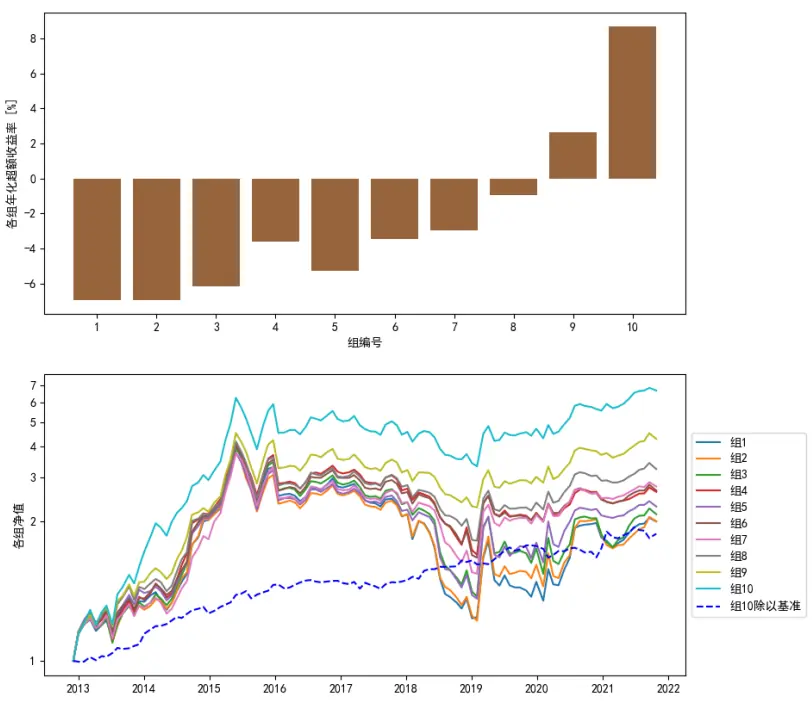
注：基准为全市场股票等权平均。资料来源：Wind, 德邦研究所

## 4.2. 全市场选股归因

我们首先对图 1中的第十组（机器学习残差因子最大的分组）的投资组合进行行业和风格归因。表 1显示了投资组合在行业上的主动暴露，普遍都是很小的数值。根据 3.2 节描述的方法，我们计算了在每一期各个行业和因子收益率，将该收益率和第十组在各个行业暴露相乘，可以得到当期的行业收益，表中显示了行业主动暴露和年化超额收益率。行业的平均超额回报的数值都非常微小，这说明基于十个风格因子的机器学习残差因子无显著选择行业的能力。

表 1：行业平均主动暴露及年化超额收益率贡献

| 行业 |  | 平均主动暴露 年化超额收益率 | 行业 |  | 平均主动暴露 年化超额收益率 |
| --- | --- | --- | --- | --- | --- |
| 石油石化 | -0.47% | 0.01% | 家电 | -0.20% | -0.01% |
| 煤炭 | -0.08% | 0.13% | 纺织服装 | 0.00% | -0.01% |
| 有色金属 | -1.09% | 0.07% | 医药 | 1.22% | -0.07% |
| 电力及公用事业 | -2.20% | 0.13% | 食品饮料 | 0.36% | 0.06% |
| 钢铁 | 0.48% | 0.09% | 农林牧渔 | -0.30% | 0.01% |
| 基础化工 | 1.52% | -0.08% | 银行 | 3.77% | 0.04% |
| 建筑 | -0.97% | 0.07% | 非银行金融 | -0.34% | 0.15% |
| 建材 | 0.20% | -0.03% | 房地产 | 1.39% | 0.03% |
| 轻工制造 | 0.12% | 0.00% | 交通运输 | -0.96% | 0.07% |
| 机械 | 1.98% | -0.07% | 电子 | 0.17% | 0.01% |
| 电力设备及新能源 | -0.43% | -0.12% | 通信 | 0.01% | -0.01% |
| 国防军工 | -0.50% | 0.21% | 计算机 | 0.79% | 0.23% |
| 汽车 | -1.30% | -0.02% | 传媒 | -0.80% | 0.05% |
| 商贸零售 | -1.08% | 0.11% | 综合 | -0.37% | 0.02% |
| 消费者服务 | -0.14% | 0.01% | 合计 | 1 | 1.13% |

注：平均主动暴露为每个月的行业主动暴露的平均值。
资料来源：Wind，德邦研究所

表 2显示了投资组合在风格因子上相对全市场等权基准的主动暴露和超额回报，年化超额收益率是每个月的因子主动暴露与因子收益率的乘积的均值的年化值。由于组合和基准都完全暴露于A股，故对国家因子的主动暴露为零。总体上，组合相对于基准的风格因子暴露数值很低，这是对风格因子正交化的结果。组合在非线性市值上有相对最大的负向主动暴露，这一项也带来了最为显著的超额收益；组合在流动性有正向的暴露，因而一定程度上损失了流动性溢价的回报；除此以外，组合在其他风格上的主动暴露和超额回报比较小。

表 2：因子平均主动暴露及年化超额收益率贡献

| 因子 |  | 平均主动暴露 年化超额收益率 | 因子 |  | 平均主动暴露 年化超额收益率 |
| --- | --- | --- | --- | --- | --- |
| 国家因子 | 0 | 0 | 账面市值比 | 0.053 | 0.04% |
| 对数市值 | -0.058 | 0.26% | 流动性 | 0.132 | -0.99% |
| 贝塔 | 0.006 | -0.15% | 盈利 | 0.196 | -0.06% |
| 动量 | -0.0689 | 0.10% | 成长 | -0.049 | -0.01% |
| 残差波动率 | 0.013 | 0.04% | 杠杆 | 0.047 | 0.07% |
| 非线性市值 | -0.388 | 2.18% | 合计贡献 | 1 | 1.60% |

注：平均主动暴露为每个月的风格因子暴露的平均值。
资料来源：Wind，德邦研究所

以上考察是时间平均的结果，除此以外，我们也关注因子、行业在不同时间段上的表现。图 2第一个子图显示了投资组合和基准组合的净值，据此可以计算组合的超额收益。

图 2：全市场选股组 10回报的行业和风格归因
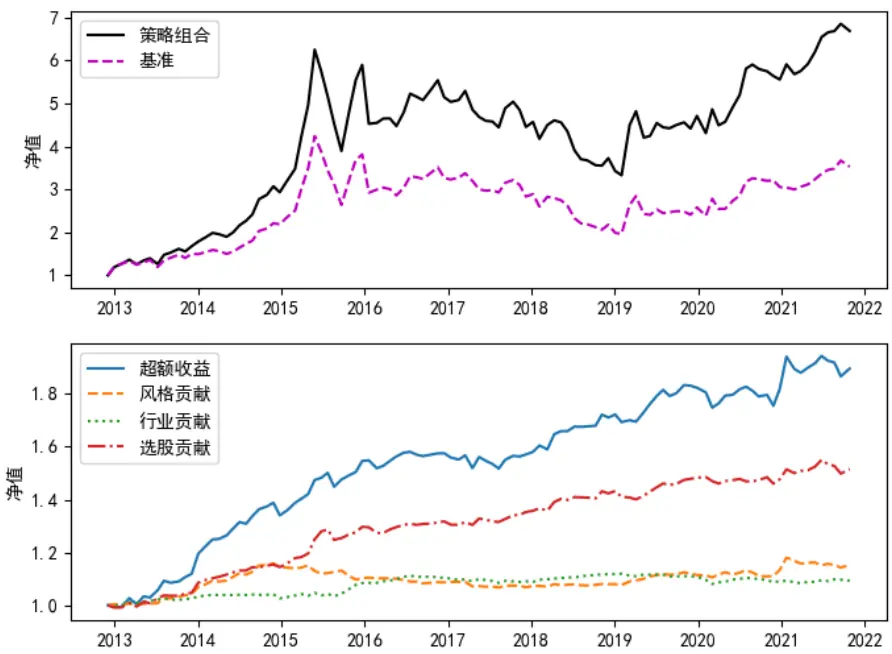
资料来源：Wind, 德邦研究所

图 2第二个子图显示了超额收益以及来自风格、行业和选股的超额收益贡献。每一期，各风格、行业的贡献分别根据 3.2节中的式（5）、（6）计算，其结果为每一期风格和行业的超额收益贡献，对该收益进行复利叠加即可得到图 2中的风格和市值的超额净值曲线。组合每一期的总回报减去基准的回报，然后减去风格、行业的超额回报，即可得到特质选股的超额回报，对该回报进行复利叠加便可得到图中的选股的超额净值曲线。结果表明，超额收益大部分来自于因子的特质选股能力，少量来自于行业和风格。值得注意的是，特质选股能力在回测期间始终非常稳定，这是机器学习模型积累所有风格因子的非线性效应并分散化风险的结果。

我们将全市场的股票划分为沪深300指数成分股、中证 500指数成分股以及其他股票三个部分，以下分别称为大市值、中市值和小市值三个分区。图 3的第一个子图显示了投资组合来源于三个分区的比例，由于投资组合的小市值倾向以及小市值股票本身的数量最大，绝大部分被选中的股票来源于小市值分区。

图 3：全市场选股组 10回报的指数成分归因
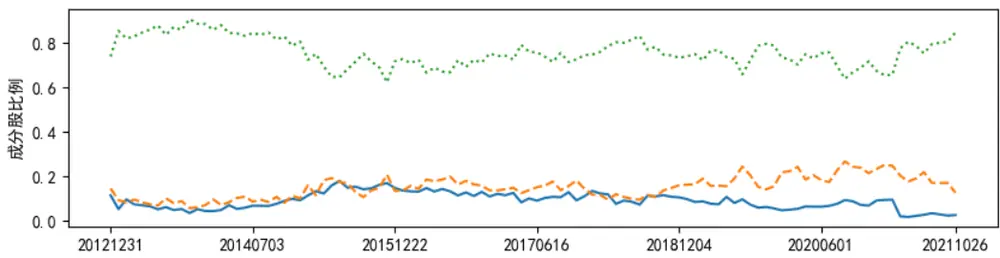

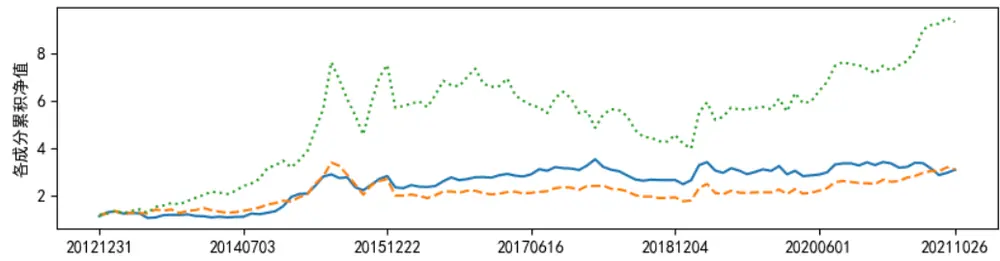

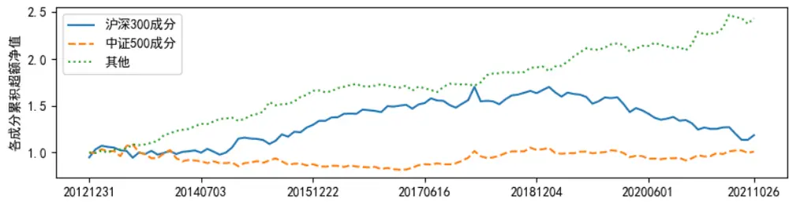
资料来源：Wind, 德邦研究所

图 3的第二个子图绘制了三个分区的股票的累积净值，总体上，组合中的小市值分区的股票上涨最多，而组合中的中、大市值股票上涨幅度远不及小市值股票。三个分区的股票组合都在不同的时期经历了回撤，因此，完全暴露于小市值的股票未必是最佳的选择，因为中、大市值股票提供了分散化风险效果，在小市值股票表现欠佳时能一定程度上弥补组合的表现，例如从2017年初至2018年初期间，小市值经历回撤，而大市值股相对强势，降低了回撤幅度。图 3的第三个子图显示了组合中的各个部分相对于各自的基准的超额收益，其中，大市值分区的基准为沪深 300指数成分股的等权组合，中市值分区的基准为中证 500指数成分股的等权组合，小市值分区的基准为两个指数以外的股票的等权组合。结果表明，小市值股票的超额收益较为持续和稳定。

## 4.3. 全市场选股策略容量测试

我们对构造的投资组合进行组合容量测试，并假设每只股票每天可以成交当日交易额的10%。在回测的起点，各个投资组合全部持有现金，因此，在初始阶段要经历建仓过程，而建仓的时间长度取决于资金量。图 4显示了不同初始资金量的投资组合的净值曲线，初始资金量从一亿到五百亿不等。

由于投资组合的资金总量在回测期间经历了较大幅度的增长，我们也需要考察在回测终点时各组合的资金量，初始资金量为1亿、10亿、100亿元的组合的终点资金量分别为7.02亿、68.7亿和565.8亿元。

由于容量对于交易完成度的影响，投资组合的年化收益率随着资金量的增加而单调下降，三个组合的年化收益率分别为 24.4%，23.5%和 21.4%。从一亿资金量到一百亿资金量，组合的年化收益率仅下降了约 3%。一方面，组合选股的数量约为 400只，股票的数量对容量有正面作用，另一方面，组合具有相当低的换手率，平均而言，每个月的单边换手率约为35%，较低的换手率是该策略的一大优势。较低的换手率既有利于策略完成调仓，也有利于降低交易手续费带来的阻力。

图 4：全市场选股容量测试，各组净值曲线
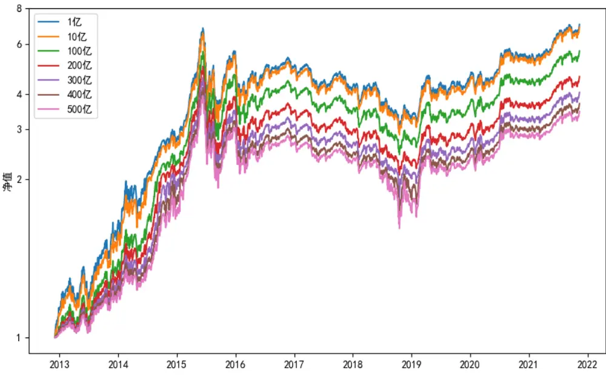
注：图中标注的资金量为初始时刻资金量，随着时间推进，组合的资金量有显著增长。资料来源：Wind, 德邦研究所

图 5显示了不同初始资金量的组合的净值与基准的净值之比，即超额收益净值。对于初始资金量超过百亿的组合，其建仓阶段消耗时间较长，因而很大程度上错失了2013年小市值股票的上涨。然而，我们考察的重点是各曲线的整体的上升趋势。资金量越小，超额收益曲线的上升趋势越明显，而一百亿初始资金量的超额净值曲线仍然具有明显的正斜率，保持较高的超额收益。当初始资金量过大时，例如五百亿的情况，超额收益曲线基本走平。

图 5：全市场选股容量测试，各组超额收益曲线
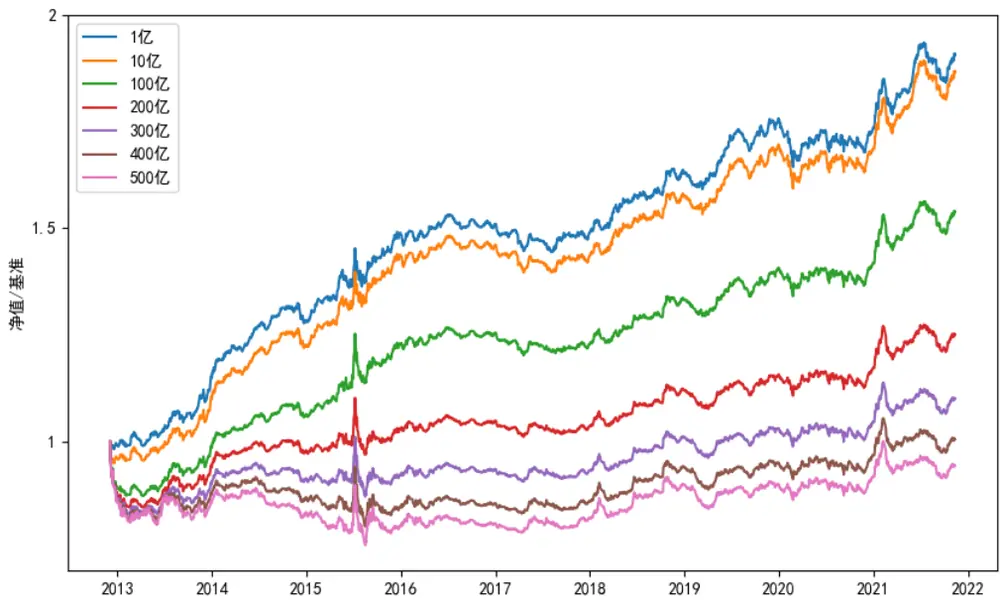
注：图中标注的资金量为初始时刻资金量，随着时间推进，组合的资金量有显著增长资料来源： 德邦研究所

当资金量较大时，造成投资组合回报降低的重要原因之一是策略无法及时完成调仓，因而组合的持仓无法达到策略的持仓目标。我们定义调仓完成度η来衡量实际持仓与目标持仓之间的相符程度：

$$
\eta=\sum_{i}\omega_{i}\cdot\frac{S_{i}^{r}}{S_{i}^{t}},\tag{7}
$$

其中， $\omega_{i}$ 为股票i的目标权重， $S_{i}^{r}$ 为该股票的实际持仓股数， $S_{i}^{T}$ 为该股票的目标持仓股数，对所有目标持仓股数为正的股票进行求和。

η越高，组合越能代表选股策略本身。调仓完成度与组合的资金量、策略的换手率和市场的交易量相关。我们考察不同资金量的组合的η在不同时期的值，我们假设每次选股决策发生的前一刻，上一轮的调仓已经完全完成；我们将每次换仓前的资金量设定为一个常数值，以防止资金量的变化对η造成影响。

在发生选股决策后，组合需要将部分成分更换为新入选的股票，该过程随着每天的交易发生，因此η随着时间逐渐增加，我们选择选股决策后第 15个交易日的η作为度量，这个时间点比较靠近每轮调仓的末尾，并且距离下一次调仓还有5个交易日的时间。图 6显示了交易完成度随着资金量和时间的变化情况。对于较小的初始资金量（1亿、10亿元），第 15日的η始终接近1，组合能较好地代表策略，随着资金量的提高，η逐渐下降。

η在市场成交量较高的时期（例如2015年和 2021年）较高，在成交量低迷的时期（例如 2018年）较低。在实际交易中，如果在发生下一次选股决策前η不能达到 1，则该调仓不足的状态会影响到下一轮的调仓过程，一般地，这会导致整体的η时间序列的值比图5所示的值更低。

图 6：调仓完成度与资金量的关系
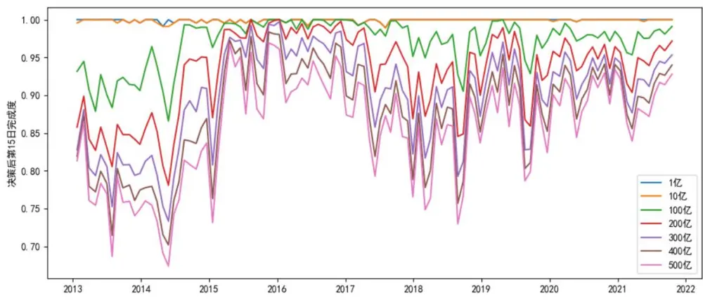
注：每一期调仓时，假设上一次的调仓已经彻底完成，并且资金量始终等于图记的数值。资料来源：Wind, 德邦研究所

## 4.4. 指数成分股选股

在本节中，我们将选股范围缩小到沪深300指数成分股范围内，即在大市值分区内选股。图7显示基于机器学习残差因子的两种在沪深300指数内构造投资组合的方法。超额收益的基准为沪深300指数，交易手续费为双边千分之三。

左侧子图的方法是仅仅使用沪深300指数成分股的数据训练机器学习模型，并根据模型对沪深300指数成分股的预测值均匀分为 5组，这种方法在下文中称为均匀分组法。

结果表明，按这种方法构造的机器学习残差因子并不具有选股能力。右侧子图的方式是使用全市场的股票数据训练机器学习模型，并根据模型对全市场的股票的预测值均匀分为 5组，再在各个组内挑出当时的沪深300指数成分股，从而构造五个投资组合，该选股过程导致各组股票数量不等，这种方法在下文中称为非均匀分组法。同样，构造的因子具有一定的单调性，但是各组之间的区分度依然不强。

图 7：沪深 300 指数成分股选股的回测结果
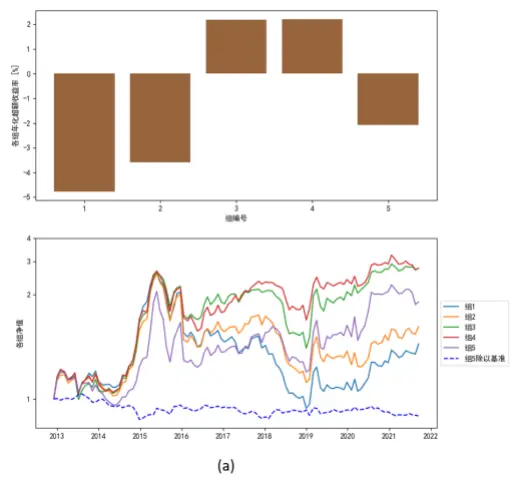

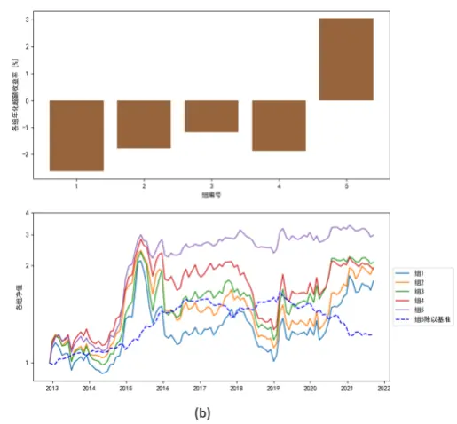
注：左子图的机器学习模型仅用沪深 指数成分股数据训练，且均匀分组；右子图的机器学习模型用全市场股票数据训练，且非均匀分组。基准为沪深 300 指数。资料来源：Wind, 德邦研究所

图 8显示了用同样的方法尝试在中证500指数成分股内选股的结果，超额收益的基准为中证 500指数，交易手续费为双边千分之三。左子图是仅用中证 500指数成分股训练机器学习模型，且均匀分组的情况，机器学习残差因子不具有选股能力。右子图是用全市场数据训练，且非均匀分组的情况，机器学习残差因子具有较好的单调性，但多头收益微弱，且并不稳定。

图 8：中证 500 指数成分股选股的回测结果
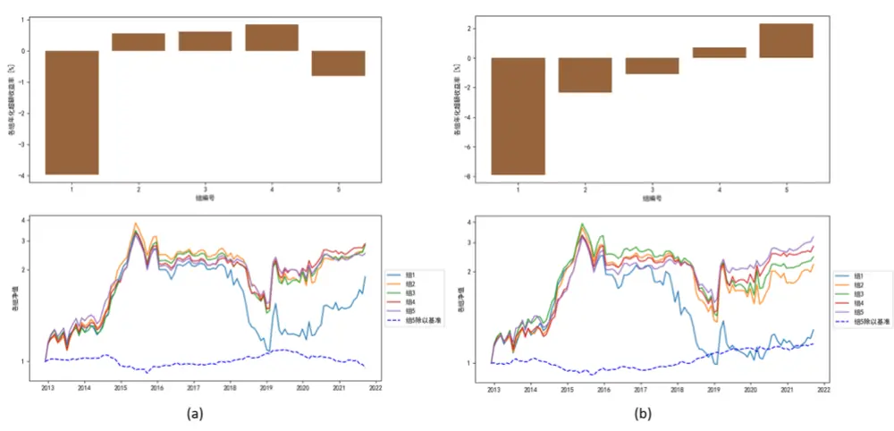
注：左子图的机器学习模型仅用中证 指数成分股数据训练，且均匀分组；右子图的机器学习模型用全市场股票数据训练，且非均匀分组。基准为中证 500 指数。资料来源： 德邦研究所

总体而言，虽然用风格因子构造的机器学习残差因子在上述两个股票池内有微弱的选股能力，但其表现并不令人满意。我们认为这与这些投资标的风格因子高拥挤度以及定价有效性相关。然而，机器学习残差因子的微弱选股能力或说明了该方法本身的有效性，为提升选股能力，或应从模型的原始因子输入层面提升。

作为对比，图9显示了在沪深300指数、中证 500指数成分股以外选股的回测结果，即在小市值分区选股。结果表明，因子具有较好的单调性，第一组的空头收益与第十组的多头收益都较为显著。均匀分组的因子 ICIR 为 0.519，而非均匀分组的 ICIR 为 0.573，再次说明利用全市场数据训练通常是有益的。

图 9：沪深 300 指数、中证 500指数成分股以外选股的回测结果
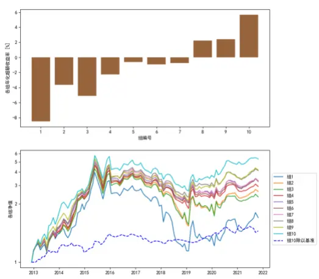

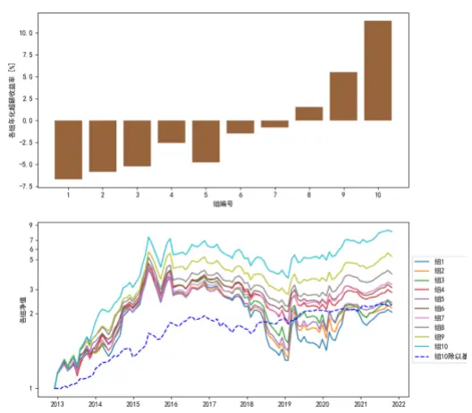
注：左子图的机器学习模型仅用小市值分区股票数据训练，且均匀分组；右子图的机器学习模型用全市场股票数据训练，且非均匀分组。基准为全市场等权平均。资料来源： 德邦研究所

## 4.5. 双因子分组

按照 3.4 节的双因子分组方法，将机器学习残差因子与各个风格因子组合，进行双因子分组，选股范围为全市场。图 10显示了各个分组的超额年化收益率。

我们首先根据机器学习残差因子分组，因此将该分组称为一级分组。图 10的结果表明，在不同的一级分组内，风格因子的单调性也有所不同。例如，对数市值因子在一级分组的组 1中单调性欠佳，而在组 6中单调性很好。类似的情况也发生在贝塔、残差波动率等因子上。我们关注的重点是机器学习残差因子暴露最高的组。总体而言，在回测区间内，在高机器学习残差因子暴露的情况下，有益的风格暴露为：小市值、低流动性、高贝塔、高账面市值比、高盈利和低杠杆。根据这个原则，我们实际上根据量化方法选择了财务质量良好的小公司的股票。

图 10：双因子分组回测结果

| 超额年化收益率(%) |  | 组1 | 组2 | 组3 | 组4 | 组5 | 组6 |  | 组1 | 组2 | 组3 | 组4 | 组5 | 组6 |
| --- | --- | --- | --- | --- | --- | --- | --- | --- | --- | --- | --- | --- | --- | --- |
|  |  |  |  | 贝 | 塔 |  |  |  |  |  |  | 流动 | 性 |  |
| 组1 |  | -10.73 | -7.17 | -5.94 | -3.62 | -9.18 | -13.71 |  |  | 1.16 | -3.22 | -6.26 | -14.66 | -15.37 |
| 组2 |  | -10.29 | -3.21 | -5.94 | -4.69 | -4.71 | -7.85 |  | -0.27 | -0.10 | -2.00 | -8.13 | -13.21 | -10.68 |
| 组3 |  | -6.44 | -1.51 | -2.49 | -3.08 | -2.58 | -8.65 |  | 5.60 | 1.54 | -5.16 | -5.95 | -9.12 | -9.11 |
| 组4 |  | -7.38 | -2.28 | -2.42 | -2.02 | -2.02 | -4.94 |  | 5.20 | -2.18 | -1.65 | -5.89 | -5.68 | -8.37 |
| 组5 |  | -4.63 | 0.35 | 1.00 | 1.19 | -1.34 | -4.73 |  | 13.36 | 5.00 | -6.51 | -3.81 | -6.00 | -6.63 |
| 组6 |  | -1.54 | 4.09 | 8.39 | 6.65 | 8.81 | 8.49 |  | 22.91 | 15.11 | 5.30 | 0.03 | -2.22 | -2.32 |
|  |  |  |  | 账面市 | 值比 |  |  |  |  |  | 对数市 | 值 |  |  |
| 组1 |  | -21.24 | -11.73 | -6.16 | -4.42 | -1.91 | -0.32 |  | 0.18 | -3.57 | -3.28 | -9.82 | -11.83 | -18.98 |
| 组2 | 机器学 | -11.64 | -7.71 | -4.29 | -3.70 | -3.62 | -2.85 |  | -0.38 | 0.21 | -1.65 | -7.64 | -10.43 | -13.93 |
| 组3 |  | -9.90 | -2.28 | -2.52 | -2.96 | -2.24 | -2.50 |  | 6.35 | 0.69 | -2.68 | -6.55 | -9.12 | -10.56 |
| 组4 |  | -5.47 | -4.28 | 0.48 | -5.08 | -1.88 | -2.64 |  | 5.17 | -0.27 | -0.42 | -7.95 | -6.64 | -8.34 |
| 组5 |  | -2.14 | -1.60 | 0.95 | 0.44 | -1.34 | -1.73 |  | 13.27 | 4.20 | -5.71 | -5.06 | -5.95 | -5.74 |
| 组6 |  | -0.92 | 4.48 | 4.97 | 9.97 | 11.53 | 8.68 |  | 22.98 | 16.58 | 4.48 | -0.30 | -4.07 | -0.58 |
|  |  |  |  | 盈 | 利 |  |  |  |  |  | 非线性 | 市值 |  |  |
| 组1 |  | -13.01 | -6.55 | –5.85 | -9.36 | -9.97 | -4.76 |  |  | 0.05 | -3.66 | -3.38 | -9.85 | -11.89 |
| 组2 |  | -9.74 | -7.10 | -3.15 | -3.11 | -7.06 | -4.79 |  | -0.53 | 0.08 | -1.80 | -7.66 | -10.46 | -13.97 |
| 组3 |  | -8.94 | -3.09 | -3.64 | -4.86 | -0.46 | -1.74 |  | 6.30 | 0.61 | -2.84 | -6.59 | -9.13 | -10.66 |
| 组4 |  | -5.13 | -1.67 | -6.11 | -3.29 | 0.11 | -3.04 |  | 5.00 | -0.31 | -0.49 | -8.03 | -6.74 | -8.42 |
| 组5 |  | 1.41 | -0.28 | -1.74 | -1.55 | -0.46 | -3.64 |  | 13.11 | 4.10 | -5.81 | -5.15 | -6.03 | -5.78 |
| 组6 |  | 4.62 | 9.07 | 2.41 | 3.83 | 5.14 | 11.58 |  | 22.82 | 16.53 | 4.50 | -0.28 | -4.07 | -0.63 |
|  |  |  |  | 成 | 长 |  |  |  |  |  | 残差波 | 动率 |  |  |
| 组1 |  |  | -5.73 | -6.66 | -10.02 | -10.04 | -6.30 | -8.84 |  | -4.52 | -3.11 | -6.69 | -7.73 | -11.21 |
| 组2 |  | -5.94 | -3.74 | -6.25 | -6.51 | -7.00 | -4.40 | 机器学 | -3.64 | -4.10 | -5.00 | -6.95 | -4.76 | -11.81 |
| 组3 |  | -2.93 | -3.83 | -4.75 | -2.25 | -4.44 | -3.45 |  | -4.47 | -1.93 | -1.58 | -3.35 | -2.50 | -10.83 |
| 组4 |  | -3.04 | -3.96 | -1.88 | -2.12 | -2.95 | -3.43 |  | -1.40 | -2.48 | -2.50 | -2.38 | -3.35 | -8.63 |
| 组5 |  | 1.83 | -0.73 | -2.51 | 4.21 | -2.36 | -4.34 |  | -1.91 | 0.47 | -1.83 | -0.33 | 0.61 | -4.70 |
| 组6 |  | 9.16 | 9.54 | 3.76 | 10.32 | 5.07 | 2.21 |  | 4.90 | 6.09 | 9.61 | 5.88 | 4.88 | 3.91 |
|  |  |  |  | 杠 | 杆 |  |  |  |  |  | 动 | 量 |  |  |
| 组1 |  | -10.63 | -6.60 | -6.60 | -7.50 | -6.92 | -7.20 |  | -9.15 | -6.61 | -3.94 | -6.53 | -13.40 | -11.50 |
| 组2 |  | -5.41 | -5.41 | -5.16 | -2.38 | -6.73 | -8.03 | 机器学 | -7.97 | -5.28 | -4.51 | -3.15 | -5.52 | -10.51 |
| 组3 |  | -3.39 | -2.21 | 0.14 | -4.22 | -4.52 | -7.43 |  | -8.21 | -2.19 | -0.63 | -3.65 | -3.31 | -6.91 |
| 组4 |  | -2.39 | -2.49 | -2.17 | -0.76 | -4.10 | -6.02 |  | -9.03 | -2.04 | -2.16 | -2.87 | -4.25 | -0.77 |
| 组5 |  | 2.90 | 0.21 | -0.17 | -0.85 | -1.34 | -5.06 |  | -6.73 | 0.59 | 0.01 | -1.46 | 0.13 | -0.95 |
| 组6 |  | 7.91 | 4.83 | 7.17 | 8.59 | 7.43 | 3.75 |  | 6.82 | 4.06 | 7.34 | 8.68 | 2.64 | 4.55 |

注：基准为全市场等权组合。组 1 因子值最小，组 6 因子值最大。回测区间为 2012 年12月至2021年11月。资料来源： 德邦研究所

## 5. 结论

本文从传统的多元线性回归方法出发，使用 CNE5中的十个风格因子，通过加权线性回归计算残差收益率。我们认为，残差收益率可以由风格因子的非线性函数、风格因子不蕴含的信息以及其他因素解释，使用非线性模型拟合残差收益率并通过集成、交错训练等方式避免过拟合，可以拟合风格因子的非线性函数。我们用神经网络、随机森林、提升树三种机器学习模型拟合残差收益率并构造集成模型，用滚动、交错的方式训练机器学习模型。将模型给出的预测对风格因子做正交化，得到机器学习残差因子，用该因子作为选股因子。

分析的主要对象是全市场股票中机器学习残差因子暴露最高的一组股票，选择的基准为全市场股票等权组合。我们从风格、行业对组合的超额收益进行了归因，而两者不能解释的部分被认为是特质选股能力。风格、行业的超额收益都较小，这是由因子的构造过程决定的。相比之下，特质选股能力贡献了大部分的超额收益，且表现十分稳定。我们对该投资组合的容量进行了测试，投资组合在百亿元资金量的情况下超额收益仍然可观。组合股票成分分析表明，投资组合的成分股大部分成分为沪深 300、中证 500以外的小盘股，并且小盘股贡献了最多的收益和超额收益。

我们使用机器学习残差因子在沪深 300 指数和中证 500指数成分股内选股，效果远不及全市场选股，我们认为这和这类股票相对有效的定价有关。若要提高在上述指数成分股内的选股能力，或可从输入因子层面探索。

机器学习残差因子本身没有风格偏好，但投资者可以将其与风格因子结合，进行双因子分组选股，而许多风格因子在高机器学习暴露的股票池中显现出了很强的选股能力。

## 6. 风险提示

海外市场波动风险，宏观数据、政策变化风险，模型失效风险。

## 信息披露

## 分析师与研究助理简介

肖承志，同济大学应用数学本科、硕士，现任德邦证券研究所首席金融工程分析师。具有 6 年证券研究经历，曾就职于东北证券研究所担任首席金融工程分析师。致力于市场择时、资产配置、量化与基本面选股。撰写独家深度“扩散指标择时”系列报告；擅长各类择时与机器学习模型，对隐马尔可夫模型有深入研究；在因子选股领域撰写多篇因子改进报告，市场独家见解。

## 分析师声明

本人具有中国证券业协会授予的证券投资咨询执业资格，以勤勉的职业态度，独立、客观地出具本报告。本报告所采用的数据和信息均来自市场公开信息，本人不保证该等信息的准确性或完整性。分析逻辑基于作者的职业理解，清晰准确地反映了作者的研究观点，结论不受任何第三方的授意或影响，特此声明。

## 投资评级说明

| 1. 投资评级的比较和评级标准：以报告发布后的6个月内的市场表现为比较标准，报告发布日后6个月内的公司股价（或行业指数）的涨跌幅相对同期市场基准指数的涨跌幅；2. 市场基准指数的比较标准：A 股市场以上证综指或深证成指为基准；香港市场以恒生指数为基准；美国市场以标普500或纳斯达克综合指数为基准。 | 类别 | 评级 | 说明 |
| --- | --- | --- | --- |
|  | 股票投资评级 | 买入 | 相对强于市场表现20%以上； |
|  |  | 增持 | 相对强于市场表现 5%~20%； |
|  |  | 中性 | 相对市场表现在-5%~+5%之间波动； |
|  |  | 减持 | 相对弱于市场表现5%以下。 |
|  | 行业投资评级 | 优于大市 | 预期行业整体回报高于基准指数整体水平10%以上； |
|  |  | 中性 | 预期行业整体回报介于基准指数整体水平-10%与10%之间； |
|  |  | 弱于大市 | 预期行业整体回报低于基准指数整体水平10%以下。 |

## 法律声明

本报告仅供德邦证券股份有限公司（以下简称“本公司”）的客户使用。本公司不会因接收人收到本报告而视其为客户。在任何情况下，本报告中的信息或所表述的意见并不构成对任何人的投资建议。在任何情况下，本公司不对任何人因使用本报告中的任何内容所引致的任何损失负任何责任。

本报告所载的资料、意见及推测仅反映本公司于发布本报告当日的判断，本报告所指的证券或投资标的的价格、价值及投资收入可能会波动。在不同时期，本公司可发出与本报告所载资料、意见及推测不一致的报告。

市场有风险，投资需谨慎。本报告所载的信息、材料及结论只提供特定客户作参考，不构成投资建议，也没有考虑到个别客户特殊的投资目标、财务状况或需要。客户应考虑本报告中的任何意见或建议是否符合其特定状况。在法律许可的情况下，德邦证券及其所属关联机构可能会持有报告中提到的公司所发行的证券并进行交易，还可能为这些公司提供投资银行服务或其他服务。

本报告仅向特定客户传送，未经德邦证券研究所书面授权，本研究报告的任何部分均不得以任何方式制作任何形式的拷贝、复印件或复制品，或再次分发给任何其他人，或以任何侵犯本公司版权的其他方式使用。所有本报告中使用的商标、服务标记及标记均为本公司的商标、服务标记及标记。如欲引用或转载本文内容，务必联络德邦证券研究所并获得许可，并需注明出处为德邦证券研究所，且不得对本文进行有悖原意的引用和删改。

根据中国证监会核发的经营证券业务许可，德邦证券股份有限公司的经营范围包括证券投资咨询业务。