## 金融工程专题

证券分析师

肖承志

资格编号： S0120521080003

邮箱：xiaocz＠tebon.com.cn

研究助理

## 王成煜

邮箱：wangcy3＠tebon.com.cn

## 相关研究

1. 《机器学习因子：在线性因子模型中捕获非线性—德邦金工文献精译第一期》 2021.9.17

2. 《利用机器学习捕捉因子的非线性效应—德邦金工机器学习专题之一》 2021.10.18

3. 《机器学习残差因子表现归因—德邦金工机器学习专题之二》2021.11.24

# 基于财务与风格因子的机器学习

# 选股

## ——德邦金工机器学习专题之三

## [Table_Summ投资要点：

- 综合使用风格与财务因子进行选股。在风格因子的基础上，引入财务因子数据，可以大幅提高机器学习模型的选股能力。

- 拟合独立于风格的特质收益率。首先用关于风格因子的线性回归计算股票的特质收益率，然后用机器学习模型拟合特质收益率关于风格、财务因子的函数。

- 本文从资产负债表、利润表中选取少数几个财务因子作为输入。筛选的财务因子包括季度营业成本、总成本、研发投入、营业利润的同比增速以及 ROE。

- 基于神经网络、随机森林、提升树三种机器学习模型构建总集成模型。每种类型的机器学习模型包含数个不同参数的模型，将模型的平均输出作为最终总集成模型输出。

- 构造机器学习残差因子。将机器学习模型作用在最新一期的因子值上，进行风格中性处理，构造机器学习残差因子。

- 构造机器学习反转因子。用上一期的因子拟合本期特质收益率，取相反数并进行风格中性处理，构造机器学习反转因子。反转因子的多空收益非常显著。

构造复合因子。根据机器学习残差因子和机器学习反转因子等权的方法构造复合因子。复合因子表现出更稳健的超额收益，从 2015年至 2021年间每年均维持正的超额收益和较高的信息系数。此外，策略的换手率相对较低。

- 通过构造高集中度组合考察因子的单调性。复合因子分五组时表现出很强的单调性，若通过增加分组构造高集中度组合，空头收益大幅度增加，但多头收益基本维持不变。

- 考察复合因子在不同股票池的选股能力。根据复合因子在全市场、沪深300指数、中证 500指数与中证 1000指数成分股中选股以考察因子的有效性。复合因子仅在沪深 300指数成分中失效。

对复合因子选股的组合进行容量测试。初始资金量从 10亿增加到 500亿，策略从2015 年初至 2022 年初的年化收益率从 16.1%下降到 11.1%。如果以调仓完成度作为评价标准，策略的容量可达百亿量级。

- 对复合因子选股的组合进行收益归因。收益归因的结果表明，组合的超额收益大多来自于因子的独立于风格、行业之外的特质选股能力。

- 风险提示：市场风格变化风险，模型失效风险，数据可用性风险

## 1. 前言

我们在前期研报《利用机器学习捕捉因子的非线性效应—德邦金工机器学习专题之一》中介绍了机器学习残差因子的计算方法，并在《机器学习残差因子表现归因—德邦金工机器学习专题之二》中对机器学习残差因子的表现进行了归因。前期的研究结论表明，机器学习残差因子具有与风格、行业无关的稳定的特质选股能力，该特质选股能力在全市场范围内较为显著。

在前期的研究中，机器学习模型的输入数据仅包括十个风格因子，其输入数据量相对较小，因而模型可用的信息量较少。一个自然的想法是，通过扩充输入数据的维度来提高机器学习模型的质量。前期的研究表明，我们的机器学习模型在中小盘股票池中较为有效，为了兼顾策略的有效性和标的可投资性，本文重点关注中证1000指数增强策略。

## 2. 方法

## 2.1. 特质收益率

传统的多因子选股方法通过构造多个因子的线性组合来构造选股因子，可用的因子包括风格、财务、量价、技术、情绪、分析师和另类因子等。该方法假设未来股票收益关于各个单因子的值都是单调变化的，然而，线性回归能够解释收益中很小的一部分。相对地，基于机器学习模型的选股方法可以充分挖掘股票收益关于因子的非线性函数，除以此外，机器学习模型还可以捕捉不同因子间的交互作用。

本文中，我们基于财务因子和风格因子构造一个风格中性的选股因子，该因子在各个横截面上与各个CNE5风格因子都线性无关。基于该因子构造的投资组合的风格暴露很低，但我们允许投资组合在财务因子上有暴露，例如，组合可以暴露高 ROE 因子。我们将本期的股票回报记为本期的股票回报记为 $R_{T}$ ，把上一期的风格因子记为 $B_{T-\Delta T}$ 。首先，用风格因子WLS回归股票收益率：

$$
R_{T}=B_{T-\Delta T}\cdot b_{T}+\varepsilon_{T},\tag{1}
$$

其中， $b_{T}$ 为风格因子的拟合系数， $\varepsilon_{T}$ 为股票的特质收益率。

## 2.2. 财务因子

我们使用资产负债表和利润表中的财务数据作为输入，既考虑财务因子本身的值，也考虑财务数据的年度增速。由于各上市公司披露财务数据的时间不同，我们采用向后填充的方式将财务数据补全到所有感兴趣的交易日。

对于任意一个财务因子x，若上一期该财务因子值为x′，则按以下公式计算财务因子的变化率Δx：

$$
\Delta\mathbf{x}=\frac{x-x^{\prime}}{|x^{\prime}|}.\tag{2}
$$

由于上一期财务因子值x′（例如总利润）有可能为负，故对（2）中分母取绝对值以反映财务因子的真实变化方向。

本文中，我们以个别财务因子为例，而暂不探讨如何对大量财务因子进行筛选。表 1显示了本文使用的财务因子，其中季度 ROE因子反映财务质量，而其余四个指标反映公司的成长性。

表 1：财务因子列表

| 因子 | 信息来源 |
| --- | --- |
| 季度 ROE | 利润表、资产负债表 |
| 季度营业成本的同比增速 | 利润表 |
| 季度总营业成本的同比增速 | 利润表 |
| 季度研发投入的同比增速 | 利润表 |
| 季度营业利润的同比增速 | 利润表 |

资料来源：德邦研究所

为了避免财务因子极端值对模型的不利影响，对每一个财务因子，在每一个横截面上，我们采用中位数去极值的方法去除极端值。

$$
\tilde{x}=\left\{\begin{matrix}{x_{m}+n\cdot D,\qquad}&{if\quad x>x_{m}+n\cdot D}\\{x_{m}-n\cdot D,\qquad}&{if\quad x<x_{m}-n\cdot D}\\{x,\qquad}&{else}\end{matrix}\right.\quad,\tag{3}
$$

其中，x是任意一个财务因子的值， $x_{m}$ 是因子值在横截面上的中位数，D是序列|x−$\mathbf{x_{m}}[$ 的中位数，n是一个参数，通常可以取3，而x̃为去极值后的结果。

## 2.3. 机器学习残差因子

我们的目的是构造一个不暴露风格，但力求赚取特质收益率的投资组合。我们把风格因子和其他因子作为机器学习模型的输入，拟合特质收益率 $\varepsilon_{T},$ ，即：

$$
\varepsilon_{T}=\mathsf{G}(B_{T-\Delta T},\mathrm{X}_{\mathrm{T}-\Delta\mathrm{T}})+\varepsilon_{T}^{\prime},\tag{4}
$$

其中 $\mathbf{G}(\cdot,\cdot)$ 为机器学习函数， $而\varepsilon_{T}^{\prime}$ 是机器学习模型的拟合残差。

机器学习模型包括两个具有不同神经元个数的神经网络模型、三个具有不同树数目的随机森林模型和三个具有不同深度的提升树模型。对每一类机器学习模型，计算其子模型的预测的代数平均值，从而得到三类集成模型的输出。将三类集成模型的输出做z-score标准化，再计算其平均值，得到总集成输出值。这么做的好处是尽可能让不同的模型拟合不同的噪音，并在总集成输出中尽可能降低噪音。

训练模型时，使用过去五年的数据滚动训练，并交替训练八个子模型以避免相对集中的股票换仓。为了使 $.\varepsilon_{T}的$ 数值更加适合于神经网络的训练，可先将ε 的值取 z-score再用（4）进行拟合，这样通常可以取得更好的效果。我们使用2015年之前的数据作为样本内数据，用滚动训练和验证的方式调节模型参数，使因子在样本内达到最优信息系数。由于输入数据维度并不高，最终得到的模型的复杂度通常较低，即神经网络的神经元数较低，提升树和随机森林的深度都较低。我们在机器学习系列之一、之二中对这套方法进行了更加详细的介绍。

接下来，将机器学习模型作用于最近一期的风格和财务因子上，得到机器学习因子 $\mathsf{G}_{\mathrm{T}}$ ，即：

$$
G_{T}=\mathsf{G}(B_{T},\mathsf{X}_{T}),\tag{5}
$$

其中，T日为调仓日的前一日， $B_{T}$ 和 $\mathbf{rX_{T}}$ 分别是对应的风格和财务因子值，T日的因子在T日盘后可得，故 $G_{T}尺$ 能被用在T+ 1日进行调仓。将 $\mathsf{G}_{\mathrm{T}}$ 对风格因子 $B_{T}$ 取正交化处理，得到机器学习残差因子 $\widetilde{\mathbb{G}}_{T}$ ，对全市场而言，因子 $\widetilde{\mathbf{G}}_{T}$ 是风格中性的，却可以暴露于财务因子的特定方向。

## 2.4. 机器学习反转因子

我们再来分析上一节的式（4），其中 $\mathrm{G}(B_{T-\Delta T},X_{T-\Delta T})$ 项是机器学习模型对在T日已知的特质收益率的拟合值，这个拟合值通常不等于该特质收益率。在调节模型参数和超参数阶段，如果模型复杂度过高，则模型虽然在样本内表现良好，但在样本外表现很差，产生过拟合问题。因此，拟合残差 $\varepsilon_{T}^{\prime}$ 通常是显著不为零的。

实际上， $\varepsilon_{T}^{\prime}$ 蕴含了丰富的信息。我们可以将 $\mathrm{G}(B_{T-\Delta T},\mathrm{X}_{\mathrm{T}-\Delta\mathrm{T}})$ 理解为模型意义下公允的T− ΔT日至T日的股票收益率，那么余下的部分 $\varepsilon_{T}^{\prime}$ 是不能被模型解释的部分。在理想情况下，如果模型对收益率的预测是完全正确的，则 $\varepsilon_{T}^{\prime}$ 是纯粹的错误定价，倾向于在未来发生反转。实际情况下，模型对收益率具有一定的解释力度，但由于信息或模型的非完备性而无法完全解释，故 $\varepsilon_{T}^{\prime}$ 既包含模型不能解释的部分，也包含错误定价的成分，其中，前者的方向不确定，后者倾向于在未来反转。因此， $\varepsilon_{T}^{\prime}$ 也应该具有选股能力，且暴露于较小的 $c_{T}^{\prime}$ 是有益的。同样地，我们不希望组合具有风格偏好，故将 $\varepsilon_{T}^{\prime}$ 的相反数对风格因子 ${\boldsymbol{B}}_{T-\Delta T}$ 做正交化处理：

$$
-\varepsilon_{T}^{\prime}=B_{T-\Delta T}\cdot b_{T}^{\prime}+\epsilon_{T},\tag{6}
$$

其中， $b_{T}^{\prime}$ 为根据OLS拟合得到的风格因子的系数， $而\epsilon_{T}$ 是拟合残差，我们把它称为机器学习反转因子。

利用线性拟合残差的思路在很长的时间范围内被学术届讨论，足见该方法在海外市场的长期有效性。例如Frankel等[1]研究了残差收益率模型，而Batram等[2]根据同样的思路构造了错误定价因子。我们在文献精译系列第二期中对Batram的论文进行了介绍，Batram较好地论述了残差收益率是独立于风险因子之外的一个有效选股信号，感兴趣的读者可以参考我们的精译。在文献中，残差通常指的是线性回归所得的残差，而我们使用的残差项是机器学习拟合的残差，由于机器学习模型能拟合非线性关系，通常能比线性模型更好地解释收益率，因而其残差项应该更接近于错误定价的真值。我们将考察机器学习反转因子作为一个单因子的选股能力，同样，我们展示它与机器学习残差因子等权结合后的复合因子的选股能力。

## 2.5. 复合因子

我们根据 2.3 节和 2.4节介绍的两个选股因子构造一个复合因子。我们选用一种等权的复合因子构造方法。在每个横截面上，我们将机器学习残差因子和机器学习反转因子分别做z-score处理并相加以计算复合残差因子 $iM_{T}$ ，即：

$$
M_{T}=\frac{\tilde{G}_{T}-\bar{\tilde{G}}_{T}}{\sigma(\tilde{G}_{T})}+\frac{\epsilon_{T}-\bar{\epsilon}_{T}}{\sigma(\epsilon_{T})},\tag{7}
$$

其中 $\tilde{G}_{T}和\bar{\epsilon}_{T}$ 的含义同上文， $而\overline{\widetilde{G}}_{T}和\sigma(\widetilde{G}_{T})$ 分别为横截面上机器学习残差因子的均值和标准差， $\bar{\epsilon}_{T}和\sigma(\epsilon_{T})$ 分别为横截面上机器学习反转因子的均值和标准差。

图 1对上述三个因子的计算方法做了一个梳理，复合因子的计算包括以下步骤：

1） 根据历史因子值和历史收益率，训练机器学习模型 $\mathbf{G}(\cdot,\cdot)$ 。

2） 根据模型G(⋅,⋅)和因子值 $B_{T-\Delta T}和X_{T-\Delta T}$ 以及已知的收益率 $\mathrm{{\cdot R}_{T-\Delta T}}$ ，计算机器学习反转因子 $\epsilon_{\mathrm{T}}$ 。

3） 根据 $\mathbf{G}(\cdot,\cdot)$ 和因子值 $B_{T}和X_{T}$ ，计算机器学习残差因子 $\widetilde{\mathbf{G}}_{\mathbf{T}}$ 。

4） 根据 $\epsilon_{\mathrm{T}}和\widetilde{\mathrm{G}}_{\mathrm{T}}$ 计算复合因子 $M_{T}$ 。

图 1：因子计算方法示意图
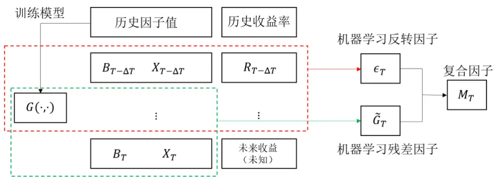
资料来源：德邦研究所绘制

## 2.6. 投资组合构造方法

为便于调仓，我们规定调仓日期为每个月的第一个非节假日的星期一。我们采用一种较保守的回测方式，在每个调仓日排除以下情况的股票：

1）暂停交易。

2）ST 或 $\mathbb{ST}^{\star}$

3）涨停。

4）上市不满20日的股票。

然后，根据选股因子值的大小，将全市场的股票排序，并均匀分组。如果在某股票池内选股，例如，只选择中证 1000的成分股，那么将股票池成分股的集合与各个分组取交集，取交集后各个分组的股票数量通常不相等，但数量差别通常不大。由于我们主要从因子而非组合的视角进行研究，我们对各个分组均采用市值等权的方式构建一个组合。

## 2.7. 风格、财务、行业归因方法

我们用式（8）和 WLS 对各个风格和行业进行归因：

$$
R_{T}=B_{T-\Delta T}\cdot c_{T}+X_{T-\Delta T}\cdot f_{T}+I_{T-\Delta T}\cdot s_{T}+\varepsilon_{T}^{\prime\prime}\tag{8}
$$

其中， $B_{T-\Delta T},X_{T-\Delta T},I_{T-\Delta T}$ 分别为风格、财务、行业因子矩阵， $c_{T},f_{T},s_{T}$ 为分别为风格、财务、行业收益率向量， $\varepsilon_{T}^{\prime\prime}$ 为拟合残差，WLS回归的权重为各个股票的自由流通市值的平方根。

国家因子和行业因子的同时存在会导致共线性的问题，因此我们按照式（9）对线性拟合施加行业约束：

$$
w^{T}\cdot s_{T}=0,\tag{10}
$$

其中，w为各个行业自由流通市值在全市场的权重。根据各个因子的收益率，以及投资组合相对于基准的风格、财务、行业因子暴露，就可以解释组合的超额收益率的来源。

## 3. 结果

本文与我们的机器学习系列之一、之二的不同之处在于引入了财务因子，我们首先展示仅基于风格因子的策略，然后展示基于风格和财务因子的策略。类似于在我们的机器学习系列之二中的情况，本文所用的量化方法在中证800内的有效性相对低，在中证 800外有效性相对高。然而，许多市值很小的股票无法成为有效的投资标的。因此，我们主要关注在中证1000指数成分内的选股，但也提及在全市场、中证500指数成分和沪深300指数成分内选股的结果。

## 3.1. 基于风格因子的机器学习残差因子

图 2显示了基于风格因子的机器学习残差因子的分组回测结果。第一行子图绘制了各个分组相对于中证 1000 指数的超额收益柱状图，因子具有一定的单调性，但是第四组、第五组区分度较小。

不难发现，五组的平均超额收益大于零，这是由于五个组合都是根据个股等市值原则构造的，若将其取并集而合并单一组合，这个合并组合相对于中证1000指数是偏小盘的。自2015年初至2022年初，暴露于小市值的投资组合有显著的超额收益，这解释了五个组合的费后平均超额收益仍然大于零的现象，下文中亦会出现类似的情况，便不再赘述。

图 2第二行的子图显示了五组的净值曲线，其中组 1的因子暴露最低，组 5的因子暴露最高。黑色的虚线显示了组5相对组 1的相对净值，该曲线度量了多空策略的收益。亮红色的实线显示了组 5 相对中证 1000基准的相对净值。无论是以多空净值还是多头净值，自 2021年起都经历了大幅度、长时间的回撤，且从2015年至 2018年超额收益不显著。因此，十因子的机器学习模型尚待改善。

图 2：基于风格因子（十因子）的机器学习残差因子的分组回测
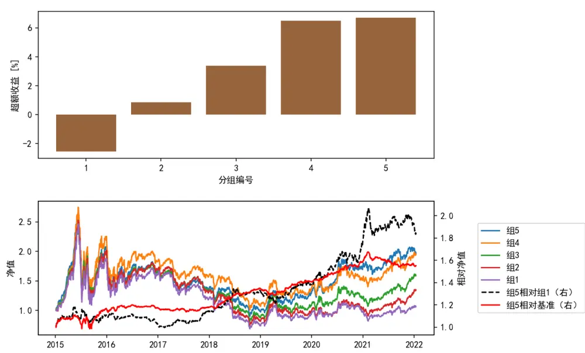
注：在中证 1000 指数成分股中选股，基准为中证 1000指数。资料来源：Wind, 德邦研究所

图 3 和图 4 分别显示了基于风格因子的机器学习残差因子在全市场和中证1000指数成分股内的月度斯皮尔曼信息系数RANKIC 以及其累积值。

图 3：十因子机器学习残差因子的信息系数（全市场）
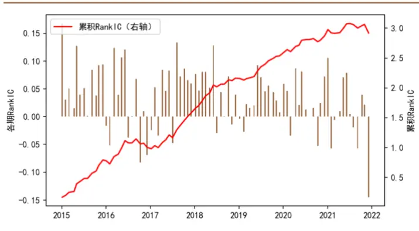
资料来源：Wind, 德邦研究所

图 4：十因子机器学习残差因子的信息系数（中证 1000 成分）
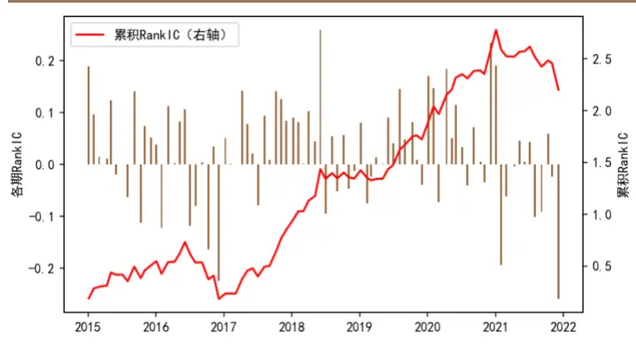
资料来源：Wind, 德邦研究所

在全市场，因子的累积 RankIC 曲线平稳上升，这和我们在机器学习系列之一、之二中展示的全市场选股的稳定超额收益相对应。在中证1000成分股内，因子的 RankIC 在 2018年之前基本走平，在2021年后经历长时间的回撤，这与图

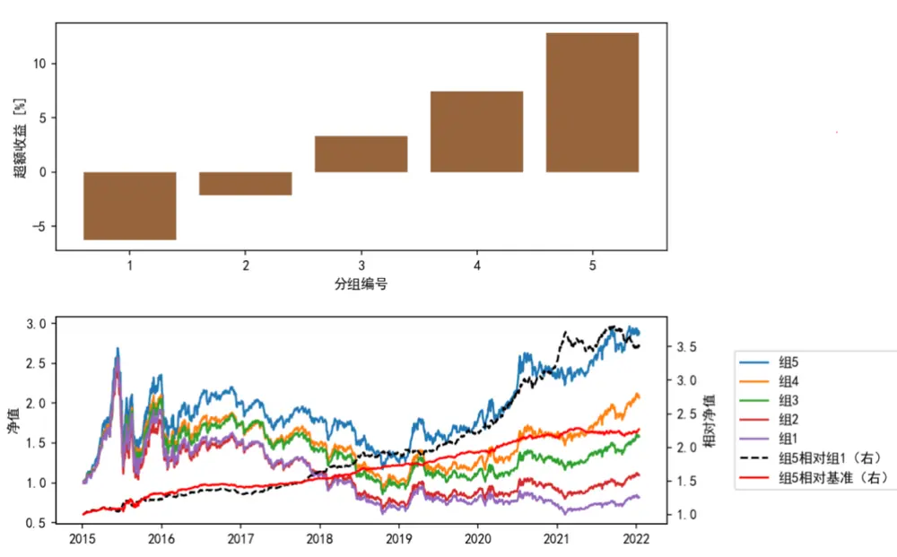
图 5：基于风格和财务因子（十五因子）的机器学习残差因子的分组回测
注：在中证 1000 指数成分股中选股，基准为中证 1000指数。资料来源：Wind, 德邦研究所

2 中的多空曲线呈现高度相关。从 2015-01-05 至 2021-12-06，在全市场，平均RankIC 为 0.035，Rank ICIR 为 0.623；在中证 1000 成分内，平均 RankIC 为0.026，Rank ICIR 为 0.268。

## 3.2. 基于风格和财务因子的机器学习残差因子

图 5显示了基于风格和财务因子的机器学习残差因子分组回测的结果。相对于图 5，五组的区分度非常明显，组 5的超额收益显著高于图 2中的超额收益。以多空曲线度量的超额收益在2021年后波动率较为显著，但回撤不明显，以相对基准净值度量的超额收益自 2021 二季度起略显走平。我们并不否认策略仍然有效的可能性。实际上，在历史的某些时期也出现过类似2021年超额收益波动的情况，例如从 2016 年中至 2017年间，策略的超额收益在较长的一段时间内走平，甚至略有回撤，然而，在这个时间段后，该策略也并未失效。

图 6和图 7显示了基于风格和财务因子的机器学习残差因子在全市场和中证1000成分股内的月度信息系数时序图。

图 6：十五因子机器学习残差因子的信息系数（全市场）
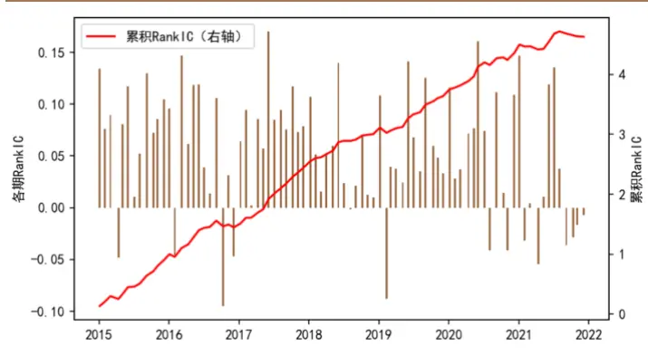
资料来源：Wind, 德邦研究所

图 7：十五因子机器学习残差因子的信息系数（中证 1000成分）
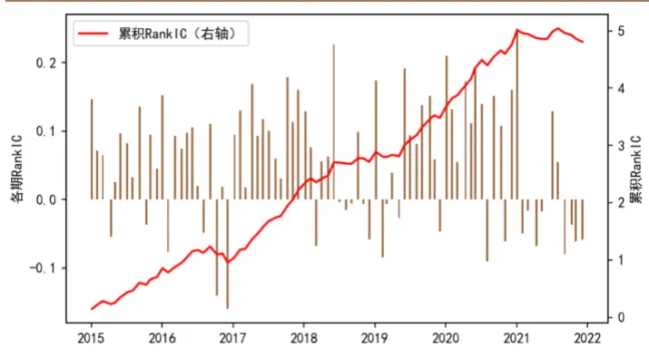
资料来源：Wind, 德邦研究所

从 2015-01-05 至 2021-12-06，因子在全市场的平均 RankIC 为 0.055，RankICIR 为 0.92；因子在中证 1000 成分股内平均 RankIC 为 0.057，Rank ICIR 为0.635。

## 3.3. 机器学习反转因子

图 8显示了机器学习反转因子的分组回测结果，多头收益与空头收益都较高，尤其是空头收益远超过图 5中的值，因此，多空收益曲线更加稳健。然而，组 2与组 3的区分度不明显，机器学习反转因子对于收益居中的股票的分辨能力相对弱。

图 8：机器学习反转因子的分组回测
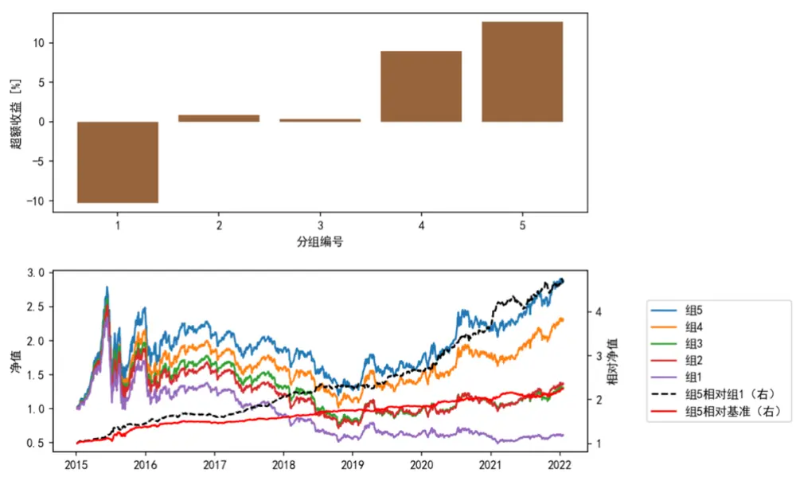
注：在中证 1000 指数成分股中选股，基准为中证 1000指数。资料来源：Wind, 德邦研究所

图 9和图 10显示了机器学习反转因子的信息系数。从2015-01-05至 2021-12-06，在全市场，平均 RankIC 为 0.068，Rank ICIR 为 1.175；在中证 1000 成分股内，平均 RankIC 为 0.073，Rank ICIR 为 0.869。

虽然因子在全市场的 Rank IC 稳定性更高，但在中证 1000内的Rank IC均值和累积值却更高。

图 9：机器学习反转因子的信息系数（全市场）
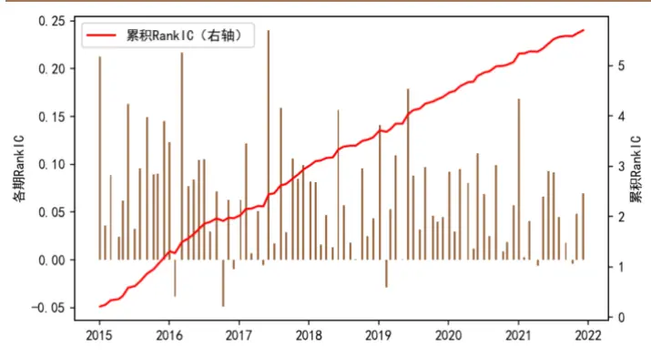
资料来源：Wind, 德邦研究所

图 10：机器学习反转因子的信息系数（中证 1000 成分）
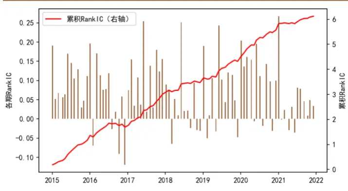
资料来源：Wind, 德邦研究所

## 3.4. 复合因子

## 3.4.1. 中证 1000 指数成分选股

2.3节与 2.4节的结果表明，机器学习反转因子比较擅长筛选出空头收益高的股票，而机器学习残差因子比较善于分辨收益居中的股票，这为复合因子的构建提供了较为合理的动机。按照式（7）所示的方式构建复合因子，图 11显示了复合因子的回测结果，与图 8相比，虽然多头（组 5）的收益在总体上没有显著提升，但多头组在近期的表现有所提升，且多空收益有显著提升。相对于图 8中的结果，因子对收益居中的股票的分辨能力也显著增加。

图 11：复合因子的分组回测结果
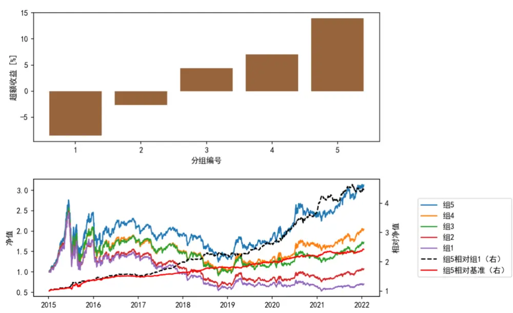
注：在中证 1000 指数成分股中选股，基准为中证 1000指数。资料来源： 德邦研究所

图 12 和图 13 显示了复合因子的信息系数。从 2015-01-05 至 2021-12-06，在全市场，平均 RankIC 为 0.066，Rank ICIR 为 1.132；而在中证 1000 成分中，平均 RankIC 为 0.07，Rank ICIR 为 0.8。

图 12：复合因子的信息系数（全市场）
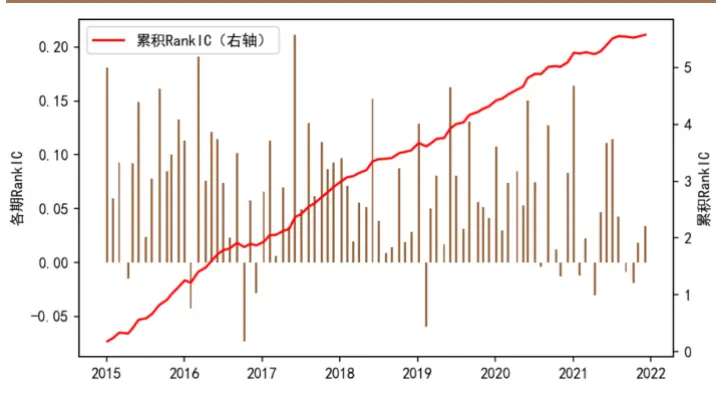
资料来源：Wind, 德邦研究所

图 13：复合因子的信息系数（中证 1000 成分）
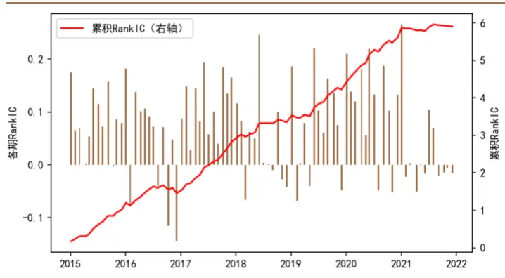
资料来源：Wind, 德邦研究所

表 2 列举了图 11中组 5在历史各完整年度的收益率以及各项统计指标。从

2015 年至 2021年，策略在每一年的超额收益均为正值。从 2015年初至今，策略相对中证1000指数的超额年化收益率约为 14%，信息比率为 2.35，且每一年信息比率均大于1.5。总体而言，策略在历史上实现了较为优异的表现。

表 2：行业平均主动暴露及年化超额收益率贡献

| 项目 | 2015 | 2016 | 2017 | 2018 | 2019 | 2020 | 2021 | 2015年初至今 |
| --- | --- | --- | --- | --- | --- | --- | --- | --- |
| 策略年化收益率 | 147.0% | -13.0% | -10.0% | -31.0% | 39.0% | 33.0% | 31.0% | 18.0% |
| 基准年化收益率 | 78.0% | -20.0% | -18.0% | -38.0% | 26.0% | 20.0% | 21.0% | 4.0% |
| 超额年化收益率 | 69.0% | 7.0% | 8.0% | 7.0% | 12.0% | 13.0% | 10.0% | 14.0% |
| 策略年化波动率 | 56.0% | 35.0% | 18.0% | 26.0% | 24.0% | 26.0% | 18.0% | 32.0% |
| 基准年化波动率 | 46.0% | 32.0% | 16.0% | 25.0% | 25.0% | 27.0% | 19.0% | 29.0% |
| 超额年化波动率 策略夏普比率 | 12.0% | 5.0% | 3.0% | 3.0% | 3.0% | 5.0% | 7.0% | 6.0% |
| (无风险收益 2%) | 2.61 | -0.43 | -0.66 | -1.27 | 1.5 | 1.17 | 1.66 | 0.51 |
| 基准夏普比率 (无风险收益 2%) | 1.64 | -0.71 | -1.22 | -1.6 | 0.98 | 0.66 | 1.01 | 0.06 |
| 信息比率 | 5.77 | 1.62 | 2.82 | 2.08 | 3.5 | 2.74 | 1.57 | 2.35 |
| 策略最大回撤 | 51.0% | 27.0% | 19.0% | 36.0% | 17.0% | 14.0% | 10.0% | 55.0% |
| 策略最大回撤起 始 | 2015/6/12 | 2016/1/6 | 2017/3/16 | 2018/1/8 | 2019/4/4 | 2020/3/5 | 2021/9/9 | 2015/6/12 |
| 策略最大回撤终 止 | 2015/9/15 | 2016/1/28 | 2017/6/1 | 2018/10/18 | 2019/6/6 | 2020/3/23 | 2021/10/28 | 2018/10/18 |
| 基准最大回撤 | 53.0% | 27.0% | 20.0% | 42.0% | 22.0% | 16.0% | 11.0% | 72.0% |
| 基准最大回撤起 始 | 2015/6/12 | 2016/1/6 | 2017/1/5 | 2018/1/8 | 2019/4/4 | 2020/2/25 | 2021/1/5 | 2015/6/12 |
| 基准最大回撤终 止 | 2015/9/15 | 2016/1/28 | 2017/12/25 | 2018/10/18 | 2019/8/9 | 2020/4/1 | 2021/2/5 | 2018/10/18 |
| 超额最大回撤 | 7.0% | 2.0% | 2.0% | 1.0% | 2.0% | 3.0% | 4.0% | 7.0% |
| 超额最大回撤起 始 | 2015-08-10 | 2016-02-16 | 2017-01-04 | 2018-07-25 | 2019-02-28 | 2020-08-27 | 2021-04-16 | 2015-08-10 |
| 超额最大回撤终 止 | 2015-09-02 | 2016-02-29 | 2017-01-16 | 2018-08-03 | 2019-03-07 | 2020-09-09 | 2021-07-01 | 2015-09-02 |
| 策略卡玛比率 | 2.85 | -0.49 | -0.52 | -0.86 | 2.25 | 2.35 | 3.3 | 0.33 |
| 基准卡玛比率 | 1.47 | -0.76 | -0.89 | -0.89 | 1.19 | 1.28 | 1.89 | 0.05 |
| 超额卡玛比率 | 9.87 | 3.19 | 5.03 | 5.12 | 5.45 | 4.95 | 2.64 | 2.05 |

注： 本表为图 11 中组 5 的策略评价结果，基准为中证 1000指数。资料来源：Wind，德邦研究所

图 14 显示了复合因子选股组 5 每日的双边换手率，由于我们采用月度调仓的模式，仅在调仓日双边换手率大于零。图中的红线的高度代表的是调仓日的换手率的均值，该数值为 0.678，故该策略的年度平均双边换手率为 8.14，换手率并不高。

图 14：策略的双边换手率
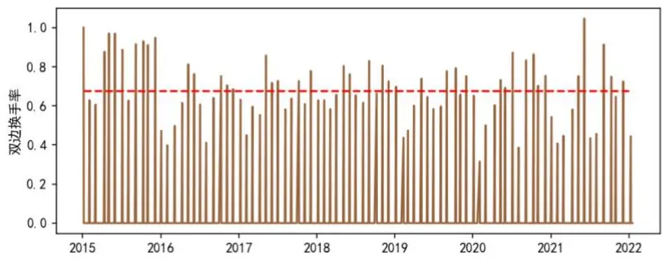
注：结果图 中组 的双边换手率。资料来源：Wind, 德邦研究所

## 3.4.2. 高集中度组合

图 11分五组回测的结果表明，因子的单调性非常好。那么，我们希望了解，如果继续细化分组，各组是否仍然能够保持单调性，头部组的多头收益以及尾部组的空头收益能否提高。为此，我们将全市场股票分 15组，随后各组与中证1000成分取交集。

图 15显示了所有分组的回报和净值。相对图 11中的多头组 1和空头组 5，高集中度多头组（组 15）的收益并未提高，但高集中度的空头组（组 1）的空头收益大幅提升，故多空净值曲线的表现有大幅提升，而多头净值曲线没有明显的变化。由于我们重点关注多头组，所以通过增加股票的集中度并不能提高策略表现。

图 15：高集中度组合
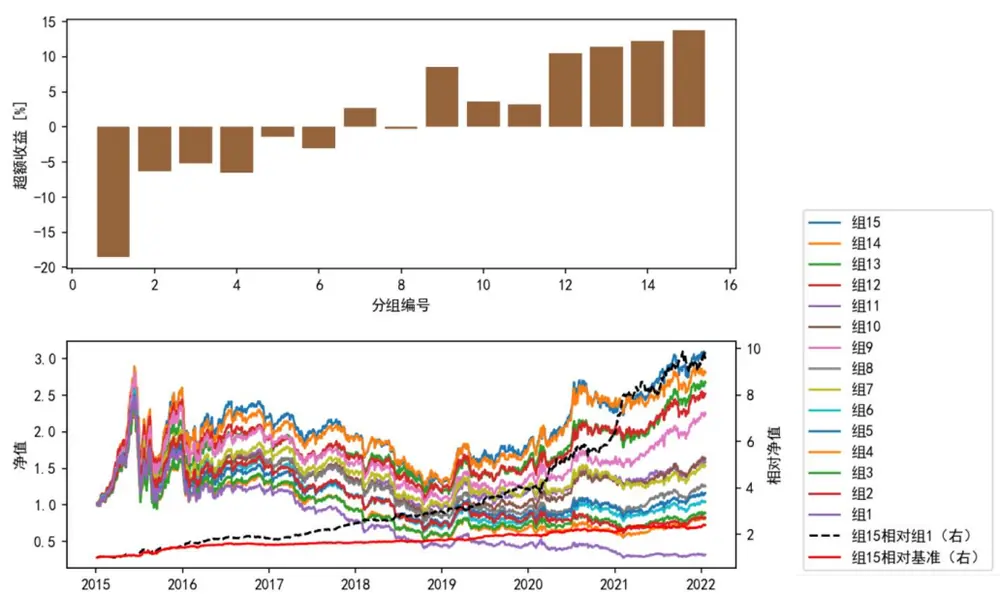
注：在中证 1000 指数成分股中选股，基准为中证 1000指数。资料来源：Wind, 德邦研究所

## 3.4.3.全市场、中证 500 指数成分、沪深 300 指数成分选股

图 16显示了利用复合因子在全市场选股的分组回测结果，计算超额收益时，以中证 1000指数为基准。相对于图 11，多头超额收益更高，多空净值曲线的波动率也略有降低。

图 17 显示了利用复合因子在中证 500指数成分中选股的分组回测结果。因子的选股能力远远超过我们在机器学习系列之二（图 8）中基于十个风格因子构造的机器学习残差因子的选股能力，在之前的系列中，多头组的超额收益率仅为约2%。因子选股能力的大幅度提升一方面来源于财务因子的增量信息，另一方面来源于因子构造方法的改进。

图 18 展示了利用复合因子在沪深 300指数成分股中选股的分组回测结果。虽然空头收益尚可，但多头收益极低，因此复合因子在沪深 300股票池中基本完全失去了有效性。

这样的结果比较符合预期，因为我们认为股价的有效性随着股票交易活跃度的上升而增加。因此，用量化方法寻找超额的难度随着股票池的交易活跃程度的上升而增加。对于沪深 300指数成分的量化选股，还需进一步从方法和数据层面进行探索。

至此，我们已经展示了复合因子在中证 500 指数和中证 1000指数成分股中的选股能力。我们认为，相对于中证500指数的稳定超额收益具有相对高的价值。这是因为市场上存在中证500股指期货，故可以在做多多头组合的同时做空该股指期货，从而降低投资组合的对于市场β风险的暴露。按这种方法，可以构造一个低波动率、低回撤的投资组合，并获得稳健的α收益。

图 16：复合因子的分组回测结果（全市场选股）
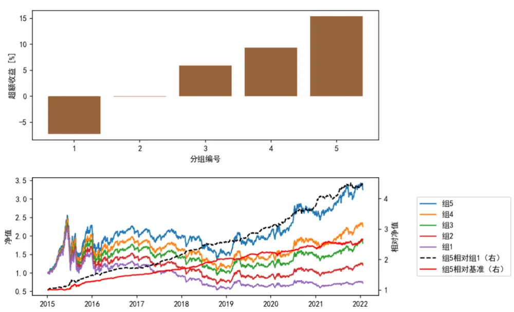
注：全市场选股，基准为中证 指数。资料来源： 德邦研究所

图 17：复合因子的分组回测结果（中证 500指数成分股）
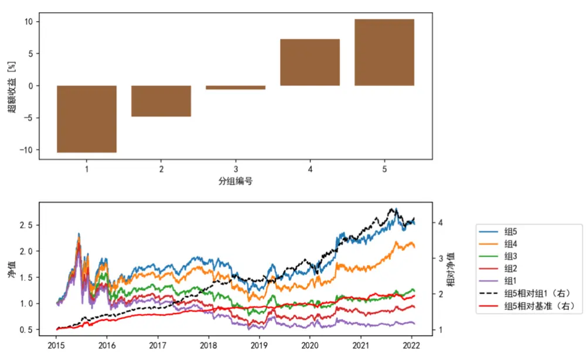
注：在中证 500 指数成分股中选股，基准为中证 500指数。资料来源：Wind, 德邦研究所

图 18：复合因子的分组回测结果（沪深 300指数成分股）
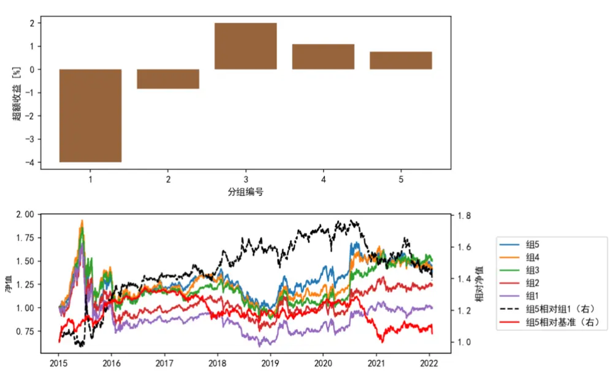
注：在沪深 300 指数成分股中选股，基准为沪深 300指数。资料来源： 德邦研究所

## 3.4.4. 组合容量测试

我们针对图 中的组 进行组合容量测试。由于我们采用全市场分组再与中证 1000股票池取交集的方式，随着全市场股票数量的增加，组合的股票数量也逐渐增加。平均而言，每期投资组合含有约 200只股票。组合容量测试时，各个股票必须逐个进行交易，且假设每天在各个股票上的买入或卖出量不超过当日该股票成交量的10%。若某只计划建仓的股票在换仓决策日涨停，则当天不进行交易，若该股票在后续日期中不再涨停，则依然买入该个股，故换仓日涨停的个股仍然有机会进入当期投资组合。图 19展示了不同初始资金量下的容量测试结果。初始资金量从10亿增加到 500亿，年化收益率从16.1%下降到11.1%。

图 19：复合因子的容量测试结果
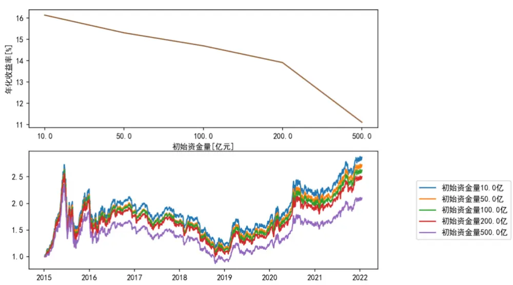
注：结果图 中组 的容量测试结果。资料来源： 德邦研究所

我们定义调仓完成度η为：

$$
\eta=\sum_{i}\omega_{i}\cdot\frac{S_{i}^{r}}{S_{i}^{t}},\tag{11}
$$

其中， $\omega_{i}$ 为股票i的目标权重， $S_{i}^{r}$ 为该股票的实际持仓股数， $S_{i}^{T}$ 为该股票的目标持仓股数，对所有目标持仓股数为正的股票进行求和。

图 20显示了不同初始资金量的、每次决策后第15日的调仓完成度。如果以决策后第 15日的调仓完成度总体上不低于 90%为标准，则策略的资金容量约为100 亿元。

图 20：决策后第 15 日调仓完成度
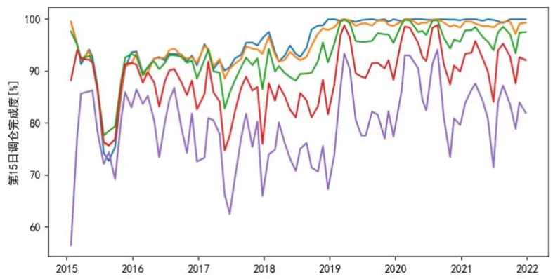
注：结果图 中组 的调仓完成度。资料来源：Wind, 德邦研究所

## 3.4.5. 组合收益归因

同机器学习系列之二中的方法，我们从风格、财务、行业三个角度对组合的超额收益进行归因。每期选股后，计算所选组合的平均风格、财务、行业因子暴露，减去基准的相应暴露，计算得到组合的主动暴露。在每一期，根据OLS回归计算各因子的收益率，将组合主动暴露与收益率相乘，可分别得到当期通过暴露各因子取得的超额收益。将各类因子的超额收益之和做复利叠加，即：

$$
n_{B}=\prod_{T}(1+B_{T-\Delta T}\cdot c_{T}),\tag{12}
$$

$$
n_{X}=\prod_{T}(1+X_{T-\Delta T}\cdot f_{T}),\tag{13}
$$

$$
n_{I}=\prod_{T}(1+I_{T-\Delta T}\cdot f_{T}),\tag{14}
$$

其中 $n_{B},~n_{X},~n_{I}$ 分别为风格、财务、行业因子主动暴露的回报的净值， $而$ 由这三者不可解释的净值被归因于特质选股回报。其他变量的含义同式（8）。

图 21显示了的风格、财务、行业因子的净值曲线和特质选股的净值曲线，图中的蓝线是组合净值除以基准（中证1000指数）的相对净值曲线。结果表明：

1）组合的特质选股回报最高，这是通过机器学习捕捉风格、财务因子的非线性效应得到的。

2）组合通过正确地暴露于财务因子，取得了长期稳定的超额收益。

3）组合在风格上有一定的收益，这是由于各个股票等权的构造组合方法使组合的风格相对基准略偏小盘。

4）组合在行业主动暴露的收益几乎为零。

图 21：组合收益归因
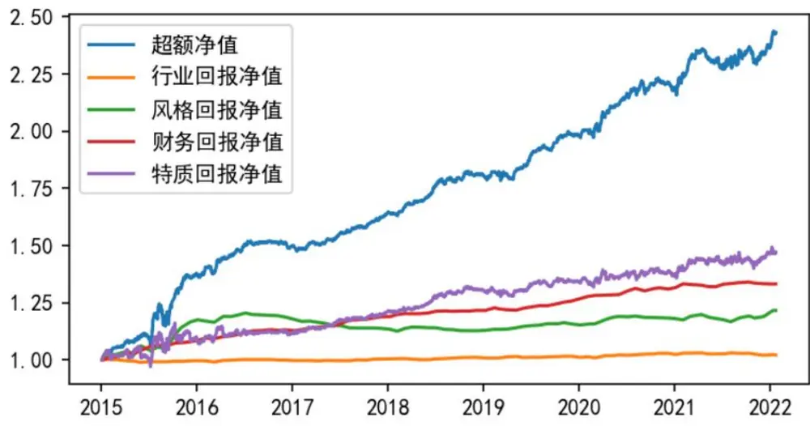
注：结果为图 11 中组 5 的收益归因；超额曲线根据组合净值除以基准净值得出。基准为中证 1000指数。资料来源：Wind, 德邦研究所

## 4. 结论

我们在前两期的研究中展示了基于十个风格因子的机器学习残差因子的选股能力，结果表明，该因子在全市场具有较强的选股能力，在中证 800范围内却很弱。为规避大市值股票池中因子选股能力欠佳和过小市值股票可投资性差这两个问题，我们主要从中证1000指数增强的角度开展本文的研究。

本文在机器学习系列之一、之二的基础上通过引入财务因子，显著增强了机器学习模型的选股能力。回测结果表明，引入少量几个财务因子即可大幅提高模型的选股能力。若只使用基于风格因子的机器学习模型选股，多头组合自 年起经历了大幅度、长时间的回撤。引入财务因子后，多头组合超额收益的均值和稳定性均大幅提高。这是因为财务因子带来的增量信息有利于机器学习模型对收益的建模。

基于同样的机器学习模型，我们考察了模型对最新一期收益进行拟合的残差。根据该残差，我们同样构建了风格中性的机器学习反转因子。机器学习反转因子的多头收益接近于机器学习残差因子，而空头收益则相对更强。

将机器学习残差因子和机器学习反转因子等权结合，可以构造一个复合因子。复合因子一定程度上结合了两个因子的优势，进一步提高超额收益的稳定性。我们重点对根据复合因子选股的组合进行了评价。该投资组合在每一年均取得正的超额收益。如果通过细化分组而构造高集中度组合，可以显著增强空头收益，但无法增强多头收益。我们考察了复合因子在全市场、沪深 300、中证 500、中证1000指数成分股内选股的有效性，因子仅在沪深 300指数成分股内失效，在其他股票池中均有效。组合容量测试的结果表明，策略容量可达百亿量级。收益归因的结果表明，超额收益主要来源于对财务因子的正确暴露，以及通过机器学习模型捕捉到的风格、财务因子非线性效应。

在本文的研究中，我们筛选了少量的财务因子，这些因子却能给机器学习模型的选股能力带来大幅度的提升。因此，有望通过系统化的方式从报表、分析师预测等数据中筛选有效的因子，进一步提高机器学习模型的选股能力。

## 5. 风险提示

市场风格变化风险，模型失效风险，数据可用性风险。

## 信息披露

## 分析师与研究助理简介

肖承志，同济大学应用数学本科、硕士，现任德邦证券研究所首席金融工程分析师。具有 年证券研究经历，曾就职于东北证券研究所担任首席金融工程分析师。致力于市场择时、资产配置、量化与基本面选股。撰写独家深度“扩散指标择时”系列报告；擅长各类择时与机器学习模型，对隐马尔可夫模型有深入研究；在因子选股领域撰写多篇因子改进报告，市场独家见解。

王成煜，慕尼黑工业大学计算流体力学博士，清华大学车辆工程本科，现任德邦证券研究所金融工程助理研究员。 年 月博士毕业，同年 8 月加盟德邦证券。致力于主动量化选股。

## 分析师声明

本人具有中国证券业协会授予的证券投资咨询执业资格，以勤勉的职业态度，独立、客观地出具本报告。本报告所采用的数据和信息均来自市场公开信息，本人不保证该等信息的准确性或完整性。分析逻辑基于作者的职业理解，清晰准确地反映了作者的研究观点，结论不受任何第三方的授意或影响，特此声明。

## 投资评级说明

| 1. 投资评级的比较和评级标准：以报告发布后的6个月内的市场表现为比较标准，报告发布日后6个月内的公司股价（或行业指数）的涨跌幅相对同期市场基准指数的涨跌幅；2. 市场基准指数的比较标准：A股市场以上证综指或深证成指为基准；香港市场以恒生指数为基准；美国市场以标普500或纳斯达克综合指数为基准。 | 类别 | 评级 | 说明 |
| --- | --- | --- | --- |
|  | 股票投资评级 | 买入 | 相对强于市场表现20%以上； |
|  |  | 增持 | 相对强于市场表现 5%~20%； |
|  |  | 中性 | 相对市场表现在-5%~+5%之间波动； |
|  |  | 减持 | 相对弱于市场表现5%以下。 |
|  | 行业投资评级 | 优于大市 | 预期行业整体回报高于基准指数整体水平10%以上； |
|  |  | 中性 | 预期行业整体回报介于基准指数整体水平-10%与10%之间； |
|  |  | 弱于大市 | 预期行业整体回报低于基准指数整体水平10%以下。 |

## 法律声明

本报告仅供德邦证券股份有限公司（以下简称“本公司”）的客户使用。本公司不会因接收人收到本报告而视其为客户。在任何情况下，本报告中的信息或所表述的意见并不构成对任何人的投资建议。在任何情况下，本公司不对任何人因使用本报告中的任何内容所引致的任何损失负任何责任。

本报告所载的资料、意见及推测仅反映本公司于发布本报告当日的判断，本报告所指的证券或投资标的的价格、价值及投资收入可能会波动。在不同时期，本公司可发出与本报告所载资料、意见及推测不一致的报告。

市场有风险，投资需谨慎。本报告所载的信息、材料及结论只提供特定客户作参考，不构成投资建议，也没有考虑到个别客户特殊的投资目标、财务状况或需要。客户应考虑本报告中的任何意见或建议是否符合其特定状况。在法律许可的情况下，德邦证券及其所属关联机构可能会持有报告中提到的公司所发行的证券并进行交易，还可能为这些公司提供投资银行服务或其他服务。

本报告仅向特定客户传送，未经德邦证券研究所书面授权，本研究报告的任何部分均不得以任何方式制作任何形式的拷贝、复印件或复制品，或再次分发给任何其他人，或以任何侵犯本公司版权的其他方式使用。所有本报告中使用的商标、服务标记及标记均为本公司的商标、服务标记及标记。如欲引用或转载本文内容，务必联络德邦证券研究所并获得许可，并需注明出处为德邦证券研究所，且不得对本文进行有悖原意的引用和删改。

根据中国证监会核发的经营证券业务许可，德邦证券股份有限公司的经营范围包括证券投资咨询业务。