## 金融工程专题

证券分析师

肖承志

资格编号：S0120521080003

邮箱：xiaocz＠tebon.com.cn

研究助理

## 王成煜

邮箱：wangcy3＠tebon.com.cn

## 相关研究

1. 《机器学习因子：在线性因子模型中捕获非线性—德邦金工文献精译第一期》 2021.9.17

2. 《利用机器学习捕捉因子的非线性效应—德邦金工机器学习专题之一》 2021.10.18

3. 《机器学习残差因子表现归因—德邦金工机器学习专题之二》2021.11.24

4. 《基于财务与风格因子的机器学习选股—德邦金工机器学习专题之三》 2022.01.25

# 动态因子筛选

# ——德邦金工机器学习专题之四

## [Table_Summ投资要点：

- 本文构建了一个在多个股票池中均有效的选股因子。本文构建的策略在沪深 300、中证 500、中证 1000 和全市场范围内均有良好的表现。

- 每个时期筛选不同的财务因子。不同财务因子在同一时期的表现不同，同一个财务因子在不同时期的表现也不同，这是在每一期筛选不同财务因子的原因。

- 客观的因子筛选减少了数据窥探偏误。根据一套客观的方法论来动态筛选因子，而不是主观地选择一批历史上有效的因子，可以更好地防止数据窥探的发生。

财务因子可以分为信号因子与噪音因子。在任意一个时期，部分财务因子与当期的股票收益率有相关性，这类因子为信号因子；部分财务因子与当期股票收益率无相关性，这类因子为噪音因子。

- 寻找规律稳定的因子并利用其动量。根据历史数据，寻找规律稳定的因子，并利用这一规律进行选股，这本质上是在利用因子的动量。

- 每年度进行三次因子筛选。我们选择一季度报、中报和三季度报披露的截止日期进行因子筛选。这样可以兼顾数据的及时性和同步性。

- 分四个步骤对因子进行预处理。我们依次按以下四个步骤处理因子：无量纲化处理、舍弃空值比例大的项目、中位数去极值和填空值。

用边际筛选因子的方法逐步扩大因子池。以十个 CNE5 风格因子起点，在边际上逐个筛选信息增益最大的因子，重复这个边际筛选因子的操作直到获得足够多的因子。

- 使用机器学习模型评价因子池的有效性。以机器学习模型在验证集的表现作为因子池评价的依据。验证集的结果表明，前几个入选的财务因子的边际贡献显著，后入选的财务因子作用很有限。

- 构建一个各个因子等权的线性多因子模型。根据最近一个季度的各个因子的信息系数的符号来确定因子暴露方向，用线性组合的方法等权地将各个因子合成一个单因子，把该模型作为对照组模型。

- 用各种机器学习模型构建一个集成模型。我们使用包括随机森林、GBDT、G 、 G 、 、神经网络、支持向量机等各类机器学习模型，构建了一个集成模型，该模型运用被筛选的因子进行训练、预测和选股。机器学习模型的表现远超线性多因子模型。

- 运用验证集评价、筛选机器学习模型以及确定权重。每一期，根据验证集的结果，集成模型中选用不同的机器学习模型种类、输入因子数量和权重。通过这种机制，尽可能避免数据窥探和筛选优质的机器学习模型。

- 风险提示：市场风格变化风险，模型失效风险，数据可用性风险

## 1. 前言

我们在上一期研报《基于财务与风格因子的机器学习选股—德邦金工机器学习专题之三》中介绍了一种利用财务因子来提高机器学习模型选股能力的方法，其中，我们直接给出了用到的财务因子，并且在整个样本期中均使用了同一批财务因子。实际上，因子的选择是重要的，一方面，我们需要筛选有效的因子；另一方面，筛选因子的过程必须是没有前视偏差的。如果因子的选择有前视偏差，则容易造成回测结果优异，样本外跟踪表现不佳的情况。

在本文中，我们讨论如何筛选有效的财务因子，提出一种系统性地运用机器学习方法筛选资产负债表、利润表、现金流量表中的财务因子的方法。文中也展示了基于风格因子和财务因子的机器学习模型的选股能力。

## 2. 方法

## 2.1. 筛选因子的逻辑

我们基于众多的财务、行情数据计算了数百个因子。一方面，不同的因子在同一时期的表现不同；另一方面，同一因子在不同的时期表现也不相同，这两点是我们进行因子筛选的底层逻辑。此外，相对于使用所有因子的方法，筛因子的方法可以显著降低模型的复杂度和过拟合风险，同时也能够规避在样本外规律发生反转的因子。

客观的因子筛选减少了数据窥探偏误。根据一套客观的方法论来动态筛选因子，可以更好地防止数据窥探的发生。相对而言，如果主观选择一批因子再进行回测，或有一定的“未来函数”的嫌疑，因为人们可以根据对过往的历史数据进行观察，事后选出历史上有效的因子，再运用这些因子进行选股。

## 2.1.1. 噪音与信号

在任意一个时期，我们考察期初的因子值与股票在该时期的收益率之间的关系，我们可以将因子划分为以下两个类别：

1）信号因子，因子值与股票收益之间存在相关性，这种相关性并不局限于线性关系。无论相关性是否线性，我们都可以根据这种相关性进行选股。

2）噪音因子，因子值与股票收益之间不存在显著的相关性，我们无法根据这类因子进行选股。

因子筛选的第一个任务，就是基于历史数据筛选出信号因子并排除噪音因子。

## 2.1.2. 因子动量

在连续的多个时期中，因子值与股票收益率之间的关系可能是时变的。例如，小市值因子从 2015年初至 2016 年底表现良好，具有非常显著的超额收益，但该因子却在 2017年间经历了显著回撤。

虽然如此，研究历史上因子的表现依然是有价值的，因为我们可以尝试利用表现相对稳定的因子的动量效应，即认为因子的效用会在短期延续。基于此，筛选因子时，强调两个方面的要求：

1）在中长期的历史统计中，因子是信号因子，与股票收益率之间存在一个统计上显著的关系。同样，这个关系不限于线性关系。

2）在近期的市场环境下，这个关系在统计意义上依然有效。

## 2.2. 因子库以及筛选方法

我们首先介绍本文使用的基于财务报表的因子库，然后介绍因子筛选方法。

## 2.2.1. 因子库和预处理

本文的因子库包括 CNE5 的 10 个风格因子以及来自于利润表的 66 个项目、来自资产负债表的 149 个项目和来自现金流量表的 86 个项目，上述每个因子均衍生出两个因子，即其季度和年度增速。所有财务数据的列表见附录。

因子预处理的第一步为无量纲化处理。对于这些项目中的大多数，并不使用项目的原始数值，因为总量类项目具有很大的量纲，例如，总营收、总利润等。对于这些总量类项目，我们将其数值除以公司的总资产。其余的均为比例类项目，例如净资产回报率、总资产回报率等，对于这些项目，直接使用原始值。

第二步是舍弃空值比例较大的项目，如果一个项目的空值比例达 40%以上，则舍弃该项目。

第三步是中位数去极值处理，为了避免财务因子极端值对模型的不利影响，对每一个财务因子，在每一个横截面上，我们采用式（1）的中位数去极值的方法去除极端值。

$$
\tilde{x}=\left\{\begin{array}{cc}{{x_{m}+n\cdot D,\qquad}}&{{if\quad x>x_{m}+n\cdot D}}\\{{x_{m}-n\cdot D,\qquad}}&{{if\quad x<x_{m}-n\cdot D}}\\{{x,\qquad}}&{{else}}\end{array},\right.\tag{1}
$$

其中，x是任意一个财务因子的值， $x_{m}$ 是因子值在横截面上的中位数，D是序列|x−$|\mathbf{x}_{\mathbf{m}}|$ 的中位数，n是一个参数，本文中取3，而x̃为去极值后的结果。

第四步是填空值，对于每一个项目，将空值填为横截面上的中位数。我们认为这比填零更好，因为填中位数表示该个股在该项目上的值是中性的，尽可能避免未知数值的因子发挥选股作用。

## 2.2.2. 筛选因子时间点

本文使用风格因子以及财报数据，其中风格因子为日频率数据，而财报数据在每年有三次集中披露。我们主要使用季度数据，A 股上市公司一季报、半年报和三季报的披露截止时间分别为 4月30日、8月31日和 10月31日。我们在这三个日期后的首个交易日进行横截面选股，即每年只进行三次选股。

选股的时间点不宜早于或者晚于上述三个披露截止日期，一方面，如果早于截止日期，部分公司尚未披露最新的财务数据，会出现将不同季度的数据进行对比的情况而有失公允；另一方面，如果晚于截止日期进行选股，则信息失去了时效性。

## 2.2.3. 边际筛选

我们采用边际筛选的方式从因子库中逐个筛选有效的因子加入当前因子池。在每次筛选的起点，我们将 CNE5 的十个风格因子作为初始因子池，遍历因子库中所有的因子，评价各个因子的边际贡献，挑选边际贡献最高的因子入选因子池。接下来重复这一过程，逐个在边际上筛选有效的因子。

这种筛选方法比较消耗算力，假设库中有N个因子，最终边际筛选K个因子，则单因子边际评价需要进行(2N−K+1)K/2次，时间复杂度为O(NK)。虽然如此，其效果显著好于对所有因子的单次遍历并筛选评价指标最高的K个因子的方法。如果仅对因子进行单次遍历，一方面，多个高度线性相关的有效因子会同时入选因子池，而这些因子互相间几乎不提供增量信息，却增加模型的复杂度和过拟合风险；另一方面，单次遍历的筛选方式也完全忽略了不同财务因子间的交互效应。如我们在研报《利用机器学习捕捉因子的非线性效应—德邦金工机器学习专题之一》中所述，因子的交互效应在一些场景下是重要的。

## 2.2.4. 因子评价

边际筛选因子时，我们需要对未入选的各个单因子的边际贡献进行评价。对于某个待选单因子x，首先评价加入x前的因子池的得分，再评价加入x后的因子池得分，两个得分之差即为x的边际贡献，边际贡献可能为正数或负数。

我们采用训练集—验证集的方式对一个因子池进行评价。对于任意一个时间点，我们把前三次季报的数据作为验证集（验证集的股票收益率均已知），把比验证集更早九次季报的数据作为训练集。我们将相邻两个披露截止日期间的所有股票回报记为 $R_{T}$ ，将前一个截止日期的风格因子和常数列记为 $B_{T-\Delta T}$ ，首先WLS回归股票收益率：

$$
R_{T}=B_{T-\Delta T}\cdot b+\varepsilon_{T},\tag{2}
$$

其中， $\varepsilon_{T}$ 为股票的特质收益率，b为回归得到的系数。通常，基于风格因子的线性回归对收益的解释力度较低，即 $\varepsilon_{T}$ 为股票收益R的绝大部分。将有k个财务因子的矩阵记为 $X_{Tk}$ ，随机森林的输入为 $B_{T}和X_{Tk}$ ，输出为 $\varepsilon_{T}$ ，用训练集数据训练一个随机森林模型。

接下来，将拟合得到的随机森林模型作用于验证集的风格和财务因子上，得到验证集的各个季度的预测值 $P_{1},P_{2},\ldots,P_{n_{v}}$ ，对应地，各期的实际特质收益率为$\varepsilon_{1},\varepsilon_{2},\ldots,\varepsilon_{n_{v}}\mathrm{{}^{\circ}}$ 。对验证集的各个季度，计算秩相关系数：

$$
\rho_{i}=\rho(P_{i},\varepsilon_{i}),\quad i=1{,}2,\ldots,n_{v},\tag{3}
$$

其中， $\rho(\cdot,\cdot)$ 为计算秩相关系数的函数。因子池 $\{\pmb{B}_{T},\pmb{X}_{Tk}\}$ 的最终得分即是验证集各期相关系数的代数平均数。

以下，我们对上述因子池评价的方法做几个关于模型原理、选择和参数调节的讨论：

1）我们选择基于回归决策树的随机森林进行因子筛选，做出这一选择的主要原因是随机森林模型具有强大的抗过拟合能力和相对较快的运算速度。随机森林方法的核心概念在于自助采样（bootstrap sampling）：给定m个样本的数据集，有放回地随机抽取一个样本放入采样集中，经过m次采样，可得到一个和原始数据集一样大小的采样集，由于有放回抽样，通常每个采样集和原始数据集不一样。对于有T个回归决策树的随机森林，需要通过上述抽样方法得到T个采样集，用每个采样集训练一个决策树模型，最终的模型输出为各个决策树输出的均值。单一的决策树有较强的过拟合倾向，但是他通过计算T个决策树的输出的均值，可以大幅度缓解过拟合。将因子的总数量记为k，我们选择决策树数量T的数值为：

$$
T=ceil(10\ln(k)),\tag{4}
$$

其中ceil()为向上取整函数，T随着因子数量增多而缓慢增加。

2）回归决策树从训练集中不断选取具有分类能力的特征，在每个分支节点，决策树选择重要性最高的特征划分数据集。由于每个决策树的样本数据不同，每个决策树的特征选择也不尽相同，这构成了特征选择的多样性。在我们的边际筛选因子的体系中，后入选的因子往往在较下层的分支节点才能被决策树选为分类特征。如果决策树的深度太浅，则造成欠拟合，如果深度太深，容易造成过拟合。因此，随着因子数量的增加，有必要逐渐增加决策树的深度D。同上，我们选择树的深度D的数值为因子总数量k的函数：

$$
D=ceil(2\ln(k)),\tag{5}
$$

3）训练集季报数量和验证集季报数量是两个重要的参数。一方面，如果使用过多的历史，则必然要使用较早期的市场数据，但市场的特征可能已经发生显著变化，不利于根据模型在未来做出超额收益。另一方面，如果使用过短的历史，则存在数据量不足、模型训练效果不佳、容易过拟合的问题。因此，必须权衡利弊，选择恰当的值。通常，验证集比训练集小，但验证集也不可过小以至于失去了可统计性。综合考虑各因素之后，我们选择以近三个季报的数据作为验证集，以更早的九个季报的数据作为训练集。

## 2.2.5. 典型情况样例

为帮助读者对因子筛选的过程形成更加直观的理解，我们以因子的正向暴露为例，列出几种典型的情况。

1）规律稳定的因子 A：在训练集和验证集上，正向暴露因子 A可以获得正超

额收益。因子 A容易通过筛选。

2）规律反转的因子 B：在训练集上，正向暴露因子 B可以获得正超额收益，但在验证集上，正向暴露于因子 B 却获得了负的超额收益。因子 B 不容易通过筛选。

3）规律不确定的因子 C：在训练集上，正向暴露因子 C 在一半样本上可以获得正超额收益，在另一半的样本上却得到了负的超额收益。无论因子 C在验证集上表现出何种特征，因子 C均不容易通过筛选。

4）近期失效的因子 D：在训练集上，正向暴露因子 D 可以获得超额收益，但在验证集上该规律不复存在。因子 D不容易通过筛选。

5）共线性的因子 E：若上述因子 A 通过了筛选，而因子 E 与因子 A 高度共线性，则因子 E不容易通过筛选。

6）噪音因子 F：噪音因子一般不能通过筛选。

图 1 是暴露于上述各种类型的单因子的投资组合的净值曲线的示意图。根据上述特征，各个投资组合的净值曲线在训练集、验证集上呈现出了相应的典型特征。

图 1：各种类型因子的效果示意图
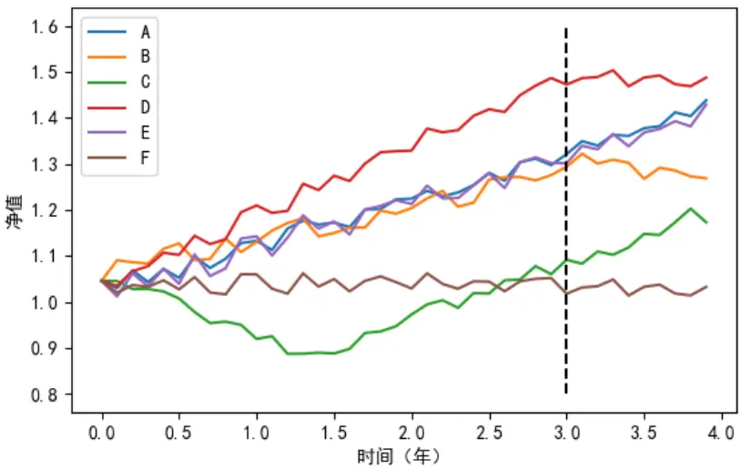
注：虚线以左为训练集，虚线以右为验证集。资料来源：德邦研究所绘制

## 2.3. 预测模型

## 2.3.1. 线性多因子模型

我们首先构造一个线性多因子模型作为对照组，选股因子的值等于各个入选的因子乘以一个正负号后等权求和，即：

$$
F_{0}=\sum_{i}s_{i}\cfrac{x_{i}}{\sigma_{xi}},\tag{6}
$$

其中 $x_{i}$ 为输入因子的值， $\sigma_{xi}$ 为因子的标准差， $s_{i}$ 为该因子的符号，该符号由上一期因子的信息系数的正负号决定。例如，2021.10.31筛选一批因子，根据 2021.8.31的因子值和从2021.8.31到2021.10.31的股票回报计算这批因子上一期的信息系数，若信息系数为正，则因子符号为正，反之则为负。按照这种方式构建的等权线性基准简单、易于理解，能较好地说明入选的因子的有效性。

## 2.3.2. 机器学习模型列表

2.2 节中介绍的边际筛选因子的方法消耗的算力较大，因为需要在每个横截面上训练大量的随机森林模型。因此，这也要求使用的机器学习模型运算量相对小。

相比之下，基于筛选到的因子训练预测模型时，训练模型的次数较少，故预测模型可以运用更多和更加复杂的机器学习模型，我们使用了包括随机森林、GBDT、XGBoost、LGBM、AdaBoost、神经网络、支持向量回归等机器学习模型。其中前五种机器学习模型都是基于决策树的模型，具有类似的特性，而后面两种模型不依赖于决策树模型。之所以使用较多的模型，是因为不同的模型拟合的不同噪音通常互相削弱，从而可以突出最终的选股因子中的信号成分。

随机森林通过多个决策树训练样本，可以快速判断高维度的数据，并且可以通过集成的方法抗过拟合。GBDT(梯度提升决策树)利用前向分布算法，迭代前一轮的弱学习器减少本轮误差。GBDT可以防止过拟合、鲁棒性强，但计算复杂度相对高。XGBoost(分布式梯度增强)是对梯度提升算法的改进，对损失函数进行二阶泰勒展开且通过加入正则化项控制模型的复杂程度。XGBoost 可并行处理，相较GBDT 精度更高，但因复杂度过高会消耗较多内存。LGBM(轻量级的梯度提升树)采用直方图算法降低计算复杂度和内存使用，但会损失一定精度。AdaBoost(自适应性增强)赋予难以预测的数据更多权重，同时在每一轮中加入新的弱分类器。AdaBoost 优势在于简单且精度高，但对异常值较为敏感而且不能并行。神经网络的节点(神经元)由加权值(权重)连接，可以设置不同的隐藏层数、层的种类、神经元数和激发函数，具有较高的自由度，但并不自带集成功能、容易过拟合。支持向量回归需定义一个偏差值，当模型输出和真实输出之间的差的绝对值大于偏差值时计算损失并最小化损失。支持向量回归可以解决小样本和非线性问题，但不适用于超大数据集，且对缺失数据较为敏感。总体来说，不同的机器学习模型各有千秋，难以绝对、单一地进行评判。在预测股票特质收益率的应用场景中，由于数据的噪音很大，很大程度上我们是在利用异质的模型去拟合不同的噪音，并期望在集成模型中抑制噪音。

## 2.3.3. 模型动态筛选与加权

众多机器学习模型的机理或参数各有差异，因此，如果以模型筛选的股票的超额收益来进行评价，则必然存在“好”和“差”的模型，好的模型带来正超额收益，差的模型带来负超额收益。需要强调的是，我们必须以动态的眼光来评价模型，因为同一个模型在每个时期的表现不尽相同。在筛选模型时，需要明确以下几个方面：

## 1）集成模型中使用的机器学习模型的种类和个数

## 2）各个模型使用的参数，包括模型的参数和输入因子的个数

## 3）集成模型中各个模型的权重

在构建预测模型之前，我们通过边际筛选因子的方式，对全部因子的有效性进行了排序，但并没有确定机器学习模型具体该用多少个因子，因此有必要在构建预测模型阶段确定使用的因子的数量。通常而言，对于集成的树模型（随机森林、GBDT、XGBoost、LGBM、AdaBoost）而言，模型对于输入因子的数量不敏感，即使添加一个噪音输入，模型的表现也不会显著变差。然而，对于其他模型，因子数量过多会引入过多的噪音，可能使得模型的表现显著下降。

实际上，选择模型阶段，有较大的可能性发生数据窥探，即测试者尝试用不同的模型进行滚动训练和回测，然后最终选择使得回测结果最优的模型。数据窥探的一个可能后果是，策略在历史回测中表现优异，而样本外实盘跟踪效果不佳。

为了尽可能地规避选择模型阶段的数据窥探问题，我们用一种系统化的方式来筛选模型并对模型预测值进行加权。与筛选因子的思路类似，我们采用验证集评价的方式筛选模型。同样地，以过去三期的季报为验证集，以更早的九期季报为训练集，考察不同模型在验证集上的选股能力。

我们更关心组合的多头收益而非多空收益，因此定义一个多头分位数指标λ来衡量因子的多头选股能力。指标λ的计算方法如下：首先计算每个股票在全市场收益率排名的分位数，跌幅最大的股票分位数为 0，涨幅最大的股票分位数为 1，然后计算选股因子值最大的全市场 20%的股票的平均分位数。

我们以验证集的三个季度的多头分位数的平均值λ̅作为模型的评价指标，该指标越大，说明模型在历史上有越好、越稳定的表现。对于任意一个模型 $\mathbf{M}_{i}(n)$ ，其中i代表模型的序号，n代表模型的输入因子数（例如，如果输入10个风格因子和1个财务因子，则 $n=11)$ ），那么 $\bar{\lambda}_{i}$ 是n的一个函数，我们找到使得 $\lambda_{i}$ 最大的输入因子数 $n_{i}$ ，即：

$$
n_{i}=\operatorname*{argmax}_{n}\bar{\lambda}_{i}(n).\tag{7}
$$

我们把模型 $\mathbf{M}_{i}$ 在验证集上最大的多头分位数记为 $\hat{\lambda}_{i}$ ，即 $\hat{\lambda}_{i}=\bar{\lambda}_{i}(n_{i})$ ，如果该数值大于 0.5，则入选股票的表现总体上强于市场，如果数值小于 0.5，则入选股票总体上弱于市场。如果选股因子是一个噪音，那么 $\hat{\lambda}_{i}$ 的数值应该很接近0.5。基于此，我们定义模型 $\mathbf{M}_{i}$ 的权重 $w_{i}$ 为：

$$
w_{i}=\operatorname*{max}(\hat{\lambda}_{i}-0.5,0).\tag{8}
$$

根据式（8），如果一个因子越接近于噪音，则其权重就越低。

最终的集成模型的因子值F的计算方法为：

$$
F=\sum_{i}w_{i}{\cfrac{f_{i}}{\sigma_{i}}},\tag{9}
$$

其中， $f_{i}$ 为模型 $\mathbf{M}_{i}$ 预测的因子值， $\sigma_{i}$ 为因子值的标准差。我们使用众多机器学习模型，对于这些模型中“差”的机器学习模型，有两种可能性：第一，其 $\lambda_{i}$ 不超过0.5，则其权重为零，不对结果F产生影响；第二，其 $\lambda_{i}$ 仅略高于0.5，则其权重非常低，对结果影响微乎其微。因此，因子值F对于低质量的模型并不敏感。

确定了各个机器学习模型使用的因子数量和权重，最终的预测模型使用过去十二期季报的数据进行训练，并以根据最新一期季报的数据进行预测。

## 2.4. 投资组合构造方法

为便于调仓，我们规定调仓日期为每个月的第一个非节假日的星期一。我们采用一种较保守的回测方式，在每个调仓日排除以下情况的股票：

## 1）暂停交易

## 2）ST 或*ST

## 3）收盘涨停

4）上市不满 20日的股票

我们在不同的股票池内进行选股，包括沪深 300指数成分、中证 500指数成分、中证 1000指数成分和全市场。在任意一个股票池内进行选股时，可以按照两种不同的方式进行分组：

1）对所有成分股，根据因子值的大小进行排序和均匀分组。

2）对全市场的股票，根据因子值的大小进行排序和均匀分组，随后，各个分组的股票再和股票池成分取交集。

显然，若在全市场选股，则分组是均匀的。在指数成分股内选股的情况下，按照方法一，各个分组的股票数量是均匀，按照方法二，各个分组的股票数量可能存在一定差异。我们倾向于使用方法二进行分组，因为这种方法更好地表达了选股因子的观点，然而，如果各个分组股票数量差异过大，我们选用方法一进行分组。具体来说，对于沪深 300 指数成分，我们选用方法一，对其他情况均采用方法二。

下文中，我们将方法一称为均匀分组法，将方法二称为非均匀分组法。

## 3. 结果

## 3.1. 筛选因子

我们在每个最接近披露截止日期的交易日进行因子筛选，图 2 显示了各年度和各季度筛选因子的验证集 RankIC，图例中显示的时间是筛选因子的日期，对于每一个日期，均以前三次季报的数据作为验证集，以更早的九次报告的数据作为训练集，训练和验证因子筛选模型。图 2 的第一行子图的验证集对应于八月底的因子和从八月底至十月底的收益率；第二行子图的验证集对应于上一年十月底的因子和从上一年十月底至四月底的收益率；第三行子图的验证集对应于四月底的因子和从四月底至八月底的收益率。

图 2：验证集 RankIC
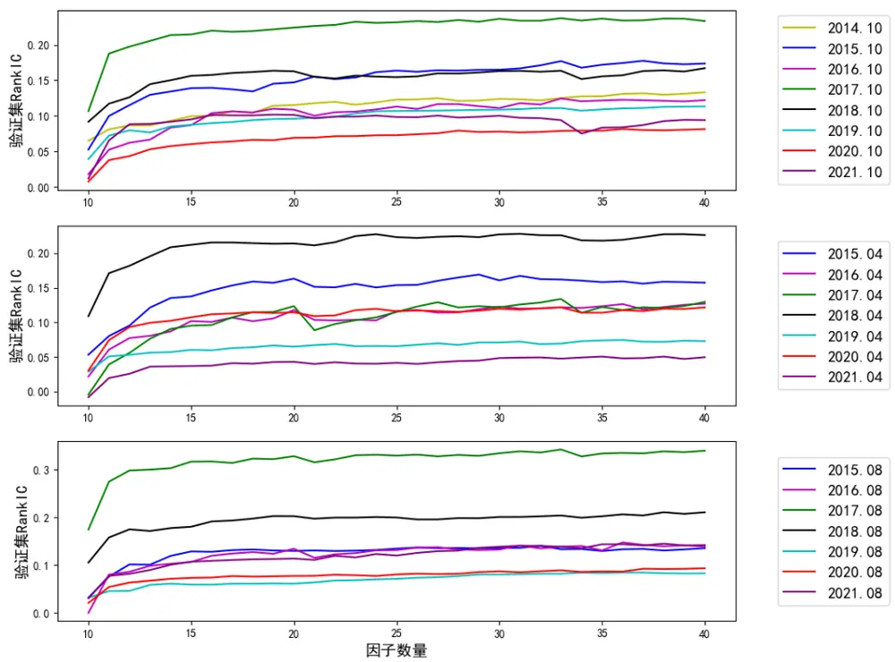
资料来源：Wind, 德邦研究所

总体上，图 2中各条曲线的走势相近，随着财务因子数量的增加，RankIC先平缓增加，再趋于平缓。筛选的起点是 10个风格因子，因此，第 11个因子是首个财务因子。图 2 表明，引入首个财务因子的边际提升最明显，因为相对最有效的财务因子会被首先挑选出来。从第 17个财务因子起，验证集 RankIC随着因子数量的增加不再有显著变化，这是因为因子库中有效的因子的总数并不多。

表 1 列举了各个年度、季度前五个被筛选出的财务因子的列表，因子按照被筛选出来的顺序从上往下排列。一个具有代表性的例子是净资产回报率（ROE），根据传统的有效性检验方法的结果，该指标有效性的分水岭是 2017年，在2017年前后该指标由无效变得有效。而在我们提出的动态筛选因子的框架中，自2018年三季度起净资产回报率密集入选前五名有效因子，而此前很少入选。

根据表 1，多数入选财务因子与利润、营收以及增速相关，部分与现金流、负债、费用以及增速相关，筛选结果比较符合通常的认知。另一方面，少数不太常用的财务因子，例如应交税费的年度增速、应付职工薪酬等因子也偶尔入选，说明这些非常用因子在某些时期也能发挥一定的选股作用。

表 1：各季度入选的前五个因子

| 2015.04 | 2015.08 | 2015.10 |
| --- | --- | --- |
| 固定资产 | 固定资产 | 净利润_年度增速 |
| 季度净资产回报率年度增速 | 应收票据_季度增速 | 固定资产折旧、油气资产折耗、生物性生物资产折旧_年度 增速 |
| 管理费用 | 基本每股收益_年度增速 | 综合收益总额 |
| 销售费用_年度增速 | 投资净收益_季度增速 | 基本每股收益_年度增速 |
| 应收票据_季度增速 | 动量_季度增速 | 无形资产摊销 |
| 2016.04 | 2016.08 | 2016.10 |
| 归属母公司股东的净利润_年度增速 | 营业利润_年度增速 | 净利润_年度增速 |
| 固定资产(合计) | 应付职工薪酬 | 负债合计_年度增速 |
| 管理费用 | 销售商品、提供劳务收到的现金_季 度增速 | 非流动资产合计_年度增速 |
| 固定资产折旧、油气资产折耗、生物性生物资产折旧_年 度增速 | 资产总计_季度增速 | 处置固定资产、无形资产和其他长期资产收回的现金净额 季度增速 |
| 货币资金_季度增速 | 分配股利、利润和偿付利息所支付的 现金 | 基本每股收益 |
| 2017.04 | 2017.08 | 2017.10 |
| 其他应付款 | 利润总额 | 营业总收入_年度增速 |
| 资产总计_季度增速 | 少数股东权益_年度增速 | 预收账款 |
| 营业利润_年度增速 | 负债合计_年度增速 | 归属母公司普通股东综合收益总额 |
| 经营活动现金流入小计_年度增速 | 支付的其他与经营活动有关的现金 | 盈余公积金_季度增速 |
| 应收票据及应收账款 | 流动负债合计 | 存货_季度增速 |
| 2018.04 | 2018.08 | 2018.10 |
| 稀释每股收益 | 稀释每股收益 | 归属母公司股东的净利润 |
| 应交税费_年度增速 | 季度净资产回报率季度增速 | 季度净资产回报率 |
| 长期借款 | 财务费用 | 季度净资产回报率年度增速 |
| 管理费用 | 财务费用_年度增速 | 筹资活动现金流出小计_季度增速 |
| 少数股东权益 | 归属母公司普通股东综合收益总额 | 资本公积金_年度增速 |
| 2019.04 | 2019.08 | 2019.10 |
| 净利润 | 利润总额_季度增速 | 支付给职工以及为职工支付的现金 |
| 流动资产合计_季度增速 | 预收账款_年度增速 | 季度净资产回报率季度增速 |
| 稀释每股收益_季度增速 | 投资活动现金流出小计_季度增速 | 营业总收入_年度增速 |
| 基本每股收益_年度增速 | 经营活动现金流入小计_季度增速 | 利润总额_年度增速 |
| 投资活动现金流出小计_年度增速 | 固定资产报废损失_季度增速 | 经营活动产生的现金流量净额 |
| 2020.04 营业总收入_年度增速 | 2020.08 | 2020.10 |
| 购建固定资产、无形资产和其他长期资产支付的现金 | 稀释每股收益 | 净利润 |
| 经营活动现金流出小计 | 营业总收入_年度增速 | 净利润_年度增速 |
| 收到的税费返还 | 支付给职工以及为职工支付的现金 | 应付票据及应付账款 |
| 未分配利润_季度增速 | 综合收益总额_季度增速 | 季度净资产回报率季度增速 |
|  | 长期股权投资_年度增速 | 期末现金及现金等价物余额_年度增速 |
| 2021.04 季度净资产回报率 | 2021.08 | 2021.10 |
|  | 季度净资产回报率 | 固定资产折旧、油气资产折耗、生物性生物资产折旧 |
| 收到其他与经营活动有关的现金 | 营业利润_年度增速 | 所得税_季度增速 |
| 净利润 预付账款_年度增速 | 市值_季度增速 营业总收入_季度增速 | 存货 收到其他与筹资活动有关的现金_季度增速 |
| 净利润 | 稀释每股收益_季度增速 | 应交税费_季度增速 |

资料来源：Wind，德邦研究所

## 3.2. 分组回测

首先，我们根据式（6）计算线性多因子模型的因子值，限于篇幅，我们仅展示该因子在全市场做分组回测的结果。我们根据式（7）计算了合成因子并测试了该因子在不同股票池内的表现，包括沪深 300 指数、中证 500 指数、中证 1000指数和全市场。我们发现，该因子在各个股票池内都有显著的选股效果。

## 3.2.1. 线性多因子模型

图 3显示了线性多因子模型的全市场信息系数，平均 RankIC为 0.06，RankICIR为 0.61。虽然因子有一定选股能力，但总体表现差强人意。这是因为线性多因子模型过于简单，并且只依赖于单期的数据，稳定性比较弱。

图 3：线性多因子模型的全市场信息系数
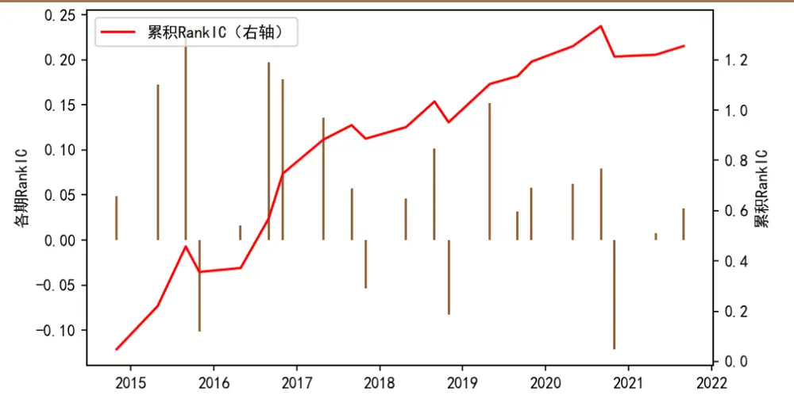
资料来源：Wind，德邦研究所

图 4 显示了根据线性多因子模型因子在全市场分组回测的结果，采用等权的方式构造投资组合，基准为中证 1000指数。从全回测期的超额收益来看，分组有较好的单调性，说明入选的因子总体上是有效的。然而，组 5的超额收益并不高。从超额收益的时间序列来看，在整个回测期其稳定性较差。

图 4：全市场分组回测，基于线性多因子模型
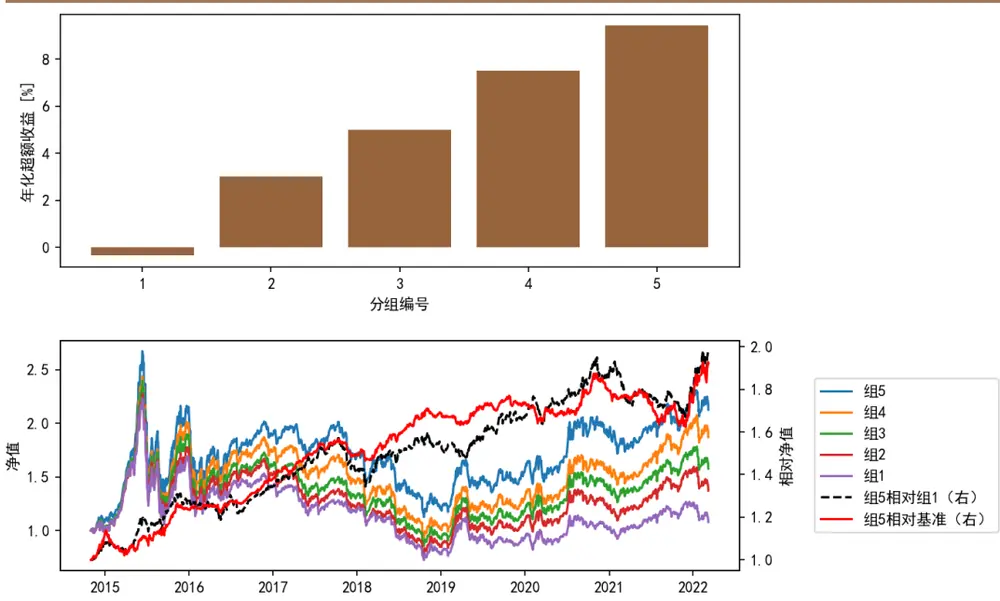
注：等权构造组合，均匀分组，基准为中证 1000指数。
资料来源：Wind，德邦研究所

如果使用该因子在沪深 300 指数、中证 500 指数、中证 1000 指数成分股内进行分组回测，表现同样差强人意。此外，我们尝试了使用过去三期、六期、十二期的数据做线性回归来确定因子符号的方法，结果均不够理想，限于篇幅我们不逐一展示。以下，我们仅展示基于机器学习集成模型计算的选股因子的回测结果。

## 3.2.2. 沪深 300 指数增强

根据机器学习集成模型因子在沪深 300 指数成分内选股，从 2014-10-31 至2021-08-30，因子各期 RankIC 的时间序列见图 5，平均 RankIC 为 0.142，Rank

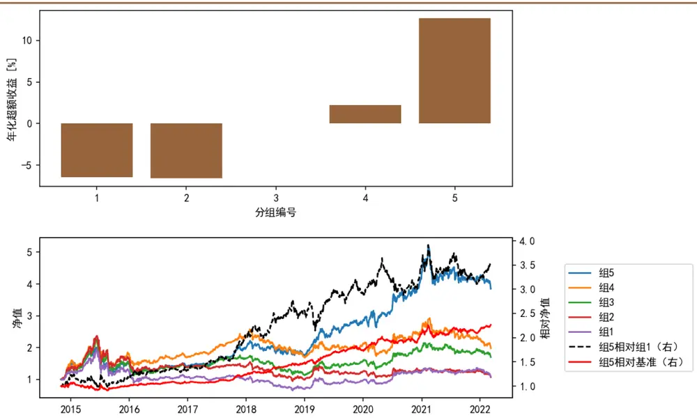
图 6：沪深 300指数成分股分组回测

ICIR为 1.037。在绝大部分时期，因子的 RankIC为正。由于RankIC指标反映的是池内的股票的收益率与因子值的秩相关系数，总体上反映了因子的多空收益水平，因此，即使 RankIC的数值为负数，多头组也并非绝对弱于整个股票池的平均水平。因此，我们需要综合考察 RankIC和分组回测的结果来考察因子的表现。

图 6显示了沪深 300指数成分股的分组回测的结果。考虑到沪深 300指数的构造方法，我们在构建投资组合时使各个股票按照自由流通市值加权。在回测时期内，多头组 5的年化超额收益为12.6%，组1的空头收益为 6.4%。黑色的虚线为组 5 相对组 1 的多空收益曲线，该曲线具有整体上行的趋势，但波动较大。红色的实线显示了多头组 5相对于沪深 300指数的超额收益，该超额收益曲线较为稳健。多头组 5 的分年度表现见表 2，超额收益在近六年均正。多头组 5 的年均双边换手率仅为 3.62，组合的换手率极低。

图 5：沪深 300指数成分内的信息系数
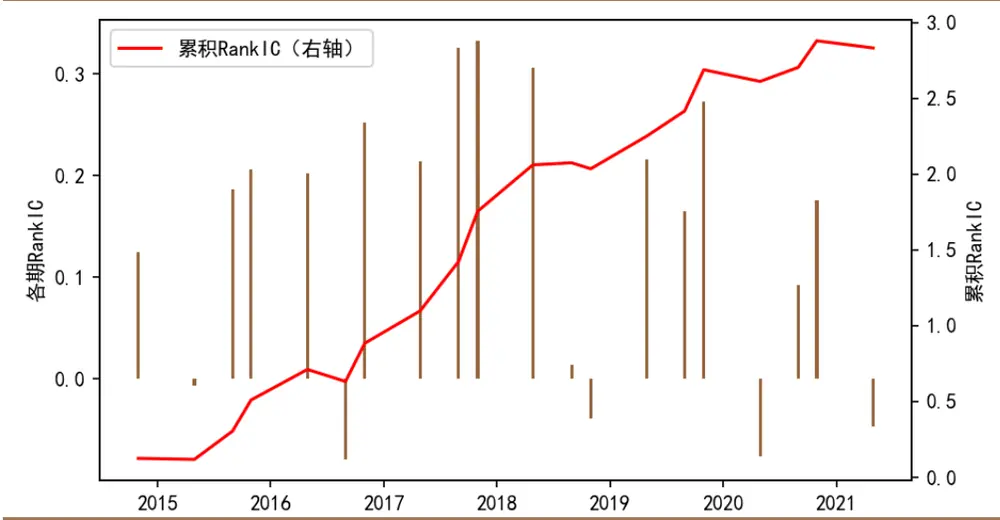
资料来源：Wind，德邦研究所
注：按照自由流通市值加权构造组合，均匀分组，基准为沪深 指数。资料来源： ，德邦研究所

表 2：沪深 300指数成分股组 5的分年度表现

|  | 2015 | 2016 | 2017 | 2018 | 2019 | 2020 | 2021 | 2015年初 至今 |
| --- | --- | --- | --- | --- | --- | --- | --- | --- |
| 策略年化收益率 | -0.01 | -0.05 | 0.42 | -0.11 | 0.62 | 0.54 | -0.02 | 0.21 |
| 基准年化收益率 | 0.06 | -0.12 | 0.22 | -0.26 | 0.37 | 0.28 | -0.05 | 0.09 |
| 超额年化收益率 | -0.07 | 0.06 | 0.19 | 0.15 | 0.25 | 0.25 | 0.03 | 0.13 |
| 策略年化波动率 | 0.41 | 0.19 | 0.12 | 0.24 | 0.21 | 0.25 | 0.24 | 0.25 |
| 基准年化波动率 | 0.39 | 0.21 | 0.1 | 0.21 | 0.2 | 0.23 | 0.18 | 0.23 |
| 超额年化波动率 | 0.13 | 0.07 | 0.06 | 0.07 | 0.08 | 0.08 | 0.1 | 0.09 |
| 策略夏普比率(rf=2%) | -0.08 | -0.4 | 3.27 | -0.54 | 2.92 | 2.1 | -0.17 | 0.77 |
| 基准夏普比率(rf=2%) | 0.1 | -0.65 | 2.02 | -1.31 | 1.78 | 1.15 | -0.4 | 0.28 |
| 信息比率 | -0.52 | 0.91 | 3.46 | 2.15 | 3.07 | 3 | 0.31 | 1.42 |
| 策略最大回撤 | 0.44 | 0.17 | 0.07 | 0.21 | 0.11 | 0.17 | 0.24 | 0.44 |
| 策略最大回撤起始 | 2015-06-08 | 2016-01-06 | 2017-11-21 | 2018-01-26 | 2019-04-19 | 2020-03-05 | 2021-02-10 | 2015-06-08 |
| 策略最大回撤終止 | 2015-08-25 | 2016-01-28 | 2017-12-07 | 2018-10-29 | 2019-05-09 | 2020-03-23 | 2021-03-24 | 2015-08-25 |
| 基准最大回撤 | 0.43 | 0.19 | 0.06 | 0.32 | 0.13 | 0.16 | 0.18 | 0.47 |
| 基准最大回撤起始 | 2015-06-08 | 2016-01-06 | 2017-11-22 | 2018-01-24 | 2019-04-19 | 2020-03-05 | 2021-02-10 | 2015-06-08 |
| 基准最大回撤终止 | 2015-08-26 | 2016-01-28 | 2017-12-07 | 2018-12-27 | 2019-06-06 | 2020-03-23 | 2021-07-27 | 2016-01-28 |
| 超额最大回撤 | 0.16 | 0.04 | 0.03 | 0.03 | 0.06 | 0.07 | 0.11 | 0.16 |
| 超额最大回撤起始 | 2015-01-15 | 2016-09-26 | 2017-11-16 | 2018-02-22 | 2019-02-14 | 2020-04-28 | 2021-02-10 | 2015-01-15 |
| 超额最大回撤终止 | 2015-08-17 | 2016-11-17 | 2017-11-27 | 2018-04-18 | 2019-03-07 | 2020-08-03 | 2021-03-16 | 2015-08-17 |
| 策略卡玛比率 | -0.03 | -0.31 | 5.77 | -0.52 | 5.58 | 3.18 | -0.09 | 0.49 |
| 基准卡玛比率 | 0.13 | -0.6 | 3.69 | -0.81 | 2.75 | 1.75 | -0.29 | 0.18 |
| 超额卡玛比率 | -0.44 | 1.61 | 7.45 | 5.49 | 4.32 | 3.57 | 0.28 | 0.83 |

注：按照自由流通市值加权构造组合，均匀分组，基准为沪深 300指数。资料来源： ，德邦研究所

## 3.2.3. 中证 500 指数增强

根据机器学习集成模型因子在中证 500 指数成分内选股，从 2014-10-31 至2021-08-30，因子各期 RankIC 的时间序列见图 7，平均 RankIC 为 0.082，RankICIR 为 0.705。因子的 RankIC 在多数时期为正。

图 7：中证 500指数成分内的信息系数
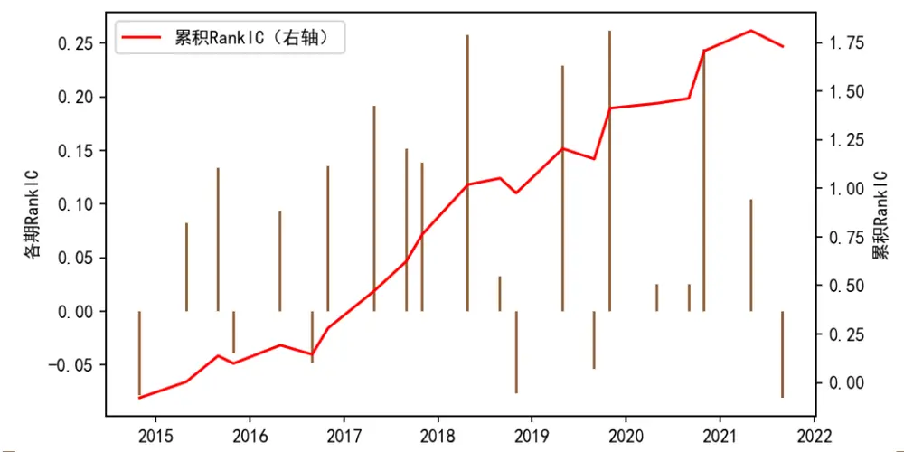
资料来源：Wind，德邦研究所

图 8显示了中证 500指数成分股的分组回测的结果。我们采用各个股票等权

的方式构造组合。在回测期内，五组的单调性好，多头组 5 的超额收益接近 10%，超额收益稳定性极佳。多头组 5 的分年度表现见表 3，超额收益在全部年份均为正。组合的年均双边换手率为 4.28，换手率较低。

图 8：中证 500分组回测
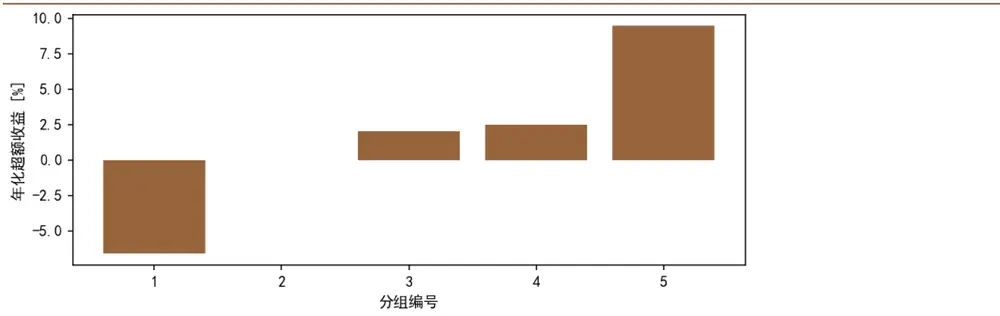

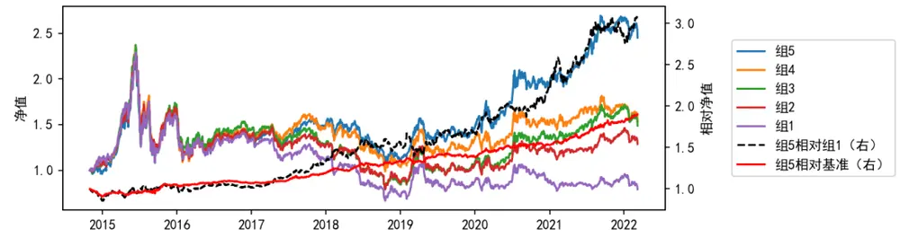
注：等权构造组合，非均匀分组，基准为中证500指数。资料来源： 德邦研究所

表 3：中证 500指数成分股组 5的分年度表现

|  | 2015 | 2016 | 2017 | 2018 | 2019 | 2020 | 2021 | 2015年初 至今 |
| --- | --- | --- | --- | --- | --- | --- | --- | --- |
| 策略年化收益率 | 0.67 | -0.17 | 0.11 | -0.25 | 0.31 | 0.35 | 0.38 | 0.14 |
| 基准年化收益率 | 0.44 | -0.18 | 0 | -0.34 | 0.27 | 0.22 | 0.16 | 0.04 |
| 超额年化收益率 | 0.22 | 0.02 | 0.11 | 0.09 | 0.04 | 0.13 | 0.22 | 0.1 |
| 策略年化波动率 | 0.49 | 0.3 | 0.16 | 0.25 | 0.22 | 0.27 | 0.16 | 0.28 |
| 基准年化波动率 | 0.45 | 0.29 | 0.15 | 0.24 | 0.23 | 0.26 | 0.15 | 0.27 |
| 超额年化波动率 | 0.09 | 0.04 | 0.04 | 0.05 | 0.06 | 0.06 | 0.07 | 0.06 |
| 策略夏普比率(rf=2%) | 1.33 | -0.61 | 0.59 | -1.11 | 1.35 | 1.19 | 2.17 | 0.43 |
| 基准夏普比率(rf=2%) | 0.95 | -0.7 | -0.15 | -1.5 | 1.08 | 0.77 | 0.92 | 0.09 |
| 信息比率 | 2.58 | 0.46 | 3.04 | 1.9 | 0.73 | 2.14 | 3.03 | 1.65 |
| 策略最大回撤 | 0.51 | 0.26 | 0.14 | 0.32 | 0.17 | 0.17 | 0.08 | 0.52 |
| 策略最大回撤起始 | 2015-06-12 | 2016-01-06 | 2017-04-13 | 2018-01-24 | 2019-04-04 | 2020-02-25 | 2021-02-19 | 2015-06-12 |
| 策略最大回撤終止 | 2015-09-15 | 2016-01-28 | 2017-06-01 | 2018-10-18 | 2019-06-06 | 2020-03-23 | 2021-03-10 | 2018-10-18 |
| 基准最大回撤 | 0.51 | 0.25 | 0.14 | 0.38 | 0.22 | 0.15 | 0.1 | 0.65 |
| 基准最大回撤起始 | 2015-06-12 | 2016-01-06 | 2017-04-11 | 2018-01-08 | 2019-04-04 | 2020-02-25 | 2021-02-19 | 2015-06-12 |
| 基准最大回撤終止 | 2015-09-15 | 2016-01-28 | 2017-06-01 | 2018-10-18 | 2019-08-09 | 2020-03-23 | 2021-03-10 | 2018-10-18 |
| 超额最大回撤 | 0.05 | 0.03 | 0.02 | 0.03 | 0.05 | 0.04 | 0.03 | 0.09 |
| 超额最大回撤起始 | 2015-03-25 | 2016-09-12 | 2017-08-07 | 2018-07-13 | 2019-01-31 | 2020-08-07 | 2021-10-13 | 2014-10-31 |
| 超额最大回撤終止 | 2015-04-20 | 2016-12-28 | 2017-08-23 | 2018-09-17 | 2019-03-07 | 2020-09-09 | 2021-10-21 | 2014-12-30 |
| 策略卡玛比率 | 1.3 | -0.64 | 0.83 | -0.79 | 1.85 | 2.01 | 4.59 | 0.27 |
| 基准卡玛比率 | 0.88 | -0.72 | -0.02 | -0.91 | 1.25 | 1.41 | 1.68 | 0.07 |
| 超额卡玛比率 | 4.75 | 0.53 | 4.93 | 2.84 | 0.77 | 3.61 | 6.98 | 1.05 |

注：等权构造组合，非均匀分组，基准为中证 指数。
资料来源：Wind，德邦研究所

## 3.2.4. 中证 1000 指数增强

根据机器学习集成模型因子在中证 1000指数成分股内的RankIC见图 9。

图 9：中证 1000指数成分内的信息系数
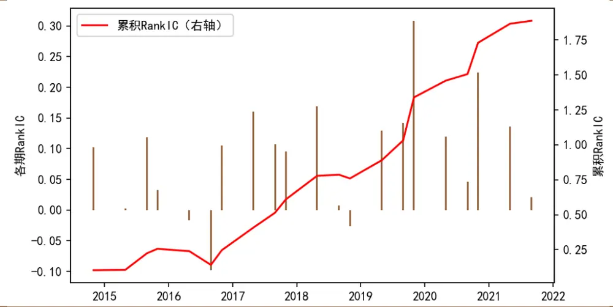
资料来源： ，德邦研究所

从 2014-10-31 至 2021-08-30，平均 RankIC 为 0.09，Rank ICIR 为 0.973。因子的 RankIC在绝大多数时期为正。

图 10显示了中证 1000指数成分股的分组回测的结果。我们采用各个股票等权的方式构造组合。分组的单调性好，多头组 5 的超额收益总体上较为稳健，年化超额收益为 11.9%。

多头组 5 的分年度表现见表 4，超额收益在绝大多数年份为正。组合的年均双边换手率为 4.34，换手率较低。

图 10：中证 1000指数成分股分组回测
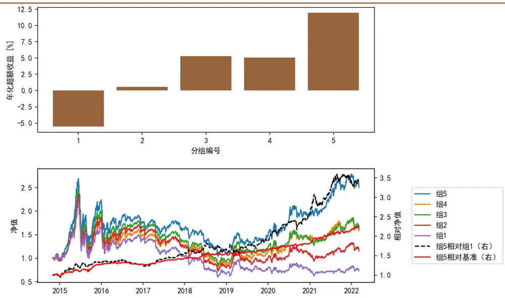
注：等权构造组合，非均匀分组，基准为中证 指数。资料来源： 德邦研究所

表 4：中证 1000指数成分股组 5的分年度表现

|  | 2015 | 2016 | 2017 | 2018 | 2019 | 2020 | 2021 | 2015年初 至今 |
| --- | --- | --- | --- | --- | --- | --- | --- | --- |
| 策略年化收益率 | 1.35 | -0.21 | -0.07 | -0.32 | 0.34 | 0.33 | 0.45 | 0.14 |
| 基准年化收益率 | 0.79 | -0.2 | -0.18 | -0.38 | 0.26 | 0.2 | 0.21 | 0.02 |
| 超额年化收益率 | 0.57 | 0 | 0.1 | 0.05 | 0.07 | 0.13 | 0.24 | 0.12 |
| 策略年化波动率 | 0.51 | 0.33 | 0.17 | 0.25 | 0.23 | 0.28 | 0.19 | 0.3 |
| 基准年化波动率 | 0.46 | 0.32 | 0.16 | 0.25 | 0.25 | 0.27 | 0.19 | 0.29 |
| 超额年化波动率 | 0.1 | 0.04 | 0.03 | 0.04 | 0.06 | 0.05 | 0.06 | 0.06 |
| 策略夏普比率(rf=2%) | 2.63 | -0.68 | -0.55 | -1.36 | 1.38 | 1.11 | 2.3 | 0.41 |
| 基准夏普比率(rf=2%) | 1.66 | -0.71 | -1.22 | -1.6 | 0.98 | 0.66 | 1.01 | 0.01 |
| 信息比率 | 5.81 | -0.06 | 3.13 | 1.24 | 1.31 | 2.49 | 3.79 | 2.07 |
| 策略最大回撤 | 0.54 | 0.27 | 0.17 | 0.38 | 0.18 | 0.16 | 0.09 | 0.61 |
| 策略最大回撤起始 | 2015-06-12 | 2016-01-06 | 2017-03-16 | 2018-01-08 | 2019-04-09 | 2020-02-25 | 2021-09-08 | 2015-06-12 |
| 策略最大回撤终止 | 2015-09-02 | 2016-01-28 | 2017-06-01 | 2018-10-18 | 2019-08-09 | 2020-03-23 | 2021-10-28 | 2018-10-18 |
| 基准最大回撤 | 0.53 | 0.27 | 0.2 | 0.42 | 0.22 | 0.16 | 0.11 | 0.72 |
| 基准最大回撤起始 | 2015-06-12 | 2016-01-06 | 2017-01-05 | 2018-01-08 | 2019-04-04 | 2020-02-25 | 2021-01-05 | 2015-06-12 |
| 基准最大回撤終止 | 2015-09-15 | 2016-01-28 | 2017-12-25 | 2018-10-18 | 2019-08-09 | 2020-04-01 | 2021-02-05 | 2018-10-18 |
| 超额最大回撤 | 0.06 | 0.04 | 0.01 | 0.04 | 0.06 | 0.05 | 0.04 | 0.06 |
| 超额最大回撤起始 | 2015-07-31 | 2016-07-25 | 2017-11-09 | 2018-10-22 | 2019-01-31 | 2020-08-27 | 2021-10-12 | 2014-12-02 |
| 超额最大回撤終止 | 2015-09-02 | 2016-12-20 | 2017-11-23 | 2018-11-26 | 2019-03-07 | 2020-09-09 | 2021-10-27 | 2015-01-05 |
| 策略卡玛比率 | 2.52 | -0.77 | -0.45 | -0.86 | 1.89 | 2.02 | 5.1 | 0.24 |
| 基准卡玛比率 | 1.48 | -0.76 | -0.89 | -0.89 | 1.19 | 1.28 | 1.89 | 0.03 |
| 超额卡玛比率 | 9.1 | -0.06 | 7.62 | 1.41 | 1.31 | 2.52 | 6.78 | 1.95 |

注：等权构造组合，非均匀分组，基准为中证 1000指数。资料来源： ，德邦研究所

## 3.2.5. 全市场选股

机器学习集成模型因子在全市场的 RankIC 见图 11。从 2014-10-31 至 2021-08-30，平均 RankIC 为 0.081，Rank ICIR 为 1.037。因子在绝大数时期的 RankIC为正。

图 11：全市场的信息系数
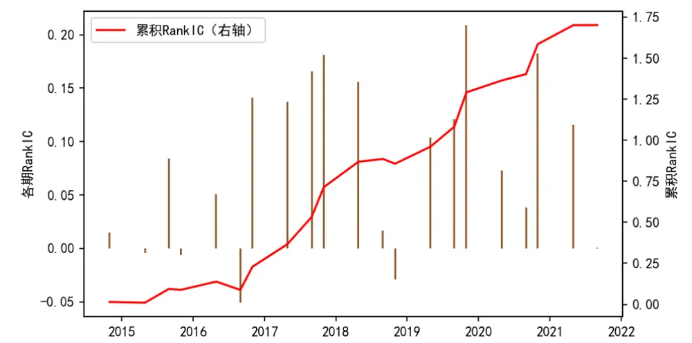
资料来源：Wind，德邦研究所

图 12 显示了全市场分组回测的结果。我们采用各个股票等权的方式构造组合。分组的单调性好，多头组 5 的超额收益非常稳健，在全回测区间未见显著回撤，年化超额收益率为 12.3%。

多头组 5 的分年度表现见表 5，超额收益在全部年份均为正。组合的年均双边换手率为 4.06，换手率较低。

图 12：全市场分组回测
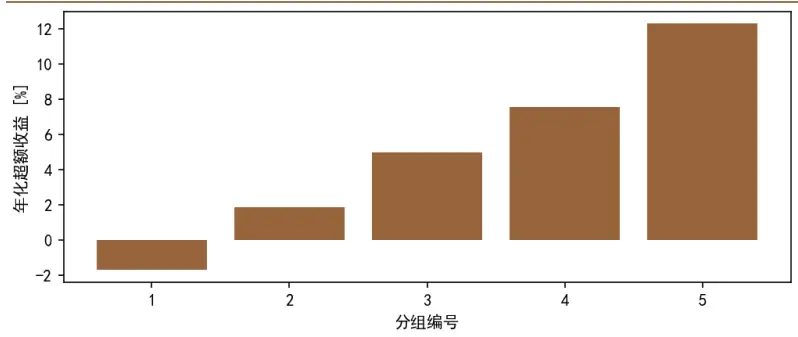

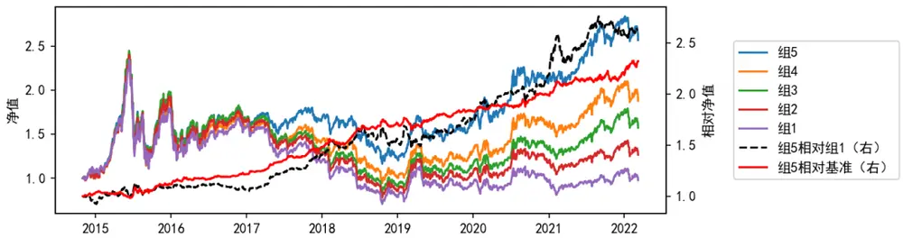
注：等权构造组合，均匀分组，基准为中证 指数。资料来源： 德邦研究所

表 5：全市场组 5的分年度表现

|  | 2015 | 2016 | 2017 | 2018 | 2019 | 2020 | 2021 | 2015年初 至今 |
| --- | --- | --- | --- | --- | --- | --- | --- | --- |
| 策略年化收益率 | 0.92 | -0.13 | 0 | -0.27 | 0.35 | 0.3 | 0.34 | 0.14 |
| 基准年化收益率 | 0.79 | -0.2 | -0.18 | -0.38 | 0.26 | 0.2 | 0.21 | 0.02 |
| 超额年化收益率 | 0.14 | 0.08 | 0.18 | 0.1 | 0.08 | 0.1 | 0.13 | 0.12 |
| 策略年化波动率 | 0.46 | 0.3 | 0.15 | 0.24 | 0.22 | 0.26 | 0.17 | 0.28 |
| 基准年化波动率 | 0.46 | 0.32 | 0.16 | 0.25 | 0.25 | 0.27 | 0.19 | 0.29 |
| 超额年化波动率 | 0.09 | 0.04 | 0.04 | 0.05 | 0.06 | 0.05 | 0.06 | 0.06 |
| 策略夏普比率(rf=2%) | 1.99 | -0.5 | -0.1 | -1.2 | 1.49 | 1.08 | 1.84 | 0.47 |
| 基准夏普比率(rf=2%) | 1.66 | -0.71 | -1.22 | -1.6 | 0.98 | 0.66 | 1.01 | 0.01 |
| 信息比率 | 1.59 | 1.72 | 4.49 | 1.97 | 1.43 | 2.22 | 2.03 | 2.16 |
| 策略最大回撤 | 0.51 | 0.25 | 0.14 | 0.33 | 0.17 | 0.15 | 0.1 | 0.51 |
| 策略最大回撤起始 | 2015-06-12 | 2016-01-06 | 2017-03-16 | 2018-01-09 | 2019-04-09 | 2020-02-25 | 2021-09-08 | 2015-06-12 |
| 策略最大回撤终止 | 2015-09-15 | 2016-01-28 | 2017-06-01 | 2018-10-18 | 2019-08-09 | 2020-03-23 | 2021-10-28 | 2018-10-18 |
| 基准最大回撤 | 0.53 | 0.27 | 0.2 | 0.42 | 0.22 | 0.16 | 0.11 | 0.72 |
| 基准最大回撤起始 | 2015-06-12 | 2016-01-06 | 2017-01-05 | 2018-01-08 | 2019-04-04 | 2020-02-25 | 2021-01-05 | 2015-06-12 |
| 基准最大回撤终止 | 2015-09-15 | 2016-01-28 | 2017-12-25 | 2018-10-18 | 2019-08-09 | 2020-04-01 | 2021-02-05 | 2018-10-18 |
| 超额最大回撤 | 0.07 | 0.03 | 0.01 | 0.04 | 0.07 | 0.04 | 0.05 | 0.07 |
| 超额最大回撤起始 | 2015-01-16 | 2016-03-04 | 2017-11-21 | 2018-10-22 | 2019-01-31 | 2020-08-27 | 2021-10-12 | 2015-01-16 |
| 超额最大回撤終止 | 2015-06-18 | 2016-04-14 | 2017-12-15 | 2018-11-27 | 2019-03-07 | 2020-09-09 | 2021-10-27 | 2015-06-18 |
| 策略卡玛比率 | 1.81 | -0.52 | 0.03 | -0.83 | 2.04 | 2.06 | 3.44 | 0.29 |
| 基准卡玛比率 | 1.48 | -0.76 | -0.89 | -0.89 | 1.19 | 1.28 | 1.89 | 0.03 |
| 超额卡玛比率 | 2.03 | 2.91 | 13.02 | 2.5 | 1.21 | 2.77 | 2.7 | 1.84 |

注：等权构造组合，均匀分组，基准为中证 指数。
资料来源：Wind，德邦研究所

## 4. 结论

本文基于动态因子和模型筛选的方法构建了一个在大、中、小盘股中均有效的选股策略。

财务因子的效应在不同的时期不尽相同，因此，我们需要选择在当前时期最可能有效的财务因子来进行选股。另一方面，根据一套客观的方法进行因子筛选可以减少数据窥探偏误，提高回测结果的可信程度。首先，我们需要排除噪音因子并筛选信号因子。然而，信号因子的规律可能在不同的时期发生反转，因此，需要寻找规律稳定的因子。本质上，这是利用因子的动量。我们选择一季度报、中报和三季度报披露的截止日期进行因子筛选。这样兼顾了数据的及时性与同步性。我们以十个CNE5风格因子为起点，用边际筛选因子的方法逐步扩大因子池，即在边际上逐个筛选信息增益最大的因子，重复这个操作直到获得足够多的因子。我们以验证集评价的方式对因子池整体的有效性进行打分。筛选因子的结果表明，前几个入选的财务因子的边际贡献显著，后入选的财务因子作用很有限。

在模型层面，我们构建了一个机器学习集成模型。集成模型中，我们使用了包括随机森林、GBDT、XGBoost、LGBM、AdaBoost、神经网络、支持向量回归等各类机器学习模型。使用不同种类的机器学习模型，可以尽可能抑制最终的选股因子中的噪音。在每一期选股时，我们依然采用验证集评价的方式来筛选样本内有效的模型，并将其运用于样本外。这种基于一套客观方法筛选模型的方法既有利于提高模型的表现，也有利于规避模型层面的数据窥探误区。我们同样构建了一个线性多因子模型作为对照组，机器学习集成模型的表现远超过线性多因子模型。

我们展示了机器学习集成模型计算的选股因子的在沪深 300 指数成分、中证500 指数成分、中证 1000指数成分和全市场中的选股能力，在各个股票池中，模型都能取得较高且稳定的超额收益。

## 5. 附录：财务数据列表

表 6：本文使用的风格因子、财务项目列表

| 对数市值 | 贝塔 | 动量 | 残差波动率 | 非线性市值 |
| --- | --- | --- | --- | --- |
| 账面市值比 | 流动性 | 盈利 | 成长 | 杠杆 |
| 季度净资产回报率 | 归属母公司股东的净利润 | 筹资活动现金流出小计 | 流动资产合计 | 其他应付款(合计) |
| 营业总收入 | 基本每股收益 | 筹资活动产生的现金流量净额 | 以公允价值计量且其变动计入其他 综合收益的金融资产 | 应付利息 |
| 营业收入 | 稀释每股收益 | 汇率变动对现金的影响 | 以摊余成本计量的金融资产 | 应付股利 |
| 利息收入 | 其他综合收益 | 现金及现金等价物净增加额 | 债权投资 | 其他应付款 |
| 已赚保费 | 综合收益总额 | 期初现金及现金等价物余额 | 其他债权投资 | 预提费用 |
| 手续费及佣金收入 | 归属少数股东的综合收益总额 | 期末现金及现金等价物余额 | 可供出售金融资产 | 递延收益-流动负债 |
| 保费总收入 | 归属母公司普通股东综合收益总额 | 净利润 | 其他权益工具投资 | 划分为持有待售的 负债 |
| 分保费收入 | 销售商品、提供劳务收到的现金 | 资产减值准备 | 持有至到期投资 | 一年内到期的非流 动负债 |
| 分出保费 | 收到的税费返还 | 固定资产折旧、油气资产折耗、生 物性生物资产折旧 | 其他非流动金融资产 | 应付短期债券 |
| 提取未到期责任准备 金 | 收到其他与经营活动有关的现金 | 无形资产摊销 | 投资性房地产 | 向中央银行借款 |
| 代理买卖证券业务净 收入 | 保户储金净增加额 | 长期待摊销费用摊销 | 长期股权投资 | 吸收存款及同业存 放 |
| 证券承销业务净收入 受托客户资产管理业 | 客户存款和同业存放款项净增加额 | 待摊费用减少 | 长期应收款 | 拆入资金 |
| 务净收入 | 向中央银行借款净增加额 | 预提费用增加 | 固定资产(合计) | 卖出回购金融资产 款 |
| 其他业务收入 | 向其他金融机构拆入资金净增加额 | 处置固定资产、无形资产和其他长 期资产的损失 | 固定资产 | 应付手续费及佣金 |
| 利息净收入 | 收取利息和手续费净增加额 | 固定资产报废损失 | 固定资产清理 | 应付分保账款 |
| 手续费及佣金净收入 | 收到的原保险合同保费取得的现金 | 公允价值变动损失 | 在建工程(合计) | 保险合同准备金 |
| 其他业务净收益 | 收到的再保业务现金净额 | 财务费用 | 在建工程 | 代理买卖证券款 |
| 营业总成本 | 处置交易性金融资产净增加额 | 投资损失 | 工程物资 | 代理承销证券款 |
| 营业成本 | 处置可供出售金融资产净增加额 | 递延所得税资产减少 | 生产性生物投资 | 其他流动负债 |
| 利息支出 | 拆入资金净增加额 | 递延所得税负债增加 | 油气资产 | 流动负债合计 |
| 手续费及佣金支出 | 回购业务资金净增加额 | 存货的减少 | 无形资产 | 长期借款 |
| 营业支出 | 代理买卖证券收到的现金净额 | 经营性应收项目的减少 | 开发支出 | 应付债款 |
| 税金及附加 | 经营活动现金流入小计 | 经营性应付项目的增加 | 商誉 | 长期应付款 |
| 销售费用 | 融出资金净增加额 | 未确认的投资损失 | 长期待摊费用 | 长期应付职工薪酬 |
| 管理费用 | 以公允价值计量且其变动计入当期损 益的金融工具凈额 | 其他 | 递延所得税资产 | 专项应付款 |
| 研发费用 | 购买商品、接受劳务支付的现金 | 间接法-经营活动产生的现金流量 净额 | 发放贷款及垫款 | 预计负债 |
| 财务费用 | 支付给职工以及为职工支付的现金 | 债务转为资本 | 其他非流动资产 | 递延所得税负债 |
| 财务费用-利息费用 | 支付的各项税费 | 一年内到期的可转公司债券 | 非流动资产合计 | 递延收益-非流动负 债 |
| 财务费用-利息收入 | 支付的其他与经营活动有关的现金 | 融资租入固定资产 | 现金及存放中央银行款项 | 其他非流动负债 |
| 资产减值损失 | 客户贷款及垫款净增加额 | 现金的期末余额 | 代理业务资产 | 非流动负债合计 |
| 信用减值损失 | 存放央行和同业款项净增加额 | 现金的期初余额 | 应收款项类投资 | 同业和其他金融机 构存放款项 |
| 退保金 | 支付原保险合同赔付款项的现金 | 现金等价物的期末余额 | 存放同业和其他金融机构款项 | 代理业务负债 |
| 赔付支出 | 支付手续费的现金 | 现金等价物的期初余额 | 贵金属 | 吸收存款 |
| 提取保险责任准备金 | 支付保单红利的现金 | 间接法-现金及现金等价物净增加 额 | 应收分保未到期责任准备金 | 应付赔付款 |
| 保单红利支出 | 经营活动现金流出小计 | 货币资金 | 应收分保未决赔款准备金 | 应付保单红利 |
| 分保费用 | 经营活动产生的现金流量净额 | 以公允价值计量且其变动计入当期 损益的金融资产 | 应收分保寿险责任准备金 | 存入保证金 |
| 摊回赔付支出 | 收回投资收到的现金 | 应收票据及应收账款 | 应收分保长期健康险责任准备金 | 保户储金及投资款 |
| 摊回保险责任准备金 | 取得投资收益收到的现金 | 应收票据 | 保户质押贷款 | 未到期责任准备金 |
| 摊回分保费用 | 处置固定资产、无形资产和其他长期 资产收回的现金净额 | 应收账款 | 存出资本保证金 | 未决赔款准备金 |
| 其他业务成本 | 处置子公司及其他营业单位收到的现 金净额 | 预付账款 | 独立账户资产 | 寿险责任准备金 |
| 其他经营净收益 | 收到的其他与投资活动有关的现金 | 其他应收款(合计) | 定期存款 | 长期健康险责任准 备金 |
| 公允价值变动净收益 | 投资活动现金流入小计 | 应收股利 | 应收代位追偿款 | 独立账户负债 |
| 投资净收益 | 购建固定资产、无形资产和其他长期 资产支付的现金 | 应收利息 | 存出保证金 | 预收保费 |
| 对联营企业和合营企 业的投资收益 | 投资支付的现金 | 其他应收款 | 交易席位费 | 质押借款 |
| 净敞口套期收益 | 质押贷款净增加额 | 存货 | 客户资金存款 | 应付短期融资款 |
| 汇兑净收益 | 取得子公司及其他营业单位支付的现 金净额 | 消耗性生物资产 | 客户备付金 | 其他负债 |
| 资产处置收益 | 支付的其他与投资活动有关的现金 | 合同资产 | 其他资产 | 衍生金融负债 |
| 其他收益 | 投资活动现金流出小计 | 待摊费用 | 衍生金融资产 | 负债合计 |
| 营业利润 | 投资活动产生的现金流量净额 | 划分为持有待售的资产 | 资产总计 | 实收资本（或股 本) |
| 营业外收入 | 吸收投资收到的现金 | 一年内到期的非流动资产 | 短期借款 | 其他权益工具 |
| 营业外支出 | 子公司吸收少数股东投资收到的现金 | 结算备付金 | 以公允价值计量且其变动计入当期 其他权益工具：优 损益的金融负债 | 先股 |
| 非流动资产处置净损 失 | 取得借款收到的现金 | 拆出资金 | 应付票据及应付账款 | 其他权益工具：永 续债 |
| 利润总额 | 收到其他与筹资活动有关的现金 | 融出资金 | 应付票据 | 资本公积金 |
| 所得税 | 发行债券收到的现金 | 应收保费 | 应付账款 | 盈余公积金 |
| 未确认的投资损失 | 筹资活动现金流入小计 | 应收分保账款 | 预收账款 | 未分配利润 |
| 净利润 | 偿还债务所支付的现金 | 应收分保合同准备金 | 合同负债 | 减：库存股 |
| 持续经营净利润 | 分配股利、利润和偿付利息所支付的 现金 | 买入返售金融资产 | 应付职工薪酬 | 其他综合收益 |
| 终止经营净利润 | 子公司支付给少数股东的股利、利润 | 应收款项 | 应交税费 | 专项储备 |
| 少数股东损益 | 支付的其他与筹资活动有关的现金 | 其他流动资产 | 应付款项 | 一般风险准备 |
| 所有者权益合计 | 少数股东权益 | 归属母公司股东的权益 | 未确认的投资损失 | 外币报表折算差额 |

注：本表仅列出风格因子和原始财务项目，每个财务项目首先经处理后成为因子；每个因子均衍生出季度增速和年度增速两个因子。资料来源：Wind，德邦研究所

## 6. 风险提示

市场风格变化风险，模型失效风险，数据可用性风险。

## 信息披露

## 分析师与研究助理简介

肖承志，同济大学应用数学本科、硕士，现任德邦证券研究所首席金融工程分析师。具有 年证券研究经历，曾就职于东北证券研究所担任首席金融工程分析师。致力于市场择时、资产配置、量化与基本面选股。撰写独家深度“扩散指标择时”系列报告；擅长各类择时与机器学习模型，对隐马尔可夫模型有深入研究；在因子选股领域撰写多篇因子改进报告，市场独家见解。

王成煜，慕尼黑工业大学计算流体力学博士，清华大学车辆工程本科，通过 三级。 年 月博士毕业，同年 月加盟德邦证券，现任金融工程助理研究员，致力于主动量化选股。

## 分析师声明

本人具有中国证券业协会授予的证券投资咨询执业资格，以勤勉的职业态度，独立、客观地出具本报告。本报告所采用的数据和信息均来自市场公开信息，本人不保证该等信息的准确性或完整性。分析逻辑基于作者的职业理解，清晰准确地反映了作者的研究观点，结论不受任何第三方的授意或影响，特此声明。

## 投资评级说明

| 1. 投资评级的比较和评级标准：以报告发布后的6个月内的市场表现为比较标准，报告发布日后6个月内的公司股价（或行业指数）的涨跌幅相对同期市场基准指数的涨跌幅；2. 市场基准指数的比较标准：A股市场以上证综指或深证成指为基准；香港市场以恒生指数为基准；美国市场以标普500或纳斯达克综合指数为基准。 | 类别 | 评级 | 说明 |
| --- | --- | --- | --- |
|  | 股票投资评级 | 买入 | 相对强于市场表现20%以上； |
|  |  | 增持 | 相对强于市场表现 5%~20%； |
|  |  | 中性 | 相对市场表现在-5%~+5%之间波动； |
|  |  | 减持 | 相对弱于市场表现5%以下。 |
|  | 行业投资评级 | 优于大市 | 预期行业整体回报高于基准指数整体水平10%以上； |
|  |  | 中性 | 预期行业整体回报介于基准指数整体水平-10%与10%之间； |
|  |  | 弱于大市 | 预期行业整体回报低于基准指数整体水平10%以下。 |

## 法律声明

本报告仅供德邦证券股份有限公司（以下简称“本公司”）的客户使用。本公司不会因接收人收到本报告而视其为客户。在任何情况下，本报告中的信息或所表述的意见并不构成对任何人的投资建议。在任何情况下，本公司不对任何人因使用本报告中的任何内容所引致的任何损失负任何责任。

本报告所载的资料、意见及推测仅反映本公司于发布本报告当日的判断，本报告所指的证券或投资标的的价格、价值及投资收入可能会波动。在不同时期，本公司可发出与本报告所载资料、意见及推测不一致的报告。

市场有风险，投资需谨慎。本报告所载的信息、材料及结论只提供特定客户作参考，不构成投资建议，也没有考虑到个别客户特殊的投资目标、财务状况或需要。客户应考虑本报告中的任何意见或建议是否符合其特定状况。在法律许可的情况下，德邦证券及其所属关联机构可能会持有报告中提到的公司所发行的证券并进行交易，还可能为这些公司提供投资银行服务或其他服务。

本报告仅向特定客户传送，未经德邦证券研究所书面授权，本研究报告的任何部分均不得以任何方式制作任何形式的拷贝、复印件或复制品，或再次分发给任何其他人，或以任何侵犯本公司版权的其他方式使用。所有本报告中使用的商标、服务标记及标记均为本公司的商标、服务标记及标记。如欲引用或转载本文内容，务必联络德邦证券研究所并获得许可，并需注明出处为德邦证券研究所，且不得对本文进行有悖原意的引用和删改。

根据中国证监会核发的经营证券业务许可，德邦证券股份有限公司的经营范围包括证券投资咨询业务。