## 金融工程专题

证券分析师

肖承志

资格编号：S0120521080003

邮箱：xiaocz＠tebon.com.cn

研究助理

## 王成煜

邮箱：wangcy3＠tebon.com.cn

## 相关研究

1. 《动态因子筛选——德邦金工机器学习专题之四》2022.03.09

2. 《基于财务与风格因子的机器学习选股——德邦金工机器学习专题之三》 2022.01.25

3. 《机器学习残差因子表现归因——德邦金工机器学习专题之二》2021.11.24

4. 《利用机器学习捕捉因子的非线性效应——德邦金工机器学习专题之一》 2021.10.18

# 金融工程基于模型池的机器学习选股

# 德邦金工机器学习专题之五

## [Table_Summ投资要点：

- 本文描述一种基于动态因子、模型筛选的量化投资方法。我们采用验证集数据打分的方式既对训练模型的因子进行筛选，也对集成模型中使用的模型进行筛选，从而尽可能使用最可能有效的因子和模型。

通过因子预筛选机制和模型的选用来加速因子筛选的过程。我们选用 LGBM 模型进行拟合和预测，并且根据模型在训练集给出的特征重要性排除一部分因子，这相对于我们在上一期提到的基于随机森林模型的筛选方法大幅度提高了效率。

- 维护一个动态扩大的模型池。每当训练一个新的机器学习模型，我们就将这个模型添加到模型池中。我们持续地观测模型池中各个模型的表现。

- 不必在每次横截面选股时都进行模型训练。用机器学习模型进行横截面选股时，不必每期重训练模型或新训练模型，而可以多加利用曾经训练的模型。这既可以在保持模型表现的基础上节约大量的运算。实际上，根据我们的回测，每月训练模型的表现并不如每个季度训练模型的表现。

单个模型的有效性通常存在轮动效应。单个模型通常在刚训练的时刻比较有效，但其有效性会随着时间衰减而逐渐失效，另一方面，一个一度失效的模型可能在未来重新变得有效，这往往是由市场风格、因子轮动效应导致的。

- 长记忆模型池优于短记忆模型池。开始训练模型的时间点越早，则模型池的规模越大，并且模型池整体对更长时间的市场状态有记忆，一般而言，这样的模型池的整体表现更优。

- 筛选近期表现良好的模型加以使用。以最近数月的数据为验证集，对模型池中的所有模型进行评价，筛选评价最高的一批模型参与构建集成模型。经验证，在过去一年中稳定有效的模型有更大的概率在未来更加有效。

- 众多模型的预测值的相关系数较低。我们考察了模型池中所有模型在横截面上的预测值之间的相关系数的概率密度分布，总体上相关系数不高，这有利于构造更好的集成模型。

- 我们对涉及到的几个主要参数和模型类型进行了敏感性分析。通过对比各参数发现模型对训练频率、验证集时间长度和模型种类的敏感性低。

因子在全市场和市值偏小的股票池中表现良好。本文构造因子阶段，以全市场的RankIC 为目标函数，因子在全市场与中证 1000 指数成分内表现良好，而在中证800内的多头收益尚且不高。

- 风险提示：市场风格变化风险，模型失效风险，数据可用性风险

## 1. 前言

我们在上一期研报《动态因子筛选——德邦金工机器学习专题之四》中介绍了一种在每个季度动态筛选有效的基本面因子，再使用机器学习模型合成因子的方法。本文关注的重点是其中的第二步，即通过机器学习模型合成因子的过程，因此这一步对结果也有至关重要的影响。

一种常见的做法是，在每次选股前，利用过去一段时间的历史数据训练机器学习模型，然后用新获得的模型做预测和选股，然而，这或许是一种思维定式。实际上，更早的数据以及过去训练的模型未必是没有价值的，因为市场的风格、回报的异象、因子的收益率都可能存在轮动效应，曾经失效的风格、异象可能在未来回归。因此，我们需要持续地监控所有训练过的模型的表现，并系统化地筛选和运用它们。

在本文中，我们首先简单回顾动态因子筛选的方法，并从运算效率的角度对这种方法做出一些改进，随后，本文将重点讨论如何维护一个机器学习模型池，如何新增、评价、筛选和使用池中的机器学习模型。

## 2. 方法

## 2.1. 构建因子库

量化投资者通常会维护一个因子库，因子库中通常有成百上千种因子，对于某些机构而言可能数量更多。一般而言，因子库中有效因子数量越多、噪音因子的数量越少，则因子库的质量越高。在构建因子库的阶段，要减少噪音因子，即尽可能地排除在历史上未曾出现过横截面异象的因子。因此，得以入库的因子通常是信号因子，这类因子在历史上的某个阶段出现过横截面异象，但这种横截面异象可能在另一些历史阶段、甚至当前的阶段并不存在。

我们当前构建的因子库包括 CNE5 中的十个风格因子以及根据利润表、资产负债表和现金流量表的项目计算的因子。采用式（1）的中位数去极值的方法去除极端值。

$$
\tilde{x}=\left\{\begin{matrix}{x_{m}+n\cdot D,}&{\;if\;x>x_{m}+n\cdot D\;,}\\{x_{m}-n\cdot D,}&{\;if\;x<x_{m}-n\cdot D\;,}\\{x,}&{\;else}\end{matrix}\right.\tag{1}
$$

其中，x是任意一个财务因子的值， $x_{m}$ 是因子值在横截面上的中位数，D是序列|x $\mathbf{-x_{m}}[$ 的中位数，n是一个参数，本文中取 3，而x̃为去极值后的结果。对于所有的空值，将其填充为横截面上的中位数。

## 2.2. 因子筛选

因子筛选有两方面的作用：第一，尽可能排除当前无效或规律反转的因子；第二，相比于用上因子库中全部因子的做法，显著降低模型的过拟合风险、复杂度和运算时间。本文使用的因子筛选方法很大程度上和《动态因子筛选——德邦金工机器学习专题之四》中提出的方法相同，出于效率的考虑，改变了使用的模型和筛选频率，并添加了预筛选机制。

## 2.2.1. 筛选因子的模型

我们使用 LGBM 模型，相比于上一期研报《动态因子筛选——德邦金工机器学习专题之四》中使用的随机森林模型，运算速度得到了大幅度的提升，而筛选效果依然良好。另一方面，我们依然使用基于 CNE5 风格因子的残差收益率作为预测目标Y的来源。我们将相邻两个月的所有股票回报记为 $R_{T}$ ，将前一个截止日期的风格因子和常数列记为 $B_{T-\Delta T}$ ，首先 WLS 回归股票收益率，权重为股票总市值的平方根：

$$
R_{T}=B_{T-\Delta T}\cdot b+\varepsilon_{T},\tag{2}
$$

我们以残差收益率 $\varepsilon_{T}$ 为模型的预测目标。

## 2.2.2. 筛选频率

我们定期基于因子库进行因子筛选，我们约定每隔一定数量 $(N_{s})$ 个月进行一次筛选，其中参数 $N_{s}$ 可以按需选取。入选的因子将被作为机器学习模型的输入。然而，训练模型的频率不必等于筛选因子的频率，我们规定每 $N_{M}$ 个月训练一批新的机器学习模型。

## 2.2.3. 因子预筛选

我们采用基于树模型的LGBM来进行因子筛选，基于训练集数据，模型可以评价各个因子的特征重要性。简单来说，更加重要的因子对于训练集上的拟合结果的影响更大，而重要性低的因子对于拟合结果的影响小。

我们并不认为在训练集上特征重要性最高的因子就是最重要的因子，一方面，高的特征重要性可能来源于偶然因素，例如训练集数据过拟合，另一方面，如果一个因子的规律并不稳定，那么高的特征重要性也没有指导投资的价值。

然而，我们却可以利用特征重要性排除一些大概率不能发挥作用的因子，这是因为，如果一个因子在训练集上尚不能体现出与拟合目标的相关性，那么这个因子大概率属于噪音因子。我们排除训练集中特征重要性很低的因子，在接下来的 2.2.4 节中的因子边际筛选过程中不再考虑这些因子，这能在很大程度上加快边际筛选的效率。

## 2.2.4. 因子边际筛选

我们采用边际筛选的方式从因子库中逐个筛选有效的因子加入当前因子池。在每次筛选的起点，我们将 CNE5 的十个风格因子作为初始因子池，遍历因子库中所有的因子，评价各个因子的边际贡献，挑选边际贡献最高的因子入选因子池。接下来重复这一过程，逐个在边际上筛选最有效的因子。

我们采用训练集——验证集来评价整个因子池的质量，验证集为最近 $N_{V}$ （本文中取 12）个月的数据，而训练集为验证集之前的 $N_{T}$ （本文中取 48）个月的数据。我们首先使用训练集的数据和 LGBM 模型，拟合训练集输入 $.X_{T}$ 、输出 $Y_{T}$ 之间的关系；再将该模型作用于验证集的输入 $X_{V}$ ，得到验证集的预测值 $P_{V}$ ，将验证集的预测值 $.P_{V}$ 和输出真值 $.Y_{V}$ 按日期拆分为 $P_{V1},P_{V2},\ldots,P_{Vn}和Y_{V1},Y_{V2},\ldots,Y_{Vn}$ ，其中角标中的n为天数，逐日计算预测值的 RankIC，将得到的一系列求代数平均值 $\rho$ 作为因子池整体的评价指标。单个因子的边际贡献则定义为包含该因子的因子池的 $\langle\rho\rangle$ 值与不包含该因子的 $1\rho$ 值的差。图1示意了因子筛选的流程。

图 1：因子筛选流程
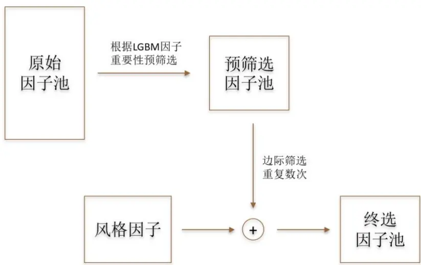
资料来源：Wind，德邦研究所

## 2.3. 预测模型

相比于常见的对于模型“使用后即废弃”或“不断用新数据重训练”的处理方式，我们采用一种创新的处理方式。我们始终保留过去曾训练好的机器学习模型，并不断地观测、评价各个模型在当前阶段的表现，从而筛选最可能有效的模型用于预测。

## 2.3.1. 构建模型池

数据驱动的机器学习模型通常需要使用大量的数据进行训练，而训练的目的实际上是为了获得能够完全定义模型的参数。本文使用的学习器都是参数数量较少的学习器，例如，节点数少神经网络、深度小的决策树等。因此，这些训练得到的模型可以很方便地用文件进行存储，或者直接保留在计算机的内存中以便随时调用。因此，我们有足够的条件维护一个庞大的模型池。

每一个模型具有四方面的要素，即模型类型、模型参数、数据时间范围、因子种类列表。

1）模型种类：我们使用的模型包括神经网络、随机森林、LGBM、GBDT以及 CatBoost。

2）模型参数：对于神经网络而言，模型参数主要是神经网络的层数、各层的节点数以及激发函数等；对于其余四种基于回归决策树的模型而言，主要参数则是树的深度和数目。

3）数据时间范围：每个模型都用一段连续的历史时期的数据进行训练，故给定数据最早和最晚的时间点即可确定数据时间范围。

4）因子种类列表：因子来源于因子库，由于定期进行因子筛选，每期动态因子筛选给出的因子排序不同，故不同时期训练的模型的因子列表通常不同。对于同时期训练的模型，不同的模型可以使用不同数量的因子作为输入。

我们在每个月度进行选股，则利用过去一段时间的数据训练固定数量的新模型。对于每一个确定了要素1）、2）、3）的模型，我们将输入数量从11个连续变化到 30 个，通过遍历得到20个模型，并将其全部加入模型池。每训练一个模型，都记录模型的四个方面的要素，并且保存模型本身。根据这种方法，我们就可以维护一个随着时间线性扩大的模型池。当然，也可以进行一定程度的截断，即舍弃过于陈旧的模型，使得模型池的规模最终保持平稳。

## 2.3.2. 模型筛选

模型池中的部分模型可能处于失效状态，因此，我们通过近期的市场数据来验证模型的有效性，并筛选最可能有效的一批模型加以使用，所有入选的模型构成一个集成模型。在每个月，我们选择最近 $N_{V}$ （本文中取 12）个月的数据作为验证集，对各个模型计算验证集预测值的 RankIC。我们以过去十二个月的平均RankIC 作为各个模型的得分，首先排除所有得分低于 0.02 的模型，因为此类模型的预测效果过低，几乎没有参考价值。接下来，在余下的模型中，选择得分前25%的模型。

## 2.3.3. 机器学习因子

将入选模型的数量记为K，将模型k的得分记为 $s_{k}$ ，将当前的时刻记为T月，模型作用于T月的因子上，获得最新的横截面预测值向量（记为 $p_{T,k})$ ），则机器学习因子 $P_{T,m}$ 的值为：

$$
P_{T,m}={\sum}_{k=1}^{K}\frac{1}{K}p_{T,k},\tag{3}
$$

一种常见的对式（3）进行调整的方法是采用加权平均代替代数平均，权重可以是模型在验证集中的打分。另一种常见的做法是将 $\cdot p_{T,k}$ 做 z-score 标准化后再求平均值。我们尝试过上述两种做法，发现对预测结果的影响小。

## 2.3.4. 机器学习反转因子

将各个入选的模型作用于T −1月的因子上，获得各个模型对于上个月度的残差收益率预测值 $\cdot p_{T-1,k}$ ，由于从T−1月至T月的残差收益率 $\varepsilon_{T}$ 是已知的，我们可以用 $p_{i}^{\prime}$ 与ε构造一个机器学习反转因子 $P_{T,r}$ 。

$$
P_{T,r}={\sum}_{k=1}^{K}s_{k}\cdot[z(p_{T-1,k})-z(\varepsilon_{T})],\tag{4}
$$

其中， $z(\cdot)$ 为z-score运算符，对于任意向量x其运算法则为：

$$
z(x)={\frac{x-{\bar{x}}}{\sigma(x)}},\tag{5}
$$

$z(\varepsilon_{T})$ 是标准化的上个月的涨跌幅， $z(p_{T-1,k})$ 是标准化的模型k对上个月的涨跌幅的拟合值，故后者与前者的差就是模型k无法拟合的上个月的涨跌幅，而这个涨跌幅有较大的概率发生反转，这便是构造机器学习反转因子的思想。在式（4）中，对 $\left[p_{T-1,k}和\varepsilon_{T}\right.$ 的 z-score 标准化通常不可省略，这是因为后者的波动率通常远远超过前者的波动率，如果省略 z-score 标准化，则算式的结果几乎完全由后者决定，而这是我们希望规避的。

## 2.3.5. 复合因子

我们注意到，机器学习因子的多头能力相对强， $而$ 机器学习反转因子的空头能力相对强，因此，我们结合两个因子的优势部分来构造复合因子 $P_{T,c}$ ，具体做法是首先将两个因子做 z-score 标准化，但对于机器学习因子取正数部分，对于机器学习反转因子取负数部分，然后相加。同 2.2.4节中所述的理由，z-score标准化不可省略。

$$
P_{T,c}=\min(z(P_{T,m}),0)+\max(z(P_{T,r}),0),\tag{6}
$$

## 3. 结果

## 3.1. 因子筛选结果

图2显示了使用不同因子数量的LGBM模型的验证集分年度平均RankIC。

图 2：LGBM模型的验证集RankIC分年度平均值
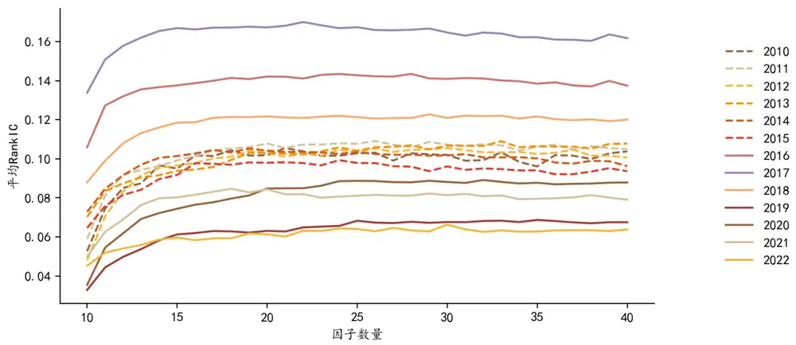
资料来源：Wind，德邦研究所

我们对图中曲线的计算方法稍加解释。例如，为获得 2017 年的曲线在K个因子处平均 RankIC，需为 2017 年的每个月份训练一个 LGBM 模型，用各个模型的验证集数据计算 RankIC，再用这些数值计算平均值。通过观察该图，我们可以得到以下结论。第一，随着因子数量的增加，模型在验证集上的 RankIC 通常表现为先快速上升，再逐渐收敛的特征。第二，不同年度的情况区别很大，在2017 年 RankIC 数值可达 0.16，而在 2019 年和 2022 年 RankIC 的数值却收敛于0.06，这和各年度验证集的数据的性质相关。筛选因子的结果见附录的表3。

## 3.2. 模型有效性跟踪

我们过去一年的滚动平均 RankIC 作为模型有效性的度量，考察少数几个在不同时期训练的机器学习模型的有效性随时间的变化，如图 3 所示。这四个模型都是LGBM模型。

通常，模型在刚训练的时刻是相对比较有效的，而有效的模型和因子往往会随着时间衰减。在图 3 中我们可以观察到这样的现象，最典型的情况是模型 4，这个模型于2017年3月完成训练，初始的有效性极强，然而，自2017年以后，市场风格发生了显著变化，模型有效性随着时间迅速下降。同样，我们在模型 1、2、3上面同样可以观察到类似的现象。

另一方面，模型的有效性未必是随着时间单调衰减的，一个典型的情况见图3中的模型3。模型3于2014年11月完成训练，其效果逐渐衰减，直到2016年12月到达低点，随后其有效性持续上行，到 2018年 7月时甚至超过了刚完成训练模型时刻的表现。模型 3 在训练之初，捕捉到了一种市场异象，而这种异象在消失一段时间后，又再次出现，这使得该模型再次展现出很强的选股能力。

这四个模型的例子说明了模型有效性与市场风格、因子收益率等类似，也存在轮动的特性。因此，短期内失效的模型在长期内未必没有价值，我们不妨不断追踪所有历史训练的模型的表现，动态地加以选用。

图 3：四个不同时期训练的模型的有效性跟踪
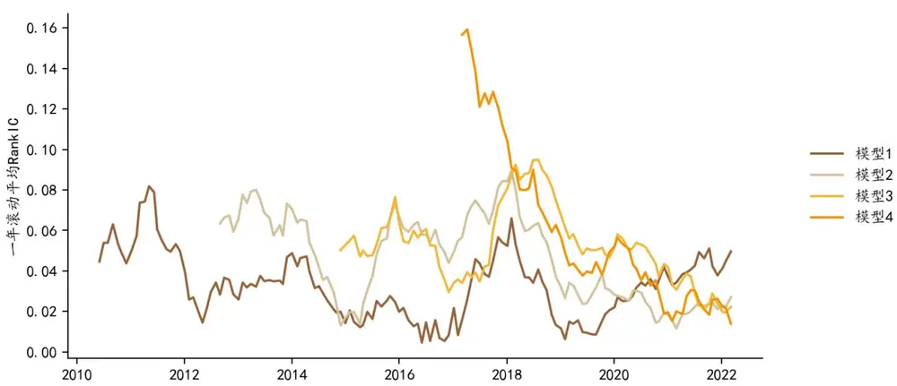
资料来源：Wind，德邦研究所

## 3.3. 长记忆、短记忆的模型池对比

我们提出的方法会每隔一定的时间间隔训练一批新的模型以加入模型池，而旧的模型会始终保持在模型池中，因此模型的数量随时间不断增加，当然，也可以通过舍弃过于陈旧的模型的方式让模型的数量最终保持平稳。通常，在其他参数相同的情况下，训练的起点越早，在同一时刻模型池中的模型数量越多。

上一节中我们提到，早期训练的模型可能依然是有效的，有可能用来提高集成模型的预测能力。从形象的角度来理解，我们可以把每个机器学习模型理解为一个有一段时间市场经验的个体，而每个个体观察的角度不同或观测的时期不同，我们可以收集大量的这样的个体的观点，并且选择近期表现好的个体，来构造一个集体的决策，这便是我们所说的“集成模型”。更早训练的模型拥有更早的市场记忆，而相对新的模型则拥有相对新的市场记忆。如果训练的起点早，则构成一个拥有“长记忆”的模型池；如果训练的起点晚，则构成一个拥有“短记忆”的模型池。

我们分别从 2010 年和 2017 年开始训练两个模型，分别称为长记忆和短记忆模型。两个模型的唯一区别是训练的起点不同，因此，自2017年以后训练的各个模型对于两个集成模型而言是完全一样的。图 4 和图 5 分别显示了长、短记忆的模型池自 2017 年以后的各期因子 RankIC 和累积 RankIC 曲线。显然，长记忆模型池的表现更好，其 RankIC 为负的次数不足短记忆模型的一半。长、短记忆模型在这个时期的ICIR分别为1.307和0.857，体现出了较大的差距。

图 4：长记忆模型的因子RankIC
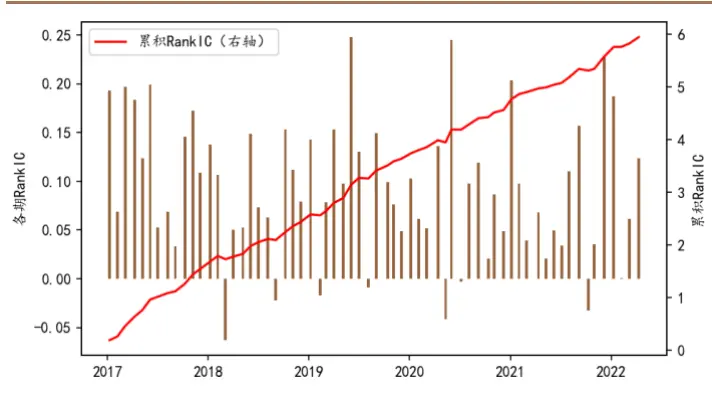
注：使用 LGBM模型，模型从 2010年 7月开始训练。资料来源：Wind，德邦研究所

图 5：短记忆模型的因子RankIC
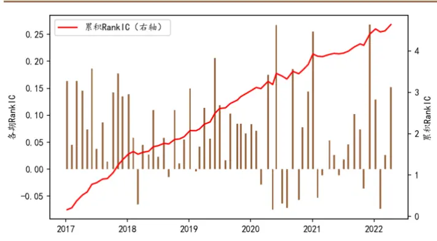
注：使用 LGBM模型，模型从 2017年 1月开始训练资料来源：Wind，德邦研究所

## 3.4. 模型训练频率的影响

图 6 显示不同训练间隔的集成模型的累积 RankIC 曲线，图 7 显示其样本期平均 RankIC 及 Rank ICIR。总体上，集成模型的表现随着训练间隔的增加而下降，但并非完全单调。当训练间隔为 3 个月时，模型表现超过每月训练的模型表现，因此训练频率不必过高。另一方面，模型的运算量和存储消耗都正比于训练频率，因此在同等效果下，训练间隔越大越好。根据图 6 和图 7，训练间隔保持在一年以内时，集成模型的表现都处在较高的水平。而每年一次的训练频率要求的计算资源是极低的。

图 6：不同训练频率的累积RankIC曲线
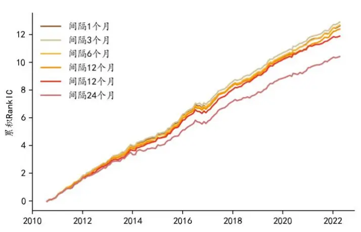
注：使用 LGBM模型，数据范围是 2010年 7月至 2022年 5月。资料来源：Wind，德邦研究所

图 7：不同训练频率的累积平均 RankIC 和 Rank ICIR
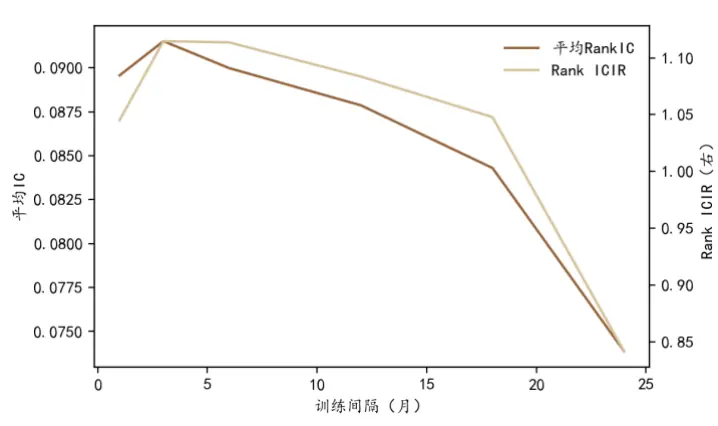
注：使用 LGBM模型，数据范围是 2010年 7月至 2022年 5月。资料来源：Wind，德邦研究所

## 3.5. 验证集时间长度的影响

在训练模型时，我们始终用过去五年的数据，而时间靠前的大部分数据作为训练集用于模型训练，而相对新的数据作为验证集，用于模型筛选。在每期选股时，对于过去和当前训练的模型，都用同一个验证集来进行筛选。

本节讨论应该按什么比例将过去 5 年的数据拆分为训练集和验证集。通常情况下，如果验证集的时间跨度长，则模型倾向于选择长期稳定的规律；如果验证集的时间短，则模型倾向于选择短期有效的规律。一般而言，这两方面的要求需要达到一定的平衡。根据 3.4 节的结果，我们每 3 个月训练新的模型，调节训练集数据的长度，图 8 显示了不同验证集长度的累积 RankIC 曲线，图 9 显示了平均 RankIC 和 Rank ICIR 随着训练集数据时间跨度的变化。结果表明，回测结果对于验证集的时间跨度并不太敏感，图9中RankIC的均值以及ICIR都保持在比较高的水平。另一方面，验证集长度也不宜过短，而我们选择的以过去一年的数据作为验证集是比较恰当的。

图 8：不同验证集长度的累积RankIC曲线
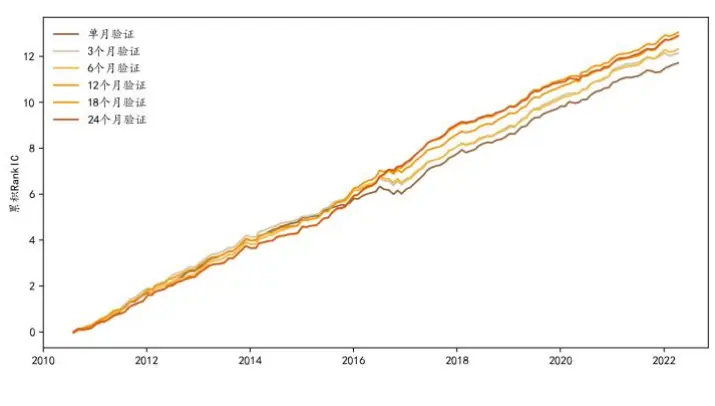
资料来源：Wind，德邦研究所

图 9：不同验证集长度的累积平均 RankIC和 Rank ICIR
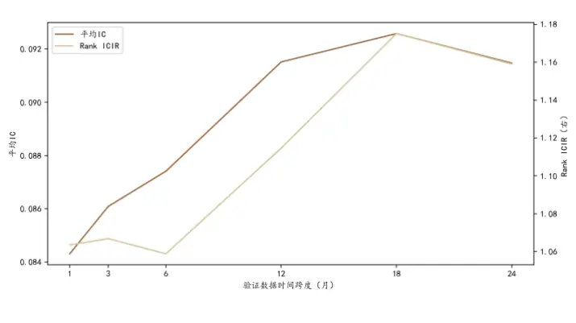
资料来源：Wind，德邦研究所

## 3.6. 各类模型对比

图10显示了不同种类的模型的累积RankIC曲线。

图 10：不同模型的累积RankIC曲线
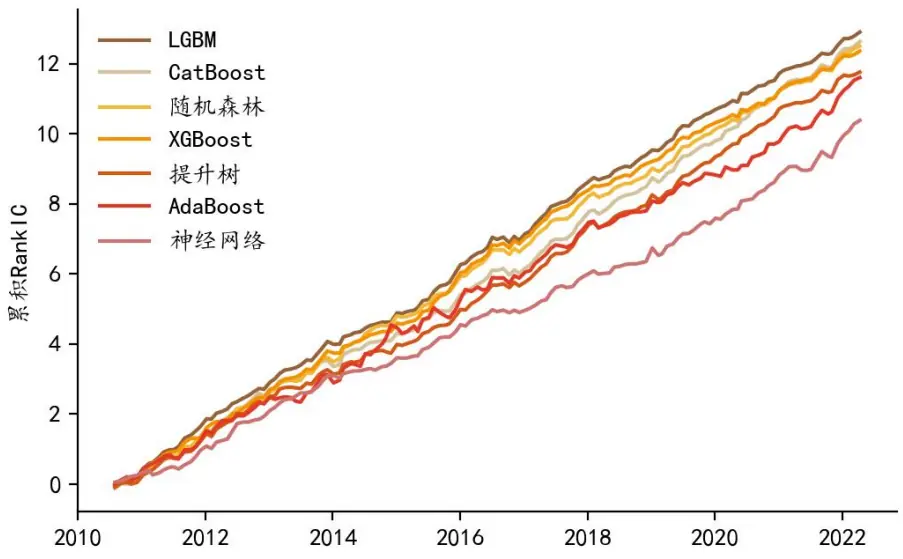
资料来源：Wind，德邦研究所

各个模型的训练结果有一定的差异，但是我们通过各类模型都获得一条稳定增长的累积 RankIC 曲线。这说明方法对于模型类型的敏感性低。LGBM、CatBoost、随机森林、XGBoost、提升树、AdaBoost 本质上都是集成模型，都有通过抑制噪音来提高表现的能力，而神经网络不属于集成模型，在回测中结果也最差，这一点与我们在前面几篇机器学习系列研报中得到的经验一致。

## 3.7. 验证集表现与样本外表现的相关性

按照 2.3.2 节中提到的方法，我们根据验证集上模型的表现对模型进行筛选。本节探讨这种筛选是否真的有作用，并且探讨以何种方式进行筛选能达到较好的效果。

一个在历史上表现好的模型在未来未必表现好，例如，模型A利用牛市中的数据学习到的规律可以描述为“高贝塔的股票表现好”，如果评价模型的时间点恰好是市场经历牛熊切换的时刻，那么模型 A 在历史上表现极好，但在未来表现极差。因此，我们需要从统计上考察利用历史数据筛选模型的做法的有效性。

在每一个筛选模型的横截面上，根据过去 $\cdot N_{V}$ 个月的平均 RankIC 对各个模型进行评价，我们尝试了将 $N_{V}$ 取为1、3、6、12，据此，可以得到四种不同的评价指标，分别称之为“单期评价”、“三期评价”、“六期评价”和“十二期评价”。在该横截面的下一个时期，同样可以计算各个模型的 RankIC，该数值体现模型真实的样本外预测能力。我们考察前面四种评价与样本外 RankIC 的相关系数，如果该相关系数大于零，则说明模型筛选有一定的作用，该相关系数越大，说明模型筛选的效果越好。图11显示了四种评价指标与样本外RankIC在各期的相关系数。结果表明，平均相关系数随着评价期数的增加而单调增加，用单期的数据进行验证的效果最差，平均相关系数为 0.21，而用十二期的数据验证的结果最好，平均相关系数为 0.33。进一步增加验证集长度并没有显著的增益。这说明历史上长期表现稳定的模型相对来说更可靠，而历史上不稳定但短期有效的模型的可靠性则稍低。

图 11：验证集平均RankIC与样本外RankIC的相关系数
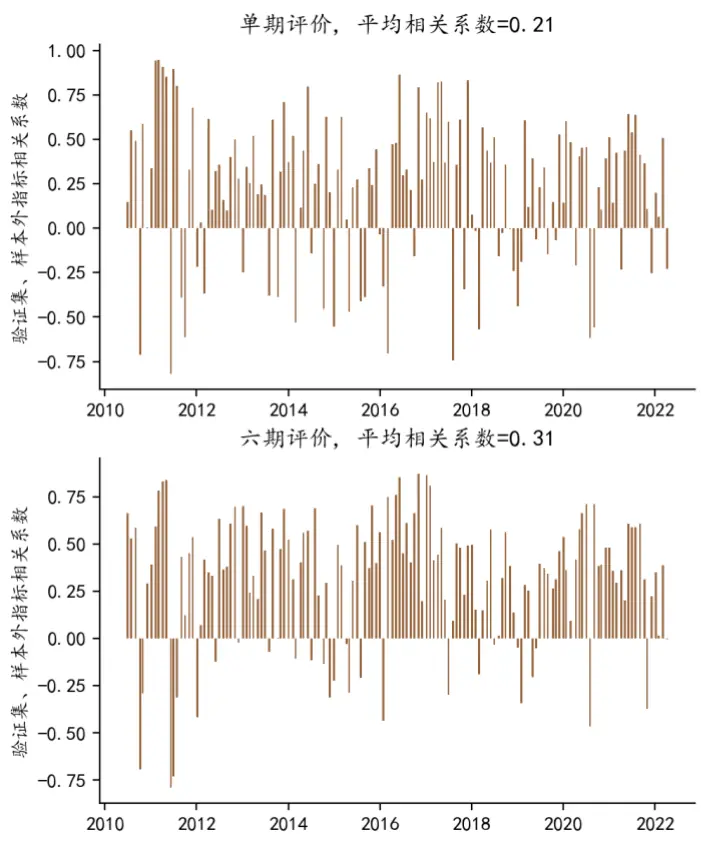
资料来源：Wind，德邦研究所

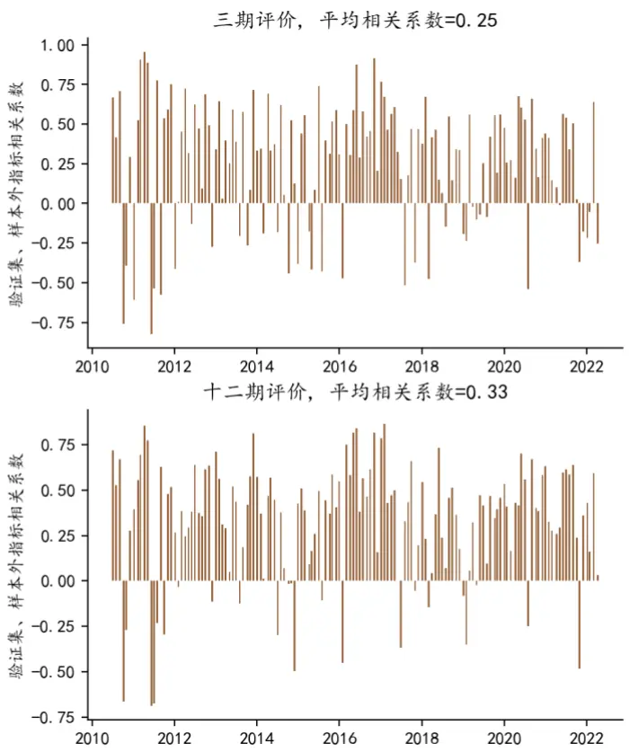

## 3.8. 多模型的异质性

由于模型四要素的多样性，我们可以训练大量不同的模型。但是这些模型是否有可能是高度同质化的？如果模型高度同质化，则它们不能很好地互相提供补充信息，难以真正发挥集成模型的优势。我们以 2022 年 4 月 8 日这个横截面为例，考察模型池中的五千余个模型在这个横截面的预测值之间的相关系数。

对于任意一个模型k，该模型对横截面的所有股票的特质收益率做预测，得到向量p ，我们可以两两计算两个不同模型的预测向量之间的相关系数，并考察这个相关系数的分布。图 12 显示了这个相关系数的分布的概率密度，其平均值仅为 0.144，这说明模型之间是高度异质的，这有利于构建更高质量的集成模型。

图 12：所有模型横截面预测值的相关系数的概率密度
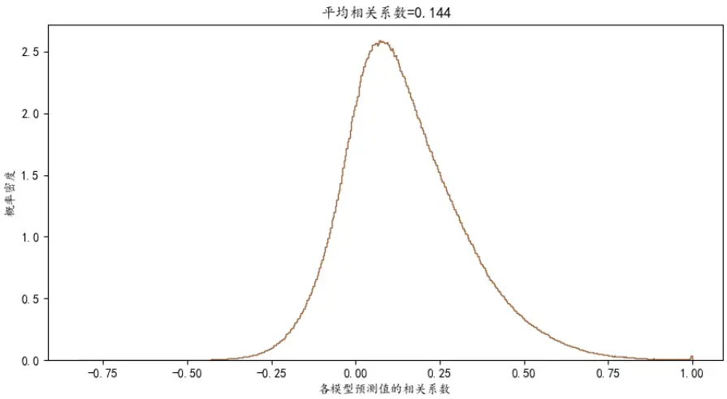
资料来源：Wind，德邦研究所

## 3.9. 三类机器学习因子对比

我们在2.3.3、2.3.4和2.3.5节中分别提到了三种机器学习因子的构造方法。本节对三种因子的表现根据 RankIC进行简单对比，本节中，我们使用 LGBM模型作为预测模型 。式（3）定义的和图 13 所示的机器学习因子平均 RankIC 为0.075，Rank ICIR为0.906；式（4）定义的和图14所示的机器学习反转因子的平均 RankIC 为 0.095，Rank ICIR 为 1.04，式（5）定义的和图 15 所示的复合因子的平均 RankIC 为 0.088，Rank ICIR 为 1.083，故复合因子的 Rank ICIR 最高。

图 13：机器学习因子的RankIC
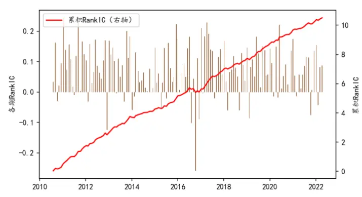
资料来源：Wind，德邦研究所

图 14：机器学习反转因子的RankIC
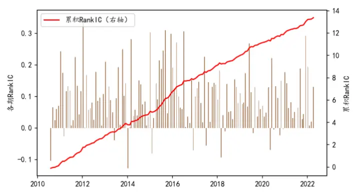
资料来源：Wind，德邦研究所

虽然机器学习反转因子与复合因子的结果从 RankIC 的角度来看相差不大，但通过分组回测，发现复合因子的多头组表现显著优于机器学习反转因子，而机器学习反转因子的 RankIC 高很大程度上是由较高的空头收益贡献的。此外，我们发现，如果将选股的频率降低到季度频率，则机器学习反转因子通常会失效，而机器学习因子通常依然有效。

图 15：复合因子的 RankIC
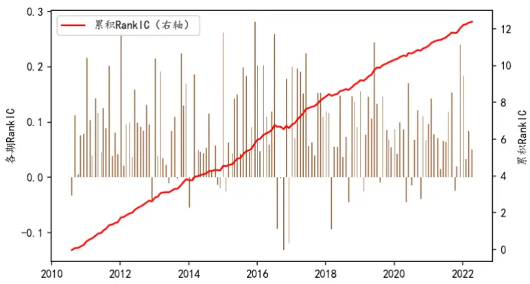
资料来源：Wind，德邦研究所

## 3.10. 多模型集成

我们将多种模型集成起来，使用式（6）的方法构建复合因子。该因子在全市场表现优秀，在中证1000指数成分内表现良好，但在沪深300指数与中证500指数成分内表现相对差，尤其在2017之后长期处于失效的状态。

对于上述现象，我们总结了以下四方面的原因：第一，机器学习方法的优化目标函数是全市场的因子 RankIC 值，因此从结果来看，因子在全市场的表现最优；第二，量化方法通常在更大数量的和相对小市值的股票中更容易挖掘稳健的超额收益；第三，相对于我们的《机器学习专题之四》中的结果，本文从季度选股提升频率到了月度选股，我们发现，上季度的股票残差收益率因子在沪深 300内本身就具有良好的选股效果，且该效应为动量效应。相比之下，上月度的股票残差收益率因子在沪深 300 指数成分内几乎不具有选股能力。因此，从季度频率提高到月度频率的做法本身或提高了沪深 300 指增的难度。第四，我们使用的因子库的质量尚有待提高，例如，部分财务因子的处理方式过于简单，尚未使用分析师因子或另类因子。我们认为方法本身难以弥补因子信息含量低、噪音成分大的问题。我们正在致力于扩充和提高因子库的质量，并期待通过改善因子来提高策略表现。

图 16：全市场 RankIC
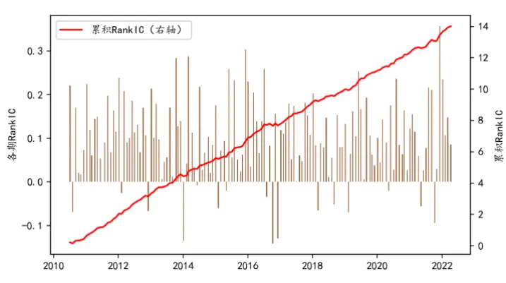
注：数据范围为 2010年 7月至 2022年 5月。资料来源：Wind，德邦研究所

图 18：中证 500 指数成分内的 RankIC
图 17：沪深 300 指数成分内 RankIC
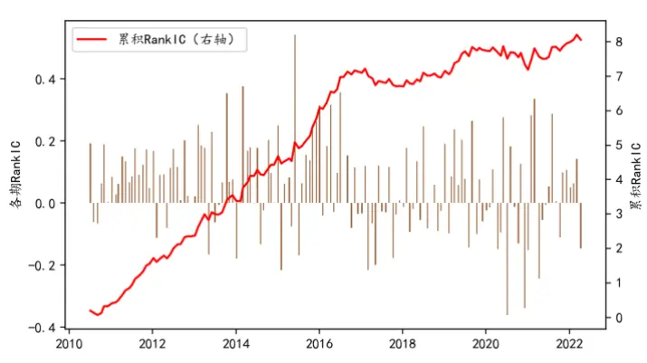
注：数据范围为 2010年 7月至 2022年 5月。资料来源：Wind，德邦研究所

图 19：中证 1000 指数成分内的 RankIC

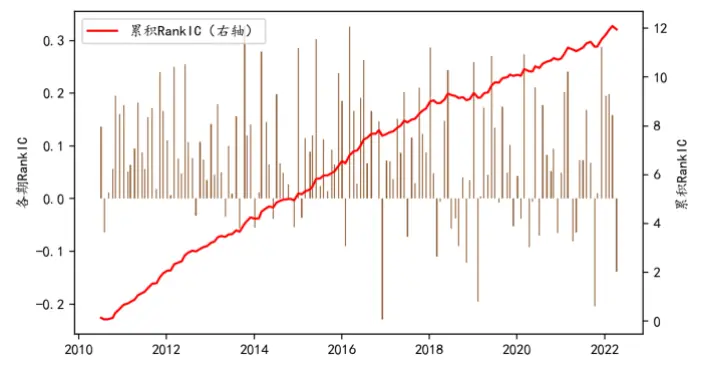
注：数据范围为 2010年 7月至 2022年 5月。资料来源：Wind，德邦研究所

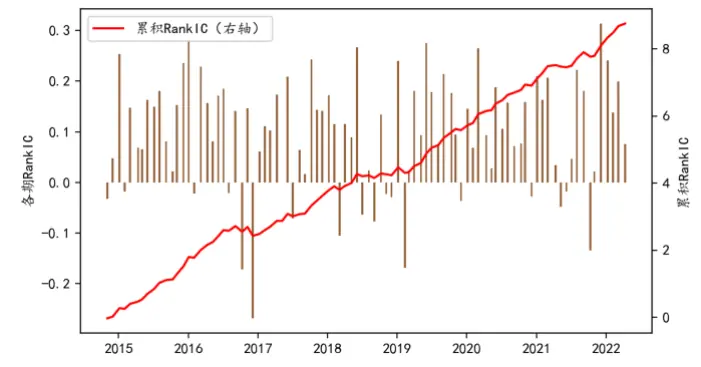
注：数据范围为 2014年 12月至 2022年 5月。资料来源：Wind，德邦研究所

我们根据该因子对全市场的股票进行了分组回测。将全市场的不属于北交所、ST 和*ST 的股票均匀分为十组，各个组的成分股等权重构造组合，每月进行一次调仓。按照同样的分组规则，我们对中证 1000指数成分股进行了分五组回测。

全市场分十组回测的结果如图 20 所示，其中组十的分年度表现如表 1 所示，其中基准选用中证 1000 指数。结果表明，十组的单调性很好，即通常因子值越大，分组的收益越高，图 20 中黑色虚线代表的多空收益和红色虚线代表的多头超额收益都较为稳健。组十的超额收益在每个年度均为正，样本期年化超额收益率为 18.6%，信息比率为 2.41。

图 20：全市场分十组回测结果
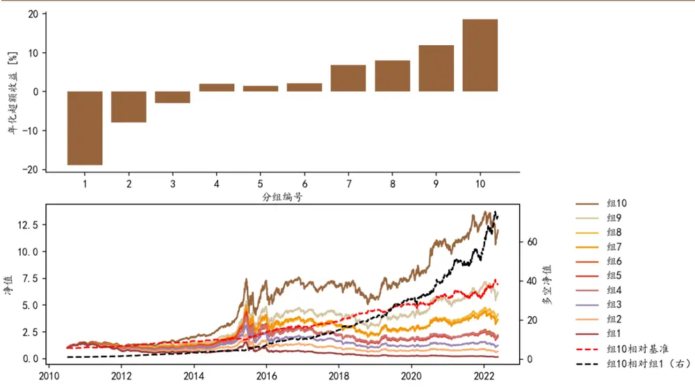
注：基准为中证 1000指数，回测的时间范围为 2010年 7月 5日至 2022年 5月 20日。资料来源：Wind，德邦研究所

表 1：全市场分十组分组回测表现

注：基准为中证 1000指数，回测的时间范围为 2010年 7月 5日至 2022年 5月 20日，表中省略了 2010年和 2011年的年度表现。资料来源：Wind，德邦研究所

中证 1000指数分五组回测的结果如图21所示。
图 21：中证1000指数成分的分五组回测
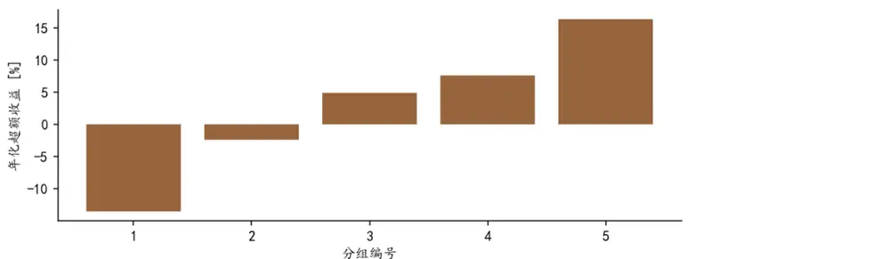

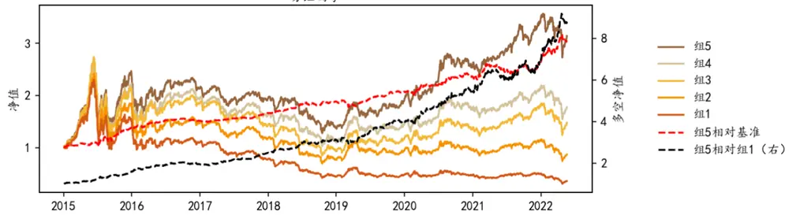
注：基准为中证 1000指数，回测的时间范围为 2014年 12月 31日至 2022年 5月 20日。资料来源：Wind，德邦研究所

组五的分年度表现如表3所示。多头组的超额收益总体上较为稳健，在每一年的超额收益均为正，样本期的总体超额收益为 16.3%，信息比率为 2.092。

表 2：中证1000分五组回测结果

|  | 2015 | 2016 | 2017 | 2018 | 2019 | 2020 | 2021 | 2022 | 成立至今 |
| --- | --- | --- | --- | --- | --- | --- | --- | --- | --- |
| 策略年化收益率 | 142.0% | -11.9% | -9.6% | -28.6% | 38.1% | 35.5% | 34.6% | -23.8% | 16.8% |
| 基准年化收益率 | 75.5% | -20.0% | -17.4% | -37.3% | 25.7% | 19.4% | 20.5% | -48.3% | 0.5% |
| 超额年化收益率 | 66.5% | 8.1% | 7.8% | 8.6% | 12.4% | 16.1% | 14.0% | 24.5% | 16.3% |
| 策略年化波动率 | 55.6% | 34.1% | 16.5% | 26.4% | 23.0% | 24.2% | 15.9% | 29.8% | 30.9% |
| 基准年化波动率 | 46.2% | 31.7% | 16.2% | 24.8% | 24.9% | 27.3% | 18.9% | 31.1% | 29.0% |
| 超额年化波动率 | 12.6% | 4.5% | 2.7% | 4.3% | 5.0% | 7.3% | 10.5% | 11.6% | 7.8% |
| 策略夏普比率(rf=2%) | 2.519 | -0.408 | -0.701 | -1.16 | 1.571 | 1.382 | 2.045 | -0.868 | 0.478 |
| 基准夏普比率(rf=2%) | 1.588 | -0.695 | -1.191 | -1.582 | 0.951 | 0.637 | 0.978 | -1.618 | -0.053 |
| 信息比率 | 5.279 | 1.789 | 2.86 | 2.03 | 2.485 | 2.22 | 1.343 | 2.11 | 2.092 |
| 策略最大回撤 | 51.5% | 25.8% | 17.7% | 35.5% | 15.5% | 12.4% | 11.6% | 23.6% | 52.9% |
| 策略最大回撤起始 | 20150612 | 20160106 | 20170316 | 20180108 | 20190404 | 20200305 | 20210909 | 20220112 | 20150612 |
| 策略最大回撤终止 | 20150915 | 20160128 | 20170601 | 20181018 | 20190606 | 20200323 | 20211028 | 20220426 | 20181018 |
| 基准最大回撤 | 53.1% | 26.9% | 20.0% | 42.3% | 22.2% | 15.7% | 11.2% | 34.0% | 72.3% |
| 基准最大回撤起始 | 20150612 | 20160106 | 20170105 | 20180108 | 20190404 | 20200225 | 20210105 | 20220104 | 20150612 |
| 基准最大回撤终止 | 20150915 | 20160128 | 20171225 | 20181018 | 20190809 | 20200401 | 20210205 | 20220426 | 20181018 |
| 超额最大回撤 | 7.4% | 2.9% | 1.4% | 3.0% | 7.0% | 4.8% | 7.8% | 4.4% | 7.8% |
| 超额最大回撤起始 | 20150616 | 20161010 | 20170816 | 20180713 | 20190131 | 20200123 | 20210324 | 20220422 | 20210324 |
| 超额最大回撤终止 | 20150708 | 20161215 | 20170914 | 20180917 | 20190307 | 20200225 | 20210721 | 20220511 | 20210721 |
| 策略卡玛比率 | 2.757 | -0.462 | -0.543 | -0.806 | 2.462 | 2.864 | 2.973 | -1.01 | 0.317 |
| 基准卡玛比率 | 1.42 | -0.745 | -0.87 | -0.882 | 1.156 | 1.238 | 1.833 | -1.42 | 0.007 |
| 超额卡玛比率 | 8.951 | 2.762 | 5.504 | 2.832 | 1.769 | 3.393 | 1.802 | 5.529 | 2.094 |

注：基准为中证 1000指数，回测时间范围为 2014年 12月 31日至 2022 年 5月 20日。资料来源： ，德邦研究所

图 22 显示了表 2 中组五的收益归因，我们把收益分解到行业、风格与特质回报三个方面。归因结果表明，10.9%的收益来自于特质回报，且相对稳定；4.9%的收益来源于风格回报，稳定性较低；而由于我们没有主动做行业选择，行业回报仅为0.4%。

图 22：中证1000指数成分组5超额收益归因
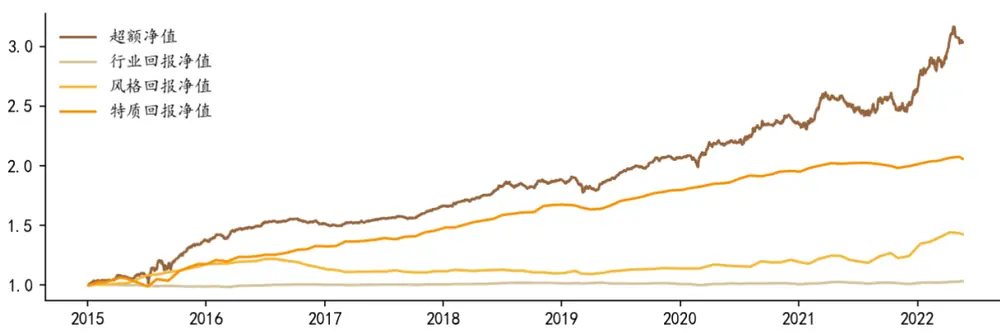
注：基准为中证 1000指数，回测时间范围为 2014年 12月 31日至 2022 年 5月 20日。资料来源：Wind，德邦研究所

## 4. 结论

我们构建了一种通过机器学习模型池来进行选股的方法。我们采用验证集数据打分的方式既对训练模型的因子进行筛选，也对集成模型中使用的模型进行筛选，从而尽可能使用最可能有效的因子和模型。我们对因子筛选的过程进行了大幅度的加速，一方面 LGBM 模型进行拟合和预测，另一方面通过因子预筛选机制提高筛选效率。

相对于常见的每期重训练模型的方法，我们采用了一种创新的使用模型的方法。通常，单个模型通常在刚训练的时刻比较有效，但其有效性会随着时间衰减而逐渐失效，另一方面，一个一度失效的模型可能在未来重新变得有效，这往往是由市场风格、因子轮动效应导致的，故“旧”的模型可能也是有价值的。

我们每训练一个新的机器学习模型就将这个模型添加到模型池中，从而维护一个模型池。每个模型都有四方面的要素，包括模型类型、模型参数、数据时间范围、因子种类列表。我们持续地观测模型池中各个模型的表现。实际上，用机器学习模型进行横截面选股时，不必每期重训练模型或新训练模型，而可以多加利用模型池中已有的模型。在我们的回测中，每三个月新训练模型的频率的表现是最优的，而这种相对低的训练频率可以减少运算量。

我们发现，由于众多模型是在不同的历史阶段并且用不同的因子进行训练的，模型之间的异质性很好，我们以一个横截面为例，两两计算了模型预测值之间的相关系数，发现预测值之间的相关性不高，这有利于构建更好的集成模型。在使用模型池进行选股时，我们采用验证集打分的方式对各个模型进行评价，筛选评价最高的一批模型参与构建集成模型。经验证，在过去一年中稳定有效的模型有更大的概率在未来更加有效。

我们对涉及到的几个主要参数和模型类型进行了敏感性分析。通过对比各参数发现模型对训练频率、验证集时间长度和模型种类的敏感性低。模型池的起始训练时间点对策略的表现也有影响，开始训练模型的时间点越早，则在同一时间点模型池的规模越大，并且模型池整体对更长时间的市场状态有记忆，经过我们的对比测试，发现有更长记忆的模型池的整体表现更优。

我们使用多种机器学习模型构建了模型池，并构造了一个复合选股因子。该因子在全市场和市值偏小的股票池中表现良好。因子在全市场与中证 1000 指数成分内表现良好，在相对大市值的股票池中的表现有待提升。后续的工作中，我们考虑从改善因子库、更换选股频率、改进因子合成方法等角度考虑进一步提高策略表现。

## 5. 附录

表 3：因子筛选结果

| 1 |  | 2 | 3 | 4 | 5 |
| --- | --- | --- | --- | --- | --- |
| 2010/07/02 | 季度净资产回报率 | 应付职工薪酬的同比增速 | 销售费用除以总资产 | 所得税除以总资产 | 流通市值比总市值 |
| 2010/10/08 | 季度净资产回报率 | 管理费用除以总资产 付给职工以及为职工支付的 | 营业利润增速(单季度同比) | 全部资产现金回收率变动 | 存货周转率 TTM |
| 2011/01/07 | 季度净资产回报率 | 现金除以总资产 | 应收周转率变动 固定资产折旧、油气资产折 | 营业利润增速(单季度同比) | 应交税费的同比增速 |
| 2011/04/08 | 季度净资产回报率 | 市盈率 LYR 倒数 | 耗、生物性生物资产折旧的 同比增速 | 营业利润率变动 | 应收周转率 TTM |
| 2011/07/01 | 净资产收益率变动 | 未分配利润除以总资产 | 无形资产的同比增速 | 购建固定资产、无形资产和其他长 期资产支付的现金除以总资产 | 营业利润率变动 |
| 2011/09/30 | 营业利润率变动 | 资产回报率变动 | 市盈率 LYR 倒数 固定资产折旧、油气资产折 | 存货周转率变动 | 营业收入增速(单季度 同比） |
| 2012/01/06 | 季度净资产回报率 | 营业利润率变动 | 耗、生物性生物资产折旧的 同比增速 | 净资产收益率变动 | 未分配利润除以总资 产 |
| 2012/04/06 | 净资产收益率变动 | 市盈率相对盈利增长率 | 销售费用的同比增速 | 应付职工薪酬的同比增速 | 流通市值比总市值 |
|  | 2012/06/29市盈率相对盈利增长率 净利润增速（单季度同 | 净资产收益率变动 | 负债合计的同比增速 | 流通市值对数 | 管理费用的同比增速 |
| 2012/09/28 | 比) | 营业利润率变动 | 营业利润的同比增速 | 应付票据及应付账款的同比增速 | 预收账款的同比增速 |
| 2013/01/04 | 净资产收益率变动 营业收入增速(单季度同 | 营业利润增速(单季度同比) | 季度净资产回报率 | 存货周转率变动 | 市盈率 LYR 倒数 |
| 2013/03/29 | 比） | 少数股东权益的同比增速 | 税金及附加除以总资产 | 所有者权益合计的同比增速 | 市盈率 LYR |
|  | 2013/06/28盈余公积金的同比增速 | 市盈率 LYR 倒数 | 归属母公司普通股东综合收 益总额除以总资产 | 利润总额的同比增速 | 财务费用除以总资产 |
| 2013/10/11 | 流通市值比总市值 | 销售费用的同比增速 | 管理费用除以总资产 | 应付职工薪酬除以总资产 | 预收账款的同比增速 付给职工以及为职工 |
| 2014/01/03 | 净利润增速（单季度同 比） | 流通市值比总市值 | 管理费用除以总资产 | 市盈率 TTM扣除非经常损益 | 支付的现金除以总资 产 |
| 2014/04/11 | 管理费用除以总资产 | 流通市值比总市值 | 经营性应付项目的增加除以 总资产 | 非流动资产合计的同比增速 | 全部资产现金回收率 变动 |
| 2014/07/04 | 流通市值比总市值 | 额除以总资产 | 归属少数股东的综合收益总经营性应付项目的增加除以 总资产 | 管理费用除以总资产 | 应收周转率 TTM |
| 2014/10/10 | 应收周转率 TTM | 付给职工以及为职工支付的 现金除以总资产 | 企业价值倍数 TTM | 流通市值比总市值 | 应收周转率变动 |
| 2014/12/31 2015/04/10 | 流通市值对数 | 净资产收益率变动 | 应收周转率 TTM | 盈余公积金的同比增速 | 资产周转率 TTM |
|  | 流通市值比总市值 | 应收周转率 TTM | 管理费用除以总资产 | 综合收益总额的同比增速 | 市销率 TTM |
|  | 2015/07/03 市盈率相对盈利增长率 | 季度净资产回报率 | 净利润增速（单季度同比） | 应收周转率 TTM | 流通市值对数 归属母公司普通股东 |
| 2015/10/09 | 营业收入增速(单季度同 比) | 营业利润率变动 | 流通市值对数 | 实收资本（或股本）除以总资产 | 综合收益总额除以总 资产 |
| 2015/12/31 | 流通市值比总市值 | 归属母公司普通股东综合收 益总额的同比增速 | 利润总额的同比增速 | 管理费用除以总资产 | 无形资产的同比增速 |
| 2016/04/08 | 流通市值比总市值 | 税金及附加除以总资产 | 归属少数股东的综合收益总 额除以总资产 | 支付的各项税费除以总资产 | 营业收入增速(单季度 同比) |
| 2016/07/01 | 流通市值比总市值 | 归属母公司股东的权益的同 比增速 | 少数股东权益的同比增速 | 流通市值对数 | 现金比率变动 |
| 2016/09/30 | 流通市值比总市值 | 净资产收益率变动 | 管理费用除以总资产 | 应交税费除以总资产 | 总资产增速 |
| 2017/01/06 | 流通市值比总市值 | 流通市值对数 | 市现率_经营性现金流 TTM | 应交税费的同比增速 | 营业利润增速(单季度 环比) |
| 2017/04/07 | 流通市值对数 | 净资产收益率变动 | 营业收入增速(单季度同比) | 总市值对数 | 应计利润占比 |
|  | 2017/06/30税金及附加的同比增速 | 资产回报率变动 | 季度净资产回报率 | 购买商品、接受劳务支付的现金的 同比增速 | 总市值对数 |
| 2017/09/29 | 净利润增速（单季度环 比) | 应交税费的同比增速 | 流通市值对数 | 营业利润率变动 | 市现率_经营性现金流 TTM |
| 2018/01/05 市盈率相对盈利增长率 |  | 净资产收益率变动 | 管理费用除以总资产 | 预收账款的同比增速 | 现金的期末余额除以 总资产 |
| 2018/03/30 | 应交税费的同比增速 | 付给职工以及为职工支付的 现金除以总资产 | 营业收入增速(单季度同比) | 现金流动负债比例变动 | 财务费用除以总资产 |
| 2018/06/29 | 流通市值对数 | 市盈率相对盈利增长率 | 净资产收益率变动 | 付给职工以及为职工支付的现金除 以总资产 | 管理费用除以总资产 |
| 2018/09/28 | 净资产收益率变动 | 季度净资产回报率 | 应收周转率变动 | 营业收入增速(单季度同比) | 非流动资产合计的同 比增速 |
| 2019/01/04 | 季度净资产回报率 | 应交税费的同比增速 | 归属母公司普通股东综合收 益总额的同比增速 | 流通市值对数 | 应计利润占比 |
| 2019/03/29 | 净资产收益率变动 | 季度净资产回报率 | 非流动资产合计的同比增速 | 市净率 LF倒数 | 付给职工以及为职工 支付的现金除以总资 产 |
| 2019/06/28 | 基本每股收益的同比增 速 | 季度净资产回报率 | 非流动资产合计的同比增速 | 净资产收益率变动 | 营业收入增速(单季度 同比） |
| 2019/10/11 | 总资产增速 | 流通市值比总市值 | 资产回报率变动 | 应交税费的同比增速 | 存货周转率 TTM |
| 2020/01/03 | 营业收入增速(单季度同 比） | 总资产增速 | 市净率 LF倒数 | 毛利率变动 | 市盈率 LYR 倒数 |
| 2020/04/10 | 营业收入增速(单季度同 比) | 流通市值比总市值 | 市净率LF倒数 | 存货周转率 TTM | 管理费用除以总资产 |
| 2020/07/03 | 营业收入增速(单季度同 比) | 流通市值对数 | 管理费用除以总资产 | 现金流动负债比例变动 | 货币资金除以总资产 |
| 2020/10/09 | 基本每股收益 | 流通市值比总市值 | 总市值对数 | 市净率LF倒数 | 间接法-经营活动产生 的现金流量净额除以 总资产 |
| 2020/12/31 | 季度净资产回报率 | 流通市值比总市值 | 流通市值对数 | 间接法-经营活动产生的现金流量 净额除以总资产 | 存货周转率TTM |
| 2021/04/09 | 稀释每股收益 | 市凈率 | 流通市值对数 | 少数股东权益的同比增速 | 现金流动负债比例 |
| 2021/07/02 | 市净率 | 现金流动负债比例 | 营业利润率变动 | 管理费用的同比增速 | 管理费用除以总资产 |
| 2021/10/08 | 净资产收益率变动 | 市净率 | 现金流动负债比例 | ROE增速（TTM同比） | 市净率 LF倒数 |
| 2022/01/07 | 存货周转率 TTM | 流通市值对数 | 应收周转率 TTM | 全部资产现金回收率 TTM | 资产回报率变动 |
| 2022/04/08 | 毛利率变动 | 未分配利润除以总资产 | 应收票据及应收账款的同比 增速 | 实收资本（或股本）除以总资产 | 市净率 LF倒数 |

注：本表展示了每三个月进行一次因子筛选的结果，各列的序号代表因子入选的次序。资料来源：Wind，德邦研究所

## 6. 风险提示

市场风格变化风险，模型失效风险，数据可用性风险。

## 信息披露

## 分析师与研究助理简介

肖承志，同济大学应用数学本科、硕士，现任德邦证券研究所首席金融工程分析师。具有6年证券研究经历，曾就职于东北证券研究所担任首席金融工程分析师。致力于市场择时、资产配置、量化与基本面选股。撰写独家深度“扩散指标择时”系列报告；擅长各类择时与机器学习模型，对隐马尔可夫模型有深入研究；在因子选股领域撰写多篇因子改进报告，市场独家见解。

王成煜，慕尼黑工业大学计算流体力学博士，清华大学车辆工程本科，通过CFA三级。2021年5月博士毕业，同年8月加盟德邦证券，现任金融工程助理研究员，致力于主动量化选股。

## 分析师声明

本人具有中国证券业协会授予的证券投资咨询执业资格，以勤勉的职业态度，独立、客观地出具本报告。本报告所采用的数据和信息均来自市场公开信息，本人不保证该等信息的准确性或完整性。分析逻辑基于作者的职业理解，清晰准确地反映了作者的研究观点，结论不受任何第三方的授意或影响，特此声明。

## 投资评级说明

| 1. 投资评级的比较和评级标准：以报告发布后的6个月内的市场表现为比较标准，报告发布日后6个月内的公司股价（或行业指数）的涨跌幅相对同期市场基准指数的涨跌幅；2. 市场基准指数的比较标准：A股市场以上证综指或深证成指为基准；香港市场以恒生指数为基准；美国市场以标普500或纳斯达克综合指数为基准。 | 类别 | 评级 | 说明 |
| --- | --- | --- | --- |
|  | 股票投资评级 | 买入 | 相对强于市场表现20%以上； |
|  |  | 增持 | 相对强于市场表现 5%~20%； |
|  |  | 中性 | 相对市场表现在-5%~+5%之间波动； |
|  |  | 减持 | 相对弱于市场表现5%以下。 |
|  | 行业投资评级 | 优于大市 | 预期行业整体回报高于基准指数整体水平10%以上； |
|  |  | 中性 | 预期行业整体回报介于基准指数整体水平-10%与10%之间； |
|  |  | 弱于大市 | 预期行业整体回报低于基准指数整体水平10%以下。 |

## 法律声明

本报告仅供德邦证券股份有限公司（以下简称“本公司”）的客户使用。本公司不会因接收人收到本报告而视其为客户。在任何情况下，本报告中的信息或所表述的意见并不构成对任何人的投资建议。在任何情况下，本公司不对任何人因使用本报告中的任何内容所引致的任何损失负任何责任。

本报告所载的资料、意见及推测仅反映本公司于发布本报告当日的判断，本报告所指的证券或投资标的的价格、价值及投资收入可能会波动。在不同时期，本公司可发出与本报告所载资料、意见及推测不一致的报告。

市场有风险，投资需谨慎。本报告所载的信息、材料及结论只提供特定客户作参考，不构成投资建议，也没有考虑到个别客户特殊的投资目标、财务状况或需要。客户应考虑本报告中的任何意见或建议是否符合其特定状况。在法律许可的情况下，德邦证券及其所属关联机构可能会持有报告中提到的公司所发行的证券并进行交易，还可能为这些公司提供投资银行服务或其他服务。

本报告仅向特定客户传送，未经德邦证券研究所书面授权，本研究报告的任何部分均不得以任何方式制作任何形式的拷贝、复印件或复制品，或再次分发给任何其他人，或以任何侵犯本公司版权的其他方式使用。所有本报告中使用的商标、服务标记及标记均为本公司的商标、服务标记及标记。如欲引用或转载本文内容，务必联络德邦证券研究所并获得许可，并需注明出处为德邦证券研究所，且不得对本文进行有悖原意的引用和删改。

根据中国证监会核发的经营证券业务许可，德邦证券股份有限公司的经营范围包括证券投资咨询业务。