金融工程专题

证券分析师

肖承志

资格编号：S0120521080003

邮箱：xiaocz＠tebon.com.cn

## 研究助理

## 相关研究

1. 《基于模型池的机器学习选股——德邦金工机器学习专题之五》2022.05.24

2. 《动态因子筛选——德邦金工机器学习专题之四》2022.03.09

3. 《基于财务与风格因子的机器学习选股——德邦金工机器学习专题之三》2022.01.25

4. 《机器学习残差因子表现归因——德邦金工机器学习专题之二》2021.11.24

5. 《利用机器学习捕捉因子的非线性效应——德邦金工机器学习专题之一》2021.10.18

# 基于分钟数据的 GRU模型在选股策略中的应用初探

# 德邦金工机器学习专题之六

## [Table_Summ投资要点：

G 是 （循环神经网络）的一种改良，相比传统的 以及 S 有其独特的优点。传统的 RNN 在处理长序列时存在“长期依赖”问题，即梯度消失或梯度爆炸，导致训练困难。LSTM 模型通过其门控单元解决了 RNN 的梯度问题，GRU简化了 LSTM，在训练时更加高效，并且在许多任务上都取得了与 LSTM 相当或更好的性能。

GRU 对时间序列信息的挖掘能力很强，被广泛运用于多个领域。GRU作为一种循环神经网络架构，特别适用于处理序列数据中的长期依赖关系。目前主要的应用场景涉及自然语言处理（NLP）、语音识别、时间序列预测、推荐系统和音乐生产等方面。

用于 股信息挖掘能力较强，能直接从基础分钟行情数据挖掘到对未来收益有预测能力的信息。本文直接采用标准化后的一日分钟 bar行情数据输入 GRU 模型，对股票未来一日的 open to open 收益进行预测。模型得到的因子对于未来一日 open to open 收益率的日平均 Rank IC 为 7.5%，对未来收益有较强的预测能力。分十组来看其各组平均收益率呈现较好的单调线性递增特征，空头组未来一日的平均收益率为-0.34%，多头组未来一日收益率为 0.24%。因子从风格上看主要偏向于低波动率、低流动性风格。

- GRU 因子多头组合表现优秀，但其收益对换仓频率以及交易滑点较为敏感。在组合构建时，交易方面对未来收益会有较大影响，使用开盘价交易的情况下超额年化收益率为 22.45%（日频），16.95%（周频），11.79%（月频），使用全天 VWAP交易的情况下超额年化收益率为 12.91%（日频），9.81%（周频），6.92%（月频）。在交易速率层面策略产生年化约 4.87%-9.54%的滑点影响，换仓频率层面存在约6%-10%左右的年化收益率差异。

GRU 因子构建指数增强组合表现优秀。 GRU因子在构建指数增强组合时，过低的换手频率会导致收益方面有一定损失，但整体表现仍然不错。面对基准选股池整体市值偏小时，收益会有所增强，但是受今年 2月份的风险事件影响也较大。具体来看，沪深 300 增强组合年化收益率增强 7.26%，整体信息比率为 1.93，Calmar比率为 1.68；中证 500 增强组合年化收益率增强 7.58%，整体信息比率为 1.75，Calmar比率为 1.81；中证 1000 增强组合年化收益率增强 8.86%，整体信息比率为 1.83，Calmar 比率为 1.35。跟踪误差均在 5%以内。

风险提示：人工智能模型挖掘市场规律是对历史数据的总结，市场规律在未来可能发生变化。深度学习模型可能存在过拟合风险。深度学习模型存在随机数影响，训练结果可能无法完全复刻。本文测试均在理想状态下使用开盘价或者 价格进行成交计算，实际交易中可能存在其他影响因素导致成交价格出现偏差。

## 1. GRU 模型简介

近年来，传统多因子非周期性的失效已成普遍现象，传统模型向深度学习模型发展的趋势已经形成。传统的多因子迭代，是在挖掘有效因子到因子失效再到新因子的挖掘之间不断循环，对人工要求较高。然而，人力有时穷，新的因子思路的产生具有极大的不确定性，迭代进程比较缓慢。早期的思路是追寻模型的智能迭代，让模型在每个时期去选择有效的因子使用，而深度学习模型不仅仅是因子选择的智能迭代，同时将因子构建过程也交给模型训练，解决人工因子挖掘的难点。

## 1.1. 循环神经网络的发展

RNN（循环神经网络）在1980年代开始出现，用于处理序列数据。然而，传统的 RNN在处理长序列时存在“长期依赖”问题，即梯度消失或梯度爆炸，导致训练困难。为了解决 RNN 的长期依赖问题，Sepp Hochreiter 和 JürgenSchmidhuber 在 1997 年提出了 LSTM（长短期记忆）网络[1]。LSTM 通过引入门控机制来控制信息的流动，从而有效地缓解了梯度消失和梯度爆炸问题。

虽然 LSTM 在解决长期依赖问题上取得了显著成效，但其结构相对复杂。为了简化 LSTM 并提高其训练效率，KyungHyun Cho 等人在 2014 年提出了 GRU（门控循环单元）网络[2]。GRU是 LSTM的一种简化版本，它只包含两个门控单元：更新门（Update Gate）和重置门（Reset Gate）。更新门负责决定哪些信息需要被保存下来，而重置门负责决定哪些信息需要被遗忘。这种简化的结构使得GRU 在训练时更加高效，并且在许多任务上取得了与 LSTM 相当或更好的性能。其高效的训练速度和优秀的性能使得它成为处理序列数据的强大工具之一。

## 1.2. GRU 网络的介绍

图 1：GRU网络结构图
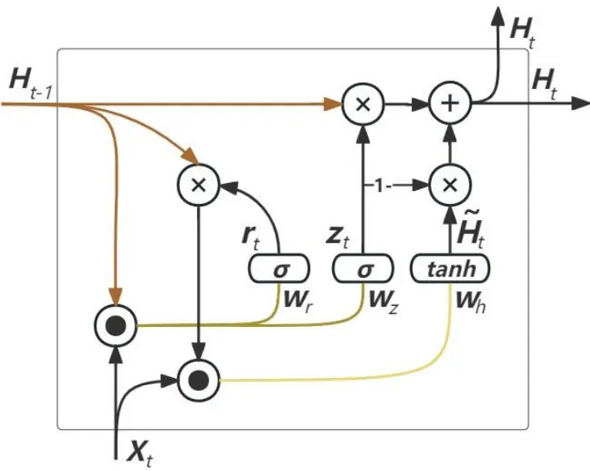
资料来源：pytorch.org，德邦研究所绘制

门控循环单元与普通的循环神经网络之间的关键区别在于：普通的循环神经网络是为了解决数据之间的时序依赖关系，一般它能学习序列中邻近时间的数据点（短期）之间的关系, 但对于长期依赖会变得不稳定。而门控循环单元支持隐状态的门控，这意味着模型有专门的机制来确定应该何时更新隐状态，以及应该何时重置隐状态。

GRU网络的数学表达式为：

$$
\begin{aligned}\mathbf{R}_{t}&=\sigma(\mathbf{X}_{t}W_{xr}+H_{t-1}W_{hr}+b_{r})\\\mathbf{Z}_{t}&=\sigma(\mathbf{X}_{t}W_{xz}+H_{t-1}W_{hz}+b_{z})\\\widetilde{\mathbf{H}}_{t}&=\tanh(\mathbf{X}_{t}W_{xh}+(\mathbf{R}_{t}\otimes\mathbf{H}_{t-1})W_{hh}+b_{h})\\\mathbf{H}_{t}&=\mathbf{Z}_{t}\otimes\mathbf{H}_{t-1}+(1-\mathbf{Z}_{t})\otimes\widetilde{\mathbf{H}}_{t}\end{aligned}
$$

其中 $\mathbf{R_{t}}$ 为重置门， $\mathbf{Z}_{t}$ 为更新门， 表示按元素乘积运算符。

在候选隐状态 $\widetilde{\mathbf{H}}_{\mathbf{t}}$ 中，使用重置门系数 $\mathbf{R_{t}}$ 控制了在加工输入信息的时候使用上一步的隐藏状态中的信息。 $\mathbf{R_{t}}$ 接近 0 时新输入的信息 $\mathbf{.X_{t}}$ 占主导地位，说明当前步的输入包含的信息与前面的信息关联性很小； $\mathbf{R_{t}}$ 接近 1 时新输入的信息和前面的长期信息有较大关联性，需要综合考虑来 $产$ 生当前步的信息。

最后，计算时间 t 时刻的隐状态的输出，它结合更新门 $\mathbf{Z_{t}}$ 以及上一步隐状态$\mathbf{\widetilde{H}_{t-1}}$ 和本步新的候选隐状态 $\widetilde{\mathbf{H}}_{\mathbf{t}}$ 来计算最终的输出。

这些设计一方面可以帮助我们处理循环神经网络中的梯度消失问题，另一方面可以更好地捕获股票时间序列中的信息，类似时间序列中常用的指数移动平均的方式，历史信息不断衰减，最新的信息占有更大的权重。

## 1.3. GRU 网络的应用场景

GRU（门控循环单元）的应用场景广泛，其作为一种循环神经网络架构，特别适用于处理序列数据中的长期依赖关系。目前主要的应用场景涉及自然语言处理（NLP）、语音识别、时间序列预测、推荐系统和音乐生产等方面。

自然语言处理方面，GRU在语言建模、情感分析和机器翻译上都有不错的表现。GRU可以有效地捕捉文本序列中的长期依赖关系，从而用于预测给定文本序列中的下一个单词或字符。GRU可以处理长文本，并理解其中的情感倾向，这在社交媒体分析、电影评论分类等场景中非常有用。在翻译过程中，GRU能够处理源语言和目标语言之间的长期依赖关系，从而生成更准确的翻译结果。

GRU在语音识别任务中表现出色，可以处理连续的语音信号，并将其转换为文本。其门控机制有助于模型选择性地保留或忘记之前时间步的信息，从而更准确地识别语音。

在金融、气象、交通等领域，GRU可以用于预测时间序列数据，如股票价格、天气变化、交通流量等。通过捕捉数据中的长期依赖关系，GRU可以生成更准确的预测结果。

虽然 GRU 最初是为处理序列数据而设计的，但近年来它也被应用于计算机视觉领域。例如，在视频分析任务中，GRU可以处理连续的图像帧，并捕捉其中的运动模式和对象关系。

在推荐系统中，GRU可以处理用户的历史行为数据，并捕捉其中的长期依赖关系。这有助于模型更准确地理解用户的兴趣和偏好，从而生成更个性化的推荐结果。

GRU也可以用于音乐生成任务。通过训练模型学习音乐序列中的长期依赖关系，GRU可以生成具有连贯性和音乐性的新音乐作品。

## 2. GRU模型应用于A股市场选股

## 2.1. GRU用于预测股票收益的优势

GRU能够通过其独特的门控机制有效捕获股票数据中的长期依赖关系。在股票价格预测中，能够综合考虑过去的价格走势、交易量等对未来价格有至关重要影响力的信息。

门控机制允许模型选择性地保留和更新信息，从而能够更加充分的使用历史数据信息来预测股票的未来收益。

在设计角度上看 GRU 具有更好的训练稳定性和泛化能力。这意味着即使在数据噪声较大或模型结构较为复杂的情况下，GRU 仍能够保持较好的预测性能。

## 2.2. 模型搭建

图 2：GRU模型框架图
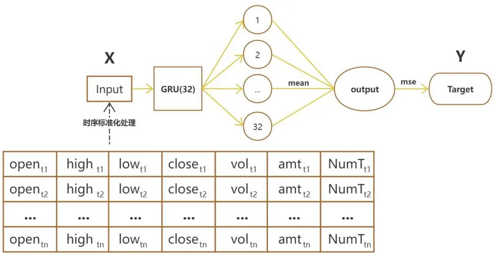
资料来源：德邦研究所绘制

为了展示 GRU 网络的信息挖掘能力，我们直接选取基础行情数据作为模型输入，网络参数不做复杂的调整，简单设置 32 个 GRU 隐藏元挖掘到 32 个隐含因子，最后 32 个隐含因子直接取均值得到模型输出，具体模型框架如上图所示。

模型参数以及输入和预测目标设定：

数据集：2018年1月1日-2024年 6月 21日的分钟频数据。

训练股票池：全市场股票，剔除 st、*st、上市不满 1年、停牌无法交易的股票。

输入：选取一日的分钟 bar 行情作为模型输入，共包含开盘价、最高价、最低价、收盘价、成交量、成交额和成交笔数 7个特征，特征在日内 240分钟上做时序标准化。

预测目标：未来 1个交易日的 open to open收益率，每日做截面标准化。

Input_size:7

Hidden_size:32

Bias:False

Optim:Adam(learning_rate=0.001)

Loss:MSE

Batch_size:4096

训练方式：每次使用过去 10个月的分钟频数据进行训练，按照 4：1拆分为8 个月的训练集和 2 个月的验证集，得到的模型使用一个月，每个月滚动重新进行训练。

图 3：GRU模型训练示意图
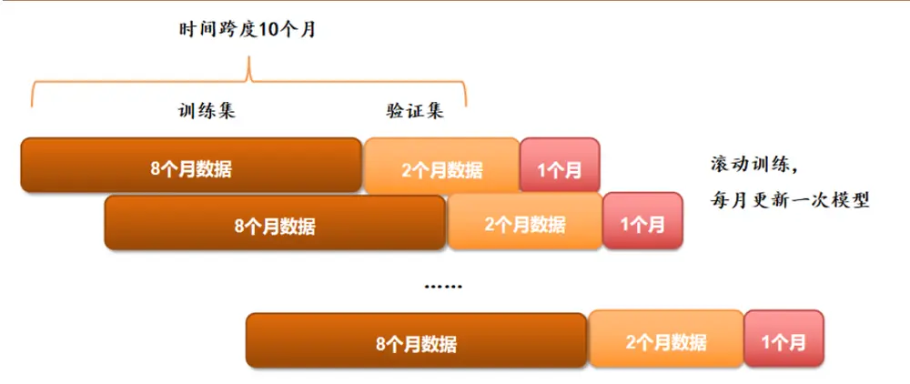
资料来源：德邦研究所绘制

## 3. GRU 因子表现

## 3.1. GRU 因子 IC

因子数据统计窗口为：2019年1月 1日至2024年 6月21日。（若无其他说明，本文统计区间均为该时间）

图 4：GRU 因子 IC
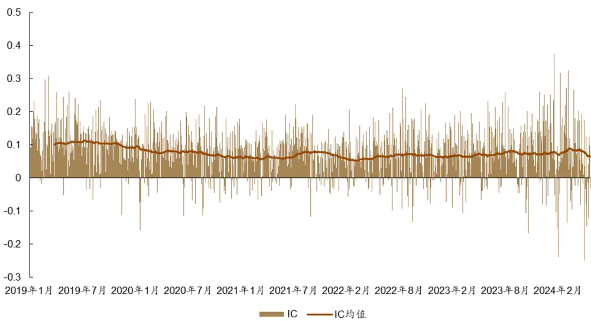
资料来源：Wind，RiceQuant，德邦研究所

最终得到的 GRU因子，对预测目标（未来一日 open to open收益率）的日均 IC（RankIC，若无其他说明，本文IC均指Rank IC）为7.5%。从时间上看，2022 年之前IC整体均值在 8.0%左右，2022年后略有减弱，整体均值在 6.9%左右。从累计 IC上看，因子整体表现稳定，并未出现明显回撤（失效）的情况。

从分组收益上看，因子的分组效果非常线性，空头组（第 1 组）未来一日的平均收益率为-0.34%，多头组（第 10 组）未来一日平均收益率为 0.24%。GRU因子相比传统的技术因子，空头偏好不强，多空上整体比较均衡。

图 5：GRU 因子累积 IC
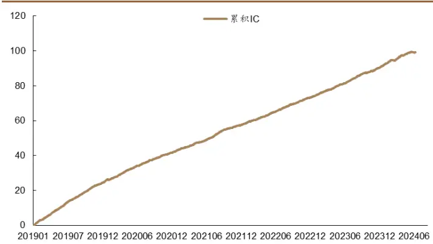
资料来源： Wind，RiceQuant，德邦研究所

图 6：GRU因子分组收益
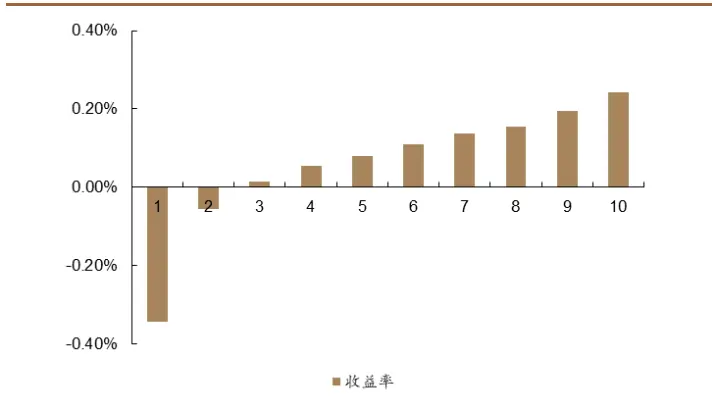
资料来源：Wind，RiceQuant，德邦研究所

## 3.2. GRU 因子的风格偏好

图 7：GRU因子与风格因子相关性
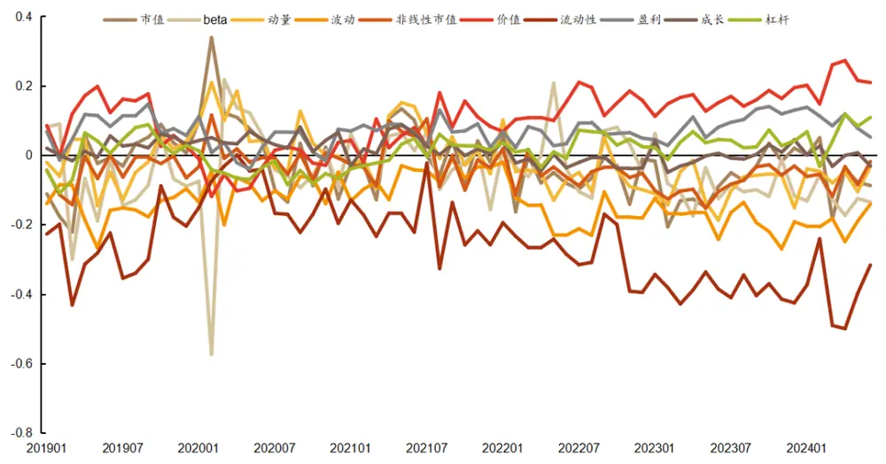
资料来源：Wind，RiceQuant，德邦研究所

GRU因子的风格暴露在时序上看整体比较稳定，没有明显的漂移。在市值风格上的相关性并不高，日度相关性均值仅为 。在流动性和波动率风格上有明显的负向偏好，在估值和盈利风格上有一定的正向偏好，因子更倾向于选择流动性差，波动率较低，估值较低，盈利水平较高的股票。

图 8：GRU因子与风格因子相关性均值
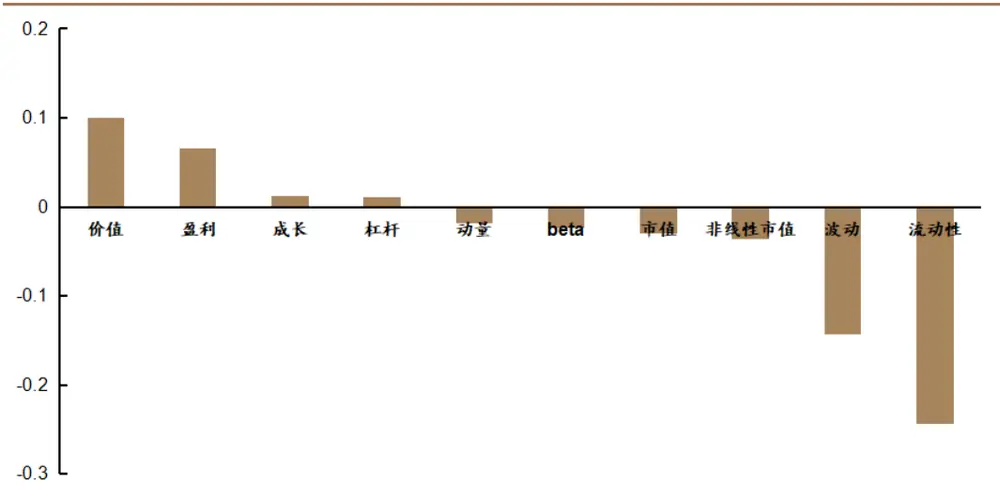
资料来源：Wind，RiceQuant，德邦研究所

## 3.3. GRU 因子的行业偏好

按照行业分组，每个行业计算所有股票的 GRU 因子得分取平均得到行业因子得分。整体上看，各个行业的GRU因子得分相对均衡，没有特别突出的行业。钢铁和银行的平均得分略高，通信和非银金融略低。

图 9：GRU因子行业平均得分
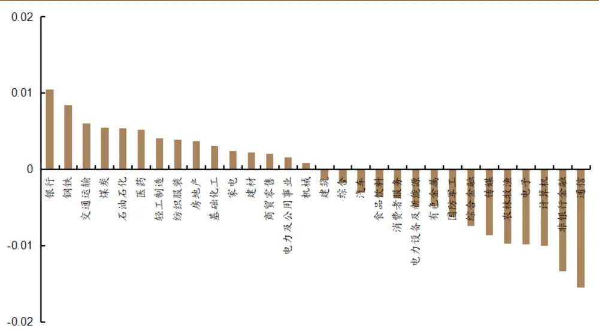
资料来源：Wind，RiceQuant，德邦研究所

从时间上看，在2022年及以前，因子的行业得分整体比较平均，2023年来开始出现分化，传媒、消费者服务、计算、通信的得分明显降低，钢铁和银行的得分在今年明显上升。

（行业平均得分数值较小，所以下表中统计的得分为原始得分*100）

表 1：GRU因子行业分年度平均得分

|  | 2019年 | 2020年 | 2021年 | 2022年 |  | 2023 年今年以来 |
| --- | --- | --- | --- | --- | --- | --- |
| 交通运输 | 0.67 | -0.58 | 0.88 | 0.81 | 0.68 | 1.05 |
| 传媒 | 0.02 | -0.44 | -0.06 | -0.02 | -3.26 | -3.06 |
| 农林牧渔 | -1.52 | -2.28 | -1.80 | -0.73 | -0.01 | 0.60 |
| 医药 | 1.46 | 0.81 | 0.33 | -0.66 | 0.16 | 0.64 |
| 商贸零售 | 1.32 | -0.11 | 0.12 | -0.14 | -0.86 | 0.59 |
| 国防军工 | -0.41 | 0.13 | -0.88 | -0.32 | -1.41 | -2.12 |
| 基础化工 | 0.23 | 0.33 | 0.36 | 0.17 | 0.33 | -0.08 |
| 家电 | 0.76 | 0.44 | 0.09 | 0.03 | 0.00 | -0.58 |
| 建材 | 0.27 | 0.08 | -0.03 | 0.06 | 0.51 | 0.50 |
| 建筑 | 0.32 | -0.50 | 0.10 | -0.47 | -0.50 | -0.04 |
| 房地产 | 0.80 | -0.43 | 0.61 | 0.35 | 0.00 | 0.69 |
| 有色金属 | -1.49 | -0.37 | 0.00 | -0.20 | -0.48 | -0.87 |
| 机械 | 0.35 | 0.30 | -0.03 | 0.06 | -0.22 | -0.65 |
| 汽车 | 0.42 | 0.05 | -0.25 | -0.37 | -1.43 | -0.97 |
| 消费者服务 | 1.98 | 0.52 | 0.96 | -1.54 | -3.11 | -3.41 |
| 煤炭 | 0.82 | -0.65 | 1.09 | 0.27 | 0.62 | 1.02 |
| 电力及公用事业 | 0.40 | -0.51 | -0.70 | 0.28 | 0.43 | 0.99 |
| 电力设备及新能源 | 0.09 | -0.26 | -0.94 | -0.60 | -0.82 | -1.05 |
| 电子 | -1.22 | -0.30 | -0.68 | -0.55 | -1.89 | -2.24 |
| 石油石化 | 0.22 | 0.05 | 1.10 | 0.75 | 0.47 | 0.39 |
| 纺织服装 | 0.66 | -0.72 | 0.19 | 0.76 | 0.54 | 0.82 |
| 综合 | 0.22 | -1.36 | -0.58 | -0.51 | 0.34 | 1.38 |
| 综合金融 | -2.12 | -1.34 | -0.38 | -0.26 | -0.10 | -2.39 |
| 计算机 | -0.76 | 0.44 | -0.77 | -0.68 | -3.00 | -2.19 |
| 轻工制造 | 0.21 | 0.51 | -0.10 | 0.52 | 0.48 | 0.83 |
| 通信 | -2.73 | -0.43 | -0.91 | -0.20 | -3.14 | -2.59 |
| 钢铁 | 0.22 | -0.99 | 1.77 | 1.21 | 1.08 | 2.13 |
| 银行 | 1.31 | -1.19 | 1.31 | 1.68 | 0.98 | 2.45 |
| 非银行金融 | -1.85 | -2.13 | -1.61 | -0.14 | -1.31 | -1.51 |
| 食品饮料 | 0.30 | 0.53 | -0.90 | -1.34 | -0.75 | -0.55 |

资料来源：Wind，RiceQuant，德邦研究所

## 3.4. GRU因子多头选股能力

考虑到原始 GRU 因子变化频率较高，所以在构建换仓频率较高的选股组合时应该设置一定的换手率限制。具体回测参数设置如下：

回测时间：2019 年 1 月 1 日至 2024 年 6 月 21 日

选股范围：全市场股票，剔除 st、*st、上市不满 1年、停牌无法交易的股票。

对比基准：中证 1000指数

选股数量：500只等权配置

换手率：日频（单边 5%），周频（单边 25%），月度不限制

交易价格：开盘价、全天 VWAP

手续费率：双边千 3

图 10：开盘价日频换仓组合净值
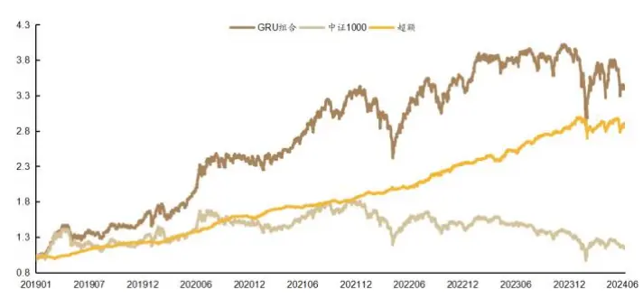

图 11：VWAP 日频换仓组合净值
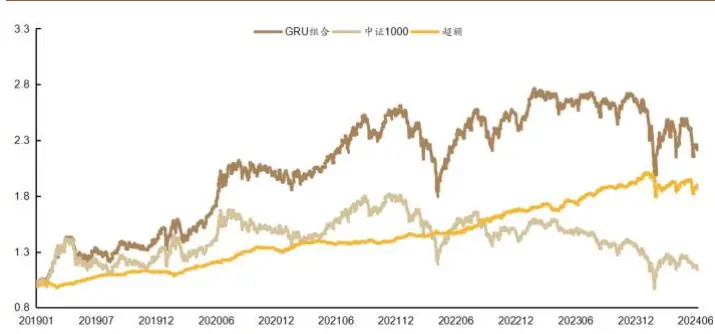
资料来源：Wind，RiceQuant，德邦研究所
资料来源：Wind，RiceQuant，德邦研究所

图 12：开盘价周频换仓组合净值
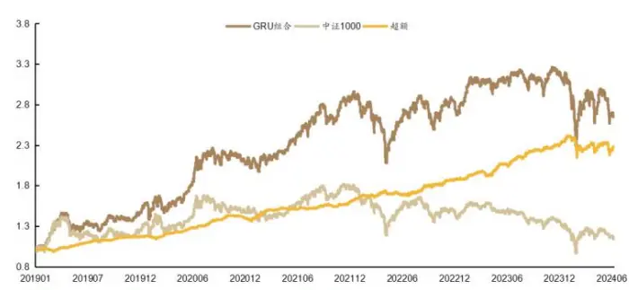
资料来源：Wind，RiceQuant，德邦研究所

图 13：VWAP周频换仓组合净值
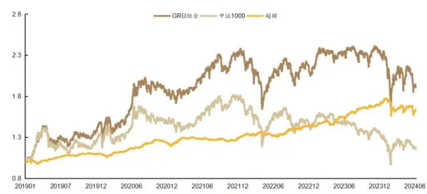
资料来源：Wind，RiceQuant，德邦研究所

图 14：开盘价月频换仓组合净值
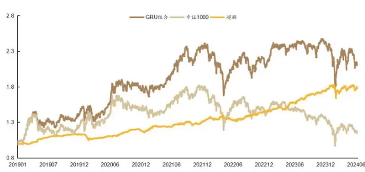
资料来源：Wind，RiceQuant，德邦研究所

图 15：VWAP月频换仓组合净值
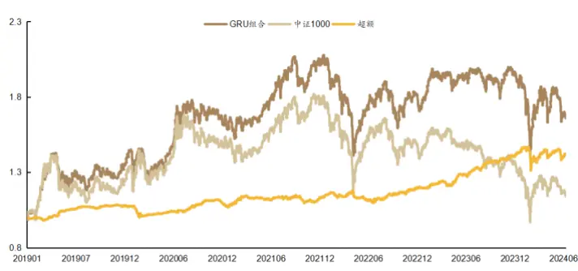
资料来源：Wind，RiceQuant，德邦研究所

表 2：组合表现

| 组合 | 基准 年化收益率 | 组合 年化收益率 | 超额组合 年化收益率 | 超额组合 最大回撤 | 信息比率 | Calmar 比率 | 超额组合 月胜率 |
| --- | --- | --- | --- | --- | --- | --- | --- |
| 开盘价日频换仓 | 2.54% | 26.07% | 22.45% | 10.07% | 3.17 | 2.23 | 86.36% |
| 开盘价周频换仓 | 2.54% | 20.32% | 16.95% | 11.08% | 2.40 | 1.53 | 81.82% |
| 开盘价月频换仓 | 2.54% | 15.11% | 11.79% | 10.32% | 1.76 | 1.14 | 77.27% |
| VWAP 日频换仓 | 2.54% | 16.27% | 12.91% | 10.84% | 1.91 | 1.19 | 78.79% |
| VWAP 周频换仓 | 2.54% | 13.00% | 9.81% | 12.06% | 1.44 | 0.81 | 75.76% |
| VWAP月频换仓 | 2.54% | 10.10% | 6.92% | 10.68% | 1.08 | 0.65 | 72.73% |

资料来源：Wind，RiceQuant，德邦研究所

不做行业和风格限制的多头组合，使用开盘价交易的情况下超额年化收益率为 22.45%（日频），16.95%（周频），11.79%（月频），使用全天 VWAP交易的情况下超额年化收益率为 12.91%（日频），9.81%（周频），6.92%（月频）。在交易速率层面策略产生年化约 4.87%-9.54%的滑点影响，换仓频率层面存在约 6%-10%左右的年化收益差异。可以看到对于 GRU因子的多头组合来说，由于在风格上有明显的低波动率以及低流动性偏好，其交易层面存在不少的收益，更高频率的换仓和更贴近开盘成交会有明显的优势。

表 3：策略分年度超额收益率

| 组合 | 2019年 | 2020年 | 2021年 | 2022 年 | 2023年 | 今年以来 |
| --- | --- | --- | --- | --- | --- | --- |
| 开盘价日频换仓 | 22.82% | 28.63% | 18.37% | 25.68% | 23.34% | 0.14% |
| 开盘价周频换仓 | 17.36% | 18.78% | 15.85% | 16.52% | 24.62% | -2.80% |
| 开盘价月频换仓 | 13.28% | 3.80% | 11.80% | 10.59% | 21.90% | 1.41% |
| VWAP 日频换仓 | 12.37% | 17.06% | 8.17% | 17.62% | 16.66% | -2.97% |
| VWAP 周频换仓 | 9.82% | 11.23% | 6.12% | 11.11% | 19.82% | -5.18% |
| VWAP 月频换仓 | 8.03% | 0.72% | 4.07% | 5.79% | 19.49% | -0.65% |

资料来源：Wind，RiceQuant，德邦研究所

从收益上看，日频换仓各年收益较为稳定，由于等权配置相对市值加权存在天然的小市值暴露，在今年 2 月份产生了较大的回撤，今年以来的整体收益表现不佳。在 2023年以前尤其是 2020年，更高的换仓频率能带来较高的收益。然而2023 年以来换仓频率的贡献明显减弱，甚至出现了副作用。不过开盘交易相对于全天 VWAP交易的优势多年来一直存在。

## 3.5. 组合特征

日频换仓多头组合的日均风格、行业、以及成分股特征如下：

图 16：组合行业暴露
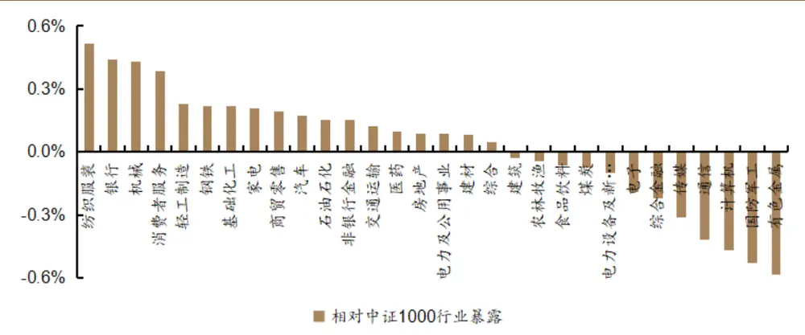
资料来源：Wind，RiceQuant，德邦研究所

多头组合相对中证 1000的行业暴露整体都在 0.6%以内，行业偏好整体不显著，在纺织服装、银行、机械以及消费者服务行业上有超过0.3%的正向暴露，在有色金属、国防军工、计算机以及通信上有超过0.3%的负向暴露。

风格上看，多头组合相对于中证 1000的风格暴露整体上较为均衡，但是在流动性以及非线性市值有比较大的负向暴露。

图 17：组合风格暴露
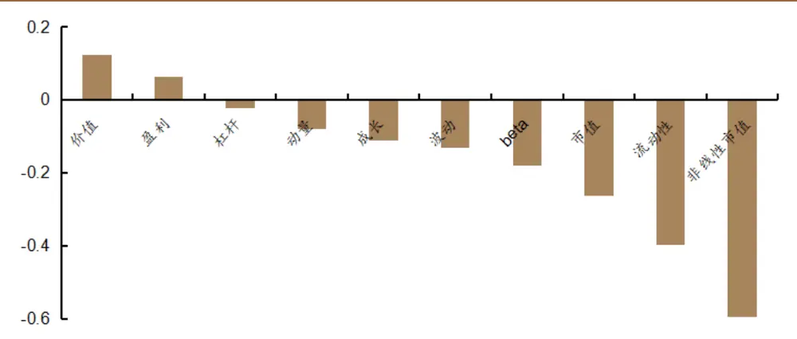
资料来源：Wind，RiceQuant，德邦研究所

成分股上看，在 2022年以前 GRU多头组合对于各大宽基指数成分股的配比比较均衡，近两年在中证2000 以及中证 2000以外的股票上配置有所增加，不同指数成分股的占比波动也明显加剧。

图 18：组合成分股分布
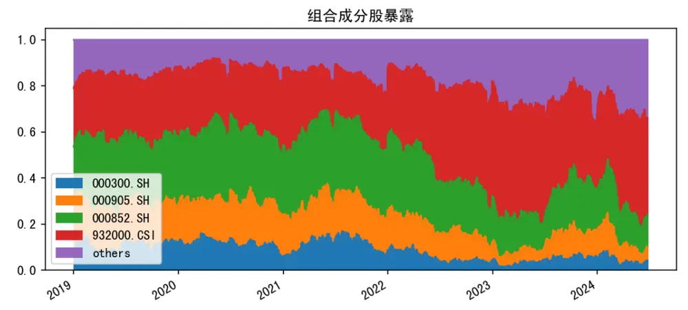
资料来源：Wind，RiceQuant，德邦研究所

## 4. GRU指数增强效果

单纯的多头组合受风格的影响较大，其超额收益中带有较多的风格收益。为了测试 GRU 因子在不同基准下的选股能力，挑选沪深 300 指数、中证 500 指数以及中证 1000指数构建完全中性的指数增强组合。

增强组合回测参数设置如下：

个股权重偏离上限：0.2%

选股范围：全市场股票，剔除 st、*st、上市不满 1年、停牌无法交易的股票。

对比基准：对应指数

交易方式：周度调仓（双边换15%），换仓日使用全天 VWAP换仓

手续费率：双边千 3

成分股比例：80%

行业限制：所有行业与基准偏离的绝对值之和在 1%以内

风格限制：相对于基准偏离的绝对值在 0.01个标准差以内

## 4.1. 沪深 300 指数增强

沪深 300增强组合整体表现较强。超额组合年化收益率为7.26%，仅在 2019年超额组合没有明显优势，2020 年后展现出了较为稳定的超额收益，2023 年甚至达到了 13.85%。

从风险角度看，超额组合的最大回撤为 4.33%。分年度来看，每年的最大回撤均在 3%以内，而且今年 2 月份的风险事件对组合几乎没有影响，今年以来超额组合的最大回撤仅为 2.38%，calmar 比率整体比较优秀，在 2023 年甚至超过了 9。

沪深 300指数增强组合的跟踪误差也比较稳定，基本上不超过4%。

图 19：GRU沪深 300增强组合净值
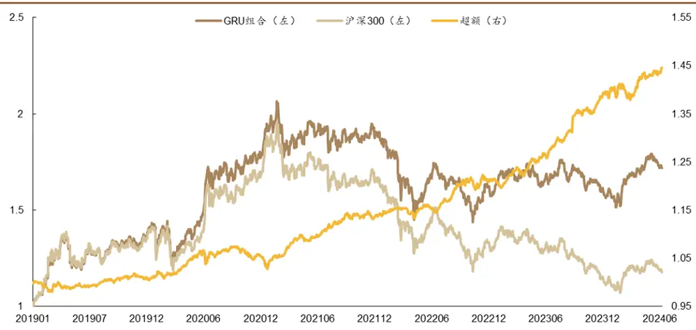
资料来源：Wind，RiceQuant，德邦研究所

表 4：GRU沪深 300增强组合分年度表现

| 年化指标 | 2019 | 2020 | 2021 | 2022 | 2023 | 今年以来 | 全部 |
| --- | --- | --- | --- | --- | --- | --- | --- |
| 基准组合收益率 | 37.95% | 27.21% | -5.20% | -21.63% | -11.38% | 1.88% | 3.15% |
| 增强组合收益率 | 39.16% | 32.56% | 3.42% | -16.48% | 1.15% | 6.63% | 10.84% |
| 超额组合收益率 | 0.67% | 4.10% | 8.91% | 6.44% | 13.85% | 4.52% | 7.26% |
| 超额组合最大回撤 | 2.30% | 2.65% | 1.74% | 2.11% | 1.57% | 2.38% | 4.33% |
| 信息比率 | 0.25 | 1.13 | 2.60 | 1.80 | 3.24 | 1.39 | 1.93 |
| Calmar 比率 | 0.30 | 1.61 | 5.33 | 3.18 | 9.21 | 4.40 | 1.68 |
| 跟踪误差 | 2.81% | 3.62% | 3.30% | 3.50% | 4.03% | 3.22% | 3.67% |

资料来源：Wind，RiceQuant，德邦研究所

## 4.2. 中证 500 指数增强

图 20：GRU中证 500增强组合净值
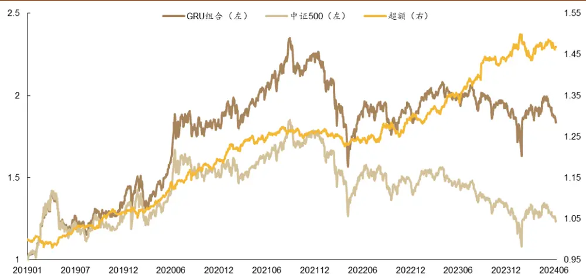
资料来源：Wind，RiceQuant，德邦研究所

中证500增强组合整体表现也比较类似，超额组合整体年化收益率为7.58%。从每年的超额收益率上看，中证 500增强组合的超额收益分布更加均衡。

从风险上看，超额最大回撤水平与沪深 300增强组合相似，不过中证 500增强组合受 2月份风险事件影响较大，出现了 4.19%的最大回撤，为历史最大值。

跟踪误差略高于沪深 300 增强组合，但是整体跟踪误差也控制在 5%以内。

表 5：GRU中证 500增强组合分年度表现

| 年化指标 | 2019 | 2020 | 2021 | 2022 | 2023 | 今年以来 | 全部 |
| --- | --- | --- | --- | --- | --- | --- | --- |
| 基准组合收益率 | 27.49% | 20.87% | 15.58% | -20.31% | -7.42% | -6.02% | 4.09% |
| 增强组合收益率 | 36.39% | 35.41% | 22.75% | -17.89% | 3.00% | -4.15% | 12.26% |
| 超额组合收益率 | 6.61% | 11.83% | 6.24% | 2.88% | 10.95% | 1.59% | 7.58% |
| 超额组合最大回撤 | 2.86% | 2.43% | 2.11% | 3.30% | 1.76% | 4.19% | 4.19% |
| 信息比率 | 2.02 | 2.82 | 1.79 | 0.68 | 2.25 | 0.42 | 1.75 |
| Calmar 比率 | 2.39 | 5.07 | 3.07 | 0.91 | 6.49 | 0.86 | 1.81 |
| 跟踪误差 | 3.19% | 4.00% | 3.41% | 4.33% | 4.66% | 3.93% | 4.22% |

资料来源：Wind，RiceQuant，德邦研究所

## 4.3. 中证 1000 指数增强

图 21：GRU中证 1000增强组合净值
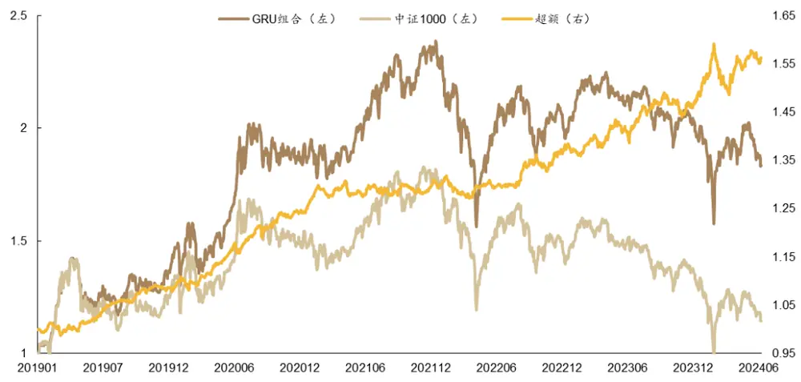
资料来源：Wind，RiceQuant，德邦研究所

中证 1000 指数增强组合整体表现与中证 500 指数增强组合相似，超额组合年化收益率上略有提升，但其在今年以来发生的回撤也更大，整体上信息比率高于中证 500组合，但是 calmar比率表现较差。

表 6：GRU中证 1000增强组合分年度表现

| 年化指标 | 2019 | 2020 | 2021 | 2022 | 2023 | 今年以来 | 全部 |
| --- | --- | --- | --- | --- | --- | --- | --- |
| 基准组合收益率 | 26.28% | 19.39% | 20.52% | -21.58% | -6.28% | -14.13% | 2.64% |
| 增强组合收益率 | 37.86% | 36.83% | 26.57% | -16.50% | 0.81% | -8.77% | 12.21% |
| 超额组合收益率 | 8.78% | 14.39% | 4.86% | 6.13% | 7.04% | 5.43% | 8.86% |
| 超额组合最大回撤 | 2.48% | 2.43% | 2.43% | 3.50% | 3.34% | 6.58% | 6.58% |
| 信息比率 | 2.63 | 3.11 | 1.28 | 1.32 | 1.37 | 1.06 | 1.83 |
| Calmar 比率 | 3.66 | 6.16 | 2.07 | 1.82 | 2.20 | 1.92 | 1.35 |
| 跟踪误差 | 3.22% | 4.36% | 3.75% | 4.59% | 5.05% | 5.10% | 4.69% |

资料来源：Wind，RiceQuant，德邦研究所

## 5. 总结

传统的RNN在处理长序列时存在“长期依赖”问题，即梯度消失或梯度爆炸，导致训练困难。LSTM 模型通过其门控单元解决了 RNN 的梯度问题，GRU 简化了 LSTM，在训练时更加高效，并且在许多任务上都取得了与 LSTM 相当或更好的性能。

GRU 对时间序列信息的挖掘能力很强，被广泛运用于多个领域。GRU 作为一种循环神经网络架构，特别适用于处理序列数据中的长期依赖关系。目前主要的应用场景涉及自然语言处理（NLP）、语音识别、时间序列预测、推荐系统和音乐生产等方面。

GRU模型应用于 A股市场时，其信息挖掘能力十分强大，不需要依赖传统人力做因子挖掘。GRU能够通过其独特的门控机制有效捕获股票数据中的长期依赖关系。在股票价格预测中，能够综合考虑过去的价格走势、交易量等因素对未来价格的影响。

GRU因子在风格上偏好选择流动性较差，波动率较小，估值较低，盈利水平较高的股票。其流动性偏好和低波动率偏好极为明显，所以在组合构建时，交易层面对未来收益会有较大影响，开盘收益相对于全天 VWAP交易有 4.87%-9.54%的优势。在交易频率上，使用全天VWAP交易的情况下日频相对于周频提升3.1%，相对于月频提升约 6%。

GRU因子在构建指数增强组合时，过低的换手频率会导致收益方面有一定损失，但整体表现仍然不错。面对基准选股池整体市值偏小时，收益会有所增强，但是受今年 2月份风险事件的影响也较大。具体来看，沪深 300增强组合年化收益率增强 7.26%，整体信息比率为 1.93，Calmar 比率为 1.68；中证 500 增强组合年化收益率增强 7.58%，整体信息比率为 1.75，Calmar 比率为 1.81；中证 1000增强组合年化收益率增强 8.86%，整体信息比率为 1.83，Calmar比率为1.35。

本次构建的 GRU 因子所用信息较少，仅有一日的分钟 Bar 数据，对练目标几乎没有进行任何特质化的处理。所以在结果上看，GRU因子的多空能力还有提升空间，其低波动率低流动性的风格偏好在交易层面存在较大影响，如何改善其低波动率低流动性风格偏好也是值得研究的方向。

后续改进思路：可以丰富输入信息维度，让GRU学习到更多能反应未来收益的特征；对预测目标进行一定处理，改善GRU因子整体的风格偏好；对损失函数做改变，在损失函数中引入风格因子特征，在训练过程中控制模型的风格偏好。

风险提示：人工智能模型挖掘市场规律是对历史数据的总结，市场规律在未来可能发生变化。深度学习模型可能存在过拟合风险。深度学习模型存在随机数影响，训练结果可能无法完全复刻。本文测试均在理想状态下使用开盘价或者VWAP价格进行成交计算，实际交易中可能存在其他影响因素导致成交价格出现偏差。

## 6. 参考文献

[1]S. Hochreiter and J. Schmidhuber. Long Short- Term Memory. Neural Computation. 1997, 9(8):1735~1780

[2]Kyunghyun Cho, Bart van Merrienboer, Caglar Gulcehre Dzmitry Bahdanau, Fethi Bougares, Holger Schwenk, and Yoshua Bengio. 2014. Learning phrase representations using rnn encoder-decoder for statistical machine. In Proceedings of the 2014 Conference on EMNLP, 1724-1734.

## 信息披露

## 分析师与研究助理简介

肖承志，同济大学应用数学本科、硕士，现任德邦证券研究所首席金融工程分析师。具有 年证券研究经历，曾就职于东北证券研究所担任首席金融工程分析师。致力于市场择时、资产配置、量化与基本面选股。撰写独家深度“扩散指标择时”系列报告；擅长各类择时与机器学习模型，对隐马尔可夫模型有深入研究；在因子选股领域撰写多篇因子改进报告，市场独家见解。

## 分析师声明

本人具有中国证券业协会授予的证券投资咨询执业资格，以勤勉的职业态度，独立、客观地出具本报告。本报告所采用的数据和信息均来自市场公开信息，本人不保证该等信息的准确性或完整性。分析逻辑基于作者的职业理解，清晰准确地反映了作者的研究观点，结论不受任何第三方的授意或影响，特此声明。

## 投资评级说明

| 1. 投资评级的比较和评级标准：以报告发布后的6个月内的市场表现为比较标准，报告发布日后6个月内的公司股价（或行业指数）的涨跌幅相对同期市场基准指数的涨跌幅；2. 市场基准指数的比较标准：A股市场以上证综指或深证成指为基准；香港市场以恒生指数为基准；美国市场以标普500或纳斯达克综合指数为基准。 | 类别 | 评级 | 说明 |
| --- | --- | --- | --- |
|  | 股票投资评级 | 买入 | 相对强于市场表现20%以上； |
|  |  | 增持 | 相对强于市场表现 5%~20%； |
|  |  | 中性 | 相对市场表现在-5%~+5%之间波动； |
|  |  | 减持 | 相对弱于市场表现5%以下。 |
|  | 行业投资评级 | 优于大市 | 预期行业整体回报高于基准指数整体水平10%以上； |
|  |  | 中性 | 预期行业整体回报介于基准指数整体水平-10%与10%之间； |
|  |  | 弱于大市 | 预期行业整体回报低于基准指数整体水平10%以下。 |

## 法律声明

。本公司不会因接收人收到本报告而视其为客户。在任何情况

下，本报告中的信息或所表述的意见并不构成对任何人的投资建议。在任何情况下，本公司不对任何人因使用本报告中的任何内容所引致的任何损失负任何责任。

本报告所载的资料、意见及推测仅反映本公司于发布本报告当日的判断，本报告所指的证券或投资标的的价格、价值及投资收入可能会波动。在不同时期，本公司可发出与本报告所载资料、意见及推测不一致的报告。

市场有风险，投资需谨慎。本报告所载的信息、材料及结论只提供特定客户作参考，不构成投资建议，也没有考虑到个别客户特殊的投资目标、财务状况或需要。客户应考虑本报告中的任何意见或建议是否符合其特定状况。在法律许可的情况下，德邦证券及其所属关联机构可能会持有报告中提到的公司所发行的证券并进行交易，还可能为这些公司提供投资银行服务或其他服务。

本报告仅向特定客户传送，未经德邦证券研究所书面授权，本研究报告的任何部分均不得以任何方式制作任何形式的拷贝、复印件或复制品，或再次分发给任何其他人，或以任何侵犯本公司版权的其他方式使用。所有本报告中使用的商标、服务标记及标记均为本公司的商标、服务标记及标记。如欲引用或转载本文内容，务必联络德邦证券研究所并获得许可，并需注明出处为德邦证券研究所，且不得对本文进行有悖原意的引用和删改。

根据中国证监会核发的经营证券业务许可，德邦证券股份有限公司的经营范围包括证券投资咨询业务。