金融工程专题

证券分析师

肖承志

资格编号：S0120521080003

邮箱：xiaocz＠tebon.com.cn

# 再探预测目标、预测周期、交易换手和风格控制在 GRU选股策略中的影响

德邦金工机器学习专题之七

## 研究助理

## 相关研究

1. 《基于分钟数据的 GRU 模型在选股策略中的应用初探——德邦金 工 机 器 学 习 专 题 之 六 》2024.07.01

2.《基于模型池的机器学习选股——德邦金工机器学习专题之五》2022.05.24

3. 《动态因子筛选——德邦金工机器学习专题之四》2022.03.09

4. 《基于财务与风格因子的机器学习选股——德邦金工机器学习专题之三》2022.01.25

5.《机器学习残差因子表现归因——德邦金工机器学习专题之二》2021.11.24

6. 《利用机器学习捕捉因子的非线性效应——德邦金工机器学习专题之一》2021.10.18

## [Table_Summ投资要点：

- 选择预测目标的价格时，在模型使用 vwap 计算的未来收益作为预测目标时，其IC 表现相比预测 open 未来收益的模型有较大提升，但是模型引入了更多风格特征，组合净值的综合表现不如预测 open 未来收益的模型与预测 close 未来收益的模型。具体来看，vwap1d 模型对于未来 5日 vwap 收益率的平均 IC为 0.082，open1d 模型 IC 为 0.062。相对中证 1000 指数， vwap1d 模型超额年化收益率为17.52%，最大回撤为 18.01%，open1d 模型超额年化收益率为 15.60%，最大回撤为 10.21%；close1d 模型超额年化收益率为 14.79%，最大回撤为 10.99%。

预测更长周期未来收益率的 GRU 模型，表现上类似于预测 vwap 未来收益的模型。在 IC 表现上，预测多日未来收益的 GRU 模型相比仅预测 1 日未来收益的模型有所提升，但是组合上看暴露更多的风格特征。在组合表现上预测多日未来收益的 GRU 模型各方面都弱于预测 1日未来收益的模型。

预测目标的风格特征能显著影响 模型的风格特征，预测剥离更多风格特征未来收益的 GRU模型能获得更纯的 alpha收益。剥离预测目标的风格特征后，模型在 IC 和收益方面有所减弱，在组合回撤和波动率的表现上显著增强。2021 年后，原先的 模型引入更多的风格特征，其小市值偏好显著增加，模型在 年后相对基准的市值风格暴露为-0.46。剥离预测目标中的风格特征之后，组合的小市值偏好得到明显的改善，剥离 size 风格的模型在 2021 年后相对基准的市值风格暴露缩小至-0.17，剥离所有 barra 风格特征的模型市值风格暴露为-0.23。

在换手率设置方面，相比以 open 价格交易，以 vwap 价格进行交易需要设置更低的换手率能取得更优的组合表现，日频交易相对于周频交易的换手设置更为敏感。对于日频交易的情况下，使用 价格进行交易时，单边换手率设置为时组合表现最优；使用 价格进行交易时，单边换手率设置为 时组合表现最优。周频交易的情况下，使用 价格交易的最优单边换手约为 % %，使用 vwap交易时单边换手率设置为 6%-20%较优。

预测更长周期未来收益率的 GRU模型，需要注意剥离风格信息的影响。更长周期的预测目标中带有的风格信息相比短期预测目标明显增加，这会导致长周期的预测模型很容易学到过多的风格特征。剥离掉预测目标中的风格特征后，增加预测周期能一定程度上提升模型的表现。

风险提示：人工智能模型挖掘市场规律是对历史数据的总结，市场规律在未来可能发生变化。深度学习模型可能存在过拟合风险。深度学习模型存在随机数影响，训练结果可能无法完全复刻。本文测试均在理想状态下使用开盘价或者 VWAP价格进行成交计算，实际交易中可能存在其他影响因素导致成交价格出现偏差。

## 1. 问题提出

在上一篇报告里，我们简要介绍了将日内分钟频的量价数据应用于 A 股市场进行选股。但是由于篇幅及行文连贯性原因仍然有一些问题没有深入探讨，本文将逐一对这些问题进行研究。

问题一(预测目标)：在传统的收益率预测里，更常见的做法是预测close tocloseT1对应的收益率1。而在上一篇报告里，我们的做法却是预测 openT1to openT2对应的收益率2，甚至对于实际的交易来说，预测 vwap to vwap 对应的收益率更合理。

问题二(预测周期)：上文所述是预测 1天也即 T0到 T1 或者T1到 T2，但是对于许多机构客户来说，无法做到日频调仓，对于他们更需要的可能是周频甚至双周频的调仓策略，对应于 T0 到T5或者是T1到T6，甚至是T0到T10或者T1到 T11。

问题三(风格控制)：在相同的预测周期和预测目标下，尤其是当预测周期在周度及以上时，预测的收益率通常带有比较明显的风格收益率特征。为此，传统的做法是通过因子组合优化时约束相对基准的风格暴露和行业的偏离度来进行风险控制。这种做法并不改变因子本身，且不同管理人对于风险偏好的不同也会导致结果差异。因此，我们尝试通过改变预测目标来控制这一问题。具体的做法为，将预测目标对行业和风格进行回归取残差，由于残差本身剔除了相关的风格，所以在 GRU 模型的学习过程中不会学习到线性部分的风格。这也体现出非线性模型相对线性模型的优势。具体做法可以参考《利用机器学习捕捉因子的非线性效应——德邦金工机器学习专题之一》。

问题四(交易换手)：对于不同的预测周期和预测目标下，会产生不同的预测效果。例如，上一篇报告里，当预测目标是open to open 时，用开盘价交易相对于 vwap 价格交易在控制日换手单边 5%的水平下，会产生近 10%左右的滑点。但是对于开盘交易和vwap交易而言，控制相同的换手率水平并没有绝对的道理。因为开盘价较 vwap价格具有更强的预测能力，而对于 vwap价格而言，很难在交易价格上具备优势，因此更多的换手反而不能带来更好的预测收益。同理，T1到T6，这个问题也同样存在，只不过由于日期跨度更大，导致日内 open相对vwap的优势在周度层面的优势没有那么大，但并非毫无关系。因此，仍然需要系统性研究不同预测周期和预测目标下所合适的换手率水平。

因此，本文着重从以上四个问题出发，力求尽可能详细和客观地分析不同变量影响，以控制变量的思想，将不同处理结果与基础模型3进行对比，从而得到相关结论。

## 2. 预测目标对于 GRU模型的影响

本文中用到的简称含义：

IC：均表示 RankIC。

Close1d：以 close 价格计算的未来一日收益率（close to close ）。

OpenXd：以 open 价格计算的未来 X 日收益率（openT1 to openTX+1）。

Vwap1d：以 vwap 价格计算的未来一日收益率（vwapT1 to vwapT2）。

Size1d：Open1d 与 log 市值线性回归后的残差项。

BarraXd：OpenXd 与 barra 风格因子线性回归后的残差项。

PriceXd 模型：以 PriceXd 为预测目标的 GRU 模型。

数据统计区间：2019 年 1 月 1 日-2024 年 6 月 28 日。

回测参数如下（若无其他说明，本文回测均为此参数）：

选股范围：全市场股票，剔除 st、*st、上市不满1年、停牌无法交易的股票

对比基准：中证 1000指数

选股数量：500只等权配置

换仓频率：周频换仓，每期换 35只股票

交易价格：全天 VWAP

手续费率：双边千 3

多头组合不做行业以及风格约束

## 2.1. 因子表现

图 1：因子累积 IC图（各模型因子与未来 5日 vwap收益率的 IC）
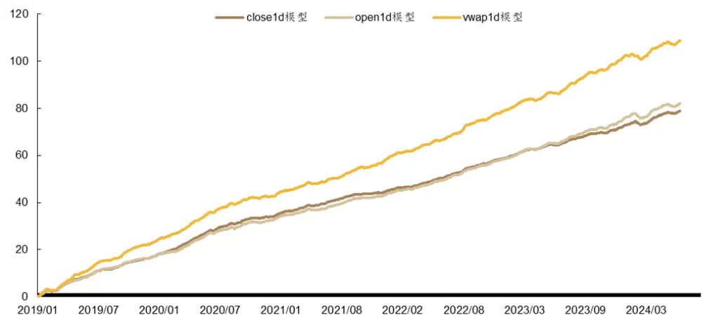
资料来源：Wind，RiceQuant，德邦研究所

对于未来 5 日的 vwap 收益率，vwap1d 模型在 IC 上明显优于 close1d 模型和 open1d 模型。

模型设置不同的预测目标，最终因子的IC表现也会有所不同。当模型预测目标与未来收益统计方式一致时，模型IC表现较好。vwap1d模型对长周期的预测目标（open5d 和 vwap5d）更有优势。

表 ：不同预测目标的模型对不同未来收益的

|  | close1d | open1d | open5d | vwap1d | vwap5d |
| --- | --- | --- | --- | --- | --- |
| Close1d 模型 | 0.131 | 0.074 | 0.074 | 0.045 | 0.059 |
| Open1d 模型 | 0.114 | 0.074 | 0.077 | 0.045 | 0.062 |
| Vwap1d 模型 | 0.095 | 0.066 | 0.086 | 0.060 | 0.082 |

资料来源：Wind，RiceQuant，德邦研究所

从分组收益上看，vwap1d 模型的多头组合（第10组）和空头组合（第 1组）表现都更为强势。close1d模型的多空能力表现较差，分组也并不线性，其第 8组的收益表现明显优于第 10组。

图 2：因子分组收益（未来 5日 vwap收益率）
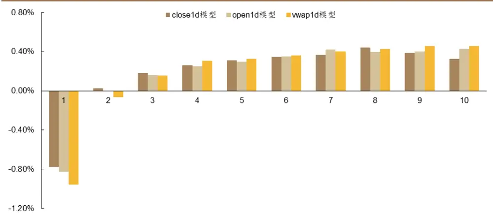
资料来源：Wind，RiceQuant，德邦研究所

## 2.2. 组合收益表现

图 3：各模型超额组合净值
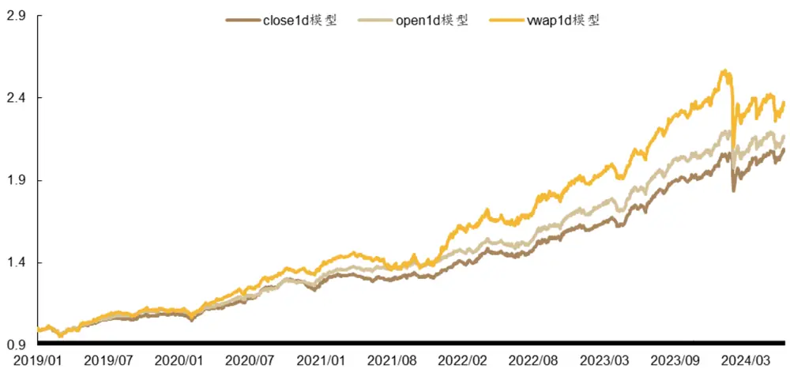
资料来源：Wind，RiceQuant，德邦研究所

从收益上看，vwap1d 模型表现最佳，但是综合考虑风险类指标的情况下，vwap1d 模型的表现最弱，最大回撤远大于 open1d 模型和 close1d 模型。open1d模型的综合表现更为强势，从信息比率、最大回撤和calmar比率上看 open1d模型的表现在 3个模型中最强。

表 2：各模型组合表现

| 组合 | 月度胜率 | 超额年化收益率 | 信息比率 | 超额最大回撤 | Calmar 比率 | 超额年化波动率 |
| --- | --- | --- | --- | --- | --- | --- |
| Close1d 模型 | 78.46% | 14.79% | 2.23 | 10.99% | 1.35 | 6.65% |
| Open1d 模型 | 76.92% | 15.60% | 2.34 | 10.21% | 1.53 | 6.67% |
| Vwap1d 模型 | 73.85% | 17.52% | 1.80 | 18.01% | 0.97 | 9.74% |

资料来源：Wind，RiceQuant，德邦研究所

## 2.3. 组合风格特征

风格暴露上看，各个 GRU 模型 2021 年以前的市值暴露并不明显，然而在2021 年以后逐渐出现小市值的偏好。vwap1d 模型的多头组合小市值偏好相比之下最为明显。在今年 2 月份微盘股出现大幅回撤时，vwap1d 模型较为极端的小市值暴露正是其最大回撤远远大于 open1d模型和close1d模型的原因之一。

图 4：组合相对基准的 size暴露走势图
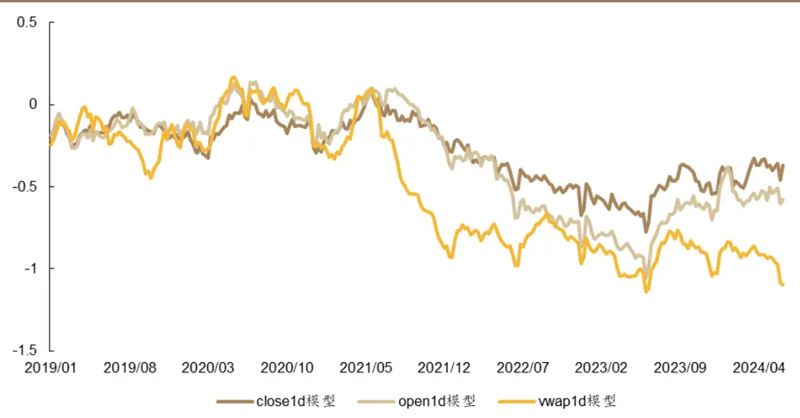
资料来源：Wind，RiceQuant，德邦研究所

Vwap1d 模型的超额组合在大部分风险因子上的暴露程度明显高于另外两个组合。因此，vwap1d模型的超额组合收益率会带有更多的风格特征，导致其超额收益呈现出更高的波动率，信息比率以及calmar比率的表现弱于open1d模型和close1d 模型。

图 5：组合相对基准的风格暴露
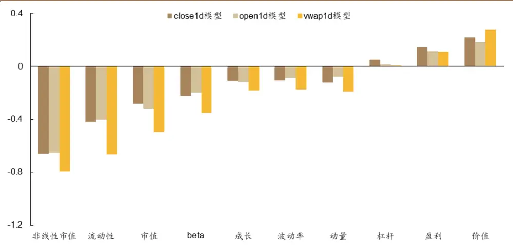
资料来源：Wind，RiceQuant，德邦研究所

虽然预测 vwap收益率在理论上看更加合理，但是在实际模型训练中 vwap1d模型相比 open1d模型引入了更多风格信息。从结果上看，vwap1d模型在预测长周期收益率的IC表现和组合收益率方面都得到了提升，但是其回撤表现和信息比率都明显变弱。所以 vwap1d 模型相比 open1d 模型的收益提升基本来自于风格暴露，并没有带来更为纯粹的 alpha提升。

## 3. 预测周期对于 GRU模型的影响

## 3.1. 因子表现

从 IC 图中可以看到，不同预测周期的模型 IC 表现整体比较稳定，而且随着GRU模型预测周期的增加，模型对未来 5日vwap收益率的IC也不断变高。

图 6：因子累积 IC图（各模型因子与未来 5日 vwap收益率的 IC）
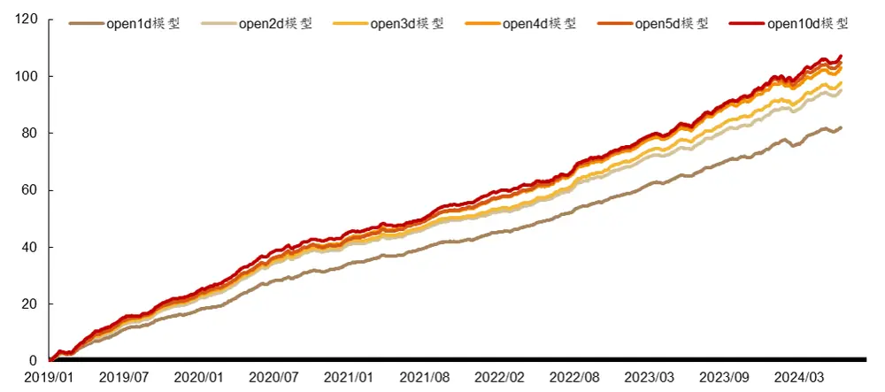
资料来源：Wind，RiceQuant，德邦研究所

如表 3所示，open1d模型更擅长预测短期的未来收益率，随着预测周期的增加，模型对于长期未来收益的预测能力也逐渐提升。

表 3：不同预测目标的模型对不同未来收益的 IC

|  | close1d | open1d | open5d | vwap1d | vwap5d |
| --- | --- | --- | --- | --- | --- |
| open1d 模型 | 0.114 | 0.074 | 0.077 | 0.045 | 0.062 |
| open2d 模型 | 0.111 | 0.072 | 0.083 | 0.051 | 0.071 |
| open3d 模型 | 0.107 | 0.071 | 0.084 | 0.053 | 0.074 |
| open4d 模型 | 0.104 | 0.071 | 0.087 | 0.056 | 0.077 |
| open5d 模型 | 0.099 | 0.068 | 0.086 | 0.056 | 0.079 |
| open10d 模型 | 0.092 | 0.065 | 0.086 | 0.056 | 0.080 |

资料来源：Wind，RiceQuant，德邦研究所

从分组收益看，不同预测周期模型的多头组收益率较为接近，open1d模型在空头组的收益率较弱。

图 7：因子分组收益（未来 5日 vwap收益率）
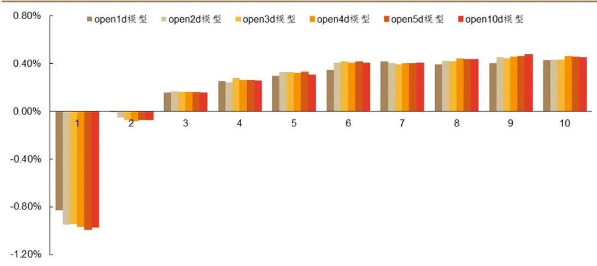
资料来源：Wind，RiceQuant，德邦研究所

## 3.2. 组合收益表现

图 8：各模型超额组合净值
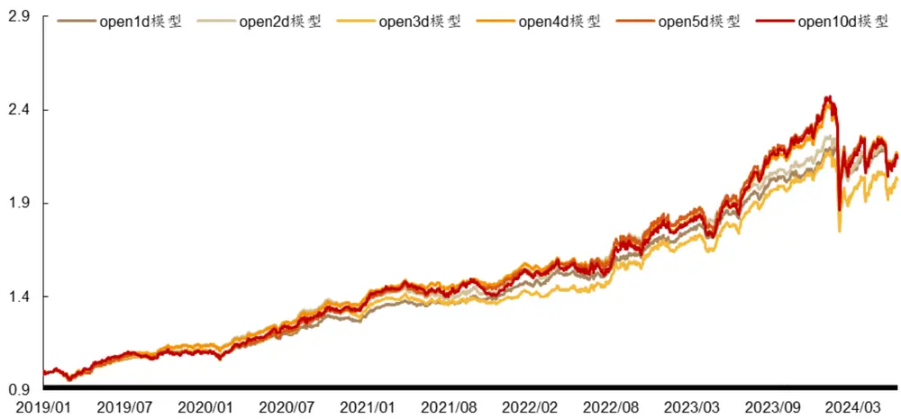
资料来源：Wind，RiceQuant，德邦研究所

从净值表现上看，open1d 模型在各个指标上均明显优于预测周期更长的模型。随着预测周期的增加，组合的超额最大回撤逐渐增大，信息比率和 calmar比率均变差。

表 4：各模型组合表现

| 组合 | 月度胜率 | 超额年化收益率 | 信息比率 | 超额最大回撤 | Calmar 比率 | 超额年化波动率 |
| --- | --- | --- | --- | --- | --- | --- |
| open1d 模型 | 76.92% | 15.60% | 2.34 | 10.21% | 1.53 | 6.67% |
| open2d 模型 | 76.92% | 15.43% | 1.87 | 16.13% | 0.96 | 8.23% |
| open3d 模型 | 69.23% | 14.21% | 1.56 | 19.67% | 0.72 | 9.11% |
| open4d 模型 | 72.31% | 15.56% | 1.57 | 21.93% | 0.71 | 9.92% |
| open5d 模型 | 72.31% | 15.43% | 1.52 | 22.64% | 0.68 | 10.14% |
| open10d 模型 | 70.77% | 15.42% | 1.40 | 24.67% | 0.63 | 11.04% |

资料来源：Wind，RiceQuant，德邦研究所

## 3.3. 组合风格特征

图 9：组合相对基准的 size暴露走势图
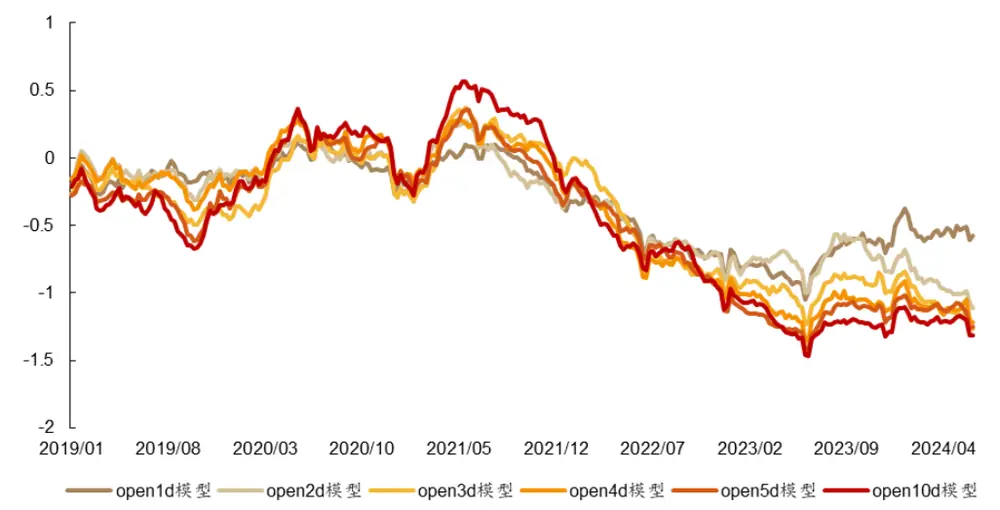
资料来源：Wind，RiceQuant，德邦研究所

不同预测周期的 size 暴露趋势整体上较为接近。预测周期较长的 open5d 模型和 open10d模型在 2023年以后的小市值暴露明显高于 open1d模型。

图 10：组合相对基准的风格暴露
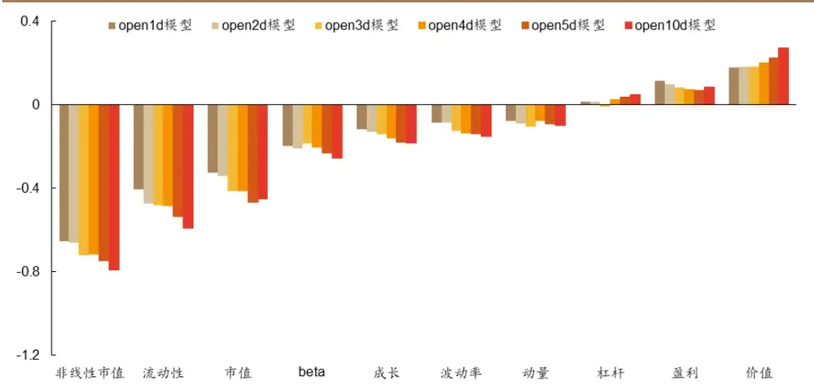
资料来源：Wind，RiceQuant，德邦研究所

风格暴露上看，预测周期为一日未来 opento open收益率的组合各个风格暴露更为均衡，随着预测周期的增加，组合的风格暴露整体上不断增加。

预测更长周期未来收益的模型，在 IC表现上明显有所提升，但其在净值表现的各方面都有所变弱，尤其在风险控制方面。增加模型的预测周期对 IC 的提升，很大程度上来源于对风格因子的暴露，对于模型的 alpha 并没有太大帮助。

## 4. 风格控制对于 GRU模型的影响

## 4.1. 因子表现

从 IC走势上看，预测目标进行风格剥离后，模型对于未来 5日vwap收益率的 IC 明显下降，剥离全部风格的 barra1d 模型相比仅剥离市值风格的 size1d 模型在 IC表现下降的更多。

图 11：因子累积 IC图（各模型因子与未来 5日 vwap收益率的 IC）
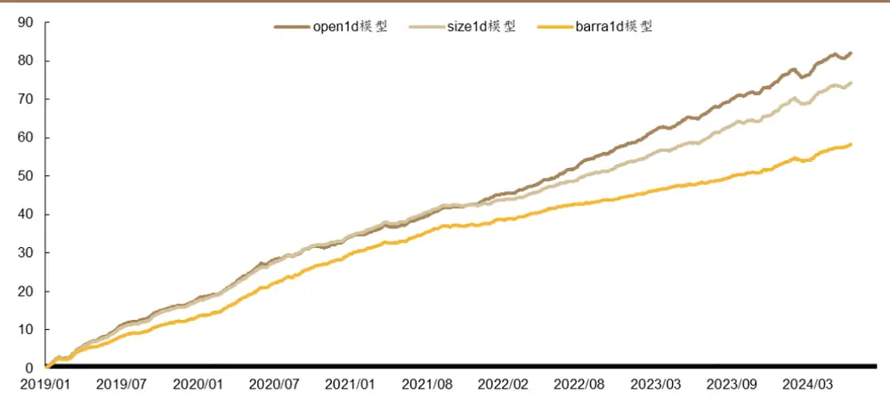
资料来源：Wind，RiceQuant，德邦研究所

剥离预测目标风格后的size1d 模型，对各项未来收益从 IC上看相对open1d模型都有所减弱，剥离的风格越多的barra1d模型，减弱的程度也越多。

表 ：不同预测目标的模型对不同未来收益的

|  | close1d | open1d | open5d | vwap1d | vwap5d |
| --- | --- | --- | --- | --- | --- |
| open1d 模型 | 0.114 | 0.074 | 0.077 | 0.045 | 0.062 |
| size1d 模型 | 0.112 | 0.073 | 0.072 | 0.041 | 0.056 |
| barra1d 模型 | 0.106 | 0.067 | 0.061 | 0.032 | 0.044 |

资料来源：Wind，RiceQuant，德邦研究所

从分组收益上看，open1d 模型在多头组和空头组的表现均强于风格剥离后的模型。size1d模型和barra1d 模型的多头组表现接近，但是 size1d模型在空头组上的表现优于 barra1d模型。

图 12：因子分组收益（未来 5日 vwap收益率）
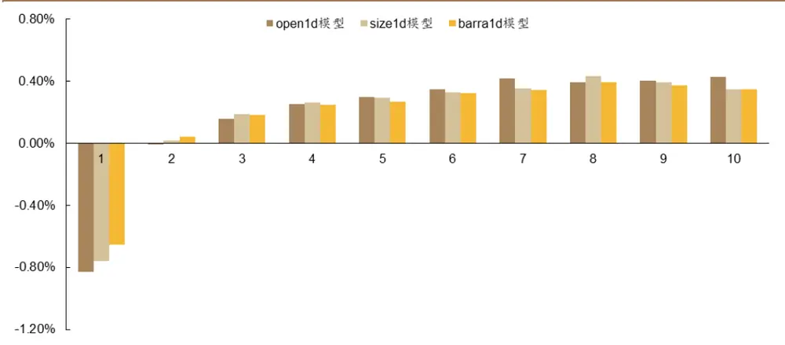
资料来源：Wind，RiceQuant，德邦研究所

## 4.2. 组合收益表现

从净值走势上看，在 2021 年以前剥离风格后的 barra1d 模型和 size1d 模型的净值表现与 open1d 模型几乎一致。2021 年以后，open1d 模型走势明显强于size1d 模型和 barra1d 模型。

图 13：各模型超额组合净值
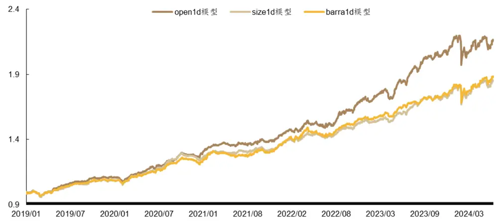
资料来源：Wind，RiceQuant，德邦研究所

open1d模型在胜率以及超额收益这类收益型指标上比size1d模型和barra1d模型有明显优势，但是在超额波动率以及回撤上表现较弱。在剥离模型的预测目标中的风格信息后，模型的最大回撤、Calmar比率、年化波动率等风险指标明显改善。

表 6：各模型组合表现

| 组合 | 月度胜率 | 超额年化收益率 | 信息比率 | 超额最大回撤 | Calmar 比率 | 超额年化波动率 |
| --- | --- | --- | --- | --- | --- | --- |
| open1d 模型 | 76.92% | 15.60% | 2.34 | 10.21% | 1.53 | 6.67% |
| size1d 模型 | 70.77% | 12.29% | 2.23 | 8.08% | 1.52 | 5.52% |
| barra1d 模型 | 73.85% | 12.62% | 2.29 | 7.58% | 1.67 | 5.50% |

资料来源：Wind，RiceQuant，德邦研究所

## 4.3. 组合风格特征

从 size 暴露走势上看，size1d 模型和 barra1d 模型均很好的控制了 size 风格。虽然在 2021 年以后的负向 size 暴露相比 2021 年以前仍然有所增加，但其整体暴露基本上控制在 0.5个标准差之内，相对基准并未出现较大的偏离。

图 14：组合相对基准的 size暴露走势图
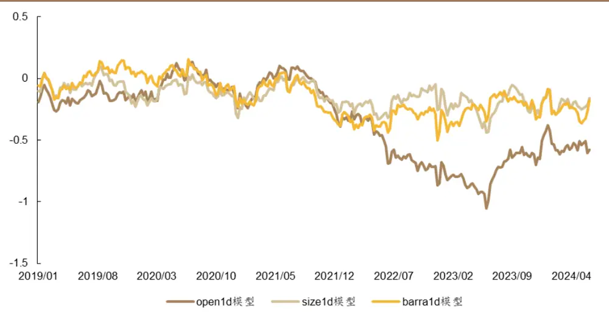
资料来源：Wind，RiceQuant，德邦研究所

从整体风格暴露上看，size1d 模型和 barra1d 模型在大部分风格上的暴露相比 open1d 模型都更小。

图 15：组合相对基准的风格暴露
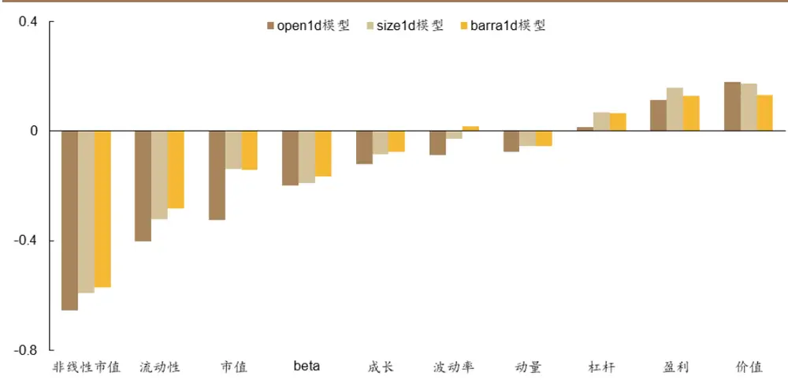
资料来源：Wind，RiceQuant，德邦研究所

所以对预测目标做风格剔除能较好的规避模型训练中带来的风格偏好。剔除掉特定风格以后，能帮助模型找到更为纯粹的 alpha 收益，一定程度上规避过度引入风格信息给净值带来的波动和回撤。

## 5. 交易换手对于 GRU模型的影响

选取 open1d 模型进行换手率研究。在基础回测参数上仅调整每周换仓的股票数量以及换仓频率，测算换手率在 1%-20%时组合的收益表现变化。

## 5.1. 以 open 价格交易时的换手率影响

随着单边换手率的增加，年化超额收益先上升后下降，日度交易的年化超额收益率大约在 10%左右换手率时达到峰值，周度交易的年化超额收益率在换手率接近 20%达到峰值。日度交易的年化收益率明显高于周度交易。

图 16：不同换手率组合的超额年化收益率
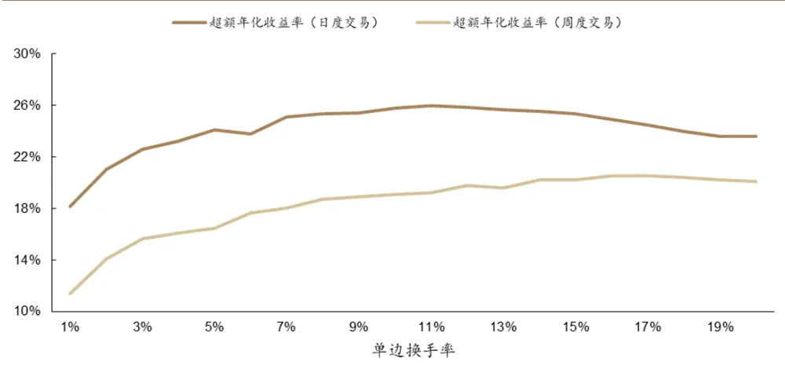
资料来源：Wind，RiceQuant，德邦研究所

以 open价格交易时，周度调仓单边换手率设置为 14%-20%时，组合的整体表现更为强势。换手率水平设置较低时，超额年化波动率和最大回撤的表现会更有优势。日度调仓的单边最优换手为 11%，在10%-15%左右组合整体表现较好。

表 7：不同换手率组合表现

| 单边 换手率 | 周度交易 |  |  |  |  |  | 日度交易 |  |  |  |
| --- | --- | --- | --- | --- | --- | --- | --- | --- | --- | --- |
|  | 超额 年化收益率 | 信息比率 | 超额 最大回撤 | Calmar 比率 | 超额 年化波动率 | 超额 年化收益率 | 信息比率 | 超额 最大回撤 | Calmar 比率 | 超额 年化波动率 |
| 1% | 11.39% | 1.93 | 6.68% | 1.71 | 5.90% | 18.14% | 2.75 | 10.14% | 1.79 | 6.59% |
| 2% | 14.07% | 2.29 | 9.02% | 1.56 | 6.13% | 21.05% | 3.10 | 10.17% | 2.07 | 6.79% |
| 3% | 15.62% | 2.50 | 9.93% | 1.57 | 6.26% | 22.62% | 3.23 | 10.84% | 2.09 | 7.01% |
| 4% | 16.06% | 2.53 | 10.68% | 1.50 | 6.35% | 23.25% | 3.30 | 10.42% | 2.23 | 7.06% |
| 5% | 16.44% | 2.57 | 10.41% | 1.58 | 6.40% | 24.09% | 3.41 | 9.93% | 2.43 | 7.05% |
| 6% | 17.65% | 2.70 | 10.22% | 1.73 | 6.54% | 23.82% | 3.38 | 9.50% | 2.51 | 7.04% |
| 7% | 18.04% | 2.73 | 10.25% | 1.76 | 6.60% | 25.08% | 3.56 | 9.24% | 2.71 | 7.04% |
| 8% | 18.72% | 2.84 | 9.78% | 1.91 | 6.60% | 25.33% | 3.60 | 8.91% | 2.84 | 7.04% |
| 9% | 18.91% | 2.83 | 10.22% | 1.85 | 6.68% | 25.41% | 3.61 | 8.89% | 2.86 | 7.05% |
| 10% | 19.11% | 2.84 | 10.25% | 1.86 | 6.74% | 25.78% | 3.66 | 8.66% | 2.98 | 7.04% |
| 11% | 19.22% | 2.82 | 10.30% | 1.86 | 6.82% | 26.00% | 3.70 | 8.20% | 3.17 | 7.02% |
| 12% | 19.77% | 2.90 | 10.06% | 1.97 | 6.81% | 25.89% | 3.67 | 8.59% | 3.01 | 7.06% |
| 13% | 19.57% | 2.88 | 9.76% | 2.01 | 6.79% | 25.67% | 3.63 | 8.68% | 2.96 | 7.08% |
| 14% | 20.25% | 2.96 | 9.89% | 2.05 | 6.84% | 25.52% | 3.61 | 8.66% | 2.95 | 7.07% |
| 15% | 20.21% | 2.93 | 9.74% | 2.08 | 6.90% | 25.33% | 3.58 | 8.83% | 2.87 | 7.07% |
| 16% | 20.51% | 2.95 | 9.87% | 2.08 | 6.96% | 24.90% | 3.49 | 9.01% | 2.76 | 7.13% |
| 17% | 20.56% | 2.94 | 9.84% | 2.09 | 7.00% | 24.46% | 3.43 | 9.10% | 2.69 | 7.12% |
| 18% | 20.41% | 2.90 | 9.88% | 2.07 | 7.05% | 23.99% | 3.38 | 9.48% | 2.53 | 7.10% |
| 19% | 20.24% | 2.87 | 9.76% | 2.07 | 7.04% | 23.63% | 3.32 | 9.72% | 2.43 | 7.12% |
| 20% | 20.12% | 2.85 | 9.97% | 2.02 | 7.07% | 23.58% | 3.32 | 9.96% | 2.37 | 7.11% |

资料来源：Wind，RiceQuant，德邦研究所

## 5.2. 以 vwap价格交易时的换手率影响

以 vwap价格交易时，超额收益率达到峰值时的单边换手相比以 open价格交易明显下降，日频交易的年化超额收益率相对于周频交易不再有明显优势。

图 17：不同换手率组合的超额年化收益率
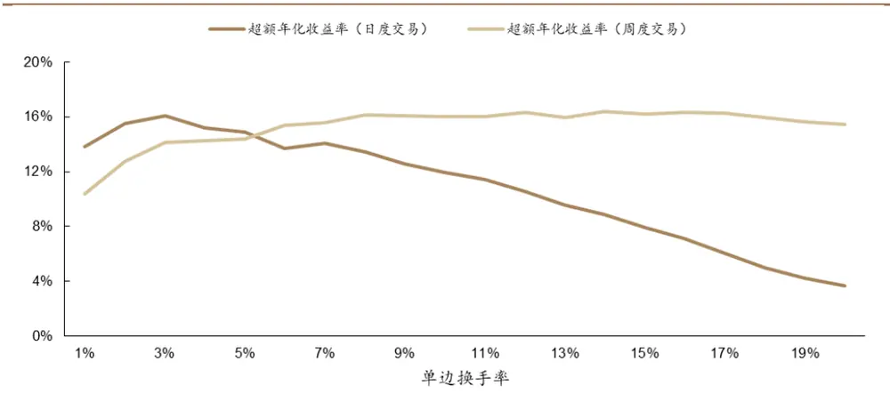
资料来源：Wind，RiceQuant，德邦研究所

从表 8 中可以看到，周频调仓时单边换手率设置在 5%-20%左右时，组合的收益表现较为强势。与 open价格交易类似，换手率水平设置较低时，超额年化波动率和最大回撤的表现会更有优势。日频调仓的单边最优换手率为3%，换手率在5%以下时组合整体表现较好。

表 8：不同换手率组合表现

| 单边 换手率 | 周度交易 |  |  |  |  |  | 日度交易 |  |  |  |
| --- | --- | --- | --- | --- | --- | --- | --- | --- | --- | --- |
|  | 超额 年化收益率 | 信息比率 | 超额 最大回撤 | Calmar 比率 | 超额 年化波动率 | 超额 年化收益率 | 信息比率 | 超额 最大回撤 | Calmar 比率 | 超额 年化波动率 |
| 1% | 10.37% | 1.74 | 7.23% | 1.43 | 5.97% | 13.85% | 2.10 | 10.46% | 1.32 | 6.61% |
| 2% | 12.77% | 2.05 | 9.02% | 1.42 | 6.21% | 15.49% | 2.27 | 10.46% | 1.48 | 6.81% |
| 3% | 14.12% | 2.23 | 9.95% | 1.42 | 6.34% | 16.05% | 2.27 | 11.16% | 1.44 | 7.06% |
| 4% | 14.27% | 2.22 | 10.69% | 1.34 | 6.43% | 15.17% | 2.13 | 10.91% | 1.39 | 7.11% |
| 5% | 14.37% | 2.22 | 10.36% | 1.39 | 6.48% | 14.89% | 2.09 | 10.53% | 1.41 | 7.11% |
| 6% | 15.40% | 2.33 | 10.16% | 1.52 | 6.61% | 13.70% | 1.93 | 10.16% | 1.35 | 7.08% |
| 7% | 15.60% | 2.34 | 10.21% | 1.53 | 6.67% | 14.04% | 1.99 | 10.25% | 1.37 | 7.07% |
| 8% | 16.16% | 2.43 | 9.69% | 1.67 | 6.65% | 13.42% | 1.90 | 10.70% | 1.25 | 7.07% |
| 9% | 16.05% | 2.38 | 10.17% | 1.58 | 6.73% | 12.54% | 1.78 | 10.58% | 1.18 | 7.06% |
| 10% | 15.98% | 2.35 | 10.20% | 1.57 | 6.79% | 11.97% | 1.70 | 10.70% | 1.12 | 7.04% |
| 11% | 16.00% | 2.33 | 10.25% | 1.56 | 6.87% | 11.47% | 1.63 | 10.37% | 1.11 | 7.02% |
| 12% | 16.32% | 2.37 | 9.98% | 1.64 | 6.87% | 10.59% | 1.50 | 11.03% | 0.96 | 7.07% |
| 13% | 15.92% | 2.33 | 9.65% | 1.65 | 6.84% | 9.57% | 1.35 | 11.13% | 0.86 | 7.07% |
| 14% | 16.41% | 2.38 | 9.78% | 1.68 | 6.88% | 8.85% | 1.25 | 11.28% | 0.78 | 7.07% |
| 15% | 16.20% | 2.34 | 9.57% | 1.69 | 6.94% | 7.95% | 1.13 | 11.77% | 0.68 | 7.05% |
| 16% | 16.34% | 2.34 | 9.66% | 1.69 | 6.99% | 7.12% | 1.00 | 12.36% | 0.58 | 7.10% |
| 17% | 16.28% | 2.32 | 9.63% | 1.69 | 7.02% | 6.09% | 0.86 | 12.51% | 0.49 | 7.09% |
| 18% | 15.96% | 2.26 | 9.65% | 1.65 | 7.06% | 4.99% | 0.71 | 12.84% | 0.39 | 7.08% |
| 19% | 15.66% | 2.22 | 9.57% | 1.64 | 7.06% | 4.21% | 0.59 | 12.98% | 0.32 | 7.08% |
| 20% | 15.48% | 2.19 | 9.76% | 1.59 | 7.08% | 3.65% | 0.52 | 13.31% | 0.27 | 7.06% |

资料来源：Wind，RiceQuant，德邦研究所

在周频交易的情况下，以vwap价格交易的最优换手率水平明显低于以 open价格交易的最优换手率水平。以 open价格周度交易的情况下，open1d模型的最优单边换手率水平为 14%-20%左右。以 vwap价格周度交易的情况下，单边换手率控制在 6%-20%左右时时表现较好。

在日度交易的情况下，vwap价格交易相对于 open价格交易的换手率更为敏感。以 open 价格交易的最优单边换手率水平约为 11%，以 vwap 交易的最优单边换手率水平约为 3%。

## 6. 长周期预测的风格处理

在本文第三节中，我们发现单纯增加模型预测目标的周期，很容易导致模型最后学习到过多的风格特征，并不能抓住更多的 alpha 收益。本文第四节中可以看到，剥离预测目标中的风格信息后，能避免模型过度学习风格特征，从而帮助模型学习更纯粹的 alpha信息。

## 6.1. 未来收益率与风格的相关性

统计不同周期未来收益率的风格相关性可以发现，随着周期的增加，未来收益与大部分风格的相关性绝对值也会增加。所以长周期的预测目标中隐含着更多的风格特征，模型的训练也更容易受到风格信息的影响，从而影响 alpha 特征的学习。

表 9：不同周期未来收益率的风格相关性

| 组合 | 市值 | beta | 动量 | 波动率 | 非线性市值 | 价值 | 流动性 | 盈利 | 成长 | 杠杆 |
| --- | --- | --- | --- | --- | --- | --- | --- | --- | --- | --- |
| open1d | -1.14% | 0.61% | -0.09% | -0.91% | -1.41% | 0.40% | -0.85% | 0.05% | -0.26% | -0.27% |
| open2d | -1.46% | 0.67% | -0.15% | -1.37% | -1.90% | 0.62% | -1.44% | 0.20% | -0.30% | -0.35% |
| open3d | -1.63% | 0.68% | -0.21% | -1.67% | -2.19% | 0.80% | -1.85% | 0.32% | -0.31% | -0.40% |
| open4d | -1.79% | 0.66% | -0.23% | -1.89% | -2.42% | 0.92% | -2.16% | 0.41% | -0.33% | -0.44% |
| open5d | -1.90% | 0.60% | -0.25% | -2.07% | -2.61% | 1.02% | -2.42% | 0.49% | -0.33% | -0.48% |
| open10d | -2.17% | 0.36% | -0.16% | -2.65% | -3.22% | 1.39% | -3.40% | 0.84% | -0.38% | -0.61% |

资料来源：Wind，RiceQuant，德邦研究所

基于上述讨论，我们尝试改进open5d模型，剥离原先预测目标的 open5d收益率中的风格特征，最终得到 barra5d模型。

## 6.2. Barra5d 的净值表现

图 18：各模型超额组合净值
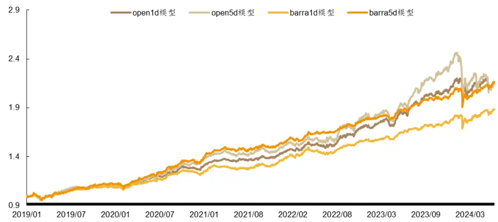
资料来源：Wind，RiceQuant，德邦研究所

barra5d模型相对open5d 模型在净值表现的各个方面都得到了提升，最大回撤得到很好的控制，最终的年化收益率反而有所提升，信息比率更是从 1.52提升到了 2.60。

open5d 模型引入过多的风格信息，导致其最终净值的综合表现弱于 open1d模型。但是在剥离预测目标的风格信息后，预测更长周期的 barra5d 模型相比barra1d 模型在收益和信息比率上都有提升。

表 10：各模型组合表现

| 组合 | 月度胜率 | 超额年化收益率 | 信息比率 | 超额最大回撤 | Calmar 比率 | 超额年化波动率 |
| --- | --- | --- | --- | --- | --- | --- |
| open1d 模型 | 76.92% | 15.60% | 2.34 | 10.21% | 1.53 | 6.67% |
| open5d 模型 | 72.31% | 15.43% | 1.52 | 22.64% | 0.68 | 10.14% |
| barra1d 模型 | 73.85% | 12.62% | 2.29 | 7.58% | 1.67 | 5.50% |
| barra5d 模型 | 75.38% | 15.57% | 2.60 | 9.28% | 1.68 | 5.98% |

资料来源：Wind，RiceQuant，德邦研究所

所以，当我们试图增加模型的预测周期时，要注意风格因子的影响。更长周期的预测目标中带有的风格信息相比短期预测目标明显增加，这会导致长周期的预测模型很容易学到过多的风格特征，对模型的综合预测能力帮助不大。

## 7. 总结

选择预测目标的价格时，在模型使用vwap计算的未来收益作为预测目标时，其 IC表现相比预测 open未来收益的模型有较大提升，但是模型引入了更多风格特征，组合净值的综合表现不如预测 open未来收益的模型与预测close未来收益的模型。具体来看，vwap1d模型对于未来 5日 vwap收益率的平均IC为 0.082，open1d 模型 IC 为 0.062。相对中证 1000 指数， vwap1d 模型超额年化收益率为 17.52%，最大回撤为 18.01%，open1d 模型超额年化收益率为 15.60%，最大回撤为 10.21%；close1d 模型超额年化收益率为 14.79%，最大回撤为 10.99%。

预测更长周期未来收益率的 GRU模型，表现上类似于预测 vwap未来收益的模型。在IC表现上，预测多日未来收益的 GRU模型相比仅预测 1日未来收益的GRU模型有所提升，但是组合上看暴露更多的风格特征。在组合表现上预测多日未来收益的 GRU模型各方面都弱于预测 1日未来收益的模型。

预测目标的风格特征能显著影响 GRU 模型的风格特征，预测剥离更多风格特征未来收益的 GRU 模型能获得更纯的 alpha 收益。剥离预测目标的风格特征后，模型在 IC 和收益方面有所减弱，在组合回撤和波动率的表现上显著增强。2021 年后，原先的GRU模型引入更多的风格特征，其小市值偏好显著增加，模型在 2021 年后相对基准的市值风格暴露为-0.46。然而，剥离预测目标中的风格特征之后，组合的小市值偏好得到明显的改善，剥离 size 风格的模型在 2021 年后相对基准的市值风格暴露缩小至-0.17，剥离所有 barra 风格特征的模型市值风格暴露为-0.23。

在换手率设置方面，相比以 open价格交易，以 vwap价格进行交易需要设置更低的换手率能取得更优的组合表现，日频交易相对于周频交易的换手设置更为敏感。对于日频交易的情况下，使用 open 价格进行交易时，单边换手率设置为11%时组合表现最优；使用 vwap价格进行交易时，单边换手率设置为 3%时组合表现最优。周频交易的情况下，使用 open 价格交易的最优单边换手约为 14%-20%，使用 vwap交易时单边换手率设置为 6%-20%较优。

预测更长周期未来收益率的 GRU模型，需要注意剥离风格信息的影响。更长周期的预测目标中带有的风格信息相比短期预测目标明显增加，这会导致长周期的预测模型很容易学到过多的风格特征。剥离掉预测目标中的风格特征后，增加预测周期能一定程度上提升模型的表现。

## 8. 风险提示

人工智能模型挖掘市场规律是对历史数据的总结，市场规律在未来可能发生变化。深度学习模型可能存在过拟合风险。深度学习模型存在随机数影响，训练结果可能无法完全复刻。本文测试均在理想状态下使用开盘价或者 VWAP 价格进行成交计算，实际交易中可能存在其他影响因素导致成交价格出现偏差。

## 信息披露

## 分析师与研究助理简介

肖承志：同济大学应用数学本科、硕士，现任德邦证券研究所首席金融工程分析师。具有 年证券研究经历，曾就职于东北证券研究所担任首席金融工程分析师。致力于市场择时、资产配置、量化与基本面选股。撰写独家深度“扩散指标择时”系列报告；擅长各类择时与机器学习模型，对隐马尔可夫模型有深入研究；在因子选股领域撰写多篇因子改进报告，市场独家见解。

## 分析师声明

本人具有中国证券业协会授予的证券投资咨询执业资格，以勤勉的职业态度，独立、客观地出具本报告。本报告所采用的数据和信息均来自市场公开信息，本人不保证该等信息的准确性或完整性。分析逻辑基于作者的职业理解，清晰准确地反映了作者的研究观点，结论不受任何第三方的授意或影响，特此声明。

## 投资评级说明

| 1. 投资评级的比较和评级标准：以报告发布后的6个月内的市场表现为比较标准，报告发布日后6个月内的公司股价（或行业指数）的涨跌幅相对同期市场基准指数的涨跌幅；2. 市场基准指数的比较标准：A股市场以上证综指或深证成指为基准；香港市场以恒生指数为基准；美国市场以标普500或纳斯达克综合指数为基准。 | 类别 | 评级 | 说明 |
| --- | --- | --- | --- |
|  | 股票投资评级 | 买入 | 相对强于市场表现20%以上； |
|  |  | 增持 | 相对强于市场表现 5%~20%； |
|  |  | 中性 | 相对市场表现在-5%~+5%之间波动； |
|  |  | 减持 | 相对弱于市场表现5%以下。 |
|  | 行业投资评级 | 优于大市 | 预期行业整体回报高于基准指数整体水平10%以上； |
|  |  | 中性 | 预期行业整体回报介于基准指数整体水平-10%与10%之间； |
|  |  | 弱于大市 | 预期行业整体回报低于基准指数整体水平10%以下。 |

## 法律声明

本报告仅供德邦证券股份有限公司（以下简称“本公司”）的客户使用。本公司不会因接收人收到本报告而视其为客户。在任何情况下，本报告中的信息或所表述的意见并不构成对任何人的投资建议。在任何情况下，本公司不对任何人因使用本报告中的任何内容所引致的任何损失负任何责任。

本报告所载的资料、意见及推测仅反映本公司于发布本报告当日的判断，本报告所指的证券或投资标的的价格、价值及投资收入可能会波动。在不同时期，本公司可发出与本报告所载资料、意见及推测不一致的报告。

市场有风险，投资需谨慎。本报告所载的信息、材料及结论只提供特定客户作参考，不构成投资建议，也没有考虑到个别客户特殊的投资目标、财务状况或需要。客户应考虑本报告中的任何意见或建议是否符合其特定状况。在法律许可的情况下，德邦证券及其所属关联机构可能会持有报告中提到的公司所发行的证券并进行交易，还可能为这些公司提供投资银行服务或其他服务。

本报告仅向特定客户传送，未经德邦证券研究所书面授权，本研究报告的任何部分均不得以任何方式制作任何形式的拷贝、复印件或复制品，或再次分发给任何其他人，或以任何侵犯本公司版权的其他方式使用。所有本报告中使用的商标、服务标记及标记均为本公司的商标、服务标记及标记。如欲引用或转载本文内容，务必联络德邦证券研究所并获得许可，并需注明出处为德邦证券研究所，且不得对本文进行有悖原意的引用和删改。

根据中国证监会核发的经营证券业务许可，德邦证券股份有限公司的经营范围包括证券投资咨询业务。