端到端的动态 Alpha模型

量化选股策略

——AI 系列研究之一

本文提出了一种基于深度神经网络的动态 Alpha因子模型，实现了端到端的因子权重训练和预期收益率预测。在 IC、ICIR、因子分组收益率、多头组合收益率等指标维度表现相比于线性Alpha因子模型有较为明显的提升。

❑ 传统线性因子模型存在一定的缺陷。无套利条件中随机折现因子的线性结构学术界尚存在争论。实证研究中，残差的时序和截面的相关性以及残差的异方差性在线性因子模型中，通常需要特殊的手段处理。在因子模型中引入非线性成为学术界和业界的主流做法。

❑ 基于 MLP的因子网络结构，相比于 L2正则的线性基准网络，在 RankIC均值略有下降。多空年化收益率、多空夏普等指标改善明显。多头收益率对RankIC 的贡献提升。

❑ 借鉴传统的 Alpha 模型，细分因子到大类因子分步合成，一般需要筛选出IC 表现较好，且相关性较低的细分因子合成大类因子，以保证大类因子的IC 表现和低相关性。在 MLP 网络中同样可以引入正交惩罚使得网络学习到的大类因子保持低相关性。

❑ 在机器学习任务中，不同学习目标的设置同样对模型的表现有至关重要的影响。本文测试了使用 MSE、IC、CCC 不同的损失函数对模型表现的影响。IC 损失函数的综合表现最好。CCC 损失函数对应的模型的合成 zscore 因子稳定性最好。

❑ 本文的研究过程发现 IC 作为传统的单因子表现指标，在多头选股的场景下并不能正确评估最终的选股表现。需要结合因子的多空最大回撤、多空夏普以及多头组合的表现来综合评估。

❑ 风险提示：量化策略基于历史数据统计，模型存在失效的可能性。

任瞳S1090519080004

rentong@cmschina.com.cn

周靖明S1090519080007

zhoujingming@cmschina.com.cn

周游研究助理

zhouyou4@cmschina.com.cn

## 一、传统因子投资框架

## 1.1. 多因子 Alpha 模型构建流程

传统因子投资框架，在业界已得到广泛的应用。从模块划分，主要包括 Alpha 模型、风险模型、组合优化、交易执行等模块。其中风险模型相对成熟、业界常用 BARRA 因子作为风险估计模型，或者在其基础上定制。本文主要讨论收益预测模型，即Alpha模型。收益预测的步骤主要包括：

1) 数据清洗

2) 因子构建，极端值处理

3) 因子分类、大类因子合成

4) 大类因子权重组合

5) 收益预测

等步骤。其中因子构建步骤、大类因子合成、通常使用回归法及其变种，例如 LASSO、岭回归等方式来降低细分因子或者大类因子之间的共线性。

图1 ：多因子Alpha模型构建流程
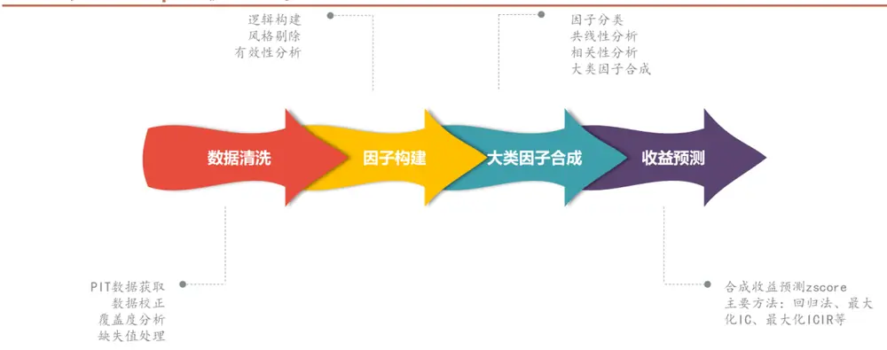
资料来源：招商证券

图 2：组合优化流程
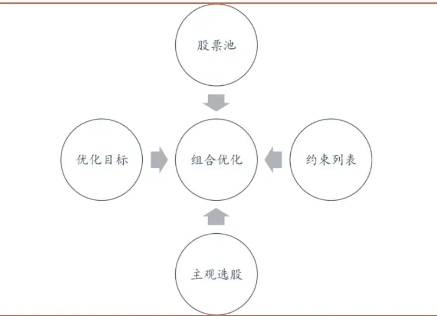
资料来源：招商证券

图 3：常见量化策略类型
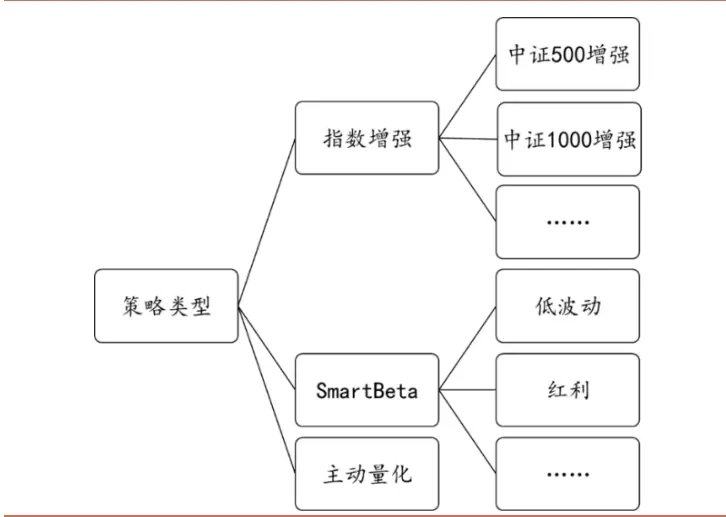
资料来源：招商证券

传统因子投资框架日趋成熟，但该框架中存在的问题仍然有诸多争议。在本文的后续章节中将重点讨论并尝试

解决这些问题。

## 1.2. 当前因子模型遇到的问题

传统因子投资流程中，线性回归的方法运用广泛。从缺失值处理到因子有效性分析到最终的因子组合，都用到了线性回归的方法。但因子收益率与资产收益率的线性关系并不一定成立。线性因子模型的理论基础是 APT 定价模型，APT的无套利假设使得 时刻的资产收益率 $r_{i,t+1}$ 满足：

$$
E_{t}\left[m_{t+1}r_{i,t+1}\right]=0\Leftrightarrow E_{t}\left[r_{i,t+1}\right]=\frac{\mathrm{Cov}_{t}\left(m_{t+1},r_{i,t+1}\right)}{\mathrm{Var}_{t}\left(m_{t+1}\right)}\frac{\mathrm{Var}_{t}\left(m_{t+1}\right)}{E_{t}\left[m_{t+1}\right]}
$$

记第一项为 $\beta_{i,t}^{'}$ ，第二项为 $\lambda_{_t}$ ，当 $m_{t+1}$ 满足线性结构时， 时刻的资产收益率 $r_{i,t+1}$ 的资产定价模型为：

$$
r_{i,t+1}=\alpha_{i,t}+\beta_{i,t}^{'}f_{t+1}+\epsilon_{i,t+1}
$$

其中， $E_{t}\left(\epsilon_{i,t+1}\right)=E_{t}\left[\epsilon_{i,t+1}f_{t+1}\right]=0,E_{t}\left[f_{t+1}\right]=\lambda_{t}$ ，在该线性结构的假设下，估计因子收益率 $\lambda_{t}$ 需要满足上述的高斯马尔可夫定律。但在实际金融数据中，残差的异方差性、残差的时序相关性以及截面相关性并不满足为 0。因此在实际因子模型构建的过程中通常会使用很多的统计手段来减少线性假设带来的问题。例如，使用 Fama-Macbeth 回归来减少残差的截面相关性。Barra 风险模型，使用股票总市值倒数的根作为权重来进行 WLS 回归来减轻残差的异方差性。综上，因子模型的线性结构存在诸多问题，线性结构并不是标准答案。

在实证因子投资的过程中，业界早已开始引入非线性因子。例如，BARRA CNE6 模型中 SIZE 风格因子的构建过程中，其中一个细分因子为非线性因子 ，构建过程为：

$$
\begin{array}{l}{size_{i}=\ln(market_{-}cap)}\\{midcap_{i}=size_{i}^{3}-a-b^{*}size_{i}}\end{array}
$$

即总市值的三次方对原 size因子（ln(size)）WLS回归后的残差作为非线性市值因子，该 WLS有显式解，因子可以看作 ，其中 为非线性函数。

上述例子说明了线性因子模型在理论上存在一定的缺陷。在当今业界，由于因子同质化，和多因子策略的同质化导致传统因子日渐拥挤。以BP因子为例，在2019，2020两年几乎失效。

图 4：BP 因子多空净值（20110901-20230401）
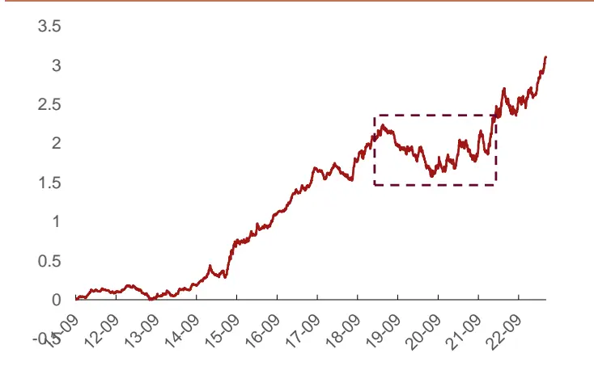
资料来源：招商证券

图 5：BP 因子月度 RankIC（20110901-20230401）
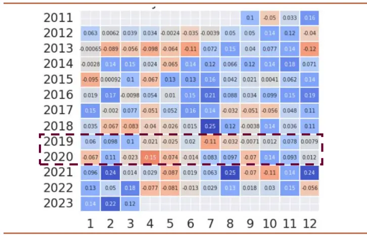
资料来源：招商证券

从分组收益率更能看出因子在实际投资过程中的表现。由于卖空限制的存在，多头收益率更能反应出因子的实际表现。在 2021 年后，BP 因子的月度 RankIC 仍然有不错的表现，但 IC 基本由空头贡献。BP 因子日渐拥挤。

图 6 ：BP 因子多头日渐拥挤（20110901-20230401）
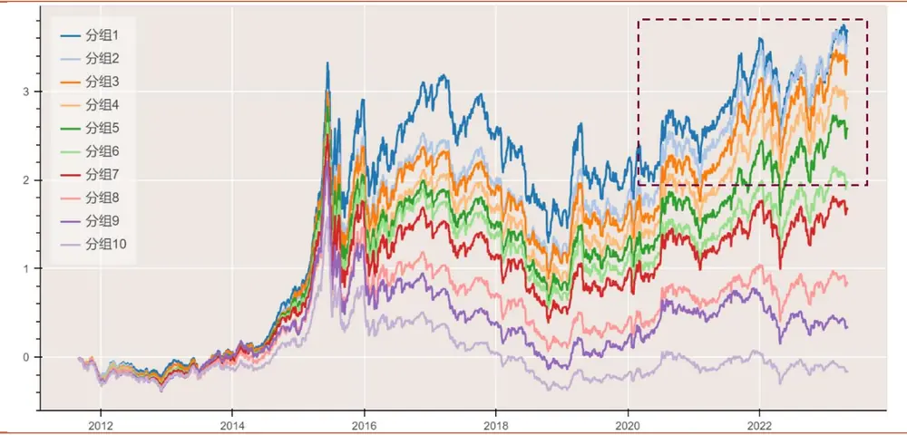
资料来源：Wind、招商证券

以技术指标为代表的量价因子的IC贡献中空头贡献占比较高。多头拥挤现象已经存在已久。这里以人气意愿指标 AR（技术指标）为例，该指标反应了日内买卖意愿的强弱。

$$
\mathsf{AR}=\mathsf{SUM}(\mathsf{H}|\mathsf{G}\mathsf{H}-\mathsf{OPEN},\mathsf{M}1)/\mathsf{SUM}(\mathsf{OPEN}-\mathsf{LOW},\mathsf{M}1)^{\star}100,\mathsf{M}1=26
$$

在过去 7 年内，20 日调仓的平均 RankIC 约为 0.058，IC 的 t 值为 32.75，未年化 IR 为 0.79，IC 胜率为 79%，从指标上来看是一个显著有效的因子。

图 7 ：中性化后 AR 因子分组历史走势（20110901-20230401）
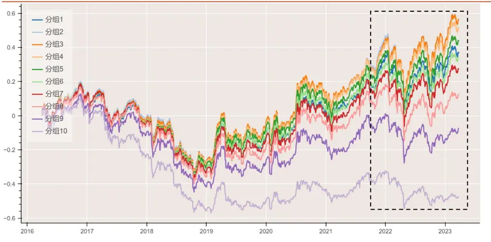
资料来源：Wind、招商证券

图 8：AR 因子多空净值走势（20160401-20230401）
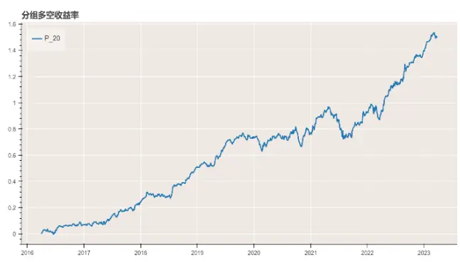
资料来源：Wind、招商证券

图 9：AR因子组内多空收益率分布
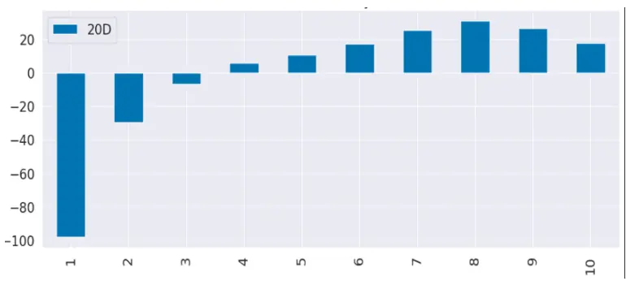
资料来源：Wind、招商证券

但是，从组内多空的收益率分布和分组历史收益率的走势来看，AR因子的多头拥挤程度在 9，10组表现的非常明显。在 1-8组存在的分组收益率单调性在9，10组消失。另一个明显的特点是空头端收益率显著高于多头端收益率。结合因子的多空走势图看和因子RankIC表现，AR因子的负Alpha属性比较明显。

由以上例子可以看出，常见基本面因子和量价因子多头都出现了不同程度的拥挤。量价因子的另一个问题是负Alpha属性显著，正Alpha则相对较弱。另一方面因子组合和组合优化的方法也较为类似，随着股票量化多头类策略资金的规模扩大，常见因子的多头收益可以预见将进一步降低。为了解决当前遇到的诸多问题：

1) 资产定价模型的线性结构假设并不准确

2)常见基本面和量价因子的多头日趋拥挤

3)量价类因子的负Alpha属性显著，正Alpha属性较弱

4)因子合成以及组合优化方法类似，策略趋同

业界早已开始尝试在因子中加入非线性。例如 Barra模型中中市值风格因子的构建。但因子与因子之间的非线性交互作用，仅仅通过先验通过在线性因子模型中加入非线性因子可能无法很好的解决。

随着机器学习技术的发展，深度神经网络已经运用到图像识别、自然语言处理等多个领域并完全战胜了传统的统计学习模型，例如树模型、SVM、隐马尔科夫模型等。因此，本文将尝试使用深度网络改进现有的Alpha模型，在因子构建、因子组合、收益预测等环节引入非线性，和自适应的权重训练的机制，以求改进当前传统Alpha模型遇到的诸多问题。

## 二、引入非线性的 Alpha模型

因子模型的非线性存在已经广为人知，非线性存在于因子层面，同样存在于因子之间的交互作用，因此在建模非线性 Alpha模型的时候，我们需要考虑的有：

1) 如何学习原始因子的非线性表示

2) 如何获得收益率预测性能最好的因子

3) 如何降低所学习到的因子之间的线性和非线性交互作用

在讨论这些问题之间，首先我们按照构建传统线性 Alpha 模型的思路构建一个具有大类因子合成。大类因子组合的线性网络。本文使用的因子库包括约 100 个因子，因子大类包括量价类、估值、盈利质量、风格等。具体说明见附录。其他固定设置如下：

表1：模型固定参数说明

| 名称 | 参数说明 |
| --- | --- |
| 股票池 | 全A股票，剔除上市不满三个月、ST、*ST、停牌的股票 |
| 数据集 | 基本面因子+量价因子 |
| 预测 Label | T+1 日至 T+21 日复权 VWAP 价格收益率 |
| 调仓周期 | 20个交易日 |
| 因子预处理 | 3 倍 MAD 截断，zscore标准化，缺失值填充为 0 |
| 中性化处理 | 市值、行业中性 |
| 跟踪基准 | 中证500、中证800、中证1000 |
| Batch 定义 数据划分 | 一个交易截面上所有的股票为一个Batch |
|  | 20110901-20230401，滚动训练模式；在训练集中划分最后252个交易日作为验证集；测试集 为最近半年的所有交易日 |

资料来源：招商证券

图 10：数据集划分说明
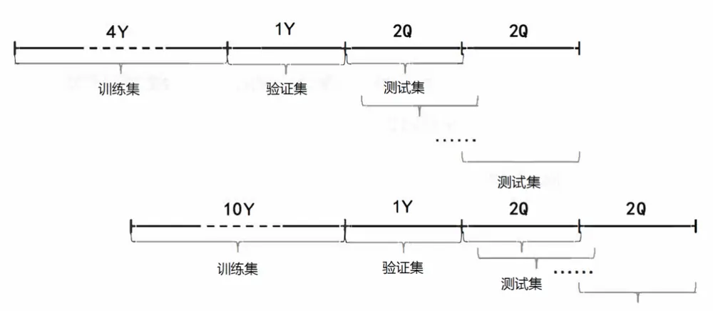
资料来源：招商证券

## 2.1.线性基准网络

首线性网络与传统的 Alpha框架保持了基本一致。包括原始因子的组合、大类因子合成以及收益率预测部分。

网络结构中，A1 层为线性表示层，输入为 ${\bf z_{m}}\in{R}^{N\times P}$ ，其中 为股票个数，P 为原始因子个数，经过第一层线性层后，输出为 64维，第一层网络用来学习原始因子的线性表示，A2层输入为 64维输出为 6维，第二层网络用来对学习到的因子进行线性加权，最后经过BN层后输出合成因子的zscore。损失函数为 MSE损失函数。使用 L2正则化。

从传统因子模型的角度来看，第一层可以看作是原始因子合成大类因子，第二层可以看作大类因子合成收益预测 zscore：

$$
\begin{array}{r}{{\mathbf{h}}_{1}={\mathbf{z}}_{{\mathbf{m}}}{\mathbf{w}}_{1}+{\mathbf{b}}_{1}}\\{{\mathbf{h}}_{2}={\mathbf{h}}_{1}{\mathbf{w}}_{2}+{\mathbf{b}}_{2}}\\{{\mathbf{0}}={\mathrm{zscore}}({\mathbf{h}}_{2})}\end{array}
$$

与传统因子模型不同的地方在于：传统因子模型通常分两步完成大类因子合成以及收益率预测，在线性 Alpha网络中权重由优化算法训练得到，使用 L2正则减少因子权重缓解过拟合。

图 11：线性 Alpha网络结构
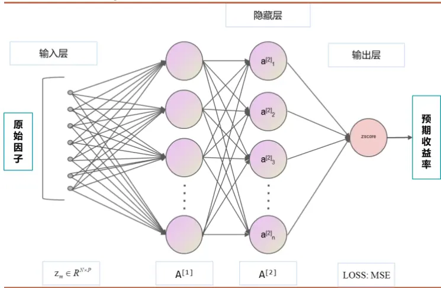
资料来源：招商证券
按照上述的网络结构和训练流程可以得到合成的 zscore因子，表现如下：

图 12：线性 Alpha 模型 RankIC 走势图
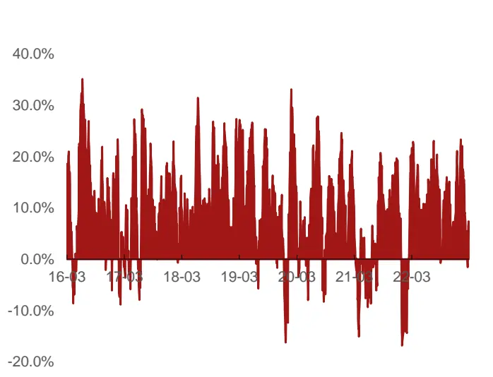
资料来源：招商证券

图 13：分组年化基准对冲收益（20160401-20230401）
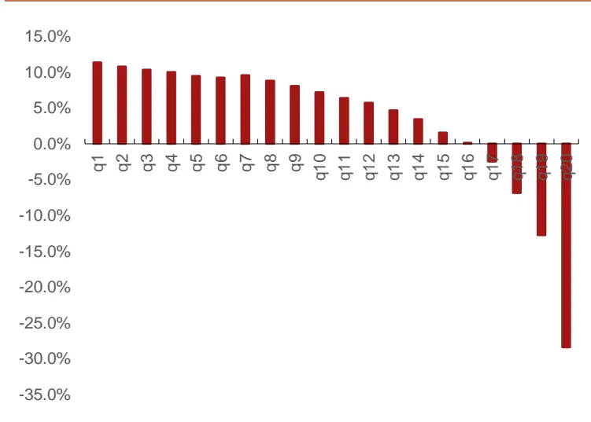
资料来源：招商证券

线性网络在过去 7 年间，平均 RankIC 为 10.12%，ICIR（未年化）为 1.13。从 IC 的角度来看，线性网络表现不俗。但是从年化基准对冲的年化收益率来看，多头年化收益率为 11.34%，空头年化收益率为-28.4%，IC 的贡献主要来自于空头端。

多头等权策略组合表现如图所示：

图 14：线性 Alpha模型多头等权策略历史表现
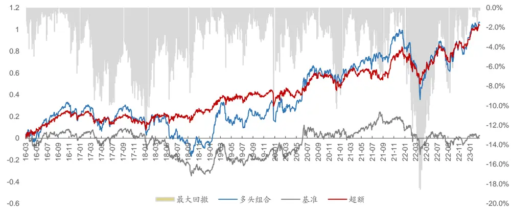
资料来源：Wind、招商证券

## 2.2.非线性 Alpha 网络

在网络中引入非线性，利用神经网络来提高因子模型的表示能力。这里使用 MLP（多层感知机）来构建，与线性网络的架构类似。同样分为因子表示学习层，大类因子层以及输出层。

表 2：MLP 网络参数设置

| 名称 | 参数说明 |
| --- | --- |
| 输入维度 | 截面股票个数*特征维度 |
| 输出维度 | 截面股票个数*1 |
| 隐藏层神经元个数 | 64 |
| 初始学习率 | 0.0005 |
| 优化算法 | Adam |
| 权重衰减 | 无 |
| 损失函数 | MSE损失函数作为基准 |
| 早停设置 | 验证集 loss，5 个 epoch 不再下降，max_epoch 设置为 1000 |

资料来源：招商证券

MLP 的主要结构包括输入层，隐藏层以及输出层。其中重要的结构参数是隐藏层的层数与隐藏层神经元个数。研究表明：

1) 当隐藏层为0时，神经网络只能表示线性可分的函数

2) 当隐藏层为2时，可以拟合任何一个有限空间到另一个有限空间的连续映射

3) 当隐藏层大于 3 时，额外的隐藏层可以学习复杂的特征描述（类似自动特征工程）

本文中网络结构中隐藏层数为 3层。隐藏层神经元个数的经验法则：

$$
N_{h}=\frac{N_{s}}{\left(\alpha^{*}\big(N_{i}+N_{o}\big)\right)}
$$

其中 $N_{i}$ 为输入层神经元的个数； $N_{o}$ 为输出层神经元个数； $N_{s}$ 为训练集样本数目； 为经验变量，取值范围为 2-10。本文中MLP隐藏层神经元个数取64。

图 15：非线性 Alpha 网络结构
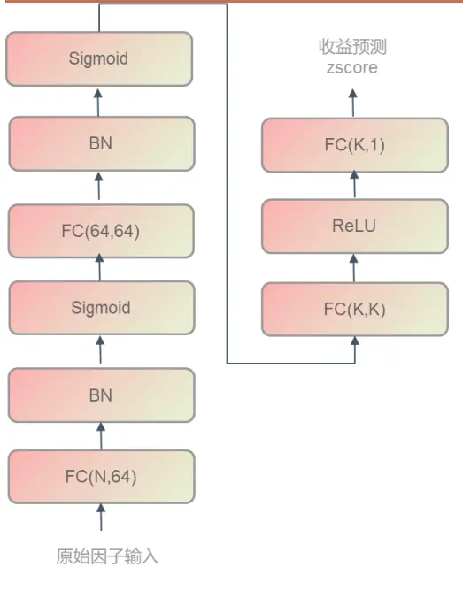
资料来源：招商证券

图 16： ReLU vs Sigmoid 激活函数
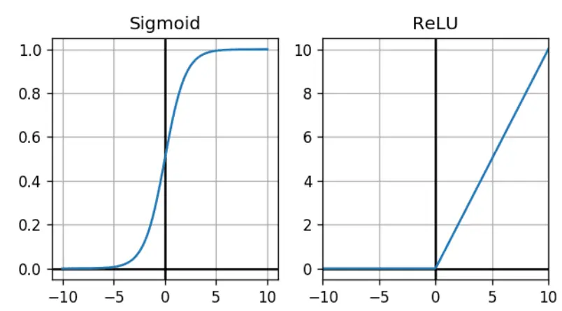
资料来源：招商证券

神经网络中常用的激活函数有 Sigmoid、Tanh、ReLU、LeakyReLU。ReLU 激活函数最为常用。ReLU 激活函数在正值区间梯度恒定，可以加快梯度下降的速度。从而加快训练速度。但是 ReLU 激活函数也存在一定的缺陷。

在因子模型训练的场景下，一般原始因子在预处理过程中都会进行标准化使其分布为近似正态分布。在图中的网络结构中，输入的全连接层直接接了一个 BN 层同样使得分布在零附近。那么在初始输入层以及浅层隐藏层使用ReLU激活函数会导致死神经元的现象。即一定比例的神经元输出恒定为随机初始化的 Bias。

因此在本文中 MLP 网络结构中，前两层激活函数为 Sigmoid，最后一层激活函数为 ReLU。

图 17：非线性 Alpha 模型 RankIC 走势图（MLP）
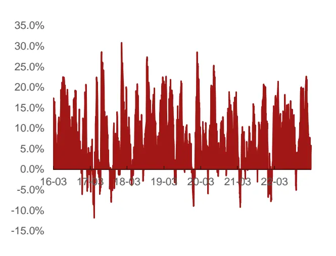
资料来源：招商证券

图 18：分组年化基准对冲收益（20160401-20230401，MLP）
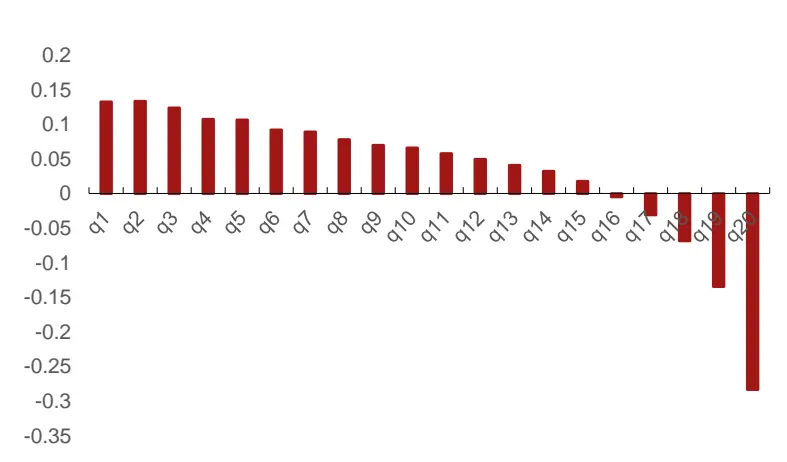
资料来源：招商证券

从结果来看，基于 MLP构建的非线性 Alpha模型，在过去 7年平均 RankIC为 9.27%，ICIR（未年化）为 1.24，相比于线性网络，平均 RankIC 略有下降，ICIR 有一定的提高，多空夏普以及多空最大回撤显著改善，说明合成因子的稳定性显著提高。另一方面从基准对冲的年化收益来看，多头年化收益率提高约 1.9%。分组收益率的单调性有所提升。

表3：MLP模型与基准线性模型合成因子表现对比

|  | RankIC 均值 | ICIR | IC 胜率 | IC的t值 | 多空收益率 | 多空夏普 | 多空最大回撤 | 多头月均换手率 |
| --- | --- | --- | --- | --- | --- | --- | --- | --- |
| 基准线性模型 | 10.43% | 4.09 | 87.29% | 47.52 | 52.90% | 3.97 | -15.14% | 70.20% |
| MLP 模型 | 9.27% | 4.40 | 87.94% | 51.29 | 56.34% | 4.92 | -7.76% | 72.60% |

资料来源：招商证券

MLP多头等权策略历史表现如下：

图 19：非线性 Alpha模型多头等权策略历史表现（MLP+MSE损失）
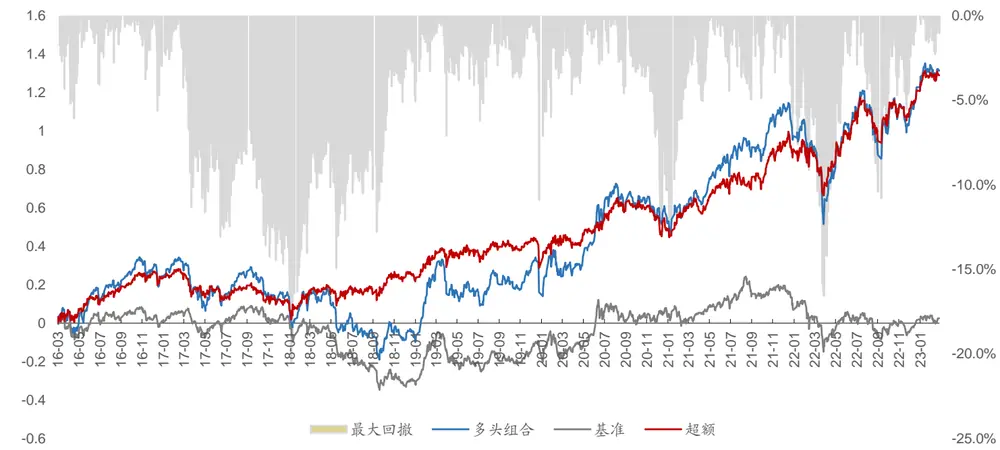
资料来源：Wind、招商证券
MLP多头等权策略与基准线性模型对比结果如下：

表4：MLP与基准线性模型多头等权策略表现对比

| 年份 | 组合 | 年化收益率 | 年化波动率 | 夏普率 |
| --- | --- | --- | --- | --- |
| 2016 | 线性模型 | 32.88% | 18.50% | 1.64 |
|  | MLP | 37.34% | 19.43% | 1.74 |
| 2017 | 线性模型 | -6.14% | 14.09% | -0.38 |
|  | MLP | -11.41% | 15.37% | -0.71 |
| 2018 | 线性模型 | 6.52% | 18.97% | 0.43 |
|  | MLP | 10.27% | 20.01% | 0.59 |
| 2019 | 线性模型 | 17.28% | 15.89% | 1.08 |
|  | MLP | 17.20% | 16.64% | 1.04 |
| 2020 | 线性模型 | 7.26% | 18.44% | 0.47 |
|  | MLP | 8.64% | 18.58% | 0.54 |
| 2021 | 线性模型 | 17.88% | 14.37% | 1.22 |
|  | MLP | 25.71% | 14.91% | 1.61 |
| 2022 | 线性模型 | 2.91% | 18.06% |  |
|  | MLP | 9.00% | 18.82% | 0.25 0.55 |

资料来源：招商证券

## 2.3.因子正交化正则

在传统因子模型中，在合成大类因子的过程中，通常我们会判断细分因子之间相关性，并根据 IC 值和相关性剔除相关性较高的因子。或者对现有的因子进行线性回归取残差作为新的因子。

$$
\beta_{2,t}=a_{t}^{\mathrm{~*~}}\beta_{1,t}+b_{t}^{\mathrm{~+~}}\epsilon_{t}
$$

通过共线性分析、取残差等手段提升大类因子的 IC表现。对大类因子进行 zscore合成的时候，解释变量之间的相关性会影响权重的稳定性，进而降低模型的性能。另一方面。在给定解释变量个数的前提下。解释变量之间的相关性越低。模型性能越好。

$$
\widehat{\mathbf{\theta}}=(\mathbf{X}^{\mathbf{T}}\mathbf{X})^{-1}\mathbf{X}^{\mathbf{T}}\mathbf{Y}
$$

在广义线性回归中， $\mathbf{X^{\mathrm{{T}}}X}$ 可以看作样本的协方差矩阵（假设样本已经去均值），当样本特征之间具有较高的相关性时， $\mathbf{X^{\mathrm{{T}}}X}$ 不不能列满秩。且标准误 $\mathbf{se}\mathbf{\hat{\theta}}^{*}$ 增大。

在传统线性模型中，我们一般通过 LASSO回归、岭回归等方法来减少变量的共线性。在 MLP因子网络中，从原始因子合成大类因子的过程，我们更希望得到相关性更低的大类因子。因此，可以考虑通过增加正则项的方式来降低最终学习到的大类因子的相关性。

对因子相关性的惩罚可以通过惩罚 $\mathbf{X^{\mathrm{{T}}}X}$ 的范数来实现，通常可以直接惩罚 $\mathbf{X^{\mathrm{{T}}}X}$ 的 Frobenius 范数：

$$
L(\theta)=\left\|\mathbf{X}^{\mathbf{T}}\mathbf{X}\right\|_{\mathrm{F}}
$$

但这样做存在一个问题，由于 $\mathbf{X^{\mathrm{{T}}}X}$ 的对角元素为因子的方差，直接惩罚设置 $\mathbf{X^{\mathrm{{T}}}X}$ 的 F 范数会共同惩罚每个因子的方差和因子之间的协方差，因此，这里优化目标为 $\mathbf{X^{\mathrm{{T}}}X}$ 的非对角元素为0，即只惩罚因子之间的协方差：

$$
L(\theta)=\left\|\mathbf{X}^{\mathbf{T}}\mathbf{X}-\mathrm{diag}(\mathbf{X}^{\mathbf{T}}\mathbf{X})\right\|_{\mathrm{F}}
$$

最终的目标函数为： $\boldsymbol{LOSS}=\boldsymbol{MSE}+\lambda^{*}\boldsymbol{L}(\boldsymbol{\theta})$ ， 为惩罚系数。

图 20：加入正交惩罚的 MLP因子网络
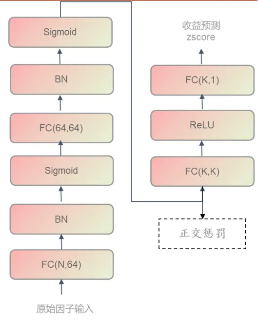
资料来源：招商证券

图 21：正则化 MLP的 zscore分组对冲基准年化收益
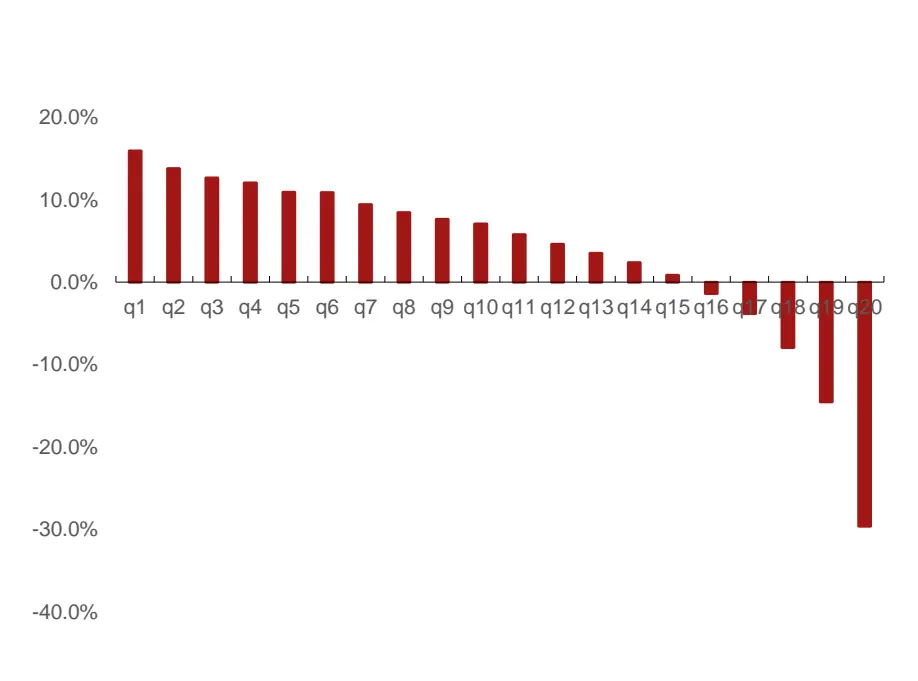
资料来源：招商证券

按照上述训练步骤可以得到合成 zscore的表现如下：

图 22：非线性 Alpha 模型 RankIC 走势图（MLP+正交惩罚+MSE 损失）
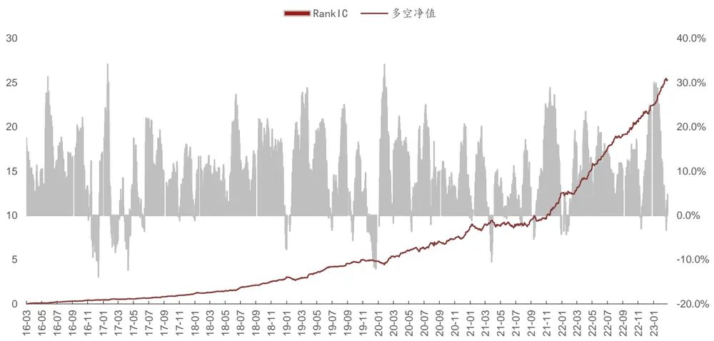
资料来源：招商证券

表5：加入正交惩罚项后合成zscore的表现对比

|  | RankIC 均值 | 年化ICIR | IC 胜率 | IC的t值 | 多空年化收益率 | 多空夏普 | 多空最大回撤 | 多头月均换手率 |
| --- | --- | --- | --- | --- | --- | --- | --- | --- |
| MLP 模型 | 9.27% | 4.40 | 87.94% | 51.29 | 56.34% | 4.92 | -7.76% | 72.60% |
| MLP+正交惩罚 | 10.07% | 4.33 | 88.60% | 50.3 | 62.39% | 4.95 | -9.50% | 68.50% |

资料来源：招商证券

加入正交惩罚后，合成 zscore 的 RankIC 表现小幅提升。但多头对冲基准的年化收益率从 13.25%提高到15.91%，多头收益率对RankIC的贡献提升。

## 2.4.优化目标的改进

损失函数是神经网络的重要设计，在因子模型的场景下，常用的损失函数如下：

1) MSE 损失函数：

$$
MSE=\left\|\mathbf{y}-\mathbf{y}\right\|_{2}
$$

2) Pearson 相关系数，IC（可以看作为余弦相似度）：

$$
IC(y,{\hat{y}})={\frac{\displaystyle\sum_{i=1}^{n}\left(y_{i}-{\overline{{y}}}\right)\left({\hat{y}}_{i}-{\overline{{{\hat{y}}}}}\right)}{\sqrt{\displaystyle\sum_{i=1}^{n}\left(y_{i}-{\overline{{y}}}\right)^{2}}\sqrt{\displaystyle\sum_{i=1}^{n}\left({\hat{y}}_{l}-{\overline{{{\hat{y}}}}}\right)^{2}}}}
$$

3) 改进的 CCC损失函数，用于改进 Pearson相关系数的凸性：

$$
CCC=\frac{2\sigma_{_{\mathrm{y}y}}}{MSE+2\sigma_{_{yy}}}
$$

其中 $\sigma_{_{yy}}$ 为 Pearson 相关系数。在因子模型的场景下，我们通常希望模型的样本外 IC 能够尽可能高，直接的想法是使用 Pearson 相关系数作为损失函数。但 Pearson 相关系数非凸的特性可能会导致收敛困难，因此在实际过程中，参照线性回归中：

$$
SSR=\sum_{i=1}^{n}{\left({\hat{y}}_{i}-{\overline{{y}}}\right)^{2}}
$$

$$
SS\mathrm{E}=\sum_{i=1}^{n}\Bigl(y_{i}-y_{\mathrm{i}}\Bigr)^{2}
$$

$$
R^{2}=\frac{\mathrm{SSR}-\mathrm{SS}E}{\mathrm{SS}T}=\rho_{\mathrm{~}yy}^{2}
$$

可以知道在线性模型中，优化 MSE 损失与优化 IC 基本等价，因此通常使用 MSE 损失函数作为 IC 的近似目标，在深度网络模型训练收敛和参数估计受到样本和优化算法以及随机初始化的影响。两者可能有所区别。CCC 损失则是结合了 IC和MSE损失函数。本文在实验中测试了三种不同的损失函数对模型结果的影响。

图 23：MLP网络不同损失函数分组对冲基准年化收益率（正则化）
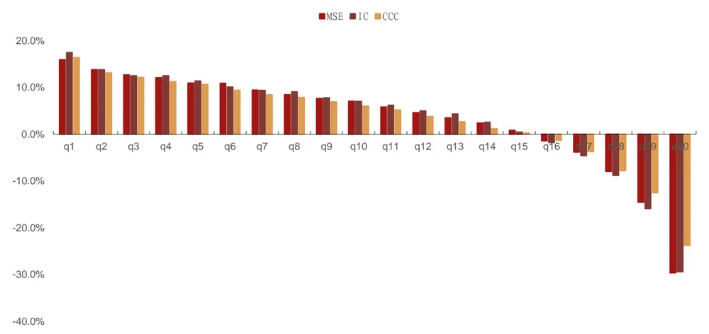
资料来源：招商证券

可以看出 IC损失函数的多头收益表现最好，其次是 CCC损失函数。CCC损失函数的空头收益率显著低于前两者。但多头收益率表现超过 MSE 损失函数。从多空夏普和多空最大回撤的表现来看，CCC 损失函数的稳定性最好。

表6：不同模型合成 zscore表现对比

|  | RankIC 均值 | 年化 ICIR | IC 胜率 | IC的t值 | 多空年化收益率 | 多空夏普 | 多空最大回撤 | 多头月均换手率 |
| --- | --- | --- | --- | --- | --- | --- | --- | --- |
| 基准线性模型 | 10.43% | 4.09 | 87.29% | 47.52 | 52.90% | 3.97 | -15.14% | 70.20% |
| MLP 模型 | 9.27% | 4.40 | 87.94% | 51.29 | 56.34% | 4.92 | -7.76% | 72.60% |
| MLP+正交+MSE | 10.07% | 4.33 | 88.60% | 50.30 | 62.39% | 4.95 | -9.50% | 68.50% |
| MLP+正交+IC | 11.02% | 4.57 | 89.90% | 53.30 | 63.49% | 4.48 | -12.49% | 68.60% |
| MLP+正交+CCC | 9.11% | 4.49 | 91.60% | 52.20 | 51.38% | 5.26 | -6.60% | 65.00% |

资料来源：招商证券

图 24：不同模型的多空净值历史表现（20160401-20230401）
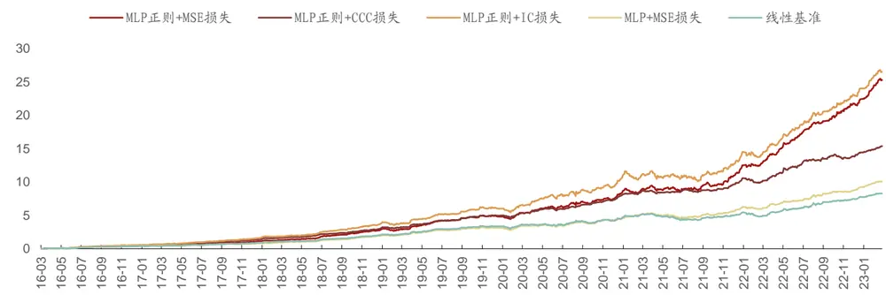
资料来源：Wind、招商证券

图 25：不同模型多头等权组合历史表现（20160401-20230401）
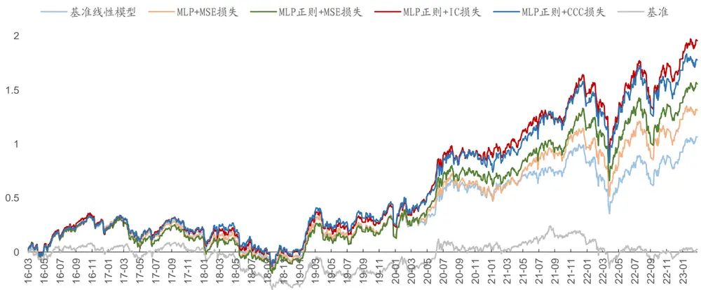
资料来源：Wind、招商证券

结合多头对冲基准的历史走势，可以看出传统 Alpha 模型中代表单因子表现的 RankIC 均值、多空年化收益率在多头选股的场景下存在表现错配的现象。例如 MLP 正则+CCC 损失的多空收益率表现远不如 MLP 正则+MSE损失模型，但多头组合的表现却好于后者基于CCC损失函数模型的表现。

## 2.5.模型分析

相比于线性模型，神经网络的可解释性并不直观。但在实际投资策略的构建过程中，往往需要对因子对策略的贡献进行归因。在非线性模型中，可以使用方差筛选、卡方检验、互信息等方法；在树模型中可以使用离根节点的远近来判断特征的相对重要性。但神经网络的特征重要性分析相对复杂。近年来，学术界也在不断探讨深度神经网络这类模型的可解释性。Shapley 方法是其中比较经典的方法，最早由 UCLA 的教授 LIoyd Shapley提出，主要用于解决合作博弈论中的分配均衡问题。在机器学习模型的可解释性方法中，SHAP 使用了类似的算法来判断模型中输入特征对结果的贡献。SHAP值衡量了特征对实际预测值与平均预测值之差的贡献。

图 26：特征重要性示意图（SHAP归因）
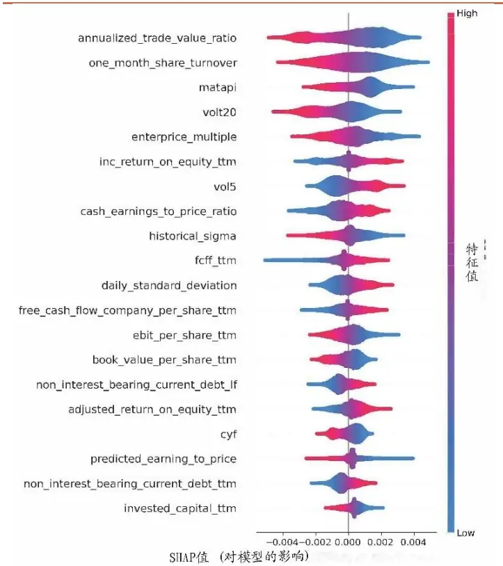
资料来源：招商证券，20220930-20230331

图 27：特征对模型输出的平均影响（SHAP归因）
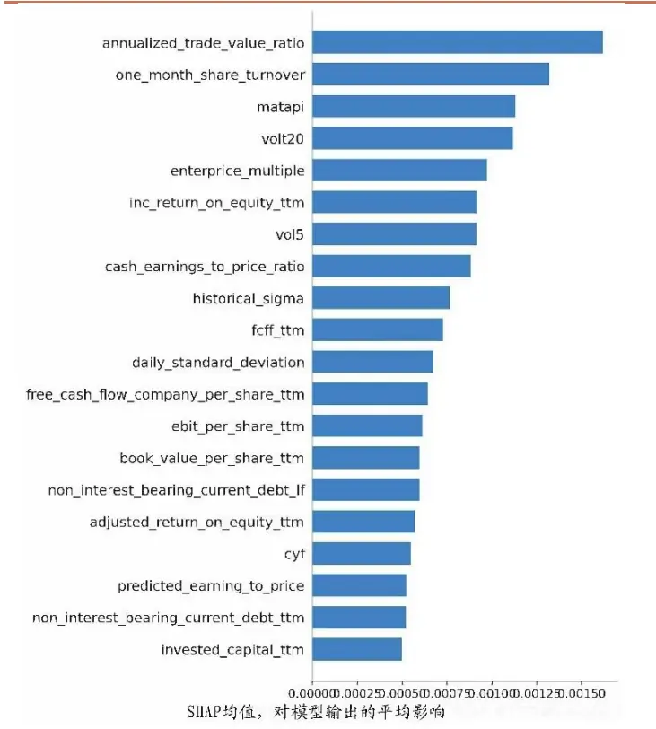
资料来源：招商证券，20220930-20230331

在对模型最近半年的输出进行 归因后，发现流动性大类的因子对预测值的贡献相对较高，包括年化交易量比率、过去一个月的换手率等；量价指标的贡献整体要比基本面指标的贡献高；在常见风格因子上有一定的暴露。从模型输出的 zscore 与常见风格因子的平均截面相关系数也可以看出过去一段时间，模型输出与流动性因子、残差波动率的线性相关性较高。其次是价值和动量因子。此外在其他风格因子上没有呈现出明显的相关性。

表 7：模型 zscore 与常见风格因子的平均截面相关性（20160401-20230401）

|  | 流动性 杠杆 价值 反转 成长 动量 市值 |  |  |  |  |  |  | beta 残差波动率 |  |
| --- | --- | --- | --- | --- | --- | --- | --- | --- | --- |
| 流动性杠杆价值反转成长动量市值beta残差波动率 | 1 | -0.15 | -0.28 | 0.08 | -0.04 | 0.16 | -0.34 | 0.35 | 0.59 |
|  | -0.15 | 1 | 0.45 | 0.08 | -0.05 | -0.05 | 0.22 | -0.17 | -0.13 |
|  | -0.28 | 0.45 | 1 | 0.16 | -0.1 | -0.21 | 0.15 | -0.17 | -0.37 |
|  | 0.08 | 0.08 | 0.16 | 1 | -0.25 | -0.1 | -0.34 | -0.09 | 0.01 |
|  | -0.04 | -0.05 | -0.1 | -0.25 | 1 | 0.14 | 0.13 | 0.11 | 0.04 |
|  | 0.16 | -0.05 | -0.21 | -0.1 | 0.14 | 1 | 0.29 | 0 | 0.26 |
|  | -0.34 | 0.22 | 0.15 | -0.34 | 0.13 | 0.29 | 1 | -0.05 | -0.1 |
|  | 0.35 | -0.17 | -0.17 | -0.09 | 0.11 | 0 | -0.05 | 1 | 0.22 |
|  | 0.59 | -0.13 | -0.37 | 0.01 | 0.04 | 0.26 | -0.1 | 0.22 | 1 |
| zscore | -0.46 | 0.06 | 0.2 | -0.03 | 0.01 | -0.12 | -0.02 | -0.02 | -0.43 |

资料来源：招商证券

## 2.5.在不同成分股中的选股效果

这里以 MLP+正交惩罚+CCC 损失函数作为示例，来检验模型在不同的成分股中的选股效果。股票池分别为中证500、中证 1000。从对冲基准的年化收益率来看，中证 1000的表现最好，多头为 14.18%与全 A的表现较为接近。其次是中证 500，多头收益率为9.02%，中证800成分股中表现显著下降为4.93%。

图 28：模型在不同成分股中的对冲基准年化收益率（20160401-20230401）
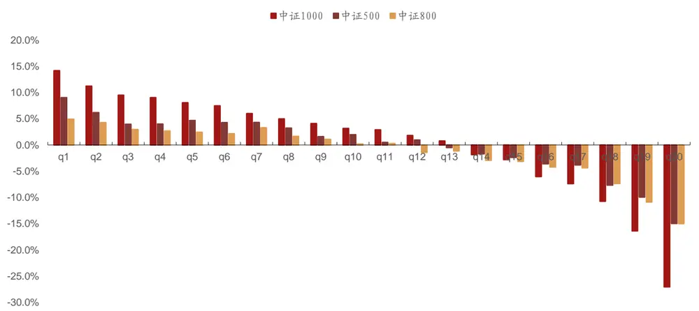
资料来源：Wind、招商证券

表8：模型在不同成分股中选股的表现

|  | RankIC 均值 | 年化ICIR | IC 胜率 | IC 的t值 | 多空年化收益率 | 多空夏普 | 多空最大回撤 | 多头月均换手率 |
| --- | --- | --- | --- | --- | --- | --- | --- | --- |
| 中证 1000 | 10.27% | 3.52 | 85.24% | 40.90 | 54.95% | 3.65 | -28.21% | 69.20% |
| 中证500 | 7.32% | 2.39 | 73.12% | 27.78 | 22.34% | 1.69 | -27.45% | 66.40% |
| 中证800 | 6.27% | 2.28 | 74.76% | 26.48 | 26.81% | 1.82 | -21.38% | 66.30% |

资料来源：招商证券

## 三、总结

本文基于传统的线性因子模型，提出了动态训练的 MLP 模型。在传统线性模型中引入非线性。从与基准的对比来看，MLP 模型与 L2 正则的线性模型 RankIC 并无明显提升。但因子多空收益率，多空夏普均有明显提升。从多头对冲基准的年化收益率来看。提升的主要贡献是多头收益率的提高。

借鉴传统因子模型细分因子到大类因子的合成过程，本文尝试在合成因子的神经网络层加入对因子相关性的惩罚。以提高合成 zscore 的稳定性。从结果来看，加入正则惩罚后，合成因子的平均 RankIC 略有提高，但多头对冲基准的年化收益率显著提高。

最后本文测试了使用不同的损失函数 MSE、IC、CCC 对模型结果的影响，其中 IC 损失函数模型的因子多空表现和多头年化收益率的表现最好。CCC损失函数的平均 RankIC在所有模型表现最差。但多头收益率只比 IC损失函数略差。这一现象显著体现了 IC 这单一指标并不能在多头选股的场景下有正确的表现评估。需要结合因子的多空夏普、多空最大回撤等稳定性指标并结合多头组合的表现来判断因子的多头选股能力。从模型对比表现可以看出在传统线性模型中引入非线性后，模型的 IC 指标并无明显提升。但因子多头组合以及因子的稳定性均有了明显提升。

模型的输入原始也同样重要，本文所用的因子集合，量价指标占比相对较高。量价因子的空头端表现普遍好于多头端。较高比例的量价因子显然会拖累模型的整体表现。

## 参考文献：

1．Gu, S., Kelly, B., & Xiu, D. (2021). Autoencoder asset pricing models. Journal of Econometrics, 222(1), 429-450.

2．LeCun, Yann, Yoshua Bengio, and Geoffrey Hinton. "Deep learning."nature 521.7553 (2015): 436-444.

3．Jason Brownlee, How to Configure the Number of Layers and Nodes in a Neural Network.

4．Kelly, Bryan, Seth Pruitt, and Yinan Su, 2019, Characteristics are covariances: A unified model of risk and return, Journal of Financial Economics, forthcoming.

5．Liao J J Z, Lewis J W. A note on concordance correlation coefficient[J]. PDA journal of pharmaceutical science and technology, 2000, 54(1): 23-26.

## 附录：本文所使用的部分因子说明

表 9：因子说明表

| 因子类别 | 说明 | 方向 | 因子计算方法 |
| --- | --- | --- | --- |
|  | bp_If | 正 | 市净率PB_LF的倒数，pe_ratio_If |
| 估值 | ep_ttm | 正 | 市盈率 PE_TTM 的倒数，ep_ratio_ttm |
|  | sp_ttm | 正 | 市销率 PS_TTM 的倒数，sp_ratio_ttm |
|  | dividend_yield_ttm | 正 | 最新四个季度的季报的股利之和/公司当前股票总市值，dividend_per_share/close |
|  | enterprice_multiple | 正 | EBITDA/EV，企业价值倍数的倒数，EV=市值+总负债-总现金=市值+净负债 |
|  | book_value_per_share_ttm | 正 | 每股净资产ttm=归属母公司股东权益合计ttm/总股本 |
|  | ebitda_ttm | 正 | EBITDA=EBIT(息税前利润)+折旧费用+摊销费用 |
| 市值 | Incap | 负 | In(总市值)，总市值 = 总股本*A 股未复权收盘价 |
|  | return_on_equity_ttm | 正 | 净资产收益率 ttm=归属母公司净利 ttm*2/(归属母公司股东权益合计 ttm+上期报表披露归属母公司股 东权益合计ttm) |
|  | return_on_asset_ttm | 正 | 总资产报酬率ttm=息税前利润 ttm/总资产ttm |
| 成长 | return_on_asset_net_prof it_ttm | 正 | 总资产净利率ttm=净利润 ttm/总资产ttm |
|  | return_on_equity_diluted _ttm | 正 | 摊薄净资产收益率ttm=归属母公司净利润ttm/归属母公司股东权益合计ttm |
|  | inc_return_on_equity_ttm | 正 | 净资产收益率(摊薄)同比增长率ttm=摊薄净资产收益率ttm/去年摊薄净资产收益率ttm-1 |
|  | return_on_invested_capit al_ttm | 正 | 净利润 ttm+财务费用 ttm/(资产总计 ttm-流动负债ttm+应付票据 ttm+短期借款ttm+年内到期的非流动 负债ttm) |
|  | adjusted_return_on_equit y_diluted_ttm | 正 ttm | 摊薄净资产收益率_扣除ttm=扣除非经常性损益后归属母公司的净利润ttm/归属母公司的股东权益合计 |
|  | adjusted_return_on_equit y_ttm | 正 | 母公司净利润ttm*2/(归属母公司股东权益合计ttm+上期报表披露的归属母公司股东权益合计ttm) |
|  | ebit_ttm | 正 | EBIT=经营利润+投资收益+营业外收入-营业外支出+以前年度损益/=净利润+所得税+利息；公司价值 |
|  | income_from_main_operati | 正 | 主营业务利润 ttm=营业收入 ttm-营业成本 ttm-营业税金及附加ttm |
| 经营 | operating_total_revenue_ per_share_ttm | 正 | 每股营业总收入ttm=营业总收入ttm/总股本 |
|  | operating_revenue_per_sh are_ttm | 正 | 每股营业收入ttm=营业收入ttm/总股本 |
|  | diluted_earnings_per_sha | 正 | 摊薄每股收益ttm=归属母公司净利润ttm/该报告期末普通股总股本 |
|  | re_ttm expense_to_revenue_ttm | 负 | 经营成本率ttm=营业总成本 ttm/营业总收入 ttm |
|  | profit_from_operation_to _revenue_ttm | 正 | 营业利润率 ttm=营业利润 ttm/营业总收入 ttm |
|  | ebit_per_share_ttm | 正 | 每股息税前利润 ttm=息税前利润 ttm/总股本 |
|  | adjusted_fully_diluted_e arnings_per_share_ttm | 正 | 稀释每股收益_扣除ttm=扣除非经常损益的净利润 ttm/稀释普通股ttm |
|  | adjusted_earnings_per_sh | 正 | 基本每股收益_扣除ttm=扣除非经常性损益的净利润ttm/普通股加权股本ttm |
| 现金流 | are_ttm operating_cash_flow_per_ |  | 每股经营现金流 ttm=经营活动产生的现金流量净额ttm/总股本 |
|  | fcff_ttm | 正 | 企业自由现金流量 ttm |
|  | free_cash_flow_equity_pe | 正 正 | 每股股东自由现金流 ttm=股东自由现金流量 ttm/总股本 |
|  | r_share_ttm free_cash_flow_company_p |  |  |
|  | er_share_ttm ocf_to_current_ratio_ttm | 正 | 每股企业自由现金流ttm=企业自由现金流量ttm/总股本 |
|  | ocf_to_debt_ttm | 正 正 | 连续四季度经营活动产生的现金流量净额ttm/流动负债ttm 经营活动产生的现金流量净额ttm/负债合计ttm |
|  | undistributed_profit_per | 正 | 每股未分配利润ttm=企业当期未分配利润总额ttm/总股本 |
|  | _share_ttm |  | 现金流量比率ttm=未扣除利息所得税折旧和摊销前的盈余ttm/年利息支出ttm |
|  | cash_flow_ratio_ttm tangible_asset_per_share | 正 正 | 每股有形资产If=（资产总计 mrq-无形资产mrq-商誉mrq/总股本 |
|  | _If earned_reserve_per_share | 正 | 每股盈余公积金If=盈余公积金mrq/总股本 |
|  | _If cash_equivalent_per_shar | 正 | 每股货币资金余额If=货币资金余额mrq/总股本 |
| 财务 | e_lf invested_capital_lf | 正 | 全部投入资本If=归属于母公司所有者权益合计mrq+带息债务If |
| 流动性 | non_interest_bearing_cur rent_debt_lf | 正 | 应付帐款mrq+预收帐款mrq+应付职工薪酬 mrq+应交税费mrq+其他应付款 mrq+预提费用 mrq+递 延收益 mrq+其他流动负债 mrq |
|  | retained_earnings_If | 正 | 留存收益If=盈余公积金mrq+未分配利润mrq |
|  | retained_earnings_per_sh are_ttm | 正 | 每股留存收益ttm=留存收益ttm/总股本 |
|  | one_month_share_turnover | 负 | 1个月换手率 |
|  | three_months_share_turno | 负 | 3个月换手率 |
|  | twelve_months_share_turn | 负 | 12个月换手率 |
|  | annualized_trade_value_r atio | 负 | 年化交易量比率 |
|  | historical_sigma | 负 | 在计算BETA所进行的时间序列回归中，取回归残差收益率的波动率 |
| 风格 | daily_standard_deviation | 负 | 日收益率在过去252个交易日的波动率，半衰期42个交易日 |
|  | historical_alpha | 负 | 股票收益率对沪深300收益率进行时间序列回归，回归时间窗口为252个交易日，半衰期63个交易 日 |
|  | relative_strength | 负 | (1)计算非滞后的相对强度：对股票的对数收益率进行半衰指数加权求和，时间窗口252个交易日， 半衰期126个交易日 （2）以11个交易日为时间窗口，滞后11个交易日，取非滞后相对强度的等 |
|  | variation_in_earnings | 负 | 权平均值 盈利波动率 |
|  | CYF | 负 | CYF=100- 100/(1+EMA(HSL，N))，HSL为换手率 |
| 技术 | AR | 负 | 人气意愿指标，AR=SUM(HIGH - OPEN，M1)/SUM(OPEN- LOW，M1)*100，M1=26 |
|  | TAPI | 负 | 加权指数成交值，API=AMOUNT/CLOSE，AMOUNT代表成交额 |
|  | BIAS20 |  |  |
|  | ROC | 负 | 乖离率，(CLOSE-MA(CLOSE，L1))/MA(CLOSE，L1)*100，L1=20 |
|  |  | 负 | 变形率指标，ROC=100*(CLOSE-REF(CLOSE，N))/REF(CLOSE，N) |
|  | DPO | 负 | 区间震荡线，DPO=CLOSE-REF(MA(CLOSE，M1)，M2)，M1=20，M2=10 |
|  | MTM | 负 | 动量线，MTM=CLOSE-REF(CLOSE，N)，N=14 |
|  | CR TRIX | 负 | CR=SUM(MAX(O,HIGH-MID),N)/SUM(MAX, (O, MID-LOW),N)*10O; MID=REF (HIGH+LOW, 1)/2 三重指数移动平均，TRIX=(TR-REF(TR，1))/REF(TR，1)*100；TR=EMA(EMA(EMA(CLOSE，M1)，M1)，M1) |
|  | MACD_DIFF | 负 |  |
|  | VOLT20 | 负 正 | MACD_DIFF=EMA (CLOSE, SHORT)-EMA(CLOSE, LONG), SHORT=12, LONG=26 20日收盘价的标准差 |

资料来源：招商证券

## 分析师承诺

负责本研究报告的每一位证券分析师，在此申明，本报告清晰、准确地反映了分析师本人的研究观点。本人薪酬的任何部分过去不曾与、现在不与，未来也将不会与本报告中的具体推荐或观点直接或间接相关。

## 评级说明

报告中所涉及的投资评级采用相对评级体系，基于报告发布日后 6-12 个月内公司股价（或行业指数）相对同期当地市场基准指数的市场表现预期。其中，A股市场以沪深 300指数为基准；香港市场以恒生指数为基准；美国市场以标普 500指数为基准。具体标准如下：

## 股票评级

强烈推荐：预期公司股价涨幅超越基准指数 20%以上

增持：预期公司股价涨幅超越基准指数 5-20%之间

中性：预期公司股价变动幅度相对基准指数介于±5%之间

减持：预期公司股价表现弱于基准指数 5%以上

## 行业评级

推荐：行业基本面向好，预期行业指数超越基准指数

中性：行业基本面稳定，预期行业指数跟随基准指数

回避：行业基本面转弱，预期行业指数弱于基准指数

## 重要声明

本报告由招商证券股份有限公司（以下简称“本公司”）编制。本公司具有中国证监会许可的证券投资咨询业务资格。本报告基于合法取得的信息，但本公司对这些信息的准确性和完整性不作任何保证。本报告所包含的分析基于各种假设，不同假设可能导致分析结果出现重大不同。报告中的内容和意见仅供参考，并不构成对所述证券买卖的出价，在任何情况下，本报告中的信息或所表述的意见并不构成对任何人的投资建议。除法律或规则规定必须承担的责任外，本公司及其雇员不对使用本报告及其内容所引发的任何直接或间接损失负任何责任。本公司或关联机构可能会持有报告中所提到的公司所发行的证券头寸并进行交易，还可能为这些公司提供或争取提供投资银行业务服务。客户应当考虑到本公司可能存在可能影响本报告客观性的利益冲突。

本报告版权归本公司所有。本公司保留所有权利。未经本公司事先书面许可，任何机构和个人均不得以任何形式翻版、复制、引用或转载，否则，本公司将保留随时追究其法律责任的权利。