# 多模型集成量价 Alpha策略

量化选股策略

## ——AI系列研究之二

随着各家机构量化因子库的不断完善，人工因子的挖掘逐渐遇到瓶颈。此外，因子拥挤度提升和策略同质化的现象导致传统因子多头收益率的降低。基于机器学习的非线性模型用于因子挖掘的算法逐渐受到重视。本文将基于量价数据和不同的模型探讨机器学习生成 Alpha因子的表现。

❑ 本文基于截面模型 MLP、GBDT 和时序模型 GRU 构建因子生成模型。在引入截面特征序列后截面模型与时序模型的因子学习能力基本处于同一水平。

❑ 引入 Attention 机制后 GRU 生成的因子表现没有明显提高。可能是由于模型复杂度的提升，需要更多的样本数据和训练轮数来学习量价特征。

❑ 基于 GBDT 的截面模型因子，在全 A 成分股内，RankIC 为 10.66%，ICIR为 1.14（未年化），分 20 组的多头对冲年化收益率为 29.84%；基于 GRU的时序模型因子在全 A 成分股中，RankIC 为 11.3%，ICIR 达到 1.06（未年化），分 20 组的多头对冲年化收益率为 28.83%

❑ 模型集成后的得到得集成因子相比于单个模型得到的因子表现提升较为明显。集成因子与常见因子的相关性整体较低。集成因子相比于单个模型的因子 RankIC 提升到 11.9%，ICIR 达到 1.13（未年化），多头收益率提高到33.11%。

❑ 基于集成因子构建的 TOP100 策略的绝对收益表现良好，除 2018 年外，在单边换手率约束为 40%以上时，绝对年化收益率显著为正。

❑ 集成学习模型因子与常见风格因子整体相关性较低，在流动性和残差波动率风格上有一定的暴露。风格中性化后集成因子的多头收益率有所下降，但Alpha选股仍然显著。

❑ 沪深 300 周频指增策略年化超额收益率为 13.00%，信息比率为 4.13，年化跟踪误差为 3.15%

任 瞳S1090519080004

❑ 中证 1000 周频指增策略年化超额收益率为 20.13%，信息比率为 3.07，跟踪误差为 6.55%

❑ 中证 500 周频指增策略年化超额收益率为 14.14%，信息比率为 2.26，年化跟踪误差为 6.23%；

zhoujingming@cmschina.com.cn

rentong@cmschina.com.cn

周靖明S1090519080007

zhouyou4@cmschina.com.cn

周 游S1090523070015

❑ 风险提示：量化策略基于历史数据统计，模型存在失效的可能性。

## 一、时序神经网络与其他截面学习模型

## 1.1. 多层感知机 MLP

多层感知机 MLP 是最常用的神经网络组件之一。通常作为复杂神经网络的特征整合层。例如卷积神经网络CNN 及其衍生模型，MLP 通常出现在这些网络的输出端以整合隐含层学习到的特征。MLP 的结构较为简单，通常由多层全连接层和激活函数构成。模型的复杂度由隐含层层数和隐藏层神经元个数决定。

一个 2层MLP的数学模型可以表示为：

$$
\mathbf{H}=\sigma\Big(\mathbf{X}\mathbf{W}^{(1)}+\mathbf{b}^{(1)}\Big)
$$

$$
\mathbf{O}=\mathbf{H}\mathbf{W}^{(2)}+\mathbf{b}^{(2)}
$$

其中X为输入样本数据矩阵， 为权重矩阵， 为偏置向量。 为隐藏层输出， 为输出向量， $\sigma$ 为激活函数，通常为 ReLU、Sigmoid等非线性函数。

隐藏层与模型的拟合能力的简单经验关系：

1) 当隐藏层为0时，神经网络只能表示线性可分的函数

2) 当隐藏层为2时，可以表示任何一个有限空间到另一个有限空间的连续映射

3) 当隐藏层大于3时，额外的隐藏层可以学习复杂的特征描述（自动特征工程）

隐藏层神经元个数的经验设计公式：

$$
N_{h}=\frac{N_{s}}{\left(\alpha\cdot\left(N_{i}+N_{o}\right)\right)}
$$

其中 $N_{s}$ 为样本个数， $N_{i}$ 为输入神经元个数即特征维度， $N_{o}$ 为输出层神经元个数，•为 2 至 10 的固定常数。隐藏层层数和隐藏层神经元个数的选择通常是经验性的，在训练集训练模型的过程中，固定迭代次数，随着隐藏层数和隐藏层神经元个数增加，训练集 Loss无法显著下降，则停止增加模型复杂度。

图 1：多层感知机 MLP基础网络结构
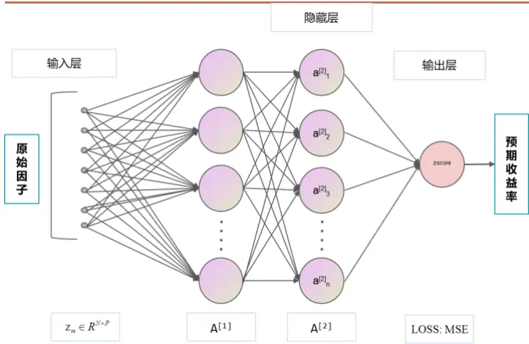
资料来源：招商证券

图 2：基于 MLP 的 Alpha 学习模型
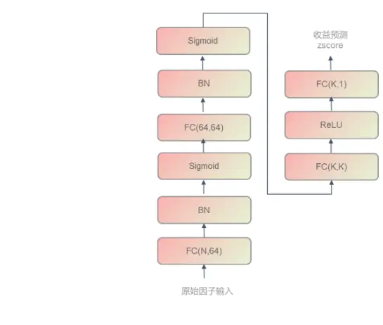
资料来源：招商证券

在确定隐藏层层数和隐藏层神经元个数后，模型的表达能力基本确定。为加快模型的收敛速度，通常会在激活函数之前加入 Batch Normal 层来防止隐藏层输入的方差变化过大导致收敛困难。在前期报告中，我们利用MLP 和常见基本面因子和量价因子构建了非线性 Alpha 模型相比于线性基准 Alpha 模型有显著的表现提升。证明了在Alpha模型中引入非线性确实有助于提升盈利模型的表现。

## 1.2. 梯度提升树 GBDT

梯度提升树在业务场景中也是非常重要的一类机器学习模型。一直以来，在各类数据分析大赛的高分方案中基本都能看到基于 GBDT 的模型的身影。相比于多层感知机 MLP 这类神经网络，梯度提升树 GBDT 的优点主要有：

1) 对样本特征维度的数量级不敏感

2) 更适合处理表格类型的数据

3) 模型的可解释性显著更高

4) 相同硬件资源下训练速度显著更快

因此在各类处理表格数据类型的数据分析场景中，梯度提升树总能获得不错的表现。

GBDT 结合了 Gradient Boosting 算法和树模型，训练过程和决策过程与神经网络存在明显的区别。其训练迭代过程可以表述为：

$$
\begin{array}{rl}&{f_{m}(x)=f_{m-1}(x)+T\bigl(x;\Theta_{m}\bigr)}\\&{\hat{\Theta}_{m}=\arg\operatorname*{min}_{\Theta_{m}}\underset{i=1}{\overset{N}{\sum}}L\bigl(y_{i},f_{m-1}\bigl(x_{i}\bigr)+T\bigl(x_{i};\Theta_{m}\bigr)\bigr)}\end{array}
$$

其中 $T\left(x;\Theta_{m}\right)$ 为第 m 个弱分类器，通常为 CART 决策树，在第 m 次迭代的过程中，通过经验风险最小化获得对决策树 的参数估计 $\hat{\Theta}_{m}$ 。在上述通用的 Boosting 框架下，Gradient Boosting 每次迭代拟合的目标为样本相对于原始目标的负梯度：

$$
f_{m}(x)=-\nabla_{f}L\Big|_{f=f_{m-1}}
$$

表 1：梯度下降 vs 梯度提升

| 方法 | 优化空间 | 迭代算法 | 损失函数 |
| --- | --- | --- | --- |
| 梯度下降 | 参数空间 | $\boldsymbol{w}=\boldsymbol{w}_{m-1}-\rho_{m}\nabla_{\boldsymbol{w}}L\big\|_{\boldsymbol{w}=\boldsymbol{w}_{m-1}}$ | $L=\sum l\left(y_{i},f\left(x_{i},w_{m}\right)\right)$ |
| 梯度提升 | 函数空间 | $f=f_{m-1}-\rho_{m}\nabla_{f}L\big\|_{f=f_{m-1}}$ | ${L=\sum l\left(y_{i},f_{m}\left(x_{i}\right)\right)}$ |

资料来源：招商证券

梯度提升（Gradient Boosting）和梯度下降（Gradient Descent）有异曲同工之妙，前者在参数空间 $R^{w}$ 迭代，后者在函数空间 $R^{F}$ 迭代。两者优化函数的 $f_{m}(x)$ 的方向均为损失函数的负梯度方向。

图 3：XGBoost单次迭代学习流程
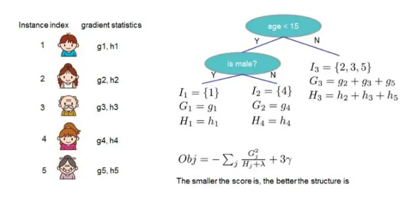
资料来源：招商证券、《XGBoost: A Scalable Tree BoostingSystem》

图 4：LightGBM 和 XGBoost 决策树的生长算法对比
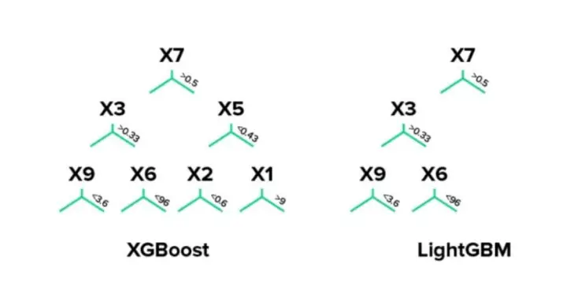
资料来源：招商证券

GBDT 的工程化实现主要包括：XGBoost、LightGBM 等，与原始的 GBDT 算法不同，XGBoost 和 LightGBM在单步迭代的过程使用了二阶导的信息比原始 GBDT 算法更快。此外，这些工程实现在 Feature Splitting、Leaf Growing、Missing Handling 和 Data Paralleling 都有不同形式的优化，可以参考相关文献，这里不再赘述。

MLP和 GBDT均为截面学习模型，在没有特征工程的前提下无法提取时序信息。在基于 MLP和 GBDT的因子生成算法中，通常将时序上所有时间点的样本看作同一分布的样本。忽略了时间序列的信息。

## 1.3. 时序神经网络 RNN

循环神经网络RNN通常也被称为时序神经网络，可以看作为多个时间截面的MLP通过时序状态H传递时序信息。单个时间步t的数学模型如下：

$$
\begin{array}{rl}&{\mathbf{H}_{t}=\phi(\mathbf{X}_{t}\mathbf{W}_{xh}+\mathbf{H}_{t-1}\mathbf{W}_{hh}+\mathbf{b}_{h}).}\\&{\mathbf{O}_{t}=\mathbf{H}_{t}\mathbf{W}_{hq}+\mathbf{b}_{q}.}\end{array}
$$

其中 分别为样本矩阵、权重矩阵和偏置。 $\phi$ 为激活函数，通常为 tanh，O 为输出。

图5：循环神经网络示意图
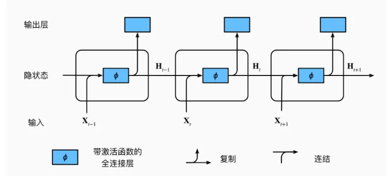
资料来源：招商证券、《Dive into Deep Learning》

随着RNN序列的增加，梯度消失和梯度爆炸的问题不可避免，这限制了其对长期依赖关系的建模能力。为了解决这个问题，提出了改进的 RNN模型，例如长短期记忆网络（LSTM）和门控循环单元（GRU），它们引入了门控机制来控制记忆状态的更新，改善了对长序列的建模能力。GRU相比于LSTM将门控机制中的“遗忘门”和“输入门”合并为一个“更新门”。研究（Chung et al., 2014）表明 GRU相比于 LSTM通常能够获得相同的模型性能但计算速度更快，因此本文中以 GRU作为时序神经网络的基础模型。

图 6：GRU 单元结构图
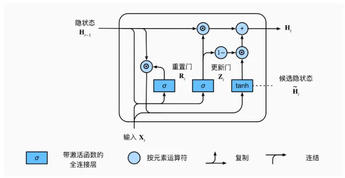
资料来源：招商证券、《Dive into Deep Learning》

图 7：LSTM 单元结构图
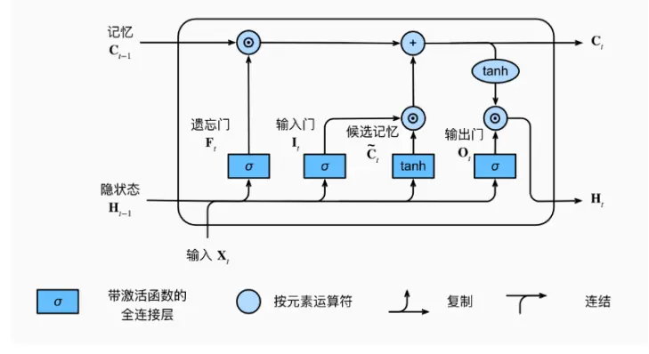
资料来源：招商证券、《Dive into Deep Learning》

GRU的单个时间步t的数学模型如下：

$$
\begin{array}{rl}&{\mathbf{R}_{t}=\sigma(\mathbf{X}_{t}\mathbf{W}_{xr}+\mathbf{H}_{t-1}\mathbf{W}_{hr}+\mathbf{b}_{r})}\\&{\mathbf{Z}_{t}=\sigma(\mathbf{X}_{t}\mathbf{W}_{xz}+\mathbf{H}_{t-1}\mathbf{W}_{hz}+\mathbf{b}_{z})}\\&{\mathbf{H}_{t}=\operatorname{tanh}(\mathbf{X}_{t}\mathbf{W}_{xh}+\left(\mathbf{R}_{t}\odot\mathbf{H}_{t-1}\right)\mathbf{W}_{hh}+\mathbf{b}_{h}),}\\&{\mathbf{H}_{t}=\mathbf{Z}_{t}\odot\mathbf{H}_{t-1}+(1-\mathbf{Z}_{t})\odot\mathbf{H}_{t}.}\end{array}
$$

其中 $\mathbf{R}_{t}$ 为重置门， $\mathbf{Z}_{t}$ 为更新门， 为Hadamard积，GRU一定程度地缓解了梯度爆炸和梯度消失的问题，提高了模型学习长序列的能力。MLP和GBDT为截面学习模型，而 RNN模型可以看作为引入了时序信息的MLP，理论上来说，RNN这类时序模型作为Alpha生成模型相比于截面模型能够有更好的表现。在下一个章节中，本文将以日线级别的量价数据作为数据集，进一步探究时序和截面模型在量价Alpha生成算法中的表现差异。

## 二、基于日线量价数据生成 Alpha

## 2.1. 数据集和模型设定说明

本章基于日线级别的量价数据来探讨不同模型的 Alpha学习能力。日线量价数据包括：OPEN、HIGH、LOW、、 、 六个字段。数据集从 年 月 日开始到 年 月 日。训练集股票池包括全 A 股票剔除上市不满三个月，ST、*ST 和停牌的股票。此外，MLP 和 GBDT 为截面模型，为了能够一定程度上学习历史信息对截面收益率的影响，本文增加了与 GRU 序列长度相同数量的量价特征即 PRICE(0)、PRICE(-1)…PRICE(-N+1)，成交量同理。

为了保证可交易性以及所学习到的因子换手率能够有一定的降低，这里采用次日间隔 10 天的 VWAP 价格收益率作为训练 label。因为最终实现的指数增强策略以周频调仓，过高的因子换手率会显著侵蚀策略的收益。同时为了与交易情景对应，batch 的定义为交易日截面的所有股票作为 batch，即训练的过程中，batch 大小随时间变化。分析因子分组收益率以及策略实现，均按周一为调仓日并持仓一周。其他固定设置如下：

表2：数据集相关固定参数说明

| 名称 | 参数说明 |
| --- | --- |
| 股票池 | 全A股票，剔除上市不满三个月、ST、*ST、停牌的股票 |
| 数据集 | 日线量价数据 |
| 预测 label | T+1 日至 T+11 日复权日内 VWAP 价格收益率 |
| 调仓周期 | 每周一按照上一个交易日的因子生成持仓信息 |
| 因子预处理 | 3 倍 MAD 截断，zscore 标准化，缺失值填充为 0 |
| Label 预处理 | Label 截面 zscore 标准化 |
| 对比基准 | 沪深 300、中证500、中证1000 |
| Batch 定义 数据划分 | 一个交易截面上所有的股票为一个batch |
|  | 20111001-20230801，滚动训练模式；在训练集中划分最后252个交易日作为验证集；测试集为最近2个 季度（每半年训练一次） |

资料来源：招商证券

不同时期市场风格的不同会显著影响 Alpha 的结构，为了最终学习到的 Alpha 能够适应最近区间的市场风格，这里采用滚动训练的方式。同时考虑到原始数据集长度的问题，训练前期训练集长度稍短，这里采用训练集随时间拓展的构建方式，即随着时间推移，训练集的长度不断增加，验证集和测试集的长度保持不变。同时为了防止信息泄露，剔除训练集、验证集、测试集相邻的 10天样本数据。

图 8：数据集划分说明
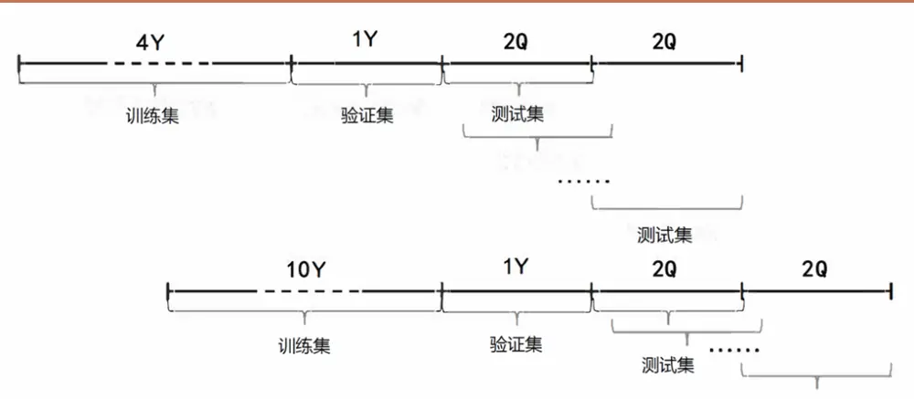
资料来源：招商证券

MLP的参数主要包括学习率、隐藏层、隐藏层神经元个数等，具体参数设置如表3所示。

表3：MLP量价因子模型参数说明

| 名称 | 参数说明 |
| --- | --- |
| 学习率 | 1e-3 |
| 隐藏层数 | 3 |
| 隐藏层神经元个数 | 128 |
| 丢弃率 | 0.05 |
| 最大轮数 | 1000 |
| 早停轮数 | 50 |
| Batch 大小 | 截面所有股票数 |
| 损失函数 | 均方误差 MSE |

资料来源：招商证券

GBDT 模型这里采用 LightGBM 作为基础模型。LightGBM 的参数如表 4 所示。

表4：GBDT量价因子模型参数说明

| 名称 | 参数说明 |
| --- | --- |
| 学习率 | 1e-2 |
| 最大树深 | 64 |
| 最大叶子数 | 512 |
| 叶子节点大小 | 512 |
| 列采样率 | 0.7 |
| 样本采样 | 0.7 |
| 早停轮数 | 50 |
| 损失函数 | 均方误差 MSE |

资料来源：招商证券

图 9：GRU量价因子模型结构图
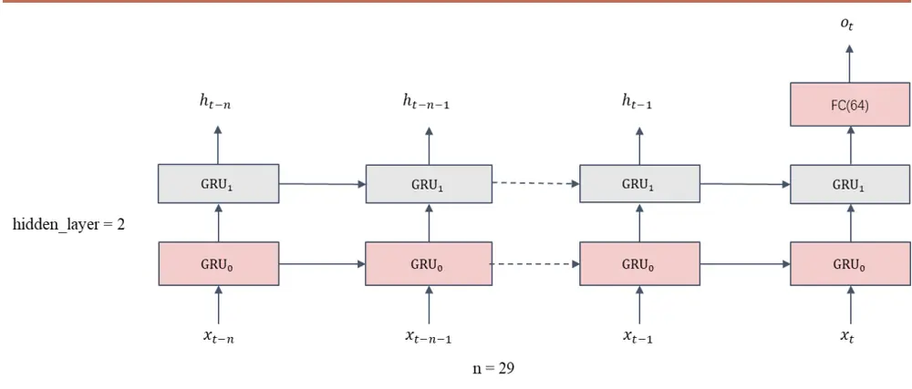
资料来源：招商证券

随着以 Transformer为基础的各类模型在 NLP 领域和众多其他领域大放异彩。Attention 机制已经在各类模型中广泛运用。因此，本文在GRU模型的基础上，增加基于序列隐藏状态的 Self Attention并与原始 GRU模型的输出特征拼接构建了 GRU with Attention 模型，以下简称 AGRU。

AGRU 相比于 GRU 增加了对隐藏层输出的 Attention 分数的计算，理论上来说可以带来增量的时序信息。将隐藏层输出得到的 Attention分数与 0期的GRU输出拼接到一起进入全连接层，最终得到输出。

图 10：AGRU量价因子模型结构图
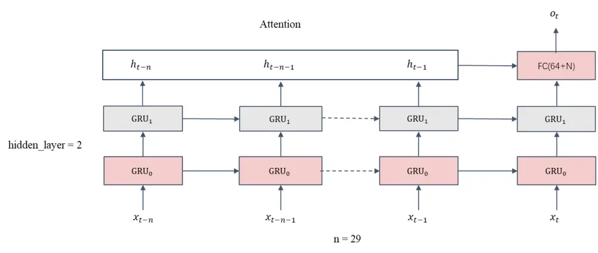
资料来源：招商证券

GRU类的模型的参数主要包括隐藏层层数、特征维度、序列长度等，具体设定如表 5所示。

表5：GRU&AGRU量价因子模型参数说明

| 名称 | 参数说明 |
| --- | --- |
| 学习率 | 1e-3（采用可变学习率） |
| 隐藏层数 | 2 |
| 特征维度 | 6 |
| 序列长度 | 30 |
| 丢弃率 | 0.1 |
| 最大轮数 | 200 |
| 早停轮数 | 20 |
| Batch 大小 | 截面所有股票数 |
| 损失函数 | 均方误差 MSE |

资料来源：招商证券

所有模型的数据集参数均按表 2 中的参数设置。由于模型训练的随机性，本文所有模型均选取不同的固定随机种子训练三次后，在测试集按照三个模型的输出取平均作为因子值。

## 2.2. 不同模型生成的 Alpha 表现分析

按照上一节中的数据集说明和模型参数，本文构建了 MLP、GBDT、GRU、AGRU 四个因子生成模型。本节将重点分析四个模型所生成的因子表现。单因子测试均按 5 日滚动调仓，且不考虑费率。回测期为 20170101 至20230801，收益率分组为 20组，多头组（TOP组）为 20组中的第 1组，空头组为 20组中的第 20组。IC胜率为周度 RankIC 大于 0 的比率。ICIR 为未年化的指标。多头收益率为绝对收益率、多头夏普为年化指标，多头平均换手率为单边换手率。

表6：全A成分股中不同模型的因子表现

|  | RankIC 均值 | ICIR | IC 胜率 | IC的t值 | 多头收益率 | 多头夏普 | 多头最大回撤 | 多头周均换手率 |
| --- | --- | --- | --- | --- | --- | --- | --- | --- |
| MLP | 10.60% | 1.06 | 86.67% | 42.14 | 28.49% | 1.51 | -25.61% | 76.60% |
| GBDT | 10.66% | 1.14 | 86.35% | 45.50 | 29.84% | 1.57 | -25.42% | 77.80% |
| AGRU | 10.67% | 0.99 | 84.40% | 39.64 | 26.67% | 1.43 | -17.53% | 73.50% |
| GRU | 11.27% | 1.06 | 88.74% | 42.78 | 28.83% | 1.48 | -21.22% | 73.00% |

资料来源：招商证券，回溯期：20170101-20230801，周频

图 11和图 12的对冲基准均为同时期中证全指指数。回测期为 2017年 1月至 2023年 7月。相对净值计算方式为：策略净值/基准净值-1。

图 11：不同模型分组对冲年化收益（全 A，20组）
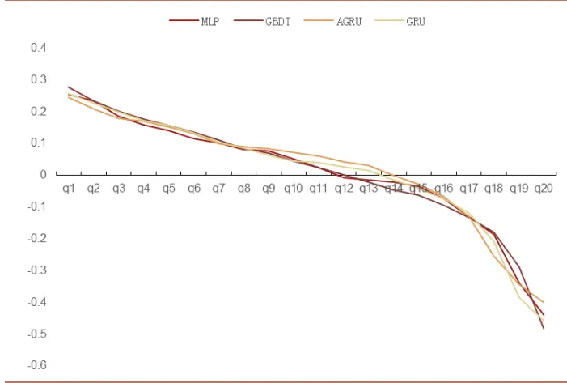
资料来源：招商证券

图 12：不同模型多头相对净值（全 A，20组）
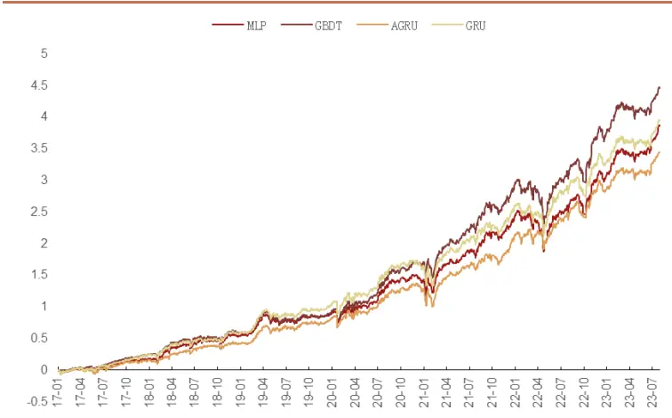
资料来源：招商证券

其他成分股，沪深 300、中证 500、中证 1000 的表现如表所示，分组数量为 10 组。收益率为年化绝对收益率，调仓周期为周频。

表7：其他成分股内因子表现

| 模型 | 沪深300 |  |  | 中证 500 |  |  | 中证1000 |  |  |
| --- | --- | --- | --- | --- | --- | --- | --- | --- | --- |
|  | RankIC | ICIR | 多头收益率 | RankIC | ICIR | 多头收益率 | RankIC | ICIR | 多头收益率 |
| MLP | 0.081 | 0.64 | 25.71% | 0.093 | 0.85 | 25.24% | 0.102 | 1.02 | 30.46% |
| GBDT | 0.083 | 0.74 | 26.84% | 0.092 | 0.93 | 26.79% | 0.102 | 1.05 | 34.46% |
| AGRU | 0.081 | 0.65 | 24.66% | 0.093 | 0.85 | 24.38% | 0.104 | 0.98 | 29.81% |
| GRU | 0.085 | 0.67 | 25.86% | 0.097 | 0.89 | 26.23% | 0.109 | 1.04 | 33.39% |

资料来源：招商证券

从测试的结果来看，GBDT 结合历史量价特征的收益率表现最好。GRU 模型的单因子 RankIC 的表现最好。各模型在不同的成分股内的因子的多头收益率都表现出较高的水平。说明机器学习量价因子模型在各个成分股的选股稳定性较高。

## 2.3. 模型相关性分析与模型集成

在上节中，本文基于日频量价数据构建了 MLP、GBDT、GRU、AGRU 四个因子学习模型并检验生成的 Alpha在全 A、沪深 300、中证 500、中证 1000 成分股内的表现。GBDT 模型在各个成分股内的收益率和 ICIR 都表现地最好，在全 A 内多头对冲年化收益率达到 29.8%，ICIR 达到 1.14；其次是 GRU 模型，GRU 模型的RankIC表现好于其他模型，在全 A成分股中的表现达到了 11.3%。

进一步，不同模型之间学习到的因子相关性同样值得关注。这里按照每日全 A 成分股内的因子值计算不同模型因子之间的平均相关性和滚动相关性。

图 13：不同模型因子的平均两两相关系数走势
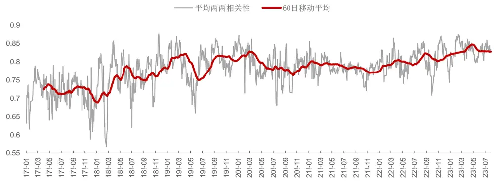
资料来源：招商证券

表8：不同模型间的平均截面相关系数

| MLP GBDT AGRU GRU |  |  |  |  |
| --- | --- | --- | --- | --- |
| MLP | 1.00 | 0.80 | 0.72 | 0.75 |
| GBDT | 0.80 | 1.00 | 0.73 | 0.75 |
| AGRU | 0.72 | 0.73 | 1.00 | 0.85 |
| GRU | 0.75 | 0.75 | 0.85 | 1.00 |

资料来源：招商证券

从平均相关系数来看 GBDT和 MLP同属一类截面模型，之间的因子相关性较高。AGRU和 GRU同属时序模型之间的相关性较高。MLP 模型和 AGRU 模型的相关最低。时序模型和截面模型之间的相关性低于同类型的模型因子。从两两模型之间的相关性来看，模型间的平均两两相关性有比较明显的上升趋势。

进一步，按照 Voting 的思路提高整个机器学习 Alpha 模型的稳定性和收益表现。这里 Voting 的策略按 ICIR 加权计分。ICIR的加权比例计算窗口为过去 60个交易日。集成因子的表现如下：

表9：不同成分股中的集成因子表现

|  | RankIC 均值 | ICIR | IC 胜率 | IC的t值 | 多头收益率 | 多头夏普 | 多头最大回撤 | 多头周均换手率 |
| --- | --- | --- | --- | --- | --- | --- | --- | --- |
| 沪深 300 | 8.92% | 0.71 | 76.22% | 28.32 | 28.20% | 1.80 | -17.83% | 64.60% |
| 中证500 | 10.12% | 0.92 | 83.20% | 36.76 | 27.68% | 1.74 | -14.47% | 65.10% |
| 中证1000 | 11.18% | 1.08 | 87.48% | 43.10 | 33.86% | 1.93 | -10.42% | 65.00% |
| 全A | 11.90% | 1.13 | 87.92% | 44.94 | 33.11% | 1.56 | -20.40% | 72.40% |

资料来源：招商证券，回溯期：20170101-20230801，周频

其中沪深 300、中证 500、中证 1000 的分组为 10 组，全 A 的分组为 20 组。从单因子分析的结果来看按照ICIR加权集成的多模型因子相比于单模型因子的 RankIC有一定的提高，在全 A成分股内从 GRU的 RankIC为11.27%提高到 11.90%，ICIR 与 GBDT 模型基本相同。多头年化收益率从 GBDT 的 29.84%提高到 33.11%。提高了 3.27%。多头最大回撤次于 AGRU模型好于其他模型。多头夏普与 GBDT基本一致。多头周均换手率好于所有单个模型。

图 14：RankIC走势及累计 IC（全 A，周频）
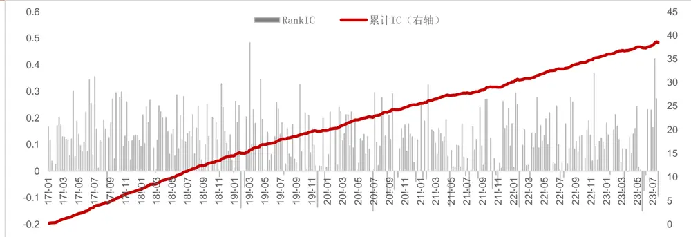
资料来源：招商证券

图 15：集成因子分组对冲年化收益（全 A，20组）
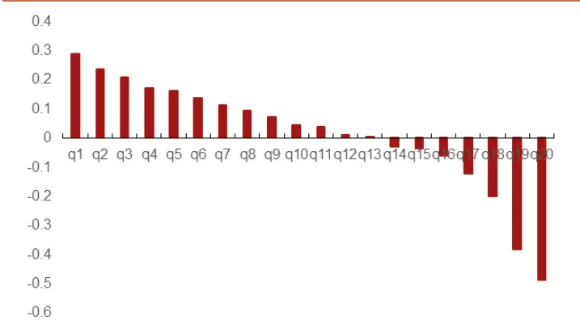
资料来源：招商证券

图 16：集成因子分组对冲净值（全 A，20组）
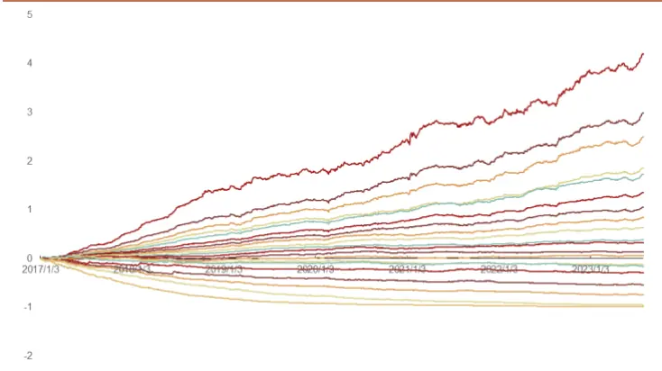
资料来源：招商证券

分组对冲收益率和对冲净值，对冲基准为中证全指。集成因子分 20 组的单调性优秀，20 组多头对冲净值超额收益明显。集成因子以量价为基础特征。为了分析集成因子与常见风格因子的相关性和 Alpha 属性，可以计算因子与常见风格因子的截面相关性，以及分析对常见风格因子中性化后的表现

表10：集成因子与常见风格因子的平均截面相关性

| 动量 beta 账面价值比 流动性 市值 残差波动率 杠杆 成长 |  |  |  |  |  |  |  |  |
| --- | --- | --- | --- | --- | --- | --- | --- | --- |
| 动量beta账面价值比流动性 | 1 | 0.06 | -0.21 | 0.17 | 0.31 | 0.28 | -0.03 | 0.09 |
|  | 0.06 | 1 | -0.22 | 0.41 | -0.06 | -0.02 | -0.13 | 0.05 |
|  | -0.21 | -0.22 | 1 | -0.32 | 0.12 | -0.34 | 0.49 | -0.06 |
|  | 0.17 | 0.41 | -0.32 | 1 | -0.35 | 0.51 | -0.16 | -0.03 |
| 市值残差波动率杠杆 | 0.31 | -0.06 | 0.12 | -0.35 | 1 | -0.06 | 0.25 | 0.11 |
|  | 0.28 | -0.02 | -0.34 | 0.51 | -0.06 | 1 | -0.09 | 0.02 |
|  | -0.03 | -0.13 | 0.49 | -0.16 | 0.25 | -0.09 | 1 | 0.04 |
| 成长 | 0.09 | 0.05 | -0.06 | -0.03 | 0.11 | 0.02 | 0.04 | 1 |
| 集成因子 | -0.04 | -0.08 | 0.17 | -0.33 | 0.11 | -0.44 | 0.06 | 0.02 |

资料来源：招商证券、回测期：20170101-20230801

从截面相关性来看，集成因子与残差波动率和流动性的相关性稍高。其他风格因子的暴露较小。进一步通过中性化可以观察集成因子Alpha的稳定性。

图 17：常见因子中性化以后的集成因子 RankIC走势及累计 IC（全 A，周频）
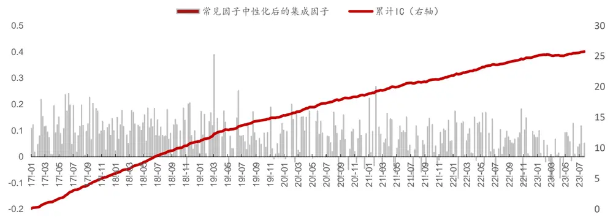
资料来源：招商证券

图 18：中性化集成因子分组对冲年化收益（全 A，20组）
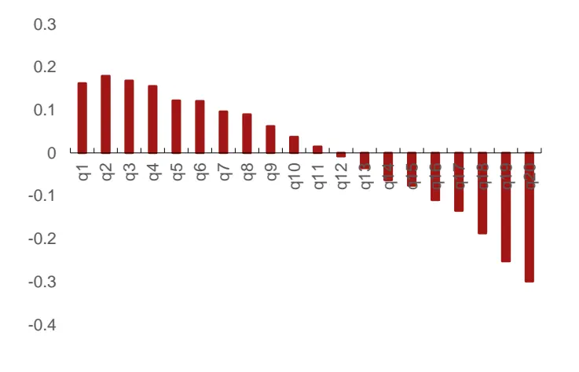
资料来源：招商证券

图 19：中性化后集成因子分组对冲净值（全 A，20组）
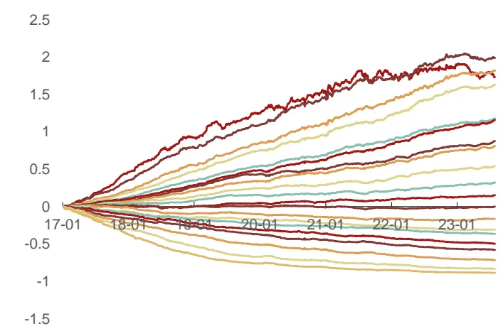
资料来源：招商证券

对常见因子（市值、估值、流动性、成长等）中性后集成因子的分组单调性有所减弱，周均 RankIC 从 11.9 下降到 0.77，IC的 t值为 44.29，ICIR 为 1.11。集成因子对常见因子中性化以后，选股能力有所减弱，但依然十分显著。分 20 组的多头年化收益率为 18.7%，20 组多头的收益率的下降较为明显，其他组的收益率下降幅度较小。从风格暴露上来看，集成因子在流动性因子和残差波动率有一定暴露，流动性因子和残差波动率在 A 股的选股能力较为显著，风格中性化后一定程度影响了集成因子的多头选股能力。另一方面，线性剔除风格一定程度上在模型中引入了设定误差，在分 20 组的情形下，影响了中性化后的因子的表现。在后续章节中，本文将基于集成模型构建不同的策略进一步分析模型在策略中的表现。

## 2.4. TOP100 策略分析

TOP100 策略即每次持仓股票数量固定 100 只股票。调仓日按照换仓股票的数量限制 N 卖出 Alpha 分数较低的N 只股票，并买入得分最高的 N 只股票以保持持仓股票数目不变。TOP100 策略可以一定程度地反应 Alpha 模型多头的实际表现，并给后续的指数增强策略构建，提供收益率、换手率、风险指标的参考。本文中 TOP100策略均为周频调仓，不考虑费率，可根据换手率和交易费率估算。其中 hsl 为周单边换手率约束。成交价格为次日VWAP价格。

表 11：TOP100策略分年度绝对收益表现汇总

|  | 指标 | 2017 | 2018 | 2019 | 2020 | 2021 | 2022 | -2023.7 | 全样本 |
| --- | --- | --- | --- | --- | --- | --- | --- | --- | --- |
| hsl=0.1 | 年化收益率 | 13.77% | -16.21% | 36.58% | 28.04% | 30.32% | 10.75% | 37.37% | 17.63% |
|  | 最大回撤 | -7.61% | -23.99% | -12.18% | -8.41% | -5.41% | -14.57% | -2.56% | -23.99% |
| hsl=0.2 | 年化收益率 | 19.44% | -7.07% | 41.57% | 31.48% | 28.33% | 10.21% | 35.94% | 21.03% |
|  | 最大回撤 | -6.70% | -18.72% | -14.84% | -8.51% | -8.14% | -16.70% | -2.18% | -18.72% |
| hsl=0.3 | 年化收益率 | 20.72% | -4.54% | 38.65% | 37.69% | 32.82% | 11.43% | 35.02% | 22.94% |
|  | 最大回撤 | -8.22% | -17.89% | -16.64% | -8.22% | -10.57% | -19.14% | -1.98% | -19.14% |
| hsl=0.4 | 年化收益率 | 20.32% | 0.27% | 40.46% | 48.06% | 35.25% | 13.74% | 37.26% | 26.33% |
|  | 最大回撤 | -8.17% | -15.59% | -16.23% | -7.52% | -10.42% | -19.92% | -2.47% | -19.92% |
| hsl=0.5 | 年化收益率 | 24.68% | 0.89% | 42.65% | 54.76% | 33.67% | 12.48% | 38.02% | 27.91% |
|  | 最大回撤 | -8.17% | -15.58% | -16.69% | -7.32% | -10.36% | -20.54% | -3.00% | -20.54% |
| hsl=1.0 | 年化收益率 | 27.90% | 7.26% | 45.19% | 58.45% | 29.68% | 15.44% | 38.37% | 30.36% |
|  | 最大回撤 | -8.40% | -14.25% | -16.28% | -7.15% | -10.06% | -19.40% | -3.12% | -19.40% |

资料来源：招商证券

从 TOP100 策略的绝对收益来看，单边换手率在 40%以上收益率变化幅度不大。绝对收益最大回撤在换手率大于 20%时无明显变化。2018 年策略表现稍弱。单边换手率小于 40%时，绝对收益率转负。其他年份收益率较为稳定。

## 三、指数增强策略构建

指数增强策略的构建主要包括收益模型和风险模型。在本文上一章中构建了基于集成模型的 Alpha 模型并分析了不同的换手率下全 A 成分股内 TOP100 策略的表现。在绝大多数年份策略绝对收益率都为正，且保持较高水平。本章中将基于集成模型构建对应不同指数的指数增强策略。

指数增强的优化目标为最大化预期收益率，中证 500 和中证 1000 指数增强策略的风格约束包括市值、估值、成长等为最大偏离 0.5 个标准差、行业占比偏离约束为最大偏离 0.03；沪深 300 指数增强策略的风格约束为0.01 个标准差，行业占比偏离约束为 0.01。跟踪误差约束为年化 6%。换手率约束为双边 30%，40%，50%。成分股约束为无限制（全市场选股）。优化目标如下：

$$
\begin{array}{rl}{\operatorname*{max}\ }&{\mu^{T}w}\\{\mathrm{s.t.}\ }&{f_{l}\leq F\left(w-w_{b}\right)\leq f_{h}}\\&{h_{l}\leq H\left(w-w_{b}\right)\leq h_{h}}\\&{w_{l}\leq w-w_{b}\leq w_{h}}\\&{b_{l}\leq B_{b}w\leq b_{h}}\\&{\left|w_{t}-w_{t-}\leq\delta}\\&\right|{\mathbf{I}^{T}w=1}\end{array}
$$

其中 为预期收益率， 为当前组合权重向量， $w_{t}$ 为 t时刻持仓权重， $w_{t-1}$ 为上一个持仓周期的持仓权重。

约束 1为风格约束，用于保证组合的风格偏离不超过下限 $f_{l}$ 和上限 $f_{h}$ 。

约束 2为行业偏离约束，用于保证组合行业占比的主动偏离不超过下限 $h_{\scriptscriptstyle{l}}$ 和上限 $h_{h}$ 。

约束 3为个股权重的相对偏离。

约束 4为成分股占比约束，保证成分股数量占比。

约束 5为换手率约束，在优化失败时候，优先删除该约束，保证组合权重能够顺利求解。

约束 6为全额投资约束，同时约束w大于0即无卖空限制。

费率设置为：买入费率千分之一，卖出费率千分之二。

其他交易设置：成交价格为次日复权 WVAP 价格，停牌无法买入卖出、涨停无法买入，跌停无法卖出。dhsl 表示双边换手率。

## 3.1. 沪深 300 指数增强策略

表12：沪深 300指数增强分年度表现（绝对收益）

|  | 指标 | 2017 | 2018 | 2019 | 2020 | 2021 | 2022 | -2023.7 | 全样本 |
| --- | --- | --- | --- | --- | --- | --- | --- | --- | --- |
| dhsl=0.2 | 年化收益率 | 56.72% | -13.80% | 54.77% | 41.95% | 9.09% | -12.87% | 15.72% | 16.55% |
|  | 最大回撤 | -2.53% | -21.78% | -11.37% | -11.64% | -13.11% | -22.80% | -6.16% | -26.71% |
| dhsl=0.4 | 年化收益率 | 59.84% | -10.58% | 57.16% | 39.77% | 11.27% | -12.47% | 12.56% | 16.00% |
|  | 最大回撤 | -2.41% | -20.23% | -11.19% | -11.55% | -11.64% | -23.59% | -7.67% | -26.37% |
| dhsl=0.6 | 年化收益率 | 61.00% | -11.19% | 53.00% | 38.79% | 14.86% | -14.05% | 13.09% | 14.02% |
|  | 最大回撤 | -2.66% | -21.58% | -11.57% | -11.20% | -10.71% | -25.54% | -8.42% | -27.20% |

资料来源：招商证券

表13：沪深 300指数增强分年度表现（超额收益）

|  | 指标 | 2017 | 2018 | 2019 | 2020 | 2021 | 2022 | -2023.7 | 全样本 |
| --- | --- | --- | --- | --- | --- | --- | --- | --- | --- |
| dhsl=0.2 | 年化收益率 | 27.80% | 16.45% | 11.63% | 11.61% | 15.09% | 12.22% | 9.30% | 13.00% |
|  | 最大回撤 | -1.58% | -0.56% | -1.08% | -1.60% | -1.67% | -0.46% | -1.21% | -1.67% |
| dhsl=0.4 | 年化收益率 | 30.32% | 20.78% | 13.36% | 9.91% | 17.43% | 12.76% | 6.33% | 12.47% |
|  | 最大回撤 | -1.58% | -0.54% | -1.07% | -1.67% | -1.33% | -0.67% | -1.33% | -1.67% |
| dhsl=0.6 | 年化收益率 最大回撤 | 31.25% -1.58% | 19.93% -1.08% | 10.36% -1.73% | 9.04% -2.55% | 21.12% -1.05% | 10.72% -0.99% | 6.86% -2.03% | 10.52% -2.55% |

资料来源：招商证券

图 20：沪深 300 策略净值走势图（双边换手率 20%，费后）
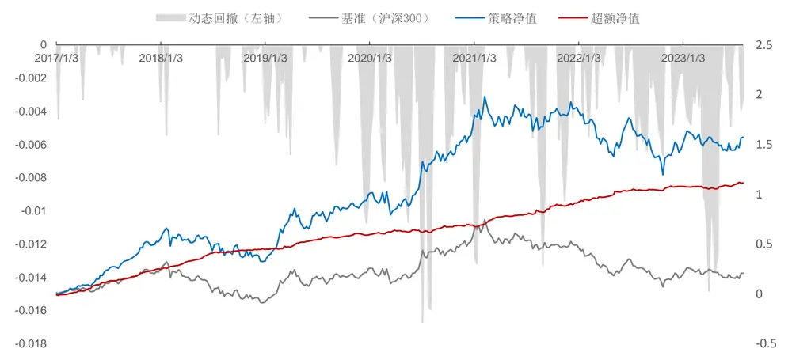
资料来源：招商证券

从结果来看，沪深 300 指增策略的表现良好，在周双边换手率约束为 20%的情况下，取得了最高的超额年化收益率。随着换手率的提高，超额年化收益率有所下降且最大回撤提高，说明交易费用侵蚀了因子收益率。

## 3.2. 中证500指数增强策略

表14：中证 500指数增强分年度表现（绝对收益）

|  | 指标 | 2017 | 2018 | 2019 | 2020 | 2021 | 2022 | -2023.7 | 全样本 |
| --- | --- | --- | --- | --- | --- | --- | --- | --- | --- |
| dhsl=0.2 | 年化收益率 | 10.26% | -12.48% | 43.51% | 27.63% | 29.90% | -6.09% | 29.55% | 13.08% |
|  | 最大回撤 | -10.29% | -22.96% | -17.10% | -10.66% | -8.44% | -23.71% | -3.37% | -23.71% |
| dhsl=0.4 | 年化收益率 | 16.28% | -8.13% | 43.12% | 31.62% | 34.54% | -3.98% | 28.84% | 14.62% |
|  | 最大回撤 | -10.14% | -19.83% | -18.15% | -10.60% | -8.71% | -23.17% | -4.32% | -23.17% |
| dhsl=0.6 | 年化收益率 | 19.53% | -4.72% | 46.31% | 35.37% | 38.32% | -2.23% | 31.55% | 15.97% |
|  | 最大回撤 | -10.60% | -19.73% | -18.56% | -10.88% | -8.73% | -22.35% | -3.88% | -22.35% |

资料来源：招商证券

表15：中证 500指数增强分年度表现（超额收益）

|  | 指标 | 2017 | 2018 | 2019 | 2020 | 2021 | 2022 | -2023.7 | 全样本 |
| --- | --- | --- | --- | --- | --- | --- | --- | --- | --- |
| dhsl=0.2 | 年化收益率 | 15.35% | 32.58% | 4.15% | 9.34% | 5.11% | 23.15% | 19.04% | 12.86% |
|  | 最大回撤 | -2.60% | -1.01% | -5.32% | -3.69% | -5.61% | -1.98% | -3.09% | -7.13% |
| dhsl=0.4 | 年化收益率 | 23.13% | 38.18% | 4.49% | 11.08% | 10.06% | 23.16% | 18.61% | 14.14% |
|  | 最大回撤 | -1.97% | -1.38% | -4.80% | -3.24% | -3.65% | -2.28% | -3.12% | -6.76% |
| dhsl=0.6 | 年化收益率 | 21.56% | 40.94% | 4.34% | 9.72% | 8.56% | 20.76% | 20.73% | 14.44% |
|  | 最大回撤 | -2.10% | -1.06% | -4.16% | -3.46% | -4.50% | -2.17% | -3.20% | -7.29% |

资料来源：招商证券

图 21：中证 500 策略净值走势图（双边换手率 40%，费后）
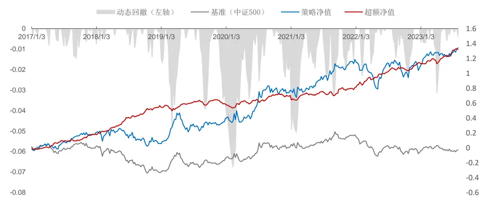
资料来源：招商证券

中证 500 指增策略在周双边换手率约束大于 40%的情况下，超额年化收益率年化收益率没有明显提升但最大回撤增大。继续提高换手率约束限制无法显著提高年化收益率的表现。从上述分析可以看出，沪深 300 和中证500指增策略的换手率约束不宜过高，这也对因子的自相关性提出了更高的要求。

## 3.3. 中证 1000 指数增强策略

表16：中证1000指数增强分年度表现（绝对收益）

|  | 指标 | 2017 | 2018 | 2019 | 2020 | 2021 | 2022 | -2023.7 | 全样本 |
| --- | --- | --- | --- | --- | --- | --- | --- | --- | --- |
| dhsl=0.2 | 年化收益率 | 10.26% | -12.48% | 43.51% | 27.63% | 29.90% | -6.09% | 29.55% | 13.08% |
|  | 最大回撤 | -10.29% | -22.96% | -17.10% | -10.66% | -8.44% | -23.71% | -3.37% | -23.71% |
| dhsl=0.4 | 年化收益率 | 16.28% | -8.13% | 43.12% | 31.62% | 34.54% | -3.98% | 28.84% | 14.62% |
|  | 最大回撤 | -10.14% | -19.83% | -18.15% | -10.60% | -8.71% | -23.17% | -4.32% | -23.17% |
| dhsl=0.6 | 年化收益率 | 19.53% | -4.72% | 46.31% | 35.37% | 38.32% | -2.23% | 31.55% | 15.97% |
|  | 最大回撤 | -10.60% | -19.73% | -18.56% | -10.88% | -8.73% | -22.35% | -3.88% | -22.35% |

资料来源：招商证券

表17：中证 1000指数增强分年度表现（超额收益）

|  | 指标 | 2017 | 2018 | 2019 | 2020 | 2021 | 2022 | -2023.7 | 全样本 |
| --- | --- | --- | --- | --- | --- | --- | --- | --- | --- |
| dhsl=0.2 | 年化收益率 | 33.63% | 39.32% | 10.19% | 8.08% | 6.56% | 20.48% | 21.24% | 17.13% |
|  | 最大回撤 | -1.40% | -1.81% | -3.83% | -3.91% | -7.98% | -1.47% | -3.18% | -7.98% |
| dhsl=0.4 | 年化收益率 | 41.02% | 46.02% | 9.76% | 11.90% | 10.50% | 23.15% | 20.63% | 18.77% |
|  | 最大回撤 | -1.40% | -2.08% | -4.12% | -2.96% | -6.98% | -2.22% | -3.30% | -6.98% |
| dhsl=0.6 | 年化收益率 | 44.91% | 51.18% | 12.16% | 15.06% | 13.67% | 25.35% | 23.09% | 20.13% |
|  | 最大回撤 | -1.40% | -1.92% | -4.22% | -3.71% | -5.62% | -1.69% | -3.61% | -5.62% |

资料来源：招商证券

图 22：中证 1000 策略净值走势图（双边换手率 60%，费后）
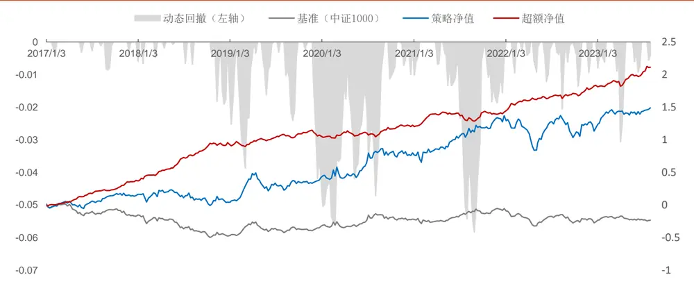
资料来源：招商证券

中证 1000 指增策略受换手率限制的影响明显强于沪深 300 策略和中证 500 策略。在双边换手率限制提高的过程中，超额年化收益率基本呈现一个上升的趋势，最大回撤呈现出下降的趋势。对于中证 1000指增策略，适当提高换手率约束可以提高策略的收益表现。

## 四、总结

本文利用截面模型 MLP、GBDT 以及时序神经网络 GRU、AGRU 构建了四个基于日频量价数据的量价因子模型。本文观察到，截面模型在引入历史特征后因子学习能力与时序模型基本处于同一水平。GBDT 学习到的因子年化收益率最高。从模型的平均相关性来看，从 2017年以来，模型之间的相关性有所提升。整体来看截面模型和时序模型学习到的因子之间的相关性低于同类型模型之间的相关性。通过不同模型的因子 60 日 ICIR 的 Voting 集成之后，集成因子的表现有所提升，ICIR 提高到 11.9%（全 A），多头年化收益率提高到 33.11%。说明不同模型之间学习到的因子有一定的增量。

通过分析集成因子与常见因子的相关性，发现量价集成因子在流动性和残差波动率上的风格暴露相对较高，在其他风格上的暴露较低。在剔除了常见风格的影响之后，集成因子的多头组收益率有所下降， 这可能和一定程度的风格暴露有关。中性化集成因子的Alpha依然显著。

最后本文基于集成因子构建了基于沪深 300、中证 500 和中证 1000 的周频指增策略。沪深 300 指数增强策略在低还手限制下，费后表现更好。中证 500 策略双边换手率大于 0.4 时，费后年化收益率提升不明显，最大回撤有所提高。中证 1000 在高换手率的情形下能够获得更高的费后年化收益率。在双边还手限制为 60%时候，费后年化超额收益率达到 20.13%。超额最大回撤-5.62%。信息比率3.07。

## 参考文献：

1. Chen T, He T, Benesty M, et al. Xgboost: extreme gradient boosting[J]. R package version 0.4-2, 2015, 1(4): 1-4.

2. Ke G, Meng Q, Finley T, et al. Lightgbm: A highly efficient gradient boosting decision tree[J]. Advances in neural information processing systems, 2017, 30.

3. Zhang A, Lipton Z C, Li M, et al. Dive into deep learning[J]. arXiv preprint arXiv:2106.11342, 2021.

4. Chung J, Gulcehre C, Cho K H, et al. Empirical evaluation of gated recurrent neural networks on sequence modeling[J]. arXiv preprint arXiv:1412.3555, 2014.

5. Hochreiter S, Schmidhuber J. Long short-term memory[J]. Neural computation, 1997, 9(8): 1735-1780.

6. Chung J, Gulcehre C, Cho K H, et al. Empirical evaluation of gated recurrent neural networks on sequence modeling[J]. arXiv preprint arXiv:1412.3555, 2014.

7. Qin Y, Song D, Chen H, et al. A dual-stage attention-based recurrent neural network for time series prediction[J]. arXiv preprint arXiv:1704.02971, 2017.

8. Boyd S P, Vandenberghe L. Convex optimization[M]. Cambridge university press, 2004.

## 分析师承诺

负责本研究报告的每一位证券分析师，在此申明，本报告清晰、准确地反映了分析师本人的研究观点。本人薪酬的任何部分过去不曾与、现在不与，未来也将不会与本报告中的具体推荐或观点直接或间接相关。

## 评级说明

报告中所涉及的投资评级采用相对评级体系，基于报告发布日后 6-12 个月内公司股价（或行业指数）相对同期当地市场基准指数的市场表现预期。其中，A股市场以沪深 300指数为基准；香港市场以恒生指数为基准；美国市场以标普 500指数为基准。具体标准如下：

## 股票评级

强烈推荐：预期公司股价涨幅超越基准指数 20%以上

增持：预期公司股价涨幅超越基准指数 5-20%之间

中性：预期公司股价变动幅度相对基准指数介于±5%之间

减持：预期公司股价表现弱于基准指数 5%以上

## 行业评级

推荐：行业基本面向好，预期行业指数超越基准指数

中性：行业基本面稳定，预期行业指数跟随基准指数

回避：行业基本面转弱，预期行业指数弱于基准指数

## 重要声明

本报告由招商证券股份有限公司（以下简称“本公司”）编制。本公司具有中国证监会许可的证券投资咨询业务资格。本报告基于合法取得的信息，但本公司对这些信息的准确性和完整性不作任何保证。本报告所包含的分析基于各种假设，不同假设可能导致分析结果出现重大不同。报告中的内容和意见仅供参考，并不构成对所述证券买卖的出价，在任何情况下，本报告中的信息或所表述的意见并不构成对任何人的投资建议。除法律或规则规定必须承担的责任外，本公司及其雇员不对使用本报告及其内容所引发的任何直接或间接损失负任何责任。本公司或关联机构可能会持有报告中所提到的公司所发行的证券头寸并进行交易，还可能为这些公司提供或争取提供投资银行业务服务。客户应当考虑到本公司可能存在可能影响本报告客观性的利益冲突。

本报告版权归本公司所有。本公司保留所有权利。未经本公司事先书面许可，任何机构和个人均不得以任何形式翻版、复制、引用或转载，否则，本公司将保留随时追究其法律责任的权利。