## 利用基本面信息改进机器学习因子

量化选股策略

## ——AI 系列研究之三

在机器学习因子生成任务中，如何防止模型过拟合使得模型在样本外能够有稳定的表现一直是关注的重点。引入基本面信息可以从两个方面改进机器学习因子的表现，一是调整机器学习量价因子的学习目标；二是作为互补信息改进综合因子的表现。此外采用梯度提升树模型提高机器学习因子迭代频率可以进一步提高综合因子的表现。

❑ 在引入周频量价信息后，原量价机器学习模型的因子表现有所提升，IC 提升较为明显，多头收益率提升有限。

❑ 量价信息只是资产定价模型中的一个维度，融入基本面信息可以显著改善综合机器学习因子的表现。在机器学习模型融入基本面信息的方式主要有两个维度，一个是风险维度即对目标收益率进行基本面风格的剔除。另一个是利用基本面Alpha因子与量价因子的互补性改进机器学习因子模型的表现。

❑ 对学习目标进行风格剔除时，所选的风格不同，对模型的结果存在一定的影响。总体来看，行业、市值、Beta这三类风险对模型影响最大。

❑ 利用梯度提升树融入基本面因子后，综合因子的多头表现相比于机器学习量价因子提升明显，年化对冲收益率达到 38.97%。

❑ 本文基于综合因子构建了基于宽基指数的指数增强策略，全市场选股的沪深300 周频指增策略年化超额收益率为 13.83%，超额最大回撤 2.82%，信息比率为 4.14，年化跟踪误差为3.73%。

❑ 全市场选股的中证 500 周频指增策略年化超额收益率为 22.22%，超额最大回撤 6.98%，信息比率为4.03，年化跟踪误差为 5.65%。

❑ 全市场选股的中证 1000周频指增策略年化超额收益率为 27.06%，超额最大回撤 6.14%，信息比率为4.69，年化跟踪误差为 5.71%。

❑ 风险提示：量化策略基于历史数据统计，模型存在失效的可能性。

任 瞳S1090519080004

rentong@cmschina.com.cn

周靖明S1090519080007

zhoujingming@cmschina.com.cn

周 游S1090523070015

zhouyou4@cmschina.com.cn

## 一、机器学习量价因子生成模型

## 1.1. 量价机器学习模型遇到的问题

前期报告中，基于多模型的量价因子在全 A 和各宽基成分股中都取得了良好的表现。但我们也发现其中存在的诸多问题：

1) 不同模型（截面模型和时序模型）学习到的因子平均截面相关性较高；

2) 提升模型复杂度并未能提高模型的表现（增加模型隐藏层层数或者采用更复杂的模型）；

3) 多头端对IC的贡献显著低于空头端对 IC的贡献。

图 1：不同模型之间的平均相关系数走势
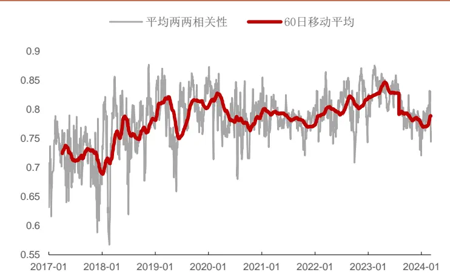
资料来源：招商证券，注：前期报告中的模型包括：MLP、GBDT、GRU 和 AGRU，详情见前期报告。

图 2：不同模型生成的因子分组年化对冲收益（20组）
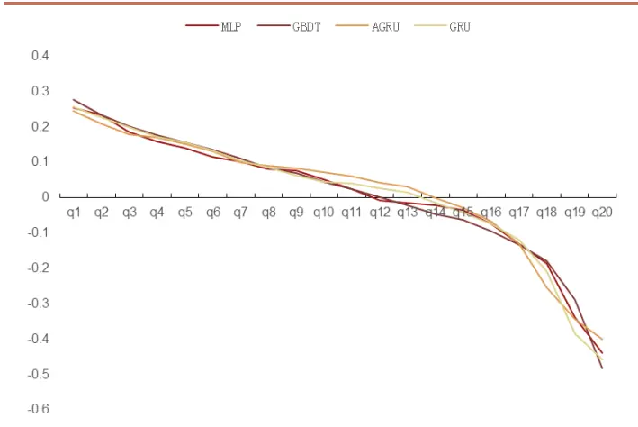
资料来源：招商证券、Wind

表1：全A成分股中不同模型的因子表现（周频）

|  | RankIC 均值 | ICIR | IC 胜率 | IC的t值 | 多头收益率 | 多头夏普 | 多头最大回撤 | 多头周均换手率 |
| --- | --- | --- | --- | --- | --- | --- | --- | --- |
| MLP | 11.14% | 1.00 | 85.22% | 41.56 | 26.70% | 1.36 | -27.45% | 61.40% |
| GBDT | 11.16% | 1.03 | 85.74% | 43.37 | 26.39% | 1.33 | -27.78% | 61.70% |
| AGRU | 10.95% | 0.94 | 82.21% | 39.61 | 23.67% | 1.20 | -23.53% | 62.51% |
| GRU | 11.13% | 0.97 | 84.82% | 40.32 | 24.21% | 1.27 | -27.57% | 59.60% |
| 集成模型 | 11.62% | 1.07 | 86.37% | 44.70 | 29.31% | 1.50 | -25.97% | 61.20% |

资料来源：招商证券，回溯期：20170101-20240308，滚动 5日计算

在实践中，我们发现不同模型之间学习到的信息同质化较为明显。这可能是由于输入的特征相同（前期报告中仅利用了日频的原始量价信息，并做了相同处理），且学习目标一致，结果的差异主要体现在模型自身的学习逻辑。为了改善学习到的量价因子表现，我们尝试了在原始日线量价信息的基础上构建的不同量价特征和引入不同频率的量价信息。

## 1.2. 引入长周期量价信息改进因子表现

在前期报告中，我们利用日频量价原始特征包括：OPEN、HIGH、LOW、CLOSE、VOLUME、VWAP 即开高低收价格、成交量和 VWAP 价格六个字段来构建量价因子，并在不同的成分 股内取得了不错的效果。

这里为了进一步提高量价因子的表现，这里借鉴微软 Qlib 构建的 158 个日频量价因子作为 Alpha158数据集，同时我们按照图 3的模式，在每个交易日回溯 150个交易日，按照间隔 5天采样 OHLC价格、VWAP价格以及成交量作为周频量价数据集，日频的 K线数据作为日频量价数据集。

图 3：周频量价信息采样过程
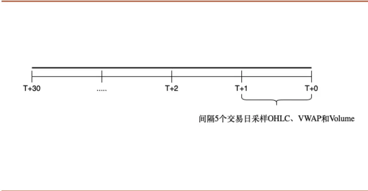
资料来源：招商证券

图 4：综合量价因子构建过程
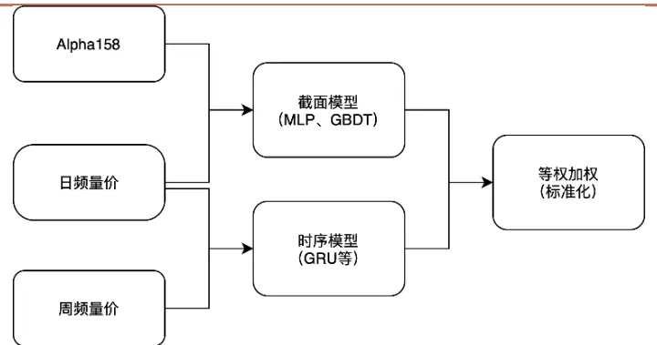
资料来源：招商证券

表2：量价因子模型数据集相关固定参数说明

| 名称 | 参数说明 |
| --- | --- |
| 股票池 | 全A股票，剔除上市不满三个月、ST、*ST、停牌的股票 |
| 数据集 | 日线量价数据、周频量价数据以及Alpha158因子 |
| 预测 label | T+1 日至 T+11 日复权日内 VWAP 价格收益率 |
| 调仓周期 | 每周一按照上一个交易日的因子生成持仓信息 |
| 因子预处理 | MAD 标准化，3倍MAD 以外异常值截断，缺失值填充为0 |
| Label 预处理 | label 截面 zscore 标准化 |
| 对比基准 | 沪深300、中证500、中证1000、中证全指 |
| Batch 定义 | 一个交易日截面上所有的股票作为一个batch |
| 数据划分 | 20111001-20240308，滚动训练模式；在训练集中划分最后252个交易日作为验证集；测试集为最近1年 (每年训练一次) |

资料来源：招商证券

按照上述设定，我们分别利用不同的数据集来训练得到三个数据集对应得因子，最后等权加权得到综合量价因子。

周频量价包括与日线一致的开高低收价格、成交量和 VWAP 价格六个字段。Alpha158 仅输入截面模型包括（MLP、GBDT）；周频量价数据仅输入时序模型（GRU）；日线量价数据同时输入两类模型。

表3：全A成分股中不同数据集的因子表现（周频）

|  | RankIC 均值 | ICIR | IC 胜率 | IC的t值 | 多头收益率 | 多头夏普 | 多头最大回撤 | 多头周均换手率 |
| --- | --- | --- | --- | --- | --- | --- | --- | --- |
| 周频量价 | 11.14% | 1.00 | 85.22% | 41.56 | 27.70% | 1.36 | -27.45% | 61.40% |
| 日频量价 | 11.62% | 1.07 | 86.37% | 44.70 | 29.31% | 1.50 | -25.97% | 61.20% |
| A1pha158 | 11.26% | 1.08 | 86.83% | 45.23 | 27.09% | 1.30 | -29.32% | 59.50% |
| 综合量价 | 12.01% | 1.12 | 88.40% | 46.75 | 31.11% | 1.43 | -27.03% | 61.90% |

资料来源：招商证券，回溯期：20170101-20240308，滚动 5日计算

从实践的结果来看，相对复杂的 Alpha158数据从最终输出的因子角度来看，与原始的日频量价信息无明显表现区别，这也说明了机器学习模型可以从原始量价信息中学习到 Alpha 因子。结合周频量价信息后综合量价因子的表现有所提升。

另一方面，从综合量价因子与前期报告中构建的日频量价因子的对比来看，IC 的提升、IC 胜率、相对是比较显著的。但多头收益率的提升相对有限。且最大回撤的表现有所下降。总体来看提升幅度有限。

在本文的量价因子生成任务中，我们尝试引入了不同频率的量价信息和人工设计的日频量价因子来改进综合量价因子的表现，从结果来看，似乎遇到了一定的瓶颈，因子的统计信息例如 IC均值、ICIR等维度提升较为显著，但在选股场景下，我们更关注的多头收益率和多头最大回撤提升的幅度并不如预期。

进一步思考，量价因子仅仅只是 Alpha 的一个维度。从实践的经验来看，量价类因子的统计特性（IC 均值、IC 胜率等）往往表现出色，但分组收益率的对称性（多头的正 Alpha 收益率相对于空头的负 Alpha 收益）往往欠佳。因此我们可以从基本面信息的维度来进一步改进机器学习因子模型的表现。

## 二、基本面信息融入机器学习因子模型

## 2.1. 机器学习目标的基本面风险剔除

在传统因子模型中，我们可以将资产的预期收益率拆解为可以被现有的因子模型所解释的部分和不能解释的部分。可以被解释的部分我们通常把这部分收益率视为风险部分或者 Beta 部分，而不能被解释的部分通常被视为Alpha 部分。

$$
r_{t+1}=\alpha_{{\scriptscriptstyle t+1}}^{\cdot}+\sum_{m}\beta_{m,t}^{'}f_{m,t+1}+\epsilon_{t+1}
$$

其中 $r_{t+1}$ 为 时刻的资产收益率向量， $\beta_{m,t}^{'}$ 为第 个风险因子， $f_{m,t+1}$ 为第 个风险因子的收益率。针对不同的股票市场，能够解释股票收益率的风险有一定的区别。在 A股市场，业界较为常用的风险模型有 BARRACNE5以及更新的 CNE6版本。

$\boldsymbol{\alpha}_{t+1}^{\cdot}$ 为收益预测模型得到的预期收益率。通常我们在构建收益模型的时候会对常见的风险进行线性剔除，以排除风险对收益预测模型的影响，得到更纯粹的Alpha信息，比较常见的操作就是对构建的因子作为因变量、行业和市值因子作为自变量进行回归后取残差。

在机器学习的场景下，我们希望更准确地估计未来资产的预期收益率。如果我们的学习目标是 $r_{t+1}$ ，那么模型中其实也隐含了各类风险的信息。所以更合理的做法是将 $\boldsymbol{\alpha}_{t+1}^{\cdot}$ 作为学习目标，也就是风险调整的收益率。

当前业界通常的做法是将行业和市值作为主要风险进行剔除：

$$
{\mathrm{target}}_{i}^{\cdot}={r_{i}}-(\sum_{j}{X_{ij}}\cdot{f^{^{\prime}}}_{j}+size\cdot{f^{^{\prime}}}_{size}+\ldots)
$$

其中 $X_{ij}$ 为行业因子，通常使用申万或者中信一级行业分类对股票进行标记，如果属于该行业则 $X_{ij}=1$ ，否则为 0。size为市值因子， $f^{'}$ 为通过 OLS估计的因子收益率。 $\mathrm{target}_{i}.$ 即为经过行业市值风险调整的收益率，经过截面标准化以后即为学习目标输入模型。

采用线性剔除的方式一定程度上减小了常见风险因子对模型的学习目标收益率的影响，根据资产收益率的泰勒级数展开式，我们知道调整后的收益率中仍然包含了这些风险因子的高阶项，但这些风险因子的高阶项不一定表征了某类风险，因此本文仍然使用线性剔除的方式，通过观察剔除不同风险因子来实证研究对机器学习模型结果的影响。

在日频量价数据集上可以直观地看出经过风险调整/未经过风险调整的学习目标对学习结果的影响。

表4：目标收益率是否经过风险调整对结果的影响

| 学习目标经过风险调整 |  |  |  |  |  | 学习目标未经过风险调整 |  |  |  |
| --- | --- | --- | --- | --- | --- | --- | --- | --- | --- |
| 模型 | RankIC 均值 | ICIR | IC 胜率 | 多头收益率 | 模型 | RankIC 均值 | ICIR | IC 胜率 | 多头收益率 |
| MLP | 11.14% | 1 | 85.22% | 26.70% | MLP | 9.20% | 0.91 | 83.78% | 20.46% |
| GBDT | 11.16% | 1.03 | 85.74% | 26.39% | GBDT | 9.17% | 0.93 | 82.97% | 19.11% |
| GRU | 11.13% | 0.97 | 84.82% | 24.21% | GRU | 9.23% | 0.90 | 82.53% | 18.89% |
| 集成模型 | 11.62% | 1.07 | 86.37% | 29.31% | 集成模型 | 9.65% | 0.98 | 84.60% | 22.35% |

资料来源：招商证券，回溯期：20170101-20240308，滚动 5日计算

从结果来看，未经过风险调整的收益率作为学习目标，从 IC和多头收益率来看最终学习到的因子表现都有明显的下降。这说明对学习目标的收益率进行风险调整有助于显著提高机器学习因子的表现。

进一步我们测试剔除不同的风险因子对结果的影响，为了节省计算资源和时间，这里仅以 GBDT模型和日频量价数据集来观察剔除不同的风格对模型的影响。本文测试的风格因子在表5中说明。行业因子为申万一级行业分类因子。

表5：大类风格因子说明

| 风格因子 | 说明 | 解释 |
| --- | --- | --- |
| beta | 贝塔 | 个股/投资组合收益对基准收益的敏感度 |
| momentum | 动量 | 股票收益变化的总体趋势特征 |
| size | 规模 | 上市公司的市值规模 |
| book_to-price | 账面市值比 | 上市公司的股东权益-市值比，反映其估值水平 |
| non_linear_size | 非线性市值 | 反映中等市值股票和大/小市值股票的表现差异 |
| earnings-yield | 盈利率 | 上市公司的营收能力 |
| residual_volatility | 残余波动率 | 个股残余收益的波动程度 |
| growth | 成长性 | 上市公司的营收增长情况 |
| leverage | 杠杆率 | 上市企业负债占资产比例，反映企业的经营杠杆率 |
| liquidity | 流动性 | 股票换手率，反映个股交易的活跃程度 |

资料来源：招商证券、米筐

这里测试三个剔除组合：

1) 仅剔除市值、行业因子

2) 剔除市值、行业、Beta因子

3) 剔除所有风险因子

从测试的结果可以看出剔除不同的风险因子对结果存在比较明显的差异。剔除市值和行业两类风险的结果优于剔除所有大类风险，优于不剔除风险。而剔除不同的风险的结果也存在一定的差异，剔除行业、市值和 Beta的结果优于其他剔除组合，这可能也说明了其他常见风格中蕴含了一定的Alpha 信息。

事实上，在进行全市场的指数增强策略构建的时候，我们也仅仅对行业、市值以及成分股偏离等（对Beta的主动暴露）进行了严格控制。对其他风格的控制则相对松弛一些。

表6：剔除不同的风格对模型学习结果的影响（仅测试 GBDT模型）

|  | RankIC 均值 | ICIR | IC 胜率 | IC的t值 | 多头收益率 | 多头夏普 | 多头最大回撤 | 多头周均换手率 |
| --- | --- | --- | --- | --- | --- | --- | --- | --- |
| 市值+行业 | 11.16% | 1.03 | 85.74% | 43.37 | 26.39% | 1.57 | -27.77% | 61.70% |
| 所有大类风险 | 10.36% | 1.08 | 86.83% | 44.88 | 22.89% | 1.11 | -34.82% | 71.50% |
| 市值+行业+Beta | 11.77% | 1.06 | 86.14% | 44.04 | 27.98% | 1.44 | -26.68% | 62.20% |

资料来源：招商证券，回溯期：20170101-20240308，滚动 5日计算

在本节中，本文探讨了包括基本面风险因子在内常见风格/风险因子对机器学习模型的影响。未来收益率中包含了不同的风险因子的影响。因此对学习目标收益率的风险调整是十分必要的。

从实证的结果来看，剔除行业、市值和Beta模型结果的表现最优，优于剔除所有常见风格，也优于仅剔除市值和行业因子。机器学习模型仍能够从其他常见风格中捕捉到一定 Alpha信息，剔除过多的风格反而降低了模型的性能表现。

## 2.2. 量价类因子对比基本面类因子

在前一章节中，我们从风险的角度探讨基本面风格因子对机器学习模型的影响。本节主要从收益模型的角度探讨如何在 Alpha 因子学习的过程中利用基本面因子的信息来提高综合因子的表现。

$$
\dot{\alpha_{t+1}}=\mathrm{ENS}(\mathrm{Model}_{1}(X_{t}),\mathrm{Model}_{2}(X_{t}),...)
$$

其中ENS为集成模型的方式，Model为不同的机器学习模型， $X_{t}$ 为 t时刻的特征矩阵， $\boldsymbol{\alpha}_{t+1}^{\cdot}$ 为预期收益率/综合因子。在本文之前的章节中主要以量价特征为主。在引入Alpha158因子和周频量价特征后，并对学习目标收益率进行合适的风险调整之后结果相对于原始的量价综合因子有了一定幅度的提升，但同时我们也观察到综合量价因子的多头收益率提升幅度有限。此外一般量价类因子有两个比较明显的特征：

1) 多头端 Alpha 显著低于空头端 Alpha

2) 换手率较高

图 5：典型量价因子年化分组对冲收益率
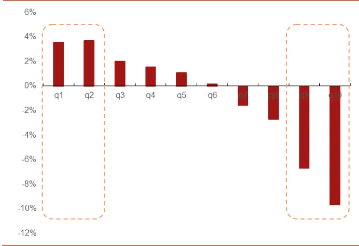

图 6：典型量价因子多空净值
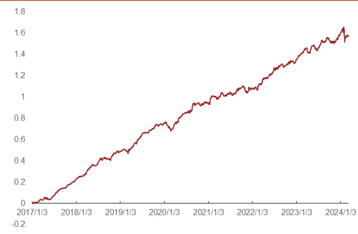

资料来源：招商证券、Wind

资料来源：招商证券、Wind

图 7：典型量价因子的自相关系数
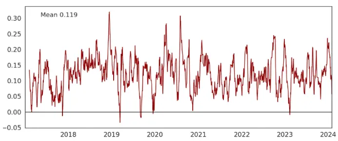
资料来源：招商证券

图 5 和图 6 展示了一个典型的量价因子的年化对冲收益率和多空净值表现。因子测试的股票池为中证全指成分股，测试区间为：20170101-20240308;调仓周期为 20 个交易日，对冲基准为成分股等权收益率，分组为 10 组。该因子多空净值表现优秀，但多头组收益率（第 1 组）远低于空头组收益率（第 10 组）。该因子 RankIC 为 0.049，ICIR 为 1.02，IC 胜率为83.93%。

图 8：EP_SQ因子年化分组对冲收益率
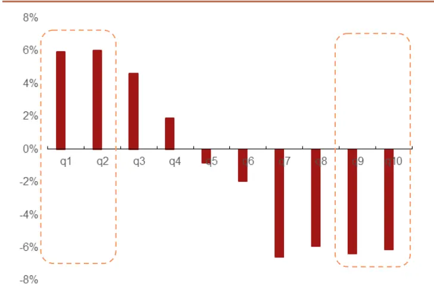
资料来源：招商证券、Wind

图 9：EP_SQ因子多空净值走势
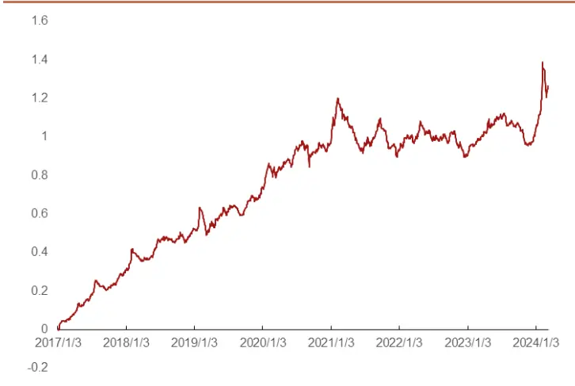
资料来源：招商证券、Wind

图 10：EP_SQ因子的自相关系数
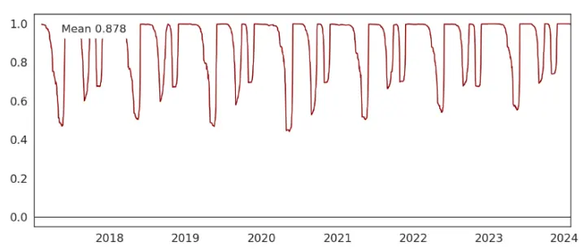
资料来源：招商证券

图 8 和图 9 展示了单季度市盈率倒数因子（EP_SQ）的分组对冲净值和多空净值走势，测试设置与上文一致。该因子 RankIC 均值为 0.559，ICIR为 0.73，IC 胜率为 76.57%，该因子的分组收益率对称性表现良好，选股能力在多头端体现的更明显。对比两因子可以看出该基本面因子 RankIC均值略好于上述量价因子，多头选股能力更优，且换手率远低于上述量价因子。但从多空净值走势来看稳定性较差。在构建多头策略的时候，较低的多头 Alpha 以及较高的换手率都会带来一定的负面影响。因此基本面因子与量价因子可以形成一定的互补。

从改善多头收益率表现，降低换手率的角度来看，引入基本面特征来改善综合机器学习因子的表现可能是一个可行的思路。

表7：基本面因子说明

| 因子名称 | 因子说明 | 方向 | 数据类型 |
| --- | --- | --- | --- |
| EP_SQ | 净利润_最新单季度/总市值 | 降序 | double |
| SP_TTM | 营业收入_TTM/总市值 | 降序 | double |
| OCFP_TTM | 经营活动产生的现金流量净额_TTM/总市值 | 降序 | double |
| Sales2EV | 营业收入_TTM/(总市值+非流动负债合计_最新财报-货币资金_ 最新财报) | 降序 | double |
| Gr_3Y_Earning | 过去3年年报净利润的历史增长率，以回归方式计算 | 降序 | double |
| Gr_3Y_Sale | 过去3年年报营业收入的历史增长率，以回归方式计算 | 降序 | double |
| Gr_FY0_Earning | (净利润_FYO- 净利润_最新年报)/ABS(净利润_最新年报) | 降序 | double |
| ROE_TTM | 2*净利润_TTM/(股东权益合计_最新财报+股东权益合计_去年同 | 降序 | double |
| ROA_TTM | 2*净利润_TTM/(资产总计_最新财报+资产总计_去年同期) | 降序 | double |
| GrossMargin | (营业收入_TTM-营业成本_TTM)/营业收入_TTM- 1 | 降序 | double |
| Sale2Asset | 2*营业收入_TTM/(资产总计_最新财报+资产总计_一年前) | 降序 | double |
| OCF2OP | 经营活动产生的现金流量净额_TTM/营业利润_TTM | 降序 | double |
| EPS_FY0_R1M | 一致预期 EPS_FY0 过去 20 天的变化率 | 降序 | double |
| EPS_FY0_R3M | 一致预期 EPS_FY0 过去 60 天的变化率 | 降序 | double |
| Rating_R1M | 分析师综合评级1个月的变化率 | 升序 | double |
| Rating_R3M | 分析师综合评级3个月的变化率 | 升序 | double |
| Rating | 分析师综合评级 | 升序 | double |
| TargetReturn | 一致预测目标价/收盘价- 1 | 降序 | double |

资料来源：招商证券

本文选取了现有的基本面特征作为研究数据集，说明见表 7中的说明，这些基本面因子由于发布较早，选股能力已经有所衰减，多空组合的波动性也显著增大。借助机器学习模型，仍然可以从这些基本面信息/因子中获得增量的 Alpha信息。

由于基本面信息的更新频率相对较低，通常以月度为单位；覆盖度也远低于量价类因子（例如分析师预期类的因子覆盖率相对较低），若在时序和截面上进行填充则会引入一定的噪声。

决策树模型则比较适合处理带有较多缺失值的数据集，从实证的过程来看，树模型的稳定性也好于神经网络类的模型。因此本文处理基本面类的特征时仅使用GBDT来进行因子构建。

## 2.3. 结合基本面信息构建综合因子

在上一节中，本文探讨了量价类因子和基本面类因子的典型区别。主要体现在换手率、分组收益率的对称性以及多空净值的稳定性。为了从常见基本面特征中进一步提取Alpha信息，这里采用GBDT作为基础学习模型。

表8：基本面因子模型数据集相关固定参数说明

| 名称 | 参数说明 |
| --- | --- |
| 股票池 | 全 A股票，剔除上市不满三个月、ST、*ST、停牌的股票 |
| 数据集 | 原始基本面特征 |
| 预测 label | T+1 日至 T+11 日复权日内 VWAP 价格收益率 |
| 因子预处理 | MAD 标准化，3倍 MAD 以外异常值截断，缺失值填充为0 |
| Label 预处理 | label 截面 zscore 标准化 |
| 数据划分 | 20111001-20240308，滚动训练模式；在训练集中划分最后一个月作为验证集；测试集为最近1个季度 (每个季度训练一次) |

资料来源：招商证券

按照以上设定训练模型得到综合基本面因子的结果，同样按照 5 日滚动调仓来测试综合基本面因子的表现。综合基本面因子的 RankIC 均值为 0.043，ICIR 为 0.39，IC 胜率为 64.75%。从结果来看，综合基本面因子的多头端收益率显著高于空头端收益率，符合基本面类因子的特征。

图 11：综合基本面因子分组对冲收益率
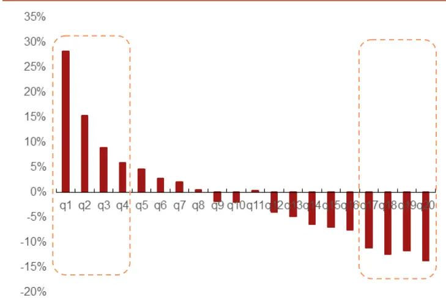
资料来源：招商证券、Wind

图 12：综合基本面因子多空净值走势
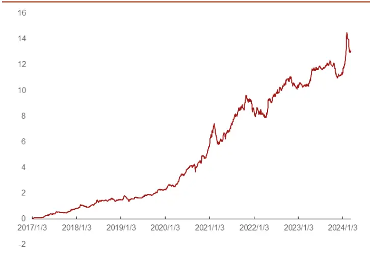
资料来源：招商证券、Wind

在前文中，利用多个模型和多频率的量价信息构建的综合量价因子和本节构建的综合基本面因子形成一定的互补。按照基本面综合因子的构建方式，利用基本面特征+综合量价因子重新构建综合机器学习因子，具体构建流程如图 13所示。

图 13：综合机器学习因子构建流程
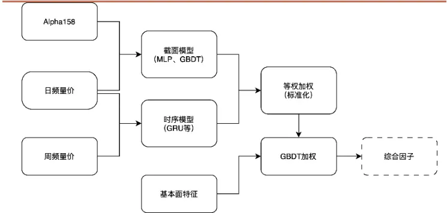
资料来源：招商证券

按照上文常规测试流程对综合因子进行测试，回溯区为：20170101-20240308，股票池为同时期中证全指成分股。调仓周期为 5 日。分组数为20 组，分组年化收益率的对冲基准为成分股等权收益率。可以看出相比于综合量价因子的多头收益率有了明显改善。多头换手率也下降到 56.6%。总体来看融入基本面信息后，机器学习因子的表现有了显著提升。

图 14：综合因子分组对冲年化收益率
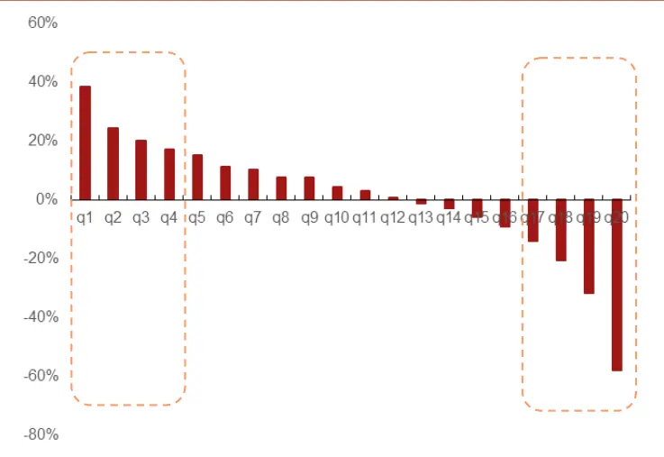
资料来源：招商证券、Wind

图 15：综合因子多空净值走势（对数坐标）
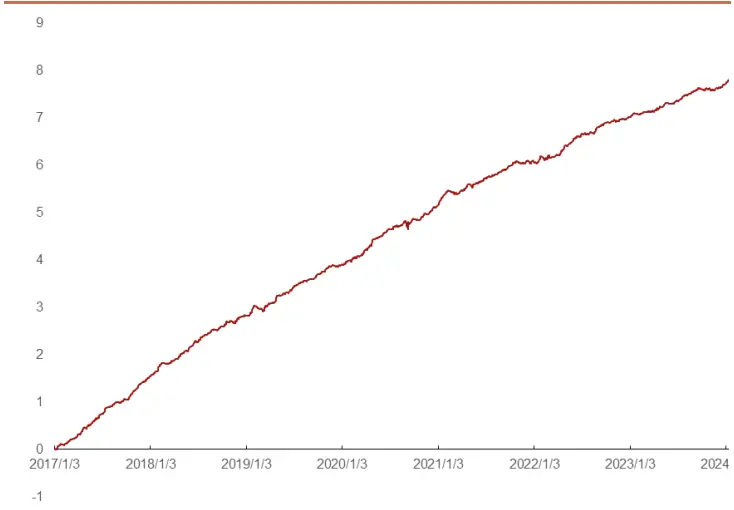
资料来源：招商证券、Wind

图 16：综合因子累计 IC
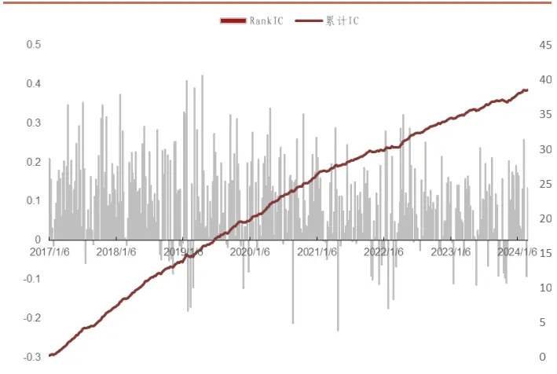
资料来源：招商证券、Wind

图 17：综合因子分组对冲净值
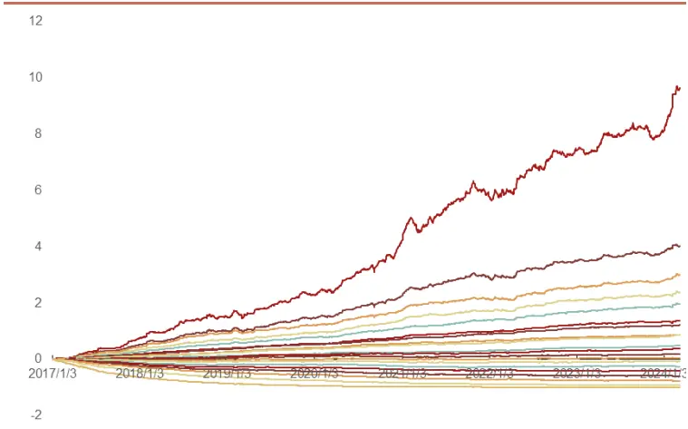
资料来源：招商证券、Wind

表9：不同成分股中的综合因子表现

|  | RankIC 均值 | ICIR | IC 胜率 | IC的t值 | 多头收益率 | 多头夏普 | 多头最大回撤 | 多头周均换手率 |
| --- | --- | --- | --- | --- | --- | --- | --- | --- |
| 沪深300 | 10.14% | 0.62 | 74.07% | 25.92 | 34.61% | 1.90 | -16.41% | 36.60% |
| 中证500 | 9.90% | 0.81 | 79.76% | 33.84 | 35.84% | 1.84 | -23.51% | 47.30% |
| 中证1000 | 10.48% | 0.92 | 82.98% | 38.53 | 31.86% | 1.47 | -27.72% | 49.80% |
| 全A | 10.52% | 0.94 | 83.50% | 39.23 | 38.97% | 1.91 | -25.86% | 56.60% |

资料来源：招商证券，回溯期：20170101-20230801，周频

其中沪深 300、中证 500、中证 1000 的分组为 10 组，全 A 的分组为 20组。相比于综合量价因子，结合基本面的综合因子 RankIC 和 ICIR 有所下降，但多头收益率、多头夏普、多头换手率有比较明显的提升，多头最大回撤也有一定的下降。总体来看，融入基本面信息后，因子多头的表现有了显著提升，但因子的统计特性（RankIC 均值、ICIR、IC 胜率）则有一定下降。

表10：不同成分股中综合因子的分组年化对冲收益率

| 分组 | 沪深300 | 中证500 | 中证1000 |
| --- | --- | --- | --- |
| q1 | 30.51% | 35.46% | 36.60% |
| q2 | 23.50% | 18.21% | 23.79% |
| q3 | 12.24% | 10.87% | 15.96% |
| q4 | 5.89% | 8.28% | 10.33% |
| q5 | -0.80% | 2.34% | 4.90% |
| q6 | -5.35% | -0.77% | 1.19% |
| q7 | -7.12% | -5.96% | -4.91% |
| q8 | -14.32% | -10.81% | -9.89% |
| q9 | -20.00% | -19.19% | -18.27% |
| q10 | -35.29% | -33.46% | -44.13% |

资料来源：招商证券、Wind

表 11：综合因子与常见风格因子的平均截面相关性

| 动量 估值 流动性 市值 残差波动率 杠杆 成长 |  |  |  |  |  |  |  |
| --- | --- | --- | --- | --- | --- | --- | --- |
| 动量估值 | 1.00 | -0.18 | 0.16 | 0.29 | 0.25 | -0.05 | 0.09 |
|  | -0.18 | 1.00 | -0.28 | 0.13 | -0.33 | 0.44 | -0.04 |
| 流动性 | 0.16 | -0.28 | 1.00 | -0.33 | 0.49 | -0.14 | -0.04 |
| 市值 | 0.29 | 0.13 | -0.33 | 1.00 | -0.09 | 0.22 | 0.14 |
| 残差波动率 | 0.25 | -0.33 | 0.49 | -0.09 | 1.00 | -0.07 | -0.02 |
| 杠杆 | -0.05 | 0.44 | -0.14 | 0.22 | -0.07 | 1.00 | -0.01 |
| 成长 | 0.09 | -0.04 | -0.04 | 0.14 | -0.02 | -0.01 | 1.00 |
| 综合因子 0.16 |  | 0.10 | -0.28 | 0.31 | -0.26 | 0.05 | 0.11 |

资料来源：招商证券、回测期：20170101-20240308

从截面相关性来看，综合因子与流动性、市值、残差波动优化目高。其他风格因子的暴露较小。进一步通过现有的因子模型检验可以观察综合因子Alpha的显著性和稳定性。

图 18：风格中性化后的综合因子累计 IC走势
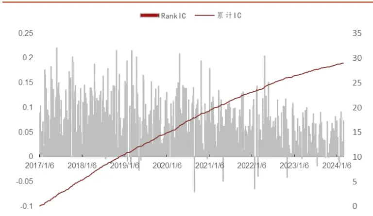
资料来源：招商证券、Wind

图 19：风格中性化后综合因子分组对冲净值
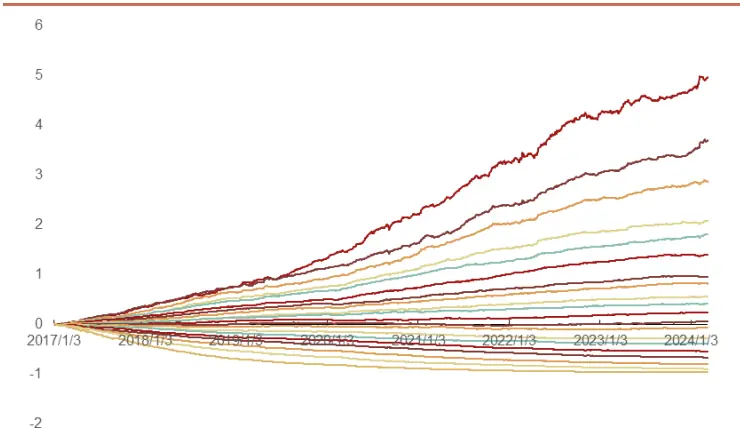
资料来源：招商证券、Wind

排除掉常见风格的影响后，综合因子的 RankIC 下降到 0.78，ICIR 提高到1.55，IC 的胜率提高到 94.88%，IC 的 T 值为 64.61。从因子的统计量来看，剔除掉常见风格后，综合因子的稳定性有了显著提升。从图 19，图 20的结果来看，剔除掉现有的行业、风格影响后综合因子的 IC 和分组净值都保持了良好的表现，这说明综合因子的收益来源受风格影响较小，其Alpha显著性和稳定性通过了现有因子模型的检验。

通过构建指数增强策略可以进一步检验在实际策略构建的场景下综合因子的表现。

## 三、周频指数增强策略构建

本章节将基于上文构建的综合因子构建指数增强策略，指数增强的优化目标为最大化预期收益率，优化目标如下：

$$
\mathrm{\ max}\quad\mu^{T}w
$$

$$
\begin{array}{rl}{\mathrm{s.t.}\quad}&{{}f_{l}\leq F\left(w-w_{b}\right)\leq f_{h}}\end{array}
$$

$$
h_{l}\le H\left(w-w_{b}\right)\le h_{h}
$$

$$
w_{l}\le w-w_{b}\le w_{h}
$$

$$
b_{l}\le B_{b}w\le b_{h}
$$

$$
\left|w_{t}-w_{t-1}\right|\leq\delta
$$

$$
\boldsymbol{1}^{T}\boldsymbol{w}=1
$$

其中 $\mu$ 为预期收益率， $w$ 为当前组合权重向量， $w_{t}$ 为 t 时刻持仓权重，$w_{t-1}$ 为上一个持仓周期的持仓权重。

常见约束如下：

1) 风格约束，用于保证组合的风格偏离不超过下限 $f_{l\not\in\pi}$ 上限 $f_{h}$

2) 行业偏离约束，用于保证组合行业占比的主动偏离不超过下限 $h_{\iota}$ 和上限 $h_{\scriptscriptstyle h}$

3) 个股权重的相对偏离

4) 成分股占比约束，保证成分股数量占比

5) 换手率约束，在优化失败时候，优先删除该约束，保证组合权重能够顺利求解

6) 全额投资约束，同时约束 $w$ 大于0即无卖空限制

本文中各类指数增强策略的设置如下：

1) 风格偏离约束：

a) 沪深 300指增策略，估值、成长等风格为最大偏离 0.01个标准差、行业占比偏离约束为 1%；

b) 中证 500指增策略，风格约束为0.01个标准差，行业占比偏离约束为1%；

c) 中证 1000 指增策略，风格约束为 0.02 个标准差，行业占比偏离约束为10%；

2) 换手率约束：双边 20%，40%，60%

3) 跟踪误差约束：年化 6%

4) 成分股约束：无限制（全市场选股）/ 100%成分股约束

5) 费率设置：买入费率千分之一，卖出费率千分之二

6) 其他交易设置：成交价格为次日复权 WVAP 价格，停牌无法买入卖出、涨停无法买入，跌停无法卖出。tvr表示双边换手率

## 3.1. 沪深300指数增强策略（周频）

表12：沪深 300指数增强策略分年度表现（100%成分股内选股）

|  | tvr=0.2 |  |  | tvr=0.4 |  |  | tvr=0.6 |  |  |
| --- | --- | --- | --- | --- | --- | --- | --- | --- | --- |
|  | 指标 绝对收益 | 超额收益 | 超额最大回撤 | 绝对收益 | 超额收益 | 超额最大回撤 | 绝对收益 | 超额收益 | 超额最大回撤 |
| 2017 | 46.46% | 20.34% | -1.38% | 45.22% | 19.29% | -1.38% | 41.81% | 16.51% | -1.41% |
| 2018 | -14.06% | 14.81% | -0.51% | -14.54% | 14.15% | -0.68% | -16.38% | 11.70% | -1.17% |
| 2019 | 53.24% | 11.03% | -2.94% | 49.25% | 8.05% | -3.89% | 44.96% | 4.90% | -3.99% |
| 2020 | 43.97% | 14.26% | -0.72% | 40.09% | 11.16% | -1.26% | 34.97% | 7.08% | -1.87% |
| 2021 | 11.34% | 17.29% | -1.09% | 10.11% | 15.97% | -0.84% | 6.69% | 12.37% | -1.12% |
| 2022 | -12.04% | 11.88% | -1.33% | -12.27% | 11.57% | -1.42% | -14.95% | 8.28% | -1.61% |
| 2023 | -4.46% | 7.59% | -1.88% | -7.35% | 4.37% | -2.08% | -9.52% | 1.93% | -2.86% |
| YTD | 3.67% | 0.34% | -0.43% | 1.96% | -1.32% | -1.54% | 1.08% | -2.15% | -2.30% |
| 全样本 | 14.76% | 13.47% | -2.94% | 12.72% | 11.43% | -3.89% | 9.53% | 8.29% | -4.03% |

资料来源：招商证券、Wind

表13：沪深 300指数增强策略分年度表现（全市场选股）

|  | tvr=0.2 |  |  | tvr=0.4 |  |  | tvr=0.6 |  |  |
| --- | --- | --- | --- | --- | --- | --- | --- | --- | --- |
|  | 指标 绝对收益 | 超额收益 | 超额最大回撤 | 绝对收益 | 超额收益 | 超额最大回撤 | 绝对收益 | 超额收益 | 超额最大回撤 |
| 2017 | 43.76% | 18.09% | -1.49% | 45.17% | 19.24% | -1.49% | 42.35% | 16.92% | -1.49% |
| 2018 | -12.14% | 17.31% | -1.65% | -13.71% | 15.23% | -1.58% | -15.52% | 12.82% | -1.71% |
| 2019 | 52.78% | 10.71% | -2.82% | 47.67% | 6.90% | -3.54% | 43.98% | 4.23% | -3.32% |
| 2020 | 47.24% | 16.75% | -0.83% | 43.72% | 13.99% | -1.68% | 37.79% | 9.32% | -2.05% |
| 2021 | 9.93% | 15.69% | -1.18% | 7.90% | 13.56% | -1.09% | 6.18% | 11.77% | -1.16% |
| 2022 | -12.92% | 10.78% | -1.81% | -12.93% | 10.76% | -1.69% | -15.48% | 7.60% | -1.74% |
| 2023 | -2.56% | 9.65% | -1.52% | -7.54% | 4.10% | -2.44% | -10.40% | 0.86% | -3.41% |
| YTD | 4.36% | 0.99% | -0.38% | 3.90% | 0.55% | -0.79% | 2.34% | -0.96% | -1.54% |
| 全样本 | 15.18% | 13.83% | -2.82% | 12.93% | 11.60% | -3.54% | 9.82% | 8.55% | -4.78% |

资料来源：招商证券、Wind

图 20：沪深 300指数增强净值走势（100%成分股）
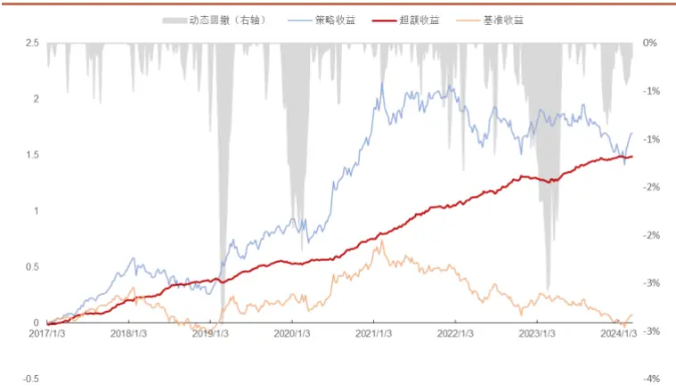
资料来源：招商证券、Wind，双边换手率 20%

图 21：沪深 300指数增强净值走势（全市场选股）
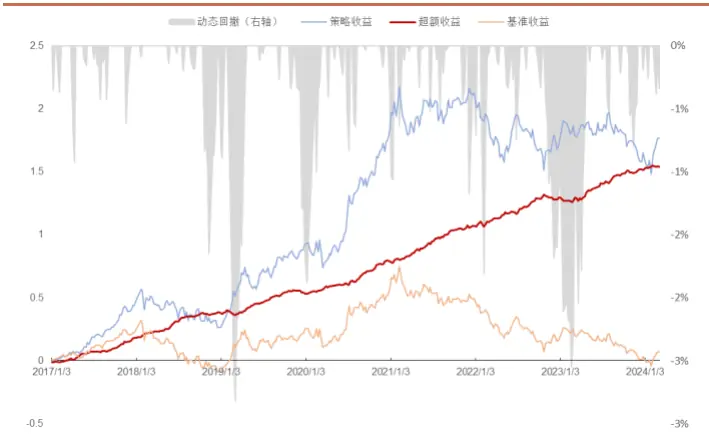
资料来源：招商证券、Wind，双边换手率 20%

沪深 300 指增策略的表现良好，在成分股内选股和全市场选股的表现差异不大，这说明在进行严格的风格和行业主动偏离控制之后，300 指增策略成分股占比相对较高。此外随着换手率的提高，策略表现随之下降，这说明交易费用侵蚀了因子多头收益率。

在双边换手 20%的控制下，成分股内选股 300指增的信息比率为 4.18，年化跟踪误差为 3.62%；全市场选股 300 指增的信息比率为 4.14，年化跟踪误差为 3.73%。

## 3.2. 中证500指数增强策略（周频）

表14：中证500指数增强策略分年度表现（100%成分股内选股）

|  | tvr=0.2 |  |  | tvr=0.4 |  |  | tvr=0.6 |  |  |
| --- | --- | --- | --- | --- | --- | --- | --- | --- | --- |
|  | 指标 绝对收益 | 超额收益 | 超额最大回撤 | 绝对收益 | 超额收益 | 超额最大回撤 | 绝对收益 | 超额收益 | 超额最大回撤 |
| 2017 | 13.49% | 13.57% | -1.83% | 11.36% | 11.46% | -1.83% | 9.79% | 9.89% | -1.83% |
| 2018 | -19.48% | 20.23% | -1.23% | -18.65% | 21.26% | -1.17% | -22.66% | 15.28% | -1.69% |
| 2019 | 40.42% | 8.29% | -2.73% | 37.03% | 5.64% | -3.45% | 33.50% | 2.90% | -4.52% |
| 2020 | 43.12% | 20.78% | -1.12% | 44.81% | 22.22% | -0.49% | 38.71% | 17.11% | -0.53% |
| 2021 | 37.19% | 18.61% | -1.61% | 35.13% | 16.83% | -0.81% | 32.53% | 14.55% | -0.76% |
| 2022 | -3.23% | 21.01% | -0.67% | -7.32% | 15.94% | -0.73% | -10.53% | 11.95% | -0.78% |
| 2023 | 0.34% | 8.17% | -1.37% | -1.17% | 6.53% | -1.68% | -4.68% | 2.73% | -3.63% |
| YTD | -1.46% | -0.23% | -1.34% | -0.97% | 0.15% | -1.77% | -1.02% | 0.12% | -1.54% |
| 全样本 | 13.00% | 15.18% | -2.73% | 11.60% | 13.71% | -3.45% | 8.16% | 10.21% | -5.40% |

资料来源：招商证券、Wind

表15：中证500指数增强策略分年度表现（全市场选股）

| tvr=0.2 |  |  |  |  | tvr=0.4 |  | tvr=0.6 |  |  |
| --- | --- | --- | --- | --- | --- | --- | --- | --- | --- |
| 指标 | 绝对收益 | 超额收益 | 超额最大回撤 | 绝对收益 | 超额收益 | 超额最大回撤 | 绝对收益 | 超额收益 | 超额最大回撤 |
| 2017 | 18.55% | 18.47% | -2.02% | 22.03% | 21.95% | -2.02% | 17.98% | 17.91% | -2.04% |
| 2018 | -10.62% | 33.01% | -1.32% | -11.35% | 31.99% | -1.05% | -14.03% | 28.04% | -1.08% |
| 2019 | 52.40% | 17.16% | -6.98% | 49.26% | 14.74% | -7.02% | 46.91% | 12.88% | -7.87% |
| 2020 | 48.65% | 25.59% | -1.18% | 48.86% | 25.78% | -0.98% | 46.09% | 23.42% | -0.84% |
| 2021 | 41.71% | 22.32% | -1.17% | 42.87% | 23.41% | -0.78% | 41.92% | 22.55% | -1.23% |
| 2022 | 0.00% | 24.71% | -1.26% | -1.91% | 22.46% | -1.56% | -5.27% | 18.37% | -1.70% |
| 2023 | 9.22% | 17.62% | -1.45% | 9.19% | 17.59% | -1.07% | 7.48% | 15.76% | -1.44% |
| YTD | 1.19% | 1.92% | -5.10% | 0.05% | 0.82% | -4.73% | -0.31% | 0.46% | -4.76% |
| 全样本 | 20.19% | 22.22% | -6.98% | 19.83% | 21.90% | -7.02% | 17.20% | 19.23% | -7.87% |

资料来源：招商证券、Wind

图 22：中证 500指数增强净值走势（100%成分股）
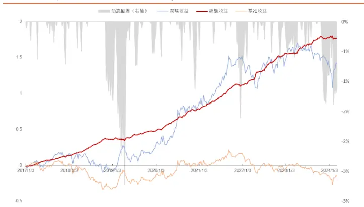
资料来源：招商证券、Wind，双边换手率 20%

图 23：中证 500指数增强净值走势（全市场选股）
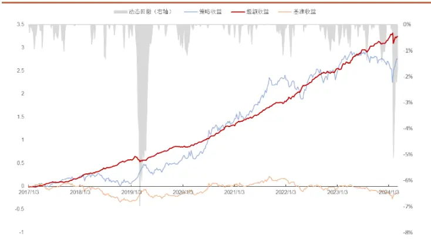
资料来源：招商证券、Wind，双边换手率 20%

中证 500指增策略在 20%双边换手率和 40%双边换手率控制下，在成分股内表现差异显著，但在全市场选股的场景下则差距很小。此外，全市场选股场景下 500指增的最大回撤明显增大。

在双边换手 20%的控制下，成分股内选股 500指增的信息比率为 4.58，年化跟踪误差为 3.63%；全市场选股 500 指增的信息比率为 4.03，年化跟踪误差为 5.65%。

## 3.3. 中证1000指数增强策略（周频）

表16：中证1000指数增强策略分年度表现（100%成分股内选股）

|  | tvr=0.2 |  |  | tvr=0.4 |  |  | tvr=0.6 |  |  |
| --- | --- | --- | --- | --- | --- | --- | --- | --- | --- |
|  | 指标 绝对收益 | 超额收益 | 超额最大回撤 | 绝对收益 | 超额收益 | 超额最大回撤 | 绝对收益 | 超额收益 | 超额最大回撤 |
| 2017 | -3.60% | 16.43% | -1.84% | -0.80% | 19.84% | -2.01% | -3.72% | 16.29% | -2.15% |
| 2018 | -16.04% | 32.37% | -0.89% | -16.47% | 31.69% | -0.76% | -18.51% | 28.52% | -0.97% |
| 2019 | 63.25% | 25.99% | -4.32% | 60.51% | 23.92% | -4.86% | 55.01% | 19.68% | -5.02% |
| 2020 | 45.68% | 24.95% | -0.86% | 43.90% | 23.42% | -1.31% | 41.06% | 20.91% | -1.09% |
| 2021 | 45.06% | 20.23% | -0.71% | 43.36% | 18.87% | -0.85% | 40.36% | 16.40% | -0.97% |
| 2022 | -2.12% | 24.35% | -1.72% | -3.01% | 23.16% | -1.11% | -6.77% | 18.41% | -1.85% |
| 2023 | 12.59% | 19.91% | -0.81% | 8.81% | 15.91% | -1.01% | 5.89% | 12.77% | -1.12% |
| YTD | -6.33% | 2.53% | -0.47% | -7.51% | 1.18% | -0.79% | -8.02% | 0.67% | -1.00% |
| 全样本 | 15.84% | 23.08% | -4.32% | 14.66% | 21.83% | -4.86% | 11.48% | 18.45% | -5.02% |

资料来源：招商证券、Wind

表17：中证1000指数增强策略分年度表现（全市场选股）

|  | tvr=0.2 |  |  | tvr=0.4 |  |  | tvr=0.6 |  |  |
| --- | --- | --- | --- | --- | --- | --- | --- | --- | --- |
|  | 指标 绝对收益 | 超额收益 | 超额最大回撤 | 绝对收益 | 超额收益 | 超额最大回撤 | 绝对收益 | 超额收益 | 超额最大回撤 |
| 2017 | 5.00% | 26.64% | -1.70% | 9.33% | 31.81% | -1.70% | 6.73% | 28.75% | -1.70% |
| 2018 | -8.45% | 43.53% | -2.17% | -9.95% | 41.53% | -1.77% | -11.95% | 38.42% | -2.16% |
| 2019 | 59.95% | 23.19% | -6.14% | 56.77% | 20.69% | -7.27% | 53.19% | 17.91% | -7.16% |
| 2020 | 52.33% | 30.53% | -0.90% | 52.63% | 30.63% | -1.26% | 49.45% | 27.88% | -1.15% |
| 2021 | 49.66% | 23.89% | -0.86% | 51.24% | 25.31% | -0.50% | 48.60% | 23.10% | -0.57% |
| 2022 | -1.76% | 24.68% | -1.50% | -3.03% | 23.15% | -1.32% | -5.19% | 20.43% | -1.59% |
| 2023 | 15.11% | 22.31% | -1.82% | 10.79% | 17.72% | -2.72% | 8.49% | 15.32% | -2.69% |
| YTD | -6.91% | 1.60% | -2.81% | -8.44% | -0.07% | -3.82% | -8.14% | 0.12% | -4.16% |
| 全样本 | 19.88% | 27.06% | -6.14% | 19.03% | 26.19% | -7.27% | 16.60% | 23.61% | -7.16% |

资料来源：招商证券、Wind

图 24：中证 1000 指数增强净值走势（100%成分股）
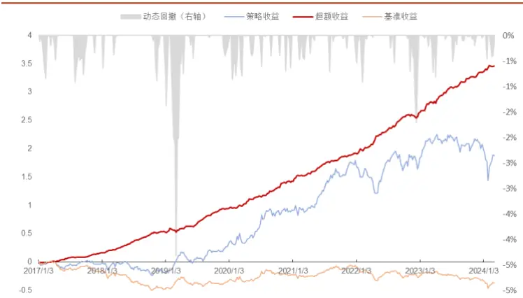
资料来源：招商证券、Wind，双边换手率 20%

图 25：中证 1000指数增强净值走势（全市场选股）
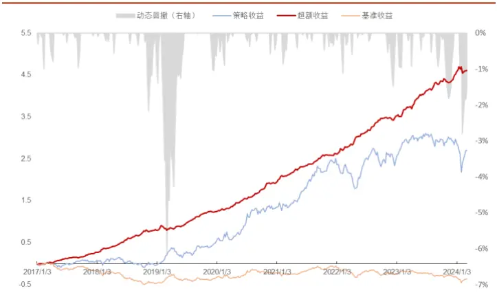
资料来源：招商证券、Wind，双边换手率 20%

中证 1000 指增策略在双边 20%和 40%换手率控制下差距较小。此外和500 指增类似的是在全市场选股场景下，最大回撤明显增大。这说明基于统计的风格控制，很难规避完全规避尾部风险。

在双边换手 20%的控制下，成分股内选股 500指增的信息比率为 5.12，年化跟踪误差为 4.57%；全市场选股 1000 指增的信息比率为 4.69，年化跟踪误差为 5.71%。

## 四、总结

本文在前期报告中的多模型日频量价因子的基础上增加了 Alpha158因子数据集以及周频量价数据集。从结果来看，结合日频原始量价和量价因子以及周频原始量价信息的综合量价因子相比于前期的日频量价因子的表现有一定的提升，但提升相对有限。

进一步，本文考虑到量价信息只是资产定价的一个维度，在机器学习模型中融入基本面信息。本文主要从两个方面来改进原始的量价机器学习模型。一方面，从学习目标收益率的风格剔除的角度，本文测试了剔除不同的基本面风格因子后的目标收益率对模型的影响，发现剔除行业、市值、Beta 这三类主要风格之后模型的表现最优，继续剔除其他基本面风格后，模型的表现开始下降。这可能说明机器学习模型仍然能够从这些基本面信息提取增量 Alpha 信息。因此，本文考虑在 Alpha维度增加基本面相关的因子来提高模型的表现。

量价类因子和基本面类因子的信息存在一定互补性，从因子的统计特性来看，一般量价类因子的 IC 均值偏高，因子换手率偏高，多空组合表现更稳定；基本面类的因子换手率更低，分组收益率的对称性更好，但 IC 和 ICIR 偏低，多空组合的稳定性一般。

本文通过一个相对短期训练的梯度提升树（GBDT）模型来集成量价因子模型和现有的基本面因子，GBDT 模型的优点在于对缺失值不敏感，且训练速度快，适合短周期的训练和预测。在结合了基本面因子和综合量价因子的信息后构成的综合因子多头收益率有了明显提升。综合因子的 IC、ICIR 表现有一定的下降但可以接受，因为在选股的场景下，多头收益率的表现是更重要的评价指标。

最后本文基于集成因子构建了基于沪深 300、中证 500 和中证 1000 的周频指增策略。各指增策略表现良好，沪深 300 指数增强策略在成分股内选股和全市场选股的表现差异不大。中证 500 策略和中证 1000 策略在全市场选股的场景下，收益表现更好，但最大回撤也显著增大，这说明基于统计的风格控制，很难完全规避尾部风险。

## 分析师承诺

负责本研究报告的每一位证券分析师，在此申明，本报告清晰、准确地反映了分析师本人的研究观点。本人薪酬的任何部分过去不曾与、现在不与，未来也将不会与本报告中的具体推荐或观点直接或间接相关。

## 评级说明

报告中所涉及的投资评级采用相对评级体系，基于报告发布日后 6-12 个月内公司股价（或行业指数）相对同期当地市场基准指数的市场表现预期。其中，A股市场以沪深 300指数为基准；香港市场以恒生指数为基准；美国市场以标普 500指数为基准。具体标准如下：

## 股票评级

强烈推荐：预期公司股价涨幅超越基准指数 20%以上

增持：预期公司股价涨幅超越基准指数 5-20%之间

中性：预期公司股价变动幅度相对基准指数介于±5%之间

减持：预期公司股价表现弱于基准指数 5%以上

## 行业评级

推荐：行业基本面向好，预期行业指数超越基准指数

中性：行业基本面稳定，预期行业指数跟随基准指数

回避：行业基本面转弱，预期行业指数弱于基准指数

## 重要声明

本报告由招商证券股份有限公司（以下简称“本公司”）编制。本公司具有中国证监会许可的证券投资咨询业务资格。本报告基于合法取得的信息，但本公司对这些信息的准确性和完整性不作任何保证。本报告所包含的分析基于各种假设，不同假设可能导致分析结果出现重大不同。报告中的内容和意见仅供参考，并不构成对所述证券买卖的出价，在任何情况下，本报告中的信息或所表述的意见并不构成对任何人的投资建议。除法律或规则规定必须承担的责任外，本公司及其雇员不对使用本报告及其内容所引发的任何直接或间接损失负任何责任。本公司或关联机构可能会持有报告中所提到的公司所发行的证券头寸并进行交易，还可能为这些公司提供或争取提供投资银行业务服务。客户应当考虑到本公司可能存在可能影响本报告客观性的利益冲突。

本报告版权归本公司所有。本公司保留所有权利。未经本公司事先书面许可，任何机构和个人均不得以任何形式翻版、复制、引用或转载，否则，本公司将保留随时追究其法律责任的权利。