# 混合频率量价因子模型初探

量化选股策略

## ——AI 系列研究之四

在前期的研究中，我们发现不同频率的量价信息对于构建综合量价机器学习选股模型相比于单一频率的量价数据有一定的增量贡献。在本文中，量价机器机器学习模型进一步拓展到周频、日频、15min 频量价三个维度。同时，为了缓解不同数据集学习到的因子相关性较高的问题，本文提出了基于残差增量学习和特征提升的混合量价机器学习框架用于构建综合机器学习量价因子。在因子测试和策略构建的结果来看，我们提出的混合频率量价因子模型相比于基准模型有比较明显的提升。

❑ 前期报告中，我们提出了基于多模型多数据集的综合量价因子构建流程。该模型取得了良好的效果，但是也存在一些问题，例如不同数据集学习得到量价因子相关性较高等。

❑ 在周频、日频原始量价数据构建的简单等权模型基础上加入 15min 数据集之后模型的表现有一定的提升。

❑ 为了缓解不同数据集学习到的因子之间较高的相关性，本文提出基于数据集的残差增量学习框架，从结果来看，相比于简单等权的模型，残差增量学习的综合量价因子的表现进一步提升。

❑ 为了更大限度地利用不同量价数据集的信息，本文进一步提出了在数据集残差增量学习框架的基础上构建多维特征，最后使用梯度提升技术来整合特征的残差增量学习+特征提升的混合频率综合量价因子学习框架。从 2017 年至今的表现来看，综合因子的周频 RankIC 达到 13.15%，全 A 分 20 组的多头超额年化收益率达到 38.01%，显著超过基准的表现。

❑ 在因子的风险和风格分析过程中，本文发现综合因子与流动性（Liquidity）和残差波动率（Residual Volatility）的平均截面相关性稍高分别为-0.38 和-0.42；在因子多头的尾部风险敞口分析中发现因子的主要的尾部风险来自小市值股票的暴跌。

❑ 基于综合因子，本文构建了对应宽基指数的周频指数增强策略，其中：

❑ 全市场选股的沪深 300 周频指增策略年化超额收益率为 13.75%，超额最大回撤 6.91%，信息比率为3.51，年化跟踪误差为4.44%；

❑ 全市场选股的中证500周频指增策略年化超额收益率为 19.79%，超额最大回撤 6.76%，信息比率为3.48，年化跟踪误差为6.11%；

❑ 全市场选股的中证 1000周频指增策略年化超额收益率为 23.48%，超额最大回撤 5.44%，信息比率为3.96，年化跟踪误差为5.80%。

❑ 风险提示：量化策略基于历史数据统计，模型存在失效的可能性。

任 瞳S1090519080004

rentong@cmschina.com.cn

周 游S1090523070015

zhouyou4@cmschina.com.cn

## 一、多模型多数据集量价机器学习模型

## 1.1. 基于日频量价的多模型 Alpha框架

在前期报告中，我们构建了基于日频量价的机器学习模型。使用的数据主要包括：日频量价、周频量价、Alpha158因子集合。 该模型利用不同的机器学习模型在单个数据集上进行学习得到对应数据集的因子，然后通过等权加权得到综合量价因子。在不同成分股内的测试结果来看，基于日频量价信息构建的因子在 RankIC 均值、多头超额收益率水平这些统计量上都表现稳定且良好。

表1：量价因子模型数据集相关固定参数说明

| 名称 | 参数说明 |
| --- | --- |
| 股票池 | 全A股票，剔除上市不满三个月、ST、*ST、停牌的股票、沪深300、中证500、中证1000等 |
| 数据集 | 日线量价数据、周频量价数据等 |
| 预测 label | T+1 日至T+11日复权日内 VWAP价格收益率 |
| 调仓周期 | 每周第一个交易日按照上一个交易日的因子生成持仓信息 |
| 因子预处理 | MAD标准化，3倍MAD以外异常值截断，缺失值填充为0 |
| Label 预处理 | 基于风格的风险调整，label截面 zscore标准化 |
| 对比基准 | 对应股票池的等权组合 |
| Batch 定义 | 一个交易日截面上所有的股票作为一个batch |
| 数据划分 | 20110901-20240816，滚动训练模式；在训练集中划分1年为验证集；测试集为最近1年（每年训练一 次） |

资料来源：招商证券

图 1：日频机器学习综合量价因子构建流程
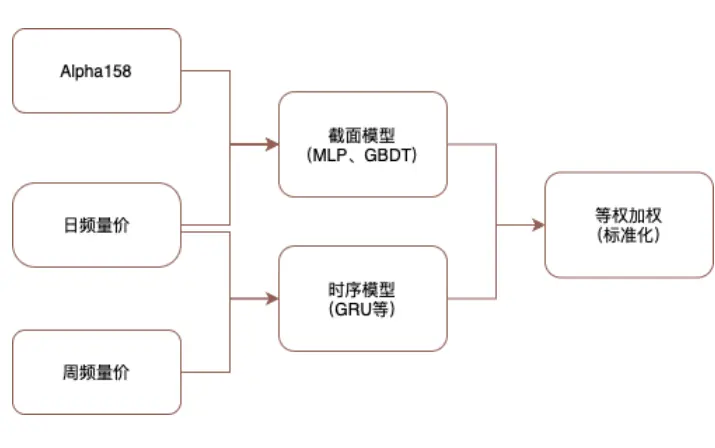
资料来源：招商证券，

图 2：不同数据集构建的量价两两相关性
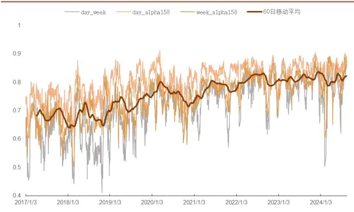
资料来源：招商证券，注：单个数据集因子学习模型包括：MLP、GBDT、GRU。

表2：不同数据集对应的量价因子表现（全A，20组）

|  | RankIC 均值 | ICIR | IC 胜率 | IC的t值 | 多头超额 | 多头超额夏普 | 多头超额最大回撤 | 多头周均换手率 |
| --- | --- | --- | --- | --- | --- | --- | --- | --- |
| 日频量价 | 11.19% | 1.07 | 86.69% | 45.84 | 29.87% | 1.47 | -13.96% | 67.10% |
| 周频量价 | 10.66% | 0.98 | 84.58% | 42.27 | 31.51% | 1.49 | -16.51% | 60.60% |
| A1pha158 | 11.17% | 1.07 | 85.88% | 45.12 | 28.49% | 1.39 | -16.75% | 64.30% |
| 综合量价因子 | 12.04% | 1.06 | 86.04% | 45.48 | 32.76% | 1.57 | -13.95% | 61.20% |

资料来源：Wind、招商证券，回溯期：20170101-20240816，滚动 5 日计算，收益率为年化结果，基准：全 A 等权

总体表现来看，“单数据集单模型”<“单数据集多模型” < “多数据集多模型”。 不过在研究中，我们也发现不同模型和不同数据集构建出来的因子彼此之间的相关性还是偏高，这说明不同数据集学习到的增量信息相对有限。如何进一步提高综合量价因子的表现，引入更高频的量价数据是比较自然的思路。

## 二、基于混合频率量价数据的量价因子构建

## 2.1. 多频率数据集的构建和测试

在上一个章节中，本文探讨了多模型多数据集得到的综合量价因子的框架。虽然最终结果还是有不错的表现，但是不同数据集的细分量价因子的相关性还是偏高。如何通过不同频率的量价信息获得相关性更低的细分量价因子是一个值得探讨的问题。

在前期报告中，我们测试了不同模型在人工构建的弱因子集合（Alpha158）上的表现，发现无论是从因子表现的绝对水平以及对于综合因子的整体提升来看，Alpha158 因子集合相对于原始量价数据并无明显优势。因此在构建多频率量价因子模型的时候剔除弱因子集合（Alpha158），仅使用原始的日频、周频以及日内更高频的数据来进行构建。考虑到时间序列长度和硬件资源的限制，15分钟是比较合适的频率。

图 3：周频及 15min频率量价数据构建过程
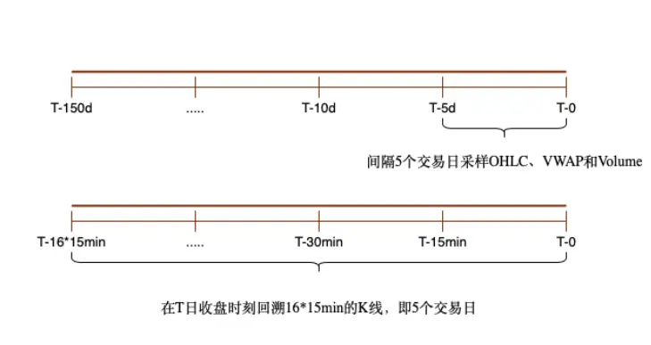
资料来源：招商证券

图 4：简单混合频率量价因子构建流程
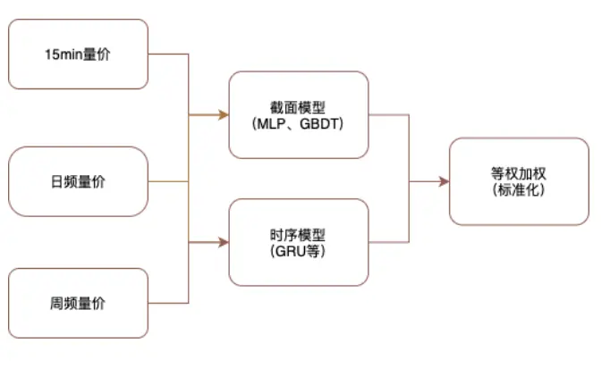
资料来源：招商证券

按照前文设置，我们分别利用不同的数据集来训练得到三个数据集对应得因子，最后等权加权得到简单加权的综合量价因子，并与前期构建的综合量价因子进行比较，观察 15min 量价数据构建的因子相比于日频和周频数据集构建的量价因子的增量。

表3：不同数据集构建的量价因子表现（周频，全A，20组）

|  | RankIC 均值 | ICIR | IC 胜率 | IC的t值 | 多头超额 | 多头超额夏普 | 多头超额最大回撤 | 多头周均换手率 |
| --- | --- | --- | --- | --- | --- | --- | --- | --- |
| 周频量价 | 11.19% | 1.07 | 86.69% | 45.84 | 29.87% | 1.47 | -13.96% | 67.10% |
| 日频量价 | 10.66% | 0.98 | 84.58% | 42.27 | 31.51% | 1.49 | -16.51% | 60.60% |
| 15min 量价 | 10.17% | 1.03 | 86.51% | 44.22 | 29.91% | 1.42 | -14.53% | 68.20% |
| 综合量价 | 12.48% | 1.08 | 86.24% | 46.30 | 34.55% | 1.63 | -13.16% | 60.90% |

资料来源：Wind、招商证券，回溯期：20170101-20240816，滚动 5 日计算，收益率为年化结果 22，基准：全A 等权

从实证结果来看，基于 15min 量价数据构建的量价因子与周频、日频数据构建的因子在单一数据集层面的差距较小。从 RankIC 水平、多头超额年化水平、多头超额最大回撤等指标的表现来看，加入 15min 数据构建的因子后，整体综合量价因子的表现有了进一步提升。进一步分析三个细分量价因子的相关性，day_week 平均截面相关系数为 0.71，day_15min 的平均两两相关系数为 0.79，week_15min 的平均两两相关系数为 0.64，周频和 15min频的量价因子之间的相关性稍低。

图 5：不同频率数据构建的综合量价因子两两相关系数
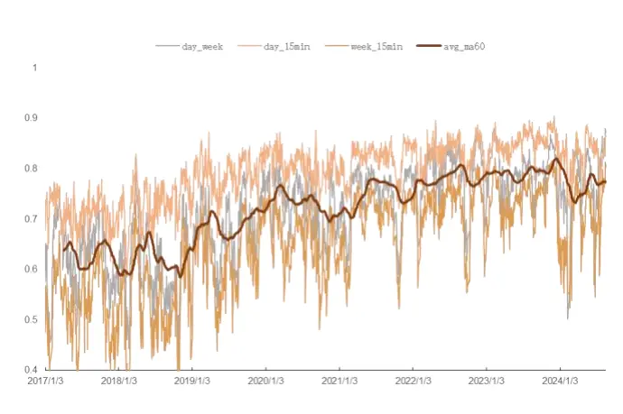
资料来源：Wind、招商证券

图 6：（新因子 vs旧因子）多头超额净值
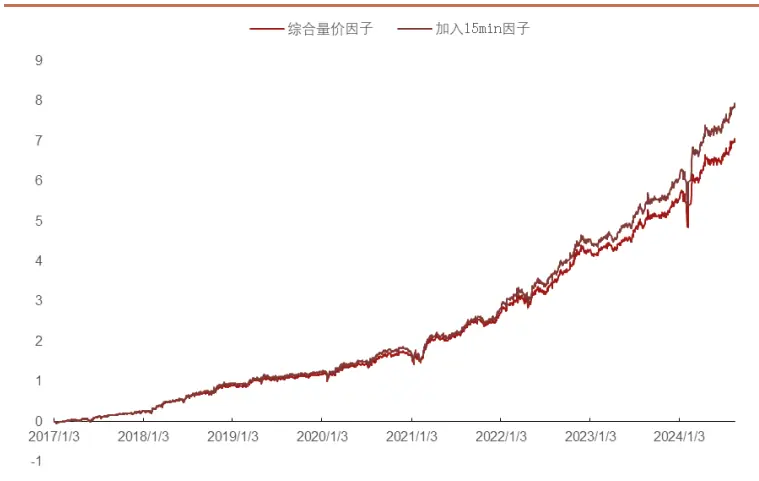
资料来源：Wind、招商证券，注：自然坐标

在本节中，本文构建了 15min 量价数据集且在数据集上利用多模型学习的方式构建了细分的 15min 细分量价因子，并按照前期综合量价因子的构建流程（简单等权）的方式构建了新的综合量价因子。

从不同频率的量价因子的两两相关性来看，15min 频率的量价因子与 week频率的量价因子相关性相对最低。新的综合量价因子相比于前期构建的综合量价因子在 RankIC 、多头超额收益率和超额最大回撤等方面都有一定的提高。但是也可以发现不同细分量价因子之间的相关性还是偏高。在下文中，我们将进一步探讨如何降低不同细分因子之间的相关性，提高综合量价因子的整体表现。

## 2.2. 多频率量价数据残差增量学习框架

在机器学习场景中提高整体模型表现的主要思路包括：增加特征的种类和数量，模型层面的集成等。综合机器学习因子的构建框架可以表述为：

$$
\alpha_{_t}^{^*}=ESS(Model_{_1}X_{_t},\qquad\quad_{_2}X_{_{_{\scriptsize{~t}}}}.)
$$

其中 $X_{t}$ 为在 t 时刻的特征矩阵。在上述章节中，本文分别测试了日频、周频、15min 量价数据基于常见机器学习模型的因子学习结果，在简单等权这样相对简单的集成方式下，综合因子的表现相比于单个模型和数据集的结果也是有一定提升。本节将探讨如何从算法层面进一步从不同的数据集中挖掘出更多的增量信息，从而提高整体综合量价因子的表现。

回顾模型集成的方式，通常有以下几类：

## 1) Bagging（特征选择）：

RandomForest：通过组合多棵决策树进行预测，每棵树都在不同的样

本子集上训练。

2) Boosting（提升方法）：

a) AdaBoost：逐步训练弱学习器，每个新模型更关注前一个模型中错误分类的样本。

b) Gradient Boosting：通过优化损失函数，逐步添加模型。

## 3) Voting & Stacking：

将多个基础模型的预测结果作为输入进行投票或平均（固定权重），训练一个模型进行最终预测（优化权重）。

这些算法通过不同的方式组合多个模型，通常能够提高模型的准确性和鲁棒性。每种方法都有其适用的场景和优缺点。其他集成学习算法大多可以归为上述集成学习算法的变体或组合。

图 7：Stacking方法典型算法流程
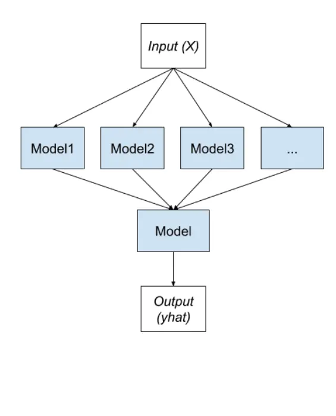
资料来源：招商证券

图 8：Boosting方法典型算法流程
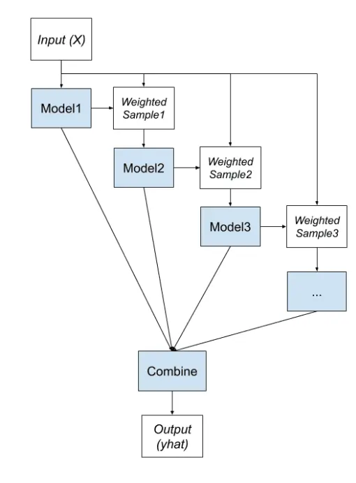
资料来源：招商证券

简单总结，集成方法主要是通过组合不同的模型来提高综合模型的表现，其中 Voting 和 Stacking是在模型训练完成后通过固定权重或者通过训练模型的方式加权现有模型输出。Bagging 和 Boosting 类的方法是通过改变训练样本的权重或学习目标来使得新训练的模型加入现有的模型组合能够在训练集改善整体的预测表现。

在 Alpha 因子生成模型中，Bagging 和 Boosting 类的方法是比较契合因子构建流程的。借鉴机器学习模型的集成方法，那么比较自然的改进思路有：

1) 特征选择（特征权重调整）：通过给予关注的样本更高的权重，例如收益率更高的样本。

2) 学习目标的优化：通过设置不同学习目标来获得关注点不同的模型（因子）；考虑现有模型（因子）的表现来训练新模型等。

本节希望设计一个算法流程在已有的模型（因子）基础上获得具有信息增量的模型（因子）。首先想到的思路就是通过梯度提升的方法来逼近最终结果。假设第一个模型学习目标为MSE：

$$
\operatorname*{min}_{\mathbf{\theta}}\operatorname*{Mel}_{N}\left\|\mathbf{\theta}\mathbf{\theta}^{\mathrm{~\scriptsize~~}}\mathbf{\theta}^{\mathrm{~\scriptsize~~}}\mathbf{X}^{\mathrm{~\scriptsize~~}}\right\|_{2}^{2}
$$

那么y关于 $\mathbf{Model}_{\theta}$ 的梯度即为 $\nabla_{\hat{\mathbf{y}}}\mathbb{\hat{F}}\frac{2}{\hat{N}}-\hat{\mathbf{\nabla}}$ ，其中 $\hat{\mathbf{y}}$ 为 ModelX 的预测值。那么第二个模型的的预测目标应当为 $-\eta\nabla_{\hat{\mathbf{y}}}$ ，其中 为学习率，从而保证后续模型的预测具有一定的增量信息。 $-\eta\nabla_{\hat{\mathbf{y}}}$ 事实上就是标签减去现有模型预测值的残差乘以一个固定的常数。在本文的场景下，希望从不同频率的数据集中提取增量的信息，记 week、day、15min 量价数据集的样本矩阵分别为 $\mathbf{X}_{1},\mathbf{X}_{2},\mathbf{X}_{3}$ ，训练流程如下：

1) $\mathbf{X}_{w}训练Model_{\theta_{l}}\mathbf{X}$ ，其标签为 $\mathbf{y}$ ，预测值为 $\hat{\mathbf{y}}_{\theta_{1}}$

2) $\mathrm{X}_{\mathrm{d}}切练\mathrm{Model}_{\theta_{2}}\mathrm{X}_{\mathrm{z}}$ ，其标签为 $\mathbf{y}-\eta\hat{\mathbf{y}}_{\theta_{1}}$ ，预测值为 $\hat{\mathbf{y}}_{\theta_{2}}$

3) 对于 $\mathbf{X}_{\mathrm{min}}$ 训 $练^{Model_{\theta_{3}}}X$ ，其标签为 $\mathbf{y}-\eta(\frac{1}{2}\hat{\textbf{ y }}_{\theta_{1}}+\hat{\textbf{ y }}_{\theta_{2}}$ ，预测值$为\hat{\mathbf{y}}_{3}$

4) 最终，集成模型的输出为 $\hat{\mathbf{y}}=\frac{1}{N}\sum\mathrm{Model}_{\theta_{k}^{3}}\mathbf{X}_{k},N=$ 其中 为固定常数。

图 9：基于数据集的残差增量学习框架
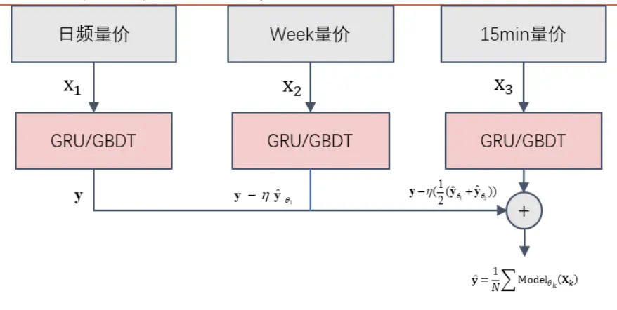
资料来源：招商证券

表4：不同集成学习流程构建的量价因子表现（周频，全 A，20组）

| 不同集成方式 | RankIC 均值 | ICIR | IC 胜率 | IC的t值 | 多头超额 | 多头超额夏普 | 多头超额最大回撤 | 多头周均换手率 |
| --- | --- | --- | --- | --- | --- | --- | --- | --- |
| η=0.05 | 12.01% | 1.06 | 85.70% | 45.59 | 35.04% | 1.63 | -14.88% | 60.08% |
| η=0.1 | 12.61% | 1.08 | 86.29% | 46.53 | 35.68% | 1.67 | -13.36% | 59.00% |
| η=0.2 | 12.37% | 1.06 | 85.86% | 45.69 | 34.79% | 1.62 | -14.32% | 58.60% |
| 等权综合因子 | 12.48% | 1.08 | 86.24% | 46.30 | 34.55% | 1.63 | -13.16% | 60.90% |

资料来源：招商证券，回溯期：20170101-20240816，滚动 5日计算，收益率为年化结果，基准：全 A 等权

基于上述算法流程，本文构建了对应不同常数 的残差增量学习框架的综合量价因子。从结果来看，相比于分别在不同频率的量价数据集上单独训练然后等权加权的模型，本节提出的基于残差的增量学习流程比较明显地提高了集成模型的整体表现。

进一步思考，这个残差学习流程每次学习的目标都是优化上一次的负梯度从而逼近最优的结果，同时也有一定的缺点：

1) 迭代的次数较少（3次） ，增量相对有限;;

2) 对于每个数据集之间的特征在学习的过程中相互独立，没有交互。

现有的工具中，GBDT 类的模型工具是相对比较成熟的梯度提升框架。如果可以利用三个数据集构建不同类型的特征，然后用 GBDT 来整合不同数据集得到的特征进行梯度提升从理论上来说可以比较好的解决上述两个问题。

图 10：基于特征的残差增量学习框架
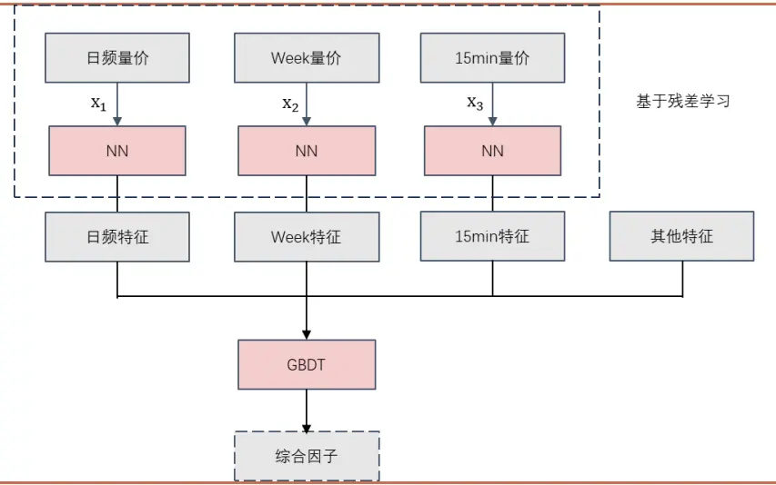
资料来源：招商证券

具体而言，如图 10 所示，NN 表示神经网络模型。本文希望在不同的数据集上通过神经网络模型基于上述的残差增量学习流程学习得到不同的特征矩阵 $\mathbf{F}_{1,k_1\times N},\quad\mathbf{F}_{2,k_2\times N},\quad\mathbf{F}_{3,k_3\times N}$ 。其中 $k_{i}$ 表示生成的特征个数，N 表示样本数。假设其他特征的个数为 $k_{4}$ ，那么输入 GBDT 模型的特征为所有特征拼接后的特征矩阵 $\mathbf{F}_{_{k_{f}\times N}},\quad k_{_f}=\sum k_{_i}$ 0

通过 NN（不同类型的神经网络）进行特征生成的方式根据不同的网络结构和学习目标有不同的结果，这里以 GRU作为特征提取模型，其他特征提取模型在后续研究中继续深入探讨。以 GRU作为特征提取模型的结构最简单的方式如图 11所示，GRU的最后一个时间步的输出作为生成的特征。

图 11：一个典型的 GRU特征提取流程
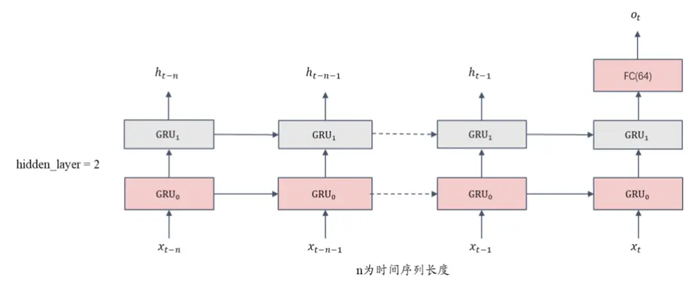
资料来源：招商证券

从单个数据集上的表现来看，GRU 提取的因子相关性较低（这里以 2017年生成的因子为例）。周频数据集上生成的因子平均相关系数约为 0.43；日频数据集生成的因子平均相关系数约为 0.42；15min 数据集上生成的因子平均相关系数约为0.41。

表5：在不同量价数据集上生成的部分因子 IC统计量

| 数据集 | 因子编号 | RankIC | ICIR | IC 胜率 | t值 | P值 | 偏度 | 峰度 |
| --- | --- | --- | --- | --- | --- | --- | --- | --- |
| 周频数据集 | week_alpha_54 | 0.099 | 1.11 | 85.32% | 17.70 | 0.00 | 0.00 | -0.15 |
|  | week_alpha_31 | 0.098 | 1.11 | 86.11% | 17.62 | 0.00 | 0.10 | -0.52 |
|  | week_alpha_57 | 0.098 | 1.14 | 87.30% | 18.08 | 0.00 | 0.19 | -0.40 |
|  | week_alpha_5 | 0.094 | 1.05 | 86.11% | 16.66 | 0.00 | 0.12 | -0.19 |
|  | week_alpha_3 | 0.094 | 0.98 | 83.73% | 15.59 | 0.00 | -0.09 | -0.06 |
|  | week_alpha_37 | 0.093 | 0.94 | 80.95% | 14.99 | 0.00 | 0.19 | -0.18 |
|  | week_alpha_62 | 0.092 | 0.97 | 83.33% | 15.41 | 0.00 | 0.15 | -0.34 |
|  | week_alpha_29 | 0.088 | 1.08 | 86.11% | 17.07 | 0.00 | -0.12 | -0.26 |
|  | week_alpha_23 | 0.087 | 0.92 | 80.56% | 14.66 | 0.00 | 0.22 | -0.22 |
|  | week_alpha_58 | 0.086 | 0.78 | 77.38% | 12.40 | 0.00 | 0.09 | -0.38 |
|  | day_alpha_37 | 0.153 | 1.73 | 93.65% | 27.46 | 0.00 | -0.14 | -0.33 |
|  | day_alpha_62 | 0.150 | 1.72 | 94.44% | 27.31 | 0.00 | -0.18 | -0.34 |
| day_alpha_31 |  | 0.144 | 1.76 95.63% | 27.88 | 0.00 | -0.02 | -0.17 |  |
| day_alpha_57 | 0.144 | 1.64 | 93.65% | 25.96 | 0.00 | -0.02 | -0.26 |  |
| day_alpha_58 | 0.140 | 1.50 | 91.67% | 23.77 | 0.00 | -0.17 | -0.43 |  |
| day_alpha_59 | 0.138 | 1.65 | 94.05% | 26.13 | 0.00 | -0.24 | -0.50 |  |
| day_alpha_12 | 0.136 | 1.40 | 91.67% | 22.22 | 0.00 | 0.05 | 0.02 |  |
| 分钟频数据集 | day_alpha_39 | 0.134 | 1.49 | 93.65% | 23.60 | 0.00 | 0.01 | 0.23 |
|  | day_alpha_30 | 0.133 | 1.51 | 90.48% | 23.95 | 0.00 | -0.05 | -0.18 |
|  | day_alpha_0 | 0.130 | 1.33 | 89.68% | 21.19 | 0.00 | -0.07 | -0.09 |
|  | min15_alpha_42 | 0.120 | 1.38 | 92.86% | 21.89 | 0.00 | -0.42 | 0.81 |
|  | min15_alpha_33 | 0.118 | 1.49 | 94.44% | 23.67 | 0.00 | -0.17 | 0.24 |
|  | min15_alpha_19 | 0.108 | 1.59 | 93.25% | 25.23 | 0.00 | 0.02 | 0.11 |
|  | min15_alpha_43 | 0.103 | 1.08 | 86.51% | 17.11 | 0.00 | -0.16 | 0.22 |
|  | min15_alpha_62 | 0.100 | 1.50 | 94.05% | 23.81 | 0.00 | -0.10 | 0.68 |
|  | min15_alpha_31 | 0.099 | 0.95 | 85.32% | 15.16 | 0.00 | -0.48 | 0.51 |
|  | min15_alpha_28 | 0.095 | 0.96 | 83.33% | 15.26 | 0.00 | -0.36 | 0.51 |
|  | min15_alpha_37 | 0.091 | 1.00 | 84.92% | 15.94 | 0.00 | -0.32 | 0.34 |
|  | min15_alpha_21 | 0.081 | 1.20 | 88.49% | 19.12 | 0.00 | -0.12 | 0.13 |
|  | min15_alpha_58 | 0.075 | 0.89 | 85.71% | 14.08 | 0.00 | -0.20 | 2.04 |

资料来源：Wind、招商证券，测试区间：20170101-20180101，全 A， 滚动 5日

本文中设置 GRU 提取的特征为 64 维即 64 个因子，对于三个不同的数据集共生成 3x64 维特征以及人工构建的 N 个特征共 3x64+N 个特征。这里以 Alpha158 为例来观察这一框架的表现。那么在 GBDT 中输入的特征个数则为 350维。

从结果来看，基于残差增量特征学习-特征梯度提升的混合频率量价因子学习框架从不同的因子统计量的表现相比于上文提到的两种学习框架来看都获得了比较可观的提升。

表6：不同混合频率量价因子学习框架得到的综合因子表现

| 学习框架 | RankIC 均值 | ICIR | IC 胜率 | IC的t值 | 多头超额 | 多头超额夏普 | 多头超额最大回撤 | 多头周均换手率 |
| --- | --- | --- | --- | --- | --- | --- | --- | --- |
| 简单等权 | 12.48% | 1.08 | 86.24% | 46.30 | 34.55% | 1.63 | -13.16% | 60.90% |
| 残差学习 | 12.61% | 1.08 | 86.29% | 46.53 | 35.68% | 1.67 | -13.36% | 59.00% |
| 残差学习+特征提升 | 13.15% | 1.12 | 86.78% | 48.16 | 38.01% | 1.76 | -12.35% | 58.10% |

资料来源：Wind、招商证券，回溯期：20170101-20240816，滚动 5 日计算，全A 分20 组，基准：全 A 等权

图 12：不同学习框架的综合因子多空组合净值对比
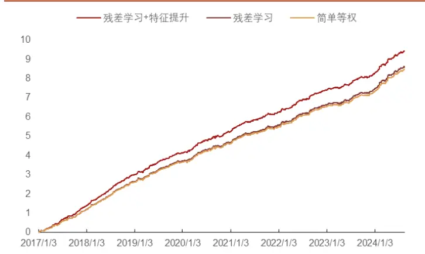
资料来源：Wind、招商证券，注：对数坐标

图 13：不同学习框架多头超额净值对比
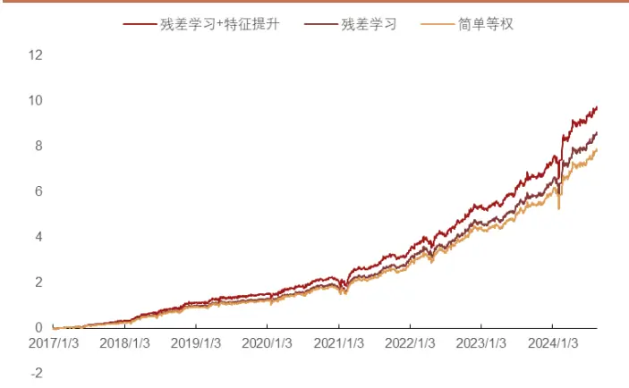
资料来源：Wind、招商证券，注：自然坐标

从多空累计净值和多头超额净值的表现来看，基于残差学习和特征提升的学习框架相比于简单等权和基于数据集的残差增量学习框架也都有比较明显的提升。在后面的章节中，本文将进一步对综合因子在不同成分股内的表现、风险暴露以及指增组合的表现进行测试。

## 三、因子分析和风格归因

## 3.1. 综合量价因子的单因子测试

本节按照单因子测试的常规流程对综合量价因子进行测试，回溯区为：20170101-20240816，股票池为同时期中证全指成分股。调仓周期为 5 日,调仓价格为次日 vwap价格。分组数为20组，不考虑交易费用。

图 14：综合因子分组超额年化收益率
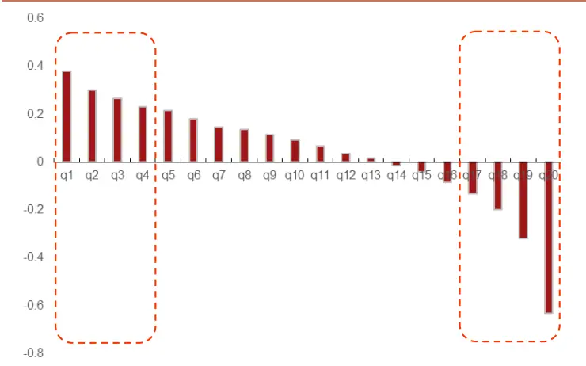
资料来源：招商证券、Wind、基准：全 A等权

图 15：综合因子历史 RankIC序列
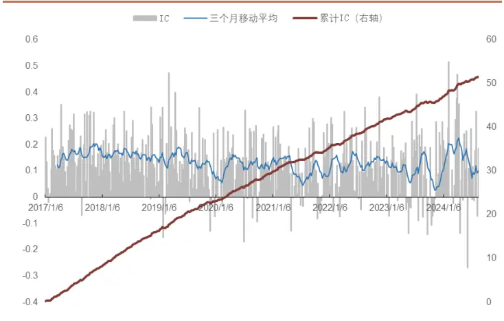
资料来源：招商证券、Wind，周频全 A

图 16：综合因子多空组合累计净值（对数坐标）
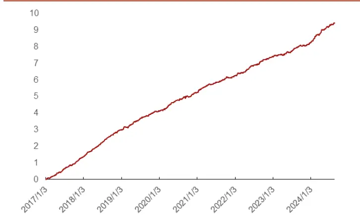
资料来源：招商证券、Wind，周频，全 A，20组

图 17：综合因子分组超额净值（自然坐标）
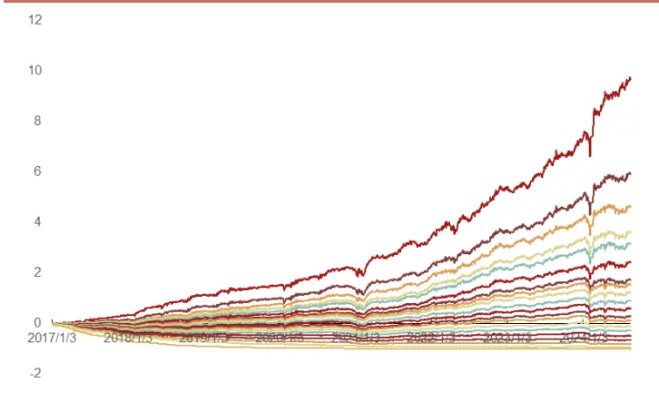
资料来源：招商证券、Wind，周频，全 A

表7：不同成分股中的综合因子表现

|  | RankIC 均值 | ICIR | IC 胜率 | IC的t值 | 多头超额 | 多头超额夏普 | 多头最大回撤 | 多头周均换手率 |
| --- | --- | --- | --- | --- | --- | --- | --- | --- |
| 沪深300 | 10.46% | 0.67 | 75.32% | 28.78 | 33.32% | 1.65 | -9.14% | 54.90% |
| 中证500 | 10.06% | 0.82 | 80.57% | 35.40 | 24.87% | 1.21 | -12.57% | 52.22% |
| 中证1000 | 12.59% | 1.09 | 86.15% | 46.65 | 37.62% | 1.58 | -10.04% | 53.00% |
| 全A | 13.15% | 1.12 | 86.78% | 48.16 | 38.01% | 1.76 | -12.35% | 58.10% |

资料来源：招商证券，回溯期：20170101-20240816，注：滚动 5 日，收益率为相对于成分股的等权超额

其中沪深 300、中证 500、中证 1000 的分组为 10 组，全 A 的分组为 20组。可以看出在不同的成分股内综合因子的统计量基本保持稳定，即在不同的成分股内均有比较强的选股能力。但从多头收益率（q1）来看，综合因子在中证 500 成分股内的表现要显著低于沪深 300 和中证 1000 内的表现。其他组（q2-q10）的表现中证 500 成分股内的表现与沪深 300 内表现无明显差距。中证 1000 成分股内的表现好于沪深 300 成分股和中证 500成分股。

表8：不同成分股中综合因子的分组超额年化收益率

| 分组 | 沪深300 | 中证500 | 中证1000 |
| --- | --- | --- | --- |
| q1 | 33.32% | 24.87% | 37.62% |
| q2 | 17.76% | 20.20% | 27.74% |
| q3 | 11.88% | 15.20% | 20.89% |
| q4 | 8.38% | 11.85% | 15.96% |
| q5 | 3.03% | 6.95% | 11.70% |
| q6 | 0.25% | 4.79% | 7.74% |
| q7 | -2.41% | 0.02% | 0.90% |
| q8 | -7.95% | -6.05% | -6.44% |
| q9 | -16.84% | -13.77% | -16.87% |
| q10 | -34.10% | -33.32% | -45.23% |

资料来源：招商证券、Wind

在本节中，本文测算了综合因子在不同成分股内的表现，从总体表现来看综合因子十分稳健。但是也注意到在不同成分股内的表现还是存在一些差异。下一节中本文主要分析综合因子在风险维度的特征。

## 3.2. 综合量价因子的风格/风险分析

在构建综合量价因子的过程中，虽然本文对学习目标进行了风格剔除（详见前期报告），但是从得到的因子的风格分析结果来看，因子在常见风格仍然有一定程度的暴露。本节将从平均风险暴露和尾部风险暴露的角度分析综合量价因子在风格/风险维度的特征。

表9：综合因子与常见风格因子的平均截面相关性

|  | 动量 | 账面价值比 | 流动性 | 市值 | 残差波动率 | 非线性市值 | 杠杆率 | 成长 | 盈利率 |
| --- | --- | --- | --- | --- | --- | --- | --- | --- | --- |
| 动量 | 1 | -0.24 | 0.16 | 0.22 | 0.32 | 0.16 | -0.08 | 0.1 | -0.03 |
| 账面价值比 | -0.24 | 1 | -0.29 | 0.15 | -0.35 | 0.07 | 0.42 | -0.05 | 0.49 |
| 流动性 | 0.16 | -0.29 | 1 | -0.37 | 0.41 | -0.11 | -0.16 | -0.04 | -0.27 |
| 市值 | 0.22 | 0.15 | -0.37 | 1 | -0.07 | 0.52 | 0.22 | 0.15 | 0.27 |
| 残差波动率 | 0.32 | -0.35 | 0.41 | -0.07 | 1 | -0.01 | -0.09 | 0 | -0.27 |
| 非线性市值 | 0.16 | 0.07 | -0.11 | 0.52 | -0.01 | 1 | 0.08 | 0.14 | 0.14 |
| 杠杆率 | -0.08 | 0.42 | -0.16 | 0.22 | -0.09 | 0.08 | 1 | -0.01 | 0.29 |
| 成长 | 0.1 | -0.05 | -0.04 | 0.15 | 0 | 0.14 | -0.01 | 1 | 0.11 |
| 盈利率 | -0.03 | 0.49 | -0.27 | 0.27 | -0.27 | 0.14 | 0.29 | 0.11 | 1 |
| 综合因子 | -0.06 | 0.20 | -0.38 | 0.14 | -0.43 | -0.01 | 0.07 | 0.05 | 0.21 |

资料来源：招商证券、统计区间：20170101-20240816

从截面相关性来看，综合因子与流动性、残差波动率的相关性稍高，其次是账面价值比、盈利率，在市值和其他风格因子的暴露较小。以不同期限的换手率衡量的流动性指标以及残差波动率本身作为风格因子本身具有一定的 Alpha。从平均截面风格相关性来看，综合因子的风格/风险敞口主要在流动性和残差波动率两个风格上。

此外，极端情况的风险敞口也是非常重要的风险。本文定义因子多头超额的大幅回撤（超过 10%）为极端情况。回测发现极端情况主要发生在两个时间区间，即：

回撤区间 1：20201130 – 20210226，持续 59 个交易日，最大超额回撤13.01%;

回撤区间 2：20240110 – 20240221，持续 25 个交易日，最大超额回撤12.98%。

图 18：因子多头超额净值走势和动态回撤
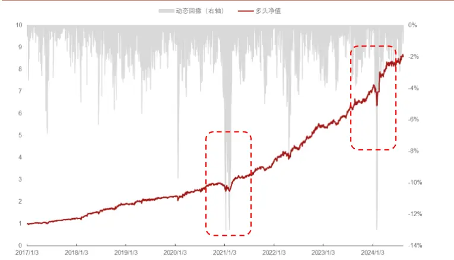
资料来源：招商证券、Wind，注：全 A，分 10组的第 1组，基准为全 A等权

图 19：市值的极端暴露导致多头组合大幅回撤
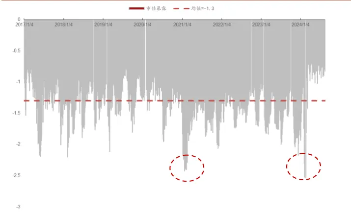
资料来源：招商证券、Wind，注：全 A，分 10组的第 1组，基准为全 A等权

表10：因子多头回撤区间不同风格因子的收益率贡献

| 风格因子 | 区间1 | 风格因子 | 区间2 |
| --- | --- | --- | --- |
| 市值 | -11.4% | 市值 | -6.87% |
| 动量 | -2.6% | 动量 | -0.65% |
| 盈利率 | -0.4% | 盈利率 | -0.54% |
| 杠杆 | -0.3% | 流动性 | -0.46% |
| 成长 | -0.2% | 账面价值比 | -0.20% |
| 残差波动率 | -0.1% | 成长 | 0.00% |
| 非线性市值 | 0.0% | 杠杆 | 0.03% |
| 账面价值比 | 0.1% | 非线性市值 | 0.24% |
| 流动性 | 0.4% | 残差波动率 | 0.27% |

资料来源：招商证券、Wind

通过对综合因子在大幅回撤的区间进行分析，本文发现最大的风险敞口是市值，在因子多头大幅回撤的区间，市值因子分别贡献了-11.4%和-6.87%的负向收益，其次是动量-2.6%和-0.65%。

虽然在前期报告中，我们通过学习目标的风格中性（市值、行业等）减轻了风格暴露带来的影响，机器学习模型还是通过非线性拟合的方式学习到了小市值的暴露。这可能是因为，过去几年小市值因子的平均回报率确实远超其他风格因子，模型在学习优化的路径中，对小市值的暴露是更容易实现 loss 最小化的路径。但其带来的较为明显的尾部风险不容忽视，在未来的研究中，我们将更加深入地探索如何缓解模型对小市值效应的过拟合倾向。

## 四、策略构建和测试

## 4.1. 周频指数增强策略构建测试

本章节将基于上文构建的综合因子构建指数增强策略，指数增强的优化目标为最大化预期收益率，优化目标如下：

$$
\begin{aligned}\max\quad&\mu^{T}w\\s.t.\quad&f_{l}\leq F\ w-w_{_{b}}\leq f_{_{h}}\\&h_{_{l}}\leq H\ w-w_{_{b}}\leq h_{_{h}}\\&w_{_{l}}\leq w-w_{_{b}}\leq w_{_{h}}\\&b_{_{l}}\leq B_{_{b}}w\leq b_{_{h}}\\&\left|w_{_{t}}-w_{_{t-1}}\right|\leq\delta\\&\mathbf{1}^{T}w=1\end{aligned}
$$

其中 $\mu$ 为预期收益率， $w$ 为当前组合权重向量， $w_{t}$ 为 t 时刻持仓权重，$w_{t-1}$ 为上一个持仓周期的持仓权重。

常见约束如下：

1) 风格约束，用于保证组合的风格偏离不超过下限 $f_{l_{和上限}}f_{h}$

2) 行业偏离约束，用于保证组合行业占比的主动偏离不超过下限 $h_{l\ 和上}$ 限 $h_{h}$

3) 个股权重的相对偏离

4) 成分股占比约束，保证成分股数量占比

5) 换手率约束，在优化失败时候，优先删除该约束，保证组合权重能够顺利求解

6) 全额投资约束，同时约束 $w$ 大于0即无卖空限制

本文中各类指数增强策略的设置如下：

1) 风格偏离约束：

a) $沪$ 深 300 指增策略，市值、估值、成长等风格为最大主动偏离0.3个标准差、行业占比偏离约束为3%；

b) 中证 500 指增策略，常见风格约束为 0.3 个标准差，行业占比偏离约束为3%；

c) 中证 1000指增策略，常见风格约束为 0.3个标准差，行业占比偏离约束为5%；

2) 个股权重偏离：0.3%-0.5%

3) 换手率约束：双边 20%，40%，60%

4) 成分股约束：无限制（全市场选股）/ 100%成分股约束

5) 费率设置：买入费率千分之一，卖出费率千分之二

6) 其他说明：成交价格为次日 WVAP 价格，停牌无法买入卖出、涨停无法买入，跌停无法卖出。tvr表示双边换手率

## 4.1.1. 沪深 300指数增强策略（周频）

表 11：沪深 300指数增强策略分年度表现（100%成分股内选股）

|  | tvr=0.2 |  |  | tvr=0.4 |  |  | tvr=0.6 |  |  |
| --- | --- | --- | --- | --- | --- | --- | --- | --- | --- |
|  | 年份 绝对收益 | 超额收益 | 超额最大回撤 | 绝对收益 | 超额收益 | 超额最大回撤 | 绝对收益 | 超额收益 | 超额最大回撤 |
| 2017 | 33.67% | 9.76% | -1.73% | 34.46% | 10.42% | -1.73% | 36.81% | 12.35% | -1.73% |
| 2018 | -14.46% | 14.52% | -1.15% | -10.82% | 19.40% | -1.02% | -12.09% | 17.70% | -0.77% |
| 2019 | 41.40% | 3.92% | -3.32% | 44.65% | 6.30% | -2.68% | 43.52% | 5.47% | -2.61% |
| 2020 | 37.06% | 7.74% | -2.95% | 36.70% | 7.46% | -2.91% | 36.52% | 7.32% | -2.85% |
| 2021 | 5.97% | 11.78% | -2.06% | 4.72% | 10.46% | -2.83% | 4.41% | 10.14% | -2.45% |
| 2022 | -12.16% | 12.09% | -1.48% | -10.64% | 14.03% | -1.63% | -11.85% | 12.49% | -1.59% |
| 2023 | -0.95% | 11.77% | -1.25% | -2.18% | 10.37% | -1.09% | -1.59% | 11.05% | -1.03% |
| YTD | 8.04% | 10.80% | -1.20% | 7.26% | 10.00% | -1.20% | 7.33% | 10.07% | -1.12% |
| 全样本 | 11.37% | 11.21% | -4.75% | 12.18% | 12.01% | -4.12% | 11.93% | 11.77% | -4.25% |

资料来源：招商证券、Wind

表12：沪深300指数增强策略分年度表现（全市场选股）

|  | tvr=0.2 |  |  | tvr=0.4 |  |  | tvr=0.6 |  |  |
| --- | --- | --- | --- | --- | --- | --- | --- | --- | --- |
|  | 年份 绝对收益 | 超额收益 | 超额最大回撤 | 绝对收益 | 超额收益 | 超额最大回撤 | 绝对收益 | 超额收益 | 超额最大回撤 |
| 2017 | 34.63% | 10.56% | -2.46% | 35.40% | 11.19% | -2.54% | 35.63% | 11.38% | -2.56% |
| 2018 | -11.65% | 18.29% | -1.24% | -11.31% | 18.75% | -1.03% | -11.88% | 17.98% | -1.18% |
| 2019 | 44.57% | 6.25% | -2.04% | 42.04% | 4.39% | -3.26% | 41.58% | 4.05% | -2.95% |
| 2020 | 35.49% | 6.51% | -3.59% | 36.77% | 7.51% | -3.26% | 36.99% | 7.69% | -3.31% |
| 2021 | 7.52% | 13.42% | -3.44% | 10.30% | 16.34% | -3.94% | 13.65% | 19.88% | -3.59% |
| 2022 | -6.35% | 19.50% | -1.99% | -9.38% | 15.64% | -3.93% | -8.93% | 16.21% | -4.50% |
| 2023 | 2.60% | 15.77% | -1.91% | 1.36% | 14.37% | -1.94% | 0.07% | 12.91% | -1.87% |
| YTD | 8.27% | 11.04% | -3.14% | 8.50% | 11.28% | -2.27% | 7.33% | 10.07% | -2.49% |
| 全样本 | 13.91% | 13.75% | -6.91% | 13.66% | 13.50% | -7.07% | 13.74% | 13.57% | -6.45% |

资料来源：招商证券、Wind

图 20：沪深 300指数增强净值走势（100%成分股）
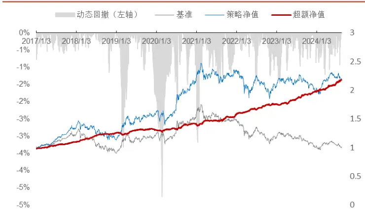
资料来源：招商证券、Wind，双边换手率 40%

图 21：沪深 300指数增强净值走势（全市场选股）
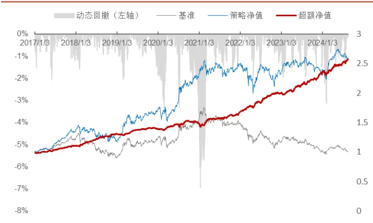
资料来源：招商证券、Wind，双边换手率 20%

从结果来看，沪深 300 指增策略表现良好，全市场选股的指增策略收益率表现优于成分股内选股，但超额最大回撤大于成分股内选股，信息比率和跟踪误差的表现成分股内选股的策略表现更好。

在双边换手 40%的控制下，成分股内选股 300 指增表现最好，策略的信息比率为 3.79，年化跟踪误差为 3.61%。

在双边换手 20%的控制下，全市场选股 300 指增表现最好。策略的信息比率为 3.51，年化跟踪误差为 4.44%；

## 4.1.2. 中证 500指数增强策略（周频）

表13：中证500指数增强策略分年度表现（100%成分股内选股）

|  | tvr=0.2 |  |  | tvr=0.4 |  |  | tvr=0.6 |  |  |
| --- | --- | --- | --- | --- | --- | --- | --- | --- | --- |
|  | 指标 绝对收益 | 超额收益 | 超额最大回撤 | 绝对收益 | 超额收益 | 超额最大回撤 | 绝对收益 | 超额收益 | 超额最大回撤 |
| 2017 | 16.48% | 16.71% | -2.13% | 16.06% | 16.30% | -2.13% | 15.76% | 16.00% | -2.13% |
| 2018 | -20.14% | 19.77% | -1.26% | -17.69% | 23.44% | -1.47% | -18.24% | 22.62% | -1.23% |
| 2019 | 36.16% | 7.74% | -5.37% | 38.61% | 9.67% | -4.78% | 40.70% | 11.33% | -3.73% |
| 2020 | 34.63% | 11.38% | -5.32% | 37.04% | 13.38% | -4.37% | 35.31% | 11.94% | -5.53% |
| 2021 | 23.62% | 6.95% | -5.64% | 23.12% | 6.52% | -3.81% | 22.87% | 6.30% | -4.45% |
| 2022 | -6.93% | 16.79% | -2.13% | -8.65% | 14.64% | -2.02% | -7.76% | 15.75% | -2.12% |
| 2023 | -0.11% | 7.90% | -3.30% | -0.20% | 7.80% | -2.86% | -2.00% | 5.86% | -2.82% |
| YTD | -4.34% | 11.20% | -2.07% | -3.77% | 11.87% | -1.98% | -3.84% | 11.78% | -2.19% |
| 全样本 | 8.92% | 13.36% | -6.56% | 9.58% | 14.05% | -5.74% | 9.31% | 13.76% | -6.73% |

资料来源：招商证券、Wind

表14：中证500指数增强策略分年度表现（全市场选股）

|  | tvr=0.2 |  |  | tvr=0.4 |  |  | tvr=0.6 |  |  |
| --- | --- | --- | --- | --- | --- | --- | --- | --- | --- |
|  | 指标 绝对收益 | 超额收益 | 超额最大回撤 | 绝对收益 | 超额收益 | 超额最大回撤 | 绝对收益 | 超额收益 | 超额最大回撤 |
| 2017 | 18.52% | 18.76% | -2.20% | 21.74% | 21.99% | -2.20% | 21.04% | 21.29% | -2.20% |
| 2018 | -15.11% | 27.31% | -0.80% | -11.08% | 33.35% | -1.09% | -9.33% | 35.97% | -1.36% |
| 2019 | 41.95% | 12.32% | -6.58% | 42.32% | 12.61% | -6.15% | 42.38% | 12.65% | -5.69% |
| 2020 | 41.12% | 16.75% | -3.71% | 40.45% | 16.20% | -4.11% | 38.80% | 14.84% | -3.52% |
| 2021 | 23.13% | 6.53% | -6.72% | 23.57% | 6.91% | -4.84% | 24.46% | 7.68% | -4.52% |
| 2022 | -0.57% | 24.77% | -1.95% | -1.68% | 23.38% | -1.86% | -3.97% | 20.50% | -3.39% |
| 2023 | 4.32% | 12.69% | -2.55% | 5.08% | 13.51% | -2.34% | 3.65% | 11.96% | -2.54% |
| YTD | -0.70% | 15.44% | -7.43% | 1.86% | 18.41% | -6.76% | 1.61% | 18.12% | -6.25% |
| 全样本 | 13.61% | 18.24% | -7.43% | 15.11% | 19.79% | -6.76% | 14.63% | 19.30% | -6.25% |

资料来源：招商证券、Wind

图 22：中证 500指数增强净值走势（100%成分股）
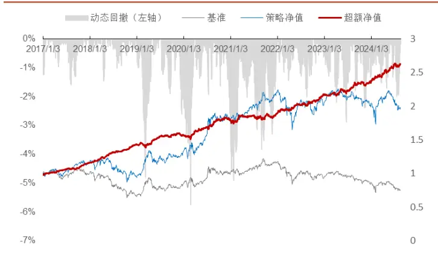
资料来源：招商证券、Wind，双边换手率 40%

图 23：中证 500指数增强净值走势（全市场选股）
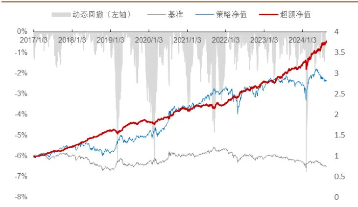
资料来源：招商证券、Wind，双边换手率 40%

成分股内选股的中证 500 指增策略，在双边换手率控制为 40%时，全样本超额收益率表现最好，该策略信息比率为 2.75，年化跟踪误差为 5.40%。

全市场选股的中证 500 指增策略，在双边换手率控制为 40%时，全样本超额收益率表现最好，该策略信息比率为 3.48，年化跟踪误差为 6.11%。

## 4.1.3. 中证 1000指数增强策略（周频）

表15：中证1000指数增强策略分年度表现（100%成分股内选股）

|  | tvr=0.2 |  |  | tvr=0.4 |  |  | tvr=0.6 |  |  |
| --- | --- | --- | --- | --- | --- | --- | --- | --- | --- |
|  | 指标 绝对收益 | 超额收益 | 超额最大回撤 | 绝对收益 | 超额收益 | 超额最大回撤 | 绝对收益 | 超额收益 | 超额最大回撤 |
| 2017 | -3.16% | 17.17% | -2.07% | -0.50% | 20.40% | -2.07% | -0.62% | 20.25% | -2.07% |
| 2018 | -19.81% | 27.03% | -0.54% | -16.56% | 32.17% | -0.64% | -16.23% | 32.69% | -0.85% |
| 2019 | 48.86% | 18.46% | -2.25% | 54.27% | 22.76% | -1.63% | 55.09% | 23.41% | -1.64% |
| 2020 | 42.05% | 18.98% | -2.18% | 40.80% | 17.93% | -2.40% | 41.57% | 18.57% | -2.28% |
| 2021 | 32.38% | 9.84% | -3.35% | 33.66% | 10.90% | -3.83% | 33.94% | 11.14% | -4.06% |
| 2022 | -6.88% | 18.75% | -1.50% | -6.58% | 19.13% | -1.71% | -8.49% | 16.69% | -2.03% |
| 2023 | 0.13% | 6.84% | -2.31% | -0.27% | 6.41% | -2.11% | 0.59% | 7.33% | -2.36% |
| YTD | -13.42% | 9.49% | -1.37% | -13.06% | 9.94% | -1.57% | -12.90% | 10.14% | -1.49% |
| 全样本 | 7.95% | 17.14% | -3.35% | 9.53% | 18.85% | -3.83% | 9.60% | 18.94% | -4.06% |

资料来源：招商证券、Wind

表16：中证1000指数增强策略分年度表现（全市场选股）

|  | tvr=0.2 |  |  | tvr=0.4 |  |  | tvr=0.6 |  |  |
| --- | --- | --- | --- | --- | --- | --- | --- | --- | --- |
|  | 指标 绝对收益 | 超额收益 | 超额最大回撤 | 绝对收益 | 超额收益 | 超额最大回撤 | 绝对收益 | 超额收益 | 超额最大回撤 |
| 2017 | 6.46% | 28.82% | -2.07% | 9.37% | 32.34% | -2.07% | 10.13% | 33.25% | -2.07% |
| 2018 | -16.38% | 32.45% | -0.84% | -12.29% | 38.94% | -1.01% | -10.14% | 42.34% | -1.11% |
| 2019 | 46.35% | 16.46% | -4.80% | 50.69% | 19.91% | -3.79% | 52.16% | 21.08% | -2.97% |
| 2020 | 43.91% | 20.53% | -3.21% | 42.68% | 19.51% | -3.16% | 42.64% | 19.47% | -2.79% |
| 2021 | 31.13% | 8.80% | -6.06% | 30.83% | 8.55% | -5.29% | 32.27% | 9.75% | -4.62% |
| 2022 | -0.03% | 27.48% | -1.54% | -2.40% | 24.46% | -2.02% | -4.32% | 22.01% | -2.18% |
| 2023 | 7.40% | 14.60% | -2.53% | 6.93% | 14.09% | -2.54% | 5.96% | 13.06% | -2.63% |
| YTD | -11.28% | 12.19% | -5.89% | -11.04% | 12.50% | -5.95% | -10.25% | 13.49% | -5.44% |
| 全样本 | 12.27% | 21.83% | -6.06% | 13.30% | 22.95% | -5.95%% | 13.79% | 23.48% | -5.44% |

资料来源：招商证券、Wind

图 24：中证 1000指数增强净值走势（100%成分股）
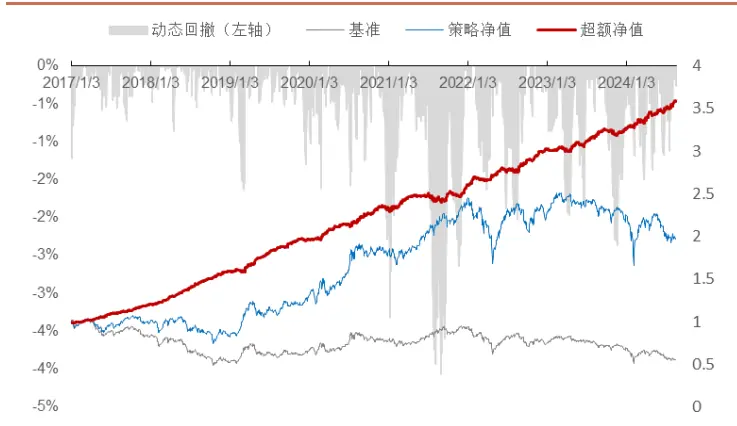
资料来源：招商证券、Wind，双边换手率 20%

图 25：中证 1000指数增强净值走势（全市场选股）
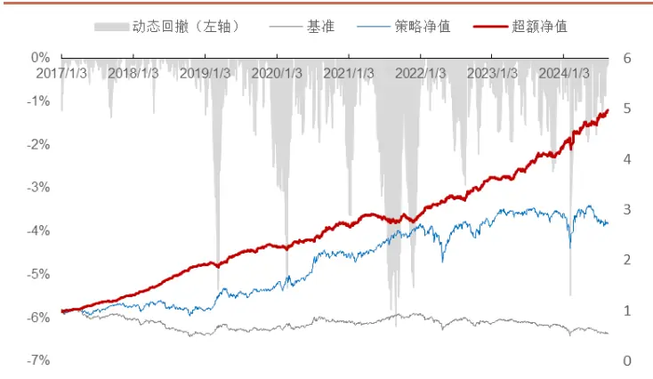
资料来源：招商证券、Wind，双边换手率 20%

成分股内选股的中证 1000 指增策略，在双边换手率控制为 60%时，全样本超额收益率表现最好，该策略信息比率为 3.89，年化跟踪误差为 4.68%。

全市场选股的中证 1000 指增策略，在双边换手率控制为 60%时，全样本超额收益率表现最好，该策略信息比率为 3.96，年化跟踪误差为 5.80%。

## 五、总结

本文在基于周频和日频多模型多数据集的量价模型中加入 15min 量价数据后模型的表现有了一定提升，同时也观察到在不同数据上利用多模型学习得到的量价因子之间的相关性相对较高。

为了缓解这种较高相关性的现象。本文借鉴梯度提升的方法，提出了残差增量学习的方法，即在后续数据集的学习过程中加入前期数据集的结果残差。从结果来看，基于数据集的残差增量学习流程得到的因子相比于简单等权得到的因子提升较为明显。基于数据集的残差增量学习框架也存在一些问题，例如：

## 1)迭代的次数太少

2)对于每个数据集之间的特征缺乏交互。

据此，本文进一步提出了结合数据集残差增量学习+特征提升的混合频率综合量价因子学习框架，从结果来看该框架得到的综合因子表现显著超过了上述基准模型框架。

此在综合因子的风险敞口分析中，本文发现综合因子多头的小市值因子时序平均暴露较大，而且因子多头大幅回撤的区间都伴随着小市值因子的暴露水平的大幅提升以及小市值股票的暴跌。本文猜想，模型在训练的历史区间由于小市值组合的收益率较高，模型学习路径中，拟合小市值因子是 loss 下降比较容易的方向。在后续的研究中，我们将进一步探索如何缓解这种对于小市值因子的过拟合倾向，从而缓解这种尾部风险。

最后，本文基于综合因子构建了基于沪深 300、中证 500、中证 1000，100%限制成分股和不限制成分股的不同指增策略都取得了不错的效果，但是不同指增组合最大回撤的区间也基本和因子大幅回撤的区间吻合。回测历史区间中，小市值股票的暴跌确实给策略带来了不小的尾部风险。

## 分析师承诺

负责本研究报告的每一位证券分析师，在此申明，本报告清晰、准确地反映了分析师本人的研究观点。本人薪酬的任何部分过去不曾与、现在不与，未来也将不会与本报告中的具体推荐或观点直接或间接相关。

## 评级说明

报告中所涉及的投资评级采用相对评级体系，基于报告发布日后 6-12 个月内公司股价（或行业指数）相对同期当地市场基准指数的市场表现预期。其中，A股市场以沪深 300指数为基准；香港市场以恒生指数为基准；美国市场以标普 500指数为基准。具体标准如下：

## 股票评级

强烈推荐：预期公司股价涨幅超越基准指数 20%以上

增持：预期公司股价涨幅超越基准指数 5-20%之间

中性：预期公司股价变动幅度相对基准指数介于±5%之间

减持：预期公司股价表现弱于基准指数 5%以上

## 行业评级

推荐：行业基本面向好，预期行业指数超越基准指数

中性：行业基本面稳定，预期行业指数跟随基准指数

回避：行业基本面转弱，预期行业指数弱于基准指数

## 重要声明

本报告由招商证券股份有限公司（以下简称“本公司”）编制。本公司具有中国证监会许可的证券投资咨询业务资格。本报告基于合法取得的信息，但本公司对这些信息的准确性和完整性不作任何保证。本报告所包含的分析基于各种假设，不同假设可能导致分析结果出现重大不同。报告中的内容和意见仅供参考，并不构成对所述证券买卖的出价，在任何情况下，本报告中的信息或所表述的意见并不构成对任何人的投资建议。除法律或规则规定必须承担的责任外，本公司及其雇员不对使用本报告及其内容所引发的任何直接或间接损失负任何责任。本公司或关联机构可能会持有报告中所提到的公司所发行的证券头寸并进行交易，还可能为这些公司提供或争取提供投资银行业务服务。客户应当考虑到本公司可能存在可能影响本报告客观性的利益冲突。

本报告版权归本公司所有。本公司保留所有权利。未经本公司事先书面许可，任何机构和个人均不得以任何形式翻版、复制、引用或转载，否则，本公司将保留随时追究其法律责任的权利。