# 子选股系列研究之一

# 方正证券研究所证券研究报告

金融工程研究

2022.04.12

[分析师：TABLE_ SISINFO 曹春晓]

登记编号：S1220522030005

## 相关研究

## 投资要点

在股票市场中，成交量的边际变化隐含着非常重要的信息，特别是在技术分析领域，成交量被认为是股票市场的原动力。俗语“量在价先”深刻的反应了成交量的变化对于股票价格波动的预测具有指示性作用。本文中我们将尝试从成交量的边际变动出发，挖掘其对股票收益的潜在影响。

我们以利好信息为例，当一个利好信息公布后，可能会引起相应个股成交量的突然放大。如果在成交量激增的同时，价格却未发生变动，或者未能引起价格的波动，则表明这一利好消息没能得到市场广泛的认可。相反，如果成交量激增的同时，价格出现大幅上涨，则表明市场对于此利好信息反应过于趋同，有可能出现反应过度。

我们通过观察日内成交量激增的时段，考察这些时段的收益率与波动率，我们将与市场平均水平作为“适度”程度的衡量标准，进而构建“耀眼波动率”因子和“耀眼收益率”因子，并最终合成为能综合反应投资者反应不足和反应过度程度的“适度冒险”因子。

我们对“适度冒险”因子在月频选股效果上进行了回测，结果显示：合成之后的“适度冒险”因子表现非常出色，Rank IC为-8.89%，Rank ICIR 为-4.84，多空组合年化收益率达 37.46%，信息比4.10，因子月度胜率 87.74%。此外，在剔除了常用的风格因子影响后，“适度冒险”因子仍然具有较强的选股能力，RankIC 均值为-3.18%，Rank ICIR 为-1.89，多空组合年化收益率18.07%，信息比率 2.23。

为了检验“适度冒险”因子在其他样本空间下的选股表现，我们分别选取了沪深 300成分股、中证500成分股、中证 1000成分股作为股票池，测试其选股能力，可以看到“适度冒险”因子在不同样本空间下均表现出较好的选股能力，相较而言，中证 500指数成分股内表现更为出色。

## 风险提示

本报告基于历史数据分析，历史规律未来可能存在失效的风险；市场可能发生超预期变化；各驱动因子受环境影响可能存在阶段性失效的风险。

## 1 引言

在股票市场中，成交量的边际变化隐含着非常重要的信息，特别是在技术分析领域，成交量被认为是股票市场的原动力。俗语“量在价先”深刻的反应了成交量的变化对于股票价格波动的预测具有指示性作用。

成交量的大小，可以衡量股票市场或者个股的活跃程度，并由此来观察买卖双方进入或退出市场的状况。本文中我们将尝试从成交量的边际变动出发，挖掘其对股票收益的潜在影响。

## 2 “适度冒险”因子定义逻辑

我们以利好信息为例，当一个利好信息公布后，可能会引起相应个股成交量的突然放大。如果在成交量激增的同时，价格却未发生变动，或者未能引起价格的波动，则表明这一利好消息没能得到市场广泛的认可。相反，如果成交量激增的同时，价格出现大幅上涨，则表明市场对于此利好信息反应过于趋同，有可能出现反应过度。

因此，当市场获得新的利好信息后，一方面我们希望此信息可以被市场广泛的认可和接受，推动股票价格稳步上涨；而另一方面我们不希望成交量的激增引起的价格变动太过剧烈，这样可能代表了投资者反应过度，导致股票短时间内涨幅过大，或者风险大幅加剧。正如Arnold，Pelster 和 Subrahmanyam(2022)指出，“那些吸引人们注意的股票，更容易诱发人们去承担过度的风险”。

综合以上两个方面，我们希望成交量激增能带来股票价格的适度变化与波动。或者说，我们希望那些认可利好消息的人，去适度地承担风险。

## 3 “适度冒险”因子构建与测试

## 3.1 成交量激增的定义

我们观察个股分钟频成交量的边际变化来定义成交量是否激增，具体如下：

1）剔除开盘和收盘数据，仅考虑日内分钟频数据，我们首先计算个股每分钟的成交量相对于上一分钟的成交量的差值，作为该分钟成交量的增加量。

2）计算每天每只个股分钟频成交量的增加量的均值 mean 和标准差std。

3）我们定义那些分钟频成交量增加量大于“均值+一倍标准差”的时刻为成交量激增的时刻，我们将对应的时刻统称为“激增时刻”。

4）举例来说，假设股票 A 在某天 t 的第 9 分钟、第 10 分钟、第 88分钟、第200分钟的成交量增加量大于当天的mean+std，那么我们将第9、10、88、200这四个分钟统称为A 股票在t日的“激增时刻”。

图表1： 某股票日内成交量“激增时刻”
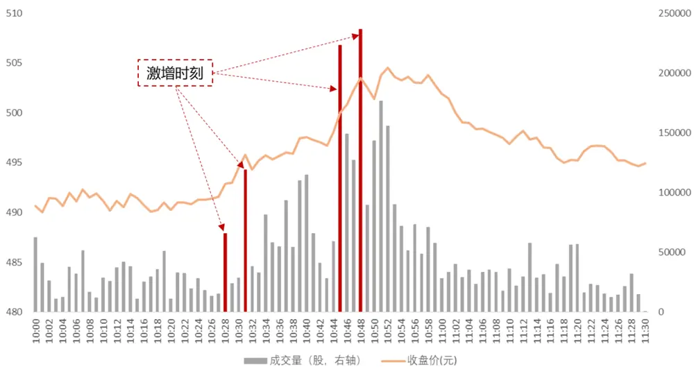
资料来源：Wind，方正证券研究所

对于A股市场整体而言，投资者交易行为存在较为明显的时间特征，开盘之后成交量一般逐步下降，临近收盘再逐步提升。但对于个股而言，成交量的变化并不严格与此同步，成交量出现大幅变动的情况较为频繁。

图表2： 万得全A 指数分钟频率成交量统计（单位：亿股）
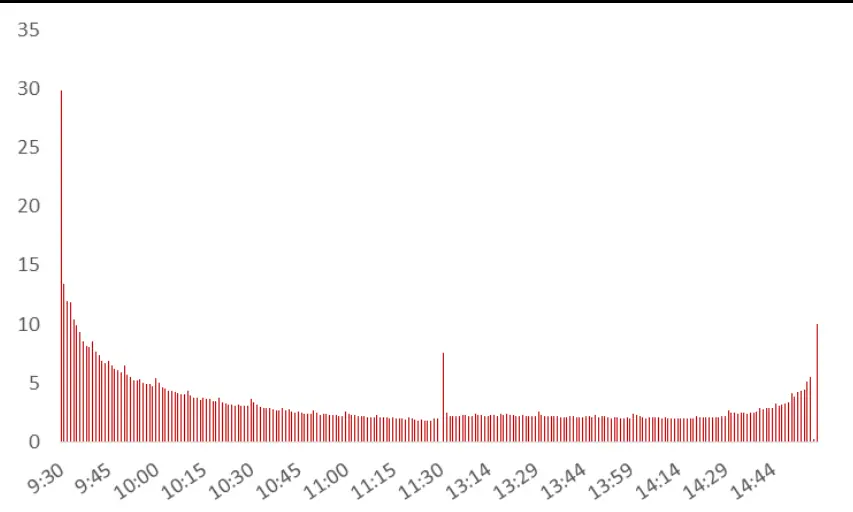
资料来源：Wind，方正证券研究所

我们以贵州茅台和宁德时代为例，根据上文中关于“激增时刻”的定义，我们分别对两只股票自 2020 年以来日内“激增时刻”做频数统计，可以看到两只个股日内“激增时刻”次数的平均值都是 22 次。进一步统计发现，对于大多数个股而言，日内的“激增时刻”次数均相对较多。从行业均值来看，国防军工、计算机、电子等行业成分股日内“激增时刻”较多，商业贸易、房地产、交通运输等行业相对较少。

图表3： 贵州茅台股票日内“激增时刻”频数统计
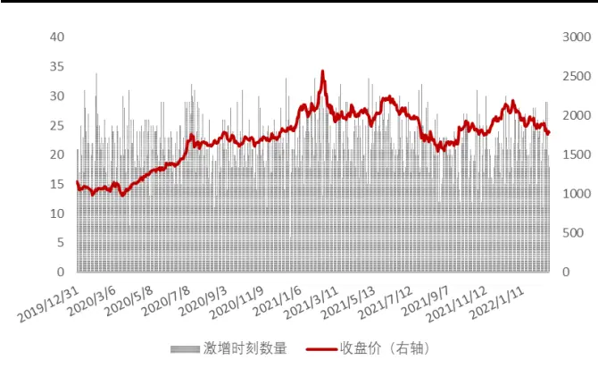
资料来源：Wind，方正证券研究所

图表4： 宁德时代股票日内“激增时刻”频数统计
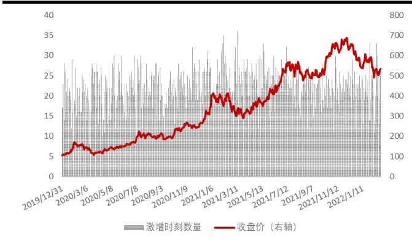
资料来源：Wind，方正证券研究所

图表5： 各行业成分股平均日内“激增时刻”统计
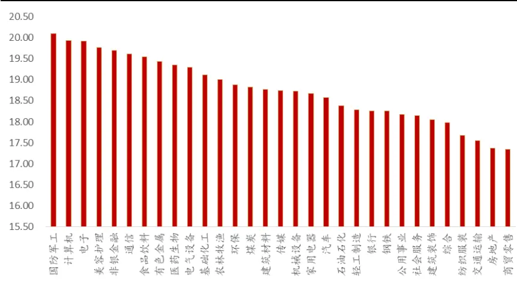
资料来源：Wind，方正证券研究所

## 3.2 激增时刻的价格波动

我们首先来考察成交量激增引起的价格波动，进而构造“月耀眼波动率”因子，具体过程如下：

1）我们定义“激增时刻”的这一分钟及其随后的 4 分钟，是因成交量激增而引起投资者关注的 5 分钟。投资者对成交量激增的反应，在这5分钟里表现得最充分最强烈，我们将这5分钟称为“耀眼5分钟”。2）在上例中，如果第 9、10、88、200 分钟为“激增时刻”，那么对应的“耀眼 5 分钟”分别为第 9～13 分钟、第 10～14 分钟、第 88～92 分钟、第 200～204 分钟。

3）我们使用分钟收盘价，计算每分钟的收益率，进而可以得到每个“耀眼5分钟”里，收益率的标准差，作为成交量激增引起的价格波动率，我们将其称为“耀眼波动率”。

4）我们计算A 股票在t日内所有“耀眼波动率”的均值，作为 t日A股票对成交量的激增在波动层面上反应的代理变量，记为“日耀眼波动率”。

5）根据前述分析，我们希望“日耀眼波动率”不要太大，也不要太小，适度最好，为了不引入其他参数，我们此处选取“日耀眼波动率”

的截面均值作为最“适度”的水平。因此我们将每日的“日耀眼波动率”减去截面的均值再取绝对值，表示个股的“日耀眼波动率”与市场平均水平的距离，并将其记为日频因子“适度日耀眼波动率”。

6）我们分别计算最近20个交易日的“适度日耀眼波动率”的平均值和标准差，记为“月均耀眼波动率”因子和“月稳耀眼波动率”因子。7）将“月均耀眼波动率”与“月稳耀眼波动率”等权合成，得到“月耀眼波动率”因子。

图表6： 某股票日内“耀眼五分钟”
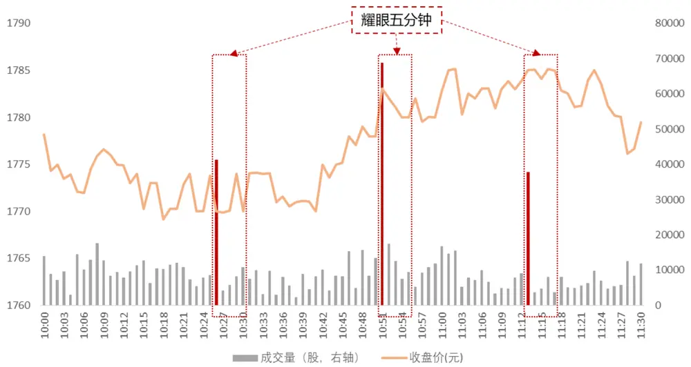
资料来源：Wind，方正证券研究所

接下来我们将对上述构建的月均耀眼波动率、月稳耀眼波动率以及月耀眼波动率因子进行单因子测试，我们在全A 样本中按照月度频率进行测试，测试中对因子进行市值和行业正交化处理，测试区间为 2013年4月至 2022年 2月（下同）。各因子表现如下所示。

图表7： 耀眼波动率因子测试

| 因子名称 |  | Rank IC Rank ICIR | t值 | 年化收益率 | 年化波动率 | 信息比率 | 月度胜率 | 最大回撤 |
| --- | --- | --- | --- | --- | --- | --- | --- | --- |
| 月均耀眼波动率 | -6.60% | -4.7 | -9.34 | 31.05% | 8.99% | 3.45 | 85.85% | -5.69% |
| 月稳耀眼波动率 | -7.87% | -4.02 | -8.43 | 30.64% | 9.14% | 3.35 | 83.96% | -6.06% |
| 月耀眼波动率 | -7.63% | -4.76 | -9.14 | 33.65% | 9.16% | 3.67 | 86.79% | -6.37% |

资料来源：Wind，方正证券研究所

从测试结果来看，月均耀眼波动率因子、月稳耀眼波动率因子以及合成之后的月耀眼波动率因子均表现出强势的选股能力，Rank IC 分别为-6.60%、-7.87%、-7.63%。合成的月耀眼波动率因子多空组合年化收益率及月度胜率均更为显著，其分组表现如下图所示。

图表8： “月均耀眼波动率”因子十分组及多空对冲净值走势
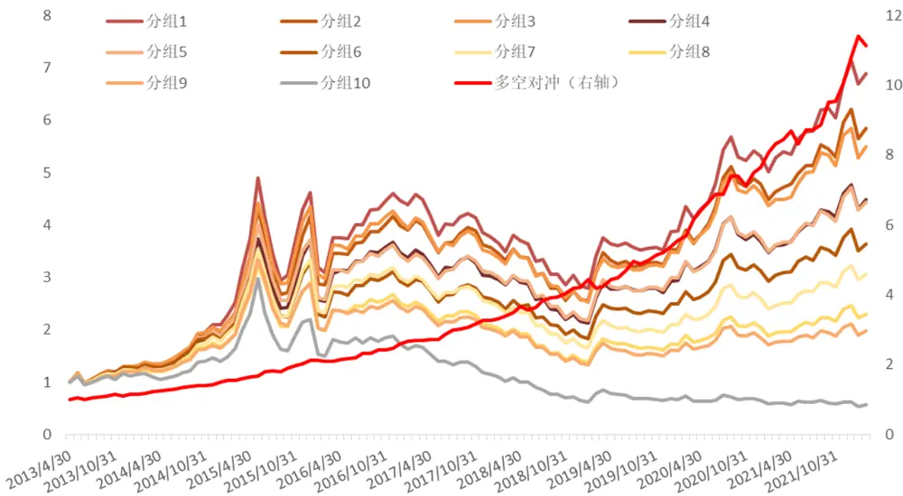
资料来源：Wind，方正证券研究所

图表9： “月稳耀眼波动率”因子十分组及多空对冲净值走势
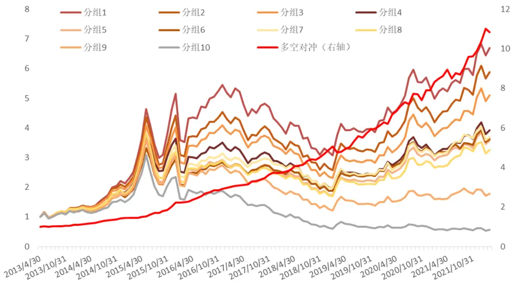
资料来源：Wind，方正证券研究所

图表10：“月耀眼波动率”因子十分组及多空对冲净值走势
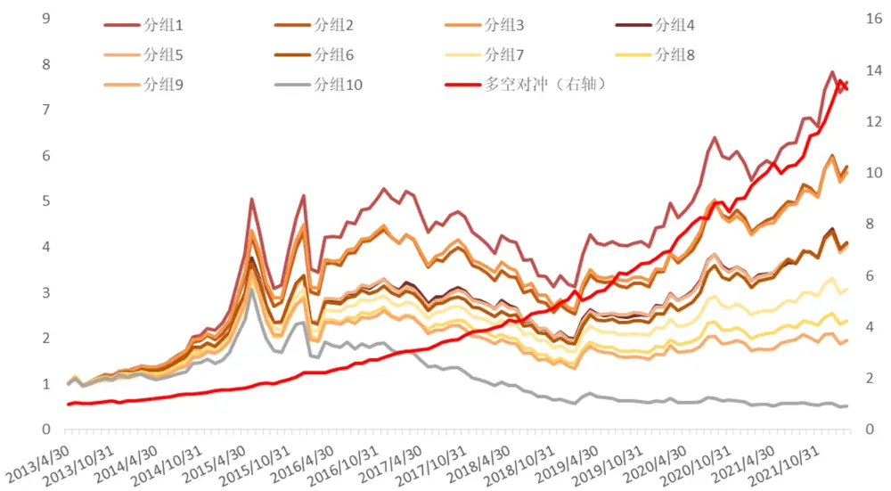
资料来源：Wind，方正证券研究所

## 3.3 激增时刻的价格变动

接下来我们考察成交量激增引起的价格变动，进而构造“月均耀眼收 益率”和“月稳耀眼收益率”因子，具体过程如下：

1）我们通过股票的每分钟收盘价，计算股票每分钟的收益率。

2）找到“激增时刻”对应的分钟收益率，例如上例中，第9、10、88、200分钟为激增时刻，那么分别对应着第9、10、88、200 分钟的分钟收益率，我们将其称为“耀眼收益率”。

3）对 A 股票在 t 日内所有的“耀眼收益率”求均值，作为股票对成交量激增在收益率层面反应的代理变量，记为“日耀眼收益率”。

4）根据上述分析，我们同样希望“耀眼收益率”不要太大，也不要太小，适度最好。因此我们将每日的“日耀眼收益率”减去截面的均值再取绝对值，表示个股的“日耀眼收益率”与市场平均水平的距离，并将其记为“适度日耀眼收益率”。

5）我们分别计算最近20个交易日的“适度日耀眼收益率”的平均值和标准差，记为“月均耀眼收益率”和“月稳耀眼收益率”因子。

6）将“月均耀眼收益率”与“月稳耀眼收益率”因子等权合成，得到“月耀眼收益率”因子。

我们分别对上述因子进行回溯测试，可以看到“月均耀眼收益率”、“月稳耀眼收益率”以及合成的“月耀眼收益率”因子表现同样非常出色，其 Rank IC 分别为-8.62%、-8.00%、-8.53%，月度胜率分别为 83.96%、87.74%和 87.74%。

图表11：耀眼收益率因子测试

| 因子名称 |  | Rank IC Rank ICIR | t值 | 年化收益率 | 年化波动率 | 信息比率 | 月度胜率 | 最大回撤 |
| --- | --- | --- | --- | --- | --- | --- | --- | --- |
| 月均耀眼收益率 | -8.62% | -4.15 | -9.20 | 31.48% | 9.67% | 3.26 | 83.96% | -7.41% |
| 月稳耀眼收益率 | -8.00% | -4.50 | -9.38 | 30.46% | 7.99% | 3.81 | 87.74% | -6.21% |
| 月耀眼收益率 | -8.53% | -4.35 | -9.40 | 32.53% | 8.85% | 3.68 | 87.74% | -6.58% |

资料来源：Wind，方正证券研究所

图表12：“月均耀眼收益率”因子十分组及多空对冲净值走势
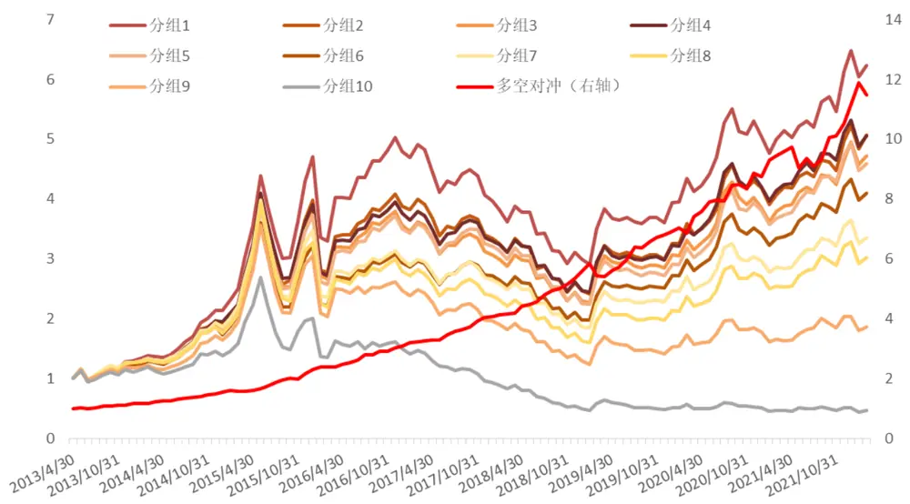
资料来源：Wind，方正证券研究所

图表13：“月稳耀眼收益率”因子十分组及多空对冲净值走势
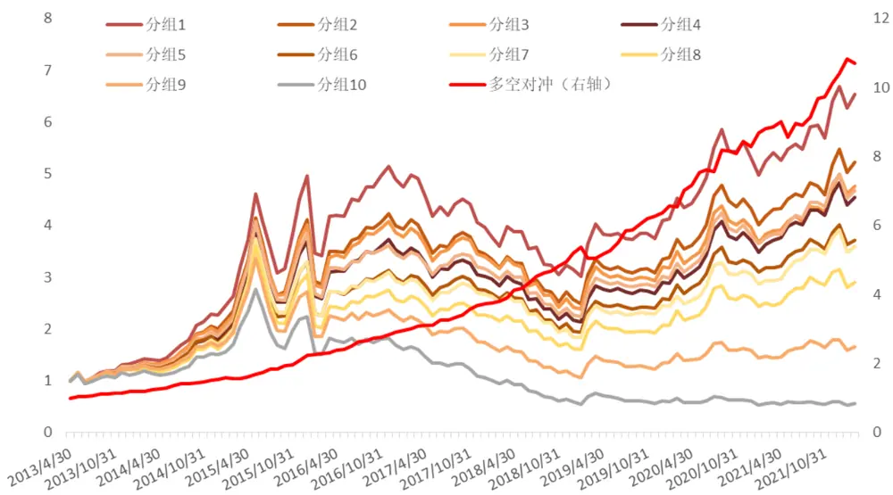
资料来源：Wind，方正证券研究所

图表14：“月耀眼收益率”因子十分组及多空对冲净值走势
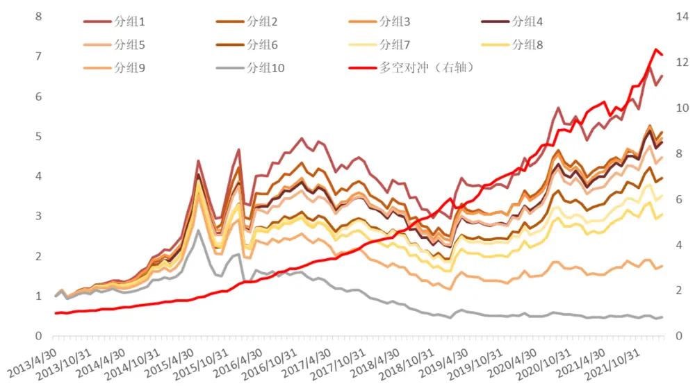
资料来源：Wind，方正证券研究所

## 3.4 适度冒险因子合成

以上我们分别从波动率以及收益率角度构造了两个衡量“适度冒险”的因子，并发现其均具备非常强势的选股能力。我们将上述“月耀眼波动率”因子与“月耀眼收益率”因子合并，等权合成为最终的“适度冒险”因子，合成后的因子表现如下表所示：

图表15：“适度冒险”因子绩效

| 因子名称 | Rank IC Rank ICIR |  | t值 | 年化收益率 | 年化波动率 | 信息比率 | 月度胜率 | 最大回撤 |
| --- | --- | --- | --- | --- | --- | --- | --- | --- |
| 月耀眼波动率 | -7.63% | -4.76 | -9.14 | 33.65% | 9.16% | 3.67 | 86.79% | -6.37% |
| 月耀眼收益率 | -8.53% | -4.35 | -9.40 | 32.53% | 8.85% | 3.68 | 87.74% | -6.58% |
| 适度冒险因子 | -8.89% | -4.84 | -9.52 | 37.46% | 9.14% | 4.10 | 87.74% | -6.43% |

资料来源：Wind，方正证券研究所

合成之后的“适度冒险”因子表现非常出色，RankIC 为-8.89%、RankICIR 为-4.84，多空组合年化收益率达 37.46%，信息比 4.10，因子月度胜率 87.74%。

图表16：“适度冒险”因子十分组及多空对冲净值走势
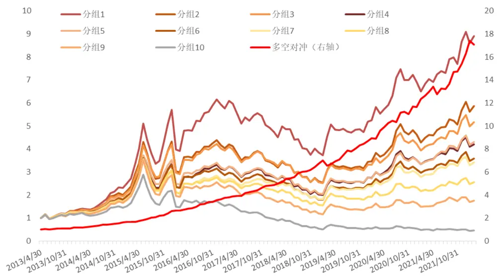
资料来源：Wind，方正证券研究所

## 3.5 剥离其他风格因子影响后“适度冒险”因子仍然表现较好

从上述测试结果来看，“适度冒险”因子选股能力出色，进一步，我们测试其与其他常见风格因子的相关性，如下图所示，“适度冒险”因子与波动率和换手率有一定的相关性，与其他风格因子相关系数均较低。为进一步验证因子的增量信息，我们使用 10 个常用风格因子对“适度冒险”因子进行正交化处理，得到“纯净适度冒险”因子，再检验其选股能力。

图表17：与常见风格因子相关性测试
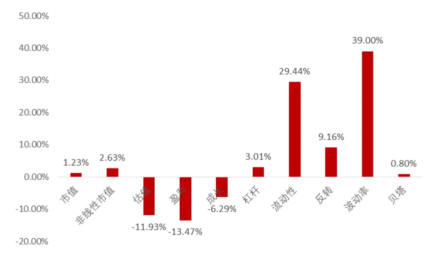
资料来源：Wind，方正证券研究所

图表18：剥离常见风格因子影响后“适度冒险”因子绩效

| 因子名称 | Rank IC Rank ICIR |  | t值 | 年化收益率 | 年化波动率 | 信息比率 | 月度胜率 | 最大回撤 |
| --- | --- | --- | --- | --- | --- | --- | --- | --- |
| 纯净适度冒险因子 | -3.18% | -1.89 | -8.00 | 18.07% | 8.10% | 2.23 | 75.47% | -5.84% |

资料来源：Wind，方正证券研究所

可以看到，在剔除了常用的风格因子影响后，“适度冒险”因子仍然具有较强的选股能力，Rank IC 均值为-3.18%，Rank ICIR 为-1.89，多空组合年化收益率18.07%，信息比率2.23。

图表19：纯净适度冒险因子十分组及多空对冲净值走势
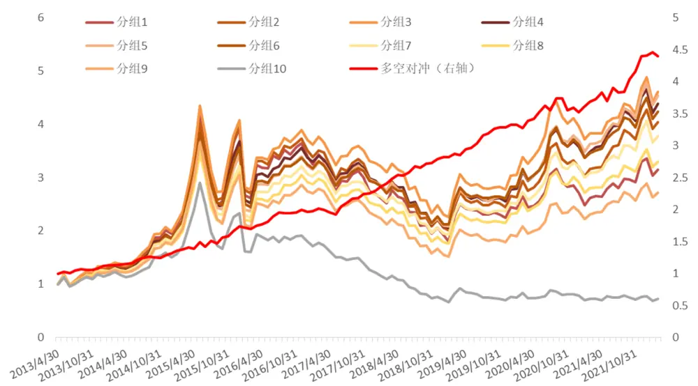
资料来源：Wind，方正证券研究所

## 3.6 “适度冒险”因子在不同样本空间下均表现较好

为了检验“适度冒险”因子在其他样本空间下的选股表现，我们分别选取了沪深 300 成分股、中证 500 成分股、中证 1000 成分股作为股票池，测试其选股能力，可以看到“适度冒险”因子在不同样本空间下均表现出较好的选股能力，相较而言，中证500指数成分股内表现更为出色。

图表20：不同样本空间下适度冒险因子表现

| 样本空间 | Rank IC Rank ICIR |  | t值 | 年化收益率 | 年化波动率 | 信息比率 | 月度胜率 | 最大回撤 |
| --- | --- | --- | --- | --- | --- | --- | --- | --- |
| 沪深300成分股 | -5.12% | -2.16 | -5.04 | 16.33% | 12.61% | 1.29 | 69.81% | 13.33% |
| 中证500成分股 | -6.09% | -2.84 | -6.38 | 20.51% | 10.90% | 1.88 | 73.58% | 15.68% |
| 中证1000成分股 | -3.96% | -2.57 | -6.19 | 17.35% | 8.92% | 1.95 | 75.47% | 15.34% |

资料来源：Wind，方正证券研究所

图表21：沪深 300/中证 500/中证 1000指数成分股内多空表现
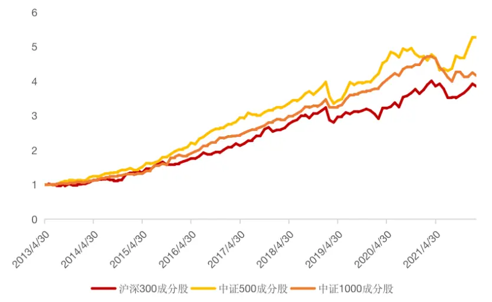
资料来源：Wind，方正证券研究所

## 3.7 参数敏感性测试

我们将上述“耀眼5分钟”，改为“耀眼 3分钟”或“耀眼 4 分钟”，即取“激增时刻”及其随后的2分钟或3分钟来重新计算因子，可以看到因子表现依然非常出色，参数敏感性相对较低。

图表22：“耀眼3分钟”计算适度冒险因子表现

| 样本空间 | Rank IC | Rank ICIR | t值 | 年化收益率 | 年化波动率 | 信息比率 | 月度胜率 | 最大回撤 |
| --- | --- | --- | --- | --- | --- | --- | --- | --- |
| 月耀眼波动率 | -7.35% | -4.61 | -9.20 | 32.25% | 8.87% | 3.64 | 84.91% | 5.94% |
| 月耀眼收益率 | -8.53% | -4.35 | -9.40 | 32.53% | 8.85% | 3.68 | 87.74% | 6.58% |
| 适度冒险因子 | -8.70% | -4.78 | -9.54 | 37.03% | 9.23% | 4.01 | 87.74% | 6.34% |

资料来源：Wind，方正证券研究所

## 4 风险提示

本报告基于历史数据分析，历史规律未来可能存在失效的风险；市场可能发生超预期变化；各驱动因子受环境影响可能存在阶段性失效的风险。

## 5 参考文献

[1] Arnold M, Pelster M, Subrahmanyam M G. Attention triggers and investors’ risk-taking[J]. Journal of Financial Economics, 2022, 143(2): 846-875.

## 分析师声明

作者具有中国证券业协会授予的证券投资咨询执业资格，保证报告所采用的数据和信息均来自公开合规渠道，分析逻辑基于作者的职业理解，本报告清晰准确地反映了作者的研究观点，力求独立、客观和公正，结论不受任何第三方的授意或影响。研究报告对所涉及的证券或发行人的评价是分析师本人通过财务分析预测、数量化方法、或行业比较分析所得出的结论，但使用以上信息和分析方法存在局限性。特此声明。

## 免责声明

本研究报告由方正证券制作及在中国（香港和澳门特别行政区、台湾省除外）发布。根据《证券期货投资者适当性管理办法》，本报告内容仅供我公司适当性评级为C3及以上等级的投资者使用，本公司不会因接收人收到本报告而视其为本公司的当然客户。若您并非前述等级的投资者，为保证服务质量、控制风险，请勿订阅本报告中的信息，本资料难以设置访问权限，若给您造成不便，敬请谅解。

在任何情况下，本报告的内容不构成对任何人的投资建议，也没有考虑到个别客户特殊的投资目标、财务状况或需求，方正证券不对任何人因使用本报告所载任何内容所引致的任何损失负任何责任，投资者需自行承担风险。

本报告版权仅为方正证券所有，本公司对本报告保留一切法律权利。未经本公司事先书面授权，任何机构或个人不得以任何形式复制、转发或公开传播本报告的全部或部分内容，不得将报告内容作为诉讼、仲裁、传媒所引用之证明或依据，不得用于营利或用于未经允许的其它用途。如需引用、刊发或转载本报告，需注明出处且不得进行任何有悖原意的引用、删节和修改。

## 公司投资评级的说明：

强烈推荐：分析师预测未来半年公司股价有20%以上的涨幅；

推荐：分析师预测未来半年公司股价有10%以上的涨幅；

中性：分析师预测未来半年公司股价在-10%和10%之间波动；

减持：分析师预测未来半年公司股价有10%以上的跌幅。

## 行业投资评级的说明：

推荐：分析师预测未来半年行业表现强于沪深300指数；

中性：分析师预测未来半年行业表现与沪深300指数持平；

减持：分析师预测未来半年行业表现弱于沪深300指数。

| 地址 | 网址：https://www.foundersc.com | E-mail:yjzx@foundersc.com |
| --- | --- | --- |
| 北京 | 西城区展览馆路48号新联写字楼6层 |  |
| 上海 | 静安区延平路71号延平大厦2楼 |  |
| 上海 | 浦东新区世纪大道1168号东方金融广场 A 栋 1001 室 |  |
| 深圳 | 福田区竹子林紫竹七道光大银行大厦31层 |  |
| 广州 | 天河区兴盛路12号楼隽峰苑2期3层方正证券 |  |
| 长沙 | 天心区湘江中路二段36号华远国际中心37层 |  |