# 方正证券研究所证券研究报告

金融工程研究

[分析师：TABLE_ SISINFO 曹春晓]

登记编号：S1220522030005

## 相关研究

2022.05.08

[《成交量激增时刻蕴含的TABLE_REPORTINFO] alpha 信息——多因子选股系列研究之一》

## 投资要点

在股票市场中，成交量的边际变化隐含着非常重要的信息。特别是在技术分析领域，成交量被认为是股票市场的原动力。俗语“量在价先”深刻的反应了成交量的变化对于股票价格波动的预测具有指示性作用。

对于个股而言，每个交易日的 240分钟里，有的时候成交量高，有的时候成交量低。成交量高的时刻宛如大海的高潮，个股交投活跃，股票价格波动也相对较大，成交量低的时刻则犹如大海的低潮，交易较为清淡。股票交易从低成交量到高成交量，再回归低成交量的过程，仿佛平静的大海渐渐涨潮，达到顶峰后再逐步退潮的过程。我们将每天一次成交量由低到高再回到低位的过程，称为一次“潮汐”。本文我们将尝试从这一更替过程中，伴随股票价格变动，挖掘其对股票收益的潜在影响。

在“潮汐”过程中，当股票价格快速下跌时，表明部分原有投资者对股票的未来走势过分悲观，因此急于抛售股票，这样的过程容易导致反应过度，进而未来可能会发生补涨。反之，当“潮汐”的过程中，股票价格出现快速上涨时，表明新进的投资者对股票的未来走势过分乐观，因此急于建仓买入，这样的过程同样容易导致反应过度。我们据此逻辑构造了“全潮汐因子”，并对“涨潮”与“退潮”过程，依据过程能量的大小，进一步拆分并构造“强势半潮汐”因子与“弱势半潮汐”因子，最终合成“完整潮汐”因子。

我们对“完整潮汐”因子在月频选股效果上进行了回测，结果显示：合成之后的“完整潮汐”因子表现非常出色，Rank IC为-7.90%，Rank ICIR 为-4.13，多空组合年化收益率达 27.09%，信息比3.08，因子月度胜率 83.96%。此外，在剔除了常用的风格因子影响后，“完整潮汐”因子仍然具有较强的选股能力，RankIC 均值为-3.47%，Rank ICIR 为-2.72，多空组合年化收益率14.77%，信息比率 2.53。

主流宽基指数中，沪深 300成分股、中证500成分股、中证 1000成分股内“完整潮汐”因子均表现出较好的选股能力，相较而言，中证 1000 指数成分股内表现更为出色，其 Rank IC 为-6.22%，Rank ICIR 为-3.70，多头组合年化超额收益达 13.01%。

## 风险提示

本报告基于历史数据分析，历史规律未来可能存在失效的风险；市场可能发生超预期变化；各驱动因子受环境影响可能存在阶段性失效的风险。

## 1 成交量的边际变化隐含着重要信息

在股票市场中，成交量的边际变化隐含着非常重要的信息，特别是在技术分析领域，成交量被认为是股票市场的原动力。俗语“量在价先”深刻的反应了成交量的变化对于股票价格波动的预测具有指示性作用。

图表1： “天量天价”案例
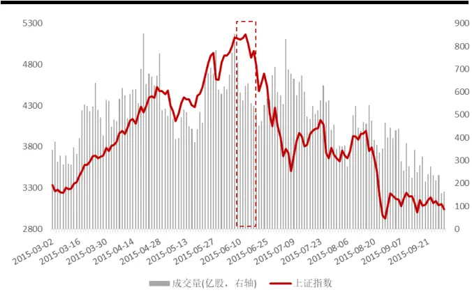
资料来源：Wind，方正证券研究所

图表2： “地量地价”案例
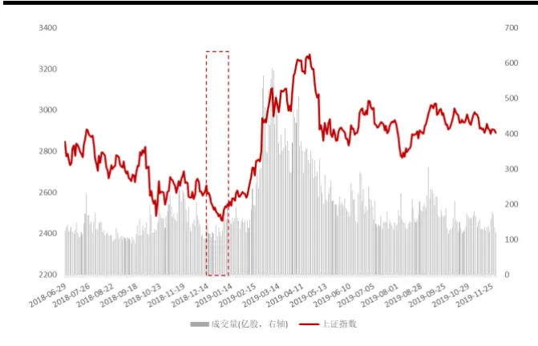
资料来源：Wind，方正证券研究所

成交量的大小，可以衡量股票市场或者个股的活跃程度，并由此来观察买卖双方进入或退出市场的状况。对于A 股市场整体而言，投资者交易行为存在较为明显的时间特征，开盘之后成交量一般逐步下降，临近收盘再逐步提升。但对于个股而言，成交量的变化并不严格与此同步，成交量出现大幅变动的情况较为频繁。

图表3： 万得全A 指数分钟频率成交量统计（单位：亿股）
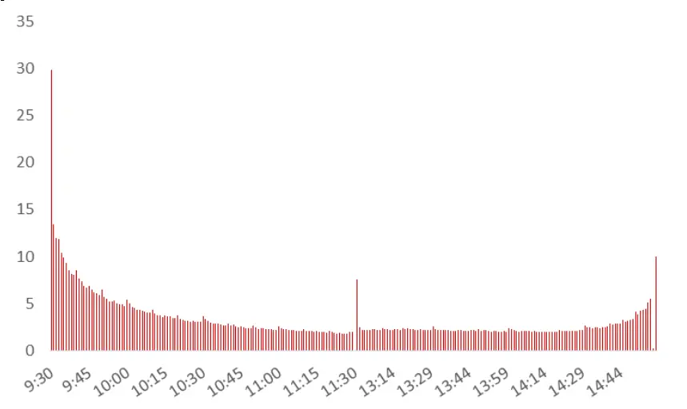
资料来源：Wind，方正证券研究所

图表4： 股票A某交易日内成交量的变化（单位：股）
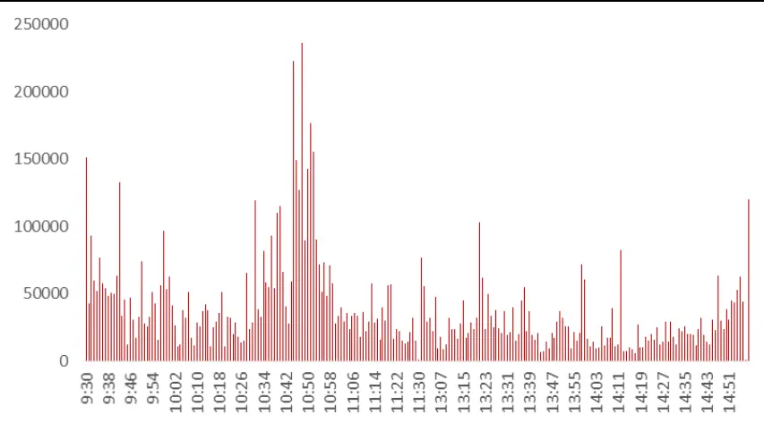
资料来源：Wind，方正证券研究所

## 2 个股日内成交量的变动宛如“潮汐”变化

对于个股而言，每个交易日的240分钟里，有的时候成交量高，有的时候成交量低。成交量高的时刻宛如大海的高潮，个股交投活跃，股票价格波动也相对较大，成交量低的时刻则犹如大海的低潮，交易较为清淡。股票交易从低成交量到高成交量，再回归低成交量的过程，仿佛平静的大海渐渐涨潮，达到顶峰后再逐步退潮的过程。我们将每天一次成交量由低到高再回到低位的过程，称为一次“潮汐”。本文我们将尝试从这一更替过程中，伴随股票价格变动，挖掘其对股票收益的潜在影响。

图表5： 潮汐要素示意图
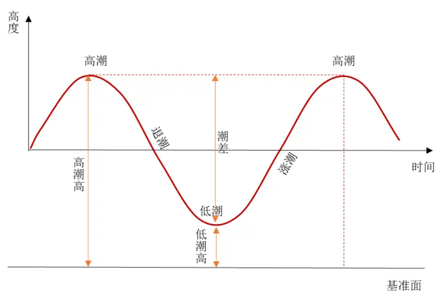
资料来源：Wind，方正证券研究所

如上所述，在个股一次“潮汐”过程中，投资者的交易热情从渐渐高涨转为逐渐冷却。当一次“潮汐”完成后，股票的投资者结构也由稳定到剧烈变动，再转为稳定。

在“潮汐”过程中，当股票价格快速下跌时，表明部分原有投资者对股票的未来走势过分悲观，因此急于抛售股票，这样的过程容易导致反应过度，进而未来可能会发生补涨；反之，当“潮汐”的过程中，股票价格出现快速上涨时，表明新进的投资者对股票的未来走势过分乐观，因此急于建仓买入，这样的过程同样容易导致反应过度。

## 3 “潮汐”因子构建及其选股效应测试

## 3.1 “潮汐”的定义

我们观察个股分钟频成交量的高点与低点来定义“涨潮”与“退潮”，具体如下：

1）剔除开盘和收盘数据，仅考虑日内分钟频数据，为了减小个别异常点的影响，我们首先计算个股每分钟的成交量及其前后 4 分钟成交量的总和（共9分钟），作为该分钟“邻域成交量”。

2）假设“邻域成交量”最高点发生在第 t分钟，这一分钟称为“顶峰时刻”。

3）第5～t-1 分钟里，“邻域成交量”最低点发生在第 m分钟，这一点的邻域成交量为Vm，收盘价为 Cm，这一分钟称为“涨潮时刻”，从“涨潮时刻”到“顶峰时刻”的过程记为“涨潮”。

4）第t+1～233分钟里，”邻域成交量“最低点发生在第 n分钟里，这一点的邻域成交量为Vn，收盘价为Cn，这一分钟称为“退潮时刻”，从“顶峰时刻”到“退潮时刻”的过程记为“退潮”。

5）从“涨潮时刻”到“退潮时刻”的全过程记为一次“潮汐”。

图表6： 股票A日内“潮汐”示意图
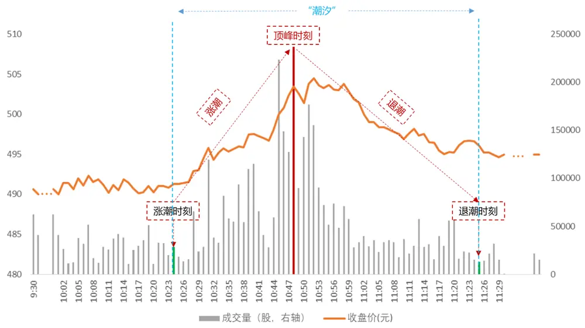
资料来源：Wind，方正证券研究所

## 3.2 “潮汐”过程的价格变动速率

我们首先来考察“潮汐”过程的价格变动速率，进而构造“全潮汐”因子，具体过程如下：

1）如上述定义，我们记“涨潮时刻”发生在第m分钟，收盘价为Cm；
“退潮时刻”发生在第 n分钟，收盘价为Cn。

2）则全部“潮汐”过程的价格变化率为(Cn-Cm)/Cm。

3）进而全“潮汐”过程的价格变动速率为(Cn-Cm)/Cm/(n-m)，我们将此作为每日投资者出售或购买股票意愿强烈程度的代理变量。

4）我们计算最近20个交易日的价格变动速率的平均值，记为“全潮汐”因子。

接下来我们将对上述构建的“全潮汐”因子进行单因子测试，我们在全A样本中按照月度频率进行测试，测试中对因子进行市值和行业正交化处理，测试区间为 2013 年 4 月至 2022 年 2 月（下同）。因子表现如下所示。

图表7： “全潮汐”因子测试

| 因子名称 | Rank IC | Rank ICIR | t值 | 年化收益率 | 年化波动率 | 信息比率 | 月度胜率 | 最大回撤 |
| --- | --- | --- | --- | --- | --- | --- | --- | --- |
| 全潮汐因子 | -7.09% | -3.73 | -8.53 | 27.11% | 9.22% | 2.94 | 84.91% | -7.36% |

资料来源：Wind，方正证券研究所

从测试结果来看，“全潮汐”因子表现出强势的选股能力，其Rank IC和Rank ICIR 分别为-7.09%、-3.73，多空组合年化收益率和月度胜率分别为27.11%、84.91%，信息比率2.94，十分组表现如下图所示。

图表8： “全潮汐”因子十分组及多空对冲净值走势
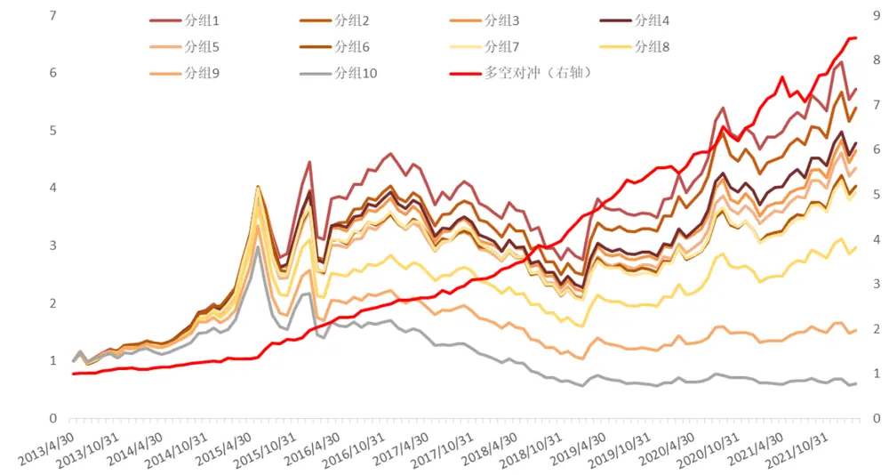
资料来源：Wind，方正证券研究所

## 3.3 对“潮汐”过程进行强弱拆分

## （1）“强势半潮汐”与“弱势半潮汐”

接下来我们考察“涨潮”与“退潮”所蕴含的能量大小，以“顶峰时刻”为界，将“潮汐”拆分成 2个“半潮汐”，进而构造“强势半潮汐”因子和“弱势半潮汐”因子，具体过程如下：

1）如上述定义，“涨潮时刻”的“邻域成交量”为 Vm，“退潮时刻”的“邻域成交量”为Vn。

2）如果Vm<Vn，则认为“涨潮”过程的起点更低，因此推动涨潮的力量需要更强大，所以我们定义“涨潮”是“强势半潮汐”，进而“退潮”就是“弱势半潮汐”。

3）反之如果Vm>Vn，则认为“退潮”过程的终点更低，因此推动退潮的力量需要更强大，所以我们定义“退潮”是“强势半潮汐”，进而“涨潮”就是“弱势半潮汐”。

图表9： 强势半潮汐示例
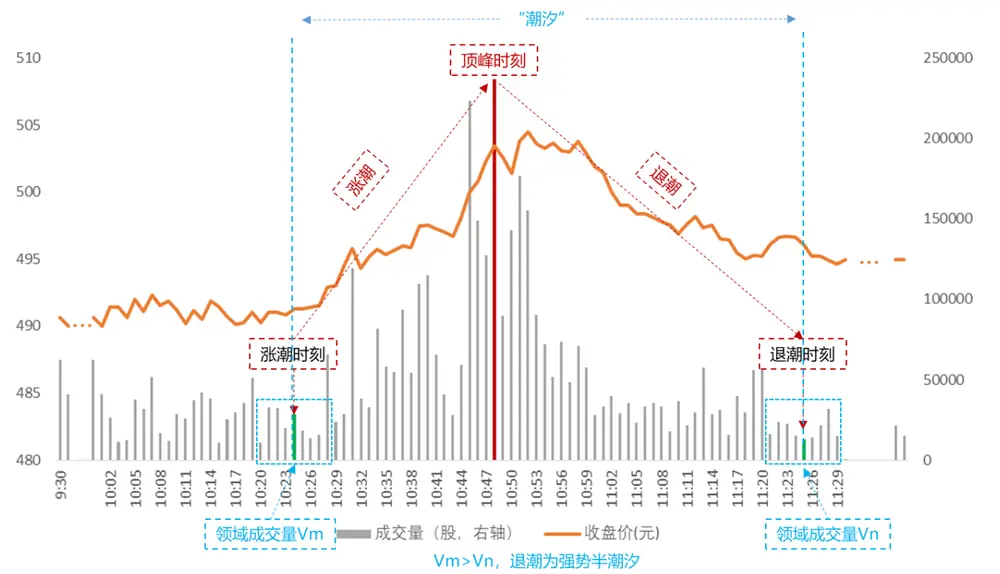
资料来源：Wind，方正证券研究所

## （2）“强势半潮汐”因子构建

我们认为，“强势半潮汐”的成交量跨度更大，需要更强的力量来推动，因此包含的信息密度也更大，用来预测未来的收益可能会更加有效。据此我们构造了“强势半潮汐”因子，具体过程如下：

1）与计算“全潮汐”因子的方法类似，我们先计算“强势半潮汐”过程的起止收盘价的涨跌幅。

2）然后将涨跌幅除以“强势半潮汐”持续的分钟数，即可得到每日推动力量更大的一部分价格变化的速率。并将此作为投资者买卖意愿相对更强烈的时间段投资者交易热情的代理变量。

3）我们计算最近20个交易日的价格变动速率的平均值，记为“强势半潮汐”因子。

我们对上述因子进行回溯测试，可以看到“强势半潮汐”因子表现同样非常出色，其 Rank IC 和 RankICIR 分别为-4.88%、-4.40，多空组合年化收益率和月度胜率分别为21.01%、83.02%，信息比率 3.38。

图表10： “强势半潮汐”因子测试

| 因子名称 | Rank IC | Rank ICIR | t值 | 年化收益率 | 年化波动率 | 信息比率 | 月度胜率 | 最大回撤 |
| --- | --- | --- | --- | --- | --- | --- | --- | --- |
| 强势半潮汐因子 | -4.88% | -4.40 | -9.87 | 21.01% | 6.21% | 3.38 | 83.02% | -3.93% |

资料来源：Wind，方正证券研究所

图表11：“强势半潮汐”因子十分组及多空对冲净值走势
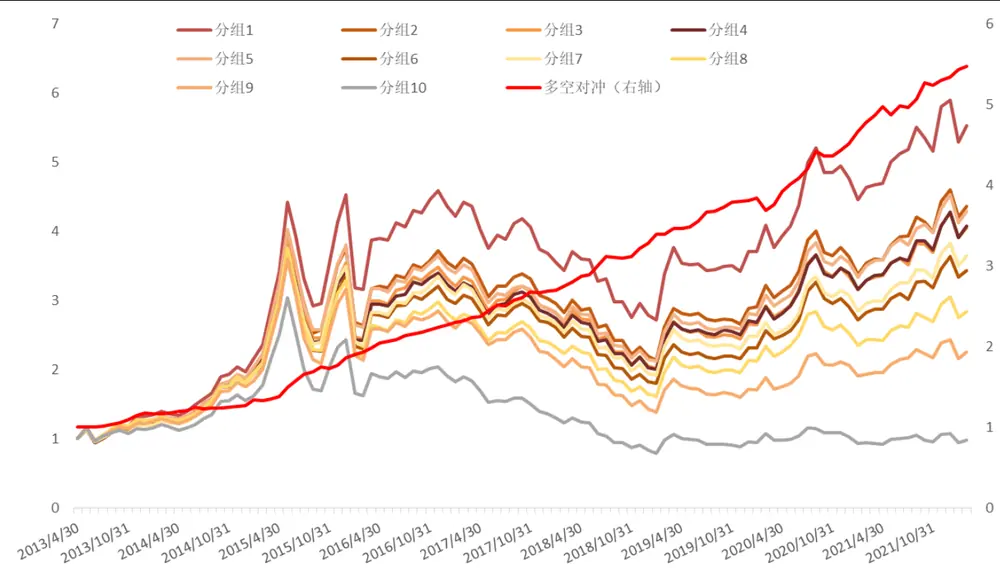
资料来源：Wind，方正证券研究所

## （3）“弱势半潮汐”因子

我们继续以同样的方法，考察交易者热情相对不那么高涨的部分—“弱势半潮汐”，挖掘这部分相对平和的交易时段所蕴含的信息。我们首先以同样的方法，计算“弱势半潮汐”过程中的价格变动速率。具体过程如下：

1）与计算“强势半潮汐”因子的方法类似，我们先计算“弱势半潮汐”过程的起止收盘价的涨跌幅。

2）然后将涨跌幅除以“弱势半潮汐”持续的分钟数，即可得到每日推动力量相对较小的一段时间内的价格变化的速率。作为投资者买卖意愿相对较弱的时段投资者交易热情的代理变量。

3）接下来我们通过两种不同的方式刻画因子，其一是我们计算最近20个交易日弱势半潮汐内的价格变动速率的平均值，其二是我们计算最近 20 个交易日的价格变动速率的标准差，并分别记为“激进弱势半潮汐”因子和“稳定弱势半潮汐”因子。

我们对上述因子进行回溯测试，可以看到“激进弱势半潮汐”因子表现较为一般，其 Rank IC 和 Rank ICIR 分别为-2.69%、-2.35，多空组合年化收益率和月度胜率分别为5.81%、71.70%，信息比率仅有 1.40。而相比之下，“稳定弱势半潮汐”因子表现则相对较好，其 Rank IC和Rank ICIR 分别为-6.97%、-3.14，多空组合年化收益率和月度胜率分别为 19.28%、74.53%，信息比率为 1.82。

图表12：“弱势半潮汐”因子测试

| 因子名称 | Rank IC | Rank ICIR | t值 | 年化收益率 | 年化波动率 | 信息比率 | 月度胜率 | 最大回撤 |
| --- | --- | --- | --- | --- | --- | --- | --- | --- |
| 激进弱势半潮汐因子 | -2.69% | -2.35 | -5.39 | 8.16% | 5.81% | 1.40 | 71.70% | 6.26% |
| 稳定弱势半潮汐因子 | -6.97% | -3.14 | -5.76 | 19.28% | 10.57% | 1.82 | 74.53% | 8.30% |

资料来源：Wind，方正证券研究所

图表13：“激进弱势半潮汐”因子十分组及多空对冲净值走势
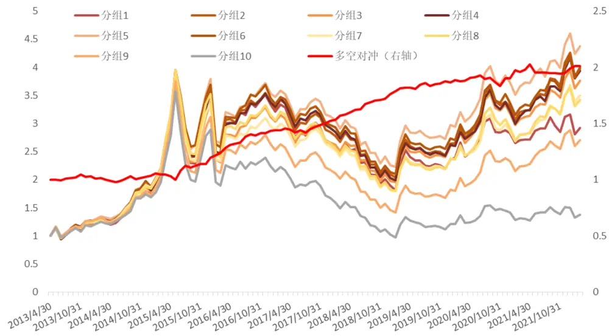
资料来源：Wind，方正证券研究所

图表14：“稳定弱势半潮汐”因子十分组及多空对冲净值走势
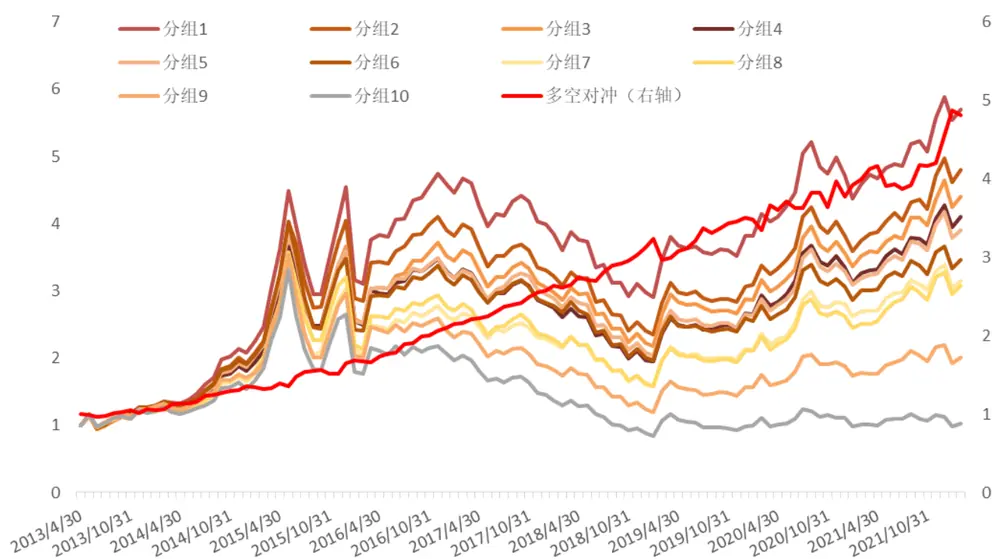
资料来源：Wind，方正证券研究所

从回测结果可见，对于“弱势半潮汐”过程，求稳是更重要的。如果我们把“弱势半潮汐”的过程看作成交量开始蓄势或渐渐消退的过程，我们更希望它可以每日保持相对稳定，为“强势半潮汐”做足准备或做好收尾。

## 3.4 “完整潮汐”因子合成

以上我们分别从投资者交易热情相对高涨及相对冷清时刻画了三个不同的细分因子，从因子表现来看，交易热情较高的时段的“强势半潮汐”因子及交易较为冷淡阶段的“稳定弱势半潮汐”因子表现均较为出色。

我们将其进行合并，等权合成为“完整潮汐”因子，合成后的因子表现如下表所示：

图表15：“完整潮汐”因子绩效

| 因子名称 | Rank IC | Rank ICIR | t值 | 年化收益率 | 年化波动率 | 信息比率 | 月度胜率 | 最大回撤 |
| --- | --- | --- | --- | --- | --- | --- | --- | --- |
| 完整潮汐因子 | -7.90% | -4.13 | -8.43 | 27.09% | 8.80% | 3.08 | 83.96% | 5.81% |

资料来源：Wind，方正证券研究所

图表16：“完整潮汐”因子十分组绩效

| 因子名称 | 累积收益率 | 年化收益率 | 年化波动率 | 信息比率 | 月度胜率 | 最大回撤 |
| --- | --- | --- | --- | --- | --- | --- |
| 分组1 | 594.05% | 24.51% | 28.32% | 0.87 | 36.95% | -58.49% |
| 分组2 | 411.61% | 20.28% | 28.20% | 0.72 | 40.87% | -57.55% |
| 分组3 | 356.69% | 18.75% | 28.16% | 0.67 | 41.30% | -56.60% |
| 分组4 | 327.38% | 17.86% | 27.98% | 0.64 | 44.70% | -57.55% |
| 分组5 | 319.13% | 17.60% | 27.90% | 0.63 | 46.05% | -58.49% |
| 分组6 | 274.84% | 16.13% | 29.14% | 0.55 | 50.20% | -53.77% |
| 分组7 | 268.82% | 15.91% | 28.93% | 0.55 | 52.02% | -54.72% |
| 分组8 | 172.19% | 12.00% | 29.51% | 0.41 | 57.21% | -50.94% |
| 分组9 | 67.07% | 5.98% | 30.82% | 0.19 | 67.94% | -50.00% |
| 分组10 | -27.61% | -3.59% | 31.27% | -0.11 | 78.12% | -49.06% |

资料来源：Wind，方正证券研究所

合成之后的“完整潮汐”因子表现非常出色，RankIC 为-7.90%、RankICIR 为-4.13，多空组合年化收益率达 27.09%，信息比 3.08，因子月度胜率为 83.96%。

图表17：“完整潮汐”因子十分组及多空对冲净值走势
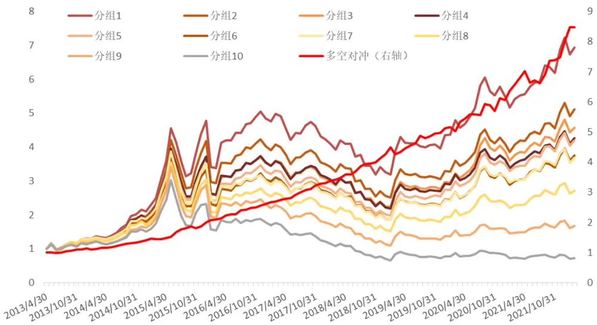
资料来源：Wind，方正证券研究所

分年度来看，“完整潮汐”因子各年份表现均较为显著，各分组表现整体单调性较为明显。

图表18：“完整潮汐”分年度表现

|  | 年份 | 分组1 | 分组2 分组3 分组4 分组5 |  |  |  | 分组6 | 分组7 | 分组8 | 分组9 | 分组10 | 多空组合 |
| --- | --- | --- | --- | --- | --- | --- | --- | --- | --- | --- | --- | --- |
|  | 2013年 | 29.47% | 23.23% | 26.81% | 26.91% | 21.63% | 26.77% | 28.47% | 23.68% | 14.79% | 13.13% | 14.51% |
|  | 2014年 | 62.41% | 58.31% | 43.75% | 48.34% | 46.34% | 41.36% | 47.02% | 39.03% | 42.17% | 32.49% | 22.94% |
|  | 2015年 | 127.55% | 113.98% | 104.05% | 97.26% | 97.61% | 85.96% | 86.22% | 77.06% | 77.03% | 54.95% | 42.58% |
|  | 2016年 | 1.41% | -3.67% | -4.97% | -4.28% | -6.99% | -8.81% | -14.46% | -13.83% | -20.22% | -23.69% | 30.29% |
|  | 2017年 | -12.77% | -13.05% | -13.17% | -11.95% | -14.10% | -11.42% | -11.65% | -15.36% | -22.43% | -31.50% | 26.43% |
|  | 2018年 | -23.09% | -26.78% | -26.23% | -28.94% | -28.19% | -30.19% | -29.51% | -29.84% | -36.28% | -41.26% | 29.19% |
|  | 2019年 | 33.73% | 28.85% | 30.89% | 31.05% | 36.16% | 30.60% | 30.56% | 24.73% | 20.87% | 9.37% | 20.00% |
|  | 2020年 | 26.28% | 24.14% | 30.87% | 25.00% | 27.17% | 26.48% | 28.12% | 21.25% | 15.73% | 5.35% | 18.27% |
| 2021年 |  | 31.59% | 29.65% | 23.89% | 22.85% | 26.53% | 27.26% | 25.55% | 24.47% | 15.03% | -1.87% | 31.99% |
| 2022年 |  | -4.04% | -3.63% | -4.96% | -4.52% | -5.19% -5.12% |  | -6.28% | -7.18% | -8.87% | -10.22% | 5.97% |

资料来源：Wind，方正证券研究所

## 3.5 剥离其他风格因子影响后“完整潮汐”因子仍然表现较好

从上述测试结果来看，“完整潮汐”因子选股能力出色，进一步，我们测试其与其他常见风格因子的相关性，如下图所示，“完整潮汐”因子与波动率和换手率均有较高的相关性，与其他风格因子相关系数均较低。为进一步验证因子的增量信息，我们使用常用风格因子及行业因子对“完整潮汐”因子进行正交化处理，得到“纯净完整潮汐”因子，再检验其选股能力。

图表19：与常见风格因子相关性测试
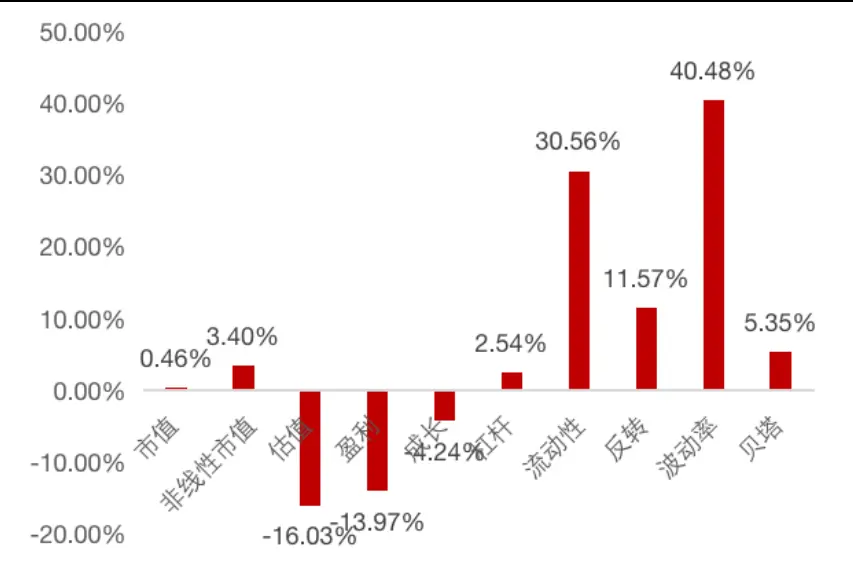
资料来源：Wind，方正证券研究所

图表20：剥离常见风格因子影响后“完整潮汐”因子绩效

| 因子名称 | Rank IC | Rank ICIR | t值 | 年化收益率 | 年化波动率 | 信息比率 | 月度胜率 | 最大回撤 |
| --- | --- | --- | --- | --- | --- | --- | --- | --- |
| 纯净完整潮汐因子 | -3.47% | -2.72 | -7.18 | 14.77% | 5.84% | 2.53 | 78.30% | -5.99% |

资料来源：Wind，方正证券研究所

可以看到，在剔除了常用的风格因子影响后，“完整潮汐”因子仍然具有较强的选股能力，Rank IC 均值为-3.47%，Rank ICIR 为-2.72，多空组合年化收益率14.77%，信息比率2.53。

图表21：“纯净完整潮汐”因子十分组及多空对冲净值走势
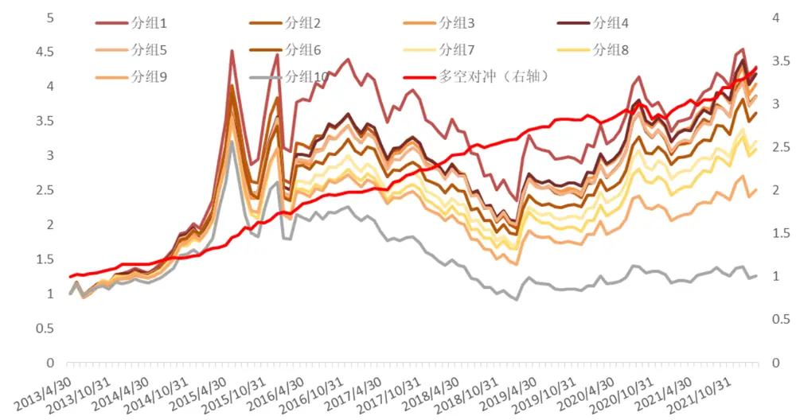
资料来源：Wind，方正证券研究所

## 3.6 “完整潮汐”因子在不同样本空间下的表现

为了检验“完整潮汐”因子在其他样本空间下的选股表现，我们分别选取了沪深 300 成分股、中证 500 成分股、中证 1000 成分股作为股票池，测试其选股能力，可以看到“完整潮汐”因子在不同样本空间下均表现出较好的选股能力，相较而言，中证 1000 指数成分股内表现更为出色，其 Rank IC 为-6.22%，Rank ICIR 为-3.70，多头组合年化超额收益达13.01%。

图表22：不同样本空间下“完整潮汐”因子表现

| 样本空间 | Rank IC | Rank ICIR | t值 | 年化收益率 | 年化波动率 | 信息比率 | 月度胜率 | 最大回撤 |
| --- | --- | --- | --- | --- | --- | --- | --- | --- |
| 沪深300成分股 | -4.21% | -1.79 | -3.58 | 11.80% | 10.33% | 1.14 | 61.32% | -16.87% |
| 中证500成分股 | -5.51% | -2.70 | -5.21 | 14.71% | 10.07% | 1.46 | 69.81% | -13.09% |
| 中证1000成分股 | -6.22% | -3.70 | -5.60 | 17.51% | 9.36% | 1.87 | 74.53% | -9.43% |

资料来源：Wind，方正证券研究所

图表23：不同样本空间下“完整潮汐”因子多头超额表现

| 样本空间 | 累积收益率 | 年化收益率 | 年化波动率 | 信息比率 | 月度胜率 | 最大回撤 |
| --- | --- | --- | --- | --- | --- | --- |
| 沪深300多头超额 | 56.82% | 5.12% | 10.73% | 0.48 | 54.13% | -17.69% |
| 中证500多头超额 | 35.40% | 3.42% | 6.42% | 0.53 | 55.96% | -15.00% |
| 中证1000多头超额 | 200.75% | 13.01% | 7.62% | 1.71 | 71.56% | -7.04% |

资料来源：Wind，方正证券研究所

图表24：沪深 300/中证 500/中证 1000指数成分股内多空表现
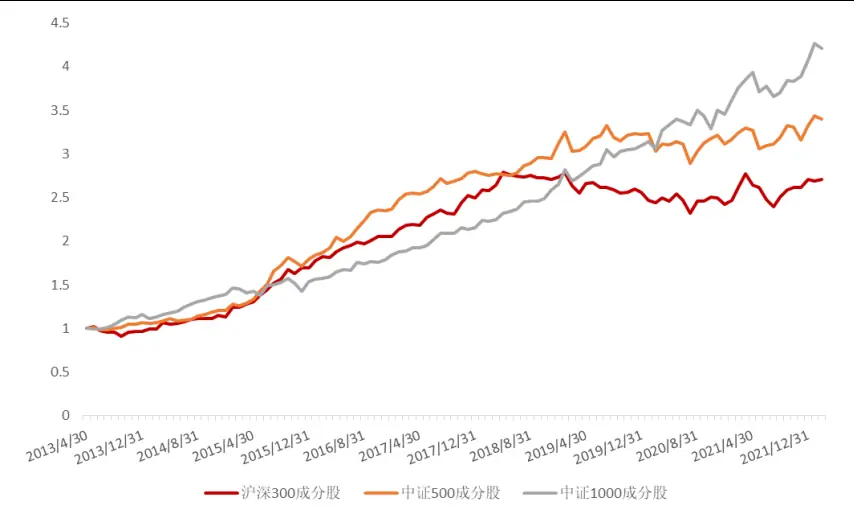
资料来源：Wind，方正证券研究所

## 4 风险提示

本报告基于历史数据分析，历史规律未来可能存在失效的风险；市场可能发生超预期变化；各驱动因子受环境影响可能存在阶段性失效的风险。

## 5 感谢

感谢实习生陈宗伟对本报告的贡献。

## 分析师声明

作者具有中国证券业协会授予的证券投资咨询执业资格，保证报告所采用的数据和信息均来自公开合规渠道，分析逻辑基于作者的职业理解，本报告清晰准确地反映了作者的研究观点，力求独立、客观和公正，结论不受任何第三方的授意或影响。研究报告对所涉及的证券或发行人的评价是分析师本人通过财务分析预测、数量化方法、或行业比较分析所得出的结论，但使用以上信息和分析方法存在局限性。特此声明。

## 免责声明

本研究报告由方正证券制作及在中国（香港和澳门特别行政区、台湾省除外）发布。根据《证券期货投资者适当性管理办法》，本报告内容仅供我公司适当性评级为C3及以上等级的投资者使用，本公司不会因接收人收到本报告而视其为本公司的当然客户。若您并非前述等级的投资者，为保证服务质量、控制风险，请勿订阅本报告中的信息，本资料难以设置访问权限，若给您造成不便，敬请谅解。

在任何情况下，本报告的内容不构成对任何人的投资建议，也没有考虑到个别客户特殊的投资目标、财务状况或需求，方正证券不对任何人因使用本报告所载任何内容所引致的任何损失负任何责任，投资者需自行承担风险。

本报告版权仅为方正证券所有，本公司对本报告保留一切法律权利。未经本公司事先书面授权，任何机构或个人不得以任何形式复制、转发或公开传播本报告的全部或部分内容，不得将报告内容作为诉讼、仲裁、传媒所引用之证明或依据，不得用于营利或用于未经允许的其它用途。如需引用、刊发或转载本报告，需注明出处且不得进行任何有悖原意的引用、删节和修改。

## 公司投资评级的说明：

强烈推荐：分析师预测未来半年公司股价有20%以上的涨幅；

推荐：分析师预测未来半年公司股价有10%以上的涨幅；

中性：分析师预测未来半年公司股价在-10%和10%之间波动；

减持：分析师预测未来半年公司股价有10%以上的跌幅。

## 行业投资评级的说明：

推荐：分析师预测未来半年行业表现强于沪深300指数；

中性：分析师预测未来半年行业表现与沪深300指数持平；

减持：分析师预测未来半年行业表现弱于沪深300指数。

| 地址 | 网址：https://www.foundersc.com | E-mail:yjzx@foundersc.com |
| --- | --- | --- |
| 北京 | 西城区展览馆路48号新联写字楼6层 |  |
| 上海 | 静安区延平路71号延平大厦2楼 |  |
| 上海 | 浦东新区世纪大道1168号东方金融广场 A 栋 1001 室 |  |
| 深圳 | 福田区竹子林紫竹七道光大银行大厦31层 |  |
| 广州 | 天河区兴盛路12号楼隽峰苑2期3层方正证券 |  |
| 长沙 | 天心区湘江中路二段36号华远国际中心37层 |  |